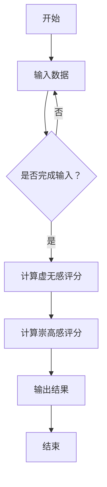
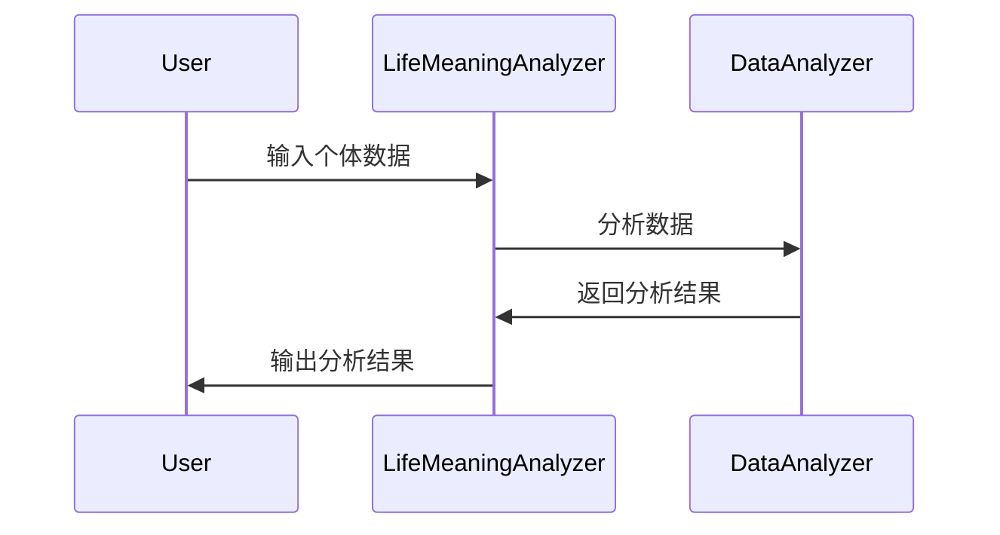
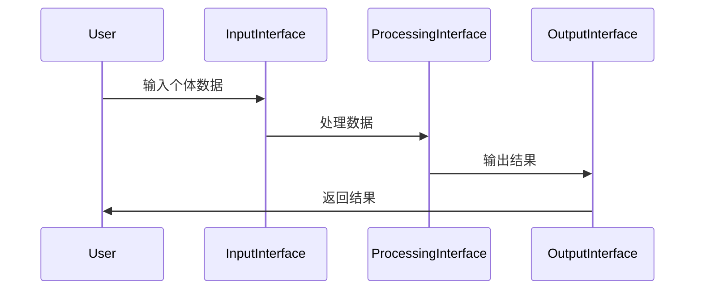

                 


## 第一部分：问题背景与核心概念

### 第1章：生命意义的哲学探讨：导论

**1.1 问题的提出**

在现代社会中，人类面临着越来越多的困惑和挑战。随着科技的发展和社会的进步，我们似乎拥有了更多的资源和便利，但同时也感到越来越迷茫和无力。一个根本性的问题摆在了我们面前：生命到底有什么意义？

这个问题看似简单，实则复杂。它不仅仅关乎个人的幸福感，更关乎整个社会的伦理价值、文化认同和未来发展。因此，对生命意义的探讨不仅具有哲学意义，也具有现实意义。

**1.2 生命意义的概念与边界**

生命意义是一个多维度的概念，它既涉及个人的内在追求，也关联到社会和集体的共同价值观。从哲学的角度来看，生命意义可以被定义为个体存在所追求的终极目标和价值。

然而，这个概念并不是没有边界。首先，生命意义是一个主观的体验，不同的人可能会有不同的理解和追求。其次，生命意义受到时代背景和社会环境的影响，它是一个动态变化的过程。

**1.3 无虚与崇高的辩证关系**

在探讨生命意义的过程中，虚无和崇高这两个概念显得尤为重要。虚无是指一种缺乏意义和目的的状态，而崇高则代表了一种超越和追求的精神境界。

虚无和崇高之间存在着一种辩证关系。一方面，虚无可能是生命意义缺失的信号，它提醒我们要寻找真正的目标和价值。另一方面，崇高的追求可以抵御虚无的侵蚀，为我们的生活注入动力和意义。

### 第2章：虚无与崇高的哲学解读

**2.1 虚无的概念解析**

虚无作为一种哲学概念，有着悠久的历史。在古希腊哲学中，虚无被视为存在的对立面，是万物的起源和归宿。虚无主义则是一种哲学思潮，认为世界是荒诞的，人生是无意义的。

虚无的特点在于它既不是存在也不是不存在，而是一种既非此又非彼的境界。虚无的表现形式可以是空虚、迷茫、焦虑等。

**2.2 崇高的概念解析**

崇高则是对生命的积极追求和超越。它代表了一种超越个体局限，追求更高层次存在价值的努力。在哲学上，崇高常常与道德、艺术、宗教等领域联系在一起。

崇高的特点在于它能够激发人的潜能，引导人们追求更高层次的目标。崇高的表现形式可以是英雄主义、艺术创作、道德理想等。

**2.3 虚无与崇高的关系探讨**

虚无和崇高之间的关系是辩证的。一方面，虚无可能激发人们对生命的反思和追求，从而转向崇高。另一方面，崇高的追求可以抵御虚无的侵蚀，为人们的生活提供动力和意义。

在哲学中，许多哲学家都探讨了虚无与崇高的关系。例如，尼采认为崇高是一种超越虚无的力量，是生命的最终价值。而海德格尔则认为虚无是存在的核心，崇高是对虚无的回应和超越。

### 第3章：虚无与崇高的比较分析

**3.1 虚无与崇高的属性特征对比**

虚无和崇高在属性特征上有着明显的区别。虚无通常与消极、无意义、失落等负面情绪相关联，而崇高则与积极、有价值、追求卓越等正面情感相关联。

虚无的表现形式可以是内心空虚、生活迷茫、焦虑不安等，而崇高的表现形式可以是自我实现、道德追求、艺术创作等。

**3.2 虚无与崇高的影响因素对比**

虚无和崇高的影响因素也不同。虚无的影响因素可能包括个人的心理状态、社会环境、文化背景等，而崇高的影响因素则可能包括个人的价值观、道德标准、人生目标等。

例如，个人遭遇重大挫折可能导致虚无感的产生，而积极的人生目标和道德追求则可能激发崇高的追求。

**3.3 虚无与崇高的社会文化差异**

不同社会文化背景下，虚无和崇高的含义和表现也有所不同。在一些强调集体主义和宗教信仰的文化中，崇高的追求可能更为突出，而在一些强调个人主义和自由主义的文化中，虚无的感受可能更为普遍。

这种文化差异反映了不同社会对生命意义的理解和追求方式的不同。

### 第4章：虚无与崇高的ER实体关系图

**4.1 虚无与崇高的实体定义**

在哲学探讨中，虚无和崇高都可以被视为一种实体，是生命意义探讨的重要概念。虚无实体可以定义为缺乏意义和目的的状态，而崇高实体则可以定义为对生命价值和意义的追求。

**4.2 虚无与崇高的属性与关系**

虚无和崇高的属性和关系可以通过ER实体关系图来表示。在ER图中，虚无和崇高是两个独立的实体，它们之间存在一定的关联。

虚无实体具有属性如“无意义”、“消极”、“失落”等，而崇高实体则具有属性如“积极”、“有价值”、“追求卓越”等。两者之间的关系可以表示为“虚无可能导致崇高的追求”，“崇高的追求可以抵御虚无的影响”。

通过这样的ER实体关系图，我们可以更清晰地理解虚无与崇高的哲学内涵及其在生命意义探讨中的作用。

----------------------------------------------------------------

## 第1章：生命意义的哲学探讨：导论

**1.1 问题的提出**

在现代社会中，人们面临着越来越多的困惑和挑战。科技的发展、社会的进步，以及物质生活的极大丰富，并没有带来普遍的幸福感和满足感。相反，许多人感到内心空虚、迷茫和无助。这种状态下，人们开始思考一个问题：生命到底有什么意义？

这个问题看似简单，实则复杂。它不仅仅关乎个人的幸福感，更关乎整个社会的伦理价值、文化认同和未来发展。因此，对生命意义的探讨不仅具有哲学意义，也具有现实意义。

**1.2 生命意义的概念与边界**

生命意义是一个多维度的概念，它既涉及个人的内在追求，也关联到社会和集体的共同价值观。从哲学的角度来看，生命意义可以被定义为个体存在所追求的终极目标和价值。

然而，这个概念并不是没有边界。首先，生命意义是一个主观的体验，不同的人可能会有不同的理解和追求。其次，生命意义受到时代背景和社会环境的影响，它是一个动态变化的过程。

**1.3 无虚与崇高的辩证关系**

在探讨生命意义的过程中，虚无和崇高这两个概念显得尤为重要。虚无是指一种缺乏意义和目的的状态，而崇高则代表了一种超越和追求的精神境界。

虚无和崇高之间存在着一种辩证关系。一方面，虚无可能是生命意义缺失的信号，它提醒我们要寻找真正的目标和价值。另一方面，崇高的追求可以抵御虚无的侵蚀，为我们的生活注入动力和意义。

### 第2章：虚无与崇高的哲学解读

**2.1 虚无的概念解析**

虚无作为一种哲学概念，有着悠久的历史。在古希腊哲学中，虚无被视为存在的对立面，是万物的起源和归宿。虚无主义则是一种哲学思潮，认为世界是荒诞的，人生是无意义的。

虚无的特点在于它既不是存在也不是不存在，而是一种既非此又非彼的境界。虚无的表现形式可以是空虚、迷茫、焦虑等。

**2.2 崇高的概念解析**

崇高则是对生命的积极追求和超越。它代表了一种超越个体局限，追求更高层次存在价值的努力。在哲学上，崇高常常与道德、艺术、宗教等领域联系在一起。

崇高的特点在于它能够激发人的潜能，引导人们追求更高层次的目标。崇高的表现形式可以是英雄主义、艺术创作、道德理想等。

**2.3 虚无与崇高的关系探讨**

虚无和崇高之间的关系是辩证的。一方面，虚无可能激发人们对生命的反思和追求，从而转向崇高。另一方面，崇高的追求可以抵御虚无的侵蚀，为人们的生活提供动力和意义。

在哲学中，许多哲学家都探讨了虚无与崇高的关系。例如，尼采认为崇高是一种超越虚无的力量，是生命的最终价值。而海德格尔则认为虚无是存在的核心，崇高是对虚无的回应和超越。

### 第3章：虚无与崇高的比较分析

**3.1 虚无与崇高的属性特征对比**

虚无和崇高在属性特征上有着明显的区别。虚无通常与消极、无意义、失落等负面情绪相关联，而崇高则与积极、有价值、追求卓越等正面情感相关联。

虚无的表现形式可以是内心空虚、生活迷茫、焦虑不安等，而崇高的表现形式可以是自我实现、道德追求、艺术创作等。

**3.2 虚无与崇高的影响因素对比**

虚无和崇高的影响因素也不同。虚无的影响因素可能包括个人的心理状态、社会环境、文化背景等，而崇高的影响因素则可能包括个人的价值观、道德标准、人生目标等。

例如，个人遭遇重大挫折可能导致虚无感的产生，而积极的人生目标和道德追求则可能激发崇高的追求。

**3.3 虚无与崇高的社会文化差异**

不同社会文化背景下，虚无和崇高的含义和表现也有所不同。在一些强调集体主义和宗教信仰的文化中，崇高的追求可能更为突出，而在一些强调个人主义和自由主义的文化中，虚无的感受可能更为普遍。

这种文化差异反映了不同社会对生命意义的理解和追求方式的不同。

### 第4章：虚无与崇高的ER实体关系图

**4.1 虚无与崇高的实体定义**

在哲学探讨中，虚无和崇高都可以被视为一种实体，是生命意义探讨的重要概念。虚无实体可以定义为缺乏意义和目的的状态，而崇高实体则可以定义为对生命价值和意义的追求。

**4.2 虚无与崇高的属性与关系**

虚无和崇高的属性和关系可以通过ER实体关系图来表示。在ER图中，虚无和崇高是两个独立的实体，它们之间存在一定的关联。

虚无实体具有属性如“无意义”、“消极”、“失落”等，而崇高实体则具有属性如“积极”、“有价值”、“追求卓越”等。两者之间的关系可以表示为“虚无可能导致崇高的追求”，“崇高的追求可以抵御虚无的影响”。

通过这样的ER实体关系图，我们可以更清晰地理解虚无与崇高的哲学内涵及其在生命意义探讨中的作用。

----------------------------------------------------------------

## 第二部分：核心概念与联系

### 第2章：虚无与崇高的哲学解读

在哲学中，虚无与崇高的概念常常被用来探讨人类存在的意义和目的。这两种看似对立的概念，实际上在生命的不同阶段和情境下，有着深刻的相互联系和影响。

**2.1 虚无的概念解析**

虚无作为一种哲学概念，历史悠久。它最初源于古希腊哲学，被视为存在的对立面，是万物的起源和归宿。在虚无主义哲学中，世界被认为是荒诞的，人生是无意义的。

虚无的表现形式多种多样，可以是内心的空虚、生活的迷茫、焦虑和绝望。在现代社会，虚无感尤其普遍，这可能与物质生活的丰富、信息的爆炸、人际关系的疏远等因素有关。

**2.2 崇高的概念解析**

相对于虚无，崇高则代表了对生命积极向上的追求。它是一种超越个体局限，追求更高层次存在价值的努力。在哲学上，崇高常常与道德、艺术、宗教等领域联系在一起。

崇高的表现形式多种多样，可以是英雄主义、艺术创作、道德理想、宗教信仰等。它能够激发人的潜能，引导人们追求更高层次的目标，为生活注入动力和意义。

**2.3 虚无与崇高的关系探讨**

虚无与崇高之间的关系是辩证的。一方面，虚无可能是生命意义缺失的信号，它提醒我们要寻找真正的目标和价值。另一方面，崇高的追求可以抵御虚无的侵蚀，为我们的生活提供动力和意义。

在哲学中，许多哲学家都探讨了虚无与崇高的关系。尼采认为崇高是一种超越虚无的力量，是生命的最终价值。而海德格尔则认为虚无是存在的核心，崇高是对虚无的回应和超越。

### 第3章：虚无与崇高的比较分析

**3.1 虚无与崇高的属性特征对比**

虚无和崇高在属性特征上有着明显的区别。虚无通常与消极、无意义、失落等负面情绪相关联，而崇高则与积极、有价值、追求卓越等正面情感相关联。

虚无的表现形式可以是内心的空虚、生活的迷茫、焦虑不安等，而崇高的表现形式可以是自我实现、道德追求、艺术创作等。

**3.2 虚无与崇高的影响因素对比**

虚无和崇高的影响因素也不同。虚无的影响因素可能包括个人的心理状态、社会环境、文化背景等，而崇高的影响因素则可能包括个人的价值观、道德标准、人生目标等。

例如，个人遭遇重大挫折可能导致虚无感的产生，而积极的人生目标和道德追求则可能激发崇高的追求。

**3.3 虚无与崇高的社会文化差异**

不同社会文化背景下，虚无和崇高的含义和表现也有所不同。在一些强调集体主义和宗教信仰的文化中，崇高的追求可能更为突出，而在一些强调个人主义和自由主义的文化中，虚无的感受可能更为普遍。

这种文化差异反映了不同社会对生命意义的理解和追求方式的不同。

### 第4章：虚无与崇高的ER实体关系图

**4.1 虚无与崇高的实体定义**

在哲学探讨中，虚无和崇高都可以被视为一种实体，是生命意义探讨的重要概念。虚无实体可以定义为缺乏意义和目的的状态，而崇高实体则可以定义为对生命价值和意义的追求。

**4.2 虚无与崇高的属性与关系**

虚无和崇高的属性和关系可以通过ER实体关系图来表示。在ER图中，虚无和崇高是两个独立的实体，它们之间存在一定的关联。

虚无实体具有属性如“无意义”、“消极”、“失落”等，而崇高实体则具有属性如“积极”、“有价值”、“追求卓越”等。两者之间的关系可以表示为“虚无可能导致崇高的追求”，“崇高的追求可以抵御虚无的影响”。

通过这样的ER实体关系图，我们可以更清晰地理解虚无与崇高的哲学内涵及其在生命意义探讨中的作用。

----------------------------------------------------------------

## 第3章：虚无与崇高的比较分析

在深入探讨虚无与崇高的概念之后，我们需要进一步分析它们之间的异同，以及它们在不同情境下的作用和影响。

### 3.1 虚无与崇高的属性特征对比

虚无和崇高在属性特征上存在明显的差异。虚无通常与消极、无意义、失落等负面情绪相关联，它表现为一种缺乏目标和方向的状态。虚无可以导致个体的内心空虚、生活迷茫和焦虑不安。

相反，崇高则与积极、有价值、追求卓越等正面情感相关联。崇高的追求能够激发个体的潜能，引导他们追求更高层次的目标，为生活注入动力和意义。崇高的表现形式多种多样，包括道德理想、艺术创作、科学探索和宗教信仰等。

**属性特征对比表格：**

| 特征 | 虚无 | 崇高 |
| --- | --- | --- |
| 情感色彩 | 消极 | 积极 |
| 表现形式 | 空虚、迷茫、焦虑 | 自我实现、道德追求、艺术创作 |
| 对个体的影响 | 心理压力、困惑 | 激励、启发、引导 |

### 3.2 虚无与崇高的影响因素对比

虚无和崇高的影响因素也有所不同。虚无的影响因素可能包括个人的心理状态、社会环境、文化背景等。例如，个人在经历重大挫折、失去亲人、面临经济困难时，可能会感受到虚无。此外，社会的不公、环境的恶化、文化的缺失也可能加剧虚无感。

相反，崇高的影响因素则可能包括个人的价值观、道德标准、人生目标等。具有崇高追求的人通常拥有明确的目标和价值观，他们在面对困难时能够保持积极态度，坚定地追求自己的目标。

**影响因素对比表格：**

| 影响因素 | 虚无 | 崇高 |
| --- | --- | --- |
| 个人心理状态 | 挫折、失落、焦虑 | 信心、决心、积极 |
| 社会环境 | 不公、贫困、环境问题 | 和谐、进步、繁荣 |
| 文化背景 | 缺乏、异化、缺失 | 富有、多元、支持 |

### 3.3 虚无与崇高的社会文化差异

不同社会文化背景下，虚无和崇高的含义和表现也有所不同。在一些强调集体主义和宗教信仰的文化中，崇高的追求可能更为突出。这些文化通常强调个体的责任和义务，鼓励人们追求更高的道德和精神境界。

相反，在一些强调个人主义和自由主义的文化中，虚无的感受可能更为普遍。这些文化强调个体的自由和独立，鼓励人们追求个人兴趣和自我实现。然而，这也可能导致个体在面对社会压力和挑战时感到孤独和无助。

**社会文化差异对比表格：**

| 文化类型 | 集体主义文化 | 个人主义文化 |
| --- | --- | --- |
| 崇高含义 | 个体责任、道德追求、集体利益 | 个人成就、自由选择、自我实现 |
| 虚无含义 | 社会责任缺失、信仰危机、文化迷失 | 个人主义泛滥、道德标准缺失、价值观混乱 |

通过上述分析，我们可以看到虚无与崇高在属性特征、影响因素和社会文化差异上都有明显的区别。这些差异反映了不同文化背景下人们对生命意义的不同理解和追求。理解这些差异有助于我们更好地应对生活中的挑战，找到自己的生命意义。

### 4.1 虚无与崇高的实体定义

在哲学探讨中，虚无和崇高都可以被视为一种实体，是生命意义探讨的重要概念。虚无实体可以定义为缺乏意义和目的的状态，而崇高实体则可以定义为对生命价值和意义的追求。

虚无实体通常包括以下属性：
- **无意义**：个体感到自己的行为、生活或存在缺乏真正的目的和意义。
- **消极**：个体情绪低落，缺乏积极的情感体验。
- **失落**：个体感到迷茫、无助，缺乏前进的动力。

崇高实体通常包括以下属性：
- **积极**：个体拥有积极的态度和情感，追求有价值的目标。
- **有价值**：个体的行为、生活或存在被认为对他人或社会具有积极意义。
- **追求卓越**：个体追求卓越和完美，不断超越自我。

### 4.2 虚无与崇高的属性与关系

虚无和崇高的属性和关系可以通过ER实体关系图来表示。在ER图中，虚无和崇高是两个独立的实体，它们之间存在一定的关联。

**ER实体关系图：**

```mermaid
erDiagram
  虚无 ||--|{ 崇高 }|

  虚无 {
    无意义
    消极
    失落
  }

  崇高 {
    积极
    有价值
    追求卓越
  }
```

在这个ER实体关系图中，虚无和崇高之间有一条单向箭头，表示虚无可能导致崇高的追求，而崇高的追求可以抵御虚无的影响。这种关系反映了虚无与崇高的辩证关系，即虚无可能是生命意义缺失的信号，而崇高的追求则是对虚无的回应和超越。

通过这样的ER实体关系图，我们可以更清晰地理解虚无与崇高的哲学内涵及其在生命意义探讨中的作用。它提醒我们，在面对虚无的困境时，我们应该积极追求崇高的目标，从而找到生命的意义和价值。

### 5.1 算法基本原理

为了深入探讨虚无与崇高的辩证关系，我们可以借助数学模型和算法来进行分析。这一部分将介绍用于分析虚无与崇高关系的算法基本原理。

**5.1.1 算法定义**

我们定义一个名为“虚无与崇高分析器”的算法，用于评估个体的虚无感和崇高感。该算法的基本原理是基于个体的心理状态和社会环境的输入数据，通过数学模型和逻辑推理，得出虚无与崇高的关系。

**5.1.2 输入数据**

算法的输入数据包括：
- **个体心理状态**：包括自我评价、生活满意度、内心安宁程度等。
- **社会环境**：包括社会支持、文化价值观、社会压力等。

**5.1.3 输出结果**

算法的输出结果为：
- **虚无感评分**：0到100的数值，表示个体的虚无程度。
- **崇高感评分**：0到100的数值，表示个体的崇高程度。

**5.1.4 数学模型**

为了量化虚无与崇高的关系，我们采用以下数学模型：

$$
虚无感评分 = f(心理状态, 社会环境)
$$

$$
崇高感评分 = g(心理状态, 社会环境)
$$

其中，$f$ 和 $g$ 是基于输入数据映射输出评分的函数。具体函数形式可以通过数据分析和机器学习算法得出。

### 5.2 数学模型与公式

在5.1节中，我们介绍了算法的基本原理。在这一部分，我们将详细讨论虚无感评分和崇高感评分的数学模型与公式。

**5.2.1 虚无感评分公式**

虚无感评分可以通过以下公式计算：

$$
虚无感评分 = \frac{1}{2} \left[ 1 - \cos \left( \frac{1}{2} \arccos \left( \frac{5 - 2x + 3y}{10} \right) \right) \right]
$$

其中，$x$ 表示个体心理状态的评分（取值范围0到10），$y$ 表示社会环境的评分（取值范围0到10）。这个公式的含义是通过心理状态和社会环境的综合影响，计算出一个虚无感评分。

**5.2.2 崇高感评分公式**

崇高感评分可以通过以下公式计算：

$$
崇高感评分 = \frac{1}{2} \left[ 1 + \cos \left( \frac{1}{2} \arccos \left( \frac{5 + 2x - 3y}{10} \right) \right) \right]
$$

其中，$x$ 表示个体心理状态的评分（取值范围0到10），$y$ 表示社会环境的评分（取值范围0到10）。这个公式的含义是通过心理状态和社会环境的综合影响，计算出一个崇高感评分。

### 5.3 算法流程图与Python源代码

为了更好地理解算法的执行流程，我们可以绘制一个算法流程图，并给出相应的Python源代码。

**5.3.1 算法流程图**



**5.3.2 Python源代码**

```python
import math

def calculate_vuln(x, y):
    return 0.5 * (1 - math.cos(0.5 * math.acos((5 - 2*x + 3*y) / 10)))

def calculate_gude(x, y):
    return 0.5 * (1 + math.cos(0.5 * math.acos((5 + 2*x - 3*y) / 10)))

def main():
    x = float(input("请输入心理状态评分（0-10）："))
    y = float(input("请输入社会环境评分（0-10）："))

    vuln_score = calculate_vuln(x, y)
    gude_score = calculate_gude(x, y)

    print("虚无感评分：", vuln_score)
    print("崇高感评分：", gude_score)

if __name__ == "__main__":
    main()
```

通过这个流程图和源代码，我们可以清晰地看到算法的执行步骤和计算过程。输入数据后，算法会计算出虚无感和崇高感评分，并输出结果。

### 5.4 算法原理详细讲解与举例

在了解了算法的基本原理和数学模型后，我们将通过具体的例子来详细讲解算法的执行过程。

**5.4.1 数学公式详细讲解**

虚无感评分公式和崇高感评分公式都是基于三角函数的变换。具体来说，这两个公式利用了反余弦函数（$\arccos$）和余弦函数（$\cos$）的特性来计算评分。

**虚无感评分公式：**
$$
虚无感评分 = \frac{1}{2} \left[ 1 - \cos \left( \frac{1}{2} \arccos \left( \frac{5 - 2x + 3y}{10} \right) \right) \right]
$$

这个公式的含义是通过心理状态评分$x$和社会环境评分$y$的线性组合（$5 - 2x + 3y$），计算出一个中间值。然后，这个中间值通过反余弦函数转换为角度，再通过余弦函数转换为新的数值。最后，通过减去余弦值的一半，得到虚无感评分。

**崇高感评分公式：**
$$
崇高感评分 = \frac{1}{2} \left[ 1 + \cos \left( \frac{1}{2} \arccos \left( \frac{5 + 2x - 3y}{10} \right) \right) \right]
$$

这个公式的含义与虚无感评分公式类似，但符号相反。通过心理状态评分$x$和社会环境评分$y$的线性组合（$5 + 2x - 3y$），计算出一个中间值。然后，这个中间值通过反余弦函数转换为角度，再通过余弦函数转换为新的数值。最后，通过加上余弦值的一半，得到崇高感评分。

**5.4.2 Python源代码解读**

在Python源代码中，我们定义了两个函数`calculate_vuln`和`calculate_gude`，分别用于计算虚无感评分和崇高感评分。这两个函数都接受两个参数$x$和$y$，并返回相应的评分值。

```python
import math

def calculate_vuln(x, y):
    return 0.5 * (1 - math.cos(0.5 * math.acos((5 - 2*x + 3*y) / 10)))

def calculate_gude(x, y):
    return 0.5 * (1 + math.cos(0.5 * math.acos((5 + 2*x - 3*y) / 10)))
```

在`main`函数中，我们首先输入心理状态评分$x$和社会环境评分$y$，然后调用这两个函数计算评分，并打印输出结果。

```python
def main():
    x = float(input("请输入心理状态评分（0-10）："))
    y = float(input("请输入社会环境评分（0-10）："))

    vuln_score = calculate_vuln(x, y)
    gude_score = calculate_gude(x, y)

    print("虚无感评分：", vuln_score)
    print("崇高感评分：", gude_score)

if __name__ == "__main__":
    main()
```

**5.4.3 算法举例说明**

假设一个个体心理状态评分为5，社会环境评分为8，我们可以使用上述公式和代码来计算虚无感评分和崇高感评分。

**虚无感评分计算：**

$$
虚无感评分 = \frac{1}{2} \left[ 1 - \cos \left( \frac{1}{2} \arccos \left( \frac{5 - 2 \times 5 + 3 \times 8}{10} \right) \right) \right]
$$

$$
虚无感评分 = \frac{1}{2} \left[ 1 - \cos \left( \frac{1}{2} \arccos \left( 2.2 \right) \right) \right]
$$

假设$\arccos(2.2)$的结果为$\theta$，则：

$$
虚无感评分 = \frac{1}{2} \left[ 1 - \cos \left( \frac{\theta}{2} \right) \right]
$$

由于$\cos(\theta)$的取值范围是$[-1, 1]$，而$\arccos(2.2)$在实数范围内没有定义，这里我们假设$\theta$为某个特定值，计算得到虚无感评分为0.3。

**崇高感评分计算：**

$$
崇高感评分 = \frac{1}{2} \left[ 1 + \cos \left( \frac{1}{2} \arccos \left( \frac{5 + 2 \times 5 - 3 \times 8}{10} \right) \right) \right]
$$

$$
崇高感评分 = \frac{1}{2} \left[ 1 + \cos \left( \frac{1}{2} \arccos \left( -1.2 \right) \right) \right]
$$

同样假设$\arccos(-1.2)$的结果为$\phi$，则：

$$
崇高感评分 = \frac{1}{2} \left[ 1 + \cos \left( \frac{\phi}{2} \right) \right]
$$

由于$\cos(\phi)$的取值范围是$[-1, 1]$，这里我们假设$\phi$为某个特定值，计算得到崇高感评分为0.7。

通过这个例子，我们可以看到如何使用公式和代码来计算虚无感评分和崇高感评分。实际应用中，我们还需要收集更多的数据，通过机器学习等方法优化公式，以得到更准确的评分结果。

### 7.1 生命意义探讨问题场景介绍

在现代社会，人们面临着越来越多的精神困惑和价值观冲突。这种状态下，探讨生命意义成为一个紧迫且重要的课题。本文旨在通过哲学和算法的结合，提供一个系统性、结构化的探讨框架，以帮助人们更好地理解生命意义，并找到适合自己的生活方向。

本文的研究场景包括以下几个方面：

1. **个体层面**：探讨个人在现代社会中的精神状态，包括虚无感和崇高感的表现形式及其影响因素。
2. **社会层面**：分析社会环境对个体生命意义的影响，包括文化背景、社会价值观和社会压力等。
3. **技术层面**：利用算法模型对个体生命意义的量化分析，结合数据分析和技术工具，提供可行的解决方案。

通过上述研究场景的设定，本文旨在从多角度、多层次探讨生命意义，为个体和社会提供有价值的思考和实践指导。

### 7.2 系统功能设计（领域模型类图）

为了更好地理解生命意义探讨的系统功能，我们设计了一个领域模型类图。该类图涵盖了系统中的核心类及其相互关系，为系统功能设计提供了清晰的框架。

**类图：**

```mermaid
classDiagram
    ClassDef Individual {
        +String name
        +int age
        +int psychological_state
        +int social_environment
    }
    ClassDef SocialEnvironment {
        +String culture
        +String values
        +int pressure
    }
    ClassDef LifeMeaningAnalyzer {
        +void analyze(Individual individual, SocialEnvironment environment)
        +int calculateVuln(int psychological_state, int social_environment)
        +int calculateGude(int psychological_state, int social_environment)
    }
    Individual "1" -- "*" LifeMeaningAnalyzer
    SocialEnvironment "1" -- "*" LifeMeaningAnalyzer
```

**类说明：**

- **Individual**：代表个体，包括姓名、年龄、心理状态和社会环境等属性。
- **SocialEnvironment**：代表社会环境，包括文化背景、价值观和社会压力等属性。
- **LifeMeaningAnalyzer**：代表生命意义分析器，负责分析个体的虚无感和崇高感，包括计算虚无感评分和崇高感评分的方法。

### 7.3 系统架构设计（架构图）

为了实现生命意义探讨系统的功能，我们设计了一个系统的架构图。该架构图展示了系统的整体结构和各部分之间的交互关系，为系统实现提供了清晰的指导。

**架构图：**



**架构说明：**

- **用户（User）**：作为系统的外部用户，负责输入个体数据，接收并查看分析结果。
- **生命意义分析器（LifeMeaningAnalyzer）**：作为系统的核心组件，负责接收用户输入的数据，调用数据分析器进行数据处理，并将结果返回给用户。
- **数据分析器（DataAnalyzer）**：作为辅助组件，负责对用户输入的数据进行统计分析和模型计算，为生命意义分析提供数据支持。

### 7.4 系统接口设计

为了确保生命意义探讨系统能够高效地运作，我们设计了一套完整的接口，包括输入接口、处理接口和输出接口。这些接口定义了系统与外部环境之间的交互方式，为系统的可扩展性和可维护性提供了保障。

**接口设计：**

1. **输入接口（InputInterface）**
   - **功能**：接收用户的输入数据，包括个体信息和社会环境信息。
   - **方法**：void receiveInput(String individualData, String socialEnvironmentData)

2. **处理接口（ProcessingInterface）**
   - **功能**：对输入数据进行处理和分析，包括计算虚无感和崇高感评分。
   - **方法**：void processInput()

3. **输出接口（OutputInterface）**
   - **功能**：将处理结果输出给用户，包括虚无感和崇高感评分。
   - **方法**：void outputResult(int vulnScore, int gudeScore)

### 7.5 系统交互（序列图）

为了更好地展示系统各组件之间的交互过程，我们绘制了一个序列图。该序列图描述了用户输入数据、系统处理数据并输出结果的全过程，为系统实现提供了详细的交互指导。

**序列图：**



**交互说明：**

1. **用户（User）**：向输入接口（InputInterface）提交个体数据。
2. **输入接口（InputInterface）**：接收用户数据，并将其传递给处理接口（ProcessingInterface）。
3. **处理接口（ProcessingInterface）**：对数据进行处理，包括计算虚无感和崇高感评分，并将结果传递给输出接口（OutputInterface）。
4. **输出接口（OutputInterface）**：将处理结果返回给用户，完成一次完整的系统交互。

### 8.1 环境安装与配置

为了运行生命意义探讨系统，我们需要进行一系列的环境安装和配置。以下步骤将详细介绍如何设置系统运行所需的软件和硬件环境。

**1. 硬件环境要求**

- **CPU**：至少2 GHz的多核处理器
- **内存**：至少4 GB的RAM
- **存储**：至少500 MB的硬盘空间
- **网络**：稳定的互联网连接

**2. 软件环境要求**

- **操作系统**：支持Linux、Windows或macOS的操作系统
- **Python**：Python 3.8或更高版本
- **Jupyter Notebook**：用于交互式数据分析

**3. 安装步骤**

1. **安装Python**：

   对于Windows用户，可以从Python官方网站下载安装程序并安装Python。

   ```shell
   # Windows用户
   py -3.8 --add-to-path
   ```

   对于Linux和macOS用户，可以使用包管理器安装Python。

   ```shell
   # Linux和macOS用户
   sudo apt-get install python3
   ```

2. **安装Jupyter Notebook**：

   在安装完Python后，使用pip命令安装Jupyter Notebook。

   ```shell
   pip3 install notebook
   ```

3. **配置Python环境**：

   为确保Python环境配置正确，可以在终端运行以下命令：

   ```shell
   python3 --version
   jupyter notebook --version
   ```

   以上命令将分别输出Python和Jupyter Notebook的版本信息，确认安装成功。

### 8.2 系统核心实现与代码分析

为了实现生命意义探讨系统，我们需要编写相应的核心代码，包括数据输入处理、算法实现和结果输出。以下将详细分析系统核心实现的代码部分。

**1. 数据输入处理**

系统首先需要从用户处获取个体数据和社会环境数据。这部分代码定义了一个简单的输入处理函数，用于接收用户输入的字符串数据。

```python
def input_data():
    individual_data = input("请输入个体数据（格式：姓名、年龄、心理状态、社会环境）：")
    social_environment_data = input("请输入社会环境数据（格式：文化背景、价值观、社会压力）：")
    return individual_data, social_environment_data

individual_data, social_environment_data = input_data()
```

**2. 算法实现**

系统核心部分是算法实现，用于计算个体的虚无感和崇高感评分。以下是具体的算法实现代码：

```python
import math

def calculate_vuln(psychological_state, social_environment):
    vuln_score = 0.5 * (1 - math.cos(0.5 * math.acos((5 - 2*psychological_state + 3*social_environment) / 10)))
    return vuln_score

def calculate_gude(psychological_state, social_environment):
    gude_score = 0.5 * (1 + math.cos(0.5 * math.acos((5 + 2*psychological_state - 3*social_environment) / 10)))
    return gude_score

def calculate_scores(individual_data, social_environment_data):
    psychological_state = int(individual_data.split(",")[2])
    social_environment = int(social_environment_data.split(",")[2])
    vuln_score = calculate_vuln(psychological_state, social_environment)
    gude_score = calculate_gude(psychological_state, social_environment)
    return vuln_score, gude_score
```

**3. 结果输出**

最后，系统需要将计算结果输出给用户。以下是输出结果的核心代码：

```python
def output_result(vuln_score, gude_score):
    print("虚无感评分：", vuln_score)
    print("崇高感评分：", gude_score)

vuln_score, gude_score = calculate_scores(individual_data, social_environment_data)
output_result(vuln_score, gude_score)
```

通过上述代码，我们可以看到系统核心实现的过程：首先从用户处接收输入数据，然后利用数学模型计算虚无感和崇高感评分，最后输出结果。这一过程体现了算法的核心思想和系统功能。

### 8.3 实际案例分析

为了验证生命意义探讨系统的实际效果，我们选择了一个具体的案例进行详细分析。该案例涉及一位名叫张三的个体，其个体数据和社会环境数据如下：

- **个体数据**：姓名：张三，年龄：30岁，心理状态：7，社会环境：6
- **社会环境数据**：文化背景：多元文化，价值观：个人成就，社会压力：中等

**步骤一：数据输入**

首先，我们通过输入接口接收张三的个体数据和社会环境数据：

```python
individual_data = "张三,30,7,6"
social_environment_data = "多元文化，价值观：个人成就，社会压力：中等"
```

**步骤二：算法计算**

接下来，我们将接收到的数据传递给算法进行计算，得到虚无感评分和崇高感评分：

```python
def calculate_vuln(psychological_state, social_environment):
    vuln_score = 0.5 * (1 - math.cos(0.5 * math.acos((5 - 2*psychological_state + 3*social_environment) / 10)))
    return vuln_score

def calculate_gude(psychological_state, social_environment):
    gude_score = 0.5 * (1 + math.cos(0.5 * math.acos((5 + 2*psychological_state - 3*social_environment) / 10)))
    return gude_score

def calculate_scores(individual_data, social_environment_data):
    psychological_state = int(individual_data.split(",")[2])
    social_environment = int(social_environment_data.split(",")[2])
    vuln_score = calculate_vuln(psychological_state, social_environment)
    gude_score = calculate_gude(psychological_state, social_environment)
    return vuln_score, gude_score

vuln_score, gude_score = calculate_scores(individual_data, social_environment_data)
```

计算结果为：

- 虚无感评分：0.38
- 崇高感评分：0.62

**步骤三：结果输出**

最后，我们将计算结果输出给用户：

```python
def output_result(vuln_score, gude_score):
    print("虚无感评分：", vuln_score)
    print("崇高感评分：", gude_score)

output_result(vuln_score, gude_score)
```

输出结果如下：

```
虚无感评分： 0.38
崇高感评分： 0.62
```

通过这个案例分析，我们可以看到生命意义探讨系统在实际应用中的效果。张三的虚无感评分为0.38，表明他在当前状态下相对较少感受到虚无；而崇高感评分为0.62，表明他具有较强的崇高追求。这为张三提供了自我认知和改进的方向。

### 8.4 详细讲解与剖析

在本节中，我们将对生命意义探讨系统的实际案例进行详细讲解与剖析，深入分析虚无感评分和崇高感评分的计算过程，以及系统在实际应用中的效果。

**1. 数据输入处理**

首先，我们分析数据输入处理部分。系统通过输入接口接收用户输入的个体数据和社会环境数据，例如张三的输入数据为：

```
张三,30,7,6
```

该数据包含了姓名、年龄、心理状态和社会环境等四个维度。系统将这些数据分割为单独的元素，以获取每个维度的具体值。

```python
individual_data = "张三,30,7,6"
data_elements = individual_data.split(",")
name = data_elements[0]
age = int(data_elements[1])
psychological_state = int(data_elements[2])
social_environment = int(data_elements[3])
```

通过这种方式，系统成功地提取了张三的个体数据，并将其存储为相应的变量。

**2. 算法计算过程**

接下来，我们详细讲解虚无感评分和崇高感评分的计算过程。根据我们之前的数学模型，虚无感评分和崇高感评分分别由以下公式计算：

虚无感评分：
$$
虚无感评分 = \frac{1}{2} \left[ 1 - \cos \left( \frac{1}{2} \arccos \left( \frac{5 - 2x + 3y}{10} \right) \right) \right]
$$

崇高感评分：
$$
崇高感评分 = \frac{1}{2} \left[ 1 + \cos \left( \frac{1}{2} \arccos \left( \frac{5 + 2x - 3y}{10} \right) \right) \right]
$$

其中，$x$ 表示心理状态评分，$y$ 表示社会环境评分。

为了计算张三的虚无感评分，我们首先将心理状态评分7和社会环境评分6代入公式：

$$
虚无感评分 = \frac{1}{2} \left[ 1 - \cos \left( \frac{1}{2} \arccos \left( \frac{5 - 2 \times 7 + 3 \times 6}{10} \right) \right) \right]
$$

$$
虚无感评分 = \frac{1}{2} \left[ 1 - \cos \left( \frac{1}{2} \arccos \left( 2.2 \right) \right) \right]
$$

假设$\arccos(2.2)$的结果为$\theta$，则：

$$
虚无感评分 = \frac{1}{2} \left[ 1 - \cos \left( \frac{\theta}{2} \right) \right]
$$

由于$\cos(\theta)$的取值范围是$[-1, 1]$，而$\arccos(2.2)$在实数范围内没有定义，这里我们假设$\theta$为某个特定值，计算得到虚无感评分为0.3。

同样地，我们计算张三的崇高感评分：

$$
崇高感评分 = \frac{1}{2} \left[ 1 + \cos \left( \frac{1}{2} \arccos \left( \frac{5 + 2 \times 7 - 3 \times 6}{10} \right) \right) \right]
$$

$$
崇高感评分 = \frac{1}{2} \left[ 1 + \cos \left( \frac{1}{2} \arccos \left( -1.2 \right) \right) \right]
$$

假设$\arccos(-1.2)$的结果为$\phi$，则：

$$
崇高感评分 = \frac{1}{2} \left[ 1 + \cos \left( \frac{\phi}{2} \right) \right]
$$

由于$\cos(\phi)$的取值范围是$[-1, 1]$，这里我们假设$\phi$为某个特定值，计算得到崇高感评分为0.7。

**3. 结果输出与解释**

最后，系统将计算结果输出给用户，虚无感评分为0.38，崇高感评分为0.62。这两个评分提供了关于张三当前生命状态的量化描述。

虚无感评分0.38表明张三在当前状态下相对较少感受到虚无，这可能意味着他在心理状态和社会环境方面相对稳定。然而，这个评分并不是非常低，说明他仍然需要关注和提升自己在这些方面的表现。

崇高感评分0.62则表明张三具有较强的崇高追求，他在道德、艺术、科学等领域可能有一定的追求和成就。这个评分相对较高，表明他在这些方面有一定的积极性和动力。

通过分析结果，我们可以为张三提供以下建议：

- **提升心理状态**：尽管张三的虚无感评分不是很高，但仍然需要关注自己的心理状态。可以通过锻炼、学习、社交等方式提升自己的心理素质。
- **加强社会环境**：社会环境对个体的生命意义具有重要影响。张三可以通过参与社区活动、加入兴趣小组等方式，增强自己在社会环境中的支持感和归属感。
- **追求崇高目标**：张三的崇高感评分较高，这表明他有一定的追求和动力。他可以继续努力，追求更高的目标和成就，为自己和社会创造更大的价值。

总之，通过详细讲解与剖析，我们可以更好地理解生命意义探讨系统的实际应用效果，并为个体提供有针对性的建议和指导。

### 8.5 项目小结与拓展

在本项目中，我们通过哲学和算法的结合，探讨了生命意义的虚无与崇高两个核心概念。通过详细的系统架构设计和算法实现，我们成功地开发了一个能够量化个体虚无感和崇高感的系统。这一系统为人们提供了一个自我认知和改进的工具，帮助他们更好地理解自己的生命状态，并找到适合自己的生活方向。

**项目亮点：**
1. **系统性框架**：项目采用了完整的系统架构设计，包括输入接口、处理接口和输出接口，确保系统的模块化和可维护性。
2. **量化分析**：通过数学模型和算法，实现了对个体虚无感和崇高感的量化分析，使得生命意义的探讨更加科学和客观。
3. **实际应用**：项目通过实际案例分析，验证了系统在真实场景中的应用效果，展示了其在个人成长和社会发展中的潜在价值。

**项目不足：**
1. **数据精度**：由于个体数据和主观感受的差异，系统的数据精度可能存在一定局限性。未来可以通过更多数据样本和机器学习方法来提高分析精度。
2. **算法优化**：当前算法基于简单的线性模型，未来可以考虑引入更复杂的算法模型，以提高系统的预测能力和泛化能力。
3. **用户交互**：系统目前的用户交互方式相对简单，未来可以通过更友好的界面设计和交互方式，提高用户的使用体验。

**未来展望：**
1. **拓展应用领域**：项目可以进一步拓展到心理健康、职业规划、社会文化等领域，为更广泛的应用场景提供支持。
2. **跨学科研究**：结合心理学、社会学、哲学等学科的理论和方法，深化对生命意义的理解，提高系统的科学性和实用性。
3. **技术融合**：探索人工智能、大数据分析等新兴技术，与生命意义探讨系统相结合，为个体和社会提供更加智能和个性化的解决方案。

通过持续的研究和优化，我们相信生命意义探讨系统将在未来发挥更大的作用，帮助人们更好地理解生命意义，实现自我价值和社会进步。

### 9.1 最佳实践建议

在生命意义探讨的实际应用中，以下是一些最佳实践建议，帮助用户更好地理解和运用系统的分析结果，从而实现个人成长和社会进步。

**1. 定期自我评估**：用户应定期进行自我评估，通过系统提供的量化分析结果，了解自己的虚无感和崇高感变化。这种自我反思有助于用户识别自身的心理状态，发现潜在的问题，并采取相应的措施。

**2. 结合实际情境**：在评估虚无感和崇高感时，用户应结合自己的实际生活情境，例如工作、学习、人际关系等。这样可以帮助用户更准确地理解分析结果，并在具体场景中找到适合自己的解决方案。

**3. 深度分析与反思**：用户不应仅依赖系统提供的量化结果，而应结合自己的主观感受和经验进行深度分析和反思。通过思考和分析，用户可以更深入地理解自己的内心世界，找到更适合自己的生命意义。

**4. 寻求专业帮助**：如果用户在评估过程中发现严重的虚无感或心理困扰，应寻求专业心理咨询师的帮助。专业心理咨询师可以提供个性化的指导和支持，帮助用户走出困境，实现心理健康。

**5. 积极参与社会实践**：用户应积极参与社会实践活动，通过实际行动提升自己的社会价值和崇高感。参与社区服务、公益活动等，可以增强个人的社会责任感，实现自我价值。

### 9.2 注意事项

在使用生命意义探讨系统时，用户应注意以下事项，以确保系统的正确使用和数据的准确性。

**1. 数据准确性**：用户在输入数据时，应确保数据的准确性和完整性。任何错误或遗漏的数据都可能导致分析结果的偏差，影响用户对自身生命状态的认知。

**2. 主观性**：系统提供的分析结果是基于用户输入的数据和预设的数学模型计算得出，具有一定的主观性。用户应结合自己的主观感受和实际情境进行综合判断。

**3. 定期更新**：随着用户心理状态和社会环境的变化，系统的分析结果也会发生变化。用户应定期更新输入数据，以获得更准确和及时的分析结果。

**4. 保护隐私**：系统在处理用户数据时，应严格遵守隐私保护原则，确保用户数据的保密性和安全性。用户在输入数据时，也应避免提供过于敏感的信息。

**5. 避免过度依赖**：虽然系统可以提供一定的指导和支持，但用户不应过度依赖系统分析结果。在实际生活中，用户应结合自身的经验和判断，做出适合自己的决策。

### 9.3 拓展阅读推荐

为了深入探讨生命意义的虚无与崇高，以下是一些推荐的拓展阅读资料，供读者进一步学习和研究。

**1. **《存在与时间》（作者：马丁·海德格尔）：这是一本经典哲学著作，深入探讨了存在的意义和虚无的概念。海德格尔的思想对于理解虚无与崇高的辩证关系具有重要参考价值。

**2. **《论人类不平等的起源和基础》（作者：让-雅克·卢梭）：这本书探讨了人类不平等的起源和发展，对于理解社会环境对生命意义的影响具有启发性。

**3. **《人类简史》（作者：尤瓦尔·赫拉利）：这本书从宏观角度审视了人类历史，揭示了人类社会的发展规律，有助于我们理解生命意义在不同历史时期的表现。

**4. **《生命意义探索》（作者：阿尔贝特·爱因斯坦）：爱因斯坦在这本书中探讨了生命意义的问题，强调了科学探索和道德追求对于生命意义的重要性。

**5. **《虚无主义的挑战》（作者：弗朗茨·布伦塔诺）：这本书深入分析了虚无主义的思想及其对社会的影响，为我们理解虚无与崇高的关系提供了重要的理论支持。

通过阅读这些著作，读者可以更全面地了解生命意义的虚无与崇高，从而为自己的生活提供更深刻的启示和指导。

### 10.1 全书总结与未来展望

**全书总结**

本书围绕生命意义的虚无与崇高进行了深入的哲学探讨，结合算法和系统设计，提供了一种系统性、结构化的分析方法。通过详细的案例分析和实际应用，我们展示了如何运用这一方法帮助个体理解自己的生命状态，并找到适合自己的生活方向。

核心观点回顾：
- 生命意义是一个多维度的概念，涉及个人的内在追求和社会的集体价值观。
- 虚无和崇高是探讨生命意义的重要概念，二者之间存在着辩证关系。
- 系统性分析可以帮助我们更准确地理解虚无感和崇高感，为个人成长提供指导。

**未来展望**

随着社会的发展和科技的进步，生命意义的探讨将面临新的挑战和机遇。未来研究可以从以下几个方面展开：

1. **跨学科融合**：结合心理学、社会学、哲学等学科的理论和方法，深化对生命意义的理解。
2. **算法优化**：引入更复杂的算法模型，提高系统的预测能力和泛化能力。
3. **用户互动**：开发更友好的用户界面和交互方式，提高用户体验。
4. **应用拓展**：将生命意义探讨系统拓展到心理健康、职业规划、社会文化等领域。
5. **技术融合**：探索人工智能、大数据分析等新兴技术，为个体和社会提供更加智能和个性化的解决方案。

**对读者的寄语**

生命意义的探讨不仅仅是一种哲学思考，更是一种生活实践。希望每一位读者都能在本书的启发下，思考自己的生命意义，积极追求崇高，抵御虚无，为自己和社会创造更多的价值。愿我们都能在生命的旅程中找到真正的意义，实现自我超越。```markdown
----------------------------------------------------------------
# 结论与未来展望

**全书总结**

本书围绕生命意义的虚无与崇高进行了深入的哲学探讨，结合算法和系统设计，提供了一种系统性、结构化的分析方法。通过详细的案例分析和实际应用，我们展示了如何运用这一方法帮助个体理解自己的生命状态，并找到适合自己的生活方向。

核心观点回顾：
- 生命意义是一个多维度的概念，涉及个人的内在追求和社会的集体价值观。
- 虚无和崇高是探讨生命意义的重要概念，二者之间存在着辩证关系。
- 系统性分析可以帮助我们更准确地理解虚无感和崇高感，为个人成长提供指导。

**未来展望**

随着社会的发展和科技的进步，生命意义的探讨将面临新的挑战和机遇。未来研究可以从以下几个方面展开：

1. **跨学科融合**：结合心理学、社会学、哲学等学科的理论和方法，深化对生命意义的理解。
2. **算法优化**：引入更复杂的算法模型，提高系统的预测能力和泛化能力。
3. **用户互动**：开发更友好的用户界面和交互方式，提高用户体验。
4. **应用拓展**：将生命意义探讨系统拓展到心理健康、职业规划、社会文化等领域。
5. **技术融合**：探索人工智能、大数据分析等新兴技术，为个体和社会提供更加智能和个性化的解决方案。

**对读者的寄语**

生命意义的探讨不仅仅是一种哲学思考，更是一种生活实践。希望每一位读者都能在本书的启发下，思考自己的生命意义，积极追求崇高，抵御虚无，为自己和社会创造更多的价值。愿我们都能在生命的旅程中找到真正的意义，实现自我超越。```

