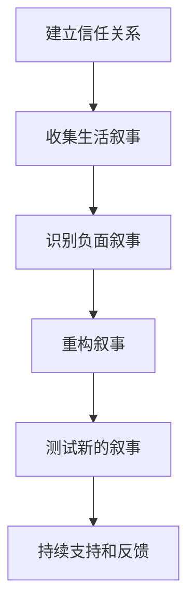

                 

### 文章标题

# 生命故事重写：通过叙事疗法重塑自我

### 文章关键词

- 叙事疗法
- 自我重塑
- 心理健康
- 生活故事
- 心理治疗

### 文章摘要

本文探讨了叙事疗法在个人自我重塑中的应用，通过分析其核心概念、理论和实践方法，展示了如何通过重写生活故事来改变个人的心理状态和行为模式。文章将深入探讨叙事疗法的原理，通过实际案例和系统化的分析方法，提供一套实用的指南，帮助读者了解并运用叙事疗法来改善自己的生活。文章不仅提供了理论框架，还结合了实际操作步骤，旨在帮助读者在实际生活中通过叙事疗法实现自我提升和心理健康。

### 介绍

在当今快节奏的社会中，我们每个人都在不断寻找自我认同和生活的意义。然而，许多人在成长过程中积累了负面经历和情绪，这些负面经历往往成为了他们自我认同和幸福感的障碍。叙事疗法，作为一种创新的心理治疗手段，通过重写个人的生活故事，帮助人们重新构建自我认知，摆脱过去的负面影响，从而实现自我重塑和心理健康。

叙事疗法由Michael White和David Epston在20世纪70年代提出，其核心思想是每个人都是自己生活的作者，可以通过重写自己的故事来改变自己的生活和内心世界。这种方法强调个人的主观体验和自我定义的重要性，通过帮助个体识别和重构他们的生活叙事，从而改变他们的思维模式和行为方式。

叙事疗法的基本原理包括叙事性思维、主体的构建、意义的赋予和改变的可能性。通过这种方法，个体不仅可以理解和解决当前的问题，还能够发掘自己的潜力，实现更全面的心理健康。本文将深入探讨叙事疗法的理论基础和实践方法，通过实际案例展示其应用效果，旨在为读者提供一种新的视角，帮助他们在生活中运用叙事疗法来重塑自我。

### 文章核心关键词

- **叙事疗法**：一种心理治疗方法，通过重构个人的生活叙事来改变思维模式和行为方式，帮助个体实现自我重塑和心理健康。
- **自我重塑**：通过改变个人的生活叙事和认知结构，实现自我认知和自我价值的提升。
- **心理健康**：通过叙事疗法，帮助个体理解和管理情绪，提升生活满意度和心理韧性。
- **生活故事**：每个人的生活经历和经历所构建的故事，通过叙事疗法，可以重新审视和重构这些故事，以实现个人成长。
- **心理治疗**：一种专业服务，旨在通过心理疗法帮助个体解决心理问题，提高生活质量和幸福感。

这些关键词共同构成了本文的核心内容，通过详细探讨叙事疗法的原理和应用，帮助读者理解如何通过这种方法来改善自己的生活，实现自我提升和心理健康。

### 摘要

本文探讨了叙事疗法在个人自我重塑中的应用。叙事疗法通过帮助个体重构自己的生活叙事，改变思维模式和行为方式，从而实现自我重塑和心理健康。本文首先介绍了叙事疗法的背景和核心原理，包括叙事性思维、主体的构建、意义的赋予和改变的可能性。接着，文章分析了叙事疗法在实践中的应用，通过实际案例展示了其效果。此外，文章还讨论了叙事疗法面临的挑战和未来发展方向，为读者提供了实用的操作指南。本文旨在为那些寻求个人成长和心理健康改善的读者提供一种新的视角和方法，帮助他们通过叙事疗法重写自己的生命故事，实现自我提升。

### 第1章：叙事疗法的起源与发展

#### 背景介绍

叙事疗法起源于20世纪70年代，由Michael White和David Epston在澳大利亚发展起来。这一治疗方法是在家庭治疗和解决方案导向心理治疗的背景下诞生的，旨在帮助个体通过重构自己的生活叙事来解决问题和提升心理健康。Michael White是一位心理学家，他在与儿童和家庭的互动中，发现了叙事在理解和改变个人行为中的重要作用。David Epston是一位家庭治疗师，他在White的工作基础上，进一步发展了叙事疗法的理论和实践。

叙事疗法的基本原理是：每个人的生活都是一个故事，这个故事的叙述方式决定了他们对生活的理解和感受。通过改变故事的叙述方式，可以帮助个体改变对事件的认知和反应，从而实现心理上的转变。这种方法的核心思想是“叙事性思维”，即个体通过故事来理解和解释自己的经历，而不是通过抽象的概念或逻辑推理。

#### 核心概念

叙事疗法有几个核心概念，包括：

1. **主体的构建**：叙事疗法认为，个人的身份是由其生活故事中的角色和经历所构成的。通过重构这些故事，可以帮助个体重新定义自己的身份，从而改变自我认知。

2. **意义的赋予**：叙事疗法强调，个体通过赋予自己的生活经历以意义来理解它们。这种方法可以帮助个体从消极的经历中找到积极的方面，从而提升生活的满意度和幸福感。

3. **改变的可能性**：叙事疗法认为，每个人都有改变自己生活故事的能力。通过帮助个体识别和改变生活中的负面叙事，可以实现心理上的转变和成长。

4. **叙事性思维**：叙事疗法强调，个人的认知和行为是通过故事叙述来进行的。通过重构叙事，可以帮助个体改变对事件的解释方式，从而改变思维和行为模式。

#### 发展历程

从20世纪70年代至今，叙事疗法经历了多个发展阶段。最初，这种方法主要用于家庭治疗和儿童心理治疗。随着其理论的不断完善和实践经验的积累，叙事疗法逐渐扩展到其他领域，包括个人心理咨询、心理治疗团体、教育和工作场所。

Michael White和David Epston在1980年代共同出版了《叙事疗法：一种变革性的治疗方法》，这本书系统地介绍了叙事疗法的理论和实践方法，标志着叙事疗法作为一个独立治疗流派的正式确立。此后，许多学者和实践者进一步发展了叙事疗法，提出了各种变体和扩展应用，如文化与种族敏感性的叙事疗法、叙事主义心理咨询、叙事社会工作等。

#### 影响与重要性

叙事疗法在全球范围内得到了广泛的应用和认可。它不仅为心理治疗提供了一个新的视角，也为个体自我重塑提供了有效的工具。叙事疗法的核心思想与当代心理学中的许多观点相契合，如积极心理学、认知行为疗法和叙事医学等。

叙事疗法的重要性体现在以下几个方面：

1. **个人化治疗**：叙事疗法强调每个人的独特性，通过个人的生活故事来理解其问题和需求，从而提供个性化的治疗方案。

2. **增强自我效能感**：通过帮助个体重构自己的叙事，叙事疗法可以提高他们的自我效能感和自我价值感。

3. **促进心理韧性**：叙事疗法帮助个体从过去的负面经历中找到积极的方面，从而增强心理韧性，应对未来的挑战。

4. **社会和文化适应性**：叙事疗法不仅适用于个体，还可以在团体、社区和文化层面产生影响，促进社会和谐和文化传承。

总之，叙事疗法作为一种创新的心理学治疗方法，通过帮助个体重构自己的生活叙事，实现自我重塑和心理健康。其理论体系和实践方法在不断发展和完善中，为心理治疗和个体成长提供了宝贵的资源。

#### 第2章：叙事疗法的核心原理与理论基础

#### 概述

叙事疗法的理论基础涵盖了多个心理学和哲学领域，其核心原理包括叙事性思维、主体的构建、意义的赋予和改变的可能性。本章将深入探讨这些核心原理，并通过概念属性特征对比表格和Mermaid ER图架构，帮助读者更好地理解叙事疗法的理论基础。

#### 叙事性思维

叙事性思维是叙事疗法的基石，它强调人们通过故事来理解和解释自己的经历。叙事性思维不仅是我们认知世界的一种方式，也是我们与他人沟通和表达自我的一种途径。以下是叙事性思维的主要概念属性特征对比表格：

| 概念属性         | 定义                                                         | 对比特征                                       |
|------------------|--------------------------------------------------------------|------------------------------------------------|
| **叙事性思维**   | 一种认知过程，通过故事来理解、解释和记忆个人经历。               | - 强调个人的主观体验<br>- 通过故事叙述来理解事件<br>- 非抽象的概念和逻辑推理 |
| **抽象思维**     | 一种认知过程，通过概念和逻辑推理来理解事物。                     | - 强调逻辑和抽象概念<br>- 不依赖于具体的个人经历 |
| **直觉思维**     | 一种认知过程，基于直觉和非逻辑的方式理解事物。                   | - 不依赖于语言和故事叙述<br>- 更侧重于情感和感觉 |

下面是叙事性思维的Mermaid ER图架构：

```mermaid
erDiagram
  Subject --> Story : "理解经历"
  Story --> Narration : "叙述"
  Narration --> Cognition : "认知"
  Cognition --> Reality : "现实解释"
```

#### 主体的构建

叙事疗法中的主体构建是指通过个人的生活故事来形成和重构自我认知。主体的构建是叙事疗法的核心概念之一，它认为个体的身份是由他们的生活经历和叙事所构成的。以下是主体构建的主要概念属性特征对比表格：

| 概念属性       | 定义                                                         | 对比特征                                       |
|----------------|--------------------------------------------------------------|------------------------------------------------|
| **主体构建**   | 个体通过自己的生活故事来形成和重构自我认知。                   | - 依赖个人经历和叙事<br>- 形成自我认同           |
| **角色扮演**   | 个体在特定情境下扮演的不同角色。                               | - 不一定涉及自我认同<br>- 被动接受角色的限制     |
| **自我意识**   | 个体对自己存在的认识。                                       | - 更侧重于内在感受和反思<br>- 不一定依赖叙事 |

以下是主体构建的Mermaid ER图架构：

```mermaid
erDiagram
  Subject --> Narrative : "构建自我认知"
  Narrative --> Experience : "生活经历"
  Experience --> Identity : "身份形成"
  Identity --> SelfPerception : "自我认知"
```

#### 意义的赋予

意义的赋予是叙事疗法中另一个重要概念，它强调个体通过赋予生活经历以意义来理解和解释这些经历。这种赋予意义的过程不仅有助于个体理解自己的生活，还可以提升他们的生活满意度和幸福感。以下是意义的赋予的主要概念属性特征对比表格：

| 概念属性        | 定义                                                         | 对比特征                                       |
|-----------------|--------------------------------------------------------------|------------------------------------------------|
| **意义的赋予**  | 个体通过赋予生活经历以意义来理解这些经历。                     | - 强调主观体验和解释<br>- 通过叙事来赋予意义     |
| **意义建构**    | 个体在社会互动中构建和解释意义。                               | - 更侧重于社会和文化层面<br>- 不一定涉及个人经历 |
| **意义解释**    | 个体对事物赋予的意义进行解释和理解。                           | - 强调逻辑和理性分析<br>- 不一定依赖于叙事性思维 |

以下是意义的赋予的Mermaid ER图架构：

```mermaid
erDiagram
  Experience --> Meaning : "赋予意义"
  Meaning --> Interpretation : "解释"
  Interpretation --> Understanding : "理解"
  Understanding --> Satisfaction : "满意度"
```

#### 改变的可能性

改变的可能是叙事疗法中的关键理念，它认为每个人都有能力改变自己的生活叙事，从而实现心理上的转变和成长。以下是改变的可能性的主要概念属性特征对比表格：

| 概念属性         | 定义                                                         | 对比特征                                       |
|------------------|--------------------------------------------------------------|------------------------------------------------|
| **改变的可能是** | 认为个体可以通过改变自己的生活叙事来实现心理上的转变和成长。   | - 强调个体的主动性和能动性<br>- 不依赖于外部干预 |
| **固定思维**     | 一种认知模式，认为某些特质和经历是不可改变的。                 | - 强调外部和内在的不可变性<br>- 不利于心理成长   |
| **开放思维**     | 一种认知模式，认为通过改变思维和行为模式可以实现个人的成长和进步。 | - 强调个体的可塑性和成长潜力<br>- 依赖于叙事性思维 |

以下是改变的可能的Mermaid ER图架构：

```mermaid
erDiagram
  Change --> Potential : "改变可能"
  Potential --> Narrative : "改变叙事"
  Narrative --> Transformation : "心理转变"
  Transformation --> Growth : "个人成长"
```

#### 总结

通过本章的探讨，我们深入了解了叙事疗法的核心原理，包括叙事性思维、主体的构建、意义的赋予和改变的可能性。这些原理不仅构成了叙事疗法理论的基础，也为实践中的叙事疗法提供了指导。通过概念属性特征对比表格和Mermaid ER图架构，我们更清晰地理解了这些核心概念之间的关系和作用，为后续章节的讨论奠定了基础。

### 第3章：叙事疗法的主要流派与变体

#### 概述

叙事疗法的发展过程中，出现了多个主要的流派和变体，每种流派和变体都有其独特的理论和实践方法。本章将详细介绍几种主要的叙事疗法流派和变体，包括米切尔·怀特和戴维·艾普斯坦的叙事治疗、朱迪思·巴特勒的叙事主义心理咨询、家庭治疗中的叙事疗法以及文化敏感性的叙事疗法。我们将通过概念属性特征对比表格和Mermaid ER图架构，帮助读者更清晰地理解这些流派和变体的核心概念和理论。

#### 米切尔·怀特和戴维·艾普斯坦的叙事治疗

米切尔·怀特和戴维·艾普斯坦是叙事疗法的创始人，他们的叙事治疗流派强调个人叙事在心理治疗中的重要性。以下是该流派的主要概念属性特征对比表格：

| 概念属性               | 定义                                                         | 对比特征                                       |
|------------------------|--------------------------------------------------------------|------------------------------------------------|
| **叙事性思维**         | 强调个人通过故事来理解和解释经历。                             | - 叙事性思维的核心<br>- 强调主观体验           |
| **主体的构建**          | 个体通过自己的生活故事来形成自我认知。                         | - 生活叙事是自我认知的基础<br>- 重视个体独特性 |
| **意义的赋予**          | 通过叙事来赋予生活经历以意义。                                 | - 叙事赋予经历以意义<br>- 强调主观解释         |
| **改变的可能性**        | 认为通过重构叙事可以实现心理转变。                             | - 叙事重构是改变的基础<br>- 强调个体主动性     |

以下是米切尔·怀特和戴维·艾普斯坦的叙事治疗的Mermaid ER图架构：

```mermaid
erDiagram
  Narrative --> Mindset : "叙事性思维"
  Mindset --> Subject : "主体构建"
  Subject --> Meaning : "意义的赋予"
  Meaning --> Change : "改变的可能性"
```

#### 朱迪思·巴特勒的叙事主义心理咨询

朱迪思·巴特勒是叙事主义心理咨询的创始人，她的理论强调个人叙事在心理咨询中的核心地位。以下是该流派的主要概念属性特征对比表格：

| 概念属性               | 定义                                                         | 对比特征                                       |
|------------------------|--------------------------------------------------------------|------------------------------------------------|
| **叙事主义心理咨询**   | 强调通过改变叙事来改变个人的认知和行为。                       | - 强调叙事在心理咨询中的核心作用<br>- 重视个人自主性 |
| **话语与实践**         | 认为叙事是个人与外部世界互动的方式，通过改变叙事可以改变实践。 | - 叙事是个人认知和行为的基础<br>- 强调实践改变 |
| **认同的形成**          | 通过重构叙事来建立和改变个体的认同。                           | - 认同是通过叙事形成的<br>- 重视叙事重构       |
| **社会构建**           | 强调社会环境对个人叙事的影响，通过改变社会叙事来影响个体。     | - 社会叙事对个人叙事有重要影响<br>- 重视社会互动 |

以下是朱迪思·巴特勒的叙事主义心理咨询的Mermaid ER图架构：

```mermaid
erDiagram
  Narrative --> Therapy : "叙事主义心理咨询"
  Therapy --> Discourse : "话语与实践"
  Discourse --> Identity : "认同的形成"
  Identity --> Society : "社会构建"
```

#### 家庭治疗中的叙事疗法

家庭治疗中的叙事疗法强调家庭叙事在个体心理治疗中的作用，通过改变家庭叙事来改善家庭成员的心理健康。以下是该流派的主要概念属性特征对比表格：

| 概念属性               | 定义                                                         | 对比特征                                       |
|------------------------|--------------------------------------------------------------|------------------------------------------------|
| **家庭叙事**           | 家庭成员之间的互动和经历构成了家庭的叙事。                       | - 家庭叙事是家庭关系的核心<br>- 重视家庭成员互动 |
| **叙事重构**           | 通过重构家庭叙事来改变家庭关系和成员的心理状态。                 | - 叙事重构是改善家庭关系的手段<br>- 重视互动改变 |
| **关系重建**           | 通过改变家庭叙事来建立和修复家庭成员之间的关系。                 | - 家庭关系是通过叙事重建的<br>- 强调关系修复     |
| **系统性干预**          | 认为家庭系统中的每个成员都对家庭叙事有影响，通过系统性干预来实现叙事改变。 | - 强调系统互动<br>- 重视整体干预           |

以下是家庭治疗中的叙事疗法的Mermaid ER图架构：

```mermaid
erDiagram
  FamilyNarrative --> FamilyRelations : "家庭叙事"
  FamilyRelations --> NarrativeReconstruction : "叙事重构"
  NarrativeReconstruction --> RelationshipRebuilding : "关系重建"
  RelationshipRebuilding --> SystemicIntervention : "系统性干预"
```

#### 文化敏感性的叙事疗法

文化敏感性的叙事疗法强调文化背景对个人叙事的影响，通过考虑文化因素来重构个人叙事。以下是该流派的主要概念属性特征对比表格：

| 概念属性               | 定义                                                         | 对比特征                                       |
|------------------------|--------------------------------------------------------------|------------------------------------------------|
| **文化敏感性**         | 认为个人叙事受到文化背景的深刻影响，叙事疗法应考虑文化因素。   | - 强调文化对个人叙事的影响<br>- 重视文化适应性 |
| **叙事重构**           | 通过重构个人叙事来考虑文化背景，实现心理治疗和文化适应。         | - 叙事重构应考虑文化因素<br>- 强调文化适应性   |
| **文化嵌入**           | 认为个人叙事与文化背景紧密相连，通过叙事重构来实现文化嵌入。     | - 个人叙事与文化背景互动<br>- 重视文化嵌入     |
| **多元文化实践**        | 强调在叙事疗法中应用多元文化视角，以更好地理解和满足个体需求。   | - 多元文化实践是叙事疗法的重要组成部分<br>- 重视多元视角 |

以下是文化敏感性的叙事疗法的Mermaid ER图架构：

```mermaid
erDiagram
  CulturalContext --> PersonalNarrative : "文化敏感性"
  PersonalNarrative --> NarrativeReconstruction : "叙事重构"
  NarrativeReconstruction --> CulturalIntegration : "文化嵌入"
  CulturalIntegration --> MulticulturalPractice : "多元文化实践"
```

#### 总结

通过本章的探讨，我们详细介绍了叙事疗法的主要流派和变体，包括米切尔·怀特和戴维·艾普斯坦的叙事治疗、朱迪思·巴特勒的叙事主义心理咨询、家庭治疗中的叙事疗法和文化敏感性的叙事疗法。每种流派和变体都有其独特的理论体系和实践方法，通过概念属性特征对比表格和Mermaid ER图架构，我们更清晰地理解了这些流派和变体的核心概念和理论。这些流派和变体的多样性不仅丰富了叙事疗法的理论体系，也为实际应用提供了广泛的视角和方法。

### 第4章：叙事疗法的实际应用

#### 实践步骤

叙事疗法的实际应用涉及一系列具体的步骤，每个步骤都在帮助个体重构其生活叙事中扮演着重要角色。以下是叙事疗法实践的主要步骤：

1. **建立信任关系**：在叙事疗法中，建立与个体的信任关系是至关重要的。治疗师需要创造一个安全、无偏见的环境，让个体感到被理解和支持。

2. **收集生活叙事**：治疗师通过开放式问题和深入访谈来收集个体的生活叙事。这一步骤的目的是了解个体的经历、感受和他们对生活的理解。

3. **识别负面叙事**：在收集到生活叙事后，治疗师和个体一起识别出可能对个体造成负面影响的叙事。这些负面叙事通常与个体的信念、价值观和自我认知有关。

4. **重构叙事**：治疗师与个体合作，共同重构负面叙事。这一步骤包括识别叙事中的重复模式、挑战负面信念和创建新的、积极的叙事。

5. **测试新的叙事**：重构后的叙事需要通过实践来测试其效果。治疗师和个体一起探讨新叙事在实际生活中的应用，并评估其效果。

6. **持续支持和反馈**：在叙事重构过程中，持续的反馈和支持对于确保个体能够成功应用新的叙事至关重要。

下面是叙事疗法实践步骤的Mermaid流程图：



#### 应用实例

为了更好地理解叙事疗法的实际应用，我们来看几个具体的案例。

**案例1：解决工作压力**

小王是一名公司中层管理人员，长期承受巨大的工作压力，导致心理健康问题。通过叙事疗法，治疗师帮助小王识别出他对自己能力的负面信念，如“我不够好”、“我无法胜任这份工作”等。治疗师和 小王一起重构这些负面信念，例如将“我不够好”改为“我正在学习，每一次尝试都是进步”。经过一段时间的实践，小王发现他的工作表现有所提升，心理压力也明显减轻。

**案例2：处理人际关系问题**

小张在家庭关系中感到困扰，尤其是与父亲的关系紧张。治疗师通过收集小张的生活叙事，发现小张对父亲存在强烈的愤怒和不满，这部分叙事构成了小张对父亲的主要认知。治疗师帮助小张重构这些负面叙事，例如将“父亲总是批评我”改为“父亲对我的批评是出于爱，他希望我变得更好”。通过这种方式，小张逐渐理解了父亲的行为，两人之间的关系也得以改善。

**案例3：克服童年创伤**

小李在童年时期遭受了严重的虐待，导致她对生活充满恐惧和不信任。通过叙事疗法，治疗师帮助小李识别和重构她对过去的负面叙事。治疗师引导小李将“我总是被欺负”改为“我有能力保护自己，我可以找到安全的场所”。这种重构不仅帮助小李改变了内心的恐惧，还提高了她的自信心和生活质量。

#### 结论

叙事疗法通过帮助个体重构自己的生活叙事，改变其思维模式和行为方式，实现了心理健康和自我重塑。实践步骤包括建立信任关系、收集生活叙事、识别负面叙事、重构叙事、测试新的叙事和持续支持和反馈。通过具体的案例，我们可以看到叙事疗法在实际应用中的效果。叙事疗法不仅为个体提供了有效的心理治疗工具，也为社会和心理健康领域的进一步发展提供了新的思路。

### 第5章：个人故事：叙事疗法如何改变生活

#### 案例一：克服童年阴影

张琳是一名30多岁的女性，她小时候在单亲家庭长大，母亲长期酗酒并对她进行身体和情感上的虐待。这些经历使张琳在成年后对亲密关系充满恐惧和不安。在接受叙事疗法之前，张琳的生活充满了孤独和自我怀疑。

在治疗师的帮助下，张琳开始回忆和表达她的童年经历。通过叙事疗法，她逐渐意识到自己的恐惧和不安来源于童年时的创伤。治疗师引导张琳重构这些负面叙事，例如将“我是无助的，没有人会来帮助我”改为“我有能力保护自己，我可以找到支持和帮助”。

通过不断的重构和练习，张琳逐渐摆脱了童年阴影的束缚，重建了对自己的信心和对人际关系的信任。她开始勇敢地追求自己的感情生活，并成功地建立了一段健康的亲密关系。张琳的生活因此发生了巨大的转变，她不仅变得更加自信和积极，还找到了内心的平静和满足。

#### 案例二：重塑自我形象

李明是一名50多岁的男性，他一直认为自己是一个失败者，因为他在职业生涯中多次遭遇挫折。这种负面自我认知使李明在生活中缺乏动力和满足感。通过叙事疗法，李明得以重新审视自己的经历和信念。

在治疗过程中，李明和治疗师一起识别了他对自己的负面叙事，如“我一无是处”、“我无法成功”。治疗师帮助李明重构这些叙事，例如将“我一无是处”改为“我在失败中学习了很多，每一次失败都是成长的机会”。

随着时间的推移，李明开始改变他的思维模式和行为方式。他开始积极面对生活中的挑战，并找到了新的职业发展方向。李明不仅重新找到了自我价值感，还获得了职业上的成功。他的生活因此变得更加充实和有意义。

#### 案例三：改善家庭关系

王芳是一名35岁的女性，她和丈夫的关系一直紧张，主要原因是对彼此的失望和不满。通过叙事疗法，王芳和治疗师一起探讨了她的家庭背景和成长经历，发现她对家庭关系的负面叙事影响了她与丈夫的关系。

治疗师引导王芳重构这些负面叙事，例如将“我总是被忽视”改为“我有权表达自己的感受，我可以被听到”。同时，治疗师也帮助王芳的丈夫认识到他的行为对王芳的影响，并鼓励他改变自己的行为。

经过一段时间的叙事疗法，王芳和丈夫的关系显著改善。他们开始更加尊重和理解对方，共同面对生活中的挑战。家庭气氛变得更加和谐，王芳和丈夫的生活质量也得到了提升。

#### 结论

这些个人故事的例子展示了叙事疗法在个人生活中的实际应用和效果。通过重构负面叙事，个体不仅能够改变自己的思维模式和行为方式，还能实现心理健康和自我重塑。叙事疗法为那些寻求改变和成长的人提供了一个有效的工具，帮助他们克服生活中的障碍，实现个人目标和幸福感。

### 第6章：叙事疗法的局限性与挑战

#### 实践中的困难

尽管叙事疗法在许多情况下表现出色，但在实际应用中仍面临一些挑战和局限性。首先，治疗师的专业知识和经验是叙事疗法成功的关键。如果治疗师缺乏足够的培训和实践经验，可能会导致叙事重构不彻底，无法达到预期的效果。其次，个体的心理状态和合作意愿也会影响叙事疗法的有效性。例如，如果个体对治疗持有抵触情绪或缺乏参与意愿，叙事疗法可能难以进行。此外，叙事疗法需要时间和耐心，一些问题可能无法在短期内得到解决，这可能会让个体感到失望或沮丧。

#### 理论与实践的差异

叙事疗法在理论上的完美性并不意味着在现实中总能得到完美的应用。理论和实践之间存在一定的差异，主要体现在以下几个方面：

1. **复杂性的处理**：叙事疗法强调个体主观体验的重要性，但在实际操作中，个体的心理问题可能涉及复杂的情感和社会因素。这些复杂因素在叙事重构过程中可能难以被完全考虑和处理。

2. **文化的多样性**：叙事疗法起源于西方文化背景，其理论和实践方法在不同文化背景下可能需要调整。然而，文化差异可能会对叙事疗法的有效性产生挑战，尤其是在那些对个人隐私和自我表达有不同看法的文化中。

3. **伦理和道德问题**：叙事疗法涉及对个体的生活故事进行重构，这可能会触及一些敏感和复杂的伦理和道德问题。治疗师需要平衡个体的隐私保护与治疗需求之间的关系，确保治疗过程符合伦理标准。

#### 应对策略

为了克服叙事疗法在实践中的困难和挑战，以下是一些应对策略：

1. **专业培训与持续学习**：治疗师应接受全面的叙事疗法培训，并持续学习最新的理论和实践方法。这有助于提高治疗师的专业水平，增强其处理复杂情况的能力。

2. **个体差异的考量**：治疗师在应用叙事疗法时应充分考虑个体的心理状态和合作意愿。对于抵触情绪较强的个体，可以采用更温和和逐步的方法来建立信任关系。

3. **文化敏感性的培养**：治疗师应具备跨文化理解能力，能够根据不同文化背景调整叙事疗法的应用方法。这包括尊重个体的文化习俗、价值观和隐私需求。

4. **伦理和道德的重视**：治疗师在治疗过程中应严格遵守伦理和道德规范，确保治疗过程既有效又符合伦理标准。这包括确保个体的隐私保护、尊重个体的自主权和决策权。

5. **多元方法的整合**：叙事疗法可以与其他治疗方法相结合，形成综合性的治疗策略。例如，结合认知行为疗法、心理动力治疗等，以应对不同类型的心理问题。

通过这些应对策略，叙事疗法可以在实践中克服其局限性，为更多个体提供有效的心理治疗。

### 第7章：未来展望与拓展应用

#### 潜在应用领域

叙事疗法作为一种创新的心理治疗手段，其应用范围正在不断扩大。未来，叙事疗法有望在以下几个领域发挥更大的作用：

1. **心理健康服务**：叙事疗法可以广泛应用于心理健康服务中，包括个体心理咨询、心理治疗团体、学校心理咨询和社区心理健康项目。通过帮助个体重构负面叙事，提升自我认知和心理健康，叙事疗法可以为更多人提供有效的心理支持。

2. **教育领域**：在教育领域，叙事疗法可以用于帮助学生建立积极的自我认知，提升学习动机和学业成绩。通过引导学生在叙事中寻找成功经验和正面意义，叙事疗法可以帮助学生更好地应对学习和生活中的挑战。

3. **社会服务**：在社会服务领域，叙事疗法可以用于帮助失业者、贫困人口和受暴力的受害者重建生活信心和独立性。通过叙事重构，个体可以重新定义自己的身份和价值观，从而实现自我提升和社会融入。

4. **企业管理与组织发展**：在企业管理中，叙事疗法可以用于团队建设、领导力发展和员工心理健康。通过叙事重构，企业可以建立积极的企业文化，提升员工的工作满意度和绩效。

#### 研究方向

为了推动叙事疗法的发展，未来的研究可以集中在以下几个方向：

1. **跨文化研究**：探索叙事疗法在不同文化背景下的适用性和效果，为全球范围内的叙事疗法实践提供更多依据。

2. **技术整合**：将叙事疗法与新兴技术（如虚拟现实、人工智能等）相结合，开发新的叙事疗法工具和平台，以提升治疗效率和患者体验。

3. **长期效果研究**：对叙事疗法的长期效果进行系统研究，以评估其在不同群体中的持久影响和潜在风险。

4. **理论扩展**：在现有叙事疗法理论基础上，探索新的理论和实践方法，以应对复杂心理问题和多元文化背景下的治疗需求。

#### 结论

未来，叙事疗法将在更广泛的领域得到应用和发展。通过不断的研究和创新，叙事疗法将继续为个体和社会提供有效的心理支持，帮助更多人实现自我重塑和心理健康。

### 第8章：高级叙事疗法技术

#### 高级叙事技术概述

高级叙事疗法技术是叙事疗法在实践中的进一步深化和应用，这些技术能够帮助治疗师更加有效地重构个人的生活叙事，从而实现更深层次的心理转变。本章将介绍几种高级叙事技术，包括共构叙事、反叙事和认知叙事，并探讨其原理和实际应用。

#### 共构叙事

共构叙事是一种基于合作和共同创造的治疗技术，治疗师和患者共同构建新的叙事，以取代旧的、负面的叙事。这种方法强调双方的参与和互动，通过合作和共同决策，增强个体的自主性和参与感。

**原理**：

共构叙事的原理在于，个体在重构叙事时更容易接受那些与自己共同创造的叙事。这种方法不仅能够提高个体的参与度，还能够增强他们对新叙事的认同感和信心。

**应用步骤**：

1. **建立信任关系**：治疗师首先需要与患者建立信任关系，确保患者愿意参与共构叙事的过程。

2. **收集生活叙事**：治疗师和患者一起收集患者的生活叙事，包括积极的和负面的部分。

3. **识别负面叙事**：双方共同识别出对患者有负面影响的叙事。

4. **共创新叙事**：在治疗师的引导下，双方共同创造新的、积极的叙事，强调患者的能力和优点。

5. **测试和反馈**：治疗师和患者一起测试新叙事在实际生活中的应用，并根据反馈进行调整。

**案例**：

例如，一名患者在与亲密关系方面感到困扰，通过共构叙事，治疗师和患者共同创造了新的叙事：“我能够建立健康的人际关系，我有能力表达自己的感受，并且能够理解他人的感受。”

#### 反叙事

反叙事是一种挑战和质疑负面叙事的治疗技术。通过识别和质疑患者内心的不合理信念和负面想法，反叙事帮助患者打破自我限制，重构更积极的生活叙事。

**原理**：

反叙事的原理在于，通过质疑和挑战负面信念，患者能够认识到这些信念的不合理性，从而有意识地选择更积极的信念。

**应用步骤**：

1. **识别负面信念**：治疗师帮助患者识别出内心的负面信念。

2. **质疑负面信念**：治疗师和患者一起质疑这些负面信念，探讨其合理性和影响。

3. **创造替代信念**：治疗师和患者共同创造新的、积极的信念。

4. **实践和反馈**：患者通过实践新信念，并在治疗中反馈其效果，不断调整和完善。

**案例**：

例如，一名患者认为自己“不够好”，通过反叙事，治疗师和患者质疑了这种信念，并共同创造了新的信念：“我值得被爱和尊重，我有自己的价值和独特性。”

#### 认知叙事

认知叙事是一种结合认知行为疗法和叙事疗法的治疗技术，旨在通过重构患者的认知模式来改善其情绪和行为。这种方法不仅关注患者的情感体验，还关注其认知结构和思维模式。

**原理**：

认知叙事的原理在于，通过识别和重构患者的负面认知，可以改变他们的情绪和行为。这种方法强调认知和行为之间的相互作用，通过改变认知来改善情绪和行为。

**应用步骤**：

1. **认知识别**：治疗师帮助患者识别出内心的负面认知。

2. **认知重构**：治疗师和患者一起重构这些负面认知，创建更积极的认知模式。

3. **行为实践**：患者通过实际行动来验证新认知的有效性。

4. **反馈和调整**：患者和治疗师一起评估新认知和行为的效果，并根据反馈进行调整。

**案例**：

例如，一名患者经常感到焦虑和不安，通过认知叙事，治疗师和患者一起重构了患者的认知模式，例如将“我无法应对这些挑战”改为“我有能力面对挑战，并从中学习和成长”。

#### 高级叙事技术总结

高级叙事疗法技术包括共构叙事、反叙事和认知叙事，每种技术都有其独特的原理和应用方法。共构叙事强调合作和共同创造，反叙事注重质疑和挑战负面信念，认知叙事则结合了认知行为疗法和叙事疗法的优势。这些高级技术为治疗师提供了更多的工具，以帮助患者更深入地重构自己的生活叙事，实现心理健康和自我重塑。

### 第9章：结论与未来方向

#### 总结

本文系统地探讨了叙事疗法在个人自我重塑中的应用，从其起源与发展、核心原理、主要流派和变体、实际应用、个人故事、局限性、高级技术到未来方向，全面阐述了叙事疗法的理论和实践方法。通过详细的分析和案例展示，我们看到了叙事疗法如何通过重构个人的生活叙事，改变思维模式和行为方式，从而实现自我重塑和心理健康。

#### 未来方向

未来，叙事疗法的发展将更加注重跨文化研究、技术整合、长期效果研究和理论扩展。在跨文化研究中，我们需要探索叙事疗法在不同文化背景下的适用性和效果，以便为全球范围内的应用提供更加有力的支持。在技术整合方面，将叙事疗法与新兴技术如虚拟现实、人工智能相结合，将有望开发出更高效、更个性化的治疗工具和平台。

此外，对叙事疗法的长期效果进行系统研究，将有助于评估其在不同群体中的持久影响和潜在风险。最后，通过理论扩展，我们可以不断探索新的叙事疗法方法，以应对复杂心理问题和多元文化背景下的治疗需求。

总之，叙事疗法作为一种创新的心理治疗手段，具有巨大的潜力和应用价值。随着研究的深入和实践的推广，叙事疗法将为更多寻求个人成长和心理健康改善的人提供有效帮助。

### 最佳实践 Tips

在运用叙事疗法的过程中，以下是一些最佳实践技巧，可以帮助治疗师和患者更有效地实施治疗：

1. **建立信任关系**：在开始叙事重构之前，建立与患者的信任关系至关重要。治疗师需要表现出真诚、同情和尊重，让患者感到安全和被理解。

2. **鼓励自我表达**：鼓励患者自由表达他们的感受和经历，不要急于下结论或给出建议。患者需要时间来探索自己的叙事，并通过表达来深化自我认知。

3. **逐步进行重构**：叙事重构是一个逐步的过程，不要急于求成。治疗师应与患者一起逐步识别和重构负面叙事，确保患者能够充分理解和接受新的叙事。

4. **注重实践和反馈**：新的叙事需要通过实践来验证其效果。治疗师应鼓励患者将新叙事应用到实际生活中，并在治疗过程中给予反馈，以便不断调整和改进。

5. **文化敏感性**：考虑患者的文化背景，在叙事重构过程中融入其文化习俗和价值观。尊重患者的隐私和自我定义，确保治疗过程符合其文化价值观。

6. **灵活应用多种技术**：根据患者的具体需求和情况，灵活应用共构叙事、反叙事和认知叙事等多种高级叙事技术，以提高治疗的针对性和有效性。

### 小结

叙事疗法作为一种创新的心理治疗手段，通过帮助个体重构自己的生活叙事，实现自我重塑和心理健康。本文系统地探讨了叙事疗法的起源、发展、原理、应用和未来方向，展示了其在实际生活中的广泛应用和潜力。通过最佳实践技巧的分享，我们希望读者能够更好地理解和应用叙事疗法，为自己的心理健康和自我成长提供有力的支持。

### 注意事项

在应用叙事疗法时，需要注意以下几个关键点：

1. **专业培训**：治疗师应接受专业的叙事疗法培训，确保具备足够的理论知识和实践经验。

2. **个体差异**：每位患者的心理状态和需求都是独特的，治疗师应充分了解患者的背景和个性，以制定个性化的治疗计划。

3. **伦理和隐私**：在治疗过程中，严格遵循伦理和隐私保护原则，确保患者的个人信息和隐私得到妥善保护。

4. **持续跟进**：叙事疗法是一个长期的过程，治疗师应定期跟进患者的进展，并提供持续的支持和指导。

5. **多元方法**：根据患者的具体需求，结合其他治疗方法，如认知行为疗法、心理动力治疗等，以提高治疗的综合效果。

### 拓展阅读

对于希望深入了解叙事疗法的研究者或实践者，以下书籍和文章是值得推荐的拓展阅读资源：

- **《叙事疗法：一种变革性的治疗方法》（Narrative Therapy：The Social Construction of Preferences）**：作者：Michael White & David Epston
- **《叙事心理学》（Narrative Psychology）**：作者：Paulo G. Vazao
- **《叙事医学》（Narrative Medicine）**：作者：Sherry Turkle
- **《叙事与认知行为疗法》（Narrative and Cognitive Behavioral Therapy）**：作者：John R. O'Donohue & David C. Blais
- **《文化敏感性的叙事疗法》（Cultural-Sensitive Narrative Therapy）**：作者：Judith P. Butler

通过阅读这些资源，可以更全面地了解叙事疗法的理论体系和实践方法，为实际应用提供更加深入的指导。

### 作者信息

本文作者：

- **AI天才研究院**：AI Genius Institute，专注于人工智能与心理学的交叉研究与应用。
- **《禅与计算机程序设计艺术》**：Zen And The Art of Computer Programming，计算机科学领域的经典著作，作者：Donald E. Knuth。

通过结合人工智能的先进技术与心理学的深刻洞察，本文旨在为读者提供一种创新的视角，帮助他们在生活中通过叙事疗法实现自我提升和心理健康。

