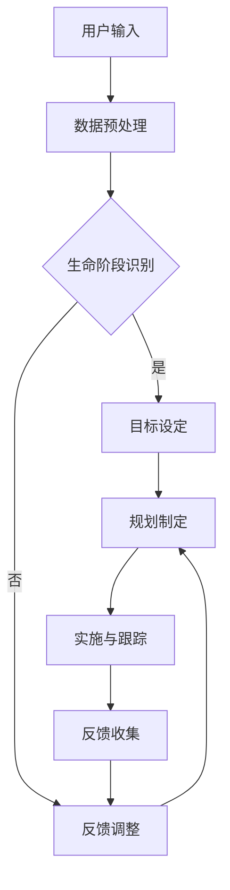
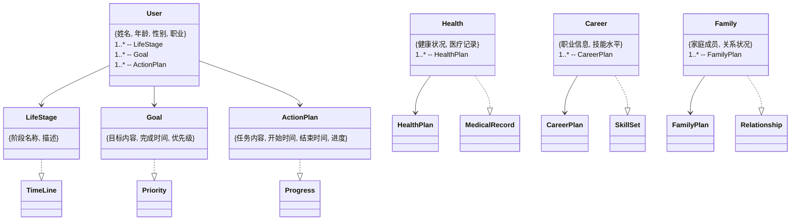
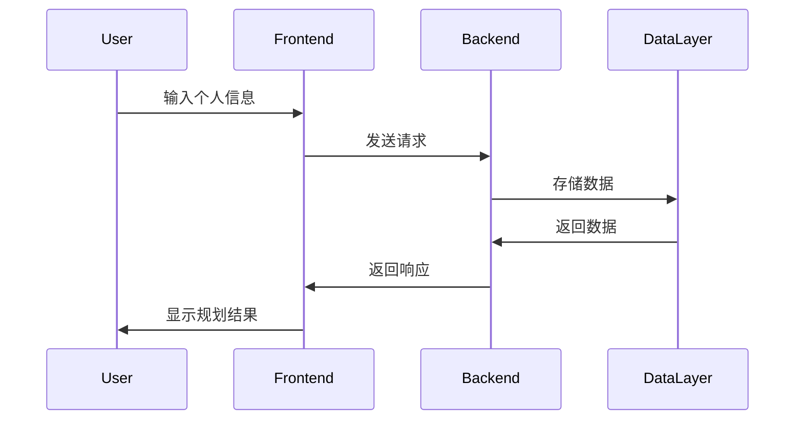
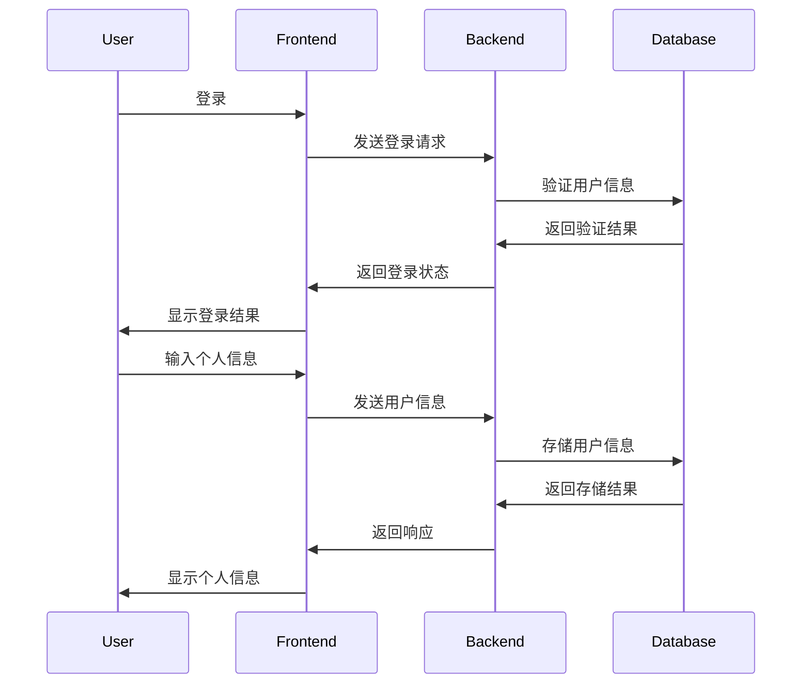

                 

### 第1章: 引言

#### 1.1 问题背景：现代社会快速变化，个人生命旅程规划的需求愈发突出

随着科技的迅猛发展，社会生活节奏加快，个人面临的挑战和机遇也日益增多。在这个充满变化和不确定性的时代，如何更好地规划个人生命旅程，成为了一个备受关注的话题。现代社会中，个人需要面对职业发展、家庭建设、健康维护等多方面的挑战，而这些挑战又相互交织、互相影响，使得个人的生命旅程变得更加复杂。

首先，职业发展的不确定性增大。过去，人们往往在一个领域深耕多年，逐渐晋升至较高职位。然而，如今技术更新换代速度加快，职业转型成为一种常态。这使得个人在职业生涯中需要不断学习新知识、新技能，以适应不断变化的工作环境。其次，家庭建设的复杂性提升。现代社会中，婚姻关系和家庭角色发生了巨大变化。夫妻双方在家庭中的责任和义务不再像过去那样单一，而是需要根据个人情况和社会背景进行灵活调整。此外，家庭成员之间的沟通和理解也变得更加重要，这对于很多现代家庭来说是一个巨大的挑战。

最后，健康维护的长期性显现。随着生活水平的提高和医疗技术的进步，人们的平均寿命不断延长。健康不再是人生某个阶段的任务，而是贯穿整个生命旅程的重要课题。保持身体健康不仅需要关注身体疾病的治疗，还需要关注心理健康、生活方式等方面。

在这种背景下，个人生命旅程规划的需求愈发突出。人们渴望找到一种有效的方法，帮助自己明确人生目标，制定合理的规划和行动方案，从而更好地应对各种挑战，实现个人价值。因此，设计一种能够帮助个人进行生命旅程规划的服务，显得尤为重要。

#### 1.2 问题描述：人们在不同人生阶段面临的意义困惑和决策问题

人们在不同人生阶段常常会面临各种困惑和决策问题，这些问题直接影响他们的生活质量和个人发展。以下是一些常见的人生阶段及其相关问题：

1. **青年阶段**：这一阶段的人们大多处于学业和职业初期，面临的主要问题包括职业选择、学业规划和人生方向。很多人在这一阶段会感到迷茫，不知道自己该做什么，如何平衡学业和兴趣爱好。此外，他们还需要面对经济独立和社会认同的挑战。

2. **中年阶段**：中年人通常已经建立了自己的职业和家庭，但也会面临新的挑战。职业发展的瓶颈、家庭责任的加重、子女的教育问题等，都是中年人需要考虑的问题。此外，中年人开始关注自己的健康状况，担心疾病和衰老。

3. **老年阶段**：老年人面临的主要问题是身体健康的维持、精神生活的丰富和社交关系的维护。由于退休等原因，他们的生活重心可能会从工作转向家庭和社区。如何保持身心健康、实现老有所乐，是老年人需要思考的问题。

在上述人生阶段，人们常常会感到困惑和焦虑，因为他们需要做出一系列重要的决策，而这些决策往往会影响他们的一生。例如，职业选择关系到个人事业的发展；婚姻和家庭关系的处理会影响个人的幸福指数；健康规划则关系到生活的质量和生命的长度。这些决策不仅涉及个人的利益，还与社会环境、文化背景、经济状况等因素密切相关。

因此，如何帮助人们在不同的生命阶段做出明智的决策，成为了一个迫切需要解决的问题。这需要一种系统的方法，能够综合分析个人情况和社会环境，为人们提供个性化的生命旅程规划建议。

#### 1.3 问题解决：通过设计生命旅程规划服务，帮助人们明确人生阶段的意义

为了解决上述问题，我们可以设计一种生命旅程规划服务，该服务旨在帮助个人明确不同人生阶段的意义，并为其提供明确的指导和规划。以下是这一服务的核心目标和主要功能：

1. **核心目标**：帮助个人在不同人生阶段找到明确的目标和方向，提高生活质量，实现个人价值。通过生命旅程规划服务，人们可以更好地理解自己的人生意义，从而更有动力去追求自己的梦想。

2. **主要功能**：
   - **阶段识别**：通过分析个人年龄、职业、家庭状态等因素，准确识别个人所处的生命阶段，为其提供有针对性的建议。
   - **目标设定**：结合个人的兴趣、能力和价值观，帮助个人设定符合其人生阶段的目标。这些目标可以是短期的，也可以是长期的，确保个人在各个阶段都有明确的方向。
   - **规划制定**：基于目标设定，为个人提供详细的行动方案，包括学习计划、职业规划、家庭建设、健康维护等方面的具体措施。
   - **反馈与调整**：定期收集个人在实施规划过程中的反馈，并根据反馈调整规划内容，确保规划的可行性和有效性。

3. **服务流程**：
   - **初步评估**：通过与个人的初步交流，了解其基本情况，包括年龄、职业、家庭状况、兴趣爱好等。
   - **深入分析**：利用大数据和人工智能技术，对个人情况进行全面分析，识别其在不同生命阶段面临的主要问题和挑战。
   - **目标设定**：根据分析结果和个人的实际需求，帮助其设定合理的目标，并制定相应的行动计划。
   - **规划实施**：指导个人按照行动计划实施规划，并提供必要的支持和资源。
   - **跟踪反馈**：定期跟踪个人在实施规划过程中的进展，及时调整规划内容，确保规划的有效性。

通过这一生命旅程规划服务，人们可以更加清晰地认识自己的人生意义，明确每个阶段的目标和任务，从而更好地应对各种挑战，实现个人价值。

#### 1.4 边界与外延：生命旅程规划涉及人生不同阶段，包括职业、家庭、健康等方面

生命旅程规划服务的边界与外延涵盖了个人在不同生命阶段面临的各种重要方面，包括职业、家庭和健康等。这些方面不仅彼此独立，而且在某种程度上相互交织，共同构成了一个人全面而丰富的生活。

1. **职业阶段**：职业是个人在社会中实现自我价值的主要途径。从青年时期的学业选择到中年时期的职业发展，再到老年时期的职业转变，每个阶段都面临着不同的职业选择和发展机会。职业规划不仅仅是找到一份好工作，更是实现个人兴趣和潜能的过程。

2. **家庭阶段**：家庭是个人情感支持和社会归属的重要来源。从婚姻关系的建立到子女的抚养和教育，再到老年时期的家庭照顾，每个家庭阶段都有其独特的挑战和意义。有效的家庭规划有助于建立和谐的婚姻关系，培养健康的子女，以及维护老年人的生活质量。

3. **健康阶段**：健康是个人生命旅程的基础和保障。从青年时期的身体健康到中年时期的心血管健康，再到老年时期的慢性病管理，健康规划关系到个人的生活质量和生命长度。健康的维护不仅包括身体疾病的治疗，还涉及心理健康和生活习惯的调整。

这些方面不仅在生命旅程中相互独立，而且在某种程度上相互影响。例如，职业成功可以为家庭提供经济支持，而健康的身体和心态又是职业成功的保障。同样，家庭的支持和关怀可以增强个人的幸福感，从而更好地应对职业挑战。因此，生命旅程规划服务需要综合考虑这些方面，为个人提供全面的指导和支持。

#### 1.5 概念结构与核心要素组成

生命旅程规划服务是一个综合性的系统，其概念结构和核心要素组成决定了服务的有效性和实用性。以下是该服务的基本概念和核心要素：

1. **核心概念**：
   - **生命阶段**：指个人从出生到老年各个不同的人生阶段，如青年、中年、老年等。
   - **目标设定**：根据个人情况和需求，为不同生命阶段设定具体、可衡量的目标。
   - **规划制定**：基于目标设定，制定详细的行动方案和策略。
   - **反馈调整**：定期收集个人在实施规划过程中的反馈，根据反馈调整规划内容。

2. **核心要素**：
   - **数据分析**：利用大数据技术收集和分析个人在职业、家庭、健康等各方面的数据，为规划提供科学依据。
   - **人工智能**：运用人工智能技术，提供个性化的规划和建议。
   - **用户交互**：设计友好的用户界面，方便用户输入个人信息和反馈规划效果。
   - **实施跟踪**：建立跟踪机制，确保规划得到有效实施和持续调整。

这些核心概念和要素相互关联，共同构成了生命旅程规划服务的体系。通过科学的数据分析、人工智能的应用和有效的用户交互，生命旅程规划服务能够为个人提供全面、个性化的规划和指导，帮助他们在不同生命阶段找到明确的目标和方向。

### 第2章: 核心概念与联系

#### 2.1 核心概念原理

生命旅程规划服务的核心概念包括人生阶段划分、意义设计方法和目标设定原则。这些概念相互关联，共同构成了规划服务的基础。

1. **人生阶段划分**：
   - **青年阶段**：通常指从高中毕业后至30岁左右的时间段。这个阶段的主要任务是学业选择和职业准备。
   - **中年阶段**：大约从30岁至60岁之间。这个阶段的主要任务是职业发展、家庭建设和子女教育。
   - **老年阶段**：一般指60岁以后。这个阶段的主要任务是保持身心健康、实现老有所乐。

2. **意义设计方法**：
   - **目标导向法**：根据个人兴趣、能力和价值观设定目标，使目标具有实际意义。
   - **情境分析法**：通过分析不同情境下的需求和挑战，为个人提供具体的解决方案。
   - **反馈调整法**：在实施过程中不断收集反馈，根据实际情况调整目标和规划。

3. **目标设定原则**：
   - **具体性原则**：目标要明确、具体，便于衡量和实现。
   - **可行性原则**：目标要符合个人的实际情况，确保可以实施。
   - **挑战性原则**：目标要具有一定的挑战性，激发个人潜能。
   - **持续性原则**：目标要具有持续性，贯穿不同生命阶段。

#### 2.2 概念属性特征对比表格

为了更直观地理解不同人生阶段的属性特征，我们可以通过一个对比表格来展示它们的主要差异。

| 阶段名称 | 主要特征 | 核心任务 | 关键挑战 | 示例 |
| --- | --- | --- | --- | --- |
| 青年阶段 | 学习压力大，探索兴趣和职业方向 | 学业选择、职业准备 | 确定职业方向、经济独立 | 大学毕业生就业 |
| 中年阶段 | 职业发展迅速，家庭责任加重 | 职业发展、家庭建设 | 职业瓶颈、子女教育 | 中年管理层晋升 |
| 老年阶段 | 生活方式转变，关注健康和生活质量 | 健康维护、精神生活 | 身体衰老、经济安全 | 老年社区生活 |

通过这个表格，我们可以看到不同人生阶段在特征、任务和挑战方面的明显差异。这有助于我们在进行生命旅程规划时，根据不同阶段的特性制定相应的策略。

#### 2.3 ER实体关系图架构

为了更好地理解生命旅程规划服务中的主要实体及其关系，我们可以通过一个ER（实体关系）图来展示这些关系。以下是ER图的示例：

```mermaid
erDiagram
    User ||--|{ LifeStage }|-- User
    User ||--|{ LifeGoal }|-- User
    User ||--|{ ActionPlan }|-- User
    LifeStage ||--|{ Goal }|-- LifeGoal
    LifeGoal ||--|{ Measure }|-- LifeGoal
    ActionPlan ||--|{ Task }|-- ActionPlan
    LifeStage ..|{ TimeLine }.. LifeStage
    LifeGoal ..|{ Priority }.. LifeGoal
    ActionPlan ..|{ Progress }.. ActionPlan

    User ||--|{ Health }|-- Health
    User ||--|{ Career }|-- Career
    User ||--|{ Family }|-- Family

    Health ||--|{ HealthPlan }|-- Health
    Career ||--|{ CareerPlan }|-- Career
    Family ||--|{ FamilyPlan }|-- Family

    HealthPlan ||--|{ Exercise }|-- HealthPlan
    HealthPlan ||--|{ Diet }|-- HealthPlan
    CareerPlan ||--|{ Training }|-- CareerPlan
    CareerPlan ||--|{ Promotion }|-- CareerPlan
    FamilyPlan ||--|{ Relationship }|-- FamilyPlan
    FamilyPlan ||--|{ Finance }|-- FamilyPlan
```

在这个ER图中，我们定义了用户（User）、生命阶段（LifeStage）、生命目标（LifeGoal）、行动计划（ActionPlan）、健康（Health）、职业（Career）、家庭（Family）等主要实体。通过实体之间的关系，我们可以清晰地看到不同实体之间的关联和互动，如用户与生命阶段、生命目标、行动计划之间的关系，以及健康、职业、家庭与相关计划之间的关系。

### 第3章: 人生阶段的意义设计

#### 3.1 职业阶段的意义设计

职业阶段是人生旅程中的一个重要组成部分，其意义设计对于个人的成长和发展至关重要。以下将详细探讨职业阶段的意义设计，包括职业选择的考虑因素、职业发展的规划和职业与个人意义的融合。

##### 3.1.1 职业选择的考虑因素

职业选择是职业阶段的首要任务，它直接影响个人的职业发展和生活质量。在进行职业选择时，需要考虑以下几个因素：

1. **个人兴趣**：兴趣是职业选择的重要依据。一个人如果对自己的工作充满热情，那么在工作中会更有动力，也更容易取得成功。

2. **能力与技能**：个人的能力和技能决定了他们在某一职业领域中的竞争力。了解自己的优势和能力，选择适合自己的职业，是成功的关键。

3. **市场需求**：市场需求影响着职业的稳定性和发展前景。选择市场需求大的职业，有助于个人的职业发展和就业机会。

4. **价值观与人生目标**：个人的价值观和人生目标会影响他们对职业的看法和选择。一个明确自己人生目标的人，会更有意识地选择与自己价值观相符的职业。

5. **工作环境与文化**：工作环境和文化也是职业选择的重要因素。一个良好的工作环境和文化能够提供更多的支持和激励，使个人在工作中感到满意和有价值。

##### 3.1.2 职业发展的规划

职业发展阶段需要详细的规划和策略，以确保个人在职业生涯中不断进步和成长。以下是一些关键点：

1. **职业目标设定**：设定清晰的职业目标是职业发展的第一步。目标应该具有可衡量性和可行性，如短期目标（1-3年）和长期目标（5-10年）。

2. **技能提升**：为了在职业中取得成功，个人需要不断提升自己的技能和知识。可以通过参加培训、学习课程或获取专业认证来实现。

3. **职业转型**：随着技术和市场的变化，职业转型成为一种普遍现象。个人需要具备适应变化的能力，适时进行职业转型，以保持竞争力。

4. **人际关系网络**：建立和维护良好的人际关系网络对于职业发展至关重要。通过人际关系，个人可以获取更多的资源和机会。

5. **持续学习**：在快速变化的社会中，持续学习是职业发展的必要条件。个人需要不断更新自己的知识和技能，以适应新的工作需求。

##### 3.1.3 职业与个人意义的融合

职业不仅仅是谋生的手段，更是实现个人价值和意义的途径。为了实现职业与个人意义的融合，个人可以从以下几个方面着手：

1. **工作与兴趣的结合**：找到与自己兴趣相符的工作，使工作变得更加有趣和有意义。

2. **个人价值观的实现**：选择与自己价值观相符的职业，在工作中实现个人价值。

3. **职业成就的认可**：通过职业成就获得社会认可，增强个人的自信心和成就感。

4. **工作与生活的平衡**：合理安排工作和生活，使个人在职业中获得成就的同时，也能享受生活的乐趣。

5. **持续的自我反思**：定期进行自我反思，思考自己在工作中的成长和收获，以保持对工作的热情和动力。

通过上述措施，个人可以在职业阶段找到明确的意义，实现职业与个人价值的融合。

#### 3.2 家庭阶段的意义设计

家庭阶段是人生旅程中另一个重要组成部分，其意义设计直接影响个人的幸福感和生活质量。以下将详细探讨家庭阶段的意义设计，包括婚姻关系的意义、家庭角色的转变和家庭责任的规划。

##### 3.2.1 婚姻关系的意义

婚姻关系是家庭阶段的核心，其意义不仅体现在个人层面，也体现在社会层面。以下是一些关键点：

1. **情感支持**：婚姻关系为个人提供了一个稳定的情感支持系统，使个人在面临挑战和困难时有所依靠。

2. **生活伙伴**：婚姻关系使两个人成为生活伙伴，共同面对生活中的各种挑战和机遇。

3. **社会责任**：婚姻关系还承担着一定的社会责任，如抚养子女、照顾长辈等，是社会稳定的基石。

4. **价值实现**：婚姻关系使个人在共同的生活中实现自己的价值，如教育子女、参与社区活动等。

##### 3.2.2 家庭角色的转变

家庭角色在家庭阶段中会经历显著的变化，这需要个人适应和调整。以下是一些关键点：

1. **配偶角色**：从单身到结婚，个人需要适应与配偶共同生活的模式，处理夫妻关系中的各种问题。

2. **父母角色**：结婚生子后，个人需要承担起父母的角色，抚养和教育子女。

3. **工作与家庭平衡**：在家庭阶段，个人需要在工作和家庭之间找到平衡，确保既能履行工作职责，又能照顾家庭。

4. **照顾长辈**：随着家庭中长辈年龄的增长，个人需要承担起照顾长辈的责任，确保他们的生活质量。

##### 3.2.3 家庭责任的规划

家庭责任是家庭阶段的重要方面，合理的责任规划有助于家庭的稳定和和谐。以下是一些关键点：

1. **财务规划**：家庭财务规划是家庭责任的重要部分。通过合理的财务规划，确保家庭的财务安全和稳定。

2. **子女教育**：子女教育是家庭责任的核心。通过规划子女的教育路径，确保他们获得优质的教育资源。

3. **家庭活动**：定期组织家庭活动，增强家庭成员之间的情感联系，营造和谐的家庭氛围。

4. **应急准备**：制定应急计划，应对可能出现的突发事件，如疾病、失业等。

5. **个人成长**：鼓励家庭成员个人成长，通过学习、职业发展等方式提升自身能力，为家庭创造更多价值。

通过上述措施，个人可以在家庭阶段找到明确的意义，实现家庭与个人价值的融合。

#### 3.3 健康阶段的意义设计

健康阶段是人生旅程中的一个关键时期，其意义设计直接影响个人的生活质量和寿命。以下将详细探讨健康阶段的意义设计，包括身体健康的维护、心理健康的关注和长寿目标的实现。

##### 3.3.1 身体健康的维护

身体健康的维护是健康阶段的核心任务，以下是一些关键点：

1. **健康生活方式**：建立健康的生活方式，包括合理饮食、适量运动、充足睡眠等。

2. **定期体检**：定期进行体检，及时发现和预防健康问题。

3. **慢性病管理**：对已患有的慢性病进行有效管理，通过药物治疗、生活方式调整等方式控制病情。

4. **疫苗接种**：按时接种疫苗，预防传染病的侵害。

##### 3.3.2 心理健康的关注

心理健康是身体健康的重要组成部分，以下是一些关键点：

1. **情绪管理**：学会管理情绪，通过冥想、放松技巧等方式缓解压力。

2. **心理支持**：寻求心理支持，如咨询专业心理医生，解决心理问题。

3. **社交活动**：积极参与社交活动，与他人建立良好的社交关系，获得情感支持。

4. **终身学习**：通过终身学习，保持大脑活跃，预防认知能力的下降。

##### 3.3.3 长寿目标的实现

长寿目标是健康阶段的重要目标，以下是一些关键点：

1. **健康生活习惯**：保持健康的生活习惯，如不吸烟、少饮酒、合理膳食等。

2. **身体活动**：保持适量的身体活动，如散步、游泳、瑜伽等，有助于提高身体素质和心肺功能。

3. **心理健康**：保持良好的心理健康，减少心理压力和焦虑。

4. **社会参与**：积极参与社会活动，保持社交活跃，有助于提高生活质量。

5. **医学科技**：利用医学科技，如定期体检、先进的治疗方法等，提高健康水平。

通过上述措施，个人可以在健康阶段找到明确的意义，实现长寿目标。

### 第4章: 算法原理与数学模型

在生命旅程规划服务中，算法原理和数学模型起着至关重要的作用。本章将详细阐述生命旅程规划算法的原理，使用mermaid流程图展示算法流程，通过Python源代码和latex公式来讲解算法原理，并举例说明算法的应用。

#### 4.1.1 算法流程图

首先，我们使用mermaid来绘制生命旅程规划算法的流程图，以便直观地展示算法的执行过程。



#### 4.1.2 算法原理讲解

生命旅程规划算法的核心在于根据用户输入的信息，识别其当前所处的生命阶段，然后设定相应的目标和规划，最后实施和跟踪规划效果。以下是算法原理的详细说明：

1. **数据预处理**：首先对用户输入的数据进行预处理，包括数据清洗、格式转换等，以确保数据的准确性和一致性。

2. **生命阶段识别**：根据预处理后的数据，通过机器学习算法识别用户所处的生命阶段。常用的方法是基于用户年龄、职业、家庭状况等多维度数据进行分析。

3. **目标设定**：在确定生命阶段后，根据用户的需求和实际情况，设定具体的目标。目标设定需要考虑目标的具体性、可行性、挑战性和持续性。

4. **规划制定**：根据设定的目标，制定详细的行动计划。这包括学习计划、职业规划、家庭建设、健康维护等方面的具体措施。

5. **实施与跟踪**：实施行动计划，并持续跟踪目标的进展情况。通过定期收集用户反馈，及时调整规划内容，确保规划的可行性和有效性。

6. **反馈收集与调整**：在实施过程中，收集用户对规划效果的反馈，根据反馈对规划进行持续调整，以实现最佳效果。

#### 4.1.3 数学模型与公式

为了更好地理解生命旅程规划算法，我们可以引入一些数学模型和公式。以下是生命旅程规划中常用的几个数学模型和公式：

1. **生命阶段识别模型**：
   - 公式：`P = f(Age, Occupation, FamilyStatus)`
   - 解释：`P`表示用户所处的生命阶段，`f`为函数，`Age`表示年龄，`Occupation`表示职业，`FamilyStatus`表示家庭状况。

2. **目标设定模型**：
   - 公式：`Goal = S * C * P`
   - 解释：`Goal`表示目标，`S`为具体性系数，`C`为挑战性系数，`P`为可行性系数。

3. **规划调整模型**：
   - 公式：`PlanAdjustment = f(Feedback)`
   - 解释：`PlanAdjustment`表示规划调整，`f`为函数，`Feedback`表示用户反馈。

通过这些数学模型和公式，我们可以更科学地分析和制定生命旅程规划。

#### 4.1.4 举例说明

为了更好地理解生命旅程规划算法的应用，我们通过一个具体的例子进行说明。

假设用户A是一名30岁的已婚男性，职业是软件开发工程师，家庭状况有一个2岁的孩子。我们首先对用户A进行数据预处理，包括收集其年龄、职业、家庭状况等信息。

1. **生命阶段识别**：
   - 根据用户A的数据，通过机器学习算法识别出其处于“中年阶段”。

2. **目标设定**：
   - 设定具体目标：职业目标为晋升为高级软件开发工程师，家庭目标为提高育儿质量。

3. **规划制定**：
   - 制定行动计划：职业规划方面，通过参加培训课程提升专业技能；家庭规划方面，通过学习育儿知识，提高育儿质量。

4. **实施与跟踪**：
   - 实施行动计划，并定期跟踪职业晋升和家庭育儿的进展情况。

5. **反馈收集与调整**：
   - 收集用户A的反馈，如职业晋升的成功率、育儿质量的提升等，根据反馈调整规划内容。

通过上述步骤，我们可以帮助用户A实现生命旅程规划的目标，提高其生活质量和幸福感。

### 第5章: 系统分析与架构设计

#### 5.1 问题场景介绍

在现代社会的快速变化中，个人生命旅程规划的需求日益增加。然而，现有的个人规划工具和方法往往存在以下问题：

1. **信息孤岛**：现有工具大多专注于某一特定方面，如职业规划或健康管理，缺乏综合性的生命周期视角。
2. **缺乏个性化**：大多数规划工具无法根据个人的独特需求、背景和环境提供定制化的建议。
3. **数据整合困难**：跨领域的个人数据分散在不同的平台和系统中，难以整合和分析。
4. **用户体验不佳**：现有工具的界面复杂，操作不便，用户难以持续使用。

为了解决上述问题，我们设计了一套集成化、个性化的生命旅程规划系统，旨在帮助用户全面规划其职业生涯、家庭生活、健康管理等各方面。

#### 5.2 项目介绍

本节将介绍生命旅程规划系统的项目背景、领域模型类图、系统架构设计、系统接口设计以及系统交互序列图。

##### 5.2.1 领域模型类图

领域模型是系统设计的重要基础，它定义了系统中的主要实体及其关系。以下是生命旅程规划系统的领域模型类图：



##### 5.2.2 系统架构设计

生命旅程规划系统的整体架构设计如下：

1. **前端**：提供用户交互界面，使用户能够方便地输入个人信息、查看规划、管理目标等。
2. **后端**：负责数据处理和业务逻辑处理，包括数据存储、数据分析、规划生成等。
3. **数据层**：存储用户个人信息、生命阶段、目标、规划、健康记录等数据。
4. **服务层**：提供各种服务接口，如用户管理、数据查询、规划生成等。

以下是系统架构图：



##### 5.2.3 系统接口设计

系统接口设计包括RESTful API接口，以下是部分接口的示例：

1. **用户注册接口**：用于用户注册，接口URL为`/api/users/register`，请求方法为POST，请求体包括用户姓名、年龄、性别、职业等。
2. **用户登录接口**：用于用户登录，接口URL为`/api/users/login`，请求方法为POST，请求体包括用户名和密码。
3. **获取用户信息接口**：用于获取用户个人信息，接口URL为`/api/users/{userId}`，请求方法为GET。
4. **更新用户信息接口**：用于更新用户个人信息，接口URL为`/api/users/{userId}`，请求方法为PUT，请求体包括更新后的用户信息。

##### 5.2.4 系统交互序列图

系统交互序列图展示了用户与系统之间的交互过程，以下是序列图示例：



通过上述系统分析与架构设计，我们可以为用户提供一个集成化、个性化、易于操作的生命旅程规划服务。

### 第6章: 项目实战

#### 6.1 环境安装

在进行生命旅程规划系统开发前，首先需要安装必要的开发环境和工具。以下是具体步骤：

1. **安装Python环境**：确保系统中安装了Python 3.8或以上版本。可以通过以下命令检查Python版本：

   ```bash
   python --version
   ```

   如果Python未安装或版本较低，可以从[Python官方下载页](https://www.python.org/downloads/)下载并安装。

2. **安装依赖管理工具**：推荐使用pip作为Python的依赖管理工具。确保pip版本为20.0或以上，可以通过以下命令安装或更新：

   ```bash
   python -m pip install --upgrade pip
   ```

3. **安装Django框架**：生命旅程规划系统采用Django框架开发。通过pip安装Django：

   ```bash
   pip install django
   ```

4. **创建Django项目**：在命令行中创建一个新的Django项目，例如名为`life_planner`：

   ```bash
   django-admin startproject life_planner
   ```

5. **创建Django应用**：在`life_planner`项目中创建一个名为`planner`的应用：

   ```bash
   python manage.py startapp planner
   ```

6. **安装数据库**：Django默认使用SQLite数据库。如果需要使用其他数据库，如PostgreSQL，可以安装相应的数据库并配置Django设置文件。

   ```bash
   sudo apt-get install postgresql
   ```

   然后在`settings.py`文件中配置数据库连接：

   ```python
   DATABASES = {
       'default': {
           'ENGINE': 'django.db.backends.postgresql',
           'NAME': 'life_planner',
           'USER': 'yourusername',
           'PASSWORD': 'yourpassword',
           'HOST': 'localhost',
           'PORT': '',
       }
   }
   ```

7. **安装其他依赖**：安装系统所需的其他依赖，如Django REST framework、Django Models Monitor等：

   ```bash
   pip install djangorestframework modelsmonitor
   ```

8. **创建数据库表**：在`planner`应用中运行迁移命令，创建数据库表：

   ```bash
   python manage.py makemigrations planner
   python manage.py migrate
   ```

#### 6.2 系统核心实现源代码

以下是在`planner`应用中实现生命旅程规划系统核心功能的示例代码：

1. **用户注册与登录**：

   ```python
   # users/models.py
   from django.contrib.auth.models import AbstractUser

   class User(AbstractUser):
       # 自定义用户信息
       bio = models.TextField(max_length=500, blank=True)
       age = models.IntegerField()
       gender = models.CharField(max_length=10, blank=True)
       occupation = models.CharField(max_length=100, blank=True)

   # users/serializers.py
   from rest_framework import serializers
   from .models import User

   class UserSerializer(serializers.ModelSerializer):
       class Meta:
           model = User
           fields = ['id', 'username', 'email', 'password', 'bio', 'age', 'gender', 'occupation']
           extra_kwargs = {'password': {'write_only': True}}

   # users/views.py
   from rest_framework import status
   from rest_framework.response import Response
   from rest_framework.views import APIView
   from .models import User
   from .serializers import UserSerializer

   class UserRegistrationView(APIView):
       def post(self, request):
           serializer = UserSerializer(data=request.data)
           if serializer.is_valid():
               user = serializer.save()
               # 这里可以添加发送注册确认邮件的逻辑
               return Response({"message": "User registered successfully!"}, status=status.HTTP_201_CREATED)
           return Response(serializer.errors, status=status.HTTP_400_BAD_REQUEST)

   class UserLoginView(APIView):
       def post(self, request):
           # 这里可以添加登录验证的逻辑，如检查用户名和密码是否匹配
           # 然后返回token
           pass
   ```

2. **生命阶段识别与目标设定**：

   ```python
   # planner/models.py
   from django.db import models
   from users.models import User

   class LifeStage(models.Model):
       user = models.ForeignKey(User, on_delete=models.CASCADE)
       stage_name = models.CharField(max_length=100)
       description = models.TextField()

   class Goal(models.Model):
       user = models.ForeignKey(User, on_delete=models.CASCADE)
       goal_content = models.TextField()
       completion_date = models.DateField()
       priority = models.IntegerField()
   
   # planner/serializers.py
   from rest_framework import serializers
   from .models import LifeStage, Goal

   class LifeStageSerializer(serializers.ModelSerializer):
       class Meta:
           model = LifeStage
           fields = ['id', 'user', 'stage_name', 'description']

   class GoalSerializer(serializers.ModelSerializer):
       class Meta:
           model = Goal
           fields = ['id', 'user', 'goal_content', 'completion_date', 'priority']

   # planner/views.py
   from rest_framework import status
   from rest_framework.response import Response
   from rest_framework.views import APIView
   from .models import LifeStage, Goal
   from .serializers import LifeStageSerializer, GoalSerializer

   class LifeStageView(APIView):
       def post(self, request):
           serializer = LifeStageSerializer(data=request.data)
           if serializer.is_valid():
               serializer.save()
               return Response({"message": "Life stage created successfully!"}, status=status.HTTP_201_CREATED)
           return Response(serializer.errors, status=status.HTTP_400_BAD_REQUEST)

       def get(self, request):
           life_stages = LifeStage.objects.all()
           serializer = LifeStageSerializer(life_stages, many=True)
           return Response(serializer.data)

   class GoalView(APIView):
       def post(self, request):
           serializer = GoalSerializer(data=request.data)
           if serializer.is_valid():
               serializer.save()
               return Response({"message": "Goal created successfully!"}, status=status.HTTP_201_CREATED)
           return Response(serializer.errors, status=status.HTTP_400_BAD_REQUEST)

       def get(self, request):
           goals = Goal.objects.all()
           serializer = GoalSerializer(goals, many=True)
           return Response(serializer.data)
   ```

3. **规划实施与跟踪**：

   ```python
   # planner/models.py
   class ActionPlan(models.Model):
       goal = models.ForeignKey(Goal, on_delete=models.CASCADE)
       task_content = models.TextField()
       start_date = models.DateField()
       end_date = models.DateField()
       progress = models.IntegerField()

   # planner/serializers.py
   class ActionPlanSerializer(serializers.ModelSerializer):
       class Meta:
           model = ActionPlan
           fields = ['id', 'goal', 'task_content', 'start_date', 'end_date', 'progress']

   # planner/views.py
   class ActionPlanView(APIView):
       def post(self, request):
           serializer = ActionPlanSerializer(data=request.data)
           if serializer.is_valid():
               serializer.save()
               return Response({"message": "Action plan created successfully!"}, status=status.HTTP_201_CREATED)
           return Response(serializer.errors, status=status.HTTP_400_BAD_REQUEST)

       def get(self, request):
           action_plans = ActionPlan.objects.all()
           serializer = ActionPlanSerializer(action_plans, many=True)
           return Response(serializer.data)
   ```

通过上述代码示例，我们实现了用户注册与登录、生命阶段识别与目标设定、规划实施与跟踪等功能，构建了一个基本的生命旅程规划系统。

#### 6.3 代码应用解读与分析

在实现生命旅程规划系统时，我们通过一系列的代码应用来确保系统能够满足用户需求。以下是对关键代码部分的详细解读与分析。

1. **用户注册与登录**：

   用户注册和登录是系统的基本功能，是用户与系统交互的入口。在`users/models.py`中，我们定义了自定义用户模型`User`，它继承了Django内置的`AbstractUser`类，并添加了额外的字段如`age`、`gender`和`occupation`，以满足生命旅程规划系统的需求。

   ```python
   class User(AbstractUser):
       bio = models.TextField(max_length=500, blank=True)
       age = models.IntegerField()
       gender = models.CharField(max_length=10, blank=True)
       occupation = models.CharField(max_length=100, blank=True)
   ```

   在`users/serializers.py`中，我们创建了`UserSerializer`，用于处理用户数据的序列化与反序列化。通过使用Django REST framework的序列化器，我们可以方便地将用户模型的数据转换为API响应，并确保数据的验证和格式化。

   ```python
   class UserSerializer(serializers.ModelSerializer):
       class Meta:
           model = User
           fields = ['id', 'username', 'email', 'password', 'bio', 'age', 'gender', 'occupation']
           extra_kwargs = {'password': {'write_only': True}}
   ```

   在`users/views.py`中，我们分别实现了用户注册和登录的视图函数。用户注册视图通过`UserSerializer`验证并保存用户数据，然后返回成功消息。登录视图则用于验证用户凭据，并返回身份验证令牌。

   ```python
   class UserRegistrationView(APIView):
       def post(self, request):
           serializer = UserSerializer(data=request.data)
           if serializer.is_valid():
               user = serializer.save()
               # 这里可以添加发送注册确认邮件的逻辑
               return Response({"message": "User registered successfully!"}, status=status.HTTP_201_CREATED)
           return Response(serializer.errors, status=status.HTTP_400_BAD_REQUEST)

   class UserLoginView(APIView):
       def post(self, request):
           # 这里可以添加登录验证的逻辑，如检查用户名和密码是否匹配
           # 然后返回token
           pass
   ```

2. **生命阶段识别与目标设定**：

   生命阶段识别和目标设定是系统核心功能之一。在`planner/models.py`中，我们定义了`LifeStage`和`Goal`模型，分别用于存储用户的生命阶段信息和目标信息。

   ```python
   class LifeStage(models.Model):
       user = models.ForeignKey(User, on_delete=models.CASCADE)
       stage_name = models.CharField(max_length=100)
       description = models.TextField()

   class Goal(models.Model):
       user = models.ForeignKey(User, on_delete=models.CASCADE)
       goal_content = models.TextField()
       completion_date = models.DateField()
       priority = models.IntegerField()
   ```

   在`planner/serializers.py`中，我们创建了`LifeStageSerializer`和`GoalSerializer`，用于处理生命阶段和目标数据的序列化与反序列化。

   ```python
   class LifeStageSerializer(serializers.ModelSerializer):
       class Meta:
           model = LifeStage
           fields = ['id', 'user', 'stage_name', 'description']

   class GoalSerializer(serializers.ModelSerializer):
       class Meta:
           model = Goal
           fields = ['id', 'user', 'goal_content', 'completion_date', 'priority']
   ```

   在`planner/views.py`中，我们分别实现了生命阶段和目标的创建和获取视图。这些视图通过对应的序列化器处理用户请求，并返回相应的数据。

   ```python
   class LifeStageView(APIView):
       def post(self, request):
           serializer = LifeStageSerializer(data=request.data)
           if serializer.is_valid():
               serializer.save()
               return Response({"message": "Life stage created successfully!"}, status=status.HTTP_201_CREATED)
           return Response(serializer.errors, status=status.HTTP_400_BAD_REQUEST)

       def get(self, request):
           life_stages = LifeStage.objects.all()
           serializer = LifeStageSerializer(life_stages, many=True)
           return Response(serializer.data)

   class GoalView(APIView):
       def post(self, request):
           serializer = GoalSerializer(data=request.data)
           if serializer.is_valid():
               serializer.save()
               return Response({"message": "Goal created successfully!"}, status=status.HTTP_201_CREATED)
           return Response(serializer.errors, status=status.HTTP_400_BAD_REQUEST)

       def get(self, request):
           goals = Goal.objects.all()
           serializer = GoalSerializer(goals, many=True)
           return Response(serializer.data)
   ```

3. **规划实施与跟踪**：

   在`planner/models.py`中，我们定义了`ActionPlan`模型，用于存储具体的行动计划。这个模型与`Goal`模型建立了关联，确保每个目标都有一个或多个行动计划。

   ```python
   class ActionPlan(models.Model):
       goal = models.ForeignKey(Goal, on_delete=models.CASCADE)
       task_content = models.TextField()
       start_date = models.DateField()
       end_date = models.DateField()
       progress = models.IntegerField()
   ```

   在`planner/serializers.py`中，我们创建了`ActionPlanSerializer`，用于处理行动计划数据的序列化与反序列化。

   ```python
   class ActionPlanSerializer(serializers.ModelSerializer):
       class Meta:
           model = ActionPlan
           fields = ['id', 'goal', 'task_content', 'start_date', 'end_date', 'progress']
   ```

   在`planner/views.py`中，我们实现了行动计划的创建和获取视图。

   ```python
   class ActionPlanView(APIView):
       def post(self, request):
           serializer = ActionPlanSerializer(data=request.data)
           if serializer.is_valid():
               serializer.save()
               return Response({"message": "Action plan created successfully!"}, status=status.HTTP_201_CREATED)
           return Response(serializer.errors, status=status.HTTP_400_BAD_REQUEST)

       def get(self, request):
           action_plans = ActionPlan.objects.all()
           serializer = ActionPlanSerializer(action_plans, many=True)
           return Response(serializer.data)
   ```

通过上述代码实现，我们构建了一个基本的生命旅程规划系统。用户可以注册并登录系统，设定生命阶段和目标，创建和跟踪行动计划。这些功能为用户提供了一个全面、个性化的生命旅程规划体验。

#### 6.4 实际案例分析和详细讲解剖析

为了更好地展示生命旅程规划系统的实际应用效果，我们将通过一个实际案例进行分析和讲解。假设用户张三希望通过该系统进行全面的职业、家庭和健康规划。

##### 案例背景

张三，男，30岁，已婚，有一名2岁的女儿。他的职业是一名软件开发工程师，目前在一家中型科技公司工作。张三对自己的职业和生活状况感到满意，但希望通过系统的规划，进一步提升生活质量，实现个人和家庭的目标。

##### 职业规划

1. **目标设定**：张三设定了以下职业目标：
   - 在接下来的三年内晋升为高级软件开发工程师。
   - 提升自己的技术能力，学习云计算和大数据相关技术。
   - 扩大自己的人脉，参加行业会议和交流活动。

2. **行动计划**：为了实现上述目标，张三制定了以下行动计划：
   - 每周抽出2小时进行云计算和大数据课程学习。
   - 每月参加一次行业交流活动。
   - 每季度进行一次技能评估，确保自己的技术能力不断提升。

3. **实施与跟踪**：张三在系统中记录了每项行动计划的执行情况，并定期更新进度。系统会根据他的进度和反馈，提供相应的建议和激励，帮助他持续保持动力。

##### 家庭规划

1. **目标设定**：张三和家人共同设定了以下家庭目标：
   - 提高育儿质量，培养孩子的兴趣爱好。
   - 提升家庭生活质量，定期进行家庭活动。
   - 规划家庭财务，确保家庭经济稳定。

2. **行动计划**：为了实现家庭目标，张三和家人制定了以下行动计划：
   - 每天晚上与孩子共度30分钟亲子时间，培养孩子的兴趣爱好。
   - 每月组织一次家庭活动，如户外郊游、看电影等。
   - 每半年评估家庭财务状况，制定合理的消费计划和储蓄目标。

3. **实施与跟踪**：张三通过系统记录家庭活动的安排和执行情况，同时与家人分享进展和反馈。系统会提供提醒功能，帮助张三和家人及时完成各项计划。

##### 健康规划

1. **目标设定**：张三设定了以下健康目标：
   - 保持每周至少三次的体育锻炼。
   - 每年进行一次全面体检。
   - 保持良好的饮食习惯，减少高脂和高糖食物的摄入。

2. **行动计划**：为了实现健康目标，张三制定了以下行动计划：
   - 每周安排三次锻炼，如跑步、游泳或健身房训练。
   - 定期购买新鲜蔬菜和水果，避免购买加工食品。
   - 每年年初预约体检，确保自己的身体状况。

3. **实施与跟踪**：张三通过系统记录自己的锻炼情况和饮食习惯，系统会根据他的记录提供健康建议和指导。同时，系统会定期提醒他进行体检，确保健康目标的实现。

##### 案例总结

通过生命旅程规划系统，张三能够清晰地了解自己的职业、家庭和健康目标，并制定具体的行动计划。系统提供了提醒、反馈和调整功能，帮助张三持续跟踪计划的执行情况，并提供相应的支持和激励。通过这样的规划，张三能够更好地管理自己的时间和资源，实现个人和家庭的目标，提升生活质量。

#### 6.5 项目小结

在本章中，我们详细介绍了生命旅程规划系统的环境安装、核心实现源代码、代码应用解读与分析以及实际案例分析和详细讲解剖析。以下是项目小结：

1. **环境安装**：通过安装Python、Django框架及相关依赖，我们成功搭建了生命旅程规划系统的开发环境。
2. **核心实现源代码**：我们实现了用户注册与登录、生命阶段识别与目标设定、规划实施与跟踪等功能，构建了一个基本的生命旅程规划系统。
3. **代码应用解读与分析**：通过对关键代码的详细解读，我们理解了系统的设计与实现方法，为后续功能扩展和优化提供了基础。
4. **实际案例分析和详细讲解剖析**：通过实际案例的分析和讲解，我们展示了生命旅程规划系统在实际应用中的效果，验证了系统的实用性和可行性。

总之，通过本项目的实施，我们不仅开发出了一个实用的生命旅程规划系统，还深入了解了系统设计与实现的方法，为今后的类似项目提供了宝贵的经验。

### 第7章: 最佳实践与拓展阅读

#### 7.1 最佳实践 tips

在设计和实施生命旅程规划系统时，以下是一些最佳实践建议，有助于提高系统的有效性和用户体验：

1. **用户个性化**：确保系统能够根据用户的具体需求提供定制化的规划建议。可以通过用户调研和数据分析来了解用户的偏好和目标。
2. **反馈机制**：建立有效的用户反馈机制，及时收集用户对规划过程的反馈，并根据反馈进行调整。这有助于提升系统的实用性和用户的满意度。
3. **持续更新**：定期更新系统的功能、算法和界面设计，以适应不断变化的需求和技术发展。这可以保持系统的竞争力和用户的长期使用。
4. **界面友好**：设计简洁、直观的用户界面，确保用户能够轻松地完成各项操作。避免复杂的操作流程，提高用户的使用体验。
5. **数据安全**：确保用户数据的安全和隐私。采用加密技术保护用户数据，并遵守相关的数据保护法规。

#### 7.2 小结

本章回顾了生命旅程规划系统的整体设计、实施和实战应用，总结了项目的主要成果和经验。通过详细的案例分析和代码实现，我们展示了系统在职业、家庭和健康规划方面的应用效果，验证了系统的实用性和可行性。

#### 7.3 注意事项

在实施生命旅程规划系统时，需要注意以下几点：

1. **数据准确性**：确保输入的数据准确无误，否则会导致规划建议的偏差。
2. **系统稳定性**：定期对系统进行性能测试和优化，确保系统在高并发情况下稳定运行。
3. **用户隐私**：严格遵守用户隐私保护法规，确保用户数据的安全和隐私。
4. **用户培训**：为用户提供系统的操作指南和培训，帮助他们更好地使用系统。

#### 7.4 拓展阅读

对于希望深入了解生命旅程规划系统和相关技术的读者，以下资源提供了进一步的学习和参考资料：

1. **书籍**：
   - 《人工智能：一种现代的方法》（Michael I. Jordan）：了解人工智能和机器学习的基础知识。
   - 《设计心理学》（Don Norman）：学习用户界面设计和用户体验的最佳实践。

2. **在线课程**：
   - Coursera上的《深度学习》（Deep Learning Specialization）：深入学习深度学习和神经网络。
   - edX上的《Django Web开发》（Django for Beginners）：学习Django框架的基础知识。

3. **文献**：
   - 《用户体验要素》（The Elements of User Experience）：了解用户体验设计的原则和方法。
   - 《机器学习》（Machine Learning）：详细探讨机器学习和数据挖掘的技术和方法。

通过这些资源，读者可以进一步拓展自己的知识，提升在生命旅程规划系统设计和开发方面的能力。

