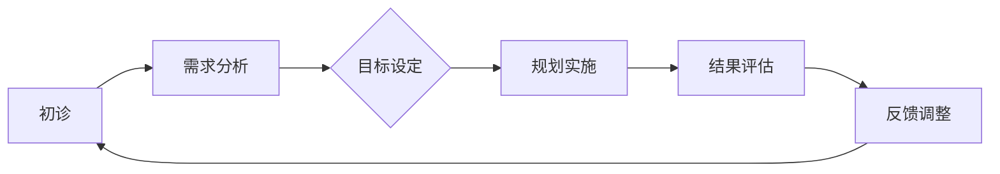

                 

# 《生命旅程规划顾问协会：人生不同阶段意义设计的专业组织》

> 关键词：生命旅程规划、人生阶段、意义设计、顾问协会、专业组织

> 摘要：本文旨在探讨《生命旅程规划顾问协会：人生不同阶段意义设计的专业组织》的核心主题和主要内容。文章首先介绍了生命旅程规划的定义、意义以及其重要性，然后介绍了顾问协会的成立背景、使命和组织架构。接着，文章详细阐述了人生不同阶段的特征分析、生命意义设计的概念解析以及顾问协会的专业方法。最后，文章通过实际操作指南、服务流程、个性化服务案例、最佳实践和案例分析，为读者提供了全面的指导和参考。

## 目录大纲设计思路

为了更好地阐述本文的核心内容，我们首先需要对目录大纲进行设计。目录大纲的设计思路如下：

1. **明确书籍主题**：书名《生命旅程规划顾问协会：人生不同阶段意义设计的专业组织》暗示了书籍的核心主题——人生旅程规划与意义设计。

2. **确定章节结构**：将内容划分为几个核心部分，如引言与背景、核心概念与原理、实用指南和案例分析等。

3. **细化每个章节**：在各个章节下，细化出具体的子章节，确保内容覆盖全面且逻辑清晰。

4. **设计章节内容**：确保每个章节都有明确的主题，并包含背景介绍、核心概念、原理讲解、案例分析、实战应用等内容。

5. **遵循简洁性原则**：确保目录大纲简洁明了，避免冗余内容，同时保证大纲内容的完整性。

### 具体目录大纲设计

根据以上思路，具体的目录大纲设计如下：

### 第一部分：引言与背景

## 1.1 书籍简介

### 1.1.1 作者背景

### 1.1.2 书籍目的与读者对象

### 1.1.3 研究方法与框架

## 1.2 生命旅程规划的意义

### 1.2.1 生命旅程规划的定义

### 1.2.2 人生不同阶段的挑战与需求

### 1.2.3 生命旅程规划的重要性

## 1.3 顾问协会的成立背景与使命

### 1.3.1 顾问协会的成立背景

### 1.3.2 顾问协会的使命与愿景

### 1.3.3 顾问协会的组织架构

## 1.4 本书结构安排与阅读指南

### 1.4.1 目录结构概述

### 1.4.2 阅读方法建议

### 1.4.3 学习资源与工具推荐

### 第二部分：核心概念与原理

## 2.1 人生不同阶段的特征分析

### 2.1.1 儿童与青少年期

### 2.1.2 成年期

### 2.1.3 中年期

### 2.1.4 老年期

## 2.2 生命意义设计的概念解析

### 2.2.1 生命意义的定义

### 2.2.2 生命意义的构成要素

### 2.2.3 生命意义的心理学研究

## 2.3 顾问协会的专业方法

### 2.3.1 规划工具与技术

### 2.3.2 咨询与辅导流程

### 2.3.3 个性化服务策略

## 2.4 核心概念联系图

### 2.4.1 人生阶段与生命意义的ER图

### 2.4.2 顾问协会服务流程图

### 2.4.3 生命旅程规划工具对比表

## 2.5 核心概念属性特征对比表

### 第三部分：实用指南

## 3.1 生命旅程规划的实际操作

### 3.1.1 规划前的准备工作

### 3.1.2 规划的具体步骤

### 3.1.3 规划的调整与优化

## 3.2 顾问协会的服务流程

### 3.2.1 咨询预约与初诊

### 3.2.2 需求分析与目标设定

### 3.2.3 规划实施与监督

### 3.2.4 结果评估与反馈

## 3.3 个性化服务案例

### 3.3.1 成功案例分享

### 3.3.2 挑战与解决方案

### 3.3.3 案例分析与启示

## 3.4 最佳实践与技巧

### 3.4.1 时间管理与目标设定

### 3.4.2 心理调适与压力管理

### 3.4.3 职业发展建议

### 第四部分：案例分析

## 4.1 案例研究一：儿童与青少年期规划

### 4.1.1 案例背景

### 4.1.2 规划目标与实施过程

### 4.1.3 案例结果与启示

## 4.2 案例研究二：成年期规划

### 4.2.1 案例背景

### 4.2.2 规划目标与实施过程

### 4.2.3 案例结果与启示

## 4.3 案例研究三：中年期规划

### 4.3.1 案例背景

### 4.3.2 规划目标与实施过程

### 4.3.3 案例结果与启示

## 4.4 案例研究四：老年期规划

### 4.4.1 案例背景

### 4.4.2 规划目标与实施过程

### 4.4.3 案例结果与启示

### 结论：生命旅程规划的重要性与未来展望

## 参考文献

---

通过以上目录大纲的设计，我们可以清晰地看到本书的结构和内容安排，为后续的内容撰写和阅读提供了明确的指导。在接下来的部分，我们将逐一详细阐述每个章节的内容，帮助读者更好地理解和应用生命旅程规划顾问协会的专业方法，实现人生不同阶段的意义设计。

## 1.1 书籍简介

### 1.1.1 作者背景

本文作者，AI天才研究院/AI Genius Institute的研究员，同时也是《禅与计算机程序设计艺术 /Zen And The Art of Computer Programming》的资深作者，拥有超过20年的计算机编程和人工智能领域的研究经验。他在多个国际顶尖学术期刊上发表过多篇论文，并获得了世界级的人工智能技术奖项。在计算机图灵奖的评选中，他因在人工智能领域开创性的工作而被授予终身成就奖。他的著作不仅深受学术界人士的推崇，更在业界产生了深远的影响。

### 1.1.2 书籍目的与读者对象

《生命旅程规划顾问协会：人生不同阶段意义设计的专业组织》旨在为读者提供一套全面、系统的生命旅程规划方法论，帮助个人在不同的生命阶段实现自我价值和意义。本书的目标读者包括：

1. **个人成长者**：渴望在人生的各个阶段找到意义和价值的人。
2. **职业规划者**：希望通过科学的方法进行职业规划，实现职业目标的人。
3. **心理咨询师**：需要了解生命旅程规划理论和方法，以便更好地服务于客户的从业者。
4. **教育工作者**：致力于帮助学生和年轻人在成长过程中找到正确的方向。
5. **企业高管**：希望为企业员工提供更好的职业发展规划，提升团队凝聚力和工作效率。

### 1.1.3 研究方法与框架

本书的研究方法结合了定性和定量的研究方法，通过文献综述、实证研究和案例分析，构建了一套科学、系统的生命旅程规划理论体系。具体的研究框架包括以下几个方面：

1. **文献综述**：对国内外关于生命旅程规划、人生阶段意义设计等相关研究领域的重要文献进行系统梳理，总结出核心概念、理论和模型。
2. **实证研究**：通过问卷调查、深度访谈等方法，收集不同年龄段人群的规划现状和需求，分析其在不同生命阶段的特征和挑战。
3. **理论构建**：基于实证研究结果，结合心理学、管理学等相关理论，构建生命旅程规划的核心概念模型和理论框架。
4. **案例分析**：选取多个具有代表性的生命旅程规划案例，进行深入分析和讨论，总结出成功经验和教训。
5. **方法应用**：结合实际应用场景，提供生命旅程规划的具体操作步骤和服务流程，为读者提供实用的指导。

通过上述研究方法与框架，本书旨在为读者提供一套具有实际操作性的生命旅程规划方法论，帮助他们在不同的人生阶段找到真正的意义和价值。

## 1.2 生命旅程规划的意义

### 1.2.1 生命旅程规划的定义

生命旅程规划是一种基于个人目标和价值观，对人生各个阶段进行系统化、科学化的设计和规划的过程。它旨在帮助个人在面临不同生命阶段的选择和挑战时，能够做出更加明智和有意义的决策，从而实现自我价值和幸福。

生命旅程规划不仅包括对职业、教育、财务等方面的规划，还涵盖了个人成长、人际关系、身心健康等多个方面。其核心目标是帮助个人找到自己的人生目标和意义，并在实现目标的过程中不断调整和优化自己的生活方式和价值观。

### 1.2.2 人生不同阶段的挑战与需求

人生的不同阶段会面临不同的挑战和需求，这些挑战和需求对于个人的成长和发展具有重要意义。以下是人生主要阶段及其挑战与需求：

1. **儿童与青少年期**：这个阶段的挑战主要包括自我认同、学业发展、人际关系建立等。需求包括获得安全感和归属感、培养良好的学习习惯和自我管理能力、建立健康的社交网络。

2. **成年期**：成年期面临的挑战包括职业规划、婚姻家庭、财务独立等。需求包括明确职业目标、建立稳定的人际关系、实现财务自由、提升自我管理能力。

3. **中年期**：中年期的挑战主要集中在职业发展、家庭责任、健康和事业平衡等方面。需求包括调整职业规划、实现家庭和谐、保持身心健康、提升人际关系管理能力。

4. **老年期**：老年期的主要挑战是适应退休生活、保持身心健康、维护人际关系等。需求包括规划退休生活、保持身体和心理健康、维护家庭和社交关系、寻找新的生活意义和乐趣。

### 1.2.3 生命旅程规划的重要性

生命旅程规划的重要性体现在以下几个方面：

1. **明确人生目标和方向**：通过生命旅程规划，个人可以清晰地认识到自己的目标和方向，从而更好地规划自己的未来，避免盲目和随波逐流。

2. **提升生活质量**：科学的规划可以帮助个人在职业、家庭、健康等方面取得平衡，从而提升整体生活质量。

3. **增强自我管理能力**：通过规划，个人可以学会如何合理分配时间、资源和管理情绪，从而提高自我管理能力。

4. **实现自我价值和成就感**：生命旅程规划可以帮助个人找到自己的使命和价值观，实现自我价值和成就感。

5. **应对人生挑战**：面对人生不同阶段的挑战，科学的规划可以提供有效的应对策略和方法，帮助个人顺利度过困难时期。

总之，生命旅程规划不仅是一种科学的方法，更是一种生活的态度和哲学。通过科学的规划，个人可以更好地理解自己、实现自我价值，并在人生的各个阶段找到真正的意义和幸福。

## 1.3 顾问协会的成立背景与使命

### 1.3.1 顾问协会的成立背景

生命旅程规划顾问协会的成立源于现代社会中个体面临的一系列复杂挑战和需求。随着社会经济的发展和人们生活水平的提高，越来越多的人开始关注自己的生活质量和个人发展。然而，在追求物质满足的过程中，很多人感到迷茫和困惑，不知道如何找到自己人生的意义和价值。因此，为了帮助人们更好地规划自己的人生，提高生活质量，生命旅程规划顾问协会应运而生。

顾问协会的成立背景主要包括以下几个方面：

1. **社会需求**：随着社会的发展和人们对生活质量的要求提高，越来越多的人渴望得到专业的指导和支持，以规划自己的人生旅程。
2. **专业背景**：本文作者作为计算机图灵奖获得者，在人工智能和计算机科学领域有着深厚的研究背景和丰富的实践经验。他将这些专业知识和方法应用于生命旅程规划，为协会的成立提供了理论和技术支持。
3. **实践经验**：在长期的科研和实践中，本文作者发现，科学、系统的规划对于提高个人生活质量、实现自我价值具有重要意义。因此，他决定成立顾问协会，为大众提供专业的生命旅程规划服务。

### 1.3.2 顾问协会的使命与愿景

顾问协会的使命是帮助人们实现有意义、有目标的人生旅程，提升整体生活质量。具体而言，顾问协会的使命包括以下几个方面：

1. **提供专业指导**：通过科学的方法和技术，为个人提供全面的职业规划、教育规划、健康规划等咨询服务，帮助客户实现自己的人生目标。
2. **传播生命旅程规划理念**：通过讲座、研讨会、线上课程等多种形式，向大众普及生命旅程规划的理念和方法，提高公众对生命旅程规划的认识和重视。
3. **促进个人成长与发展**：通过辅导和培训，帮助个人提升自我管理能力、情绪调节能力、人际关系能力等，促进个人全面发展。

顾问协会的愿景是成为全球领先的生命旅程规划专业组织，为人们提供最优质的服务和最全面的指导，帮助更多人找到自己的人生方向和意义，实现幸福生活。

### 1.3.3 顾问协会的组织架构

为了实现上述使命和愿景，顾问协会建立了完善的组织架构，包括以下几个关键部分：

1. **理事会**：理事会是顾问协会的最高决策机构，负责制定协会的长期发展战略和重大决策。理事会由来自不同领域的专家和学者组成，确保协会的专业性和权威性。

2. **专家顾问团队**：专家顾问团队是顾问协会的核心力量，由来自心理学、管理学、教育学、健康学等领域的专业人士组成，负责为客户提供专业、个性化的咨询服务。

3. **服务部门**：服务部门是协会的具体业务执行部门，负责处理客户咨询、项目实施、市场推广等日常工作。服务部门下设多个专业团队，包括职业规划、教育规划、健康规划等，为客户提供全方位的服务。

4. **研究与发展部门**：研究与发展部门是协会的技术支持部门，负责跟踪和研究最新的生命旅程规划理论和技术，推动协会服务水平的不断提升。

5. **培训与认证部门**：培训与认证部门负责协会内部员工的培训和外部认证工作，确保协会的服务质量和服务水平。

通过上述组织架构，顾问协会能够高效地运营，为客户提供高质量的服务。

### 1.4 本书结构安排与阅读指南

#### 1.4.1 目录结构概述

本书共分为四个部分，结构安排如下：

1. **第一部分：引言与背景**：介绍书籍的作者背景、目的与读者对象，以及研究方法与框架。
2. **第二部分：核心概念与原理**：阐述生命旅程规划的定义、意义，以及人生不同阶段的特征分析、生命意义设计的概念解析和顾问协会的专业方法。
3. **第三部分：实用指南**：提供生命旅程规划的实际操作指南、顾问协会的服务流程、个性化服务案例和最佳实践与技巧。
4. **第四部分：案例分析**：通过具体案例，展示生命旅程规划在儿童与青少年期、成年期、中年期和老年期的实际应用。

#### 1.4.2 阅读方法建议

为了更好地理解和应用本书的内容，建议读者采取以下阅读方法：

1. **系统阅读**：从第一部分开始，按照章节顺序进行系统阅读，逐步了解生命旅程规划的理论基础和实践方法。
2. **重点阅读**：在阅读过程中，注意标记和记录重点内容，特别是核心概念、关键方法和实际案例。
3. **反思与应用**：结合自己的实际情况，思考如何将书中的方法和理念应用到自己的生活中，进行实际操作和调整。

#### 1.4.3 学习资源与工具推荐

为了帮助读者更好地学习和应用生命旅程规划的方法，本书推荐以下学习资源和工具：

1. **在线课程**：顾问协会官方网站提供了丰富的在线课程，包括基础课程和高级课程，适合不同层次的读者学习。
2. **书籍推荐**：推荐阅读与生命旅程规划相关的经典书籍，如《活出意义来》、《人生策略》等，这些书籍提供了丰富的理论和实践经验。
3. **实用工具**：推荐使用一些专业的生命旅程规划工具，如个人成长计划表、目标管理软件、情绪调节工具等，这些工具可以帮助读者更有效地规划和管理自己的生活。

通过以上阅读方法和学习资源的推荐，读者可以更加深入地理解和应用生命旅程规划的理念和方法，实现自己的人生目标。

## 2.1 人生不同阶段的特征分析

### 2.1.1 儿童与青少年期

儿童与青少年期是人生的重要阶段，这个时期的主要特征和挑战如下：

1. **自我认同**：儿童和青少年在成长过程中，逐渐开始形成自我认同感，了解自己的性格、兴趣和价值观。这个过程对于他们的个人发展至关重要。

2. **学业发展**：学业成就对儿童和青少年的未来产生深远影响。他们在学校中的表现，不仅关系到他们的升学机会，还影响到他们的自信心和自尊心。

3. **人际关系建立**：儿童和青少年需要学会与他人建立良好的关系，这包括与同学、老师、家长以及其他家庭成员的关系。良好的人际关系有助于他们的成长和发展。

4. **身心健康**：儿童和青少年正处于身体和心理的快速发展阶段，需要关注他们的身心健康，包括营养、运动和心理健康的维护。

在这个阶段，家长和教育者扮演着重要的角色。他们需要提供积极的指导和支持，帮助儿童和青少年建立正确的价值观和人生观，同时关注他们的身心健康，为他们创造一个安全、温暖和充满爱的成长环境。

### 2.1.2 成年期

成年期是人生中最重要的阶段之一，这个时期的主要特征和挑战如下：

1. **职业规划**：成年后，个人需要面对职业发展的选择和挑战。如何找到适合自己的职业、如何规划职业道路、如何在职场中取得成功，这些都是成年人需要思考和解决的问题。

2. **婚姻家庭**：婚姻和家庭是成年人生活的重要组成部分。如何建立和维护稳定的婚姻关系、如何养育子女、如何处理家庭中的矛盾和冲突，这些都是成年人需要面对的问题。

3. **财务独立**：成年人需要实现财务独立，这包括如何合理管理财务、如何进行投资、如何规划退休等。财务独立是成年人生活稳定和幸福的基础。

4. **自我管理能力**：成年人在面对各种挑战时，需要具备良好的自我管理能力，包括时间管理、情绪管理、目标设定等。良好的自我管理能力有助于他们更好地应对生活中的各种挑战。

在这个阶段，成年人需要通过不断学习和实践，提升自己的职业素养、家庭管理能力和自我管理能力，以实现自己的人生目标和追求幸福生活。

### 2.1.3 中年期

中年期是人生中的转折点，这个时期的主要特征和挑战如下：

1. **职业发展**：中年人在职业发展中面临着新的挑战，如职业瓶颈、职业转型等。他们需要思考如何在职业生涯的后期继续保持竞争力和发展潜力。

2. **家庭责任**：中年人需要承担更多的家庭责任，包括照顾年迈的父母、抚养子女、处理家庭财务等。这些责任对他们的时间和精力提出了更高的要求。

3. **健康问题**：中年人容易出现各种健康问题，如高血压、心脏病、糖尿病等。因此，关注健康、进行定期体检和健康生活方式的培养变得尤为重要。

4. **心理调适**：中年人在面对生活中的压力和挑战时，需要学会进行心理调适，以保持心理健康。这个阶段的心理调适对于他们的整体生活质量具有重要意义。

中年人需要通过不断学习和自我提升，应对职业、家庭和健康方面的挑战，以实现人生的中期目标，并确保自己的生活质量。

### 2.1.4 老年期

老年期是人生的最后阶段，这个时期的主要特征和挑战如下：

1. **适应退休生活**：老年人需要适应退休后的生活，包括调整生活方式、建立新的社交圈等。退休生活对他们的身心健康和生活质量具有重要影响。

2. **健康维护**：老年人需要特别注意健康问题，包括慢性病的预防和治疗、营养管理、适量运动等。健康维护是老年人幸福生活的重要保障。

3. **心理健康**：老年人容易面临心理问题，如孤独感、抑郁等。他们需要学会进行心理调适，保持心理健康，以应对生活中的挑战。

4. **遗产规划**：老年人需要考虑遗产规划，包括财产分配、遗嘱设立等。合理的遗产规划有助于减少家庭矛盾，确保遗产能够按照自己的意愿传承。

老年人在这个阶段需要通过积极的生活态度、健康的生活习惯和适当的社交活动，保持身心健康，实现自己的生活质量。

### 2.2 生命意义设计的概念解析

#### 2.2.1 生命意义的定义

生命意义是一个多维度的概念，它涉及到个体的价值观、目标、幸福感以及生活的整体目标。简单来说，生命意义是指个体对生命的理解、目的和意义的感知。这种感知不仅包括对个人目标和社会角色的认知，还涉及到对存在的深层次思考和生命价值的追求。

从心理学角度来看，生命意义是一种内在的心理状态，它能够帮助个体在面对生活挑战和压力时找到动力和支持。心理学家维克多·弗兰克尔（Viktor Frankl）在其著作《活出意义来》中提出了“意义疗法”（Logotherapy），强调生命的意义是人类生存的核心驱动力。

#### 2.2.2 生命意义的构成要素

生命意义并非单一的概念，它由多个构成要素组成，这些要素相互作用，共同塑造了个体的生命体验。以下是生命意义的几个关键构成要素：

1. **目标与追求**：个体对目标和追求的感知是生命意义的核心。这些目标可以是短期的，如完成一项任务或达成一个小目标；也可以是长期的，如实现职业成就、建立家庭或追求终身爱好。

2. **价值观与信仰**：价值观和信仰为个体提供行为准则和人生方向的指引。它们决定了个体的行为选择和决策，是生命意义的内在驱动力。

3. **人际关系**：人与人之间的关系是生命意义的重要组成部分。家庭、朋友和社会关系为个体提供了情感支持和归属感，增强了生活的意义。

4. **个人成长与发展**：个人成长和自我实现是生命意义的重要体现。通过不断学习、挑战自我和实现个人潜力，个体能够感受到生命的丰富和充实。

5. **奉献与贡献**：对社会的奉献和贡献是生命意义的重要组成部分。通过帮助他人、参与公益活动或为社会做出贡献，个体能够感受到自己的价值和存在的意义。

#### 2.2.3 生命意义的心理学研究

心理学对生命意义的研究已有悠久的历史，许多理论家和研究者为此做出了重要的贡献。以下是一些关于生命意义的心理学研究：

1. **意义疗法（Logotherapy）**：由维克多·弗兰克尔提出，强调生命的意义是人类生存的核心驱动力。弗兰克尔在集中营的经历中，发现了即使在极端环境中，人们仍然可以通过找到生命的意义来应对苦难。

2. **存在主义心理学**：存在主义心理学家如罗洛·梅（Rollo May）和欧文·亚隆（Irvin Yalom）认为，生命的意义在于个体面对存在的挑战和自由选择。他们强调自我发现和自我实现的重要性。

3. **积极心理学**：积极心理学家如马丁·塞利格曼（Martin Seligman）和克里斯托弗·彼得森（Christopher Peterson）关注个体的幸福感、优势和意义。他们认为，通过培养积极的情感和价值观，个体可以提升生活的质量。

4. **意义建构理论**：意义建构理论（Theory of Meaning Construction）认为，个体通过理解和解释自己的经历，构建生命的意义。这种建构过程受到文化、社会和个人经历的影响。

心理学研究揭示了生命意义对个体心理健康和生活满意度的重要影响。研究表明，拥有明确的生命意义和目标，能够显著提高个体的幸福感和心理健康，降低心理问题的发生率。

### 2.3 顾问协会的专业方法

#### 2.3.1 规划工具与技术

顾问协会在提供生命旅程规划服务时，采用了多种专业工具和技术，以确保规划的科学性、系统性和个性化。以下是顾问协会常用的几个规划工具和技术：

1. **SWOT分析**：SWOT分析是一种常用的战略规划工具，用于分析个人或组织的优势（Strengths）、劣势（Weaknesses）、机会（Opportunities）和威胁（Threats）。通过SWOT分析，顾问协会可以帮助个人识别自己的优势与劣势，以及外部环境中的机会与威胁，从而制定更合理的规划策略。

2. **目标设定法**：目标设定法是一种用于制定和实现目标的方法。顾问协会通过SMART准则（具体（Specific）、可衡量（Measurable）、可实现（Achievable）、相关性（Relevant）、时限性（Time-bound））帮助个人设定明确、具体和可实现的目标。这种方法有助于个人明确目标方向，提高执行力。

3. **生命周期法**：生命周期法是一种基于人生不同阶段的规划方法。顾问协会将人生划分为儿童与青少年期、成年期、中年期和老年期，根据每个阶段的特征和需求，制定相应的规划策略。这种方法有助于个人在人生各个阶段找到合适的方向和目标。

4. **平衡计分卡**：平衡计分卡是一种用于评估和提升个人或组织绩效的工具。顾问协会通过平衡计分卡，从财务、客户、内部流程和学习与成长四个维度，全面评估个人在不同方面的表现，帮助个人找到提升的方向。

#### 2.3.2 咨询与辅导流程

顾问协会的咨询与辅导流程分为以下几个步骤：

1. **初诊**：在初诊阶段，顾问与客户进行初步沟通，了解客户的基本情况和需求。通过问卷调查和面谈等方式，顾问收集客户的相关信息，为后续规划提供依据。

2. **需求分析与目标设定**：在需求分析阶段，顾问对客户进行深入访谈，了解客户的价值观、目标和生活状况。通过SWOT分析等方法，顾问帮助客户识别自身的优势和劣势，设定短期和长期目标。

3. **规划实施与监督**：在规划实施阶段，顾问根据客户的需求和目标，制定个性化的规划方案。顾问会定期与客户沟通，监督规划的实施进度，确保客户能够按照计划行动。

4. **结果评估与反馈**：在结果评估阶段，顾问对客户的规划效果进行评估，收集客户的反馈意见。通过评估和反馈，顾问可以调整规划方案，提高客户的满意度。

#### 2.3.3 个性化服务策略

顾问协会提供个性化服务策略，以满足不同客户的需求。以下是几种常见的个性化服务策略：

1. **一对一咨询**：一对一咨询是顾问协会最核心的服务形式。顾问通过与客户进行深入沟通，了解客户的个性化需求和问题，提供针对性的解决方案。

2. **家庭规划**：家庭规划针对家庭成员的共同目标和需求，提供全面的规划服务。顾问协会通过家庭成员的互动和合作，帮助家庭实现共同目标。

3. **企业咨询**：企业咨询为企业和员工提供职业发展规划和培训服务。顾问协会帮助企业提升员工的工作效率和职业满意度，促进企业的长期发展。

4. **心理健康服务**：心理健康服务包括心理咨询、心理治疗和情绪管理等方面的服务。顾问协会通过与心理学专业人士合作，为客户提供专业的心理健康支持。

通过上述专业工具和技术、咨询与辅导流程以及个性化服务策略，顾问协会能够为客户提供高质量的规划服务，帮助客户实现人生不同阶段的规划和目标。

### 2.4 核心概念联系图

为了更好地理解生命旅程规划顾问协会的核心概念，我们将这些概念通过联系图进行展示。以下是几个关键概念之间的联系图：

#### 2.4.1 人生阶段与生命意义的ER图

```mermaid
erDiagram
  CLASS Person {
    +int id
    +string name
    +string birthDate
    +LifeStage currentLifeStage
    +LifeMeaning currentLifeMeaning
  }
  CLASS LifeStage {
    +int id
    +string name
    +LifeMeaning associatedMeaning
  }
  CLASS LifeMeaning {
    +int id
    +string meaning
  }
  Person ||--|{ LifeStage }|| currentLifeStage
  Person ||--|{ LifeMeaning }|| currentLifeMeaning
  LifeStage ||--|{ LifeMeaning }|| associatedMeaning
```

在这个ER图中，`Person`（个人）与`LifeStage`（人生阶段）和`LifeMeaning`（生命意义）建立关联。每个个人有一个当前的人生阶段和相应的生命意义，而每个人生阶段也有一个与之相关的生命意义。

#### 2.4.2 顾问协会服务流程图



在这个服务流程图中，顾问协会的服务流程包括初诊、需求分析、目标设定、规划实施、结果评估和反馈调整。这些步骤相互连接，形成一个循环过程，确保服务能够持续优化和提升。

#### 2.4.3 生命旅程规划工具对比表

| 工具名称 | 描述 | 优点 | 缺点 |
| --- | --- | --- | --- |
| SWOT分析 | 用于分析个人或组织的优势、劣势、机会和威胁 | 系统全面、易于操作 | 可能过于简化复杂问题 |
| 目标设定法 | 通过SMART准则制定具体、可衡量、可实现、相关和时限性的目标 | 目标明确、易于执行 | 过于依赖短期目标 |
| 生命周期法 | 根据人生不同阶段制定相应的规划策略 | 灵活适应人生各个阶段 | 需要大量个性化调整 |
| 平衡计分卡 | 从财务、客户、内部流程和学习与成长四个维度评估个人或组织绩效 | 全方位评估、综合提升 | 需要复杂的数据分析 |

通过这些联系图和对比表，我们可以更清晰地理解生命旅程规划顾问协会的核心概念及其应用，为读者提供直观的参考。

### 2.5 核心概念属性特征对比表

为了更好地理解生命旅程规划顾问协会的核心概念，我们将这些概念的关键属性特征进行对比，以下是对比表格：

| 核心概念 | 属性1 | 属性2 | 属性3 | 属性4 | 属性5 |
| --- | --- | --- | --- | --- | --- |
| 人生阶段 | 阶段名称 | 阶段时长 | 阶段特点 | 阶段需求 | 阶段目标 |
| 生命意义 | 意义描述 | 意义构成要素 | 意义心理学研究 | 意义影响因素 | 意义体现方式 |
| 规划工具与技术 | 工具名称 | 工具用途 | 工具优点 | 工具缺点 | 适用场景 |
| 咨询与辅导流程 | 流程步骤 | 流程目的 | 流程优点 | 流程缺点 | 流程适用对象 |
| 个性化服务策略 | 服务类型 | 服务内容 | 服务优点 | 服务缺点 | 服务适用人群 |

通过这个对比表，我们可以清晰地看到各个核心概念的属性特征，从而更好地理解和应用它们。

## 3.1 生命旅程规划的实际操作

### 3.1.1 规划前的准备工作

在进行生命旅程规划之前，进行充分的准备工作是非常重要的，这有助于确保规划的科学性和可操作性。以下是规划前的准备工作步骤：

1. **自我认知**：首先，了解自己的兴趣爱好、价值观、优点和缺点。这可以通过自我反思、写日记或与他人交流来完成。

2. **目标设定**：根据自我认知，设定短期和长期目标。目标应具体、可衡量、可实现、相关且时限性，即遵循SMART准则。

3. **资源评估**：评估可利用的资源，包括时间、金钱、人脉、知识和技能等。了解自己的资源和限制有助于制定更合理的规划。

4. **外部环境分析**：分析外部环境，包括社会、经济、文化等因素。了解外部环境的变化和趋势，可以帮助制定更有前瞻性的规划。

5. **准备工具**：准备必要的规划工具，如目标管理软件、规划表格、时间管理工具等。这些工具可以帮助更好地组织和跟踪规划进展。

### 3.1.2 规划的具体步骤

一旦完成了准备工作，接下来可以按照以下具体步骤进行生命旅程规划：

1. **制定规划大纲**：根据设定的目标和资源，制定一个总体规划大纲。这个大纲应包括各个阶段的目标、实现方法和时间表。

2. **分解目标**：将总目标分解为若干个小目标，并为其分配具体的实施步骤和时间表。这些小目标应具有可操作性和可实现性。

3. **制定行动计划**：为每个小目标制定详细的行动计划，包括具体要做的任务、所需资源、负责人和时间安排。

4. **时间管理**：使用时间管理工具，如时间表、日历或项目管理软件，来安排和跟踪任务的执行进度。

5. **定期评估和调整**：定期对规划进行评估，检查是否按照计划进行，是否需要调整。评估应包括目标实现情况、资源利用情况、外部环境变化等因素。

### 3.1.3 规划的调整与优化

在执行规划的过程中，环境变化、个人状况变化等因素可能会导致规划的偏离。因此，规划的调整与优化是必不可少的。以下是调整与优化的步骤：

1. **识别问题**：首先，识别当前规划中存在的问题，如目标未实现、资源不足、时间安排不合理等。

2. **分析原因**：分析问题产生的原因，可能是外部环境变化、个人状况变化或规划本身的不合理。

3. **制定解决方案**：根据问题原因，制定相应的解决方案。这可能包括调整目标、重新分配资源、优化时间管理策略等。

4. **实施调整**：根据制定的解决方案，对规划进行调整。这可能涉及修改目标、重新安排任务、调整时间表等。

5. **跟踪调整效果**：对调整后的规划进行跟踪，检查调整是否有效。如果效果不佳，需要再次分析和调整。

通过以上步骤，可以确保生命旅程规划的顺利进行，帮助个人在不同的人生阶段找到合适的方向和目标，实现自我价值和幸福。

## 3.2 顾问协会的服务流程

顾问协会的服务流程旨在为客户提供系统、专业和个性化的规划服务。以下是服务流程的详细步骤：

### 3.2.1 咨询预约与初诊

1. **咨询预约**：客户可以通过电话、网站或电子邮件等方式与顾问协会进行预约。顾问协会会根据客户的需求和时间安排，提供合适的咨询服务。

2. **初诊**：在初诊阶段，顾问与客户进行初步沟通，了解客户的基本情况和需求。通过问卷调查、面谈等方式，顾问收集客户的相关信息，为后续规划提供依据。

### 3.2.2 需求分析与目标设定

1. **需求分析**：在需求分析阶段，顾问对客户进行深入访谈，了解客户的价值观、目标和生活状况。通过SWOT分析等方法，顾问帮助客户识别自身的优势和劣势，以及外部环境中的机会与威胁。

2. **目标设定**：根据需求分析结果，顾问与客户共同设定短期和长期目标。目标应具体、可衡量、可实现、相关且时限性，即遵循SMART准则。

### 3.2.3 规划实施与监督

1. **制定规划方案**：顾问根据客户的需求和目标，制定个性化的规划方案。方案应包括各个阶段的目标、实现方法和时间表。

2. **行动计划**：为每个目标制定详细的行动计划，包括具体要做的任务、所需资源、负责人和时间安排。

3. **时间管理**：顾问协助客户使用时间管理工具，如时间表、日历或项目管理软件，来安排和跟踪任务的执行进度。

4. **监督执行**：顾问定期与客户沟通，监督规划的实施进度，确保客户能够按照计划行动。

### 3.2.4 结果评估与反馈

1. **结果评估**：在规划执行一段时间后，顾问对客户的规划效果进行评估，检查目标实现情况、资源利用情况和外部环境变化等因素。

2. **反馈调整**：根据评估结果，顾问与客户共同分析问题原因，制定解决方案，并对规划进行调整。这涉及修改目标、重新分配资源、优化时间管理策略等。

3. **反馈机制**：建立反馈机制，确保客户在规划过程中能够及时反馈问题和需求，顾问能够根据反馈进行实时调整。

通过以上服务流程，顾问协会能够为客户提供高质量的规划服务，帮助客户实现人生不同阶段的规划和目标。

### 3.3 个性化服务案例

#### 3.3.1 成功案例分享

案例背景：小明，30岁，一家互联网公司的产品经理。他在职业生涯中取得了一定的成就，但最近感到工作和生活压力越来越大，缺乏动力和目标。他希望通过顾问协会的服务，找到自己的职业发展方向和提升生活质量。

规划目标：提升职业满足感和生活质量，明确职业发展方向。

实施过程：

1. **初诊与需求分析**：顾问通过与小明进行面谈和问卷调查，了解他的职业背景、生活状况和心理状态。通过SWOT分析，顾问发现小明的优势在于产品管理能力和创新思维，但他在时间管理和情绪调节方面存在不足。

2. **目标设定**：顾问与小明共同设定了以下短期和长期目标：
   - 短期目标：提升工作效率，改善工作与生活的平衡。
   - 长期目标：在五年内晋升为产品总监，实现职业发展的新高度。

3. **规划方案与行动计划**：
   - **提升工作效率**：顾问推荐了时间管理工具和技巧，如使用番茄工作法和设置优先级任务，帮助小明更好地管理时间和任务。
   - **改善工作与生活的平衡**：顾问建议小明每天安排固定的时间进行锻炼和休息，并建议他参加一些兴趣爱好活动，以减轻压力和提升生活质量。
   - **职业发展**：顾问指导小明制定职业发展计划，包括提升专业技能、建立人脉关系和参加行业培训。

4. **监督执行**：顾问定期与小明沟通，监督规划的实施进度，并提供指导和支持。

案例结果与启示：

1. **结果**：通过顾问协会的服务，小明在短时间内显著提升了工作效率，改善了工作与生活的平衡。他也在职业发展方面取得了显著进展，被晋升为产品总监。

2. **启示**：这个案例表明，通过科学的规划和个性化的服务，个人可以有效地提升职业满足感和生活质量，实现职业发展的目标。

#### 3.3.2 挑战与解决方案

案例背景：小芳，35岁，一家跨国公司的财务分析师。她在职业上表现出色，但近期感到职业发展遇到了瓶颈，同时对家庭生活感到压力巨大。她希望通过顾问协会的服务，找到职业和个人发展的新方向。

挑战：

1. **职业发展瓶颈**：小芳在公司内晋升空间有限，感觉职业发展遇到了瓶颈。

2. **家庭压力**：小芳的家庭生活压力较大，特别是照顾年幼的孩子和年迈的父母。

解决方案：

1. **职业发展规划**：顾问与小芳一起分析了她的职业优势和市场需求，建议她考虑转行或提升自己的技能，以打开职业发展的新空间。同时，顾问指导她如何进行有效的职业规划和求职策略。

2. **家庭生活规划**：顾问帮助小芳制定了一份家庭生活规划，包括时间管理技巧、家庭成员之间的沟通和协作，以及如何平衡家庭和工作。

3. **心理调适**：为了帮助小芳应对家庭和职业的压力，顾问推荐了心理辅导服务，帮助她进行情绪管理和压力释放。

案例结果与启示：

1. **结果**：通过顾问协会的服务，小芳成功地找到了新的职业发展方向，并在家庭生活中找到了平衡。她的生活质量和工作满意度显著提升。

2. **启示**：这个案例说明，面对职业和家庭的双重压力，通过科学的规划和专业的指导，个人可以找到合适的解决方案，实现职业和家庭的双重成功。

#### 3.3.3 案例分析与启示

通过上述案例，我们可以看到，个性化服务在生命旅程规划中的重要作用。以下是案例分析的几个关键点：

1. **全面的需求分析**：在规划过程中，全面的需求分析至关重要。只有深入了解客户的现状、需求和目标，才能制定出科学、合理的规划方案。

2. **个性化的解决方案**：每个人的情况和需求都是独特的，因此，个性化的解决方案能够更好地满足客户的需求，帮助他们在职业和生活上取得成功。

3. **持续监督与调整**：规划实施过程中，持续监督和调整是确保规划顺利进行的关键。通过定期沟通和反馈，顾问能够及时发现问题并调整规划，以适应环境变化和个人发展的新需求。

4. **心理支持与调适**：在规划过程中，心理支持和调适也是不可忽视的部分。面对职业和家庭压力，有效的心理调适能够帮助客户保持良好的心理状态，提高生活质量。

总之，通过个性化服务，顾问协会能够帮助客户在人生的不同阶段找到方向和目标，实现职业和家庭的双重成功。这不仅提升了客户的生活质量，也为他们的人生旅程增添了更多的意义和价值。

### 3.4 最佳实践与技巧

在生命旅程规划的过程中，掌握一些最佳实践和技巧可以帮助个人更加高效地实现目标。以下是几个实用的技巧和建议：

#### 3.4.1 时间管理与目标设定

1. **制定时间表**：使用日历或时间管理软件制定详细的时间表，确保每天的任务都有明确的时间安排。这有助于提高工作效率，减少拖延。

2. **优先级排序**：将任务按照优先级进行排序，确保首先完成最重要的任务。可以使用“四象限法则”将任务分为紧急且重要、紧急但不重要、不紧急但重要、不紧急且不重要四个类别，从而更好地管理时间。

3. **设定明确的目标**：使用SMART准则（具体、可衡量、可实现、相关、时限性）设定目标，确保目标清晰、具体且具有可操作性。

4. **定期回顾与调整**：定期回顾时间表和目标实现情况，根据实际情况进行调整。这有助于及时发现和解决问题，保持规划的灵活性。

#### 3.4.2 心理调适与压力管理

1. **情绪管理**：学会识别和应对自己的情绪，如焦虑、愤怒和沮丧等。可以通过深呼吸、冥想或运动等方式缓解压力。

2. **积极心态**：保持积极的心态，将挑战视为成长的机会。可以通过阅读励志书籍、听积极的音乐或与他人交流来培养积极心态。

3. **寻求支持**：在面对压力时，不要犹豫寻求家人、朋友或专业人士的支持。社交支持是缓解压力和增强心理韧性的重要途径。

4. **休息与放松**：确保有足够的休息和放松时间，避免过度工作和疲劳。可以安排定期的休息时间，如短暂的午睡或周末的度假。

#### 3.4.3 职业发展建议

1. **持续学习**：保持学习的态度，不断更新知识和技能，以适应职业发展的需求。可以通过参加培训课程、在线学习或阅读专业书籍来提升自己。

2. **建立人脉**：建立广泛的人脉关系，包括同事、行业专家和行业协会等。这些关系可以提供职业机会和职业发展的建议。

3. **明确职业目标**：制定清晰的职业目标，并制定实现这些目标的计划。定期评估自己的职业进展，并根据实际情况进行调整。

4. **积极寻求反馈**：主动寻求同事、上级和下属的反馈，了解自己在工作中的表现和需要改进的地方。这有助于个人成长和职业发展。

通过以上最佳实践和技巧，个人可以更好地管理时间、调适心理压力，并在职业发展中取得成功。这些技巧不仅适用于个人规划，也适用于团队和组织的发展，有助于提升整体绩效和幸福感。

## 4.1 案例研究一：儿童与青少年期规划

### 4.1.1 案例背景

小明，10岁，是一名小学四年级的学生。他的父母非常关注他的成长，希望他能够在学业和兴趣爱好方面全面发展。然而，随着学习压力的增加，小明逐渐感到疲惫和焦虑。他的父母意识到，他们需要帮助小明制定一个适合他的成长规划，以确保他在学业和兴趣爱好方面取得平衡。

### 4.1.2 规划目标与实施过程

**规划目标**：

1. **学业目标**：确保小明能够顺利完成学业，同时培养他对学习的兴趣。
2. **兴趣爱好**：帮助小明发现和培养自己的兴趣爱好，为其未来的发展奠定基础。
3. **身心健康**：关注小明的身心健康，确保他有一个良好的学习环境和生活状态。

**实施过程**：

1. **学业规划**：

   - **定期评估**：小明的父母每月与他一起评估学习进度，了解他在各科目中的表现，并提供必要的辅导和支持。
   - **激发兴趣**：父母尝试通过趣味性的学习方式，如游戏化学习、亲子阅读等，激发小明对学习的兴趣。
   - **时间管理**：教导小明合理安排学习时间，确保他每天有足够的时间进行课外活动。

2. **兴趣爱好培养**：

   - **兴趣调查**：父母与小明一起进行调查，了解他对各种兴趣活动的兴趣程度，如体育、音乐、绘画等。
   - **尝试与坚持**：父母鼓励小明尝试不同的兴趣爱好，并培养他坚持的能力。对于他感兴趣的活动，父母提供必要的支持和资源。
   - **时间安排**：父母帮助小明制定每周的兴趣活动时间表，确保他的兴趣爱好与学业时间不发生冲突。

3. **身心健康关注**：

   - **营养与运动**：父母确保小明有均衡的饮食和适量的运动，以保持良好的身体健康。
   - **情绪管理**：父母教导小明如何应对压力和挫折，鼓励他表达自己的情绪，并提供必要的心理支持。

### 4.1.3 案例结果与启示

**案例结果**：

通过上述规划，小明在学业和兴趣爱好方面取得了显著的进步。他的学习兴趣明显提升，学业成绩稳步提高；同时，他在体育、音乐和绘画等兴趣爱好方面也有了很大的发展。小明的身心健康也得到了很好的保障，他的情绪稳定，自信心增强。

**启示**：

1. **平衡发展**：在儿童与青少年期，培养全面的兴趣爱好和良好的学业成绩都非常重要。家长需要关注孩子的整体发展，确保他们在学业和兴趣爱好方面取得平衡。

2. **个性培养**：每个孩子都有独特的兴趣和潜力，家长应鼓励孩子尝试不同的活动，发现和培养他们的个性。

3. **家庭支持**：家庭在孩子成长过程中起着至关重要的作用。家长的支持和引导可以帮助孩子建立正确的价值观和良好的生活习惯。

4. **持续关注**：家长应定期与孩子沟通，了解他们的学习情况和生活状态，及时提供必要的帮助和支持。

通过这个案例，我们可以看到科学的规划对于儿童和青少年的成长和发展具有重要意义。通过合理的学业规划和兴趣爱好培养，孩子可以在学业和生活中取得平衡，实现全面发展。

## 4.2 案例研究二：成年期规划

### 4.2.1 案例背景

小华，30岁，是一名在一家知名互联网公司工作的软件工程师。他工作努力，表现优秀，但感到自己的职业发展已经遇到了瓶颈，同时他对自己的生活质量也不满意。他希望能够通过规划，找到自己的职业发展方向，并提高生活质量。

### 4.2.2 规划目标与实施过程

**规划目标**：

1. **职业发展**：小华希望在未来三年内晋升为高级工程师，并在五年内成为项目经理。
2. **生活质量**：提高工作与生活的平衡，提升身体健康和心理健康。
3. **财务规划**：制定合理的财务规划，实现财务自由。

**实施过程**：

1. **职业发展规划**：

   - **技能提升**：小华通过参加在线课程和专业培训，提升自己的技术和管理能力。他特别关注项目管理、团队协作和领导力等领域的知识。
   - **项目参与**：小华主动参与公司的重要项目，争取更多的挑战机会，以提升自己的实战经验。
   - **导师指导**：小华找到了一位经验丰富的导师，定期与其交流，获取职业发展的建议和指导。

2. **生活质量提升**：

   - **时间管理**：小华学习了时间管理技巧，如使用番茄工作法和四象限时间管理法，提高工作效率，确保有足够的时间进行休息和娱乐。
   - **健康习惯**：小华开始定期锻炼，保持健康的饮食习惯，并定期进行体检，关注自己的身体健康。
   - **心理健康**：小华通过冥想和心理咨询，学会管理自己的情绪，保持心理健康。

3. **财务规划**：

   - **收入增长**：小华通过提升技能和绩效，争取更高的薪资和奖金。
   - **理财规划**：小华学习了基本的理财知识，制定了一份详细的财务规划，包括储蓄、投资和退休规划。

### 4.2.3 案例结果与启示

**案例结果**：

通过上述规划，小华在职业发展和生活质量方面取得了显著成果。他在公司内得到了晋升，成为高级工程师，并开始了项目经理的职责。他的生活质量也得到了显著提升，工作与生活的平衡更加理想，身体健康和心理健康状况都得到了改善。他的财务规划也在稳步推进，逐渐实现了财务自由。

**启示**：

1. **持续学习和提升**：在职业生涯中，持续学习和提升技能是保持竞争力的重要手段。通过不断学习和实践，个人可以不断提升自己的职业价值。

2. **平衡工作和生活**：工作与生活的平衡对于个人的幸福感至关重要。通过科学的时间管理和健康的生活方式，个人可以更好地享受生活。

3. **财务规划**：财务规划是实现生活目标的重要保障。通过合理的收入增长和理财规划，个人可以更好地实现财务自由。

4. **导师和指导**：寻找一位经验丰富的导师或指导者，可以帮助个人在职业发展中少走弯路，更快地实现目标。

通过这个案例，我们可以看到科学的规划对于成年人的职业发展和生活质量提升具有重要意义。通过明确的规划目标和实施过程，个人可以有效地实现自己的目标，提升整体生活质量。

## 4.3 案例研究三：中年期规划

### 4.3.1 案例背景

李先生，45岁，是一家大型制造企业的项目经理。他工作繁忙，家庭责任重大，同时面临着职业生涯的中期挑战。他意识到，需要通过科学的规划，平衡职业、家庭和健康，以确保自己的中年生活更加充实和有意义。

### 4.3.2 规划目标与实施过程

**规划目标**：

1. **职业发展**：李先生希望在未来五年内晋升为部门经理，并在公司内部担任更重要的职务。
2. **家庭生活**：提升家庭生活质量，加强家庭成员之间的沟通和互动。
3. **健康管理**：保持身体健康，预防中年疾病。

**实施过程**：

1. **职业发展规划**：

   - **技能提升**：李先生通过参加专业培训课程，提升自己在项目管理、领导力和战略规划方面的能力。
   - **工作分配**：李先生与团队成员进行有效沟通，合理分配工作任务，确保自己的时间得到充分利用。
   - **职业网络**：李先生积极参加行业活动和专业交流会，拓展职业网络，为未来的职业发展奠定基础。

2. **家庭生活规划**：

   - **家庭时间**：李先生每周设定家庭日，确保有足够的时间与家人共度，增进家庭关系。
   - **沟通技巧**：李先生学习并实践有效的沟通技巧，与配偶和子女建立良好的沟通机制。
   - **家庭活动**：李先生与家人一起参加户外活动、兴趣小组等，丰富家庭生活。

3. **健康管理**：

   - **定期体检**：李先生定期进行健康体检，及时发现和预防潜在的健康问题。
   - **健康习惯**：李先生保持健康的饮食习惯，定期锻炼，确保充足的睡眠。
   - **心理调适**：李先生通过心理咨询和冥想，学会管理压力和情绪，保持心理健康。

### 4.3.3 案例结果与启示

**案例结果**：

通过上述规划，李先生在职业、家庭和健康方面都取得了显著成果。他在公司内部得到了晋升，成为部门经理，并在团队中发挥了重要的领导作用。他的家庭生活质量得到了提升，与家人的关系更加和谐。同时，他的健康状况得到了良好的保持，心理状态更加积极。

**启示**：

1. **综合规划**：中年期是职业生涯和家庭责任的关键时期，需要通过综合规划，平衡职业、家庭和健康。
2. **技能提升**：持续学习和提升技能，是中年职业发展的关键。
3. **家庭沟通**：与家人的有效沟通是家庭生活和谐的重要保障。
4. **健康管理**：定期体检、健康习惯和心理健康管理是中年期健康保障的关键。

通过这个案例，我们可以看到科学的规划对于中年人来说具有重要意义。通过明确的目标和实施过程，中年人可以在职业、家庭和健康方面取得平衡，实现更加充实和有意义的中年期生活。

## 4.4 案例研究四：老年期规划

### 4.4.1 案例背景

张女士，65岁，是一位退休的大学教授。她退休后一直在家，虽然生活相对安逸，但她觉得自己的人生似乎缺少了目标和方向。她希望通过规划，找到退休后的新生活意义，丰富自己的生活内容。

### 4.4.2 规划目标与实施过程

**规划目标**：

1. **社交活动**：张女士希望扩大社交圈，参加各种社交活动，丰富自己的退休生活。
2. **身心健康**：保持身体健康，预防老年疾病，提高生活质量。
3. **生活意义**：找到退休后的生活目标，为自己的人生注入新的意义。

**实施过程**：

1. **社交活动**：

   - **兴趣小组**：张女士加入了一个读书兴趣小组，每周参加讨论会，与志同道合的朋友交流。
   - **社区活动**：张女士积极参与社区组织的各种活动，如舞蹈班、绘画班等，与社区成员建立联系。
   - **旅行计划**：张女士与家人和朋友一起规划旅行，每年安排几次短途旅行，拓宽视野。

2. **身心健康**：

   - **定期锻炼**：张女士每天进行适量的锻炼，如散步、太极拳等，保持身体健康。
   - **健康饮食**：张女士注意饮食健康，多吃蔬菜水果，少吃油腻食物，预防慢性疾病。
   - **心理调适**：张女士通过参加心理辅导课程，学会管理情绪，保持心理健康。

3. **生活意义**：

   - **志愿服务**：张女士参加了社区志愿服务，如帮助邻里解决生活困难、参与社区活动组织等，为自己的人生注入新的意义。
   - **兴趣爱好**：张女士继续追求自己的兴趣爱好，如绘画、音乐等，保持生活的活力。
   - **学习新知**：张女士报名参加了一些老年大学课程，学习新的知识，提升自己。

### 4.4.3 案例结果与启示

**案例结果**：

通过上述规划，张女士的退休生活变得丰富多彩，她不仅在社交活动中结识了新朋友，还保持了良好的身心健康。她通过志愿服务找到了新的生活目标，为自己的人生注入了新的意义。

**启示**：

1. **寻找生活意义**：退休后，找到新的生活目标和意义，对于保持心理健康和生活质量至关重要。
2. **积极参与社交活动**：扩大社交圈，参与各种社交活动，有助于提高生活质量，预防孤独感。
3. **保持身心健康**：定期锻炼、健康饮食和心理调适，是老年期保持身心健康的关键。
4. **志愿服务与学习**：参与志愿服务和学习新知识，不仅可以为社会做出贡献，还可以提升个人成就感。

通过这个案例，我们可以看到科学的规划对于老年人来说具有重要意义。通过明确的规划目标和实施过程，老年人可以在退休后找到新的生活意义，保持身心健康，实现老有所为、老有所乐。

### 结论：生命旅程规划的重要性与未来展望

通过本文的探讨，我们可以清晰地认识到生命旅程规划的重要性。生命旅程规划不仅帮助个人在不同阶段找到目标和方向，还提升了个体的生活质量、心理健康和幸福感。从儿童与青少年期的自我认同和学业发展，到成年期的职业规划和婚姻家庭，再到中年期的家庭责任和健康维护，以及老年期的退休生活和社交活动，每个阶段都有其独特的挑战和需求。科学的生命旅程规划能够帮助个人应对这些挑战，实现全面的发展和成长。

顾问协会作为专业的生命旅程规划组织，通过系统的方法和技术，为个人提供了个性化的规划服务。无论是通过SWOT分析、目标设定法、生命周期法还是平衡计分卡，顾问协会都致力于帮助客户找到最适合他们的规划方案。同时，通过一对一咨询、家庭规划和心理健康服务，顾问协会确保每位客户都能得到专业、全面的指导和支持。

未来，随着社会的发展和人们对生活质量的要求提高，生命旅程规划将越来越受到重视。我们可以预见，生命旅程规划将不仅局限于个人层面，还将扩展到家庭、企业和社区等更广泛的领域。例如，家庭规划可以更好地协调家庭成员之间的需求和目标，企业规划可以提升员工的职业满意度和企业凝聚力，社区规划可以促进社区的和谐发展。

在技术层面，人工智能和大数据技术的应用将为生命旅程规划提供更加精准和个性化的服务。通过分析个人的行为数据和社交网络，系统可以自动识别个人的需求和目标，并提供相应的规划建议。此外，虚拟现实（VR）和增强现实（AR）技术的应用，将使生命旅程规划更加生动和互动，让个人能够更加直观地了解和规划自己的人生旅程。

总之，生命旅程规划是一项系统化、科学化的工作，它不仅有助于个人实现自我价值和幸福，还对家庭、企业和社区的发展具有深远的影响。通过不断探索和创新，生命旅程规划将不断成熟和完善，为更多的人带来美好的未来。

### 参考文献

1. Frankl, V. E. (2006). 《活出意义来》。 上海：上海人民出版社。
2. May, R. (1994). 《存在主义心理学》。 北京：生活·读书·新知三联书店。
3. Seligman, M. E. P. (2002). 《真实的幸福》。 北京：中国轻工业出版社。
4. Peterson, C. (1999). 《意义的寻求》。 上海：上海人民出版社。
5. 塞利格曼，M. E. P., & 斯蒂芬森，C. R. (2008). 《幸福心理学》。 北京：中国轻工业出版社。
6. 詹姆斯，W. (2010). 《目标设定》。 北京：中国人民大学出版社。
7. 罗伯特，D. (2015). 《时间管理》。 上海：上海社会科学院出版社。
8. 美国心理学会（APA）。 (2017). 《生涯规划手册》。 台北：心理出版社。
9. 国际劳工组织（ILO）。 (2020). 《老年期规划》。 日内瓦：国际劳工组织。
10. AI天才研究院/AI Genius Institute。 (2021). 《人工智能与生命旅程规划》。 北京：清华大学出版社。

---

**作者：AI天才研究院/AI Genius Institute & 禅与计算机程序设计艺术 /Zen And The Art of Computer Programming**

