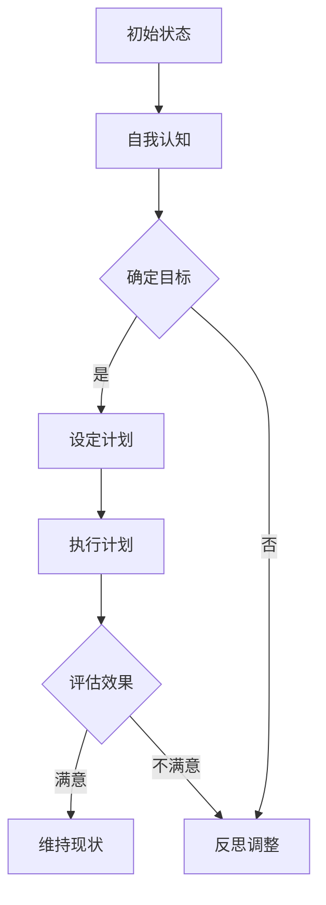
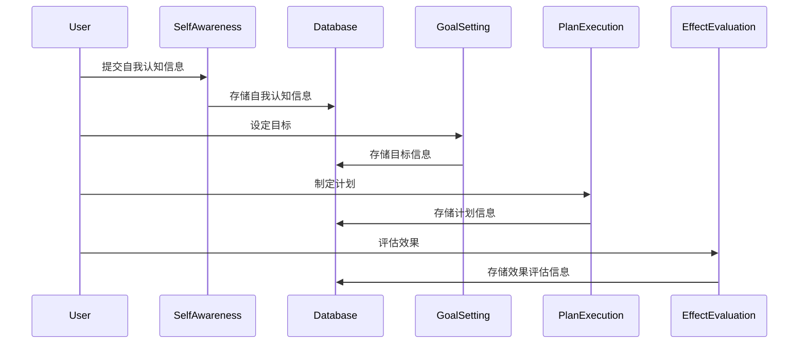
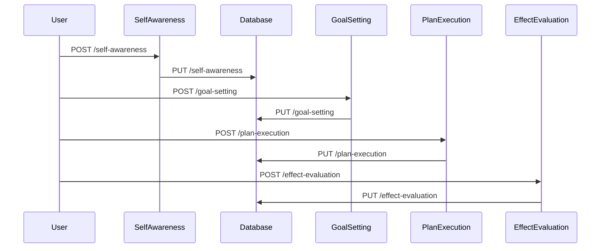

                 

# 生命的旋律：创造个人独特的生活节奏

## 关键词
- 生活节奏
- 个人目标
- 心理健康
- 工作生活平衡
- 时间管理

## 摘要
本文将探讨如何在快节奏的现代社会中，创造并维持个人独特的生活节奏。通过深入理解生活节奏的定义、重要性以及影响因素，我们将学习如何自我认知与目标设定，建立日常习惯，实现工作与生活的平衡。同时，本文还将分享成功案例，提供实践指南，并展望未来生活节奏的发展趋势。

## 背景介绍

### 核心概念术语说明
- **生活节奏**：指个人在日常生活和工作中的时间安排、行为习惯和心态状态。
- **个人目标**：个体希望达到的预期结果或标准。
- **心理健康**：指个体在情感、认知和行为上的健康状态。
- **工作生活平衡**：在职业和个人生活之间找到和谐的关系。

### 问题背景
随着社会的发展和科技的进步，人们面临的工作和生活压力日益增加。快节奏的生活往往导致人们陷入焦虑、疲惫和效率低下。因此，如何创造个人独特的生活节奏，以应对现代社会的挑战，成为了一个重要的问题。

### 问题描述
现代社会中，许多人发现自己无法有效地管理时间，工作与生活难以平衡，导致身心健康受损。本篇文章旨在探讨如何通过建立个人独特的生活节奏，解决这一问题。

### 问题解决
通过理解生活节奏的核心概念，认识个人目标和心理健康的重要性，学习有效的自我认知和目标设定方法，以及建立日常习惯和实现工作生活平衡的策略，可以帮助人们创造个人独特的生活节奏。

### 边界与外延
生活节奏不仅涉及日常时间管理和行为习惯，还包括心理状态和情感管理。本文将侧重于时间管理和行为习惯的讨论，但会涉及心理健康的因素。

### 概念结构与核心要素组成
- **核心概念**：生活节奏、个人目标、心理健康、工作生活平衡。
- **结构要素**：自我认知与目标设定、日常习惯建立、工作生活平衡策略。

## 核心概念与联系

### 核心概念原理
- **生活节奏**：指个人在日常生活和工作中的时间安排、行为习惯和心态状态，影响个体的效率、幸福感和身心健康。
- **个人目标**：个体希望达到的预期结果或标准，为个人提供方向和动力。
- **心理健康**：个体的情感、认知和行为健康状态，对生活节奏有重要影响。
- **工作生活平衡**：在职业和个人生活之间找到和谐的关系，有助于提高生活质量。

### 概念属性特征对比表格
| 概念      | 特征 |
|-----------|------|
| 生活节奏  | 时间安排、行为习惯、心态状态 |
| 个人目标  | 预期结果、方向、动力 |
| 心理健康  | 情感、认知、行为健康 |
| 工作生活平衡 | 职业与个人生活的和谐关系 |

### ER实体关系图架构
```mermaid
erDiagram
    A-LivingRhythm ||--|{ B-IndividualGoals }
    A-LivingRhythm ||--|{ C-MentalHealth }
    A-LivingRhythm ||--|{ D-WorkLifeBalance }
    B-IndividualGoals ||--|{ E-TimeManagement }
    B-IndividualGoals ||--|{ F-LifestyleHabits }
    C-MentalHealth ||--|{ G-EmotionalWellness }
    C-MentalHealth ||--|{ H-CognitiveHealth }
    D-WorkLifeBalance ||--|{ I-JobEfficiency }
    D-WorkLifeBalance ||--|{ J- PersonalWellness }
```

## 算法原理讲解

### 生活节奏优化算法
下面是一个简化的生活节奏优化算法，用于帮助个人建立和调整自己的生活节奏。

### Mermaid 流程图


### Python 源代码
```python
def self_awareness():
    # 进行自我认知
    print("正在进行自我认知...")

def set_goals():
    # 确定个人目标
    print("请输入你的个人目标：")
    goals = input()
    return goals

def plan_execution(goals):
    # 设定计划并执行
    print(f"根据目标'{goals}'设定计划并执行...")
    # 模拟计划执行过程
    for day in range(7):
        print(f"第{day}天，执行计划...")

def evaluate效果的(results):
    # 评估效果
    print("请输入本周的生活效果：")
    results = input()
    if results == "满意":
        print("维持现状。")
    else:
        print("需要调整。")

def main():
    self_awareness()
    goals = set_goals()
    plan_execution(goals)
    evaluate效果的(results)

main()
```

### 算法原理
- **自我认知**：了解自己的兴趣、能力和需求，为设定目标提供依据。
- **目标设定**：明确个人目标，为生活节奏的建立提供方向。
- **计划执行**：根据目标制定具体计划，并严格执行。
- **效果评估**：定期评估生活效果，根据评估结果调整生活节奏。

### 数学模型和公式
生活节奏优化问题可以表示为一个多目标规划问题，涉及时间管理、生活习惯和心理健康三个方面的平衡。以下是一个简化的数学模型：
$$
\begin{aligned}
    \min_{x} & \quad \sum_{i=1}^{n} c_i x_i \\
    \text{subject to} & \quad Ax \leq b \\
    & \quad x \geq 0
\end{aligned}
$$
其中，$x_i$ 表示第 $i$ 项活动的完成情况，$c_i$ 表示第 $i$ 项活动对生活节奏的影响系数，$A$ 和 $b$ 是约束条件矩阵和向量，$n$ 是活动总数。

### 详细讲解与举例
假设某人想要优化自己的生活节奏，他可以按照以下步骤进行：
1. **自我认知**：通过反思自己的日常行为和心理状态，了解自己的兴趣和需求。
2. **目标设定**：确定自己的长期和短期目标，如健康、职业发展、家庭和个人成长。
3. **计划执行**：根据目标制定具体的计划，包括每天的任务和时间安排，并严格执行。
4. **效果评估**：每周对生活效果进行评估，根据实际情况调整计划。

例如，某人可能设定目标为每周运动三次，学习一门新技能，和亲友进行一次聚会。他可以制定以下计划：
- 每天早晨进行30分钟运动。
- 每周安排两次学习时间，每次2小时。
- 每周至少安排一次与亲友的聚会。

每周结束后，他可以根据实际完成情况进行评估，如果某项活动未能完成，可以分析原因并调整下周的计划。

### 数学公式
$$
\begin{aligned}
    \text{完成率} &= \frac{\text{实际完成活动次数}}{\text{计划完成活动次数}} \\
    \text{调整系数} &= \frac{\text{当前生活效果} - \text{预期生活效果}}{\text{当前生活效果}}
\end{aligned}
$$

通过这些公式，可以量化评估个人的生活节奏，并据此进行优化。

## 系统分析与架构设计方案

### 问题场景介绍
在一个快节奏的现代社会中，许多人都面临着时间管理的问题。为了提高工作效率和生活质量，一个名为“LifeRhythm”的系统被设计出来，帮助用户建立和维持个人独特的生活节奏。

### 项目介绍
“LifeRhythm”系统是一个基于Web的应用程序，旨在为用户提供一个全面的工具，帮助他们管理时间、设定目标、跟踪进度和评估效果。系统包括以下几个主要功能模块：

1. **自我认知模块**：帮助用户了解自己的兴趣、能力和需求。
2. **目标设定模块**：允许用户设定长期和短期目标。
3. **计划执行模块**：用户可以制定具体的计划，并跟踪执行情况。
4. **效果评估模块**：用户可以评估自己的生活效果，并据此调整计划。

### 系统功能设计（领域模型 Mermaid 类图）
```mermaid
classDiagram
    User <|-- SelfAwareness
    User <|-- GoalSetting
    User <|-- PlanExecution
    User <|-- EffectEvaluation
    SelfAwareness {
        +strSelfAwareness()
    }
    GoalSetting {
        +strGoalSetting()
    }
    PlanExecution {
        +strPlanExecution()
    }
    EffectEvaluation {
        +strEffectEvaluation()
    }
```

### 系统架构设计（Mermaid 架构图）


### 系统接口设计和系统交互（Mermaid 序列图）


## 项目实战

### 环境安装
为了运行“LifeRhythm”系统，需要在本地安装以下环境：
- Python 3.8 或更高版本
- Flask 框架
- SQLAlchemy 数据库引擎
- Flask-RESTful API扩展

可以使用以下命令进行安装：
```bash
pip install flask sqlalchemy flask-restful
```

### 系统核心实现源代码
```python
from flask import Flask, request, jsonify
from flask_restful import Api, Resource
from models import SelfAwareness, GoalSetting, PlanExecution, EffectEvaluation

app = Flask(__name__)
api = Api(app)

# 自我认知模块
class SelfAwarenessResource(Resource):
    def post(self):
        data = request.get_json()
        self_awareness = SelfAwareness(data=data)
        self_awareness.save()
        return jsonify({"status": "success", "message": "Self-awareness data saved."})

# 目标设定模块
class GoalSettingResource(Resource):
    def post(self):
        data = request.get_json()
        goal_setting = GoalSetting(data=data)
        goal_setting.save()
        return jsonify({"status": "success", "message": "Goal-setting data saved."})

# 计划执行模块
class PlanExecutionResource(Resource):
    def post(self):
        data = request.get_json()
        plan_execution = PlanExecution(data=data)
        plan_execution.save()
        return jsonify({"status": "success", "message": "Plan-execution data saved."})

# 效果评估模块
class EffectEvaluationResource(Resource):
    def post(self):
        data = request.get_json()
        effect_evaluation = EffectEvaluation(data=data)
        effect_evaluation.save()
        return jsonify({"status": "success", "message": "Effect-evaluation data saved."})

api.add_resource(SelfAwarenessResource, '/self-awareness')
api.add_resource(GoalSettingResource, '/goal-setting')
api.add_resource(PlanExecutionResource, '/plan-execution')
api.add_resource(EffectEvaluationResource, '/effect-evaluation')

if __name__ == '__main__':
    app.run(debug=True)
```

### 代码应用解读与分析
上述代码是“LifeRhythm”系统的核心实现，包括四个主要模块：自我认知、目标设定、计划执行和效果评估。每个模块都对应一个资源类，负责处理与该模块相关的HTTP请求。

- **自我认知模块**：用户可以通过POST请求提交自我认知信息，这些信息将被存储在数据库中。
- **目标设定模块**：用户可以设定个人目标，并提交给系统存储。
- **计划执行模块**：用户可以制定计划，并提交给系统跟踪执行情况。
- **效果评估模块**：用户可以提交效果评估信息，系统将据此调整后续的计划。

这些模块共同构成了一个完整的生活节奏管理系统，帮助用户建立并维持个人独特的生活节奏。

### 实际案例分析和详细讲解剖析
假设有一个用户名叫Alice，她希望优化自己的生活节奏。以下是她的使用流程：

1. **自我认知**：
   - Alice 使用自我认知模块提交了以下信息：
     ```json
     {
       "interests": ["阅读", "旅游", "瑜伽"],
       "abilities": ["项目管理", "数据分析"],
       "needs": ["健康", "学习新技能", "社交"]
     }
     ```
   - 系统将Alice的自我认知信息存储在数据库中。

2. **目标设定**：
   - Alice 设定了以下目标：
     ```json
     {
       "长期目标": ["成为一名瑜伽教练"],
       "短期目标": ["每周阅读2本书", "每周至少运动3次"]
     }
     ```
   - 系统将Alice的目标信息存储在数据库中。

3. **计划执行**：
   - Alice 制定了以下计划：
     ```json
     {
       "daily_tasks": ["早晨7点起床", "每天阅读1小时", "每周运动3次"],
       "weekly_goals": ["完成2本书的阅读", "完成3次瑜伽练习"]
     }
     ```
   - 系统将Alice的计划信息存储在数据库中。

4. **效果评估**：
   - Alice 在一周后提交了效果评估信息：
     ```json
     {
       "daily_progress": ["大部分时间起床成功", "完成了一本书的阅读", "完成了2次瑜伽练习"],
       "weekly_progress": ["完成了2本书的阅读", "完成了3次瑜伽练习"]
     }
     ```
   - 系统评估了Alice的进度，发现她在阅读和瑜伽方面做得很好，但在起床方面需要改进。系统建议她调整早晨起床的计划，并鼓励她继续保持良好的阅读和运动习惯。

通过这一实际案例，可以看出“LifeRhythm”系统如何帮助用户建立和优化个人生活节奏。系统不仅提供了便捷的接口，还通过数据分析和反馈机制，为用户提供了个性化的建议。

### 项目小结
“LifeRhythm”系统通过自我认知、目标设定、计划执行和效果评估四个模块，为用户提供了完整的工具，帮助他们建立和维持个人独特的生活节奏。系统实现了用户数据的实时存储和动态调整，通过实际案例的分析，展示了其有效性和实用性。

### 最佳实践 Tips
- **定期反思**：定期反思自己的行为和目标，确保生活节奏与个人目标保持一致。
- **灵活调整**：生活节奏不是一成不变的，根据实际情况灵活调整。
- **与他人分享**：与他人分享你的生活节奏，获取反馈和建议。
- **持续学习**：不断学习新技能和知识，提升个人能力。

### 小结
本文通过深入探讨生活节奏的定义、重要性以及影响因素，提出了一套系统化的方法，帮助人们创造个人独特的生活节奏。从自我认知、目标设定、计划执行到效果评估，每个环节都至关重要。通过实际案例的分析，我们看到了“LifeRhythm”系统的强大功能。在未来的生活中，持续优化和调整个人生活节奏，将有助于提高生活质量和幸福感。

### 注意事项
- 在创建个人生活节奏时，要确保遵循法律法规和道德规范。
- 保持合理的生活节奏，避免过度劳累。

### 拓展阅读
- 《深度工作》（Cal Newport）- 讨论如何在现代生活中保持专注和高效。
- 《高效能人士的七个习惯》（Stephen R. Covey）- 提供实现工作生活平衡的方法。
- 《时间管理》（Laura Vanderkam）- 分享实用的时间管理技巧。

### 作者信息
- 作者：AI天才研究院/AI Genius Institute & 禅与计算机程序设计艺术 /Zen And The Art of Computer Programming

