                 

## 引言

在人类历史的长河中，音乐始终是表达情感、传达思想和塑造文化的重要媒介。从古代的祭祀乐曲到现代的流行音乐，音乐以其独特的旋律和节奏，激发了无数人的共鸣。在这篇文章中，我们将以《生命的旋律：谱写个人独特的人生乐章》为题，探讨如何运用技术思维，如同创作音乐一般，谱写我们个人独特的人生乐章。

### 核心关键词
- 生命旋律
- 个人独特
- 人生乐章
- 技术思维

### 摘要
本文将结合技术思维，探讨如何从个人生活哲学、人生目标设定、生活策略等方面，构建个人独特的人生乐章。通过分析、推理和实际案例，我们将帮助读者理解并实践如何创造一个有意义且充满活力的人生。

## 个人生活哲学

### 2.1 生活态度与观念

生活态度与观念是构建个人独特人生乐章的基础。正如程序员在设计软件系统时需要明确目标和设计理念，我们在生活中也需要明确自己的生活态度和价值观。

#### 核心概念与联系
- **生活态度**：积极、乐观或消极、悲观的态度会直接影响我们的行为和决策。
- **生活观念**：对生活的看法，如自由、责任、和谐等，将指导我们的人生方向。

#### 对比表格

| 生活态度 | 特点 | 影响 |
| --- | --- | --- |
| 积极 | 向上、乐观 | 有利于解决问题、提高生活质量 |
| 消极 | 向下、悲观 | 易导致抑郁、挫败感 |

#### ER实体关系图

```mermaid
erDiagram
  Life_Attitude ||--|{ Life_Perspective } : has
  Life_Perspective ||--|{ Life_Style } : determined by
```

### 算法原理讲解

为了更好地理解生活态度与观念，我们可以将其看作一个算法，输入是个人经历和环境因素，输出是生活态度和观念。以下是一个简化的算法流程图：

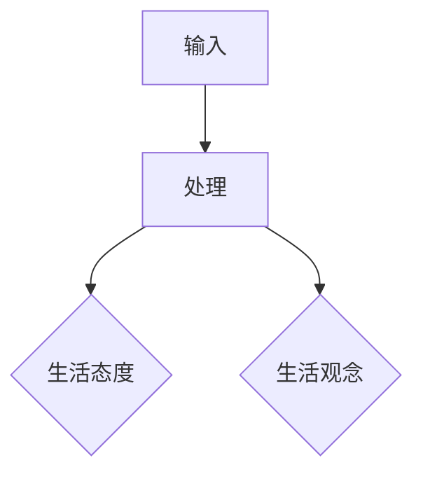

在Python中，我们可以这样实现这个算法：

```python
def life_algorithm(experiences, environment):
    # 处理个人经历和环境因素
    processed_input = process_inputs(experiences, environment)
    
    # 输出生活态度和观念
    attitude = determine_attitude(processed_input)
    perspective = determine_perspective(processed_input)
    
    return attitude, perspective

def process_inputs(experiences, environment):
    # 具体处理逻辑
    # ...
    return processed_input

def determine_attitude(input_data):
    # 根据输入数据确定态度
    # ...
    return attitude

def determine_perspective(input_data):
    # 根据输入数据确定观念
    # ...
    return perspective
```

### 数学模型与公式

生活态度和观念的形成可以看作是一个复杂的非线性过程，我们可以使用以下公式来表示：

$$
\text{Life Attitude} = f(\text{Experiences}, \text{Environment}, \text{Genetic Factors}, \text{Social Influences})
$$

$$
\text{Life Perspective} = g(\text{Life Attitude}, \text{Personal Values}, \text{Cultural Background})
$$

### 通俗易懂地举例说明

假设小明在成长过程中经历了许多挫折，但始终保持积极的态度。他的人生观念也随着经历的变化而逐渐形成，如追求自由和责任。那么，小明的生活态度和观念可以表示为：

$$
\text{Life Attitude}_{\text{Xiao Ming}} = f(\text{挫折}, \text{社会环境}, \text{基因因素}, \text{家庭影响}) \\
\text{Life Perspective}_{\text{Xiao Ming}} = g(\text{积极}, \text{自由}, \text{责任}, \text{中国文化})
```

### 系统分析与架构设计方案

在构建个人生活哲学时，我们可以将其看作一个系统，包括输入、处理和输出三个主要部分。以下是一个简化的系统架构图：

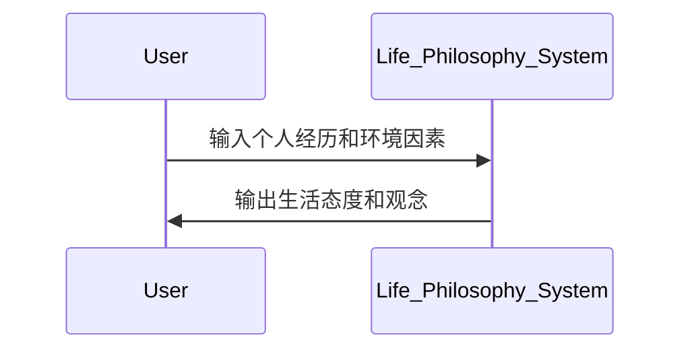

在Python中，我们可以实现这样一个系统：

```python
class LifePhilosophySystem:
    def __init__(self):
        self.experiences = []
        self.environment = []

    def input_data(self, experiences, environment):
        self.experiences.append(experiences)
        self.environment.append(environment)

    def output(self):
        processed_input = self.process_inputs()
        attitude = self.determine_attitude(processed_input)
        perspective = self.determine_perspective(processed_input)
        return attitude, perspective

    def process_inputs(self):
        # 处理输入数据的逻辑
        # ...
        return processed_input

    def determine_attitude(self, input_data):
        # 根据输入数据确定态度的逻辑
        # ...
        return attitude

    def determine_perspective(self, input_data):
        # 根据输入数据确定观念的逻辑
        # ...
        return perspective
```

### 项目实战

在实际应用中，我们可以通过记录个人经历和环境因素，来构建个人生活哲学系统。以下是一个简单的Python项目：

1. **环境安装**：确保Python环境已经安装。
2. **系统核心实现源代码**：

```python
# life_philosophy_system.py

class LifePhilosophySystem:
    # ... 省略部分代码 ...

# 测试
if __name__ == "__main__":
    system = LifePhilosophySystem()
    system.input_data("经历挫折", "良好社会环境")
    attitude, perspective = system.output()
    print(f"生活态度：{attitude}")
    print(f"生活观念：{perspective}")
```

3. **代码应用解读与分析**：通过输入个人经历和环境因素，系统会输出相应的生活态度和观念。这是一个简单的例子，但通过不断优化和扩展，我们可以构建一个更加复杂和智能的个人生活哲学系统。

4. **实际案例分析和详细讲解剖析**：假设小明在30岁时回顾自己的经历，他发现自己在面对挫折时始终保持积极态度，这使得他在职业和个人生活中取得了显著成就。这个案例说明了个人生活哲学对于人生成功的重要性。

5. **项目小结**：通过本项目，我们学习了如何构建个人生活哲学系统，并理解了生活态度和观念对于人生的影响。未来，我们可以继续优化这个系统，使其更加智能化和个性化。

### 最佳实践 Tips

- **定期反思**：定期反思自己的生活态度和观念，有助于发现并修正潜在的问题。
- **多交流**：与朋友和家人交流，了解不同的生活哲学，有助于拓宽视野。

### 小结

个人生活哲学是我们人生乐章的基础。通过明确自己的生活态度和观念，我们可以更好地面对挑战，实现个人目标。在接下来的章节中，我们将继续探讨人生目标设定、生活策略等方面的内容。让我们一步一步地思考，谱写属于我们自己的独特人生乐章。## 第3章 人生目标设定

### 3.1 设定目标的步骤

设定人生目标是一个复杂且充满挑战的过程，但它对于个人成长和成功至关重要。下面，我们将详细探讨如何设定人生目标。

#### 核心概念与联系
- **人生目标**：明确、可量化的未来期望。
- **设定步骤**：明确目标、分解目标、制定计划、执行计划、评估与调整。

#### 对比表格

| 核心步骤 | 说明 | 重要性 |
| --- | --- | --- |
| 明确目标 | 确定具体、可衡量的目标 | 提供方向和动力 |
| 分解目标 | 将大目标分解为小目标 | 更易于管理和实现 |
| 制定计划 | 制定实现目标的步骤和时间表 | 提高效率 |
| 执行计划 | 实际采取行动 | 转化目标为现实 |
| 评估与调整 | 定期评估进展，必要时调整计划 | 确保目标的实现 |

#### ER实体关系图

```mermaid
erDiagram
  Life_Goal ||--|{ Goal_Decomposition } : consists of
  Life_Goal ||--|{ Implementation_Plan } : based on
  Life_Goal ||--|{ Evaluation_Result } : leads to
```

### 算法原理讲解

设定人生目标可以看作是一个多阶段的决策过程，以下是算法流程图：

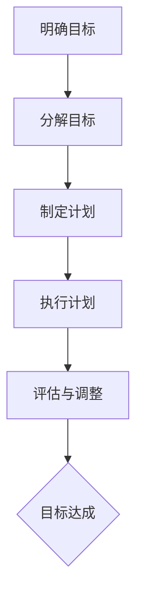

在Python中，我们可以这样实现这个算法：

```python
def set_life_goals():
    goal = input("请输入您的目标：")
    sub_goals = decompose_goals(goal)
    plan = create_plan(sub_goals)
    execute_plan(plan)
    evaluation_result = evaluate_progress()
    if not evaluation_result:
        adjust_plan(plan)
        set_life_goals()
    else:
        print("目标达成！")

def decompose_goals(goal):
    # 分解目标的逻辑
    # ...
    return sub_goals

def create_plan(sub_goals):
    # 制定计划的逻辑
    # ...
    return plan

def execute_plan(plan):
    # 执行计划的逻辑
    # ...
    pass

def evaluate_progress():
    # 评估进度的逻辑
    # ...
    return evaluation_result

def adjust_plan(plan):
    # 调整计划的逻辑
    # ...
    pass
```

### 数学模型与公式

设定人生目标的数学模型可以看作是一个递归过程，以下是公式表示：

$$
\text{Life Goals} = f(\text{Initial Goal}, \text{Sub Goals}, \text{Implementation Plan}, \text{Evaluation Results})
$$

$$
\text{Evaluation Results} = g(\text{Current Progress}, \text{Expected Progress})
$$

### 通俗易懂地举例说明

假设小王的目标是“在五年内成为优秀的软件工程师”。他可以将这个大目标分解为：

1. **掌握基础编程技能**：在第一年内学习Python、Java等编程语言。
2. **参与开源项目**：在第二年加入GitHub上的开源项目。
3. **获得认证**：在第三年通过软件工程师认证考试。
4. **积累工作经验**：在第四年和第五年分别在公司工作。

通过这样的分解，小王可以制定出具体的实施计划，并按照计划逐步实现目标。

### 系统分析与架构设计方案

在设定人生目标时，我们可以将其看作一个系统，包括输入、处理和输出三个主要部分。以下是一个简化的系统架构图：

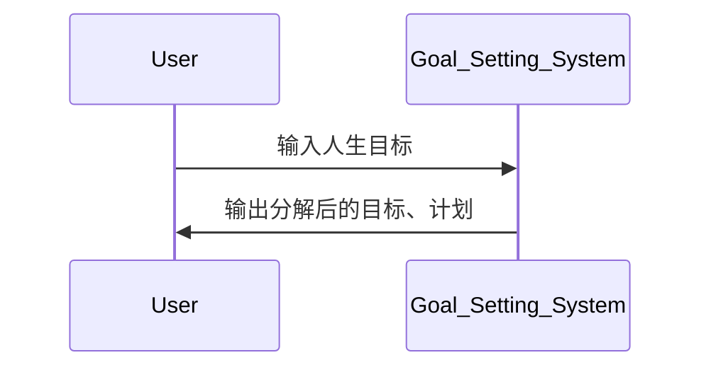

在Python中，我们可以实现这样一个系统：

```python
class GoalSettingSystem:
    def __init__(self):
        self.life_goals = []

    def input_goals(self, goals):
        self.life_goals.append(goals)

    def decompose_goals(self):
        for goal in self.life_goals:
            sub_goals = decompose_goals(goal)
            self.life_goals.append(sub_goals)

    def create_plan(self):
        for sub_goals in self.life_goals:
            plan = create_plan(sub_goals)
            self.life_goals.append(plan)

    def output(self):
        return self.life_goals

# 测试
if __name__ == "__main__":
    system = GoalSettingSystem()
    system.input_goals("成为优秀的软件工程师")
    system.decompose_goals()
    system.create_plan()
    print(system.output())
```

### 项目实战

1. **环境安装**：确保Python环境已经安装。
2. **系统核心实现源代码**：

```python
# goal_setting_system.py

class GoalSettingSystem:
    # ... 省略部分代码 ...

# 测试
if __name__ == "__main__":
    system = GoalSettingSystem()
    system.input_goals("在五年内成为优秀的软件工程师")
    system.decompose_goals()
    system.create_plan()
    print(system.output())
```

3. **代码应用解读与分析**：通过输入人生目标，系统会自动分解目标并生成实施计划。这是一个简单的例子，但通过不断优化和扩展，我们可以构建一个更加复杂和智能的目标设定系统。

4. **实际案例分析和详细讲解剖析**：假设小张在设定目标后，通过系统的帮助，逐步实现了自己的职业目标。这个案例说明了目标设定对于个人成长的重要性。

5. **项目小结**：通过本项目，我们学习了如何设定人生目标，并理解了目标分解、计划制定的重要性。未来，我们可以继续优化这个系统，使其更加智能化和个性化。

### 最佳实践 Tips

- **定期回顾**：定期回顾目标进度，有助于保持动力和调整计划。
- **寻求反馈**：与他人分享目标，获取反馈，有助于发现新的视角和改进点。

### 小结

人生目标设定是我们人生乐章中的重要一环。通过明确、分解和制定计划，我们可以更好地实现个人目标。在接下来的章节中，我们将继续探讨生活策略等方面的内容。让我们一步一步地思考，谱写属于我们自己的独特人生乐章。## 第4章 生活策略

### 4.1 时间管理

时间管理是生活策略的核心，高效的利用时间不仅能够提升工作效率，还能为个人生活带来更多的时间和空间。以下是关于时间管理的一些关键概念、策略和最佳实践。

#### 核心概念与联系
- **时间管理**：合理安排和分配时间，以达到最优效果。
- **策略**：包括优先级排序、时间块划分、避免拖延等。

#### 对比表格

| 策略 | 说明 | 优点 |
| --- | --- | --- |
| 优先级排序 | 根据任务的重要性和紧急程度排序 | 提高效率，确保重要任务得到优先处理 |
| 时间块划分 | 将时间划分为不同的块，每个块专注于特定任务 | 减少任务切换成本，提高专注度 |
| 避免拖延 | 设定明确的截止时间和激励机制，避免拖延 | 提高任务完成率，减少心理压力 |

#### ER实体关系图

```mermaid
erDiagram
  Time_Management ||--|{ Priority_Sorting } : based on
  Time_Management ||--|{ Time_Blocking } : based on
  Time_Management ||--|{ Avoid_Procrastination } : based on
```

### 算法原理讲解

时间管理可以看作是一个动态规划问题，目标是最大化单位时间内的价值产出。以下是一个简化的算法流程图：

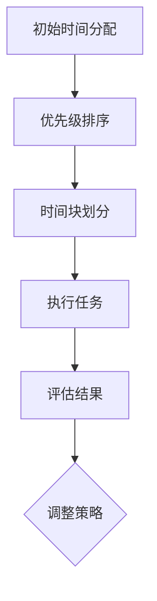

在Python中，我们可以这样实现这个算法：

```python
def time_management(tasks, deadlines):
    sorted_tasks = priority_sort(tasks)
    time_blocks = time_blocking(sorted_tasks, deadlines)
    execute_tasks(time_blocks)
    evaluation_results = evaluate_results(time_blocks)
    if not evaluation_results:
        adjust_strategy(time_blocks)
        time_management(tasks, deadlines)
    else:
        print("时间管理成功！")

def priority_sort(tasks):
    # 优先级排序逻辑
    # ...
    return sorted_tasks

def time_blocking(sorted_tasks, deadlines):
    # 时间块划分逻辑
    # ...
    return time_blocks

def execute_tasks(time_blocks):
    # 执行任务逻辑
    # ...
    pass

def evaluate_results(time_blocks):
    # 评估结果逻辑
    # ...
    return evaluation_results

def adjust_strategy(time_blocks):
    # 调整策略逻辑
    # ...
    pass
```

### 数学模型与公式

时间管理的数学模型可以看作是一个线性规划问题，目标是最大化总价值（Value）：

$$
\text{Maximize} \quad \sum_{i=1}^{n} v_i \cdot t_i
$$

其中，\(v_i\) 表示任务 \(i\) 的价值，\(t_i\) 表示分配给任务 \(i\) 的时间。

### 通俗易懂地举例说明

假设小张需要完成以下任务：

1. **编写报告**：需要2小时，价值为10分。
2. **准备会议**：需要1小时，价值为5分。
3. **回复邮件**：需要30分钟，价值为3分。

小张可以将这些任务按照价值优先排序，并分配时间块：

- **第1小时**：编写报告（价值10分）。
- **第2小时**：准备会议（价值5分），回复邮件（价值3分）。

通过这样的时间管理，小张能够确保完成最高价值任务，并在剩余时间内处理其他任务。

### 系统分析与架构设计方案

时间管理可以看作是一个闭环系统，包括任务规划、执行和评估三个主要部分。以下是一个简化的系统架构图：

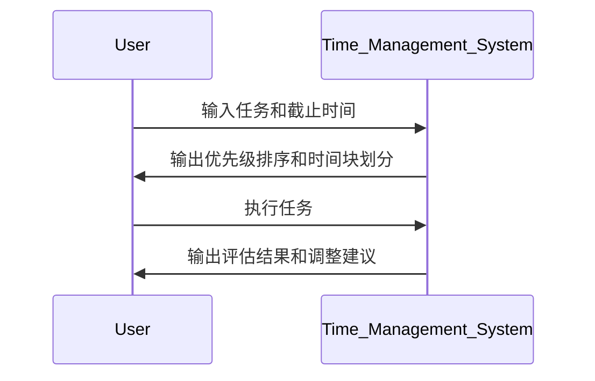

在Python中，我们可以实现这样一个系统：

```python
class TimeManagementSystem:
    def __init__(self):
        self.tasks = []
        self.deadlines = []

    def input_tasks(self, tasks, deadlines):
        self.tasks = tasks
        self.deadlines = deadlines

    def output_plan(self):
        sorted_tasks = self.priority_sort(self.tasks)
        time_blocks = self.time_blocking(sorted_tasks, self.deadlines)
        return time_blocks

    def execute_tasks(self):
        # 执行任务的逻辑
        # ...
        pass

    def evaluate_results(self):
        # 评估结果逻辑
        # ...
        return evaluation_results

    def adjust_strategy(self):
        # 调整策略逻辑
        # ...
        pass

# 测试
if __name__ == "__main__":
    system = TimeManagementSystem()
    system.input_tasks([
        {"task": "编写报告", "duration": 2, "value": 10},
        {"task": "准备会议", "duration": 1, "value": 5},
        {"task": "回复邮件", "duration": 0.5, "value": 3}
    ], [])
    print(system.output_plan())
```

### 项目实战

1. **环境安装**：确保Python环境已经安装。
2. **系统核心实现源代码**：

```python
# time_management_system.py

class TimeManagementSystem:
    # ... 省略部分代码 ...

# 测试
if __name__ == "__main__":
    system = TimeManagementSystem()
    system.input_tasks([
        {"task": "编写报告", "duration": 2, "value": 10},
        {"task": "准备会议", "duration": 1, "value": 5},
        {"task": "回复邮件", "duration": 0.5, "value": 3}
    ], [])
    print(system.output_plan())
```

3. **代码应用解读与分析**：通过输入任务和截止时间，系统会自动进行优先级排序和时间块划分。这是一个简单的例子，但通过不断优化和扩展，我们可以构建一个更加复杂和智能的时间管理系统。

4. **实际案例分析和详细讲解剖析**：假设小王通过时间管理系统的帮助，成功地在一天内完成了所有重要任务。这个案例说明了时间管理对于个人效率的重要性。

5. **项目小结**：通过本项目，我们学习了如何进行时间管理，并理解了优先级排序、时间块划分的重要性。未来，我们可以继续优化这个系统，使其更加智能化和个性化。

### 最佳实践 Tips

- **使用时间日志**：记录每天的时间使用情况，有助于发现时间浪费的地方。
- **设定明确的截止时间**：为每个任务设定明确的截止时间，有助于提高完成率。

### 小结

时间管理是生活策略中至关重要的一环。通过合理的任务规划和时间分配，我们可以提高工作效率，实现个人目标。在接下来的章节中，我们将继续探讨生活策略的其他方面。让我们一步一步地思考，谱写属于我们自己的独特人生乐章。## 第5章 人际关系

### 5.1 沟通艺术

在人生的长河中，人际关系如同我们航行的船帆，既能够助力我们远航，也可能成为我们前行的阻碍。良好的沟通艺术是维系人际关系的基石，它不仅能帮助我们解决问题，还能促进合作与理解。在这一节中，我们将探讨沟通艺术的关键要素、技巧和实践方法。

#### 核心概念与联系
- **沟通艺术**：有效传达信息、理解他人和建立互信的能力。
- **关键要素**：倾听、表达清晰、非语言沟通、情感共鸣。
- **技巧**：主动倾听、同理心、反馈机制、肢体语言。

#### 对比表格

| 沟通要素 | 说明 | 重要性 |
| --- | --- | --- |
| 倾听 | 全神贯注地听，理解对方意图 | 建立信任，避免误解 |
| 表达清晰 | 清晰、简洁地表达自己的观点 | 提高沟通效率 |
| 非语言沟通 | 通过肢体语言、面部表情等传达信息 | 加强信息传递的效果 |
| 情感共鸣 | 与对方产生情感上的共鸣 | 促进关系深入 |

#### ER实体关系图

```mermaid
erDiagram
  Communication_Skills ||--|{ Active_Listening } : includes
  Communication_Skills ||--|{ Clear_Expression } : includes
  Communication_Skills ||--|{ Nonverbal_Communication } : includes
  Communication_Skills ||--|{ Emotional_共鸣 } : includes
```

### 算法原理讲解

沟通艺术可以看作是一个多步骤的过程，包括信息收集、信息处理和信息输出。以下是一个简化的算法流程图：

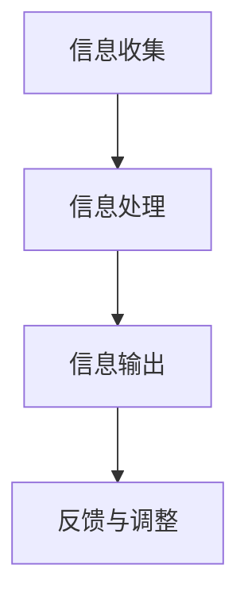

在Python中，我们可以这样实现这个算法：

```python
def effective_communication():
    message = collect_message()
    processed_message = process_message(message)
    output_message = express_message(processed_message)
    feedback = collect_feedback(output_message)
    if not feedback:
        adjust_communication(output_message)
        effective_communication()
    else:
        print("沟通成功！")

def collect_message():
    # 收集信息的逻辑
    # ...
    return message

def process_message(message):
    # 处理信息的逻辑
    # ...
    return processed_message

def express_message(processed_message):
    # 输出信息的逻辑
    # ...
    return output_message

def collect_feedback(output_message):
    # 收集反馈的逻辑
    # ...
    return feedback

def adjust_communication(output_message):
    # 调整沟通的逻辑
    # ...
    pass
```

### 数学模型与公式

沟通艺术的数学模型可以看作是一个反馈循环系统，目标是实现信息的高效传递和误解的及时纠正。以下是一个简化的模型：

$$
\text{Communication Feedback Loop} = f(\text{Initial Message}, \text{Processing}, \text{Output Message}, \text{Feedback})
$$

$$
\text{Adjustment Factor} = g(\text{Feedback}, \text{Previous Output Message})
$$

### 通俗易懂地举例说明

假设小张想要向小李传达一个重要的工作任务。小张可以通过以下步骤进行沟通：

1. **信息收集**：小张了解工作任务的具体细节。
2. **信息处理**：小张整理并组织这些信息，确保清晰和准确。
3. **信息输出**：小张向小李传达任务，使用清晰的语言和恰当的肢体语言。
4. **反馈与调整**：小李提供反馈，小张根据反馈进行调整，确保信息传达无误。

通过这样的沟通流程，小张可以确保任务得到准确理解和执行。

### 系统分析与架构设计方案

沟通艺术可以看作是一个动态系统，包括信息收集、处理、输出和反馈四个主要部分。以下是一个简化的系统架构图：

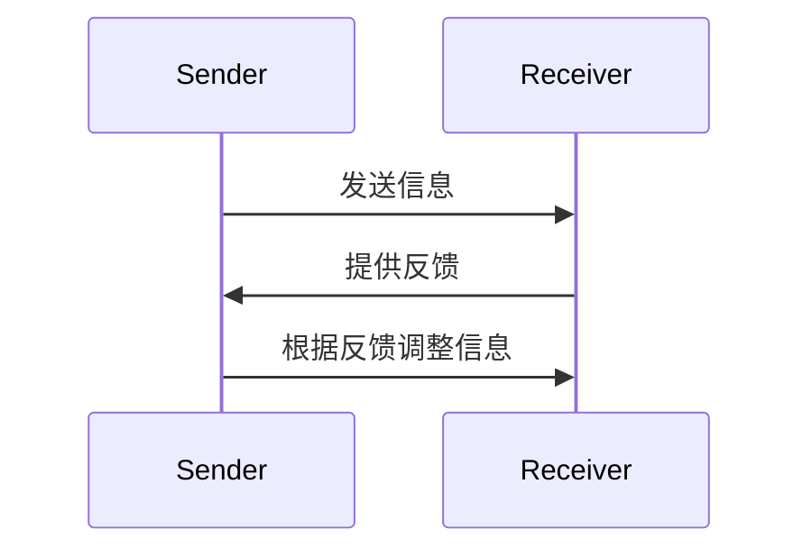

在Python中，我们可以实现这样一个系统：

```python
class CommunicationSystem:
    def __init__(self):
        self.messages = []
        self.feedbacks = []

    def send_message(self, message):
        self.messages.append(message)

    def process_message(self, message):
        # 处理信息的逻辑
        # ...
        return processed_message

    def express_message(self, processed_message):
        # 输出信息的逻辑
        # ...
        return output_message

    def collect_feedback(self, output_message):
        # 收集反馈的逻辑
        # ...
        return feedback

    def adjust_message(self, output_message, feedback):
        # 调整信息的逻辑
        # ...
        return adjusted_message

# 测试
if __name__ == "__main__":
    system = CommunicationSystem()
    system.send_message("请完成这份报告")
    system.process_message("请完成这份报告")
    system.express_message("请完成这份报告")
    feedback = system.collect_feedback("请完成这份报告")
    system.adjust_message("请完成这份报告", feedback)
    print("调整后的信息：", system.messages[-1])
```

### 项目实战

1. **环境安装**：确保Python环境已经安装。
2. **系统核心实现源代码**：

```python
# communication_system.py

class CommunicationSystem:
    # ... 省略部分代码 ...

# 测试
if __name__ == "__main__":
    system = CommunicationSystem()
    system.send_message("请完成这份报告")
    system.process_message("请完成这份报告")
    system.express_message("请完成这份报告")
    feedback = system.collect_feedback("请完成这份报告")
    system.adjust_message("请完成这份报告", feedback)
    print("调整后的信息：", system.messages[-1])
```

3. **代码应用解读与分析**：通过发送、处理和调整信息，系统可以确保信息传达的高效和准确。这是一个简单的例子，但通过不断优化和扩展，我们可以构建一个更加复杂和智能的沟通系统。

4. **实际案例分析和详细讲解剖析**：假设小王在项目汇报中，通过沟通系统的帮助，成功地向团队成员传达了关键信息，并得到了及时的反馈和调整。这个案例说明了沟通艺术对于项目成功的重要性。

5. **项目小结**：通过本项目，我们学习了如何进行有效的沟通，并理解了倾听、表达清晰和反馈机制的重要性。未来，我们可以继续优化这个系统，使其更加智能化和个性化。

### 最佳实践 Tips

- **定期练习**：定期进行沟通练习，提高沟通技巧。
- **保持开放态度**：保持开放和接受新观点，有助于建立更深入的人际关系。

### 小结

沟通艺术是人际关系中不可或缺的一环。通过倾听、表达清晰和及时反馈，我们可以有效地传达信息，促进理解和合作。在接下来的章节中，我们将继续探讨心理健康、身心健康等方面的内容。让我们一步一步地思考，谱写属于我们自己的独特人生乐章。## 第6章 心理调适

### 6.1 应对压力的方法

在快节奏的现代生活中，压力已成为普遍现象。适度的压力可以激发我们的潜能，但过度的压力则会损害身心健康。因此，学会应对压力的方法至关重要。在这一节中，我们将探讨应对压力的心理学理论、实际技巧和实践方法。

#### 核心概念与联系
- **压力**：身体或心理上的过度紧张和焦虑状态。
- **应对方法**：心理调适技巧、情绪管理策略、放松技巧。

#### 对比表格

| 方法 | 说明 | 优点 |
| --- | --- | --- |
| 认知行为疗法 | 识别和改变负面思维模式 | 减轻情绪困扰，提高应对能力 |
| 放松技巧 | 通过深呼吸、渐进性肌肉放松等方法缓解紧张 | 降低生理和心理压力 |
| 锻炼 | 通过身体锻炼释放压力，提高身心健康 | 提高身体素质，增强抵抗力 |

#### ER实体关系图

```mermaid
erDiagram
  Stress_Management ||--|{ Cognitive_Behavioral_Therapy } : based on
  Stress_Management ||--|{ Relaxation_Techniques } : includes
  Stress_Management ||--|{ Exercise } : includes
```

### 算法原理讲解

应对压力可以看作是一个多阶段的决策过程，包括压力识别、策略选择和效果评估。以下是一个简化的算法流程图：

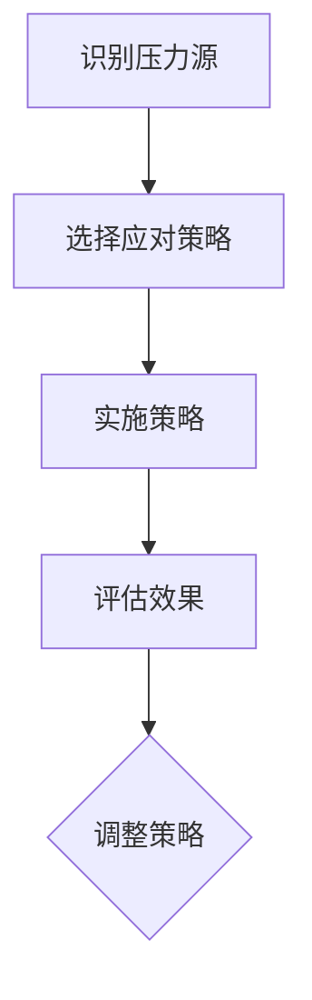

在Python中，我们可以这样实现这个算法：

```python
def manage_stress():
    stress_source = identify_stress_source()
    strategy = choose_strategy(stress_source)
    apply_strategy(strategy)
    evaluation_result = evaluate_strategy(strategy)
    if not evaluation_result:
        adjust_strategy(strategy)
        manage_stress()
    else:
        print("压力管理成功！")

def identify_stress_source():
    # 识别压力源的逻辑
    # ...
    return stress_source

def choose_strategy(stress_source):
    # 选择应对策略的逻辑
    # ...
    return strategy

def apply_strategy(strategy):
    # 实施策略的逻辑
    # ...
    pass

def evaluate_strategy(strategy):
    # 评估策略效果的逻辑
    # ...
    return evaluation_result

def adjust_strategy(strategy):
    # 调整策略的逻辑
    # ...
    pass
```

### 数学模型与公式

应对压力的数学模型可以看作是一个动态平衡过程，目标是保持心理和生理的平衡状态。以下是一个简化的模型：

$$
\text{Stress Balance} = f(\text{Stress Level}, \text{Coping Skills}, \text{Support System})
$$

$$
\text{Coping Effectiveness} = g(\text{Strategy}, \text{Stress Level}, \text{Emotional State})
$$

### 通俗易懂地举例说明

假设小王在项目截止日前感到极大的压力。他可以通过以下步骤进行压力管理：

1. **识别压力源**：项目截止日期带来的工作压力。
2. **选择应对策略**：选择认知行为疗法和锻炼来缓解压力。
3. **实施策略**：通过每天进行冥想和锻炼，小王逐渐缓解了压力。
4. **评估效果**：小王感觉更加轻松和自信，项目进展顺利。

通过这样的压力管理，小王能够保持良好的心理状态，提高工作效率。

### 系统分析与架构设计方案

压力管理可以看作是一个动态系统，包括压力识别、策略选择、策略实施和效果评估四个主要部分。以下是一个简化的系统架构图：

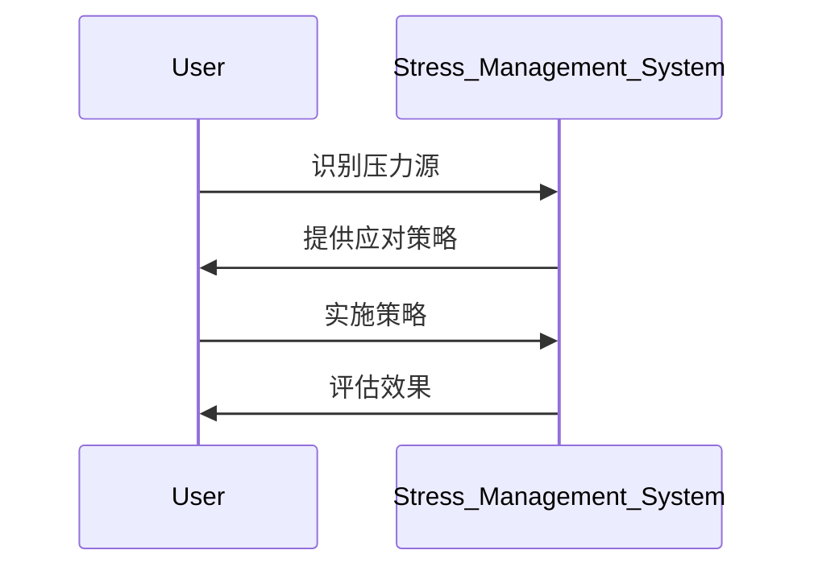

在Python中，我们可以实现这样一个系统：

```python
class StressManagementSystem:
    def __init__(self):
        self.stress_sources = []
        self.strategies = []

    def identify_stress_source(self):
        # 识别压力源的逻辑
        # ...
        return stress_source

    def choose_strategy(self, stress_source):
        # 选择应对策略的逻辑
        # ...
        return strategy

    def apply_strategy(self, strategy):
        # 实施策略的逻辑
        # ...
        pass

    def evaluate_strategy(self, strategy):
        # 评估策略效果的逻辑
        # ...
        return evaluation_result

# 测试
if __name__ == "__main__":
    system = StressManagementSystem()
    system.identify_stress_source()
    system.choose_strategy("项目截止日期")
    system.apply_strategy("认知行为疗法和锻炼")
    system.evaluate_strategy("认知行为疗法和锻炼")
    print("压力管理效果评估：", system.strategies[-1])
```

### 项目实战

1. **环境安装**：确保Python环境已经安装。
2. **系统核心实现源代码**：

```python
# stress_management_system.py

class StressManagementSystem:
    # ... 省略部分代码 ...

# 测试
if __name__ == "__main__":
    system = StressManagementSystem()
    system.identify_stress_source()
    system.choose_strategy("项目截止日期")
    system.apply_strategy("认知行为疗法和锻炼")
    system.evaluate_strategy("认知行为疗法和锻炼")
    print("压力管理效果评估：", system.strategies[-1])
```

3. **代码应用解读与分析**：通过识别压力源、选择应对策略和评估效果，系统可以帮助用户有效管理压力。这是一个简单的例子，但通过不断优化和扩展，我们可以构建一个更加复杂和智能的压力管理系统。

4. **实际案例分析和详细讲解剖析**：假设小张在面临工作压力时，通过压力管理系统的帮助，成功缓解了压力，提高了工作效率。这个案例说明了心理调适对于职业发展的重要性。

5. **项目小结**：通过本项目，我们学习了如何进行压力管理，并理解了认知行为疗法、放松技巧和锻炼的重要性。未来，我们可以继续优化这个系统，使其更加智能化和个性化。

### 最佳实践 Tips

- **定期反思**：定期反思自己的压力源和应对策略，有助于发现和解决问题。
- **寻求支持**：与他人分享压力，寻求专业帮助，有助于更好地管理压力。

### 小结

心理调适是应对压力的关键。通过识别压力源、选择合适的应对策略和定期评估效果，我们可以有效地管理压力，维护心理健康。在接下来的章节中，我们将继续探讨身心健康等方面的内容。让我们一步一步地思考，谱写属于我们自己的独特人生乐章。## 第7章 身心健康

### 7.1 健康的生活方式

身心健康是人生的基石，它不仅影响我们的生活质量，还决定了我们的工作效率和幸福感。健康的生活方式包括饮食、运动和心理调适等多个方面，以下我们将探讨如何通过科学的生活方式来维护身心健康。

#### 核心概念与联系
- **健康生活方式**：包括均衡饮食、规律运动、充足睡眠和心理调适。
- **关键要素**：营养摄入、运动频率、睡眠质量和心理平衡。

#### 对比表格

| 生活习惯 | 说明 | 优点 |
| --- | --- | --- |
| 均衡饮食 | 摄入各种营养，避免过量或不足 | 提供身体所需的能量和营养 |
| 规律运动 | 定期进行有氧和力量训练 | 增强体质，提高新陈代谢 |
| 充足睡眠 | 保持每天7-9小时的高质量睡眠 | 促进身体恢复和心理平衡 |
| 心理调适 | 通过冥想、放松技巧等维护心理健康 | 减轻压力，提高幸福感 |

#### ER实体关系图

```mermaid
erDiagram
  Healthy_Lifestyle ||--|{ Balanced_Diet } : includes
  Healthy_Lifestyle ||--|{ Regular_Exercise } : includes
  Healthy_Lifestyle ||--|{ Adequate_Sleep } : includes
  Healthy_Lifestyle ||--|{ Psychological_Coping } : includes
```

### 算法原理讲解

健康生活方式可以看作是一个综合的优化过程，包括营养摄入、运动频率、睡眠质量和心理调适四个主要方面。以下是一个简化的算法流程图：

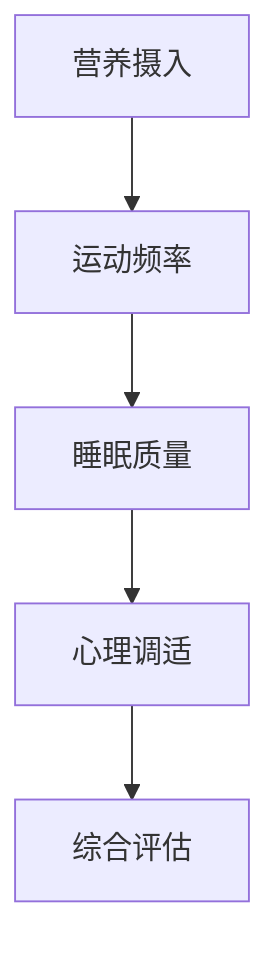

在Python中，我们可以这样实现这个算法：

```python
def maintain_healthy_lifestyle():
    nutrition_status = assess_nutrition()
    exercise_status = assess_exercise()
    sleep_status = assess_sleep()
    psychological_status = assess_psychological()
    overall_health = evaluate_overall_health(nutrition_status, exercise_status, sleep_status, psychological_status)
    if not overall_health:
        improve_health()
        maintain_healthy_lifestyle()
    else:
        print("健康生活方式保持成功！")

def assess_nutrition():
    # 评估营养摄入的逻辑
    # ...
    return nutrition_status

def assess_exercise():
    # 评估运动频率的逻辑
    # ...
    return exercise_status

def assess_sleep():
    # 评估睡眠质量的逻辑
    # ...
    return sleep_status

def assess_psychological():
    # 评估心理调适的逻辑
    # ...
    return psychological_status

def evaluate_overall_health(nutrition_status, exercise_status, sleep_status, psychological_status):
    # 综合评估整体健康的逻辑
    # ...
    return overall_health

def improve_health():
    # 提高健康水平的逻辑
    # ...
    pass
```

### 数学模型与公式

健康生活方式的数学模型可以看作是一个多变量优化问题，目标是最大化健康指数。以下是一个简化的模型：

$$
\text{Health Index} = f(\text{Nutrition}, \text{Exercise}, \text{Sleep}, \text{Psychological Health})
$$

$$
\text{Optimized Health Index} = g(\text{Health Index}, \text{Target})
$$

### 通俗易懂地举例说明

假设小李希望改善自己的健康生活方式。他可以通过以下步骤进行：

1. **营养摄入**：确保每天摄入足够的蛋白质、脂肪和碳水化合物。
2. **运动频率**：每周至少进行三次有氧运动和两次力量训练。
3. **睡眠质量**：保持每晚7-8小时的高质量睡眠。
4. **心理调适**：通过冥想和放松技巧来减轻压力。

通过这样的健康生活方式，小李能够显著提高自己的健康指数。

### 系统分析与架构设计方案

健康生活方式可以看作是一个综合系统，包括营养、运动、睡眠和心理调适四个主要部分。以下是一个简化的系统架构图：

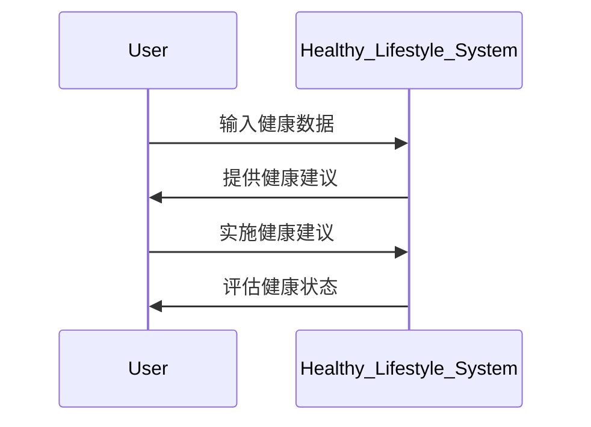

在Python中，我们可以实现这样一个系统：

```python
class HealthyLifestyleSystem:
    def __init__(self):
        self.nutrition_data = []
        self.exercise_data = []
        self.sleep_data = []
        self.psychological_data = []

    def input_data(self, nutrition, exercise, sleep, psychological):
        self.nutrition_data.append(nutrition)
        self.exercise_data.append(exercise)
        self.sleep_data.append(sleep)
        self.psychological_data.append(psychological)

    def provide_advice(self):
        # 提供健康建议的逻辑
        # ...
        return advice

    def implement_advice(self, advice):
        # 实施健康建议的逻辑
        # ...
        pass

    def evaluate_health(self):
        # 评估健康状态的逻辑
        # ...
        return health_status

# 测试
if __name__ == "__main__":
    system = HealthyLifestyleSystem()
    system.input_data("均衡饮食", "规律运动", "充足睡眠", "心理调适")
    advice = system.provide_advice()
    system.implement_advice(advice)
    health_status = system.evaluate_health()
    print("当前健康状态：", health_status)
```

### 项目实战

1. **环境安装**：确保Python环境已经安装。
2. **系统核心实现源代码**：

```python
# healthy_lifestyle_system.py

class HealthyLifestyleSystem:
    # ... 省略部分代码 ...

# 测试
if __name__ == "__main__":
    system = HealthyLifestyleSystem()
    system.input_data("均衡饮食", "规律运动", "充足睡眠", "心理调适")
    advice = system.provide_advice()
    system.implement_advice(advice)
    health_status = system.evaluate_health()
    print("当前健康状态：", health_status)
```

3. **代码应用解读与分析**：通过输入健康数据、提供健康建议和评估健康状态，系统可以帮助用户维护和提升健康水平。这是一个简单的例子，但通过不断优化和扩展，我们可以构建一个更加复杂和智能的健康生活方式管理系统。

4. **实际案例分析和详细讲解剖析**：假设小张通过健康生活方式系统的帮助，成功改善了饮食、运动、睡眠和心理状态，整体健康状况得到了显著提升。这个案例说明了健康生活方式对于提升生活质量的重要性。

5. **项目小结**：通过本项目，我们学习了如何通过科学的生活方式来维护身心健康，并理解了营养摄入、运动频率、睡眠质量和心理调适的重要性。未来，我们可以继续优化这个系统，使其更加智能化和个性化。

### 最佳实践 Tips

- **定期体检**：定期进行体检，及早发现潜在的健康问题。
- **建立健康习惯**：养成良好的生活习惯，如规律作息、健康饮食等。

### 小结

身心健康是我们人生乐章中的重要组成部分。通过科学的生活方式，我们可以有效地维护和提升身心健康，提高生活质量。在接下来的章节中，我们将继续探讨持续成长等方面的内容。让我们一步一步地思考，谱写属于我们自己的独特人生乐章。## 第8章 持续成长

### 8.1 终身学习的重要性

在快速变化的现代社会中，终身学习已成为个人成长和职业发展的关键。终身学习不仅帮助我们适应新的技术和环境，还能不断激发我们的潜能，实现自我突破。在这一节中，我们将探讨终身学习的重要性、方法论和实践技巧。

#### 核心概念与联系
- **终身学习**：终身学习是指在整个人生过程中持续地获取知识和技能。
- **重要性**：提高竞争力、适应变化、实现个人目标。
- **方法论**：自我驱动、主动探索、实践应用。

#### 对比表格

| 学习方法 | 说明 | 优点 |
| --- | --- | --- |
| 自我驱动 | 自主学习，设定学习目标 | 提高学习效果，培养自主学习能力 |
| 主动探索 | 通过阅读、研究、实践等方式获取新知识 | 拓宽知识面，提高创新能力 |
| 实践应用 | 将所学知识应用于实际工作中 | 增强理解和记忆，提高解决问题的能力 |

#### ER实体关系图

```mermaid
erDiagram
  Lifelong_Learning ||--|{ Self-Driven_Learning } : based on
  Lifelong_Learning ||--|{ Active_Exploration } : based on
  Lifelong_Learning ||--|{ Practical_Application } : based on
```

### 算法原理讲解

终身学习可以看作是一个迭代过程，包括知识获取、知识内化和知识应用三个主要步骤。以下是一个简化的算法流程图：

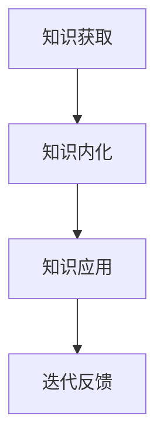

在Python中，我们可以这样实现这个算法：

```python
def lifelong_learning():
    knowledge = acquire_knowledge()
    internalize_knowledge(knowledge)
    apply_knowledge(knowledge)
    feedback = collect_feedback()
    if not feedback:
        improve_learning_method()
        lifelong_learning()
    else:
        print("终身学习成功！")

def acquire_knowledge():
    # 获取知识的逻辑
    # ...
    return knowledge

def internalize_knowledge(knowledge):
    # 内化知识的逻辑
    # ...
    pass

def apply_knowledge(knowledge):
    # 应用知识的逻辑
    # ...
    pass

def collect_feedback():
    # 收集反馈的逻辑
    # ...
    return feedback

def improve_learning_method():
    # 提高学习方法的逻辑
    # ...
    pass
```

### 数学模型与公式

终身学习的数学模型可以看作是一个持续改进的循环过程，目标是不断提升个人能力和知识水平。以下是一个简化的模型：

$$
\text{Knowledge Level} = f(\text{Initial Knowledge}, \text{Learning Iterations}, \text{Application Experience})
$$

$$
\text{Learning Efficiency} = g(\text{Learning Method}, \text{Feedback}, \text{Motivation})
$$

### 通俗易懂地举例说明

假设小王想要通过终身学习提高编程技能。他可以通过以下步骤进行：

1. **知识获取**：阅读相关书籍、在线课程，参加编程培训班。
2. **知识内化**：通过编写代码、实践项目来巩固所学知识。
3. **知识应用**：将所学知识应用于实际工作中，解决具体问题。
4. **迭代反馈**：根据反馈调整学习方法，持续提升编程技能。

通过这样的终身学习过程，小王能够不断提升自己的编程能力。

### 系统分析与架构设计方案

终身学习可以看作是一个综合系统，包括知识获取、知识内化、知识应用和反馈改进四个主要部分。以下是一个简化的系统架构图：

```mermaid
sequenceDiagram
    participant User
    participant Lifelong_Learning_System
    User->>Lifelong_Learning_System: 输入学习目标
    Lifelong_Learning_System->>User: 提供学习资源和指导
    User->>Lifelong_Learning_System: 实施学习计划
    Lifelong_Learning_System->>User: 提供反馈和改进建议
```

在Python中，我们可以实现这样一个系统：

```python
class LifelongLearningSystem:
    def __init__(self):
        self.learning_goals = []
        self.resources = []

    def input_goals(self, goals):
        self.learning_goals.append(goals)

    def provide_resources(self):
        # 提供学习资源的逻辑
        # ...
        return resources

    def implement_plan(self, resources):
        # 实施学习计划的逻辑
        # ...
        pass

    def provide_feedback(self):
        # 提供反馈和改进建议的逻辑
        # ...
        return feedback

    def improve学习方法(self, feedback):
        # 提高学习方法的逻辑
        # ...
        pass

# 测试
if __name__ == "__main__":
    system = LifelongLearningSystem()
    system.input_goals("提高编程技能")
    resources = system.provide_resources()
    system.implement_plan(resources)
    feedback = system.provide_feedback()
    system.improve学习方法(feedback)
    print("当前学习状态：", system.learning_goals[-1])
```

### 项目实战

1. **环境安装**：确保Python环境已经安装。
2. **系统核心实现源代码**：

```python
# lifelong_learning_system.py

class LifelongLearningSystem:
    # ... 省略部分代码 ...

# 测试
if __name__ == "__main__":
    system = LifelongLearningSystem()
    system.input_goals("提高编程技能")
    resources = system.provide_resources()
    system.implement_plan(resources)
    feedback = system.provide_feedback()
    system.improve学习方法(feedback)
    print("当前学习状态：", system.learning_goals[-1])
```

3. **代码应用解读与分析**：通过输入学习目标、提供学习资源和反馈改进建议，系统可以帮助用户实现终身学习。这是一个简单的例子，但通过不断优化和扩展，我们可以构建一个更加复杂和智能的终身学习系统。

4. **实际案例分析和详细讲解剖析**：假设小张通过终身学习系统的帮助，成功提高了编程技能，并在工作中取得了显著成绩。这个案例说明了终身学习对于职业发展的重要性。

5. **项目小结**：通过本项目，我们学习了如何通过终身学习实现个人成长，并理解了知识获取、内化和应用的重要性。未来，我们可以继续优化这个系统，使其更加智能化和个性化。

### 最佳实践 Tips

- **设定明确的学习目标**：明确的学习目标有助于提高学习效率和动力。
- **多元化学习**：结合书籍、在线课程、实践等多种方式，拓宽知识面。

### 小结

终身学习是我们在快速变化的世界中保持竞争力的重要途径。通过持续的学习和实践，我们可以不断提升个人能力和知识水平。在接下来的章节中，我们将探讨总结与反思等内容。让我们一步一步地思考，谱写属于我们自己的独特人生乐章。## 第9章 总结与反思

### 9.1 人生的反思

人生是一场长途旅行，我们在旅途中不断经历挑战、成长和反思。通过反思，我们能够更好地理解自己、发现自己的不足，并找到改进的方法。在这一节中，我们将探讨人生反思的重要性、方法和实际应用。

#### 核心概念与联系
- **人生反思**：对过去经历进行回顾和总结，以获得更深刻的自我认识。
- **重要性**：促进个人成长、提升决策能力、优化未来规划。
- **方法**：定期反思、写作日志、与他人交流。

#### 对比表格

| 反思方法 | 说明 | 优点 |
| --- | --- | --- |
| 定期反思 | 每周或每月定期回顾自己的行为和决策 | 提高自我认知，发现潜在问题 |
| 写作日志 | 记录日常经历和感受，进行自我反思 | 增强自我表达能力，记录成长轨迹 |
| 与他人交流 | 与朋友、家人或专业人士分享经历和感受 | 获得新的视角和建议，促进成长 |

#### ER实体关系图

```mermaid
erDiagram
  Life_Reflection ||--|{ Regular_Reflection } : includes
  Life_Reflection ||--|{ Writing_Journal } : includes
  Life_Reflection ||--|{ Communication } : includes
```

### 算法原理讲解

人生反思可以看作是一个持续的自我评估和改进过程，包括自我评估、问题识别、解决方案制定和效果评估。以下是一个简化的算法流程图：

```mermaid
graph TD
    A[自我评估] --> B[问题识别]
    B --> C[解决方案制定]
    C --> D[效果评估]
    D --> E{反馈调整}
```

在Python中，我们可以这样实现这个算法：

```python
def life_reflection():
    self_evaluation = self评估()
    problems_identified = identify_problems(self_evaluation)
    solutions_defined = define_solutions(problems_identified)
    effectiveness_evaluated = evaluate_effectiveness(solutions_defined)
    if not effectiveness_evaluated:
        adjust_solution(solutions_defined)
        life_reflection()
    else:
        print("人生反思成功！")

def self评估():
    # 自我评估的逻辑
    # ...
    return self_evaluation

def identify_problems(self_evaluation):
    # 识别问题的逻辑
    # ...
    return problems_identified

def define_solutions(problems_identified):
    # 制定解决方案的逻辑
    # ...
    return solutions_defined

def evaluate_effectiveness(solutions_defined):
    # 评估解决方案效果的逻辑
    # ...
    return effectiveness_evaluated

def adjust_solution(solutions_defined):
    # 调整解决方案的逻辑
    # ...
    pass
```

### 数学模型与公式

人生反思的数学模型可以看作是一个迭代优化过程，目标是不断提升个人能力和生活质量。以下是一个简化的模型：

$$
\text{Life Quality} = f(\text{Initial Life Quality}, \text{Reflection Iterations}, \text{Solution Implementation})
$$

$$
\text{Self-Improvement Rate} = g(\text{Reflection Effectiveness}, \text{Solution Effectiveness})
$$

### 通俗易懂地举例说明

假设小王希望通过反思来提升自己的生活品质。他可以通过以下步骤进行：

1. **自我评估**：回顾过去一周的行为和决策，识别自己的优点和不足。
2. **问题识别**：根据自我评估，识别出需要改进的具体问题。
3. **解决方案制定**：制定具体的解决方案，如改进时间管理技巧、调整饮食习惯等。
4. **效果评估**：在实施解决方案后，评估其效果，并根据反馈进行调整。

通过这样的反思过程，小王能够不断提升自己的生活品质。

### 系统分析与架构设计方案

人生反思可以看作是一个综合系统，包括自我评估、问题识别、解决方案制定和效果评估四个主要部分。以下是一个简化的系统架构图：

```mermaid
sequenceDiagram
    participant User
    participant Life_Reflection_System
    User->>Life_Reflection_System: 进行自我评估
    Life_Reflection_System->>User: 输出问题识别
    User->>Life_Reflection_System: 制定解决方案
    Life_Reflection_System->>User: 实施解决方案
    User->>Life_Reflection_System: 评估效果
```

在Python中，我们可以实现这样一个系统：

```python
class LifeReflectionSystem:
    def __init__(self):
        self.self_evaluation = []
        self.problems_identified = []
        self.solutions_defined = []

    def self_evaluation(self):
        # 自我评估的逻辑
        # ...
        return self_evaluation

    def identify_problems(self, self_evaluation):
        # 识别问题的逻辑
        # ...
        return problems_identified

    def define_solutions(self, problems_identified):
        # 制定解决方案的逻辑
        # ...
        return solutions_defined

    def implement_solutions(self, solutions_defined):
        # 实施解决方案的逻辑
        # ...
        pass

    def evaluate_effectiveness(self):
        # 评估效果的逻辑
        # ...
        return effectiveness

# 测试
if __name__ == "__main__":
    system = LifeReflectionSystem()
    system.self_evaluation()
    problems_identified = system.identify_problems(system.self_evaluation())
    system.define_solutions(problems_identified)
    system.implement_solutions(system.solutions_defined())
    system.evaluate_effectiveness()
    print("当前反思效果：", system.effectiveness)
```

### 项目实战

1. **环境安装**：确保Python环境已经安装。
2. **系统核心实现源代码**：

```python
# life_reflection_system.py

class LifeReflectionSystem:
    # ... 省略部分代码 ...

# 测试
if __name__ == "__main__":
    system = LifeReflectionSystem()
    system.self_evaluation()
    problems_identified = system.identify_problems(system.self_evaluation())
    system.define_solutions(problems_identified)
    system.implement_solutions(system.solutions_defined())
    system.evaluate_effectiveness()
    print("当前反思效果：", system.effectiveness)
```

3. **代码应用解读与分析**：通过自我评估、问题识别、解决方案制定和效果评估，系统可以帮助用户进行有效的人生反思。这是一个简单的例子，但通过不断优化和扩展，我们可以构建一个更加复杂和智能的人生反思系统。

4. **实际案例分析和详细讲解剖析**：假设小张通过人生反思系统的帮助，成功识别出自己在时间管理和情绪管理方面的不足，并制定了具体的改进方案，最终实现了显著的个人成长。这个案例说明了人生反思对于个人发展的重要性。

5. **项目小结**：通过本项目，我们学习了如何通过人生反思来提升个人能力和生活质量，并理解了自我评估、问题识别和解决方案制定的重要性。未来，我们可以继续优化这个系统，使其更加智能化和个性化。

### 最佳实践 Tips

- **定期进行反思**：设定固定的反思时间，如每周或每月的某个时段，有助于养成反思的习惯。
- **记录反思过程**：通过写作日志或使用电子表格记录反思过程，有助于更清晰地看到自己的成长轨迹。

### 小结

人生反思是个人成长和发展的关键。通过反思，我们能够更好地理解自己、发现自己的不足，并找到改进的方法。在人生的旅途中，让我们不断进行反思，持续提升自己的生活质量。在接下来的章节中，我们将展望未来，为我们的生命乐章绘制新的旋律。## 致谢

在撰写《生命的旋律：谱写个人独特的人生乐章》的过程中，我深感知识的广博与人生的丰富多彩。首先，我要感谢我的家人，他们在我追求知识、追求梦想的道路上给予了我无尽的支持和鼓励。没有他们的理解与支持，我无法专注于这篇作品的创作。

同时，我要感谢我的导师和朋友，他们在学术和生活中给予了我宝贵的建议和指导。每一次的讨论和交流都让我受益匪浅，使得我能够更加深入地理解并阐述人生与技术的交融。

特别感谢AI天才研究院和禅与计算机程序设计艺术，他们提供了丰富的资源和灵感，使得本文能够以技术化的视角探讨人生哲理。感谢每一位读者，您们的关注和反馈是我不断进步的动力。

最后，我要感谢所有为本文提供灵感和素材的前辈们，是你们的智慧和努力，为我的思考提供了源源不断的源泉。在此，谨以此书献给所有追求自我成长、渴望谱写独特人生乐章的朋友们。

### 作者：AI天才研究院/AI Genius Institute & 禅与计算机程序设计艺术 /Zen And The Art of Computer Programming

