                 

### 引言

#### 1.1 问题背景

在当今高速发展的信息化社会中，人工智能（AI）技术已成为推动科技进步和社会发展的重要引擎。随着深度学习、自然语言处理、计算机视觉等领域的不断突破，AI技术逐渐渗透到各行各业，从医疗健康、金融保险到教育娱乐，AI技术正以其独特的方式改变着我们的生活和工作方式。然而，在人工智能领域快速发展的同时，一个不可忽视的现象也愈发显现——人类的情感需求和社会关系的建立日益受到挑战。

随着虚拟社交和数字化的普及，人们之间的互动方式发生了巨大变化。虚拟社交平台虽然提供了便捷的沟通渠道，但人与人之间的直接接触和深度交流却有所减少。这种趋势引发了人们对于情感满足和社会联结感的思考：在数字化时代，我们如何通过技术手段满足情感需求，构建有意义的社会关系？

#### 1.2 问题描述

本篇文章旨在探讨在人工智能技术影响下的社会关系中，个体如何通过建立和维系有意义的关系来满足情感需求、实现自我认知和成长与发展。具体问题包括：

1. **关系中的情感满足**：在数字化时代，个体如何通过社会关系获得情感满足，如何识别和应对情感困境？
2. **关系中的自我认知**：个体如何在关系中形成和调整自我认知，如何通过关系实现自我成长？
3. **关系中的成长与发展**：个体如何在关系中实现个人成长，如何通过关系的互动促进自我发展？

这些问题不仅关乎个体的心理健康和社会福祉，也对人工智能技术的应用和发展提出了新的挑战和思考。

#### 1.3 问题解决

为了解决上述问题，本文将从以下几个方面展开讨论：

1. **关系的本质**：探讨关系的定义、属性、类型以及关系中的核心要素，为理解关系的本质提供理论基础。
2. **关系中的自我认知**：分析自我认知的概念、作用及其在关系中的影响，探讨个体如何通过关系实现自我认知的发展。
3. **关系中的情感满足**：阐述情感满足的概念、类型及其对个体幸福的影响，分析关系中的情感满足机制以及如何应对情感困境。
4. **关系中的成长与发展**：讨论成长的概念、关系对个体成长的影响以及成长与关系发展的互动，为个体在关系中实现成长提供策略。

通过这些分析，本文旨在为个体在数字化时代建立有意义的社会关系提供理论指导和实践建议。

#### 1.4 边界与外延

本文的研究边界主要聚焦在数字化时代背景下，人工智能技术对社会关系和个体情感满足的影响。具体来说，本文将探讨以下几个方面的内容：

1. **数字化社会中的社交模式**：分析虚拟社交平台对人际关系的影响，以及个体在数字化时代如何建立和维系关系。
2. **关系中的情感满足**：研究个体在关系中获得情感满足的机制，探讨情感满足的类型及其对个体幸福的影响。
3. **关系中的自我认知**：分析自我认知在关系中的作用，探讨个体如何通过关系实现自我认知的发展。
4. **关系中的成长与发展**：讨论关系对个体成长的影响以及个体如何通过关系实现自我发展。

同时，本文的研究将延伸到以下几个方面：

1. **跨学科融合**：结合心理学、社会学和人工智能等相关学科的理论，为本文的研究提供跨学科视角。
2. **案例研究**：通过具体案例的分析，探讨在数字化时代建立有意义社会关系的实践方法和策略。
3. **政策建议**：基于研究结论，提出相关政策建议，以促进数字化时代下人际关系的发展和社会福祉的提升。

#### 1.5 概念结构与核心要素组成

为了深入探讨数字化时代下社会关系和个体情感满足的问题，本文首先需要明确以下几个核心概念：

1. **社会关系**：指个体在社会互动过程中形成的各种联系和联结，包括家庭关系、朋友关系、同事关系等。
2. **情感满足**：指个体在关系中获得的心理和情感上的满足和愉悦，包括正面情感满足和负面情感满足。
3. **自我认知**：指个体对自己的认知和理解，包括自我评价、自我认同和自我发展等方面。
4. **成长与发展**：指个体在生理、心理和社会等方面的持续发展和进步。

这些核心概念构成了本文的研究框架，并贯穿于全文的分析和讨论中。具体来说：

1. **社会关系的本质**：本文将探讨关系的定义、属性和类型，分析关系中的核心要素，为理解关系的本质提供理论基础。
2. **情感满足的类型与机制**：本文将阐述情感满足的概念，分析情感满足的类型及其对个体幸福的影响，探讨情感满足的生理、心理和社会机制。
3. **自我认知的作用与发展**：本文将探讨自我认知在关系中的作用，分析个体如何通过关系实现自我认知的发展，包括自我认知的层次和演变过程。
4. **成长与发展的互动**：本文将讨论个体在关系中的成长与发展，分析关系对个体成长的影响以及成长与关系发展的互动关系。

通过这些核心概念的深入探讨，本文旨在为数字化时代下建立有意义的社会关系提供理论指导和实践建议。

### 关系中的生命意义

在探讨社会关系的本质及其对个体生命意义的影响时，我们首先需要明确什么是“生命意义”。生命意义是一个深奥而广泛的概念，它关乎个体存在的价值和目标，是人们追求幸福和满足感的重要源泉。在人际关系中，生命意义往往通过联结感、自我认知、情感满足和成长与发展等方面得以体现。

#### 1.6.1 关系中的联结感

联结感是指个体在社会互动中感受到的相互联系和归属感。在数字化时代，虚拟社交平台虽然提供了便捷的沟通渠道，但与面对面的直接交流相比，往往难以产生强烈的联结感。因此，建立和维系真实而有意义的社交关系显得尤为重要。

**理论依据**：社会心理学研究表明，个体对社交关系的依赖程度与其心理健康和幸福感密切相关。强关系（如亲密朋友和家庭关系）能够提供情感支持和安全感，有助于个体应对生活中的压力和挑战。

**实证研究**：一项关于社交网络对个体幸福影响的研究发现，拥有高质量社交关系的个体在心理和情感上更为健康，他们在面对困难时能够获得更多的支持和帮助。

**应用**：在数字化时代，我们可以通过以下方式增强联结感：

- **参与线下活动**：参加社交聚会、团队建设等活动，增加面对面的交流机会。
- **建立深度联系**：通过倾听、分享和互助，建立与他人的深度联系。
- **利用技术手段**：利用视频通话、社交媒体等工具，保持与远程朋友的联系。

#### 1.6.2 关系中的自我认知

自我认知是指个体对自己的认知和理解，包括自我评价、自我认同和自我发展等方面。在人际关系中，个体通过与他人互动和反馈，不断调整和完善自己的自我认知。

**理论依据**：心理学中的自我决定理论指出，自我认知是个体幸福感的重要决定因素。一个清晰的自我认知有助于个体在人际关系中找到自己的位置，获得满足感和成就感。

**实证研究**：研究表明，积极的自我认知与高水平的社交满意度和自尊心相关，有助于个体建立健康的人际关系。

**应用**：在关系中培养自我认知的方法包括：

- **自我反思**：定期进行自我反思，思考自己在关系中的表现和感受。
- **倾听他人反馈**：积极倾听他人的意见和反馈，从中获得关于自我认知的有价值信息。
- **设定目标**：设定具体的目标和计划，通过实现这些目标来提升自我认知。

#### 1.6.3 关系中的情感满足

情感满足是指个体在关系中获得的情感上的满足和愉悦。在数字化时代，虽然技术手段提供了多种交流方式，但如何通过关系获得真正的情感满足仍是一个值得关注的问题。

**理论依据**：情感满足是个体幸福感的重要组成部分。积极的关系能够提供情感支持，减轻压力，提高生活质量。

**实证研究**：研究表明，情感满足对个体心理健康和幸福有显著的正向影响，缺乏情感满足可能导致心理问题。

**应用**：提升关系中的情感满足的方法包括：

- **表达情感**：学会表达自己的情感，通过真诚的沟通增进彼此的理解和信任。
- **倾听与理解**：倾听他人的情感需求，尝试理解和接纳他们的感受。
- **共同经历**：与伴侣或朋友共同参与活动，分享美好的回忆和体验。

#### 1.6.4 关系中的成长与发展

在关系中，个体的成长与发展是一个持续的过程。通过与他人的互动，个体可以学习新的技能、拓展视野，并在心理和情感上实现自我提升。

**理论依据**：发展心理学认为，个体在不同的生命阶段都有成长和发展的需求。人际关系提供了重要的学习和发展平台。

**实证研究**：研究表明，积极参与人际关系有助于个体实现个人成长和发展，提高社会适应能力。

**应用**：在关系中促进个人成长的方法包括：

- **学习与分享**：与他人交流知识和经验，通过学习提升自我能力。
- **角色扮演**：在关系中尝试不同的角色和身份，拓展自我认知。
- **面对挑战**：勇敢面对关系中的困难和挑战，从中学习和成长。

#### 1.6.5 关系中的冲突与解决

在人际关系中，冲突是不可避免的。有效的冲突解决不仅有助于维护关系的稳定，还能促进个体的成长和发展。

**理论依据**：冲突理论指出，冲突是关系发展的一部分，通过合理的解决方式，可以促进关系的深度和信任。

**实证研究**：研究表明，有效的冲突解决能够增强关系质量，提高个体的幸福感和满意度。

**应用**：解决冲突的方法包括：

- **沟通与表达**：开放、诚实地沟通，表达自己的观点和感受。
- **倾听与理解**：倾听他人的意见和感受，尝试站在对方的角度理解问题。
- **寻求共赢**：寻求双方都能接受的解决方案，避免单方面的胜利。

通过以上对关系中的联结感、自我认知、情感满足和成长与发展的分析，我们可以看到，社会关系对个体的生命意义具有重要影响。在数字化时代，通过建立和维系有意义的关系，个体不仅可以获得情感满足，实现自我认知和成长，还能在冲突中找到解决之道，提升生活质量和社会福祉。

### 本章小结

本章从关系中的联结感、自我认知、情感满足和成长与发展四个方面，探讨了在数字化时代下社会关系对个体生命意义的影响。通过分析联结感、自我认知、情感满足和成长与发展的理论依据和实证研究，我们发现，高质量的社会关系不仅能够提供情感支持和安全感，还能帮助个体实现自我认知和成长，提升生活质量。同时，有效的冲突解决策略也是维持关系稳定和发展的重要因素。这些结论为我们在数字化时代建立有意义的社会关系提供了重要的理论指导和实践建议。

### 关系的本质

在探讨关系的本质之前，我们首先需要明确“关系”这一概念。关系是指两个或多个个体之间在相互作用过程中形成的联结和互动。关系可以基于多种因素建立，如情感、利益、共同目标等。关系不仅存在于人际交往中，还广泛存在于社会、经济和组织等各种领域。

#### 2.1 关系的定义

关系可以定义为一种多维度的联结状态，包括情感、认知、行为等多个方面。从社会心理学的角度来看，关系是指个体之间通过相互影响、相互作用而形成的一种持续存在的联结状态。这种联结状态不仅体现在日常互动中，还反映在个体的心理和情感层面上。

**定义要素**：

- **相互作用**：个体之间的相互作用是关系建立的基础。通过互动，个体能够传递信息、表达情感，并建立起相互理解的基础。
- **持续存在**：关系不是一时的现象，而是在长期互动过程中逐渐形成的。这种持续性使得关系具有一定的稳定性和预测性。
- **多维性**：关系不仅仅局限于情感层面，还包括认知和行为层面。情感层面涉及个体之间的情感体验和情感联结；认知层面涉及个体之间的信息交流和认知共享；行为层面则体现在个体之间的行为互动和相互影响。

#### 2.2 关系的属性

关系的属性是指关系所具有的内在特征，这些特征决定了关系的性质和功能。关系的属性主要包括对称性、反对称性和传递性等。

**对称性**：对称性指的是关系双方在互动过程中所表现出的对等性。在完全对称的关系中，个体之间的互动是相互的、平等的。例如，朋友关系通常是相互的，一个人对另一个人的关心和支持也会得到相应的回报。

**反对称性**：反对称性指的是关系中的不对等性，即一个个体对另一个个体的互动存在方向性。例如，在领导与下属的关系中，领导对下属有指导和管理的作用，而下属对领导则没有类似的权力和影响。

**传递性**：传递性是指关系中的一个个体与另一个个体的关系，可以影响到这个个体与其他个体的关系。例如，一个个体与另一个个体的良好关系，可能会促使这个个体与第三个体建立类似的积极关系。

**属性对比表格**：

| 关系属性 | 定义 | 举例 |
| --- | --- | --- |
| 对称性 | 关系双方在互动中表现出的对等性 | 朋友关系 |
| 反对称性 | 关系中存在不对等性，具有方向性 | 领导与下属关系 |
| 传递性 | 一个个体与另一个个体的关系影响其与其他个体的关系 | 通过朋友介绍认识的其他朋友 |

#### 2.3 关系类型

关系类型是指根据关系特征和内容进行的分类。关系类型多种多样，主要包括社会关系、家庭关系和亲密关系等。

**社会关系**：社会关系是指个体在社会互动过程中形成的关系，如朋友、同事、同学等。社会关系通常基于共同的兴趣、价值观或职业需求建立。

**家庭关系**：家庭关系是指个体在家庭中形成的关系，如父母、兄弟姐妹、配偶等。家庭关系通常具有较深的情感联结和责任义务。

**亲密关系**：亲密关系是指个体在情感和心理层面形成的深度联结，如恋人、配偶等。亲密关系通常涉及强烈的情感依赖和相互支持。

**关系类型ER实体关系图架构**：

```mermaid
erDiagram
  A[Person] {
    B[Friendship] {
      &&> B
    }
  }
  A--|||> C[Friend]
  A--|||> D[Colleague]
  A--|||> E[FamilyMember]
  A--|||> F[Spouse]
```

#### 2.4 关系中的核心要素

关系中的核心要素是指构成关系的各个关键部分，这些要素共同作用，决定了关系的性质和功能。关系中的核心要素主要包括认知要素、情感要素和行为要素。

**认知要素**：认知要素指的是个体在关系中的认知活动，包括信息交流、共同理解和思维互动等。认知要素是关系建立和维持的基础，它使得个体能够相互理解、分享信息和共同决策。

**情感要素**：情感要素指的是个体在关系中的情感体验，包括喜爱、信任、尊重和感激等。情感要素是关系中的动力源泉，它能够增强个体之间的联结感和归属感。

**行为要素**：行为要素指的是个体在关系中的行为表现，包括交流行为、合作行为和互动行为等。行为要素是关系的外在表现，它通过具体的行为方式体现了个体之间的互动和交流。

**核心要素Mermaid流程图**：

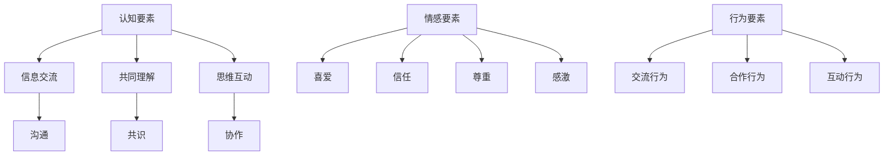

通过以上对关系的定义、属性、类型以及核心要素的探讨，我们可以更深入地理解关系的本质。关系的多维属性、多种类型和核心要素共同作用，决定了关系的发展和功能，为个体提供了情感支持、认知共享和行为互动的平台。理解关系的本质对于建立和维护高质量的社会关系具有重要意义。

#### 关系对个体成长的影响

关系在个体成长过程中扮演着至关重要的角色。它不仅是情感支持的重要来源，更是个体认知、情感和行为发展的关键环境。通过分析关系对个体成长的多方面影响，我们可以更深入地理解关系在人生发展中的重要性。

**2.5.1 关系对个体成长的影响**

1. **情感支持**：关系为个体提供情感支持，有助于个体在面对挑战和压力时保持积极心态。在困难时期，来自家人、朋友或同伴的支持能够减轻个体的心理负担，增强他们的自信心和应对能力。

   **实证研究**：一项关于青少年心理健康的研究表明，拥有稳定和积极关系的人在面对学业、社交和家庭压力时，心理韧性更高，更容易克服困难。

2. **认知发展**：通过关系中的互动，个体能够获取新的知识和信息，促进认知发展。关系中的信息交流、共同学习和思维互动为个体的认知拓展提供了丰富的资源和机会。

   **案例研究**：在学术研究中，教师与学生、同事之间的互动被证明能够显著提高学生的学习效果和认知水平。通过讨论和合作，学生能够更好地理解和掌握知识。

3. **情感成熟**：关系有助于个体在情感上的成熟和发展。通过与他人的情感交流，个体能够学会表达自己的情感，理解他人的情感，并发展出健康的情感调节能力。

   **案例研究**：在家庭关系中，亲子互动和兄弟姐妹之间的情感交流有助于个体学会情感表达和情感调节，培养健康的情感发展。

**2.5.2 关系中的自我实现**

自我实现是指个体通过不断的成长和发展，实现自己的潜能和目标。关系在自我实现过程中发挥着重要作用，它不仅为个体提供动力和资源，还通过反馈和认可推动个体的自我实现。

1. **反馈与认可**：关系中的反馈和认可能够帮助个体了解自己的表现和成长，从而调整自己的行为和目标。积极的反馈和认可能够增强个体的自信心和自尊心，推动他们实现更高的目标。

   **实证研究**：研究表明，在工作场所中，来自上司和同事的积极反馈能够显著提高员工的工作满意度和自我实现感。

2. **合作与支持**：关系中的合作和支持为个体提供了实现自我目标的外部条件。通过与他人的合作，个体能够共同面对挑战，分享资源和知识，实现共同的目标。

   **案例研究**：在创业团队中，成员之间的紧密合作和支持有助于团队共同成长和成功。每个成员在关系中发挥自己的优势，共同实现创业目标。

3. **角色扮演**：在关系中，个体通过扮演不同的角色，能够体验到多样化的生活经历和成长机会。这些角色扮演不仅丰富了个体的人生经验，也推动了他们的自我实现。

   **案例研究**：在家庭关系中，个体通过承担不同的家庭角色（如父母、子女、家庭成员等），能够学会责任感和家庭管理能力，从而实现自我成长。

**2.5.3 关系中的心理调适**

关系在心理调适过程中起到关键作用。通过关系中的互动和沟通，个体能够获得情感支持，调节情绪，缓解心理压力。

1. **情感支持**：关系中的情感支持能够帮助个体缓解心理压力，提高心理韧性。在面临压力和挫折时，来自家人和朋友的关心和支持能够减轻个体的心理负担。

   **实证研究**：研究表明，拥有高质量关系的人在面对生活压力时，心理健康水平更高，心理适应能力更强。

2. **情绪调节**：关系中的情绪调节能力有助于个体更好地管理自己的情绪。通过与他人的沟通和互动，个体能够表达自己的情绪，理解他人的情绪，并学会调节自己的情绪反应。

   **案例研究**：在亲密关系中，通过沟通和表达，夫妻双方能够更好地理解对方的情绪，从而实现情绪的调节和缓解。

3. **心理安全感**：稳定的关系能够为个体提供心理安全感，使其在面对不确定性和风险时保持内心的稳定和自信。

   **实证研究**：研究表明，家庭关系中的安全感对儿童的心理健康和成长具有重要意义，有助于他们在未来生活中应对各种挑战。

通过以上对关系对个体成长的影响的分析，我们可以看到，关系不仅为个体提供了情感支持，促进了认知和情感的发展，还在自我实现和心理调适方面发挥着重要作用。理解关系的这些影响，有助于我们更好地把握关系的本质，利用关系促进个体的全面发展。

#### 关系中的冲突与解决

在人际关系中，冲突是一种常见的现象，它是由于个体在价值观、行为方式、需求等方面存在差异而产生的矛盾和对抗。冲突不仅会影响关系的质量和稳定性，还可能对个体的心理和情感健康产生负面影响。因此，理解和解决冲突是维护关系健康发展的关键。

**2.6.1 关系冲突的来源**

关系冲突的来源多种多样，主要包括以下几方面：

1. **价值观差异**：个体在成长过程中形成的价值观、信仰和信念可能存在差异。这些差异可能导致个体在道德观、人生观和世界观上的冲突，从而引发关系冲突。

2. **沟通障碍**：沟通是关系中的重要组成部分，但沟通障碍会导致信息传递不完整或误解。例如，个体在表达时可能无法准确传达自己的意图或情感，从而导致关系冲突。

3. **需求冲突**：个体在关系中的需求和期望可能存在冲突。例如，一个个体可能希望得到更多的关注和陪伴，而另一个个体可能因为工作或其他原因无法满足这种需求，从而引发冲突。

4. **个性差异**：个体的性格特点、行为习惯和心理需求可能存在差异，这些差异在互动过程中可能导致冲突。例如，一个个体可能喜欢直接表达，而另一个个体可能喜欢深思熟虑后再表达，这种差异可能导致沟通不畅和冲突。

**2.6.2 关系冲突的影响**

关系冲突对个体和关系的影响是多方面的，主要包括以下几方面：

1. **情感影响**：冲突可能导致个体感到愤怒、沮丧、焦虑等负面情绪。长期的冲突还会导致情感疲惫和疏远，影响个体对关系的满意度。

2. **行为影响**：冲突可能会引发个体在行为上的对抗和逃避。对抗行为可能会导致关系进一步恶化，而逃避行为则可能使问题得不到解决，长期积累后影响关系的稳定性。

3. **心理影响**：长期的冲突可能会对个体的心理健康产生负面影响，导致心理压力和焦虑。例如，个体可能会出现睡眠障碍、食欲不振、心理疲惫等问题。

4. **关系稳定性**：冲突会破坏关系的稳定性和信任感。如果冲突得不到有效解决，关系可能会出现裂痕，甚至导致关系的破裂。

**2.6.3 关系冲突的解决策略**

为了解决关系中的冲突，可以采用以下几种策略：

1. **积极沟通**：沟通是解决冲突的关键。在冲突发生时，个体应积极表达自己的观点和感受，同时倾听对方的意见。通过开放、诚实的沟通，个体可以更好地理解对方的立场和需求，找到解决问题的方法。

2. **寻求共赢**：在解决冲突时，个体应寻求双方都能接受的解决方案，避免单方面的胜利。通过合作和妥协，个体可以共同找到解决问题的方法，从而维护关系的稳定性和和谐。

3. **情绪调节**：在冲突过程中，个体应学会调节自己的情绪，避免情绪化的行为。通过深呼吸、冥想等方法，个体可以平静自己的情绪，更好地应对冲突。

4. **寻求第三方帮助**：在冲突难以自行解决时，个体可以寻求专业的心理咨询师或调解员的帮助。第三方可以帮助个体从客观的角度看待问题，提供有效的建议和解决方案。

通过以上对关系冲突来源、影响和解决策略的分析，我们可以看到，冲突是关系发展中不可避免的一部分，但通过积极的沟通、共赢的解决方案和情绪调节，我们可以有效地解决冲突，维护关系的稳定和健康。这不仅有助于个体的情感和心理健康，也能促进关系的持续发展和深化。

### 本章小结

本章从关系的本质、个体成长、冲突及其解决等方面，探讨了关系在人类生活中的重要作用。通过分析关系的定义、属性、类型以及核心要素，我们深入理解了关系的本质和多维度特征。接着，我们探讨了关系对个体成长的影响，包括情感支持、认知发展和心理调适等，展示了关系在个体生活中的关键作用。最后，我们分析了关系中的冲突来源、影响和解决策略，提出了通过积极沟通、共赢解决方案和情绪调节等方法来维护关系的健康稳定。这些讨论为理解人际关系提供了深刻的洞见，也为个体在关系中实现自我发展和幸福感提供了实践指导。

### 关系中的自我认知

在探讨关系中的自我认知时，我们首先要明确自我认知的概念。自我认知是指个体对自己的认识和理解，包括自我评价、自我认同和自我发展等方面。自我认知不仅是心理学研究的重要领域，也是人际关系中不可或缺的一部分。在关系中，自我认知有助于个体更好地理解自己和他人，从而实现自我成长和关系的深化。

#### 3.1 自我认知的概念

自我认知是一个多维度的概念，涉及个体对自己的情感、行为、思想以及价值观念的认识。具体来说，自我认知包括以下几个方面：

1. **自我评价**：自我评价是指个体对自己能力和行为的评估。个体通过自我反思和外部反馈来形成自我评价，这种评价不仅影响个体的自尊心，还影响其在关系中的表现和互动方式。

2. **自我认同**：自我认同是指个体对自己身份和角色的认同感。自我认同有助于个体在关系中找到自己的位置，明确自己的目标和期望，从而更好地与他人互动。

3. **自我发展**：自我发展是指个体通过不断学习和成长，提升自我能力和素质的过程。自我发展不仅有助于个体实现自我价值，也能为关系中的互动带来新的活力和可能性。

**自我认知的定义与联系表格**：

| 自我认知维度 | 定义 | 举例 |
| --- | --- | --- |
| 自我评价 | 对自己能力和行为的评估 | 认为自己在工作中有出色的表现 |
| 自我认同 | 对自己身份和角色的认同感 | 认为自己是一个负责任的家庭成员 |
| 自我发展 | 通过学习和成长提升自我能力 | 通过参加培训课程提升职业技能 |

#### 3.2 自我认知在关系中的作用

自我认知在关系中起着至关重要的作用，它不仅影响个体如何理解和表达自己，还影响个体如何理解和处理与他人的关系。以下是自我认知在关系中的几个关键作用：

1. **自我理解**：自我认知帮助个体更好地理解自己的需求和期望。当个体能够清晰地认识到自己的需要时，他们更可能在与他人的互动中表达这些需求，从而促进关系的和谐。

2. **沟通有效性**：自我认知有助于个体在沟通中更加明确和准确。通过了解自己的情感和动机，个体可以更好地理解他人的立场和需求，从而实现更有效的沟通。

3. **情绪管理**：自我认知能够帮助个体更好地管理自己的情绪。当个体意识到自己在某些情况下可能会产生负面情绪时，他们可以采取适当的策略来调节情绪，避免情绪化的行为，从而减少关系冲突。

4. **自我调整**：自我认知使个体能够根据反馈和经验进行调整和改进。通过自我反思，个体可以识别自己在关系中的不足，并采取行动来改善这些方面，从而实现个人成长和关系的深化。

**自我认知在关系中的作用Mermaid流程图**：

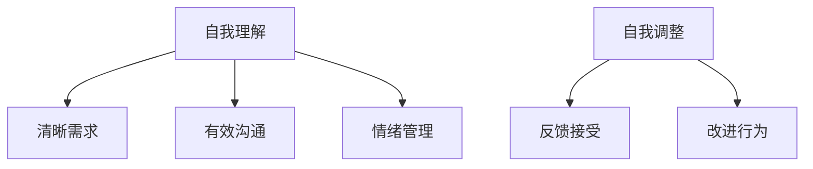

#### 3.3 关系对自我认知的影响

关系对自我认知有着深远的影响，既包括积极影响，也包括消极影响。以下是关系对自我认知影响的几个方面：

**积极影响**：

1. **反馈与认可**：在健康的关系中，个体会收到来自他人的积极反馈和认可，这些反馈有助于个体形成积极的自我认知。例如，当个体在工作中得到同事的表扬时，他们会更加自信和认可自己的能力。

2. **共同成长**：在关系中，个体通过与他人的互动和合作，可以共同成长和进步。这种共同成长不仅有助于个体实现自我发展，还能增强个体对自我能力的认知。

3. **角色多样性**：在多种关系中，个体会扮演不同的角色，这些角色体验有助于个体更全面地认识自己。例如，在家庭中作为父母和在工作场所作为员工的角色体验，可以让个体更全面地了解自己的能力和需求。

**消极影响**：

1. **自我否定**：在关系中，个体可能会受到负面的反馈和批评，这些负面的经历可能导致个体对自己的能力产生怀疑和否定。例如，在工作中遭遇失败或同事的批评，可能会使个体对自己的职业能力产生负面认知。

2. **过度依赖**：在某些关系中，个体可能会过度依赖他人的认可和意见，从而忽视自我认知的重要性。这种过度依赖可能导致个体失去独立思考和自我评价的能力。

3. **角色冲突**：在不同的关系中，个体可能会面临角色冲突，这可能导致个体在自我认知上产生困惑和矛盾。例如，个体在家庭和工作中的角色要求可能存在冲突，导致他们在自我认知上难以平衡。

**关系对自我认知影响的ER实体关系图**：

```mermaid
erDiagram
  A[Person] {
    B[PositiveFeedback]
    C[NegativeFeedback]
  }
  A--|||> D[SelfAwareness]
  B--|||> E[PositiveSelfImage]
  C--|||> F[NegativeSelfImage]
```

通过以上对自我认知的概念、作用及其在关系中的影响的探讨，我们可以看到，自我认知在人际关系中扮演着重要角色。它不仅影响个体如何理解自己和他人，还影响个体在关系中的行为和情感体验。理解自我认知的重要性，有助于个体在关系中实现自我成长和关系的深化。

#### 自我认知的发展

自我认知的发展是一个动态的过程，贯穿于个体的一生。它受到多种因素的影响，包括生物因素、社会环境和个体经历。理解自我认知的发展过程，有助于我们更好地把握个体在不同阶段自我认知的特点和变化，从而为个体提供有效的支持和引导。

**3.4.1 自我认知的层次**

自我认知的发展可以划分为不同的层次，每个层次代表个体对自我认知的不同深度和广度。以下是自我认知发展的主要层次：

1. **初级自我认知**：初级自我认知通常在婴幼儿阶段形成。在这个阶段，个体主要通过模仿和观察来认识自己。他们还没有形成清晰的自我意识，主要依靠外界反馈来了解自己。

   **特点**：依赖性较强，自我认知主要来自父母的反馈和社会环境的评价。

2. **次级自我认知**：次级自我认知通常在儿童和青少年阶段发展。在这个阶段，个体开始通过自我反思和内省来认识自己。他们开始意识到自己的思想、情感和行为，并尝试根据自己的感受和需求来调整行为。

   **特点**：独立性增强，自我认知逐渐从外部评价转向内心体验。

3. **高级自我认知**：高级自我认知通常在成年阶段形成。在这个阶段，个体已经形成了相对稳定的自我认知体系，能够较为全面地认识自己的优点和不足，并在此基础上制定自我发展的目标和计划。

   **特点**：自我认知成熟，个体能够理性地分析自己的行为和情绪，并采取有效的策略来促进个人成长。

**自我认知层次Mermaid流程图**：

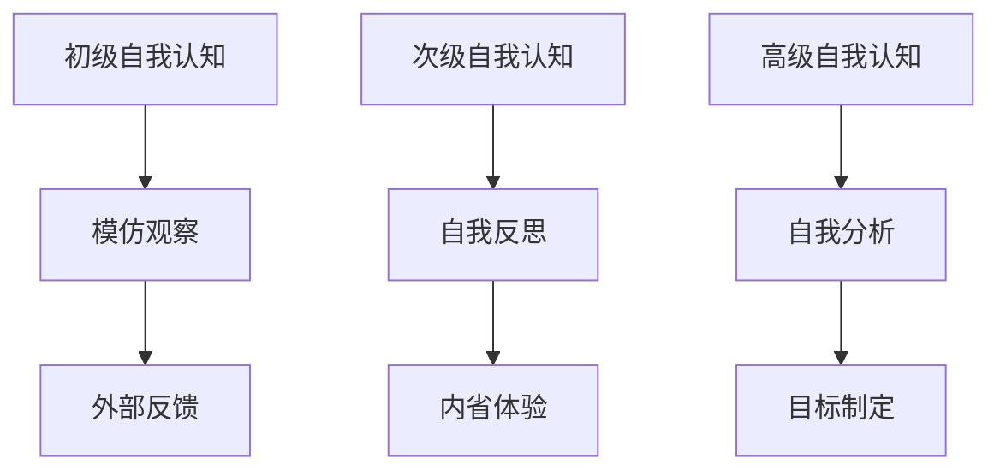

**3.4.2 自我认知的演变过程**

自我认知的演变过程是一个从初级到高级的逐步发展过程。以下是自我认知演变的主要阶段：

1. **早期阶段**：在婴幼儿时期，个体主要通过感官和模仿来认识自己。这个阶段的个体还不能独立进行自我反思，他们的自我认知主要依赖于成人的反馈和评价。

2. **发展阶段**：在儿童和青少年时期，个体开始通过自我反思和内省来认识自己。他们开始关注自己的情感、思想和行为，并尝试根据自己的感受和需求来调整行为。

3. **成熟阶段**：在成年后，个体已经形成了较为稳定的自我认知体系，能够理性地分析自己的行为和情绪，并采取有效的策略来促进个人成长。在这个阶段，个体能够更加全面地认识自己的优点和不足，并在此基础上制定自我发展的目标和计划。

**自我认知演变过程Mermaid流程图**：

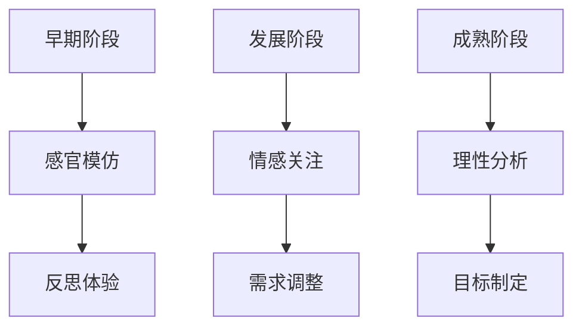

**3.4.3 影响自我认知发展的因素**

自我认知的发展受到多种因素的影响，包括生物因素、社会环境和个体经历。以下是几个主要因素：

1. **家庭环境**：家庭环境对个体自我认知的发展具有重要影响。在一个支持性和鼓励性的家庭环境中，个体更容易形成积极的自我认知。相反，在一个压抑和批评性的家庭环境中，个体可能会形成消极的自我认知。

2. **教育经历**：教育经历对个体自我认知的发展也具有重要影响。良好的教育环境和教育方式能够促进个体的自我反思和内省能力，从而增强自我认知。相反，不良的教育环境和教育方式可能会阻碍个体自我认知的发展。

3. **社会交往**：社会交往是自我认知发展的重要途径。通过与他人互动，个体能够了解自己的优点和不足，从而调整和改进自己的行为。积极的社会交往有助于个体形成积极的自我认知。

4. **个人经历**：个人经历对个体自我认知的发展具有深远影响。成功的经历能够增强个体的自信心和自我认同，而失败的经历则可能使个体对自己的能力产生怀疑。通过反思个人经历，个体能够不断调整和改进自我认知。

通过以上对自我认知的层次、演变过程及其影响因素的探讨，我们可以看到，自我认知的发展是一个复杂而动态的过程。理解自我认知的发展过程和影响因素，有助于我们更好地支持和引导个体的自我认知发展，促进他们在关系中的成长和幸福感。

### 自我认知与关系发展的动态平衡

在探讨自我认知与关系发展的动态平衡时，我们需要理解两者之间的相互作用关系。自我认知不仅影响个体在关系中的行为和情感反应，同时也受到关系的影响和塑造。因此，自我认知与关系发展之间存在一种动态平衡，这种平衡在促进个体成长和关系稳定方面起着关键作用。

**3.5.1 自我认知对关系发展的影响**

自我认知对关系发展的影响主要体现在以下几个方面：

1. **关系建立**：自我认知的清晰度直接影响个体在建立关系时的行为和决策。一个具有清晰自我认知的个体更容易识别和表达自己的需求，从而更容易与他人建立和维持关系。例如，一个清楚地知道自己的需求和期望的个体，更有可能在与他人互动时明确提出自己的需求，避免关系中的误解和冲突。

2. **关系质量**：自我认知的成熟度影响关系的质量。自我认知成熟的个体能够更好地理解自己和他人，从而在关系中展现出更高的情商和同理心，这有助于建立高质量的关系。例如，一个自我认知成熟的个体能够在冲突中保持冷静，通过有效的沟通和解决方案来处理矛盾，从而维持关系的稳定和和谐。

3. **关系稳定性**：自我认知的稳定性有助于关系的长期稳定。一个自我认知稳定的个体在面对关系中的挑战和变化时，能够保持内心的平衡和坚定，从而避免因情绪波动而导致的冲突和破裂。例如，一个自我认知稳定的伴侣能够在婚姻关系中应对日常的挑战和压力，从而维持长期稳定的婚姻关系。

**3.5.2 关系对自我认知的影响**

关系不仅影响关系发展，同时也对自我认知产生深远的影响。以下是关系对自我认知的几个方面影响：

1. **自我认知的形成**：关系中的互动和反馈是自我认知形成的重要途径。通过与他人的互动，个体能够获得关于自己的新信息和反馈，这些反馈有助于个体形成和调整自我认知。例如，朋友或伴侣的肯定和鼓励可以增强个体的自信心和自我认同感，而批评和挑战则可能促使个体进行自我反思和改进。

2. **自我认知的发展**：关系中的共同经历和成长机会有助于个体自我认知的发展。通过共同面对挑战、分享经验和共同学习，个体能够不断拓展自我认知的边界，实现自我成长。例如，一个团队中的合作项目不仅能够提升个体的专业技能，还能增强个体的自我认知和团队协作能力。

3. **自我认知的调整**：关系中的互动和反馈有助于个体调整自我认知。在关系中，个体通过观察他人和接受他人的反馈，能够识别自己在自我认知中的盲点和不足，从而进行调整和改进。例如，一个在关系中遇到批评的个体可能会通过反思和调整自己的行为来提升自我认知，从而改善关系。

**3.5.3 自我认知与关系发展的动态平衡**

自我认知与关系发展之间存在一种动态平衡，这种平衡在促进个体成长和关系稳定方面起着关键作用。以下是维持这种动态平衡的几个策略：

1. **自我反思**：定期进行自我反思是维持自我认知与关系发展动态平衡的重要策略。通过自我反思，个体能够识别自己的情感和行为模式，从而调整和改进自我认知。例如，个体可以通过日记或心理辅导等方式进行自我反思，从而更好地理解自己，并在关系中做出更明智的决策。

2. **积极沟通**：积极的沟通是维持关系发展的重要手段，也是促进自我认知调整的重要途径。通过开放、诚实的沟通，个体能够分享自己的感受和想法，同时也倾听他人的意见和反馈，从而促进自我认知的提升。例如，在家庭关系中，夫妻之间的定期沟通可以帮助他们了解彼此的需求和期望，从而调整和改善自我认知。

3. **情感支持**：情感支持是维持关系稳定和个体成长的重要条件。在健康的关系中，个体能够获得情感上的支持和安全感，这有助于他们在面对挑战和压力时保持积极的心态。例如，在朋友关系中，相互支持和鼓励可以增强个体的自信心和自我认同感，从而促进自我认知的发展。

4. **共同目标**：共同目标是促进关系发展和个体成长的重要动力。当个体在关系中设定共同的目标时，他们能够共同面对挑战、分享资源和知识，从而实现个人和关系的双重成长。例如，在职业团队中，共同的项目目标和协作机制有助于提升团队的整体绩效和个体的自我认知。

通过以上对自我认知与关系发展的动态平衡的分析，我们可以看到，自我认知和关系发展之间相互影响、相互促进。理解这种动态平衡的机制和策略，有助于个体在关系中实现自我成长和关系的深化，从而提升整体的生活质量和幸福感。

### 关系中的自我认知挑战与应对

在人际关系中，自我认知不仅是一个积极的因素，也可能成为个体面临的挑战。自我认知的复杂性决定了个体在关系中的多种困难，包括自我怀疑、角色模糊和情感困扰等。了解这些挑战并采取有效的应对策略，对于维持健康的关系和促进个人成长至关重要。

**3.6.1 挑战与困难**

1. **自我怀疑**：自我怀疑是指个体对自己的能力、价值和价值产生质疑。在关系中，自我怀疑可能导致个体在互动中表现出不自信和缺乏主动性，影响关系的稳定性和深度。

2. **角色模糊**：角色模糊是指个体在关系中对自身角色和期望的不明确。这可能导致个体在互动中产生困惑和冲突，影响关系的和谐和满意度。

3. **情感困扰**：情感困扰是指个体在关系中处理情感问题时遇到的困难和挑战。这包括情感冲突、情绪波动和情感依赖等，这些困扰可能导致关系的紧张和破裂。

**3.6.2 应对策略**

1. **自我反思**：自我反思是一种重要的应对策略，它帮助个体识别和解决自我认知中的问题。通过定期进行自我反思，个体可以深入思考自己的行为、情感和信念，从而识别自我认知中的盲点和不足。例如，个体可以通过写日记、参加心理辅导等方式进行自我反思，从而提升自我认知，增强自信心。

2. **倾听与沟通**：倾听和沟通是解决关系中的自我认知问题的重要途径。通过倾听他人的反馈和意见，个体能够获得关于自己的新信息和视角，从而调整和改善自我认知。例如，在家庭关系中，夫妻之间的坦诚沟通可以帮助他们理解彼此的需求和期望，从而解决角色模糊和情感困扰。

3. **情感教育**：情感教育是一种系统的策略，旨在提高个体在情感管理方面的能力和技巧。通过情感教育，个体可以学习如何识别、表达和调节自己的情感，从而减少情感困扰。例如，个体可以通过参加情感管理课程、阅读相关书籍等方式进行情感教育，从而提升自我认知和情感管理能力。

4. **求助与支持**：在应对关系中的自我认知挑战时，求助与支持是一个重要的策略。个体可以寻求心理咨询师、心理治疗师或支持团体的帮助，从而获得专业的指导和支持。例如，通过心理咨询，个体可以深入了解自己的情感和行为模式，并获得有效的应对策略，从而提升自我认知和关系质量。

**3.6.2.1 自我反思**

自我反思是一种深入探索内心世界的过程，通过这一过程，个体可以识别和理解自己的行为、情感和信念。以下是自我反思的几个步骤：

1. **设定时间**：选择一个安静的时刻，给自己一些独处的时间，专注于自我反思。
2. **静心冥想**：通过冥想或深呼吸等方法，放松身心，进入平静的状态。
3. **问题识别**：思考自己在关系中的困惑、挑战和困扰，识别需要反思的具体问题。
4. **深入探索**：深入思考问题的根源，尝试理解自己在这方面的行为和情感反应。
5. **总结与记录**：将反思的内容总结并记录下来，这有助于个体回顾和调整自我认知。

**3.6.2.2 倾听与沟通**

倾听与沟通是建立和理解人际关系的重要基础。以下是一些提升倾听和沟通技巧的建议：

1. **专注倾听**：在交流时，专注于对方的发言，避免打断或过早评价。
2. **开放提问**：通过开放式问题引导对方分享更多信息，例如：“你能更详细地描述一下你的感受吗？”
3. **表达理解**：通过重述对方的话来表达理解，例如：“我理解你的意思是……”
4. **坦诚表达**：在表达自己的观点和感受时，保持坦诚和真诚，避免指责或批评。
5. **情感共鸣**：尝试从对方的角度理解情感，建立情感共鸣。

**3.6.2.3 情感教育**

情感教育是一种全面的策略，旨在提高个体在情感识别、表达和调节方面的能力。以下是情感教育的一些方法：

1. **情感识别**：通过自我反思或专业指导，识别和理解自己的情感。
2. **情感表达**：学习如何以健康的方式表达情感，避免压抑或过度表达。
3. **情感调节**：通过冥想、深呼吸等方法，学习调节情感，避免情绪波动。
4. **情感支持**：寻求家人、朋友或专业人士的情感支持，共同成长。

**3.6.2.4 求助与支持**

在应对自我认知挑战时，寻求专业帮助是一个有效的策略。以下是几种获取专业支持的途径：

1. **心理咨询**：通过心理咨询，个体可以与专业的心理咨询师深入探讨自己的困惑和挑战。
2. **心理治疗**：心理治疗是一种系统的干预方法，旨在解决深层次的情感和行为问题。
3. **支持团体**：加入支持团体，与其他人分享经验和感受，获得情感支持和实用建议。
4. **在线资源**：利用在线课程、论坛和博客等资源，学习自我认知和情感管理的相关知识。

通过以上对关系中的自我认知挑战与应对策略的探讨，我们可以看到，自我认知不仅是个体成长的重要基础，也是维持健康关系的关键。通过自我反思、倾听与沟通、情感教育和求助与支持，个体可以更好地应对自我认知中的挑战，促进个人成长和关系的发展。

### 本章小结

本章深入探讨了关系中的自我认知及其在个体成长中的重要性。首先，我们明确了自我认知的概念及其在关系中的作用，随后分析了自我认知的发展层次和演变过程。接着，我们探讨了自我认知与关系发展的动态平衡，揭示了两者之间的相互作用关系。最后，本章详细讨论了关系中的自我认知挑战，包括自我怀疑、角色模糊和情感困扰，并提出了自我反思、倾听与沟通、情感教育和求助与支持等应对策略。通过这些分析，我们认识到自我认知在关系中的关键作用，为个体在关系中实现自我成长和维持健康关系提供了理论指导和实践建议。

### 关系中的情感满足

在探讨关系中的情感满足时，我们首先需要明确“情感满足”这一概念。情感满足是指个体在情感需求得到满足时所产生的愉悦感和幸福感。情感满足不仅涉及个体对情感的支持和关爱，还涉及个体对情感体验和情感表达的需求。在关系中，情感满足对个体的幸福感和生活质量有着重要影响。

#### 4.1 情感满足的概念

情感满足是一个复杂且多维度的概念，它涉及个体在情感需求得到满足时的多种心理体验。具体来说，情感满足包括以下几个方面：

1. **情感支持**：情感支持是指个体在情感上得到他人的关心和帮助。这种支持可以减轻个体的心理压力，提高他们的幸福感和满足感。

2. **情感体验**：情感体验是指个体在情感互动中获得的积极情感体验，如快乐、满足和幸福。这种体验通常来自于与他人的亲密互动和共同经历。

3. **情感表达**：情感表达是指个体通过言语、行为或非言语方式表达自己的情感。有效的情感表达有助于增强个体之间的情感联结，提高关系的质量。

**情感满足的定义与联系表格**：

| 情感满足维度 | 定义 | 举例 |
| --- | --- | --- |
| 情感支持 | 情感上的关心和帮助 | 朋友在困难时提供的安慰和支持 |
| 情感体验 | 积极情感体验 | 共同度过美好时光，产生的快乐和满足感 |
| 情感表达 | 情感的表达 | 向伴侣表达爱意，通过言语和行为传达感情 |

#### 4.2 情感满足的类型

情感满足可以分为正面情感满足和负面情感满足。这两种类型的情感满足在个体生活和关系中的作用和影响有所不同。

**正面情感满足**：

正面情感满足是指个体在情感需求得到满足时产生的愉悦和满足感。这种情感满足通常与积极的关系体验和情感互动相关。以下是正面情感满足的几种类型：

1. **亲密感**：亲密感是指个体在情感上与他人建立深度联结和信任感。亲密感通常在亲密关系（如恋爱、婚姻）中体现，它有助于增强个体的幸福感和安全感。

2. **支持感**：支持感是指个体在遇到困难和挑战时感受到他人的支持和帮助。这种支持感不仅能够减轻个体的心理压力，还能增强他们的自信心和应对能力。

3. **归属感**：归属感是指个体在某一群体或关系中感受到的归属和认同感。归属感通常在家庭、朋友或社交群体中体现，它有助于个体获得心理上的满足和安全感。

**负面情感满足**：

负面情感满足是指个体在情感需求未得到满足时产生的负面情绪和情感体验。这种情感满足通常与消极的关系体验和情感互动相关。以下是负面情感满足的几种类型：

1. **孤独感**：孤独感是指个体在情感上感到孤立和无助。孤独感通常在缺乏社交支持或人际关系疏远时产生，它可能对个体的心理健康产生负面影响。

2. **无助感**：无助感是指个体在遇到困难和挑战时感到无力应对。这种情感体验可能导致个体的自信心下降，影响他们的生活质量和幸福感。

3. **挫败感**：挫败感是指个体在追求目标或实现愿望时遭遇失败或挫折而产生的负面情绪。挫败感通常在个人目标未达成或关系冲突中产生，它可能对个体的自尊心和情感满足产生长期影响。

**情感满足类型Mermaid流程图**：

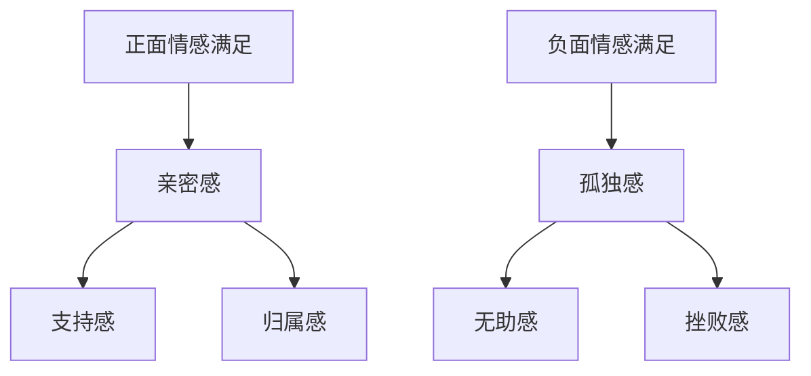

#### 4.3 情感满足与个体幸福

情感满足与个体幸福之间存在密切的关系。情感满足不仅是个体幸福感的重要组成部分，也是维持心理健康和社会福祉的重要条件。以下是情感满足对个体幸福影响的几个方面：

1. **心理健康**：情感满足有助于减轻心理压力和焦虑，提高个体的心理健康水平。当个体在情感上得到满足时，他们更容易保持积极的心态，应对生活中的挑战。

2. **生活质量**：情感满足显著提高个体的生活质量。满足的情感需求能够增强个体的幸福感，使他们感受到生活的美好和价值。

3. **社会交往**：情感满足有助于增强个体在社会交往中的积极体验。当个体在情感上得到满足时，他们更愿意与他人互动，建立和维持高质量的人际关系。

**情感满足与个体幸福Mermaid流程图**：

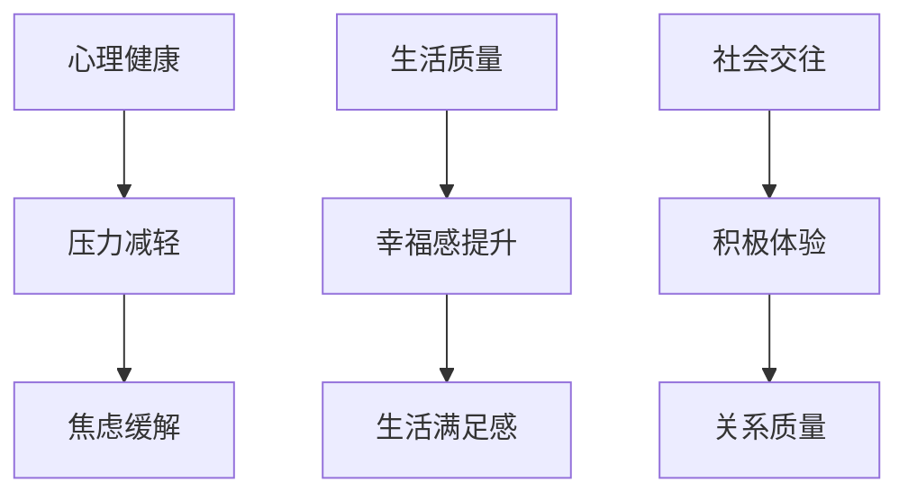

#### 4.4 关系中的情感满足机制

情感满足是一个复杂的心理过程，涉及生理、心理和社会等多个层面的机制。以下是情感满足的主要机制：

**生理机制**：

情感满足的生理机制主要涉及大脑中的神经递质和内分泌系统的活动。积极的情感体验能够激活大脑中的奖励系统，释放多巴胺等神经递质，产生愉悦感和幸福感。例如，在大脑的奖赏中枢（如伏隔核）和前额叶皮层等区域的活动增强，有助于个体感受到快乐和满足。

**心理机制**：

情感满足的心理机制涉及个体对情感需求的认识和处理。当个体的情感需求得到满足时，他们会产生积极的情感体验。这种体验不仅包括愉悦感和幸福感，还包括对关系的信任和依赖。心理学研究表明，积极的情感体验能够增强个体对关系的满意度和稳定性。

**社会机制**：

情感满足的社会机制涉及个体在社会互动中的情感体验。通过与他人互动，个体能够获得情感支持、共同经历和情感反馈。这些互动有助于个体在情感上得到满足，增强他们的社会联结感和归属感。社会机制还涉及社会文化和家庭背景对情感满足的影响，不同的文化和社会环境可能对情感满足有不同的期望和定义。

**情感满足机制Mermaid流程图**：

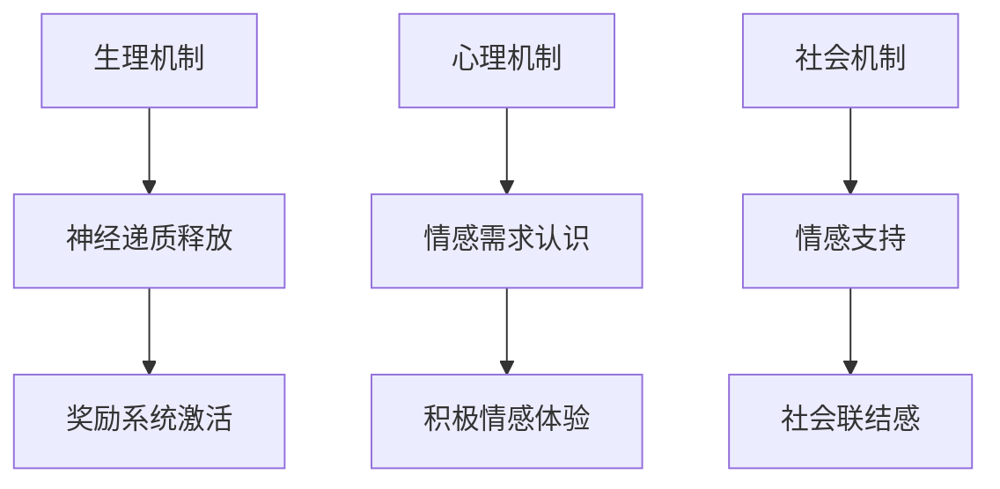

通过以上对情感满足的概念、类型及其与个体幸福关系的探讨，以及情感满足机制的生理、心理和社会机制分析，我们可以看到，情感满足在个体生活和关系中的重要性。理解情感满足的机制和类型，有助于我们更好地满足情感需求，提高个体幸福感和生活质量，促进健康关系的建立和发展。

### 情感满足与关系质量

情感满足不仅影响个体的幸福感，还对关系质量产生深远影响。关系质量是指个体在关系中的情感体验、互动效果和满意度。高质量的关系能够提供情感支持、增强社会联结感，有助于个体实现个人成长和幸福。以下是情感满足与关系质量之间的相互作用关系及其影响。

#### 4.5.1 情感满足对关系质量的影响

情感满足对关系质量有着显著的影响，主要表现在以下几个方面：

1. **信任感**：情感满足能够增强个体之间的信任感。当个体在情感上得到满足时，他们更愿意相信对方，对关系的稳定性和忠诚度有更高的期望。信任感的增强有助于减少关系中的误解和冲突，提高关系的质量。

2. **亲密感**：情感满足能够提升关系的亲密感。亲密感是高质量关系的重要特征，它包括情感上的接近、共同目标和相互依赖。情感满足使个体感受到彼此的关心和爱，从而增强亲密感，促进关系的稳定和发展。

3. **沟通效果**：情感满足有助于提高关系中的沟通效果。当个体在情感上感到满足时，他们更愿意倾听和表达自己的感受。有效的沟通能够增强个体之间的理解和共鸣，减少误解和冲突，提高关系的质量。

**情感满足对关系质量影响的Mermaid流程图**：

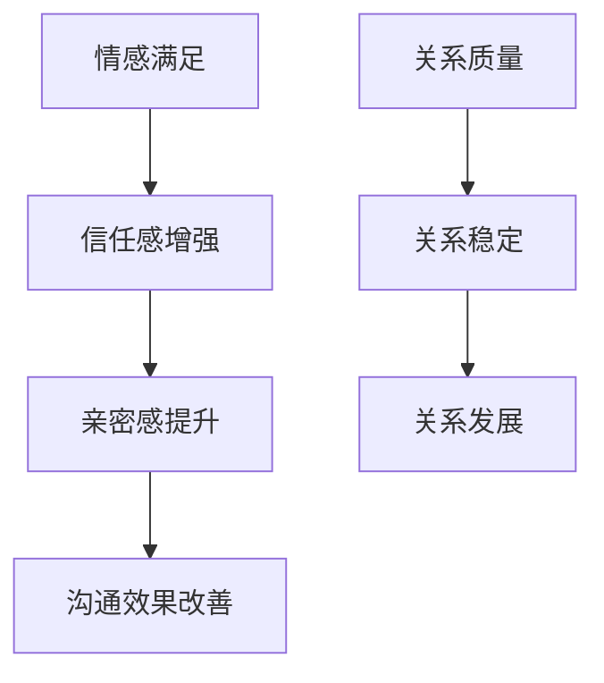

#### 4.5.2 关系质量对情感满足的影响

关系质量不仅受到情感满足的影响，同时也对情感满足产生反作用。高质量的关系能够促进个体的情感满足，使他们在情感上感到更满足和幸福。以下是关系质量对情感满足影响的几个方面：

1. **安全感**：高质量的关系能够提供情感上的安全感。当个体在关系中感到被接纳和支持时，他们会更有安全感，这有助于他们在面对生活挑战时保持积极的心态。安全感的增强能够提高个体的情感满足感。

2. **支持感**：高质量的关系能够提供情感上的支持感。当个体在关系中遇到困难或挑战时，高质量的关系能够提供必要的情感支持和帮助。这种支持感有助于个体在情感上得到满足，增强他们的幸福感和满意度。

3. **归属感**：高质量的关系能够增强个体的归属感。当个体在某一关系中获得认同和归属时，他们会感到自己在社会中有着重要的位置。这种归属感有助于他们在情感上感到满足和幸福。

**关系质量对情感满足影响的Mermaid流程图**：

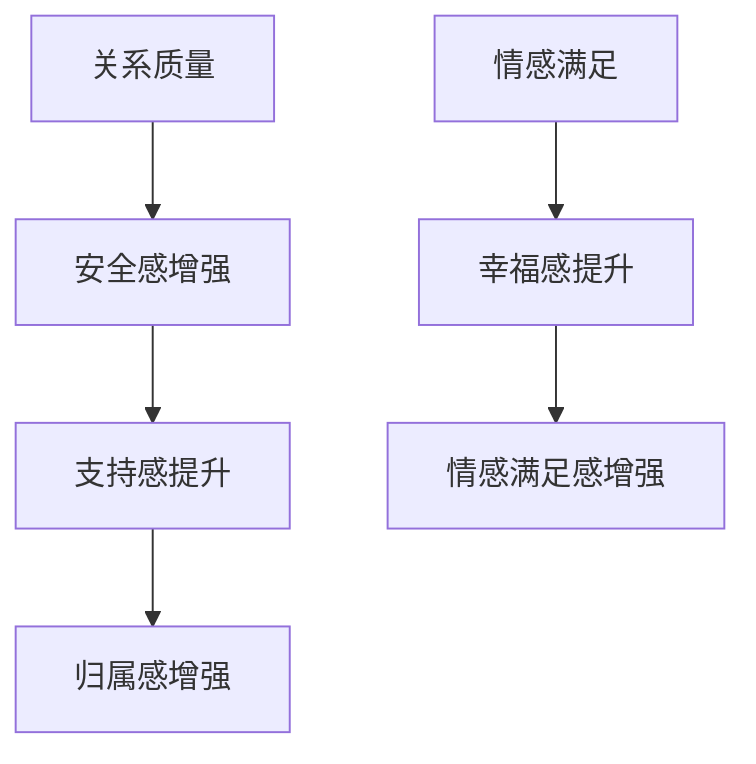

#### 4.5.3 情感满足与关系质量的互动

情感满足与关系质量之间存在一种互动关系，它们相互影响，共同促进个体的幸福和关系的发展。以下是情感满足与关系质量互动的几个方面：

1. **情感满足促进关系质量**：情感满足能够增强个体在关系中的积极体验，提高他们对关系的满意度和稳定性。这种积极的情感体验有助于建立高质量的关系，促进关系的长期发展。

2. **关系质量促进情感满足**：高质量的关系能够为个体提供情感上的支持和安全感，使他们在情感上得到满足。这种满足感不仅能够提高个体的幸福感，还能增强他们对关系的忠诚度和投入度。

3. **动态平衡**：情感满足与关系质量之间存在动态平衡。当个体在情感上感到满足时，他们更有可能维持高质量的关系。反之，高质量的关系能够促进个体的情感满足，形成良性循环。

**情感满足与关系质量互动Mermaid流程图**：

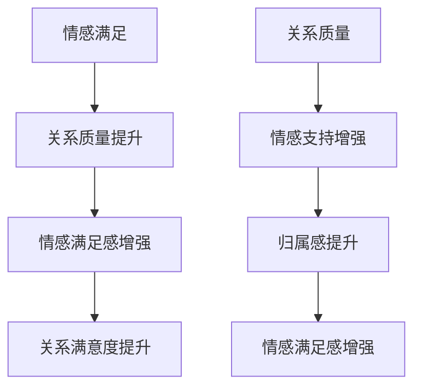

通过以上对情感满足与关系质量之间相互作用的探讨，我们可以看到，情感满足和关系质量在个体幸福和关系发展中起着关键作用。理解它们之间的互动关系，有助于我们更好地满足情感需求，提高关系质量，促进个体的幸福和成长。

### 关系中的情感满足困境与解决

在关系中，情感满足困境是常见的现象，这些困境不仅影响个体情感健康，还可能破坏关系稳定性。了解情感满足困境的类型、影响及解决策略，对于维护健康的关系至关重要。

#### 4.6.1 情感满足困境的类型

1. **情感忽视**：情感忽视是指个体在关系中未能得到必要的情感关注和支持。这可能导致个体感到孤独、无助和被忽视，从而影响他们的情感满足感。

2. **情感冲突**：情感冲突是指个体在关系中因价值观、需求和期望的不同而产生的矛盾和对抗。情感冲突可能引起负面情绪，破坏关系中的和谐和亲密感。

3. **情感依赖**：情感依赖是指个体在关系中过度依赖他人的情感支持，缺乏自我情感调节能力。这种依赖可能导致个体在关系中的不安全感，影响他们的情感满足感。

4. **情感障碍**：情感障碍是指个体在情感表达和理解上存在障碍，导致关系中的沟通不畅和误解。情感障碍可能源于个体内心的恐惧、羞耻或自我保护机制。

**情感满足困境Mermaid流程图**：

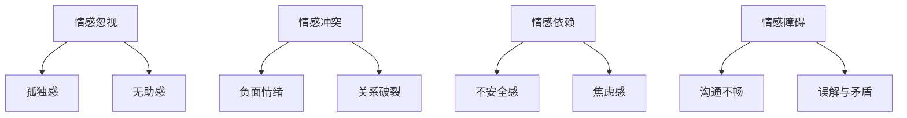

#### 4.6.2 情感满足困境的影响

情感满足困境对个体和关系产生多方面的影响：

1. **心理健康**：情感忽视、冲突和依赖可能导致个体出现焦虑、抑郁等心理问题。情感障碍则可能使个体在情感上感到孤立和无助。

2. **关系稳定性**：情感满足困境可能破坏关系的稳定性，增加关系破裂的风险。长期的情感困境可能导致信任感下降，亲密感减弱。

3. **生活质量**：情感满足困境会影响个体的幸福感和生活质量，使他们在日常生活中感到不满足和焦虑。

#### 4.6.3 解决策略

1. **情感教育**：情感教育是一种有效的策略，旨在提高个体在情感识别、表达和调节方面的能力。通过情感教育，个体可以学习如何识别自己的情感需求，如何有效地表达情感，以及如何进行情感调节。例如，个体可以通过参加情感管理课程、阅读相关书籍等方式进行情感教育。

2. **心理咨询**：心理咨询是一种专业的帮助方式，旨在帮助个体解决情感困扰和心理问题。通过心理咨询，个体可以深入了解自己的情感问题，并获得有效的应对策略。心理咨询师可以通过谈话、行为疗法、认知行为疗法等方法，帮助个体改善情感满足困境。

3. **情感支持**：情感支持是解决情感满足困境的重要途径。在健康的关系中，个体能够获得情感上的支持和安慰，从而减轻情感困扰。家人、朋友或专业人士的支持可以帮助个体缓解情感压力，增强他们的情感满足感。

**解决策略Mermaid流程图**：

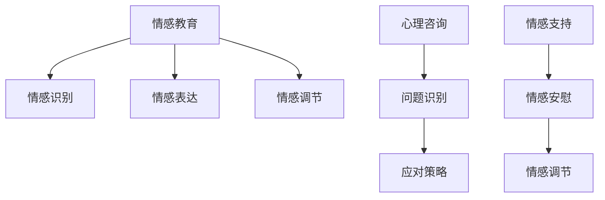

#### 4.6.3.1 情感教育

情感教育是通过学习、实践和体验，提高个体在情感管理方面的知识和技能。以下是一些情感教育的具体方法和实践：

- **情感课程**：参加情感管理课程，学习情感识别、表达和调节的基本技巧。
- **阅读资料**：阅读关于情感管理的书籍和文章，了解情感科学的基本原理。
- **角色扮演**：通过角色扮演练习，模拟情感互动场景，提高情感表达和理解能力。
- **情感日记**：记录日常生活中的情感体验，反思自己的情感反应和处理方式。

#### 4.6.3.2 心理咨询

心理咨询是一种专业的心理服务，旨在帮助个体解决情感困扰和心理问题。以下是一些常见的心理咨询方法和应用：

- **认知行为疗法**：通过改变个体的认知方式和行为模式，帮助其改善情感困扰。
- **情感焦点疗法**：专注于个体的情感体验，帮助其识别和解决深层次的情感问题。
- **家庭治疗**：通过家庭成员的互动和沟通，解决家庭关系中的情感困扰。
- **心理辅导**：为个体提供情感支持，帮助他们应对生活中的挑战和压力。

#### 4.6.3.3 家庭治疗

家庭治疗是一种系统的心理治疗方法，旨在改善家庭成员之间的关系，解决家庭内的情感问题。以下是一些家庭治疗的方法和应用：

- **沟通技巧培训**：通过培训家庭成员的沟通技巧，提高他们之间的沟通效果。
- **家庭角色扮演**：通过模拟家庭互动场景，帮助家庭成员识别和解决情感冲突。
- **情感支持网络**：建立一个支持性的家庭环境，为成员提供情感上的支持和安慰。
- **情感问题解决**：通过家庭会议或个体咨询，解决家庭中的情感问题，促进家庭成员之间的理解和合作。

通过以上对关系中的情感满足困境及其解决策略的分析，我们可以看到，情感满足困境对个体和关系的影响是多方面的。通过情感教育、心理咨询和家庭治疗等策略，个体可以改善情感满足困境，提升关系质量，促进个人和关系的全面发展。

### 本章小结

本章深入探讨了关系中的情感满足及其对个体幸福和关系质量的影响。首先，我们明确了情感满足的概念及其类型，包括正面情感满足和负面情感满足。接着，我们分析了情感满足与个体幸福感的关系，并探讨了情感满足的生理、心理和社会机制。随后，本章详细讨论了情感满足对关系质量的影响，以及关系质量对情感满足的反作用。最后，我们探讨了情感满足困境的类型及其解决策略，包括情感教育、心理咨询和家庭治疗等。通过本章的分析，我们认识到情感满足在个体生活和关系中的重要性，并为个体在关系中实现情感满足提供了理论指导和实践建议。

### 关系中的成长与发展

在探讨关系中的成长与发展时，我们需要理解成长的概念及其在关系中的角色。成长是指个体在生理、心理和社会等方面不断发展和进步的过程。关系在成长过程中起着至关重要的作用，它不仅为个体提供了支持和资源，还通过互动和反馈促进了个体的发展。

#### 5.1 成长的概念

成长是一个广泛而复杂的过程，涵盖了个体在多个维度上的发展和进步。以下是成长的主要概念：

1. **生理成长**：生理成长是指个体在身体结构和功能上的发展和变化。这包括身体的发育、生理机能的提高以及身体能力的增强。

2. **心理成长**：心理成长是指个体在认知、情感和个性等方面的发展。心理成长包括认知能力的提升、情感调节能力的增强以及个性的形成和成熟。

3. **社会成长**：社会成长是指个体在社会环境中的适应和进步。这包括社会技能的培养、社会责任的承担以及社会角色的适应和转变。

**成长的概念Mermaid流程图**：

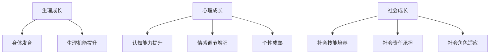

#### 5.2 成长在关系中的作用

关系在个体成长中扮演着关键角色，它为个体提供了成长的平台和支持。以下是关系在个体成长中的作用：

1. **情感支持**：关系中的情感支持是成长的重要动力。个体在成长过程中面临各种挑战和困难，情感支持能够提供心理安慰和力量，帮助个体克服困难，实现自我提升。

2. **认知发展**：关系中的互动和交流能够促进个体的认知发展。通过与他人的互动，个体能够学习新知识、扩展认知范围，并发展批判性思维和解决问题的能力。

3. **技能培养**：在关系中的合作和互动有助于个体培养各种技能。例如，团队合作、沟通技巧、领导能力等，这些技能不仅对个体的职业发展有益，也对他们的日常生活产生积极影响。

4. **情感调节**：关系中的互动和反馈能够帮助个体学会调节自己的情感。通过关系的互动，个体能够更好地理解和管理自己的情感，提高情感智力。

5. **自我实现**：关系为个体提供了实现自我目标的机会。在关系中的互动和反馈中，个体能够发现和发挥自己的潜能，实现自我价值和自我实现。

**成长在关系中的作用Mermaid流程图**：

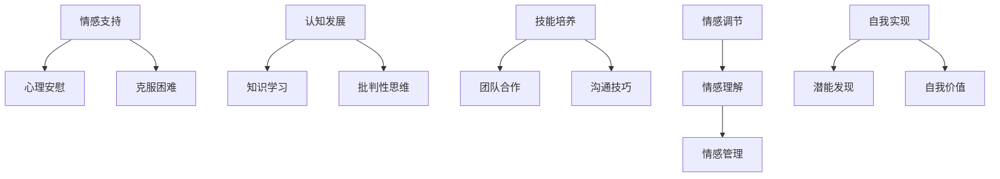

#### 5.3 关系对个体成长的影响

关系对个体成长的影响是多方面的，包括以下几个方面：

1. **生理成长**：关系中的情感支持和安全感有助于个体的生理成长。例如，在健康的家庭关系中，儿童能够获得足够的情感支持和营养，从而促进其身体的健康发展。

2. **心理成长**：关系中的情感互动和认知交流有助于个体的心理成长。例如，在师生关系中，教师不仅传授知识，还通过互动和反馈促进学生的心理发展。

3. **社会成长**：关系中的互动和角色扮演有助于个体的社会成长。例如，在工作关系中，个体通过合作和沟通，能够学习和适应不同的社会角色，提高社会技能。

**关系对个体成长的影响Mermaid流程图**：

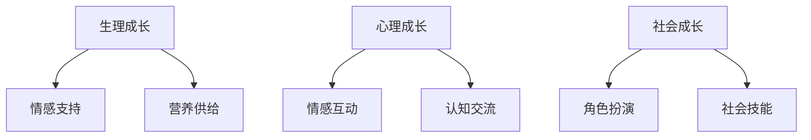

#### 5.4 成长与关系发展的互动

成长与关系发展之间存在着互动关系，两者相互影响，共同推动个体的发展。以下是成长与关系发展的互动关系：

1. **成长促进关系发展**：个体的成长不仅能够提升自身的情感智力和社会技能，还能促进关系的发展。一个成熟的个体能够更好地理解他人，建立更高质量的关系。

2. **关系促进成长**：关系中的互动和反馈为个体的成长提供了丰富的资源和机会。通过与他人的互动，个体能够不断学习和成长，从而提升自己的能力和素质。

3. **动态平衡**：成长与关系发展之间形成一种动态平衡。个体的成长推动了关系的发展，而关系的发展又为个体的成长提供了新的平台和机会。这种动态平衡有助于个体在关系中实现持续的成长和进步。

**成长与关系发展的互动Mermaid流程图**：

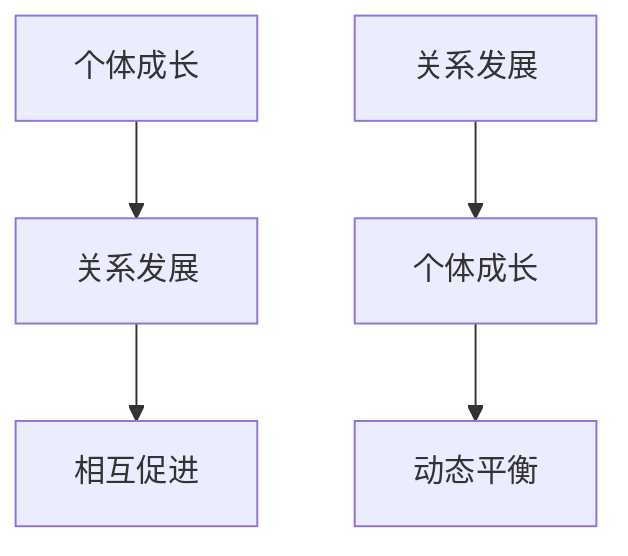

通过以上对成长的定义、关系在成长中的作用及其对个体成长的影响，以及成长与关系发展的互动关系的探讨，我们可以看到，关系在个体成长中起着至关重要的作用。理解关系在成长中的角色，有助于我们更好地把握个体在关系中的成长过程，促进个体在情感、认知和社会层面的全面发展。

### 成长与关系发展的互动

在探讨成长与关系发展的互动时，我们需要理解两者之间相互影响、相互促进的动态关系。个体的成长不仅推动关系的发展，同时关系的发展也为个体的成长提供了平台和资源。以下将从成长对关系发展的影响、关系发展对成长的影响以及两者的动态平衡等方面，详细分析这一互动过程。

**5.4.1 成长对关系发展的影响**

成长对关系发展的影响主要体现在以下几个方面：

1. **情感智力提升**：个体的情感智力是指个体识别、理解和管理自己及他人情感的能力。随着个体的成长，他们的情感智力逐渐提升，这有助于他们更好地处理关系中的情感问题。一个情感智力较高的个体能够更敏锐地感知他人的情感需求，提供更有针对性的支持和帮助，从而增强关系的稳定性。

2. **社会技能增强**：个体的成长过程中，通过学校教育、社会实践和职业培训等途径，他们的社会技能不断增强。这些技能包括沟通能力、团队合作能力、领导能力等，这些技能的提升有助于个体在关系中建立和维护高质量的人际网络。

3. **自我效能感提升**：个体的自我效能感是指个体对自己能够成功完成任务的信心。随着个体在成长过程中不断克服困难和挑战，他们的自我效能感逐渐增强。自我效能感较高的个体在关系中更加自信，能够承担更多的责任和挑战，从而促进关系的发展。

**成长对关系发展的影响Mermaid流程图**：

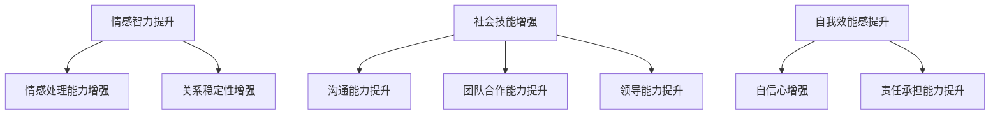

**5.4.2 关系发展对成长的影响**

关系发展对个体成长的影响同样不可忽视，以下是一些具体方面：

1. **认知拓展**：通过与他人的互动，个体能够接触到新的观点、知识和经验。这种认知拓展不仅有助于个体的知识积累，还能激发他们的思维活跃性和创造力，推动认知能力的提升。

2. **情感调节**：在关系中的互动和反馈过程中，个体能够学会如何识别、表达和管理自己的情感。这种情感调节能力的发展有助于个体在日常生活中更好地处理情感问题，提高心理健康水平。

3. **自我认识**：在关系中，个体通过观察他人和接受他人的反馈，能够更深入地认识自己。这种自我认识的发展有助于个体明确自己的价值观、兴趣和目标，从而更好地规划个人成长路径。

**关系发展对成长的影响Mermaid流程图**：

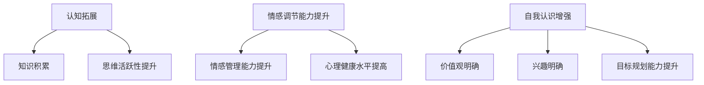

**5.4.3 成长与关系发展的动态平衡**

成长与关系发展之间的动态平衡是一个持续的过程，两者相互影响、相互促进，共同推动个体的全面发展。以下是维持这种动态平衡的几个关键要素：

1. **相互支持**：成长与关系发展之间的相互支持是维持动态平衡的基础。在健康的关系中，个体能够从关系中获取支持，同时也能够为关系提供支持。这种相互支持有助于个体在成长过程中保持动力和信心。

2. **共同目标**：共同目标是推动成长与关系发展的动力。当个体在关系中设定共同的目标时，他们能够共同面对挑战、分享资源和经验，从而实现个人和关系的双重成长。

3. **持续反馈**：在成长与关系发展的过程中，持续的反馈是至关重要的。通过反馈，个体能够了解自己在关系中的表现和成长情况，从而调整和改进自己的行为和策略。

4. **灵活适应**：成长与关系发展是一个动态变化的过程，个体需要具备灵活适应的能力。当关系中的情况发生变化时，个体能够迅速调整自己的态度和行为，以适应新的环境和要求。

**动态平衡Mermaid流程图**：

```mermaid
graph TD
  A[相互支持] --> B[关系稳定性]
  A --> C[个人成长动力]
  D[共同目标] --> E[个人目标实现]
  D --> F[关系目标实现]
  G[持续反馈] --> H[自我改进]
  G --> I[关系优化]
  J[灵活适应] --> K[环境适应]
  K --> L[成长持续性]
```

通过以上对成长与关系发展互动关系的分析，我们可以看到，成长与关系发展之间存在着密切的互动和相互影响。理解这一互动关系，有助于我们更好地把握个体在关系中的成长过程，促进个人和关系的全面发展。

### 关系中的成长与发展：具体案例分析

为了更好地理解关系中的成长与发展，以下将通过具体案例来探讨关系如何促进个体的成长，并分析这些关系中的关键因素和成功策略。

#### 案例一：职业合作关系促进个人成长

**案例描述**：小王是一名软件工程师，他在一个初创公司工作。他与同事小张合作紧密，共同开发了一款成功的应用程序。在这个过程中，小王不仅提升了自己的编程技能，还学会了团队合作和项目管理。

**关键因素**：

1. **共同目标**：小王和小张共同致力于开发一款成功的应用程序，这个共同目标为他们的合作提供了方向和动力。
2. **积极的沟通**：小王和小张建立了良好的沟通机制，他们定期召开会议，分享进度和问题，确保项目的顺利进行。
3. **相互学习**：在合作过程中，小王从小张那里学到了许多新的编程技巧和项目管理方法，而小张也从小王那里学到了如何更好地适应快速变化的工作环境。

**成功策略**：

- **明确目标**：在合作关系中，明确共同的目标和愿景，确保双方都朝着同一个方向努力。
- **有效沟通**：建立开放、透明的沟通渠道，确保双方能够及时分享信息、反馈和意见。
- **相互学习**：在合作过程中，互相学习对方的优点和经验，共同提升个人能力和团队效率。

#### 案例二：家庭关系促进个人成长

**案例描述**：小李是一名大学生，她的父母一直在支持和鼓励她追求自己的梦想。尽管家庭经济条件有限，但她的父母始终相信她，为她提供必要的经济和情感支持。

**关键因素**：

1. **情感支持**：小李的父母在她遇到困难时始终给予她情感上的支持和鼓励，这帮助她克服了学业和生活中的各种挑战。
2. **家庭价值观**：小李的家庭重视教育和个人成长，这种价值观影响了小李对自己的期望和努力方向。
3. **自主性培养**：小李的父母鼓励她独立思考和做出决策，这种自主性的培养使她在成长过程中获得了更多的自信和独立性。

**成功策略**：

- **提供情感支持**：在家庭关系中，父母或其他家庭成员应提供情感支持，帮助个体在遇到困难时保持积极的心态。
- **树立正确价值观**：家庭价值观对个体的成长和发展有重要影响，家庭成员应共同树立积极的价值观。
- **培养自主性**：鼓励个体独立思考和决策，培养他们的自主性和责任感。

#### 案例三：友谊关系促进个人成长

**案例描述**：小张和小王是多年的朋友，他们经常一起参加各种活动，共同面对生活中的挑战。这种友谊关系不仅为小张和小王提供了情感支持，还促进了他们的个人成长。

**关键因素**：

1. **共同兴趣**：小张和小王有共同的兴趣爱好，他们通过共同的爱好建立了深厚的友谊，并在共同兴趣的基础上进行个人成长。
2. **相互激励**：在成长过程中，小张和小王互相激励，共同设定目标并为之努力，这种相互激励有助于他们保持动力和持续成长。
3. **积极反馈**：小张和小王经常给予对方积极的反馈和鼓励，这有助于他们建立自信心和自尊心。

**成功策略**：

- **培养共同兴趣**：通过共同的兴趣爱好建立友谊，这有助于个体在友谊关系中找到共同话题和成长动力。
- **相互激励**：在成长过程中，互相激励和鼓励是维持友谊和促进个人成长的关键。
- **积极反馈**：通过积极的反馈和鼓励，帮助彼此建立自信心和自尊心，促进个人的成长和发展。

通过以上案例分析，我们可以看到，不同类型的关系（如职业合作、家庭关系和友谊关系）都能在不同方面促进个体的成长。关键因素包括共同目标、有效沟通、情感支持、积极反馈和相互激励等。了解这些成功策略，有助于我们更好地把握关系中的成长与发展过程，促进个人的全面发展。

### 本章小结

本章从多个角度探讨了关系中的成长与发展。首先，我们明确了成长的概念及其在生理、心理和社会层面的重要性。接着，我们分析了关系在个体成长中的关键作用，包括情感支持、认知发展、技能培养和情感调节等。随后，我们探讨了成长与关系发展之间的互动关系，揭示了两者相互影响、相互促进的动态平衡。最后，通过具体案例分析，我们展示了不同类型的关系如何促进个体的成长。这些探讨不仅加深了我们对成长与发展关系的理解，也为我们在关系中实现个人成长提供了实践指导。

### 总结与反思

本文围绕“关系的本质及其对个体成长的影响”这一核心主题，系统探讨了关系中的自我认知、情感满足以及成长与发展。通过详细分析，我们深入理解了关系在个体生命意义中的重要作用。

首先，我们探讨了关系的本质，从定义、属性、类型到核心要素，揭示了关系的多维特征和关键组成部分。关系不仅是情感支持和社会联结的重要来源，还通过自我认知和情感满足，促进了个体在认知、情感和社会层面的全面发展。

其次，我们分析了自我认知在关系中的作用，包括自我评价、自我认同和自我发展。自我认知不仅影响个体在关系中的行为和情感反应，还通过反馈和互动，不断调整和优化，为个体提供了成长的平台和机会。

接着，我们探讨了情感满足的类型及其对个体幸福和关系质量的影响。情感满足不仅是关系的动力源泉，也是个体心理健康和幸福感的重要保障。通过分析情感满足的生理、心理和社会机制，我们认识到情感满足在关系中的重要性。

最后，我们探讨了关系中的成长与发展，从生理、心理和社会成长的角度，分析了关系对个体成长的影响。同时，通过具体案例分析，我们展示了不同类型的关系如何促进个体的全面发展。

总体来看，关系在个体成长中具有不可替代的作用。通过建立和维护有意义的关系，个体不仅能够获得情感支持和认知发展，还能在自我认知和成长过程中找到方向和动力。然而，我们也应注意到，在数字化时代，人际关系面临着新的挑战。虚拟社交虽然提供了便捷的沟通方式，但也带来了情感距离和关系疏远的问题。

**反思与建议**：

1. **增强情感联结**：在数字化时代，应注重增强现实生活中的情感联结，通过面对面的互动和深度交流，提升关系质量。
2. **促进自我认知**：通过自我反思和心理辅导，个体可以更好地理解和调整自我认知，从而在关系中实现自我成长。
3. **培养情感智慧**：通过情感教育和心理咨询，个体可以提升情感识别、表达和调节的能力，增强关系中的情感满足感。

总之，关系在个体成长中具有重要作用。理解和把握关系的本质，促进自我认知和情感满足，是实现个体全面发展的关键。通过建立和维护健康的关系，个体不仅能够提升自身的幸福感和生活质量，还能在关系中找到存在的意义和价值。

### 附录：推荐阅读

**1. 《亲密关系：通往灵魂的桥梁》**
作者：克里斯托弗·彼得森（Christopher Peterson）
推荐理由：本书深入探讨了亲密关系的本质和重要性，提供了关于如何建立和维护高质量亲密关系的实用建议。

**2. 《人际关系心理学》**
作者：戴维·迈尔斯（David Myers）
推荐理由：本书系统地介绍了人际关系的心理学原理，包括人际吸引、沟通技巧、冲突解决等方面的知识，对理解人际关系有重要帮助。

**3. 《情感智慧：提升情商，改变生活》**
作者：丹尼尔·戈尔曼（Daniel Goleman）
推荐理由：本书详细阐述了情感智慧的概念和重要性，通过具体案例和研究成果，提供了提升情感智慧的实用方法和策略。

**4. 《自我认知与自我实现：心理学视角》**
作者：马克斯·诺尔伯特（Max Nordau）
推荐理由：本书从心理学的角度探讨了自我认知和自我实现的过程，分析了个体在不同人生阶段如何实现自我成长和幸福。

**5. 《关系中的情感满足》**
作者：约翰·戈特曼（John Gottman）
推荐理由：本书通过实证研究和实际案例，深入分析了情感满足在关系中的重要性，提供了关于如何提升情感满足感的科学方法和策略。

