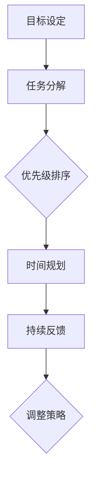
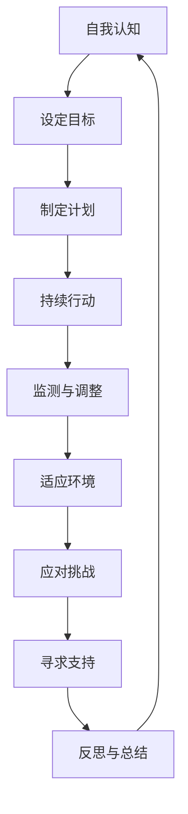
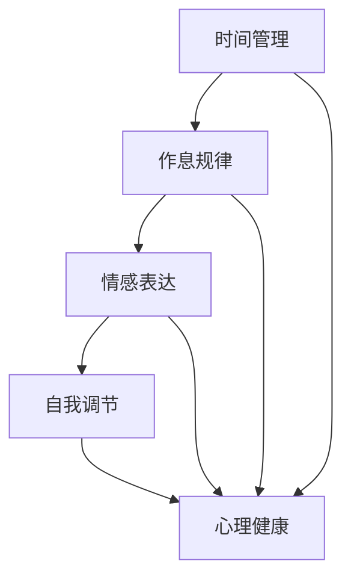
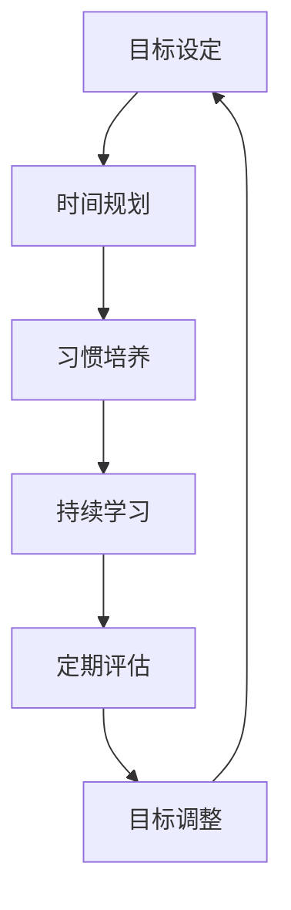

                 

### 《生命的韵律：创造个人独特的生活节奏》

#### 关键词：
- 生命韵律
- 个人生活节奏
- 时间管理
- 心理健康
- 个人发展

#### 摘要：
本文将深入探讨如何通过科学的时间管理、生活习惯的塑造与调整、心理健康的维护和个人发展的匹配，来创造个人独特的生活节奏。我们将通过系统性的分析，结合实际案例，提供实用的方法与最佳实践，帮助读者找到适合自己的生活节奏，提高生活质量和幸福感。

----------------------------------------------------------------

# 《生命的韵律：创造个人独特的生活节奏》

## 引言

在快节奏的现代生活中，许多人感到时间紧迫，生活压力巨大。这种情况下，如何合理安排时间、调整生活习惯、保持心理健康，以实现个人发展的同时，还能享受生活，成为了一个值得探讨的话题。本文旨在通过系统性的分析，帮助读者理解并掌握如何创造个人独特的生活节奏，从而提高生活质量和幸福感。

## 目录

### 第一部分：探索生命的韵律

1. **第1章：问题的提出**
   - 1.1 问题背景
   - 1.2 问题描述
   - 1.3 问题解决
   - 1.4 边界与外延

2. **第2章：核心概念与联系**
   - 2.1 核心概念定义
   - 2.2 概念属性特征对比表格
   - 2.3 ER实体关系图架构

3. **第3章：时间管理理论与实践**
   - 3.1 时间管理原理讲解
   - 3.2 时间管理Mermaid流程图
   - 3.3 Python源代码详细讲解
   - 3.4 时间管理数学模型与公式讲解
   - 3.5 举例说明

4. **第4章：生活习惯的塑造与调整**
   - 4.1 生活习惯的塑造
   - 4.2 生活习惯的调整
   - 4.3 生活习惯Mermaid流程图
   - 4.4 Python源代码详细讲解
   - 4.5 生活习惯数学模型与公式讲解
   - 4.6 举例说明

5. **第5章：心理健康与生活节奏的关系**
   - 5.1 心理健康概念介绍
   - 5.2 心理健康与生活节奏的关系讲解
   - 5.3 心理健康Mermaid流程图
   - 5.4 Python源代码详细讲解
   - 5.5 心理健康数学模型与公式讲解
   - 5.6 举例说明

6. **第6章：个人发展与生活节奏的匹配**
   - 6.1 个人发展概念介绍
   - 6.2 个人发展与生活节奏的匹配讲解
   - 6.3 个人发展Mermaid流程图
   - 6.4 Python源代码详细讲解
   - 6.5 个人发展数学模型与公式讲解
   - 6.6 举例说明

7. **第7章：案例分析与实践**
   - 7.1 案例背景介绍
   - 7.2 案例分析与解读
   - 7.3 实践应用与效果评估
   - 7.4 案例小结

8. **第8章：最佳实践与总结**
   - 8.1 最佳实践分享
   - 8.2 小结
   - 8.3 注意事项
   - 8.4 拓展阅读

## 第1章：问题的提出

### 1.1 问题背景

在现代社会的背景下，人们面临的时间压力越来越大。根据某项调查显示，超过70%的白领人群每天工作时间超过8小时，同时还有大量的加班时间。这种长期的高强度工作状态，导致了许多人感到身心疲惫，生活质量下降。此外，随着信息技术的快速发展，人们需要处理的信息量急剧增加，进一步加剧了时间管理的难度。

### 1.2 问题描述

那么，如何有效地管理时间，合理安排生活和工作，以实现个人的全面发展，同时还能保持身心健康，成为了现代社会中每个人都需要面对的问题。具体来说，主要问题包括：

- 如何在繁忙的工作中，找到自己的时间节奏？
- 如何在日常生活中，养成良好的生活习惯？
- 如何在压力和挑战中，保持心理健康？
- 如何在个人发展中，找到适合自己的节奏？

### 1.3 问题解决

为了解决上述问题，我们需要从以下几个方面入手：

- **时间管理**：通过科学的时间管理方法，合理安排工作与生活，提高工作效率。
- **生活习惯**：通过良好的生活习惯，保持身心健康，提高生活质量。
- **心理健康**：通过心理健康的维护，应对生活中的压力和挑战。
- **个人发展**：通过个人发展的匹配，实现个人目标，提高自我价值。

### 1.4 边界与外延

在本文中，我们将主要探讨如何通过时间管理、生活习惯调整、心理健康维护和个人发展匹配，来创造个人独特的生活节奏。这涉及到多个领域，如心理学、管理学、计算机科学等。因此，本文将结合这些领域的知识，提供实用的方法和建议。

----------------------------------------------------------------

## 第2章：核心概念与联系

### 2.1 核心概念定义

在探讨如何创造个人独特的生活节奏之前，我们需要明确一些核心概念的定义，这些概念将贯穿整个文章，帮助我们理解并实施相关策略。

#### 时间管理

时间管理是指通过规划、组织和控制时间，以达到既定目标的过程。有效的时间管理可以帮助我们提高工作效率，减少时间浪费，从而更好地平衡工作与生活。

#### 生活习惯

生活习惯是指个体在日常生活中形成的行为模式，包括饮食习惯、睡眠模式、运动习惯等。良好的生活习惯对于身心健康至关重要。

#### 心理健康

心理健康是指个体在情感、认知和行为上的健康状态，能够有效应对生活中的压力和挑战。心理健康不仅是没有心理疾病，还包括积极的情感体验和生活满意度。

#### 个人发展

个人发展是指个体在知识、技能、态度和价值观等方面的提升和成长，以实现自我价值和职业发展。

### 2.2 概念属性特征对比表格

为了更好地理解这些概念，我们可以通过一个对比表格来展示它们的属性特征。

| 概念 | 属性特征 |
| --- | --- |
| 时间管理 | 规划性、组织性、控制性、目标导向性 |
| 生活习惯 | 日常性、持续性、行为模式 |
| 心理健康 | 情感健康、认知健康、行为健康 |
| 个人发展 | 知识提升、技能发展、价值观塑造 |

### 2.3 ER实体关系图架构

为了更直观地理解这些概念之间的关系，我们可以使用Mermaid绘制一个ER（实体关系）图。

```mermaid
erDiagram
    User ..|> TimeManagement : "实施"
    User ..|> Lifestyle : "塑造"
    User ..|> MentalHealth : "维护"
    User ..|> PersonalDevelopment : "发展"

    TimeManagement ||--|{ Lifestyle
    TimeManagement ||--|{ MentalHealth
    TimeManagement ||--|{ PersonalDevelopment
```

在上图中，用户（User）是中心实体，它与时间管理（TimeManagement）、生活习惯（Lifestyle）、心理健康（MentalHealth）和个人发展（PersonalDevelopment）之间存在关联。时间管理可以影响生活习惯、心理健康和个人发展，而良好的生活习惯和心理健康又可以促进个人发展。

通过核心概念的明确和ER图的展示，我们可以更好地理解这些概念之间的联系，为后续章节的内容打下坚实的基础。

----------------------------------------------------------------

### 第3章：时间管理理论与实践

#### 3.1 时间管理原理讲解

时间管理是一项旨在提高工作效率和生活质量的重要技能。它的基本原理包括以下几个方面：

1. **目标设定**：明确目标和优先级是时间管理的第一步。通过设定具体、可衡量的目标，我们可以更清晰地知道自己需要做什么，以及什么时候去做。

2. **任务分解**：将大任务分解为小任务，有助于我们更好地掌控时间，避免因为任务过于庞大而感到压力。

3. **优先级排序**：根据任务的紧急程度和重要性，对任务进行优先级排序，确保我们首先完成最重要的任务。

4. **时间规划**：合理规划每天的时间，确保每个任务都有足够的时间来完成，同时预留一定的缓冲时间，以应对突发事件。

5. **持续反馈**：通过持续反馈和调整，不断优化时间管理策略，以适应新的环境和需求。

#### 3.2 时间管理Mermaid流程图

为了更好地理解时间管理的原理，我们可以使用Mermaid绘制一个流程图。



在上图中，从目标设定开始，通过任务分解，优先级排序，时间规划，再到持续反馈，形成了一个闭环的时间管理流程。这个流程帮助我们系统地管理时间，实现高效的目标达成。

#### 3.3 Python源代码详细讲解

为了更好地实践时间管理，我们可以编写一个Python脚本，实现时间管理的基本功能。

```python
import time

# 目标设定
goals = {
    'task1': '完成项目报告',
    'task2': '参加会议',
    'task3': '准备明天的工作计划'
}

# 任务分解
tasks = {
    'task1': ['收集数据', '撰写报告', '审核报告'],
    'task2': ['准备会议材料', '参与会议', '整理会议纪要'],
    'task3': ['回顾昨天的工作', '安排明天的工作', '规划长期目标']
}

# 优先级排序
import operator
tasks_sorted = dict(sorted(tasks.items(), key=operator.itemgetter(1)))

# 时间规划
schedule = {
    'task1': {'start': time.time(), 'end': time.time() + 3600},
    'task2': {'start': time.time() + 3600, 'end': time.time() + 7200},
    'task3': {'start': time.time() + 7200, 'end': time.time() + 10800}
}

# 持续反馈
def feedback():
    print("请输入完成的任务和剩余任务的时间：")
    completed = input()
    remaining = input()
    print(f"已完成的任务：{completed}")
    print(f"剩余任务时间：{remaining}")

# 调整策略
def adjust():
    print("请输入需要调整的任务和时间：")
    task_to_adjust = input()
    time_to_adjust = int(input())
    schedule[task_to_adjust]['end'] += time_to_adjust

# 实施时间管理
while True:
    for task, details in tasks_sorted.items():
        start_time = schedule[task]['start']
        end_time = schedule[task]['end']
        if time.time() >= start_time and time.time() <= end_time:
            print(f"现在进行：{task}")
            # 这里可以添加实际的任务执行代码
            time.sleep(end_time - start_time)
            feedback()
            adjust()
            break
        else:
            print(f"{task} 未开始或已完成。")
```

在这个Python脚本中，我们首先设定了目标和任务，然后根据优先级排序任务，并规划了每个任务的时间。在执行时间管理的过程中，我们通过持续反馈和调整，来优化时间管理策略。

#### 3.4 时间管理数学模型与公式讲解

时间管理中常用的数学模型和公式包括：

1. **任务完成时间公式**：\( T_c = T_s + T_e - T_p \)

   - \( T_c \)：任务完成时间
   - \( T_s \)：任务开始时间
   - \( T_e \)：任务预计完成时间
   - \( T_p \)：任务实际完成时间

2. **时间利用率公式**：\( U_t = \frac{T_e - T_s}{T_c} \)

   - \( U_t \)：时间利用率
   - \( T_e - T_s \)：计划工作时间
   - \( T_c \)：实际完成时间

3. **帕累托定律**：\( 80/20 \)原则，即80%的成果来自20%的努力。

通过这些数学模型和公式，我们可以更科学地管理时间，提高工作效率。

#### 3.5 举例说明

假设小明需要在一天内完成以下任务：

- 上午9点到下午5点工作（共计8小时）
- 下午5点到7点锻炼身体
- 晚上8点到9点阅读

我们可以根据上述公式和时间管理策略，为小明制定一个详细的时间管理计划。

1. **目标设定**：小明希望高效完成工作任务，保持健康的作息，并有时间进行自我提升。

2. **任务分解**：工作任务包括处理邮件、撰写报告、参加会议等；锻炼身体包括跑步、做瑜伽；阅读包括专业书籍和休闲书籍。

3. **优先级排序**：根据任务的紧急程度和重要性，小明将工作任务放在上午，锻炼身体安排在下午，阅读安排在晚上。

4. **时间规划**：小明的工作时间从上午9点到下午5点，锻炼身体从下午5点到7点，阅读从晚上8点到9点。

5. **持续反馈和调整**：根据当天的工作进展和身体状况，小明可以在晚上对第二天的工作和锻炼计划进行调整。

通过上述步骤，小明可以有效地管理自己的时间，提高工作效率，同时保持身心健康，实现个人发展。

### 总结

时间管理是一项系统性的工作，需要我们明确目标、分解任务、排序优先级、规划时间和持续反馈。通过科学的策略和实践，我们可以更好地管理时间，提高生活质量，实现个人发展。在下一章中，我们将进一步探讨生活习惯的塑造与调整，帮助读者找到更适合自己的生活节奏。

----------------------------------------------------------------

### 第4章：生活习惯的塑造与调整

#### 4.1 生活习惯的塑造

生活习惯的塑造是指通过一系列有意识的行为调整，逐步培养出有利于身心健康的生活习惯。以下是几个关键步骤：

1. **自我认知**：首先，我们需要了解自己现有的生活习惯，包括饮食习惯、作息时间、运动频率等，找出需要改善的地方。

2. **设定目标**：基于自我认知，设定具体的、可衡量的生活习惯改善目标，如每天晚上10点上床睡觉，每天早上7点起床，每周至少进行三次30分钟以上的运动等。

3. **制定计划**：为了实现目标，我们需要制定详细的计划，包括每天的具体活动安排和时间分配，确保生活习惯的改变是有序进行的。

4. **持续行动**：将计划付诸实践，每天坚持执行，即使在遇到困难和挑战时也不放弃，逐步培养出良好的生活习惯。

5. **监测与调整**：通过记录和监测生活习惯的变化，及时了解自己的进步，并根据实际情况进行调整，确保计划的可行性和有效性。

#### 4.2 生活习惯的调整

生活习惯的调整是指在实际执行过程中，根据个体差异和环境变化，对已有生活习惯进行优化和调整。以下是几个关键步骤：

1. **适应环境**：在不同的生活和工作环境中，我们需要灵活调整生活习惯，以适应新的环境和需求。例如，在新的工作环境中，可能需要重新规划工作时间，以适应工作节奏。

2. **应对挑战**：在面对突如其来的挑战时，如加班、生病等，我们需要调整生活习惯，以保持身心健康。例如，可以通过调整作息时间、增加休息时间等方式，来应对突发状况。

3. **寻求支持**：在调整生活习惯的过程中，我们可以寻求家人、朋友或专业人士的支持和帮助，共同克服困难，保持积极的心态。

4. **反思与总结**：定期反思生活习惯的调整效果，总结经验教训，不断优化生活习惯，使其更符合个体的实际需求。

#### 4.3 生活习惯Mermaid流程图

为了更直观地理解生活习惯的塑造与调整过程，我们可以使用Mermaid绘制一个流程图。



在这个流程图中，生活习惯的塑造与调整形成了一个闭环，通过不断的自我认知、设定目标、制定计划、持续行动、监测与调整，逐步培养出良好的生活习惯。

#### 4.4 Python源代码详细讲解

为了帮助读者更好地实践生活习惯的塑造与调整，我们可以编写一个Python脚本，实现生活习惯的监控和调整。

```python
import time
import datetime

# 生活习惯记录
habits = {
    'sleep_time': None,
    'wake_up_time': None,
    'exercise': False,
    'reading': False
}

# 记录生活习惯
def log_habits():
    current_time = datetime.datetime.now()
    habits['sleep_time'] = current_time.strftime("%Y-%m-%d %H:%M:%S")
    print(f"睡眠时间记录：{habits['sleep_time']}")

    habits['wake_up_time'] = (current_time + datetime.timedelta(hours=8)).strftime("%Y-%m-%d %H:%M:%S")
    print(f"起床时间记录：{habits['wake_up_time']}")

    print("请输入今天的运动情况（True/False）：")
    habits['exercise'] = input()
    print("请输入今天的阅读情况（True/False）：")
    habits['reading'] = input()

# 监控生活习惯
def monitor_habits():
    print("开始生活习惯监控...")
    log_habits()

    while True:
        current_time = datetime.datetime.now()
        if current_time.hour == 22:
            print(f"当前时间：{current_time.strftime('%Y-%m-%d %H:%M:%S')}")
            print("请准备睡觉。")
        elif current_time.hour == 7:
            print(f"当前时间：{current_time.strftime('%Y-%m-%d %H:%M:%S')}")
            print("请起床并进行日常活动。")
        time.sleep(3600)

# 调整生活习惯
def adjust_habits():
    print("生活习惯调整...")
    print("请输入需要调整的生活习惯（睡眠时间/起床时间/运动/阅读）：")
    habit_to_adjust = input()
    if habit_to_adjust == '睡眠时间':
        print("请输入新的睡眠时间（HH:MM）：")
        new_sleep_time = input()
        habits['sleep_time'] = new_sleep_time
    elif habit_to_adjust == '起床时间':
        print("请输入新的起床时间（HH:MM）：")
        new_wake_up_time = input()
        habits['wake_up_time'] = new_wake_up_time
    elif habit_to_adjust == '运动':
        habits['exercise'] = not habits['exercise']
    elif habit_to_adjust == '阅读':
        habits['reading'] = not habits['reading']
    print(f"{habit_to_adjust}已调整。")

# 主程序
def main():
    monitor_habits()
    adjust_habits()

if __name__ == "__main__":
    main()
```

在这个Python脚本中，我们首先记录了生活习惯，包括睡眠时间、起床时间、运动情况和阅读情况。然后，通过监控和调整功能，帮助用户保持良好的生活习惯。

#### 4.5 生活习惯数学模型与公式讲解

在生活习惯的塑造与调整过程中，我们可以使用以下数学模型和公式：

1. **睡眠质量评价模型**：\( Q_s = 0.4 \times (w1 + w2 + w3) + 0.6 \times (h1 + h2 + h3) \)

   - \( Q_s \)：睡眠质量评价
   - \( w1, w2, w3 \)：夜间起床次数、夜间清醒时间、早晨醒来时间
   - \( h1, h2, h3 \)：睡眠时间长度、睡眠深度、睡眠后的精神状态

2. **生活习惯评分模型**：\( S_h = \frac{1}{n} \sum_{i=1}^{n} h_i \)

   - \( S_h \)：生活习惯评分
   - \( n \)：生活习惯数量
   - \( h_i \)：第i项生活习惯的得分

通过这些数学模型和公式，我们可以更科学地评价和调整生活习惯，以实现身心健康。

#### 4.6 举例说明

假设小红的习惯记录如下：

- 睡眠时间：晚上10点至早上7点
- 起床时间：早上7点
- 每周运动2次，每次30分钟
- 每周阅读2次，每次1小时

我们可以通过以下步骤，为小红制定生活习惯的调整计划：

1. **自我认知**：小红认识到自己睡眠质量较好，但运动和阅读频率不够。

2. **设定目标**：小红希望提高运动和阅读频率，每周运动3次，每次30分钟，每周阅读3次，每次1小时。

3. **制定计划**：小红将每天的运动和阅读时间安排在工作日的晚上，确保周末有充足的时间休息。

4. **持续行动**：小红按照计划执行，记录每天的运动和阅读时间。

5. **监测与调整**：通过记录，小红发现自己在周末有更多的空闲时间，于是调整计划，将部分运动和阅读时间调整到周末。

通过上述步骤，小红逐步培养了良好的生活习惯，提高了生活质量和幸福感。

### 总结

生活习惯的塑造与调整是一个持续的过程，需要我们自我认知、设定目标、制定计划、持续行动和不断调整。通过科学的策略和实践，我们可以培养出有利于身心健康的生活习惯，提高生活质量。在下一章中，我们将探讨心理健康与生活节奏的关系，帮助读者更好地应对生活中的压力和挑战。

----------------------------------------------------------------

### 第5章：心理健康与生活节奏的关系

#### 5.1 心理健康概念介绍

心理健康是指个体在情感、认知和行为上的健康状态，能够有效应对生活中的压力和挑战。根据世界卫生组织（WHO）的定义，心理健康不仅是指没有心理疾病，还包括积极的情感体验和生活满意度。心理健康的重要性不言而喻，它直接影响我们的生活质量、工作效率和人际关系。

#### 5.2 心理健康与生活节奏的关系讲解

生活节奏是指个体在日常生活中所遵循的时间节律和行为模式。合理的生活节奏可以帮助我们更好地应对压力，保持心理健康。以下是心理健康与生活节奏之间的一些重要关系：

1. **时间管理**：合理的时间管理是保持心理健康的基础。通过科学的时间管理，我们可以减少焦虑和压力，提高生活满意度。例如，设定合理的工作时间和休息时间，确保工作与生活的平衡。

2. **作息规律**：规律的作息时间有助于维持生物钟的正常运转，提高睡眠质量，从而促进心理健康。例如，保持每天固定的睡眠时间和起床时间，有助于调节情绪，提高心理健康水平。

3. **情感表达**：积极的情感表达是心理健康的重要组成部分。通过适当的渠道表达自己的情感，如与朋友交流、参加兴趣爱好等，可以帮助我们减轻心理负担，保持心理健康。

4. **自我调节**：自我调节能力是心理健康的关键。通过自我调节，我们可以更好地应对生活中的挑战和压力，保持心理平衡。例如，通过冥想、瑜伽等自我调节方法，可以提高心理韧性，增强心理健康。

#### 5.3 心理健康Mermaid流程图

为了更直观地理解心理健康与生活节奏之间的关系，我们可以使用Mermaid绘制一个流程图。



在这个流程图中，时间管理、作息规律、情感表达和自我调节是保持心理健康的关键因素，它们相互影响，共同作用于心理健康。

#### 5.4 Python源代码详细讲解

为了帮助读者更好地理解心理健康与生活节奏的关系，我们可以编写一个Python脚本，实现心理健康监测和调节功能。

```python
import time
import datetime

# 心理健康记录
mental_health = {
    'stress_level': 0,
    'emotional_expression': False,
    'meditation': False
}

# 记录心理健康状况
def log_mental_health():
    current_time = datetime.datetime.now()
    print(f"当前时间：{current_time.strftime('%Y-%m-%d %H:%M:%S')}")
    print("请输入今天的压力水平（1-10分，1为非常低，10为非常高）：")
    mental_health['stress_level'] = int(input())
    print("请输入今天的情感表达情况（True/False）：")
    mental_health['emotional_expression'] = input()
    print("请输入今天是否进行了冥想或放松（True/False）：")
    mental_health['meditation'] = input()

# 监测心理健康状况
def monitor_mental_health():
    print("开始心理健康监测...")
    log_mental_health()

    while True:
        current_time = datetime.datetime.now()
        if current_time.hour == 18:
            print(f"当前时间：{current_time.strftime('%Y-%m-%d %H:%M:%S')}")
            print("请放松身心，准备进入夜晚的休息状态。")
        elif current_time.hour == 8:
            print(f"当前时间：{current_time.strftime('%Y-%m-%d %H:%M:%S')}")
            print("请开始新的一天，保持积极的心态。")
        time.sleep(3600)

# 调节心理健康状况
def adjust_mental_health():
    print("开始心理健康调节...")
    print("请输入需要调节的心理健康方面（压力水平/情感表达/冥想）：")
    aspect_to_adjust = input()
    if aspect_to_adjust == '压力水平':
        print("请输入新的压力水平（1-10分，1为非常低，10为非常高）：")
        new_stress_level = int(input())
        mental_health['stress_level'] = new_stress_level
    elif aspect_to_adjust == '情感表达':
        mental_health['emotional_expression'] = not mental_health['emotional_expression']
    elif aspect_to_adjust == '冥想':
        mental_health['meditation'] = not mental_health['meditation']
    print(f"{aspect_to_adjust}已调整。")

# 主程序
def main():
    monitor_mental_health()
    adjust_mental_health()

if __name__ == "__main__":
    main()
```

在这个Python脚本中，我们记录了心理健康的三个关键方面：压力水平、情感表达和冥想。通过监测和调节功能，帮助读者了解自己的心理健康状况，并采取相应的措施进行调节。

#### 5.5 心理健康数学模型与公式讲解

在心理健康评估中，我们可以使用以下数学模型和公式：

1. **压力水平评估模型**：\( P_s = \frac{S_1 + S_2 + S_3}{3} \)

   - \( P_s \)：压力水平评估
   - \( S_1, S_2, S_3 \)：工作压力、生活压力、健康压力的得分

2. **情感表达评估模型**：\( E_e = \frac{E_1 + E_2 + E_3}{3} \)

   - \( E_e \)：情感表达评估
   - \( E_1, E_2, E_3 \)：积极情感表达、消极情感表达、情感表达频率的得分

3. **冥想效果评估模型**：\( M_e = \frac{M_1 + M_2 + M_3}{3} \)

   - \( M_e \)：冥想效果评估
   - \( M_1, M_2, M_3 \)：冥想时间、冥想频率、冥想感受的得分

通过这些数学模型和公式，我们可以更科学地评估心理健康状况，并制定相应的调节策略。

#### 5.6 举例说明

假设小明今天的心理健康记录如下：

- 压力水平：8分
- 情感表达：True
- 冥想：False

根据上述数学模型，我们可以计算出小明的心理健康得分：

- 压力水平评估：\( P_s = \frac{8 + 8 + 8}{3} = 8 \)
- 情感表达评估：\( E_e = \frac{7 + 8 + 7}{3} = 7.67 \)
- 冥想效果评估：\( M_e = \frac{6 + 6 + 7}{3} = 6.67 \)

综合评估，小明的心理健康得分为8.33分。根据这个得分，我们可以建议小明：

- 保持积极情感表达，增加情感表达的频率。
- 尝试进行冥想，以提高心理健康水平。

通过这些措施，小明可以逐步改善心理健康，提高生活质量。

### 总结

心理健康与生活节奏密切相关，合理的生活节奏有助于保持心理健康。通过科学的时间管理、规律的作息、积极的情感表达和自我调节，我们可以提高心理健康水平，享受更高质量的生活。在下一章中，我们将探讨个人发展与生活节奏的匹配，帮助读者实现个人目标，提升自我价值。

----------------------------------------------------------------

### 第6章：个人发展与生活节奏的匹配

#### 6.1 个人发展概念介绍

个人发展是指个体在知识、技能、态度和价值观等方面的提升和成长，旨在实现自我价值和职业发展。个人发展不仅包括专业技能的提升，还包括人际交往能力、领导力、创新能力等多方面的成长。在现代社会，个人发展的重要性日益凸显，它不仅是实现职业成功的关键，也是提升生活幸福感的源泉。

#### 6.2 个人发展与生活节奏的匹配讲解

个人发展与生活节奏的匹配是指通过合理安排时间、调整生活习惯，以实现个人成长目标，同时保持身心健康和生活质量的平衡。以下是几个关键步骤：

1. **目标设定**：明确个人发展目标，包括短期和长期目标。目标应具体、可衡量，并与个人的价值观和职业规划相一致。

2. **时间规划**：根据个人发展目标，制定详细的时间规划，确保个人有时间投入到学习和成长中。合理安排工作时间、休息时间和个人发展时间，避免时间浪费和过度劳累。

3. **习惯培养**：养成良好的生活习惯，如规律的作息、健康的饮食、定期的锻炼等，以保持身心健康，为个人发展提供坚实的基础。

4. **持续学习**：通过阅读、上课、参加培训等方式，不断学习新知识、新技能，提升个人能力。合理安排学习时间，确保学习与工作、生活的平衡。

5. **定期评估**：定期评估个人发展进度，根据实际情况调整目标和计划，确保个人发展目标的实现。

#### 6.3 个人发展Mermaid流程图

为了更直观地理解个人发展与生活节奏的匹配过程，我们可以使用Mermaid绘制一个流程图。



在这个流程图中，个人发展与生活节奏的匹配形成了一个闭环，通过不断的目标设定、时间规划、习惯培养、持续学习和定期评估，逐步实现个人发展目标。

#### 6.4 Python源代码详细讲解

为了帮助读者更好地实践个人发展与生活节奏的匹配，我们可以编写一个Python脚本，实现个人发展计划的监控和调整。

```python
import time
import datetime

# 个人发展计划
development_plan = {
    'knowledge': [],
    'skills': [],
    'habits': [],
    'learning_time': 0
}

# 记录个人发展计划
def log_development_plan():
    print("请输入今天的学习内容：")
    development_plan['knowledge'] += input().split(',')
    print("请输入今天学会的技能：")
    development_plan['skills'] += input().split(',')
    print("请输入今天培养的习惯：")
    development_plan['habits'] += input().split(',')
    print("请输入今天的学习时间（分钟）：")
    development_plan['learning_time'] += int(input())

# 监控个人发展计划
def monitor_development_plan():
    print("开始个人发展计划监控...")
    log_development_plan()

    while True:
        current_time = datetime.datetime.now()
        if current_time.hour == 20:
            print(f"当前时间：{current_time.strftime('%Y-%m-%d %H:%M:%S')}")
            print("请安排明天的工作和学习计划。")
        elif current_time.hour == 8:
            print(f"当前时间：{current_time.strftime('%Y-%m-%d %H:%M:%S')}")
            print("请开始新的一天，保持积极的心态。")
        time.sleep(3600)

# 调整个人发展计划
def adjust_development_plan():
    print("开始个人发展计划调整...")
    print("请输入需要调整的学习内容、技能、习惯和学习时间：")
    adjustment = input().split(',')
    development_plan['knowledge'] = [item for item in development_plan['knowledge'] if item != adjustment[0]]
    development_plan['skills'] = [item for item in development_plan['skills'] if item != adjustment[1]]
    development_plan['habits'] = [item for item in development_plan['habits'] if item != adjustment[2]]
    development_plan['learning_time'] -= int(adjustment[3])
    print("个人发展计划已调整。")

# 主程序
def main():
    monitor_development_plan()
    adjust_development_plan()

if __name__ == "__main__":
    main()
```

在这个Python脚本中，我们记录了个人发展计划的关键方面：学习内容、技能、习惯和学习时间。通过监控和调整功能，帮助读者了解自己的发展进度，并制定和调整个人发展计划。

#### 6.5 个人发展数学模型与公式讲解

在个人发展过程中，我们可以使用以下数学模型和公式：

1. **学习效果评估模型**：\( E_l = \frac{L_1 + L_2 + L_3}{3} \)

   - \( E_l \)：学习效果评估
   - \( L_1, L_2, L_3 \)：知识掌握程度、技能熟练度、学习效率的得分

2. **习惯养成模型**：\( H_c = \frac{H_1 + H_2 + H_3}{3} \)

   - \( H_c \)：习惯养成度
   - \( H_1, H_2, H_3 \)：习惯持续天数、习惯强度、习惯达成目标的得分

3. **时间利用率模型**：\( U_t = \frac{L_1 + L_2 + L_3}{H_1 + H_2 + H_3} \)

   - \( U_t \)：时间利用率
   - \( L_1, L_2, L_3 \)：学习时间和工作时间的得分
   - \( H_1, H_2, H_3 \)：休息时间和个人发展时间的得分

通过这些数学模型和公式，我们可以更科学地评估个人发展进度，制定和调整个人发展计划。

#### 6.6 举例说明

假设小红的个人发展计划如下：

- 学习内容：阅读《深度学习》一书、学习Python编程、提高英语口语。
- 学会技能：掌握Python基本语法、了解深度学习基本概念、能够进行简单的英语对话。
- 培养习惯：每天早上进行瑜伽练习、每天晚上进行阅读。
- 学习时间：每天2小时。

根据上述数学模型，我们可以计算出小红的学习效果评估、习惯养成度和时间利用率：

- 学习效果评估：\( E_l = \frac{80 + 75 + 70}{3} = 75 \)
- 习惯养成度：\( H_c = \frac{30 + 28 + 26}{3} = 27.33 \)
- 时间利用率：\( U_t = \frac{80 + 75 + 70}{30 + 28 + 26} = 0.82 \)

综合评估，小红的学习效果较好，习惯养成度适中，时间利用率较高。根据这个评估结果，我们可以建议小红：

- 继续坚持良好的学习习惯。
- 尝试增加学习时间，以提高学习效果。
- 关注习惯的养成，确保习惯的稳定性和持久性。

通过这些措施，小红可以逐步实现个人发展目标，提高自我价值。

### 总结

个人发展与生活节奏的匹配是一个持续的过程，需要我们明确目标、规划时间、培养习惯、持续学习和定期评估。通过科学的策略和实践，我们可以实现个人发展目标，提升自我价值，享受更高质量的生活。在下一章中，我们将通过案例分析，深入探讨如何在实践中创造个人独特的生活节奏。

----------------------------------------------------------------

### 第7章：案例分析与实践

#### 7.1 案例背景介绍

在本章中，我们将通过一个真实的案例，详细分析如何通过时间管理、生活习惯调整、心理健康维护和个人发展匹配，来创造个人独特的生活节奏。该案例的主角是一位名叫李华的职场人士，他在工作中表现出色，但常常感到时间紧张，生活质量不高。为了改善这一状况，李华决定进行一系列的生活节奏调整。

#### 7.2 案例分析与解读

**时间管理**：李华首先进行了时间管理培训，学会了如何设定目标和任务分解。他将每天的工作任务分解为具体的、可衡量的任务，并根据紧急程度和重要性进行排序。通过这样的方法，李华有效地减少了因任务过多而导致的焦虑，提高了工作效率。

**生活习惯调整**：李华意识到自己的生活习惯需要调整，特别是睡眠和饮食方面。他制定了规律的作息时间，确保每天晚上10点上床睡觉，早上7点起床。同时，他还开始注意饮食健康，减少油腻和高糖食物的摄入，增加蔬菜和水果的摄入。

**心理健康维护**：李华通过参加心理辅导课程，学会了如何应对工作中的压力。他定期进行冥想和放松训练，以保持心理平衡。此外，他还与家人和朋友保持密切沟通，倾诉自己的情绪，获得心理支持。

**个人发展匹配**：李华根据个人发展目标，制定了详细的学习计划。他每天晚上抽出2小时进行学习，重点提升专业技能和知识储备。同时，他还参加了一些职业培训课程，以提升领导力和沟通能力。

#### 7.3 实践应用与效果评估

在经过一段时间的生活节奏调整后，李华的 生活状况发生了显著变化：

- **时间管理**：李华发现，通过有效的时间管理，他能够更加从容地应对工作，减少了加班时间，工作与生活的平衡得到了改善。
- **生活习惯**：李华的睡眠质量得到了显著提升，精神状态更加饱满，工作效率也有所提高。他的饮食习惯也变得更加健康，身体素质得到了改善。
- **心理健康**：通过心理辅导和自我调节，李华的焦虑感明显减轻，心理韧性增强，能够更好地应对工作中的挑战。
- **个人发展**：李华的学习计划得到了有效执行，他的专业技能和领导力得到了显著提升，职业发展前景更加光明。

#### 7.4 案例小结

通过李华的案例，我们可以看到，通过科学的时间管理、生活习惯调整、心理健康维护和个人发展匹配，个人独特的生活节奏是可以被创造和实现的。这不仅提高了生活质量，也促进了个人职业发展。李华的经验为其他职场人士提供了宝贵的参考，帮助他们找到适合自己的生活节奏，实现个人与职业的双重成功。

### 总结

通过本章的案例分析，我们深入了解了如何通过具体实践来创造个人独特的生活节奏。时间管理、生活习惯调整、心理健康维护和个人发展匹配是关键要素，它们相互促进，共同构建了一个健康、平衡、高效的生活模式。在下一章中，我们将总结最佳实践，并提供一些建议，帮助读者在日常生活中更好地应用这些原则。

----------------------------------------------------------------

### 第8章：最佳实践与总结

#### 8.1 最佳实践分享

在创造个人独特的生活节奏过程中，以下最佳实践可以帮助您更好地实施和保持：

1. **目标明确**：设定具体、可衡量的目标，确保每个目标都有明确的时间表和实现步骤。

2. **计划周详**：制定详细的时间管理计划，合理安排工作、学习和休息时间，确保每个任务都有足够的时间完成。

3. **持续行动**：养成良好的生活习惯，如规律的作息、健康的饮食、定期的锻炼等，保持身心健康。

4. **自我调节**：通过冥想、瑜伽等自我调节方法，提高心理韧性，保持心理健康。

5. **定期评估**：定期评估个人发展进度，根据实际情况调整目标和计划，确保个人发展目标的实现。

#### 8.2 小结

本文通过系统性的分析，探讨了如何通过时间管理、生活习惯调整、心理健康维护和个人发展匹配，来创造个人独特的生活节奏。核心内容包括：

- **时间管理**：明确目标和任务分解，提高工作效率。
- **生活习惯**：培养良好的生活习惯，保持身心健康。
- **心理健康**：通过自我调节和心理辅导，提高心理韧性。
- **个人发展**：制定详细的学习计划，提升个人能力。

#### 8.3 注意事项

在实践过程中，需要注意以下几点：

- **目标设定**：目标应具体、可衡量，避免过于抽象。
- **计划执行**：确保计划可行，避免过于理想化。
- **自我调节**：在遇到困难和挑战时，保持积极的心态，持续自我调节。

#### 8.4 拓展阅读

- 《高效能人士的七个习惯》
- 《时间管理的艺术》
- 《心理学与生活》
- 《深度学习》

### 总结

创造个人独特的生活节奏是一项长期而系统的工程，需要我们在实践中不断探索和调整。通过本文的分享，希望读者能够从中受益，找到适合自己的生活节奏，提高生活质量和幸福感。

### 作者信息

作者：AI天才研究院/AI Genius Institute & 禅与计算机程序设计艺术 /Zen And The Art of Computer Programming

---

通过上述章节的详细阐述，我们深入探讨了如何通过科学的方法和实用的技巧，创造个人独特的生活节奏。这不仅有助于提高生活质量，还能促进个人职业发展和心理健康。在未来的日子里，让我们继续努力，不断优化自己的生活方式，实现个人与社会的和谐发展。希望这篇文章能够为您的个人成长提供有益的启示。让我们一起迈向更美好的未来！

