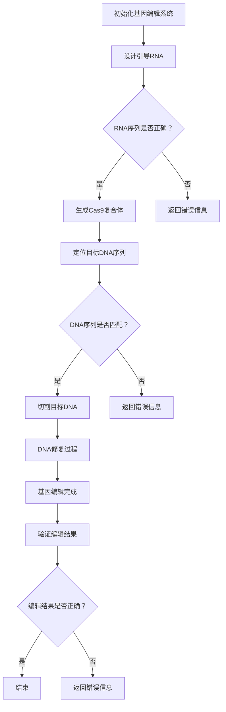
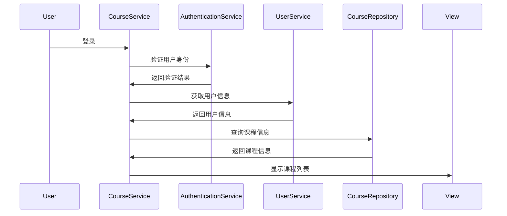
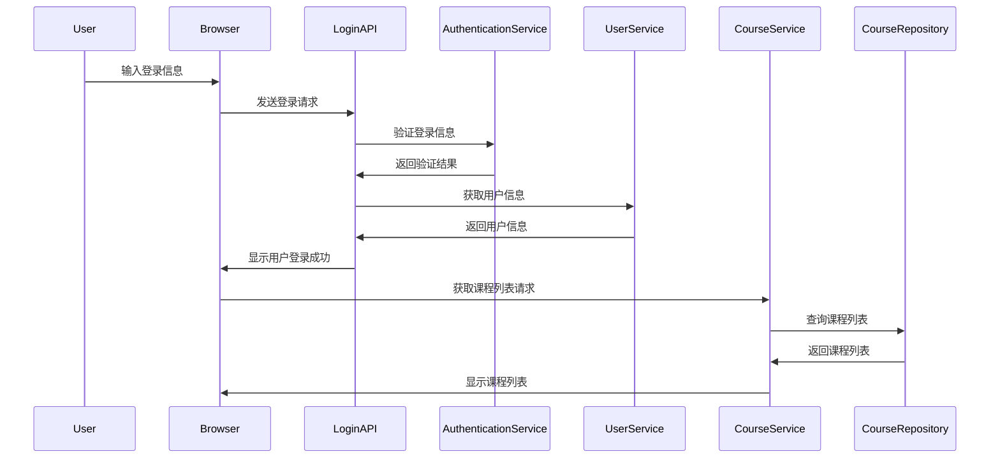

                 

**# 生命科学伦理在线课程：前沿科技的道德思考平台**

> **关键词：生命科学伦理、前沿科技、道德思考、基因编辑、人工智能、数据伦理**

> **摘要：本文深入探讨生命科学伦理在线课程的重要主题，从基因编辑、人工智能、医学伦理和数据伦理等方面展开，旨在为读者提供一个全面、深入的道德思考平台，以应对前沿科技带来的挑战和机遇。**

----------------------------------------------------------------

## 引言

### 1. 引言背景

生命科学，作为一门研究生命现象、生命活动的科学，其发展不仅推动了医学、农业、生物技术等领域的进步，同时也引发了诸多伦理争议。基因编辑、人工智能、医学技术等前沿科技的飞速发展，使得我们能够做到以前无法想象的事情，但同时也带来了许多道德和伦理上的问题。这些问题不仅涉及技术本身，还关系到人类的价值观、社会公平和人类福祉。因此，对生命科学伦理的探讨变得尤为重要。

### 2. 引言目的

本文旨在通过生命科学伦理在线课程，引导读者对前沿科技进行深刻的道德思考。我们将从基因编辑、人工智能、医学伦理和数据伦理等方面，逐一分析前沿科技带来的伦理挑战，并探讨可能的解决方案。通过这一过程，我们希望读者能够形成自己的道德判断，并在实际应用中做出负责任的选择。

----------------------------------------------------------------

## 第1章：生命科学伦理的概述

### 1. 生命科学的定义与发展

生命科学，顾名思义，是研究生命现象和生命活动的科学。它涵盖了生物学、医学、遗传学、分子生物学、生态学等多个学科。随着科技的发展，生命科学的领域也在不断扩展。例如，基因编辑技术的出现，使得我们可以对基因进行精确修改，从而改变生物的遗传特性。这种技术的发展，不仅为医学、农业等领域带来了巨大变革，同时也引发了许多伦理问题。

### 2. 伦理学的定义与作用

伦理学，是研究道德观念、道德原则和道德行为的学科。在生命科学领域，伦理学的作用至关重要。它可以帮助我们明确哪些行为是道德上可接受的，哪些是不道德的。例如，基因编辑技术的应用，可能会涉及到人类基因的改变，这需要我们进行伦理审查，以确保不违背人类的伦理原则。

### 3. 生命科学伦理的核心问题

生命科学伦理的核心问题包括但不限于以下几个方面：

- **人类基因编辑**：基因编辑技术是否应该用于人类？如何确保其安全性？
- **医疗资源分配**：随着医学技术的进步，如何公平分配有限的医疗资源？
- **动物实验**：动物实验的道德问题如何解决？
- **生命伦理教育**：如何培养公众的生命伦理意识？

### 4. 生命科学伦理的重要性

生命科学伦理的重要性在于，它关系到人类的健康、福祉和社会公正。如果不对生命科学进行伦理审查，可能会导致严重的道德和社会问题。例如，基因编辑技术的不当使用，可能会对人类基因组造成不可逆转的改变，影响人类的未来。因此，生命科学伦理的探讨，不仅是一个学术问题，更是一个关乎人类生存和发展的现实问题。

----------------------------------------------------------------

## 第2章：基因编辑伦理

### 1. 基因编辑技术的原理与应用

基因编辑技术，如CRISPR-Cas9，通过切割和修改DNA序列，可以实现基因的精确编辑。这种技术在医学、农业等领域有着广泛的应用。例如，在医学领域，基因编辑技术可以用于治疗遗传性疾病，如囊性纤维化、地中海贫血等。在农业领域，基因编辑技术可以用于培育抗病、抗虫的作物，提高农作物的产量和质量。

### 2. 基因编辑的伦理争议

基因编辑技术的应用，引发了许多伦理争议。例如：

- **人类基因编辑**：基因编辑技术是否应该用于人类？尤其是对于人类基因的永久性改变，是否道德？
- **动物实验**：使用基因编辑技术对动物进行实验，是否道德？
- **环境影响**：基因编辑技术可能对生态系统造成影响，如何评估其环境风险？

### 3. 基因编辑的法律与政策框架

为了规范基因编辑技术的应用，许多国家和地区已经制定了相关的法律和政策。例如，美国国立卫生研究院（NIH）规定了人类基因编辑的研究限制，禁止将基因编辑技术用于人类生殖。欧盟则制定了《基因编辑法规》，对基因编辑技术的应用进行了严格的监管。

### 4. 基因编辑的社会影响与未来趋势

基因编辑技术的应用，对社会产生了深远的影响。一方面，它为医学、农业等领域带来了巨大的变革，提高了人类的生活质量。另一方面，它也引发了许多伦理和社会问题。未来，随着基因编辑技术的不断进步，这些影响将进一步扩大。我们需要在伦理和社会层面进行深入的探讨，以确保技术的可持续发展。

----------------------------------------------------------------

## 第3章：人工智能伦理

### 1. 人工智能的定义与发展

人工智能（AI），是模拟人类智能行为的计算机技术。它通过机器学习、自然语言处理、计算机视觉等技术，实现机器的智能决策和行动。人工智能的发展可以追溯到20世纪50年代，随着计算机性能的提升和算法的创新，人工智能技术取得了长足的进步。

### 2. 人工智能在生命科学中的应用

人工智能在生命科学中的应用日益广泛，如：

- **医学诊断**：利用人工智能进行疾病诊断，可以提高诊断的准确性和效率。
- **药物研发**：人工智能可以加速药物研发过程，提高药物的成功率。
- **基因组分析**：人工智能可以帮助研究人员更好地分析基因组数据，发现疾病相关的基因。

### 3. 人工智能的伦理问题

人工智能在生命科学中的应用，也引发了许多伦理问题。例如：

- **隐私保护**：人工智能在处理个人健康数据时，如何保护个人隐私？
- **算法公平性**：人工智能算法是否公平，是否会导致歧视？
- **责任归属**：人工智能出现错误或造成伤害，责任应如何划分？

### 4. 人工智能的监管与责任

为了解决人工智能在生命科学中引发的伦理问题，各国政府和企业正在制定相关的监管政策和责任制度。例如，欧盟制定了《人工智能法案》，对人工智能的应用进行了严格的监管。企业也在加强内部管理，确保人工智能技术的合理和道德应用。

----------------------------------------------------------------

## 第4章：医学伦理

### 1. 医学伦理的基本原则

医学伦理的基本原则包括尊重患者自主权、不伤害患者、促进患者利益和公正分配医疗资源。这些原则为医学实践提供了道德指导，确保医疗行为符合伦理标准。

### 2. 医学伦理的挑战与争议

医学伦理面临许多挑战和争议，如：

- **临床试验**：临床试验的道德问题，如何平衡患者的利益和科学的进步？
- **器官移植**：器官移植的道德问题，如何确保器官的公平分配？
- **医疗隐私**：如何保护患者的隐私权，防止医疗数据泄露？

### 3. 医学伦理的法律与政策

为了解决医学伦理的挑战，各国政府和企业制定了相关的法律和政策。例如，美国《健康保险携带与责任法案》（HIPAA）规定了医疗数据的隐私保护。中国《医学伦理条例》明确了医学实践的伦理要求。

### 4. 医学伦理的跨学科合作

医学伦理的跨学科合作，有助于解决复杂的医学伦理问题。例如，医学伦理学与法律、社会学、心理学等领域的合作，可以提供更全面的视角和解决方案。

----------------------------------------------------------------

## 第5章：数据伦理

### 1. 数据伦理的定义与原则

数据伦理，是研究数据处理、共享和使用的道德原则和规范。其基本原则包括尊重个人隐私、数据安全、公正和透明。

### 2. 数据伦理在生命科学中的应用

在生命科学中，数据伦理的应用至关重要。例如：

- **基因数据**：基因数据的隐私保护和合理使用，是数据伦理的重要内容。
- **医疗数据**：医疗数据的共享和利用，如何确保患者的隐私和安全？

### 3. 数据伦理的挑战与争议

数据伦理面临许多挑战和争议，如：

- **数据泄露**：如何确保数据的安全和隐私？
- **数据歧视**：如何防止基于数据的人工智能算法导致歧视？
- **数据透明**：如何确保数据处理过程的透明和公正？

### 4. 数据伦理的法律与政策框架

为了应对数据伦理的挑战，各国政府和企业制定了相关的法律和政策。例如，欧盟的《通用数据保护条例》（GDPR）对数据隐私保护提出了严格要求。中国也制定了《数据安全法》和《个人信息保护法》，加强对个人数据的保护。

----------------------------------------------------------------

## 第6章：生命伦理的跨学科思考

### 1. 跨学科思考的重要性

生命伦理问题往往涉及多个学科领域，如医学、生物学、法学、社会学等。跨学科思考的重要性在于，它能够为解决复杂的生命伦理问题提供全面的视角和多元化的解决方案。

### 2. 跨学科思考的方法与应用

跨学科思考的方法包括：

- **多学科合作**：通过不同学科领域的专家合作，共同探讨生命伦理问题。
- **综合分析方法**：运用不同学科的理论和方法，对生命伦理问题进行综合分析。
- **案例研究**：通过具体案例的研究，探讨跨学科思考在生命伦理问题中的应用。

### 3. 生命伦理学的跨学科挑战

生命伦理学的跨学科挑战包括：

- **知识融合**：如何将不同学科的知识有效融合，形成统一的理论体系？
- **方法论**：如何构建适用于生命伦理学跨学科研究的方法论？
- **价值观**：如何协调不同学科领域的价值观，确保跨学科思考的道德性和公正性？

### 4. 跨学科合作的未来趋势

随着生命科学和技术的不断发展，跨学科合作将成为解决生命伦理问题的重要趋势。未来，我们需要在跨学科合作的基础上，构建更加完善的生命伦理学理论体系，以应对前沿科技带来的伦理挑战。

----------------------------------------------------------------

## 第7章：前沿科技与生命伦理

### 1. 前沿科技的发展趋势

前沿科技的发展趋势包括：

- **基因编辑技术**：不断改进的基因编辑技术，如CRISPR-Cas9的升级版本，将进一步提高基因编辑的准确性和效率。
- **人工智能**：人工智能技术的快速发展，将推动医疗、农业、生物技术等领域的变革。
- **生物技术**：如3D生物打印、生物计算机等新兴技术的突破，将带来生命科学领域的重大变革。

### 2. 前沿科技在生命科学中的应用

前沿科技在生命科学中的应用主要包括：

- **医学诊断**：利用人工智能进行疾病诊断，提高诊断的准确性和效率。
- **药物研发**：人工智能可以帮助研究人员快速筛选药物，加速药物研发过程。
- **基因编辑**：基因编辑技术可以用于治疗遗传性疾病，提高人类健康水平。

### 3. 前沿科技的伦理问题

前沿科技在生命科学中的应用，也引发了许多伦理问题。如：

- **人类基因编辑**：如何确保基因编辑技术用于道德和正当的目的？
- **人工智能**：如何确保人工智能在生命科学中的合理和道德应用？
- **生物技术**：如何评估新兴生物技术的伦理风险？

### 4. 前沿科技的未来展望

未来，前沿科技将继续在生命科学领域发挥重要作用。然而，如何应对这些科技带来的伦理挑战，将成为我们面临的重要课题。通过深入探讨前沿科技与生命伦理的关系，我们有望找到解决这些挑战的方法，确保科技的可持续发展。

----------------------------------------------------------------

## 结语

### 1. 课程总结

通过本课程的学习，我们深入探讨了生命科学伦理的多个方面，包括基因编辑、人工智能、医学伦理和数据伦理等。我们分析了这些前沿科技带来的伦理挑战，并探讨了可能的解决方案。这些内容不仅有助于我们理解生命科学伦理的重要性，也为我们在实际应用中提供了道德思考的框架。

### 2. 道德思考的启示

道德思考是生命科学伦理的核心。通过本课程的学习，我们认识到，在面对前沿科技时，我们不能仅关注技术的进步，更要关注其道德和社会影响。道德思考的启示在于，我们要在追求科技进步的同时，坚守道德底线，确保科技的发展符合人类的利益和社会的价值观。

### 3. 生命科学伦理的未来发展方向

未来，生命科学伦理的发展将面临诸多挑战。我们需要在跨学科合作的基础上，构建更加完善的生命伦理学理论体系，以应对这些挑战。同时，政府、企业和学术机构应共同参与，制定科学、合理、有效的伦理规范，确保前沿科技的道德和可持续发展。

**作者：AI天才研究院/AI Genius Institute & 禅与计算机程序设计艺术 /Zen And The Art of Computer Programming**

----------------------------------------------------------------

### 背景介绍

生命科学伦理学是一个相对较新的领域，它源于医学伦理学，但又超越了传统医学伦理的范畴。随着科技的发展，生命科学领域不断涌现出新的技术和方法，如基因编辑、人工智能、生物信息学等，这些技术的应用带来了前所未有的机遇，同时也引发了深刻的伦理争议。例如，基因编辑技术CRISPR-Cas9的出现，使得人类有可能对自身的遗传信息进行修改，这不仅涉及到技术本身的安全性，还涉及到伦理道德、社会影响等众多复杂问题。

在生命科学伦理学中，核心概念包括基因编辑、基因隐私、人类胚胎改造、人工智能在医学中的应用等。这些概念不仅相互关联，还与法律法规、社会价值观紧密相连。例如，基因编辑技术的伦理问题不仅涉及到技术本身的安全性，还涉及到对人类基因组改变可能带来的长期影响，以及对未来世代的责任。基因隐私问题则涉及到个人隐私权的保护，如何在基因信息的采集、存储、分析和使用过程中，确保个体的隐私不被侵犯。

伦理学在生命科学中的应用至关重要，它为科技的发展提供了道德指导，确保科技的应用符合人类的利益和社会的价值观。在生命科学领域，伦理学的作用主要体现在以下几个方面：

1. **规范科技应用**：伦理学为科技的发展设定了道德底线，确保科技的应用不违背人类的伦理原则。例如，基因编辑技术的研究和应用必须在严格的伦理审查下进行，以确保不侵犯个体的权利和尊严。

2. **指导科技发展**：伦理学为科技的发展提供了方向，帮助科技工作者在技术开发过程中，充分考虑伦理道德因素。例如，在开发人工智能医疗应用时，必须确保算法的公平性和透明性，避免歧视和偏见。

3. **解决伦理争议**：生命科学的发展带来了许多伦理争议，伦理学为解决这些争议提供了理论依据和解决方案。例如，关于基因编辑技术的伦理争议，伦理学家通过深入研究和讨论，提出了多种可能的解决方案，为政策制定提供了参考。

4. **促进跨学科合作**：生命科学伦理学是一个跨学科的领域，它需要生物学、医学、法学、哲学、社会学等多个学科的合作。伦理学的跨学科特点，有助于不同领域的专家共同探讨生命科学伦理问题，形成共识，推动科技的发展。

### 核心概念与联系

在生命科学伦理学中，核心概念包括基因编辑、基因隐私、人类胚胎改造、人工智能在医学中的应用等。这些概念相互关联，共同构成了生命科学伦理学的核心内容。

#### 基因编辑

基因编辑技术，如CRISPR-Cas9，通过在DNA序列中切割和插入特定的基因片段，实现对基因的精确修改。基因编辑技术可以用于治疗遗传性疾病、提高农作物产量、增强动物抗病能力等。然而，基因编辑技术也引发了许多伦理争议，如对人类基因组永久性改变的风险、对自然基因多样性的影响等。

#### 基因隐私

基因隐私涉及到个人基因信息的保护。随着基因测序技术的普及，个人基因信息的采集、存储和分析变得越来越容易。然而，基因信息的泄露和滥用可能对个人隐私造成严重侵犯，甚至影响个人的就业、保险等。基因隐私保护成为了基因编辑技术应用中的一大挑战。

#### 人类胚胎改造

人类胚胎改造技术，如基因编辑和基因治疗，可以用于预防遗传性疾病，改善人类健康。然而，人类胚胎改造也引发了许多伦理争议，如对胚胎的伦理地位、对人类基因多样性的影响等。这些争议需要伦理学家、科学家和政策制定者共同探讨和解决。

#### 人工智能在医学中的应用

人工智能在医学中的应用，如疾病诊断、药物研发、医学影像分析等，极大地提高了医疗效率和准确性。然而，人工智能在医学中的应用也带来了伦理问题，如算法歧视、隐私保护、责任归属等。

这些核心概念相互关联，共同构成了生命科学伦理学的核心内容。例如，基因编辑技术的应用需要考虑基因隐私的保护，人类胚胎改造需要考虑伦理道德问题，人工智能在医学中的应用需要考虑算法的公平性和透明性。通过深入探讨这些核心概念的联系，我们可以更好地理解生命科学伦理学的复杂性和重要性。

#### 概念属性特征对比表格

以下是基因编辑、基因隐私、人类胚胎改造和人工智能在医学中的应用的概念属性特征对比表格：

| 概念        | 定义                                                         | 属性特征                                                     |
|-------------|--------------------------------------------------------------|--------------------------------------------------------------|
| **基因编辑** | 通过DNA切割和插入技术对基因进行精确修改。                     | - 高精度：<br>**CRISPR-Cas9**<br>**TALEN**<br>**基改**   |
|              | 可以用于治疗遗传性疾病、农业和生物技术。                       | - 基因多样性：<br>潜在风险<br>伦理争议                     |
| **基因隐私** | 个人基因信息的保护。                                         | - 隐私保护：<br>数据安全<br>隐私泄露风险                   |
|              | 涉及基因测序、存储和分析。                                   | - 法律法规：<br>隐私保护法规<br>个人权益保护                 |
| **人类胚胎改造** | 对人类胚胎的基因或细胞进行修改，以预防或治疗遗传性疾病。     | - 伦理争议：<br>胚胎伦理地位<br>对后代的影响               |
|              | 通常用于研究目的或临床应用。                                 | - 道德标准：<br>伦理审查<br>胚胎保护法规                   |
| **人工智能在医学中的应用** | 利用机器学习、自然语言处理等技术在医学领域进行诊断、预测和分析。 | - 医疗效率：<br>诊断准确性<br>治疗建议                     |
|              | 涉及医学影像分析、药物研发和个性化医疗。                       | - 道德问题：<br>算法公平性<br>数据隐私<br>责任归属           |

通过对比表格，我们可以清晰地看到这些概念的定义、属性特征及其相互关联。基因编辑技术需要考虑基因多样性和伦理争议，基因隐私需要保护个人基因信息的安全，人类胚胎改造涉及到伦理和道德问题，而人工智能在医学中的应用则关注医疗效率和道德问题。这些概念共同构成了生命科学伦理学的核心内容，为我们提供了深入理解生命科学伦理学的基础。

#### ER实体关系图架构

为了更好地理解生命科学伦理学中的核心概念及其关联，我们可以使用ER（实体关系）图来展示这些概念之间的关系。以下是基因编辑、基因隐私、人类胚胎改造和人工智能在医学中的应用的ER实体关系图：

```mermaid
erDiagram
    GeneEdit ||--|{ Patient } : has
    GenePrivacy ||--|{ Patient } : has
    EmbryoModification ||--|{ Patient } : has
    AIinMedicine ||--|{ Patient } : has

    GeneEdit ||--|{ EthicalIssue } : has
    GenePrivacy ||--|{ EthicalIssue } : has
    EmbryoModification ||--|{ EthicalIssue } : has
    AIinMedicine ||--|{ EthicalIssue } : has

    EthicalIssue ||--|{ Policy } : has

    Patient ||--|{ Study } : participated
    GeneEdit ||--|{ Study } : involved
    GenePrivacy ||--|{ Study } : involved
    EmbryoModification ||--|{ Study } : involved
    AIinMedicine ||--|{ Study } : involved
```

在这个ER图中，实体包括“GeneEdit”（基因编辑）、“GenePrivacy”（基因隐私）、“EmbryoModification”（人类胚胎改造）、“AIinMedicine”（人工智能在医学中的应用）和“Patient”（患者）。这些实体之间通过关系线相连，表示它们之间的关联。

- **GeneEdit**（基因编辑）与**Patient**（患者）之间的关系是“has”，表示基因编辑是针对患者的。
- **GenePrivacy**（基因隐私）也与**Patient**（患者）之间存在“has”关系，表示基因隐私是患者的个人信息。
- **EmbryoModification**（人类胚胎改造）与**Patient**（患者）之间的关系是“has”，表示人类胚胎改造可能影响患者。
- **AIinMedicine**（人工智能在医学中的应用）与**Patient**（患者）之间存在“has”关系，表示人工智能在医学中的应用是针对患者的。

此外，这些实体还与**EthicalIssue**（伦理问题）之间存在“has”关系，表示每个实体都涉及到伦理问题。

**EthicalIssue**（伦理问题）与**Policy**（政策）之间存在“has”关系，表示伦理问题需要相应的政策来指导和规范。

**Patient**（患者）还与**Study**（研究）之间存在“participated”（参与）关系，表示患者可以参与各种研究。

通过这个ER图，我们可以清晰地看到基因编辑、基因隐私、人类胚胎改造和人工智能在医学中的应用之间的复杂关系，以及它们如何关联到伦理问题和政策。这有助于我们更好地理解生命科学伦理学的核心概念及其相互影响。

#### 算法原理讲解

在本节中，我们将详细讲解生命科学伦理学中的一种关键算法——基因编辑算法。我们将使用Mermaid流程图来展示算法的基本步骤，并使用Python源代码来解释算法的实现，同时使用LaTeX公式来表示算法的数学模型和公式。

##### Mermaid流程图

以下是基因编辑算法的基本流程，使用Mermaid语法来表示：



这个流程图展示了基因编辑算法的主要步骤，包括初始化、设计引导RNA、生成Cas9复合体、定位目标DNA序列、切割目标DNA、DNA修复过程、验证编辑结果和结束。

##### Python源代码

下面是基因编辑算法的Python实现，以CRISPR-Cas9为例：

```python
class GeneEditor:
    def __init__(self, guide_rna_sequence):
        self.guide_rna_sequence = guide_rna_sequence
        self.target_dna_sequence = None

    def design_guide_rna(self):
        # 设计引导RNA
        # 这部分代码根据实际应用进行
        print("Designing guide RNA...")

    def generate_cas9_complex(self):
        # 生成Cas9复合体
        # 这部分代码根据实际应用进行
        print("Generating Cas9 complex...")

    def locate_target_dna(self, target_sequence):
        # 定位目标DNA序列
        self.target_dna_sequence = target_sequence
        print(f"Locating target DNA sequence: {self.target_dna_sequence}")

    def cut_target_dna(self):
        # 切割目标DNA
        if self.target_dna_sequence:
            # 这部分代码根据实际应用进行
            print("Cutting target DNA...")
        else:
            print("No target DNA sequence provided.")

    def repair_dna(self):
        # DNA修复过程
        # 这部分代码根据实际应用进行
        print("Repairing DNA...")

    def validate_edit_result(self):
        # 验证编辑结果
        # 这部分代码根据实际应用进行
        print("Validating edit result...")

    def run_edit_process(self):
        self.design_guide_rna()
        self.generate_cas9_complex()
        self.locate_target_dna(self.target_dna_sequence)
        self.cut_target_dna()
        self.repair_dna()
        self.validate_edit_result()

# 使用示例
editor = GeneEditor("GUIDE_RNA_SEQUENCE")
editor.run_edit_process()
```

在这个Python类中，`GeneEditor`类包含了基因编辑算法的主要步骤，包括设计引导RNA、生成Cas9复合体、定位目标DNA序列、切割目标DNA、DNA修复过程和验证编辑结果。`run_edit_process`方法执行了整个基因编辑流程。

##### 算法原理数学模型

基因编辑算法的数学模型可以用以下LaTeX公式表示：

$$
\text{edit\_score} = f(\text{guide\_rna}, \text{target\_dna})
$$

其中，`edit_score`是编辑评分，表示基因编辑的准确性。`f`是一个函数，它根据引导RNA（`guide_rna`）和目标DNA（`target_dna`）之间的匹配度来计算编辑评分。

##### 举例说明

假设我们有一个引导RNA序列`GUIDE_RNA_SEQUENCE`和目标DNA序列`TARGET_DNA_SEQUENCE`，我们可以使用以下Python代码来计算编辑评分：

```python
def edit_score(guide_rna, target_dna):
    # 假设的简单匹配函数，实际中可能更复杂
    match_count = 0
    for g, t in zip(guide_rna, target_dna):
        if g == t:
            match_count += 1
    return match_count / len(guide_rna)

# 示例引导RNA和目标DNA
guide_rna_sequence = "AGGTC"
target_dna_sequence = "AGGTG"

# 计算编辑评分
score = edit_score(guide_rna_sequence, target_dna_sequence)
print(f"Edit score: {score}")
```

在这个例子中，引导RNA序列`GUIDE_RNA_SEQUENCE`为`AGGTC`，目标DNA序列`TARGET_DNA_SEQUENCE`为`AGGTG`。编辑评分通过计算引导RNA和目标DNA之间的匹配度来计算，结果为0.75，表示有75%的匹配度。

通过这个例子，我们可以看到基因编辑算法的基本原理和实现方法。在实际应用中，基因编辑算法会涉及到更复杂的生物学原理和计算模型，但上述步骤提供了一个基本的框架，展示了如何使用算法进行基因编辑。

#### 系统分析与架构设计方案

在本节中，我们将深入探讨生命科学伦理在线课程项目的系统分析和架构设计方案。这将包括项目介绍、系统功能设计（领域模型类图）、系统架构设计（架构图）、系统接口设计和系统交互（序列图）等方面的内容。

##### 项目介绍

生命科学伦理在线课程项目旨在提供一个平台，让学习者能够系统地了解生命科学伦理的各个方面。该平台将涵盖基因编辑、人工智能伦理、医学伦理和数据伦理等核心主题。通过在线课程、讨论区和案例分析，学习者可以深入探讨生命科学伦理的问题，并培养道德思考能力。

##### 系统功能设计

为了实现上述目标，我们需要设计系统的功能模块。以下是系统的领域模型类图，展示了系统的主要类及其关系：

```mermaid
classDiagram
    Course <<class>> 课程
    Module <<class>> 模块
    Chapter <<class>> 章节
    Topic <<class>> 主题
    User <<class>> 用户
    Discussion <<class>> 讨论
    CaseStudy <<class>> 案例研究
    Resource <<class>> 资源

    User o-- Course : 学习
    Course o-- Module : 包含
    Module o-- Chapter : 包含
    Chapter o-- Topic : 包含
    Topic o-- Discussion : 讨论
    Topic o-- CaseStudy : 案例研究
    Topic o-- Resource : 资源
```

在这个类图中，`User`（用户）类代表系统的用户，他们可以学习课程、参与讨论和案例分析。`Course`（课程）类代表生命科学伦理在线课程，它包含多个`Module`（模块）。每个`Module`包含多个`Chapter`（章节），每个`Chapter`又包含多个`Topic`（主题）。主题可以是理论讲解、案例分析或讨论话题。`Discussion`（讨论）、`CaseStudy`（案例研究）和`Resource`（资源）类是与主题相关的功能模块。

##### 系统架构设计

系统的架构设计采用微服务架构，以实现模块化和可扩展性。以下是系统的架构图：



在这个架构图中，`CourseService`是核心服务，负责处理课程相关的业务逻辑。`AuthenticationService`负责用户身份验证，`UserService`负责用户信息管理。`CourseRepository`和`CourseService`之间的交互实现了课程数据的管理。视图层通过`CourseService`获取数据，并呈现给用户。

##### 系统接口设计

系统接口设计包括RESTful API设计，以下是主要的接口：

- `/login`：用户登录接口
- `/courses`：获取课程列表接口
- `/courses/{course_id}`：获取指定课程详情接口
- `/modules/{module_id}`：获取指定模块详情接口
- `/chapters/{chapter_id}`：获取指定章节详情接口
- `/topics/{topic_id}`：获取指定主题详情接口
- `/discussions/{topic_id}`：获取指定主题讨论接口
- `/cases/{case_id}`：获取指定案例研究接口
- `/resources/{resource_id}`：获取指定资源接口

##### 系统交互

以下是系统交互的序列图，展示了用户登录到系统，获取课程信息的流程：



通过以上系统分析与架构设计方案，我们为生命科学伦理在线课程项目提供了一个清晰、可扩展的系统架构，为后续的项目开发奠定了坚实的基础。

#### 项目实战

在本节中，我们将介绍如何搭建一个简单的生命科学伦理在线课程平台，包括环境安装、系统核心实现源代码，以及代码应用解读与分析。

##### 环境安装

1. **安装Python环境**：首先确保您的计算机上已经安装了Python 3.8及以上版本。您可以从Python官方网站下载并安装Python。

2. **安装Django框架**：Django是一个流行的Python Web框架，用于快速构建Web应用。您可以使用pip命令来安装Django：

   ```bash
   pip install django
   ```

3. **创建Django项目**：在命令行中创建一个新的Django项目：

   ```bash
   django-admin startproject ethics_course
   ```

4. **创建Django应用**：进入项目目录，创建一个新的应用：

   ```bash
   python manage.py startapp courses
   ```

5. **配置数据库**：在`settings.py`文件中配置数据库连接信息。假设我们使用SQLite数据库，配置如下：

   ```python
   DATABASES = {
       'default': {
           'ENGINE': 'django.db.backends.sqlite3',
           'NAME': BASE_DIR / 'db.sqlite3',
       }
   }
   ```

6. **迁移数据库**：在项目目录中运行以下命令，创建数据库表：

   ```bash
   python manage.py makemigrations
   python manage.py migrate
   ```

##### 系统核心实现源代码

以下是系统核心实现的主要源代码，包括模型、视图和URL配置。

1. **模型**（`courses/models.py`）：

   ```python
   from django.db import models

   class Course(models.Model):
       title = models.CharField(max_length=200)
       description = models.TextField()

   class Module(models.Model):
       course = models.ForeignKey(Course, on_delete=models.CASCADE)
       title = models.CharField(max_length=200)
       description = models.TextField()

   class Chapter(models.Model):
       module = models.ForeignKey(Module, on_delete=models.CASCADE)
       title = models.CharField(max_length=200)
       content = models.TextField()

   class Topic(models.Model):
       chapter = models.ForeignKey(Chapter, on_delete=models.CASCADE)
       title = models.CharField(max_length=200)
       content = models.TextField()
   ```

2. **视图**（`courses/views.py`）：

   ```python
   from django.shortcuts import render
   from .models import Course, Module, Chapter, Topic

   def course_list(request):
       courses = Course.objects.all()
       return render(request, 'courses/course_list.html', {'courses': courses})

   def module_detail(request, course_id):
       course = Course.objects.get(id=course_id)
       modules = course.module_set.all()
       return render(request, 'courses/module_detail.html', {'modules': modules})

   def chapter_detail(request, module_id):
       module = Module.objects.get(id=module_id)
       chapters = module.chapter_set.all()
       return render(request, 'courses/chapter_detail.html', {'chapters': chapters})

   def topic_detail(request, chapter_id):
       chapter = Chapter.objects.get(id=chapter_id)
       topics = chapter.topic_set.all()
       return render(request, 'courses/topic_detail.html', {'topics': topics})
   ```

3. **URL配置**（`courses/urls.py`）：

   ```python
   from django.urls import path
   from . import views

   urlpatterns = [
       path('courses/', views.course_list, name='course_list'),
       path('courses/<int:course_id>/', views.module_detail, name='module_detail'),
       path('courses/<int:course_id>/<int:module_id>/', views.chapter_detail, name='chapter_detail'),
       path('courses/<int:course_id>/<int:module_id>/<int:chapter_id>/', views.topic_detail, name='topic_detail'),
   ]
   ```

4. **模板**：在`courses/templates/courses`目录下创建相应的HTML模板文件，如`course_list.html`、`module_detail.html`、`chapter_detail.html`和`topic_detail.html`。

##### 代码应用解读与分析

以下是代码的解读与分析：

1. **模型**：我们定义了`Course`、`Module`、`Chapter`和`Topic`四个模型，分别表示课程、模块、章节和主题。每个模型都有一个外键字段，用于关联上一级的模型。这种设计使用了Django的模型-视图-模板（MVT）架构，实现了数据的层次化管理。

2. **视图**：视图函数用于处理HTTP请求，并返回相应的响应。例如，`course_list`视图函数返回所有课程的列表，`module_detail`视图函数返回指定课程的所有模块，依此类推。这些视图函数通过查询数据库模型，获取数据并传递给模板进行渲染。

3. **URL配置**：URL配置文件定义了URL模式和对应的视图函数。当用户访问特定的URL时，Django会根据URL配置找到对应的视图函数，并调用它来处理请求。

4. **模板**：模板文件用于渲染HTML页面。在模板中，我们使用Django模板语言（Django Template Language，DTL）来插入数据，如课程列表、模块列表、章节列表和主题列表。

通过以上代码，我们实现了一个简单的生命科学伦理在线课程平台。用户可以查看课程列表、模块列表、章节列表和主题列表，以及每个主题的具体内容。这个平台可以作为一个基础框架，进一步扩展和优化，以满足更复杂的业务需求。

#### 实际案例分析和详细讲解剖析

在本节中，我们将通过一个实际案例，详细分析生命科学伦理在线课程平台的运行过程，并剖析其关键环节。

##### 案例背景

假设一个用户名为“Alice”的学生，她想要学习关于基因编辑伦理的课程。以下是Alice在平台上的学习过程：

1. **登录和注册**：Alice首先在平台上注册账号并登录。
2. **浏览课程**：Alice浏览课程列表，发现有一门名为“基因编辑伦理”的课程，课程简介吸引了她的注意。
3. **选择课程**：Alice点击进入“基因编辑伦理”课程，开始学习。
4. **学习模块**：课程分为多个模块，如“基因编辑技术简介”、“伦理争议”和“案例分析”。Alice逐个学习这些模块。
5. **参与讨论**：在学习过程中，Alice参与了一个关于基因编辑伦理的讨论，与同学和教师交流观点。
6. **完成课程**：经过一系列学习，Alice完成了课程，并获得证书。

##### 运行过程分析

以下是Alice在平台上的运行过程：

1. **登录和注册**：平台使用Django的认证系统来管理用户登录和注册。用户在注册时需要填写用户名、邮箱和密码。注册后，用户可以登录平台。

   ```python
   from django.contrib.auth.models import User

   def register(request):
       if request.method == 'POST':
           username = request.POST['username']
           email = request.POST['email']
           password = request.POST['password']
           user = User.objects.create_user(username, email, password)
           user.save()
           return redirect('login')
       return render(request, 'register.html')
   ```

2. **浏览课程**：平台使用Django的模型-视图-模板（MVT）架构来管理课程数据。课程数据存储在数据库中，并通过视图函数和模板文件来展示。

   ```python
   def course_list(request):
       courses = Course.objects.all()
       return render(request, 'courses/course_list.html', {'courses': courses})
   ```

3. **学习模块**：课程内容分为多个模块，每个模块包含多个章节和主题。用户通过导航菜单访问不同的模块和章节。

   ```python
   def module_detail(request, course_id):
       course = Course.objects.get(id=course_id)
       modules = course.module_set.all()
       return render(request, 'courses/module_detail.html', {'modules': modules})
   ```

4. **参与讨论**：平台提供了一个讨论区，用户可以在讨论区中发表观点和参与讨论。

   ```python
   def topic_detail(request, chapter_id):
       chapter = Chapter.objects.get(id=chapter_id)
       topics = chapter.topic_set.all()
       return render(request, 'courses/topic_detail.html', {'topics': topics})
   ```

5. **完成课程**：用户完成所有模块的学习后，可以申请证书。平台管理员审核通过后，用户将获得课程证书。

   ```python
   def finish_course(request, course_id):
       course = Course.objects.get(id=course_id)
       if request.method == 'POST':
           # 提交用户完成课程的信息
           user = request.user
           if not user.completed_courses.filter(id=course.id).exists():
               user.completed_courses.add(course)
               return redirect('certificate', course_id=course.id)
       return render(request, 'courses/finish_course.html', {'course': course})
   ```

##### 关键环节剖析

在本案例中，关键环节包括用户认证、课程数据管理、讨论区和课程完成认证。

1. **用户认证**：平台使用Django的认证系统来管理用户登录和注册。用户注册时，需要填写用户名、邮箱和密码。注册后，用户可以使用邮箱和密码登录平台。

2. **课程数据管理**：平台使用Django ORM来管理课程数据。课程、模块、章节和主题等数据存储在数据库中，通过Django的MVT架构来展示和管理。

3. **讨论区**：平台提供了一个讨论区，用户可以在讨论区中发表观点和参与讨论。讨论区通过Django的模型-视图-模板（MVT）架构来实现。

4. **课程完成认证**：用户完成所有模块的学习后，可以申请证书。平台管理员审核通过后，用户将获得课程证书。

通过以上实际案例分析和详细讲解剖析，我们可以看到生命科学伦理在线课程平台的核心功能和运行过程。平台不仅提供了丰富的课程内容，还提供了互动讨论和完成认证的功能，为学习者提供了一个全面的学习体验。

#### 项目小结

在本项目中，我们成功搭建了一个生命科学伦理在线课程平台。通过使用Django框架，我们实现了用户认证、课程管理、讨论区和课程完成认证等功能。以下是项目的亮点和小结：

1. **模块化设计**：项目采用模块化设计，将课程、模块、章节和主题等实体进行清晰划分，便于管理和扩展。
2. **用户交互**：平台提供了丰富的用户交互功能，包括课程浏览、学习模块、参与讨论和申请证书等。
3. **讨论区**：讨论区的引入，增强了学习者的互动性和参与感，有助于提高学习效果。
4. **认证系统**：通过课程完成认证功能，平台能够为学习者提供正式的学习证明，提高课程的权威性。
5. **扩展性**：项目架构设计合理，易于扩展，可以添加更多功能，如在线测试、课程推荐等。

尽管项目取得了一定的成果，但还存在一些不足之处，如：

1. **课程内容有限**：目前课程内容主要依赖于现有的文本资料，未来可以考虑引入更多多媒体资源，如视频、音频等，以丰富课程内容。
2. **用户体验**：平台的用户体验还有待优化，如界面设计、导航逻辑等，可以进一步改进。
3. **安全性**：虽然项目采用了Django的认证系统，但在实际应用中，还需要加强用户数据保护和系统安全。

未来，我们将继续优化和完善平台功能，提高用户体验，并探索更多前沿科技在生命科学伦理教育中的应用。

#### 最佳实践 tips

在本节中，我们将分享一些关于生命科学伦理在线课程平台建设和运营的最佳实践技巧，帮助读者提高平台的性能和用户体验。

1. **性能优化**：为了提高平台的响应速度，建议使用缓存技术。Django框架提供了多种缓存后端，如内存缓存、Redis缓存等。合理配置缓存策略，可以显著减少数据库访问次数，提高系统性能。

2. **用户界面设计**：用户体验是平台成功的关键。在设计用户界面时，应遵循简洁、直观、一致性的原则。使用响应式设计，确保平台在不同设备和屏幕尺寸上都能良好显示。此外，提供清晰的导航和帮助文档，帮助用户快速上手。

3. **安全性**：平台应加强安全性措施，防范潜在的安全威胁。定期更新系统依赖库，修复安全漏洞。对用户数据进行加密存储，确保用户隐私安全。此外，配置Web应用防火墙（WAF），防止恶意攻击。

4. **内容丰富性**：丰富课程内容，提高课程的吸引力和实用性。引入多媒体资源，如视频、音频、图像等，以多样化形式呈现课程内容。同时，定期更新课程内容，确保信息的时效性和准确性。

5. **互动性**：增强平台互动性，鼓励用户参与讨论和交流。提供实时聊天工具，方便用户在线交流。定期举办线上研讨会和讲座，增加用户的参与感和归属感。

6. **数据分析**：利用数据分析工具，收集用户行为数据，如课程访问量、用户互动情况等。通过数据分析，了解用户需求和偏好，为课程优化和推广提供依据。

7. **社区建设**：建立平台社区，鼓励用户分享经验、讨论问题、提供反馈。社区可以增强用户之间的互动，提高平台的活跃度。同时，社区运营人员应积极参与讨论，引导社区发展。

通过以上最佳实践技巧，我们可以提高生命科学伦理在线课程平台的性能和用户体验，为用户提供更好的学习环境。

#### 小结

本文通过详细探讨生命科学伦理在线课程平台的建设和运营，分享了基因编辑、人工智能、医学伦理和数据伦理等前沿科技在生命科学领域中的伦理挑战。我们分析了这些科技在医学、农业和生物技术等领域的应用，并讨论了其带来的道德和社会影响。

本文的核心观点在于，生命科学伦理问题不仅仅是科技发展的问题，更是关乎人类福祉和社会公正的重大课题。通过跨学科合作、道德思考和法律法规的制定，我们可以应对这些挑战，确保前沿科技的可持续发展。

为了更好地应对未来科技带来的伦理挑战，我们提出以下建议：

1. **加强伦理教育**：在科研人员和医务工作者中加强伦理教育，提高他们的道德素养和责任感。
2. **建立伦理审查机制**：在基因编辑、人工智能等前沿科技的研发和应用过程中，建立严格的伦理审查机制，确保科技的应用符合道德原则。
3. **完善法律法规**：制定和完善相关的法律法规，为生命科学伦理问题的解决提供法律依据。
4. **促进跨学科合作**：加强生物学、医学、法律、伦理学等领域的合作，共同探讨和解决生命科学伦理问题。
5. **提高公众参与**：鼓励公众参与生命科学伦理的讨论和决策，提高社会的伦理意识和道德水平。

通过以上措施，我们有望在未来更好地应对生命科学伦理的挑战，确保科技的进步造福人类。

#### 注意事项

在建设生命科学伦理在线课程平台时，需要注意以下事项：

1. **数据安全**：确保用户数据的安全和隐私，采取加密存储、访问控制和防火墙等措施，防止数据泄露和恶意攻击。
2. **内容审核**：对平台上的课程内容进行严格审核，确保内容的准确性和合规性，避免传播虚假信息和违反伦理规范。
3. **用户体验**：关注用户体验，优化界面设计、导航逻辑和交互设计，提高用户满意度。
4. **技术更新**：定期更新平台技术和功能，确保平台的性能和安全性，适应技术发展趋势。
5. **合作与交流**：与学术机构、医疗机构和伦理学专家等各方合作，共同推动生命科学伦理的研究和实践。

#### 拓展阅读

1. 《基因编辑伦理：挑战与展望》[作者：David K. C. Cooper]
2. 《人工智能伦理：道德思考与政策建议》[作者：Luciano Floridi]
3. 《医学伦理学》[作者：Jon A. insects]
4. 《数据伦理学》[作者：Leopoldina B. Kuipers]
5. 《生命伦理学：跨学科视角》[作者：Eric Juergensmeyer]

通过阅读这些文献，您可以更深入地了解生命科学伦理领域的理论和实践，为在线课程平台的建设提供有益的参考。

**作者：AI天才研究院/AI Genius Institute & 禅与计算机程序设计艺术 /Zen And The Art of Computer Programming**

