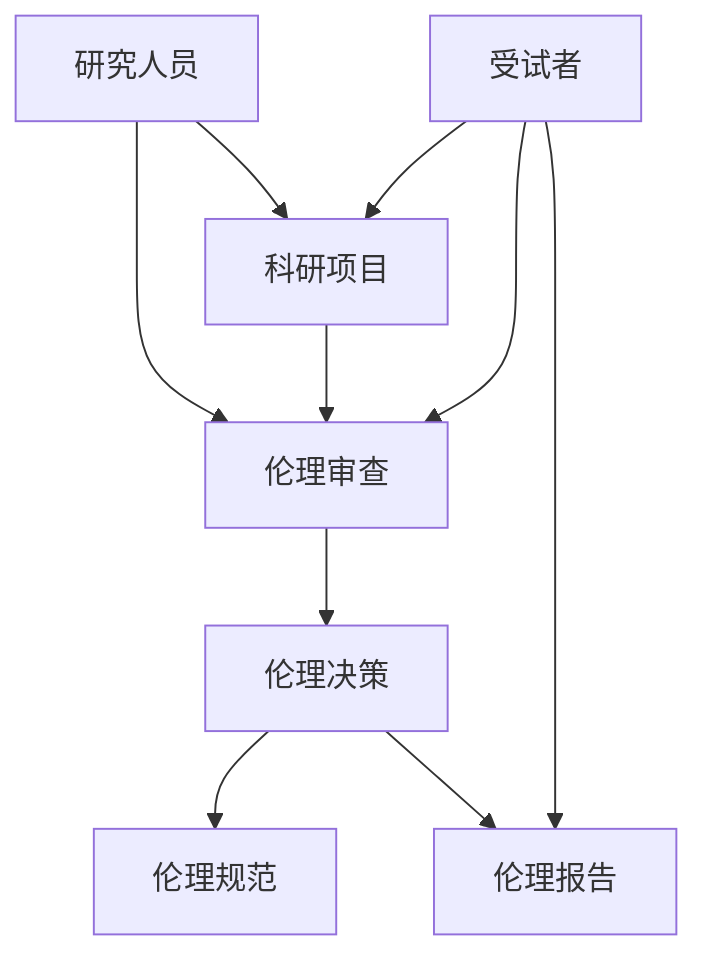
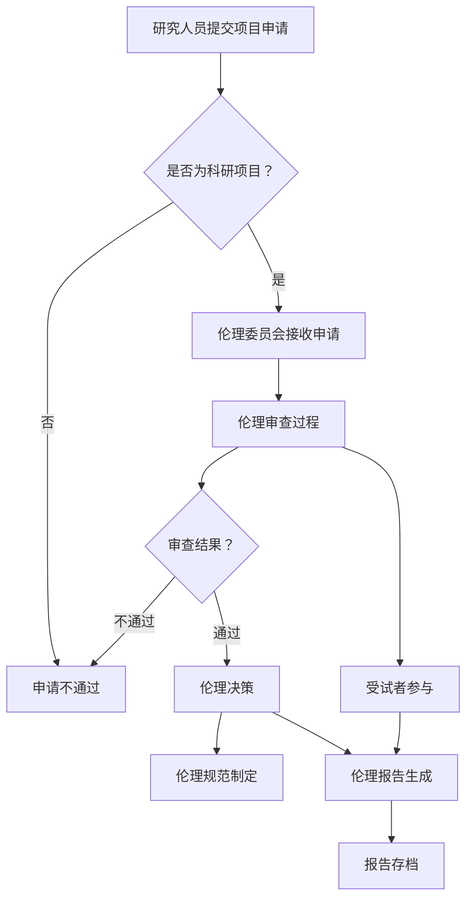

                 

### 1.1 问题背景

#### 1.1.1 生命科学的发展与伦理挑战

生命科学作为一门探索生命现象、生命活动规律和生命系统结构的学科，近年来取得了飞速的发展。从基因编辑技术到人类基因组计划，从干细胞研究到再生医学，生命科学不仅在理论上取得了重要突破，还在实践中推动了医疗、农业、生物技术等众多领域的进步。然而，伴随着技术的迅猛发展，一系列伦理问题也逐渐浮现出来。

基因编辑技术，如CRISPR-Cas9，使得科学家能够精确地修改生物体的遗传信息。这一技术的应用前景广阔，但同时也引发了对人类胚胎基因编辑的伦理争议。例如，是否允许通过基因编辑来消除遗传疾病，或者为了优化人类后代而进行“设计婴儿”的行为，这些都是生命科学伦理委员会需要面对的挑战。

再如，再生医学的发展，使得器官移植、组织再生等成为可能。然而，这些技术也引发了伦理问题，如克隆技术的道德边界、动物实验的伦理问题等。此外，生命科学在数据伦理方面也面临挑战，如基因数据的隐私保护、基因测序技术的滥用等。

生命科学的发展不仅带来了技术上的突破，还引发了深远的伦理思考。如何平衡科技进步与伦理道德，如何在科学探索中尊重生命尊严，成为当今社会必须面对的重要问题。因此，设立生命科学伦理委员会，对生命科学领域的伦理问题进行系统研究和规范管理，显得尤为必要。

#### 1.1.2 生命科学伦理委员会的重要性

生命科学伦理委员会（Bioethics Committee）是专门负责研究和解决生命科学领域伦理问题的机构。其重要性主要体现在以下几个方面：

首先，生命科学伦理委员会是保障科技进步与伦理道德平衡的桥梁。在科技发展迅速的背景下，许多技术突破都伴随着伦理挑战。生命科学伦理委员会通过深入研究、讨论和制定伦理指导原则，为科技进步提供道德保障，确保科学探索在伦理框架内进行。

其次，生命科学伦理委员会是维护人类生命尊严和权利的重要机构。生命伦理学强调尊重个体的自主权和基本人权，生命科学伦理委员会通过审查科研项目和实验，确保科学活动不会侵犯人类的基本权利和尊严。

再次，生命科学伦理委员会是推动生命伦理学理论研究和实践应用的重要平台。通过组织学术研讨、发布伦理报告、开展教育培训等活动，生命科学伦理委员会促进了生命伦理学的学科发展，提高了社会对生命伦理问题的认识和理解。

最后，生命科学伦理委员会是协调国际伦理规范和国家政策的重要力量。随着全球化进程的加快，生命科学领域的问题越来越具有跨国性。生命科学伦理委员会通过参与国际交流、制定跨国伦理规范，为各国在生命科学领域的合作提供了道德基础。

总之，生命科学伦理委员会在保障科技进步、维护人类生命尊严和推动学科发展等方面具有不可替代的作用。其设立和运作，对于构建一个和谐、公正的社会具有重要意义。

#### 1.1.3 生命科学伦理研究的边界与外延

生命科学伦理研究的边界与外延涉及到众多领域和具体问题，首先我们需要明确其研究的范畴。生命科学伦理学主要研究生命科学活动中的伦理问题，包括生物医学研究、生物技术发展、遗传工程、临床试验、医疗实践等。

在研究的边界上，生命科学伦理学关注的核心问题包括人类胚胎研究、基因编辑、克隆技术、动物实验、器官移植、生命支持技术、死亡和安乐死等。例如，基因编辑技术的伦理争议主要集中在如何确保基因编辑的安全性和避免伦理滥用。在这一领域，生命科学伦理委员会需要制定严格的伦理规范和审查流程，确保技术应用的合法性和道德正当性。

在生命科学伦理的研究外延方面，其不仅局限于科学领域，还涉及到法律、政策、社会和文化等方面。例如，生命科学伦理问题往往需要法律框架的支持，如涉及人类胚胎研究的法律限制、基因数据隐私保护的法律规定等。此外，伦理问题的解决也需要考虑政策导向和社会接受度，例如基因测序技术在公共卫生中的应用需要公共卫生政策的支持和公众的伦理认同。

生命科学伦理研究还包括跨学科的合作，如医学伦理、法律伦理、环境伦理、宗教伦理等。这些跨学科的合作有助于从多角度、多层次探讨生命科学伦理问题，提供更全面和综合的解决方案。

总之，生命科学伦理研究的边界与外延广阔而复杂，涉及多个领域和层面。其研究不仅需要深入探讨具体伦理问题，还需要关注政策、法律、社会和文化背景，以提供全面的伦理指导和支持。

### 1.2 核心概念

#### 1.2.1 生命科学伦理学

生命科学伦理学是研究生命科学领域伦理问题的一门学科，涉及生物医学研究、遗传工程、基因编辑、医疗实践等多个方面。其核心目标是确保生命科学活动在道德框架内进行，保护人类生命尊严和权利。生命科学伦理学不仅关注科技发展带来的伦理挑战，还致力于提供伦理指导，以促进科学进步与社会伦理价值的协调。

在生命科学伦理学中，几个关键概念值得关注：

- **自主权**：个体在做出涉及自身健康和生命的决策时，应具有自由选择的权利。尊重自主权是生命科学伦理学的基本原则之一。
- **公正性**：生命科学研究和医疗实践应公平地分配资源，避免歧视和不公平现象。
- **无害性**：科学活动应尽量避免对受试者和环境造成伤害。
- **善行**：科学研究应追求对人类和社会有益的结果。

生命科学伦理学的主要研究内容包括：

1. **基因编辑**：基因编辑技术如CRISPR-Cas9的应用引发了广泛的伦理争议，包括基因编辑的安全性和伦理滥用问题。
2. **胚胎研究**：人类胚胎研究的伦理问题主要集中在胚胎的道德地位和实验伦理上。
3. **临床试验**：临床试验的伦理问题涉及受试者的知情同意、隐私保护和数据安全等方面。
4. **动物实验**：动物实验的伦理问题包括动物福利和替代实验方法的研究。

#### 1.2.2 伦理学

伦理学是研究道德和伦理原则的学科，涉及个体、社会和宇宙间的道德关系。伦理学的基本问题是“什么是善？”和“如何做出正确的道德决策？”。伦理学不仅探讨道德原则和价值观，还研究道德行为和道德规范的形成与应用。

在伦理学中，几个核心概念如下：

- **道德原则**：如正义、公正、善行、尊重等，构成了伦理判断和行为的基础。
- **道德规范**：指导个体行为的道德规则，如伦理准则、法律和宗教教义等。
- **道德判断**：对行为和决策进行道德评价的过程，涉及权利、义务、责任和利益等。

伦理学的研究领域广泛，包括个人道德、社会伦理、环境伦理、医学伦理、商业伦理等。每个领域都有其特定的伦理问题和挑战。例如，在医学伦理中，涉及患者权利、临床试验伦理和医疗资源分配等问题；在环境伦理中，则关注生态平衡、可持续发展和社会责任等问题。

#### 1.2.3 科学伦理

科学伦理是研究科学活动中道德问题的一门学科，强调科学研究应遵守的伦理原则和规范。科学伦理关注科学研究的诚信性、公正性、透明性和对社会的影响。

科学伦理的核心概念包括：

- **诚信**：科学研究应基于真实数据和事实，避免伪造、篡改数据和学术不端行为。
- **公正**：科学研究和资源分配应公平，避免偏见和歧视。
- **透明性**：科学研究过程和结果应公开透明，便于同行评审和社会监督。
- **社会责任**：科学家应考虑其研究成果对社会的影响，积极承担社会责任。

科学伦理的主要研究领域包括：

1. **学术诚信**：防止学术不端行为，如伪造数据、抄袭和篡改研究结果。
2. **科研资源分配**：确保科研资源公平分配，支持多样性研究。
3. **公众参与**：提高公众对科学研究的认识和理解，促进科学与社会互动。
4. **技术应用伦理**：研究新兴技术如基因编辑、人工智能等的伦理影响。

科学伦理在保障科学研究质量和推动社会进步方面具有重要作用。科学伦理委员会通过制定伦理规范、审查科研项目和监督科研活动，确保科学研究在道德框架内进行。

#### 1.2.4 生命伦理学

生命伦理学是研究生命科学和医疗领域伦理问题的一门学科，涉及生命本质、生命权利、生命质量和生命决策等。生命伦理学旨在确保生命科学研究和医疗实践符合道德和伦理要求，保护生命尊严和权利。

生命伦理学中的核心概念包括：

- **生命尊严**：强调每个生命个体都应受到尊重和保护。
- **生命权利**：涉及个体的自主权、知情权和医疗权等基本权利。
- **生命质量**：关注个体的生命质量和生命体验。
- **生命决策**：研究个体和群体在生命过程中的决策伦理，如器官捐赠、安乐死等。

生命伦理学的研究领域广泛，包括：

1. **人类胚胎研究**：探讨胚胎的道德地位和实验伦理。
2. **基因伦理**：研究基因编辑、基因测序和基因治疗等技术的伦理问题。
3. **医学伦理**：关注患者权利、医疗资源分配、临床试验和医疗决策等。
4. **死亡伦理**：探讨死亡、安乐死和临终关怀等伦理问题。

生命伦理学在保障生命科学和医疗领域的道德实践、促进社会健康和福祉方面发挥着重要作用。

#### 1.2.5 概念属性特征对比表格

为了更清晰地理解生命科学伦理学、伦理学、科学伦理和生命伦理学之间的差异和联系，下面提供了一个概念属性特征对比表格：

| 概念               | 定义                                                         | 关键属性                                                                                      | 主要研究领域                                                         |
|-------------------|--------------------------------------------------------------|------------------------------------------------------------------------------------------------|------------------------------------------------------------------------------------------------|
| 生命科学伦理学    | 研究生命科学领域伦理问题，如基因编辑、人类胚胎研究等         | 生命尊严、自主权、公正性、无害性                                                           | 基因伦理、人类胚胎研究、医学伦理、死亡伦理等                          |
| 伦理学            | 研究道德原则和道德行为，涉及个体、社会和宇宙间的道德关系       | 道德原则、道德规范、道德判断                                                             | 个人道德、社会伦理、环境伦理、医学伦理、商业伦理等                  |
| 科学伦理          | 研究科学活动中道德问题，强调诚信、公正、透明性和社会责任       | 诚信、公正、透明性、社会责任                                                             | 学术诚信、科研资源分配、公众参与、技术应用伦理等                      |
| 生命伦理学        | 研究生命科学和医疗领域伦理问题，涉及生命本质、生命权利、生命质量等 | 生命尊严、生命权利、生命质量、生命决策                                                   | 人类胚胎研究、基因伦理、医学伦理、死亡伦理等                          |

通过这个对比表格，我们可以看到这些概念虽然在研究领域上有所重叠，但各自关注的焦点和核心属性有所不同。理解这些概念的属性特征有助于我们在分析生命科学伦理问题时，能够更加全面和深入地进行思考和讨论。

### 1.3 ER实体关系图架构

#### 1.3.1 生命科学伦理学领域实体

在生命科学伦理学领域，涉及的实体包括研究人员、伦理委员会、科研项目、伦理审查、伦理决策、受试者、伦理规范、伦理报告等。这些实体共同构成了生命科学伦理学的核心架构，并在伦理决策过程中相互关联和作用。

- **研究人员**：负责生命科学研究和相关工作的专业人员。
- **伦理委员会**：负责研究和解决生命科学伦理问题的机构。
- **科研项目**：涉及生命科学研究的具体项目，如基因编辑、临床试验等。
- **伦理审查**：伦理委员会对科研项目进行审查的过程。
- **伦理决策**：伦理委员会根据审查结果做出的决策。
- **受试者**：参与科研项目的人体实验对象。
- **伦理规范**：指导和约束生命科学活动的伦理标准。
- **伦理报告**：记录伦理审查过程和结果的报告文件。

这些实体在生命科学伦理学中扮演着不同的角色，它们之间的关系和交互构成了生命科学伦理学的研究架构。例如，研究人员提交科研项目申请，伦理委员会进行审查并做出决策，受试者参与实验，伦理规范提供指导，伦理报告记录审查和决策过程。

#### 1.3.2 实体关系与关联

在生命科学伦理学领域，各实体之间存在复杂的关联和相互作用。以下是一个简化的实体关系图，用于展示这些实体之间的基本关系：

- 研究人员提交科研项目给伦理委员会。
- 伦理委员会对科研项目进行伦理审查，并根据审查结果做出伦理决策。
- 伦理决策结果影响伦理规范和伦理报告的制定。
- 受试者参与科研项目，其参与过程被记录在伦理报告和伦理审查中。

这个实体关系图提供了一个简单的视图，展示了生命科学伦理学领域中各实体的基本关联和互动。在实际应用中，这些关系可能会更加复杂，涉及更多的实体和过程，但这个基本架构为理解生命科学伦理学的运作提供了一个清晰的框架。

#### 1.3.3 Mermaid 流程图展示

为了更好地展示生命科学伦理学领域的实体关系和过程，我们可以使用Mermaid语言绘制一个流程图。以下是一个简单的Mermaid流程图示例，展示了从研究人员提交科研项目到伦理报告生成的整个过程：

- 研究人员提交项目申请。
- 伦理委员会判断申请是否为科研项目。
- 如果是科研项目，进入伦理审查过程。
- 审查结果分为通过和不通过两种情况。
- 如果审查通过，伦理委员会做出伦理决策，并制定伦理规范和生成伦理报告。
- 如果审查不通过，申请被拒绝。
- 在审查过程中，受试者可能参与项目，其参与信息会被记录在伦理报告中。
- 生成的伦理报告存档，以供后续参考。

这个Mermaid流程图提供了一个直观的视图，展示了生命科学伦理学领域中的关键步骤和实体之间的互动关系。通过这种方式，读者可以更好地理解生命科学伦理委员会的工作流程和角色。

