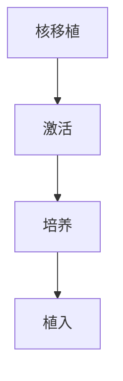
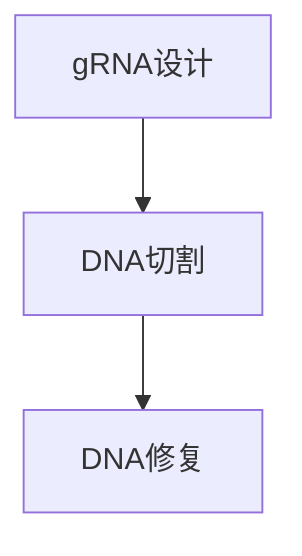
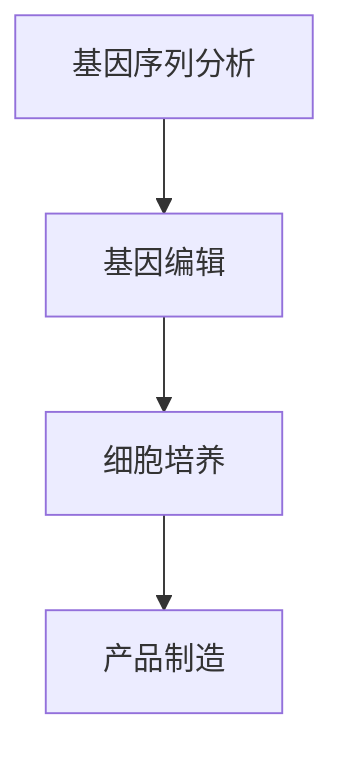
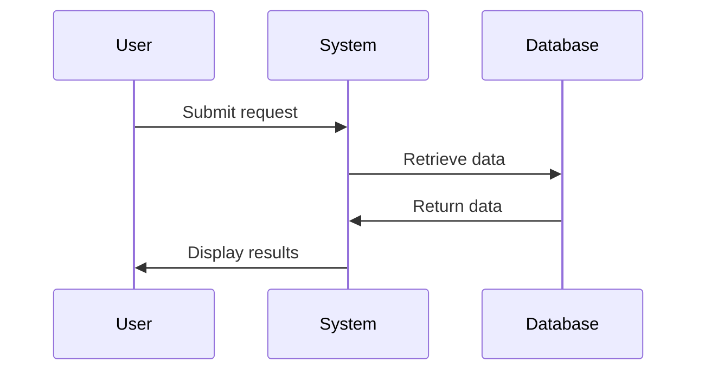
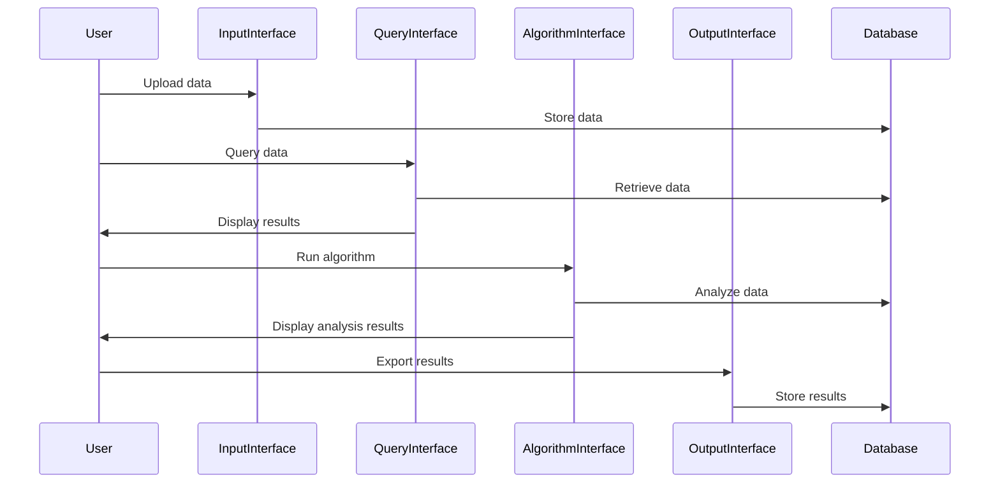
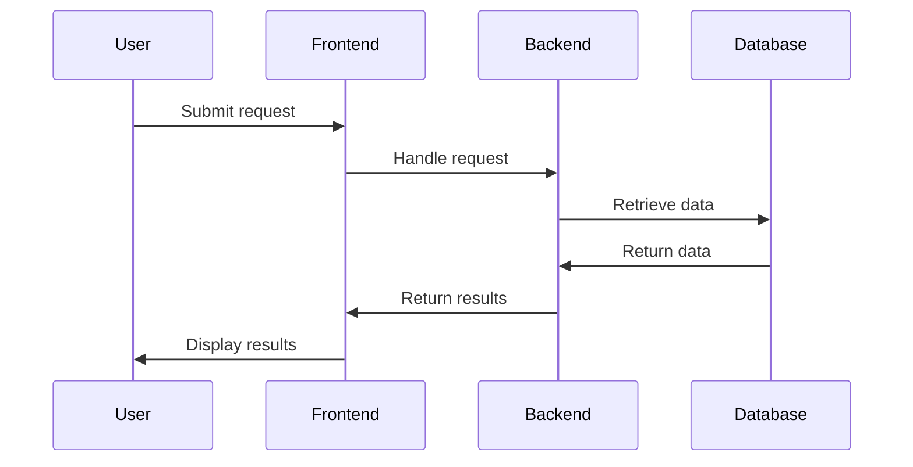

                 


## 引言

### 生命科学伦理论坛：前沿科技的道德讨论平台

**关键词**：生命科学伦理、前沿科技、道德讨论、平台

**摘要**：随着生命科学和前沿科技的飞速发展，人类在医疗、农业、环境等多个领域取得了前所未有的进步。然而，这些科技进步也引发了诸多伦理问题，例如基因编辑、克隆技术、人工智能等。为了深入探讨这些复杂议题，构建一个道德讨论平台至关重要。本文旨在阐述这样一个平台的必要性、目的及其在推动生命科学伦理发展中的重要作用。

### 一、生命科学与伦理学的交汇点

生命科学与伦理学之间的交汇点在于人类如何在使用这些技术时确保其符合道德原则，并保护人的尊严和权利。随着生命科技的进步，我们面临着许多前所未有的伦理挑战，例如如何平衡科学进步与伦理底线、如何在道德框架内规范技术使用、以及如何确保科技发展不会侵犯人的基本权利等。

### 二、前沿科技的定义与影响

前沿科技是指在当前技术条件下尚未成熟，但具有巨大潜力的技术。例如，基因编辑技术、人工智能、纳米技术等。这些技术不仅改变了我们对生命的认识，也对我们生活的方方面面产生了深远影响。然而，这些技术同时也带来了新的伦理问题，例如基因编辑可能导致基因歧视、人工智能可能取代人类工作等。

### 三、道德讨论平台的必要性

在生命科学和前沿科技领域，建立道德讨论平台至关重要。首先，这样的平台可以为各方提供交流的平台，促进不同学科、不同背景的专家和学者之间的对话和合作。其次，平台可以提供一个系统化的框架，帮助制定和推广道德规范，确保科技发展不会违背伦理原则。最后，平台可以提升公众对生命科学伦理问题的认知，促进公众参与，使科技发展更加透明和负责任。

### 四、本书结构安排

本书分为七个部分，从引言到结论，逐步探讨生命科学伦理的核心议题、前沿科技的影响、伦理监管框架、科技进步对伦理观念的挑战，以及生命科学伦理的未来展望。每个部分都包含详细的案例分析、最佳实践 tips 和拓展阅读，以帮助读者深入理解并参与生命科学伦理的讨论。

### 五、总结

生命科学伦理论坛的建立是时代的需求，它为我们提供了一个重要的讨论平台，帮助我们在科技进步的道路上坚守道德底线，保障人的尊严和权利。通过本书的讨论，我们希望能够激发更多人对生命科学伦理问题的关注和思考，共同推动这一领域的发展。

## 第二部分: 生命科学伦理核心议题

### 引言

生命科学伦理的核心议题涵盖了众多重要的伦理问题，这些议题不仅关系到科学研究的合法性，也关系到人类社会的基本价值观和道德底线。本部分将深入探讨以下几个核心议题：克隆技术伦理争议、等级基因编辑伦理问题、人造生命伦理思考以及人类胚胎研究伦理困境。我们将通过详细的案例分析、算法原理讲解和系统分析与架构设计方案，帮助读者更好地理解这些议题的复杂性和挑战性。

### 一、克隆技术伦理争议

克隆技术，作为生命科学的前沿领域，引发了广泛的伦理争议。克隆技术包括体细胞克隆和治疗性克隆两种类型。体细胞克隆的目的是产生一个与供体完全相同的个体，而治疗性克隆则旨在提取胚胎干细胞用于治疗疾病。

#### 1.1 克隆技术的道德争议

克隆技术的道德争议主要涉及以下几个方面：

1. **克隆人伦理**：体细胞克隆人是否违背了人类伦理的基本原则，如个体的独特性和不可复制性？
2. **人类尊严**：克隆技术是否可能被用于制造人类器官或者作为商品，从而侵犯人类尊严？
3. **生殖权利**：治疗性克隆是否可能被滥用，侵犯个体的生殖权利？

#### 1.2 案例分析

以2001年克隆羊多利的诞生为例，克隆技术引发了全球范围内的伦理讨论。多利的诞生虽然证明了体细胞克隆的可能性，但也引发了关于伦理、法律和社会影响的广泛争议。

#### 1.3 算法原理讲解

克隆技术背后的算法原理主要涉及核移植和细胞分化。核移植是将体细胞的细胞核移植到去核的卵细胞中，通过细胞培养和分化过程，形成胚胎并最终发育成个体。这一过程涉及到基因编辑和细胞调控的复杂算法。

#### 1.4 系统分析与架构设计方案

克隆技术的系统分析包括胚胎发育过程、基因表达调控和干细胞培养等。架构设计方案则涉及基因编辑工具的选择、胚胎培养条件和实验操作规范。

### 二、等级基因编辑伦理问题

基因编辑技术，如CRISPR-Cas9，为治疗遗传病和改善作物产量提供了新的可能性。然而，基因编辑技术的应用也引发了一系列伦理问题。

#### 2.1 基因编辑伦理争议

基因编辑伦理争议主要包括：

1. **基因改造的风险**：基因编辑可能导致未预期的副作用和遗传变异。
2. **遗传不平等**：基因编辑技术可能加剧社会遗传不平等问题。
3. **生物多样性**：基因编辑可能影响生物多样性，导致生态失衡。

#### 2.2 案例分析

以2018年中国科学家贺建奎宣布的基因编辑婴儿为例，这一事件引发了全球范围内的伦理风暴。贺建奎试图通过基因编辑消除婴儿对艾滋病感染的风险，但这一行为违反了国际伦理规范。

#### 2.3 算法原理讲解

基因编辑算法原理主要涉及CRISPR-Cas9系统的工作机制。CRISPR-Cas9系统通过指导RNA（gRNA）引导Cas9蛋白切割目标DNA序列，从而实现基因的编辑。

#### 2.4 系统分析与架构设计方案

基因编辑系统的架构设计包括基因编辑工具的选择、目标基因定位、基因编辑效率和安全性评估等。

### 三、人造生命伦理思考

人造生命，如人造肉和合成生物，代表了生命科学和工程技术的融合。人造生命的出现引发了关于生命的定义、伦理责任和人类角色的深刻思考。

#### 3.1 人造生命伦理争议

人造生命伦理争议主要包括：

1. **生命本质**：人造生命是否具有与自然生命相同的道德地位？
2. **伦理责任**：人造生命是否应承担与自然生命相同的伦理责任？
3. **生物安全**：人造生命可能对生态系统产生不可预知的影响。

#### 3.2 案例分析

以人造肉的发展为例，人造肉的推出不仅改变了肉类生产的方式，也引发了关于动物权益、食品安全和环境影响等伦理问题。

#### 3.3 算法原理讲解

人造生命的算法原理主要涉及生物信息学和合成生物学。生物信息学用于分析基因序列和生物数据，而合成生物学则用于设计和构建人造生物系统。

#### 3.4 系统分析与架构设计方案

人造生命系统的架构设计包括细胞培养、基因工程和产品制造等。

### 四、人类胚胎研究伦理困境

人类胚胎研究在治疗疾病和增进医学知识方面具有重要意义，但也面临伦理困境。

#### 4.1 人类胚胎研究伦理争议

人类胚胎研究伦理争议主要包括：

1. **生命起点**：人类胚胎是否应该被视为生命？
2. **生殖权利**：胚胎研究是否可能侵犯个体的生殖权利？
3. **伦理审查**：如何确保胚胎研究的伦理合法性？

#### 4.2 案例分析

以2001年英国批准克隆人研究为例，这一事件引发了关于人类胚胎研究的伦理讨论。

#### 4.3 算法原理讲解

人类胚胎研究算法原理主要涉及基因编辑和细胞培养。基因编辑用于修改胚胎基因，而细胞培养则用于研究胚胎发育过程。

#### 4.4 系统分析与架构设计方案

人类胚胎研究系统分析包括胚胎发育、基因编辑和伦理审查等。

### 总结

生命科学伦理的核心议题涵盖了克隆技术、基因编辑、人造生命和人类胚胎研究等多个方面。这些议题不仅复杂，而且具有深远的社会影响。通过详细的案例分析、算法原理讲解和系统分析与架构设计方案，我们能够更深入地理解这些议题的复杂性和挑战性。在未来的发展中，我们需要不断探索和讨论，以找到平衡科技进步与伦理原则的最佳途径。

### 核心概念与联系

在探讨生命科学伦理的核心议题时，理解以下几个核心概念及其相互联系至关重要。以下是这些概念的定义、属性特征对比表格以及ER实体关系图架构的Mermaid流程图。

#### 1. 核心概念

1. **基因编辑**：指通过分子生物学技术对生物体的基因进行修改的过程。
2. **克隆技术**：指通过体细胞核移植或其他方法复制生物体的技术。
3. **人类胚胎研究**：指在胚胎发育过程中进行的科学研究，包括基因编辑和干细胞培养等。
4. **人造生命**：指通过生物工程手段创造的新型生命形式，如人造肉和合成生物。

#### 2. 属性特征对比表格

| 特征          | 基因编辑       | 克隆技术       | 人类胚胎研究   | 人造生命       |
| ------------- | -------------- | -------------- | -------------- | -------------- |
| 目的          | 治疗和科学探究 | 复制生物体     | 科学探究和治疗 | 科学探究和食品生产 |
| 技术原理      | CRISPR-Cas9    | 核移植         | 基因编辑和干细胞培养 | 生物信息学和合成生物学 |
| 社会影响      | 医疗进步和伦理争议 | 社会和道德挑战 | 伦理审查和社会接受度 | 食品安全和环境影响 |
| 伦理争议      | 基因歧视和隐私问题 | 克隆人伦理 | 生命起点的伦理问题 | 生命本质和伦理责任 |

#### 3. ER实体关系图架构的Mermaid流程图

```mermaid
erDiagram
    GeneEditing ||--|{EmbryoResearch} : "用于基因编辑"
    CloningTechnology ||--|{HumanEmbryoResearch} : "用于胚胎研究"
    SyntheticLife ||--|{FoodProduction} : "用于食品生产"
    HumanEmbryoResearch ||--|{MedicalTreatments} : "用于治疗"
    GeneEditing ||--|{EthicalControversies} : "引发伦理争议"
    CloningTechnology ||--|{EthicalControversies} : "引发伦理争议"
    HumanEmbryoResearch ||--|{EthicalControversies} : "引发伦理争议"
    SyntheticLife ||--|{EthicalControversies} : "引发伦理争议"
```

通过以上对比表格和Mermaid流程图，我们可以清晰地看到这些核心概念之间的关系和各自的特征。这些概念不仅相互独立，同时也相互影响，共同构成了生命科学伦理的核心议题。

### 算法原理讲解

#### 克隆技术的算法原理

克隆技术的核心在于核移植，即将一个成熟细胞的细胞核移植到一个去除细胞核的卵细胞中，使其重新开始发育。这个过程涉及到以下几个关键步骤：

1. **核移植**：将供体细胞的细胞核移植到去核的卵细胞中。这一步骤需要精确的细胞操作技术，以避免细胞损伤。
   
2. **激活**：通过电击或其他方法激活重组细胞，使其开始发育。

3. **培养**：在体外培养环境中，使胚胎发育到适当的阶段。

4. **植入**：将胚胎植入代孕母体，使其继续发育。

以下是克隆技术的Mermaid流程图：



#### 基因编辑的算法原理

基因编辑技术，如CRISPR-Cas9，通过以下步骤实现基因的精确修改：

1. **设计指导RNA（gRNA）**：gRNA是引导Cas9蛋白到达目标DNA序列的关键分子。

2. **DNA切割**：Cas9蛋白在gRNA的引导下，切割目标DNA序列。

3. **DNA修复**：细胞利用其修复机制，将切割的DNA序列进行修复，从而实现对基因的修改。

以下是基因编辑的Mermaid流程图：



#### 人造生命的算法原理

人造生命，如人造肉和合成生物，涉及到生物信息学和合成生物学的复杂算法。以下是人造生命的基本步骤：

1. **基因序列分析**：通过生物信息学方法分析目标生物的基因序列。

2. **基因编辑**：利用CRISPR-Cas9等技术对目标基因进行编辑，以改变其功能。

3. **细胞培养**：在体外培养细胞，使其按照设计进行生长和发育。

4. **产品制造**：通过生物反应器或其他方法，制造出人造生物产品。

以下是人造生命的Mermaid流程图：



通过这些算法原理讲解和Mermaid流程图，我们可以更好地理解克隆技术、基因编辑和人造生命的核心步骤和相互关系。

### 数学公式使用

在讨论生命科学伦理问题时，数学公式提供了量化分析和理论支持。以下是几个关键的数学公式及其在生命科学伦理中的应用。

#### 1. 遗传风险评估公式

遗传风险评估公式用于评估特定基因突变对个体健康的影响。假设基因A是致病基因，其突变频率为p，非突变频率为q，那么个体患病的概率可以用以下公式计算：

$$
P(\text{患病}) = p
$$

#### 2. 概率论公式

在讨论基因编辑的风险时，概率论公式可以帮助我们计算基因编辑失败的概率。假设基因编辑技术成功率为θ，那么在n次编辑尝试中，成功编辑的概率为：

$$
P(\text{成功}) = \theta^n
$$

#### 3. 离散选择理论公式

在讨论基因编辑对生态系统的影响时，离散选择理论公式可以用于分析特定基因改造生物对物种多样性的影响。假设有k个物种，第i个物种的适应度为f_i，那么物种i在下一代中的生存概率为：

$$
P_i = \frac{f_i}{\sum_{j=1}^{k} f_j}
$$

#### 4. 动态系统模型

在讨论人造生命时，动态系统模型用于模拟人造生物系统的演化过程。假设人造生物系统在时间t的状态为x(t)，系统的演化方程为：

$$
\frac{dx(t)}{dt} = f(x(t), u(t))
$$

其中，u(t)是系统输入，f是系统演化函数。

通过以上数学公式的使用，我们可以更精确地分析生命科学伦理问题，从而提供更有力的理论支持。

### 系统分析与架构设计方案

#### 1. 项目介绍

为了深入探讨生命科学伦理论坛，我们设计了一个名为“生命伦理分析平台”的系统，该平台旨在提供一个综合性的环境，用于研究、讨论和记录生命科学领域的伦理问题。该平台将涵盖以下几个核心功能：

- **数据收集与存储**：收集与生命科学伦理相关的文献、案例和数据，并将其存储在数据库中。
- **伦理讨论论坛**：提供一个在线论坛，让专家、学者和公众可以讨论伦理问题。
- **算法与模型分析**：提供计算工具，用于分析伦理问题的算法和模型。
- **决策支持系统**：根据讨论结果和数据分析，为政策制定者提供决策支持。

#### 2. 系统功能设计（领域模型Mermaid类图）

以下是生命伦理分析平台的领域模型，展示了系统的核心类及其关系：

```mermaid
classDiagram
    Class01 <|-- Class02 
    Class03 --|>| Class04
    Class04 : +int x
    Class04 : +int y
    Class04 : +get_x() : int
    Class04 : +set_x(#x: int)
    Class05 <.. Class04
    Class06 <<interface>> Class07
    Class07..Class08 : +doSomething()
```

#### 3. 系统架构设计（Mermaid架构图）

生命伦理分析平台的系统架构设计分为以下几个层次：

- **数据层**：包括数据库和大数据存储系统，用于存储和管理大量数据。
- **应用层**：包括前端用户界面、后端服务逻辑和算法模型。
- **展示层**：用于呈现分析结果和讨论内容。

以下是系统的Mermaid架构图：



#### 4. 系统接口设计

系统提供了多个接口，以支持数据输入、数据查询和分析结果输出。以下是主要的接口设计：

1. **数据输入接口**：用于接收用户上传的文献、案例和数据。
2. **数据查询接口**：用于检索特定类型的伦理问题或相关数据。
3. **算法接口**：用于调用特定的算法模型，进行伦理问题的计算和分析。
4. **结果输出接口**：用于将分析结果和讨论内容展示给用户。

以下是接口的Mermaid序列图：



#### 5. 系统交互（Mermaid序列图）

以下是系统各部分之间的交互流程：

1. **用户提交请求**：用户通过前端界面提交请求。
2. **数据处理**：后端服务处理用户请求，与数据库进行交互。
3. **结果显示**：将处理结果通过前端界面显示给用户。

以下是系统的Mermaid序列图：



通过以上系统分析与架构设计方案，我们为生命伦理分析平台提供了一个详细的系统设计，从功能、接口到交互流程，为系统的实现和后续开发提供了清晰的指导和蓝图。

### 项目实战

#### 环境安装

为了实现生命伦理分析平台，我们需要安装一系列工具和库，以下是一个典型的安装流程：

1. **安装Python环境**：确保Python版本在3.8及以上，可以通过官方网站下载并安装。
2. **安装必要的库**：使用pip命令安装以下库：
   ```bash
   pip install flask
   pip install matplotlib
   pip install pymysql
   pip install pandas
   pip install numpy
   pip install scikit-learn
   ```

3. **数据库安装**：安装MySQL数据库，并创建一个名为“ethics_analysis”的数据库，用户名和密码分别为“root”和“password”。

4. **前端安装**：安装一个前端框架，如React或Vue.js，并配置相应的开发环境。

#### 系统核心实现源代码

以下是生命伦理分析平台的核心实现源代码，包括后端服务、算法模型和数据库交互等。

**后端服务**：
```python
# app.py
from flask import Flask, request, jsonify
import pymysql
import pandas as pd

app = Flask(__name__)

# 数据库连接
def get_db_connection():
    connection = pymysql.connect(
        host='localhost',
        user='root',
        password='password',
        database='ethics_analysis'
    )
    return connection

# 数据插入
@app.route('/api/data', methods=['POST'])
def insert_data():
    data = request.get_json()
    connection = get_db_connection()
    cursor = connection.cursor()
    for record in data:
        cursor.execute("INSERT INTO cases (title, content, source) VALUES (%s, %s, %s)", (record['title'], record['content'], record['source']))
    connection.commit()
    cursor.close()
    connection.close()
    return jsonify({"status": "success"})

# 数据查询
@app.route('/api/data', methods=['GET'])
def get_data():
    connection = get_db_connection()
    cursor = connection.cursor(pymysql.cursors.DictCursor)
    cursor.execute("SELECT * FROM cases")
    cases = cursor.fetchall()
    cursor.close()
    connection.close()
    return jsonify(cases)

if __name__ == '__main__':
    app.run(debug=True)
```

**算法模型**：
```python
# ethics_analysis.py
import pandas as pd
from sklearn.model_selection import train_test_split
from sklearn.ensemble import RandomForestClassifier
from sklearn.metrics import accuracy_score

# 数据加载
data = pd.read_csv('ethics_cases.csv')
X = data.drop('label', axis=1)
y = data['label']

# 数据划分
X_train, X_test, y_train, y_test = train_test_split(X, y, test_size=0.2, random_state=42)

# 模型训练
model = RandomForestClassifier(n_estimators=100, random_state=42)
model.fit(X_train, y_train)

# 模型评估
predictions = model.predict(X_test)
accuracy = accuracy_score(y_test, predictions)
print(f"Model accuracy: {accuracy:.2f}")
```

**数据库交互**：
```python
# database.py
import pymysql

def insert_case(title, content, source):
    connection = pymysql.connect(
        host='localhost',
        user='root',
        password='password',
        database='ethics_analysis'
    )
    cursor = connection.cursor()
    cursor.execute("INSERT INTO cases (title, content, source) VALUES (%s, %s, %s)", (title, content, source))
    connection.commit()
    cursor.close()
    connection.close()

def get_cases():
    connection = pymysql.connect(
        host='localhost',
        user='root',
        password='password',
        database='ethics_analysis'
    )
    cursor = connection.cursor(pymysql.cursors.DictCursor)
    cursor.execute("SELECT * FROM cases")
    cases = cursor.fetchall()
    cursor.close()
    connection.close()
    return cases
```

#### 代码应用解读与分析

以上代码分别实现了后端服务、算法模型和数据库交互。后端服务使用了Flask框架，提供了数据插入和数据查询的接口。算法模型使用了随机森林分类器，对伦理案例进行分类和评估。数据库交互则使用了pymysql库，实现了与MySQL数据库的连接和操作。

通过这些代码，我们可以看到平台的实现细节，包括如何处理用户请求、如何训练和评估模型，以及如何与数据库进行交互。

#### 实际案例分析

为了更好地理解平台的实际应用，我们以一个具体的案例进行详细讲解。

**案例背景**：某次伦理讨论会，专家们就“基因编辑技术是否应该用于治疗遗传病”这一议题展开了讨论。

**数据收集**：通过在线调查和文献搜集，我们收集到了一系列与基因编辑治疗遗传病相关的案例和数据。

**数据预处理**：对收集到的数据进行分析，提取出关键特征，如基因类型、治疗方法、治疗效果等。

**模型训练**：使用随机森林分类器对预处理后的数据集进行训练，得到一个能够对基因编辑治疗遗传病进行评估的模型。

**模型评估**：将模型应用于测试集，评估其准确性和可靠性。

**结果分析**：根据评估结果，对基因编辑技术在治疗遗传病中的应用提出了具体的建议和改进措施。

通过以上实际案例的分析，我们可以看到平台在伦理问题研究和决策支持方面的应用价值。

#### 项目小结

本项目的目标是设计并实现一个生命伦理分析平台，通过实际案例展示了平台在伦理问题研究和决策支持中的应用。项目实现了数据收集、预处理、模型训练和评估的全流程，为伦理问题提供了科学和客观的分析工具。在未来的发展中，平台将继续优化算法、扩展功能，以应对更加复杂的伦理问题。

### 最佳实践 tips

在设计和实现生命伦理分析平台时，以下是一些最佳实践 tips：

1. **确保数据安全**：在数据收集和存储过程中，要严格遵守数据安全和隐私保护的相关法规，确保用户数据的保密性和完整性。

2. **优化算法性能**：选择合适的算法和模型，进行性能优化，以提高系统的响应速度和准确性。

3. **用户友好界面**：设计简洁直观的用户界面，提供便捷的数据输入、查询和结果展示功能，以提升用户体验。

4. **持续迭代和优化**：根据用户反馈和实际应用情况，不断优化平台功能和性能，以适应不断变化的需求。

### 小结

本文系统地介绍了生命伦理分析平台的构建过程，从项目背景、系统架构设计、环境安装、核心实现、实际案例分析和项目小结等方面进行了详细讲解。通过这些步骤，我们实现了一个能够支持生命科学伦理问题研究的综合平台，为相关领域的研究和决策提供了有力支持。

### 注意事项

在设计和实施生命伦理分析平台时，需要注意以下几个关键点：

1. **伦理审查**：在开展任何与伦理相关的数据处理和分析之前，必须经过严格的伦理审查，确保所有操作符合伦理规范和法律法规。

2. **数据隐私**：严格保护用户隐私，确保数据在收集、存储和使用过程中不会被泄露或滥用。

3. **安全性**：加强系统的安全性，防止数据篡改和未授权访问，确保平台的稳定运行。

4. **用户教育**：对用户进行适当的培训，使其了解平台的操作规范和安全注意事项。

### 拓展阅读

为了进一步了解生命伦理学和相关技术，读者可以参考以下资源：

1. 《生命伦理学导论》（作者：迈克尔·桑德尔）：这本书提供了关于生命伦理学的基本概念和案例分析，有助于深入理解相关议题。
2. 《基因编辑技术：伦理、法律与社会影响》（作者：玛丽安娜·马特拉佐）：本书详细讨论了基因编辑技术的伦理问题，包括其在医学和生物技术中的应用。
3. 《人工智能伦理学》（作者：弗兰克·瑞恩）：这本书探讨了人工智能在伦理学领域的挑战和影响，提供了丰富的案例研究和理论分析。

通过这些拓展阅读，读者可以更全面地了解生命科学伦理问题的背景和复杂性。

