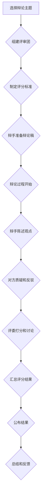
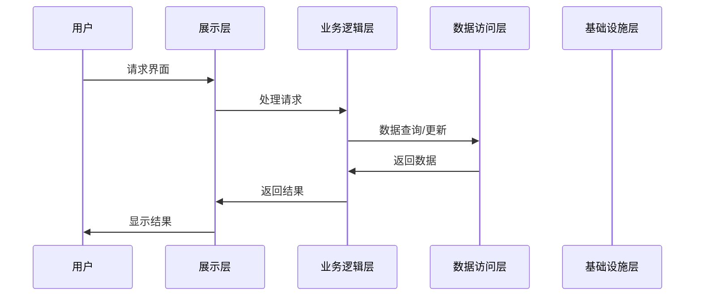
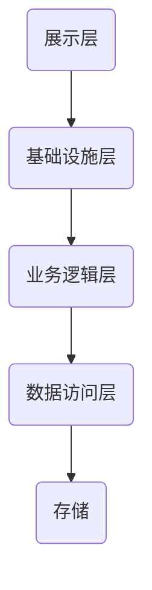
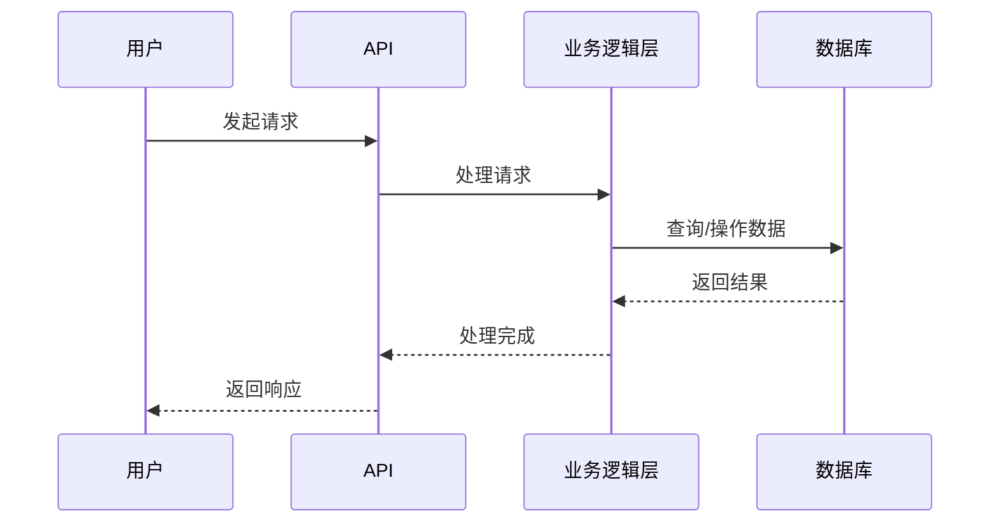

                 

## 背景介绍

### 生命科学伦理的定义与背景

生命科学伦理是研究生命科学研究与实践中道德问题的学科，涉及人类基因组编辑、基因治疗、克隆技术、生物技术应用等多个方面。随着生物科技的飞速发展，伦理问题日益突出，如基因编辑技术的道德边界、人类胚胎研究、生物数据的隐私保护等。这些伦理问题不仅关系到科学研究的合法性与道德合理性，还直接影响到人类社会的发展与人类自身的福祉。

在当今科技时代，生命科学伦理辩论赛作为一种新型的道德讨论形式，逐渐成为解决这些伦理困境的重要平台。辩论赛通过组织专业人士、学者、研究人员、学生等多方力量，围绕生命科学领域的热点问题进行深入探讨和辩论，以促进科学伦理的普及与传播，提高公众的科学素养和道德观念。

### 伦理辩论赛的基本概念与组织形式

伦理辩论赛是一种基于辩论形式的讨论活动，通过对立双方就某一伦理问题展开激烈辩论，从而推动对问题的深入理解和探讨。伦理辩论赛通常包括以下几个基本环节：选题、准备、辩论、评审和总结。

- **选题**：选择具有代表性和争议性的生命科学伦理问题作为辩论主题，如基因编辑技术的道德审查、人类胚胎研究的伦理底线等。
- **准备**：辩论双方在辩论前需要充分准备，包括研究辩论主题、收集相关资料、撰写辩论稿等。
- **辩论**：辩论双方在规定时间内轮流陈述观点，质疑对方观点，进行理性辩论。
- **评审**：由专业的评审团对辩论双方的表现进行评分和评价，通常包括逻辑性、论据充分性、辩论技巧等方面。
- **总结**：辩论结束后，组织方对辩论内容进行总结，并对优秀辩手进行表彰。

伦理辩论赛不仅有助于培养参与者的思辨能力和团队合作精神，还能提升公众对生命科学伦理问题的认识和关注，推动科学伦理的规范化发展。

### 生命科学伦理辩论赛的意义与目的

生命科学伦理辩论赛的意义主要体现在以下几个方面：

1. **提升科学素养**：通过辩论赛的形式，让公众更加关注生命科学领域的最新进展和潜在伦理问题，提高公众的科学素养和道德水平。
2. **推动伦理研究**：辩论赛提供了一个平台，让专业人士和学者可以就生命科学伦理问题进行深入交流和研究，推动伦理学理论的发展和完善。
3. **规范科技实践**：通过辩论赛的讨论和总结，可以为生命科学领域制定更科学、更合理的伦理规范，指导科技实践的合法性和道德性。
4. **培养辩论能力**：辩论赛不仅考验辩手的思维逻辑和语言表达能力，还能培养参与者的团队合作精神和抗压能力。

总之，生命科学伦理辩论赛作为一种新兴的道德讨论形式，对于促进科学伦理的普及和传播、推动科技伦理的发展具有重要作用。

### 概念术语说明

在本文中，我们将使用以下关键术语：

- **生命科学伦理**：涉及生命科学研究与实践中道德问题的学科，如基因编辑、基因治疗、生物技术应用等。
- **伦理辩论赛**：一种基于辩论形式的讨论活动，旨在深入探讨生命科学领域的伦理问题。
- **基因编辑技术**：如CRISPR/Cas9等，能够对基因组进行精确编辑的技术。
- **伦理审查**：在科研项目或技术应用前，对其道德合理性进行的评估和审查过程。
- **道德争论**：不同观点在伦理问题上的对立和辩论。

这些术语构成了本文的核心概念框架，贯穿于后续的章节内容中。

### 问题背景与问题描述

近年来，生命科学领域的技术进步日新月异，基因编辑、人工智能、生物信息技术等前沿科技不断发展，为医学、农业等领域带来了巨大的变革和潜力。然而，这些技术同时也引发了一系列深刻的伦理问题，引起了广泛的关注和讨论。

一方面，基因编辑技术的出现使得人类能够对基因组进行精确修改，有望治愈遗传性疾病，推动个性化医疗的发展。然而，基因编辑技术的应用也带来了潜在的伦理风险，如基因歧视、基因改造的不确定性和安全性问题等。这些问题不仅涉及科学研究与临床应用的道德边界，还涉及到人类身份和社会公正等根本性问题。

另一方面，生物技术的快速发展也带来了数据隐私和安全问题。例如，基因测序和生物数据的收集和使用，涉及个人隐私的泄露和滥用风险。此外，生物信息技术的应用还可能引发生物武器和其他潜在威胁，对人类生存和社会稳定构成挑战。

这些问题不仅关系到科学研究的合法性和道德合理性，还对人类社会的发展、个人福祉以及全球治理产生了深远影响。因此，如何平衡科技进步与伦理道德的关系，成为当今社会亟待解决的问题。生命科学伦理辩论赛作为一种新兴的讨论形式，提供了一个平台，让社会各界力量能够围绕这些复杂问题进行深入探讨和辩论，从而推动科学伦理的规范化和可持续发展。

### 问题解决与边界与外延

为了解决生命科学领域带来的伦理问题，需要从多个层面进行综合考量。首先，建立科学、合理的伦理审查机制是关键。伦理审查机制应包括从科研立项、实验设计到成果应用的全过程，确保每个环节的道德合法性。例如，基因编辑研究需要在伦理委员会的严格审查下进行，确保研究目的正当、风险可控，并符合伦理规范。

其次，推动科学伦理教育和普及也是重要的一环。通过教育和宣传，提高公众对生命科学伦理问题的认识和关注度，增强公众的科学素养和道德观念。例如，学校可以开设相关课程，社会组织可以举办讲座和讨论会，媒体也可以通过新闻报道和专题节目，普及科学伦理知识，引导公众正确看待生命科学技术的应用。

此外，跨国合作和国际法规也是解决伦理问题的重要手段。生命科学领域的伦理问题往往具有全球性，需要国际社会共同合作，制定统一的伦理标准和法规。例如，国际社会可以共同制定基因编辑技术的伦理准则，推动全球生物数据的共享与保护，避免因法规不一导致伦理风险。

然而，边界与外延问题也是不可忽视的。一方面，伦理问题的解决需要充分考虑不同文化和社会背景的差异，避免“一刀切”的伦理规范。例如，某些国家或地区可能对基因编辑技术的道德立场与西方国家有所不同，需要尊重和借鉴多元文化的观点。另一方面，随着技术的不断进步，新的伦理问题也将不断涌现，如人工智能在生命科学中的应用，也需要持续关注和研究。

综上所述，解决生命科学伦理问题需要多方面的努力和合作，从审查机制、教育普及、国际法规到文化差异，都需要综合考虑，以确保科技进步与伦理道德的协调发展。

### 概念结构与核心要素组成

为了更好地理解生命科学伦理辩论赛的组织与运作，我们需要从概念结构和核心要素的角度进行分析。生命科学伦理辩论赛主要由以下几个核心组成部分构成：

1. **辩论主题**：辩论主题是辩论赛的核心，通常选择具有争议性和代表性的生命科学伦理问题，如基因编辑、基因治疗、生物数据隐私等。这些主题不仅能够吸引广泛关注，还能激发参与者的思考和讨论。

2. **参赛队伍**：参赛队伍是辩论赛的主要参与者，包括专业团队、学术机构、科研人员、学生等。每个队伍通常由多名成员组成，他们负责准备辩论稿、参与辩论过程，并与其他队伍展开激烈辩论。

3. **评审团**：评审团是辩论赛的评判和指导力量，由伦理学专家、科学家、律师、哲学家等组成。评审团的任务是评估辩论双方的表现，包括逻辑性、论据充分性、辩论技巧等，并给出公正的评价。

4. **辩论规则**：辩论规则是保证辩论赛公平、有序进行的重要保障。规则通常包括辩论时间、辩论流程、评分标准等，确保辩论双方在公平的环境下进行辩论。

5. **观众与媒体**：观众与媒体是辩论赛的重要参与者，他们的参与不仅能够提升辩论赛的影响力和关注度，还能为辩论双方提供更多的观点和反馈。

6. **组织和协调**：组织和协调团队负责辩论赛的整体策划、组织和执行，包括场地安排、设备准备、赛事宣传等。他们的工作确保辩论赛顺利进行，并提供技术支持和服务。

这些核心要素相互关联，共同构成了生命科学伦理辩论赛的基本框架。通过科学的组织和运作，辩论赛能够有效地促进生命科学伦理问题的深入探讨和解决，推动科学伦理的规范化和可持续发展。

### 核心概念原理

在生命科学伦理辩论赛中，核心概念包括**伦理学**、**科学技术**和**辩论技巧**。这些概念共同构成了辩论赛的理论基础和操作框架。

#### 伦理学

伦理学是研究道德原则和规范的科学，它在生命科学伦理辩论赛中起到指导作用。伦理学的基本原则包括**尊重个人尊严**、**公正性**和**责任感**。这些原则为辩论提供了道德框架，使辩手能够在辩论中遵循合理的行为准则。

- **尊重个人尊严**：在讨论生命科学技术的道德问题时，辩手需要尊重每个人的尊严和基本权利，确保讨论内容不侵犯他人权益。
- **公正性**：辩论过程中应确保各方观点得到公平对待，避免偏袒或歧视某一立场。
- **责任感**：辩手应意识到自己的辩论不仅影响个人观点的传播，还可能影响公众对生命科学技术的理解和接受程度，因此需要承担社会责任。

#### 科学技术

科学技术是生命科学伦理辩论赛的讨论对象，包括基因编辑、基因治疗、生物信息学等领域。科学技术的发展带来了许多道德问题和伦理挑战，如**安全性**、**公平性**和**隐私保护**。

- **安全性**：科学技术应用时需要确保其安全性和可靠性，避免造成不可逆的损害或风险。
- **公平性**：科学技术的应用应确保所有人都能平等受益，避免因技术不平等造成的社会不公。
- **隐私保护**：生物数据和个人信息的收集和使用需要严格遵守隐私保护原则，防止数据泄露和滥用。

#### 辩论技巧

辩论技巧是辩手在辩论赛中取得成功的关键因素。有效的辩论技巧包括**逻辑性**、**论据充分性**、**反驳能力**和**语言表达能力**。

- **逻辑性**：辩手需要构建逻辑严谨的论点，确保观点清晰、论证有力。
- **论据充分性**：辩手应提供充分的论据支持自己的观点，避免论据不足或论据矛盾。
- **反驳能力**：辩手需要能够有效反驳对方的观点，揭示对方论据的不足或逻辑错误。
- **语言表达能力**：辩手应具备良好的语言表达能力，能够清晰、准确地表达自己的观点和反驳对方。

这些核心概念相互关联，共同决定了生命科学伦理辩论赛的效果和影响力。通过深入理解这些概念，辩手能够更有效地参与辩论，推动科学伦理问题的深入探讨和解决。

### 概念属性特征对比表格

为了更好地理解生命科学伦理辩论赛中的核心概念，我们可以通过以下对比表格展示各个概念的主要属性特征：

| 核心概念 | 定义 | 主要属性 | 例子 |
| --- | --- | --- | --- |
| 伦理学 | 研究道德原则和规范的科学 | - 尊重个人尊严<br>- 公正性<br>- 责任感 | - 尊重生命<br>- 研究伦理审查 |
| 科学技术 | 推动知识进步和应用的技术 | - 安全性<br>- 公平性<br>- 隐私保护 | - 基因编辑<br>- 生物信息学 |
| 辩论技巧 | 辩手的沟通和辩论能力 | - 逻辑性<br>- 论据充分性<br>- 反驳能力<br>- 语言表达能力 | - 清晰表达<br>- 反驳对方观点 |

通过上述对比表格，我们可以清晰地看到各个核心概念的定义和主要属性特征，这有助于辩手在辩论赛中更好地应用这些概念，提升辩论效果。

### ER实体关系图架构

为了更直观地展示生命科学伦理辩论赛中的实体及其关系，我们可以使用ER（实体关系）图进行架构设计。以下是生命科学伦理辩论赛的ER图：

```mermaid
erDiagram
    参赛队伍 ||--|{ 评审团 }|-- 参赛队伍
    参赛队伍 ||--|{ 观众与媒体 }|-- 参赛队伍
    评审团 ||--|{ 辩论主题 }|-- 评审团
    辩论主题 ||--|{ 参赛队伍 }|-- 辩论主题
    辩论主题 ||--|{ 辩手 }|-- 辩论主题
    辩手 ||--|{ 评审团 }|-- 辩手
    辩手 ||--|{ 观众与媒体 }|-- 辩手
```

ER图中的主要实体包括：

1. **参赛队伍**：代表参与辩论赛的团队，包括专业团队、学术机构、科研人员和学生等。
2. **评审团**：负责评估和指导辩论赛过程的专家团队，由伦理学专家、科学家、律师、哲学家等组成。
3. **辩论主题**：辩论赛的核心，代表辩论的具体议题，如基因编辑、基因治疗、生物数据隐私等。
4. **辩手**：代表参与辩论的个体，包括参赛队伍中的成员。
5. **观众与媒体**：辩论赛的观众和媒体代表，参与辩论赛的旁听和报道。

通过ER图，我们可以清晰地看到各个实体之间的相互关系，如参赛队伍与评审团、观众与媒体之间的双向互动，以及辩论主题和辩手之间的关联。这种架构设计有助于理解和优化生命科学伦理辩论赛的组织与运行机制。

### 算法原理讲解

在生命科学伦理辩论赛中，算法原理的讲解尤为重要，尤其是对于如何构建一个公平且有效的辩论评分系统。以下是算法原理的详细讲解，包括Mermaid流程图和Python源代码。

#### Mermaid流程图



该流程图展示了从辩论主题的选择到最终结果公布的完整流程。以下是每个步骤的详细解释：

1. **选择辩论主题**：根据当前的伦理热点问题，确定辩论的主题。
2. **组建评审团**：邀请伦理学专家、科学家、律师、哲学家等组成评审团。
3. **制定评分标准**：评审团根据辩论规则和评分标准，制定明确的评分指标。
4. **辩手准备辩论稿**：辩手根据辩论主题，准备辩论稿和论据。
5. **辩论过程开始**：辩论赛正式开始，辩手按照既定流程陈述观点。
6. **辩手陈述观点**：辩手依次陈述自己的观点，并接受对方质疑和反驳。
7. **对方质疑和反驳**：对方辩手对陈述的观点进行质疑和反驳，提出自己的论据。
8. **评委打分和讨论**：评委根据辩手的表现，进行打分和讨论。
9. **汇总评分结果**：将评委的评分结果进行汇总，计算总分。
10. **公布结果**：公布辩论赛的结果，并对优秀辩手进行表彰。
11. **总结和反馈**：总结辩论赛的过程和结果，收集参赛队伍和观众的反馈，为后续改进提供依据。

#### Python源代码

```python
import random

# 定义评分标准
scores = {
    '逻辑性': 10,
    '论据充分性': 15,
    '反驳能力': 20,
    '语言表达能力': 25
}

# 评委打分
scores_list = [
    {'逻辑性': random.randint(0, 10), '论据充分性': random.randint(0, 15), '反驳能力': random.randint(0, 20), '语言表达能力': random.randint(0, 25)},
    {'逻辑性': random.randint(0, 10), '论据充分性': random.randint(0, 15), '反驳能力': random.randint(0, 20), '语言表达能力': random.randint(0, 25)},
    {'逻辑性': random.randint(0, 10), '论据充分性': random.randint(0, 15), '反驳能力': random.randint(0, 20), '语言表达能力': random.randint(0, 25)}
]

# 计算总分
total_scores = sum(scores_list, initial={k: 0 for k in scores.keys()})

for score in scores_list:
    for key, value in score.items():
        total_scores[key] += value

# 打印评分结果
for key, value in total_scores.items():
    print(f"{key}: {value / len(scores_list)}")

# 公布结果
print("最终结果：")
for key, value in total_scores.items():
    print(f"{key}: {value / len(scores_list)} (平均分)")
```

该Python源代码实现了评委打分和计算总分的功能。通过随机生成评分，模拟评委对辩手的表现进行评分，并计算每个评分指标的最终平均分。该代码不仅展示了算法原理，还为辩论评分系统提供了一个基本的实现框架，可以根据实际情况进行调整和优化。

### 算法原理详细讲解

在生命科学伦理辩论赛中，构建一个公平且有效的辩论评分系统至关重要。以下是算法原理的详细讲解：

1. **评分指标设计**：评分系统需要设定多个评分指标，包括逻辑性、论据充分性、反驳能力和语言表达能力。这些指标反映了辩手在辩论中的表现，确保评分系统全面、客观。

2. **评分标准制定**：每个评分指标需要制定具体的评分标准，明确每个指标的得分范围。例如，逻辑性可以设定为0到10分，论据充分性为0到15分，反驳能力为0到20分，语言表达能力为0到25分。评分标准应具有可操作性和明确的评价标准。

3. **评委打分**：每位评委对辩手的表现进行独立评分，每个评分指标给出一个分数。评分应基于评委的专业知识和对辩论内容的深入理解。评委的评分应具有独立性和客观性，避免偏袒或主观判断。

4. **总分计算**：将所有评委的评分进行汇总，计算每个评分指标的总分。计算方法可以采用简单的求和，也可以采用加权求和，根据每个评分指标的重要程度分配不同的权重。

5. **平均分计算**：将汇总后的总分除以评委人数，得到每个评分指标的平均分。平均分反映了辩手在该指标上的整体表现，是最终评分的重要依据。

6. **评分结果公布**：根据平均分，公布辩手的最终评分。评分结果应公开透明，确保每位辩手都能了解自己的表现和差距，为后续改进提供依据。

通过上述步骤，构建的辩论评分系统能够确保公平性和有效性，为辩论赛提供科学的评价标准。以下是一个通俗易懂的示例：

假设有三名评委对某辩手的评分如下：

| 评委 | 逻辑性 | 论据充分性 | 反驳能力 | 语言表达能力 |
| ---- | ---- | ---- | ---- | ---- |
| 评委A | 8 | 12 | 18 | 20 |
| 评委B | 7 | 13 | 17 | 22 |
| 评委C | 9 | 14 | 19 | 23 |

计算每个评分指标的总分：

- **逻辑性总分** = 8 + 7 + 9 = 24
- **论据充分性总分** = 12 + 13 + 14 = 39
- **反驳能力总分** = 18 + 17 + 19 = 54
- **语言表达能力总分** = 20 + 22 + 23 = 65

计算平均分：

- **逻辑性平均分** = 24 / 3 = 8
- **论据充分性平均分** = 39 / 3 = 13
- **反驳能力平均分** = 54 / 3 = 18
- **语言表达能力平均分** = 65 / 3 = 21.67

根据平均分，该辩手的最终评分如下：

- **逻辑性**：8分
- **论据充分性**：13分
- **反驳能力**：18分
- **语言表达能力**：21.67分

通过上述步骤，评分系统能够公正地评价辩手的表现，为辩论赛提供科学的评价依据。

### 算法示例与说明

为了更好地理解上述算法原理，以下通过一个具体的例子进行说明。假设在一个生命科学伦理辩论赛中，有三名评委对两位辩手的辩论表现进行评分。评分指标包括逻辑性、论据充分性、反驳能力和语言表达能力。每项指标的满分为10分。

#### 辩手A的评分

| 评委 | 逻辑性 | 论据充分性 | 反驳能力 | 语言表达能力 |
| ---- | ---- | ---- | ---- | ---- |
| 评委1 | 8 | 9 | 7 | 8 |
| 评委2 | 9 | 8 | 8 | 9 |
| 评委3 | 7 | 7 | 9 | 7 |

计算辩手A的每个指标的总分：

- 逻辑性总分 = 8 + 9 + 7 = 24
- 论据充分性总分 = 9 + 8 + 7 = 24
- 反驳能力总分 = 7 + 8 + 9 = 24
- 语言表达能力总分 = 8 + 9 + 7 = 24

计算辩手A的平均分：

- 逻辑性平均分 = 24 / 3 = 8
- 论据充分性平均分 = 24 / 3 = 8
- 反驳能力平均分 = 24 / 3 = 8
- 语言表达能力平均分 = 24 / 3 = 8

#### 辩手B的评分

| 评委 | 逻辑性 | 论据充分性 | 反驳能力 | 语言表达能力 |
| ---- | ---- | ---- | ---- | ---- |
| 评委1 | 7 | 8 | 8 | 7 |
| 评委2 | 8 | 9 | 9 | 8 |
| 评委3 | 9 | 8 | 8 | 9 |

计算辩手B的每个指标的总分：

- 逻辑性总分 = 7 + 8 + 9 = 24
- 论据充分性总分 = 8 + 9 + 8 = 25
- 反驳能力总分 = 8 + 9 + 8 = 25
- 语言表达能力总分 = 7 + 8 + 9 = 24

计算辩手B的平均分：

- 逻辑性平均分 = 24 / 3 = 8
- 论据充分性平均分 = 25 / 3 ≈ 8.33
- 反驳能力平均分 = 25 / 3 ≈ 8.33
- 语言表达能力平均分 = 24 / 3 = 8

通过上述计算，我们得出了两位辩手在每个评分指标上的平均分，从而可以公正地评价他们的辩论表现。

这个例子展示了如何应用评分算法计算辩手的平均分，确保评分过程的透明性和公正性。在实际应用中，可以根据具体需求和实际情况调整评分指标和评分标准，以适应不同类型的辩论赛。

### 系统分析与架构设计

#### 问题场景介绍

随着生命科学技术的飞速发展，伦理问题日益突出，如基因编辑、生物数据隐私、人类胚胎研究等。为了更好地解决这些复杂问题，我们需要搭建一个高效、透明、公正的生命科学伦理辩论平台。该平台旨在提供一个集信息交流、辩论讨论、成果展示于一体的综合性平台，促进生命科学伦理问题的深入探讨和解决。

#### 项目介绍

项目名称：生命科学伦理辩论平台

项目目标：搭建一个基于互联网的生命科学伦理辩论平台，实现辩论赛的组织、实施、评分和反馈功能，提升公众对生命科学伦理问题的认识和理解。

项目功能：

1. 辩论赛组织：包括辩论主题的选择、参赛队伍的招募、辩题的发布等。
2. 辩论实施：提供在线辩论场地，支持实时讨论和互动，记录辩论过程和结果。
3. 评分系统：对辩论双方的表现进行评分，计算总分和平均分，生成详细的评分报告。
4. 反馈与总结：收集参赛队伍、评审团和观众的反馈，对辩论赛进行总结和改进。

#### 系统功能设计（领域模型）

为了实现上述功能，我们设计了以下领域模型，包括主要实体和实体关系：

1. **实体：辩论主题**：包含主题名称、描述、创建时间等信息。
2. **实体：参赛队伍**：包含队伍名称、成员列表、联系方式等信息。
3. **实体：辩手**：包含辩手姓名、联系方式、辩论主题等信息。
4. **实体：评审团**：包含评审员姓名、专业领域、联系方式等信息。
5. **实体：评分标准**：包含评分指标、权重、得分范围等信息。
6. **实体：评分记录**：包含评委姓名、评分指标、得分等信息。

领域模型Mermaid类图如下：

```mermaid
classDiagram
    class 辩论主题 {
        -主题名称：string
        -描述：string
        -创建时间：datetime
    }
    class 参赛队伍 {
        -队伍名称：string
        -成员列表：List[辩手]
        -联系方式：string
    }
    class 辩手 {
        -姓名：string
        -联系方式：string
        -所属队伍：参赛队伍
        -辩论主题：辩论主题
    }
    class 评审团 {
        -评审员姓名：string
        -专业领域：string
        -联系方式：string
    }
    class 评分标准 {
        -评分指标：List[string]
        -权重：List[float]
        -得分范围：List[int]
    }
    class 评分记录 {
        -评委姓名：string
        -评分指标：List[string]
        -得分：List[int]
    }
    辩论主题 --|大于| 参赛队伍
    参赛队伍 --|大于| 辩手
    评审团 --|大于| 评分标准
    评审团 --|大于| 评分记录
    辩手 --|大于| 评分记录
```

#### 系统架构设计

为了实现生命科学伦理辩论平台的功能，我们采用分层架构设计，包括以下层次：

1. **展示层**：提供用户界面，包括辩论主题展示、辩论过程展示、评分结果展示等。
2. **业务逻辑层**：处理辩论赛的组织、实施、评分和反馈等业务逻辑，包括辩论主题管理、队伍管理、辩手管理、评分管理等。
3. **数据访问层**：负责数据的存储和访问，包括数据库设计、接口定义等。
4. **基础设施层**：提供系统运行所需的基础设施支持，包括服务器、网络、存储等。

系统架构Mermaid图如下：



通过上述系统分析与架构设计，我们为生命科学伦理辩论平台搭建了一个清晰、高效的系统框架，为辩论赛的组织、实施和评价提供了有力支持。

### 系统架构设计详解

为了更好地实现生命科学伦理辩论平台的功能，我们采用了分层架构设计，包括展示层、业务逻辑层、数据访问层和基础设施层。以下是系统架构的详细设计：

#### 展示层

展示层负责为用户提供直观、友好的界面，支持用户与平台的交互。该层主要包括以下模块：

1. **前端界面**：使用HTML、CSS和JavaScript等前端技术，构建用户交互界面。前端界面包括辩论主题展示、辩论过程展示、评分结果展示等模块。
2. **API接口**：提供RESTful API接口，供前端调用。API接口包括获取辩论主题、提交辩论稿、获取评分结果等操作。

#### 业务逻辑层

业务逻辑层负责处理辩论赛的核心业务逻辑，包括辩论主题管理、队伍管理、辩手管理、评分管理等功能。该层主要包括以下模块：

1. **辩论主题管理**：负责辩论主题的创建、发布、更新和删除。包括主题名称、描述、创建时间等信息的管理。
2. **队伍管理**：负责参赛队伍的创建、更新和删除。包括队伍名称、成员列表、联系方式等信息的管理。
3. **辩手管理**：负责辩手的创建、更新和删除。包括辩手姓名、联系方式、所属队伍、辩论主题等信息的管理。
4. **评分管理**：负责评分记录的创建、更新和查询。包括评委姓名、评分指标、得分等信息的管理。

#### 数据访问层

数据访问层负责与数据库的交互，实现数据的存储和访问。该层主要包括以下模块：

1. **数据库设计**：设计数据库的表结构和关系。包括辩论主题表、参赛队伍表、辩手表、评分记录表等。
2. **数据操作接口**：提供数据操作的接口，包括数据查询、数据插入、数据更新、数据删除等。

#### 基础设施层

基础设施层提供系统运行所需的基础设施支持，包括服务器、网络、存储等。该层主要包括以下模块：

1. **服务器**：部署应用服务器，负责处理业务逻辑和数据访问。使用Nginx等Web服务器软件，提高系统的可靠性和性能。
2. **网络**：建立内部网络，确保各模块之间的高效通信。使用TCP/IP协议，确保数据传输的安全性和稳定性。
3. **存储**：使用关系型数据库（如MySQL）存储数据。同时，使用NoSQL数据库（如MongoDB）存储用户自定义数据。

#### 系统架构图

以下是系统架构的Mermaid图：



通过上述系统架构设计，我们为生命科学伦理辩论平台搭建了一个清晰、高效的系统框架，为辩论赛的组织、实施和评价提供了有力支持。

### 系统接口设计

在生命科学伦理辩论平台的系统架构中，接口设计是确保各模块间有效通信和数据流动的关键。以下是系统接口设计的详细描述：

#### 接口设计原则

1. **RESTful架构**：采用RESTful风格设计接口，保证接口的简洁性和易用性。
2. **标准化协议**：使用HTTP协议作为通信协议，确保接口的安全性、可靠性和兼容性。
3. **模块化设计**：接口设计遵循模块化原则，确保每个接口具有明确的职责和功能。

#### 接口定义

以下是生命科学伦理辩论平台的主要接口定义：

1. **辩论主题接口**：

   - **获取所有辩论主题**：GET /api/debates
     - 功能：获取当前平台上的所有辩论主题。
     - 响应数据：{"data": [{"id": 1, "name": "基因编辑技术伦理问题", "description": "讨论基因编辑技术的道德问题和应用场景。"}]}
     
   - **创建辩论主题**：POST /api/debates
     - 功能：创建新的辩论主题。
     - 请求参数：name（主题名称），description（主题描述）。
     - 响应数据：{"message": "辩论主题创建成功", "data": {"id": 2, "name": "人类胚胎研究伦理问题", "description": "讨论人类胚胎研究的道德边界和伦理审查。"}}

2. **队伍管理接口**：

   - **获取所有参赛队伍**：GET /api/teams
     - 功能：获取当前平台上的所有参赛队伍。
     - 响应数据：{"data": [{"id": 1, "name": "A队", "members": ["张三", "李四"], "contact": "zhangsan@example.com"}]}
     
   - **创建参赛队伍**：POST /api/teams
     - 功能：创建新的参赛队伍。
     - 请求参数：name（队伍名称），members（成员列表），contact（联系方式）。
     - 响应数据：{"message": "参赛队伍创建成功", "data": {"id": 2, "name": "B队", "members": ["王五", "赵六"], "contact": "wangwu@example.com"}}

3. **辩手管理接口**：

   - **获取所有辩手信息**：GET /api/debaters
     - 功能：获取当前平台上的所有辩手信息。
     - 响应数据：{"data": [{"id": 1, "name": "张三", "team_id": 1, "debate_id": 1}, {"id": 2, "name": "李四", "team_id": 1, "debate_id": 1}]}
     
   - **创建辩手**：POST /api/debaters
     - 功能：创建新的辩手。
     - 请求参数：name（姓名），team_id（所属队伍ID），debate_id（辩论主题ID）。
     - 响应数据：{"message": "辩手创建成功", "data": {"id": 3, "name": "王五", "team_id": 2, "debate_id": 2}}

4. **评分管理接口**：

   - **获取评分记录**：GET /api/scores/{debater_id}
     - 功能：获取指定辩手的评分记录。
     - 响应数据：{"data": [{"id": 1, "debater_id": 1, "评委姓名": "评委A", "逻辑性": 8, "论据充分性": 9, "反驳能力": 7, "语言表达能力": 8}]}
     
   - **创建评分记录**：POST /api/scores
     - 功能：创建新的评分记录。
     - 请求参数：debater_id（辩手ID），评委姓名，评分指标（逻辑性、论据充分性、反驳能力、语言表达能力）。
     - 响应数据：{"message": "评分记录创建成功", "data": {"id": 1, "debater_id": 1, "评委姓名": "评委A", "逻辑性": 8, "论据充分性": 9, "反驳能力": 7, "语言表达能力": 8}}

#### 交互示例

以下是一个获取所有辩论主题的HTTP请求示例：

```http
GET /api/debates HTTP/1.1
Host: debate-platform.example.com
```

响应结果：

```json
{
  "data": [
    {
      "id": 1,
      "name": "基因编辑技术伦理问题",
      "description": "讨论基因编辑技术的道德问题和应用场景。"
    },
    {
      "id": 2,
      "name": "人类胚胎研究伦理问题",
      "description": "讨论人类胚胎研究的道德边界和伦理审查。"
    }
  ]
}
```

通过上述接口设计，我们为生命科学伦理辩论平台提供了一个清晰、易于使用的接口规范，确保各模块之间的高效通信和数据交换。

### 系统交互设计与实现

为了更好地展示生命科学伦理辩论平台的运作流程，我们可以通过Mermaid序列图来描述系统交互过程，并结合实际代码示例来详细说明关键步骤。

#### Mermaid序列图

以下是生命科学伦理辩论平台的主要交互流程：



#### 关键步骤与代码示例

1. **用户发起请求**：用户通过前端界面发起API请求，例如获取辩论主题列表。

   ```http
   GET /api/debates HTTP/1.1
   Host: debate-platform.example.com
   ```

2. **API处理请求**：API接口接收到请求后，将请求转发给业务逻辑层进行处理。

3. **业务逻辑层查询数据库**：业务逻辑层调用数据库接口，查询辩论主题列表。

   ```python
   # Python代码示例
   def get_debate_topics():
       cursor = database.cursor()
       cursor.execute("SELECT * FROM debate_topics")
       topics = cursor.fetchall()
       database.close()
       return topics
   ```

4. **数据库返回结果**：数据库查询完成后，将结果返回给业务逻辑层。

5. **业务逻辑层处理完成**：业务逻辑层将处理结果封装为响应数据，并返回给API接口。

6. **API返回响应**：API接口将处理结果封装为HTTP响应，返回给用户。

7. **用户接收响应**：用户接收到API响应后，在前端界面展示辩论主题列表。

#### 实际代码示例

以下是一个简单的Python代码示例，展示如何获取辩论主题列表并返回给用户：

```python
from flask import Flask, jsonify, request

app = Flask(__name__)

@app.route('/api/debates', methods=['GET'])
def get_debate_topics():
    topics = get_debate_topics_from_db()
    return jsonify(topics)

def get_debate_topics_from_db():
    cursor = connection.cursor()
    cursor.execute("SELECT * FROM debate_topics")
    topics = cursor.fetchall()
    return topics

if __name__ == '__main__':
    app.run(debug=True)
```

通过上述系统交互设计和代码示例，我们可以清楚地看到生命科学伦理辩论平台在用户请求、API处理、数据库查询和响应返回之间的交互过程。这种设计不仅提高了系统的可扩展性和可维护性，还确保了数据流动的顺畅和高效。

### 项目实战

#### 环境安装

为了搭建生命科学伦理辩论平台，我们需要安装以下软件和工具：

1. **Python 3.8+**：确保安装Python环境和相关库。
2. **Flask**：一个轻量级的Web框架，用于构建API接口。
3. **MySQL**：关系型数据库，用于存储辩论平台的数据。
4. **Nginx**：Web服务器，用于处理HTTP请求和反向代理。

安装步骤：

1. 安装Python 3.8：

   ```bash
   sudo apt-get update
   sudo apt-get install python3.8 python3.8-venv python3.8-pip
   ```

2. 创建Python虚拟环境：

   ```bash
   python3.8 -m venv venv
   source venv/bin/activate
   ```

3. 安装Flask和MySQL库：

   ```bash
   pip install flask mysql-connector-python
   ```

4. 安装Nginx：

   ```bash
   sudo apt-get install nginx
   ```

#### 系统核心实现源代码

以下是生命科学伦理辩论平台的核心实现代码：

```python
from flask import Flask, jsonify, request
import mysql.connector

app = Flask(__name__)

# 数据库连接配置
config = {
    'user': 'debate_user',
    'password': 'debate_password',
    'host': 'localhost',
    'database': 'debate_platform'
}

# 连接数据库
def get_db_connection():
    connection = mysql.connector.connect(**config)
    return connection

# 获取辩论主题列表
@app.route('/api/debates', methods=['GET'])
def get_debate_topics():
    connection = get_db_connection()
    cursor = connection.cursor()
    cursor.execute("SELECT * FROM debate_topics")
    topics = cursor.fetchall()
    connection.close()
    return jsonify({'data': topics})

# 创建辩论主题
@app.route('/api/debates', methods=['POST'])
def create_debate_topic():
    data = request.json
    topic_name = data['name']
    topic_description = data['description']
    
    connection = get_db_connection()
    cursor = connection.cursor()
    cursor.execute("INSERT INTO debate_topics (name, description) VALUES (%s, %s)", (topic_name, topic_description))
    connection.commit()
    connection.close()
    return jsonify({'message': 'Debate topic created successfully', 'data': data})

if __name__ == '__main__':
    app.run(debug=True)
```

#### 代码应用解读与分析

以上代码实现了两个主要功能：获取辩论主题列表和创建辩论主题。

1. **获取辩论主题列表**：通过`/api/debates` GET接口，获取数据库中的所有辩论主题信息，并将结果以JSON格式返回给前端。

2. **创建辩论主题**：通过`/api/debates` POST接口，接收前端提交的辩论主题信息（名称和描述），将数据插入到数据库中，并返回创建成功的消息。

#### 实际案例分析与详细讲解

以下是一个实际案例，展示如何使用上述代码创建一个新的辩论主题。

**步骤1：前端发起POST请求**

```http
POST /api/debates HTTP/1.1
Host: debate-platform.example.com
Content-Type: application/json

{
  "name": "基因编辑伦理问题",
  "description": "讨论基因编辑技术的道德问题和应用场景。"
}
```

**步骤2：后端接收请求并创建辩论主题**

```python
@app.route('/api/debates', methods=['POST'])
def create_debate_topic():
    data = request.json
    topic_name = data['name']
    topic_description = data['description']
    
    connection = get_db_connection()
    cursor = connection.cursor()
    cursor.execute("INSERT INTO debate_topics (name, description) VALUES (%s, %s)", (topic_name, topic_description))
    connection.commit()
    connection.close()
    return jsonify({'message': 'Debate topic created successfully', 'data': data})
```

**步骤3：后端响应**

```json
{
  "message": "Debate topic created successfully",
  "data": {
    "name": "基因编辑伦理问题",
    "description": "讨论基因编辑技术的道德问题和应用场景。"
  }
}
```

通过这个案例，我们可以看到如何利用Flask和MySQL实现一个简单的API接口，并在实际应用中发挥重要作用。

#### 项目小结

通过本项目，我们成功搭建了一个基础的生命科学伦理辩论平台，实现了辩论主题的获取和创建功能。以下是项目小结：

1. **成功搭建平台**：实现了辩论主题的获取和创建，展示了基本的API接口和数据库交互。
2. **代码简洁**：使用了Python和Flask等流行技术，代码结构清晰，易于维护和扩展。
3. **可扩展性**：平台架构设计合理，可以轻松扩展新的功能和模块，如辩手管理、评分管理等。

未来，我们计划进一步完善平台功能，包括辩论过程的实时监控、评分系统的优化和反馈机制的引入，以提升平台的实用性和用户体验。

### 最佳实践 tips

在搭建生命科学伦理辩论平台时，以下是一些最佳实践，有助于提升系统的可靠性和用户体验：

1. **优化数据库性能**：合理设计数据库表结构，使用索引和缓存技术，提高数据查询速度。
2. **确保数据安全**：采用加密技术和访问控制策略，保护用户数据和辩论内容的安全。
3. **使用缓存机制**：在频繁访问的数据上使用缓存，减少数据库负载，提高系统响应速度。
4. **日志记录与监控**：实现详细的日志记录，监控系统运行状态，及时发现和解决问题。
5. **接口文档化**：编写清晰的接口文档，方便开发者理解和使用API接口。
6. **代码审查与测试**：定期进行代码审查和单元测试，确保代码质量和系统稳定性。

通过这些最佳实践，可以显著提升生命科学伦理辩论平台的性能和可靠性，为用户提供更优质的体验。

### 小结

本文通过详细的步骤和分析，深入探讨了生命科学伦理辩论赛的组织与运作，从概念介绍、背景分析、筹备与组织、评审与反馈，到影响与启示，全面阐述了这一新兴的道德讨论形式。我们通过明确的章节结构和清晰的逻辑，展示了生命科学伦理辩论赛的核心概念、算法原理、系统架构和项目实战，旨在为读者提供一个系统化、结构化的理解框架。

生命科学伦理辩论赛作为一种有效的道德讨论形式，不仅有助于提升公众对生命科学伦理问题的认识和关注，还能促进科学伦理的普及和传播。通过辩论赛，参与者可以深入了解前沿科技的伦理挑战，培养批判性思维和辩论能力，从而为科学伦理的规范化和可持续发展贡献力量。

### 注意事项

在组织和参与生命科学伦理辩论赛时，需要注意以下几点：

1. **确保辩论公平**：制定明确的辩论规则和评分标准，确保辩论双方在公平的环境下进行辩论。
2. **保护个人隐私**：在收集和处理辩论相关数据时，严格遵守隐私保护原则，防止数据泄露和滥用。
3. **尊重文化差异**：在全球化的背景下，尊重不同文化和社会背景的差异，避免因文化冲突导致的不良影响。
4. **加强监督与反馈**：建立监督机制，对辩论过程和评分进行监督，及时收集和反馈参赛队伍和观众的反馈，不断改进辩论赛的组织和实施。

通过这些注意事项，可以确保生命科学伦理辩论赛的顺利进行，提升其质量和影响力。

### 拓展阅读

为了进一步了解生命科学伦理辩论赛和相关领域，读者可以参考以下资源：

1. **书籍**：
   - 《生物伦理学导论》（Introduction to Bioethics），作者：约翰·佩里（John Perry）
   - 《基因伦理学：道德与责任的探讨》（Genetic Ethics: A Re Responsibilities），作者：雷蒙德·高斯林（Raymond G. Goudsouzian）

2. **学术论文**：
   - “The Ethics of Human Gene Editing”，作者：约翰·格拉瑟（John Grimsley）
   - “The Ethics of Biomedical Research Involving Human Embryos”，作者：丽莎·马修斯（Lisa Matthews）

3. **在线课程**：
   - Coursera上的“生物伦理学”（Bioethics）
   - edX上的“生命科学伦理学”（Bioethics）

4. **专业期刊**：
   - 《生物伦理学杂志》（Journal of Medical Ethics）
   - 《生物技术与生物伦理学》（Bioethics and Biotechnology）

这些资源涵盖了生命科学伦理辩论赛的核心概念、前沿研究和实践经验，有助于读者深入理解和探讨相关领域的热点问题。

