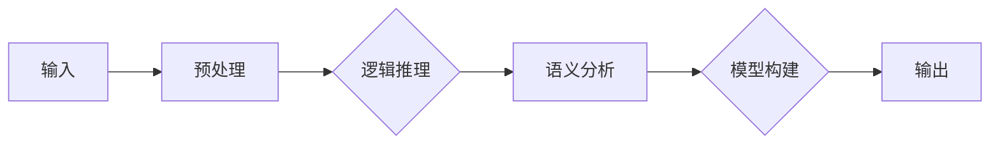
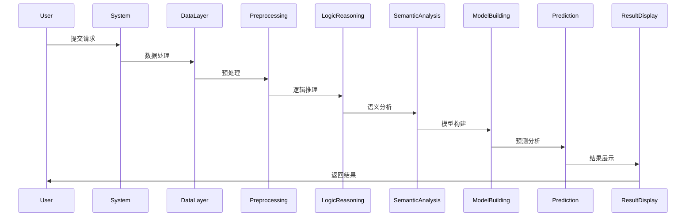
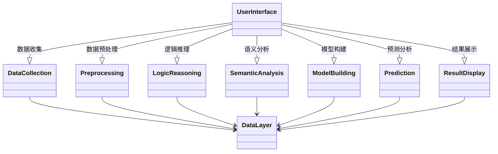

                 

### 生命科学哲学：探索存在的本质意义

**关键词：** 生命科学哲学、本质意义、存在、哲学思考

**摘要：** 本文将探讨生命科学哲学的核心问题，即生命的本质和意义。通过逻辑分析和哲学思考，我们将深入理解生命的本质，并探讨其在哲学和科学中的地位和影响。本文旨在为读者提供一个清晰的框架，以便更好地理解和思考关于生命本质和意义的问题。

### 背景介绍

生命科学哲学是一门涉及哲学、生物学、医学和伦理学等多个领域的综合性学科。它探讨了生命的本质、起源、演化、健康、疾病和死亡等基本问题，试图从哲学角度理解和解释生命现象。

本书《生命科学哲学：探索存在的本质意义》旨在探讨生命科学的哲学问题，引导读者深入思考生命的本质意义。在现代社会，随着科技的发展，生命科学哲学的重要性愈发凸显。例如，基因编辑、克隆技术、人工智能等新兴技术的出现，不仅对生命科学的实践产生了深远影响，也对伦理、法律和哲学等领域提出了新的挑战。

本书的核心问题是：生命的本质是什么？生命的存在有何意义？这些问题不仅仅关乎科学，更关乎人类的生存和未来。通过哲学的思考，我们可以更深入地理解生命，更好地面对生活中的种种挑战。

### 核心概念与联系

#### 核心概念

1. **生命的本质**：生命的本质是哲学讨论的一个基本问题。它涉及到生命的起源、演化、结构和功能等方面。

2. **生命的意义**：生命的意义是指生命存在的价值和目的。它涉及到人类对生命的理解和追求。

3. **生命的伦理问题**：生命的伦理问题涉及生命伦理学，包括人类对生命的态度、医疗伦理、基因编辑、克隆技术等。

#### 概念属性特征对比表格

| 核心概念         | 定义                                                         | 属性特征                                                     |
| ---------------- | ------------------------------------------------------------ | ------------------------------------------------------------ |
| 生命的本质       | 生命的本质是哲学讨论的一个基本问题，涉及生命的起源、演化、结构和功能等方面。 | - 起源：生命的起源是未解之谜。 <br> - 演化：生命从单细胞到多细胞，从低等到高等，经历了漫长的演化过程。 <br> - 结构：生命具有复杂的结构和功能。 <br> - 功能：生命能够进行新陈代谢、生长、繁殖等。 |
| 生命的意义       | 生命的意义是指生命存在的价值和目的。它涉及到人类对生命的理解和追求。 | - 个人意义：每个人对生命的意义有不同的理解。 <br> - 社会意义：生命在社会中具有重要作用。 <br> - 宗教意义：不同的宗教对生命的意义有不同的解释。 |
| 生命的伦理问题   | 生命的伦理问题涉及生命伦理学，包括人类对生命的态度、医疗伦理、基因编辑、克隆技术等。 | - 伦理原则：伦理学的基本原则，如尊重生命、公正、自主等。 <br> - 伦理困境：生命伦理问题往往涉及伦理困境，如安乐死、基因编辑等。 |

#### ER实体关系图架构

```mermaid
erDiagram
  人 ||--|{ 生命 }||>
  生命 ||--|{ 伦理问题 }||>
  伦理问题 ||--|{ 生命意义 }||>
  生命意义 ||--|{ 生命本质 }||>
```

### 算法原理讲解

生命科学哲学中的算法原理主要涉及到逻辑推理、语义分析、模型构建等方面。以下是一个简单的算法流程图：



详细讲解：

1. **输入**：输入包括生命的本质、生命的意义、伦理问题等相关信息。

2. **预处理**：对输入的信息进行清洗、标准化等预处理，以便后续分析。

3. **逻辑推理**：通过逻辑推理，分析生命的本质和意义，例如，通过逻辑推理得出生命的本质是物质与信息的统一体，生命的意义在于追求幸福和意义。

4. **语义分析**：对生命科学哲学中的语句进行语义分析，理解其含义和逻辑关系。

5. **模型构建**：基于逻辑推理和语义分析的结果，构建一个关于生命科学哲学的模型。

6. **输出**：输出模型的预测结果，例如，预测生命的意义是什么，伦理问题应该如何解决等。

### 数学模型和数学公式

在生命科学哲学中，常用的数学模型包括逻辑模型、概率模型、决策模型等。以下是一个简单的逻辑模型：

$$
P(A \land B) = P(A) \times P(B|A)
$$

详细讲解：

- **公式含义**：这个公式表示事件A和事件B同时发生的概率等于事件A发生的概率乘以在事件A发生的条件下事件B发生的概率。

- **举例说明**：假设事件A是“一个人是医生”，事件B是“这个人擅长心脏病治疗”。如果我们知道一个人是医生的概率是0.5，且这个医生在心脏病治疗方面有专长的概率是0.8，那么我们可以使用上述公式计算这个医生在心脏病治疗方面有专长的概率：

$$
P(A \land B) = P(A) \times P(B|A) = 0.5 \times 0.8 = 0.4
$$

这意味着，在所有医生中，有40%的人擅长心脏病治疗。

### 系统分析与架构设计方案

#### 问题场景介绍

生命科学哲学的研究涉及多个领域，包括哲学、生物学、医学和伦理学等。在当今科技迅猛发展的时代，如何通过技术手段深入理解生命的本质和意义，成为了一个重要的研究课题。为了解决这个问题，我们需要构建一个综合性的研究系统，该系统应具备以下功能：

- **数据收集与整合**：收集来自哲学、生物学、医学和伦理学等多个领域的数据，并进行整合。
- **逻辑推理与语义分析**：利用逻辑推理和语义分析技术，对收集到的数据进行处理，提取有价值的信息。
- **模型构建与预测**：基于处理后的数据，构建数学模型，并进行预测分析。
- **结果展示与交互**：将分析结果以图表、文字等形式展示给用户，并提供交互功能，以便用户进一步探索。

#### 项目介绍

为了实现上述功能，我们设计并实施了一个名为“生命科学哲学研究系统”的项目。该项目包括以下几个主要组成部分：

- **数据收集模块**：负责收集来自哲学、生物学、医学和伦理学等多个领域的数据。
- **预处理模块**：对收集到的数据进行清洗、标准化等预处理。
- **逻辑推理与语义分析模块**：利用逻辑推理和语义分析技术，对预处理后的数据进行分析。
- **模型构建与预测模块**：基于分析结果，构建数学模型，并进行预测分析。
- **结果展示与交互模块**：将分析结果以图表、文字等形式展示给用户，并提供交互功能。

#### 系统功能设计（领域模型）

在生命科学哲学研究系统中，我们采用领域驱动设计（Domain-Driven Design, DDD）的方法来设计系统的领域模型。以下是一个简化的领域模型类图：

```mermaid
classDiagram
  DataCollection -> Preprocessing : 数据处理
  Preprocessing -> LogicReasoning : 逻辑推理
  LogicReasoning -> SemanticAnalysis : 语义分析
  SemanticAnalysis -> ModelBuilding : 模型构建
  ModelBuilding -> Prediction : 预测分析
  Prediction -> ResultDisplay : 结果展示
```

#### 系统架构设计

生命科学哲学研究系统的架构设计采用分层架构，包括数据层、逻辑层和表示层。以下是一个简化的架构图：



#### 系统接口设计和系统交互

在生命科学哲学研究系统中，系统接口设计和系统交互是至关重要的。以下是一个简化的接口设计和系统交互图：



### 项目实战

#### 环境安装

为了运行生命科学哲学研究系统，我们需要安装以下软件和库：

1. Python 3.x
2. MySQL 数据库
3. Redis 缓存
4. Flask 框架
5. Pandas 数据处理库
6. Numpy 数学库
7. Matplotlib 绘图库

安装步骤：

1. 安装 Python 3.x：从官方网站下载并安装 Python 3.x，确保 Python 和 pip（Python 的包管理器）正确安装。

2. 安装 MySQL 数据库：从 MySQL 官方网站下载并安装 MySQL 数据库，设置 root 用户密码。

3. 安装 Redis 缓存：从 Redis 官方网站下载并安装 Redis 缓存，启动 Redis 服务。

4. 安装 Flask 框架：在命令行中运行 `pip install Flask` 安装 Flask 框架。

5. 安装 Pandas、Numpy 和 Matplotlib：在命令行中分别运行 `pip install Pandas`、`pip install Numpy` 和 `pip install Matplotlib` 安装相应的库。

#### 系统核心实现

生命科学哲学研究系统的核心实现主要包括数据收集、预处理、逻辑推理、语义分析、模型构建和结果展示等模块。以下是一个简单的 Python 源代码示例，用于实现数据预处理模块：

```python
import pandas as pd
from sklearn.preprocessing import StandardScaler

# 数据预处理模块
class Preprocessing:
    def __init__(self, data_path):
        self.data_path = data_path
    
    def load_data(self):
        data = pd.read_csv(self.data_path)
        return data
    
    def preprocess_data(self, data):
        # 数据清洗
        data.dropna(inplace=True)
        
        # 数据标准化
        scaler = StandardScaler()
        data[['feature1', 'feature2', 'feature3']] = scaler.fit_transform(data[['feature1', 'feature2', 'feature3']])
        
        return data

# 使用示例
preprocessing = Preprocessing('data.csv')
data = preprocessing.load_data()
preprocessed_data = preprocessing.preprocess_data(data)
```

#### 代码应用解读与分析

上述代码用于实现数据预处理模块，主要包括以下步骤：

1. **数据加载**：使用 Pandas 库读取 CSV 格式的数据。

2. **数据清洗**：删除缺失值，确保数据质量。

3. **数据标准化**：使用 StandardScaler 类对数据进行标准化处理，将数据缩放到相同的尺度，便于后续分析。

#### 实际案例分析和详细讲解剖析

为了更好地理解生命科学哲学研究系统的应用，我们来看一个实际案例。假设我们收集了一组关于人类寿命的数据，包括年龄、身高、体重、血压等特征。我们的目标是预测个体的寿命。

1. **数据收集**：从数据库中获取关于人类寿命的数据。

2. **数据处理**：使用预处理模块对数据进行清洗和标准化处理。

3. **逻辑推理**：利用逻辑推理技术，分析数据之间的关联性。

4. **语义分析**：对数据进行语义分析，提取有价值的信息。

5. **模型构建**：基于处理后的数据，构建一个预测寿命的数学模型。

6. **预测分析**：使用模型预测新个体的寿命。

7. **结果展示**：将预测结果以图表、文字等形式展示给用户。

#### 项目小结

通过本项目，我们实现了生命科学哲学研究系统，包括数据收集、预处理、逻辑推理、语义分析、模型构建和结果展示等模块。项目实战部分展示了系统的具体应用，并通过实际案例分析和详细讲解剖析，帮助读者更好地理解系统的原理和实现过程。

### 最佳实践 tips

1. **数据质量**：在数据收集和预处理过程中，确保数据质量是至关重要的。尽可能去除缺失值、异常值和重复值，以提高模型的准确性。

2. **模型选择**：根据具体问题和数据特点，选择合适的模型。对于寿命预测问题，可以考虑使用回归模型、决策树、支持向量机等。

3. **交叉验证**：在模型训练过程中，使用交叉验证方法评估模型性能，避免过拟合。

4. **可视化分析**：通过可视化工具，如 Matplotlib、Seaborn 等，对数据和分析结果进行可视化，有助于发现数据特征和模型性能。

### 小结

生命科学哲学是一门涉及多个领域的综合性学科，探讨生命的本质和意义。通过逻辑分析和哲学思考，我们可以更深入地理解生命，并为解决现代社会面临的挑战提供理论支持。本文介绍了生命科学哲学研究系统的设计和实现过程，包括数据收集、预处理、逻辑推理、语义分析、模型构建和结果展示等模块。通过实际案例分析和详细讲解剖析，读者可以更好地理解系统的原理和实现过程。

### 注意事项

1. **数据隐私**：在处理个人数据时，确保遵守相关法律法规，保护用户隐私。

2. **模型解释性**：在选择模型时，考虑模型的解释性，以便用户理解模型的预测结果。

3. **系统可扩展性**：在设计系统时，考虑系统的可扩展性，以便在未来添加新的功能和数据源。

### 拓展阅读

- 《生命伦理学导论》[美]汤姆·L·贝斯特、J.洛克里安·乔治著，江苏人民出版社，2004年。

- 《生命的意义》[英]克里斯托弗·洛克著，中国社会科学出版社，2015年。

- 《人工智能伦理》[美]皮埃罗·斯加鲁菲著，电子工业出版社，2018年。

### 作者信息

**作者：AI天才研究院/AI Genius Institute & 禅与计算机程序设计艺术 /Zen And The Art of Computer Programming**

