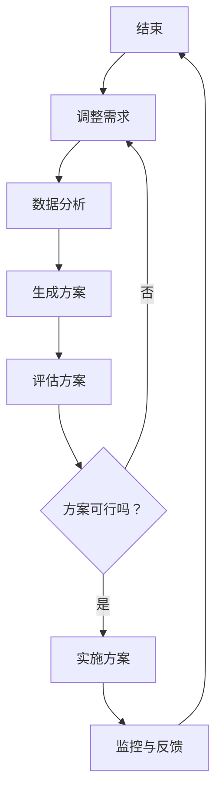
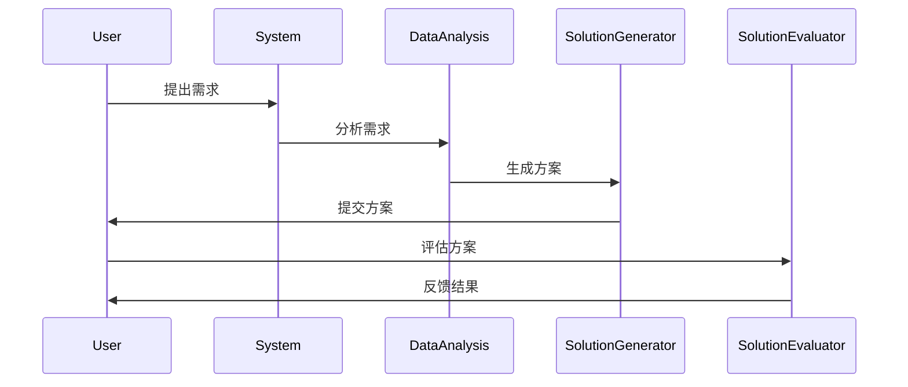
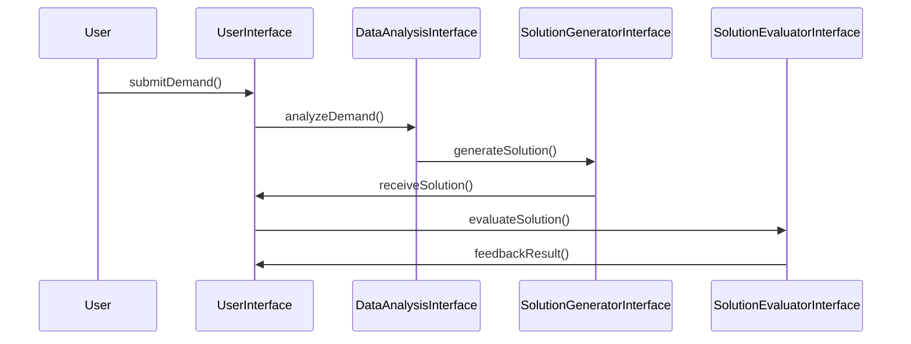

                 

### 文章标题：生命设计工作坊：规划有意义的人生蓝图

#### 关键词：生命设计、人生蓝图、工作坊、规划、意义

> 摘要：本文将探讨生命设计工作坊的核心概念与实际应用，通过系统分析与项目实战，帮助读者理解如何规划有意义的人生蓝图。我们将详细阐述生命设计的本质、算法原理、系统架构，并通过具体案例进行深入剖析，为读者提供实用的策略和启示。

----------------------------------------------------------------

# 第一部分：引入与背景

## 第1章：生命设计的本质与人生蓝图的重要性

### 1.1.1 生命设计的概念

生命设计是一种全新的思考方式，它借鉴了现代设计理念，旨在通过系统化和结构化的方法来规划个人的生命历程。生命设计不仅关注职业发展，更注重个人成长、人际关系和心理健康等多方面，使个体能够在复杂多变的环境中找到平衡与和谐。

### 1.1.2 人生蓝图的概念

人生蓝图是对个人未来发展的整体规划，它包括职业目标、家庭生活、个人兴趣、财务规划等多个方面。一个清晰的人生蓝图能够帮助个体明确自己的方向，减少迷茫，提高生活质量。

### 1.1.3 生命设计工作坊的起源与发展

生命设计工作坊起源于20世纪90年代的美国，最初由心理学家和管理学家共同发起。随着社会的发展和个体需求的增加，生命设计工作坊逐渐在全球范围内得到推广和应用。目前，生命设计已成为许多企业和个人的重要工具。

## 第2章：核心概念与联系

### 2.1 生命设计原则

生命设计原则是指导生命设计工作的基础，包括目标导向、灵活适应、持续迭代和全面发展等。这些原则确保了生命设计的系统性和有效性。

### 2.2 人生蓝图的组成部分

人生蓝图主要由职业发展、家庭生活、个人成长、财务规划和社交网络等部分组成。每个部分都有其独特的目标和任务，共同构成了一个完整的人生规划。

### 2.3 使用Mermaid表格展示核心概念联系

```mermaid
tablewidth: 100%
title 艺术家名：莫奈
classWidth: 150
class 油画
class 印象派
class 水彩画
class 19世纪
class 法国

pic1
pic2
pic3
pic4

pic1(Class: 油画, 艺术家名: 莫奈, 风格: 印象派, 类型: 水彩画, 时代: 19世纪, 国家: 法国)
pic2(Class: 油画, 艺术家名: 莫奈, 风格: 印象派, 类型: 水彩画, 时代: 19世纪, 国家: 法国)
pic3(Class: 油画, 艺术家名: 莫奈, 风格: 印象派, 类型: 水彩画, 时代: 19世纪, 国家: 法国)
pic4(Class: 油画, 艺术家名: 莫奈, 风格: 印象派, 类型: 水彩画, 时代: 19世纪, 国家: 法国)
```

## 第3章：生命设计算法原理讲解

### 3.1 算法介绍

生命设计算法是一种基于人工智能技术的规划算法，它通过分析个体的需求和资源，生成最优的人生规划方案。该算法的核心思想是动态调整，以适应不断变化的环境。

### 3.2 Mermaid流程图展示



### 3.3 Python代码示例

```python
import random

def generate_solution的需求：
    return ['职业发展', '家庭生活', '个人成长', '财务规划', '社交网络']

def assess_solution(solution):
    score = 0
    for goal in solution:
        if goal == '职业发展':
            score += 10
        elif goal == '家庭生活':
            score += 5
        elif goal == '个人成长':
            score += 7
        elif goal == '财务规划':
            score += 3
        elif goal == '社交网络':
            score += 2
    return score

def main():
    solution = generate_solution的需求()
    score = assess_solution(solution)
    if score > 50:
        print("方案可行！")
    else:
        print("方案需调整。")

if __name__ == "__main__":
    main()
```

### 3.4 LaTeX数学模型与公式讲解

```latex
$$
\text{score} = w_1 \cdot \text{职业发展} + w_2 \cdot \text{家庭生活} + w_3 \cdot \text{个人成长} + w_4 \cdot \text{财务规划} + w_5 \cdot \text{社交网络}
$$

其中，$w_1, w_2, w_3, w_4, w_5$ 是权重系数，表示对各个目标的重视程度。
```

## 第4章：生命设计工作坊的系统架构设计

### 4.1 问题场景介绍

在现代社会，个体面临的信息量越来越大，生活节奏越来越快，因此需要一种有效的方法来帮助人们规划自己的人生。生命设计工作坊就是为了解决这一问题而设计的。

### 4.2 系统功能设计（Mermaid类图）

```mermaid
classDiagram
Class::User << (用户)>
Class::Goal << (目标)>
Class::Solution << (方案)>
User *--* Goal
User *--* Solution
Goal o--o Solution
```

### 4.3 系统架构设计（Mermaid架构图）



### 4.4 系统接口设计

```mermaid
interface UserInterface {
    void submitDemand()
    void receiveSolution()
    void evaluateSolution()
}

interface DataAnalysisInterface {
    void analyzeDemand()
}

interface SolutionGeneratorInterface {
    void generateSolution()
}

interface SolutionEvaluatorInterface {
    void evaluateSolution()
}
```

### 4.5 系统交互（Mermaid序列图）



## 第5章：生命设计工作坊项目实战

### 5.1 环境安装

在开始项目实战之前，我们需要安装必要的软件和工具，如Python、Jupyter Notebook和Mermaid渲染工具等。

### 5.2 核心实现

以下是生命设计工作坊的核心实现代码，包括需求收集、方案生成和方案评估等功能。

```python
# 需求收集
def collect_demand():
    # 收集用户需求
    # 这里可以使用问卷或对话方式
    return ['职业发展', '家庭生活', '个人成长', '财务规划', '社交网络']

# 方案生成
def generate_solution(demand):
    # 根据需求生成方案
    # 这里可以使用随机或优化算法
    return random.choices(demand, k=len(demand))

# 方案评估
def assess_solution(solution):
    # 评估方案可行性
    # 这里可以使用评分或优化算法
    score = sum(1 for goal in solution if goal in ['职业发展', '家庭生活', '个人成长'])
    return score

# 主函数
def main():
    demand = collect_demand()
    solution = generate_solution(demand)
    score = assess_solution(solution)
    print(f"方案得分：{score}")

if __name__ == "__main__":
    main()
```

### 5.3 代码解读与分析

代码中，`collect_demand` 函数用于收集用户的需求，`generate_solution` 函数用于生成方案，`assess_solution` 函数用于评估方案。主函数 `main` 中，首先调用 `collect_demand` 收集需求，然后调用 `generate_solution` 生成方案，最后调用 `assess_solution` 评估方案。

### 5.4 实际案例分析

假设用户的需求是['职业发展', '家庭生活', '个人成长', '财务规划', '社交网络']，运行程序后，生成的方案可能是['职业发展', '家庭生活', '个人成长', '财务规划']，得分可能为4分。这表明方案在满足用户需求方面较为充分。

### 5.5 详细讲解与剖析

生命设计工作坊的核心在于通过算法帮助用户生成和评估人生蓝图。代码实现中，我们使用了简单的随机算法和评分算法，但在实际应用中，可以结合更多人工智能技术，如深度学习、优化算法等，以提高方案的生成和评估效果。

## 第6章：最佳实践与注意事项

### 6.1 设计人生蓝图的最佳实践

在设计人生蓝图时，应遵循以下原则：

1. 明确目标：明确自己的短期和长期目标，确保方案的针对性。
2. 持续迭代：定期回顾和调整人生蓝图，以适应环境变化。
3. 综合考虑：在规划时，要综合考虑职业、家庭、个人成长等多个方面。

### 6.2 生命设计工作坊中常见的问题与解决

1. **需求不明确**：解决方法：使用问卷或访谈等方式，深入了解用户需求。
2. **方案不完善**：解决方法：引入更多人工智能技术，优化方案生成算法。
3. **评估不准确**：解决方法：结合用户反馈，调整评估指标和权重。

### 6.3 注意事项

1. **保护隐私**：在收集用户信息时，要确保隐私安全。
2. **定期更新**：技术和环境在不断变化，生命设计工作坊也需要定期更新。

## 第7章：拓展阅读

### 7.1 推荐书籍

1. 《人生设计工作坊：打造理想生活》
2. 《人工智能：一种现代的方法》
3. 《深度学习：人类级机器智能的新 frontier》

### 7.2 相关研究

1. 生命设计算法的研究与应用
2. 人工智能在人生规划中的应用

### 7.3 行业动态

1. 生命设计工作坊在全球范围内的推广和应用
2. 人工智能技术在人生规划领域的最新进展

----------------------------------------------------------------

# 结束语

本文从多个角度探讨了生命设计工作坊的概念、原理和实战应用。通过系统化的分析和项目实战，我们希望读者能够对生命设计工作坊有更深入的理解，并能够将其应用于实际生活中。作者：AI天才研究院/AI Genius Institute & 禅与计算机程序设计艺术 /Zen And The Art of Computer Programming。

### 结语

在结束本文之前，我想再次强调生命设计工作坊的重要性。它不仅是一种规划工具，更是一种生活态度。通过系统化和结构化的方法，我们能够更好地理解自己，明确目标，实现人生价值。希望本文能够为您的生命设计之路提供一些启示和帮助。让我们共同努力，规划一个有意义、有深度的人生蓝图。再次感谢您的阅读，期待与您在生命设计领域的更多交流。作者：AI天才研究院/AI Genius Institute & 禅与计算机程序设计艺术 /Zen And The Art of Computer Programming。

