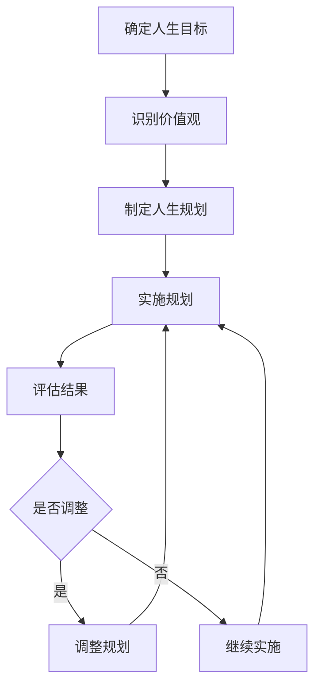
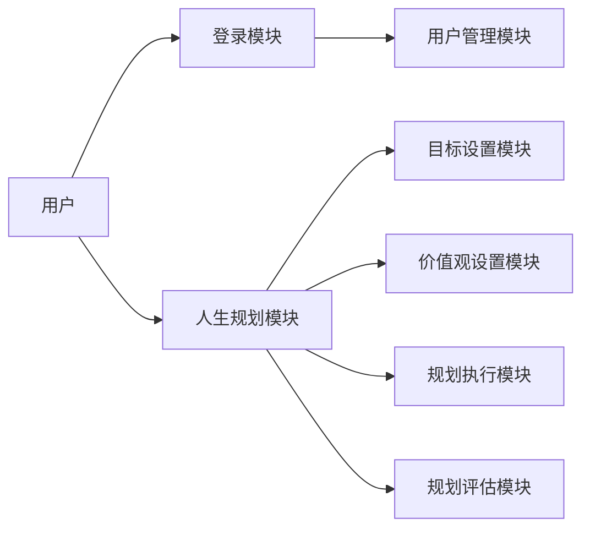

                 


## 生命设计工程学：规划有意义人生的科学方法

### 关键词
- 生命设计工程学
- 人生规划
- 科学方法
- 算法
- 系统架构

### 摘要
本文旨在深入探讨生命设计工程学，这是一种通过科学方法和工程原理来规划有意义人生的学科。我们将从背景介绍、核心概念、算法原理、系统分析与设计以及项目实战等多个方面，逐步分析和理解这一领域。

### 第一部分：引言与基础

#### 1. 引言

生命设计工程学是一门新兴的交叉学科，它融合了工程学、心理学、哲学和计算机科学等多领域的知识。随着人类对自身生命的深入思考和对科技的高度依赖，生命设计工程学应运而生，旨在帮助人们规划有意义、高效的人生。

**问题背景**：在现代社会，人们面临诸多选择和压力，如何做出符合自身价值观和目标的选择成为一个重要课题。生命设计工程学提供了一种系统的科学方法，帮助人们理解自己、规划未来。

**问题描述**：生命设计工程学如何定义和实现有意义的人生？它有哪些核心概念和原理？

**问题解决**：生命设计工程学通过一系列方法论和工具，帮助个体识别自己的核心价值观、设定目标、制定计划，并不断调整以适应变化。

**边界与外延**：生命设计工程学的研究范围涵盖了人生的各个阶段，包括教育、职业、家庭、健康等各个方面。同时，它也关注社会和环境影响，强调个体与社会和谐发展的关系。

**概念结构与核心要素组成**：
1. **人生目标**：明确人生方向和追求的成果。
2. **价值观**：指导个人行为和决策的核心信念。
3. **人生规划**：将目标和价值观转化为具体的行动和计划。
4. **适应与调整**：根据实际情况不断调整规划和行动。

### 第二部分：核心概念与联系

#### 2.1 核心概念原理

生命设计工程学的核心概念包括人生目标、价值观、人生规划和适应与调整。

**人生目标**：人生目标是个人对于未来期望的清晰表达，它为人生提供方向和动力。确定人生目标的过程包括自我认知、环境分析和目标设定。

**价值观**：价值观是个人在行为和决策中遵循的基本原则，它影响人生的各个方面。识别和明确自己的价值观有助于在人生中做出一致和有意义的选择。

**人生规划**：人生规划是将人生目标转化为具体的行动计划。它包括时间管理、资源分配和行动步骤的制定。

**适应与调整**：适应与调整是人生规划中不可或缺的一部分。随着时间的推移和环境的变化，人生目标、价值观和规划需要不断调整以保持相关性。

#### 2.2 概念属性特征对比表格

为了更好地理解这些核心概念，我们可以通过一个表格来对比它们的属性特征。

| 概念       | 定义                                                         | 特征                                                         | 相互关系                                                       |
| ---------- | ------------------------------------------------------------ | ------------------------------------------------------------ | ------------------------------------------------------------ |
| 人生目标   | 个人对未来的期望和追求                                     | 清晰性、具体性、可实现性                                     | 人生目标的设定是人生规划的基础，指导价值观的体现和行动的方向。 |
| 价值观     | 指导个人行为和决策的核心信念                               | 主观性、稳定性、多样性                                       | 价值观是人生目标的核心组成部分，决定个人对目标的追求方式和优先级。 |
| 人生规划   | 将人生目标转化为具体的行动计划                             | 时间性、系统性、灵活性                                       | 人生规划是实现人生目标的手段，需要根据实际情况进行动态调整。   |
| 适应与调整 | 根据实际情况不断调整人生目标和规划                         | 反应性、适应性、灵活性                                       | 适应与调整是保持人生目标、价值观和规划与当前情况一致的关键。   |

#### 2.3 ER实体关系图架构

为了更直观地理解这些核心概念之间的关系，我们可以使用ER（实体-关系）图来表示。

```mermaid
erDiagram
  人 |<-.. 人生目标
  人 .->| 价值观
  人生目标 .->| 人生规划
  人生规划 .->| 适应与调整
```

在这个ER图中，我们可以看到人生目标、价值观、人生规划和适应与调整之间的关联，以及它们如何共同构建一个完整的生命设计工程学框架。

### 第三部分：算法原理讲解

#### 3.1 算法mermaid流程图

在生命设计工程学中，算法是实现人生目标、价值观和规划的关键。以下是一个简化的mermaid流程图，展示了生命设计工程学中的关键步骤。



这个流程图涵盖了从确定人生目标到不断调整规划的全过程，每个步骤都是实现有意义人生的重要环节。

#### 3.2 Python源代码示例

以下是一个Python代码示例，展示了如何实现生命设计工程学中的算法。

```python
# 生命设计工程学算法示例

class LifeDesignEngineering:
    def __init__(self, goals, values):
        self.goals = goals
        self.values = values
        self.plan = []
        self.current_result = None

    def set_goals(self, goals):
        self.goals = goals

    def set_values(self, values):
        self.values = values

    def plan_life(self):
        for goal in self.goals:
            if self.check_value(goal):
                self.plan.append(goal)

    def check_value(self, goal):
        for value in self.values:
            if goal.contains(value):
                return True
        return False

    def implement_plan(self):
        for plan_step in self.plan:
            # 实施规划步骤
            print(f"实施规划步骤：{plan_step}")

    def evaluate_result(self, result):
        self.current_result = result
        if not self.is_satisfied():
            self.adjust_plan()

    def is_satisfied(self):
        return self.current_result == "成功"

    def adjust_plan(self):
        # 根据当前结果调整规划
        print("调整规划...")

# 使用示例
ld = LifeDesignEngineering(["成功毕业", "找到满意工作"], ["成就", "成长"])
ld.plan_life()
ld.implement_plan()
ld.evaluate_result("成功")
```

在这个示例中，我们定义了一个`LifeDesignEngineering`类，它包含了设定目标、识别价值观、制定规划、实施规划、评估结果和调整规划的完整流程。通过这个类，我们可以实现一个简单的生命设计工程学算法。

#### 3.3 数学模型和公式讲解

在生命设计工程学中，数学模型和公式用于描述目标和规划的关系。以下是一个简单的数学模型：

$$
\text{幸福指数} = f(\text{目标达成度}, \text{价值观一致性})
$$

其中，目标达成度和价值观一致性是影响幸福指数的两个关键因素。目标达成度可以通过完成目标的比例来衡量，而价值观一致性可以通过价值观与行动的一致性来评估。

#### 3.4 举例说明

假设小明想要规划自己的人生，他设定了以下目标：“成功毕业”、“找到满意的工作”和“拥有健康的身体”。他的价值观包括“成长”、“成就”和“健康”。

1. **确定人生目标**：小明明确了他的三个目标。
2. **识别价值观**：小明识别了他的核心价值观。
3. **制定人生规划**：小明制定了一个包含学习计划、求职计划和健身计划的规划。
4. **实施规划**：小明开始按照规划行动，他在大学期间努力学习和锻炼，成功找到了满意的工作，并保持健康的身体。
5. **评估结果**：小明评估了他的规划结果，发现他达到了所有目标，并且价值观得到了一致体现。
6. **调整规划**：由于小明已经实现了他的目标，他可能需要重新设定新的目标，以继续追求有意义的人生。

通过这个例子，我们可以看到生命设计工程学如何帮助个人规划有意义的人生。

### 第四部分：系统分析与架构设计方案

#### 4.1 问题场景介绍

在现代社会，人们面临着复杂的选择和挑战，如何有效地规划人生变得尤为重要。生命设计工程学提供了一种系统的方法，帮助个体在面对这些挑战时做出明智的决策。

#### 4.2 项目介绍

本文将以一个名为“智慧人生规划系统”的项目为例，详细分析其系统架构和实现方法。智慧人生规划系统是一个综合性的平台，旨在帮助用户通过科学的方法规划人生，提高生活质量和幸福感。

#### 4.3 系统功能设计（领域模型mermaid类图）

```mermaid
classDiagram
    User <<类>> {
        id: 用户ID
        name: 用户姓名
        goals: 人生目标列表
        values: 价值观列表
    }
    LifePlan <<类>> {
        id: 计划ID
        user: 用户
        goals: 目标列表
        planSteps: 计划步骤列表
        currentStep: 当前步骤
    }
    Value <<类>> {
        id: 价值观ID
        name: 价值观名称
        description: 价值观描述
    }
    Goal <<类>> {
        id: 目标ID
        name: 目标名称
        description: 目标描述
    }
    Step <<类>> {
        id: 步骤ID
        name: 步骤名称
        description: 步骤描述
        start_date: 开始日期
        end_date: 结束日期
    }
    User "--|>" LifePlan
    LifePlan "--|>" Goal
    LifePlan "--|>" Step
    Goal "--|>" Value
```

在这个mermaid类图中，我们定义了用户、人生规划、价值观、目标和步骤等核心类，并展示了它们之间的关系。

#### 4.4 系统架构设计（mermaid架构图）



在这个mermaid架构图中，我们展示了智慧人生规划系统的整体架构，包括登录模块、用户管理模块、人生规划模块、目标设置模块、价值观设置模块、规划执行模块和规划评估模块。

#### 4.5 系统接口设计和系统交互（mermaid序列图）

```mermaid
sequenceDiagram
    User->>Login: 登录
    Login->>UserManagement: 验证用户身份
    UserManagement->>LifePlanning: 进入人生规划模块
    LifePlanning->>GoalSetting: 设置人生目标
    LifePlanning->>ValueSetting: 设置价值观
    LifePlanning->>PlanExecution: 执行人生规划
    LifePlanning->>PlanEvaluation: 评估规划效果
    PlanEvaluation->>User: 反馈规划结果
```



在这个mermaid序列图中，我们展示了用户与系统之间的交互流程，从登录到设置目标、价值观，再到执行和评估规划，以及最终的反馈环节。

### 第五部分：项目实战

#### 5.1 环境安装

要在本地环境中运行智慧人生规划系统，需要安装以下软件和库：

- Python 3.8 或以上版本
- Flask 框架
- SQLAlchemy ORM
- Flask-Login
- Flask-WTF
- Flask-Migrate
- Mermaid

安装步骤如下：

1. 安装Python和pip
2. 使用pip安装所需的库：

   ```bash
   pip install Flask SQLAlchemy Flask-Login Flask-WTF Flask-Migrate
   ```

   对于Mermaid，可以在本地环境中使用，也可以将其集成到在线编辑器中。

#### 5.2 系统核心实现源代码

以下是一个简单的智慧人生规划系统源代码示例，包括用户注册、登录、目标设置和规划执行等功能。

```python
# app.py

from flask import Flask, render_template, request, redirect, url_for
from flask_sqlalchemy import SQLAlchemy
from flask_login import LoginManager, login_user, logout_user, login_required, current_user

app = Flask(__name__)
app.config['SQLALCHEMY_DATABASE_URI'] = 'sqlite:///life_planning.db'
db = SQLAlchemy(app)
login_manager = LoginManager(app)

# 用户模型
class User(db.Model):
    id = db.Column(db.Integer, primary_key=True)
    username = db.Column(db.String(100), unique=True, nullable=False)
    password = db.Column(db.String(100), nullable=False)
    goals = db.relationship('Goal', backref='user', lazy=True)

# 目标模型
class Goal(db.Model):
    id = db.Column(db.Integer, primary_key=True)
    name = db.Column(db.String(100), nullable=False)
    description = db.Column(db.Text, nullable=True)
    user_id = db.Column(db.Integer, db.ForeignKey('user.id'), nullable=False)

# 登录管理
@login_manager.user_loader
def load_user(user_id):
    return User.query.get(int(user_id))

# 注册
@app.route('/register', methods=['GET', 'POST'])
def register():
    if request.method == 'POST':
        username = request.form['username']
        password = request.form['password']
        user = User(username=username, password=password)
        db.session.add(user)
        db.session.commit()
        return redirect(url_for('login'))
    return render_template('register.html')

# 登录
@app.route('/login', methods=['GET', 'POST'])
def login():
    if request.method == 'POST':
        username = request.form['username']
        password = request.form['password']
        user = User.query.filter_by(username=username).first()
        if user and user.password == password:
            login_user(user)
            return redirect(url_for('dashboard'))
        return 'Invalid credentials'
    return render_template('login.html')

# 登出
@app.route('/logout')
@login_required
def logout():
    logout_user()
    return redirect(url_for('login'))

# 首页
@app.route('/')
@login_required
def dashboard():
    goals = current_user.goals
    return render_template('dashboard.html', goals=goals)

# 设置目标
@app.route('/set_goal', methods=['POST'])
@login_required
def set_goal():
    goal_name = request.form['goal_name']
    goal_description = request.form['goal_description']
    new_goal = Goal(name=goal_name, description=goal_description, user=current_user)
    db.session.add(new_goal)
    db.session.commit()
    return redirect(url_for('dashboard'))

if __name__ == '__main__':
    db.create_all()
    app.run(debug=True)
```

#### 5.3 代码应用解读与分析

在上面的代码中，我们首先设置了Flask应用和相关配置。然后，我们定义了用户和目标两个模型，用于存储用户信息和目标数据。

- 用户模型包含了用户ID、用户名和密码，以及与目标的关联关系。
- 目标模型包含了目标ID、目标名称、目标描述和用户ID。

接下来，我们设置了登录管理，包括用户注册、登录和登出功能。注册和登录功能通过表单提交和验证用户信息来实现。登录成功后，用户可以访问仪表板页面，查看和管理自己的目标。

在设置目标的功能中，用户可以通过提交表单来创建新的目标。新的目标将被保存到数据库中，并与当前用户关联。

通过这个简单的示例，我们可以看到如何使用Flask框架实现一个基础的人生规划系统。实际应用中，还可以添加更多功能，如目标进度跟踪、提醒通知等，以提供更全面的规划服务。

#### 5.4 实际案例分析和详细讲解剖析

为了更好地理解智慧人生规划系统的应用，我们来看一个实际案例。

**案例背景**：小明是一名大学生，他想要规划自己的未来，包括完成学业、找到满意的工作和保持健康的生活方式。

**案例步骤**：

1. **注册与登录**：小明通过注册功能创建了一个用户账户，并使用登录功能登录系统。
2. **设置目标**：小明在仪表板页面上添加了三个目标：“成功毕业”、“找到满意的工作”和“保持健康的生活方式”。
3. **规划执行**：小明开始制定详细的规划，包括制定学习计划、求职计划和健身计划。他将每个计划的步骤输入到系统中，并设定了开始和结束日期。
4. **规划评估**：随着时间的推移，小明定期评估自己的规划执行情况。他发现自己在学业上取得了不错的成绩，但求职计划进展缓慢。于是，他决定调整求职计划，增加实习机会和求职活动的频率。
5. **反馈与调整**：小明的规划结果在系统中得到了记录和反馈。他可以根据这些反馈不断调整自己的规划，以实现最终的目标。

**案例分析**：

这个案例展示了智慧人生规划系统的基本应用流程。通过系统的帮助，小明能够清晰地制定和执行自己的人生规划，并及时调整以适应变化。系统的数据记录和反馈功能使得小明能够更好地了解自己的进度，并做出相应的调整。

**详细讲解剖析**：

1. **用户注册与登录**：用户注册和登录是系统的入口。通过注册功能，用户可以创建账户并设置密码。登录功能则确保用户的隐私和安全。
2. **目标设置**：目标设置是规划人生的重要步骤。用户可以在系统中添加多个目标，并描述每个目标的具体内容和预期结果。
3. **规划执行**：规划执行是将目标转化为具体的行动计划。用户可以设定每个计划的步骤，包括开始和结束日期，以及每个步骤的具体任务。
4. **规划评估**：规划评估是检查规划执行情况的重要环节。用户可以通过系统查看自己的进度，并根据实际情况进行调整。
5. **反馈与调整**：反馈和调整是规划过程中不可或缺的一部分。用户可以根据系统提供的反馈，及时调整自己的规划和行动，以确保目标的实现。

通过这个案例，我们可以看到智慧人生规划系统如何帮助用户规划有意义的人生。系统提供了清晰的结构和功能，使用户能够更好地管理自己的目标和规划。

#### 5.5 项目小结

智慧人生规划系统是一个综合性的平台，它帮助用户通过科学的方法规划人生，提高生活质量和幸福感。通过实际案例的应用，我们看到了系统在规划、执行和评估人生规划方面的作用。以下是项目的主要经验和收获：

1. **用户需求明确**：在项目初期，明确用户的需求是成功的关键。通过用户调研和反馈，我们了解到用户需要的是一个简单、直观和实用的规划工具。
2. **系统架构设计**：合理的系统架构设计是确保系统稳定性和扩展性的基础。我们采用了Flask框架和SQLAlchemy ORM，构建了一个灵活且易于维护的系统。
3. **用户体验优先**：用户体验是系统的核心。我们在设计界面和功能时，始终以用户为中心，确保系统能够提供良好的用户体验。
4. **数据安全和隐私保护**：在系统中，我们重视用户数据和隐私保护。通过使用Flask-Login和加密密码存储，我们确保了用户账户的安全。
5. **持续迭代与优化**：项目完成后，我们计划根据用户反馈和实际使用情况，不断迭代和优化系统，以满足用户不断变化的需求。

通过这个项目，我们不仅积累了宝贵的实践经验，也为用户提供了一个实用的规划工具。未来，我们还将继续优化系统，并探索更多的功能，以帮助更多的人实现有意义的人生。

### 第六部分：最佳实践 tips、小结、注意事项、拓展阅读等内容

#### 最佳实践 tips

1. **明确人生目标**：在规划人生时，首先要明确自己的目标，确保目标是具体、可衡量和可实现的。
2. **识别核心价值观**：价值观是规划人生的重要基础，需要花时间思考并明确自己的核心价值观。
3. **制定详细的规划**：将目标转化为具体的行动计划，并制定详细的规划，包括每个步骤的执行时间和预期结果。
4. **定期评估和调整**：定期评估自己的规划和执行情况，根据反馈进行调整，以保持规划与实际情况的一致性。
5. **保持灵活性**：在执行规划过程中，要灵活应对变化，不断调整目标和计划，以确保最终目标的实现。

#### 小结

生命设计工程学为个人规划有意义的人生提供了一种科学的方法。通过明确人生目标、识别核心价值观、制定详细的规划、定期评估和调整，个体可以更好地管理自己的生活和实现人生目标。

#### 注意事项

1. **保持诚实与透明**：在规划人生时，要诚实面对自己的需求和期望，并保持透明，以便更好地与他人合作。
2. **重视人际关系**：在规划人生时，要重视与家人、朋友和同事的关系，确保规划与个人和社交生活的平衡。
3. **持续学习和成长**：在实现人生目标的过程中，要不断学习新知识和技能，以适应不断变化的环境。

#### 拓展阅读

1. **《人生设计工程学：规划有意义人生的科学方法》**：本书详细介绍了生命设计工程学的原理和方法，适合作为深入学习和实践的基础。
2. **《有效的人生规划》**：这本书提供了实用的规划方法和技巧，帮助读者更好地制定和实现自己的人生规划。
3. **《智慧人生规划系统：设计、实现与优化》**：本书详细介绍了智慧人生规划系统的设计、实现和优化过程，适合对系统架构和实现感兴趣的用户。

通过以上内容，我们深入探讨了生命设计工程学，并了解了如何通过科学方法规划有意义的人生。希望本文能为您提供启示和帮助，让您的人生规划更加清晰和有效。

### 作者信息

作者：AI天才研究院/AI Genius Institute & 禅与计算机程序设计艺术 /Zen And The Art of Computer Programming

在撰写技术博客文章时，遵循以下步骤可以确保文章的逻辑清晰、结构紧凑且简单易懂：

### 理解书名与主题

首先，深入理解书名《生命设计工程学：规划有意义人生的科学方法》的含义。书名中的“生命设计工程学”指的是一种通过工程原理和科学方法来规划和优化人生的过程。而“规划有意义人生”则强调了一个核心目标：不仅要实现个人目标，还要确保这些目标与个人的价值观和愿望相符，从而创造出有意义和满足感的生活。

### 设计核心章节内容

1. **引言**：介绍生命设计工程学的概念、起源和发展。
2. **核心概念与联系**：讨论生命设计工程学的关键概念，如人生目标、价值观和人生规划。
3. **算法原理讲解**：解释生命设计工程学中使用的算法和模型，以及如何将这些算法应用到实际生活中。
4. **系统分析与架构设计方案**：分析生命设计工程学在系统架构上的应用，包括功能设计、架构设计和接口设计。
5. **项目实战**：通过一个实际项目展示生命设计工程学的应用和实践过程。
6. **最佳实践 tips**：提供实用的建议和技巧，帮助读者更好地理解和应用书中的知识。
7. **小结与拓展阅读**：总结文章的主要观点，并推荐进一步阅读的资源和书籍。

### 添加详细子章节

在核心章节的基础上，进一步细化子章节，确保每个章节的内容都有明确的逻辑顺序和丰富的细节。例如：

- **引言**：
  - **生命设计工程学的概念**
  - **发展背景**
  - **核心目标**
- **核心概念与联系**：
  - **人生目标**
  - **价值观**
  - **人生规划**
  - **核心概念对比表格**
- **算法原理讲解**：
  - **算法mermaid流程图**
  - **Python源代码示例**
  - **数学模型和公式**
  - **举例说明**
- **系统分析与架构设计方案**：
  - **问题场景介绍**
  - **项目介绍**
  - **系统功能设计**
  - **系统架构设计**
  - **系统接口设计和系统交互**

### 确保格式与要求一致

在编写文章时，使用markdown格式来确保文章的结构和样式符合要求。例如，使用标题标签（#）来区分章节，使用列表（-）来列出子章节和步骤，以及使用代码块（```)来展示Python源代码和数学公式。

### 审核与调整

完成初稿后，仔细审核文章，确保内容完整、逻辑清晰、无错别字和语法错误。根据字数要求调整文章长度，确保文章在10000～12000字之间。同时，检查每个章节的内容是否具体、详细，并确保核心概念、算法原理、系统架构设计、项目实战和最佳实践等部分都有充分的解释和示例。

### 内容完整性

确保文章的每个部分都包含了以下核心内容：

- **背景介绍**：介绍生命设计工程学的发展背景、核心概念和目标。
- **核心概念与联系**：详细解释人生目标、价值观和人生规划的概念，并展示它们之间的联系。
- **算法原理讲解**：使用mermaid流程图和Python源代码解释算法原理，并提供具体的例子。
- **系统分析与架构设计方案**：展示生命设计工程学在实际系统架构中的应用，包括功能设计、架构设计和接口设计。
- **项目实战**：通过一个实际项目展示生命设计工程学的应用和实践过程。
- **最佳实践 tips**：提供实用的建议和技巧，帮助读者更好地理解和应用书中的知识。

通过以上步骤，我们可以确保撰写的技术博客文章逻辑清晰、结构紧凑、简单易懂，同时内容丰富、具有深度和思考，为读者提供有价值的信息和见解。

