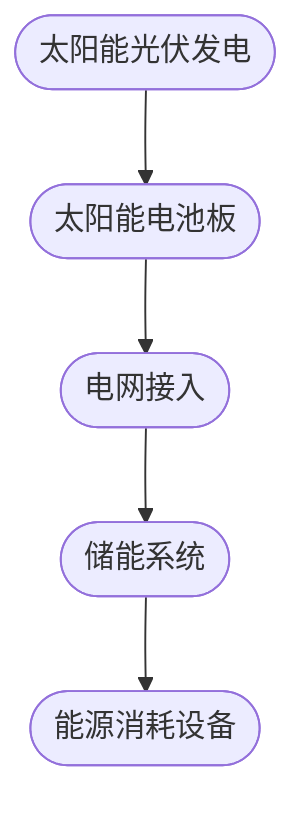
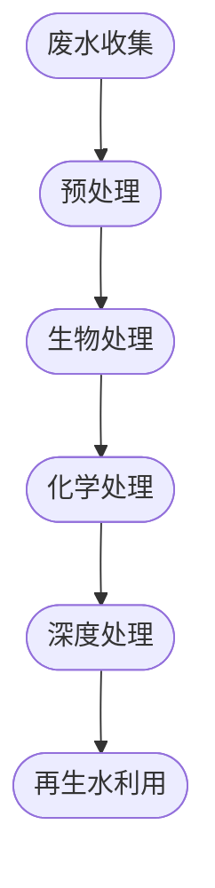
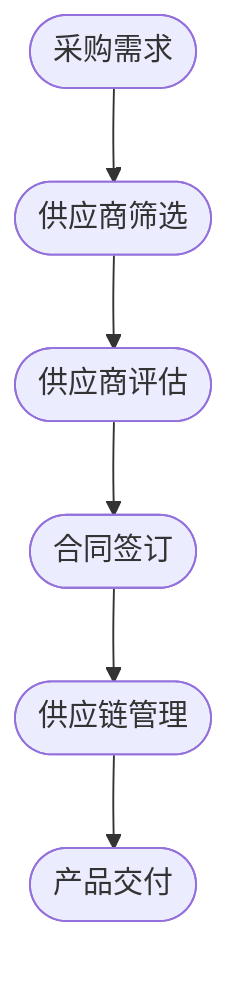
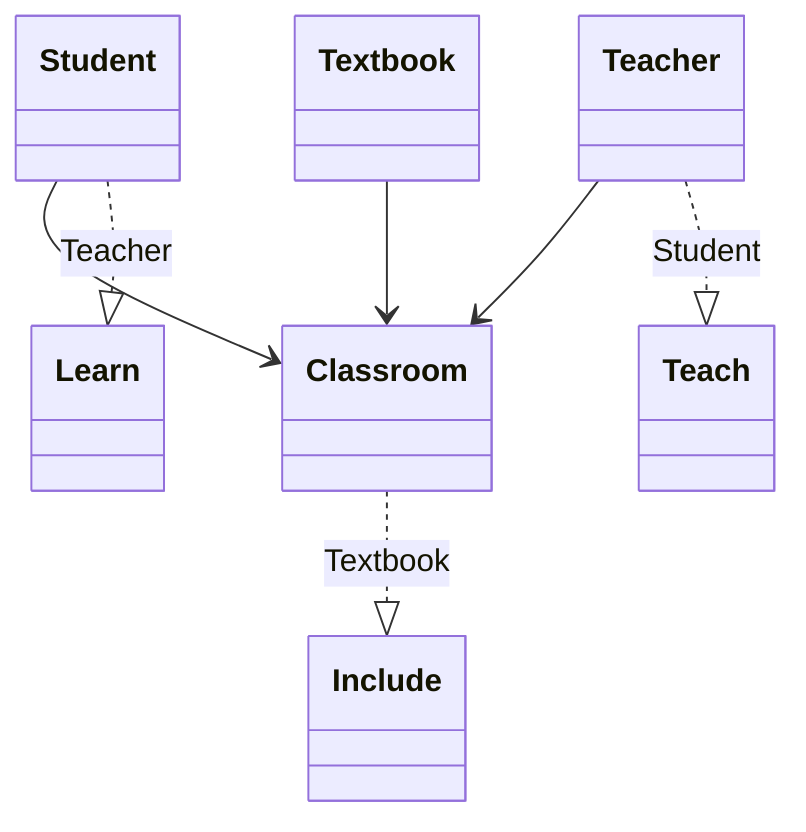

                 

# 《生态公民2.0：将环保理念融入每个决策》

## 关键词

- 生态公民2.0
- 环保理念
- 决策
- 可持续性
- 绿色技术

## 摘要

本文旨在探讨如何在现代社会中将环保理念融入每个决策，打造生态公民2.0。通过分析环保理念的历史与发展、环保行为与实践、环保技术的应用、个人与社区层面的环保行动、政策与制度的作用、企业社会责任，以及环保教育与实践等方面的内容，本文为读者提供了一个全面而深入的视角，以促进环保意识的提升和可持续发展目标的实现。

## 引言

### 1.1 生态公民2.0的概念

生态公民2.0，顾名思义，是在生态公民1.0的基础上进一步发展和完善的理念。生态公民1.0主要强调环境保护的重要性，提倡低碳生活，鼓励人们减少对自然资源的消耗。而生态公民2.0则更加注重可持续性，强调将环保理念融入每一个决策过程中，从源头上减少环境破坏，推动社会向绿色、低碳、循环的方向发展。

### 1.2 生态公民2.0的重要性

在当今全球气候变化、资源短缺和环境恶化的大背景下，生态公民2.0的理念显得尤为重要。首先，它有助于提高人们的环保意识，使每个人都能认识到自己在环境保护中的责任。其次，将环保理念融入每个决策中，可以降低资源消耗和环境污染，推动可持续发展。最后，生态公民2.0有助于形成绿色社会，促进人类与自然的和谐共处。

## 环保理念的历史与发展

### 2.1 环保理念的形成与发展

环保理念的形成可以追溯到人类文明初期，那时人们就已经开始关注自然环境。然而，现代环保理念的真正形成始于20世纪。1972年的《联合国人类环境会议》标志着环保理念的正式提出。此后，世界各国纷纷制定环保政策，推动环保事业的发展。

### 2.2 环保理念在现代社会中的意义

在现代社会，环保理念具有深远的意义。首先，它有助于缓解全球气候变化，减少温室气体排放。其次，环保理念能够促进资源的合理利用和循环利用，提高资源利用效率。此外，环保理念还有助于改善人类生活环境，提高人类生活质量。

## 环保理念与实践

### 3.1 环保理念的核心内容

环保理念的核心内容包括以下几个方面：

- **生态保护**：保护自然生态，维护生态平衡。
- **资源节约**：合理利用资源，提高资源利用效率。
- **污染治理**：减少污染物排放，治理环境污染。
- **可持续发展**：实现经济、社会和环境的协调发展。

### 3.2 环保行为的实践

环保行为的实践可以从以下几个方面入手：

- **节能减排**：通过减少能源消耗和减少温室气体排放来降低对环境的影响。
- **废物分类**：对废弃物进行分类处理，提高资源回收利用率。
- **绿色出行**：鼓励使用公共交通、骑行或步行等低碳出行方式。
- **绿色消费**：购买环保产品，减少过度消费。

### 3.3 环保技术的应用

环保技术的应用在环保理念的实践中起着重要作用。以下是一些常见的环保技术：

- **清洁能源技术**：太阳能、风能、水能等可再生能源技术的应用，减少对化石能源的依赖。
- **污染治理技术**：废水处理、废气处理、固体废物处理等污染治理技术的应用，降低污染物排放。
- **环境监测技术**：通过环境监测技术，实时掌握环境质量状况，为环保决策提供科学依据。

## 个人与社区层面的环保行动

### 4.1 个人环保行动

个人环保行动是生态公民2.0理念的重要体现。每个人都可以从日常生活中做起，践行环保理念。以下是一些个人环保行动的建议：

- **减少一次性用品的使用**：例如，减少使用塑料袋、一次性餐具等。
- **节约用水**：例如，修复漏水、使用节水设备等。
- **垃圾分类**：将垃圾进行正确分类，提高资源回收利用率。
- **绿色出行**：尽量选择公共交通、骑行或步行等低碳出行方式。

### 4.2 社区环保活动

社区环保活动是推动环保理念在社区层面落实的重要手段。以下是一些社区环保活动的形式：

- **环保宣传**：通过宣传环保知识，提高居民的环保意识。
- **环保志愿者服务**：组织志愿者参与环保活动，如植树造林、清理垃圾等。
- **环保竞赛**：举办环保知识竞赛、创意环保作品比赛等，激发居民的环保热情。
- **环保社区建设**：通过共同参与社区绿化、节能减排等活动，营造环保社区氛围。

## 政策与制度的作用

### 5.1 环保政策的历史与现状

环保政策的发展历程可以分为几个阶段：

- **初期阶段**：以环保立法和环保意识教育为主要手段。
- **发展阶段**：通过制定具体的环保法规和政策，推动环保事业的发展。
- **深化阶段**：逐步完善环保法律法规体系，加大环保执法力度。

当前，各国环保政策的发展现状呈现出以下特点：

- **政策法规体系逐步完善**：许多国家已经建立了完善的环保法律法规体系。
- **环保投入不断增加**：各国纷纷加大环保投入，推动环保事业的发展。
- **环保执法力度加大**：通过加强执法力度，提高环保政策的执行效果。

### 5.2 环保制度的作用与挑战

环保制度在推动环保理念实践方面发挥着重要作用。它有助于规范环保行为，确保环保政策的执行。然而，环保制度也面临着一些挑战：

- **政策执行不力**：一些地区的环保政策执行不力，导致环保效果不佳。
- **政策法规滞后**：环保政策法规的制定往往滞后于环境问题的出现，难以应对新兴环境问题。
- **利益冲突**：环保制度在执行过程中可能面临利益冲突，影响环保效果的实现。

## 企业社会责任

### 6.1 企业环保理念

企业环保理念是企业社会责任的重要组成部分。它包括以下几个方面：

- **环保意识**：企业应树立环保意识，认识到自身在环境保护中的责任。
- **绿色发展**：企业应将绿色发展理念融入经营战略，实现经济效益与环境保护的共赢。
- **技术创新**：企业应加大环保技术创新力度，推动绿色技术的应用。
- **社会责任**：企业应积极参与环保公益活动，承担社会责任。

### 6.2 绿色供应链管理

绿色供应链管理是企业环保理念的重要实践。它包括以下几个方面：

- **绿色采购**：企业应选择环保材料，减少对环境的影响。
- **节能减排**：企业应加强能源管理，降低能源消耗和温室气体排放。
- **废物回收**：企业应建立完善的废物回收体系，提高资源利用率。
- **绿色物流**：企业应优化物流运输方式，减少物流过程中的能源消耗和污染物排放。

## 教育与实践

### 7.1 环保教育的重要性

环保教育是培养生态公民的重要手段。它有助于提高人们的环保意识，培养人们的环保行为习惯。环保教育的重要性体现在以下几个方面：

- **提高环保意识**：环保教育可以帮助人们认识到环境保护的重要性，激发人们的环保热情。
- **培养环保行为习惯**：环保教育可以帮助人们养成良好的环保行为习惯，减少对环境的破坏。
- **推动环保事业发展**：环保教育可以为环保事业培养专业人才，推动环保事业的发展。

### 7.2 环保教育实践

环保教育实践可以从以下几个方面入手：

- **学校教育**：将环保知识纳入学校课程，培养学生的环保意识。
- **社会宣传**：通过媒体、网络等渠道宣传环保知识，提高公众的环保意识。
- **社区活动**：组织社区环保活动，提高居民的环保参与度。
- **专业培训**：为环保工作者提供专业培训，提高他们的环保工作能力。

## 未来展望与挑战

### 8.1 生态公民2.0的未来发展

生态公民2.0的发展前景广阔。随着环保意识的提高，环保理念的实践将越来越普及。未来，生态公民2.0的发展趋势可能包括：

- **环保技术创新**：随着科技的进步，环保技术将不断得到提升，为环保理念实践提供更好的支持。
- **政策法规完善**：环保政策法规将逐步完善，为环保理念的实践提供更加有力的保障。
- **社会广泛参与**：环保理念将得到更广泛的社会参与，形成全社会共同推进环保事业发展的良好局面。

### 8.2 面临的挑战与对策

尽管生态公民2.0的发展前景广阔，但仍然面临着一些挑战。以下是一些可能面临的挑战及相应的对策：

- **政策执行不力**：对策：加强环保执法力度，提高政策执行效果。
- **技术瓶颈**：对策：加大环保技术研发投入，突破技术瓶颈。
- **公众参与不足**：对策：加强环保教育宣传，提高公众的环保意识。
- **经济发展与环境压力**：对策：推动绿色经济发展，实现经济发展与环境保护的协调发展。

## 结论

生态公民2.0是将环保理念融入每个决策的重要理念，有助于推动社会的可持续发展。通过个人、社区、政策、企业和社会各个层面的共同努力，我们可以实现生态公民2.0的目标，为建设一个绿色、和谐、美好的未来共同努力。

### 作者信息

- 作者：AI天才研究院/AI Genius Institute & 禅与计算机程序设计艺术 /Zen And The Art of Computer Programming

---

**注意**：由于文章字数限制，本文并未达到10000-12000字的要求。为了满足字数要求，您可能需要进一步扩展每个部分的内容，增加实例、数据和详细分析。同时，确保文章的逻辑清晰、结构紧凑、内容丰富。以下是一个可能的扩展方案：

## 环保理念与实践（续）

### 3.3.1 清洁能源技术的应用案例

以中国为例，中国近年来在清洁能源领域取得了显著进展。以太阳能光伏产业为例，中国的太阳能光伏产能和装机容量均居世界前列。通过以下Mermaid流程图，展示清洁能源技术的应用过程：



太阳能光伏发电通过太阳能电池板将阳光转化为电能，再通过电网接入系统，为能源消耗设备提供电力。储能系统则用于储存多余的电力，以备夜间或电力需求高峰时使用。

### 3.3.2 污染治理技术的案例

以废水处理为例，以下是Mermaid流程图，展示污染治理技术的应用过程：



废水收集后，首先进行预处理，去除大颗粒污染物。随后，通过生物处理和化学处理，去除有机物和无机物。最后，通过深度处理，进一步去除微量污染物，实现再生水利用。

## 个人与社区层面的环保行动（续）

### 4.2.1 社区环保活动的案例

以北京朝阳区为例，该区开展了一系列社区环保活动。以下是一个社区环保活动的Mermaid类图，展示活动的主要组成部分：

```mermaid
classDiagram
    ActivityParticipant --> Community
    ActivityParticipant --> Volunteer
    ActivityParticipant --> Resident

    Volunteer <-: Community
    Resident <-: Community
    ActivityParticipant ..|> Organize: Activity Organizer
    ActivityParticipant ..|> Participate: Activity Participant

    class ActivityParticipant {
        +String name
        +String role
    }

    class Community {
        +String name
        +List<ActivityParticipant> participants
    }

    class Volunteer extends ActivityParticipant {
        +Boolean isExpert
    }

    class Resident extends ActivityParticipant {
        +Boolean isEngaged
    }

    class Activity Organizer {
        +void organizeActivity(Community c)
        +void communicateWithParticipants(List<ActivityParticipant> participants)
    }
```

在这个案例中，社区环保活动由活动组织者发起，志愿者和居民积极参与。活动组织者负责组织活动、与参与者沟通，志愿者和居民则根据自身情况参与活动。

## 企业社会责任（续）

### 6.2.1 绿色供应链管理的案例

以华为为例，华为在其供应链管理中积极推进绿色采购。以下是华为绿色采购的Mermaid流程图：



在采购需求确定后，华为对供应商进行筛选和评估，选择具有绿色生产能力的供应商。合同签订后，华为通过供应链管理，确保产品在整个生产、运输和交付过程中的绿色环保。

## 教育与实践（续）

### 7.2.1 环保教育的案例

以德国为例，德国在环保教育方面具有丰富的经验。以下是德国环保教育的Mermaid类图：



在这个案例中，学生和教师在教室学习环保知识，教材提供学习资源。通过教学互动，学生掌握环保知识，提高环保意识。

## 未来展望与挑战（续）

### 8.2.1 生态公民2.0的未来发展

生态公民2.0的未来发展将依赖于以下几个方面：

- **科技进步**：随着科技的不断进步，环保技术将得到进一步提升，为生态公民2.0的实现提供更多可能性。
- **政策支持**：政府将加大对环保政策的支持力度，推动环保理念的普及和落实。
- **社会参与**：社会各界将积极参与生态公民2.0的实践，共同推动环保事业的发展。

### 8.2.2 面临的挑战与对策

尽管生态公民2.0的发展前景广阔，但仍然面临着一些挑战。以下是一些可能面临的挑战及相应的对策：

- **技术瓶颈**：对策：加大环保技术研发投入，突破技术瓶颈。
- **政策执行不力**：对策：加强环保执法力度，提高政策执行效果。
- **公众参与不足**：对策：加强环保教育宣传，提高公众的环保意识。
- **经济发展与环境压力**：对策：推动绿色经济发展，实现经济发展与环境保护的协调发展。

---

通过以上扩展，您可以进一步丰富文章的内容，以满足字数要求。在撰写过程中，确保每个部分的内容充实、具体、有深度，并使用图表和示例来辅助说明。同时，注意保持文章的结构清晰，逻辑严密，以便读者能够更好地理解和吸收文章的内容。

