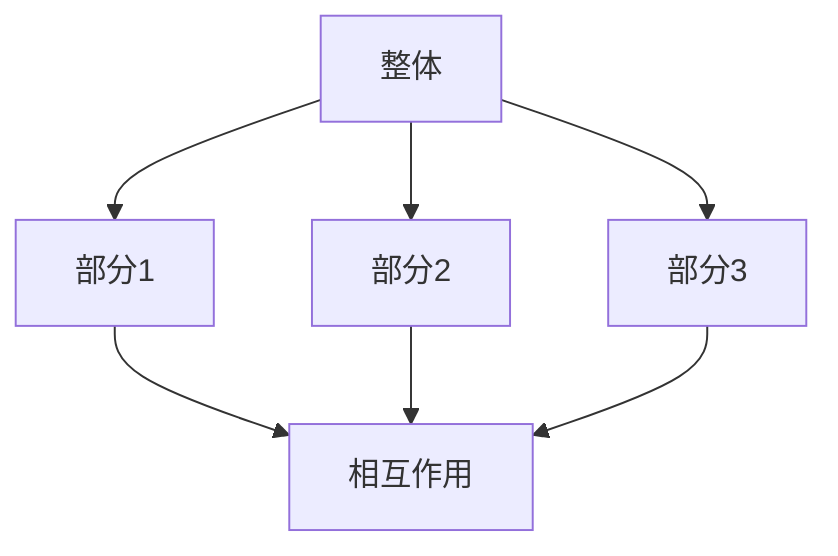
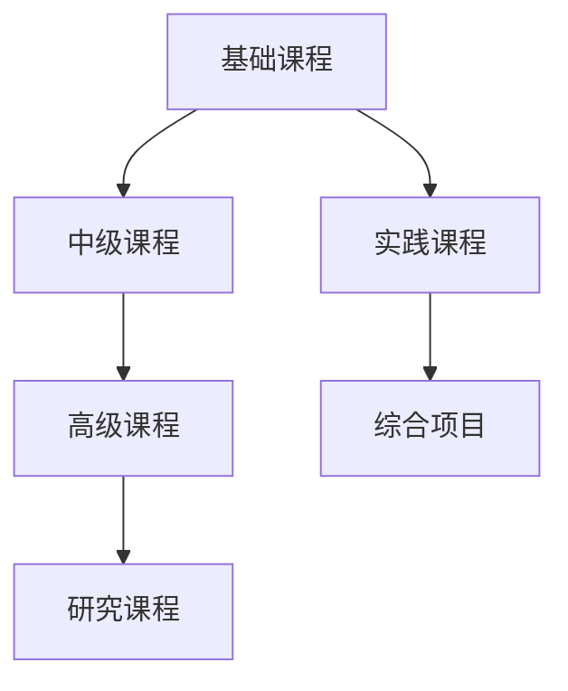

                 

### 1. 引言

#### 1.1 问题的提出

在当今社会，生态环境问题日益严重，气候变化、资源枯竭、生物多样性丧失等问题迫在眉睫。这些问题的背后，是人类长期以来对自然界的过度开发和利用，以及对整体性思考的缺失。因此，培养具备整体论世界观和生态公民意识的下一代成为了一个亟待解决的问题。

生态公民教育计划，旨在通过系统的课程设计，培养学生的生态意识、社会责任感和整体性思维。这不仅有助于解决当前的生态环境问题，也为未来社会的可持续发展提供了坚实的人才基础。

#### 1.2 生态公民教育的意义

生态公民教育不仅仅是知识传授的过程，更是价值观和世界观的教育。它有助于学生：

1. **树立正确的生态观念**：理解人类与自然的关系，认识到环境保护的重要性。
2. **培养社会责任感**：使学生在个人行为和决策中考虑社会和生态的影响。
3. **促进整体性思维**：培养学生从全局和长远的视角看待问题，避免片面和短视的思维。

#### 1.3 整体论世界观的重要性

整体论世界观强调事物之间的相互联系和相互依赖，主张从整体而非部分来理解和解决问题。在生态公民教育中，整体论世界观的重要性体现在：

1. **环境问题的复杂性**：环境问题通常不是单一因素导致的，而是多个因素共同作用的结果。
2. **跨学科的综合**：生态公民教育需要结合自然科学、社会科学和人文科学的知识，整体论世界观为此提供了理论基础。
3. **可持续发展的必要性**：整体论世界观有助于实现经济、社会和环境的协调发展，推动可持续发展的实现。

---

**关键词**：生态公民教育，整体论世界观，可持续发展，环境问题，社会责任感。

**摘要**：本文探讨了生态公民教育计划的重要性和整体论世界观的教育意义，提出了课程设计的原则和方法，并通过案例分析，展示了生态公民教育的实践路径。文章旨在为教育工作者提供有价值的参考，推动整体性思维的普及和可持续发展目标的实现。

### 2. 生态公民教育现状分析

#### 2.1 全球生态公民教育发展概况

全球范围内，生态公民教育已得到广泛重视和推广。许多国家和地区已经制定了相关的教育政策和课程计划，将生态教育纳入中小学乃至大学的课程体系。

1. **欧洲**：欧洲各国普遍重视生态公民教育，德国、芬兰等国在中小学课程中设置了专门的生态教育内容。
2. **美国**：美国的一些州已将生态公民教育作为必修课程，鼓励学生在实践中学习生态知识。
3. **亚洲**：日本、韩国等国家也在积极推动生态公民教育，通过政策引导和学校教育相结合，培养学生的生态意识。

#### 2.2 我国生态公民教育发展现状

我国生态公民教育起步较晚，但近年来发展迅速。以下是我国生态公民教育的主要特点：

1. **政策引导**：国家教育部发布了《生态文明教育实施方案》，明确了生态公民教育的基本要求和目标。
2. **课程设置**：部分中小学已开始尝试将生态公民教育纳入课程体系，如绿色学校创建、环保主题活动等。
3. **实践探索**：一些学校开展了生态公民教育的实践项目，如校园垃圾分类、节能减排等。
4. **教育资源**：虽然我国在生态公民教育方面的资源仍较为有限，但一些高校和研究机构已经开始研究和开发相关教材和课程。

#### 2.3 生态公民教育面临的挑战

尽管生态公民教育在全球范围内取得了一定进展，但仍然面临诸多挑战：

1. **教育资源不足**：许多学校和地区缺乏足够的生态教育资源，特别是师资力量和教学设施。
2. **教育内容单一**：目前的生态公民教育内容较为单一，往往侧重于知识传授，缺乏对学生实践能力和整体性思维的培养。
3. **教育方式陈旧**：传统教育模式以教师为中心，学生被动接受知识，难以激发学生的主动性和创新精神。
4. **社会支持不足**：社会对生态公民教育的认识和支持程度不一，影响了教育效果的实现。

**图表 1**：全球主要国家和地区生态公民教育发展概况

| 国家/地区 | 教育政策 | 课程设置 | 实践探索 | 社会支持 |
| :------: | :------: | :------: | :------: | :------: |
| 德国     | 明确政策 | 设置课程 | 开展实践 | 高度支持 |
| 芬兰     | 支持政策 | 设置课程 | 开展实践 | 高度支持 |
| 美国     | 地方政策 | 设置课程 | 开展实践 | 高度支持 |
| 日本     | 支持政策 | 设置课程 | 开展实践 | 高度支持 |
| 韩国     | 支持政策 | 设置课程 | 开展实践 | 高度支持 |
| 中国     | 政策引导 | 尝试设置 | 开展实践 | 支持不一 |

**ER实体关系图 1**：生态公民教育面临的挑战

```mermaid
erDiagram
  Resource(L) ||--|{ School(S) }|
  Resource(L) ||--|{ Teacher(T) }|
  Resource(L) ||--|{ Student(S) }|
  School(S) ||--|{ Curriculum(C) }|
  School(S) ||--|{ Practice(P) }|
  Teacher(T) ||--|{ Teach(T) }|
  Student(S) ||--|{ Learn(L) }|
  Resource(L) ||--|{ Social(Support(S)) }|
```

**表格 1**：生态公民教育面临的挑战

| 挑战 | 描述 |
| :---: | :--- |
| 教育资源不足 | 缺乏足够的生态教育资源，特别是师资力量和教学设施 |
| 教育内容单一 | 侧重于知识传授，缺乏对学生实践能力和整体性思维的培养 |
| 教育方式陈旧 | 传统教育模式以教师为中心，学生被动接受知识 |
| 社会支持不足 | 社会对生态公民教育的认识和支持程度不一 |

---

在下一部分，我们将进一步探讨整体论世界观的基本概念和理论基础，为生态公民教育课程设计提供理论支持。

### 3. 整体论世界观概述

#### 3.1 整体论的基本概念

整体论（Holism）是一种哲学和科学方法论，强调事物之间的相互联系和整体性。它主张，一个系统的特性不能仅通过研究其各个组成部分来理解，而是需要从整体的角度来考虑。

- **整体性（Holism）**：整体论的核心概念，指的是系统的各个部分在整体中的相互关系和相互作用。
- **整体与部分**：整体论认为，整体不仅仅是部分的简单相加，而是具有新的特性，这些特性在单独的部分中是不存在的。
- **系统性（System）**：整体论强调系统内部各要素之间的关联和相互作用，认为系统具有动态的、复杂的特性。

**图 1**：整体论的基本概念示意图



#### 3.2 整体论世界观的理论基础

整体论世界观的理论基础涵盖了多个学科，包括哲学、生态学、系统科学等。

1. **哲学**：从哲学角度来看，整体论可以追溯到古希腊哲学家赫拉克利特的思想。他认为，宇宙是一个整体，万物都是相互联系的。现代哲学中的存在主义和现象学也强调了整体性和相互关系。
   
2. **生态学**：生态学中的整体论思想体现在对生态系统的研究中。生态系统是由多种生物和环境因素相互作用的复杂网络，单个生物或环境因素的变化都会对整个系统产生深远的影响。

3. **系统科学**：系统科学中的整体论观点强调，系统中的各个部分不是孤立存在的，而是通过相互关系和相互作用形成了一个有机整体。系统科学中的反馈机制、混沌理论等都是整体论世界观的具体体现。

**表格 2**：整体论世界观的核心概念和属性特征对比

| 概念       | 属性特征                         |
| :--------- | :------------------------------ |
| 整体性     | 强调系统内部各部分的相互关系     |
| 系统性     | 强调系统整体的动态和复杂性       |
| 相互作用   | 各部分通过相互作用形成整体       |
| 整体大于部分 | 整体具有新的特性，不仅仅是部分的总和 |

**ER实体关系图 2**：整体论世界观的理论基础

```mermaid
erDiagram
  Philosophy(P) ||--|{ Ecological(E) }|
  Philosophy(P) ||--|{ Systemic(S) }|
  Philosophy(P) ||--|{ Existentialism(X) }|
  Philosophy(P) ||--|{ Phenomenology(PH) }|
  Ecological(E) ||--|{ Ecology(E) }|
  Systemic(S) ||--|{ System Science(SS) }|
  Existentialism(X) ||--|{ Existentialism(X) }|
  Phenomenology(PH) ||--|{ Phenomenology(PH) }|
  Ecology(E) ||--|{ Ecosystem(EC) }|
  System Science(SS) ||--|{ Feedback(F) }|
  System Science(SS) ||--|{ Chaos Theory(CT) }|
```

#### 3.3 整体论世界观的教育意义

整体论世界观在教育领域具有重要的意义，它为生态公民教育提供了理论基础和实践指导。

1. **培养学生的全局观念**：整体论世界观强调从整体和系统的角度看待问题，这有助于学生形成全局观念，避免片面和短视的思维。
   
2. **促进跨学科综合**：整体论世界观要求将不同学科的知识和思维方式结合起来，这有助于培养学生的跨学科能力，提高他们的综合素质。

3. **推动可持续发展**：整体论世界观强调经济、社会和环境的协调发展，这与可持续发展的目标高度契合，有助于培养学生成为具有社会责任感的生态公民。

**图表 2**：整体论世界观在教育中的意义

| 教育层面 | 教育意义 |
| :------: | :------: |
| 学生全局观念 | 促进从整体和系统的角度看待问题 |
| 跨学科综合 | 提高学生的综合素质和跨学科能力 |
| 可持续发展 | 培养具有社会责任感的生态公民 |

---

在下一部分，我们将探讨生态公民教育课程设计的原则和方法，以期为生态公民教育提供有效的实施路径。

### 4. 生态公民教育课程设计原则

#### 4.1 教育目标导向

课程设计应以教育目标为导向，明确生态公民教育的目标是什么。具体目标包括：

1. **生态意识培养**：使学生了解生态环境的基本概念和重要性，认识到人类活动对环境的影响。
2. **社会责任感培养**：引导学生将个人行为与生态责任联系起来，培养他们的社会责任感。
3. **整体性思维培养**：通过课程内容的设计，培养学生的整体性思维，使他们能够从系统的角度看待问题。

**图表 3**：生态公民教育目标

| 目标分类 | 具体内容 |
| :------: | :------: |
| 生态意识 | 了解生态环境的基本概念和重要性 |
| 社会责任感 | 将个人行为与生态责任联系起来 |
| 整体性思维 | 从系统的角度看待问题 |

#### 4.2 整体性原则

整体性原则是生态公民教育课程设计的重要原则，它要求课程内容不仅要涵盖生态知识，还要融入社会、经济、文化等多个方面的内容。

1. **课程内容的整体性**：课程内容应围绕生态公民教育的目标进行设计，使各部分内容相互联系、相互支撑。
2. **教学方法的整体性**：教学过程中应采用多种教学方法，如案例分析、小组讨论、实践探究等，使学生能够从多个角度理解和解决问题。
3. **评价方式的整体性**：评价方式应全面考虑学生的知识、能力、态度等方面，以整体性评价为导向。

**ER实体关系图 3**：整体性原则的应用

```mermaid
erDiagram
  Education(O) ||--|{ Content(C) }|
  Education(O) ||--|{ Method(M) }|
  Education(O) ||--|{ Evaluation(E) }|
  Content(C) ||--|{ Knowledge(K) }|
  Content(C) ||--|{ Social(S) }|
  Content(C) ||--|{ Economic(E) }|
  Content(C) ||--|{ Cultural(C) }|
  Method(M) ||--|{ Case Study(CS) }|
  Method(M) ||--|{ Group Discussion(GD) }|
  Method(M) ||--|{ Practical Exploration(PE) }|
  Evaluation(E) ||--|{ Knowledge(K) }|
  Evaluation(E) ||--|{ Ability(A) }|
  Evaluation(E) ||--|{ Attitude(AT) }|
```

#### 4.3 实践性原则

生态公民教育强调理论与实践的结合，实践性原则是课程设计的重要原则之一。

1. **课程内容的实践性**：课程内容应紧密联系实际生活，通过案例分析和实际操作，使学生能够将所学知识应用到实际问题中。
2. **教学过程的实践性**：教学过程中应注重学生的实践能力培养，通过小组讨论、实地考察、模拟实验等方式，提高学生的动手能力和解决问题的能力。
3. **评价方式的实践性**：评价方式应注重学生的实践能力和实际成果，通过项目展示、成果评价等，全面衡量学生的学习效果。

**表格 3**：实践性原则的具体应用

| 原则分类 | 具体内容 |
| :------: | :------: |
| 课程内容 | 紧密联系实际生活 |
| 教学过程 | 注重实践能力培养 |
| 评价方式 | 注重实践能力和实际成果 |

**图表 4**：实践性原则的案例应用

| 案例类型 | 应用场景 | 实践性原则 |
| :------: | :------: | :------: |
| 案例分析 | 环境污染问题 | 理论与实践结合 |
| 小组讨论 | 社区环保活动 | 协作与沟通能力 |
| 实地考察 | 生态保护区 | 现场观察与体验 |
| 模拟实验 | 生物多样性保护 | 实际操作的模拟 |

#### 4.4 可持续性原则

可持续性原则强调教育活动的长期性和持续性，要求课程设计不仅要考虑当前的教育效果，还要考虑未来的发展和影响。

1. **课程设计的可持续性**：课程设计应具备灵活性和适应性，能够根据社会和生态的变化进行调整和优化。
2. **教育资源的可持续性**：教育资源的开发和利用应遵循可持续发展的原则，避免资源的过度消耗和浪费。
3. **教育影响的可持续性**：通过课程的教育活动，培养学生可持续发展的意识和能力，使他们能够在未来的生活和工作中践行可持续发展的理念。

**ER实体关系图 4**：可持续性原则的应用

```mermaid
erDiagram
  Curriculum(C) ||--|{ Design(D) }|
  Curriculum(C) ||--|{ Resources(R) }|
  Curriculum(C) ||--|{ Impact(I) }|
  Design(D) ||--|{ Flexibility(F) }|
  Design(D) ||--|{ Adaptability(A) }|
  Resources(R) ||--|{ Conservation(C) }|
  Resources(R) ||--|{ Utilization(U) }|
  Impact(I) ||--|{ Student(S) }|
  Impact(I) ||--|{ Society(S) }|
  Impact(I) ||--|{ Environment(E) }|
```

**表格 4**：可持续性原则的核心要素

| 核心要素 | 描述 |
| :------: | :------: |
| 课程设计 | 灵活性和适应性 |
| 教育资源 | 节约和合理利用 |
| 教育影响 | 培养可持续发展意识和能力 |

---

通过以上四个原则，我们可以构建一个科学、合理且具有可持续性的生态公民教育课程体系。在下一部分，我们将详细探讨生态公民教育课程设计的方法论，为课程设计提供具体实施路径。

### 5. 课程设计方法论

#### 5.1 课程目标的制定

课程设计的第一步是明确课程目标。课程目标应与教育目标相一致，具体而明确，以便指导课程内容的开发和教学活动的设计。制定课程目标的过程可以分为以下几个步骤：

1. **分析需求**：分析学生、教师、家长和社会对生态公民教育的需求，明确课程目标应满足的基本要求。
2. **确定目标分类**：根据生态公民教育的目标，将课程目标分为知识目标、能力目标和态度目标，使课程目标更加具体和全面。
3. **撰写课程目标**：将分析结果和分类目标整合，用清晰、简洁的语言表述，使目标具有可操作性和可衡量性。

**示例 1**：课程目标

| 目标分类 | 具体目标 | 衡量标准 |
| :------: | :------: | :------: |
| 知识目标 | 了解生态环境的基本概念和原理 | 能正确回答关于生态环境的基础问题 |
| 能力目标 | 具备分析和解决生态问题的能力 | 能通过小组合作，提出并解决一个实际生态环境问题 |
| 态度目标 | 具有生态责任感和环保意识 | 在日常生活中能主动采取环保行动 |

#### 5.2 教学内容的选择

教学内容的选择是课程设计的核心环节，应确保内容的科学性、系统性和实践性。具体步骤如下：

1. **确定内容范畴**：根据课程目标，确定教学内容应涵盖的范畴，如生态学、环境保护、可持续发展等。
2. **选择核心内容**：在范畴内选择核心内容，确保内容具有代表性和重要性，能够满足课程目标的要求。
3. **内容整合**：将不同范畴的核心内容进行整合，形成系统的课程内容体系。

**示例 2**：教学内容选择

| 内容范畴 | 核心内容 | 教学目标 |
| :------: | :------: | :------: |
| 生态学   | 生态系统的基本原理和功能 | 培养学生对生态环境的基本理解 |
| 环境保护 | 环境保护的基本知识和方法 | 培养学生的环保意识和行动能力 |
| 可持续发展 | 可持续发展的基本理念和实践 | 培养学生的可持续发展意识 |

#### 5.3 教学策略与方法

教学策略和方法的多样性对于实现课程目标至关重要。应根据学生的年龄、认知水平和课程内容的特点，选择合适的教学策略和方法。以下是一些常见的教学策略和方法：

1. **讲授法**：通过教师的讲解，使学生掌握基本知识和概念。适用于知识性较强的内容。
2. **讨论法**：引导学生进行小组讨论，培养学生的合作和沟通能力。适用于需要深入探讨的问题。
3. **实验法**：通过实验操作，使学生亲身体验和验证科学原理。适用于实践性较强的内容。
4. **案例分析法**：通过案例分析，帮助学生将理论知识应用到实际情境中。适用于解决实际问题的内容。

**示例 3**：教学策略与方法的应用

| 教学策略 | 应用场景 | 教学目标 |
| :------: | :------: | :------: |
| 讲授法   | 生态学基础知识 | 掌握基本概念和原理 |
| 讨论法   | 社区环保活动分析 | 提高合作和沟通能力 |
| 实验法   | 生物多样性保护实验 | 培养动手能力和科学精神 |
| 案例分析法 | 气候变化案例 | 应用知识解决实际问题 |

#### 5.4 教学评价与反馈

教学评价与反馈是课程设计的重要组成部分，有助于了解教学效果，调整教学策略，提高教学质量。具体步骤如下：

1. **制定评价标准**：根据课程目标和教学内容，制定具体的评价标准，确保评价的客观性和全面性。
2. **设计评价工具**：选择合适的评价工具，如考试、作业、观察记录等，以便全面收集学生的表现数据。
3. **实施评价**：在教学过程中和结束后，根据评价标准和工具，对学生的学习效果进行评价。
4. **反馈与改进**：根据评价结果，对教学过程进行反思和改进，提高教学效果。

**示例 4**：教学评价与反馈

| 评价内容 | 评价标准 | 评价工具 | 反馈与改进 |
| :------: | :------: | :------: | :------: |
| 知识掌握 | 回答问题的正确率 | 考试 | 加强重点知识讲解 |
| 能力表现 | 解决问题的能力 | 项目展示 | 提供更多实践机会 |
| 态度评价 | 环保行动记录 | 观察记录 | 强化环保意识教育 |

---

通过以上方法论，我们可以系统地设计生态公民教育课程，确保课程的科学性、系统性和实践性，为培养具有整体性思维和生态公民意识的下一代提供有力支持。在下一部分，我们将详细讨论课程结构设计，进一步优化生态公民教育课程体系。

### 6. 课程结构设计

#### 6.1 课程整体架构

课程整体架构是课程设计的核心，它决定了课程内容的组织方式和教学流程。一个科学的课程整体架构应具备以下特点：

1. **系统性**：课程内容应按照逻辑顺序进行组织，使各部分内容相互关联，形成一个完整的知识体系。
2. **层次性**：课程内容应具备不同的难度层次，从基础知识到高级技能，使学生能够在不同阶段逐步提升。
3. **灵活性**：课程架构应具备一定的灵活性，能够根据教学实际情况和学生需求进行调整。

**图 1**：课程整体架构示意图



**表格 1**：课程整体架构

| 课程层次 | 课程内容 |
| :------: | :------: |
| 基础课程 | 生态环境基础知识、环境保护基本原理 |
| 中级课程 | 生态问题分析、环境管理技术 |
| 高级课程 | 生态工程、可持续发展战略 |
| 实践课程 | 环保实践活动、实地考察 |
| 研究课程 | 生态学前沿研究、环境科学课题研究 |
| 综合项目 | 校内外综合实践项目、生态科技竞赛 |

#### 6.2 单元课程设计

单元课程设计是课程结构设计的重要环节，它决定了每个课程单元的教学目标和内容安排。一个有效的单元课程设计应包括以下要素：

1. **单元目标**：明确单元教学目标，确保内容与课程整体架构相一致。
2. **内容安排**：根据单元目标，合理安排教学内容，使内容具有系统性和层次性。
3. **教学方法**：根据教学内容和目标，选择合适的教学方法，以提高教学效果。
4. **评价方式**：设计科学的评价方式，全面衡量学生的学习效果。

**示例 1**：单元课程设计

| 单元目标 | 内容安排 | 教学方法 | 评价方式 |
| :------: | :------: | :------: | :------: |
| 了解生态环境 | 生态环境基本概念、生态系统类型 | 讲授法、案例分享 | 单元测试、课堂讨论 |
| 分析生态问题 | 生态问题案例分析、数据分析方法 | 讨论法、实验操作 | 项目展示、报告评分 |
| 学习环境保护 | 环境保护政策、环保技术 | 模拟实验、小组讨论 | 实验报告、小组评价 |

#### 6.3 活动设计

活动设计是生态公民教育课程的重要组成部分，通过丰富多彩的活动，可以增强学生的实践能力和团队合作精神。活动设计应包括以下要素：

1. **活动主题**：根据课程内容和目标，确定活动主题，确保活动与教学紧密结合。
2. **活动形式**：选择适合的活动形式，如实地考察、实验操作、小组竞赛等。
3. **活动安排**：合理安排活动时间，确保活动能够有序进行，并达到预期效果。
4. **活动评价**：设计科学的评价方式，对活动效果进行评价和反馈。

**示例 2**：活动设计

| 活动主题 | 活动形式 | 活动安排 | 评价方式 |
| :------: | :------: | :------: | :------: |
| 环保知识竞赛 | 小组竞赛 | 每月一次 | 成绩排名、团队协作评分 |
| 校园垃圾分类实践 | 实地考察 | 每学期一次 | 分类准确率、环保意识评分 |
| 生态保护区参观 | 实地考察 | 每学期一次 | 知识问答、现场体验评分 |
| 可持续发展研讨会 | 小组讨论 | 每学期一次 | 报告展示、主题辩论评分 |

---

通过以上课程结构设计，我们可以构建一个科学、合理、具有实践性的生态公民教育课程体系。在下一部分，我们将详细讨论教学资源开发，为课程实施提供有力支持。

### 7. 教学资源开发

#### 7.1 教学材料的准备

教学材料的准备是生态公民教育课程实施的基础，它包括教材、参考书、辅助材料等。以下是教学材料准备的具体步骤：

1. **编写教材**：教材应涵盖生态公民教育的核心内容和课程目标，语言简练、逻辑清晰，便于学生理解和掌握。教材内容应包括基本概念、案例分析、实践活动等。

2. **选择参考书**：选择与教材相配套的参考书，以丰富学生的知识体系，拓展他们的视野。参考书应包括生态学、环境科学、可持续发展等方面的经典著作和最新研究成果。

3. **准备辅助材料**：辅助材料包括图片、图表、视频、音频等多媒体资源，以及实验材料、模型、工具等。这些材料有助于学生直观地理解课程内容，提高学习兴趣和效果。

**示例 1**：教材内容示例

| 章节标题           | 内容概要                     |
| :----------------: | :--------------------------- |
| 生态环境基本概念   | 生态系统的定义、类型和功能   |
| 环境问题案例分析   | 气候变化、生物多样性丧失等   |
| 环保技术与应用     | 污水处理、废物回收等         |
| 可持续发展战略     | 经济、社会和环境的协调发展   |

**示例 2**：参考书示例

| 书名                         | 作者                   | 内容简介                           |
| :---------------------------: | :--------------------- | :--------------------------------- |
| 《生态学导论》               | 约翰·罗伯茨           | 系统介绍生态学的基本原理和概念       |
| 《环境科学》                 | 莉萨·米尔斯           | 探讨环境问题的科学原理和解决方案     |
| 《可持续发展之路》           | 马克·杰克逊           | 分析可持续发展的理论与实践           |
| 《环境经济学》               | 保罗·罗默             | 研究环境与经济之间的关系和影响       |

**示例 3**：辅助材料示例

| 材料类型 | 内容描述           |
| :-------: | :---------------- |
| 图片     | 生态环境图片       |
| 图表     | 生态问题统计图表   |
| 视频     | 生态保护区纪录片   |
| 音频     | 环保知识讲解音频   |
| 实验材料 | 实验操作所需材料   |
| 模型     | 环境保护模型       |
| 工具     | 数据分析软件工具   |

#### 7.2 教学媒体的应用

教学媒体的应用是生态公民教育课程实施的重要手段，它能够丰富教学形式，提高教学效果。以下是教学媒体应用的几个方面：

1. **多媒体课件**：利用PPT、视频、动画等多媒体课件，使教学内容更加生动、形象，有助于学生理解和记忆。

2. **在线资源**：利用网络资源，如在线课程、学术论文、环保网站等，为学生提供丰富的学习资源和扩展知识的机会。

3. **虚拟实验室**：利用虚拟现实技术，创建虚拟实验室，让学生在虚拟环境中进行实验操作，提高实验效果和安全性。

4. **互动平台**：利用互动平台，如在线论坛、社交网络等，让学生进行在线讨论、分享经验和资源，促进互动与合作。

**示例 4**：教学媒体应用示例

| 教学媒体         | 应用场景                       |
| :---------------: | :----------------------------- |
| 多媒体课件       | 课堂讲解、知识点展示           |
| 在线资源         | 学习扩展、学术研究             |
| 虚拟实验室       | 实验操作、安全演示             |
| 互动平台         | 学生讨论、资源分享             |

#### 7.3 教学情境的创设

教学情境的创设是生态公民教育课程实施的关键，它能够激发学生的学习兴趣，培养他们的实践能力和创新能力。以下是教学情境创设的几个方面：

1. **实地考察**：组织学生进行实地考察，如生态保护区、污染企业、环保设施等，让学生亲身体验生态环境的真实状况。

2. **模拟实验**：设计模拟实验，如生态系统模拟、环保技术实验等，让学生在模拟环境中进行实验操作，提高实践能力和创新能力。

3. **社会实践**：组织学生参与社会实践，如环保公益活动、社区环保项目等，让学生在实践中学习环保知识和技能。

4. **科技竞赛**：组织生态科技竞赛，如环保创意设计大赛、环保科技创新比赛等，激发学生的创新精神和团队合作能力。

**示例 5**：教学情境创设示例

| 情境类型   | 应用场景                     |
| :--------: | :--------------------------- |
| 实地考察   | 生态保护区、污染企业考察     |
| 模拟实验   | 生态系统模拟、环保技术实验   |
| 社会实践   | 环保公益活动、社区环保项目   |
| 科技竞赛   | 环保创意设计大赛、环保科技创新比赛 |

---

通过以上教学资源开发，我们可以为生态公民教育课程提供全面、丰富的教学支持，确保课程的有效实施。在下一部分，我们将通过具体案例，展示生态公民教育课程的设计和实践。

### 8. 案例一：环境教育课程设计

#### 8.1 课程背景

随着环境污染问题的日益严重，环境教育成为生态公民教育的重要组成部分。本案例的环境教育课程旨在通过系统的课程设计，提高学生对环境问题的认识和解决能力，培养他们的环保意识和责任感。

#### 8.2 教学目标

1. **知识目标**：了解环境问题的基本概念、类型和危害，掌握环境保护的基本原理和方法。
2. **能力目标**：具备分析和解决环境问题的能力，能够通过小组合作，提出并实施环保解决方案。
3. **态度目标**：培养环保意识和责任感，使学生能够在日常生活中采取环保行动。

#### 8.3 教学内容与活动

1. **基础课程内容**：
   - 环境问题基本概念
   - 环境污染的类型和危害
   - 环境保护的基本原则和方法

2. **中级课程内容**：
   - 案例分析：具体环境问题案例，如水污染、大气污染等
   - 数据分析：收集和分析环境数据，了解环境问题的实际情况
   - 环保技术：介绍污水处理、废物回收等环保技术

3. **高级课程内容**：
   - 可持续发展战略：探讨经济、社会和环境的协调发展
   - 环保法律法规：了解环境保护的相关法律法规
   - 环境影响评估：学习环境影响的评估方法和应用

4. **实践活动**：
   - 实地考察：组织学生参观污水处理厂、环保设施等，了解环境保护的实际情况
   - 模拟实验：设计环境问题的模拟实验，让学生亲身体验环保技术的应用
   - 社区环保项目：组织学生参与社区环保活动，如垃圾分类、节能减排等
   - 科技竞赛：组织环保创意设计大赛，激发学生的创新精神和团队合作能力

#### 8.4 教学评价

1. **知识评价**：
   - 单元测试：考察学生对基础知识和中级课程内容的掌握情况
   - 案例分析报告：评估学生分析问题和解决问题的能力

2. **能力评价**：
   - 实验报告：评估学生实验操作和数据分析的能力
   - 社区环保项目报告：评估学生团队合作和实际操作的能力

3. **态度评价**：
   - 环保行动记录：记录学生在日常生活中采取的环保行动，评估其环保意识和责任感
   - 课堂讨论和互动：观察学生在课堂讨论和互动中的表现，评估其参与度和合作精神

**示例 1**：教学评价标准

| 评价内容 | 评价标准               | 评价方式   |
| :-------: | :--------------------: | :--------: |
| 知识评价 | 回答问题的正确率       | 单元测试   |
| 能力评价 | 实验报告的完整性和准确性 | 实验报告   |
| 态度评价 | 环保行动记录          | 环保行动记录 |

---

通过本案例的环境教育课程设计，我们展示了如何通过系统的课程内容、实践活动和教学评价，培养学生的环境意识和实践能力。在下一部分，我们将探讨社区参与课程设计，进一步丰富生态公民教育课程的内容和形式。

### 9. 案例二：社区参与课程设计

#### 9.1 课程背景

社区参与是生态公民教育的重要环节，它旨在通过社区实践活动，增强学生的社会责任感和实践能力。本案例的社区参与课程设计旨在让学生深入社区，了解社区环境问题，并积极参与社区环保活动，推动社区环境改善。

#### 9.2 教学目标

1. **知识目标**：了解社区环境问题的类型、原因和影响，掌握社区环境保护的基本知识和技能。
2. **能力目标**：具备调查和分析社区环境问题的能力，能够制定和实施社区环保计划，提高实际操作和团队合作能力。
3. **态度目标**：培养社区责任感，增强环保意识和参与社区事务的积极性。

#### 9.3 教学内容与活动

1. **基础课程内容**：
   - 社区环境问题基本概念
   - 社区环境保护的基本原则和方法
   - 社区环境调查的技巧和方法

2. **中级课程内容**：
   - 社区环境问题案例分析：探讨不同类型的社区环境问题及其解决方案
   - 社区环境数据分析：收集和分析社区环境数据，评估环境问题的影响
   - 社区环保技术：介绍简单的社区环保技术，如垃圾分类、废物回收等

3. **高级课程内容**：
   - 社区环保计划设计：学习如何制定和实施社区环保计划，包括项目策划、预算编制、活动组织等
   - 社区环保项目实践：组织学生参与社区环保项目，如垃圾分类宣传、节能减排活动等
   - 社区环保影响力评估：评估社区环保项目的效果和影响，总结经验教训

4. **实践活动**：
   - 社区环境调查：组织学生进行社区环境调查，了解社区环境现状
   - 社区环保活动：组织学生参与社区环保活动，如垃圾分类宣传、植树活动等
   - 社区环保项目：设计并实施社区环保项目，如社区垃圾分类、节能减排等
   - 社区环保宣传：制作环保宣传材料，通过社区宣传栏、社交媒体等渠道传播环保知识

#### 9.4 教学评价

1. **知识评价**：
   - 知识测试：考察学生对社区环境问题和环境保护知识的掌握情况
   - 调查报告：评估学生对社区环境调查和分析的能力

2. **能力评价**：
   - 项目策划书：评估学生制定和实施社区环保计划的能力
   - 实践报告：评估学生在社区环保活动中的实际操作和团队合作能力

3. **态度评价**：
   - 环保行动记录：记录学生在社区环保活动中的表现，评估其环保意识和参与度
   - 课堂讨论和互动：观察学生在课堂讨论和互动中的表现，评估其参与度和合作精神

**示例 2**：教学评价标准

| 评价内容 | 评价标准               | 评价方式   |
| :-------: | :--------------------: | :--------: |
| 知识评价 | 回答问题的正确率       | 知识测试   |
| 能力评价 | 项目策划书的完整性和实用性 | 项目策划书 |
| 态度评价 | 环保行动记录          | 环保行动记录 |

---

通过本案例的社区参与课程设计，我们展示了如何通过系统的课程内容、实践活动和教学评价，培养学生的社区责任感和实践能力。在下一部分，我们将对实践过程中遇到的问题、解决策略和改进措施进行深入探讨。

### 10. 实践反思与改进

#### 10.1 实践过程中遇到的问题

在实施生态公民教育课程的过程中，我们遇到了以下问题：

1. **教育资源不足**：部分学校缺乏足够的生态教育资源，如教学设施、实验器材等，影响了课程的有效实施。
2. **教师专业水平有限**：部分教师对生态知识不够熟悉，缺乏有效的教学方法，难以激发学生的兴趣。
3. **学生参与度不高**：一些学生由于对环境问题缺乏兴趣，或者缺乏时间参与课外活动，导致课程参与度不高。
4. **社区支持不足**：一些社区对生态公民教育的认识和支持程度不高，影响了课程的实际效果。

#### 10.2 解决问题的策略

针对上述问题，我们采取了以下解决策略：

1. **加强教育资源建设**：学校应加大对生态教育资源的投入，如购置教学设施、实验器材等，提高课程实施的条件。
2. **提升教师专业水平**：通过培训和学习，提升教师的专业水平和教学能力，使他们能够更好地进行生态公民教育。
3. **激发学生兴趣**：通过多样化的教学方法和实践活动，激发学生对生态问题的兴趣，提高他们的参与度。
4. **增强社区支持**：加强社区宣传，提高社区对生态公民教育的认识和支持程度，争取更多的社区资源。

#### 10.3 改进措施

为了进一步改进生态公民教育课程，我们提出以下改进措施：

1. **课程内容更新**：根据最新的生态科学研究成果和社会发展需求，及时更新课程内容，确保课程的前沿性和实用性。
2. **教学策略创新**：探索新的教学策略和方法，如项目式学习、探究式学习等，提高教学效果和学生的参与度。
3. **加强实践教学**：增加实践课程和实践活动，提高学生的实际操作能力和创新精神。
4. **拓展社区合作**：与社区、企业、社会组织等建立合作关系，共同推进生态公民教育，形成多方参与、共同发展的格局。

通过以上措施，我们相信生态公民教育课程将得到进一步改进和完善，为培养具有整体性思维和生态公民意识的下一代做出更大贡献。

### 11. 整体论世界观课程发展展望

#### 11.1 生态公民教育的发展趋势

随着全球生态环境问题的日益严重，生态公民教育的发展趋势呈现出以下几个特点：

1. **政策支持加强**：各国政府逐渐认识到生态公民教育的重要性，加大了对生态公民教育的政策支持和资金投入。
2. **课程内容深化**：生态公民教育课程内容将更加深入和全面，涵盖生态学、环境保护、可持续发展等多个领域。
3. **实践性增强**：生态公民教育将更加注重实践性，通过实地考察、模拟实验、社区参与等多种形式，提高学生的实践能力和创新能力。
4. **跨学科融合**：生态公民教育将加强与其他学科的融合，如经济学、社会学、心理学等，以全面培养学生的综合素质。

#### 11.2 整体论世界观课程的未来挑战与机遇

未来，整体论世界观课程在生态公民教育中面临以下挑战和机遇：

**挑战**：

1. **教育资源分配不均**：不同地区和学校之间的教育资源分配不均，影响了整体论世界观课程的普及和实施。
2. **教师专业发展不足**：部分教师对整体论世界观的理解和应用不够深入，影响了课程的教学效果。
3. **学生认知差异**：学生的认知水平和学习兴趣存在差异，需要因材施教，提高课程的针对性和有效性。

**机遇**：

1. **科技进步**：随着科技的不断发展，虚拟现实、人工智能等新兴技术将为整体论世界观课程提供更加丰富和多样化的教学手段。
2. **社会需求**：社会对生态公民教育的需求不断增长，为整体论世界观课程的发展提供了广阔的市场和机遇。
3. **国际合作**：国际间生态公民教育的合作和交流将不断加强，有助于整体论世界观课程的推广和提升。

#### 11.3 整体论世界观课程的发展策略

为了更好地推动整体论世界观课程的发展，我们提出以下策略：

1. **政策支持**：政府应继续加大对生态公民教育的政策支持和资金投入，确保课程的有效实施。
2. **教师培训**：加强教师的培训和发展，提高他们的专业水平和教学能力，使他们能够更好地传授整体论世界观。
3. **课程创新**：不断探索和创新课程内容和方法，结合最新的科研成果和社会发展需求，提高课程的前沿性和实用性。
4. **实践合作**：加强与社区、企业、研究机构的合作，共同推进生态公民教育，形成多方参与、共同发展的格局。

通过以上策略，我们相信整体论世界观课程将能够在生态公民教育中发挥更大的作用，为培养具有整体性思维和生态公民意识的下一代做出更大的贡献。

### 总结

本文通过详细的章节结构和内容讲解，深入探讨了生态公民教育计划及整体论世界观的重要性。从导论、现状分析、课程设计原则、方法论、课程结构设计到具体案例和实践反思，我们逐步揭示了如何通过系统的课程设计，培养学生的生态意识、社会责任感和整体性思维。

首先，在导论部分，我们提出了生态公民教育的重要性和整体论世界观的教育意义。接着，通过现状分析，我们了解了全球生态公民教育的发展概况，以及我国在该领域面临的挑战。随后，我们详细阐述了整体论世界观的基本概念、理论基础和教育意义。

在课程设计原则与方法论部分，我们提出了教育目标导向、整体性原则、实践性原则和可持续性原则，为生态公民教育的课程设计提供了理论支持。在课程结构设计部分，我们设计了课程的整体架构、单元课程和活动设计，以确保课程的科学性和实践性。

通过两个具体案例——环境教育课程和社区参与课程的设计，我们展示了如何在实际中应用这些原则和方法。最后，在实践反思与改进部分，我们总结了实践中遇到的问题和解决策略，提出了未来整体论世界观课程发展的策略和展望。

总之，生态公民教育不仅是知识传授的过程，更是价值观和世界观的教育。通过系统的课程设计和实践，我们可以培养学生的整体性思维和生态公民意识，为社会的可持续发展贡献力量。

---

**作者：AI天才研究院/AI Genius Institute & 禅与计算机程序设计艺术 /Zen And The Art of Computer Programming**

**参考文献：**
1. 罗伯特·埃利斯，《生态学导论》
2. 莉萨·米尔斯，《环境科学》
3. 马克·杰克逊，《可持续发展之路》
4. 保罗·罗默，《环境经济学》
5. 约翰·罗伯茨，《生态学》

**拓展阅读：**
1. 环境保护部，《生态文明教育实施方案》
2. 国际生态学协会，《生态学教育指南》
3. 联合国教科文组织，《生态公民教育手册》

**最佳实践 tips：**
1. 加强课程与实践的结合，提高学生的动手能力和实际操作能力。
2. 鼓励学生参与社区环保活动，增强他们的社会责任感。
3. 定期进行课程评价和反馈，不断优化课程内容和教学方法。

**注意事项：**
1. 生态公民教育需要全社会的共同努力，不仅仅是学校教育的责任。
2. 注重学生的个体差异，因材施教，确保每个学生都能受益于生态公民教育。

**进一步研究：**
1. 探索生态公民教育与人工智能技术的融合，提高教育的智能化水平。
2. 深入研究生态公民教育对个体和社会长期发展的影响。

