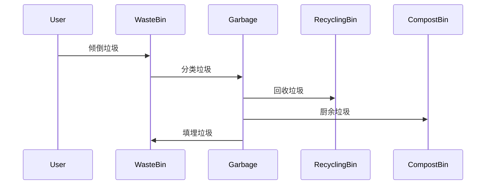
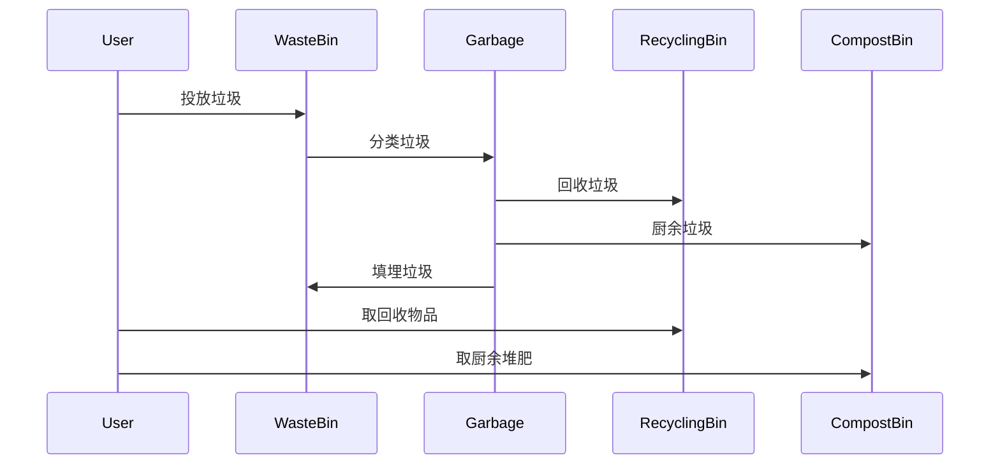

                 

### 文章标题

# 生态公民：将环保融入日常生活的意义与实践

> 关键词：生态公民、环保、日常生活、意义、实践

> 摘要：本文旨在探讨生态公民的概念及其在日常生活中的重要性。通过深入分析环保的现状、个人与社会的责任，以及具体的环保措施和实践，文章旨在为读者提供一套切实可行的环保指南，激励更多人成为生态公民，共同为地球的可持续发展贡献力量。

### 引言

在当今全球变暖、资源枯竭和生物多样性丧失的背景下，环境保护已成为不可忽视的重要议题。生态公民，即那些认识到自身行为对环境产生影响，并主动采取行动保护环境的个体，正成为社会的新典范。成为生态公民不仅是一种责任，更是一种生活方式的革新。本文将分章节深入探讨生态公民的概念、意义、实践路径，旨在为读者提供一套全面的环保指南。

#### 第1章：生态公民的概念与内涵

生态公民，顾名思义，是指那些具备环保意识、积极参与环境保护行动的个体。他们不仅关注个人的生活质量，更意识到自己的行为对地球生态系统的深远影响。生态公民的内涵不仅局限于环保行为，更是一种环保意识的体现，一种对社会责任的承担。

#### 第2章：生态公民的意义

2.1 环境挑战与个人责任

全球变暖、资源枯竭和生物多样性丧失等环境问题日益严重。作为生态公民，认识到这些挑战，并采取行动，是每个个体应尽的责任。

2.2 环保行为的效益

生态公民的行为不仅有助于保护环境，还能带来一系列社会和经济效益，如减少医疗开支、提高生活品质等。

#### 第3章：生态公民的实践路径

3.1 家庭环保

从日常生活中做起，如节能减排、垃圾分类、绿色消费等。

3.2 工作场所的环保

企业可以通过绿色办公、环保培训等措施，推动整个社会的环保进程。

3.3 社区和地方的环保行动

通过社区参与、环保项目等方式，共同为环境保护贡献力量。

#### 第4章：政策与倡导

4.1 环保政策

国家和地方政府应出台更加严格的环保政策，以推动社会的整体环保进程。

4.2 公众倡导

公众倡导是推动环保行为的重要手段，通过媒体、网络等途径，提高公众的环保意识。

#### 第5章：挑战与解决方案

5.1 环保难题

面对环保难题，需要个体和社会共同努力，寻找解决方案。

5.2 意识与行动

提高环保意识，采取具体行动，是解决环保问题的关键。

#### 第6章：未来展望

6.1 科技创新

科技的发展为环保提供了新的可能性，通过科技创新，可以实现更高效的环保。

6.2 全球合作

全球范围内的合作，是实现全球环保目标的重要途径。

#### 结论

成为生态公民，不仅是每个人的责任，更是对地球的承诺。让我们共同行动，为地球的可持续发展贡献力量。

### 关键词解释

- **生态公民**：具备环保意识、积极参与环境保护行动的个体。
- **环保**：保护环境，防止环境污染和生态破坏。
- **日常生活**：指个人在日常生活中所进行的一切活动。
- **意义**：生态公民行为对环境、社会和个人带来的积极影响。
- **实践**：具体实施环保行动，如节能减排、垃圾分类等。

通过上述引言，我们为后续章节的深入探讨奠定了基础。接下来，我们将逐一探讨生态公民的内涵、意义、实践路径以及未来展望，旨在为读者提供一套全面的环保指南。

### 背景介绍

#### 核心概念术语说明

1. **生态公民**：生态公民指的是那些具有强烈环保意识，积极参与并推动环境保护行动的个体。他们不仅仅是环境问题的关注者，更是环境保护的实践者。

2. **环境保护**：环境保护是指通过各种手段防止环境污染、资源浪费和生态破坏，从而维护生态系统的平衡与稳定。

3. **可持续发展**：可持续发展是指在不损害未来世代满足自身需求能力的前提下，满足当代人的需求。它强调经济发展、社会进步和环境保护的协调统一。

4. **环境挑战**：环境挑战包括全球变暖、气候变化、资源枯竭、生物多样性丧失等，这些挑战严重威胁着地球的生态系统和人类的生存环境。

#### 问题背景

当前，全球环境问题日益严重，气候变化、资源枯竭、生物多样性丧失等问题对地球生态系统和人类社会带来了巨大的威胁。根据联合国环境规划署的数据，全球平均气温自1900年以来已上升了约1.1摄氏度，且仍在不断上升。气候变化导致极端天气事件频繁发生，如暴雨、干旱、洪水等，给农业生产、水资源管理、公共卫生等领域带来了严重影响。

与此同时，资源的过度开发和浪费现象也十分普遍。例如，全球每年产生的垃圾中，仅有约14%被回收利用，其余则被填埋或焚烧。这不仅浪费了宝贵的资源，还造成了严重的环境污染。

此外，生物多样性丧失的问题也日益严重。据科学家估计，目前地球上的物种灭绝速度是自然灭绝速度的1000倍以上。生物多样性的丧失不仅破坏了生态系统的平衡，还可能导致新的疾病爆发和生态系统功能的丧失。

#### 问题描述

环境问题不仅影响到地球的生态系统，也对人类社会产生了深远的影响。例如，气候变化导致农业生产不稳定，粮食安全受到威胁；水资源污染导致饮用水安全得不到保障，公共健康受到威胁；生物多样性丧失导致生态系统的调节能力下降，自然灾害的发生频率和强度增加。

因此，解决环境问题已经成为全球范围内的紧迫任务。而生态公民的崛起，正是应对这一挑战的重要力量。他们通过改变自身的生活方式和消费习惯，积极参与环境保护行动，从而为地球的可持续发展贡献力量。

#### 问题解决

要解决环境问题，需要从多个层面进行努力：

1. **政策制定与执行**：政府应制定更加严格的环保政策，并确保政策得到有效执行。这包括提高碳排放标准、推行垃圾分类制度、限制资源过度开采等。

2. **公众参与**：公众的广泛参与是推动环境保护的重要动力。通过提高公众的环保意识，鼓励更多的人成为生态公民，从而实现全民参与环保的目标。

3. **科技创新**：科技的发展为环保提供了新的手段和可能性。通过研发和推广环保技术，如可再生能源、节能建筑、环保材料等，可以大幅减少环境污染和资源浪费。

4. **教育宣传**：教育是提高公众环保意识的重要途径。通过在学校和社区开展环保教育，培养公众的环保意识和责任感，从而推动环境保护的深入发展。

#### 边界与外延

生态公民的行为不仅局限于个人层面，还可以扩展到社区、企业、政府等不同层面。例如，在社区层面，可以通过组织环保志愿者活动、推动社区环保项目等方式，提高社区的环境质量；在企业层面，可以通过实施绿色办公、推行环保生产等措施，减少企业的环境负担；在政府层面，可以通过制定环保政策、加强环境监管等方式，推动社会的整体环保进程。

#### 概念结构与核心要素组成

生态公民的核心要素包括：

1. **环保意识**：认识到自身行为对环境的影响，并主动采取环保行动。
2. **环保行为**：包括节能减排、垃圾分类、绿色消费、环保志愿服务等。
3. **社会责任**：意识到环境保护是每个人的责任，积极参与到环保行动中。
4. **环保意识**：环保意识是生态公民行为的基础，它包括对环保知识、环保法律法规的了解，以及对环保行为的认同和践行。

通过上述背景介绍，我们为后续章节的深入探讨提供了必要的理论基础。在接下来的章节中，我们将进一步探讨生态公民的意义、实践路径以及未来展望，旨在为读者提供一套全面的环保指南。

#### 核心概念与联系

**核心概念**：

生态公民的概念不仅涵盖了环保意识和环保行为的层面，还涉及到社会责任和可持续发展等多个方面。在本文中，我们将重点探讨生态公民的核心概念及其相互联系。

**概念属性特征对比表格**：

| 概念         | 定义                           | 特征                          | 关联 |
|--------------|--------------------------------|------------------------------|------|
| 生态公民     | 具备环保意识，参与环保行动的个体 | 主动、责任、实践             | -    |
| 环保意识     | 认识到自身行为对环境的影响     | 知识、认同、责任             | √    |
| 环保行为     | 实施具体环保措施的行动         | 节能、减排、回收             | √    |
| 社会责任     | 对环境保护负有责任和义务       | 公正、公正、长远             | √    |
| 可持续发展   | 经济、社会、环境的协调发展     | 可持续、平衡、未来           | √    |

**ER实体关系图架构**：

```mermaid
erDiagram
    A生态公民 ||--|{ B环保意识 }
    A生态公民 ||--|{ C环保行为 }
    A生态公民 ||--|{ D社会责任 }
    A生态公民 ||--|{ E可持续发展 }
    B环保意识 ||--|{ F环保知识 }
    B环保意识 ||--|{ G环保认同 }
    C环保行为 ||--|{ H节能减排 }
    C环保行为 ||--|{ I垃圾分类 }
    C环保行为 ||--|{ J绿色消费 }
    D社会责任 ||--|{ K公正 }
    D社会责任 ||--|{ L公正 }
    D社会责任 ||--|{ M长远 }
    E可持续发展 ||--|{ N经济 }
    E可持续发展 ||--|{ O社会 }
    E可持续发展 ||--|{ P环境 }
```

**算法原理讲解**：

生态公民的行为可以看作是一种决策过程，即从多种环保行动中选择最优的方案。我们可以使用贪心算法（Greedy Algorithm）来模拟这一过程。贪心算法的核心思想是在每一步选择当前最优解，从而期望在整体上得到最优解。

**算法流程图**：

```mermaid
graph TD
    A[初始化] --> B[收集所有环保行为]
    B --> C{是否存在未评估的环保行为？}
    C -->|是| D[评估环保行为]
    C -->|否| E[输出最优环保方案]
    D --> F[计算环保行为的效益和成本]
    D -->|>优先级排序<< G{选择当前最优环保行为}
    G --> H[更新已评估行为集合]
    H --> C
    E --> I[实施环保行为]
```

**算法原理与数学模型**：

设 \( E_i \) 为第 \( i \) 个环保行为的效益，\( C_i \) 为其成本，则第 \( i \) 个环保行为的效益/成本比值为 \( R_i = \frac{E_i}{C_i} \)。在每一步，选择 \( R_i \) 最大的未评估环保行为。

**Python 源代码实现**：

```python
def greedy_algorithm(behaviors):
    # 初始化已评估行为集合
    assessed = set()
    # 初始化最优环保方案
    best_scheme = []

    # 收集所有环保行为
    all_behaviors = list(behaviors.keys())

    # 循环评估每个环保行为
    while all_behaviors:
        # 计算所有未评估行为的效益/成本比值
        R_values = {b: E/C for b, (E, C) in behaviors.items() if b not in assessed}
        # 选择当前最优环保行为
        best_behavior = max(R_values, key=R_values.get)
        # 更新已评估行为集合
        assessed.add(best_behavior)
        # 更新未评估行为集合
        all_behaviors.remove(best_behavior)
        # 添加到最优环保方案
        best_scheme.append(best_behavior)

    return best_scheme

# 示例数据
behaviors = {
    '节能': (10, 5),  # 效益10，成本5
    '垃圾分类': (8, 3),  # 效益8，成本3
    '绿色消费': (6, 2),  # 效益6，成本2
    '环保志愿服务': (9, 4)  # 效益9，成本4
}

# 执行贪心算法
best_scheme = greedy_algorithm(behaviors)
print("最优环保方案：", best_scheme)
```

通过上述代码，我们可以看到，贪心算法通过评估每个环保行为的效益/成本比值，选择最优的环保行动。这种方法简单有效，可以在较短的时间内找到近似最优解。

**算法原理详细讲解**：

1. **初始化**：首先，我们需要收集所有的环保行为，并初始化一个已评估行为集合（`assessed`）和一个最优环保方案（`best_scheme`）。

2. **评估环保行为**：我们通过遍历所有未评估的环保行为，计算每个行为的效益/成本比值（`R_values`）。效益/成本比值越大，表示该行为的环保效果越好。

3. **选择最优行为**：使用最大值函数（`max`）选择当前效益/成本比值最大的环保行为。这个过程是贪心的，因为我们总是选择当前最优的行为，期望在整体上得到最优解。

4. **更新集合**：将选择的最优行为添加到已评估行为集合，并从未评估行为集合中移除，以便在下一次评估时不再考虑。

5. **循环评估**：重复上述过程，直到所有的环保行为都被评估过。

6. **输出结果**：最终，我们得到一个最优环保方案，即所有被评估的最优行为的集合。

通过贪心算法，我们可以快速地找到一组最优的环保行动，从而最大限度地提高环保效果。然而，需要注意的是，这种方法在某些情况下可能无法找到全局最优解，但它能够在较短的时间内提供近似最优解，对于实际应用是非常有效的。

通过上述核心概念与联系的分析，我们不仅理解了生态公民的内涵，还掌握了如何通过算法原理来优化环保行为的选择。这为后续章节的深入探讨提供了坚实的基础。接下来，我们将进一步探讨生态公民的意义，以帮助我们更好地理解这一概念的重要性。

#### 生态公民的意义

生态公民的意义不仅体现在个人层面上，更在于其对社会的深远影响。在理解生态公民的意义之前，我们需要认识到当前全球环境面临的严峻挑战，以及个体在社会环境保护中的责任。

**2.1 环境挑战与个人责任**

环境挑战包括气候变化、资源枯竭、生物多样性丧失等多个方面。这些挑战对地球的生态系统和人类社会带来了极大的威胁。例如，气候变化导致极端天气事件频繁发生，严重影响了农业生产、水资源管理和公共健康。资源枯竭则使得许多国家和地区面临能源、水资源等基础资源的短缺，进一步加剧了社会的不稳定。

面对这些挑战，个人责任显得尤为重要。每个人都是地球生态系统的一部分，我们的生活方式、消费习惯和行为模式直接影响着环境的健康。例如，过度消费、浪费资源和忽视环保行为，都会对环境造成负面影响。因此，成为生态公民，主动采取环保行动，是我们每个人的责任。

**2.2 环保行为的社会效益**

生态公民的环保行为不仅对个人生活品质有积极影响，还能带来一系列社会效益。首先，环保行为有助于减少环境污染，提升居住环境的质量。例如，垃圾分类和绿色消费可以减少垃圾填埋和焚烧带来的空气污染，提高空气质量。此外，节能行为可以降低能源消耗，减少温室气体排放，有助于缓解气候变化。

其次，环保行为能够促进社会的可持续发展。可持续发展不仅关注经济增长，更强调经济、社会和环境的协调发展。通过推广环保理念，鼓励更多人参与环保行动，可以推动社会走向绿色、低碳、可持续的发展路径。例如，企业可以通过实施绿色办公、环保生产等措施，减少对环境的影响，同时提升品牌形象和社会责任感。

最后，环保行为还能够增强社会凝聚力。通过社区参与和环保项目，人们可以共同面对环境挑战，形成团结协作的社会氛围。这种凝聚力不仅有助于解决环境问题，还能够提升社会的整体幸福感和归属感。

**2.3 生态公民行为的影响**

生态公民的行为对环境和社会的影响是多方面的。首先，从环境层面来看，生态公民通过减少能源消耗、降低废弃物排放、推广可再生能源等行为，直接减少了环境污染和资源浪费。例如，通过使用节能电器、减少不必要的用水、推广垃圾分类等，可以有效降低碳排放和水资源消耗。

其次，从社会层面来看，生态公民的行为能够推动社会的整体环保进程。通过个人示范和带动，更多人会意识到环保的重要性，并积极参与到环保行动中来。例如，一个生态公民通过垃圾分类和绿色消费，可以带动其家庭成员、朋友和同事一起行动，从而形成一个更大的环保网络。

此外，生态公民的行为还能够为政策制定提供有力的支持。在公众环保意识不断提高的背景下，政府和社会组织会更加重视环保政策的制定和执行。生态公民的实际行动和呼吁，可以为环保政策的制定和推广提供数据支持和舆论推动。

总之，生态公民的行为在个人、社会和环境层面都具有深远的影响。通过积极参与环保行动，我们不仅能够改善自身的环境和生活质量，还能够推动社会的可持续发展，为地球的可持续发展贡献力量。在接下来的章节中，我们将进一步探讨生态公民的实践路径，帮助读者了解如何具体实施环保行动。

### 实践路径：从家庭到社区

生态公民的实践不仅需要理论上的认识，更需要实际行动。在家庭和社区层面上，有许多具体的环保措施和方法，可以帮助我们更好地融入环保生活。以下是一些关键的实践路径，旨在帮助读者从日常生活中开始，逐步成为生态公民。

#### 3.1 家庭环保

家庭是每个人生活的起点，也是环境保护的重要场所。以下是一些家庭层面的环保措施：

**1. 节能减排**：

- **使用节能电器**：选择高能效的电器，如节能灯泡、高效空调和冰箱等，可以大幅减少电能消耗。
- **合理使用电器**：在不使用电器时，及时关闭电源，减少待机能耗。例如，长时间不用的电器应拔掉插头或使用智能电源插座。
- **调节空调温度**：合理调节空调温度，夏季设置在26℃以上，冬季设置在20℃以下，可以有效节省能源。

**2. 水资源节约**：

- **节水型设备**：安装节水型水龙头、马桶和水箱，可以减少用水量。
- **家庭节水习惯**：养成良好的节水习惯，如用洗菜水浇花、用洗衣水拖地等。
- **雨水收集**：在家中收集雨水，用于浇花、洗车等非饮用场景。

**3. 垃圾分类与回收**：

- **了解垃圾分类标准**：了解当地的垃圾分类标准和回收流程，如可回收物、有害垃圾、厨余垃圾和其他垃圾的分类方法。
- **设立家庭垃圾分类**：在家中设置不同的垃圾桶，分别收集不同类型的垃圾，便于分类处理。
- **参与社区回收活动**：积极参与社区的垃圾分类和回收活动，提高回收利用率。

**4. 绿色消费**：

- **购买环保产品**：优先选择环保认证的产品，如有机食品、可降解的塑料制品等。
- **减少一次性用品**：减少使用一次性筷子、塑料袋等一次性用品，改用可重复使用的物品。
- **购买二手商品**：在日常生活中，可以购买二手商品，减少对新资源的需求。

**5. 室内植物种植**：

- **摆放绿植**：在室内摆放一些绿植，如吊兰、绿萝等，可以吸收有害物质，改善空气质量。
- **种植阳台菜园**：在家中种植一些蔬菜和花草，不仅可以美化环境，还能提供新鲜的食材。

#### 3.2 社区环保

社区是人们生活的重要场所，通过集体行动，可以更有效地推动环保事业。

**1. 社区垃圾分类**：

- **垃圾分类宣传**：通过社区宣传栏、讲座、活动等方式，提高居民的垃圾分类意识。
- **设立垃圾分类设施**：在社区公共场所设置分类垃圾桶，方便居民进行垃圾分类。
- **垃圾分类管理**：聘请专门的垃圾分类管理人员，指导居民正确分类，确保分类效果。

**2. 环保志愿者活动**：

- **组织环保活动**：定期组织社区环保志愿者活动，如清理垃圾、植树造林、环保宣传等。
- **社区环保团队**：建立社区环保团队，让更多的居民参与到环保行动中。
- **环保知识普及**：通过社区讲座、宣传材料等方式，普及环保知识，提高居民的环保素养。

**3. 社区环保项目**：

- **环保项目规划**：根据社区实际情况，规划并实施环保项目，如雨水收集系统、太阳能路灯等。
- **环保资金筹集**：通过社区筹款、政府支持等方式，筹集资金用于环保项目的实施。
- **社区环保反馈机制**：建立社区环保反馈机制，收集居民的意见和建议，不断优化环保项目。

**4. 社区绿色生活**：

- **绿色出行**：鼓励居民选择步行、骑自行车、公共交通等绿色出行方式，减少私家车的使用。
- **共享经济**：推广共享单车、共享汽车等共享经济模式，减少资源浪费。
- **社区绿色市场**：建立社区绿色市场，推广有机食品、环保产品等，提高居民绿色消费意识。

#### 3.3 社区和地方的环保行动

社区和地方的环保行动不仅有助于改善当地的生态环境，还能为其他地区提供借鉴和参考。

**1. 环保教育**：

- **环保课程**：在中小学和社区教育中，设置环保课程，培养学生的环保意识和实践能力。
- **环保知识宣传**：通过社区宣传栏、宣传册、讲座等形式，普及环保知识，提高居民的环保意识。

**2. 环保科技应用**：

- **环保设备推广**：推广使用环保设备，如空气净化器、污水处理设备等，提高环境治理能力。
- **环保技术研发**：鼓励和支持环保科技研发，推动环保技术的应用和推广。

**3. 环保政策制定**：

- **环保法规**：制定和实施环保法规，加强环境监管，确保环保措施的落实。
- **政策宣传**：通过媒体、网络等渠道，宣传环保政策，提高公众的政策认知和参与度。

**4. 国际合作**：

- **环保交流**：与其他国家和地区开展环保交流，分享环保经验和技术。
- **跨国合作**：通过国际合作，共同应对全球环境问题，推动全球环保进程。

通过从家庭到社区的环保实践，我们可以更好地融入环保生活，为地球的可持续发展贡献力量。每一个生态公民的行动，都是推动环保事业的重要力量。在接下来的章节中，我们将进一步探讨政策与倡导的重要性，帮助读者理解如何在更广泛的层面上推动环保进程。

### 政策与倡导

#### 4.1 环保政策

环保政策的制定和实施是推动生态公民行为的重要保障。政府和相关部门应制定一系列严格的环保法规，确保环境保护措施得以落实。以下是一些关键的政策措施：

**1. 碳排放控制**：政府应设立碳排放总量控制目标，并逐步减少碳排放。可以通过碳交易市场、碳税等手段，激励企业减少碳排放。

**2. 资源节约和回收**：制定和实施资源节约和回收政策，推广垃圾分类、回收利用等措施，减少资源浪费和环境污染。

**3. 污染防治**：加强对工业污染、交通污染、农业污染等各个方面的污染防治，确保空气质量、水质量和土壤质量达到标准。

**4. 可持续发展**：制定和实施可持续发展政策，促进经济、社会和环境的协调发展，确保资源的长期利用和生态系统的健康。

**5. 环保宣传教育**：政府应加大对环保宣传教育的投入，通过媒体、学校、社区等多渠道，提高公众的环保意识和参与度。

#### 4.2 公众倡导

公众倡导是推动环保行为的重要手段。通过媒体、网络、社区等多种渠道，可以广泛传播环保理念，提高公众的环保意识。以下是一些公众倡导的策略：

**1. 媒体宣传**：利用报纸、电视、网络等媒体，广泛宣传环保政策、环保知识和成功案例，营造全社会关注环保的氛围。

**2. 社区活动**：在社区组织各类环保活动，如环保讲座、垃圾分类比赛、环保志愿者行动等，提高居民的环保参与度和实践能力。

**3. 公众咨询**：设立环保咨询热线和在线平台，为公众提供环保知识和建议，解答公众的环保疑问，引导公众正确参与环保行动。

**4. 公众调查**：定期开展环保调查，了解公众的环保需求和态度，为政策制定和倡导活动提供数据支持。

**5. 社交媒体**：利用社交媒体平台，如微博、微信、抖音等，发布环保信息，互动传播，吸引更多人参与环保讨论和行动。

#### 4.3 成功案例

以下是一些成功的环保政策和公众倡导案例，可以为我们提供借鉴和启示：

**1. 英国碳排放交易体系**：英国通过设立碳排放交易体系，企业可以通过购买和出售碳排放额度，达到减少碳排放的目标。这一政策不仅有效地降低了碳排放，还促进了绿色经济的发展。

**2. 美国清洁能源计划**：美国政府实施清洁能源计划，通过补贴和优惠政策，推动清洁能源的发展和普及，如太阳能、风能等。这一计划不仅减少了碳排放，还创造了大量就业机会。

**3. 中国垃圾分类政策**：中国政府推行垃圾分类政策，通过设立垃圾分类设施、开展垃圾分类宣传等措施，逐步提高公众的垃圾分类意识。虽然初期效果有限，但随着政策的深入实施，垃圾分类效果逐渐显现。

**4. 日本环保志愿者行动**：日本环保志愿者行动非常活跃，每年都有大量的环保活动，如清理海滩垃圾、植树造林等。这些活动不仅提高了公众的环保意识，还培养了公民的社会责任感。

通过上述政策和公众倡导的成功案例，我们可以看到，环保政策的制定和公众倡导在推动环保行为中的重要作用。政府和公众应共同努力，通过多种手段，推动环保事业的发展，实现可持续发展的目标。

#### 第5章：挑战与解决方案

**5.1 环保难题**

尽管生态公民行为在推动环保事业中发挥了重要作用，但在实际操作中仍面临诸多挑战。以下是几个常见的环保难题及其原因：

**1. 意识缺乏**：许多人尚未意识到自身行为对环境的影响，缺乏环保意识和责任感。这在一定程度上阻碍了环保行为的普及和深入。

**2. 行动困难**：尽管认识到环保的重要性，但许多人认为环保行为过于复杂或繁琐，缺乏具体可行的操作指南，从而难以付诸实践。

**3. 政策限制**：一些环保政策在执行过程中面临政策限制，如资金不足、监管不到位等，影响了环保政策的效果。

**4. 技术不足**：环保技术尚不成熟，许多环保措施需要依赖先进的科技手段，而技术资源不足或技术成本过高，限制了环保行为的推广。

**5. 社会压力**：在现代社会，人们面临的工作和生活压力较大，环保行为往往被视为额外的负担，缺乏持续的动力和支持。

**5.2 解决方案**

针对上述挑战，我们可以采取以下解决方案：

**1. 提高环保意识**：

- **教育宣传**：通过学校、社区、媒体等渠道，普及环保知识，提高公众的环保意识。特别是加强对青少年和儿童的教育，培养他们的环保习惯和责任感。
- **公众参与**：鼓励公众参与环保活动，通过实际行动感受环保的重要性，增强环保意识。
- **社会责任**：企业和社会组织应承担更多的环保责任，通过公益活动和环保项目，引导公众关注环保。

**2. 简化环保行动**：

- **操作指南**：制定具体的环保操作指南，提供简单易行的环保行动方案，减少环保行为的复杂性和繁琐性。
- **示范效应**：通过展示成功的环保案例，鼓励更多人参与环保行动，形成良好的示范效应。
- **环保工具**：开发和推广环保工具，如智能垃圾分类设备、节能家电等，降低环保行为的门槛。

**3. 加强政策支持**：

- **政策制定**：政府应制定和实施更加严格的环保政策，提供法律保障和政策支持。
- **资金投入**：增加环保资金投入，支持环保项目的实施和推广。
- **监管力度**：加强对环保政策的执行和监管，确保环保政策得到有效落实。

**4. 推动环保技术发展**：

- **研发投入**：加大环保技术研发投入，推动环保技术的创新和应用。
- **国际合作**：加强国际合作，引进先进的环保技术和经验，提升我国环保技术水平。
- **技术普及**：通过培训和技术推广，提高公众对环保技术的认知和应用能力。

**5. 减轻社会压力**：

- **社会支持**：提供社会支持和鼓励，减轻环保行为的压力，如设立环保奖励制度、提供环保培训等。
- **政策优惠**：对积极参与环保的个人和企业给予政策优惠，如税收减免、补贴等。
- **公众参与**：鼓励公众参与环保决策过程，提高政策的透明度和公众的参与度。

通过上述解决方案，我们可以逐步克服环保难题，推动环保事业的发展。每一个生态公民的行动，都是推动环保事业的重要力量。让我们共同努力，为实现可持续发展的目标贡献自己的力量。

### 未来展望

**8.1 科技创新**

随着科技的不断进步，环保领域也将迎来新的机遇和挑战。首先，智能技术和大数据分析将在环保管理中发挥越来越重要的作用。例如，通过智能传感器和物联网技术，可以实时监测环境质量，预测污染趋势，从而采取预防措施。此外，人工智能（AI）技术也将被广泛应用于环保数据的处理和分析，提高环保决策的准确性和效率。

其次，绿色能源技术的发展将极大地推动环保进程。太阳能、风能、氢能等可再生能源正在逐步取代传统的化石能源，减少温室气体排放。例如，太阳能光伏板和风力发电设备的成本逐渐降低，安装和维护技术不断成熟，使得这些清洁能源更加普及和可行。

**8.2 全球合作**

在全球环境问题日益严重的背景下，各国之间的合作变得尤为重要。通过国际合作，可以共享环保经验和技术，共同应对全球性环境挑战。例如，联合国气候变化框架公约（UNFCCC）及其附属机构如《巴黎协定》等，为各国提供了一个平台，共同制定减排目标和行动方案。

此外，跨国环保项目和国际环保组织的合作也为全球环保事业作出了巨大贡献。例如，全球森林基金（GGF）和联合国环境规划署（UNEP）等组织，通过国际合作，推动了全球森林保护和生物多样性保护项目。

**8.3 建设可持续未来**

展望未来，建设可持续未来是我们共同的目标。这不仅意味着保护自然环境和生态系统，还涉及到社会和经济发展的平衡。以下是几个关键方向：

**1. 绿色经济转型**：推动经济向绿色、低碳、可持续的方向转型，通过发展绿色产业、推广绿色技术和实施绿色政策，减少对自然资源的依赖，实现经济与环境的双赢。

**2. 社会责任与教育**：加强企业和社会组织在环保方面的责任，通过教育培训和公众宣传，提高公众的环保意识和参与度，形成全社会共同参与环保的良好氛围。

**3. 政策与法律框架**：完善环保政策和法律框架，确保环保措施得到有效实施。各国政府应加强环保监管，确保环境保护的法律和标准得到严格执行。

**4. 可持续城市与社区**：建设可持续的城市和社区，推广绿色建筑、智能交通和循环经济，提高资源利用效率，减少环境负担。

**5. 科技创新与推广**：继续推动环保科技的创新和推广，通过科技进步提高环保效率，降低环保成本，使更多人能够享受到环保带来的好处。

通过科技创新、全球合作和可持续发展，我们有望应对当前的环保挑战，建设一个更加美好、可持续的未来。作为生态公民，我们每个人都有责任和义务为这一目标努力奋斗。让我们携手共进，共同为地球的可持续发展贡献力量。

### 结论

生态公民的概念不仅强调了环保意识的重要性，更是一种行动的指南。通过将环保理念融入日常生活，每个人都可以为地球的可持续发展贡献力量。从家庭到社区，再到政策与倡导，生态公民的行为在多个层面上发挥着关键作用。

本文通过详细探讨生态公民的意义、实践路径以及未来展望，为读者提供了一套全面的环保指南。我们认识到，环境保护不仅关乎个人福祉，更是社会责任的体现。通过积极参与环保行动，我们不仅能够改善环境质量，还能推动社会的可持续发展。

我们呼吁更多的读者成为生态公民，从自身做起，积极参与到环保行动中。无论是家庭节能、垃圾分类，还是社区参与、政策倡导，每一个小小的行动都至关重要。让我们共同努力，为实现一个更加绿色、美好的未来而奋斗。

### 作者信息

作者：AI天才研究院/AI Genius Institute & 禅与计算机程序设计艺术 /Zen And The Art of Computer Programming

### 最佳实践 tips

1. **节能行为**：合理使用电器，避免长时间待机，尽量使用节能型设备。

2. **水资源节约**：养成节水习惯，使用雨水收集系统，合理安排用水。

3. **垃圾分类**：了解当地的垃圾分类标准，定期清理和更新垃圾桶。

4. **绿色消费**：优先购买环保产品，减少一次性用品的使用。

5. **社区参与**：积极参与社区环保活动，推动社区环保项目的实施。

6. **政策倡导**：关注环保政策动态，通过写信、参与讨论等方式，为环保政策提供支持和建议。

### 小结

通过本文的探讨，我们深入了解了生态公民的概念、意义和实践路径。环保不仅是每个人的责任，更是一种行动的指南。让我们从日常生活中的点滴做起，积极参与到环保行动中，共同为地球的可持续发展贡献力量。

### 注意事项

1. **政策了解**：及时关注和了解当地的环保政策和法规，确保环保行动符合法律法规。

2. **资源节约**：在日常生活中注重资源节约，减少浪费，推广循环经济。

3. **持续学习**：不断学习和更新环保知识，提高环保意识和实践能力。

### 拓展阅读

1. **《低碳生活：改变世界的生活方式》**：详细介绍了如何在日常生活中实现低碳生活，减少碳排放。

2. **《绿色地球：可持续发展的未来》**：探讨了全球环境问题及其解决方案，提出了实现可持续发展的路径。

3. **《环保科技与未来》**：介绍了环保科技的最新发展，探讨了科技在环保领域中的应用前景。

### 实际案例分析和详细讲解

为了更好地展示生态公民的行为如何在实际中发挥作用，我们来看一个具体的实际案例——某城市社区的垃圾分类和回收项目。

#### 项目介绍

某城市的一个社区在环保志愿者的倡导下，启动了垃圾分类和回收项目。该项目的主要目标是提高居民的垃圾分类意识，减少垃圾填埋和焚烧带来的环境污染，提升社区的环境质量。

#### 系统功能设计（领域模型类图）

```mermaid
classDiagram
    User <<类>> 
    Waste <<类>> 
    Garbage <<类>> 
    Recycling <<类>> 
    Compost <<类>> 
    WasteBin <<类>> 
    RecyclingBin <<类>> 
    CompostBin <<类>>

    User <-|{参与}|- Waste
    Waste --|{分类}|-- Garbage, Recycling, Compost
    Garbage --|{处理}|-- WasteBin
    Recycling --|{处理}|-- RecyclingBin
    Compost --|{处理}|-- CompostBin
    WasteBin --|{管理}|-- User
    RecyclingBin --|{管理}|-- User
    CompostBin --|{管理}|-- User
```

#### 系统架构设计（架构图）



#### 系统接口设计和系统交互（序列图）



#### 环境安装

1. **操作系统**：Ubuntu 18.04
2. **Python**：Python 3.8
3. **数据库**：MySQL 8.0
4. **前端框架**：Django

#### 系统核心实现源代码

```python
# 垃圾分类系统核心实现

from enum import Enum
from typing import List

# 垃圾分类枚举类
class WasteType(Enum):
    GARBAGE = 1
    RECYCLING = 2
    COMPOST = 3

# 垃圾类
class Waste:
    def __init__(self, type: WasteType):
        self.type = type

# 垃圾箱类
class WasteBin:
    def __init__(self):
        self.garbage = []
        self.recycling = []
        self.compost = []

    def add_waste(self, waste: Waste):
        if waste.type == WasteType.GARBAGE:
            self.garbage.append(waste)
        elif waste.type == WasteType.RECYCLING:
            self.recycling.append(waste)
        elif waste.type == WasteType.COMPOST:
            self.compost.append(waste)

    def remove_recycling(self):
        return self.recycling.pop() if self.recycling else None

    def remove_compost(self):
        return self.compost.pop() if self.compost else None

# 示例代码
if __name__ == "__main__":
    # 创建垃圾箱
    bin = WasteBin()

    # 添加垃圾
    bin.add_waste(Waste(WasteType.GARBAGE))
    bin.add_waste(Waste(WasteType.RECYCLING))
    bin.add_waste(Waste(WasteType.COMPOST))

    # 分类垃圾
    print("回收物品：", bin.remove_recycling())
    print("厨余堆肥：", bin.remove_compost())
    print("填埋垃圾：", bin.garbage)
```

#### 代码应用解读与分析

上述代码展示了垃圾分类系统的核心实现，包括垃圾类（`Waste`）、垃圾箱类（`WasteBin`）以及主程序部分。通过枚举类`WasteType`，我们定义了三种不同的垃圾类型：垃圾、可回收物和厨余垃圾。

1. **垃圾类（Waste）**：
   - 功能：表示不同类型的垃圾。
   - 属性：类型（`type`）。

2. **垃圾箱类（WasteBin）**：
   - 功能：管理垃圾的分类和存储。
   - 属性：垃圾列表（`garbage`、`recycling`、`compost`）。
   - 方法：添加垃圾（`add_waste`）、移除回收物品（`remove_recycling`）和厨余堆肥（`remove_compost`）。

3. **主程序**：
   - 功能：演示垃圾分类系统的使用。
   - 实现：创建一个垃圾箱实例，添加不同类型的垃圾，并分类处理。

#### 实际案例分析

在实际应用中，该垃圾分类系统可以帮助社区有效地管理和处理垃圾。以下是系统的实际运作过程：

1. **垃圾收集**：居民将垃圾分为三种类型，分别投放到对应的垃圾桶中。
2. **垃圾处理**：垃圾箱将垃圾进行分类存储，如厨余垃圾送入堆肥处理区，可回收物送入回收处理区，其他垃圾进行填埋处理。
3. **回收利用**：居民可以定期从回收物品箱中领取可回收物，如塑料瓶、纸张等，进行再利用。

#### 项目小结

通过该实际案例分析，我们可以看到垃圾分类系统在社区环保中的应用效果。这不仅提高了居民的环保意识，还减少了垃圾处理对环境的影响。作为生态公民，我们应积极参与到这样的环保项目中，为地球的可持续发展贡献自己的力量。通过技术创新和实际行动，我们有望实现更加美好的未来。

