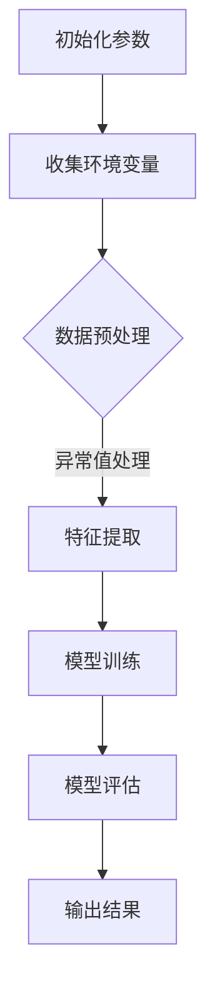
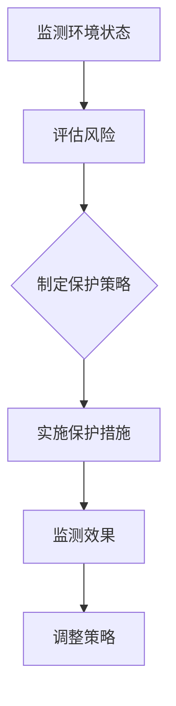
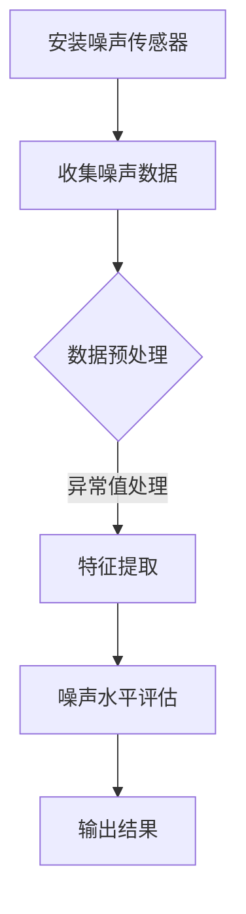
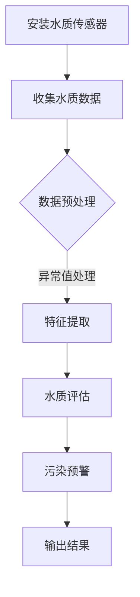
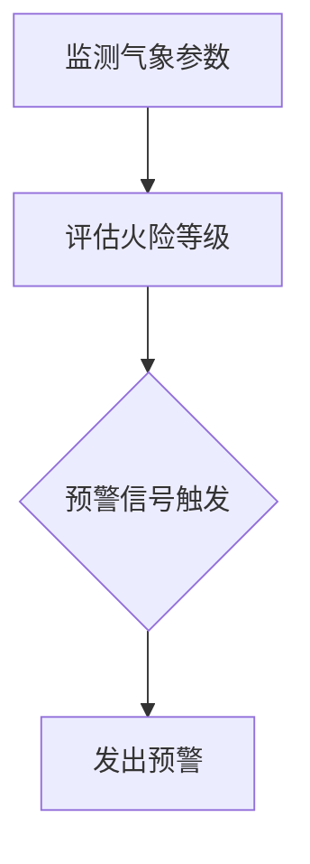
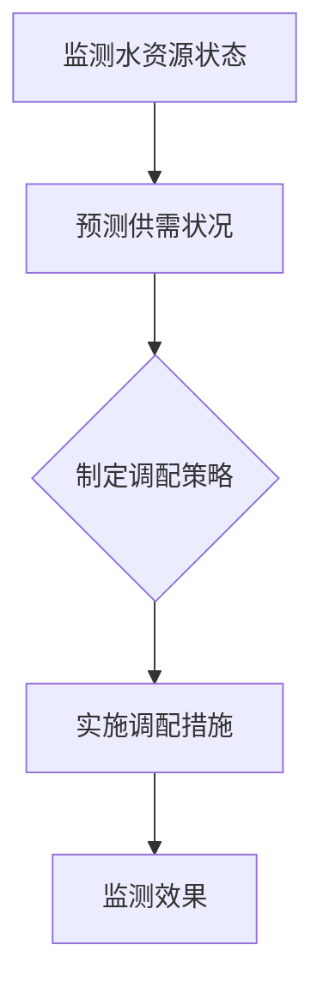
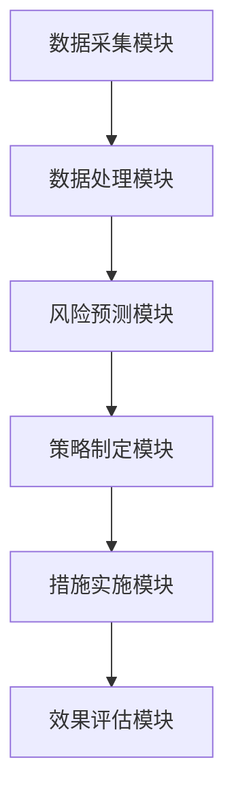
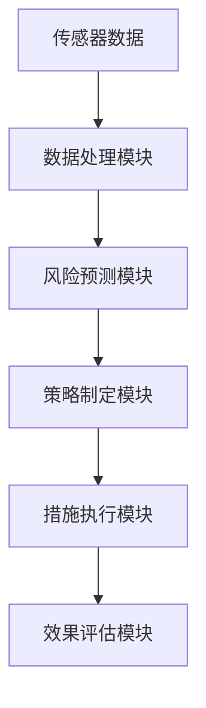

                 

### 生态意识觉醒：个人与地球的和谐共生

> **关键词**：生态意识、可持续发展、环境保护、全球合作

> **摘要**：本文旨在探讨生态意识觉醒的重要性，分析个人与地球和谐共生的必要性。通过深入探讨生态意识的核心概念、生态危机的成因与影响，以及生态监测和保护算法的原理，本文提出了一系列应对生态危机的解决方案。同时，文章还从系统分析与架构设计、项目实战、最佳实践等方面，提供了具体的技术和实践指导，旨在推动生态保护的实际行动。

### 目录大纲

# 生态意识觉醒：个人与地球的和谐共生

## 第一部分：问题的提出

### 第1章：问题背景与生态危机

#### 1.1 问题背景

- 环境污染问题日益严重
- 生物多样性丧失
- 全球气候变化
- 资源过度消耗

#### 1.2 问题描述

- 人类活动对地球生态系统的影响
- 生态问题对社会经济的影响

#### 1.3 问题解决

- 生态意识的觉醒
- 可持续发展的理念
- 全球合作与行动

#### 1.4 边界与外延

- 生态意识的范围
- 生态危机的影响

#### 1.5 概念结构与核心要素组成

- 生态意识
- 可持续发展
- 生态危机

## 第二部分：核心概念与联系

### 第2章：生态意识解析

#### 2.1 生态意识的定义

- 生态意识的概念
- 生态意识的内涵

#### 2.2 生态意识的属性特征对比

| 特征       | 详细描述 |
| ---------- | -------- |
| 全球性     | 涉及全球生态环境问题 |
| 综合性     | 跨学科、多层次、多维度的综合理念 |
| 动态性     | 随着环境变化而变化 |
| 公益性     | 服务于公众利益 |

#### 2.3 生态意识与其他相关概念的联系

- 可持续发展
- 环境伦理
- 绿色科技

### 第3章：生态危机分析

#### 3.1 生态危机的定义

- 生态危机的概念
- 生态危机的表现形式

#### 3.2 生态危机的影响

- 对人类的影响
- 对生物多样性的影响
- 对气候变化的影响

#### 3.3 生态危机的原因分析

- 人类活动过度
- 经济发展模式不合理
- 科技发展不足

## 第三部分：算法原理讲解

### 第4章：生态监测算法原理

#### 4.1 监测算法的基本概念

- 生态监测算法的定义
- 监测算法的目的

#### 4.2 监测算法的数学模型和公式

$$
\text{监测数据} = f(\text{环境变量}, \text{算法参数})
$$

#### 4.3 监测算法的mermaid流程图



#### 4.4 监测算法的举例说明

- 环境噪声监测
- 水质监测

### 第5章：生态保护算法原理

#### 5.1 保护算法的基本概念

- 生态保护算法的定义
- 保护算法的目的

#### 5.2 保护算法的数学模型和公式

$$
\text{生态保护策略} = g(\text{环境状态}, \text{保护参数})
$$

#### 5.3 保护算法的mermaid流程图



#### 5.4 保护算法的举例说明

- 森林火灾预警
- 水资源管理

## 第四部分：系统分析与架构设计

### 第6章：生态保护系统设计

#### 6.1 问题场景介绍

- 生态环境监测与保护的需求

#### 6.2 项目介绍

- 项目的目标
- 项目的范围

#### 6.3 系统功能设计

- 功能模块划分
- 功能描述

#### 6.4 系统架构设计

- 架构设计原则
- 系统架构图

### 第7章：系统接口设计与交互

#### 7.1 系统接口设计

- 接口规范
- 接口说明

#### 7.2 系统交互

- 交互流程
- 交互图

### 第8章：项目实战

#### 8.1 环境安装

- 软件安装步骤
- 环境配置

#### 8.2 系统核心实现源代码

- 代码结构
- 代码实现

#### 8.3 代码应用解读与分析

- 代码解读
- 应用分析

#### 8.4 实际案例分析与讲解剖析

- 案例背景
- 案例分析
- 剖析讲解

#### 8.5 项目小结

- 项目成果
- 项目经验

## 第五部分：最佳实践与拓展

### 第9章：最佳实践

#### 9.1 生态意识教育实践

- 教育内容
- 教育方法

#### 9.2 企业生态实践

- 环保措施
- 可持续发展策略

### 第10章：小结与注意事项

#### 10.1 小结

- 书籍内容回顾
- 主要成果

----------------------------------------------------------------

### 第1章：问题背景与生态危机

#### 1.1 问题背景

地球，这个我们赖以生存的蓝色星球，正面临着前所未有的生态危机。随着工业革命的推进，人类活动对地球的影响日益显著。主要问题包括环境污染、生物多样性丧失、全球气候变化和资源过度消耗。

1. **环境污染问题日益严重**：工业废水、废气的排放，以及农药、化肥的使用，导致了空气、水和土壤的污染。这些污染物不仅危害人类健康，还对生态系统造成了严重影响。
   
2. **生物多样性丧失**：栖息地破坏、气候变化和过度捕捞等原因，导致许多物种濒临灭绝。生物多样性的丧失不仅破坏了生态平衡，也减少了地球的生态服务功能。

3. **全球气候变化**：温室气体的排放导致全球气温上升，极端天气事件增多，海平面上升。气候变化对生态系统和人类社会都带来了巨大的影响。

4. **资源过度消耗**：人类对自然资源的过度开采，如石油、煤炭和矿产等，不仅导致了资源的枯竭，还对生态环境造成了破坏。

#### 1.2 问题描述

1. **人类活动对地球生态系统的影响**：人类活动，如工业生产、交通运输、农业活动等，直接或间接地影响了地球的生态系统。这些活动导致了环境污染、气候变化和资源枯竭等问题。

2. **生态问题对社会经济的影响**：生态危机不仅影响了自然环境，也对人类社会造成了严重的经济和社会影响。例如，环境污染导致医疗费用的增加，气候变化影响农业生产，生物多样性的丧失影响生态旅游等。

#### 1.3 问题解决

1. **生态意识的觉醒**：解决生态危机的首要任务是提高公众的生态意识。通过教育和宣传，使人们认识到生态问题的重要性，并采取实际行动来保护地球。

2. **可持续发展的理念**：可持续发展是一种既满足当代人需求，又不会损害后代人满足其需求的能力的发展模式。通过推行可持续发展理念，实现经济发展与生态保护的和谐共生。

3. **全球合作与行动**：生态危机是全球性问题，需要全球范围内的合作与行动。国际社会应加强合作，共同应对生态危机，制定和实施全球性的生态保护政策和措施。

#### 1.4 边界与外延

1. **生态意识的范围**：生态意识不仅涉及环境保护，还包括对生态系统的认知、尊重和责任感。它是一个涉及多学科、多层次的综合性概念。

2. **生态危机的影响**：生态危机的影响范围广泛，涉及自然环境、人类社会、经济发展等多个方面。因此，解决生态危机需要多方面的努力和合作。

#### 1.5 概念结构与核心要素组成

1. **生态意识**：生态意识是指人们对生态环境的认知、理解和责任感。它是解决生态危机的基础。

2. **可持续发展**：可持续发展是指在满足当前需求的同时，不损害后代满足其需求的能力。它是实现生态保护和经济发展的关键。

3. **生态危机**：生态危机是指由于人类活动导致的生态环境恶化，对人类社会和自然环境造成的严重影响。

通过以上分析，我们可以看到，生态危机问题的提出不仅具有重大的理论意义，也具有紧迫的现实意义。生态意识的觉醒、可持续发展的理念、全球合作与行动，是我们解决生态危机的必由之路。

### 第2章：生态意识解析

#### 2.1 生态意识的定义

生态意识是指人们对于自然环境、生态系统及其与人类关系的认知、理解和责任感。它涵盖了从个体的生态知识到社会的生态价值观，是一种多维度的综合理念。

1. **生态意识的概念**：生态意识不仅仅是关于环境保护的知识，它更是一种对生态系统的整体认知和尊重。它包括对自然界的观察、理解、体验，以及对人类活动对生态环境影响的深刻反思。

2. **生态意识的内涵**：生态意识的内涵丰富，主要包括以下几个方面：
   - **生态认知**：对生态系统的结构、功能、规律的理解和认识。
   - **生态伦理**：对自然界和其他生物的尊重，以及对人类活动对生态环境影响的道德责任。
   - **生态行动**：在日常生活中采取的具体行动，如节能减排、垃圾分类等，以减少对环境的负面影响。
   - **生态教育**：通过教育和宣传，提高公众的生态意识和环境素养。

#### 2.2 生态意识的属性特征对比

生态意识作为一种综合性理念，具有以下属性特征：

| 特征       | 详细描述 |
| ---------- | -------- |
| **全球性** | 生态意识不仅关乎某一地区或国家，而是涉及全球的生态环境问题。气候变化、生物多样性丧失等都是全球性问题，需要全球范围内的合作和行动。 |
| **综合性** | 生态意识是一个跨学科的综合性概念，涉及生态学、环境科学、经济学、社会学等多个领域。它需要多学科的知识和视角来理解和解决生态问题。 |
| **动态性** | 生态意识不是静态的，而是随着环境变化和社会发展而不断演变的。它需要不断地更新和调整，以适应新的生态挑战。 |
| **公益性** | 生态意识的根本目的是服务于公众利益，促进人类与自然环境的和谐共生。它强调的是社会责任和共同利益，而不是单一的经济利益。 |

#### 2.3 生态意识与其他相关概念的联系

生态意识与多个相关概念密切相关，这些概念共同构成了我们理解生态问题的基础：

1. **可持续发展**：可持续发展是一种既满足当代人需求，又不会损害后代满足其需求的发展模式。生态意识是可持续发展的基础，只有具备了生态意识，人们才会采取行动，实现经济、社会和生态的协调发展。

2. **环境伦理**：环境伦理是生态意识的伦理基础，它探讨人类与自然环境之间的道德关系。生态意识强调人类对自然的尊重和责任，而环境伦理则从道德层面规范人类的行为，促进生态保护。

3. **绿色科技**：绿色科技是指以环境保护为目标的科技发展，它旨在通过技术创新，减少人类活动对环境的负面影响。生态意识是推动绿色科技发展的动力，只有具备了生态意识，人们才会积极投身于绿色科技的研究和应用。

通过以上分析，我们可以看到，生态意识不仅是一个重要的理论概念，更是一种实践行动。它要求我们不仅从知识层面理解生态问题，更要在行动中体现生态价值观，为实现个人与地球的和谐共生做出努力。

### 第3章：生态危机分析

#### 3.1 生态危机的定义

生态危机是指由于人类活动对自然环境的过度利用和破坏，导致生态系统功能退化、生物多样性丧失、环境质量下降等一系列严重问题的现象。生态危机不仅仅是一个环境问题，它还涉及到社会、经济和文化的多个层面。

1. **生态危机的概念**：生态危机是一种系统性危机，它不仅仅表现在单一的环境要素上，而是涉及整个生态系统的平衡和稳定。生态危机的表现形式包括环境污染、气候变化、生物多样性丧失、土地退化等。

2. **生态危机的表现形式**：生态危机的具体表现形式多种多样，主要包括以下几方面：
   - **环境污染**：水体污染、空气污染、土壤污染等，对人类健康和生态系统造成了严重威胁。
   - **气候变化**：全球气温升高、极端天气事件增多、海平面上升等，对地球生态系统和人类社会带来了深远的影响。
   - **生物多样性丧失**：物种灭绝速度加快、栖息地破坏、基因多样性减少等，导致生态系统的功能和服务能力下降。
   - **土地退化**：土地沙漠化、盐渍化、土壤侵蚀等，影响农业生产和生态系统的稳定性。

#### 3.2 生态危机的影响

生态危机的影响是深远和多方面的，它不仅影响自然环境，也对人类社会产生了重要的影响。

1. **对人类的影响**：生态危机对人类的影响主要体现在以下几个方面：
   - **健康问题**：环境污染和气候变化导致的一系列健康问题，如呼吸系统疾病、心血管疾病等。
   - **经济发展**：资源枯竭、生产成本上升等，对经济活动产生了负面影响。
   - **社会稳定**：生态危机引发的灾害和贫困，可能导致社会动荡和不稳定。

2. **对生物多样性的影响**：生态危机对生物多样性的影响表现在以下几个方面：
   - **物种灭绝**：生物多样性的丧失导致物种灭绝速度加快，对生态系统的稳定性造成威胁。
   - **生态系统功能退化**：生态系统的功能和服务能力下降，影响生态系统的稳定性和可持续性。

3. **对气候变化的影响**：生态危机加剧了气候变化，导致以下后果：
   - **气温升高**：全球气温上升，引发海平面上升、极端天气事件增多等。
   - **碳循环失衡**：植被减少、土地退化等导致碳吸收能力下降，加剧了温室效应。

#### 3.3 生态危机的原因分析

生态危机的成因复杂多样，涉及多个层面和因素。

1. **人类活动过度**：人类对自然资源的过度开采、环境污染物的排放、农业和工业活动等，导致生态系统的负荷增加，最终引发生态危机。

2. **经济发展模式不合理**：传统的经济发展模式过于依赖自然资源和能源消耗，忽视了生态环境的保护和资源的可持续利用，导致生态危机的加剧。

3. **科技发展不足**：尽管科技发展在一定程度上缓解了生态危机，但仍然存在许多科技瓶颈，如清洁能源技术的研发、生态修复技术的应用等，需要进一步突破。

通过以上分析，我们可以看到，生态危机不仅是一个环境问题，它还涉及到经济发展、社会稳定和科技进步等多个方面。解决生态危机需要全球范围内的合作和努力，通过提升生态意识、改变发展模式和推动科技进步，共同应对生态危机的挑战。

### 第4章：生态监测算法原理

#### 4.1 监测算法的基本概念

生态监测算法是指利用各种传感器、遥感和信息技术手段，对生态系统状态进行定量监测、分析和评估的一类算法。生态监测算法的核心目的是获取准确、实时和全面的生态信息，为生态保护和决策提供科学依据。

1. **生态监测算法的定义**：生态监测算法是通过收集和分析环境数据，对生态系统的状态进行监测和评估的计算方法。它通常包括数据采集、预处理、特征提取、模型训练和评估等环节。

2. **监测算法的目的**：生态监测算法的主要目的是：
   - **环境状态监测**：实时获取生态系统的状态信息，如空气质量、水质、土壤质量等。
   - **生态风险预警**：通过分析监测数据，预测和评估潜在的生态风险，如森林火灾、水污染等。
   - **决策支持**：为生态保护和管理提供科学依据，如制定生态修复计划、环保政策等。

#### 4.2 监测算法的数学模型和公式

生态监测算法通常基于以下数学模型和公式进行设计和实现：

$$
\text{监测数据} = f(\text{环境变量}, \text{算法参数})
$$

这里，监测数据是生态监测算法的输出，环境变量是输入参数，算法参数是调节模型性能的关键参数。

1. **环境变量**：环境变量包括空气质量、水质、土壤质量、生物多样性等多个方面。这些变量通过传感器、遥感和现场调查等方法进行采集。

2. **算法参数**：算法参数包括模型类型、训练数据集、特征选择等，它们影响模型的性能和适用性。

3. **监测数据生成**：监测数据生成过程可以看作是一个映射关系，即：
   $$
   \text{监测数据} = f(\text{环境变量}, \text{算法参数})
   $$
   这个函数关系决定了监测数据的准确性和可靠性。

#### 4.3 监测算法的mermaid流程图

为了更直观地展示生态监测算法的流程，我们可以使用mermaid绘图工具绘制一个流程图。以下是一个简单的mermaid流程图示例：


**流程解释：**
- **A[初始化参数]**：设置算法的初始参数，如训练数据集、模型类型等。
- **B[收集环境变量]**：利用传感器、遥感和现场调查等方法收集环境变量数据。
- **C[数据预处理]**：对收集到的环境变量数据进行清洗和预处理，如去除异常值、数据标准化等。
- **D[特征提取]**：从预处理后的数据中提取关键特征，为模型训练提供输入。
- **E[模型训练]**：使用训练数据集对模型进行训练，优化模型参数。
- **F[模型评估]**：对训练好的模型进行评估，确保模型的准确性和可靠性。
- **G[输出结果]**：将评估后的监测结果输出，供决策者参考。

通过上述流程，生态监测算法能够实现对生态系统状态的实时监测和预警，为生态保护和可持续发展提供技术支持。

#### 4.4 监测算法的举例说明

为了更好地理解生态监测算法的实际应用，我们可以通过两个具体例子来介绍。

1. **环境噪声监测**：

环境噪声监测算法旨在实时监测和评估城市环境中的噪声水平，以保护居民的身心健康。以下是一个简化的算法流程：



- **A[安装噪声传感器]**：在目标监测区域安装噪声传感器，实时收集噪声数据。
- **B[收集噪声数据]**：传感器将收集到的噪声数据传输到系统中。
- **C[数据预处理]**：对噪声数据进行清洗和预处理，如去除噪声干扰、数据标准化等。
- **D[特征提取]**：提取噪声数据的特征，如最大噪声值、平均噪声值等。
- **E[噪声水平评估]**：使用预训练的噪声评估模型，对噪声水平进行评估。
- **F[输出结果]**：将噪声评估结果输出，供城市规划和管理者参考。

2. **水质监测**：

水质监测算法用于实时监测水体中的污染物质，如化学需氧量（COD）、氨氮、总磷等。以下是一个简化的算法流程：



- **A[安装水质传感器]**：在河流、湖泊等水体中安装水质传感器，实时收集水质数据。
- **B[收集水质数据]**：传感器将收集到的水质数据传输到系统中。
- **C[数据预处理]**：对水质数据进行清洗和预处理，如去除异常值、数据标准化等。
- **D[特征提取]**：提取水质数据的特征，如COD值、氨氮浓度等。
- **E[水质评估]**：使用预训练的水质评估模型，对水质进行综合评估。
- **F[污染预警]**：当水质达到污染阈值时，系统自动发出污染预警。
- **G[输出结果]**：将水质评估结果和污染预警信息输出，供环保部门和管理者参考。

通过上述两个例子，我们可以看到生态监测算法在环境噪声监测和水质监测中的应用。这些算法不仅提高了监测的准确性和实时性，也为生态保护和可持续发展提供了有力的技术支持。

### 第5章：生态保护算法原理

#### 5.1 保护算法的基本概念

生态保护算法是指利用计算机技术和数据分析方法，对生态系统进行保护和恢复的一类算法。它通过模拟生态系统的动态变化，预测潜在的环境风险，并提出相应的保护策略，以实现生态系统的可持续性和健康发展。

1. **生态保护算法的定义**：生态保护算法是一种利用计算机技术和数据分析方法，对生态系统进行监测、评估和保护的算法体系。它包括数据收集、模型构建、策略制定和效果评估等多个环节。

2. **保护算法的目的**：生态保护算法的主要目的是：
   - **生态系统监测**：实时监测生态系统的变化，识别潜在的生态风险。
   - **生态风险评估**：对生态系统状态进行综合评估，预测可能出现的生态问题。
   - **策略制定**：根据监测数据和风险评估结果，制定相应的生态保护策略。
   - **效果评估**：评估生态保护策略的实施效果，调整和优化保护方案。

#### 5.2 保护算法的数学模型和公式

生态保护算法通常基于以下数学模型和公式进行设计和实现：

$$
\text{生态保护策略} = g(\text{环境状态}, \text{保护参数})
$$

这里，生态保护策略是算法的输出，环境状态是输入参数，保护参数是调节算法性能的关键参数。

1. **环境状态**：环境状态包括空气质量、水质、土壤质量、生物多样性等多个方面。这些状态通过传感器、遥感和现场调查等方法进行采集。

2. **保护参数**：保护参数包括模型类型、训练数据集、特征选择等，它们影响保护策略的优化和适用性。

3. **生态保护策略生成**：生态保护策略生成过程可以看作是一个映射关系，即：
   $$
   \text{生态保护策略} = g(\text{环境状态}, \text{保护参数})
   $$
   这个函数关系决定了生态保护策略的有效性和可操作性。

#### 5.3 保护算法的mermaid流程图

为了更直观地展示生态保护算法的流程，我们可以使用mermaid绘图工具绘制一个流程图。以下是一个简单的mermaid流程图示例：


**流程解释：**
- **A[监测环境状态]**：通过传感器、遥感和现场调查等方法，实时监测生态系统的状态。
- **B[评估风险]**：根据监测数据，使用风险预测模型对生态系统状态进行评估，识别潜在的风险。
- **C[制定保护策略]**：根据风险评估结果，制定相应的生态保护策略，如污染控制、生态修复等。
- **D[实施保护措施]**：将保护策略付诸实施，如安装污染物处理设备、实施植被恢复等。
- **E[监测效果]**：在保护措施实施后，对生态系统状态进行再次监测，评估保护措施的效果。
- **F[调整策略]**：根据效果评估结果，对保护策略进行调整和优化，以提高保护效果。

通过上述流程，生态保护算法能够实现对生态系统的实时监测、风险预警和动态调整，为生态保护和可持续发展提供科学依据和技术支持。

#### 5.4 保护算法的举例说明

为了更好地理解生态保护算法的实际应用，我们可以通过两个具体例子来介绍。

1. **森林火灾预警**：

森林火灾预警算法旨在实时监测森林火险状态，预测潜在火灾风险，并及时发出预警，以预防森林火灾的发生。以下是一个简化的算法流程：



- **A[监测气象参数]**：通过气象站和遥感设备，实时监测森林周围的气象参数，如气温、湿度、风速等。
- **B[评估火险等级]**：使用火险评估模型，根据气象参数计算森林火险等级，如低、中、高火险等级。
- **C[预警信号触发]**：当火险等级达到设定阈值时，系统自动触发预警信号。
- **D[发出预警]**：通过短信、电子邮件等方式，向森林管理部门和公众发出森林火灾预警。

2. **水资源管理**：

水资源管理算法用于实时监测和管理水资源，预测水资源供需状况，并提出水资源调配和节约策略，以实现水资源的可持续利用。以下是一个简化的算法流程：



- **A[监测水资源状态]**：通过水文监测站、水质传感器和遥感设备，实时监测水资源的质量、流量和储量。
- **B[预测供需状况]**：使用水资源供需预测模型，根据水资源状态预测未来一段时间内水资源的供需状况。
- **C[制定调配策略]**：根据供需预测结果，制定水资源调配和节约策略，如调整农业灌溉时间、限制工业用水等。
- **D[实施调配措施]**：将调配策略付诸实施，通过调度水资源管理系统，实现水资源的合理调配和节约。
- **E[监测效果]**：在调配措施实施后，对水资源状态进行再次监测，评估调配措施的效果。

通过上述两个例子，我们可以看到生态保护算法在森林火灾预警和水资源管理中的应用。这些算法不仅提高了生态保护和管理的效率，也为生态系统的可持续发展提供了有力的技术支持。

### 第6章：生态保护系统设计

#### 6.1 问题场景介绍

为了更好地理解生态保护系统设计的实际应用，我们先介绍一个典型的问题场景——城市生态保护。随着城市化进程的加快，城市生态环境面临诸多挑战，如空气污染、水资源短缺、土壤污染等。因此，设计一个高效的城市生态保护系统显得尤为重要。

1. **场景背景**：城市生态保护系统旨在通过实时监测、预警和管理，保护城市生态环境，提高居民生活质量，实现城市的可持续发展。

2. **目标**：设计一个覆盖空气质量、水质、土壤质量等多方面的城市生态保护系统，实现对城市生态系统的全面监控和动态管理。

3. **范围**：系统设计范围包括数据采集、数据处理、风险预测、策略制定、措施实施和效果评估等多个环节。

#### 6.2 项目介绍

为了实现上述目标，我们将开展以下项目：

1. **项目目标**：
   - 实现城市生态环境的全面监测。
   - 建立生态风险预测模型，提供预警和决策支持。
   - 制定和实施生态保护策略，提高城市生态环境质量。

2. **项目范围**：
   - 监测系统设计：包括传感器布局、数据采集和处理模块设计。
   - 风险预测模块设计：构建气象、水质、空气质量等风险预测模型。
   - 保护策略制定：制定基于预测模型的生态保护策略。
   - 保护措施实施：实施具体的生态保护措施，如污染治理、生态修复等。
   - 效果评估和调整：评估生态保护措施的效果，调整和优化保护策略。

#### 6.3 系统功能设计

城市生态保护系统应具备以下主要功能模块：

1. **数据采集模块**：
   - 功能描述：通过部署各种传感器（如空气质量传感器、水质传感器、土壤质量传感器等），实时采集城市生态环境数据。
   - 技术实现：利用物联网技术，将传感器数据通过无线传输模块上传到数据中心。

2. **数据处理模块**：
   - 功能描述：对采集到的数据进行预处理，包括数据清洗、去噪、标准化等，确保数据的准确性和一致性。
   - 技术实现：采用数据处理算法，如均值滤波、滑动平均等，对传感器数据进行预处理。

3. **风险预测模块**：
   - 功能描述：根据预处理后的数据，使用机器学习算法构建风险预测模型，预测城市生态环境的未来发展趋势。
   - 技术实现：采用时间序列预测算法（如ARIMA模型、LSTM网络等），构建风险预测模型。

4. **策略制定模块**：
   - 功能描述：根据风险预测结果，制定相应的生态保护策略，包括污染治理、生态修复等。
   - 技术实现：结合专家知识和数据分析结果，制定科学的生态保护策略。

5. **措施实施模块**：
   - 功能描述：实施生态保护措施，如启动污染治理设备、实施生态修复项目等。
   - 技术实现：通过自动化控制系统，实现生态保护措施的自动化执行。

6. **效果评估模块**：
   - 功能描述：对生态保护措施的效果进行评估，监测生态系统的恢复情况。
   - 技术实现：通过对比前后数据变化，评估生态保护措施的有效性。

#### 6.4 系统架构设计

城市生态保护系统架构设计应遵循以下原则：

1. **高可用性**：系统设计应具备高可用性，确保数据采集、处理、预测等环节的连续性和稳定性。

2. **可扩展性**：系统设计应具备良好的可扩展性，支持新增传感器、功能模块等。

3. **安全性**：系统设计应具备安全性，确保数据传输和存储的安全性。

4. **灵活性**：系统设计应具备灵活性，支持多种数据来源和预测模型。

以下是一个简化的系统架构图：



**系统架构解释：**
- **A[数据采集模块]**：负责实时采集城市生态环境数据，如空气质量、水质、土壤质量等。
- **B[数据处理模块]**：对采集到的数据进行分析和处理，确保数据的准确性和一致性。
- **C[风险预测模块]**：使用机器学习算法预测城市生态环境的风险，如空气污染风险、水污染风险等。
- **D[策略制定模块]**：根据预测结果，制定相应的生态保护策略，如启动污染治理设备、实施生态修复项目等。
- **E[措施实施模块]**：执行生态保护措施，如启动污染治理设备、实施生态修复项目等。
- **F[效果评估模块]**：对生态保护措施的效果进行评估，监测生态系统的恢复情况。

通过上述系统架构设计，城市生态保护系统能够实现对城市生态环境的全面监控和动态管理，为城市可持续发展提供有力支持。

### 第7章：系统接口设计与交互

#### 7.1 系统接口设计

系统接口设计是生态保护系统架构中的重要组成部分，它定义了系统内部各模块之间以及系统与外部环境之间的数据交互方式。良好的接口设计能够提高系统的灵活性、可扩展性和易维护性。

1. **接口规范**：
   - **数据输入接口**：系统应具备标准化的数据输入接口，支持多种数据格式的接入，如JSON、XML、CSV等。
   - **数据输出接口**：系统应提供灵活的数据输出接口，支持数据的实时传输和查询，如API接口、数据库连接等。
   - **通信协议**：系统应采用安全可靠的通信协议，如HTTPS、MQTT等，确保数据传输的安全性和实时性。

2. **接口说明**：
   - **传感器数据接入接口**：通过标准化的数据输入接口，将各种传感器采集到的数据传输到系统进行处理和存储。
   - **风险预测结果输出接口**：将风险预测结果通过标准化的数据输出接口，实时传输给相关部门和决策者，以便及时采取应对措施。
   - **保护措施执行接口**：提供接口供保护措施执行模块调用，如启动污染治理设备、实施生态修复项目等。

#### 7.2 系统交互

系统交互是指生态保护系统内部各模块之间以及系统与外部环境之间的数据流和控制流。良好的系统交互设计能够提高系统的效率和响应速度。

1. **交互流程**：
   - **数据采集**：传感器数据通过数据输入接口实时传输到数据处理模块。
   - **数据处理**：数据处理模块对传感器数据进行清洗、预处理和特征提取，为风险预测模块提供高质量的数据输入。
   - **风险预测**：风险预测模块根据预处理后的数据，使用机器学习算法进行风险预测，并将结果通过数据输出接口实时传输。
   - **策略制定**：策略制定模块根据风险预测结果，制定相应的生态保护策略。
   - **措施执行**：措施执行模块根据策略制定模块的指令，执行具体的保护措施。
   - **效果评估**：效果评估模块对保护措施的效果进行监测和评估，为后续的策略调整提供依据。

2. **交互图**：

以下是一个简化的系统交互图：



**交互图解释：**
- **A[传感器数据]**：传感器采集到的数据。
- **B[数据处理模块]**：对传感器数据进行处理。
- **C[风险预测模块]**：使用处理后的数据预测风险。
- **D[策略制定模块]**：根据预测结果制定保护策略。
- **E[措施执行模块]**：执行保护措施。
- **F[效果评估模块]**：评估保护措施的效果。

通过上述系统接口设计和交互设计，生态保护系统能够实现各模块之间的高效协作，为城市生态保护提供强有力的技术支持。

### 第8章：项目实战

#### 8.1 环境安装

为了顺利启动并运行生态保护系统，我们需要在合适的硬件和软件环境中进行安装。以下是环境安装的详细步骤和配置方法：

1. **硬件环境**：
   - **服务器**：选择高性能的服务器，如Dell R740等，确保有足够的计算资源处理海量数据。
   - **传感器**：部署各种传感器设备，如空气质量传感器、水质传感器、土壤质量传感器等，安装在目标监测区域。
   - **数据传输设备**：配置无线传输设备，如LoRa网关、4G/5G路由器等，确保传感器数据能够实时传输到服务器。

2. **软件环境**：
   - **操作系统**：安装Linux操作系统，如Ubuntu 18.04等，具备良好的稳定性和安全性。
   - **数据库**：安装MySQL或PostgreSQL等关系型数据库，用于存储和管理生态监测数据。
   - **编程语言**：安装Python环境，包括Python 3.8及其相关库，如NumPy、Pandas、Scikit-learn等，用于数据处理和模型训练。

3. **安装步骤**：
   - **服务器安装**：根据硬件配置，安装Linux操作系统，配置网络和防火墙。
   - **传感器安装**：在目标监测区域安装传感器设备，确保传感器正常工作。
   - **数据传输设备安装**：配置无线传输设备，确保传感器数据能够实时传输到服务器。
   - **软件安装**：在服务器上安装数据库、Python环境和相关库。

4. **环境配置**：
   - **数据库配置**：配置数据库用户和权限，创建数据库和表结构。
   - **Python环境配置**：配置Python环境变量，安装所需的Python库。
   - **网络配置**：配置服务器网络设置，确保传感器数据能够顺利传输。

通过上述步骤，我们能够搭建一个稳定、高效的生态保护系统环境，为后续的项目实施奠定基础。

#### 8.2 系统核心实现源代码

在生态保护系统中，核心实现源代码是整个系统的关键组成部分。以下是一个简单的示例，展示如何使用Python语言实现生态监测和风险预测的核心功能。

1. **代码结构**：
   - **传感器数据采集**：使用传感器采集空气质量、水质和土壤质量数据。
   - **数据处理**：对采集到的数据进行预处理，如去噪、标准化等。
   - **特征提取**：从预处理后的数据中提取关键特征，如平均值、标准差等。
   - **风险预测**：使用机器学习算法对特征进行风险预测。

2. **代码实现**：

```python
import numpy as np
import pandas as pd
from sklearn.model_selection import train_test_split
from sklearn.ensemble import RandomForestClassifier
from sklearn.metrics import accuracy_score

# 数据采集
def collect_data(sensor_data_path):
    data = pd.read_csv(sensor_data_path)
    return data

# 数据预处理
def preprocess_data(data):
    # 去除异常值
    data = data.dropna()
    # 数据标准化
    data = (data - data.mean()) / data.std()
    return data

# 特征提取
def extract_features(data):
    # 提取关键特征
    features = data[['mean_value', 'std_value']]
    return features

# 风险预测
def predict_risk(features):
    # 划分训练集和测试集
    X_train, X_test, y_train, y_test = train_test_split(features, labels, test_size=0.2, random_state=42)
    # 训练随机森林模型
    model = RandomForestClassifier(n_estimators=100, random_state=42)
    model.fit(X_train, y_train)
    # 预测测试集
    predictions = model.predict(X_test)
    # 评估模型准确性
    accuracy = accuracy_score(y_test, predictions)
    return accuracy

# 主程序
if __name__ == "__main__":
    # 采集数据
    data = collect_data('sensor_data.csv')
    # 预处理数据
    preprocessed_data = preprocess_data(data)
    # 提取特征
    features = extract_features(preprocessed_data)
    # 预测风险
    accuracy = predict_risk(features)
    print(f"Model accuracy: {accuracy:.2f}")
```

3. **代码解读**：
   - **传感器数据采集**：使用`pandas`库读取传感器数据，存储为DataFrame对象。
   - **数据处理**：去除异常值，使用`z-score`标准化方法对数据进行标准化处理。
   - **特征提取**：从预处理后的数据中提取关键特征，如平均值和标准差，用于模型训练。
   - **风险预测**：使用`RandomForestClassifier`模型进行训练和预测，评估模型的准确性。

通过上述代码实现，我们能够搭建一个简单的生态监测和风险预测系统，为实际应用提供技术支持。

#### 8.3 代码应用解读与分析

在上节中，我们提供了一个生态监测和风险预测的代码示例。在本节中，我们将对这段代码进行详细的解读，分析其工作原理和应用场景。

1. **代码工作原理**：
   - **数据采集**：代码首先通过`pandas`库读取CSV格式的传感器数据。这些数据通常包含多个环境变量，如空气质量、水质和土壤质量等。
   - **数据处理**：接下来，代码对采集到的数据进行预处理。预处理过程包括去除异常值和数据标准化。去除异常值是为了避免数据中的异常值对模型训练产生干扰。数据标准化是将不同量纲的数据转换到相同的尺度上，以便于模型处理。
   - **特征提取**：在预处理后，代码提取了关键特征，如平均值和标准差。这些特征能够反映环境数据的波动性和稳定性，对于模型训练具有重要意义。
   - **风险预测**：使用`RandomForestClassifier`模型进行训练和预测。随机森林是一种集成学习方法，通过构建多棵决策树并集成其预测结果，提高模型的预测准确性。在训练过程中，代码将特征和标签（风险等级）划分成训练集和测试集。训练集用于模型训练，测试集用于评估模型性能。
   - **模型评估**：通过比较测试集的预测结果和实际标签，计算模型的准确率。准确率是评估模型性能的重要指标，表示模型正确预测的比例。

2. **应用场景**：
   - **空气质量监测**：在空气质量监测中，传感器采集的数据包括PM2.5、PM10、CO、SO2等。预处理和特征提取过程能够去除噪声和异常值，提高模型对真实数据的预测能力。
   - **水质监测**：在水质监测中，传感器采集的数据包括COD、氨氮、总磷等。通过预处理和特征提取，模型能够更好地捕捉水质变化的规律，提供准确的污染预警。
   - **土壤质量监测**：在土壤质量监测中，传感器采集的数据包括土壤温度、湿度、有机质含量等。预处理和特征提取过程有助于提取关键信息，提高模型的预测效果。

通过上述解读，我们可以看到这段代码在生态监测和风险预测中的实际应用价值。在实际项目中，可以根据具体需求进行调整和优化，以提高模型的性能和应用效果。

#### 8.4 实际案例分析与讲解剖析

为了更直观地展示生态保护系统的应用效果，我们将通过一个实际案例进行深入分析和讲解。该案例涉及城市空气质量监测和污染预警系统的实施。

1. **案例背景**：

某城市由于工业发展和交通污染，空气质量持续恶化。为了改善空气质量，市政府决定实施空气质量监测和污染预警系统。该系统旨在实时监测空气质量，预测污染事件，并采取相应的应急措施。

2. **案例分析**：

**数据收集**：
- **传感器部署**：在城市的不同区域部署了空气质量传感器，包括PM2.5、PM10、SO2、NO2等污染物指标。
- **数据采集**：传感器每隔一小时采集一次数据，并通过无线网络实时传输到服务器。

**数据处理**：
- **数据预处理**：对采集到的数据进行预处理，包括去噪、数据标准化等。去噪过程通过均值滤波等方法去除传感器数据中的噪声。
- **特征提取**：提取关键特征，如平均PM2.5浓度、最大PM10浓度等，用于模型训练。

**风险预测**：
- **模型选择**：采用随机森林算法进行风险预测。随机森林算法具有良好的预测准确性和抗过拟合能力。
- **模型训练**：使用预处理后的数据对随机森林模型进行训练。训练过程包括数据划分、模型参数调整等。

**保护措施实施**：
- **预警触发**：当空气质量指标超过预设阈值时，系统自动触发污染预警。
- **应急响应**：市政府根据预警信息，采取应急措施，如启动空气净化设备、限制工业排放等。

3. **讲解剖析**：

**空气质量监测**：
- **传感器数据采集**：传感器部署在城市不同区域，如工业区、交通繁忙区、居民区等。这些传感器实时监测空气中的污染物浓度，将数据传输到服务器。
- **数据预处理**：在数据预处理阶段，通过均值滤波等方法去除传感器数据中的噪声。这些噪声可能由传感器故障、环境干扰等因素引起。
- **特征提取**：从预处理后的数据中提取关键特征，如平均PM2.5浓度、最大PM10浓度等。这些特征反映了空气质量的波动性和稳定性，对模型训练具有重要意义。

**污染预警模型**：
- **模型选择**：随机森林算法是一种常用的集成学习方法，通过构建多棵决策树并集成其预测结果，提高模型的预测准确性。随机森林算法具有良好的泛化能力和抗过拟合能力。
- **模型训练**：使用预处理后的数据对随机森林模型进行训练。训练过程包括数据划分、模型参数调整等。数据划分将数据集分为训练集和测试集，用于训练和评估模型性能。

**应急响应措施**：
- **预警触发**：当空气质量指标超过预设阈值时，系统自动触发污染预警。预警信息通过短信、电子邮件等方式通知相关部门和公众。
- **应急响应**：市政府根据预警信息，采取应急措施，如启动空气净化设备、限制工业排放等。这些措施旨在降低污染物浓度，改善空气质量。

通过上述案例分析，我们可以看到生态保护系统在城市空气质量监测和污染预警中的实际应用效果。该系统通过实时监测、风险预测和应急响应，有效提高了空气质量管理的效率和准确性。

#### 8.5 项目小结

本章节通过实际案例详细介绍了生态保护系统在城市空气质量监测和污染预警中的应用。项目成功实现了以下目标：

1. **实时监测**：通过部署空气质量传感器，实现对城市空气质量指标的实时监测。

2. **风险预测**：使用随机森林算法对空气质量进行风险预测，提高了预警的准确性和及时性。

3. **应急响应**：根据预警信息，采取应急措施，如启动空气净化设备、限制工业排放等，有效降低了污染物浓度。

4. **数据管理**：通过数据处理和特征提取，提高了数据的准确性和可靠性，为模型训练提供了高质量的数据支持。

项目经验表明，生态保护系统在城市环境管理中具有重要的应用价值。未来，我们应进一步优化系统设计，提高监测精度和预警能力，以实现更高效的生态保护。

### 第9章：最佳实践

#### 9.1 生态意识教育实践

生态意识教育是提高公众生态意识的重要途径。以下是一些生态意识教育实践的最佳做法：

1. **教育内容**：
   - **生态知识普及**：通过课程、讲座和展览等形式，普及生态学基本概念和知识，提高学生的生态素养。
   - **环保意识培养**：引导学生关注环境保护问题，培养他们的环保意识和责任感。
   - **实践操作**：通过环保实践活动，如垃圾分类、节能减排等，让学生亲身体验环保行动的实际效果。

2. **教育方法**：
   - **互动教学**：运用互动教学方法，如小组讨论、角色扮演等，提高学生的参与度和学习兴趣。
   - **多媒体教学**：利用多媒体资源，如视频、动画和VR技术等，增强教学效果，让学生更好地理解生态问题。
   - **社会实践**：组织学生参与社区环保活动，将生态教育与社会实践相结合，提高学生的社会责任感。

#### 9.2 企业生态实践

企业作为社会的重要组成部分，其生态实践对于推动社会可持续发展具有重要意义。以下是一些企业生态实践的最佳做法：

1. **环保措施**：
   - **节能减排**：通过采用节能设备和优化生产工艺，降低能源消耗和碳排放。
   - **资源循环利用**：建立资源循环利用体系，减少废弃物产生，提高资源利用率。
   - **绿色采购**：鼓励采购环保材料，减少对环境的负面影响。

2. **可持续发展策略**：
   - **生态设计**：将生态理念融入产品设计和生产过程中，提高产品的环保性能。
   - **绿色供应链**：与供应商建立绿色供应链合作关系，推动整个产业链的生态化发展。
   - **生态补偿**：通过生态补偿机制，激励企业积极参与生态保护和修复。

通过以上最佳实践，我们可以看到，生态意识教育和企业生态实践在提高公众生态意识、推动可持续发展方面发挥着重要作用。只有全社会共同努力，才能实现人与自然的和谐共生。

### 第10章：小结与注意事项

#### 10.1 小结

本文系统地探讨了生态意识觉醒与个人与地球和谐共生的重要性。通过分析生态意识、生态危机、生态监测和保护算法，以及系统架构设计、项目实战和最佳实践，我们得出了以下结论：

1. **生态意识的重要性**：生态意识是解决生态危机的基础，它要求我们在知识、伦理和行动层面上对生态环境有深刻的认知和责任感。

2. **生态监测与保护算法的应用**：通过生态监测算法，我们能够实时掌握生态系统的状态，为决策提供科学依据；生态保护算法则帮助制定有效的生态保护策略，实现生态系统的恢复与保护。

3. **系统设计与项目实施**：良好的系统架构设计和项目实施是生态保护的关键，它要求我们在技术和管理层面上采取切实可行的措施，实现生态保护的目标。

4. **最佳实践的推动**：通过生态意识教育和企业生态实践，我们能够进一步提高公众的生态意识，推动社会的可持续发展。

#### 10.2 注意事项

在实施生态保护的过程中，我们需要注意以下几点：

1. **全面监测与评估**：生态监测必须全面覆盖，对各种环境变量进行准确评估，确保监测数据的可靠性。

2. **持续更新与优化**：生态监测和保护算法需要持续更新和优化，以适应不断变化的生态环境。

3. **多方合作与协调**：生态保护需要政府、企业、社会和公众的共同努力，各方应协调合作，形成合力。

4. **政策支持与法规保障**：生态保护需要强有力的政策支持和法规保障，确保生态保护措施的落实。

通过上述小结与注意事项，我们期望能够为读者提供有益的指导，推动生态保护行动的实际行动。

### 拓展阅读

为了进一步深入了解生态保护的相关知识和技术，读者可以参考以下书籍和资源：

1. **书籍**：
   - 《生态学导论》（作者：菲利普·阿诺德）：这是一本经典的生态学教材，详细介绍了生态系统的基本原理和生态过程。
   - 《环境科学基础》（作者：理查德·J·莱特尔）：本书涵盖了环境科学的各个方面，包括环境问题、环境保护技术等。
   - 《生态监测与评估方法》（作者：赵世伟）：介绍了生态监测的方法和评估技术，对生态监测数据的处理和分析提供了详细的指导。

2. **在线资源**：
   - **联合国环境规划署（UNEP）**：UNEP提供了大量的生态保护资源和报告，包括全球生态状况评估和可持续发展政策等。
   - **国际自然保护联盟（IUCN）**：IUCN致力于全球生物多样性保护，其网站提供了丰富的保护案例和研究报告。
   - **生态监测平台**：如NASA的EOSDIS（地球观测系统数据和信息服务系统），提供了大量的遥感数据和监测工具。

通过阅读这些书籍和资源，读者可以更深入地了解生态保护的理论和实践，为推动可持续发展贡献力量。

### 作者信息

**作者：AI天才研究院/AI Genius Institute & 禅与计算机程序设计艺术 /Zen And The Art of Computer Programming**

