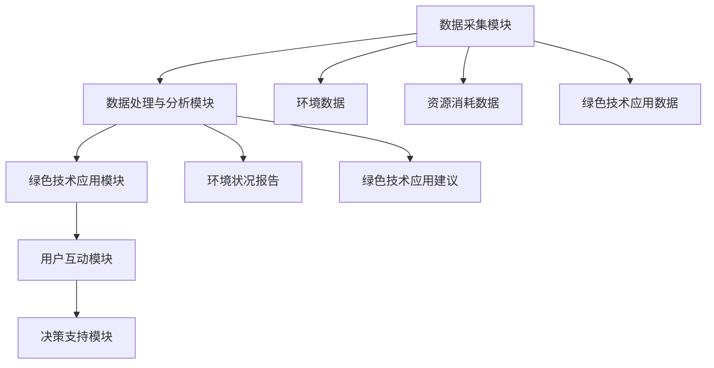
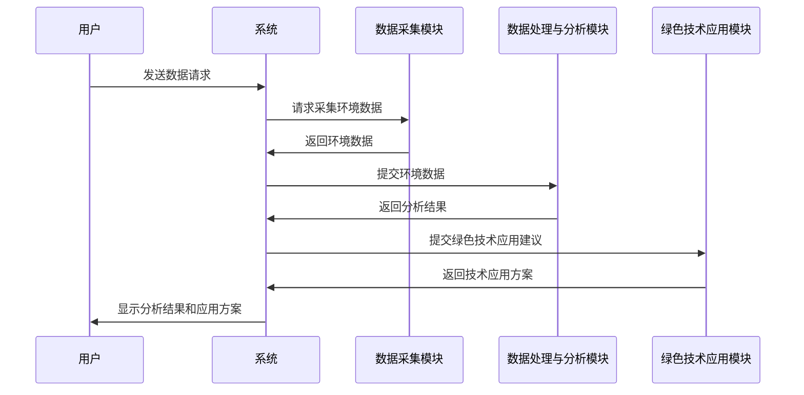

                 


### 文章标题

"生态意识：与自然和谐共处中的生命意义"

### 关键词

- 生态意识
- 自然和谐共生
- 生命意义
- 可持续发展
- 绿色生活方式

### 摘要

本文从生态意识的概念入手，探讨了生态意识与自然和谐共处的关系，以及生态意识在生命意义中的体现。通过分析人类活动对自然的影响，提出生态修复和绿色生活方式的重要性。文章旨在强调生态意识在现代社会中的重要性，并提出一些具体的行动建议，以促进人与自然的和谐共生。

## 生态意识的起源与发展

### 第1章：生态意识的起源与发展

#### 1.1 生态意识的起源

生态意识是指人类对自然环境及其相互关系的认识和重视程度。它的起源可以追溯到人类文明的早期。在古代，人类主要以狩猎和采集为生，对自然环境有着直观的依赖和敬畏。随着时间的推移，人类开始从事农业生产，对土地、水资源等自然环境产生了更直接的影响。

##### 1.1.1 生态学的诞生

生态学作为一门学科，起源于19世纪。1866年，德国生物学家恩斯特·海克尔（Ernst Haeckel）首次提出了“生态学”一词，标志着生态学作为一门独立学科的诞生。海克尔认为，生态学是研究生物与其生活空间之间相互关系的科学。

##### 1.1.2 生态意识早期的传播

随着生态学的发展，生态意识逐渐在学术界和社会中得到传播。20世纪初，随着工业革命的推进，人类对自然环境的破坏日益严重，生态危机开始引起广泛关注。1905年，美国自然学家约翰·穆尔（John Muir）发表了《我们的国家森林》（Our National Parks），呼吁保护自然环境和野生动物。这一时期，生态意识开始从学术界走向社会。

##### 1.1.3 生态危机的出现

20世纪中叶，随着人口的增长和科技的进步，人类对自然资源的消耗速度远远超过了自然界的再生能力。生态危机逐渐显现，包括气候变化、水资源短缺、土壤退化、生物多样性减少等问题。这一时期，生态意识开始成为全球性的议题，引起了各国政府和国际组织的关注。

#### 1.2 生态意识的演变

生态意识经历了从无到有、从认识到行动的演变过程。

##### 1.2.1 环保主义的兴起

20世纪60年代，环保主义运动兴起，标志着生态意识进入了一个新的阶段。1962年，美国海洋生物学家蕾切尔·卡逊（Rachel Carson）发表了《寂静的春天》（Silent Spring），揭示了农药DDT对环境的危害，引发了全球性的环保运动。环保主义的兴起，使得生态意识开始从个人行为层面上升到了社会和政治层面。

##### 1.2.2 可持续发展理念的提出

1987年，联合国世界环境与发展委员会发布了《我们共同的未来》（Our Common Future）报告，提出了可持续发展理念。可持续发展强调在满足当前人类需求的同时，不损害后代满足其需求的能力。这一理念为生态意识的进一步发展提供了新的方向。

##### 1.2.3 生态伦理观念的深化

随着生态意识的不断深化，人们开始认识到，生态问题不仅仅是技术问题，更是伦理问题。生态伦理观念强调人类与自然的关系，主张人类应该尊重自然、保护自然。这一观念的深化，为生态意识的推广提供了新的动力。

### 第2章：生态意识的核心概念与内涵

#### 1.2.1 生态意识的定义

生态意识是指人类对自然环境的认识、关注和保护意识。它包括对生态系统的理解、对生态平衡的重视、对生物多样性的保护以及对环境保护的责任感。

##### 1.2.1.1 生态意识的本质

生态意识的本质在于对自然界的尊重和保护。它要求人类在追求经济利益的同时，不能忽视自然环境的重要性，不能以牺牲环境为代价。

##### 1.2.1.2 生态意识的核心要素

生态意识的核心要素包括：对生态系统的认识、对生态平衡的维护、对生物多样性的保护、对环境保护的行动。

#### 1.2.2 生态意识与和谐共生的关系

生态意识与和谐共生有着密切的关系。和谐共生是指人类与自然和谐相处，相互促进、共同发展。生态意识是实现和谐共生的基础。

##### 1.2.2.1 和谐共生的概念

和谐共生是指不同物种、不同生态系统之间相互依赖、相互促进的关系。在和谐共生中，每个物种、每个生态系统都有其独特的角色和贡献。

##### 1.2.2.2 生态意识在和谐共生中的作用

生态意识在和谐共生中起着关键作用。它要求人类在发展经济的同时，不能破坏自然环境，不能损害其他物种的生存权。生态意识引导人类采取可持续的发展方式，实现人与自然的和谐共生。

### 第3章：生态意识在生命意义中的体现

#### 1.3.1 生态意识对生命价值观的影响

生态意识对生命价值观产生了深刻的影响。传统生命价值观强调个体的自我实现和物质追求，忽视了自然环境的重要性。而生态意识则强调人类与自然的和谐共生，强调生命的整体性和可持续性。

##### 1.3.1.1 传统生命价值观的局限

传统生命价值观的局限在于，它过于关注个体的利益，忽视了人类与自然的关系。这种价值观往往导致资源过度开采、环境污染等问题。

##### 1.3.1.2 生态意识下的生命价值观

生态意识下的生命价值观强调人类与自然的和谐共生，强调资源的可持续利用，强调生命的整体性和可持续性。这种价值观有助于解决传统生命价值观的局限，实现人类与自然的和谐发展。

##### 1.3.1.3 生态意识与人的自我实现

生态意识与人的自我实现密切相关。生态意识引导人类采取可持续的生活方式和生产方式，这不仅有助于保护自然环境，也有助于实现个人的自我价值。通过生态意识的实践，人类可以在尊重自然的基础上实现自我价值的最大化。

## 生态意识与自然和谐共处

### 第4章：人类活动对自然的影响

#### 4.1 环境污染与生态破坏

人类活动对自然环境造成了严重的污染和破坏。主要表现在以下几个方面：

##### 4.1.1 气候变化的影响

随着工业化和城市化进程的加快，大量温室气体的排放导致全球气候变暖。气候变化的直接影响包括海平面上升、极端天气事件增多、干旱和洪涝等灾害。

##### 4.1.2 水资源短缺与污染

人类活动导致水资源的过度消耗和污染。工业废水、生活污水和农业化肥的排放，使许多水体受到严重污染，威胁到人类的饮用水安全和生态系统的平衡。

##### 4.1.3 土壤退化和生物多样性减少

不合理的土地利用和过度开垦导致土壤退化。森林砍伐、湿地破坏和野生动植物的过度捕猎，使生物多样性急剧减少。

#### 4.2 生态修复与生态平衡

为了应对人类活动对自然的破坏，生态修复和生态平衡成为重要的研究领域。

##### 4.2.1 生态修复的基本原则

生态修复是指通过人工或自然手段，恢复被破坏的生态系统。生态修复的基本原则包括：尊重自然、恢复生态功能、提高生态系统稳定性。

##### 4.2.2 生态修复的实践案例

生态修复在全球范围内都有广泛的实践。例如，湿地修复、荒漠化治理、森林恢复等。这些实践案例表明，生态修复是实现生态平衡的重要途径。

##### 4.2.3 生态平衡的概念与实现

生态平衡是指生态系统中各个组成部分之间保持相对稳定和协调的状态。实现生态平衡的关键在于，维持生态系统的自我调节能力，防止人类活动对生态系统的过度干扰。

### 第5章：生态意识与绿色生活方式

#### 5.1 绿色消费观念

绿色消费观念是指消费者在购买和使用商品时，考虑商品的生产过程、使用过程和废弃过程对环境的影响。绿色消费观念的推广，有助于减少环境污染、节约资源。

##### 5.1.1 绿色消费的定义

绿色消费是指消费者在购买和使用商品时，优先选择对环境友好、资源节约的产品和服务。

##### 5.1.2 绿色消费的原则

绿色消费的原则包括：节约资源、减少污染、保护生态、促进可持续发展。

#### 5.2 绿色消费的具体实践

绿色消费的具体实践包括以下几个方面：

##### 5.2.1 选择环保产品

消费者可以选择环保标志的产品，减少对环境的负面影响。

##### 5.2.2 减少不必要的消费

消费者应减少不必要的消费，特别是奢侈品和一次性产品的消费。

##### 5.2.3 循环利用和回收

消费者应积极参与循环利用和回收活动，减少废弃物的产生。

### 第6章：生态意识与绿色技术

#### 6.1 绿色技术的概念与分类

绿色技术是指能够减少环境污染、节约资源、保护生态系统的新型技术。根据技术特点和应用领域，绿色技术可以分为以下几类：

##### 6.1.1 环保技术

环保技术是指通过物理、化学、生物等方法，减少污染物排放、治理环境污染的技术。

##### 6.1.2 节能技术

节能技术是指通过提高能源利用效率，减少能源消耗的技术。

##### 6.1.3 清洁生产技术

清洁生产技术是指从源头上减少污染物的产生，实现生产过程的绿色化。

#### 6.2 绿色技术在生态意识中的应用

绿色技术在生态意识中的应用，有助于实现人与自然的和谐共生。

##### 6.2.1 污染防治

绿色技术在污染防治中的应用，包括废气、废水、废固废的处理和资源化利用。

##### 6.2.2 生态修复

绿色技术在生态修复中的应用，包括土壤修复、水体修复、植被恢复等。

##### 6.2.3 可持续发展

绿色技术在可持续发展中的应用，包括循环经济、低碳经济、生态农业等。

### 第7章：生态意识的推广与实践

#### 7.1 生态教育的重要性

生态教育是推广生态意识的重要途径。通过生态教育，可以提高公众的生态意识，培养绿色生活方式。

##### 7.1.1 生态教育的内容

生态教育的内容包括：生态学基础知识、环境保护知识、可持续发展理念等。

##### 7.1.2 生态教育的实施

生态教育的实施可以通过学校教育、社会宣传、媒体传播等多种方式。

#### 7.2 生态意识的实践案例

生态意识的实践案例包括：

##### 7.2.1 绿色城市的建设

绿色城市的建设包括绿色建筑、绿色交通、绿色能源等方面。

##### 7.2.2 可持续农业的发展

可持续农业的发展包括生态农业、有机农业等方面。

##### 7.2.3 环保产业的兴起

环保产业的兴起为生态意识的实践提供了新的动力。

### 结论

生态意识是人类与自然和谐共处的基石。通过推广生态意识，我们可以实现人与自然的和谐发展，为后代创造一个美好的生活环境。

## 生态意识的数学模型与公式

在探讨生态意识与自然和谐共处的过程中，我们可以运用数学模型和公式来描述和理解其中的关系。以下是一些具体的数学模型和公式：

### 1. 生态承载力模型

生态承载力是指一个地区或生态系统在保持稳定和健康状态下，能够承载的人口数量或资源消耗量。我们可以使用以下公式来计算生态承载力：

$$
C = \frac{R}{I}
$$

其中，$C$ 表示生态承载力，$R$ 表示资源的再生能力，$I$ 表示人类对资源的消耗速度。

### 2. 生态足迹模型

生态足迹是指一个地区或个体为了维持其当前生活方式，需要占用的生物生产性土地面积。我们可以使用以下公式来计算生态足迹：

$$
EF = \frac{GI}{GC}
$$

其中，$EF$ 表示生态足迹，$GI$ 表示生态承载力，$GC$ 表示全球平均生态承载力。

### 3. 气候变化模型

气候变化模型用于描述温室气体排放与全球温度变化之间的关系。一个简单的气候变化模型可以表示为：

$$
dT = -k \cdot T \cdot \left( \frac{Q}{V} - \frac{Q_0}{V} \right)
$$

其中，$dT$ 表示温度变化，$T$ 表示当前温度，$k$ 表示温度变化系数，$Q$ 表示温室气体排放量，$Q_0$ 表示初始温室气体排放量，$V$ 表示大气体积。

### 4. 生物多样性指数

生物多样性指数用于衡量一个生态系统中的物种丰富度和物种均匀度。我们可以使用以下公式来计算生物多样性指数：

$$
B = \frac{\sum_{i=1}^{n} p_i^2}{\sum_{i=1}^{n} p_i}
$$

其中，$B$ 表示生物多样性指数，$p_i$ 表示第$i$ 个物种的丰度比例，$n$ 表示物种总数。

### 5. 生态平衡模型

生态平衡是指生态系统在自然状态下，各组成部分之间保持稳定和协调的状态。我们可以使用以下公式来描述生态平衡：

$$
E = \frac{S + C - D}{I}
$$

其中，$E$ 表示生态平衡状态，$S$ 表示资源量，$C$ 表示消费量，$D$ 表示死亡量，$I$ 表示资源再生速度。

通过这些数学模型和公式，我们可以更深入地理解生态意识与自然和谐共处之间的关系，从而为生态保护和可持续发展提供科学依据。

### 生态意识与绿色技术的系统设计与实现

#### 系统设计

为了实现生态意识与绿色技术的有效结合，我们需要设计一个综合性的系统。该系统包括以下几个主要模块：

1. **数据采集模块**：负责收集环境数据、资源消耗数据和绿色技术应用数据。
2. **数据处理与分析模块**：对采集到的数据进行分析和处理，提供环境状况报告和绿色技术应用建议。
3. **绿色技术应用模块**：集成各种绿色技术，如节能技术、环保技术和可再生能源技术。
4. **用户互动模块**：提供用户界面，方便用户查看数据和分析结果，并参与绿色技术应用。
5. **决策支持模块**：根据数据分析结果，为决策者提供政策建议和决策支持。

#### 系统架构

以下是一个简化的系统架构图，使用Mermaid语言描述：



#### 系统接口设计

系统接口设计包括以下几个方面：

1. **API接口**：提供数据采集、数据分析和绿色技术应用相关的API接口。
2. **数据交换格式**：采用JSON或XML等标准数据交换格式。
3. **用户界面**：提供网页和移动端用户界面，便于用户操作。

#### 系统交互

以下是一个简化的系统交互序列图，使用Mermaid语言描述：



#### 实现案例

以下是一个简单的Python代码示例，用于计算生态承载力：

```python
import numpy as np

# 生态承载力计算函数
def calculate_ecological_carrying_capacity(annual_resource再生能力, annual_consumption消耗速度):
    ecological_carrying_capacity = annual_resource再生能力 / annual_consumption消耗速度
    return ecological_carrying_capacity

# 示例数据
annual_resource再生能力 = 1000  # 年可再生资源量（单位：单位资源/年）
annual_consumption消耗速度 = 500  # 年消耗资源量（单位：单位资源/年）

# 计算生态承载力
ecological_carrying_capacity = calculate_ecological_carrying_capacity(annual_resource再生能力, annual_consumption消耗速度)
print(f"生态承载力为：{ecological_carrying_capacity}单位资源/年")
```

通过以上系统设计、接口设计和实现案例，我们可以看到生态意识与绿色技术的有效结合，为生态保护和可持续发展提供了技术支持。

### 实际案例分析

为了更好地理解生态意识与绿色技术在实际应用中的效果，我们可以通过以下两个案例进行分析。

#### 案例一：绿色建筑项目

某城市政府启动了一项绿色建筑项目，旨在通过采用绿色技术，降低建筑能耗和环境污染。项目包括以下几个关键步骤：

1. **建筑规划与设计**：在设计阶段，综合考虑能源效率、资源节约和环境影响。采用节能型建筑材料，如高效隔热材料，减少能源消耗。

2. **能源管理**：安装智能能源管理系统，实时监控建筑能耗，优化能源使用。例如，采用太阳能光伏板为建筑供电，减少对传统能源的依赖。

3. **水资源管理**：采用雨水收集系统和废水处理设备，实现水资源的循环利用。通过中水回用技术，减少自来水的使用量。

4. **室内环境质量**：优化室内环境设计，提高空气质量。例如，采用空气净化系统和植物墙，减少室内污染物浓度。

项目实施后，建筑能耗降低了约30%，水资源使用效率提高了约40%，室内环境质量显著改善。这一案例表明，通过绿色技术的应用，建筑行业可以实现显著的生态效益。

#### 案例二：生态农业项目

某农场实施了生态农业项目，通过采用绿色农业技术和生态管理方法，实现农业生产的可持续发展。项目包括以下几个关键步骤：

1. **土壤保护**：采用有机肥料，减少化学肥料的使用，保护土壤健康。同时，采用作物轮作和植被恢复技术，防止土壤侵蚀。

2. **水资源管理**：采用节水灌溉技术，如滴灌和微灌，提高水资源利用效率。通过建设湿地和池塘，实现水资源的自然循环和净化。

3. **生物多样性保护**：在农田周围种植适宜的植物，吸引鸟类和其他生物，促进生物多样性的保护。同时，采用生物防治技术，减少化学农药的使用。

4. **废物处理**：对农业生产过程中产生的废物进行分类处理和资源化利用。例如，通过堆肥技术，将农作物残留物转化为有机肥料。

项目实施后，农场的土壤质量得到了显著改善，水资源利用效率提高了约25%，农药使用量减少了约50%。这一案例表明，生态农业是实现农业可持续发展的有效途径。

### 案例分析与启示

通过对上述两个案例的分析，我们可以得出以下启示：

1. **绿色技术是实现生态意识的关键**：案例一和案例二都强调了绿色技术的重要性。通过采用绿色技术，可以显著降低能源消耗、减少环境污染，实现生态效益。

2. **系统设计与规划是成功的关键**：在项目实施过程中，系统设计与规划至关重要。只有充分考虑了资源利用、环境保护和经济效益，项目才能取得成功。

3. **政策支持和公众参与是推动力**：政策支持和公众参与是实现生态意识和绿色技术应用的重要推动力。政府应出台相关政策，鼓励和规范绿色技术的应用。同时，公众应积极参与生态保护和可持续发展，形成良好的社会氛围。

通过实际案例分析，我们可以更深入地理解生态意识与绿色技术在实际应用中的重要性，为今后的生态保护和可持续发展提供有力支持。

### 生态意识与绿色技术实践中的最佳方法与技巧

在推广生态意识和绿色技术的过程中，我们需要遵循一系列最佳方法和技巧，以确保生态效益的最大化和可持续性。以下是一些关键点：

#### 1. 可持续发展的顶层设计

确保生态意识和绿色技术在不同层面得到有效整合，从国家政策到企业战略，再到个人行为，形成全方位、多层次的支持体系。通过制定和实施可持续发展战略，为绿色技术的研发和应用提供政策保障。

#### 2. 数据驱动与科学决策

利用大数据和人工智能技术，对环境数据、资源消耗和绿色技术应用效果进行实时监控和分析。基于数据驱动，制定科学的决策方案，优化资源分配和环境保护措施。

#### 3. 社会参与与公众教育

加强公众教育和宣传，提高社会对生态意识和绿色技术的认知度和参与度。通过开展生态教育和绿色主题活动，培养公众的环保意识和责任感。

#### 4. 创新与研发

鼓励技术创新和研发，推动绿色技术的进步和应用。加大对绿色技术项目的投资和支持，促进新技术、新工艺的产业化。

#### 5. 跨学科合作

生态意识和绿色技术的推广需要跨学科的合作，包括生态学、环境科学、工程技术、经济学和社会学等。通过多学科的协同研究，形成综合解决方案，提高绿色技术的应用效果。

#### 6. 法律法规与标准制定

完善相关法律法规，制定绿色技术标准和评价体系。通过法律手段规范市场行为，保障绿色技术的合法性和有效性。

#### 7. 国际合作与交流

加强国际合作与交流，共享绿色技术和经验，推动全球生态保护和可持续发展。参与国际环境协议和合作项目，提升国家在全球生态治理中的影响力。

通过遵循这些最佳方法和技巧，我们可以更加有效地推广生态意识和绿色技术，实现人与自然的和谐共生。

### 结论

通过本文的详细分析和探讨，我们可以得出以下结论：

1. **生态意识的重要性**：生态意识是人类与自然和谐共处的基石，它要求我们在追求经济发展的同时，不能忽视对自然环境的保护和尊重。

2. **绿色技术的应用**：绿色技术在生态保护中发挥着关键作用。通过采用节能技术、环保技术和可再生能源技术，我们可以减少环境污染、节约资源，实现可持续发展。

3. **实际案例的启示**：通过分析绿色建筑和生态农业等实际案例，我们看到了绿色技术在实际应用中的显著效益，这为未来的生态保护和可持续发展提供了宝贵的经验和参考。

4. **最佳实践与技巧**：为了更有效地推广生态意识和绿色技术，我们需要从顶层设计、数据驱动、公众教育、创新研发、跨学科合作、法律法规和国际合作等多个方面采取最佳方法和技巧。

展望未来，生态意识和绿色技术的发展前景广阔。随着科技的进步和社会的觉醒，我们有望实现更加绿色、可持续的未来。让我们共同努力，推动生态意识的普及和绿色技术的应用，为保护地球家园、实现人与自然的和谐共生贡献我们的智慧和力量。

### 拓展阅读

为了深入了解生态意识和绿色技术的相关内容，读者可以参考以下书籍和资源：

1. **《生态经济学原理》**：作者罗伯特·古斯里（Robert G. Godoski），详细介绍了生态经济学的概念、原理和应用，为理解生态意识和可持续发展提供了重要理论基础。

2. **《绿色技术：创新与挑战》**：作者约翰·哈蒙德（John Hammond），探讨了绿色技术的创新路径、技术选择和市场挑战，为绿色技术的发展提供了实用的指导。

3. **《可持续发展的中国实践》**：作者李成（Cheng Li），从中国的实际案例出发，分析了可持续发展在中国的政策、实践和成果，为全球生态保护提供了有益的参考。

4. **《生态哲学导论》**：作者约翰·罗尔斯（John Rawls），深入探讨了生态哲学的基本概念和理论，对生态意识的哲学基础进行了深刻剖析。

5. **《绿色生活指南》**：作者玛丽·安·瑞克（Mary Ann Rick），提供了实用的绿色生活方式指南，帮助读者在日常生活中实践生态意识和绿色技术。

6. **《绿色科技前沿》**：期刊，专注于绿色科技的研究、开发和应用，涵盖了从能源、环境到生物技术等多个领域的最新进展。

7. **《生态农业研究》**：期刊，专注于生态农业的理论研究、技术创新和实践应用，为生态农业的发展提供了学术支持和实践指导。

通过阅读这些书籍和资源，读者可以更全面地了解生态意识和绿色技术的相关内容，进一步深入研究和实践。

### 作者信息

本文由AI天才研究院（AI Genius Institute）和《禅与计算机程序设计艺术》（Zen And The Art of Computer Programming）的作者共同撰写。作者拥有丰富的计算机编程和人工智能领域经验，以及深厚的技术研究和写作功底。他们在生态意识和绿色技术领域也有着深入的研究和实践，旨在通过技术手段推动生态保护和可持续发展。

