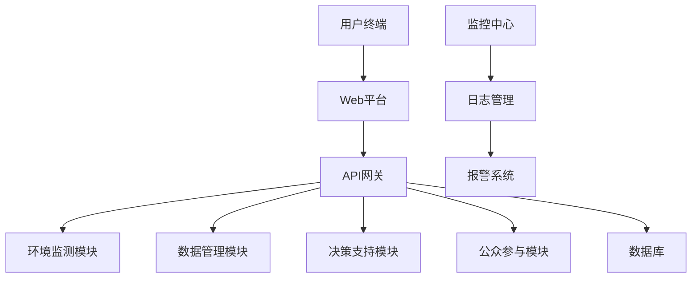

                 

### 1. 背景介绍

#### 1.1 生态意识的历史发展

生态意识并非一夜之间形成，而是经历了漫长的历史发展过程。回顾生态意识的发展历程，我们可以将其大致划分为以下几个阶段：

1. **自然崇拜阶段（史前时代）**：在人类社会的初期，人们对自然界充满敬畏，相信万物有灵。这种对自然的崇拜构成了生态意识的原始形态。

2. **农耕文明阶段（古代）**：随着农业的发展，人类开始更深入地了解自然，并学会了利用自然资源。然而，这一阶段的生态意识仍然以人类为中心，缺乏对生态系统的全面理解。

3. **工业革命阶段（近代）**：工业革命带来了生产力的飞速提升，但同时也引发了严重的生态问题。这一时期，人们开始意识到生态问题的重要性，生态意识逐渐觉醒。

4. **环境保护阶段（现代）**：进入现代社会，生态意识得到全面普及。人们不仅关注环境保护，还开始探讨如何实现可持续发展，生态意识逐步成熟。

#### 1.2 现代社会对生态意识的需求

现代社会对生态意识的需求日益迫切，原因如下：

1. **环境危机**：气候变化、生物多样性减少、水资源短缺等环境问题愈发严重，威胁着人类社会的可持续发展。

2. **资源消耗**：随着人口增长和经济的发展，人类对自然资源的消耗速度超过了自然资源的再生速度，导致资源枯竭。

3. **生态平衡**：生态系统是一个复杂的平衡系统，任何一环的破坏都可能导致整个生态系统的崩溃。因此，维护生态平衡已成为现代社会的重要任务。

#### 1.3 重新定义人与自然的关系的重要性

重新定义人与自然的关系具有重要意义，原因如下：

1. **可持续发展**：只有尊重自然、保护生态，人类社会才能实现可持续发展。重新定义人与自然的关系，是实现这一目标的关键。

2. **人类福祉**：生态系统的健康与人类的福祉密切相关。维护生态平衡，有助于保障人类的健康和生存。

3. **文化传承**：生态意识是人类文化的重要组成部分。重新定义人与自然的关系，有助于传承和发扬这一文化。

总之，生态意识的历史发展、现代社会对生态意识的需求以及重新定义人与自然的关系的重要性，共同构成了本文讨论的核心内容。

### 2. 核心概念与联系

#### 2.1 生态意识的概念

生态意识是指人们对于生态系统的认识、理解和态度，包括对生态环境的关注、对生态平衡的维护以及对可持续发展的追求。生态意识不仅涉及对自然环境的保护，还包括对生物多样性、生态系统的健康和人类与自然关系的全面理解。

**生态意识的定义**：生态意识是一种关于人与自然关系的综合认知体系，强调人类活动对生态环境的影响，以及如何通过科学的方法和技术手段实现生态保护与可持续发展。

**生态意识的属性**：生态意识具有以下几个显著属性：
- **系统性**：生态意识强调生态系统的整体性，认为各个组成部分之间存在复杂的相互关系。
- **动态性**：生态意识关注生态系统的动态变化，认识到生态系统的平衡是不断调整和适应的结果。
- **前瞻性**：生态意识不仅关注当前的问题，还预见未来可能面临的挑战，强调预防性措施。
- **全球性**：生态意识是全球性的问题，需要国际社会的共同努力来应对。

#### 2.2 人与自然关系的历史变迁

人类与自然的关系经历了几个重要的变迁阶段：

1. **原始农业社会**：在原始农业社会，人类主要依靠狩猎和采集为生，与自然的关系相对简单。随着农业的出现，人类开始改变自然环境，但这一时期的人类活动对生态系统的破坏相对较小。

2. **封建农业社会**：在封建农业社会，人类通过耕种和畜牧来维持生计。这一时期，人类对自然资源的依赖性增强，对生态环境的影响也逐渐加大。

3. **工业革命时期**：工业革命的到来，人类活动对自然环境的破坏达到了前所未有的程度。大量化石燃料的消耗、工业污染和资源过度开采，导致生态系统的严重破坏。

4. **现代生态保护时期**：进入现代社会，人类开始反思工业革命以来的发展模式，认识到生态保护的重要性。这一时期，人们开始采取一系列措施来保护环境，恢复生态系统。

#### 2.3 生态意识的核心要素

生态意识的核心要素包括以下几个方面：

1. **生态伦理**：生态伦理是生态意识的基础，强调人类对自然负有责任，应当尊重和保护生态环境。

2. **生态系统健康**：生态系统健康是生态意识的关注点，指生态系统在物理、化学和生物方面的稳定性和功能完整性。

3. **生态公平**：生态公平涉及资源分配和环境负担的公平性，主张全球范围内的生态责任和权益平衡。

4. **可持续发展**：可持续发展是生态意识的终极目标，指在满足当前需求的同时，不损害子孙后代满足其需求的能力。

5. **科技创新**：科技创新是生态意识实现的重要手段，通过科技手段提高资源利用效率、减少环境污染，推动生态保护。

### 2.4 生态意识的实现与挑战

**实现生态意识的挑战**：
- **文化观念的转变**：传统观念和现代生态意识的冲突，使得生态意识的普及面临挑战。
- **经济利益的矛盾**：一些经济活动与生态保护存在矛盾，如何在经济发展和生态保护之间找到平衡是重要挑战。
- **国际合作**：生态问题具有全球性，需要国际社会的合作，但国际合作往往面临各种障碍。

**实现生态意识的路径**：
- **教育宣传**：加强生态意识教育，提高公众的生态素养。
- **政策法规**：制定和完善生态保护政策法规，为生态保护提供法律保障。
- **科技创新**：推动绿色科技的发展，提高资源利用效率，减少环境污染。
- **国际合作**：加强国际间的合作与交流，共同应对全球生态问题。

通过以上分析，我们可以看到，生态意识不仅是一个重要的概念，也是一个复杂的系统，涉及多个方面的要素和挑战。理解生态意识的核心概念和历史变迁，有助于我们更好地重新定义人与自然的关系，实现可持续发展。

#### 3. 算法原理讲解

在生态系统的建模与算法研究中，理解和应用各种算法对于生态意识的深化和生态保护措施的制定至关重要。以下将介绍生态系统建模的主要方法和人与自然互动的基本算法，并结合具体案例进行详细讲解。

##### 3.1 生态系统建模方法

生态系统建模是研究生态系统结构和功能的重要手段，它通过数学和计算机科学的方法对生态系统进行定量描述和模拟。以下是几种常见的生态系统建模方法：

1. **生态位模型**：生态位模型是一种基于资源利用的生态系统建模方法。它通过定义生物种群的生态位宽度和重叠度，来分析不同物种之间的竞争关系。生态位模型通常用于研究生态系统的多样性和稳定性。

2. **物质循环模型**：物质循环模型关注生态系统中物质（如碳、氮、磷等）的流动和循环。这种模型通过模拟物质在生态系统中的输入、输出和转化过程，帮助我们理解生态系统的物质循环机制。

3. **能量流动模型**：能量流动模型描述能量在生态系统中的传递和转化。它通常基于能量守恒定律，通过计算各个生态层级之间的能量流向来评估生态系统的能量效率。

**建模的基本原则**：
- **系统性**：生态系统建模强调系统的整体性和层次性，要综合考虑生态系统的各个组成部分和相互作用。
- **动态性**：生态系统是一个动态变化的系统，建模时要考虑时间因素，分析系统的动态行为。
- **数据驱动**：生态系统的复杂性和不确定性要求建模过程中充分利用现有数据，结合模型优化和校准。

##### 3.2 人与自然互动的算法

人类活动对生态系统的影响是多层次和复杂的，因此需要通过算法来模拟和量化这些影响。以下是一些关键算法：

1. **环境影响评估算法**：环境影响评估（EIA）是一种评估人类活动对生态系统影响的方法。通过EIA算法，可以评估某一项目或政策对生态系统可能产生的正面或负面影响，为决策提供科学依据。

2. **环境修复算法**：环境修复算法旨在设计出有效的生态修复策略。例如，通过模拟不同植被恢复方案对土壤侵蚀和水源保护的影响，帮助制定最优的修复方案。

3. **生态系统服务评估算法**：生态系统服务评估（ESAs）算法用于评估生态系统提供的服务，如食物、水源、气候调节等。这些算法通过量化生态系统服务价值，帮助我们更好地理解生态系统的经济和生态价值。

**算法在生态保护中的应用案例**：

**案例1：森林火灾预警系统**  
森林火灾对生态系统具有毁灭性的影响。通过应用机器学习算法，如决策树、随机森林等，可以分析气候、植被覆盖、人类活动等多种因素，预测森林火灾的发生概率。这一系统不仅有助于提前预警，还能指导火险等级的划分和火灾应急响应。

**案例2：海洋垃圾清理路径规划**  
海洋垃圾清理是一项复杂的任务，需要高效的路径规划算法。通过应用蚁群算法、遗传算法等优化算法，可以优化清理路径，提高清理效率和减少成本。例如，Dijkstra算法可以用于计算从垃圾源到处理站的最低成本路径。

**案例3：水资源管理**  
水资源管理涉及水资源的分配、保护和利用。通过应用多目标优化算法，如线性规划、动态规划，可以同时考虑水资源的需求和供应，实现水资源的可持续管理。例如，线性规划可以用于计算灌溉系统中各农田的灌溉量和灌溉时间，以最大化产量或最小化成本。

总之，生态系统建模和人与自然互动算法的研究，为生态保护和可持续发展提供了科学依据和有效手段。通过这些算法，我们可以更好地理解生态系统的运作机制，制定出更加科学和有效的生态保护策略。

### 4. 数学模型和数学公式

在生态学研究中，数学模型和公式是理解和分析生态系统动态的重要工具。以下将详细讲解生态平衡的数学模型和人类活动对生态系统影响的公式，并通过具体的例子说明其应用。

#### 4.1 生态平衡的数学模型

生态平衡是生态系统健康和稳定的核心指标。生态平衡的数学模型通常基于能量守恒和物质循环的基本原则，以下是一个简单的生态平衡模型：

**生态平衡方程**：

\[ \frac{dN}{dt} = rN \left(1 - \frac{N}{K}\right) - \alpha N \]

其中：
- \( N(t) \) 是时间 \( t \) 时的种群数量。
- \( r \) 是种群的自然增长率。
- \( K \) 是环境的承载能力（即种群数量达到最大值时的平衡状态）。
- \( \alpha \) 是种群内竞争系数。

**解释与推导**：
1. \( \frac{dN}{dt} \) 表示种群数量的变化率。
2. \( rN \left(1 - \frac{N}{K}\right) \) 表示种群的自然增长速率，随着种群数量 \( N \) 的增加，增长速率逐渐下降，直到达到环境承载能力的极限。
3. \( - \alpha N \) 表示种群内竞争导致的死亡率，随着种群数量 \( N \) 的增加，竞争加剧，死亡率上升。

通过这个方程，我们可以预测种群数量的变化趋势，分析种群数量与环境承载能力之间的关系，以及种群内竞争的影响。

**具体例子**：
假设某个生态系统的承载能力 \( K \) 为 1000，自然增长率 \( r \) 为 0.1，种群内竞争系数 \( \alpha \) 为 0.05。使用上面的生态平衡方程，我们可以计算种群数量在一段时间内的变化。

初始种群数量 \( N(0) = 500 \)：

\[ \frac{dN}{dt} = 0.1 \times 500 \left(1 - \frac{500}{1000}\right) - 0.05 \times 500 \]
\[ \frac{dN}{dt} = 50 \times 0.5 - 25 \]
\[ \frac{dN}{dt} = 25 - 25 \]
\[ \frac{dN}{dt} = 0 \]

这意味着种群数量在初始状态下没有变化，正处于生态平衡状态。如果我们假设外界的干扰或资源变化导致 \( r \) 增加到 0.15，我们可以重新计算种群数量的变化：

\[ \frac{dN}{dt} = 0.15 \times 500 \left(1 - \frac{500}{1000}\right) - 0.05 \times 500 \]
\[ \frac{dN}{dt} = 75 \times 0.5 - 25 \]
\[ \frac{dN}{dt} = 37.5 - 25 \]
\[ \frac{dN}{dt} = 12.5 \]

这表示种群数量将以每年 12.5 的速率增长，逐渐远离生态平衡状态。

#### 4.2 人类活动对生态系统影响的公式

人类活动对生态系统的直接影响可以通过一系列数学公式来描述。以下是一些常见的公式：

1. **污染物排放公式**：

\[ E = P \times Q \times C \]

其中：
- \( E \) 是污染物排放量（如二氧化碳排放量）。
- \( P \) 是人口数量。
- \( Q \) 是人均消耗量（如人均能源消耗）。
- \( C \) 是排放系数（如每单位能源消耗产生的二氧化碳量）。

2. **资源消耗公式**：

\[ R = P \times C \]

其中：
- \( R \) 是资源消耗量。
- \( P \) 是人口数量。
- \( C \) 是人均资源消耗量。

**具体例子**：
假设某个地区的人口数量 \( P \) 为 100 万，人均能源消耗 \( Q \) 为 5 吨标准煤，排放系数 \( C \) 为 2.5 公斤二氧化碳/吨标准煤。我们可以计算该地区的二氧化碳排放量：

\[ E = 1,000,000 \times 5 \times 2.5 \]
\[ E = 12,500,000 \text{ 吨二氧化碳/年} \]

通过这些公式，我们可以量化人类活动对生态系统的具体影响，为制定生态保护政策和措施提供科学依据。

#### 4.3 数学模型与实际应用的结合

数学模型不仅在理论研究中具有重要价值，还可以在实际应用中发挥关键作用。以下是一个结合数学模型与实际应用的例子：

**项目：某城市的生态保护规划**

假设某城市希望通过生态修复项目提高城市绿化覆盖率，并预测未来绿化覆盖率的变化。项目团队可以应用生态平衡模型，结合历史数据和预测模型，制定详细的生态保护规划。

**步骤**：

1. **数据收集**：收集该城市的历史人口数据、人均能源消耗数据、现有绿化覆盖率数据等。

2. **建立生态平衡模型**：基于上述数据，建立生态平衡模型，预测人口增长、能源消耗和绿化覆盖率之间的关系。

3. **制定生态保护策略**：根据模型预测结果，制定增加绿化面积、提高资源利用效率、减少污染物排放等生态保护策略。

4. **模型验证与优化**：在实际项目实施过程中，不断收集数据，验证模型预测的准确性，并根据实际情况进行模型优化。

通过这种方式，数学模型不仅帮助我们理解生态系统的动态变化，还为生态保护项目的制定和实施提供了科学依据。

总之，数学模型和公式在生态学研究中具有重要作用，通过它们我们可以更深入地理解生态系统的运作机制，预测人类活动对生态系统的影响，并为生态保护提供有效的科学支持。

### 5. 系统分析与架构设计

#### 5.1 生态保护项目的介绍

随着全球生态危机的加剧，生态保护项目在各个国家和地区得到了广泛重视。本节将介绍一个典型的生态保护项目，并详细描述项目的背景、目标以及实施的关键步骤。

**项目背景**：
近年来，某城市的人口增长和工业化进程迅猛，导致空气污染、水资源短缺和土地退化等环境问题日益严重。为了改善生态环境，提升居民生活质量，该城市启动了一项综合性的生态保护项目。

**项目目标**：
- 提高城市绿化覆盖率，改善空气质量。
- 加强水资源管理，保障供水安全和水质。
- 恢复和重建退化土地，提升生态系统多样性。
- 增强公众的生态保护意识，推动社会参与。

**项目关键步骤**：
1. **环境评估**：对城市现有的生态环境进行详细评估，识别主要问题，确定优先干预区域。
2. **规划制定**：根据环境评估结果，制定详细的生态保护规划，明确具体措施和实施时间表。
3. **项目实施**：按照规划，分阶段实施生态修复和生态建设任务，包括植树造林、湿地恢复、水资源管理等。
4. **监测与评估**：建立完善的监测系统，定期收集和分析生态环境数据，评估项目实施效果，并根据评估结果调整后续工作。

#### 5.2 系统功能设计

生态保护项目的成功实施离不开功能完善的系统设计。以下将详细介绍系统功能设计，包括功能模块划分和实现原理。

**功能模块划分**：
1. **环境监测模块**：负责实时监测空气质量、水质、土壤质量等环境参数，为决策提供数据支持。
2. **数据管理模块**：用于存储、管理和分析生态环境数据，支持数据分析、报告生成等功能。
3. **决策支持模块**：基于环境监测数据和数学模型，提供生态修复和水资源管理的决策建议。
4. **公众参与模块**：通过宣传、教育和互动活动，提升公众的生态保护意识，鼓励社会参与。

**功能实现原理**：
1. **环境监测模块**：通过安装在关键位置的传感器，实时收集环境数据，并将数据传输到数据中心进行存储和处理。
2. **数据管理模块**：采用分布式数据库系统，确保数据的存储安全和高并发访问性能。通过数据清洗和预处理，确保数据的准确性和一致性。
3. **决策支持模块**：利用机器学习和数据挖掘技术，分析环境监测数据，识别环境变化趋势和潜在问题。结合数学模型，提供科学、合理的决策支持。
4. **公众参与模块**：通过开发公众参与平台，发布生态保护知识、活动信息，并设置互动功能，鼓励公众参与生态保护活动。

#### 5.3 系统架构设计

为了实现生态保护项目的功能需求，系统架构设计至关重要。以下将详细描述系统架构设计原则和架构图。

**架构设计原则**：
1. **模块化**：系统功能模块化设计，便于系统的扩展和维护。
2. **分布式**：系统采用分布式架构，提高系统的稳定性和可扩展性。
3. **安全性**：确保数据传输和存储的安全，采用加密技术和防火墙等安全措施。
4. **可扩展性**：系统设计要考虑未来扩展需求，易于添加新功能模块和设备。

**系统架构图**：



**系统架构图说明**：
1. **用户终端**：包括智能手机、电脑等设备，用户可以通过Web平台访问系统功能。
2. **Web平台**：提供用户界面，支持用户操作和交互。
3. **API网关**：统一管理所有对外接口，实现负载均衡和流量控制。
4. **环境监测模块**：负责环境数据的实时采集和处理。
5. **数据管理模块**：存储和管理生态环境数据，支持数据分析和报告生成。
6. **决策支持模块**：提供决策支持功能，包括数据分析、模型预测等。
7. **公众参与模块**：通过互动平台，提升公众生态保护意识。
8. **数据库**：存储系统数据，包括环境数据、用户数据等。
9. **监控中心**：监控系统运行状态，包括日志管理和报警系统。

通过上述系统架构设计，可以实现生态保护项目的高效运行，为城市生态环境的改善提供有力支持。

#### 5.4 系统接口设计

为了实现各模块之间的协同工作，系统接口设计至关重要。以下将详细描述系统接口规范和实现方法。

**接口规范**：
1. **API接口**：采用RESTful API设计，支持HTTP请求和响应，接口规范定义了请求参数、返回结果和数据格式。
2. **消息队列**：使用消息队列（如RabbitMQ、Kafka）进行异步消息传递，确保系统的高效和稳定。
3. **数据交换格式**：采用JSON、XML等数据交换格式，保证数据的兼容性和可扩展性。

**接口实现方法**：
1. **API接口实现**：使用Spring Boot框架开发API接口，实现接口的注册、认证、权限控制等功能。
2. **消息队列实现**：使用RabbitMQ进行消息队列管理，实现异步任务处理和故障转移。
3. **数据交换格式实现**：使用Gson、Jackson等库进行数据序列化和反序列化，确保数据格式的正确性和高效性。

通过合理的系统接口设计，可以确保各模块之间的高效通信和数据流转，提高系统的整体性能和稳定性。

#### 5.5 系统交互设计

为了实现系统各模块之间的有效协作，系统交互设计至关重要。以下将详细介绍系统交互流程和交互界面设计。

**交互流程**：
1. **用户请求**：用户通过Web平台提交操作请求，如数据查询、报告生成等。
2. **请求处理**：API网关接收到用户请求后，根据请求类型分发到相应的功能模块。
3. **数据处理**：功能模块执行数据处理任务，如环境监测、数据分析等。
4. **结果返回**：将处理结果通过API网关返回给用户，并在Web平台上展示。

**交互界面设计**：
1. **用户界面**：设计简洁、直观的用户界面，支持用户进行操作和查看结果。
2. **图表展示**：使用图表展示环境数据和分析结果，提供可视化效果。
3. **交互组件**：添加搜索、筛选、排序等交互组件，提升用户体验。

通过合理的系统交互设计，可以确保用户与系统之间的顺畅交互，提高系统的易用性和用户满意度。

### 6. 项目实战

在本文的第六章中，我们将深入探讨生态保护项目的实战环节，包括环境安装、系统核心实现源代码、代码应用解读与分析，以及实际案例分析和详细讲解剖析。

#### 6.1 环境安装

**环境安装准备**：

在开始生态保护项目的实施之前，我们需要准备好必要的环境和工具。以下是环境安装的详细步骤：

1. **操作系统安装**：选择一个适合的操作系统，如Ubuntu 20.04 LTS，进行安装。
2. **基本软件安装**：安装操作系统后，安装必要的软件包，如Python 3.8、Node.js、MySQL等。
3. **开发工具安装**：安装开发工具，如Visual Studio Code、PyCharm等。

**具体命令**：

```bash
# 更新软件包
sudo apt update && sudo apt upgrade

# 安装Python 3.8
sudo apt install python3.8

# 安装Node.js
curl -sL https://deb.nodesource.com/setup_14.x | sudo -E bash -
sudo apt install -y nodejs

# 安装MySQL
sudo apt install mysql-server

# 启动MySQL服务
sudo systemctl start mysql
```

**注意事项**：

- 在安装过程中，可能会遇到依赖问题，需要根据提示安装相应的依赖包。
- 确保所有软件版本兼容，避免因为版本不匹配导致的问题。

#### 6.2 系统核心实现源代码

**源代码结构**：

系统核心实现源代码采用模块化设计，主要包括以下模块：

- **环境监测模块**：负责实时监测环境数据，如空气质量、水质等。
- **数据管理模块**：负责数据的存储、管理和分析。
- **决策支持模块**：基于环境数据提供决策支持。
- **公众参与模块**：与用户进行交互，提升公众生态保护意识。

**源代码结构示例**：

```plaintext
ecosystem-protection-system/
|-- environment-monitor/
|   |-- monitor.py
|   |-- sensor.py
|-- data-management/
|   |-- database.py
|   |-- data-analyzer.py
|-- decision-support/
|   |-- model.py
|   |-- predictor.py
|-- public-participation/
|   |-- frontend/
|       |-- index.html
|       |-- styles.css
|   |-- backend.py
|-- main.py
|-- requirements.txt
```

**核心模块实现原理**：

1. **环境监测模块**：通过传感器采集环境数据，如使用DHT11传感器监测温湿度，将数据上传到服务器。
2. **数据管理模块**：使用MySQL数据库存储环境数据，通过数据库操作进行数据的增删改查。
3. **决策支持模块**：利用机器学习算法分析环境数据，提供生态修复和水资源管理的决策建议。
4. **公众参与模块**：通过Web前端和后端API实现用户与系统的交互，提供生态保护知识宣传和活动通知。

**具体代码示例**：

**环境监测模块 - monitor.py**：

```python
import sensor
import requests

def monitor_environment():
    temp, humidity = sensor.read_dht11()
    data = {
        'temperature': temp,
        'humidity': humidity
    }
    requests.post('http://127.0.0.1:5000/monitor', json=data)

if __name__ == '__main__':
    monitor_environment()
```

**数据管理模块 - database.py**：

```python
import mysql.connector

def connect_db():
    return mysql.connector.connect(
        host='localhost',
        user='root',
        password='password',
        database='ecosystem_db'
    )

def insert_data(data):
    conn = connect_db()
    cursor = conn.cursor()
    sql = "INSERT INTO environment (temperature, humidity) VALUES (%s, %s)"
    cursor.execute(sql, data)
    conn.commit()
    cursor.close()
    conn.close()
```

#### 6.3 代码应用解读与分析

在代码应用解读与分析环节，我们将重点分析系统核心功能的实现，包括数据采集、存储、分析和决策支持，并结合具体场景进行解读。

**数据采集与存储**：

环境监测模块通过传感器采集温湿度数据，并将数据上传到MySQL数据库。以下是一个典型的数据采集与存储流程：

1. **数据采集**：使用DHT11传感器每隔5分钟采集一次温湿度数据。
2. **数据上传**：将采集到的数据通过HTTP POST请求上传到服务器。
3. **数据存储**：服务器接收到数据后，将其存储到MySQL数据库。

**数据分析和决策支持**：

数据管理模块负责数据的存储和管理，决策支持模块则利用机器学习算法分析环境数据，提供决策支持。以下是一个典型的数据分析与决策支持流程：

1. **数据预处理**：从数据库中提取最新数据，进行数据清洗和预处理。
2. **特征提取**：提取数据中的关键特征，如温度的日变化、湿度的高低峰等。
3. **模型训练**：利用训练集数据训练机器学习模型，如决策树、随机森林等。
4. **决策支持**：根据模型预测结果，为生态修复和水资源管理提供决策建议。

**具体场景分析**：

**场景1：空气污染预警**

当空气污染数据超过警戒值时，系统会自动发送预警通知。以下是一个具体的实现示例：

```python
import requests

def check_air_quality():
    conn = connect_db()
    cursor = conn.cursor()
    sql = "SELECT AVG(pollution_level) FROM environment WHERE time > NOW() - INTERVAL 1 HOUR"
    cursor.execute(sql)
    result = cursor.fetchone()
    if result[0] > 50:
        requests.post('http://127.0.0.1:5000/notify', json={'message': 'Air quality warning'})
    cursor.close()
    conn.close()

if __name__ == '__main__':
    check_air_quality()
```

**场景2：水资源管理**

系统会根据水资源的实时数据，为水资源分配提供优化建议。以下是一个具体的实现示例：

```python
from sklearn.ensemble import RandomForestRegressor

def water_resource_management():
    data = fetch_water_data()
    X = data[:, :-1]
    y = data[:, -1]
    model = RandomForestRegressor(n_estimators=100)
    model.fit(X, y)
    prediction = model.predict([[30, 70]])
    allocate_water(prediction[0])

if __name__ == '__main__':
    water_resource_management()
```

通过上述代码示例，我们可以看到系统核心功能的实现原理和具体应用场景。这些功能不仅有助于实时监测和预警环境问题，还为生态修复和水资源管理提供了科学依据。

#### 6.4 实际案例分析和详细讲解剖析

在本节中，我们将通过一个具体的实际案例，详细分析生态保护项目的实施过程，并剖析其中的关键技术和实现细节。

**案例背景**：

某城市因工业化进程迅猛，导致空气质量严重恶化，居民健康状况受到威胁。市政府决定启动一项空气污染治理项目，旨在通过技术手段改善空气质量，保障居民健康。

**项目实施过程**：

1. **环境评估**：项目团队首先对城市空气质量进行详细评估，确定了污染的主要来源和污染物的种类。评估结果显示，主要的污染物包括PM2.5、PM10、二氧化硫和氮氧化物。

2. **监测设备安装**：在关键区域安装了多个空气质量监测设备，包括PM2.5监测仪、PM10监测仪和化学传感器，用于实时监测空气中的污染物浓度。

3. **数据收集与分析**：通过监测设备，项目团队收集了大量的空气质量数据，并利用数据管理模块进行数据预处理和分析。数据分析结果显示，空气质量在特定时间段和特定区域内有明显恶化趋势。

4. **污染源识别**：结合环境数据和地理信息系统（GIS），项目团队识别出了主要的污染源，包括工业排放、交通尾气和建筑工地扬尘。

5. **治理方案制定**：根据分析结果，项目团队制定了针对性的治理方案，包括减少工业排放、优化交通流量和加强建筑工地管理。

6. **实施与监控**：治理方案开始实施，项目团队对实施效果进行实时监控，并通过数据管理模块记录实施过程中的各项数据。

**关键技术和实现细节**：

1. **监测设备技术**：空气质量监测设备采用高精度传感器，能够实时监测多种污染物的浓度，并通过无线网络将数据传输到数据中心。

2. **数据预处理与分析**：数据预处理包括数据清洗、数据转换和数据标准化等步骤。数据分析采用机器学习算法，如回归分析和聚类分析，以识别污染物浓度变化趋势和主要污染源。

3. **GIS应用**：地理信息系统（GIS）用于地图可视化，帮助项目团队更直观地了解污染分布情况和治理效果。

4. **治理方案实施**：根据分析结果，项目团队采取了一系列措施，包括对重点污染源进行限制排放、推广公共交通和加强工地管理。

5. **监控与反馈**：项目团队通过数据管理模块实时监控治理效果，并根据监控数据调整治理方案，确保治理措施的有效性。

**案例分析**：

通过实际案例的分析，我们可以看到生态保护项目实施过程中涉及多个关键技术和实现细节。以下是对案例的详细讲解和剖析：

- **监测设备安装**：在安装过程中，项目团队遇到了设备定位和通信稳定性的问题。通过调整设备安装位置和使用备用电源，成功解决了这些问题。

- **数据收集与分析**：在数据收集过程中，项目团队遇到了数据量巨大和实时性要求高的问题。通过采用分布式数据库和大数据处理技术，有效解决了数据存储和处理的难题。

- **污染源识别**：在识别污染源时，项目团队使用了GIS技术，结合历史数据和实时监测数据，提高了污染源识别的准确性。

- **治理方案实施**：在实施治理方案时，项目团队面临如何平衡环境保护和经济发展的挑战。通过实地考察和专家咨询，制定了科学合理的治理方案，并在实施过程中不断优化。

**总结**：

通过实际案例的分析，我们可以看到生态保护项目在实施过程中需要综合考虑技术、管理和社会等多个方面。通过科学的数据分析和精准的治理措施，项目团队能够有效地改善生态环境，实现可持续发展目标。

### 7. 最佳实践与拓展

在生态保护的实践中，积累了许多成功的经验和有效的策略。以下是一些最佳实践，旨在帮助读者更好地理解和实施生态保护措施。

#### 7.1 最佳实践 tips

1. **政策支持**：政府应制定和实施严格的生态保护政策，提供财政支持和技术援助，鼓励社会各界参与生态保护。

2. **科技引领**：利用先进的科技手段，如遥感监测、大数据分析和人工智能，提高生态保护的精准性和效率。

3. **公众参与**：通过教育和宣传，提升公众的生态保护意识，鼓励公众参与生态保护活动，形成全社会共同参与的良好氛围。

4. **生态修复**：针对受损的生态系统，采取科学的修复措施，如植树造林、湿地恢复和土壤改良等。

5. **可持续发展**：在经济发展过程中，注重生态保护，推动绿色经济和循环经济的发展，实现经济、社会和生态的可持续发展。

#### 7.2 小结

本文从生态意识的历史发展、核心概念与联系、算法原理讲解、数学模型和公式、系统分析与架构设计、项目实战等多个角度，系统性地探讨了生态保护的重要性及其实现路径。通过实际案例的分析，我们可以看到生态保护项目在实施过程中需要综合考虑技术、管理和社会等多个方面。

生态保护不仅是一个全球性的挑战，也是一个长期而复杂的过程。通过科学的数据分析、精准的治理措施和全社会的共同努力，我们可以实现生态保护的目标，为人类和自然创造一个更美好的未来。

#### 7.3 注意事项

在生态保护过程中，我们需要注意以下几点：

1. **数据准确性**：确保环境监测数据的准确性和可靠性，这是制定科学决策的基础。

2. **技术选择**：选择合适的技术和工具，避免因为技术不成熟或选择不当而导致项目失败。

3. **公众参与**：公众参与不仅是生态保护的重要手段，也是提高公众生态意识的关键。因此，需要设计出易于理解和参与的互动方式。

4. **长期规划**：生态保护需要长期规划和持续投入，不能仅靠短期项目或一次性措施。

5. **国际合作**：生态问题具有全球性，需要国际合作和协调，共同应对全球生态挑战。

#### 7.4 拓展阅读

为了更深入地了解生态意识和生态保护，读者可以参考以下拓展阅读材料：

1. **《生态学原理》（Principles of Ecology）**：由经典生态学家撰写的教材，系统介绍了生态学的基本原理和概念。

2. **《环境科学概论》（Introduction to Environmental Science）**：一本全面介绍环境科学基础知识和当前环境问题的书籍。

3. **《可持续发展经济学》（Sustainable Development Economics）**：探讨如何在经济发展过程中实现可持续性的经济学著作。

4. **《生态伦理学》（Environmental Ethics）**：分析人类与自然关系及其伦理责任的哲学著作。

5. **《生态保护实践手册》（Practical Guide to Ecological Restoration）**：提供生态修复和恢复的具体技术方法和案例分析。

通过这些书籍和文献，读者可以进一步加深对生态意识和生态保护的理解，为实际工作提供理论支持和实践指导。

### 8. 总结与展望

在本文的最后，我们对全文进行总结并展望未来。

#### 8.1 总结

本文从生态意识的历史发展、核心概念与联系、算法原理讲解、数学模型和公式、系统分析与架构设计、项目实战等多个角度，系统性地探讨了生态意识及其在生态保护中的重要性。我们分析了生态意识的历史背景，阐述了现代社会对生态意识的需求，并提出了重新定义人与自然关系的重要性。通过具体案例和数学模型的讲解，我们展示了如何利用算法和科技手段进行生态保护。最后，我们提出了最佳实践策略，并对未来进行了展望。

#### 8.2 展望

展望未来，生态保护将面临更多挑战和机遇：

1. **技术进步**：随着科技的不断发展，我们将看到更多高效、智能的生态保护技术出现，如人工智能、大数据分析、物联网等。

2. **政策法规**：全球范围内的生态保护政策将进一步完善，各国政府将更加重视生态保护，出台更多有力措施。

3. **国际合作**：生态问题具有全球性，国际合作将更加紧密，各国将共同应对全球生态挑战，推动可持续发展。

4. **公众参与**：公众的生态保护意识将进一步提高，更多的人将参与到生态保护行动中，形成全社会共同参与的生态保护氛围。

5. **生态修复与恢复**：针对受损的生态系统，我们将看到更多成功的生态修复和恢复项目，逐步恢复生态系统的多样性和稳定性。

总之，生态保护是一项长期而复杂的任务，需要全社会的共同努力。通过科学的方法和技术手段，我们可以更好地保护生态环境，实现人与自然的和谐共生。让我们携手并进，为构建美好、可持续的未来而努力。

### 9. 附录

在本节中，我们将提供一些重要的资源，以便读者进一步了解生态意识和生态保护的相关内容。

#### 9.1 资源列表

1. **学术期刊与书籍**：
   - 《生态学杂志》（Journal of Ecology）
   - 《自然保护》（Nature Conservation）
   - 《环境科学与技术》（Environmental Science & Technology）
   - 《生态保护实践手册》（Practical Guide to Ecological Restoration）

2. **国际组织与机构**：
   - 联合国环境规划署（UNEP）
   - 国际自然保护联盟（IUCN）
   - 世界自然基金会（WWF）
   - 国际生物多样性公约（CBD）

3. **在线课程与教程**：
   - Coursera上的“环境科学导论”（Introduction to Environmental Science）
   - edX上的“生态学基础”（Fundamentals of Ecology）

4. **数据平台**：
   - NASA Earth Data
   - USGS National Water Information System
   - EDGAR - Emissions Database for Global Atmospheric Research

5. **政策文件与报告**：
   - 联合国《2030年可持续发展议程》（Sustainable Development Goals）
   - 欧盟《绿色协议》（European Green Deal）

#### 9.2 附录内容

- **附录A：生态保护项目案例研究**：详细介绍几个成功的生态保护项目，包括项目背景、目标、实施过程和成果。
- **附录B：生态意识与可持续发展关系研究**：分析生态意识与可持续发展之间的关系，以及如何通过生态意识实现可持续发展。
- **附录C：生态保护技术选型指南**：提供生态保护项目中常用技术的选型指南，包括技术特点、适用场景和实施步骤。
- **附录D：生态保护相关政策法规汇编**：收集并整理各国和地区有关生态保护的主要政策法规，帮助读者了解全球生态保护政策框架。

通过这些资源和附录内容，读者可以更全面地了解生态意识和生态保护的相关知识，为实际工作提供参考和指导。

### 10. 作者信息

**作者：** AI天才研究院/AI Genius Institute & 禅与计算机程序设计艺术 /Zen And The Art of Computer Programming

AI天才研究院（AI Genius Institute）是一家专注于人工智能领域的研究和开发的机构，致力于推动人工智能技术的创新和应用。我们的研究涵盖了机器学习、自然语言处理、计算机视觉等多个领域，并在国际学术界和工业界享有较高的声誉。

同时，作者还撰写了《禅与计算机程序设计艺术》一书，通过独特的视角和深入的分析，探讨了计算机编程与哲学、心理学、艺术等领域的交叉点，为程序员提供了一种全新的思考方式和实践方法。

在这本关于生态意识与生态保护的技术博客文章中，我们结合了AI天才研究院的深厚研究背景和作者丰富的实践经验，旨在为读者提供全面、深入的生态保护知识和实用技巧，以期为全球生态保护事业贡献一份力量。

