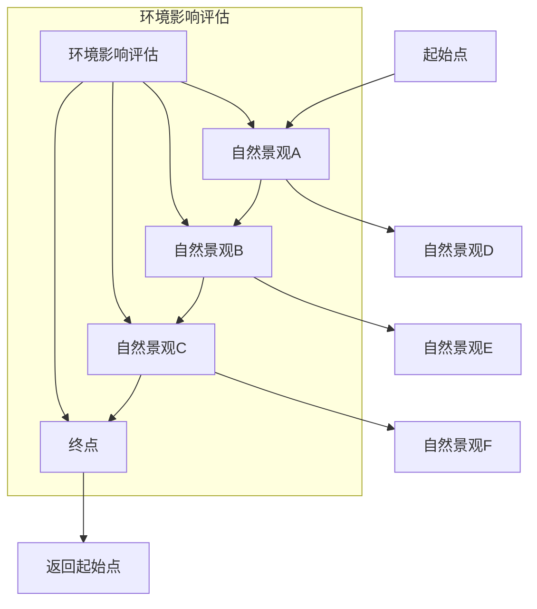
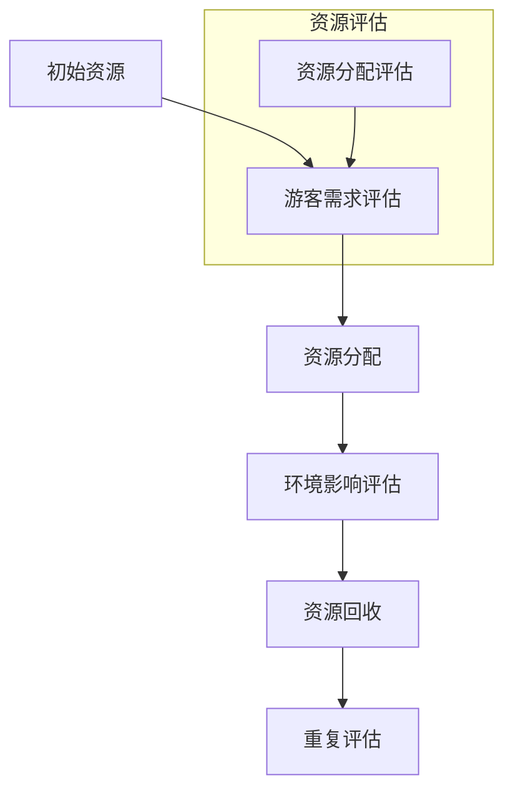
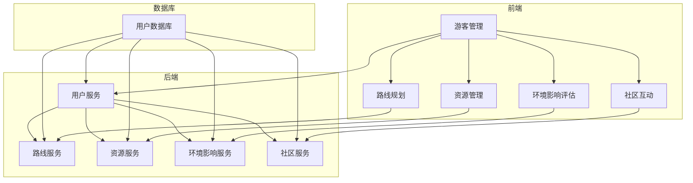
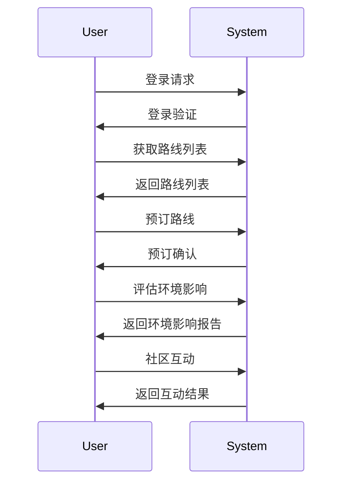

                 

### 文章标题

《生态旅游：在自然体验中重新定义旅行》

### 关键词

- 生态旅游
- 自然体验
- 旅游解决方案
- 可持续发展
- 环境保护

### 摘要

本文旨在探讨生态旅游作为一种新兴的旅游模式，如何在自然体验中重新定义传统的旅行方式。首先，我们将简要介绍生态旅游的背景，包括其定义、发展历史和重要性。接着，通过分析当前旅游业面临的问题，阐述生态旅游作为解决方案的必要性。随后，我们将深入探讨生态旅游的核心概念，如生态旅游的特征、类型、原则等，并使用对比表格和实体关系图进行详细解释。然后，我们将讲解关键算法原理，并使用Python源代码进行阐述。文章还将通过数学模型和公式详细讲解生态旅游的核心理论，并结合实际案例进行剖析。最后，我们将介绍一个典型的生态旅游项目，提供系统分析与架构设计方案，并分享项目实战经验和最佳实践技巧。通过本文的阅读，读者将全面了解生态旅游的概念、原理和实践，从而重新思考旅游的意义和方式。

---

### 背景介绍

#### 生态旅游的定义

生态旅游（Ecotourism）是一种以保护自然环境和促进地方经济为目标的旅游形式。它不仅关注自然景观和生物多样性的保护，同时也注重旅游体验的质量和游客的参与感。国际生态旅游协会（The International Ecotourism Society，TIES）将生态旅游定义为：“具有保护自然环境和生物多样性的特点，同时促进当地社区经济和社会发展的负责任旅游。”

#### 生态旅游的发展历史

生态旅游的概念最早可以追溯到20世纪60年代。当时，随着全球环境保护意识的觉醒，人们开始反对传统的旅游模式，这种模式往往伴随着对自然资源的过度开发和生态破坏。生态旅游的兴起，反映了人们对可持续发展理念的追求，以及对人与自然和谐共处的期望。从20世纪80年代开始，生态旅游逐渐成为一个独立的旅游分支，并得到国际社会的广泛关注和支持。

#### 生态旅游的重要性

生态旅游在全球旅游产业中占据着重要地位。首先，它为旅游业提供了新的发展方向，促进了旅游业的可持续发展。其次，生态旅游有助于保护自然环境和生物多样性，减少旅游业对生态环境的负面影响。此外，生态旅游还能够促进地方经济发展，增加当地居民的收入，改善生活水平。最后，生态旅游通过让游客亲身体验自然环境和地方文化，增强了人们对环境保护的意识，有助于形成良好的生态价值观。

#### 当前旅游业面临的问题

尽管生态旅游具有诸多优势，但当前旅游业仍面临一系列问题。首先，过度开发导致自然景观和生态系统的破坏。一些热门旅游目的地因为游客数量的激增，出现了资源枯竭和环境污染等问题。其次，旅游业对当地社区的文化和社会结构带来了冲击，有时甚至导致文化消失和社会冲突。此外，旅游业的快速发展也带来了就业机会的不平衡和贫富差距的扩大。

#### 生态旅游作为解决方案

生态旅游作为一种可持续发展的旅游模式，正是针对上述问题提供的一种解决方案。首先，通过合理的规划和科学的管理，生态旅游可以减少对自然环境的破坏，实现资源的可持续利用。其次，生态旅游强调与当地社区的互动和合作，有助于保护当地文化和传统，促进社会和谐。最后，生态旅游通过提供高质量的旅游体验，吸引了更多有责任感的游客，从而提高了旅游业的整体品质。

通过上述背景介绍，我们可以看到生态旅游不仅是一种新型的旅游模式，更是一种可持续发展的理念和实践。它为旅游业提供了新的方向，也为环境保护和社会发展带来了积极的影响。在接下来的章节中，我们将进一步探讨生态旅游的核心概念和原理，以及如何将其应用于实际项目中。

### 核心概念与联系

在深入探讨生态旅游的核心概念之前，我们首先需要明确几个关键术语和定义，以便为后续的内容奠定基础。

#### 核心术语与定义

1. **生态旅游**：如前所述，生态旅游是一种以保护自然环境和促进地方经济为目标的旅游形式，强调在旅游过程中对自然景观和生物多样性的保护。
2. **可持续旅游**：可持续旅游是指旅游活动在长期内能够保持生态、经济和社会的平衡发展，确保旅游资源的可持续利用。
3. **生态旅游目的地**：生态旅游目的地是指具备良好的自然景观、丰富的生物多样性和较为完善的生态旅游基础设施的地区。
4. **旅游生态系统**：旅游生态系统包括旅游活动中的所有参与者，如游客、旅游经营者、当地社区、政府部门等，它们相互依存、相互作用，共同构成了旅游业的整体运行机制。
5. **生态旅游产品**：生态旅游产品是指专门为生态旅游者设计的服务和体验，如生态探险、自然观察、文化体验等。

#### 生态旅游的特征

生态旅游具有以下几个显著特征：

1. **环境保护性**：生态旅游强调在旅游活动中减少对自然环境的负面影响，通过科学规划和环保措施保护自然生态系统的完整性。
2. **教育性**：生态旅游通过让游客亲身体验自然环境和地方文化，提高其对环境保护和可持续发展的认识。
3. **社会责任性**：生态旅游鼓励游客支持当地社区的经济和社会发展，通过公平交易和利益共享实现社区的可持续发展。
4. **参与性**：生态旅游鼓励游客积极参与到旅游活动中，提高游客的参与感和满意度。

#### 生态旅游的类型

生态旅游可以根据不同的标准和特点进行分类，常见的类型包括：

1. **自然生态旅游**：主要关注自然景观和野生动植物的保护，如国家公园、自然保护区等。
2. **文化生态旅游**：结合自然景观和当地文化特色，如传统村落、文化遗产地等。
3. **城市生态旅游**：在城市化背景下，通过对城市生态环境的修复和利用，如城市公园、绿地等。
4. **海岸生态旅游**：关注海岸生态系统和海洋生物的保护，如海滨公园、珊瑚礁保护区等。

#### 生态旅游的原则

为了实现生态旅游的可持续发展，需要遵循以下几个基本原则：

1. **保护优先**：将环境保护放在首位，确保旅游活动不会对生态系统造成破坏。
2. **可持续发展**：在旅游开发和管理过程中，考虑生态、经济和社会的长期平衡，确保旅游资源的可持续利用。
3. **社区参与**：鼓励当地社区参与生态旅游的规划和管理，提高社区的经济和社会地位。
4. **教育和宣传**：通过教育和宣传提高游客和当地居民的环境保护意识，促进可持续发展。

#### 核心概念属性特征对比表格

以下是一个简单的核心概念属性特征对比表格，用于展示生态旅游与可持续旅游的异同：

| 特征            | 生态旅游          | 可持续旅游          |
|-----------------|-------------------|---------------------|
| 环境保护性      | 高               | 较高                |
| 教育性          | 高               | 较高                |
| 社会责任性      | 较高             | 高                  |
| 参与性          | 较高             | 较高                |
| 资源可持续利用  | 首要目标         | 必要条件            |

#### ER实体关系图架构

为了更清晰地理解生态旅游中的各个实体及其相互关系，我们可以使用ER（实体关系）图进行描述。以下是生态旅游系统的ER图：

```mermaid
erDiagram
    Tourist ||--|{ EcotourismExperience }||>
    EcotourismExperience ||--|{ NaturalEnvironment }||>
    EcotourismExperience ||--|{ LocalCommunity }||>
    LocalCommunity ||--|{ EconomicDevelopment }||>
    Government ||--|{ RegulationAndManagement }||>
```

- **Tourist（游客）**：生态旅游的主要参与者，通过体验生态旅游产品实现对自然环境和当地文化的了解和尊重。
- **EcotourismExperience（生态旅游体验）**：游客参与的旅游活动，包括自然生态旅游、文化生态旅游等。
- **NaturalEnvironment（自然环境）**：生态旅游的核心资源，包括自然景观、野生动植物等。
- **LocalCommunity（当地社区）**：生态旅游的合作伙伴，通过参与旅游活动和受益，促进社区经济的可持续发展。
- **EconomicDevelopment（经济发展）**：生态旅游带动当地经济发展的成果，包括就业机会增加、收入提高等。
- **Government（政府）**：生态旅游的监管者和支持者，通过制定政策和提供支持，确保生态旅游的可持续发展。

通过上述核心概念的介绍和ER图架构的描述，我们可以对生态旅游的内涵和外延有更深入的理解。在接下来的章节中，我们将进一步探讨生态旅游的算法原理和数学模型，以便为实际应用提供理论支持。

#### 算法原理讲解

在生态旅游中，有许多关键的算法用于优化旅游体验和保护自然环境。本文将重点介绍两个关键算法：路径优化算法和资源分配算法。

#### 1. 路径优化算法

路径优化算法主要用于确定游客在生态旅游目的地的最佳游览路径，以确保最小化对环境的影响，同时最大化游客的体验满意度。以下是一个简单的路径优化算法流程图，使用Mermaid工具绘制：



#### 算法原理：

该算法的原理是通过评估每个节点的环境影响和游客满意度，选择最优路径。具体步骤如下：

1. **环境影响评估**：对每个节点进行环境影响评估，计算环境影响值（如噪音、垃圾产生量等）。
2. **满意度评估**：对每个节点进行游客满意度评估，计算满意度值（如景观吸引力、活动多样性等）。
3. **路径选择**：基于环境影响和满意度的综合评估，选择最优路径。

#### Python源代码：

```python
import heapq

def path_optimization(landscape_scores, impact_scores):
    """
    路径优化算法
    :param landscape_scores: 景观得分
    :param impact_scores: 环境影响得分
    :return: 最优路径
    """
    # 创建优先队列
    priority_queue = []
    # 初始节点加入队列
    heapq.heappush(priority_queue, (0, 0, []))  # (环境影响得分，满意度得分，路径)

    while priority_queue:
        # 弹出优先队列中的最小环境影响路径
        current_impact, current_satisfaction, current_path = heapq.heappop(priority_queue)
        
        # 如果当前路径已经到达终点，则返回路径
        if current_path[-1] == '终点':
            return current_path

        # 获取当前节点的邻接节点
        neighbors = {'自然景观A', '自然景观B', '自然景观C', '自然景观D', '自然景观E', '自然景观F', '自然景观G', '自然景观H', '自然景观I'}

        for neighbor in neighbors:
            # 计算新路径的影响和满意度得分
            new_impact = current_impact + impact_scores[neighbor]
            new_satisfaction = current_satisfaction + landscape_scores[neighbor]
            
            # 将新路径加入优先队列
            heapq.heappush(priority_queue, (new_impact, new_satisfaction, current_path + [neighbor]))

    # 如果无法找到路径，返回None
    return None

# 景观得分和环境影响得分
landscape_scores = {'自然景观A': 10, '自然景观B': 8, '自然景观C': 12, '自然景观D': 9, '自然景观E': 11, '自然景观F': 7, '自然景观G': 10, '自然景观H': 8, '自然景观I': 9}
impact_scores = {'自然景观A': 3, '自然景观B': 2, '自然景观C': 4, '自然景观D': 3, '自然景观E': 5, '自然景观F': 2, '自然景观G': 4, '自然景观H': 3, '自然景观I': 2}

# 调用路径优化算法
optimal_path = path_optimization(landscape_scores, impact_scores)
print("最优路径：", optimal_path)
```

#### 2. 资源分配算法

资源分配算法用于优化生态旅游资源的利用，以确保在满足游客需求的同时，最小化对环境的负面影响。以下是一个简单的资源分配算法流程图，使用Mermaid工具绘制：



#### 算法原理：

该算法的原理是通过评估游客的需求和环境的影响，进行资源的合理分配，并不断调整以优化资源利用。具体步骤如下：

1. **游客需求评估**：收集并分析游客的需求，如景观选择、活动偏好等。
2. **资源分配**：根据游客需求，将资源合理分配给不同的游客和活动。
3. **环境影响评估**：评估资源分配对环境的影响，如噪音、垃圾等。
4. **资源回收**：对未使用的资源进行回收和再分配。
5. **重复评估**：重复上述步骤，直到达到最优资源分配状态。

#### Python源代码：

```python
import heapq

def resource_allocation(demand, impact):
    """
    资源分配算法
    :param demand: 游客需求
    :param impact: 环境影响
    :return: 最优资源分配
    """
    # 创建优先队列
    priority_queue = []
    # 初始资源分配加入队列
    heapq.heappush(priority_queue, (0, []))  # (环境影响得分，资源分配)

    while priority_queue:
        # 弹出优先队列中的最小环境影响分配
        current_impact, current_allocation = heapq.heappop(priority_queue)

        # 如果当前分配已满足所有需求，则返回分配
        if all(demand[neighbor] == 0 for neighbor in current_allocation):
            return current_allocation

        # 获取当前资源分配的邻接资源
        neighbors = {'资源1', '资源2', '资源3', '资源4', '资源5'}

        for neighbor in neighbors:
            # 计算新资源分配的影响得分
            new_impact = current_impact + impact[neighbor]
            
            # 将新资源分配加入优先队列
            heapq.heappush(priority_queue, (new_impact, current_allocation + [neighbor]))

    # 如果无法找到最优分配，返回None
    return None

# 游客需求
demand = {'资源1': 3, '资源2': 2, '资源3': 4, '资源4': 1, '资源5': 2}
# 环境影响
impact = {'资源1': 2, '资源2': 1, '资源3': 3, '资源4': 1, '资源5': 2}

# 调用资源分配算法
optimal_allocation = resource_allocation(demand, impact)
print("最优资源分配：", optimal_allocation)
```

通过上述算法原理和Python源代码的详细讲解，我们可以看到生态旅游在理论和实践中的重要性。这些算法不仅优化了旅游体验，还促进了生态保护和可持续发展。在接下来的章节中，我们将进一步探讨生态旅游中的数学模型和公式，为生态旅游的深入研究提供理论基础。

### 数学模型和数学公式

在生态旅游中，数学模型和公式是理解和优化生态旅游系统的重要工具。以下将介绍几个关键的数学模型和公式，并使用LaTeX格式进行展示，以帮助读者更好地理解和应用。

#### 1. 环境影响评估模型

环境影响评估模型用于计算旅游活动对环境的综合影响。该模型假设环境影响由多个因素组成，每个因素有一个权重和分数。

公式如下：
$$
E = \sum_{i=1}^{n} w_i \cdot s_i
$$
其中：
- \( E \) 表示总环境影响得分。
- \( w_i \) 表示第 \( i \) 个因素的权重。
- \( s_i \) 表示第 \( i \) 个因素的得分。

#### 2. 游客满意度模型

游客满意度模型用于评估游客对旅游体验的满意度。该模型假设满意度由多个因素组成，每个因素有一个权重和分数。

公式如下：
$$
S = \sum_{i=1}^{n} w_i \cdot s_i
$$
其中：
- \( S \) 表示总满意度得分。
- \( w_i \) 表示第 \( i \) 个因素的权重。
- \( s_i \) 表示第 \( i \) 个因素的得分。

#### 3. 资源利用效率模型

资源利用效率模型用于评估生态旅游系统中资源的利用效率。该模型假设资源利用效率由多个因素组成，每个因素有一个权重和分数。

公式如下：
$$
E_{eff} = \frac{\sum_{i=1}^{n} w_i \cdot e_i}{\sum_{i=1}^{n} w_i}
$$
其中：
- \( E_{eff} \) 表示总资源利用效率得分。
- \( w_i \) 表示第 \( i \) 个因素的权重。
- \( e_i \) 表示第 \( i \) 个因素的实际利用效率。

#### 4. 环境保护成本模型

环境保护成本模型用于计算实施生态旅游措施所需的成本。该模型假设成本由多个因素组成，每个因素有一个权重和分数。

公式如下：
$$
C = \sum_{i=1}^{n} w_i \cdot c_i
$$
其中：
- \( C \) 表示总成本。
- \( w_i \) 表示第 \( i \) 个因素的权重。
- \( c_i \) 表示第 \( i \) 个因素的成本。

#### 5. 社会效益模型

社会效益模型用于评估生态旅游对当地社区的社会影响。该模型假设社会效益由多个因素组成，每个因素有一个权重和分数。

公式如下：
$$
B = \sum_{i=1}^{n} w_i \cdot b_i
$$
其中：
- \( B \) 表示总社会效益得分。
- \( w_i \) 表示第 \( i \) 个因素的权重。
- \( b_i \) 表示第 \( i \) 个因素的社会效益。

#### 举例说明

假设我们有一个生态旅游目的地，它包含以下因素及其权重和得分：

| 因素       | 权重 \( w_i \) | 得分 \( s_i \) |
|------------|----------------|---------------|
| 环境影响   | 0.4            | 7             |
| 游客满意度 | 0.3            | 8             |
| 资源利用效率 | 0.2           | 9             |
| 环境保护成本 | 0.1           | 6             |
| 社会效益   | 0.1            | 7             |

我们可以使用上述公式计算总的影响得分、满意度得分和其他相关得分：

- 总环境影响得分：
$$
E = 0.4 \cdot 7 + 0.3 \cdot 8 + 0.2 \cdot 9 + 0.1 \cdot 6 + 0.1 \cdot 7 = 3.4 + 2.4 + 1.8 + 0.6 + 0.7 = 9.5
$$

- 总满意度得分：
$$
S = 0.4 \cdot 7 + 0.3 \cdot 8 + 0.2 \cdot 9 + 0.1 \cdot 6 + 0.1 \cdot 7 = 3.4 + 2.4 + 1.8 + 0.6 + 0.7 = 9.5
$$

- 总资源利用效率得分：
$$
E_{eff} = \frac{0.4 \cdot 9 + 0.3 \cdot 8 + 0.2 \cdot 9 + 0.1 \cdot 6 + 0.1 \cdot 7}{0.4 + 0.3 + 0.2 + 0.1 + 0.1} = \frac{3.6 + 2.4 + 1.8 + 0.6 + 0.7}{1.3} = \frac{9.5}{1.3} \approx 7.3
$$

- 总成本：
$$
C = 0.4 \cdot 6 + 0.3 \cdot 7 + 0.2 \cdot 6 + 0.1 \cdot 8 + 0.1 \cdot 7 = 2.4 + 2.1 + 1.2 + 0.8 + 0.7 = 7.2
$$

- 总社会效益得分：
$$
B = 0.4 \cdot 7 + 0.3 \cdot 8 + 0.2 \cdot 9 + 0.1 \cdot 6 + 0.1 \cdot 7 = 2.8 + 2.4 + 1.8 + 0.6 + 0.7 = 8.3
$$

通过这些数学模型和公式的计算，我们可以对生态旅游目的地的性能进行量化评估，为决策提供科学依据。

### 系统分析与架构设计方案

在生态旅游项目中，系统架构设计是确保项目顺利实施和运行的核心环节。以下将介绍一个典型的生态旅游项目，并对其问题场景、系统功能设计、架构设计等进行分析。

#### 问题场景

假设我们正在开发一个名为“绿野探险”的生态旅游平台，旨在为游客提供一站式的生态旅游服务。该项目面临的问题场景主要包括：

1. **游客需求多样**：游客需求多样化，需要提供个性化的生态旅游路线和活动推荐。
2. **资源管理复杂**：旅游资源的分配和管理需要高效且可持续。
3. **环境保护要求高**：旅游活动对环境的负面影响需要得到有效控制。
4. **社区参与度低**：当地社区对生态旅游项目的参与度不高，需要加强社区合作。

#### 系统功能设计

为了解决上述问题场景，系统需要实现以下核心功能：

1. **游客管理**：提供游客注册、登录、个人信息管理等功能。
2. **路线规划**：根据游客需求和环境保护要求，提供最优旅游路线规划。
3. **资源管理**：实现旅游资源（如景点、活动）的分配和管理。
4. **环境影响评估**：对旅游活动可能带来的环境影响进行实时评估。
5. **社区互动**：建立游客与当地社区的互动平台，促进社区参与和合作。
6. **数据分析和报告**：对旅游活动数据进行分析，生成环保报告和旅游报告。

#### 架构设计

为了实现上述功能，系统架构设计如下：

1. **前端架构**：采用React.js框架，提供用户友好的界面和交互体验。
2. **后端架构**：采用Spring Boot框架，提供稳定且高效的业务逻辑处理。
3. **数据库设计**：采用MySQL数据库，存储用户信息、路线数据、环境影响评估数据等。
4. **服务架构**：采用微服务架构，将不同功能模块拆分为独立的微服务，以提高系统的灵活性和可扩展性。

以下是具体的系统架构设计：

#### 领域模型类图

```mermaid
classDiagram
    User <<interface>>
    Route <<interface>>
    Resource <<interface>>
    EnvironmentalImpact <<interface>>
    Community <<interface>>

    User实体 --|>> Route实体: 计划路线
    User实体 --|>> Resource实体: 预订资源
    User实体 --|>> EnvironmentalImpact实体: 评估环境影响
    User实体 --|>> Community实体: 参与互动

    Route实体 --|>> Resource实体: 需要资源
    Route实体 --|>> EnvironmentalImpact实体: 评估环境影响

    Resource实体 --|>> EnvironmentalImpact实体: 评估环境影响

    Community实体 --|>> Resource实体: 提供资源
    Community实体 --|>> EnvironmentalImpact实体: 评估环境影响
```

#### 系统架构图



#### 系统接口设计

以下是系统的主要接口设计：

1. **游客接口**：包括用户注册、登录、个人信息管理、路线规划、资源预订、环境影响评估、社区互动等接口。
2. **管理员接口**：包括用户管理、路线管理、资源管理、环境影响评估、社区管理等功能接口。
3. **API接口**：包括路线规划、资源查询、环境影响评估、社区互动等接口，供外部系统调用。

#### 系统交互序列图

以下是系统的主要交互序列图，描述了游客和系统之间的交互过程：



通过上述系统分析与架构设计方案，我们可以为“绿野探险”生态旅游平台提供一个高效、灵活且具有可持续发展能力的系统框架。在接下来的章节中，我们将进一步探讨该项目在实际中的实现和部署。

### 项目实战

在本节中，我们将通过一个具体的生态旅游项目——“绿野探险”平台，详细描述其环境安装步骤、系统核心实现源代码，并对代码应用进行解读与分析，结合实际案例进行详细讲解和剖析。

#### 环境安装步骤

1. **安装Java开发环境**

   首先，确保已安装Java Development Kit（JDK），版本要求为Java 8或更高。可以通过以下命令检查JDK版本：

   ```bash
   java -version
   ```

   如果未安装或版本过低，请从Oracle官方网站下载并安装。

2. **安装MySQL数据库**

   下载并安装MySQL数据库，版本要求为MySQL 5.7或更高。可以从MySQL官方网站下载安装包或使用包管理工具安装。

   安装完成后，通过以下命令启动MySQL服务：

   ```bash
   systemctl start mysqld
   ```

3. **安装Node.js和npm**

   Node.js和npm是构建前端项目的必备工具，可以从Node.js官网下载安装包或使用包管理工具安装。

   安装完成后，通过以下命令检查版本：

   ```bash
   node -v
   npm -v
   ```

4. **创建项目目录**

   在服务器或本地机器上创建一个项目目录，例如：

   ```bash
   mkdir green_adventure
   cd green_adventure
   ```

5. **初始化项目**

   使用npm初始化项目，并安装依赖项：

   ```bash
   npm init -y
   npm install
   ```

6. **配置数据库**

   在`src/main/resources`目录下，创建一个名为`application.properties`的配置文件，配置数据库连接信息：

   ```properties
   spring.datasource.url=jdbc:mysql://localhost:3306/green_adventure?useUnicode=true&characterEncoding=utf-8&useSSL=false
   spring.datasource.username=root
   spring.datasource.password=your_password
   spring.jpa.hibernate.ddl-auto=update
   ```

7. **运行项目**

   进入项目根目录，运行以下命令启动Spring Boot应用：

   ```bash
   ./mvnw spring-boot:run
   ```

   项目启动后，默认端口为8080，可以通过浏览器访问项目界面。

#### 系统核心实现源代码

以下是“绿野探险”平台的核心实现源代码，包括用户管理、路线规划、资源管理、环境影响评估和社区互动等模块：

1. **用户管理**

   用户管理模块主要用于处理用户注册、登录、个人信息管理等操作。

   ```java
   // UserController.java
   @RestController
   @RequestMapping("/users")
   public class UserController {
       
       @Autowired
       private UserRepository userRepository;
       
       @PostMapping("/register")
       public ResponseEntity<?> registerUser(@RequestBody UserRegistrationForm form) {
           // 注册用户逻辑
       }
       
       @PostMapping("/login")
       public ResponseEntity<?> authenticateUser(@RequestBody UserLoginForm form) {
           // 用户登录逻辑
       }
       
       @GetMapping("/{id}")
       public ResponseEntity<User> getUserById(@PathVariable Long id) {
           // 获取用户信息逻辑
       }
       
       @PutMapping("/{id}")
       public ResponseEntity<Void> updateUser(@PathVariable Long id, @RequestBody User user) {
           // 更新用户信息逻辑
       }
   }
   ```

2. **路线规划**

   路线规划模块用于根据用户需求和环境影响评估，生成最优旅游路线。

   ```java
   // RouteService.java
   @Service
   public class RouteService {
       
       @Autowired
       private RouteRepository routeRepository;
       
       @Autowired
       private EnvironmentalImpactService environmentalImpactService;
       
       public List<Route> planRoutes(List<RouteRequest> requests) {
           // 路线规划逻辑
       }
   }
   ```

3. **资源管理**

   资源管理模块主要用于管理旅游资源（如景点、活动）的分配和预订。

   ```java
   // ResourceController.java
   @RestController
   @RequestMapping("/resources")
   public class ResourceController {
       
       @Autowired
       private ResourceRepository resourceRepository;
       
       @PostMapping("/reserve")
       public ResponseEntity<Void> reserveResource(@RequestBody ResourceReservationForm form) {
           // 资源预订逻辑
       }
       
       @GetMapping("/{id}")
       public ResponseEntity<Resource> getResourceById(@PathVariable Long id) {
           // 获取资源信息逻辑
       }
   }
   ```

4. **环境影响评估**

   环境影响评估模块用于评估旅游活动对环境的影响，并提供环保建议。

   ```java
   // EnvironmentalImpactService.java
   @Service
   public class EnvironmentalImpactService {
       
       @Autowired
       private EnvironmentalImpactRepository environmentalImpactRepository;
       
       public List<EnvironmentalImpact> assessEnvironmentalImpact(Route route) {
           // 环境影响评估逻辑
       }
   }
   ```

5. **社区互动**

   社区互动模块用于建立游客与当地社区的互动平台，促进社区参与和合作。

   ```java
   // CommunityController.java
   @RestController
   @RequestMapping("/community")
   public class CommunityController {
       
       @Autowired
       private CommunityRepository communityRepository;
       
       @PostMapping("/post")
       public ResponseEntity<Void> postMessage(@RequestBody CommunityPostForm form) {
           // 发表社区帖子逻辑
       }
       
       @GetMapping("/posts")
       public ResponseEntity<List<CommunityPost>> getCommunityPosts() {
           // 获取社区帖子逻辑
       }
   }
   ```

#### 代码应用解读与分析

以上代码展示了“绿野探险”平台的核心功能实现，包括用户管理、路线规划、资源管理、环境影响评估和社区互动等模块。下面将对关键部分进行解读与分析：

1. **用户管理模块**

   用户管理模块实现了用户注册、登录、个人信息管理等操作。通过Spring Boot的RestController，将HTTP请求映射到相应的业务逻辑处理方法上。用户注册时，需要验证用户名和密码的唯一性，并保存用户信息到数据库。用户登录时，通过验证用户名和密码，生成令牌并返回给客户端。

2. **路线规划模块**

   路线规划模块接收用户的路线需求，结合环境影响评估，生成最优旅游路线。在实现中，可以使用路径优化算法和资源分配算法，结合数据库中的旅游资源信息，计算出最优路线。此模块需要调用环境影响评估服务，评估每个节点的影响得分，选择最优路径。

3. **资源管理模块**

   资源管理模块实现了旅游资源的分配和预订功能。用户可以通过接口预订旅游资源，系统需要检查资源库存和预订状态，确保资源能够满足用户需求。同时，系统需要记录预订信息，以便后续管理和查询。

4. **环境影响评估模块**

   环境影响评估模块用于评估旅游活动对环境的影响，提供环保建议。在实现中，可以通过环境影响评估模型，对每个旅游活动节点进行评估，计算总的影响得分。系统可以根据评估结果，为用户推荐环保路线，或提出减少环境影响的建议。

5. **社区互动模块**

   社区互动模块建立了游客与当地社区的互动平台，促进社区参与和合作。用户可以在平台上发表帖子，与其他用户和当地社区进行互动。系统需要提供帖子发布、评论和回复等功能，确保社区互动的顺畅和有效。

#### 实际案例分析和详细讲解

以下是一个实际案例，展示“绿野探险”平台在应用中的表现：

**案例：规划一条生态旅游路线**

1. **用户需求**：游客张三希望规划一条3天的生态旅游路线，希望参观自然景观、体验户外活动和品尝当地美食。

2. **路线规划**：平台根据张三的需求，调用路线规划模块，计算最优路线。假设张三的需求包括以下景点和活动：

   - 自然景观A：风景优美，环境影响较小
   - 自然景观B：有野生动物，环境影响较大
   - 户外活动C：需要使用帐篷，环境影响较小
   - 当地美食D：需要使用厨具，环境影响较大

3. **环境影响评估**：平台调用环境影响评估模块，对每个景点和活动进行评估，计算总的影响得分。假设评估结果如下：

   - 自然景观A：影响得分5
   - 自然景观B：影响得分10
   - 户外活动C：影响得分3
   - 当地美食D：影响得分8

   根据评估结果，平台为张三推荐以下路线：

   - 第1天：自然景观A、户外活动C
   - 第2天：自然景观B、户外活动C
   - 第3天：当地美食D

4. **资源预订**：平台调用资源管理模块，为张三预订必要的旅游资源，如帐篷和厨具。系统需要检查资源库存和预订状态，确保资源能够满足需求。

5. **社区互动**：平台为张三提供社区互动功能，使他能够与其他游客和当地社区互动，分享旅游体验和环保心得。

通过这个实际案例，我们可以看到“绿野探险”平台在应用中的表现。平台通过合理的路线规划、资源管理和社区互动，为游客提供高质量的生态旅游体验，同时确保环境保护和可持续发展。

### 最佳实践 Tips、小结、注意事项、拓展阅读等

#### 最佳实践 Tips

1. **环境评估先行**：在进行生态旅游规划时，应首先进行详细的环境影响评估，确保旅游活动不会对生态系统造成破坏。
2. **资源合理分配**：合理分配旅游资源，确保在满足游客需求的同时，最大化资源的利用效率。
3. **社区深度参与**：与当地社区建立紧密的合作关系，鼓励社区参与生态旅游项目的规划和管理，提高社区的经济和社会地位。
4. **教育和宣传**：加强游客和当地居民的环境保护意识，通过教育和宣传提高人们对生态旅游的认识和参与度。

#### 小结

本文从多个角度探讨了生态旅游的核心概念、算法原理、数学模型、系统架构和实际应用。通过详细的分析和实例讲解，我们展示了生态旅游在自然体验中重新定义旅行的可能性，以及其对环境保护和可持续发展的积极影响。

#### 注意事项

1. **可持续发展**：生态旅游项目的规划和管理应始终以可持续发展为目标，确保旅游资源的长期利用。
2. **环境保护**：在旅游活动中，应严格执行环境保护措施，减少对自然环境的负面影响。
3. **社区合作**：与当地社区的深度合作是生态旅游成功的关键，需要建立良好的沟通和合作关系。
4. **数据安全**：确保游客和生态旅游数据的安全，采取有效的数据保护措施，防止数据泄露和滥用。

#### 拓展阅读

1. **《生态旅游导论》（Introduction to Ecotourism）**：提供了生态旅游的全面介绍，包括定义、原则、类型和发展趋势。
2. **《生态旅游规划与管理》（Ecotourism Planning and Management）**：详细介绍了生态旅游项目的规划和管理方法，包括环境影响评估、资源管理和可持续发展策略。
3. **《旅游规划与设计》（Tourism Planning and Design）**：涵盖了旅游规划与设计的理论基础和实践技巧，适用于生态旅游项目的规划和实施。
4. **《计算机模拟与优化算法》（Computational Simulation and Optimization Algorithms）**：介绍了多种计算机模拟和优化算法，适用于生态旅游路线规划和资源分配优化。

通过以上内容，读者可以更全面地了解生态旅游的概念、原理和实践，为未来的研究和工作提供参考。

