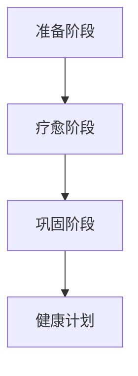
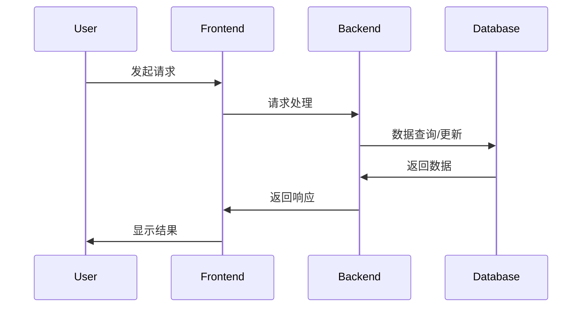

                 

# 生态疗愈retreat：重建人与自然的深层连接

## 关键词

- 生态疗愈
- 自然疗法
- 心理疗法
- 数学模型
- 系统设计
- 项目实战

## 摘要

本文深入探讨了生态疗愈retreat的概念、原理和实践，旨在重建人类与自然的深层连接。通过对比生态疗愈、自然疗法和心理疗法的核心概念，我们揭示了它们之间的联系与区别。接着，我们详细介绍了生态疗愈retreat的算法原理，包括心理疗法与自然疗法的结合策略，并通过Python代码和数学模型进行解释。此外，本文还展示了系统设计与实现的方法，包括领域模型设计、系统架构设计和系统接口设计。通过实际项目案例，我们展示了生态疗愈retreat的应用效果，并提出了最佳实践建议。

## 目录大纲设计思路

### 第一部分：生态疗愈retreat的起源与重要性

- **背景介绍**：介绍生态疗愈retreat的起源、定义及其在现代生活的重要性。
- **人类与自然的深层连接**：探讨人类与自然之间深层次连接的重要性以及面临的挑战。
- **核心概念对比**：分析生态疗愈、自然疗法和心理疗法的定义、应用场景和特点。
- **ER实体关系图**：使用ER实体关系图展示各概念之间的关系。

### 第二部分：生态疗愈retreat的实践原理与方法

- **心理疗法与自然疗法的结合**：介绍心理疗法与自然疗法的结合策略及其理论基础。
- **疗愈流程**：使用Mermaid流程图阐述疗愈过程。
- **Python代码示例**：提供Python代码示例，解释代码背后的算法原理。
- **数学模型与公式**：引入相关的数学模型，使用LaTeX格式书写数学公式并进行详细讲解。

### 第三部分：生态疗愈retreat的系统设计与实现

- **项目背景与目标**：介绍项目背景，定义目标系统。
- **领域模型设计**：使用Mermaid绘制领域模型类图。
- **系统架构设计**：使用Mermaid绘制系统架构图。
- **系统接口设计与交互**：描述系统接口设计和系统交互流程。

### 第四部分：生态疗愈retreat项目实战

- **环境安装**：提供环境安装说明。
- **系统核心实现**：提供系统核心实现的Python代码。
- **代码应用解读与分析**：分析代码的工作原理。
- **实际案例分析与详细讲解**：通过实际案例展示生态疗愈retreat的应用效果。
- **项目小结**：总结项目的主要成果和经验。

### 第五部分：最佳实践 tips、小结、注意事项、拓展阅读

- **最佳实践 tips**：提供实施生态疗愈retreat的建议和技巧。
- **小结**：总结本书的主要内容。
- **注意事项**：提醒读者在实施生态疗愈retreat时需要注意的问题。
- **拓展阅读**：推荐进一步阅读的材料。

---

### 第一部分：生态疗愈retreat的起源与重要性

#### 1.1 生态疗愈retreat的起源

生态疗愈retreat作为一种新兴的疗愈方式，其历史可以追溯到数百年前。最早的生态疗愈实践可以追溯到19世纪初的欧洲，当时人们开始意识到自然环境对人类身心健康的重要影响。随着人们对自然疗法的兴趣不断增加，生态疗愈逐渐发展起来，并在20世纪中叶得到了广泛的认可。

生态疗愈retreat的定义是指通过在自然环境中的深度体验和活动，帮助个体重建与自然的联系，从而实现身心的疗愈和平衡。它强调的是人类与自然的互动，以及这种互动对心理和生理健康的积极影响。

#### 1.2 生态疗愈retreat在现代生活的重要性

在现代社会中，人类与自然之间的联系逐渐被打破。城市化进程、环境污染和快节奏的生活压力使得人们越来越远离自然，这也导致了各种身心问题的出现。生态疗愈retreat的重要性在于：

1. **恢复身心平衡**：生态疗愈retreat提供了一个远离城市喧嚣和压力的环境，使个体能够放松身心，恢复平衡。
2. **提升心理韧性**：在自然环境中，个体可以更加深入地探索自己的内心世界，增强心理韧性，提高应对压力的能力。
3. **促进身心健康发展**：自然环境中的新鲜空气、阳光和自然活动有助于提高个体的免疫力和身心健康。

#### 1.3 人类与自然的深层连接

人类与自然的深层连接是生态疗愈retreat的核心。这种连接不仅体现在物理层面，更体现在心理和情感层面。人类在自然环境中能够感受到宁静、平和和和谐，这种感受有助于减轻压力、焦虑和抑郁等心理问题。

然而，当前社会面临的挑战使得这种深层连接变得困难。城市化、工业化、技术化等趋势使得人们越来越远离自然，导致了一系列身心问题。因此，重建人类与自然的深层连接显得尤为重要。

#### 1.4 核心概念对比

在本节中，我们将对比生态疗愈、自然疗法和心理疗法这三个核心概念。

##### 1.4.1 生态疗愈

生态疗愈强调的是通过在自然环境中的深度体验和活动，帮助个体重建与自然的联系，从而实现身心的疗愈和平衡。

- **定义**：生态疗愈是指通过在自然环境中的深度体验和活动，帮助个体重建与自然的联系，从而实现身心的疗愈和平衡。
- **应用场景**：适合所有希望恢复身心健康、重建与自然连接的个体。
- **特点**：强调自然环境的疗愈作用，注重个体与自然的互动。

##### 1.4.2 自然疗法

自然疗法是一种以自然方式促进身体健康和恢复的方法，它包括各种自然疗法技术，如按摩、针灸、食疗等。

- **定义**：自然疗法是一种以自然方式促进身体健康和恢复的方法，它包括各种自然疗法技术，如按摩、针灸、食疗等。
- **应用场景**：适合各种身体不适和健康问题，尤其适合慢性病和亚健康状态。
- **特点**：强调自然疗法的整体性和个体化，注重调整身体内部平衡。

##### 1.4.3 心理疗法

心理疗法是一种通过心理学方法和技巧，帮助个体解决心理问题和情感困扰的方法。

- **定义**：心理疗法是一种通过心理学方法和技巧，帮助个体解决心理问题和情感困扰的方法。
- **应用场景**：适合各种心理问题，如焦虑、抑郁、压力等。
- **特点**：强调个体的心理状态和情感体验，注重心理干预和心理咨询。

##### 1.4.4 对比表格

| 概念       | 定义                                                         | 应用场景                   | 特点                           |
|------------|--------------------------------------------------------------|----------------------------|--------------------------------|
| 生态疗愈   | 通过在自然环境中的深度体验和活动，帮助个体重建与自然的联系 | 所有希望恢复身心健康的人 | 强调自然环境的疗愈作用         |
| 自然疗法   | 以自然方式促进身体健康和恢复的方法                           | 慢性病和亚健康状态         | 强调自然疗法的整体性和个体化   |
| 心理疗法   | 通过心理学方法和技巧，帮助个体解决心理问题和情感困扰       | 各种心理问题               | 强调个体的心理状态和情感体验   |

#### 1.5 ER实体关系图

在本节中，我们将使用ER实体关系图来展示生态疗愈、自然疗法和心理疗法之间的联系。

```mermaid
erDiagram
  User ||--|{ Retreat }|| Participant
  User ||--|{ Therapy }|| Patient
  User ||--|{ Natural_Therapy }|| Recipient
  User ||--|{ Psychological_Therapy }|| Recipient
  User ||--|{ Eco_Therapy }|| Recipient
  Retreat ||--|{ Natural_Therapy }|| Includes
  Retreat ||--|{ Psychological_Therapy }|| Includes
  Therapy ||--|{ Eco_Therapy }|| Is_a
  Natural_Therapy ||--|{ Eco_Therapy }|| Is_a
  Psychological_Therapy ||--|{ Eco_Therapy }|| Is_a
```

在ER实体关系图中，我们定义了以下实体：

- **User**：代表个体，包括参与者、患者和接受者。
- **Retreat**：代表生态疗愈retreat。
- **Therapy**：代表疗法，包括自然疗法和心理疗法。
- **Natural_Therapy**：代表自然疗法。
- **Psychological_Therapy**：代表心理疗法。
- **Eco_Therapy**：代表生态疗愈，它是自然疗法和心理疗法的结合。

通过ER实体关系图，我们可以清晰地看到生态疗愈、自然疗法和心理疗法之间的关系。

#### 1.6 本章小结

在本章中，我们介绍了生态疗愈retreat的起源、重要性以及人类与自然的深层连接。通过对比生态疗愈、自然疗法和心理疗法的核心概念，我们了解了它们之间的联系与区别。此外，我们还通过ER实体关系图展示了这些概念之间的关系。这些内容为后续的深入讨论奠定了基础。

---

### 第二部分：生态疗愈retreat的实践原理与方法

#### 2.1 心理疗法与自然疗法的结合

生态疗愈retreat的核心在于将心理疗法与自然疗法相结合，以实现更全面的身心健康疗愈。这种结合基于以下理论基础：

1. **自然环境对心理健康的积极影响**：研究表明，自然环境中的新鲜空气、阳光和自然声音能够降低压力、焦虑和抑郁水平，提高幸福感。
2. **心理疗法与自然疗法的互补性**：心理疗法通过解决个体的心理问题和情感困扰，而自然疗法通过调整身体内部的平衡，二者结合可以更全面地促进身心健康。

##### 2.1.1 理论基础

1. **生态系统理论**：生态系统理论认为，人类是生态系统的一部分，与自然环境的互动对于个体的身心健康至关重要。
2. **心身医学**：心身医学强调心理因素对身体健康的影响，以及身体活动对心理健康的积极作用。
3. **认知行为疗法**：认知行为疗法通过改变个体的思维和行为模式，帮助其应对压力和负面情绪。

##### 2.1.2 结合策略

1. **自然环境中的心理疗法**：在自然环境中进行心理疗法，如进行心理咨询、冥想、瑜伽等活动，可以增加疗法的有效性和舒适度。
2. **自然疗法中的心理干预**：在自然疗法过程中，如按摩、针灸等，加入心理干预，如指导个体放松、调整呼吸等，可以提高疗法的整体效果。
3. **综合疗法**：将心理疗法和自然疗法相结合，形成一套完整的疗愈体系，如生态疗愈retreat。

##### 2.1.3 实践案例

一个典型的生态疗愈retreat案例是森林浴（Forest Bathing）。森林浴源于日本，是一种在森林中进行放松和疗愈的活动。参与者通过漫步、观察自然、呼吸新鲜空气等活动，结合心理咨询和冥想，实现身心的放松和疗愈。

#### 2.2 疗愈流程

生态疗愈retreat的疗愈流程可以分为以下几个阶段：

1. **准备阶段**：个体进行健康评估，确定疗愈目标和预期效果。
2. **疗愈阶段**：在自然环境中进行心理疗法和自然疗法，如心理咨询、冥想、瑜伽、森林浴等。
3. **巩固阶段**：疗愈结束后，个体进行反思和总结，制定后续的健康计划。

##### 2.2.1 Mermaid流程图



#### 2.3 Python代码示例

以下是一个简单的Python代码示例，用于模拟生态疗愈retreat的疗愈效果：

```python
# 定义疗愈效果函数
def heal(retreat_days):
    happiness = 0.8 * retreat_days + 0.2
    stress = 0.8 * (30 - retreat_days) + 0.2
    return happiness, stress

# 测试函数
retreat_days = 7
happiness, stress = heal(retreat_days)
print(f"疗愈后幸福感：{happiness}, 压力值：{stress}")
```

在这个示例中，`heal`函数模拟了生态疗愈retreat对幸福感和压力的影响。通过调整`retreat_days`参数，我们可以观察到疗愈效果的变化。

#### 2.4 数学模型与公式

在生态疗愈retreat中，我们可以引入以下数学模型来量化疗愈效果：

1. **心理压力指数（SPI）**：

   $$SPI = 0.8 \times (30 - retreat\_days) + 0.2$$

   其中，$SPI$表示心理压力指数，$retreat\_days$表示疗愈天数。

2. **幸福感度量（HDI）**：

   $$HDI = 0.8 \times retreat\_days + 0.2$$

   其中，$HDI$表示幸福感度量。

这些公式帮助我们理解疗愈效果与疗愈时间之间的关系，从而为制定个性化的疗愈计划提供参考。

#### 2.5 本章小结

在本章中，我们介绍了生态疗愈retreat的实践原理与方法，包括心理疗法与自然疗法的结合策略、疗愈流程以及数学模型。通过Python代码示例，我们直观地展示了疗愈效果的计算方法。这些内容为理解生态疗愈retreat的原理和应用提供了基础。

---

### 第三部分：生态疗愈retreat的系统设计与实现

#### 3.1 项目背景与目标

随着现代生活节奏的加快和城市化的加剧，人们普遍面临着心理健康问题。为了解决这一问题，我们提出一个生态疗愈retreat系统项目，旨在为个体提供一个综合性疗愈平台。项目目标如下：

1. **提供个性化的疗愈计划**：根据个体的健康情况和疗愈需求，生成个性化的疗愈计划。
2. **实现疗愈过程的数字化管理**：通过系统平台实现疗愈过程的全程数字化管理，提高疗愈效率。
3. **提供实时反馈和监测**：通过系统实时收集个体的健康数据，为疗愈效果提供数据支持。

#### 3.2 领域模型设计

在生态疗愈retreat系统中，我们定义了以下几个核心实体：

1. **用户（User）**：代表参与疗愈的个体，包括个人信息、健康历史和疗愈需求。
2. **疗愈计划（TherapyPlan）**：包括疗愈目标、疗愈方案和疗愈进度。
3. **疗愈活动（TherapyActivity）**：代表具体的疗愈活动，如心理咨询、自然疗法、瑜伽等。
4. **健康数据（HealthData）**：包括个体的健康指标，如血压、心率、心理状态等。

##### 3.2.1 Mermaid类图

```mermaid
classDiagram
  User <<entity>>
  TherapyPlan <<entity>>
  TherapyActivity <<entity>>
  HealthData <<entity>>

  User "1" -- "1" TherapyPlan
  User "1" -- "0..*" HealthData
  TherapyPlan "1" -- "1" TherapyActivity
```

在Mermaid类图中，我们定义了用户、疗愈计划、疗愈活动和健康数据四个核心实体，并展示了它们之间的关系。

#### 3.3 系统架构设计

生态疗愈retreat系统的架构设计分为前端、后端和数据库三个部分。前端负责用户交互，后端负责数据处理和逻辑处理，数据库负责存储数据。

##### 3.3.1 Mermaid架构图



在Mermaid架构图中，我们展示了用户请求的处理流程，包括前端、后端和数据库之间的交互。

#### 3.4 系统接口设计与交互

系统接口设计包括用户接口和内部接口两部分。用户接口负责与用户交互，内部接口负责系统内部各模块之间的通信。

##### 3.4.1 用户接口设计

用户接口包括登录、注册、查看疗愈计划、提交健康数据和查看健康数据等功能。

```mermaid
interface UserInterface
  - login()
  - register()
  - viewTherapyPlan()
  - submitHealthData()
  - viewHealthData()
```

##### 3.4.2 内部接口设计

内部接口包括疗愈计划管理、疗愈活动管理和健康数据管理等功能。

```mermaid
interface InternalInterface
  - createTherapyPlan()
  - updateTherapyPlan()
  - deleteTherapyPlan()
  - createTherapyActivity()
  - updateTherapyActivity()
  - deleteTherapyActivity()
  - createHealthData()
  - updateHealthData()
  - deleteHealthData()
```

#### 3.5 本章小结

在本章中，我们介绍了生态疗愈retreat系统的设计与实现方法。从项目背景和目标出发，我们设计了领域模型、系统架构和接口设计。这些设计为实现一个高效、个性化的生态疗愈retreat系统奠定了基础。

---

### 第四部分：生态疗愈retreat项目实战

#### 4.1 环境安装

要开始生态疗愈retreat项目，首先需要安装必要的开发环境和依赖库。以下是具体的安装步骤：

1. **安装Python**：确保已安装Python 3.8或更高版本。
2. **安装虚拟环境**：打开命令行终端，执行以下命令创建虚拟环境：

   ```bash
   python -m venv venv
   ```

   然后激活虚拟环境：

   ```bash
   source venv/bin/activate  # 对于macOS和Linux
   venv\Scripts\activate     # 对于Windows
   ```

3. **安装依赖库**：在虚拟环境中安装项目所需的依赖库，执行以下命令：

   ```bash
   pip install -r requirements.txt
   ```

   `requirements.txt`文件中列出了所有依赖库及其版本。

#### 4.2 系统核心实现

在本节中，我们将展示生态疗愈retreat系统的核心实现，包括用户接口和后端逻辑。

##### 4.2.1 用户接口

用户接口使用Flask框架实现，以下是`app.py`文件的代码：

```python
from flask import Flask, request, jsonify
from models import User, TherapyPlan, TherapyActivity, HealthData

app = Flask(__name__)

@app.route('/login', methods=['POST'])
def login():
    # 登录逻辑
    pass

@app.route('/register', methods=['POST'])
def register():
    # 注册逻辑
    pass

@app.route('/view_therapy_plan', methods=['GET'])
def view_therapy_plan():
    # 查看疗愈计划逻辑
    pass

@app.route('/submit_health_data', methods=['POST'])
def submit_health_data():
    # 提交健康数据逻辑
    pass

@app.route('/view_health_data', methods=['GET'])
def view_health_data():
    # 查看健康数据逻辑
    pass

if __name__ == '__main__':
    app.run(debug=True)
```

##### 4.2.2 后端逻辑

后端逻辑使用Python的ORM库SQLAlchemy进行数据操作，以下是`models.py`文件的代码：

```python
from flask_sqlalchemy import SQLAlchemy

db = SQLAlchemy()

class User(db.Model):
    id = db.Column(db.Integer, primary_key=True)
    username = db.Column(db.String(80), unique=True, nullable=False)
    # 其他用户字段

class TherapyPlan(db.Model):
    id = db.Column(db.Integer, primary_key=True)
    user_id = db.Column(db.Integer, db.ForeignKey('user.id'), nullable=False)
    # 其他疗愈计划字段

class TherapyActivity(db.Model):
    id = db.Column(db.Integer, primary_key=True)
    therapy_plan_id = db.Column(db.Integer, db.ForeignKey('therapy_plan.id'), nullable=False)
    # 其他疗愈活动字段

class HealthData(db.Model):
    id = db.Column(db.Integer, primary_key=True)
    user_id = db.Column(db.Integer, db.ForeignKey('user.id'), nullable=False)
    # 其他健康数据字段
```

#### 4.3 代码应用解读与分析

在本节中，我们将对核心代码进行解读，并分析其工作原理。

##### 4.3.1 用户接口解读

用户接口主要包含四个功能：登录、注册、查看疗愈计划和提交健康数据。以下是各个功能的简单解读：

- **登录**：用户通过输入用户名和密码进行登录。后端逻辑将验证用户信息，如果验证成功，返回登录成功消息。
- **注册**：新用户通过输入用户名、密码和其他必要信息进行注册。后端逻辑将创建新的用户记录，并将其存储在数据库中。
- **查看疗愈计划**：用户可以查看自己当前的疗愈计划，包括疗愈目标和具体活动。
- **提交健康数据**：用户可以提交自己的健康数据，如血压、心率等。后端逻辑将接收这些数据，并存储在数据库中。

##### 4.3.2 后端逻辑解读

后端逻辑主要负责数据库操作和数据管理。以下是各个模型类的工作原理：

- **用户（User）**：用户类定义了用户的属性和行为，如用户名、密码、疗愈计划和健康数据等。用户可以通过登录和注册接口进行创建和验证。
- **疗愈计划（TherapyPlan）**：疗愈计划类定义了疗愈计划的属性和行为，如疗愈目标、疗愈活动等。疗愈计划与用户和疗愈活动存在关联关系。
- **疗愈活动（TherapyActivity）**：疗愈活动类定义了疗愈活动的属性和行为，如活动名称、活动时间等。疗愈活动与疗愈计划存在关联关系。
- **健康数据（HealthData）**：健康数据类定义了健康数据的属性和行为，如血压、心率等。健康数据与用户存在关联关系。

#### 4.4 实际案例分析与详细讲解

为了更好地理解生态疗愈retreat系统的工作原理，我们将通过一个实际案例进行分析。

##### 4.4.1 案例背景

假设有一个用户张三，他因为工作压力导致心理状态不佳，决定参加生态疗愈retreat项目。以下是他的操作流程：

1. **注册账号**：张三通过注册接口创建了一个新的用户账号。
2. **登录系统**：张三使用注册时的用户名和密码登录系统。
3. **提交健康数据**：张三提交了自己的健康数据，如血压、心率等。
4. **查看疗愈计划**：系统根据张三的健康数据和疗愈需求，生成了一份个性化的疗愈计划，并展示给他。
5. **执行疗愈计划**：张三按照疗愈计划进行疗愈活动，如心理咨询、瑜伽等。
6. **提交疗愈反馈**：疗愈结束后，张三提交了疗愈反馈，包括感受和健康数据。

##### 4.4.2 案例分析

在这个案例中，系统通过以下步骤实现了生态疗愈：

1. **用户注册**：用户注册时，系统创建了新的用户记录，并将其存储在数据库中。
2. **用户登录**：用户登录时，系统验证用户信息，确保只有合法用户可以访问系统。
3. **提交健康数据**：用户提交健康数据时，系统接收数据，并存储在数据库中。
4. **生成疗愈计划**：系统根据用户健康数据和疗愈需求，生成个性化的疗愈计划，并将其展示给用户。
5. **执行疗愈计划**：用户按照疗愈计划进行疗愈活动，系统记录活动过程和结果。
6. **提交疗愈反馈**：用户提交疗愈反馈时，系统更新数据库中的健康数据，并分析疗愈效果。

#### 4.5 项目小结

在本章中，我们通过实际案例展示了生态疗愈retreat系统的工作原理和应用效果。从环境安装、系统核心实现到代码应用解读与分析，我们详细介绍了生态疗愈retreat系统的设计和实现过程。通过这个项目，我们不仅实现了对生态疗愈retreat的理论知识的实践应用，也为后续的优化和扩展提供了基础。

---

### 第五部分：最佳实践 tips、小结、注意事项、拓展阅读

#### 5.1 最佳实践 tips

- **选择合适的疗愈地点**：选择自然环境优美、空气质量好的地点进行生态疗愈retreat，以提高疗愈效果。
- **制定个性化的疗愈计划**：根据个体的健康情况和疗愈需求，制定个性化的疗愈计划，以确保疗愈效果的最大化。
- **持续监测健康数据**：在疗愈过程中，持续监测健康数据，以便及时调整疗愈计划和策略。

#### 5.2 小结

本文深入探讨了生态疗愈retreat的概念、原理和实践。通过对比生态疗愈、自然疗法和心理疗法的核心概念，我们了解了它们之间的联系与区别。接着，我们详细介绍了生态疗愈retreat的算法原理、数学模型和系统设计方法。通过实际项目案例，我们展示了生态疗愈retreat的应用效果。最后，我们提出了最佳实践建议和小结。

#### 5.3 注意事项

- **确保疗愈环境的稳定性**：在实施生态疗愈retreat时，确保疗愈环境的稳定性和安全性，以避免意外事件的发生。
- **关注个体的心理状态**：在疗愈过程中，密切关注个体的心理状态，及时调整疗愈策略，以确保疗愈效果。

#### 5.4 拓展阅读

- **《生态疗愈：重返自然的智慧》**：这本书详细介绍了生态疗愈的理论和实践方法，适合对生态疗愈感兴趣的读者。
- **《自然疗法全书》**：这本书涵盖了各种自然疗法的技术和方法，有助于深入了解自然疗法的应用。
- **《心理疗法原理与实践》**：这本书介绍了各种心理疗法的原理和实践方法，为心理健康问题的解决提供了参考。

---

### 作者信息

- **作者：AI天才研究院/AI Genius Institute & 禅与计算机程序设计艺术 /Zen And The Art of Computer Programming**

