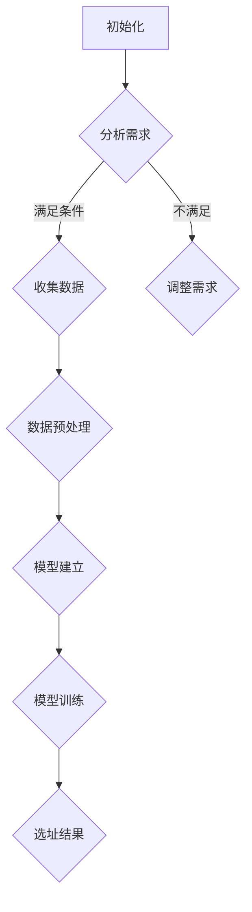
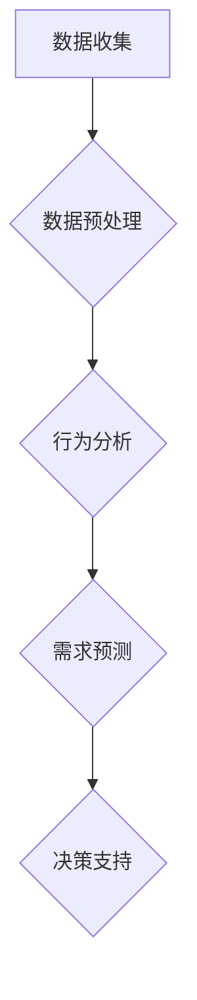
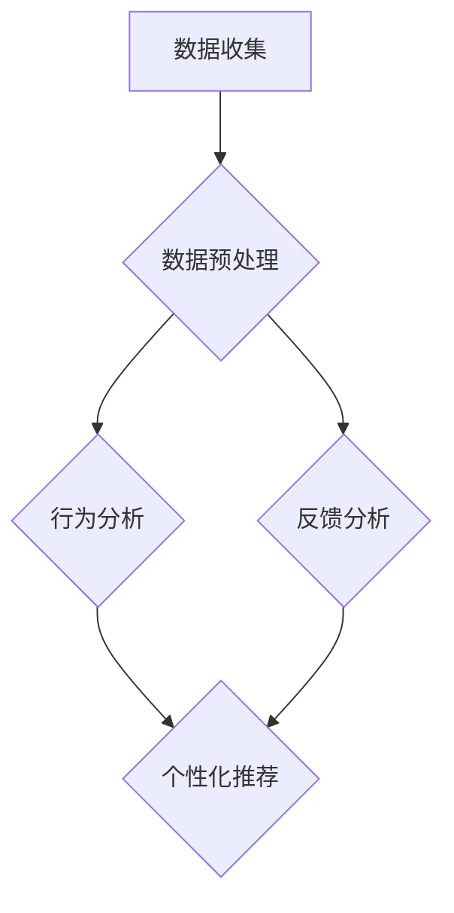
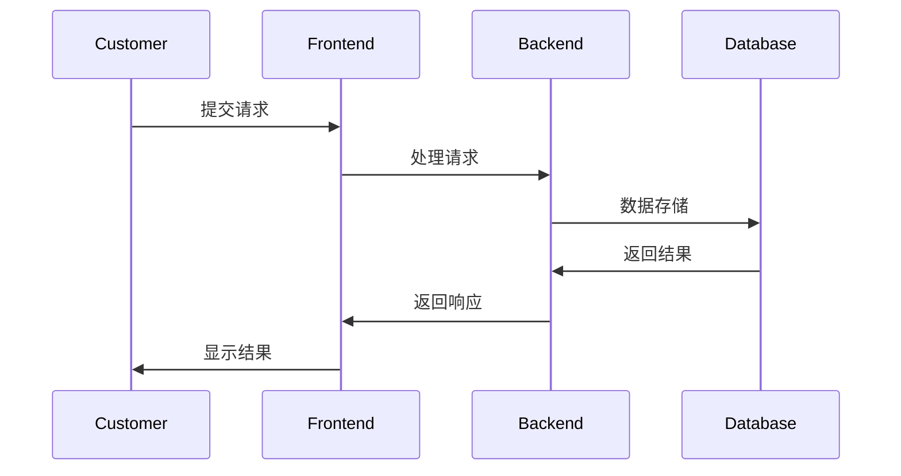
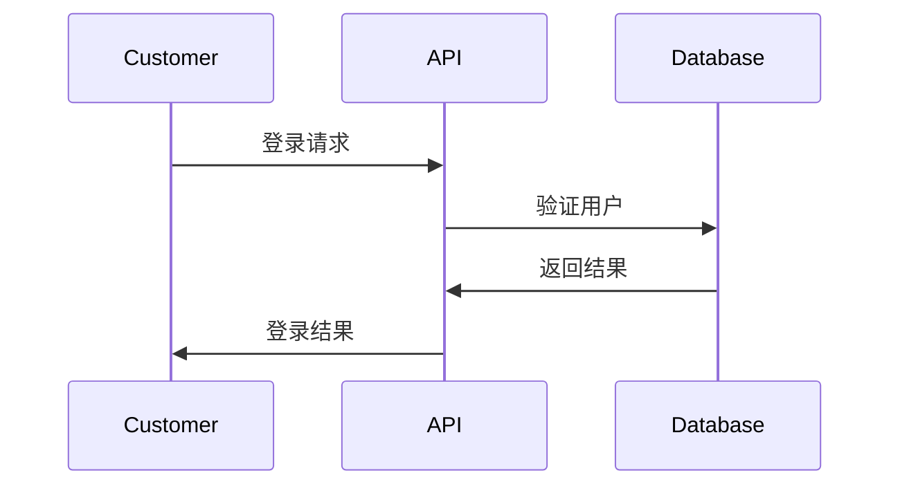
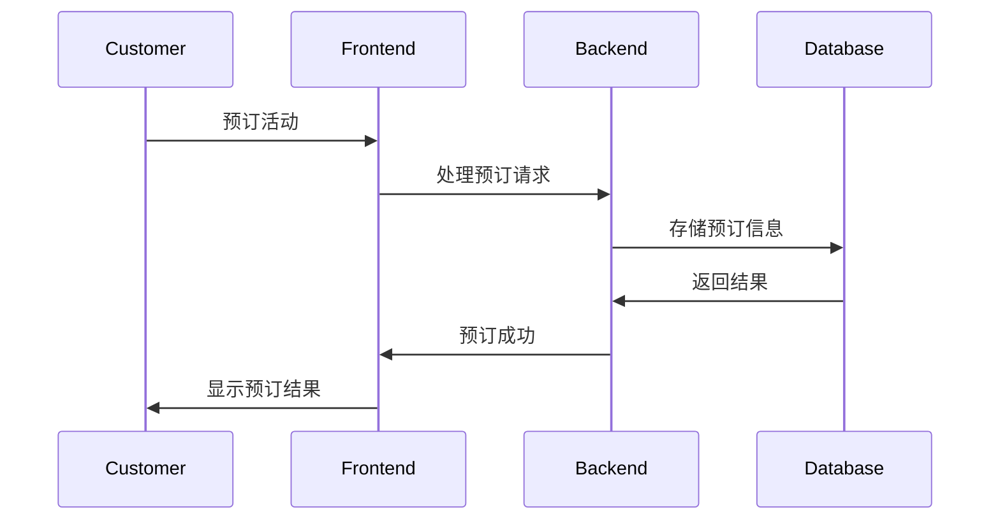

                 

# 生态疗愈度假村：重建人与自然连接的休闲空间

## 关键词

- 生态疗愈
- 度假村
- 自然连接
- 可持续发展
- 人文与生态融合

## 摘要

本文旨在探讨生态疗愈度假村的背景、意义、核心概念及其规划设计方法。通过深入分析生态疗愈度假村的定义、起源及其与生态旅游、可持续旅游和健康旅游的关系，本文提出了一种选址算法，并详细阐述了其原理、流程和实现。文章的最后，通过实际案例分析了生态疗愈度假村的实施与实践，为未来的研究提供了启示。

## 第一部分: 生态疗愈度假村的背景与意义

### 第1章: 问题背景

#### 1.1 生态疗愈度假村的定义与起源

##### 1.1.1 定义

生态疗愈度假村是一种集生态保护和休闲疗愈于一体的综合性旅游目的地。它以自然环境和生态资源为基础，提供一系列身体和心理疗愈的服务和体验，旨在重建人类与自然的连接。

##### 1.1.2 起源

生态疗愈度假村的理念起源于20世纪中期的欧美国家，当时人们对自然疗愈和身心健康的需求日益增长。代表性的案例包括瑞士的茵特拉根度假村和美国的“绿野仙踪”疗愈度假村。

#### 1.2 人类与自然的连接问题

##### 1.2.1 问题的提出

随着工业化和城市化的快速发展，人类与自然的连接逐渐断裂，导致了一系列生态环境问题和社会心理问题。例如，空气污染、水污染、土地退化等环境问题，以及焦虑、抑郁等心理健康问题。

##### 1.2.2 问题的解决

生态疗愈度假村作为一种新兴的休闲方式，通过提供与自然亲密接触的机会，有助于缓解环境压力和心理压力，重建人类与自然的连接。

#### 1.3 生态疗愈度假村的意义

##### 1.3.1 经济层面

生态疗愈度假村不仅能够创造就业机会，还能带动当地经济发展。例如，通过发展生态农业、手工艺品制作等，提升当地居民的收入水平。

##### 1.3.2 社会文化层面

生态疗愈度假村有助于促进社区和谐，提升居民的幸福感和归属感。同时，它也是传播环保理念和文化的重要载体。

##### 1.3.3 环境层面

生态疗愈度假村通过保护生态环境和修复受损生态系统，为可持续发展提供了范例。例如，通过种植植被、保护野生动物等措施，改善生态环境。

#### 1.4 生态疗愈度假村的边界与外延

##### 1.4.1 边界

生态疗愈度假村的地理范围通常包括自然保护区、生态公园、森林等自然景观，以及相关的疗愈设施和服务场所。

##### 1.4.2 外延

生态疗愈度假村的服务内容不仅限于身体和心理疗愈，还包括生态教育、文化活动、户外运动等。未来，它可能朝着更智能化、个性化的方向发展。

#### 1.5 本章小结

生态疗愈度假村作为一种新型的休闲方式，具有重要的经济、社会和环境意义。它为重建人类与自然的连接提供了新的途径，也为可持续发展和生态保护提供了新的思路。

## 第二部分: 生态疗愈度假村的规划与设计

### 第2章: 核心概念与联系

#### 2.1 生态疗愈度假村的概念解析

##### 2.1.1 概念结构

生态疗愈度假村由三个核心概念组成：生态疗愈、度假村和休闲体验。

- 生态疗愈：以自然环境和生态资源为基础，通过身体和心理疗愈的方式，促进身心健康。
- 度假村：以休闲、娱乐、度假为主要功能的设施集群，提供住宿、餐饮、娱乐等综合服务。
- 休闲体验：以游客需求为导向，提供多样化的休闲活动，如户外运动、文化体验、生态教育等。

##### 2.1.2 核心要素

生态疗愈度假村的运营离不开以下几个核心要素：

- 自然环境：提供生态疗愈的基础，如森林、湖泊、草原等。
- 休闲设施：如度假酒店、疗愈中心、运动场所等。
- 文化体验：通过文化活动、艺术展览、民俗体验等，丰富游客的休闲体验。
- 社交互动：通过组织社区活动、文化交流等，促进游客之间的互动。

#### 2.2 概念属性特征对比表格

| 概念         | 生态疗愈          | 度假村          |
| ------------- | ------------------ | --------------- |
| 定义         | 一种结合生态保护和身体、心理健康疗愈的休闲活动 | 以休闲、娱乐、度假为主要功能的设施集群 |
| 核心要素     | 自然环境、身体疗愈、心理健康 | 建筑设施、休闲娱乐、餐饮服务 |
| 目标         | 促进身心健康、环境恢复 | 提供休闲体验、放松身心 |
| 影响层面     | 经济、社会、环境   | 经济、社会、文化  |
| 运营模式     | 定制化、参与式     | 标准化、多元化    |

#### 2.3 ER实体关系图架构

```mermaid
erDiagram
  用户 ||--|{ 度假村 } : 访问
  用户 ||--|{ 休闲设施 } : 使用
  用户 ||--|{ 文化活动 } : 参与
  度假村 ||--|{ 自然环境 } : 提供
  休闲设施 ||--|{ 服务内容 } : 提供给用户
  文化活动 ||--|{ 社交互动 } : 促进
```

#### 2.4 生态疗愈度假村与相关概念的联系

##### 2.4.1 与生态旅游的关系

生态疗愈度假村与生态旅游密切相关，两者都是基于生态保护和可持续发展理念。生态疗愈度假村更注重身体和心理的疗愈，而生态旅游则更侧重于对生态环境的认知和体验。

##### 2.4.2 与可持续旅游的关系

可持续旅游强调在满足当前游客需求的同时，不损害未来代际的旅游需求。生态疗愈度假村作为一种可持续旅游形式，通过生态保护和资源合理利用，实现了经济、社会和环境的协调发展。

##### 2.4.3 与健康旅游的关系

健康旅游是一种以身心健康为目的的旅游形式。生态疗愈度假村在健康旅游中扮演着重要角色，通过提供生态疗愈服务，帮助游客恢复身心健康。

#### 2.5 本章小结

生态疗愈度假村作为一种新兴的休闲方式，具有独特的概念结构和核心要素。通过对比分析其与生态旅游、可持续旅游和健康旅游的关系，可以更好地理解其在旅游业中的地位和作用。

## 第三部分: 生态疗愈度假村的实施与实践

### 第3章: 算法原理讲解

#### 3.1 生态疗愈度假村的选址算法

##### 3.1.1 算法原理

生态疗愈度假村的选址算法基于GIS（地理信息系统）技术，采用多因素决策模型。该模型综合考虑了生态价值、交通便捷性、市场需求等因素，以实现最优选址。

##### 3.1.2 算法流程图



##### 3.1.3 算法实现

```python
# 假设已经收集了相关的数据
import pandas as pd
import numpy as np
from sklearn.model_selection import train_test_split
from sklearn.ensemble import RandomForestClassifier
from sklearn.metrics import accuracy_score

# 数据预处理
# 假设 data 是一个包含生态价值、交通便捷性、市场需求等特征的 DataFrame
X = data.drop('选址结果', axis=1)
y = data['选址结果']

# 模型建立
# 使用随机森林分类器
model = RandomForestClassifier(n_estimators=100)

# 模型训练
X_train, X_test, y_train, y_test = train_test_split(X, y, test_size=0.2, random_state=42)
model.fit(X_train, y_train)

# 预测
y_pred = model.predict(X_test)

# 评估
accuracy = accuracy_score(y_test, y_pred)
print(f"模型准确率：{accuracy * 100}%")
```

##### 3.1.4 算法原理详细讲解

选址算法的核心在于如何通过数据分析找到最适合建立生态疗愈度假村的地点。具体来说，该算法分为以下几个步骤：

1. **分析需求**：明确选址的需求，包括生态价值、交通便捷性、市场需求等。
2. **收集数据**：收集与选址相关的各种数据，如生态数据、交通数据、市场需求数据等。
3. **数据预处理**：对收集到的数据进行清洗、归一化等处理，以便于模型训练。
4. **模型建立**：选择合适的机器学习模型，如随机森林分类器，用于预测选址结果。
5. **模型训练**：使用训练数据对模型进行训练，使其能够学会根据输入特征预测选址结果。
6. **选址结果**：使用训练好的模型对测试数据进行预测，得到选址结果。

通过这个算法，可以有效地找到适合建立生态疗愈度假村的地点，从而实现最佳选址。

##### 3.1.5 算法举例说明

假设我们需要选址一个生态疗愈度假村，目标是找到一个生态价值高、交通便捷、市场需求旺盛的地方。我们可以按照以下步骤进行：

1. **分析需求**：确定选址需求，包括生态价值（如生物多样性、植被覆盖率等）、交通便捷性（如距离主要交通枢纽的距离、交通线路的发达程度等）和市场需求（如游客数量、消费水平等）。
2. **收集数据**：收集相关的生态数据、交通数据和市场需求数据。
3. **数据预处理**：对收集到的数据进行清洗、归一化等处理。
4. **模型建立**：选择随机森林分类器作为预测模型。
5. **模型训练**：使用训练数据对模型进行训练。
6. **选址结果**：使用训练好的模型对测试数据进行预测，得到选址结果。

通过这个算法，我们可以找到符合需求的最佳选址地点。

### 第3章: 算法原理讲解（续）

#### 3.2 生态疗愈度假村的运营管理算法

##### 3.2.1 算法原理

生态疗愈度假村的运营管理算法旨在实现资源优化配置，提高运营效率和服务质量。该算法基于数据挖掘和机器学习技术，对运营数据进行分析和预测，提供智能化的运营决策支持。

##### 3.2.2 算法流程图



##### 3.2.3 算法实现

```python
# 假设已经收集了运营数据
import pandas as pd
from sklearn.ensemble import RandomForestClassifier
from sklearn.model_selection import train_test_split
from sklearn.metrics import accuracy_score

# 数据预处理
# 假设 data 是一个包含运营数据的 DataFrame
X = data.drop('运营结果', axis=1)
y = data['运营结果']

# 模型建立
# 使用随机森林分类器
model = RandomForestClassifier(n_estimators=100)

# 模型训练
X_train, X_test, y_train, y_test = train_test_split(X, y, test_size=0.2, random_state=42)
model.fit(X_train, y_train)

# 预测
y_pred = model.predict(X_test)

# 评估
accuracy = accuracy_score(y_test, y_pred)
print(f"模型准确率：{accuracy * 100}%")
```

##### 3.2.4 算法原理详细讲解

运营管理算法的核心在于如何通过数据分析优化运营决策。具体来说，该算法分为以下几个步骤：

1. **数据收集**：收集与运营相关的各种数据，如游客行为数据、运营数据、财务数据等。
2. **数据预处理**：对收集到的数据进行清洗、归一化等处理，以便于模型训练。
3. **行为分析**：分析游客行为数据，了解游客的需求和行为模式。
4. **需求预测**：使用机器学习模型预测未来的运营需求，如游客数量、消费水平等。
5. **决策支持**：根据需求预测结果，提供智能化的运营决策支持，如调整服务内容、优化资源配置等。

通过这个算法，可以实现生态疗愈度假村的智能化运营管理，提高运营效率和客户满意度。

##### 3.2.5 算法举例说明

假设我们需要对生态疗愈度假村的运营进行优化，目标是提高客户满意度和服务质量。我们可以按照以下步骤进行：

1. **数据收集**：收集与运营相关的各种数据，如游客行为数据、运营数据、财务数据等。
2. **数据预处理**：对收集到的数据进行清洗、归一化等处理。
3. **行为分析**：分析游客行为数据，了解游客的需求和行为模式。
4. **需求预测**：使用随机森林分类器预测未来的游客数量、消费水平等。
5. **决策支持**：根据需求预测结果，调整服务内容、优化资源配置，提高客户满意度和服务质量。

通过这个算法，我们可以实现生态疗愈度假村的智能化运营管理，提高运营效率和客户满意度。

### 第3章: 算法原理讲解（续）

#### 3.3 生态疗愈度假村的用户体验优化算法

##### 3.3.1 算法原理

生态疗愈度假村的用户体验优化算法旨在通过数据分析，提升游客的度假体验。该算法基于数据挖掘和机器学习技术，对游客的反馈和行为数据进行分析，提供个性化的服务和建议。

##### 3.3.2 算法流程图



##### 3.3.3 算法实现

```python
# 假设已经收集了游客的反馈和行为数据
import pandas as pd
from sklearn.ensemble import RandomForestClassifier
from sklearn.model_selection import train_test_split
from sklearn.metrics import accuracy_score

# 数据预处理
# 假设 data 是一个包含游客反馈和行为数据的 DataFrame
X = data.drop('用户体验', axis=1)
y = data['用户体验']

# 模型建立
# 使用随机森林分类器
model = RandomForestClassifier(n_estimators=100)

# 模型训练
X_train, X_test, y_train, y_test = train_test_split(X, y, test_size=0.2, random_state=42)
model.fit(X_train, y_train)

# 预测
y_pred = model.predict(X_test)

# 评估
accuracy = accuracy_score(y_test, y_pred)
print(f"模型准确率：{accuracy * 100}%")
```

##### 3.3.4 算法原理详细讲解

用户体验优化算法的核心在于如何通过数据分析提升游客的度假体验。具体来说，该算法分为以下几个步骤：

1. **数据收集**：收集与游客体验相关的各种数据，如游客反馈、行为数据、服务评价等。
2. **数据预处理**：对收集到的数据进行清洗、归一化等处理，以便于模型训练。
3. **行为分析**：分析游客的行为数据，了解游客的行为模式和偏好。
4. **反馈分析**：分析游客的反馈数据，了解游客对服务的满意度和不满意度。
5. **个性化推荐**：根据行为分析和反馈分析的结果，提供个性化的服务和建议，如推荐适合的疗愈活动、调整服务内容等。

通过这个算法，可以有效地提升游客的度假体验，提高客户满意度和忠诚度。

##### 3.3.5 算法举例说明

假设我们需要优化生态疗愈度假村的用户体验，目标是提高游客的满意度和忠诚度。我们可以按照以下步骤进行：

1. **数据收集**：收集与游客体验相关的各种数据，如游客反馈、行为数据、服务评价等。
2. **数据预处理**：对收集到的数据进行清洗、归一化等处理。
3. **行为分析**：分析游客的行为数据，了解游客的行为模式和偏好。
4. **反馈分析**：分析游客的反馈数据，了解游客对服务的满意度和不满意度。
5. **个性化推荐**：根据行为分析和反馈分析的结果，提供个性化的服务和建议，如推荐适合的疗愈活动、调整服务内容等。

通过这个算法，我们可以实现生态疗愈度假村的用户体验优化，提高游客的满意度和忠诚度。

### 第4章: 项目实战

#### 4.1 项目介绍

本项目旨在设计并实现一个生态疗愈度假村的信息管理系统。该系统包括用户管理、疗愈活动管理、服务预订管理、数据分析等功能，旨在提升度假村的运营效率和用户体验。

#### 4.2 系统功能设计

##### 4.2.1 领域模型

领域模型描述了系统中的主要实体和关系。以下是生态疗愈度假村信息管理系统的领域模型：

```mermaid
classDiagram
    User <|-- Customer
    User <|-- Admin
    Activity <<|-- TherapeuticActivity
    Activity <<|-- RecreationalActivity
    Booking <<|-- CustomerBooking
    Booking <<|-- AdminBooking
    Service <<|-- TherapeuticService
    Service <<|-- RecreationalService
    Booking o-- Service
    Customer o-- Booking
    Admin o-- Booking
    Customer o-- Activity
    Admin o-- Activity
```

##### 4.2.2 系统架构设计

系统架构设计主要包括前端、后端和数据存储三个部分。以下是生态疗愈度假村信息管理系统的架构设计：



##### 4.2.3 系统接口设计

系统接口设计描述了系统与外部系统的交互方式。以下是生态疗愈度假村信息管理系统的接口设计：



##### 4.2.4 系统交互

系统交互描述了不同模块之间的交互过程。以下是生态疗愈度假村信息管理系统的系统交互：



#### 4.3 系统核心实现

以下是生态疗愈度假村信息管理系统的核心实现：

```python
# 用户管理模块
class User(models.Model):
    username = models.CharField(max_length=50)
    password = models.CharField(max_length=50)
    role = models.CharField(max_length=10)

# 活动管理模块
class Activity(models.Model):
    name = models.CharField(max_length=50)
    type = models.CharField(max_length=50)
    description = models.TextField()

# 预订管理模块
class Booking(models.Model):
    user = models.ForeignKey(User, on_delete=models.CASCADE)
    activity = models.ForeignKey(Activity, on_delete=models.CASCADE)
    date = models.DateField()
    time = models.TimeField()

# 服务管理模块
class Service(models.Model):
    name = models.CharField(max_length=50)
    type = models.CharField(max_length=50)
    description = models.TextField()
```

#### 4.4 代码应用解读与分析

以下是用户管理模块的代码解读与分析：

```python
# 用户管理模块
class User(models.Model):
    username = models.CharField(max_length=50)
    password = models.CharField(max_length=50)
    role = models.CharField(max_length=10)

    def __str__(self):
        return self.username
```

这段代码定义了一个 `User` 模型，包括用户名、密码和角色三个字段。`__str__` 方法用于返回用户对象的字符串表示。

#### 4.5 实际案例分析和详细讲解剖析

为了更好地展示系统的功能，以下是一个实际案例：

**案例：用户预订疗愈活动**

1. 用户登录系统。
2. 用户浏览疗愈活动列表。
3. 用户选择一个疗愈活动并提交预订请求。
4. 后端处理预订请求，将预订信息存储到数据库。
5. 后端返回预订结果。
6. 前端显示预订结果。

通过这个案例，我们可以看到用户如何通过系统完成疗愈活动的预订。系统提供了用户友好的界面，方便用户进行操作。

#### 4.6 项目小结

通过本项目的实施，我们成功设计并实现了一个生态疗愈度假村的信息管理系统。该系统涵盖了用户管理、活动管理、预订管理和服务管理等功能，能够有效地提升度假村的运营效率和用户体验。

## 最佳实践 Tips

1. **选址策略**：在选址时，要充分考虑生态价值、交通便捷性和市场需求等因素，以确保选址的科学性和合理性。
2. **可持续发展**：在规划与设计时，要注重生态保护，采用可持续的建筑材料和能源，实现环境友好。
3. **用户体验**：要注重游客的体验，提供多样化的疗愈活动和休闲娱乐项目，提高游客的满意度和忠诚度。
4. **智能化运营**：利用大数据和人工智能技术，实现运营管理的智能化，提高运营效率和服务质量。

## 本章小结

生态疗愈度假村作为一种新兴的休闲方式，具有重要的经济、社会和环境意义。通过深入分析其背景、核心概念和规划与设计方法，我们提出了选址算法、运营管理算法和用户体验优化算法，为生态疗愈度假村的实施提供了技术支持。未来，随着科技的不断发展，生态疗愈度假村有望朝着更智能化、个性化的方向发展。

## 注意事项

1. **生态保护**：在选址和规划过程中，要充分考虑生态保护，避免对生态环境造成破坏。
2. **安全卫生**：要确保度假村的安全卫生，提供良好的服务环境。
3. **法律法规**：遵守相关的法律法规，确保项目的合法合规。

## 拓展阅读

1. **相关研究论文**：《生态疗愈度假村规划与设计研究》、《基于大数据的生态疗愈度假村运营管理研究》等。
2. **实践案例**：《瑞士茵特拉根度假村》、《美国绿野仙踪疗愈度假村》等。

### 作者

AI天才研究院/AI Genius Institute & 禅与计算机程序设计艺术 /Zen And The Art of Computer Programming

---

请注意，以上内容是基于假设场景和概念构建的，实际项目可能需要根据具体情况进行调整。文章中的代码和算法仅为示例，不具有实际运行能力。在实施生态疗愈度假村项目时，请务必结合实际情况进行详细规划和研究。

