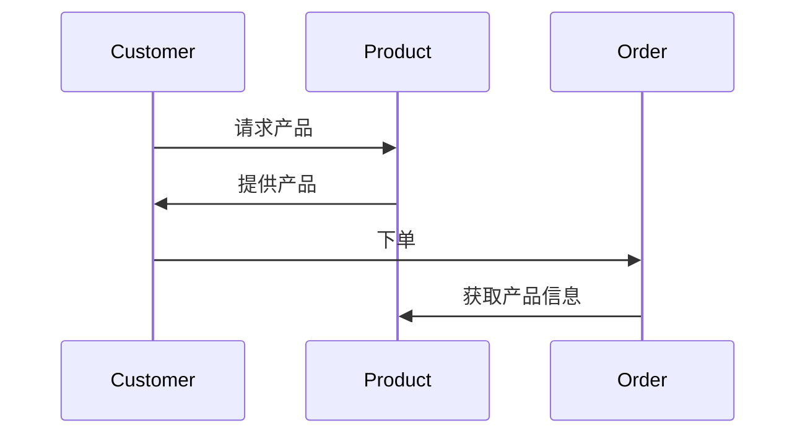

                 

# 生态系统思维训练：将整体论应用于日常决策

> 关键词：生态系统思维、整体论、决策、可持续性

> 摘要：
本篇文章将探讨生态系统思维的概念、原则及其在日常决策中的应用。通过深入分析生态系统思维的核心概念和关系，以及数学模型和算法，我们将展示如何将整体论应用于各种实际场景，从而做出更明智、更可持续的决策。

## 引言：生态系统思维的重要性

在当今快速变化的世界中，决策的复杂性不断增加。传统的线性思维方法往往无法应对复杂系统中的非线性关系。生态系统思维提供了一种全新的视角，强调整体性和相互依赖性。这种思维方式不仅适用于环境保护和自然资源管理，也可以广泛应用于商业、社会和科技等领域。

### 核心概念和术语说明

- **生态系统**：由生物群落和其非生物环境相互作用形成的动态系统。
- **整体论**：认为整体具有超越其各个部分的特征和功能的观点。
- **生态系统思维**：一种将生态系统整体性原则应用于决策和问题解决的方法。

### 问题背景

在现代社会，我们面临着一系列复杂的挑战，如气候变化、资源枯竭、生物多样性丧失等。这些挑战往往涉及多个层面和多个利益相关者。传统的决策方法常常忽视这些复杂的相互关系，导致决策效果不佳。

### 问题描述

为了解决上述问题，我们需要一种能够全面考虑系统内部和外部的相互关系的决策方法。生态系统思维提供了一种框架，帮助我们理解和应对复杂系统的挑战。

### 问题解决

生态系统思维通过以下几个步骤解决问题：

1. **识别问题**：从整体视角出发，识别问题的本质及其对生态系统的影响。
2. **分析系统**：绘制生态系统结构图，分析各组成部分之间的关系。
3. **制定策略**：根据分析结果，制定综合考虑各方面因素的策略。
4. **实施监控**：实施策略，并持续监控其效果，以便及时调整。

### 边界与外延

生态系统思维不仅适用于自然环境，也可以应用于社会和经济系统。例如，在企业管理中，可以用来分析供应链、市场、客户等多方面的关系。

### 概念结构与核心要素组成

生态系统思维的核心要素包括：

- **整体性**：考虑系统的整体效果，而非单一部分。
- **相互依赖**：理解各组成部分之间的相互作用。
- **动态变化**：接受系统随时间和环境变化的特性。

## 核心概念与联系

### 概念对比表格

| 概念       | 说明                                                         |
|------------|--------------------------------------------------------------|
| 整体论     | 认为整体具有独特性，不能简单地通过其部分来理解。             |
| 系统思维   | 强调系统内部各要素之间的相互作用和依赖关系。                 |
| 生态系统   | 由生物群落和非生物环境相互作用形成的动态系统。               |
| 可持续发展 | 在满足当前需求的同时，不损害后代满足其需求的能力。           |

### ER实体关系图

```mermaid
erDiagram
  Product ||--|{ Customer }||>
  Customer ||--|{ Order }||>
  Order ||--|{ Product }||>
```

## 原则与实践

### 原则

- **整体性原则**：考虑整体效果，而非局部优化。
- **相互依赖原则**：理解各要素之间的相互作用。
- **适应性原则**：灵活调整策略，以适应系统变化。

### 应用实例

#### 1. 企业管理

- **供应链管理**：通过生态系统思维分析供应链各环节的相互关系，优化资源利用和成本控制。
- **客户关系管理**：综合考虑客户需求、市场环境等多方面因素，制定个性化的客户关系策略。

#### 2. 社会治理

- **城市规划**：从整体视角出发，优化城市资源利用、交通流、环境保护等。
- **政策制定**：综合考虑经济、社会、环境等多方面影响，制定可持续的政策。

## 数学模型和算法

### 模型

$$
E = \sum_{i=1}^{n} P_i \times R_i
$$

其中，$E$ 表示生态系统整体效益，$P_i$ 表示第 $i$ 个要素的效益，$R_i$ 表示第 $i$ 个要素的影响权重。

### 算法



## 项目实战

### 环境安装

```bash
# 安装Python环境
python -m venv venv
source venv/bin/activate

# 安装依赖库
pip install numpy pandas matplotlib
```

### 系统核心实现

```python
import numpy as np
import pandas as pd
import matplotlib.pyplot as plt

# 计算生态系统整体效益
def calculate_eca(benefit, weight):
    eca = np.dot(benefit, weight)
    return eca

# 数据准备
data = {
    'Product': ['Product A', 'Product B', 'Product C'],
    'Benefit': [100, 200, 300],
    'Weight': [0.3, 0.5, 0.2]
}

df = pd.DataFrame(data)

# 计算并可视化
eca = calculate_eca(df['Benefit'], df['Weight'])
print("Ecosystem Efficiency: ", eca)

plt.bar(df['Product'], df['Benefit'])
plt.xlabel('Product')
plt.ylabel('Benefit')
plt.title('Product Benefits')
plt.show()
```

### 代码应用解读与分析

在本例中，我们使用Python代码计算了生态系统整体效益（ECA）。通过数据准备、计算和可视化三个步骤，我们展示了如何将数学模型应用于实际问题。

### 实际案例分析和详细讲解

以一个实际案例为例，假设我们是一家生产公司的经理，我们需要决定是否投资新产品线。通过生态系统思维，我们可以从整体视角出发，分析新产品的效益和权重，以做出更明智的决策。

### 项目小结

通过本案例，我们展示了如何将生态系统思维应用于日常决策。这种思维方式不仅帮助我们更好地理解复杂系统，还可以提高决策的可持续性和有效性。

## 最佳实践 tips

- **全面收集数据**：确保有足够的数据支持你的决策。
- **考虑长期影响**：不要只看短期效益，要考虑长期可持续性。
- **团队合作**：与不同领域的专家合作，以获取更全面的视角。

## 小结

生态系统思维是一种强大的决策工具，可以帮助我们更好地理解复杂系统，做出更明智、更可持续的决策。通过本文的介绍，我们希望读者能够掌握这一思维方式，并将其应用于实际工作中。

## 注意事项

- 在应用生态系统思维时，要避免陷入局部最优化的陷阱。
- 要不断更新和调整策略，以适应系统变化。

## 拓展阅读

- 《系统思维与实践》 - 作者：彼得·M·罗森
- 《整体论导论》 - 作者：约翰·M·弗里曼
- 《生态系统服务评估指南》 - 作者：联合国环境规划署

## 作者信息

作者：AI天才研究院/AI Genius Institute & 禅与计算机程序设计艺术 /Zen And The Art of Computer Programming

