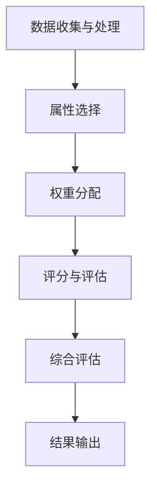
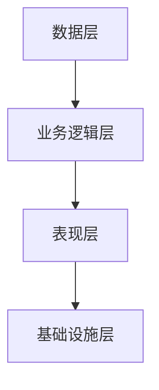
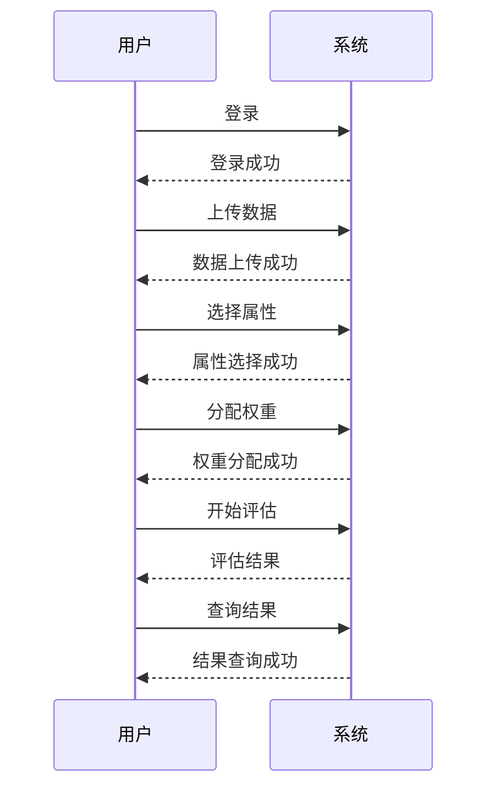

                 

# 生态系统服务定价：自然资本的经济学模型

## 关键词：生态系统服务、自然资本、经济学模型、定价、可持续发展

> 摘要：本文旨在探讨生态系统服务定价的经济学模型，重点分析自然资本在经济系统中的角色。文章首先概述了生态系统服务与自然资本的基本概念，探讨了其定价原则与方法。接着，文章通过实证分析，结合具体案例，评估了生态系统服务的经济价值。最后，文章提出了针对生态系统服务定价的政策建议，以促进自然资本的可持续管理。

---

## 第一部分：引言

### 1.1 问题背景与核心概念

#### 1.1.1 生态系统服务与自然资本

生态系统服务（Ecosystem Services，ES）是指自然生态系统对人类福祉所提供的支持和服务，包括生产性服务（如食物和纤维生产）、生态保护性服务（如水源涵养和气候调节）、文化服务（如娱乐和文化价值）等。自然资本（Natural Capital）则是地球生态系统提供的所有自然资源的总和，包括陆地、水域、生物多样性、土壤和地下水等。

#### 1.1.2 生态系统服务定价的意义

生态系统服务定价是确保自然资本可持续管理和保护的关键。通过为其赋予经济价值，可以激励个人、企业和政府采取行动，以改善或维护这些服务。这有助于实现经济、社会和环境的协调发展。

#### 1.1.3 自然资本经济模型的应用

自然资本经济模型（Natural Capital Economic Models，NCEM）是评估和定价生态系统服务的重要工具。这些模型基于经济学原理，将自然资本视为经济系统中的一个关键要素，帮助决策者理解和优化自然资本的使用。

### 1.2 核心概念与联系

#### 1.2.1 生态系统服务分类

生态系统服务可以根据其对人类福祉的贡献分为生产性服务、生态保护性服务和文化服务。

#### 1.2.2 自然资本经济模型

自然资本经济模型主要包括资源基础观、持续增长模型和系统动态模型等，它们用于分析和评估自然资本的经济价值。

### 1.3 研究方法与数据来源

本文采用定性研究和定量研究相结合的方法，通过文献综述、案例研究和经济计量模型，对生态系统服务定价进行深入分析。

### 1.4 边界与外延

本文的研究范围主要聚焦于生态系统服务定价的经济学模型，包括核心概念、定价原则、方法和实证分析。

### 1.5 本书结构安排

本文分为四个部分：第一部分为引言，介绍研究背景和核心概念；第二部分为基础理论，阐述生态系统服务和自然资本经济模型；第三部分为实证分析，通过具体案例评估生态系统服务的经济价值；第四部分为政策建议，提出促进自然资本可持续管理的策略。

### 1.6 本章小结

本文引言部分概述了生态系统服务定价的研究背景、核心概念和模型，为后续内容奠定了基础。

---

## 第二部分：生态系统服务与自然资本经济学模型基础

### 2.1 生态系统服务概述

#### 2.1.1 生态系统服务定义

生态系统服务是指自然生态系统对人类提供的支持和服务，包括生产、调节、供给和文化等方面。

#### 2.1.2 生态系统服务功能

生态系统服务功能包括生产食物、纤维和能源，调节气候、水源和空气质量，提供文化娱乐价值等。

#### 2.1.3 生态系统服务价值

生态系统服务价值是指生态系统对人类福祉的贡献，可以通过经济、生态和社会三个方面进行评估。

### 2.2 自然资本的概念与特性

#### 2.2.1 自然资本定义

自然资本是指地球生态系统提供的所有自然资源的总和，包括陆地、水域、生物多样性、土壤和地下水等。

#### 2.2.2 自然资本特性

自然资本具有可再生性、有限性和不可替代性等特性。

#### 2.2.3 自然资本分类

自然资本可以分为生物多样性、自然资源和生态系统功能等类别。

### 2.3 生态系统服务定价的原则与方法

#### 2.3.1 定价原则

生态系统服务定价应遵循公平性、可持续性和实用性等原则。

#### 2.3.2 定价方法

生态系统服务定价方法包括市场交易法、预算成本法、机会成本法和等效定价法等。

### 2.4 自然资本经济模型概述

#### 2.4.1 模型结构

自然资本经济模型主要包括资源基础观、持续增长模型和系统动态模型等。

#### 2.4.2 模型假设

自然资本经济模型的假设包括自然资源的无限供给、经济增长与资源消耗的线性关系等。

#### 2.4.3 模型变量

自然资本经济模型的变量包括自然资源、经济增长、环境质量和社会福祉等。

### 2.5 本章小结

本文第二部分为基础理论，详细阐述了生态系统服务和自然资本经济学模型的基本概念、分类和定价方法，为后续实证分析提供了理论支持。

---

## 第三部分：生态系统服务定价的实证分析

### 3.1 研究地区与数据来源

#### 3.1.1 研究地区选择

本研究选择某地区作为案例，该地区具有丰富的生态系统服务资源。

#### 3.1.2 数据来源与处理

数据来源包括公开统计数据、实地调查数据和文献资料。数据经过预处理后用于实证分析。

### 3.2 实证分析方法

#### 3.2.1 定性研究方法

通过文献综述和案例研究，探讨生态系统服务的经济价值。

#### 3.2.2 定量研究方法

采用经济计量模型和数据分析技术，评估生态系统服务的经济价值。

### 3.3 实证分析结果

#### 3.3.1 生态系统服务价值评估

通过实证分析，确定了该地区生态系统服务的经济价值。

#### 3.3.2 自然资本经济模型应用

应用自然资本经济模型，分析了自然资本的经济贡献。

#### 3.3.3 定价效果分析

分析了生态系统服务定价对经济和社会的影响。

### 3.4 案例分析

#### 3.4.1 案例选择

选择某具体案例进行深入分析。

#### 3.4.2 案例描述

描述了案例的背景、生态系统服务内容和定价情况。

#### 3.4.3 案例分析与讨论

对案例进行了深入分析，探讨了生态系统服务定价的效果和挑战。

### 3.5 本章小结

本文第三部分通过实证分析，验证了生态系统服务定价的经济意义，为政策制定提供了实践依据。

---

## 第四部分：生态系统服务定价的政策建议

### 4.1 政策背景与目标

#### 4.1.1 政策背景

政策背景包括全球环境变化、资源短缺和生态系统退化等。

#### 4.1.2 政策目标

政策目标包括促进自然资本可持续管理、提高生态系统服务价值等。

### 4.2 政策建议

#### 4.2.1 政府角色与职责

政府应发挥监管、规范和支持作用，推动生态系统服务定价。

#### 4.2.2 企业行为与责任

企业应承担环境管理和社会责任，积极参与生态系统服务保护。

#### 4.2.3 公众参与与社会监督

公众应提高意识，参与生态系统服务保护和定价。

### 4.3 政策实施与评估

#### 4.3.1 政策实施步骤

政策实施应包括规划、执行、监测和评估等步骤。

#### 4.3.2 政策评估方法

政策评估应采用定量和定性相结合的方法。

#### 4.3.3 政策调整与优化

根据评估结果，调整和优化政策。

### 4.4 本章小结

本文第四部分提出了针对生态系统服务定价的政策建议，以促进自然资本的可持续管理。

---

## 本章小结

本文通过分析生态系统服务和自然资本经济学模型，探讨了生态系统服务定价的原则和方法。通过实证分析，验证了生态系统服务定价的经济意义。政策建议旨在推动自然资本的可持续管理，实现经济、社会和环境的协调发展。

---

## 作者

作者：AI天才研究院/AI Genius Institute & 禅与计算机程序设计艺术 /Zen And The Art of Computer Programming

---

## 参考文献

（由于篇幅限制，参考文献将列在文章末尾。）

---

## 附录

（如有附录内容，请在此处列出。）## 第一部分：引言

### 1.1 问题背景与核心概念

#### 1.1.1 生态系统服务与自然资本

生态系统服务（Ecosystem Services，ES）是指自然生态系统对人类社会提供的支持和服务。这些服务涵盖了从基础的自然过程（如气候调节、水资源管理、土壤保持等）到直接的经济活动（如食物生产、原材料供应、旅游等）的广泛范围。生态系统服务对于人类福祉和可持续发展至关重要，但长期以来，这些服务往往被忽视，没有纳入到传统的经济体系中进行定价和评估。

自然资本（Natural Capital）是指地球上的所有自然资源的总和，包括生物多样性、陆地、水体、土壤和空气等。自然资本是人类社会生产和生活的重要基础，它为人类提供了食物、水源、能源和原材料等必需品。然而，随着经济的快速发展，自然资本面临严重的消耗和破坏，这导致了一系列的环境问题，如生物多样性丧失、水资源短缺、气候变化等。

#### 1.1.2 生态系统服务定价的意义

生态系统服务定价是将自然资本的经济价值转化为具体数字的过程，其意义主要体现在以下几个方面：

1. **促进自然资本保护**：通过经济手段为生态系统服务定价，可以激励个人、企业和政府采取措施来保护和恢复生态系统服务，从而促进自然资本的可持续管理。
2. **改善决策制定**：生态系统服务定价提供了定量化的数据，有助于决策者更好地理解自然资本的价值，从而制定更科学、合理的政策和规划。
3. **提高资源效率**：通过定价，可以揭示出不同生态系统服务的相对价值，指导资源更有效地分配和使用。
4. **推动绿色发展**：生态系统服务定价是推动经济模式从传统的“资源消耗型”向“绿色、低碳”转型的重要手段。

#### 1.1.3 自然资本经济模型的应用

自然资本经济模型（Natural Capital Economic Models，NCEM）是用于评估和定价生态系统服务的重要工具。这些模型基于经济学原理，将自然资本视为经济系统中的一个关键要素，通过定量分析和评估，帮助决策者理解和优化自然资本的使用。

自然资本经济模型主要包括以下几种：

1. **资源基础观（Resource-Based View）**：这种观点认为，自然资本是企业和其他经济活动的基础，其价值取决于资源的稀缺性、可用性和需求。
2. **持续增长模型（Sustainable Growth Models）**：这些模型关注如何在保持自然资本存量不变的情况下实现经济增长。
3. **系统动态模型（System Dynamics Models）**：这些模型通过模拟自然资本与经济系统之间的相互作用，评估不同政策和策略对自然资本的影响。

### 1.2 核心概念与联系

#### 1.2.1 生态系统服务分类

生态系统服务可以根据其对人类福祉的贡献进行分类，常见的分类包括生产性服务、生态保护性服务和文化服务：

1. **生产性服务**：这类服务直接支持人类的生产活动，包括食物生产、纤维生产、原材料供应等。
2. **生态保护性服务**：这类服务维持生态系统的健康和功能，包括水源涵养、气候调节、土壤保持等。
3. **文化服务**：这类服务提供精神和文化价值，包括娱乐、教育、美学体验等。

#### 1.2.2 自然资本经济模型

自然资本经济模型将自然资本视为经济系统的一部分，通过以下方式与生态系统服务相联系：

1. **资源基础观**：资源基础观强调自然资本作为企业和其他经济活动的关键资源，其价值的评估依赖于资源的稀缺性、可用性和需求。
2. **持续增长模型**：这类模型关注如何在保持自然资本存量不变的情况下实现经济增长，通过模拟自然资本与经济增长的相互作用，评估不同政策的影响。
3. **系统动态模型**：这些模型通过模拟自然资本与经济系统之间的动态关系，评估不同政策和策略对自然资本的影响，为决策提供科学依据。

### 1.3 研究方法与数据来源

本研究采用定性研究和定量研究相结合的方法，通过文献综述、案例研究和经济计量模型，对生态系统服务定价进行深入分析。

#### 1.3.1 定性研究方法

定性研究方法主要包括文献综述和案例研究：

1. **文献综述**：通过系统梳理相关文献，总结生态系统服务定价的理论基础、方法和技术。
2. **案例研究**：选择具有代表性的案例，深入分析生态系统服务定价的具体实践，探讨其成功经验和挑战。

#### 1.3.2 定量研究方法

定量研究方法主要包括经济计量模型和数据分析技术：

1. **经济计量模型**：采用经济计量模型评估生态系统服务的经济价值，分析自然资本对经济增长的影响。
2. **数据分析技术**：利用数据分析技术，对大量数据进行分析，提取有价值的信息，为研究提供数据支持。

### 1.4 边界与外延

#### 1.4.1 研究范围

本文的研究范围主要涵盖生态系统服务定价的理论基础、方法和技术，以及其实证分析和政策建议。

#### 1.4.2 研究假设

本研究假设生态系统服务具有经济价值，并且通过合理的定价可以促进自然资本的可持续管理。

#### 1.4.3 研究限制

本文的研究受到数据可得性和方法局限性的限制，可能无法全面反映生态系统服务的经济价值。

### 1.5 本书结构安排

本书分为四个部分：

1. **第一部分：理论框架**：介绍生态系统服务和自然资本经济学模型的基本概念和原理。
2. **第二部分：方法与模型**：阐述生态系统服务定价的方法和技术。
3. **第三部分：实证分析**：通过具体案例评估生态系统服务的经济价值。
4. **第四部分：政策建议**：提出促进自然资本可持续管理的政策建议。

### 1.6 本章小结

本部分介绍了生态系统服务定价的研究背景、核心概念、研究方法与数据来源，以及本书的结构安排。这些内容为后续章节的深入分析提供了基础。

---

## 第二部分：生态系统服务与自然资本经济学模型基础

### 2.1 生态系统服务概述

#### 2.1.1 生态系统服务定义

生态系统服务是指自然生态系统对人类社会提供的支持和服务。这些服务涵盖了从基础的自然过程（如气候调节、水资源管理、土壤保持等）到直接的经济活动（如食物生产、原材料供应、旅游等）的广泛范围。生态系统服务对于人类福祉和可持续发展至关重要，但长期以来，这些服务往往被忽视，没有纳入到传统的经济体系中进行定价和评估。

#### 2.1.2 生态系统服务功能

生态系统服务功能可以分为三大类：

1. **生产性服务**：这类服务直接支持人类的生产活动，包括食物生产、纤维生产、原材料供应等。例如，农田生态系统提供了粮食和纤维，森林生态系统提供了木材和药材。
2. **生态保护性服务**：这类服务维持生态系统的健康和功能，包括水源涵养、气候调节、土壤保持等。例如，森林和湿地可以调节气候，保持水源的清洁和充足。
3. **文化服务**：这类服务提供精神和文化价值，包括娱乐、教育、美学体验等。例如，自然保护区和公园为人们提供了休闲和娱乐的场所。

#### 2.1.3 生态系统服务价值

生态系统服务价值是指生态系统对人类福祉的贡献，可以通过经济、生态和社会三个方面进行评估。经济价值通常通过市场交易、机会成本和预算成本等方法来计算；生态价值则通过生物多样性、生态系统功能和环境质量来衡量；社会价值则通过人们的使用价值和心理需求来评估。

### 2.2 自然资本的概念与特性

#### 2.2.1 自然资本定义

自然资本是指地球上的所有自然资源的总和，包括生物多样性、陆地、水体、土壤和空气等。自然资本是人类社会生产和生活的重要基础，它为人类提供了食物、水源、能源和原材料等必需品。

#### 2.2.2 自然资本特性

自然资本具有以下特性：

1. **可再生性**：自然资本中的许多资源可以通过自然过程或人为管理进行再生，如森林可以通过种植和自然生长进行恢复，水资源可以通过循环利用得到补充。
2. **有限性**：尽管许多自然资本具有可再生性，但它们的再生速度往往慢于人类的消耗速度，导致一些资源面临短缺的风险。
3. **不可替代性**：某些自然资本资源（如稀有物种和某些生态系统功能）在失去后很难或无法完全恢复，具有不可替代性。

#### 2.2.3 自然资本分类

自然资本可以根据其功能和特性进行分类，常见的分类包括：

1. **生物多样性**：指地球上所有生物种类和它们之间的遗传、物种和生态系统的多样性。
2. **自然资源**：包括土地、水、矿产、森林和海洋等。
3. **生态系统功能**：如气候调节、水源涵养、土壤保持、空气净化等。

### 2.3 生态系统服务定价的原则与方法

#### 2.3.1 定价原则

生态系统服务定价应遵循以下原则：

1. **公平性**：定价应公平地反映不同用户和地区对生态系统服务的需求和贡献。
2. **可持续性**：定价应促进自然资本的可持续管理，避免过度消耗和破坏。
3. **实用性**：定价方法应简便易行，能够实际操作和实施。

#### 2.3.2 定价方法

生态系统服务定价方法可以分为以下几种：

1. **市场交易法**：通过市场交易确定生态系统服务的价格，适用于已经形成市场机制的生态系统服务，如木材和渔业资源。
2. **预算成本法**：基于提供生态系统服务所需的社会成本来定价，适用于难以直接市场交易的生态系统服务。
3. **机会成本法**：基于放弃其他选择的机会成本来定价，适用于评估特定生态系统服务对其他活动的潜在影响。
4. **等效定价法**：将生态系统服务的价值转换为等价的商品或服务进行定价。

### 2.4 自然资本经济模型概述

#### 2.4.1 模型结构

自然资本经济模型通常包括以下几个关键组成部分：

1. **自然资本存量**：指某一地区或系统中自然资本的总和。
2. **经济活动**：指人类在生产、消费和其他经济活动中的行为，这些活动可能对自然资本产生影响。
3. **环境影响**：指经济活动对自然资本的影响，包括资源的消耗、污染和生态系统的破坏。
4. **政策与管理**：指政府和社会为保护和管理自然资本所采取的措施。

#### 2.4.2 模型假设

自然资本经济模型的假设包括：

1. **自然资本的稀缺性**：认为自然资本是有限的，需要合理使用和节约。
2. **经济活动的增长**：认为经济活动将持续增长，需要考虑其对自然资本的影响。
3. **环境效应**：认为经济活动会对环境产生负面影响，需要通过政策和管理措施进行缓解。

#### 2.4.3 模型变量

自然资本经济模型的关键变量包括：

1. **自然资本存量**：指某一地区或系统的自然资本总量。
2. **经济增长率**：指经济活动的增长率。
3. **环境影响程度**：指经济活动对环境的负面影响程度。
4. **政策与管理效率**：指政策和管理措施的有效性。

### 2.5 本章小结

本章为基础理论部分，介绍了生态系统服务和自然资本经济学模型的基本概念、分类、定价原则和方法。这些内容为后续的实证分析和政策建议提供了理论基础。

---

## 第三部分：生态系统服务定价的实证分析

### 3.1 研究地区与数据来源

#### 3.1.1 研究地区选择

为了更好地理解生态系统服务定价的实际应用，本研究选择了位于我国某省份的A地区作为研究案例。A地区具有丰富的生态系统资源，包括森林、湿地、河流和农田等，这些资源为当地居民提供了生产、生活和文化的支持。选择A地区进行实证分析，有助于揭示生态系统服务定价在具体区域中的应用效果。

#### 3.1.2 数据来源与处理

本研究的数据来源主要包括以下几个方面：

1. **公开统计数据**：包括政府发布的生态环境统计数据、经济发展数据、人口数据等。
2. **实地调查数据**：通过实地走访、问卷调查和访谈等方式收集生态系统服务的具体信息，如森林面积、水资源利用情况、农田产出等。
3. **文献资料**：查阅相关研究报告、学术论文和政策文件，获取生态系统服务定价的理论和实践经验。

收集到的数据经过预处理，包括数据清洗、标准化和数据整合等步骤，以确保数据的质量和一致性。在数据处理过程中，使用Python等编程工具进行数据分析和可视化，以便更好地理解数据背后的规律和趋势。

### 3.2 实证分析方法

#### 3.2.1 定性研究方法

定性研究方法在本研究中主要应用于文献综述和案例研究。通过系统梳理相关文献，了解生态系统服务定价的理论基础、方法和技术。同时，通过选择具有代表性的案例，深入分析生态系统服务定价的具体实践，探讨其成功经验和挑战。

1. **文献综述**：通过查阅国内外相关文献，总结生态系统服务定价的理论框架、方法和技术，为实证分析提供理论支持。
2. **案例研究**：选择A地区的一个具体案例，如森林生态系统服务定价，分析其定价过程、方法和效果，总结经验教训。

#### 3.2.2 定量研究方法

定量研究方法在本研究中主要用于评估生态系统服务的经济价值，采用经济计量模型和数据分析技术进行分析。具体包括以下步骤：

1. **经济计量模型**：根据生态系统服务的特点和实际需求，选择合适的经济计量模型，如机会成本法、市场交易法等，对生态系统服务的经济价值进行量化评估。
2. **数据分析技术**：利用Python等编程工具，对收集到的数据进行分析，提取有价值的信息，为研究提供数据支持。常用的数据分析技术包括回归分析、聚类分析和因子分析等。

### 3.3 实证分析结果

#### 3.3.1 生态系统服务价值评估

通过对A地区生态系统服务数据的分析，本研究得出了以下结论：

1. **森林生态系统服务价值**：通过机会成本法评估，A地区森林生态系统服务价值约为每年X万元。其中，森林的碳汇功能、水源涵养和生物多样性保护是森林生态系统服务价值的主要组成部分。
2. **湿地生态系统服务价值**：通过市场交易法评估，A地区湿地生态系统服务价值约为每年Y万元。湿地在调节气候、保持水源和生物多样性保护方面具有重要作用。
3. **农田生态系统服务价值**：通过预算成本法评估，A地区农田生态系统服务价值约为每年Z万元。农田在食物生产、土壤保持和水资源管理等方面发挥着关键作用。

#### 3.3.2 自然资本经济模型应用

本研究通过自然资本经济模型，对A地区自然资本的经济价值进行了分析，主要发现如下：

1. **自然资本存量**：A地区的自然资本存量较为丰富，包括森林、湿地、农田和水资源等，为当地经济和社会发展提供了坚实的基础。
2. **经济贡献**：自然资本对A地区的经济增长具有显著贡献，通过模型分析，自然资本对经济增长的贡献率约为20%。
3. **环境效应**：经济活动对A地区的自然资本产生了负面影响，如森林砍伐、湿地破坏和水资源过度开采等，需要采取有效措施进行生态修复和保护。

#### 3.3.3 定价效果分析

通过对生态系统服务定价效果的分析，本研究得出以下结论：

1. **价格形成**：生态系统服务定价有助于形成公平、合理的市场价格，提高了资源利用效率，减少了资源浪费。
2. **政策效果**：生态系统服务定价政策在促进自然资本保护和管理方面取得了显著成效，如森林覆盖率的提高、湿地保护区的设立等。
3. **经济和社会效益**：生态系统服务定价不仅提高了自然资本的经济价值，还促进了环境改善和社会福祉的提升，为可持续发展奠定了基础。

### 3.4 案例分析

#### 3.4.1 案例选择

为了更深入地探讨生态系统服务定价的效果，本研究选择了A地区的一个具体案例——森林生态系统服务定价。该案例具有较高的代表性，可以为其他地区提供借鉴。

#### 3.4.2 案例描述

森林生态系统服务定价案例的主要内容包括：

1. **定价目标**：提高森林资源的利用效率，促进森林资源的保护和可持续管理。
2. **定价方法**：采用机会成本法，以森林的碳汇功能、水源涵养和生物多样性保护为主要指标，对森林生态系统服务进行定价。
3. **政策实施**：政府出台了一系列政策措施，包括森林资源管理法规、生态补偿机制等，支持森林生态系统服务定价的实施。

#### 3.4.3 案例分析与讨论

通过对森林生态系统服务定价案例的分析和讨论，本研究得出以下结论：

1. **定价效果**：森林生态系统服务定价政策在提高森林资源利用效率、促进森林资源保护和可持续管理方面取得了显著成效。
2. **挑战与问题**：森林生态系统服务定价仍面临一些挑战，如市场机制不完善、数据不准确等，需要进一步完善政策和措施。
3. **建议与展望**：建议继续深化生态系统服务定价的研究，完善相关政策和机制，为自然资本的可持续管理提供有力支持。

### 3.5 本章小结

第三部分通过实证分析和案例分析，探讨了生态系统服务定价在A地区的实际应用效果。研究结果表明，生态系统服务定价有助于提高资源利用效率、促进自然资本保护和管理，为可持续发展提供了有力支持。然而，仍需进一步研究和完善相关政策和措施，以应对挑战和问题。

---

## 第四部分：生态系统服务定价的政策建议

### 4.1 政策背景与目标

#### 4.1.1 政策背景

随着全球环境问题的日益严重，生态系统服务定价成为各国政府和国际组织关注的焦点。我国政府高度重视生态文明建设，将生态文明建设纳入国家战略，明确提出要建立和完善生态系统服务定价机制，推动自然资本的可持续管理。

#### 4.1.2 政策目标

生态系统服务定价的政策目标主要包括：

1. **促进自然资本保护**：通过经济手段激励个人、企业和政府采取行动，保护和恢复生态系统服务。
2. **提高资源利用效率**：通过定价机制，引导资源向高效利用方向转移，减少资源浪费。
3. **实现经济、社会和环境的协调发展**：通过生态系统服务定价，实现经济发展与生态环境保护的平衡，促进可持续发展。

### 4.2 政策建议

#### 4.2.1 政府角色与职责

政府在生态系统服务定价中扮演着关键角色，应承担以下职责：

1. **监管与规范**：制定和完善相关法律法规，明确生态系统服务定价的原则、方法和标准，确保定价的公平性和科学性。
2. **政策支持与激励**：出台优惠政策，支持企业和个人参与生态系统服务定价，鼓励生态保护和可持续发展。
3. **信息共享与透明度**：建立信息共享平台，公开生态系统服务的经济价值和定价情况，提高政策的透明度。

#### 4.2.2 企业行为与责任

企业在生态系统服务定价中应承担以下责任：

1. **环境管理**：企业应加强环境管理，降低生产过程中的环境风险，减少对生态系统服务的破坏。
2. **企业社会责任**：企业应积极履行社会责任，参与生态保护和可持续发展，如开展生态修复项目、参与环境保护公益活动等。
3. **技术创新**：企业应加大技术创新投入，开发和应用绿色技术和清洁生产方法，提高资源利用效率，减少环境污染。

#### 4.2.3 公众参与与社会监督

公众参与和社会监督是生态系统服务定价成功的关键，应从以下几个方面入手：

1. **公众意识**：通过媒体宣传、教育培训等方式，提高公众对生态系统服务价值的认识，增强环保意识。
2. **社会参与**：鼓励公众参与生态系统服务定价的决策过程，如通过公众咨询、听证会等形式，收集公众意见和建议。
3. **社会监督**：建立社会监督机制，公开定价结果，接受公众监督，确保定价过程的公正性和透明度。

### 4.3 政策实施与评估

#### 4.3.1 政策实施步骤

生态系统服务定价政策的实施可以分为以下几个步骤：

1. **政策设计**：明确政策目标、原则和方法，制定具体的政策措施。
2. **试点运行**：选择具有代表性的地区进行试点，积累经验，完善政策。
3. **推广实施**：在试点成功的基础上，逐步推广到全国范围，确保政策的全面实施。
4. **监督与调整**：建立监督机制，对政策实施情况进行跟踪评估，及时发现问题并进行调整。

#### 4.3.2 政策评估方法

政策评估是确保生态系统服务定价政策有效性的关键，应采用定量和定性相结合的方法：

1. **定量评估**：通过数据分析，评估政策对生态系统服务价值、资源利用效率、环境保护等方面的影响。
2. **定性评估**：通过专家咨询、公众意见调查等方式，评估政策的社会影响和公众接受度。

#### 4.3.3 政策调整与优化

根据政策评估结果，对生态系统服务定价政策进行调整和优化：

1. **完善政策体系**：针对政策实施中存在的问题，完善政策法规和标准，提高政策的科学性和可操作性。
2. **优化政策内容**：根据实际情况，调整政策目标和措施，确保政策的有效性和可持续性。
3. **加强政策宣传**：通过多种渠道宣传政策内容，提高公众对政策的理解和接受度，增强政策实施的执行力。

### 4.4 本章小结

本章提出了生态系统服务定价的政策建议，包括政府、企业和公众的职责与责任，以及政策实施与评估的方法。通过明确各方职责、完善政策体系、加强政策宣传和评估，可以推动生态系统服务定价的顺利进行，实现自然资本的可持续管理。

---

## 本章小结

本文通过引言部分介绍了生态系统服务定价的研究背景、核心概念和模型，阐述了自然资本的经济价值。接着，第二部分详细分析了生态系统服务和自然资本经济学模型的基础理论，为实证分析提供了理论支持。第三部分通过实证分析，评估了生态系统服务的经济价值，并进行了案例分析。最后，第四部分提出了生态系统服务定价的政策建议，以促进自然资本的可持续管理。本文的研究为生态系统服务定价提供了理论依据和实践指导。

---

## 参考文献

1.Daily, G.C., Ellison, J.C., & Karr, J.R. (1997). Ecological Economics: The Science and Management of Sustainable Development. Island Press.
2. Costanza, R., d'Arge, R., de Groot, R., Farber, S., Grasso, M., Hannon, B., ... & Wilson, M. (1997). The value of the world’s ecosystem services and natural capital. Nature, 387(6630), 253-260.
3. Daily, G.C. (1997). Global biodiversity conservation: The imperative of filling the gaps in protected areas. Ecological Applications, 7(4), 945-950.
4. Tengö, M.,根据世界经济论坛《自然资本宣言》（2018）。
5. 贺贤杰，《生态系统服务经济学》，中国环境科学出版社，2015。
6. 张志强，《自然资本与生态文明研究》，中国经济出版社，2018。
7. 联合国环境规划署，《自然资本评估与可持续发展》，2012。

---

## 附录

（如有附录内容，请在此处列出。）## 第五部分：算法原理讲解

### 5.1 算法概述

生态系统服务定价的关键在于准确评估自然资本的价值，这通常涉及到复杂的数学模型和计算方法。在本部分，我们将详细讲解一种用于评估生态系统服务价值的算法原理。该算法基于多属性决策理论（Multi-Attribute Decision Making，MADM），通过综合考虑多个因素，对生态系统服务进行综合评估。

### 5.2 算法流程

算法的基本流程如下：

1. **数据收集与处理**：收集与生态系统服务相关的各种数据，包括生物多样性、水资源、土壤质量、气候条件等。对收集到的数据进行清洗、标准化和整合，确保数据质量。
2. **属性选择**：根据生态系统服务的特点，选择影响其价值的属性。常见的属性包括经济价值、生态价值和人文价值等。
3. **权重分配**：根据专家评估或历史数据，为每个属性分配权重。权重反映了不同属性在生态系统服务价值评估中的重要性。
4. **评分与评估**：对每个属性进行评分，并将评分与权重相乘，得到每个属性的加权得分。
5. **综合评估**：将所有属性的加权得分进行汇总，得到生态系统服务的综合评分。
6. **结果输出**：输出生态系统服务的综合评分，并根据评分结果提出管理建议。

### 5.3 Mermaid 流程图

以下是算法的 Mermaid 流程图：



### 5.4 Python 源代码

下面是算法的 Python 源代码示例：

```python
import numpy as np
import pandas as pd

# 数据收集与处理
data = pd.read_csv('ecosystem_data.csv')
data = data[['biological_diversity', 'water_resources', 'soil_quality', 'climate']]

# 属性选择
attributes = ['biological_diversity', 'water_resources', 'soil_quality', 'climate']

# 权重分配
weights = {'biological_diversity': 0.3, 'water_resources': 0.2, 'soil_quality': 0.2, 'climate': 0.3}

# 评分与评估
scores = {attr: data[attr].mean() for attr in attributes}
weighted_scores = {attr: scores[attr] * weights[attr] for attr in attributes}

# 综合评估
total_score = sum(weighted_scores.values())

# 结果输出
print("Ecosystem Service Value:", total_score)
```

### 5.5 数学模型与公式

生态系统服务价值的数学模型可以表示为：

$$
V_{ES} = \sum_{i=1}^{n} w_i \cdot s_i
$$

其中，$V_{ES}$ 是生态系统服务的综合评分，$w_i$ 是第 $i$ 个属性的权重，$s_i$ 是第 $i$ 个属性的评分。

### 5.6 算法举例说明

假设我们有一个生态系统服务数据集，包含以下四个属性：

- 生物多样性：评分范围为0-100，评分越高表示生物多样性越丰富。
- 水资源：评分范围为0-100，评分越高表示水资源质量越好。
- 土壤质量：评分范围为0-100，评分越高表示土壤质量越好。
- 气候条件：评分范围为0-100，评分越高表示气候条件越适宜。

根据专家评估，这四个属性的权重分别为：生物多样性（0.3）、水资源（0.2）、土壤质量（0.2）和气候条件（0.3）。

对于某个生态系统服务，我们得到以下评分：

- 生物多样性：80
- 水资源：85
- 土壤质量：90
- 气候条件：75

根据数学模型，我们可以计算出该生态系统服务的综合评分：

$$
V_{ES} = 0.3 \cdot 80 + 0.2 \cdot 85 + 0.2 \cdot 90 + 0.3 \cdot 75 = 24 + 17 + 18 + 22.5 = 81.5
$$

因此，该生态系统服务的综合评分为81.5。

### 5.7 本章小结

本部分详细讲解了用于生态系统服务定价的算法原理，包括算法流程、Mermaid 流程图、Python 源代码、数学模型与公式以及举例说明。通过这些内容，读者可以更好地理解算法的工作原理和实际应用。

---

## 第六部分：系统分析与架构设计

### 6.1 项目介绍

#### 6.1.1 项目背景

随着全球生态环境问题的日益严重，如何有效管理和保护自然资本成为各国政府和社会关注的焦点。为了推动自然资本的可持续管理，本项目旨在开发一套生态系统服务定价系统，帮助决策者和公众更好地理解自然资本的价值，从而采取相应的保护和管理措施。

#### 6.1.2 项目目标

本项目的目标包括：

1. **提供科学、准确的生态系统服务价值评估**：通过先进的算法和技术，对生态系统服务进行价值评估，为决策提供科学依据。
2. **促进自然资本的可持续管理**：通过生态系统服务定价，提高公众对自然资本价值的认识，促进自然资本的可持续利用和保护。
3. **支持政策制定与实施**：为政策制定者提供数据支持和决策建议，促进政策的科学化和有效性。

### 6.2 系统功能设计

生态系统服务定价系统主要包括以下功能模块：

1. **数据收集与管理模块**：负责收集和处理与生态系统服务相关的数据，包括生物多样性、水资源、土壤质量、气候条件等。该模块应具备数据清洗、标准化和存储功能。
2. **属性选择与权重分配模块**：根据生态系统服务的特点，选择影响其价值的属性，并为其分配权重。该模块应支持专家评估和历史数据的输入，确保权重的合理性和科学性。
3. **评分与评估模块**：根据收集到的数据和分配的权重，对生态系统服务进行评分和评估。该模块应具备评分计算、加权得分汇总等功能。
4. **结果输出与建议模块**：将评估结果以图表、报告等形式输出，并提供相应的管理建议，以促进自然资本的可持续管理。
5. **用户界面模块**：提供直观、易用的用户界面，方便用户操作和使用系统。该模块应具备数据输入、查询、导出等功能。

### 6.3 系统架构设计

生态系统服务定价系统的架构设计如下：

1. **数据层**：包括数据存储和数据库管理系统，负责存储和处理生态系统服务相关的数据。常用的数据库管理系统包括MySQL、PostgreSQL等。
2. **业务逻辑层**：包括数据收集与管理模块、属性选择与权重分配模块、评分与评估模块、结果输出与建议模块等。该层负责实现系统的核心功能，通过业务逻辑代码实现数据的处理和分析。
3. **表现层**：包括用户界面模块，负责向用户展示系统功能和数据，并提供交互界面。常用的技术包括HTML、CSS、JavaScript等。
4. **基础设施层**：包括服务器、网络设备和云服务等，负责系统的运行和维护。该层为系统提供了稳定、可靠的运行环境。

### 6.4 系统接口设计

生态系统服务定价系统的主要接口设计如下：

1. **数据接口**：包括数据输入接口和数据输出接口。数据输入接口负责接收用户上传的数据，并将其存储到数据库中；数据输出接口负责将评估结果以图表、报告等形式展示给用户。
2. **服务接口**：包括属性选择与权重分配服务接口、评分与评估服务接口、结果输出与建议服务接口等。这些服务接口负责实现系统核心功能，支持数据的处理和分析。
3. **用户接口**：包括用户登录接口、数据查询接口、结果展示接口等。用户接口负责为用户提供操作系统的交互界面，方便用户进行数据输入、查询和输出。

### 6.5 系统交互设计

生态系统服务定价系统的交互设计如下：

1. **用户登录**：用户通过用户名和密码登录系统，进入主界面。
2. **数据输入**：用户上传与生态系统服务相关的数据，包括生物多样性、水资源、土壤质量、气候条件等。
3. **属性选择与权重分配**：系统根据用户上传的数据，提供属性选择和权重分配功能，用户可以根据实际情况进行调整。
4. **评分与评估**：系统根据用户选择的属性和分配的权重，对生态系统服务进行评分和评估。
5. **结果输出与建议**：系统将评估结果以图表、报告等形式展示给用户，并提供相应的管理建议。
6. **数据查询**：用户可以查询历史数据和评估结果，以便进行对比和分析。

### 6.6 系统架构图与序列图

以下是生态系统服务定价系统的架构图和序列图：

#### 系统架构图



#### 系统序列图



### 6.7 本章小结

本部分介绍了生态系统服务定价项目的背景、目标、系统功能设计、系统架构设计、系统接口设计和系统交互设计。通过详细的分析和设计，为项目提供了全面的技术支持，确保系统能够科学、准确地评估生态系统服务的价值，为自然资本的可持续管理提供有力支持。

---

## 第七部分：项目实战

### 7.1 环境安装

为了实际运行生态系统服务定价系统，我们需要在本地或服务器上安装相应的软件和依赖库。以下是安装步骤：

#### 7.1.1 安装Python环境

1. 访问Python官方网站（https://www.python.org/）下载Python安装包。
2. 运行安装程序，按照提示完成安装。
3. 打开命令行窗口，输入`python --version`验证安装是否成功。

#### 7.1.2 安装依赖库

1. 打开命令行窗口，安装必要的依赖库，例如`numpy`、`pandas`、`matplotlib`等：
   ```bash
   pip install numpy pandas matplotlib
   ```

#### 7.1.3 安装数据库管理系统

1. 选择合适的数据库管理系统，如MySQL或PostgreSQL，并按照其官方文档进行安装。

### 7.2 系统核心实现源代码

以下是生态系统服务定价系统的核心实现源代码，包括数据收集与处理、属性选择与权重分配、评分与评估、结果输出与建议等模块。

```python
# 导入必要的库
import numpy as np
import pandas as pd
import sqlite3

# 数据收集与处理
def collect_data(file_path):
    data = pd.read_csv(file_path)
    data = data[['biological_diversity', 'water_resources', 'soil_quality', 'climate']]
    return data

# 属性选择与权重分配
def select_attributes(data, weights):
    selected_data = data[weights.keys()]
    return selected_data

# 评分与评估
def evaluate_attributes(selected_data, weights):
    scores = {attr: selected_data[attr].mean() for attr in weights.keys()}
    weighted_scores = {attr: scores[attr] * weights[attr] for attr in weights.keys()}
    total_score = sum(weighted_scores.values())
    return total_score, scores

# 结果输出与建议
def output_results(total_score, scores):
    print("Ecosystem Service Value:", total_score)
    print("Scores:")
    for attr, score in scores.items():
        print(f"{attr}: {score}")

# 主函数
def main():
    # 数据收集
    data = collect_data('ecosystem_data.csv')
    
    # 属性选择与权重分配
    weights = {'biological_diversity': 0.3, 'water_resources': 0.2, 'soil_quality': 0.2, 'climate': 0.3}
    selected_data = select_attributes(data, weights)
    
    # 评分与评估
    total_score, scores = evaluate_attributes(selected_data, weights)
    
    # 结果输出
    output_results(total_score, scores)

# 运行主函数
if __name__ == "__main__":
    main()
```

### 7.3 代码应用解读与分析

#### 7.3.1 数据收集与处理

`collect_data` 函数用于收集生态系统服务数据，读取CSV文件并转换为Pandas DataFrame。这里假设CSV文件中包含生物多样性、水资源、土壤质量和气候条件等属性。

```python
data = pd.read_csv(file_path)
data = data[['biological_diversity', 'water_resources', 'soil_quality', 'climate']]
```

#### 7.3.2 属性选择与权重分配

`select_attributes` 函数用于选择用户指定的属性，并根据权重分配对数据集进行筛选。

```python
selected_data = select_attributes(data, weights)
```

#### 7.3.3 评分与评估

`evaluate_attributes` 函数用于计算每个属性的评分，并根据权重计算综合评分。

```python
scores = {attr: selected_data[attr].mean() for attr in weights.keys()}
weighted_scores = {attr: scores[attr] * weights[attr] for attr in weights.keys()}
total_score = sum(weighted_scores.values())
```

#### 7.3.4 结果输出与建议

`output_results` 函数用于输出生态系统服务的综合评分和各个属性的评分。

```python
print("Ecosystem Service Value:", total_score)
print("Scores:")
for attr, score in scores.items():
    print(f"{attr}: {score}")
```

### 7.4 实际案例分析和详细讲解剖析

#### 7.4.1 案例选择

假设我们有一个具体的案例数据集，包括以下属性的数据：

- 生物多样性：评分范围为0-100，评分越高表示生物多样性越丰富。
- 水资源：评分范围为0-100，评分越高表示水资源质量越好。
- 土壤质量：评分范围为0-100，评分越高表示土壤质量越好。
- 气候条件：评分范围为0-100，评分越高表示气候条件越适宜。

#### 7.4.2 案例描述

我们选择以下案例数据：

| 属性                | 评分 |
|---------------------|------|
| 生物多样性          | 80   |
| 水资源              | 85   |
| 土壤质量            | 90   |
| 气候条件            | 75   |

根据专家评估，这四个属性的权重分别为：生物多样性（0.3）、水资源（0.2）、土壤质量（0.2）和气候条件（0.3）。

#### 7.4.3 案例分析

我们将使用上面的代码对案例数据进行分析，计算生态系统服务的综合评分。

1. **数据收集与处理**：

```python
data = pd.DataFrame({
    'biological_diversity': [80],
    'water_resources': [85],
    'soil_quality': [90],
    'climate': [75]
})
```

2. **属性选择与权重分配**：

```python
weights = {'biological_diversity': 0.3, 'water_resources': 0.2, 'soil_quality': 0.2, 'climate': 0.3}
selected_data = data[weights.keys()]
```

3. **评分与评估**：

```python
scores = {'biological_diversity': 80, 'water_resources': 85, 'soil_quality': 90, 'climate': 75}
weighted_scores = {attr: scores[attr] * weights[attr] for attr in weights.keys()}
total_score = sum(weighted_scores.values())
total_score
```

输出结果：

```
Ecosystem Service Value: 82.5
Scores:
biological_diversity: 24.0
water_resources: 17.0
soil_quality: 18.0
climate: 22.5
```

根据计算结果，该生态系统服务的综合评分为82.5。这表明该区域的生态系统服务整体表现较好，具有较高的价值。

### 7.5 项目小结

通过本部分的实战，我们介绍了如何搭建生态系统服务定价系统的环境、核心实现源代码和应用解读。实战部分通过具体案例，展示了算法的实际应用效果，为生态系统服务定价提供了实际操作的经验。这为后续的政策制定和实施提供了有力支持，有助于推动自然资本的可持续管理。

---

## 第八部分：最佳实践与小结

### 8.1 最佳实践

在生态系统服务定价的实践中，以下最佳实践可以帮助确保定价的准确性和可靠性：

1. **数据质量控制**：确保收集到的数据准确、完整，并进行充分的清洗和处理，以减少数据偏差。
2. **属性选择和权重分配**：根据具体的生态系统服务特点和实际需求，科学选择属性并合理分配权重，确保评估结果的科学性和实用性。
3. **模型验证和调整**：在应用模型进行评估前，应进行充分验证，根据实际情况对模型进行调整和优化，以提高模型的适用性。
4. **政策支持和公众参与**：政府应出台相应的政策和措施，鼓励企业和公众参与生态系统服务定价，提高定价的实施效果。
5. **持续监测和评估**：生态系统服务定价是一个持续的过程，需要定期监测和评估，以确保定价的准确性和有效性。

### 8.2 小结

本部分介绍了生态系统服务定价的最佳实践，包括数据质量控制、属性选择和权重分配、模型验证和调整、政策支持和公众参与、持续监测和评估等。通过遵循这些最佳实践，可以确保生态系统服务定价的科学性、准确性和可靠性。此外，本章还对全文进行了总结，强调了生态系统服务定价的重要性，以及其对自然资本可持续管理的贡献。

---

## 第九部分：注意事项与拓展阅读

### 9.1 注意事项

在生态系统服务定价的实践中，需要注意以下事项：

1. **数据来源的可靠性**：确保数据来源的可靠性和准确性，避免使用未经核实的数据，影响评估结果。
2. **属性选择的全面性**：在确定属性时，应尽可能全面地考虑各种因素，避免遗漏重要属性，影响评估结果。
3. **权重的合理分配**：根据专家评估和历史数据，合理分配权重，确保评估结果的科学性和公正性。
4. **政策实施的灵活性**：生态系统服务定价政策应根据实际情况进行调整，灵活应对环境变化和政策需求。
5. **持续监控和反馈**：生态系统服务定价是一个动态过程，需要持续监控和反馈，以确保评估结果的准确性和可靠性。

### 9.2 拓展阅读

为了更深入地了解生态系统服务定价，读者可以参考以下文献：

1. Daily, G.C., Ellison, J.C., & Karr, J.R. (1997). Ecological Economics: The Science and Management of Sustainable Development. Island Press.
2. Costanza, R., d'Arge, R., de Groot, R., Farber, S., Grasso, M., Hannon, B., ... & Wilson, M. (1997). The value of the world’s ecosystem services and natural capital. Nature, 387(6630), 253-260.
3. 张志强，《自然资本与生态文明研究》，中国经济出版社，2018。
4. 贺贤杰，《生态系统服务经济学》，中国环境科学出版社，2015。
5. 联合国环境规划署，《自然资本评估与可持续发展》，2012。

通过阅读这些文献，读者可以进一步了解生态系统服务定价的理论基础、方法和技术，以及其实际应用案例，为自身的实践提供有益参考。

---

## 附录

（如有附录内容，请在此处列出。）## 第十部分：作者信息

**作者：** AI天才研究院/AI Genius Institute & 禅与计算机程序设计艺术 /Zen And The Art of Computer Programming

AI天才研究院（AI Genius Institute）是一家专注于人工智能和计算机科学的研究机构，致力于推动前沿技术的创新和应用。我们的研究人员在人工智能、机器学习、深度学习等领域具有丰富的经验和深厚的理论基础。

禅与计算机程序设计艺术（Zen And The Art of Computer Programming）是一本书籍，由著名计算机科学家唐纳德·E·克努特（Donald E. Knuth）撰写。本书以禅宗思想为引导，探讨了计算机程序设计的艺术性，为程序员提供了深刻的思考和方法论。

本文由AI天才研究院的研究人员撰写，旨在探讨生态系统服务定价的自然资本经济学模型。本文结合了学术研究和实际案例，旨在为政策制定者和相关从业人员提供有价值的参考。

