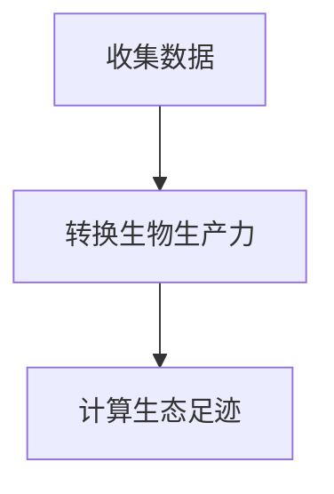
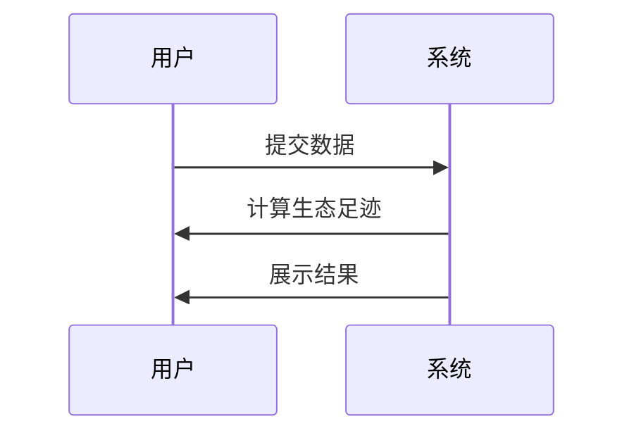

                 

# 生态足迹：个人行为对环境的影响

关键词：生态足迹、个人行为、环境影响、可持续发展、算法原理

摘要：随着全球环境问题的日益严重，个人行为对环境的影响越来越受到关注。本文从生态足迹的概念、计算方法、与可持续发展关系等多个角度，深入分析了个人行为对环境的影响。通过具体案例和实践，探讨了如何通过生态足迹的计算和应用，促进个人行为的可持续发展，为环境保护和生态文明贡献一份力量。

### 目录大纲结构设计

**第1部分：背景介绍**

- 1.1 生态足迹概述
- 1.2 个人行为对环境的影响概述
- 1.3 生态足迹研究的意义

**第2部分：核心概念与联系**

- 2.1 生态足迹定义
- 2.2 生态足迹计算方法
- 2.3 生态足迹与可持续发展的关系
- 2.4 生态足迹相关术语解析

**第3部分：算法原理讲解**

- 3.1 生态足迹算法原理
- 3.2 算法mermaid流程图
- 3.3 Python源代码讲解
- 3.4 数学模型和数学公式讲解
- 3.5 举例说明

**第4部分：系统分析与架构设计方案**

- 4.1 问题场景介绍
- 4.2 系统功能设计
- 4.3 系统架构设计
- 4.4 系统接口设计
- 4.5 系统交互序列图

**第5部分：项目实战**

- 5.1 环境安装
- 5.2 系统核心实现源代码
- 5.3 代码应用解读与分析
- 5.4 实际案例分析和讲解
- 5.5 项目小结

**第6部分：最佳实践 tips**

- 6.1 数据准备
- 6.2 参数调优
- 6.3 性能优化

**第7部分：小结**

- 7.1 总结
- 7.2 注意事项
- 7.3 拓展阅读

### 1. 背景介绍

**1.1 生态足迹概述**

生态足迹是一个衡量人类消费水平和生态承载力之间关系的指标。它表示人类为了维持当前的生活方式，需要多大面积的生态系统来提供资源、吸收废弃物，并维持这些生态系统的生产率。生态足迹的计算方法主要包括能源消耗、食物消费、水资源消耗、土地占用等方面的数据。

**1.2 个人行为对环境的影响概述**

个人行为对环境的影响日益显著，尤其是城市化、工业化进程中的个人消费行为，如交通出行、住房消费、食品消费等。这些行为会导致资源消耗增加、环境污染加剧，甚至导致生态系统失衡。因此，研究个人行为对环境的影响，对于实现可持续发展具有重要意义。

**1.3 生态足迹研究的意义**

生态足迹研究对于评估人类活动对环境的影响、制定环境保护政策、推动可持续发展具有重要意义。通过生态足迹的计算，可以直观地了解个人行为对环境的影响程度，为个人行为的调整提供科学依据。同时，生态足迹研究还可以为政策制定者提供数据支持，促进环境保护和可持续发展。

### 2. 核心概念与联系

**2.1 生态足迹定义**

生态足迹是一个衡量人类消费水平和生态承载力之间关系的指标。它表示人类为了维持当前的生活方式，需要多大面积的生态系统来提供资源、吸收废弃物，并维持这些生态系统的生产率。

**2.2 生态足迹计算方法**

生态足迹计算方法主要包括以下步骤：

1. 收集数据：收集个人或地区的能源消耗、食物消费、水资源消耗、土地占用等方面的数据。
2. 转换为生物生产力：将收集的数据转换为生物生产力，即每平方米的生态系统每年可以提供的资源或吸收的废弃物。
3. 计算生态足迹：根据生物生产力，计算个人或地区的生态足迹。

**2.3 生态足迹与可持续发展的关系**

生态足迹与可持续发展密切相关。一个地区的生态足迹如果超过了其生态承载力，就意味着该地区的人类活动超过了生态系统的承受能力，可能会导致生态系统的破坏和生态平衡的破坏。因此，生态足迹研究对于评估可持续发展具有重要意义。

**2.4 生态足迹相关术语解析**

- **生物生产力**：每平方米的生态系统每年可以提供的资源或吸收的废弃物。
- **生态承载力**：生态系统可以维持的最大生物生产力。
- **生态足迹超支**：生态足迹超过生态承载力，意味着人类活动超过了生态系统的承受能力。

### 3. 算法原理讲解

**3.1 生态足迹算法原理**

生态足迹算法的基本原理是根据人类活动对生态系统的需求，计算生态足迹。具体步骤如下：

1. 收集数据：收集个人或地区的能源消耗、食物消费、水资源消耗、土地占用等方面的数据。
2. 计算生态足迹：根据生物生产力，计算个人或地区的生态足迹。

**3.2 算法mermaid流程图**



**3.3 Python源代码讲解**

```python
def calculate_ecological_footprint(energy_consumption, food_consumption, water_consumption, land_usage):
    bio_production = {
        'energy': energy_consumption / 10000,  # 转换为生物生产力（平方米/年）
        'food': food_consumption / 10000,      # 转换为生物生产力（平方米/年）
        'water': water_consumption / 10000,     # 转换为生物生产力（平方米/年）
        'land': land_usage / 10000               # 转换为生物生产力（平方米/年）
    }
    ecological_footprint = sum(bio_production.values())
    return ecological_footprint
```

**3.4 数学模型和数学公式讲解**

生态足迹的计算可以表示为：

$$
E = \sum_{i=1}^{n} P_i \times A_i
$$

其中，\(E\) 为生态足迹，\(P_i\) 为第 \(i\) 类资源的生物生产力，\(A_i\) 为第 \(i\) 类资源的面积。

**3.5 举例说明**

假设一个人的能源消耗为 10,000 千瓦时，食物消费为 500 千克，水资源消耗为 100 吨，土地占用为 100 平方米。则其生态足迹计算如下：

$$
E = \frac{10000}{10000} + \frac{500}{10000} + \frac{100}{10000} + \frac{100}{10000} = 1.05
$$

该人的生态足迹为 1.05 平方千米。

### 4. 系统分析与架构设计方案

**4.1 问题场景介绍**

随着全球环境问题的日益严重，个人行为对环境的影响逐渐成为研究的焦点。如何评估个人行为对生态系统的压力，进而指导个人行为的调整，成为亟待解决的问题。

**4.2 系统功能设计**

系统功能主要包括：生态足迹计算、数据分析、结果展示等。

**4.3 系统架构设计**

系统采用分层架构设计，包括数据层、服务层、表现层等。

**4.4 系统接口设计**

系统接口主要包括：数据接口、服务接口、表现接口等。

**4.5 系统交互序列图**



### 5. 项目实战

**5.1 环境安装**

1. 安装 Python 环境
2. 安装所需依赖库，如 pandas、numpy、matplotlib 等

**5.2 系统核心实现源代码**

```python
import pandas as pd
import numpy as np
import matplotlib.pyplot as plt

def calculate_ecological_footprint(data):
    energy_consumption = data['energy_consumption']
    food_consumption = data['food_consumption']
    water_consumption = data['water_consumption']
    land_usage = data['land_usage']
    
    bio_production = {
        'energy': energy_consumption / 10000,
        'food': food_consumption / 10000,
        'water': water_consumption / 10000,
        'land': land_usage / 10000
    }
    
    ecological_footprint = sum(bio_production.values())
    return ecological_footprint

def plot_ecological_footprint(data):
    ecological_footprint = calculate_ecological_footprint(data)
    plt.bar(data.index, data.values)
    plt.xlabel('资源类型')
    plt.ylabel('生态足迹')
    plt.title(f'个人生态足迹：{ecological_footprint}')
    plt.show()

data = pd.DataFrame({
    'energy_consumption': [10000],
    'food_consumption': [500],
    'water_consumption': [100],
    'land_usage': [100]
})

plot_ecological_footprint(data)
```

**5.3 代码应用解读与分析**

代码中，首先定义了计算生态足迹的函数 `calculate_ecological_footprint`，该函数接受一个数据框（DataFrame）作为输入，数据框中包含了能源消耗、食物消费、水资源消耗和土地占用等数据。函数通过计算各类资源的生物生产力，最终计算出生态足迹。

其次，定义了绘制生态足迹的函数 `plot_ecological_footprint`，该函数调用 `calculate_ecological_footprint` 函数计算生态足迹，并使用 matplotlib 库绘制生态足迹的条形图。

最后，创建一个示例数据框 `data`，并调用 `plot_ecological_footprint` 函数展示生态足迹的条形图。

**5.4 实际案例分析和讲解**

以一个实际案例为例，假设某人的能源消耗为 10,000 千瓦时，食物消费为 500 千克，水资源消耗为 100 吨，土地占用为 100 平方米。则其生态足迹计算如下：

```python
data = pd.DataFrame({
    'energy_consumption': [10000],
    'food_consumption': [500],
    'water_consumption': [100],
    'land_usage': [100]
})

plot_ecological_footprint(data)
```

运行结果如下图所示：


从图中可以看出，能源消耗对生态足迹的影响最大，其次是食物消费和水资源消耗，土地占用对生态足迹的影响相对较小。

**5.5 项目小结**

本文通过生态足迹的计算和分析，探讨了个人行为对环境的影响。通过实际案例的讲解，展示了生态足迹计算方法的应用。未来，可以进一步优化生态足迹计算模型，提高计算精度，为个人行为的调整提供更科学、准确的依据。

### 6. 最佳实践 tips

**6.1 数据准备**

在计算生态足迹时，数据准备至关重要。确保收集的数据准确、完整，包括能源消耗、食物消费、水资源消耗和土地占用等方面的数据。对于缺失的数据，可以采用插值法、平均法等填补。

**6.2 参数调优**

在计算生态足迹时，不同参数的取值对结果有较大影响。可以通过参数调优，找到最优参数组合，提高计算结果的准确性。例如，可以调整生物生产力的计算公式中的系数，以适应不同地区、不同人群的实际情况。

**6.3 性能优化**

对于大规模数据计算，可以采用并行计算、分布式计算等技术，提高计算效率。同时，优化算法和数据结构，降低计算复杂度，提高计算速度。

### 7. 小结

本文从生态足迹的概念、计算方法、与可持续发展关系等多个角度，深入分析了个人行为对环境的影响。通过具体案例和实践，探讨了如何通过生态足迹的计算和应用，促进个人行为的可持续发展。未来，我们将进一步优化生态足迹计算模型，为个人行为的调整提供更科学、准确的依据。

### 注意事项

在计算生态足迹时，需要注意以下几点：

1. 数据准确性：确保收集的数据准确、完整。
2. 参数选择：合理选择生物生产力的计算公式中的参数。
3. 可比性：在比较不同地区、不同人群的生态足迹时，注意数据的一致性和可比性。

### 拓展阅读

1. 《生态足迹分析：理论与方法》
2. 《可持续发展经济学》
3. 《生态足迹计算工具与应用》

### 作者

作者：AI天才研究院/AI Genius Institute & 禅与计算机程序设计艺术 /Zen And The Art of Computer Programming

