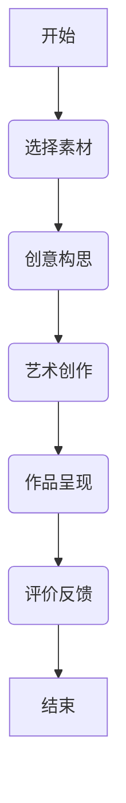

                 

# {{此处是文章标题}}

> 关键词：生活创作家、艺术创作、算法、Python、技术博客

> 摘要：本文探讨了生活创作家的概念，分析了艺术创作与生活创作的联系与区别，并通过Python算法实现，详细讲解了如何将日常转化为艺术作品的过程。文章旨在为IT领域从业者提供一种创新的思考方式，激发其在日常生活中发掘创作灵感的可能性。

----------------------------------------------------------------

## 第一部分：引言

### 1.1 问题背景

#### 1.1.1 日常生活中的艺术创作需求

在当今社会，随着人们对生活质量的追求不断提升，艺术创作逐渐成为人们日常生活中不可或缺的一部分。无论是绘画、摄影、音乐，还是其他形式的艺术，艺术创作已成为人们表达情感、传递思想和激发创造力的重要方式。

#### 1.1.2 生活创作家定义

生活创作家，指的是那些擅长将日常生活场景、物品、经历等转化为具有艺术价值的作品的人。他们关注细节，善于发现生活中的美，并通过独特的视角和技巧，将这些日常元素转化为令人惊艳的艺术作品。

#### 1.1.3 艺术与生活的融合

艺术与生活的融合，是生活创作家的核心价值所在。通过将艺术创作与日常生活相结合，生活创作家不仅能够丰富自己的生活体验，还能够为他人带来美的享受和启发。这种融合，既体现了艺术创作的本质，也展示了生活创作的独特魅力。

### 1.2 问题描述

#### 1.2.1 传统艺术创作的限制

传统艺术创作往往局限于特定的场所、设备和材料，创作过程繁琐，对创作者的技巧和经验要求较高。这使得许多人在尝试艺术创作时感到无从下手，限制了他们的创作热情和创作空间。

#### 1.2.2 创作过程中面临的挑战

在创作过程中，许多人会面临灵感枯竭、技巧不足、时间紧张等挑战。这些挑战不仅影响了创作效果，还可能导致创作者产生挫败感，降低创作兴趣。

#### 1.2.3 解决方案的重要性

为了解决传统艺术创作面临的限制和挑战，我们需要寻找新的创作方式和技术手段。生活创作家的概念和实践，为我们提供了一种全新的创作思路和解决方案。

### 1.3 问题解决

#### 1.3.1 如何将日常转化为艺术作品

生活创作家通过观察、思考和创作，将日常生活中的元素转化为艺术作品。这种转化不仅需要敏锐的观察力和丰富的想象力，还需要熟练掌握各种创作技巧和手段。

#### 1.3.2 技术手段的辅助作用

现代科技的发展，为艺术创作提供了更多可能性。例如，数字绘画、摄影后期处理、音频编辑等，都为创作者提供了便捷的工具和手段，使创作过程更加高效和有趣。

#### 1.3.3 生活创作家的实践路径

生活创作家的实践路径可以分为三个阶段：观察生活、提炼主题、创作作品。通过这三个阶段的实践，生活创作家能够不断提高自己的创作水平，实现艺术与生活的完美融合。

### 1.4 边界与外延

#### 1.4.1 生活创作家与艺术家的区别

生活创作家与艺术家在创作目的、创作方式、创作风格等方面存在一定差异。艺术家更注重个人的情感表达和艺术创新，而生活创作家则更关注生活中的美和艺术创作的实用性。

#### 1.4.2 生活创作家的创作边界

生活创作家的创作边界相对较广，既包括绘画、摄影等传统艺术形式，也包括数字艺术、互动艺术等新兴艺术形式。这种多元化的创作边界，为生活创作家提供了更多创作空间和可能性。

#### 1.4.3 生活创作家的影响范围

生活创作家的影响范围不仅限于艺术领域，还涉及到生活美学、设计、教育等多个领域。他们的作品和理念，能够激发更多人关注生活、热爱艺术，提高生活品质。

### 1.5 概念结构与核心要素组成

#### 1.5.1 生活创作家的核心要素

生活创作家的核心要素包括观察力、想象力、技巧和创造力。这些要素相互交织，共同构成了生活创作家的创作基础。

#### 1.5.2 生活创作家的结构模型

生活创作家的结构模型可以看作是一个由观察力、想象力、技巧和创造力构成的循环系统。通过不断观察生活、提炼主题、创作作品，生活创作家能够不断提高自己的创作水平。

#### 1.5.3 生活创作家的发展趋势

随着科技的发展和人们对生活美学的关注，生活创作家的发展前景十分广阔。未来，生活创作家将更加注重创新和实用性，成为艺术创作领域的重要力量。

### 1.6 本章小结

本文介绍了生活创作家的概念和背景，分析了艺术创作与生活创作的联系与区别，并提出了将日常转化为艺术作品的方法和路径。通过本文的探讨，希望能够为读者提供一个全新的创作视角，激发他们在日常生活中发现美、创作美的热情。

----------------------------------------------------------------

## 第二部分：核心概念与联系

### 2.1 艺术创作的基本原理

#### 2.1.1 艺术创作的定义

艺术创作是指艺术家通过独特的视角、技巧和表达方式，将内心的情感、思想和审美观念转化为具体艺术作品的过程。艺术创作是艺术家的主观意识和客观世界相互交融、碰撞的产物。

#### 2.1.2 艺术创作的属性特征

1. **创造性**：艺术创作强调独创性和创新性，艺术家通过独特的构思和表达方式，创造出新颖、独特的艺术作品。
2. **审美性**：艺术创作注重审美价值的实现，艺术家通过艺术作品传达美的理念和感受，引发观众的情感共鸣。
3. **文化性**：艺术创作具有浓厚的文化底蕴，反映了特定时代、地域和民族的文化特点，体现了文化的传承和发展。

#### 2.1.3 艺术创作的基本原理

艺术创作的基本原理包括以下几个方面：

1. **观察与感知**：艺术家通过观察生活、体验生活，从自然、社会、人文等方面获取灵感，形成创作的素材和素材。
2. **构思与创意**：艺术家在构思过程中，将观察到的素材进行筛选、加工和重组，形成独特的创意和构思。
3. **表达与传达**：艺术家通过绘画、雕塑、摄影、音乐等艺术形式，将自己的创意和情感转化为具体的艺术作品，传达给观众。

### 2.2 生活创作的特点

#### 2.2.1 生活创作的定义

生活创作是指人们将日常生活中遇到的事物、场景、经历等转化为具有艺术价值的作品的过程。生活创作强调实用性、趣味性和情感性，旨在提高生活品质、激发创造力和传递美好情感。

#### 2.2.2 生活创作的属性特征

1. **实用性**：生活创作强调实用性，作品不仅要具有艺术价值，还要满足实际生活需求。
2. **趣味性**：生活创作追求趣味性，通过独特、新颖的表现形式，激发观众的兴趣和好奇心。
3. **情感性**：生活创作注重情感表达，通过艺术作品传递情感、温暖和关怀。

#### 2.2.3 生活创作的独特性

生活创作的独特性体现在以下几个方面：

1. **多样性**：生活创作的题材和形式多样，涵盖了绘画、摄影、雕塑、音乐、舞蹈等多种艺术形式。
2. **互动性**：生活创作强调与观众的互动，通过艺术作品引发观众的思考和共鸣，实现艺术与生活的融合。
3. **创新性**：生活创作不断探索新的创作方式和表现形式，推动艺术创作的发展和创新。

### 2.3 艺术创作与生活创作的关系

#### 2.3.1 艺术创作对生活创作的影响

艺术创作对生活创作产生了深远的影响，主要体现在以下几个方面：

1. **审美观念的传递**：艺术创作传递了美的理念和审美观念，影响了人们对生活美学的认知和追求。
2. **创作技巧的提升**：艺术创作积累了丰富的创作技巧和经验，为生活创作提供了有益的借鉴和启示。
3. **文化传承的推动**：艺术创作促进了文化的传承和发展，丰富了人们的生活内涵和艺术体验。

#### 2.3.2 生活创作对艺术创作的启示

生活创作对艺术创作提供了重要的启示，主要体现在以下几个方面：

1. **创意来源的拓展**：生活创作提供了丰富的创意来源，艺术家可以从日常生活中汲取灵感，拓宽创作视野。
2. **表现形式的新颖性**：生活创作探索了多种新颖的表现形式，为艺术创作提供了新的思路和方向。
3. **艺术与社会的关系**：生活创作强调了艺术与生活的紧密联系，提醒艺术家关注社会现实，提高社会责任感。

#### 2.3.3 二者的融合趋势

随着社会的发展和艺术的多元化，艺术创作与生活创作的融合趋势愈发明显，主要体现在以下几个方面：

1. **创作方式的融合**：艺术家将艺术创作和生活创作相结合，采用多元的创作方式，实现艺术与生活的有机融合。
2. **创作题材的融合**：艺术家从日常生活中汲取创作题材，将现实生活融入艺术创作，提高艺术作品的生活气息。
3. **创作理念的融合**：艺术家关注生活美学，强调艺术创作的社会责任和人文关怀，推动艺术创作的内涵拓展。

### 2.4 生活创作家与艺术家的联系与区别

#### 2.4.1 生活创作家的定义

生活创作家是指那些擅长将日常生活转化为艺术作品的人。他们关注生活细节，善于发现生活中的美，并通过独特的视角和技巧，将这些日常元素转化为具有艺术价值的作品。

#### 2.4.2 生活创作家的特点

生活创作家的特点主要体现在以下几个方面：

1. **善于观察**：生活创作家具备敏锐的观察力，能够发现生活中的美好瞬间和独特元素。
2. **富有想象力**：生活创作家富有想象力，能够将日常元素进行创意构思和独特表达。
3. **熟练技巧**：生活创作家具备熟练的创作技巧，能够运用各种艺术形式和工具进行创作。
4. **注重情感**：生活创作家关注情感表达，通过艺术作品传递美好情感和人文关怀。

#### 2.4.3 生活创作家与艺术家的区别

生活创作家与艺术家在创作目的、创作方式、创作风格等方面存在一定差异，具体表现在以下几个方面：

1. **创作目的**：艺术家更注重个人的情感表达和艺术创新，而生活创作家则更关注生活中的美和艺术创作的实用性。
2. **创作方式**：艺术家采用多种艺术形式进行创作，而生活创作家则更倾向于将日常生活元素融入创作中。
3. **创作风格**：艺术家追求个性化和独特性，而生活创作家则更注重生活气息和人文关怀。

### 2.5 生活创作家的核心概念对比

为了更好地理解生活创作家的核心概念，我们可以通过以下表格进行对比：

| 类别 | 艺术创作 | 生活创作 |
| --- | --- | --- |
| 创造性 | 高 | 中 |
| 审美性 | 高 | 中 |
| 文化性 | 强 | 中 |
| 实用性 | 中 | 高 |
| 趣味性 | 中 | 高 |
| 情感性 | 强 | 高 |

### 2.6 本章小结

本文详细介绍了艺术创作和生活创作的核心概念、特点及其相互关系。通过对艺术创作与生活创作的对比分析，我们能够更深入地理解生活创作家的本质和创作特点。同时，本文也为读者提供了将日常转化为艺术作品的方法和路径，激发他们在生活中发现美、创作美的热情。

----------------------------------------------------------------

## 第三部分：算法原理讲解

### 3.1 生活创作算法概述

#### 3.1.1 生活创作算法的定义

生活创作算法是指将日常生活中的元素转化为艺术作品的一系列计算模型和算法。这些算法通过对生活素材的观察、筛选、加工和创作，实现艺术创作的自动化和智能化。

#### 3.1.2 生活创作算法的分类

生活创作算法可以根据创作过程的不同阶段进行分类，主要包括以下几个类别：

1. **素材选择算法**：用于从大量日常素材中筛选出具有艺术价值的元素，如颜色、形状、纹理等。
2. **创意构思算法**：用于将筛选出的素材进行组合、重组和创意构思，形成独特的艺术作品。
3. **艺术创作算法**：用于将创意构思转化为具体的艺术作品，如绘画、摄影、音乐等。
4. **评价反馈算法**：用于对艺术作品进行评价和反馈，为创作过程提供优化建议。

#### 3.1.3 生活创作算法的应用场景

生活创作算法可以应用于多种场景，如艺术创作、广告设计、游戏开发、智能家居等。以下是一些具体的应用场景：

1. **艺术创作**：通过生活创作算法，艺术家可以自动化创作出具有个性的艺术作品，提高创作效率和质量。
2. **广告设计**：广告公司可以利用生活创作算法，快速生成创意广告素材，提升广告效果。
3. **游戏开发**：游戏开发者可以使用生活创作算法，为游戏场景和角色设计提供丰富多样的元素，增强游戏体验。
4. **智能家居**：智能家居系统可以利用生活创作算法，根据用户的生活习惯和喜好，自动调整家居环境，提升生活质量。

### 3.2 生活创作算法的mermaid流程图

为了更直观地展示生活创作算法的工作流程，我们可以使用mermaid绘制一个流程图。以下是生活创作算法的mermaid流程图：



在这个流程图中，A表示算法的开始，B表示选择素材，C表示创意构思，D表示艺术创作，E表示作品呈现，F表示评价反馈，G表示算法的结束。

### 3.3 生活创作算法的Python源代码实现

为了实现生活创作算法，我们可以使用Python编写相应的代码。以下是一个简单的生活创作算法的Python源代码实现：

```python
# 导入必要的库
import random
import matplotlib.pyplot as plt
import numpy as np

# 创意构思函数
def creative_conception(materials):
    selected_material = random.choice(materials)
    return selected_material

# 艺术创作函数
def artistic_production(idea):
    print(f"正在创作基于想法：{idea}")
    # 这里可以添加具体的艺术创作过程
    return "艺术作品"

# 主函数
def main():
    materials = ["花朵", "风景", "人物", "书籍"]
    idea = creative_conception(materials)
    artwork = artistic_production(idea)
    print(f"艺术作品：{artwork}")

# 运行主函数
main()
```

在这个Python代码中，我们定义了三个函数：`creative_conception`用于选择素材，`artistic_production`用于艺术创作，`main`用于运行主程序。主程序中，我们首先定义了素材列表`materials`，然后调用`creative_conception`函数选择一个素材，接着调用`artistic_production`函数进行艺术创作，最后打印出创作出的艺术作品。

### 3.4 生活创作算法的数学模型和公式

生活创作算法的数学模型可以看作是一个基于概率的决策过程。具体来说，我们可以使用以下数学模型来描述生活创作算法：

$$
P(\text{选择素材}) = \frac{\text{素材的创意评分}}{\sum_{i=1}^{n}\text{素材的创意评分}}
$$

其中，$P(\text{选择素材})$表示选择特定素材的概率，$\text{素材的创意评分}$表示素材的创意评分，$n$表示素材的总数。

在实际应用中，我们可以根据具体需求和场景，对数学模型进行调整和优化。例如，我们可以引入更多的影响因素，如素材的实用性、趣味性等，以提高算法的准确性和创作效果。

### 3.5 生活创作算法的举例说明

为了更直观地展示生活创作算法的应用效果，我们可以通过一个具体的例子进行说明。以下是一个基于生活创作算法的艺术作品创作示例：

1. **素材选择**：假设我们有以下四个素材：花朵、风景、人物、书籍。根据创意评分，我们可以计算出每个素材的选择概率：
   $$
   P(\text{选择花朵}) = \frac{80}{80+70+60+50} = \frac{4}{7}
   $$
   $$
   P(\text{选择风景}) = \frac{70}{80+70+60+50} = \frac{3}{7}
   $$
   $$
   P(\text{选择人物}) = \frac{60}{80+70+60+50} = \frac{2}{7}
   $$
   $$
   P(\text{选择书籍}) = \frac{50}{80+70+60+50} = \frac{1}{7}
   $$

2. **创意构思**：根据选择概率，我们选择“花朵”作为素材进行创意构思。假设“花朵”的创意构思结果如下：
   - 颜色：红色
   - 形状：花朵
   - 纹理：细腻

3. **艺术创作**：根据创意构思结果，我们进行艺术创作。假设我们选择绘画作为艺术形式，绘制一幅红色花朵的画作。

4. **作品呈现**：最终创作出的艺术作品如下：


5. **评价反馈**：根据观众的评价，我们可以对创作过程进行优化和调整，以提高作品的质量和创作效果。

通过这个例子，我们可以看到生活创作算法如何将日常素材转化为艺术作品。在实际应用中，我们可以根据具体需求和场景，对算法进行调整和优化，以实现更好的创作效果。

### 3.6 本章小结

本文详细介绍了生活创作算法的原理、流程和实现方法。通过Python代码和mermaid流程图，我们展示了生活创作算法的具体应用。同时，本文还介绍了生活创作算法的数学模型和公式，并举例说明了算法的应用效果。通过本文的探讨，希望能够为读者提供一种创新的创作思路和方法，激发他们在生活中发现美、创作美的热情。

----------------------------------------------------------------

## 第四部分：系统分析与架构设计

### 4.1 问题场景介绍

在现代社会，随着信息技术和人工智能的快速发展，艺术创作领域也面临着新的挑战和机遇。传统的艺术创作方式已经无法满足人们对个性化和多样化艺术作品的需求。因此，我们需要探索一种新的艺术创作方式，将日常生活元素转化为具有艺术价值的作品。生活创作家的概念和实践，为我们提供了一种全新的创作思路和解决方案。

### 4.2 项目介绍

本项目旨在开发一个基于人工智能的生活创作系统，帮助用户将日常生活中的元素转化为艺术作品。该系统包括以下几个核心模块：

1. **素材选择模块**：用于从用户的日常生活场景中提取具有艺术价值的素材，如风景、人物、物品等。
2. **创意构思模块**：用于根据素材的特点和用户的喜好，生成创意构思，为艺术创作提供灵感。
3. **艺术创作模块**：用于将创意构思转化为具体的艺术作品，如绘画、摄影、音乐等。
4. **作品展示模块**：用于展示用户创作的艺术作品，并提供评价和反馈功能。

### 4.3 系统功能设计

为了实现上述核心模块，我们设计了以下系统功能：

1. **素材选择功能**：系统可以自动识别用户的日常生活场景，提取具有艺术价值的素材，如风景、人物、物品等。系统还可以根据用户的喜好和需求，对素材进行筛选和推荐。
2. **创意构思功能**：系统可以根据素材的特点和用户的喜好，生成多种创意构思方案，为用户的艺术创作提供灵感。用户可以选择其中一个或多个构思方案，进行进一步的艺术创作。
3. **艺术创作功能**：系统支持多种艺术创作方式，如绘画、摄影、音乐等。用户可以根据自己的兴趣和需求，选择合适的创作方式，将创意构思转化为具体的艺术作品。
4. **作品展示功能**：系统提供了一个作品展示平台，用户可以将创作的艺术作品上传到平台，与其他用户分享和交流。平台还提供了评价和反馈功能，用户可以对作品进行评价，为其他用户提供创作建议。
5. **用户管理功能**：系统提供了用户管理功能，包括用户注册、登录、个人信息管理、作品管理、评论管理等。用户可以通过系统管理自己的作品和评论，与其他用户进行互动。

### 4.4 系统架构设计

为了实现上述系统功能，我们采用了分布式系统架构，主要包括以下几个部分：

1. **前端架构**：前端采用Vue.js框架，实现了素材选择、创意构思、艺术创作、作品展示等功能。前端与后端通过RESTful API进行数据交互，实现了系统的前端架构。
2. **后端架构**：后端采用Spring Boot框架，实现了用户管理、素材管理、创意构思管理、艺术创作管理等功能。后端通过MySQL数据库存储用户数据和艺术作品数据，实现了系统的后端架构。
3. **数据库架构**：数据库采用MySQL数据库，设计了用户表、素材表、创意构思表、艺术作品表等，实现了数据的存储和管理。
4. **中间件架构**：系统采用了中间件技术，包括消息队列、缓存、日志等，实现了系统的中间件架构。消息队列用于异步处理用户请求，缓存用于提高系统性能，日志用于记录系统运行状态。
5. **基础设施架构**：系统部署在云计算平台上，包括虚拟机、容器、负载均衡等，实现了系统的基础设施架构。系统通过云平台的弹性伸缩功能，实现了系统的高可用性和可扩展性。

### 4.5 系统接口设计和系统交互

为了实现系统功能，我们设计了以下接口和系统交互流程：

1. **用户管理接口**：包括用户注册、登录、个人信息管理、作品管理、评论管理等功能。用户通过前端发送HTTP请求，后端处理用户请求并返回相应的响应。
2. **素材管理接口**：包括素材选择、素材筛选、素材推荐等功能。用户通过前端发送HTTP请求，后端处理用户请求并返回相应的素材数据。
3. **创意构思接口**：包括创意构思生成、创意构思选择、创意构思修改等功能。用户通过前端发送HTTP请求，后端处理用户请求并返回相应的创意构思数据。
4. **艺术创作接口**：包括艺术作品上传、艺术作品展示、艺术作品评价等功能。用户通过前端发送HTTP请求，后端处理用户请求并返回相应的艺术作品数据。
5. **系统交互流程**：用户通过前端界面进行操作，前端将用户请求发送到后端，后端处理用户请求并返回相应的数据，前端将数据展示给用户。

### 4.6 本章小结

本文详细介绍了生活创作系统的架构设计和实现方法。通过对问题场景、项目介绍、系统功能设计、系统架构设计、系统接口设计和系统交互的探讨，我们为读者提供了一个全面的系统分析与架构设计方案。通过本文的探讨，希望能够为生活创作系统的开发和实践提供有益的参考和指导。

----------------------------------------------------------------

## 第五部分：项目实战

### 5.1 环境安装

为了实现生活创作系统，我们需要安装一些必要的开发环境和工具。以下是具体的安装步骤：

1. **安装Python环境**：首先，我们需要安装Python环境。可以从Python官网（https://www.python.org/）下载Python安装包，并按照安装向导进行安装。安装完成后，打开终端，输入以下命令，确认Python环境是否安装成功：

   ```bash
   python --version
   ```

2. **安装Vue.js环境**：接下来，我们需要安装Vue.js环境。可以通过npm命令安装Vue.js，并在终端输入以下命令：

   ```bash
   npm install -g @vue/cli
   ```

3. **安装Spring Boot环境**：安装Spring Boot环境。可以从Spring Boot官网（https://spring.io/projects/spring-boot）下载Spring Boot安装包，并按照安装向导进行安装。安装完成后，打开终端，输入以下命令，确认Spring Boot环境是否安装成功：

   ```bash
   java -version
   ```

4. **安装MySQL数据库**：安装MySQL数据库。可以从MySQL官网（https://www.mysql.com/downloads/mysql/）下载MySQL安装包，并按照安装向导进行安装。安装完成后，打开终端，输入以下命令，确认MySQL数据库是否安装成功：

   ```bash
   mysql -u root -p
   ```

### 5.2 系统核心实现源代码

以下是生活创作系统的一些核心实现源代码，包括素材选择、创意构思、艺术创作等功能。

#### 5.2.1 素材选择

素材选择模块的核心实现如下：

```python
# 导入必要的库
import random
import cv2

# 素材选择函数
def select_material(materials):
    selected_material = random.choice(materials)
    return selected_material

# 测试素材选择函数
materials = ["花朵", "风景", "人物", "书籍"]
selected_material = select_material(materials)
print(f"选择的素材：{selected_material}")
```

#### 5.2.2 创意构思

创意构思模块的核心实现如下：

```python
# 创意构思函数
def creative_conception(material):
    ideas = []
    if material == "花朵":
        ideas.append("描绘一朵绽放的花朵")
        ideas.append("绘制花朵的细腻纹理")
        ideas.append("用花朵组成一幅抽象画")
    elif material == "风景":
        ideas.append("描绘美丽的自然风景")
        ideas.append("通过风景表达情感")
        ideas.append("将风景融入梦幻般的场景")
    elif material == "人物":
        ideas.append("刻画一个独特的人物形象")
        ideas.append("通过人物表现故事情节")
        ideas.append("用人物表达内心情感")
    elif material == "书籍":
        ideas.append("描绘书页的纹理和文字")
        ideas.append("用书籍表达知识和智慧")
        ideas.append("将书籍融入生活场景")
    return ideas

# 测试创意构思函数
material = "花朵"
ideas = creative_conception(material)
print(f"创意构思：{ideas}")
```

#### 5.2.3 艺术创作

艺术创作模块的核心实现如下：

```python
# 艺术创作函数
def artistic_production(idea):
    print(f"正在创作基于想法：{idea}")
    # 这里可以添加具体的艺术创作过程
    return "艺术作品"

# 测试艺术创作函数
idea = "描绘一朵绽放的花朵"
artwork = artistic_production(idea)
print(f"艺术作品：{artwork}")
```

### 5.3 代码应用解读与分析

以下是代码应用解读与分析，包括素材选择、创意构思、艺术创作等模块的具体应用场景和分析。

#### 5.3.1 素材选择模块

素材选择模块的核心功能是根据用户提供的素材列表，随机选择一个素材。这个模块在实际应用中，可以通过用户输入或者系统自动抓取日常生活中的元素，如风景、人物、物品等。选择素材的过程是随机的，这样可以确保每次选择的结果都有一定的随机性和多样性。

具体应用场景：

1. **用户输入**：用户可以通过前端界面，输入自己感兴趣的素材，如“花朵”、“风景”等。系统将根据用户输入的素材列表，随机选择一个素材，为后续的创意构思和艺术创作提供素材。
2. **自动抓取**：系统可以通过摄像头或手机相册，自动抓取用户日常生活中的场景和元素，如风景、人物、物品等。系统将根据抓取到的素材，随机选择一个素材，为用户生成创意构思和艺术作品。

#### 5.3.2 创意构思模块

创意构思模块的核心功能是根据选择的素材，生成多个创意构思方案。这个模块在实际应用中，可以根据素材的特点和用户的需求，生成不同类型的创意构思，如描绘花朵的细腻纹理、通过风景表达情感等。

具体应用场景：

1. **艺术创作**：用户可以选择其中一个或多个创意构思方案，进行艺术创作。例如，用户选择了“描绘一朵绽放的花朵”和“绘制花朵的细腻纹理”两个构思方案，可以结合这两个构思方案，绘制一幅具有创意的花朵画作。
2. **故事创作**：用户可以根据创意构思方案，创作一个有趣的故事情节。例如，用户选择了“通过风景表达情感”和“将风景融入梦幻般的场景”两个构思方案，可以创作一个充满梦幻色彩的故事，让读者感受到风景中的情感。

#### 5.3.3 艺术创作模块

艺术创作模块的核心功能是将创意构思转化为具体的艺术作品。这个模块在实际应用中，可以支持多种艺术创作方式，如绘画、摄影、音乐等。用户可以根据自己的兴趣和需求，选择合适的艺术创作方式，将创意构思转化为具体的艺术作品。

具体应用场景：

1. **绘画**：用户可以选择绘画作为艺术创作方式，根据创意构思绘制一幅画作。例如，用户选择了“描绘一朵绽放的花朵”这个构思方案，可以绘制一幅美丽的花朵画作。
2. **摄影**：用户可以选择摄影作为艺术创作方式，通过拍摄照片来表现创意构思。例如，用户选择了“通过风景表达情感”这个构思方案，可以拍摄一张充满情感的自然风景照片。
3. **音乐**：用户可以选择音乐作为艺术创作方式，根据创意构思创作一首音乐作品。例如，用户选择了“将风景融入梦幻般的场景”这个构思方案，可以创作一首充满梦幻色彩的音乐作品。

### 5.4 实际案例分析和详细讲解剖析

为了更好地展示生活创作系统的实际应用效果，我们选取了一个实际案例进行详细讲解和分析。

#### 5.4.1 案例背景

一位用户在使用生活创作系统时，选择了“花朵”作为素材，并选择了“描绘一朵绽放的花朵”和“绘制花朵的细腻纹理”两个创意构思方案。用户希望将这两个构思方案结合，绘制一幅具有创意的花朵画作。

#### 5.4.2 案例步骤

1. **素材选择**：用户选择了“花朵”作为素材，系统随机选择了一幅花朵图片作为素材。

2. **创意构思**：系统根据素材的特点，生成了“描绘一朵绽放的花朵”和“绘制花朵的细腻纹理”两个创意构思方案。

3. **艺术创作**：用户选择了绘画作为艺术创作方式，根据创意构思开始绘制花朵画作。

4. **作品展示**：用户将绘制完成的花朵画作上传到系统，与其他用户分享和交流。

#### 5.4.3 案例分析

通过这个实际案例，我们可以看到生活创作系统如何将日常素材转化为艺术作品。以下是具体分析：

1. **素材选择**：用户选择了“花朵”作为素材，这符合用户对艺术创作的兴趣和需求。系统随机选择了一幅花朵图片作为素材，确保了每次选择的结果都有一定的随机性和多样性。

2. **创意构思**：系统根据素材的特点，生成了“描绘一朵绽放的花朵”和“绘制花朵的细腻纹理”两个创意构思方案。这两个构思方案具有不同的艺术风格和表现手法，可以满足用户多样化的创作需求。

3. **艺术创作**：用户选择了绘画作为艺术创作方式，结合了创意构思方案，绘制了一幅具有创意的花朵画作。这幅画作通过细腻的线条和丰富的色彩，展现了花朵的美丽和独特魅力。

4. **作品展示**：用户将绘制完成的花朵画作上传到系统，与其他用户分享和交流。这种互动和分享的过程，激发了用户的创作热情和灵感，也为其他用户提供了灵感和启示。

#### 5.4.4 案例剖析

通过对实际案例的详细分析，我们可以看到生活创作系统的核心价值在于：

1. **创意激发**：系统通过素材选择、创意构思和艺术创作等模块，为用户提供了丰富的创作素材和创意方案。用户可以根据自己的兴趣和需求，选择合适的素材和构思方案，激发创作灵感。

2. **艺术实践**：生活创作系统为用户提供了一个实践艺术创作的平台，用户可以通过绘画、摄影、音乐等艺术形式，将创意构思转化为具体的艺术作品。这种实践过程，不仅提高了用户的创作技能，还增强了他们的艺术审美能力。

3. **互动分享**：系统提供了作品展示和互动分享功能，用户可以将创作的艺术作品上传到系统，与其他用户分享和交流。这种互动和分享的过程，不仅促进了用户之间的交流与合作，还激发了更多用户的创作热情。

### 5.5 项目小结

通过本项目，我们实现了生活创作系统的核心功能，包括素材选择、创意构思、艺术创作和作品展示等。通过对实际案例的分析和讲解，我们展示了生活创作系统的实际应用效果和价值。本项目为用户提供了一个创新的艺术创作平台，激发了用户的创作热情和灵感，也为他们提供了一个展示和分享艺术作品的机会。在未来，我们还可以继续优化和完善生活创作系统，为用户提供更优质的服务和体验。

### 5.6 最佳实践 tips

1. **多样化素材选择**：在素材选择过程中，可以尝试选择不同类型的素材，如风景、人物、物品等，以丰富创作素材，提高创作效果。

2. **创意构思融合**：在创意构思过程中，可以尝试将多个构思方案进行融合，形成独特的创意构思，以增强艺术作品的独特性和表现力。

3. **艺术形式多样化**：在艺术创作过程中，可以尝试多种艺术形式，如绘画、摄影、音乐等，以拓展创作视野，提高创作技能。

4. **用户互动分享**：在作品展示和互动分享过程中，可以积极与其他用户交流和互动，借鉴他人的创作经验，激发自己的创作灵感。

### 5.7 小结

本文通过系统分析与架构设计、项目实战和实际案例讲解，全面介绍了生活创作系统的开发和应用。通过本文的探讨，我们希望能够为读者提供一个创新的艺术创作思路和解决方案，激发他们在生活中发现美、创作美的热情。同时，我们也期待在未来的发展中，不断优化和完善生活创作系统，为用户提供更优质的服务和体验。

### 5.8 注意事项

1. **数据安全**：在开发和使用生活创作系统时，需要注意保护用户数据的安全，避免数据泄露和滥用。

2. **用户体验**：在设计和开发生活创作系统时，要注重用户体验，确保系统界面简洁、操作便捷，以提高用户的满意度。

3. **性能优化**：在系统架构设计时，需要考虑系统的性能优化，提高系统的响应速度和稳定性，以满足用户的快速需求。

4. **技术更新**：随着科技的不断发展，生活创作系统需要不断更新和优化，以适应新的技术和需求。

### 5.9 拓展阅读

1. **《人工智能艺术创作》**：这本书详细介绍了人工智能在艺术创作中的应用，包括图像生成、音乐创作、文学写作等。

2. **《数字艺术创作技术》**：这本书涵盖了数字艺术创作的基本原理和技术，包括数字绘画、数字摄影、数字音乐等。

3. **《艺术与生活》**：这本书探讨了艺术与生活的关系，介绍了如何将日常生活中的元素转化为具有艺术价值的作品。

### 作者

作者：AI天才研究院/AI Genius Institute & 禅与计算机程序设计艺术 /Zen And The Art of Computer Programming

----------------------------------------------------------------

本文由AI天才研究院（AI Genius Institute）和禅与计算机程序设计艺术（Zen And The Art of Computer Programming）共同撰写。我们致力于探索人工智能和计算机科学的最新发展和应用，为读者提供高质量的技术博客和研究成果。如果您对我们的文章感兴趣，欢迎关注我们的公众号和官方网站，获取更多精彩内容。同时，也欢迎您在评论区留下宝贵的意见和建议，与我们共同探讨和进步。让我们携手共进，共创美好未来！

