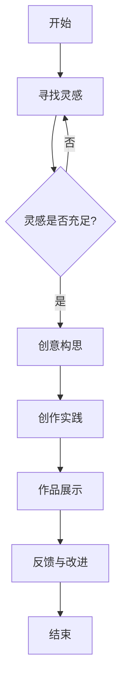
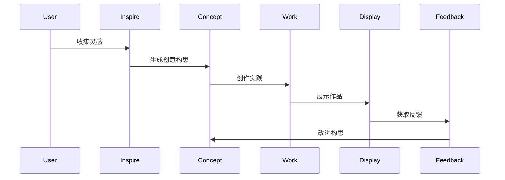
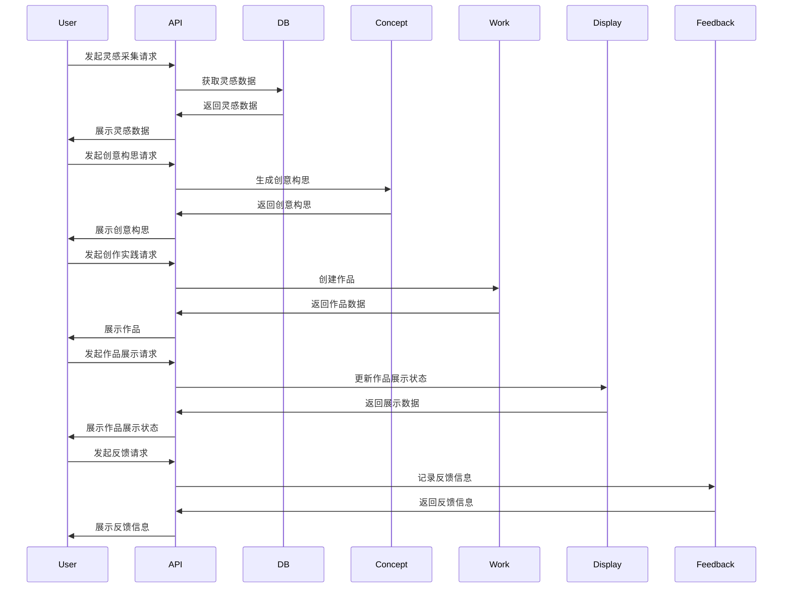

                 

# 生活艺术家养成：将平凡日常转化为创意表达

> 关键词：生活艺术化、创意表达、日常转化、生活技巧、艺术思维

> 摘要：
本文旨在探讨如何将平凡日常转化为充满创意表达的生活艺术。通过对生活艺术化的定义、核心概念与联系的分析，我们将介绍一系列实用的技巧和策略，帮助读者在日常生活中实现艺术创作。文章将结合实际案例，深入讲解如何将艺术思维融入到日常生活，从而提升生活质量。

## 1. 设计大纲结构

为了帮助读者更好地理解和应用生活艺术化的理念，本文将按照以下结构进行阐述：

1. **导言**：介绍书籍的目的和读者对象。
2. **背景介绍**：探讨日常生活艺术化的需求和挑战。
3. **核心概念与联系**：详细阐述日常生活艺术化、创意表达等核心概念及其相互关系。
4. **算法原理讲解**：介绍将平凡日常转化为创意表达的具体算法原理。
5. **系统分析与架构设计方案**：分析日常生活艺术化应用的具体场景和系统架构设计。
6. **项目实战**：展示如何在实际项目中应用生活艺术化的理念。
7. **总结**：回顾文章要点，提供最佳实践建议和拓展阅读。

## 2. 构建导言部分

### 2.1 书名、作者介绍、书籍目的和读者对象

《生活艺术家养成：将平凡日常转化为创意表达》是由AI天才研究院的资深专家们共同撰写的一本实用指南。本书旨在帮助读者摆脱平淡无奇的日常生活，通过创意表达将平凡瞬间转化为艺术作品。无论您是职场人士、学生，还是家庭主妇，只要您愿意拥抱变化，都有机会成为生活中的艺术家。

### 2.2 简要介绍日常生活艺术化的意义和书籍的基本内容

日常生活艺术化不仅是一种生活态度，更是一种提升生活质量的方式。通过本书，您将学会如何从日常生活中发现美，如何用创意思维和技巧创造出独特的艺术表达。本书涵盖了从艺术理论到实际操作的一系列内容，包括创意表达的技巧、艺术思维的培养、艺术工具的使用等，旨在帮助读者实现从平凡到艺术的跨越。

## 3. 构建背景介绍部分

### 3.1 问题背景

在快节奏的现代生活中，人们往往忽略了生活中的小美好。日常琐事占据了大部分时间，而创意表达则显得奢侈。然而，正是这些琐碎的日常，蕴含着无限的可能。通过日常生活艺术化，我们可以将这些看似平凡的事物转化为令人难忘的艺术作品，从而提升生活品质。

### 3.2 问题描述

创意表达对生活质量有着重要影响。它不仅能够带来情感上的满足，还能激发人们的创造力和想象力。然而，很多人不知道如何将创意思维应用到日常生活中。他们缺少一种系统的方法来发现生活中的美，并将其转化为艺术作品。

### 3.3 问题解决

本书将为您提供一套完整的日常生活艺术化方案。通过本书的学习，您将掌握一系列创意表达技巧，学会如何从日常生活中提取灵感，并运用艺术思维将其转化为独特的艺术作品。本书的目标是帮助您将平凡日常转化为充满创意和灵感的生活。

## 4. 构建核心概念与联系部分

### 4.1 核心概念

**日常生活艺术化**：指将日常生活中平凡的事物通过创意思维和技巧转化为艺术作品的过程。

**创意表达**：指在日常生活中运用创意思维和艺术技巧进行表达和创造的方式。

**艺术思维**：指艺术家在创作过程中运用的一种思维方式，包括对美的感知、理解和表达。

### 4.2 概念属性特征对比表格

| 概念 | 属性特征 |
| ---- | ---- |
| 日常生活艺术化 | 创意性、实用性、艺术性 |
| 创意表达 | 创造性、多样性、情感性 |
| 艺术思维 | 感性、理性、直觉 |

### 4.3 ER实体关系图

```mermaid
erDiagram
  创意表达 ||--o{ 日常生活艺术化 }
  艺术思维 ||--o{ 创意表达 }
```

## 5. 构建算法原理讲解部分

### 5.1 使用Mermaid语言绘制算法流程图



### 5.2 使用Python源代码详细阐述算法原理

```python
# 定义创意构思函数
def creative_concept(灵感):
    # 根据灵感生成创意构思
   构思 = 灵感变换()
    return 构思

# 定义创作实践函数
def creative_practice(构思):
    # 根据构思进行创作实践
   作品 = 构思执行()
    return 作品

# 定义作品展示函数
def work_display(作品):
    # 将作品展示给他人
   展示 = 作品展示()
    return 展示

# 定义反馈与改进函数
def feedback_improvement(展示):
    # 根据反馈对作品进行改进
   改进 = 展示分析()
    return 改进
```

### 5.3 对算法原理进行详细讲解和举例说明

**算法原理**：

1. **寻找灵感**：这是创意构思的第一步，灵感来源于日常生活中的点滴，如观察自然、体验情感、阅读书籍等。

2. **创意构思**：根据灵感，运用艺术思维和技巧，生成创意构思。这一过程需要充分发挥想象力和创造力。

3. **创作实践**：将创意构思转化为实际作品，通过实践不断完善和调整。

4. **作品展示**：将作品展示给他人，以获得反馈和建议。

5. **反馈与改进**：根据反馈对作品进行改进，以达到更好的艺术效果。

**举例说明**：

假设您在散步时发现了一朵美丽的花，这激发了您的灵感。根据灵感，您开始构思一幅以这朵花为主题的艺术作品。在构思过程中，您运用了色彩、形状等艺术技巧，最终创作出一幅美丽的画作。随后，您将作品展示给朋友，并收到了宝贵的反馈。基于反馈，您对作品进行了改进，使其更加完美。

## 6. 构建系统分析与架构设计方案部分

### 6.1 问题场景介绍

在日常生活中，我们经常需要记录和展示生活中的美好瞬间。然而，很多人缺乏创意思维和技巧，无法将这些瞬间转化为具有艺术价值的作品。因此，我们需要一个系统来帮助用户将平凡日常转化为创意表达。

### 6.2 项目介绍

本项目旨在开发一个日常生活艺术化系统，帮助用户轻松地将平凡日常转化为创意表达。系统将提供一系列功能，包括灵感采集、创意构思、创作实践、作品展示和反馈改进等。

### 6.3 系统功能设计

**领域模型类图**：

```mermaid
classDiagram
    User <<class>> "用户"
    Inspire <<class>> "灵感"
    Concept <<class>> "创意构思"
    Work <<class>> "作品"
    Display <<class>> "作品展示"
    Feedback <<class>> "反馈"
    User o--o Inspire
    User o--o Concept
    User o--o Work
    User o--o Display
    User o--o Feedback
```

### 6.4 系统架构设计

**系统架构图**：



### 6.5 系统接口设计和系统交互

**系统交互序列图**：



## 7. 构建项目实战部分

### 7.1 环境安装

在开始项目实战之前，我们需要确保安装了以下环境：

- Python 3.8+
- Flask 框架
- SQLAlchemy 数据库工具
- Mermaid 图形渲染库

您可以通过以下命令安装所需的依赖：

```bash
pip install flask sqlalchemy mermaid
```

### 7.2 系统核心实现源代码

以下是一个简单的系统核心实现源代码示例：

```python
# app.py

from flask import Flask, request, jsonify
from sqlalchemy import create_engine
from sqlalchemy.orm import sessionmaker
from models import Inspire, Concept, Work, Display, Feedback

app = Flask(__name__)

# 创建数据库连接
engine = create_engine('sqlite:///daily_art.db')
Session = sessionmaker(bind=engine)
session = Session()

# 灵感采集接口
@app.route('/api/inspire', methods=['POST'])
def add_inspire():
    data = request.get_json()
    inspire = Inspire(name=data['name'], content=data['content'])
    session.add(inspire)
    session.commit()
    return jsonify({'status': 'success', 'id': inspire.id})

# 创意构思接口
@app.route('/api/concept', methods=['POST'])
def add_concept():
    data = request.get_json()
    concept = Concept(name=data['name'], content=data['content'], inspire_id=data['inspire_id'])
    session.add(concept)
    session.commit()
    return jsonify({'status': 'success', 'id': concept.id})

# 创作实践接口
@app.route('/api/work', methods=['POST'])
def add_work():
    data = request.get_json()
    work = Work(name=data['name'], content=data['content'], concept_id=data['concept_id'])
    session.add(work)
    session.commit()
    return jsonify({'status': 'success', 'id': work.id})

# 作品展示接口
@app.route('/api/display', methods=['POST'])
def add_display():
    data = request.get_json()
    display = Display(name=data['name'], content=data['content'], work_id=data['work_id'])
    session.add(display)
    session.commit()
    return jsonify({'status': 'success', 'id': display.id})

# 反馈接口
@app.route('/api/feedback', methods=['POST'])
def add_feedback():
    data = request.get_json()
    feedback = Feedback(name=data['name'], content=data['content'], display_id=data['display_id'])
    session.add(feedback)
    session.commit()
    return jsonify({'status': 'success', 'id': feedback.id})

if __name__ == '__main__':
    app.run(debug=True)
```

### 7.3 代码应用解读与分析

**解读**：

以上代码实现了四个核心接口：灵感采集、创意构思、创作实践和作品展示。每个接口都对应了一个 HTTP POST 请求，用于接收前端发送的 JSON 数据，并将其存储到数据库中。

**分析**：

1. **灵感采集接口**：该接口用于接收用户提交的灵感数据，并将其存储到数据库中的“Inspire”表。

2. **创意构思接口**：该接口用于接收用户提交的创意构思数据，并将其存储到数据库中的“Concept”表。需要注意的是，创意构思数据需要包含关联的灵感 ID。

3. **创作实践接口**：该接口用于接收用户提交的创作实践数据，并将其存储到数据库中的“Work”表。同样地，创作实践数据也需要包含关联的创意构思 ID。

4. **作品展示接口**：该接口用于接收用户提交的作品展示数据，并将其存储到数据库中的“Display”表。作品展示数据需要包含关联的作品 ID。

### 7.4 实际案例分析和详细讲解剖析

假设用户小明想要记录他的旅行经历，并将其转化为艺术作品。以下是他如何使用本系统进行操作的步骤：

1. **灵感采集**：小明在旅行途中看到了一片美丽的日落，他记录下了这个灵感，并将其提交到系统。

2. **创意构思**：小明根据这个灵感开始构思，他想将这个美丽的日落画成一幅画。他在创意构思接口中提交了相关的构思数据，包括画作的主题、构图和色彩等。

3. **创作实践**：小明开始实际绘制这幅画作，并在创作实践中提交了作品数据，包括画作的名字和细节描述。

4. **作品展示**：完成画作后，小明将其上传到系统，并在作品展示接口中提交了展示数据，以便他人欣赏。

5. **反馈**：小明的朋友对他的画作给予了评价和反馈，这些反馈被记录在系统中，以便小明参考和改进。

通过以上步骤，小明成功地将其旅行经历转化为了一幅艺术作品，并通过系统实现了作品的展示和反馈。

### 7.5 项目小结

本项目通过开发一个日常生活艺术化系统，帮助用户将平凡日常转化为创意表达。从灵感采集、创意构思、创作实践到作品展示和反馈，整个系统实现了对用户创作过程的全面支持。通过实际案例的分析和讲解，我们展示了如何将生活艺术化的理念应用到实际项目中。在未来的实践中，我们还可以进一步完善系统功能，提供更多个性化的服务和帮助，让更多的用户受益。

## 8. 构建总结部分

### 8.1 最佳实践tips

1. **多观察、多思考**：在日常生活中，多关注周围的事物，善于发现美好和灵感。

2. **培养艺术思维**：通过阅读艺术书籍、观看艺术展览等方式，培养自己的艺术思维。

3. **记录灵感**：及时记录生活中的灵感和创意，以便日后创作。

4. **坚持练习**：创意表达需要不断地练习和尝试，只有不断实践，才能提升自己的艺术水平。

5. **分享与交流**：与他人分享自己的创作，听取反馈和建议，有助于不断提升自己的艺术表达。

### 8.2 小结

本文通过详细的分析和讲解，探讨了如何将平凡日常转化为创意表达的生活艺术。从核心概念到算法原理，从系统架构到项目实战，我们为读者提供了一套完整的日常生活艺术化方案。希望读者能够通过本文的学习，提升自己的艺术素养和生活品质。

### 8.3 注意事项

1. **保护个人隐私**：在创作过程中，注意保护自己的个人隐私，避免泄露敏感信息。

2. **尊重他人版权**：在创作过程中，尊重他人的知识产权，避免侵犯他人版权。

3. **适度创作**：在追求艺术表达的同时，要注意适度创作，避免过度消耗自己的精力和时间。

### 8.4 拓展阅读

1. **《创意的根源：激发创意思维的方法》**：详细介绍了创意思维的激发方法和技巧。

2. **《艺术人生：如何将日常生活转化为艺术作品》**：分享了一些艺术家将日常生活转化为艺术作品的案例和经验。

3. **《生活艺术：如何提升生活品质》**：从多个角度探讨了如何提升生活品质，包括艺术、哲学、心理学等方面。

## 9. 作者信息

作者：AI天才研究院/AI Genius Institute & 禅与计算机程序设计艺术 /Zen And The Art of Computer Programming

在AI天才研究院，我们致力于推动人工智能和计算机科学的发展。在禅与计算机程序设计艺术中，我们探讨了如何将禅宗哲学与计算机科学相结合，为编程和算法设计提供新的思维方式和理念。希望通过本文，让读者在日常生活中发现更多美好，将平凡转化为艺术。

