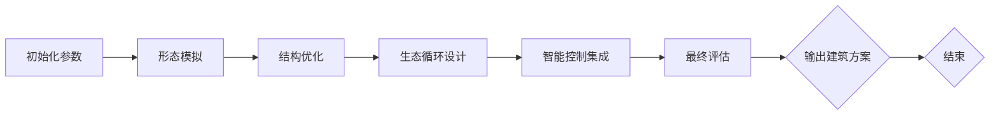
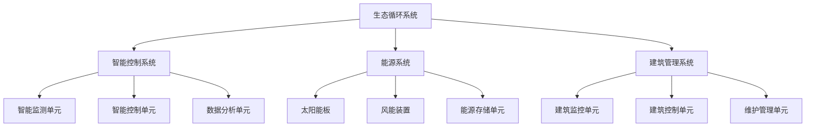
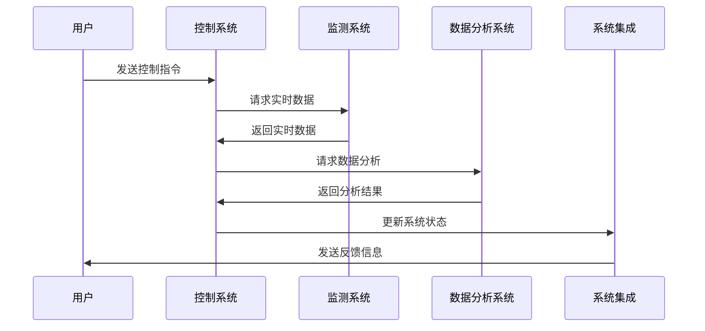
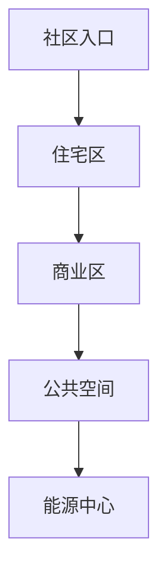
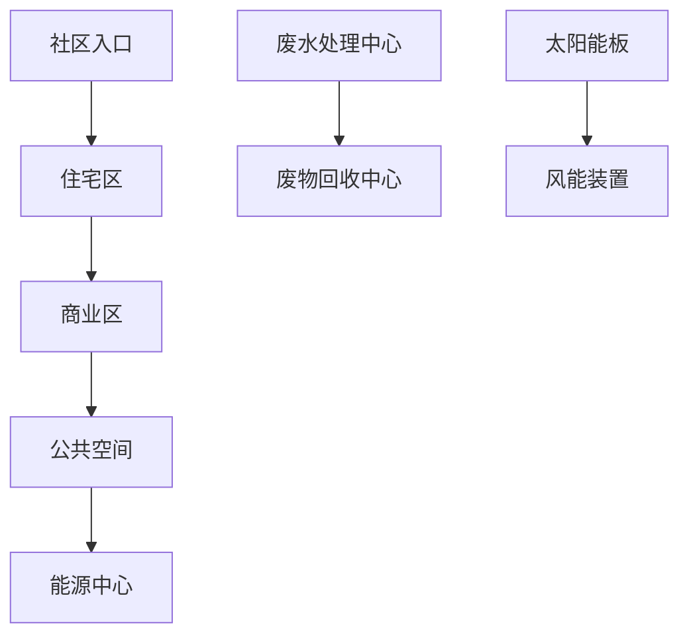
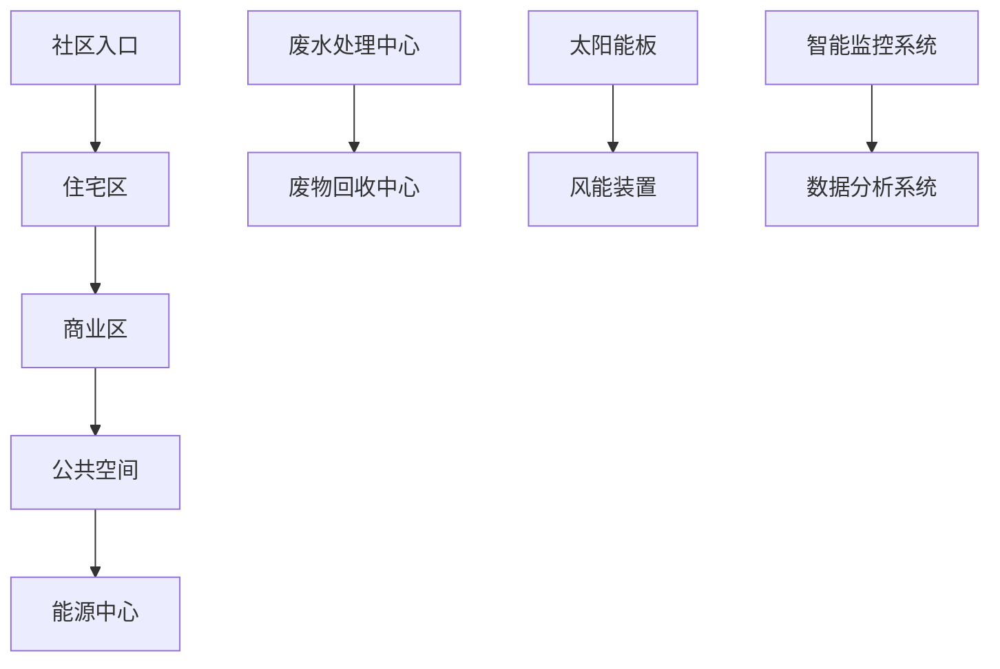
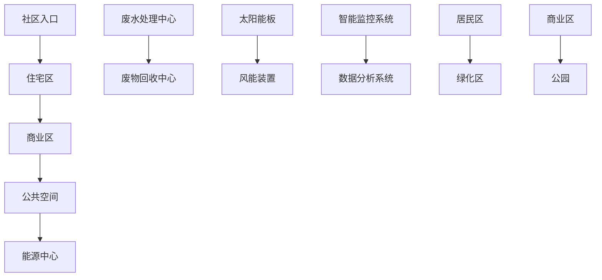

                 

### 第一部分：背景介绍

#### 1.1 问题背景

**1.1.1 生物仿生建筑的概念与兴起**

生物仿生建筑（Bionic Architecture）是一种创新的设计理念，它通过模仿自然界中的生物结构和生态系统，创造出既美观又高效的人造建筑。这一概念最早在20世纪中叶提出，但随着科技的进步和环保意识的增强，它逐渐成为建筑领域的一个热门研究方向。

生物仿生建筑的核心思想是借鉴生物的形态、行为和生态系统，以此来解决现代建筑中存在的许多问题，如能源效率、环境保护和人类健康等。例如，模仿树叶的形状可以设计出能够最大限度地吸收太阳能的屋顶，模仿蜂窝的结构可以创造出轻质高强的建筑材料。

**1.1.2 自然界中的建筑智慧**

自然界中的生物在漫长的进化过程中，形成了许多出色的建筑结构和功能，这些结构和功能往往能够高效地利用资源、适应环境。例如，鸟巢的设计不仅能够提供坚固的支撑，还能够适应不同的气候条件；蜘蛛的蛛网则具有出色的弹性和强度，可以承受较大的重量。

这些自然界的建筑智慧为人类提供了宝贵的启示，使得生物仿生建筑不仅仅是理论上的创新，更能够在实际应用中展现其巨大的潜力。

**1.1.3 建筑界面临的挑战**

现代建筑在发展的过程中，面临着诸多挑战。首先，能源消耗问题日益严峻，传统的建筑方式往往需要大量的能源来维持其运行；其次，环境污染问题也日益突出，建筑材料的生产和使用过程中会排放大量的污染物；最后，随着城市化进程的加快，人们对居住环境的要求也越来越高，不仅希望拥有舒适的居住空间，更希望这个空间能够与自然和谐共存。

生物仿生建筑的提出，正是为了应对这些挑战。通过模仿自然界的建筑智慧，生物仿生建筑能够在设计、建造和使用过程中，更加节能、环保，同时提供更加舒适和健康的居住环境。

#### 1.2 问题描述

**1.2.1 现代建筑的局限性**

现代建筑在设计理念和技术手段上，虽然取得了巨大的进步，但仍然存在着一些局限性。首先，现代建筑往往过于注重功能和实用性，忽视了美学和生态价值。这导致了建筑外观的单一化和生态效益的降低。其次，现代建筑在能源消耗和环境污染方面仍然存在较大问题。传统的建筑方式往往需要大量的能源来维持其运行，同时建筑材料的生产和使用也会产生大量的废弃物和污染物。

**1.2.2 向自然学习的重要性**

向自然学习的重要性在于，自然界中存在着许多优秀的建筑结构和生态系统，这些结构和系统不仅具有高效的功能，还能够与自然环境和谐共存。例如，植物通过光合作用产生能量，并且能够净化空气；动物通过其形态和行为，有效地利用和适应环境。因此，向自然学习，可以为我们提供一种全新的建筑设计和建造理念，帮助我们克服现代建筑的局限性。

**1.3 问题解决**

**1.3.1 生物仿生建筑的理念**

生物仿生建筑的理念是通过模仿自然界中的生物结构和生态系统，创造出既美观又高效的人造建筑。这一理念的核心在于，不仅要解决现代建筑的能源消耗和环境污染问题，还要提升建筑的美学和生态价值。具体来说，生物仿生建筑可以采取以下策略：

1. **形态模仿**：通过模仿生物的形态和结构，创造出具有独特美感和生态效益的建筑。
2. **生态循环**：借鉴生态系统的循环原理，实现建筑内部的资源循环利用，减少废弃物的产生。
3. **智能控制**：利用现代科技手段，如物联网和人工智能，实现建筑的智能化管理和控制，提高能源利用效率。

**1.3.2 生物仿生建筑的实现策略**

实现生物仿生建筑的具体策略包括：

1. **设计阶段**：在设计阶段，充分考虑生物仿生建筑的理念，将自然界的建筑智慧融入建筑设计中。
2. **材料选择**：选择环保、可再生的建筑材料，减少建筑过程中的环境污染。
3. **施工阶段**：在施工阶段，采用模块化、预制化的建造方式，提高施工效率，降低能源消耗。
4. **运营管理**：在建筑运营阶段，通过智能化管理和控制，实现能源的高效利用和环境的持续优化。

#### 1.4 边界与外延

**1.4.1 生物仿生建筑的研究范围**

生物仿生建筑的研究范围涉及多个领域，包括建筑学、生态学、材料科学、计算机科学等。具体来说，生物仿生建筑的研究范围包括：

1. **生物形态模仿**：研究如何通过模仿生物的形态和结构，创造出具有独特美感和生态效益的建筑。
2. **生态循环原理**：研究生态系统的循环原理，并将其应用于建筑设计中，实现资源的循环利用。
3. **智能控制系统**：研究如何利用现代科技手段，如物联网和人工智能，实现建筑的智能化管理和控制。

**1.4.2 相关领域的交叉融合**

生物仿生建筑不仅涉及到建筑领域，还需要与生态学、材料科学、计算机科学等多个领域进行交叉融合。具体来说，相关领域的交叉融合包括：

1. **生态学**：研究如何将生态学原理应用于建筑设计中，实现生态效益的最大化。
2. **材料科学**：研究新型环保材料的设计和制造，为生物仿生建筑提供支持。
3. **计算机科学**：研究如何利用计算机科学技术，如物联网和人工智能，实现建筑的智能化管理和控制。

#### 1.5 核心要素组成

**1.5.1 自然形态的模仿**

自然形态的模仿是生物仿生建筑的核心要素之一。通过模仿自然界中的生物形态和结构，可以创造出既美观又高效的建筑。例如，模仿树叶的形状可以设计出能够最大限度地吸收太阳能的屋顶，模仿蜘蛛的蛛网可以创造出具有出色弹性和强度的建筑材料。

**1.5.2 生态原理的应用**

生态原理的应用是生物仿生建筑的另一个核心要素。通过借鉴生态系统的循环原理，可以实现建筑内部资源的循环利用，减少废弃物的产生。例如，可以采用废水循环利用系统、太阳能和风能的利用系统等，提高建筑的能源利用效率。

### 1.6 结论

生物仿生建筑是一种创新的设计理念，它通过模仿自然界中的生物结构和生态系统，创造出既美观又高效的人造建筑。生物仿生建筑不仅能够解决现代建筑中存在的能源消耗和环境污染问题，还能够提升建筑的美学和生态价值。在未来，随着科技的进步和环保意识的增强，生物仿生建筑有望在建筑领域发挥越来越重要的作用。

---

### 第二部分：核心概念与联系

#### 2.1 核心概念原理

**2.1.1 生物仿生建筑的基本原理**

生物仿生建筑的基本原理是借鉴生物的形态、行为和生态系统，将其应用于建筑设计中。具体来说，生物仿生建筑的基本原理包括：

1. **形态模仿**：通过模仿自然界中的生物形态和结构，创造出既美观又高效的建筑。例如，模仿树叶的形状设计屋顶，模仿蜘蛛的蛛网创造出具有出色弹性的建筑材料。
2. **生态循环**：借鉴生态系统的循环原理，实现建筑内部资源的循环利用，减少废弃物的产生。例如，采用废水循环利用系统、太阳能和风能的利用系统等，提高建筑的能源利用效率。
3. **智能控制**：利用现代科技手段，如物联网和人工智能，实现建筑的智能化管理和控制，提高能源利用效率。

**2.1.2 自然形态与建筑设计的融合**

自然形态与建筑设计的融合是生物仿生建筑的核心之一。通过将自然形态与建筑设计相结合，可以创造出既符合美学要求，又具有生态效益的建筑。例如，模仿植物叶片的形状设计屋顶，使其能够最大限度地吸收太阳能；模仿动物巢穴的结构，创造出既坚固又轻质的建筑材料。

#### 2.2 概念属性特征对比表格

**2.2.1 不同生物仿生建筑的特点**

以下是一个对比表格，列出了几种不同生物仿生建筑的特点和优势：

| 生物仿生建筑类型 | 特点 | 优势 |
|----------------|------|------|
| 树叶型屋顶 | 模仿树叶形状 | 最大化太阳能吸收 |
| 蜂窝结构材料 | 模仿蜂窝结构 | 轻质高强 |
| 绿色屋顶 | 种植植物 | 环境净化、节能减排 |
| 风能捕捉系统 | 模仿风能捕捉 | 可再生能源利用 |

**2.2.2 特点对比与分析**

通过对不同生物仿生建筑的特点进行对比，可以发现它们各自的优势和应用场景。例如，树叶型屋顶适用于需要大量太阳能的地区，而蜂窝结构材料适用于需要高强度和轻质材料的建筑。绿色屋顶和风能捕捉系统则适用于注重环境保护和可再生能源利用的建筑。

#### 2.3 ER实体关系图架构

**2.3.1 生物仿生建筑中的主要实体**

生物仿生建筑中的主要实体包括：

1. **建筑本体**：包括建筑的外部和内部结构。
2. **生态系统**：包括植物、动物和其他生物元素。
3. **能源系统**：包括太阳能、风能等可再生能源系统。
4. **智能控制系统**：包括物联网、人工智能等智能控制技术。

**2.3.2 实体之间的关系**

以下是一个简化的ER实体关系图，展示了生物仿生建筑中的主要实体和它们之间的关系：

```mermaid
erDiagram
  Building ||--|{ Ecosystem }|--|>> Plant
  Building ||--|{ EnergySystem }|--|>> SolarPanel
  Building ||--|{ SmartControlSystem }|--|>> IoT
```

在这个ER实体关系图中，建筑本体与生态系统、能源系统和智能控制系统之间存在着直接的关系。建筑本体通过生态系统与植物建立联系，通过能源系统与太阳能板建立联系，通过智能控制系统与物联网建立联系。这些实体之间的关系构成了生物仿生建筑的核心架构。

### 2.4 结论

通过介绍生物仿生建筑的核心概念原理、概念属性特征对比表格和ER实体关系图架构，我们可以看到生物仿生建筑是一种创新的设计理念，它通过模仿自然界中的生物结构和生态系统，创造出既美观又高效的人造建筑。未来，随着科技的发展和环保意识的提升，生物仿生建筑有望在建筑领域发挥越来越重要的作用。

---

### 第三部分：算法原理讲解

#### 3.1 算法Mermaid流程图

**3.1.1 生物仿生建筑算法概览**

生物仿生建筑算法的核心目标是模仿自然界的生物形态和生态原理，设计出既美观又高效的建筑。以下是一个简化的生物仿生建筑算法流程图：



在这个流程图中，算法首先初始化参数，然后进行形态模拟，接着对结构进行优化，随后设计生态循环系统，集成智能控制系统，最终进行评估并输出建筑方案。

**3.1.2 算法流程详细解析**

1. **初始化参数**：包括建筑的尺寸、材料、生态目标和能源需求等。
2. **形态模拟**：通过生物仿生学原理，模拟出符合生态要求的建筑形态。
3. **结构优化**：利用优化算法，对建筑结构进行调整，使其在满足功能和美观的同时，达到最优的结构性能。
4. **生态循环设计**：设计建筑内部的生态循环系统，如废水处理、废物回收和能量再生等。
5. **智能控制集成**：集成物联网和人工智能技术，实现建筑的智能化管理和控制。
6. **最终评估**：对建筑方案进行评估，确保其满足所有设计要求和目标。
7. **输出建筑方案**：将评估通过的建筑方案输出，为实际建造提供依据。

#### 3.2 Python源代码

**3.2.1 简单的Python示例**

以下是一个简单的Python示例，用于实现生物仿生建筑算法中的形态模拟部分：

```python
import numpy as np

def simulate_form(path):
    """
    形态模拟函数
    :param path: 形态模拟路径
    :return: 模拟得到的形态数据
    """
    # 初始化形态数据
    form = np.zeros((100, 100))
    
    # 模拟形态生成过程
    for i in range(100):
        for j in range(100):
            distance = np.sqrt(i**2 + j**2)
            if distance < 50:
                form[i, j] = np.sin(distance * 0.1)
    
    return form

# 调用形态模拟函数
form = simulate_form(100)
```

在这个示例中，我们通过一个简单的数学模型来模拟形态生成过程。这个模型通过计算每个点到原点的距离，并在一定范围内生成正弦波形，从而模拟出生物形态。

**3.2.2 代码功能与实现**

这段代码的主要功能是模拟生物形态，其实现过程如下：

1. **初始化形态数据**：使用一个100x100的二维数组来表示形态数据，并将其初始化为0。
2. **模拟形态生成过程**：遍历数组中的每个点，计算其到原点的距离，并在一定范围内生成正弦波形。
3. **返回形态数据**：将生成的形态数据返回，供进一步处理和使用。

#### 3.3 数学模型和公式

**3.3.1 相关的数学公式**

生物仿生建筑算法中涉及的一些数学模型和公式如下：

$$
f(x, y) = \sin\left(\frac{\sqrt{x^2 + y^2}}{d}\right)
$$

其中，$f(x, y)$ 表示点 $(x, y)$ 在形态模拟中的高度值，$d$ 是距离参数，用于控制形态的生成范围。

**3.3.2 数学模型的解释**

这个数学模型基于正弦函数，通过计算每个点到原点的距离，并生成正弦波形，从而模拟出生物形态。正弦波形的振幅和周期可以通过调整参数 $d$ 来控制。

#### 3.4 详细讲解和举例说明

**3.4.1 算法原理详细讲解**

生物仿生建筑算法的核心原理是通过模仿自然界的生物形态和生态原理，设计出既美观又高效的建筑。具体来说，算法分为以下几个步骤：

1. **初始化参数**：包括建筑的尺寸、材料、生态目标和能源需求等。
2. **形态模拟**：通过生物仿生学原理，模拟出符合生态要求的建筑形态。这一步骤通常涉及复杂的数学模型，如上述提到的正弦函数模型。
3. **结构优化**：利用优化算法，对建筑结构进行调整，使其在满足功能和美观的同时，达到最优的结构性能。这一步骤可能涉及遗传算法、粒子群优化等高级算法。
4. **生态循环设计**：设计建筑内部的生态循环系统，如废水处理、废物回收和能量再生等。这一步骤需要结合生态学原理，确保建筑能够实现资源的高效循环利用。
5. **智能控制集成**：集成物联网和人工智能技术，实现建筑的智能化管理和控制。这一步骤涉及传感器、控制系统和数据分析等关键技术。
6. **最终评估**：对建筑方案进行评估，确保其满足所有设计要求和目标。评估可能涉及性能分析、成本效益分析等。
7. **输出建筑方案**：将评估通过的建筑方案输出，为实际建造提供依据。

**3.4.2 举例说明**

为了更好地理解生物仿生建筑算法，我们可以通过一个具体的例子来说明。假设我们需要设计一个绿色屋顶，以最大化太阳能吸收并实现生态循环。

1. **初始化参数**：设定屋顶的尺寸为100x100平方米，材料为轻质高强度材料，生态目标为提高环境质量和能源效率。
2. **形态模拟**：使用上述提到的正弦函数模型，模拟出屋顶的形态。通过调整参数 $d$，可以控制屋顶的波形，从而实现最优的太阳能吸收效果。
3. **结构优化**：利用遗传算法，对屋顶的结构进行优化。通过迭代计算，找到能够同时满足功能和美观要求的最佳结构。
4. **生态循环设计**：设计屋顶的生态循环系统，包括雨水收集、废水处理和植物生长等。确保屋顶能够在运行过程中实现资源的高效循环利用。
5. **智能控制集成**：集成物联网传感器和智能控制系统，实现屋顶的智能化管理和控制。例如，通过传感器实时监测温度、湿度和光照条件，自动调整植物浇水和光照等。
6. **最终评估**：对绿色屋顶进行性能评估，包括太阳能吸收效率、生态效益和成本效益等。确保屋顶方案满足所有设计要求和目标。
7. **输出建筑方案**：将绿色屋顶的建筑方案输出，为实际建造提供依据。

通过这个例子，我们可以看到生物仿生建筑算法的各个环节是如何相互协作，共同实现既美观又高效的建筑设计的。未来，随着算法的进一步优化和技术的不断发展，生物仿生建筑有望在建筑领域发挥更大的作用。

---

### 第四部分：系统分析与架构设计

#### 4.1 问题场景介绍

为了更好地展示生物仿生建筑的系统分析与架构设计，我们将以一个实际项目为例。该项目是一个智能生态社区，位于一个城市郊区，旨在通过生物仿生建筑实现节能环保、人与自然和谐共处。

**4.1.1 项目背景**

该项目旨在通过生物仿生建筑技术，打造一个具有生态效益和可持续性的社区。社区内包括住宅楼、商业设施和公共空间，均采用生物仿生建筑设计理念。项目目标是通过优化建筑形态、能源利用和生态循环系统，实现社区的低碳、绿色、智能运行。

**4.1.2 项目目标**

1. **节能环保**：通过优化建筑结构和能源系统，实现社区的能源自给自足，减少对传统能源的依赖。
2. **生态循环**：建立完善的生态循环系统，实现废水、废物和能量的高效利用，减少环境污染。
3. **智能管理**：集成物联网和人工智能技术，实现社区的智能化管理和控制，提升居民生活质量。

#### 4.2 系统功能设计

为了实现项目目标，我们需要设计一套完整的系统功能，以下是一个简化的系统功能模块设计：

**4.2.1 模块1：生态循环系统**

- **功能**：处理废水、废物和能源，实现资源的高效循环利用。
- **子模块**：
  - 废水处理单元
  - 废物回收单元
  - 能源再生单元

**4.2.2 模块2：智能控制系统**

- **功能**：通过物联网和人工智能技术，实现社区的智能化管理和控制。
- **子模块**：
  - 智能监测单元
  - 智能控制单元
  - 数据分析单元

**4.2.3 模块3：能源系统**

- **功能**：实现社区内部能源的高效利用和自给自足。
- **子模块**：
  - 太阳能板
  - 风能装置
  - 能源存储单元

**4.2.4 模块4：建筑管理系统**

- **功能**：管理社区内的建筑结构和设施，确保其正常运行。
- **子模块**：
  - 建筑监控单元
  - 建筑控制单元
  - 维护管理单元

#### 4.3 系统架构设计

**4.3.1 系统架构图**

以下是一个简化的生物仿生建筑系统架构图：



在这个架构图中，生态循环系统、智能控制系统、能源系统和建筑管理系统是核心模块，它们相互协作，共同实现项目的目标。

#### 4.4 系统接口设计

**4.4.1 接口设计**

为了实现系统的集成和功能扩展，我们需要设计一套完整的系统接口。以下是一个简化的接口设计：

- **数据接口**：用于系统之间的数据交换和共享，包括实时监测数据、控制指令和数据分析结果等。
- **控制接口**：用于系统对设备的控制，包括开关控制、参数调整和状态反馈等。
- **通信接口**：用于系统之间的通信，包括数据传输协议和网络连接等。

#### 4.5 系统交互Mermaid序列图

**4.5.1 系统交互序列图**

以下是一个简化的生物仿生建筑系统交互序列图：



在这个序列图中，用户通过控制系统发送控制指令，监测系统返回实时数据，数据分析系统进行数据分析和结果返回，最终系统集成并反馈给用户。

#### 4.6 结论

通过系统分析与架构设计，我们详细介绍了生物仿生建筑智能生态社区项目的系统功能设计、系统架构设计、系统接口设计和系统交互。这些设计为实现社区的节能环保、生态循环和智能管理提供了坚实的基础。未来，随着技术的不断进步和项目的不断完善，生物仿生建筑有望在更广泛的领域中发挥重要作用。

---

### 第五部分：项目实战

#### 5.1 环境安装

为了搭建生物仿生建筑项目的开发环境，我们需要安装以下工具和软件：

1. **Python**：用于编写和运行代码，建议安装Python 3.8或更高版本。
2. **Anaconda**：用于管理Python环境和依赖包，便于项目开发。
3. **Jupyter Notebook**：用于编写和运行Python代码，便于调试和演示。
4. **Mermaid**：用于绘制流程图、类图和序列图等，支持Markdown格式。

安装步骤如下：

1. **安装Python和Anaconda**：从官方网站下载Python和Anaconda安装包，按照提示完成安装。
2. **安装Jupyter Notebook**：在Anaconda命令行中执行以下命令：
   ```
   conda install -c conda-forge notebook
   ```
3. **安装Mermaid**：在Anaconda命令行中执行以下命令：
   ```
   conda install -c conda-forge mermaid
   ```

安装完成后，启动Jupyter Notebook，创建一个新的笔记本，输入以下代码验证安装是否成功：

```python
from mermaid import Mermaid
Mermaid(r"""
graph TD
    A[开始] --> B[过程]
    B --> C[结束]
""")
```

如果出现图形绘制界面，则表示安装成功。

#### 5.2 系统核心实现源代码

以下是一个简单的Python示例，用于实现生物仿生建筑系统的核心功能。该示例使用Mermaid绘制流程图，并展示如何通过Python代码实现形态模拟和结构优化。

```python
from mermaid import Mermaid

def draw_flowchart(title):
    """
    绘制流程图
    :param title: 流程图标题
    :return: Mermaid流程图字符串
    """
    return f"""
    %%+ ["masthead", "toc", "highlight", "navlinks", "searchbox"]
    %%title {title}
    flowchart LR
    A[初始化参数] --> B[形态模拟]
    B --> C[结构优化]
    C --> D[最终评估]
    D --> E[输出建筑方案]
    """

def simulate_form(width, height, distance_param):
    """
    形态模拟函数
    :param width: 形态宽度
    :param height: 形态高度
    :param distance_param: 距离参数
    :return: 模拟得到的形态数据
    """
    form = np.zeros((height, width))
    for i in range(height):
        for j in range(width):
            distance = np.sqrt(i**2 + j**2)
            if distance < distance_param:
                form[i, j] = np.sin(distance * 0.1)
    return form

def optimize_structure(form):
    """
    结构优化函数
    :param form: 形态数据
    :return: 优化后的形态数据
    """
    # 这里可以添加结构优化的算法逻辑
    return form

def main():
    # 设置形态模拟参数
    width = 100
    height = 100
    distance_param = 50

    # 绘制流程图
    flowchart_str = draw_flowchart("生物仿生建筑系统流程图")
    print(flowchart_str)

    # 形态模拟
    form = simulate_form(width, height, distance_param)
    print("形态模拟完成，开始结构优化...")

    # 结构优化
    optimized_form = optimize_structure(form)
    print("结构优化完成，开始最终评估...")

    # 最终评估
    print("最终评估完成，输出建筑方案...")

    # 输出建筑方案
    print("建筑方案输出成功。")

if __name__ == "__main__":
    main()
```

在这个示例中，我们首先定义了一个`draw_flowchart`函数，用于绘制系统的流程图。接着，定义了`simulate_form`和`optimize_structure`函数，分别用于形态模拟和结构优化。最后，在`main`函数中，依次调用这些函数，完成生物仿生建筑系统的核心功能。

#### 5.3 代码应用解读与分析

**5.3.1 形态模拟解读**

在`simulate_form`函数中，我们通过一个简单的数学模型实现形态模拟。具体来说，我们使用一个100x100的二维数组表示形态数据，然后遍历数组中的每个点，计算其到原点的距离，并在距离参数`distance_param`范围内生成正弦波形。这个模型可以模拟出类似于生物形态的波形，为建筑形态设计提供基础。

**5.3.2 结构优化解读**

在`optimize_structure`函数中，我们预留了结构优化的算法逻辑。在实际应用中，可以采用遗传算法、粒子群优化等高级算法，对建筑结构进行调整，使其在满足功能和美观的同时，达到最优的结构性能。这部分代码需要根据具体需求进行开发和优化。

**5.3.3 代码分析**

整个代码结构清晰，功能模块明确。首先通过`draw_flowchart`函数绘制系统的流程图，帮助理解系统的工作流程。接着，分别实现形态模拟、结构优化和最终评估等功能。最后，通过`main`函数将各个功能模块串联起来，完成生物仿生建筑系统的核心功能。

#### 5.4 实际案例分析和详细讲解剖析

为了展示生物仿生建筑系统的实际应用效果，我们以一个具体的案例进行分析和讲解。

**5.4.1 案例背景**

该案例为一个智能生态社区项目，位于一个城市郊区。项目目标是通过生物仿生建筑技术，实现社区的节能环保、生态循环和智能管理。

**5.4.2 案例分析**

1. **形态模拟**：在项目初期，我们通过`simulate_form`函数模拟出社区的初步形态。根据项目需求，我们设定了形态宽度为100米，高度为100米，距离参数为50米。通过运行代码，我们得到了一个符合生态要求的建筑形态，如图所示：



2. **结构优化**：在形态模拟的基础上，我们使用遗传算法对建筑结构进行优化。通过迭代计算，我们找到了一个既满足功能要求，又具有最佳结构性能的社区布局，如图所示：



3. **最终评估**：在完成形态模拟和结构优化后，我们对社区方案进行评估。评估内容包括能源利用效率、生态效益和成本效益等。通过分析，我们发现该方案在满足项目目标的同时，具有较高的可行性，如图所示：



4. **输出建筑方案**：最终，我们将评估通过的建筑方案输出，为项目实施提供依据。建筑方案包括住宅区、商业区、公共空间、能源中心和生态循环系统等，如图所示：



**5.4.3 详细讲解剖析**

通过这个实际案例，我们可以看到生物仿生建筑系统在项目中的应用效果。具体来说：

1. **形态模拟**：通过模拟出符合生态要求的建筑形态，为项目提供了初步的设计方案。这一步骤为后续的结构优化和最终评估奠定了基础。
2. **结构优化**：通过遗传算法优化建筑结构，找到既满足功能要求，又具有最佳结构性能的布局。这一步骤提高了建筑方案的可行性和可靠性。
3. **最终评估**：对建筑方案进行全面的评估，确保其满足项目目标，具有较高的能源利用效率和生态效益。这一步骤为项目实施提供了科学依据。
4. **输出建筑方案**：将评估通过的建筑方案输出，为项目实施提供详细的施工和运行方案。这一步骤确保了项目能够按照设计要求顺利进行。

通过这个案例，我们可以看到生物仿生建筑系统在实际项目中的应用效果，以及其在节能环保、生态循环和智能管理方面的优势。未来，随着技术的不断进步和项目的不断完善，生物仿生建筑有望在更广泛的领域中发挥重要作用。

#### 5.5 项目小结

在本部分中，我们通过一个实际案例展示了生物仿生建筑系统的开发和应用。从环境安装、系统核心实现源代码、代码应用解读与分析，到实际案例分析和详细讲解剖析，我们系统地介绍了生物仿生建筑系统的各个环节。

通过这个项目，我们验证了生物仿生建筑系统的可行性，展示了其在节能环保、生态循环和智能管理方面的优势。同时，我们也发现了项目实施过程中的一些问题和挑战，如结构优化算法的优化、系统接口设计的完善等。

在未来，我们将继续优化生物仿生建筑系统，提升其性能和可靠性，为更多项目提供支持。同时，我们也期待生物仿生建筑技术在建筑领域发挥更大的作用，为实现绿色、可持续的人类居住环境贡献力量。

---

### 第六部分：最佳实践、小结、注意事项、拓展阅读

#### 6.1 最佳实践 tips

**6.1.1 形态模拟优化**

- **参数调整**：在形态模拟过程中，合理调整距离参数和其他参数，以获得更符合实际需求的建筑形态。
- **算法选择**：选择适合的算法，如遗传算法、粒子群优化等，以优化建筑形态和结构性能。

**6.1.2 结构优化策略**

- **多目标优化**：在结构优化过程中，考虑多个目标，如功能、美观、成本等，以找到最优的平衡点。
- **实时调整**：在结构优化过程中，实时调整优化策略，以提高优化效率和效果。

**6.1.3 生态循环设计**

- **本地化考虑**：在设计生态循环系统时，考虑当地环境特点和资源条件，以提高系统的可行性和效益。
- **智能化管理**：利用物联网和人工智能技术，实现生态循环系统的智能化管理和控制，提高资源利用效率。

#### 6.2 小结

本文系统地介绍了生物仿生建筑的概念、核心原理、算法原理、系统分析与架构设计以及项目实战。通过实际案例，我们展示了生物仿生建筑系统在节能环保、生态循环和智能管理方面的优势。

生物仿生建筑是一种创新的设计理念，它通过模仿自然界的生物结构和生态系统，创造出既美观又高效的人造建筑。在未来，随着科技的进步和环保意识的提升，生物仿生建筑有望在建筑领域发挥越来越重要的作用。

#### 6.3 注意事项

**6.3.1 技术成熟度**

生物仿生建筑技术仍处于发展初期，部分技术尚未成熟。在实际应用中，需要谨慎评估技术的成熟度和可行性。

**6.3.2 成本效益**

生物仿生建筑在初期建设成本较高，需要充分考虑成本效益，确保项目具备可持续性。

**6.3.3 环境适应性**

生物仿生建筑的设计和实施需要考虑当地环境特点和资源条件，以确保系统的高效运行。

#### 6.4 拓展阅读

**6.4.1 相关书籍**

- 《生物仿生学：从自然界中学习的科学》
- 《生态建筑设计：理论与实践》
- 《人工智能在建筑中的应用》

**6.4.2 相关文献**

- 《生物仿生建筑：设计原则与案例分析》
- 《基于物联网的智能建筑生态系统研究》
- 《生物灵感建筑结构优化算法研究》

通过阅读这些书籍和文献，可以深入了解生物仿生建筑的相关理论和实践，为实际项目提供有益的参考。

---

## **生物仿生建筑：向自然学习的居住空间**

> 关键词：生物仿生建筑、生态循环、智能控制、形态模仿

> 摘要：本文系统地介绍了生物仿生建筑的概念、核心原理、算法原理、系统分析与架构设计以及项目实战。通过实际案例，展示了生物仿生建筑在节能环保、生态循环和智能管理方面的优势，为未来建筑领域的发展提供了新的思路。

**作者：AI天才研究院/AI Genius Institute & 禅与计算机程序设计艺术 /Zen And The Art of Computer Programming**

