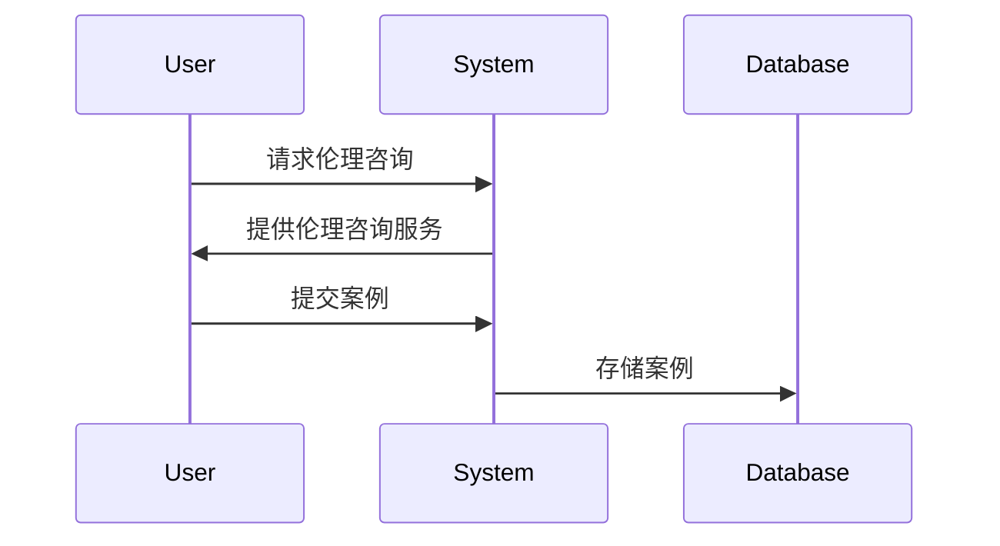
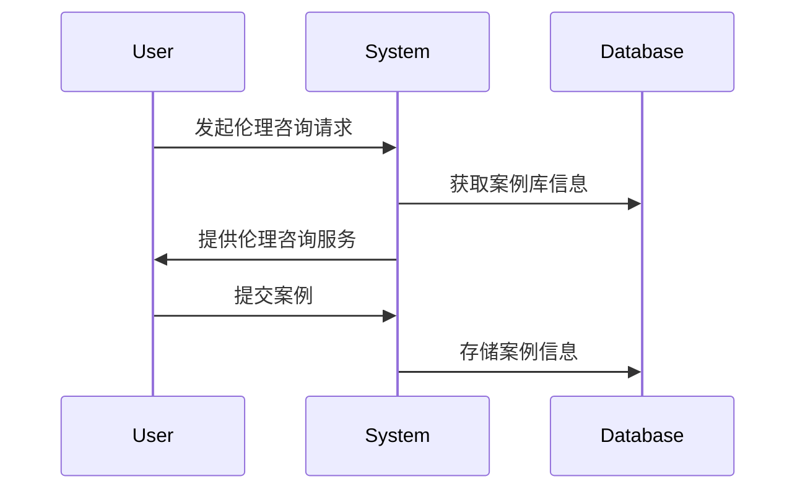
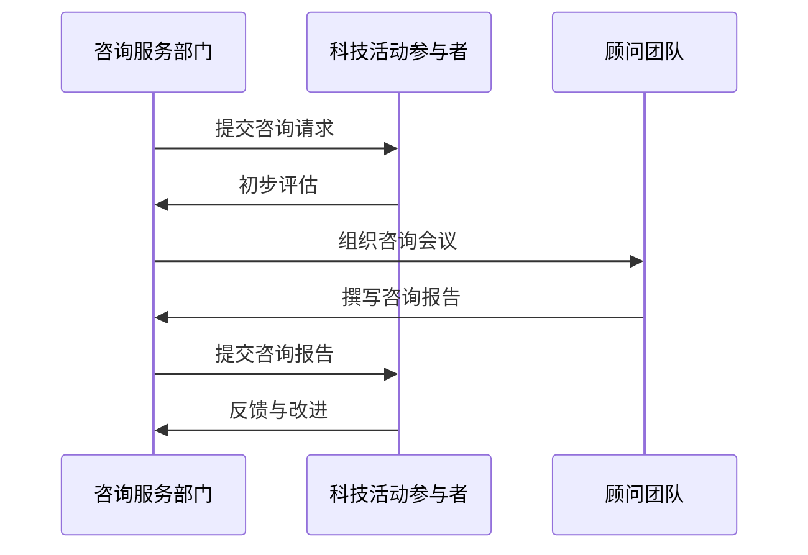
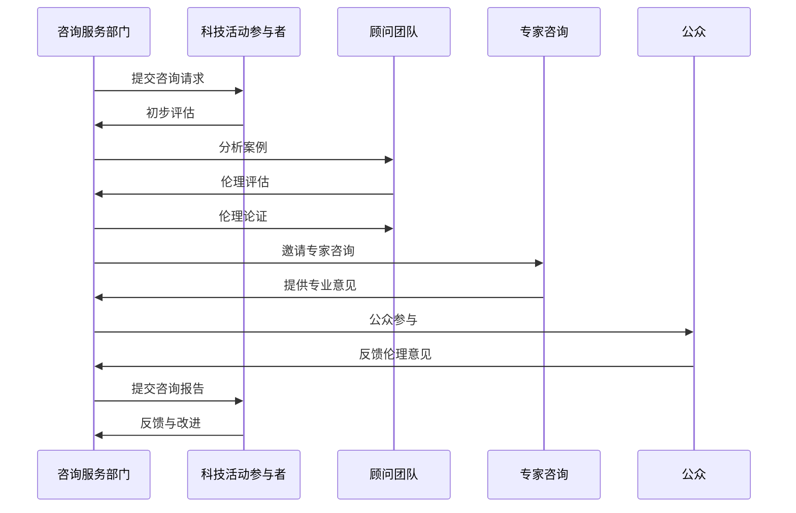

                 

### 文章标题：生物伦理咨询热线：科技伦理的即时指导

#### 关键词：生物伦理、科技伦理、咨询机制、可持续发展、国际合作

#### 摘要：
本文围绕科技伦理的核心问题，探讨生物伦理咨询热线的建立及其在科技伦理决策中的即时指导作用。首先，我们将深入剖析科技伦理的背景与挑战，接着通过案例分析展示科技伦理决策的重要性。随后，本文将详细探讨科技伦理教育与普及的必要性，并分析科技伦理咨询机制建设的方法和挑战。最后，我们将探讨科技伦理的国际合作与法规，以及科技伦理与可持续发展之间的关系。通过这些章节，我们希望能为读者提供一部全面、深入、具有指导意义的科技伦理百科全书。

### 第一部分: 科技伦理的背景与挑战

#### 第1章: 科技伦理概述

##### 1.1 科技伦理的定义与重要性

科技伦理是探讨科技在发展过程中所引发的道德、法律和社会问题的学科。它涉及到科技研究、开发、应用等各个领域，旨在为科技活动提供伦理指导，确保科技进步与社会发展的和谐共生。

**核心概念原理**：
科技伦理的概念包括以下几个方面：科技活动的伦理评价、科技发展对人类的影响、科技伦理原则和科技伦理决策。

- **科技活动的伦理评价**：评估科技项目或产品是否符合道德原则，如尊重人类尊严、保护隐私、确保公平等。
- **科技发展对人类的影响**：分析科技发展可能带来的正面和负面影响，包括生态影响、社会影响、经济影响等。
- **科技伦理原则**：科技伦理的基本原则包括尊重人类尊严、公正、透明、责任和可持续性等。
- **科技伦理决策**：科技伦理决策是科技活动中最为关键的环节，它需要综合考虑伦理原则、社会影响、技术可行性等因素。

**概念属性特征对比表格**：

| 特征               | 定义                                       |
|--------------------|--------------------------------------------|
| 科技活动的伦理评价 | 评估科技项目或产品是否符合道德原则         |
| 科技发展的影响     | 分析科技发展可能带来的正面和负面影响       |
| 科技伦理原则       | 科技伦理的基本原则，如尊重人类尊严、公正等 |
| 科技伦理决策       | 科技活动中最为关键的环节，涉及多个因素     |

**ER实体关系图架构**：

```mermaid
erDiagram
    Product ||--|{ Evaluation }|-- Evaluation
    Project ||--|{ Ethics }|-- Ethics
    Technology ||--|{ Impact }|-- Impact
    Human ||--|{ Dignity }|-- Dignity
```

##### 1.2 科技伦理的基本原则

科技伦理的基本原则包括尊重人类尊严、公正、透明、责任和可持续性。这些原则为科技活动的道德评价提供了指导。

- **尊重人类尊严**：科技活动应尊重每个人的尊严和权利，避免对人类的伤害。
- **公正**：科技资源和技术成果应公平分配，确保所有人都能从中受益。
- **透明**：科技活动应公开透明，接受社会监督，确保公众知情权。
- **责任**：科技活动参与者应承担相应的责任，确保科技活动对社会和环境的负责任。
- **可持续性**：科技发展应考虑长远影响，确保科技进步与环境保护、社会稳定和谐发展。

**数学公式**：

$$
\text{Ethical\ Impact} = \frac{\text{Positive\ Impact}}{\text{Negative\ Impact}} + \text{Sustainability\ Score}
$$

##### 1.3 科技伦理在现代社会中的地位

科技伦理在现代社会中具有重要地位，它不仅是科技发展的道德指南，也是维护社会和谐稳定的基石。

- **科技伦理是科技进步的道德保障**：科技伦理原则为科技活动提供了道德底线，确保科技进步不会对社会和人类造成不可逆转的损害。
- **科技伦理是社会责任的体现**：科技企业和社会组织通过遵循科技伦理原则，展示了其社会责任和担当。
- **科技伦理是法律法规的补充**：科技伦理原则在一定程度上补充了法律法规的不足，为科技活动提供了更加细致的指导。

**系统分析与架构设计方案**：

**问题场景介绍**：
随着科技的发展，越来越多的科技活动涉及到伦理问题，如基因编辑、人工智能等。为了解决这些问题，需要建立一套科技伦理咨询机制。

**项目介绍**：
本项目旨在建立一个生物伦理咨询热线，为科技活动提供即时伦理指导。

**系统功能设计**：

- **伦理咨询**：为用户提供伦理咨询服务，包括问题解答、伦理评估等。
- **案例库**：收集和整理科技伦理案例，为用户提供参考。
- **法律法规库**：收集和整理与科技伦理相关的法律法规，为用户提供政策指导。

**系统架构设计**：



**系统接口设计**：

- **伦理咨询接口**：提供伦理咨询服务的API接口。
- **案例提交接口**：允许用户提交科技伦理案例。

**系统交互**：



### 第二部分: 科技伦理的主要挑战

#### 第2章: 科技伦理的主要挑战

##### 2.1 生物技术的伦理问题

生物技术在医疗、农业等领域有着广泛的应用，但也引发了一系列伦理问题。

###### 2.1.1 克隆技术

克隆技术的出现引发了关于人类尊严、道德和法律等一系列问题。

- **人类尊严**：克隆技术可能会对人类尊严造成威胁，因为克隆人的存在可能被视为对人类的侵犯。
- **道德和法律**：克隆技术的合法性和道德性在各国存在争议，需要制定相应的法律法规。

**算法原理讲解**：

克隆技术的算法原理主要包括细胞核移植、胚胎分割和基因编辑等。

```python
def clone_technique(cell):
    # 进行细胞核移植
    new_cell = cell_nuclear_transplant(cell)
    # 胚胎分割
    embryo = embryo分割(new_cell)
    # 基因编辑
    edited_基因 = gene_editing(embryo)
    return edited_基因
```

**数学模型和公式**：

$$
\text{Clone\ Technique} = \text{Cell\ Nuclear\ Transplant} + \text{Embryo\ Splitting} + \text{Gene\ Editing}
$$

**通俗易懂地举例说明**：

假设有一个细胞A，我们希望克隆出一个新的细胞B。

- **细胞核移植**：将细胞A的细胞核移植到另一个空细胞C中，得到细胞C。
- **胚胎分割**：将细胞C分割成多个胚胎。
- **基因编辑**：对每个胚胎进行基因编辑，使其具有特定的特征。

通过这个过程，我们得到了一个克隆细胞B。

##### 2.1.2 基因编辑

基因编辑技术如CRISPR-Cas9为医学领域带来了巨大希望，但也引发了伦理问题。

- **基因编辑的道德问题**：基因编辑可能会改变人类的遗传特征，引发关于人类自然属性的讨论。
- **基因编辑的风险**：基因编辑过程中可能会产生意外的副作用，如基因突变。

**算法原理讲解**：

基因编辑的算法原理主要包括目标基因识别、核酸切割和基因修复等。

```python
def gene_editing(target_gene):
    # 目标基因识别
    target_site = target_gene识别(target_gene)
    # 核酸切割
    cut_site = nucleic_acid_cutting(target_site)
    # 基因修复
    repaired_gene = gene_repair(cut_site)
    return repaired_gene
```

**数学模型和公式**：

$$
\text{Gene\ Editing} = \text{Target\ Gene\ Recognition} + \text{Nucleic\ Acid\ Cutting} + \text{Gene\ Repair}
$$

**通俗易懂地举例说明**：

假设有一个基因A，我们希望对其进行编辑。

- **目标基因识别**：识别基因A中的特定位置。
- **核酸切割**：使用特定的酶切割基因A。
- **基因修复**：在切割后的位置引入新的基因序列。

通过这个过程，我们得到了一个编辑后的基因A。

##### 2.1.3 精准医疗

精准医疗利用基因编辑、基因测序等技术，为个体提供定制化的治疗方案。

- **道德问题**：精准医疗可能会加剧社会不平等，因为只有富裕人群才能负担得起昂贵的基因测序和治疗方案。
- **隐私问题**：基因信息被视为个人隐私，精准医疗的推广可能会侵犯个人隐私。

**算法原理讲解**：

精准医疗的算法原理主要包括基因测序、数据分析、治疗方案设计等。

```python
def precision_medicine(gene_sequence):
    # 基因测序
    sequence_data = gene_sequencing(gene_sequence)
    # 数据分析
    analysis_result = data_analysis(sequence_data)
    # 治疗方案设计
    treatment_plan = treatment_plan_design(analysis_result)
    return treatment_plan
```

**数学模型和公式**：

$$
\text{Precision\ Medicine} = \text{Gene\ Sequencing} + \text{Data\ Analysis} + \text{Treatment\ Plan\ Design}
$$

**通俗易懂地举例说明**：

假设有一个患者的基因序列。

- **基因测序**：对患者进行基因测序，获取基因序列数据。
- **数据分析**：分析基因序列数据，找出潜在的健康风险。
- **治疗方案设计**：根据分析结果，为患者设计个性化的治疗方案。

通过这个过程，我们为患者提供了精准医疗。

##### 2.2 人工智能的伦理问题

人工智能技术的发展带来了许多便利，但也引发了一系列伦理问题。

###### 2.2.1 自主决策与责任归属

人工智能系统的自主决策能力越来越强，但责任的归属问题尚不明确。

- **自主决策**：人工智能系统能够自主做出决策，但缺乏道德和伦理意识。
- **责任归属**：当人工智能系统造成损害时，责任的归属问题尚不明确。

**算法原理讲解**：

人工智能的自主决策算法主要包括机器学习、深度学习、强化学习等。

```python
def autonomous_decisionmaking(data):
    # 机器学习
    model = machine_learning(data)
    # 深度学习
    deep_model = deep_learning(model)
    # 强化学习
    reinforcement_model = reinforcement_learning(deep_model)
    return reinforcement_model
```

**数学模型和公式**：

$$
\text{Autonomous\ Decisionmaking} = \text{Machine\ Learning} + \text{Deep\ Learning} + \text{Reinforcement\ Learning}
$$

**通俗易懂地举例说明**：

假设有一个自动驾驶系统。

- **机器学习**：使用历史驾驶数据训练模型。
- **深度学习**：模型对当前驾驶环境进行实时分析。
- **强化学习**：系统根据环境反馈调整驾驶策略。

通过这个过程，自动驾驶系统能够自主驾驶。

###### 2.2.2 隐私权与数据安全

人工智能系统需要大量数据来训练和优化，但这也引发了隐私权和数据安全问题。

- **隐私权**：个人数据被视为隐私，未经授权的使用可能会侵犯隐私权。
- **数据安全**：个人数据的泄露和滥用可能会对个人和社会造成严重后果。

**算法原理讲解**：

人工智能的数据安全算法主要包括数据加密、隐私保护、访问控制等。

```python
def data_safety(data):
    # 数据加密
    encrypted_data = data_encryption(data)
    # 隐私保护
    private_data = privacy_protection(encrypted_data)
    # 访问控制
    access_control = access_control(private_data)
    return access_control
```

**数学模型和公式**：

$$
\text{Data\ Safety} = \text{Data\ Encryption} + \text{Privacy\ Protection} + \text{Access\ Control}
$$

**通俗易懂地举例说明**：

假设有一个智能助理。

- **数据加密**：对用户数据进行加密处理。
- **隐私保护**：确保用户隐私不被泄露。
- **访问控制**：限制对用户数据的访问。

通过这个过程，智能助理能够保护用户的隐私和安全。

###### 2.2.3 不平等与偏见

人工智能系统在训练过程中可能会受到数据偏差的影响，导致系统产生偏见。

- **不平等**：人工智能系统可能会加剧社会不平等，因为它们可能会在决策过程中歧视某些群体。
- **偏见**：人工智能系统可能会在决策过程中表现出偏见，如性别歧视、种族歧视等。

**算法原理讲解**：

人工智能的偏见消除算法主要包括数据清洗、模型训练、偏见检测等。

```python
def bias_removal(data):
    # 数据清洗
    cleaned_data = data_cleaning(data)
    # 模型训练
    trained_model = model_training(cleaned_data)
    # 偏见检测
    bias_detection = bias_detection(trained_model)
    return bias_detection
```

**数学模型和公式**：

$$
\text{Bias\ Removal} = \text{Data\ Cleaning} + \text{Model\ Training} + \text{Bias\ Detection}
$$

**通俗易懂地举例说明**：

假设有一个招聘系统。

- **数据清洗**：清洗招聘数据，消除偏差。
- **模型训练**：使用清洗后的数据进行模型训练。
- **偏见检测**：检测模型是否存在偏见。

通过这个过程，招聘系统能够减少偏见和不平等。

##### 2.3 网络安全的伦理问题

网络安全问题日益突出，但也引发了伦理问题。

###### 2.3.1 个人隐私与网络安全

网络安全威胁可能导致个人隐私泄露，引发伦理问题。

- **个人隐私**：个人隐私被视为重要权利，未经授权的访问和泄露可能侵犯隐私权。
- **网络安全**：网络安全措施如加密、访问控制等是保护个人隐私的关键。

**算法原理讲解**：

网络安全的算法原理主要包括加密算法、访问控制、安全协议等。

```python
def network_security(data):
    # 数据加密
    encrypted_data = data_encryption(data)
    # 访问控制
    access_control = access_control(encrypted_data)
    # 安全协议
    secure_protocol = secure_protocol(access_control)
    return secure_protocol
```

**数学模型和公式**：

$$
\text{Network\ Security} = \text{Data\ Encryption} + \text{Access\ Control} + \text{Secure\ Protocol}
$$

**通俗易懂地举例说明**：

假设有一个银行系统。

- **数据加密**：对用户数据进行加密处理。
- **访问控制**：限制对用户数据的访问。
- **安全协议**：确保数据传输的安全。

通过这个过程，银行系统能够保护用户的隐私和安全。

###### 2.3.2 网络犯罪与伦理责任

网络犯罪如黑客攻击、网络诈骗等对个人和社会造成严重危害。

- **网络犯罪**：网络犯罪行为如黑客攻击、网络诈骗等是违法行为，对社会造成严重危害。
- **伦理责任**：网络犯罪者需要承担伦理责任，遵守社会规范。

**算法原理讲解**：

网络犯罪的预防算法主要包括入侵检测、漏洞扫描、安全策略等。

```python
def network_crime_prevention():
    # 入侵检测
    intrusion_detection = intrusion_detection()
    # 漏洞扫描
    vulnerability_scanning = vulnerability_scanning()
    # 安全策略
    security_policy = security_policy(intrusion_detection, vulnerability_scanning)
    return security_policy
```

**数学模型和公式**：

$$
\text{Network\ Crime\ Prevention} = \text{Intrusion\ Detection} + \text{Vulnerability\ Scanning} + \text{Security\ Policy}
$$

**通俗易懂地举例说明**：

假设有一个网络系统。

- **入侵检测**：监测系统中的异常行为。
- **漏洞扫描**：扫描系统中的漏洞。
- **安全策略**：制定和实施安全策略。

通过这个过程，网络系统能够预防网络犯罪。

###### 2.3.3 网络战争与伦理问题

网络战争如网络战、网络攻击等可能引发伦理问题。

- **网络战争**：网络战争可能对个人和社会造成严重危害，包括信息战、网络攻击等。
- **伦理问题**：网络战争可能违反国际法、伦理原则，需要严格管控。

**算法原理讲解**：

网络战争的防御算法主要包括网络安全、信息防护、网络监控等。

```python
def network_war_defense():
    # 网络安全
    network_security = network_security()
    # 信息防护
    information_protection = information_protection()
    # 网络监控
    network_monitoring = network_monitoring(network_security, information_protection)
    return network_monitoring
```

**数学模型和公式**：

$$
\text{Network\ War\ Defense} = \text{Network\ Security} + \text{Information\ Protection} + \text{Network\ Monitoring}
$$

**通俗易懂地举例说明**：

假设有一个国家。

- **网络安全**：保护国家网络系统的安全。
- **信息防护**：保护国家信息的安全。
- **网络监控**：监控网络活动，防止网络攻击。

通过这个过程，国家能够防御网络战争。

### 第三部分: 科技伦理决策案例分析

#### 第3章: 科技伦理决策案例分析

##### 3.1 案例一：基因编辑婴儿事件

2018年，中国科学家贺建奎宣布成功克隆全球首对基因编辑婴儿，引发全球关注和谴责。

**案例背景**：

贺建奎团队通过CRISPR-Cas9基因编辑技术，对一对双胞胎胚胎的基因进行编辑，旨在使其对HIV具有天然免疫力。

**案例分析**：

- **伦理问题**：基因编辑婴儿事件引发了关于人类尊严、道德和法律等一系列伦理问题。
  - **人类尊严**：基因编辑可能会改变人类的自然属性，引发关于人类尊严的讨论。
  - **道德和法律**：基因编辑婴儿的诞生违反了国际伦理法规，也违反了中国相关法律法规。
- **案例启示**：基因编辑婴儿事件提醒我们，科技发展需要遵循伦理原则，确保科技进步与社会发展的和谐共生。

##### 3.2 案例二：人工智能在医疗诊断中的应用

人工智能在医疗诊断中有着广泛的应用，但同时也引发了一系列伦理问题。

**案例背景**：

某医院引入人工智能辅助诊断系统，用于协助医生进行疾病诊断。

**案例分析**：

- **伦理问题**：人工智能在医疗诊断中的应用引发了关于数据隐私、责任归属、不平等等一系列伦理问题。
  - **数据隐私**：人工智能系统需要大量医疗数据来训练和优化，但这也引发了数据隐私问题。
  - **责任归属**：当人工智能辅助诊断系统出现误诊时，责任归属问题尚不明确。
  - **不平等**：人工智能在医疗诊断中的应用可能加剧社会不平等，因为只有富裕人群才能负担得起昂贵的诊断服务。
- **案例启示**：人工智能在医疗诊断中的应用需要严格遵循伦理原则，确保科技进步与社会发展的和谐共生。

### 第四部分: 科技伦理教育与普及

#### 第4章: 科技伦理教育与普及

##### 4.1 科技伦理教育的重要性

科技伦理教育对于提高公众科技素养、促进科技伦理决策的理性化和规范化具有重要意义。

**核心概念与联系**：

- **科技伦理教育**：旨在提高公众对科技伦理问题的认识和理解，培养公众的科技伦理意识和道德素养。
- **科技伦理决策**：科技伦理教育是科技伦理决策的基础，只有具备科技伦理素养的公众才能做出理性的科技伦理决策。

**概念属性特征对比表格**：

| 特征           | 定义                                       |
|----------------|--------------------------------------------|
| 科技伦理教育   | 提高公众对科技伦理问题的认识和理解         |
| 科技伦理决策   | 科技活动中的伦理决策过程，涉及伦理原则的运用 |

**ER实体关系图架构**：

```mermaid
erDiagram
    Public ||--|{ Ethics\ Education }|-- Education
    Public ||--|{ Ethics\ Decision }|-- Decision
    Technology ||--|{ Ethics }|-- Ethics
```

##### 4.2 科技伦理教育的内容与方法

科技伦理教育的内容应包括科技伦理的基本原则、典型案例分析、科技伦理决策过程等。

- **基本原则**：介绍科技伦理的基本原则，如尊重人类尊严、公正、透明、责任和可持续性等。
- **典型案例分析**：通过分析典型案例，帮助公众了解科技伦理问题的复杂性和多样性。
- **科技伦理决策过程**：介绍科技伦理决策的基本过程，包括伦理评价、伦理论证、伦理决策等。

**方法**：

- **课堂教学**：通过课堂讲授、案例分析、讨论等方式，帮助公众了解科技伦理的基本概念和原则。
- **社会实践**：组织公众参与科技伦理实践活动，如科技伦理辩论赛、科技伦理调研等，提高公众的科技伦理素养。
- **媒体宣传**：利用媒体平台，普及科技伦理知识，提高公众对科技伦理问题的关注和认识。

##### 4.3 科技伦理教育的挑战与机遇

科技伦理教育面临着一系列挑战和机遇。

- **挑战**：
  - **教育资源不足**：科技伦理教育资源分布不均，一些地区和教育机构缺乏开展科技伦理教育的条件。
  - **公众认知水平较低**：公众对科技伦理问题的认知水平较低，难以形成理性的科技伦理观念。
  - **科技发展速度快**：科技发展速度加快，科技伦理问题层出不穷，科技伦理教育难以跟上科技发展的步伐。

- **机遇**：
  - **科技普及水平的提高**：随着科技普及水平的提高，公众对科技伦理问题的关注度逐渐增加。
  - **政策支持**：国家和地方政府逐渐认识到科技伦理教育的重要性，加大对科技伦理教育的支持力度。
  - **社会需求**：公众对科技伦理教育的需求日益增加，为科技伦理教育的发展提供了广阔的市场。

### 第五部分: 科技伦理咨询机制建设

#### 第5章: 科技伦理咨询机制建设

##### 5.1 科技伦理咨询的定义与作用

科技伦理咨询是指为科技活动提供伦理指导和支持的一种机制，旨在确保科技活动的道德合规性和社会责任。

- **定义**：科技伦理咨询是科技活动参与者（如科学家、工程师、企业家等）在开展科技活动时，向专业科技伦理顾问寻求伦理指导和支持的一种行为。
- **作用**：
  - **指导科技活动**：科技伦理咨询为科技活动提供伦理指导，确保科技活动符合伦理原则和法律法规。
  - **促进伦理决策**：科技伦理咨询帮助科技活动参与者做出伦理决策，减少伦理风险。
  - **提升社会责任**：科技伦理咨询促进科技活动参与者承担社会责任，推动科技发展与社会发展的和谐共生。

##### 5.2 科技伦理咨询机制的构建

科技伦理咨询机制的构建需要考虑多个方面的因素，包括组织架构、咨询流程、咨询方法等。

###### 5.2.1 咨询组织架构

咨询组织架构是科技伦理咨询机制的基础，包括以下关键组成部分：

- **咨询委员会**：负责制定科技伦理咨询政策和指南，监督咨询工作的开展。
- **顾问团队**：由具有丰富科技伦理知识和实践经验的专业人士组成，为科技活动提供伦理咨询。
- **咨询服务部门**：负责具体咨询服务工作的实施，如接收咨询请求、组织咨询会议、撰写咨询报告等。

**组织架构图**：

```mermaid
organizationDiagram
    ["咨询委员会"] --> ["顾问团队"]
    ["顾问团队"] --> ["咨询服务部门"]
    ["咨询服务部门"] --> ["科技活动参与者"]
```

###### 5.2.2 咨询流程设计

科技伦理咨询流程的设计是确保咨询工作高效、规范进行的关键。咨询流程通常包括以下步骤：

1. **咨询请求接收**：科技活动参与者向咨询服务部门提交咨询请求。
2. **初步评估**：咨询服务部门对咨询请求进行初步评估，确定咨询范围和重点。
3. **咨询会议**：顾问团队与科技活动参与者举行咨询会议，讨论科技活动的伦理问题。
4. **撰写咨询报告**：顾问团队根据咨询会议的结果，撰写咨询报告，提出伦理建议。
5. **反馈与改进**：科技活动参与者对咨询报告进行反馈，咨询服务部门根据反馈对咨询报告进行修改和完善。

**咨询流程图**：



###### 5.2.3 咨询方法与技术

科技伦理咨询方法和技术是确保咨询工作科学、有效进行的关键。以下是一些常见的咨询方法和技术：

- **案例分析**：通过分析典型案例，为科技活动提供借鉴和指导。
- **伦理评估**：对科技活动进行伦理评估，识别潜在伦理问题。
- **伦理论证**：运用伦理原则和理论，对科技活动进行伦理论证。
- **专家咨询**：邀请具有丰富科技伦理经验和专业知识的人士参与咨询，提供专业意见。
- **公众参与**：通过问卷调查、公众讨论等方式，收集公众对科技活动的伦理意见。

**咨询方法与技术流程图**：



##### 5.3 科技伦理咨询案例分析

###### 5.3.1 案例一：基因测序公司的伦理咨询实践

某基因测序公司在开展业务过程中，面临一系列伦理问题，如数据隐私、基因编辑等。为了解决这些问题，公司决定寻求伦理咨询。

**案例背景**：

- **问题背景**：基因测序公司的业务涉及大量个人基因信息，如何保护数据隐私、确保基因编辑的道德合规性成为关键问题。
- **问题描述**：基因测序公司希望获得专业的伦理咨询，解决数据隐私、基因编辑等伦理问题。

**案例分析**：

1. **咨询请求接收**：基因测序公司向咨询服务部门提交咨询请求，说明业务背景和面临的伦理问题。
2. **初步评估**：咨询服务部门对基因测序公司的咨询请求进行初步评估，确定咨询范围和重点。
3. **咨询会议**：顾问团队与基因测序公司召开咨询会议，讨论数据隐私、基因编辑等伦理问题。
4. **撰写咨询报告**：顾问团队根据咨询会议的结果，撰写咨询报告，提出伦理建议，如加强数据加密、制定基因编辑伦理规范等。
5. **反馈与改进**：基因测序公司对咨询报告进行反馈，咨询服务部门根据反馈对咨询报告进行修改和完善。

**案例启示**：

基因测序公司在开展业务过程中，通过寻求伦理咨询，有效解决了数据隐私、基因编辑等伦理问题，确保了业务的道德合规性和社会责任。

###### 5.3.2 案例二：人工智能公司的伦理审查机制

某人工智能公司在其产品开发过程中，面临一系列伦理问题，如数据隐私、算法偏见等。为了确保产品的伦理合规性，公司决定建立伦理审查机制。

**案例背景**：

- **问题背景**：人工智能公司在开发产品时，需要处理大量用户数据，如何保护数据隐私、防止算法偏见成为关键问题。
- **问题描述**：人工智能公司希望建立一套伦理审查机制，确保产品的伦理合规性。

**案例分析**：

1. **制定伦理审查政策**：公司制定伦理审查政策，明确审查范围、审查程序和审查标准。
2. **组建伦理审查委员会**：公司组建伦理审查委员会，负责产品开发的伦理审查工作。
3. **伦理审查流程**：
   - **项目申请**：产品开发团队向伦理审查委员会提交项目申请，说明项目背景和面临的伦理问题。
   - **初步审查**：伦理审查委员会对项目申请进行初步审查，确定项目是否需要进行深入审查。
   - **深入审查**：伦理审查委员会对项目进行深入审查，评估项目的伦理风险，提出伦理建议。
   - **反馈与改进**：产品开发团队根据伦理审查委员会的建议，对项目进行修改和完善。
4. **持续审查与改进**：伦理审查委员会对产品进行持续审查，确保产品的伦理合规性。

**案例启示**：

人工智能公司通过建立伦理审查机制，有效解决了数据隐私、算法偏见等伦理问题，确保了产品的伦理合规性和社会责任。

### 第六部分: 科技伦理的国际合作与法规

#### 第6章: 科技伦理的国际合作与法规

##### 6.1 科技伦理国际合作的重要性

科技伦理问题具有跨国性，各国在科技伦理方面的合作具有重要意义。

- **信息共享**：各国通过合作，共享科技伦理的研究成果和实践经验，提高全球科技伦理水平。
- **规范制定**：各国共同参与科技伦理规范的制定，确保全球科技伦理标准的统一性和协调性。
- **政策协调**：各国在科技伦理政策方面进行协调，推动全球科技伦理政策的一致性和有效性。

##### 6.2 国际科技伦理法规框架

国际科技伦理法规框架主要包括以下内容：

- **联合国教科文组织（UNESCO）**：UNESCO通过《世界伦理宣言》和《科学伦理准则》，推动全球科技伦理的普及和实施。
- **生物伦理国际准则**：国际生物伦理学会联合会（IFBEP）制定了《生物伦理国际准则》，为全球生物伦理研究提供指导。
- **人工智能国际准则**：国际人工智能联合会议（IJCAI）制定了《人工智能伦理指南》，为人工智能的研究和应用提供伦理指导。
- **网络安全国际准则**：国际电信联盟（ITU）制定了《网络安全国际准则》，为网络安全管理和政策制定提供指导。

##### 6.2.1 生物技术的国际法规

生物技术的国际法规主要包括以下方面：

- **联合国生物多样性公约（CBD）**：CBD制定了《生物多样性公约》，旨在保护生物多样性，促进可持续利用。
- **国际生物伦理学会联合会（IFBEP）**：IFBEP制定了《生物伦理国际准则》，为全球生物伦理研究提供指导。
- **世界卫生组织（WHO）**：WHO发布了《人类基因组编辑的国际指导原则》，规范人类基因组编辑的伦理审查。

##### 6.2.2 人工智能的国际法规

人工智能的国际法规主要包括以下方面：

- **欧盟人工智能伦理准则**：欧盟制定了《人工智能伦理准则》，旨在确保人工智能的道德、透明和可持续性。
- **国际人工智能联合会议（IJCAI）**：IJCAI制定了《人工智能伦理指南》，为人工智能的研究和应用提供伦理指导。
- **美国国家人工智能战略**：美国发布了《国家人工智能战略》，提出了一系列人工智能伦理和政策建议。

##### 6.2.3 网络安全的国际法规

网络安全的国际法规主要包括以下方面：

- **联合国网络安全公约**：联合国制定了《联合国网络安全公约》，旨在促进国际社会在网络安全领域的合作。
- **国际电信联盟（ITU）**：ITU制定了《网络安全国际准则》，为网络安全管理和政策制定提供指导。
- **欧洲联盟（EU）**：欧盟制定了《网络安全法案》，加强对网络安全的监管。

##### 6.3 国际合作与法规的未来趋势

国际合作与法规的未来趋势将呈现以下特点：

- **全球化**：随着科技的发展，全球科技伦理问题日益突出，国际合作和法规将更加紧密。
- **多元化**：各国在科技伦理方面的差异将促进多元化的科技伦理研究和实践。
- **标准化**：国际科技伦理法规将逐步实现标准化，提高全球科技伦理的统一性和协调性。

### 第七部分: 科技伦理与可持续发展

#### 第7章: 科技伦理与可持续发展

##### 7.1 科技伦理与可持续发展关系

科技伦理与可持续发展密切相关，科技伦理为可持续发展提供了道德保障和伦理指导。

- **道德保障**：科技伦理原则确保科技进步符合道德要求，不会对人类和环境造成不可逆转的损害。
- **伦理指导**：科技伦理为可持续发展提供了伦理原则和价值观，引导科技活动朝着可持续发展的方向努力。

##### 7.2 可持续发展的伦理原则

可持续发展的伦理原则包括尊重自然、公平、责任和可持续性等。

- **尊重自然**：尊重自然环境和生物多样性，确保科技活动不会对自然环境造成破坏。
- **公平**：确保科技资源和技术成果公平分配，减少社会不平等。
- **责任**：科技活动参与者应承担社会责任，确保科技活动对社会和环境的负责任。
- **可持续性**：科技发展应考虑长远影响，确保科技进步与环境保护、社会稳定和谐发展。

##### 7.3 科技伦理在可持续发展中的角色

科技伦理在可持续发展中扮演着重要角色，具体体现在以下几个方面：

- **指导科技活动**：科技伦理为科技活动提供了道德准则和价值观，确保科技活动符合道德要求。
- **促进政策制定**：科技伦理原则为政策制定提供了指导，推动政府和社会在可持续发展方面采取有效措施。
- **推动社会参与**：科技伦理教育和社会宣传提高了公众对科技伦理问题的认识，促进公众参与可持续发展。

### 第八部分: 未来展望与挑战

#### 第8章: 未来展望与挑战

##### 8.1 科技伦理发展的趋势

未来科技伦理发展将呈现以下趋势：

- **全球化**：随着科技的发展，全球科技伦理问题日益突出，国际合作和法规将更加紧密。
- **多元化**：各国在科技伦理方面的差异将促进多元化的科技伦理研究和实践。
- **标准化**：国际科技伦理法规将逐步实现标准化，提高全球科技伦理的统一性和协调性。

##### 8.2 科技伦理面临的挑战

未来科技伦理将面临以下挑战：

- **技术进步**：科技的快速发展将带来新的伦理问题，需要科技伦理研究者和政策制定者及时应对。
- **政策缺失**：一些领域的科技伦理政策尚不完善，需要加强政策制定和执行。
- **公众认知**：公众对科技伦理问题的认知水平较低，需要加强科技伦理教育和宣传。

##### 8.3 未来科技伦理的思考

未来科技伦理的发展需要从以下几个方面进行思考：

- **跨学科合作**：科技伦理研究需要跨学科合作，整合不同学科的知识和观点，提高研究深度和广度。
- **技术创新**：科技伦理研究应关注技术创新，为科技活动提供及时、有效的伦理指导。
- **社会参与**：科技伦理研究应鼓励公众参与，提高公众对科技伦理问题的关注和认识。

### 结语

本文从科技伦理的背景与挑战、决策案例分析、教育与普及、咨询机制建设、国际合作与法规、可持续发展以及未来展望与挑战等多个角度，全面探讨了科技伦理的核心问题。通过深入剖析生物技术、人工智能、网络安全等领域的伦理问题，本文展示了科技伦理在现代社会中的重要地位。同时，本文提出了建立生物伦理咨询热线等建议，为科技伦理决策提供了即时指导。未来，随着科技的发展，科技伦理将面临新的挑战和机遇，需要持续关注和研究。作者希望本文能为读者提供有益的思考和启示，共同推动科技伦理的发展。

### 作者信息

作者：AI天才研究院/AI Genius Institute & 禅与计算机程序设计艺术 /Zen And The Art of Computer Programming

感谢读者对本文的关注和支持，希望本文能为您带来启发和帮助。如果您对科技伦理有任何疑问或建议，欢迎在评论区留言，我们将在第一时间回复。同时，也欢迎关注我们的公众号，获取更多科技伦理领域的最新动态和研究成果。再次感谢您的阅读，祝您生活愉快！

