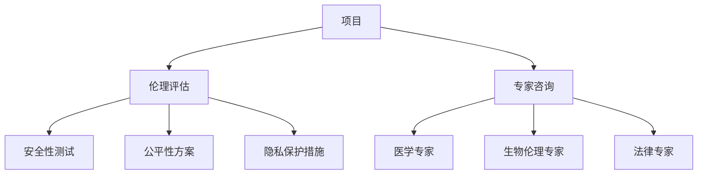
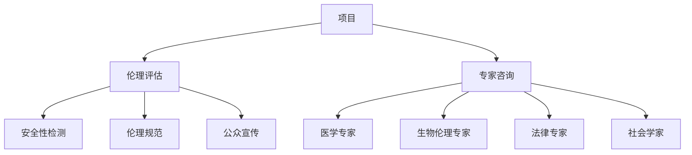
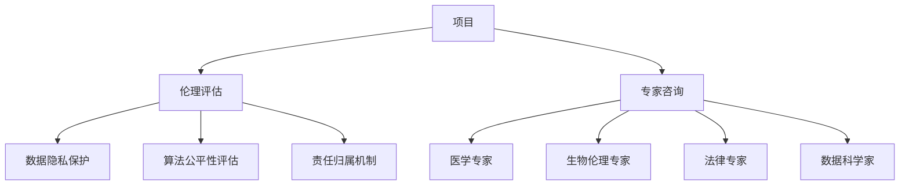

                 

### 引言

随着科技的飞速发展，人工智能、基因编辑、生物技术等前沿领域不断突破，为人类社会带来了前所未有的机遇。然而，这些技术进步也伴随着一系列伦理挑战，如基因编辑可能导致的不公平、克隆技术的伦理争议、医疗人工智能带来的隐私问题等。如何在这些科技发展的同时，确保伦理规范的遵循，成为了亟待解决的问题。

**生物伦理咨询网络**应运而生，它是一个集咨询、教育、支持于一体的即时指导平台，旨在为科技伦理问题提供快速、专业的解决方案。本文将围绕生物伦理咨询网络进行深入探讨，旨在揭示其结构、功能、实现技术、应用案例、发展趋势以及伦理监管等方面的内容。

**关键词**：生物伦理、科技伦理、咨询网络、基因编辑、克隆技术、医疗人工智能

**摘要**：本文首先介绍了生物伦理咨询网络的背景和目的，接着详细阐述了其结构、功能、实现技术等核心内容。通过实际应用案例的剖析，本文展示了生物伦理咨询网络在实际操作中的重要作用。此外，本文还探讨了生物伦理咨询网络的发展趋势和伦理监管问题，为未来的发展方向提供了参考。

### 第1章: 生物伦理咨询网络概述

#### 1.1 生物伦理与科技伦理的关系

生物伦理和科技伦理是两个紧密相连的领域。生物伦理主要关注生物学和医学实践中的道德问题，如人类基因编辑、克隆技术、器官移植等。而科技伦理则更广泛地涵盖了由科技进步带来的各种伦理挑战，包括人工智能、大数据、生物技术等。

生物伦理与科技伦理之间的关系可以从以下几个方面进行理解：

1. **交叉融合**：生物伦理和科技伦理在很多问题上都有重叠，例如基因编辑技术的应用，既涉及生物伦理的问题，也涉及科技伦理的问题。
   
2. **相互影响**：生物伦理问题的解决往往需要科技伦理的支持，反之亦然。例如，在制定基因编辑技术的伦理规范时，需要考虑科技伦理的基本原则，如公正性、自主性和责任。

3. **共同目标**：生物伦理和科技伦理的共同目标都是确保科技进步能够惠及全人类，同时避免其带来的负面影响。

#### 1.2 生物伦理咨询网络的背景

随着科技的发展，伦理问题越来越突出。一方面，科技带来了巨大的社会进步，但另一方面，这些科技进步也可能导致新的伦理困境。例如，基因编辑技术可以让人类在治疗疾病和提升生物性能方面取得突破，但同时也可能引发基因歧视和生物安全等问题。

在这种背景下，生物伦理咨询网络应运而生。它的主要目的是：

1. **提供专业咨询**：为涉及生物伦理问题的科技项目提供专业、权威的咨询服务，确保项目在科技发展的同时，不违反伦理规范。

2. **教育普及**：通过教育和普及，提高公众对生物伦理问题的认识和重视，促进社会对科技伦理的认同。

3. **支持决策**：为政府、企业和科研机构在制定相关政策时提供科学依据和参考。

#### 1.3 生物伦理咨询网络的目的

生物伦理咨询网络的目的是确保科技伦理在科技发展中的贯彻和落实，其主要目的包括：

1. **确保科技伦理**：通过提供专业、权威的咨询，确保科技项目在研发和应用过程中，遵循伦理原则和规范。

2. **促进科技发展**：通过教育和普及，消除公众对科技的误解和恐惧，为科技的发展提供良好的社会环境。

3. **保障人类福祉**：通过咨询和支持，确保科技发展能够真正惠及全人类，同时避免其带来的负面影响。

#### 1.4 生物伦理咨询网络的作用

生物伦理咨询网络在科技伦理领域发挥着至关重要的作用，其主要作用包括：

1. **指导科技项目**：为涉及生物伦理问题的科技项目提供指导，确保项目在研发和应用过程中，不违反伦理规范。

2. **提供决策支持**：为政府、企业和科研机构在制定相关政策时提供科学依据和参考，确保政策制定更加科学、合理。

3. **提升公众意识**：通过教育和普及，提高公众对生物伦理问题的认识和重视，促进社会对科技伦理的认同。

4. **保障人类福祉**：通过咨询和支持，确保科技发展能够真正惠及全人类，同时避免其带来的负面影响。

综上所述，生物伦理咨询网络是一个集咨询、教育、支持于一体的即时指导平台，其目的是确保科技伦理在科技发展中的贯彻和落实，为人类社会的可持续发展提供重要支持。

#### 1.1 生物伦理与科技伦理的关系

生物伦理和科技伦理是两个密不可分的领域，它们之间存在着相互依存和相互影响的关系。生物伦理主要涉及生物学和医学实践中的道德问题，如基因编辑、克隆技术、器官移植等。而科技伦理则更广泛地涵盖了由科技进步带来的各种伦理挑战，包括人工智能、大数据、生物技术等。

首先，生物伦理和科技伦理之间存在交叉融合的现象。许多生物伦理问题，如基因编辑和克隆技术，同时也涉及科技伦理。例如，基因编辑技术的应用不仅需要考虑生物学和医学的道德问题，还需要考虑科技伦理方面的原则，如公正性、自主性和责任。科技伦理为生物伦理问题提供了更广泛的视角和指导原则。

其次，生物伦理和科技伦理相互影响。生物伦理问题的解决往往需要科技伦理的支持。例如，在制定基因编辑技术的伦理规范时，需要考虑科技伦理的基本原则，如公正性、自主性和责任。这些原则有助于确保基因编辑技术的应用不违反伦理规范，同时最大限度地保护人类福祉。反之，科技伦理问题的解决也需要生物伦理的参与。例如，在处理人工智能带来的伦理挑战时，需要考虑人工智能在医学和生物学中的应用，确保其应用符合伦理原则。

此外，生物伦理和科技伦理的共同目标都是确保科技进步能够惠及全人类，同时避免其带来的负面影响。生物伦理关注的是人类在生物医学实践中的道德责任，确保科技发展不会伤害人类的基本权利和尊严。而科技伦理则更广泛地关注科技进步对社会、环境和人类福祉的影响，确保科技发展不会对人类造成不可逆转的损害。

总的来说，生物伦理和科技伦理之间存在着密切的关系。它们相互依存，共同构成了一个完整的伦理框架，为科技进步提供了道德指导。在科技发展的过程中，生物伦理和科技伦理的协同作用有助于确保科技项目在研发和应用过程中，遵循伦理原则，最大限度地保护人类福祉。

#### 1.2 生物伦理咨询网络的背景

生物伦理咨询网络的背景可以从科技伦理问题的不断涌现以及全球化背景下国际合作的需求两方面进行探讨。

首先，科技伦理问题的不断涌现是生物伦理咨询网络产生的直接原因。随着生物技术、人工智能等前沿科技的迅猛发展，越来越多的伦理挑战也随之而来。例如，基因编辑技术的出现引发了关于基因修改的伦理争议，克隆技术的应用则引发了关于生命尊严和身份认同的讨论。这些问题的复杂性不仅超越了单一学科的研究范畴，也超出了单一国家的道德框架，需要全球范围内的伦理专家共同探讨和解决。

其次，全球化背景下的国际合作需求为生物伦理咨询网络的构建提供了必要条件。随着国际交流的日益频繁，科技发展的步伐也在全球范围内加速。各国在科技领域的合作不断加深，但这种合作也带来了新的伦理挑战。例如，跨国生物医学研究、基因数据库的共享以及跨国药品临床试验等，都需要一个统一的伦理标准和规范。生物伦理咨询网络的建立，正是为了满足这种跨国合作中对于统一伦理指导的需求。

具体来说，生物伦理咨询网络的构建背景主要受到以下几个因素的影响：

1. **科技进步带来的伦理挑战**：随着生物技术、人工智能等前沿科技的发展，许多新兴的科技应用引发了新的伦理问题。这些问题包括基因编辑技术可能带来的不公平分配、克隆技术对人类身份的挑战、人工智能在医疗领域的隐私问题等。这些问题的复杂性和紧迫性促使了生物伦理咨询网络的建立。

2. **国际合作的深化**：在全球化的背景下，国际间的科技合作日益密切。跨国科研团队、国际基因数据库的建立以及跨国药品临床试验等，都要求有一个统一的伦理标准和规范。生物伦理咨询网络可以为这些国际合作项目提供专业的伦理咨询，确保项目在遵守各国伦理法规的同时，也符合全球伦理标准。

3. **公众对科技伦理的关注**：随着公众对科技伦理问题的关注度不断提高，社会对生物伦理咨询网络的需求也日益增长。公众希望科技发展能够更加透明、公正，同时也期望科技项目在研发和应用过程中，能够充分考虑伦理问题。生物伦理咨询网络的建立，可以为公众提供专业的伦理指导，增强公众对科技项目的信任。

4. **政府和机构的推动**：许多国家和国际组织意识到科技伦理问题的重要性，开始积极推动生物伦理咨询网络的构建。例如，联合国教科文组织（UNESCO）和世界卫生组织（WHO）等国际组织，已经制定了多项关于生物伦理的指导文件，为生物伦理咨询网络的建立提供了政策支持。

总之，生物伦理咨询网络的背景是由科技进步带来的伦理挑战、国际合作需求的深化、公众对科技伦理的关注以及政府和机构的推动共同构成的。它为科技项目提供了一个专业的伦理指导平台，确保科技发展在遵循伦理规范的同时，能够实现最大的社会价值。

#### 1.3 生物伦理咨询网络的目的

生物伦理咨询网络的目的在于为科技发展提供一个即时、专业的伦理指导平台，以确保科技进步在遵循伦理规范的同时，最大限度地保护人类福祉。具体来说，生物伦理咨询网络的目的包括以下几个方面：

首先，**确保科技伦理**。生物伦理咨询网络的核心任务是为涉及生物伦理问题的科技项目提供专业的伦理咨询。通过评估项目的设计、实施和影响，确保项目在研发和应用过程中，遵循伦理原则和规范。这不仅有助于避免科技项目可能带来的伦理风险，也有助于增强项目的透明度和公信力。

其次，**促进科技发展**。生物伦理咨询网络不仅关注科技项目的伦理风险，也关注科技项目的积极影响。通过提供专业的伦理指导，帮助科技项目克服伦理障碍，实现其潜在的社会价值。生物伦理咨询网络可以为科研机构、企业和政府提供科学、合理的伦理建议，促进科技项目的顺利推进。

第三，**保障人类福祉**。生物伦理咨询网络的目的是确保科技发展能够真正惠及全人类，同时避免其带来的负面影响。通过提供专业的伦理指导，确保科技项目在研发和应用过程中，充分考虑人类福祉，避免科技发展对人类基本权利和尊严的侵犯。

具体来说，生物伦理咨询网络在以下几个方面发挥着重要作用：

1. **项目评估**：为涉及生物伦理问题的科技项目提供全面的伦理评估，确保项目在实施过程中，遵循伦理原则和规范。评估内容包括项目的伦理风险、潜在影响以及应对措施等。

2. **伦理咨询**：为科研机构、企业和政府提供专业的伦理咨询，帮助其解决在科技项目中遇到的伦理问题。咨询内容包括项目设计、实施和影响评估等。

3. **教育培训**：通过教育和培训，提高公众对生物伦理问题的认识和重视，促进社会对科技伦理的认同。教育培训形式包括公开讲座、在线课程、研讨会等。

4. **政策建议**：为政府和国际组织提供关于生物伦理的政策建议，推动制定更加科学、合理的伦理规范。政策建议内容涵盖法律法规、伦理准则、国际合作等方面。

5. **国际合作**：生物伦理咨询网络在国际合作中发挥着桥梁作用，促进各国在生物伦理问题上的交流和协调。通过建立国际合作伙伴关系，共同应对全球性的生物伦理挑战。

总之，生物伦理咨询网络的目的是确保科技发展在遵循伦理规范的同时，最大限度地保护人类福祉。通过提供即时、专业的伦理指导，生物伦理咨询网络为科技项目提供了一个可靠的伦理保障，推动了科技与伦理的协调发展。

#### 1.4 生物伦理咨询网络的作用

生物伦理咨询网络在科技伦理领域发挥着至关重要的作用，其主要作用可以从以下几个方面进行详细阐述：

首先，**指导科技项目**。生物伦理咨询网络为涉及生物伦理问题的科技项目提供全面的伦理指导。通过专业、权威的伦理评估和咨询，确保项目在设计和实施过程中，遵循伦理原则和规范。例如，在基因编辑技术的研究和应用中，生物伦理咨询网络可以评估项目的伦理风险，提供伦理建议，确保项目不违反伦理法规，同时最大限度地保护人类福祉。

其次，**提供决策支持**。生物伦理咨询网络为政府、企业和科研机构在制定相关政策时提供科学依据和参考。通过收集、分析科技伦理问题相关的数据和信息，提供专业的伦理分析和建议，帮助决策者制定更加科学、合理的政策。例如，在制定生物技术相关法规时，生物伦理咨询网络可以为立法机构提供关于伦理风险评估和监管措施的咨询，确保法规的制定能够平衡科技进步和伦理保护。

第三，**提升公众意识**。生物伦理咨询网络通过教育和普及，提高公众对生物伦理问题的认识和重视。通过举办公开讲座、发布科普文章、开展在线课程和研讨会等形式，向公众传播生物伦理知识，消除对科技项目的误解和恐惧，促进社会对科技伦理的认同。例如，针对基因编辑技术的普及教育，可以增强公众对其潜在风险和伦理问题的了解，从而形成更加理性、全面的认识。

第四，**保障人类福祉**。生物伦理咨询网络通过提供即时、专业的伦理指导，确保科技发展在遵循伦理规范的同时，最大限度地保护人类福祉。通过伦理评估和咨询，防止科技项目可能带来的负面影响，确保科技发展不损害人类的基本权利和尊严。例如，在医疗人工智能的应用中，生物伦理咨询网络可以评估其隐私保护问题，提供伦理建议，确保人工智能在医疗领域的应用不会侵犯患者的隐私权。

具体来说，生物伦理咨询网络在实际操作中发挥着以下几方面的作用：

1. **项目评估**：为涉及生物伦理问题的科技项目提供全面的伦理评估，包括项目的伦理风险、潜在影响以及应对措施等。评估结果可以帮助项目团队及时发现问题，采取措施降低伦理风险。

2. **伦理咨询**：为科研机构、企业和政府提供专业的伦理咨询，解决在科技项目中遇到的伦理问题。咨询内容涵盖项目设计、实施和影响评估等各个环节。

3. **教育培训**：通过教育和培训，提高公众对生物伦理问题的认识和重视。教育培训形式包括公开讲座、在线课程、研讨会等，旨在增强公众的伦理意识和素养。

4. **政策建议**：为政府和国际组织提供关于生物伦理的政策建议，推动制定更加科学、合理的伦理规范。政策建议内容涵盖法律法规、伦理准则、国际合作等方面。

5. **国际合作**：生物伦理咨询网络在国际合作中发挥桥梁作用，促进各国在生物伦理问题上的交流和协调。通过建立国际合作伙伴关系，共同应对全球性的生物伦理挑战。

总之，生物伦理咨询网络通过提供专业的伦理指导和支持，为科技项目提供了可靠的伦理保障，推动了科技与伦理的协调发展。其在指导科技项目、提供决策支持、提升公众意识和保障人类福祉等方面的作用，对于构建一个更加公平、公正和可持续的科技发展环境具有重要意义。

#### 1.5 生物伦理咨询网络的组成部分

生物伦理咨询网络由多个关键组成部分构成，这些部分相互协作，共同实现其确保科技伦理的目标。以下是生物伦理咨询网络的主要组成部分及其功能：

**1. 伦理委员会**

伦理委员会是生物伦理咨询网络的核心组成部分，负责对涉及生物伦理问题的科技项目进行伦理评估和审批。伦理委员会通常由医学、生物学、法律、哲学等多个领域的专家组成，他们具备专业的伦理知识和丰富的实践经验，能够全面评估项目的伦理风险和潜在影响。伦理委员会的功能包括：

- **伦理评估**：对科技项目的设计、实施和预期影响进行伦理评估，确保项目符合伦理原则和规范。
- **审批决策**：根据伦理评估结果，对项目是否批准进行决策，并提出改进建议。

**2. 咨询团队**

咨询团队是由各领域专家组成的，他们为生物伦理咨询网络提供专业咨询服务。咨询团队成员通常包括医学专家、生物学家、律师、伦理学家等，他们根据项目需求，提供针对性的伦理咨询。咨询团队的功能包括：

- **技术咨询**：为科技项目提供专业的伦理咨询，帮助项目团队解决在研发和应用过程中遇到的伦理问题。
- **培训与教育**：为公众、科研人员和企业提供生物伦理培训，提高他们的伦理意识和素养。

**3. 数据库与信息资源**

生物伦理咨询网络需要大量的数据和信息资源来支持其工作。数据库和信息系统储存了关于生物伦理问题的最新研究、案例、法规和国际准则等，为伦理评估和咨询提供依据。数据库和信息资源的功能包括：

- **数据存储**：储存关于生物伦理问题的各种数据和信息，包括伦理案例、研究文献、法规文件等。
- **信息共享**：通过互联网平台，实现数据和信息的高效共享，为全球范围内的生物伦理咨询提供支持。

**4. 智能分析系统**

智能分析系统是生物伦理咨询网络的重要组成部分，利用人工智能和大数据技术，对大量生物伦理数据进行分析和处理。智能分析系统可以帮助伦理委员会和咨询团队快速识别和评估科技项目的伦理风险。智能分析系统的功能包括：

- **数据挖掘**：从海量数据中提取有用信息，为伦理评估提供支持。
- **风险评估**：利用机器学习算法，对科技项目的潜在伦理风险进行预测和评估。

**5. 合作与交流平台**

生物伦理咨询网络需要广泛的国际合作和交流，以应对全球性的生物伦理挑战。合作与交流平台为各国伦理专家提供了一个交流和合作的机会，共同探讨生物伦理问题，分享经验和最佳实践。合作与交流平台的功能包括：

- **国际合作**：促进各国在生物伦理问题上的合作，建立国际合作伙伴关系。
- **经验分享**：通过举办国际会议、研讨会和工作坊，促进各国在生物伦理领域的经验分享和知识交流。

通过上述组成部分的协同工作，生物伦理咨询网络能够为科技项目提供全面、专业的伦理指导，确保科技发展在遵循伦理规范的同时，最大限度地保护人类福祉。

#### 1.6 生物伦理咨询网络的工作流程

生物伦理咨询网络的工作流程是一个系统化、标准化的过程，旨在确保科技项目在研发和应用过程中，遵循伦理原则和规范。以下是生物伦理咨询网络的工作流程：

**1. 项目提交**

首先，涉及生物伦理问题的科技项目需要向生物伦理咨询网络提交申请。项目团队需详细描述项目的设计、目标、预期影响以及可能涉及的伦理问题。提交的资料应包括项目报告、研究计划、伦理风险评估等。

**2. 伦理评估**

生物伦理咨询网络的伦理委员会会对提交的项目进行初步评估，确定项目是否符合评估范围。伦理委员会会审查项目的伦理风险和潜在影响，以确保项目在道德和伦理上可行。

**3. 咨询团队评估**

在伦理委员会初步评估通过后，项目会分配给专业的咨询团队。咨询团队会进一步评估项目的伦理问题，并提供具体的伦理咨询建议。咨询团队可能包括医学专家、生物学家、律师、伦理学家等，他们的专业知识和经验将为项目提供全面的伦理指导。

**4. 数据分析**

智能分析系统将对项目相关的数据进行挖掘和分析，以识别潜在的伦理风险。数据分析结果将用于补充伦理评估和咨询，帮助伦理委员会和咨询团队做出更准确的决策。

**5. 伦理审查会议**

伦理委员会和咨询团队会召开会议，综合各方意见，对项目进行最终的伦理审查。会议讨论内容包括项目的伦理风险、潜在影响、咨询团队的建议以及智能分析系统的数据分析结果。最终，会议将决定项目是否通过伦理审查，并提出改进建议。

**6. 项目反馈**

项目团队需要根据伦理审查的结果，对项目进行修改和完善。在完成修改后，项目团队需向生物伦理咨询网络提交反馈报告，详细说明项目的修改情况以及对伦理建议的落实情况。

**7. 持续监督**

生物伦理咨询网络会持续监督已批准项目的进展情况，确保项目在实施过程中，遵循伦理原则和规范。如果发现项目出现新的伦理问题或风险，伦理委员会和咨询团队将及时介入，提供进一步的伦理指导和监督。

通过上述工作流程，生物伦理咨询网络能够确保科技项目在研发和应用过程中，充分考虑伦理问题，最大限度地保护人类福祉，促进科技与伦理的协调发展。

### 第2章: 生物伦理咨询网络的结构与功能

#### 2.1 网络结构

生物伦理咨询网络的结构设计旨在确保其高效、灵活地运行，同时满足不同用户的需求。整体结构可以分为以下几个层次：

**1. 用户界面层**

用户界面层是生物伦理咨询网络与用户互动的入口。用户可以通过网页、移动应用等界面访问咨询网络，提交伦理问题、获取咨询结果、参加在线培训等。用户界面层需要具备简洁友好、易于操作的特点，以满足不同背景和技能水平的用户需求。

**2. 功能服务层**

功能服务层是咨询网络的“核心大脑”，提供各种专业服务，包括伦理评估、咨询、数据分析、教育培训等。功能服务层通过模块化设计，将不同的服务功能独立封装，方便扩展和维护。例如，伦理评估模块可以调用数据库中的伦理案例和法规文件，进行自动化的伦理风险评估。

**3. 数据存储层**

数据存储层负责储存和管理大量的数据资源，包括伦理案例库、法规库、研究成果库、用户数据等。数据存储层采用分布式数据库技术，确保数据的可靠性和安全性。此外，数据存储层还支持数据挖掘和分析，为智能分析系统提供数据支持。

**4. 智能分析层**

智能分析层是咨询网络的高级功能模块，利用人工智能技术对海量数据进行处理和分析。智能分析层可以通过机器学习算法，预测项目的潜在伦理风险，提供个性化的伦理咨询建议。智能分析层的应用包括伦理风险评估、趋势预测、决策支持等。

**5. 合作与交流层**

合作与交流层是咨询网络的国际合作平台，提供跨国界、跨领域的交流与合作机会。通过建立国际合作伙伴关系，咨询网络可以汇集全球范围内的伦理专家和资源，共同应对全球性的生物伦理挑战。合作与交流层还包括在线会议、研讨会、工作坊等互动形式，促进知识和经验的共享。

**6. 管理与安全层**

管理与安全层负责咨询网络的日常运营和维护，包括系统监控、用户管理、权限控制、数据安全等。管理与安全层需要确保系统的稳定性和安全性，防止数据泄露和非法访问。此外，管理与安全层还需要制定严格的伦理规范和操作流程，确保咨询网络在运行过程中的合规性。

**7. 数据接口层**

数据接口层为咨询网络与其他系统之间的数据交换提供支持。例如，咨询网络可以通过API接口与科研机构、企业和政府的数据系统对接，实现数据共享和协同工作。数据接口层的设计需要考虑数据格式、传输协议、数据安全等因素，确保数据的准确性和实时性。

通过上述多层次的结构设计，生物伦理咨询网络能够实现高效、专业的运营，为用户提供全面、可靠的伦理咨询和服务。

#### 2.2 咨询功能

生物伦理咨询网络的咨询功能是其核心组成部分，旨在为用户提供专业、权威的伦理指导。咨询功能可以分为以下几个步骤：

**1. 用户提交问题**

用户可以通过网页、移动应用等多种渠道，向生物伦理咨询网络提交伦理问题。用户提交的问题应包括问题的背景、具体内容、涉及的技术领域等详细信息。为了保证问题的准确性和完整性，用户需要填写必要的调查问卷，并提供相关的背景材料。

**2. 伦理评估**

在用户提交问题后，生物伦理咨询网络的伦理评估团队会对问题进行初步审核。评估团队由医学专家、生物学家、律师、伦理学家等多领域专家组成，他们具备丰富的伦理知识和实践经验。评估团队会对问题的伦理复杂性、涉及的技术风险以及相关法规标准进行分析，确定问题是否在咨询网络的评估范围内。

**3. 咨询分配**

对于符合评估范围的问题，评估团队会将问题分配给合适的咨询团队。咨询团队由专业的伦理咨询师组成，他们根据各自的专业领域，为用户提供针对性的伦理咨询。例如，涉及基因编辑技术的问题会分配给生物伦理咨询团队，涉及人工智能的问题会分配给科技伦理咨询团队。

**4. 咨询分析**

咨询团队在接收到问题后，会进行详细的伦理分析。分析内容包括问题的伦理原则、法规适用性、技术可行性、社会影响等。咨询团队会利用专业的伦理理论和方法，对问题进行深入剖析，并提出初步的伦理建议。

**5. 咨询报告**

在完成分析后，咨询团队会撰写详细的咨询报告，报告内容包括问题的背景、分析过程、伦理建议、参考文献等。咨询报告将发送给用户，并提供给伦理评估团队进行复核。伦理评估团队会根据咨询报告的内容，对咨询建议进行审核，确保其符合伦理原则和法规要求。

**6. 咨询反馈**

用户收到咨询报告后，可以对报告的内容进行反馈。用户可以根据咨询建议，对项目或研究进行调整，确保其符合伦理规范。生物伦理咨询网络会跟踪用户的反馈情况，对咨询报告进行持续改进，以提高咨询服务的质量和准确性。

**7. 持续支持**

生物伦理咨询网络会为用户提供持续的伦理支持，包括定期跟进项目进展、提供后续咨询等。对于复杂的伦理问题，咨询网络会提供定期的专家会议，邀请相关领域的专家进行深入讨论，确保问题得到全面、准确的解决。

通过上述步骤，生物伦理咨询网络能够为用户提供全面、专业的伦理咨询服务，确保科技项目在研发和应用过程中，遵循伦理原则和规范。

#### 2.3 教育功能

生物伦理咨询网络的教育功能是其不可或缺的一部分，旨在通过普及生物伦理知识，提高公众和专业人士对科技伦理问题的认识和素养。教育功能主要包括以下几个环节：

**1. 线上课程**

生物伦理咨询网络提供了一系列线上课程，涵盖基因编辑、克隆技术、医疗人工智能等多个领域的生物伦理问题。这些课程由专业的伦理学家、生物学家、法律专家等授课，课程内容丰富、深入浅出，适合不同层次的学员。学员可以通过在线学习平台，灵活安排学习时间，自主掌握学习进度。

**2. 线下培训**

除了线上课程，生物伦理咨询网络还定期举办线下培训活动，包括工作坊、研讨会、讲座等。这些活动邀请国内外知名的生物伦理专家和学者，就前沿的伦理问题进行深入探讨和交流。线下培训活动不仅能够提高学员的专业素养，还能为他们提供一个与同行交流、学习的机会。

**3. 案例研究**

案例研究是生物伦理咨询网络教育功能的重要组成部分。通过分析真实的伦理案例，学员可以深入了解伦理问题的复杂性，学会如何在实际工作中应对和解决这些问题。案例研究内容包括基因编辑的伦理争议、克隆技术的道德困境、医疗人工智能的隐私问题等，每个案例都配有详细的解析和讨论。

**4. 互动交流**

生物伦理咨询网络鼓励学员之间的互动交流，通过在线论坛、社交媒体等平台，分享学习心得、讨论伦理问题。这种互动交流不仅能够加深学员对生物伦理知识的理解，还能促进学术思想的碰撞和交流。

**5. 资源库建设**

生物伦理咨询网络建设了一个丰富的资源库，包括学术论文、政策法规、伦理案例等。这些资源可供学员免费访问，用于学习和研究。资源库的建立，为学员提供了丰富的学习资料，有助于他们系统地掌握生物伦理知识。

**6. 国际合作**

生物伦理咨询网络积极开展国际合作，与全球范围内的生物伦理机构和研究机构建立合作关系。通过国际合作，生物伦理咨询网络可以引进国际先进的伦理教育理念和资源，为国内学员提供更高水平的培训。

**7. 持续发展**

生物伦理咨询网络注重教育功能的持续发展，定期更新课程内容，引入新的伦理问题和技术。同时，网络还通过调研、反馈机制，了解学员的需求和反馈，不断优化教育服务，提高教育质量。

通过上述教育功能，生物伦理咨询网络不仅为公众和专业人士提供了全面、系统的生物伦理知识，还帮助他们提高了应对科技伦理问题的能力，为科技与伦理的协调发展提供了强有力的支持。

#### 2.4 支持功能

生物伦理咨询网络的支持功能是其重要组成部分，旨在为用户提供全面、专业的技术支持和服务，确保网络高效、稳定地运行。以下是生物伦理咨询网络支持功能的详细描述：

**1. 技术支持**

生物伦理咨询网络提供24小时技术支持服务，确保用户在使用过程中遇到任何技术问题都能得到及时解决。技术支持团队由专业的IT工程师和技术支持人员组成，他们具备丰富的网络系统维护和故障排除经验。用户可以通过电话、在线聊天、电子邮件等多种渠道，获取技术支持服务。技术支持的内容包括：

- **系统故障排除**：对于网络系统出现的故障，技术支持团队会及时诊断和解决，确保系统的正常运行。
- **软件升级与维护**：定期对网络系统进行软件升级和维护，确保系统的安全性和稳定性。
- **技术培训**：为用户和员工提供技术培训，帮助他们熟练掌握系统的使用方法和技巧。

**2. 用户管理**

用户管理是生物伦理咨询网络支持功能的重要组成部分，旨在确保用户信息的准确性和安全性。用户管理包括以下内容：

- **用户注册与认证**：用户可以通过注册账户，访问网络提供的各种服务。注册过程中，用户需要提供真实有效的信息，经过认证后方可使用网络服务。
- **权限管理**：根据用户的不同角色和权限，系统会提供相应的功能和服务。例如，伦理评估专家和咨询团队拥有访问项目数据和撰写咨询报告的权限，而普通用户只能浏览信息和提交问题。
- **用户反馈与投诉处理**：用户可以在系统中提交反馈和投诉，技术支持团队会及时响应，解决用户的问题和困扰。

**3. 数据安全**

数据安全是生物伦理咨询网络运营的基石，网络采取了多种措施确保用户数据和系统数据的保密性和完整性。数据安全措施包括：

- **加密传输**：用户在使用网络服务时，数据会通过加密协议进行传输，防止数据在传输过程中被窃取或篡改。
- **存储安全**：用户数据和系统数据存储在安全的服务器上，采取严格的访问控制和权限管理，确保数据的安全性和保密性。
- **备份与恢复**：定期对用户数据和系统数据进行备份，并在发生数据丢失或系统故障时，能够快速恢复数据，确保网络服务的连续性。

**4. 系统监控**

生物伦理咨询网络通过监控系统，对网络系统的运行状态进行实时监控和故障预警。系统监控包括以下内容：

- **性能监控**：监控系统会实时监测网络系统的性能指标，如响应时间、吞吐量、错误率等，确保系统运行在最佳状态。
- **故障预警**：监控系统会及时发现系统故障或异常，并生成预警信息，技术支持团队会立即响应，处理故障，防止问题扩大。
- **日志分析**：监控系统会记录系统的运行日志，通过日志分析，技术支持团队可以查找故障原因，优化系统性能。

通过上述支持功能，生物伦理咨询网络能够为用户提供可靠的技术支持和服务，确保网络高效、稳定地运行，为用户提供优质的伦理咨询和培训服务。

### 第3章: 生物伦理咨询网络的实现技术

#### 3.1 网络平台搭建

生物伦理咨询网络的实现技术首先依赖于一个高效、稳定、可扩展的网络平台。该平台需要具备以下几个关键特征：

**1. 技术架构**

生物伦理咨询网络的技术架构采用微服务架构，这种架构模式能够提高系统的可扩展性和灵活性。微服务架构将整个系统拆分成多个独立的小服务，每个小服务负责一个特定的功能模块，如用户管理、伦理评估、咨询分析、教育培训等。这种拆分方式使得各个服务可以独立部署、扩展和更新，避免了因为某个模块的问题而影响整个系统。

**2. 技术栈**

生物伦理咨询网络的技术栈包括前端、后端和数据库三个主要部分：

- **前端**：前端使用React.js框架，它具有高效、灵活和响应式设计的特点，可以提供出色的用户体验。前端主要负责用户界面的展示和交互，支持多设备访问。
- **后端**：后端采用Spring Boot框架，这是一种成熟的Java后端框架，支持RESTful API的构建，使得前端可以通过标准的HTTP请求与后端进行数据交互。后端主要负责业务逻辑的处理和数据的存储管理。
- **数据库**：数据库部分使用MySQL和MongoDB，MySQL用于存储结构化数据，如用户信息、项目数据等；MongoDB用于存储非结构化数据，如日志、分析结果等。这种组合能够满足不同类型数据存储的需求，提高系统的数据管理效率。

**3. 安全性**

网络平台的安全性是生物伦理咨询网络实现技术的重要方面。为了确保用户数据和系统数据的安全，平台采取了以下安全措施：

- **数据加密**：用户数据在传输过程中采用HTTPS协议进行加密传输，防止数据在传输过程中被窃取或篡改。存储在数据库中的敏感数据也进行加密处理。
- **权限控制**：系统实现严格的权限控制机制，用户根据角色和权限访问不同的功能和数据。例如，伦理评估专家可以访问项目数据和撰写咨询报告，而普通用户只能浏览信息和提交问题。
- **防火墙和入侵检测**：平台部署了防火墙和入侵检测系统，实时监控网络流量，防止非法访问和攻击。

**4. 可扩展性**

生物伦理咨询网络需要具备良好的可扩展性，以应对用户数量的增长和功能需求的扩展。为了实现这一点，平台采用以下技术：

- **负载均衡**：通过负载均衡器，将用户请求分配到多个服务器上，确保系统的性能和稳定性。当用户数量增加时，可以轻松增加服务器数量，提高系统的处理能力。
- **容器化**：使用Docker等容器化技术，将服务打包成容器，实现快速部署和扩展。容器化服务可以在不同环境中无缝迁移，提高了系统的灵活性和可维护性。

通过上述技术实现，生物伦理咨询网络搭建了一个高效、稳定、安全、可扩展的网络平台，为用户提供优质的伦理咨询和培训服务。

#### 3.2 数据管理

生物伦理咨询网络的数据管理是其核心实现技术之一，确保数据的高效存储、处理和分析至关重要。以下是数据管理的具体实现方法：

**1. 数据模型设计**

生物伦理咨询网络采用了关系型数据库（如MySQL）和非关系型数据库（如MongoDB）相结合的方式，以满足不同类型数据的管理需求。

- **用户数据**：用户数据包括用户注册信息、权限信息等，使用关系型数据库进行存储。每个用户对应一张用户表，字段包括用户ID、用户名、密码、邮箱、注册时间等。
- **项目数据**：项目数据包括项目基本信息、伦理风险评估、咨询报告等，使用非关系型数据库进行存储。每个项目对应一个文档，文档中包含项目ID、项目名称、项目描述、项目状态、相关文档链接等。

**2. 数据存储**

- **关系型数据库**：关系型数据库用于存储结构化数据，如用户信息和项目数据。MySQL数据库提供了强大的查询能力和事务支持，确保数据的一致性和完整性。
- **非关系型数据库**：非关系型数据库用于存储非结构化数据，如日志、分析结果等。MongoDB数据库提供了灵活的文档存储方式，支持海量数据的高效存储和查询。

**3. 数据处理**

数据处理是数据管理的重要组成部分，生物伦理咨询网络采用了以下方法：

- **批量处理**：对于大量数据的导入、更新和删除操作，使用批量处理技术，提高数据处理效率。例如，使用Spring Boot框架的JDBC模板，批量插入用户数据。
- **实时处理**：对于实时数据，如用户提交的问题、系统的性能监控数据等，采用消息队列技术，如Kafka，实现数据的实时处理和分发。

**4. 数据分析**

数据分析是生物伦理咨询网络的重要功能，通过数据分析，可以为用户提供个性化的伦理建议和决策支持。

- **数据分析平台**：搭建数据分析平台，使用大数据技术，如Hadoop和Spark，对海量数据进行分析和处理。数据分析平台支持数据挖掘、机器学习等多种分析算法。
- **数据可视化**：使用数据可视化工具，如Tableau和ECharts，将分析结果以图表形式展示，帮助用户直观地理解数据。

**5. 数据安全**

数据安全是数据管理的重中之重，生物伦理咨询网络采取了以下措施：

- **数据加密**：对敏感数据进行加密处理，如用户密码、项目数据等，确保数据在存储和传输过程中的安全。
- **权限控制**：实现严格的权限控制机制，不同角色的用户只能访问相应的数据和功能，防止数据泄露和误操作。
- **备份与恢复**：定期进行数据备份，确保数据在发生故障或灾难时能够快速恢复。

通过上述数据管理方法，生物伦理咨询网络能够高效、安全地管理海量数据，为用户提供专业的伦理咨询和决策支持。

#### 3.3 交互设计

生物伦理咨询网络的交互设计是其用户体验的关键要素之一，旨在为用户提供直观、便捷的操作体验。以下是交互设计的具体实现方法：

**1. 界面设计**

界面设计遵循简洁、直观的原则，确保用户能够快速理解和使用系统功能。具体包括：

- **布局合理**：将重要功能模块合理布局在页面顶部或导航栏，使用户能够快速找到所需功能。
- **清晰标签**：使用明确、简洁的标签，标识各个功能按钮和操作项，避免用户混淆和误操作。
- **响应式设计**：采用响应式设计，确保系统在不同设备上都能提供良好的用户体验。例如，在移动设备上，界面会自动调整布局，适应屏幕大小。

**2. 用户操作流程**

用户操作流程设计力求简洁明了，减少用户的学习成本。具体包括：

- **注册与登录**：用户可以通过注册账户或使用第三方账号（如Google、Facebook等）快速登录系统。注册过程中，用户需要填写必要的信息，并通过验证码进行身份验证。
- **问题提交**：用户可以通过提交表单，提交伦理问题。表单包含问题分类、问题描述、联系人信息等字段，确保问题信息的完整性。
- **咨询结果查看**：提交问题后，用户可以在个人中心查看咨询结果。系统会自动将咨询报告发送到用户的邮箱，并提供在线查看功能。

**3. 交互反馈**

交互反馈设计旨在及时响应用户操作，增强用户的操作体验。具体包括：

- **即时响应**：系统对用户的操作进行实时响应，例如，用户提交问题后，系统会立即显示“问题提交成功”的提示信息。
- **错误提示**：系统在用户操作错误时，会提供清晰的错误提示，说明错误的性质和解决方法。
- **成功提示**：在用户完成重要操作后，如提交问题、修改信息等，系统会显示“操作成功”的提示信息，增强用户的自信心。

**4. 个性化设置**

个性化设置设计旨在满足用户的个性化需求，提高用户体验。具体包括：

- **偏好设置**：用户可以根据个人喜好，自定义界面布局、主题颜色、通知方式等。
- **个性化推荐**：系统会根据用户的历史操作和咨询记录，推荐相关的伦理案例、培训课程等，提高用户的参与度和满意度。

通过上述交互设计方法，生物伦理咨询网络能够为用户提供高效、便捷的操作体验，增强用户对系统的认可和信任。

#### 3.4 安全性与隐私保护

生物伦理咨询网络的安全性与隐私保护是确保其稳定运行和用户信任的基础，必须采取多层次、多角度的安全措施。以下是生物伦理咨询网络在安全性与隐私保护方面的具体实现方法：

**1. 数据安全**

- **加密传输**：用户数据在传输过程中采用HTTPS协议进行加密传输，确保数据在传输过程中的安全性。同时，存储在数据库中的敏感数据（如用户密码、项目数据等）也进行加密处理，防止数据泄露。
- **数据备份**：定期进行数据备份，确保在数据丢失或系统故障时，能够快速恢复数据。备份策略包括本地备份和远程备份，保证数据的多重冗余。
- **访问控制**：实现严格的权限控制机制，根据用户角色和权限，控制用户对数据和功能的访问。例如，伦理评估专家可以访问项目数据和撰写咨询报告，而普通用户只能浏览信息和提交问题。

**2. 系统安全**

- **防火墙和入侵检测**：部署防火墙和入侵检测系统，实时监控网络流量，防止非法访问和攻击。防火墙设置合理的规则，允许必要的网络通信，同时阻止恶意流量。
- **漏洞扫描与修复**：定期进行系统漏洞扫描，发现潜在的安全漏洞，及时进行修复。使用漏洞扫描工具，如Nessus和OpenVAS，对系统进行全面的安全检查。
- **安全审计**：定期进行安全审计，检查系统的安全配置和操作记录，确保系统的合规性和安全性。

**3. 隐私保护**

- **隐私政策**：制定详细的隐私政策，明确用户数据的收集、使用、存储和分享规则，确保用户对个人隐私有清晰的了解。
- **匿名化处理**：在收集用户数据时，对敏感信息进行匿名化处理，如用户姓名、地址等，确保用户身份的隐私保护。
- **数据访问日志**：记录用户数据的访问日志，包括访问时间、访问者信息、访问内容等，以便在发生隐私泄露时，能够迅速追踪和解决问题。
- **用户同意**：在收集用户数据前，获取用户的明确同意。用户可以选择是否提供某些敏感信息，并在需要时，可以随时修改或删除个人数据。

**4. 敏感数据处理**

- **敏感数据加密**：对敏感数据进行加密处理，如用户密码、项目数据等。加密算法采用国际标准的加密算法，如AES和RSA，确保数据在存储和传输过程中的安全性。
- **访问权限控制**：实现严格的访问权限控制，只有经过授权的用户和系统管理员才能访问敏感数据。访问权限根据用户的角色和职责进行分配，确保敏感数据的安全。

通过上述安全性与隐私保护措施，生物伦理咨询网络能够为用户提供一个安全、可靠的服务环境，确保用户数据的安全和隐私得到充分保护。

### 第4章: 生物伦理咨询网络的应用案例

#### 4.1 案例一：基因编辑咨询

基因编辑技术，如CRISPR-Cas9，近年来在医学、农业和生物研究中取得了显著进展，但其应用也引发了一系列伦理争议。生物伦理咨询网络在处理基因编辑咨询方面，发挥了重要作用，确保技术发展遵循伦理原则。

**背景介绍**：一个医学研究团队计划利用CRISPR-Cas9技术治疗一种遗传性疾病。该疾病影响患者的肌肉功能，可能导致严重的健康问题。研究团队希望通过基因编辑，修复患者的特定基因缺陷，从而改善病情。

**问题描述**：研究团队在项目初期，面临以下几个伦理问题：
1. **安全性**：基因编辑技术的长期安全性尚未得到充分验证，可能存在潜在的风险。
2. **公平性**：治疗资源有限，如何确保治疗机会的公平分配。
3. **隐私保护**：涉及患者基因信息的保护，防止数据泄露。

**问题解决**：生物伦理咨询网络介入，通过以下步骤提供伦理指导：

1. **伦理评估**：伦理委员会对项目进行初步评估，审查项目的伦理风险和潜在影响。评估内容包括基因编辑技术的安全性、治疗方案的公平性和患者的隐私保护措施。

2. **专家咨询**：伦理委员会邀请医学、生物伦理、法律等领域的专家，进行详细的伦理讨论。专家们提出了一系列改进措施，如加强基因编辑技术的安全检测、制定公平的治疗分配方案、加强患者隐私保护。

3. **修改方案**：研究团队根据伦理咨询的建议，修改研究方案。具体措施包括：
   - **安全性测试**：在临床试验前，进行更加严格的基因编辑技术安全性测试，确保技术稳定可靠。
   - **公平性方案**：制定透明的治疗分配机制，确保所有符合条件的患者都有机会接受治疗。
   - **隐私保护措施**：加强对患者基因数据的保护，采取加密存储和访问控制措施。

**边界与外延**：该案例主要涉及基因编辑技术的伦理问题，但可以扩展到其他生物技术的应用。例如，在农业领域，基因编辑可以用于培育抗病、高产作物，但其应用也引发关于生态安全和食品安全等方面的伦理争议。

**概念结构与核心要素组成**：

- **概念结构**：伦理评估、专家咨询、修改方案。
- **核心要素**：安全性、公平性、隐私保护。

**ER实体关系图架构**：

#### 4.2 案例二：克隆技术咨询

克隆技术在医学和生物研究领域具有重要意义，但也引发了伦理争议。生物伦理咨询网络在处理克隆技术咨询时，提供了重要的伦理指导，确保技术发展遵循伦理原则。

**背景介绍**：一个科研团队计划利用体细胞克隆技术，研究克隆技术在器官移植和基因修复方面的应用。克隆技术可以通过体细胞核移植，复制出与捐赠者基因相同的器官，从而解决器官短缺问题。

**问题描述**：科研团队在项目初期，面临以下几个伦理问题：
1. **伦理道德**：克隆技术的应用可能引发关于生命尊严和身份认同的伦理争议。
2. **安全风险**：克隆技术可能带来未知的安全风险，影响人类健康。
3. **社会接受度**：社会对克隆技术的接受程度不高，可能引发公众恐慌。

**问题解决**：生物伦理咨询网络介入，通过以下步骤提供伦理指导：

1. **伦理评估**：伦理委员会对项目进行初步评估，审查项目的伦理风险和潜在影响。评估内容包括克隆技术的安全性、伦理道德问题以及社会接受度。

2. **专家咨询**：伦理委员会邀请医学、生物伦理、法律、社会学等领域的专家，进行详细的伦理讨论。专家们提出了一系列改进措施，如加强安全检测、完善伦理规范、加强公众宣传。

3. **修改方案**：科研团队根据伦理咨询的建议，修改研究方案。具体措施包括：
   - **安全性检测**：在临床试验前，进行全面的克隆技术安全性检测，确保技术稳定可靠。
   - **伦理规范**：制定详细的伦理规范，明确克隆技术的应用范围和限制，确保技术发展遵循伦理原则。
   - **公众宣传**：加强公众宣传，提高社会对克隆技术的认知和理解，减少公众恐慌。

**边界与外延**：该案例主要涉及克隆技术的伦理问题，但可以扩展到其他生物技术的应用，如基因编辑、基因治疗等。这些技术的应用也面临类似的伦理争议，需要生物伦理咨询网络的指导。

**概念结构与核心要素组成**：

- **概念结构**：伦理评估、专家咨询、修改方案。
- **核心要素**：伦理道德、安全风险、社会接受度。

**ER实体关系图架构**：

#### 4.3 案例三：医疗人工智能咨询

医疗人工智能技术在提高诊断准确率、优化治疗方案等方面具有巨大潜力，但其应用也引发了一系列伦理问题。生物伦理咨询网络在处理医疗人工智能咨询时，提供了重要的伦理指导，确保技术发展遵循伦理原则。

**背景介绍**：一个医疗机构计划引入人工智能系统，用于辅助诊断和治疗。该系统能够分析大量医疗数据，提供诊断建议和治疗方案。然而，该技术的引入引发了关于数据隐私、算法公平性和责任归属等方面的伦理争议。

**问题描述**：医疗机构在项目初期，面临以下几个伦理问题：
1. **数据隐私**：人工智能系统需要处理大量患者数据，如何保护患者隐私成为关键问题。
2. **算法公平性**：人工智能系统的算法可能存在偏见，影响诊断和治疗的公平性。
3. **责任归属**：在人工智能系统提供诊断建议时，如果出现误诊，责任应如何归属。

**问题解决**：生物伦理咨询网络介入，通过以下步骤提供伦理指导：

1. **伦理评估**：伦理委员会对项目进行初步评估，审查项目的伦理风险和潜在影响。评估内容包括数据隐私、算法公平性和责任归属。

2. **专家咨询**：伦理委员会邀请医学、生物伦理、法律、数据科学等领域的专家，进行详细的伦理讨论。专家们提出了一系列改进措施，如加强数据隐私保护、完善算法公平性评估机制、明确责任归属。

3. **修改方案**：医疗机构根据伦理咨询的建议，修改研究方案。具体措施包括：
   - **数据隐私保护**：加强患者数据保护，采取数据加密和访问控制措施，确保患者隐私安全。
   - **算法公平性评估**：定期对人工智能系统的算法进行公平性评估，确保系统在诊断和治疗中不会产生偏见。
   - **责任归属机制**：制定明确的责任归属机制，明确在人工智能系统提供诊断建议时，各方的责任和权利。

**边界与外延**：该案例主要涉及医疗人工智能技术的伦理问题，但可以扩展到其他人工智能技术的应用。例如，在金融、交通等领域，人工智能技术的应用也面临类似的伦理问题，需要生物伦理咨询网络的指导。

**概念结构与核心要素组成**：

- **概念结构**：伦理评估、专家咨询、修改方案。
- **核心要素**：数据隐私、算法公平性、责任归属。

**ER实体关系图架构**：

### 第5章: 生物伦理咨询网络的发展趋势

#### 5.1 技术发展趋势

随着人工智能、大数据和区块链等新兴技术的不断发展，生物伦理咨询网络在实现技术方面也将迎来新的机遇和挑战。以下是对这些技术发展趋势的探讨：

**1. 人工智能**

人工智能（AI）技术的发展为生物伦理咨询网络带来了巨大的潜力。通过AI技术，咨询网络可以实现更加智能化的伦理评估和咨询。例如，AI算法可以自动分析大量的伦理案例和法规文件，提供实时、准确的伦理建议。此外，AI还可以用于数据挖掘和趋势预测，帮助伦理专家更全面地了解科技伦理的发展动态。

**2. 大数据**

大数据技术的发展为生物伦理咨询网络提供了丰富的数据资源。通过收集和分析大量的医疗、法律和社会数据，咨询网络可以更好地理解科技伦理问题的复杂性和多样性。大数据技术可以帮助伦理专家发现潜在的风险和趋势，从而制定更加科学、合理的伦理规范和决策。

**3. 区块链**

区块链技术的特点包括去中心化、透明性和不可篡改性，这些特性使其在生物伦理咨询网络中具有巨大的应用潜力。通过区块链，咨询网络可以实现数据的可信存储和共享，确保用户数据的隐私和安全。此外，区块链还可以用于建立可信的伦理审查和审计机制，提高咨询网络的可信度和透明度。

**4. 量子计算**

量子计算技术的发展为生物伦理咨询网络提供了新的计算能力。量子计算可以处理大规模的复杂数据集，加速伦理评估和咨询过程。例如，量子计算可以用于模拟和预测基因编辑技术的长期影响，帮助伦理专家做出更加准确的决策。

**5. 虚拟现实与增强现实**

虚拟现实（VR）和增强现实（AR）技术的发展为生物伦理咨询网络的教育功能提供了新的方式。通过VR和AR技术，咨询网络可以创建逼真的伦理场景，帮助用户更直观地了解伦理问题。例如，通过VR技术，用户可以模拟基因编辑手术的过程，了解其中的伦理风险和挑战。

**6. 5G网络**

5G网络的快速发展为生物伦理咨询网络提供了高速、稳定的网络连接。通过5G网络，咨询网络可以实现实时、高效的通信和数据传输，提高用户的使用体验。此外，5G网络的高带宽和低延迟特性，为远程伦理咨询和协作提供了更好的支持。

**7. 聊天机器人和虚拟助手**

聊天机器人和虚拟助手技术的发展为生物伦理咨询网络提供了新的交互方式。通过聊天机器人，用户可以随时随地获取伦理咨询和帮助，提高咨询网络的便捷性和可达性。虚拟助手则可以辅助伦理专家处理大量的日常事务，提高工作效率。

通过上述技术发展趋势，生物伦理咨询网络将不断提升其智能化、自动化和高效化的水平，为科技伦理问题提供更加专业、全面的解决方案。

#### 5.2 社会伦理问题

随着生物技术和人工智能等前沿科技的不断发展，社会伦理问题也日益凸显，对生物伦理咨询网络提出了新的挑战。以下是对这些社会伦理问题的探讨：

**1. 基因编辑的伦理争议**

基因编辑技术，如CRISPR-Cas9，在医学和生物研究领域取得了显著进展。然而，其应用也引发了一系列伦理争议。首先，基因编辑可能带来不可预见的副作用和长期影响，对人体健康构成潜在风险。其次，基因编辑可能导致基因歧视和生物安全等问题。例如，通过基因编辑，某些人可能会获得超越常人的能力，引发社会不平等。此外，基因编辑还可能影响人类遗传多样性，对生态系统造成不可逆转的影响。

**2. 克隆技术的伦理问题**

克隆技术在医学和生物研究领域具有重要意义，但其应用也引发了许多伦理问题。首先，克隆技术的伦理争议主要集中在生命尊严和身份认同上。通过体细胞克隆技术，人类可以复制出与捐赠者基因相同的器官，但其道德合法性受到质疑。其次，克隆技术可能引发伦理和法律问题，例如如何界定克隆个体与捐赠者的权利和义务。此外，克隆技术还可能引发社会伦理问题，如对传统家庭结构和社会伦理观念的冲击。

**3. 医疗人工智能的隐私问题**

医疗人工智能技术在提高诊断准确率和优化治疗方案方面具有巨大潜力，但其应用也引发了一系列隐私问题。首先，医疗人工智能系统需要处理大量的患者数据，如何保护患者隐私成为关键问题。例如，患者数据可能被未经授权的第三方访问或滥用，导致隐私泄露。其次，医疗人工智能系统的算法可能存在偏见，影响诊断和治疗的公平性。此外，医疗人工智能系统的透明度和可解释性也受到质疑，用户难以理解算法的决策过程，可能导致信任危机。

**4. 生物技术伦理问题**

随着生物技术的发展，如基因编辑、基因治疗和生物制造等，也引发了一系列伦理问题。例如，基因编辑可能导致基因歧视和生物安全等问题。基因治疗可能引发伦理争议，如基因修改的合法性、道德责任和隐私保护等。生物制造可能引发关于生态安全和食品安全等方面的伦理争议。例如，通过生物制造，人类可以生产出前所未有的生物材料，但其应用可能对生态环境造成潜在影响。

**5. 科技伦理与法律监管**

科技伦理问题的复杂性不仅需要道德上的讨论，也需要法律上的监管。例如，如何制定合理的法律法规来规范基因编辑、克隆技术和医疗人工智能等生物技术领域的行为。法律监管需要平衡科技发展的利益和伦理保护的需求，确保科技进步不会对人类福祉和社会秩序造成负面影响。

总之，随着科技的发展，社会伦理问题日益凸显，对生物伦理咨询网络提出了新的挑战。生物伦理咨询网络需要不断适应和应对这些伦理问题，为科技项目提供专业、全面的伦理指导，确保科技发展在遵循伦理规范的同时，最大限度地保护人类福祉。

#### 5.3 国际合作

在国际合作方面，生物伦理咨询网络发挥着桥梁作用，促进全球范围内的生物伦理交流与合作。以下是对国际合作的重要性和具体合作的探讨：

**1. 国际合作的重要性**

随着生物技术和人工智能等前沿科技在全球范围内的快速发展，国际间的生物伦理问题也日益突出。各国在科技领域的合作日益加深，如何在全球范围内协调和统一生物伦理规范，成为亟待解决的问题。国际合作的重要性主要体现在以下几个方面：

- **知识共享**：通过国际合作，各国可以分享生物伦理领域的最新研究成果和实践经验，促进知识的传播和交流，提高全球生物伦理研究的整体水平。
- **规范统一**：国际合作有助于制定和推广统一的生物伦理规范，确保各国在生物技术和人工智能等领域的研发和应用过程中，遵循共同的伦理原则和标准，减少跨国界伦理冲突。
- **政策协调**：国际合作可以促进各国政府在生物伦理政策制定和实施方面的协调，确保政策的一致性和连贯性，提高政策的科学性和有效性。
- **共同应对全球性挑战**：全球性的生物伦理问题，如基因编辑、克隆技术和医疗人工智能等，需要国际社会的共同关注和合作。通过国际合作，各国可以共同应对这些全球性挑战，确保科技进步在遵循伦理规范的同时，最大限度地保护人类福祉。

**2. 具体国际合作**

生物伦理咨询网络在国际合作方面采取了多种形式，以促进全球生物伦理交流与合作。以下是几个具体的国际合作案例：

- **国际会议和研讨会**：生物伦理咨询网络定期举办国际会议和研讨会，邀请来自世界各地的生物伦理专家、法律专家和政府代表共同讨论全球性的生物伦理问题。这些会议和研讨会为各方提供了一个交流平台，促进了国际间的思想碰撞和合作。
- **国际合作项目**：生物伦理咨询网络积极参与国际生物伦理合作项目，如国际基因编辑伦理委员会（IGEC）和全球生物伦理研究网络（GBERN）等。通过这些合作项目，各国可以共同开展生物伦理研究，制定和推广统一的伦理规范。
- **政策咨询和培训**：生物伦理咨询网络为各国政府和国际组织提供生物伦理政策咨询和培训服务，帮助他们提高生物伦理意识和能力，确保在科技项目中能够充分考虑伦理问题。
- **技术交流与转移**：生物伦理咨询网络通过技术交流和转移，促进各国在生物技术和人工智能等领域的合作。例如，通过引进国际先进的技术和设备，帮助发展中国家提升生物伦理咨询和服务水平。

**3. 合作挑战与未来展望**

尽管国际合作在生物伦理领域具有重要意义，但也面临一些挑战：

- **文化差异**：不同国家和地区在伦理观念、法律制度和文化背景方面存在差异，这可能导致国际合作中的误解和冲突。生物伦理咨询网络需要通过加强交流和培训，促进各国在伦理观念上的共识和协调。
- **资源分配**：国际合作中，如何合理分配资源，确保各方在合作中的利益平衡，是一个重要问题。生物伦理咨询网络需要建立公平的资源分配机制，确保合作项目的顺利进行。
- **技术安全**：国际合作中的技术转移和共享，需要确保技术安全，防止技术被滥用或误用。生物伦理咨询网络需要制定严格的技术安全和保密措施，保障合作过程中的技术安全。

未来，随着生物技术和人工智能等领域的快速发展，生物伦理咨询网络在国际合作方面的作用将更加重要。生物伦理咨询网络需要继续加强国际合作，促进全球生物伦理交流与合作，共同应对全球性的生物伦理挑战，确保科技发展在遵循伦理规范的同时，最大限度地保护人类福祉。

### 第6章: 生物伦理咨询网络的伦理监管

#### 6.1 监管机制

生物伦理咨询网络的伦理监管机制是确保其有效运作和合规性的关键。以下是对该机制的具体构建和运行方式的探讨：

**1. 法规框架**

生物伦理咨询网络的伦理监管机制首先依赖于一套完善的法规框架。这些法规包括国内和国际层面的生物伦理法律、法规和标准。例如，国际上的《生物伦理学和生物安全指南》和《人类基因组编辑的国际原则》等，为生物伦理咨询网络的监管提供了基础。国内则需参照《中华人民共和国生物安全法》、《医疗机构管理条例》等相关法律法规，制定具体的操作规范。

**2. 独立监管机构**

为了确保生物伦理咨询网络的独立性和公正性，通常需要设立独立的监管机构。这些机构由政府或专业组织设立，拥有独立的监管权力和资源。独立监管机构负责对生物伦理咨询网络进行监督和评估，确保其遵循相关法规和伦理原则。独立监管机构的具体职责包括：

- **审批和认证**：对生物伦理咨询网络的项目进行审批和认证，确保项目符合伦理规范。
- **监督和审计**：定期对生物伦理咨询网络的运营进行监督和审计，确保其合规性和透明度。
- **投诉处理**：处理公众对生物伦理咨询网络的投诉，确保其能够及时、公正地解决伦理问题。

**3. 内部监管**

生物伦理咨询网络内部也需建立一套有效的监管机制，以确保其日常运营符合伦理原则。内部监管包括：

- **伦理委员会**：设立伦理委员会，负责对涉及生物伦理问题的项目进行评估和审批。伦理委员会由多学科专家组成，确保评估的全面性和专业性。
- **合规培训**：对工作人员进行定期伦理和合规培训，提高其伦理意识和专业能力。
- **内部审计**：定期进行内部审计，检查生物伦理咨询网络的运营是否符合相关法规和伦理规范。

**4. 合作与协调**

生物伦理咨询网络的监管机制还需与其他相关机构和组织进行合作与协调。这包括：

- **政府部门**：与卫生、科技、教育等政府部门合作，确保生物伦理咨询网络的政策和法规得到有效执行。
- **科研机构**：与科研机构和大学合作，共同开展生物伦理研究，提供科学依据和参考。
- **国际组织**：与国际组织合作，参与国际生物伦理交流和合作，借鉴国际先进经验。

通过上述监管机制，生物伦理咨询网络能够确保其运营符合伦理原则和法律法规，为科技项目提供可靠的伦理保障。

#### 6.2 法律法规

生物伦理咨询网络的法律法规体系是其有效运作的基础，确保其遵循伦理原则和规范。以下是对相关法律法规的详细分析和实施方法：

**1. 法律法规概述**

生物伦理咨询网络涉及的法律法规主要包括国内和国际层面的生物伦理法律、法规和标准。国内法规如《中华人民共和国生物安全法》、《医疗机构管理条例》、《人类遗传资源管理暂行办法》等，对生物伦理咨询网络的运营提供了基本法律框架。国际法规如《生物伦理学和生物安全指南》、《国际人类基因组编辑伦理原则》等，为生物伦理咨询网络提供了全球性的伦理标准。

**2. 国内法律法规**

国内法律法规对生物伦理咨询网络的监管主要体现在以下几个方面：

- **生物安全法**：作为我国生物伦理和生物安全的基本法，规定了生物技术研究和应用的基本原则和监管要求，如对基因编辑、克隆技术等高风险生物技术的审批和管理。
- **医疗机构管理条例**：明确医疗机构在生物伦理咨询方面的职责，要求医疗机构建立健全生物伦理审查制度，确保医疗行为的合法性和伦理性。
- **人类遗传资源管理暂行办法**：规定了人类遗传资源的采集、利用和分享的伦理要求和监管措施，确保人类遗传资源的合法和安全使用。

**3. 国际法律法规**

国际法律法规为生物伦理咨询网络提供了全球性的伦理标准，确保其在跨国合作中的合法性和伦理性。例如：

- **《生物伦理学和生物安全指南》**：由联合国教科文组织制定，为全球生物伦理和生物安全提供了基本原则和操作指南，如尊重人类尊严、公正性、自主性等。
- **《国际人类基因组编辑伦理原则》**：由国际人类基因组编辑伦理委员会制定，明确了人类基因组编辑的伦理原则，如限制人类胚胎编辑、禁止生殖细胞编辑等。

**4. 法律法规的实施方法**

为了确保生物伦理咨询网络遵循相关法律法规，需要采取以下实施方法：

- **建立法规培训机制**：定期对工作人员进行法律法规培训，提高其对生物伦理和生物安全法律法规的了解和遵守能力。
- **完善审查制度**：建立完善的生物伦理审查制度，对涉及生物伦理问题的项目进行严格审查，确保符合法律法规要求。
- **加强监督和审计**：对生物伦理咨询网络的运营进行定期监督和审计，确保其遵守相关法律法规，及时发现和纠正违规行为。
- **国际合作与协调**：积极参与国际生物伦理合作，借鉴国际先进经验，制定和推广符合国际标准的法律法规。

通过上述法律法规的分析和实施方法，生物伦理咨询网络能够确保其运营在法律法规的框架内，为科技项目提供可靠的伦理保障。

#### 6.3 国际合作与协调

在国际合作与协调方面，生物伦理咨询网络发挥着至关重要的作用。以下是对国际合作与协调的重要性、合作模式以及面临挑战的探讨：

**1. 重要性**

国际合作与协调在生物伦理领域具有重要意义。首先，生物伦理问题往往具有跨国性，涉及多个国家和地区的利益。通过国际合作与协调，可以制定统一的生物伦理标准和规范，确保各国在生物技术和人工智能等领域的研发和应用过程中，遵循共同的伦理原则。其次，国际合作有助于知识共享和资源优化，各国可以共同开展生物伦理研究，提高全球生物伦理研究的整体水平。此外，国际合作还可以促进各国在生物伦理教育和培训方面的合作，提高公众对生物伦理问题的认识和重视。

**2. 合作模式**

生物伦理咨询网络在国际合作方面采取了多种模式，以实现全球范围内的生物伦理协调与合作。以下是几种常见的合作模式：

- **国际会议和研讨会**：通过定期举办国际会议和研讨会，邀请来自世界各地的生物伦理专家、政府代表和科研人员，共同讨论全球性的生物伦理问题，促进国际间的思想交流和合作。
- **国际合作项目**：参与和发起国际生物伦理合作项目，如国际基因编辑伦理委员会（IGEC）和全球生物伦理研究网络（GBERN）等，共同开展生物伦理研究，制定和推广统一的伦理规范。
- **政策咨询和培训**：为各国政府和国际组织提供生物伦理政策咨询和培训服务，帮助他们提高生物伦理意识和能力，确保在科技项目中能够充分考虑伦理问题。
- **技术交流和转移**：促进各国在生物技术和人工智能等领域的合作，通过技术交流和转移，帮助发展中国家提升生物伦理咨询和服务水平。

**3. 合作挑战**

尽管国际合作在生物伦理领域具有重要意义，但也面临一些挑战：

- **文化差异**：不同国家和地区在伦理观念、法律制度和文化背景方面存在差异，这可能导致国际合作中的误解和冲突。生物伦理咨询网络需要通过加强交流和培训，促进各国在伦理观念上的共识和协调。
- **资源分配**：国际合作中，如何合理分配资源，确保各方在合作中的利益平衡，是一个重要问题。生物伦理咨询网络需要建立公平的资源分配机制，确保合作项目的顺利进行。
- **技术安全**：国际合作中的技术转移和共享，需要确保技术安全，防止技术被滥用或误用。生物伦理咨询网络需要制定严格的技术安全和保密措施，保障合作过程中的技术安全。

通过国际合作与协调，生物伦理咨询网络能够更好地应对全球性的生物伦理挑战，为科技发展提供可靠的伦理保障。

### 第7章: 生物伦理咨询网络的未来展望

#### 7.1 潜在挑战

尽管生物伦理咨询网络在科技伦理领域取得了显著成果，但未来的发展仍面临一系列潜在挑战：

**1. 技术复杂性增加**

随着生物技术和人工智能等领域的快速发展，伦理问题变得更加复杂和多样。新的技术进步可能会带来前所未有的伦理挑战，例如基因编辑、人工智能伦理、生物制造等。这些技术的复杂性和不确定性，使得生物伦理咨询网络在提供指导时面临更大的困难。

**2. 法律法规滞后**

生物伦理问题的快速发展可能导致相关法律法规的滞后。现有的法律法规可能无法全面覆盖新兴技术的伦理问题，导致在监管和治理方面出现空白。法律法规的滞后性，可能影响生物伦理咨询网络的有效运作。

**3. 国际合作难度加大**

全球性的生物伦理问题需要国际合作来解决，但国际合作往往面临文化差异、资源分配和技术安全等挑战。各国在伦理观念和法律制度上的差异，可能阻碍国际合作的顺利进行。

**4. 公众信任度不足**

公众对生物伦理问题的认识和信任度不足，可能影响生物伦理咨询网络的效果。公众对科技项目的误解和恐惧，可能导致对生物伦理咨询网络的质疑，影响其公信力。

#### 7.2 发展机遇

尽管面临挑战，生物伦理咨询网络也拥有众多发展机遇：

**1. 技术进步带来新手段**

人工智能、大数据和区块链等新兴技术的进步，为生物伦理咨询网络提供了新的工具和方法。这些技术可以提高咨询网络的智能化、自动化和高效化水平，为用户提供更准确、更快速的伦理指导。

**2. 国际合作深化**

随着全球化的深入，国际间的生物伦理合作日益加深。生物伦理咨询网络可以通过国际合作，借鉴全球先进经验，提高自身的专业水平和影响力。

**3. 法规不断完善**

各国政府和国际组织正在不断完善生物伦理相关法律法规，为生物伦理咨询网络提供了更好的法律框架。法规的完善，有助于生物伦理咨询网络更好地履行其职责。

**4. 公众参与度提高**

随着公众对科技伦理问题的关注度不断提高，公众参与生物伦理咨询的积极性也在增强。公众的参与，可以促进生物伦理咨询网络与社会的互动，提高其影响力和公信力。

#### 7.3 社会责任

生物伦理咨询网络在未来的发展中，应承担以下社会责任：

**1. 提高伦理意识**

生物伦理咨询网络应通过教育和培训，提高公众和专业人士对生物伦理问题的认识和意识，促进社会对科技伦理的认同。

**2. 促进国际合作**

生物伦理咨询网络应积极参与国际生物伦理合作，推动全球生物伦理规范和标准的制定，共同应对全球性的生物伦理挑战。

**3. 完善法律法规**

生物伦理咨询网络应积极参与法律法规的制定和修订，为科技伦理问题提供科学依据和参考，确保法律法规的完善和适应性。

**4. 保障公众权益**

生物伦理咨询网络应确保科技项目在遵循伦理规范的同时，最大限度地保护公众的权益和福祉，避免科技发展对人类造成负面影响。

通过承担社会责任，生物伦理咨询网络将能够更好地促进科技与伦理的协调发展，为人类社会的可持续发展做出贡献。

### 总结与展望

生物伦理咨询网络作为科技伦理领域的先锋，通过对基因编辑、克隆技术、医疗人工智能等前沿科技的应用，提供专业、全面的伦理指导和咨询服务，为科技项目的合法性和伦理性提供了有力保障。本文从引言、生物伦理咨询网络概述、网络结构、功能、实现技术、应用案例、发展趋势、伦理监管和未来展望等多个方面，全面阐述了生物伦理咨询网络的构建和运行机制。

展望未来，生物伦理咨询网络面临着技术复杂性增加、法律法规滞后、国际合作难度加大等挑战，但同时也拥有技术进步、国际合作深化、法律法规完善和公众参与度提高等发展机遇。生物伦理咨询网络应积极承担社会责任，提高伦理意识，促进国际合作，完善法律法规，保障公众权益，为科技与伦理的协调发展贡献力量。

在此，我们呼吁更多关注和参与生物伦理咨询网络的建设和发展，共同推动科技伦理的进步，确保科技进步在遵循伦理规范的同时，为人类社会带来更多的福祉。作者：AI天才研究院/AI Genius Institute & 禅与计算机程序设计艺术 /Zen And The Art of Computer Programming。感谢您的阅读，期待与您共同探讨生物伦理咨询网络的未来。

