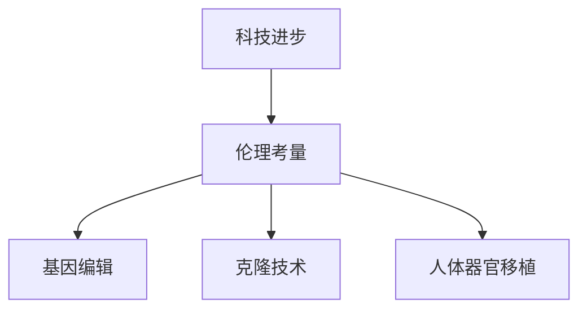
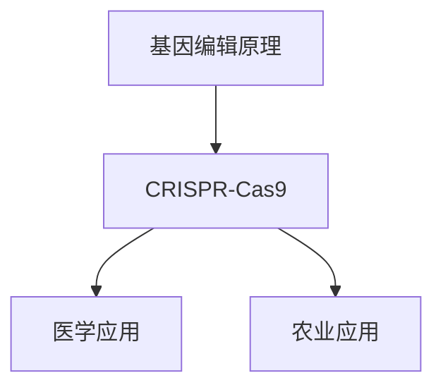
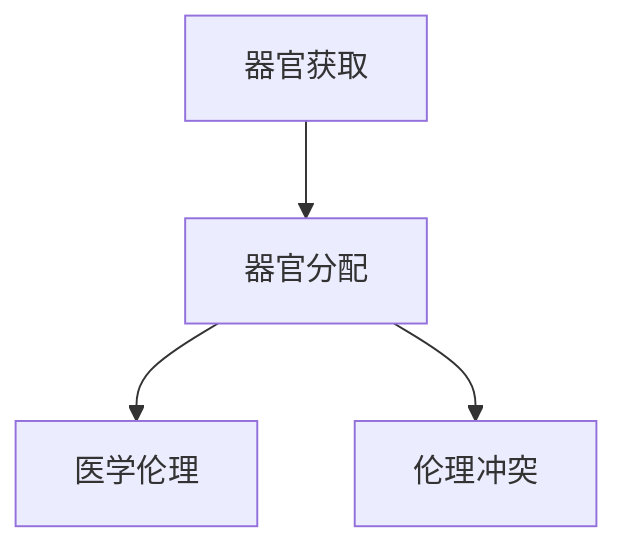
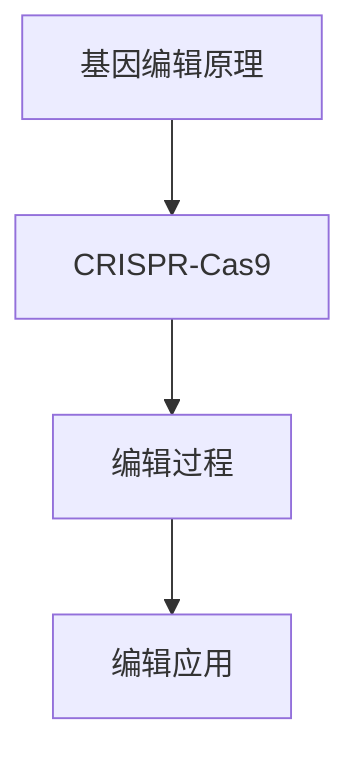
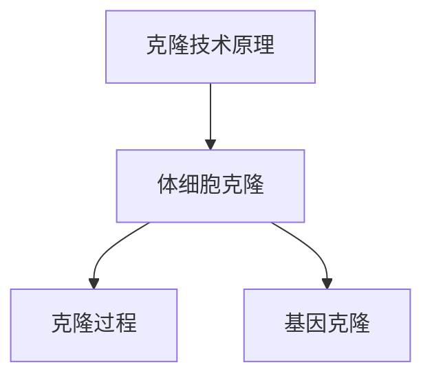
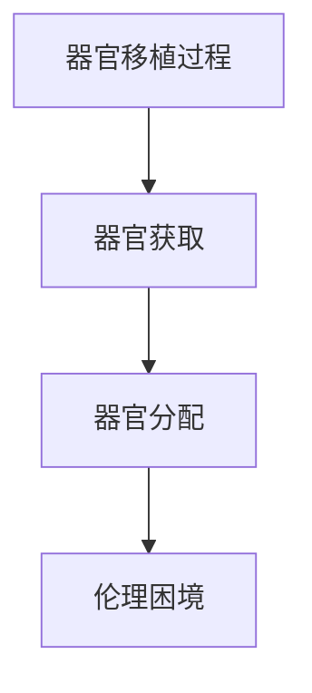
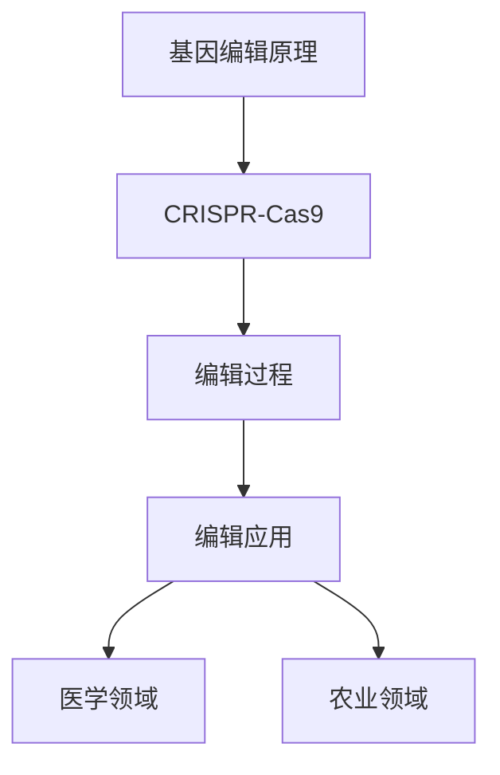
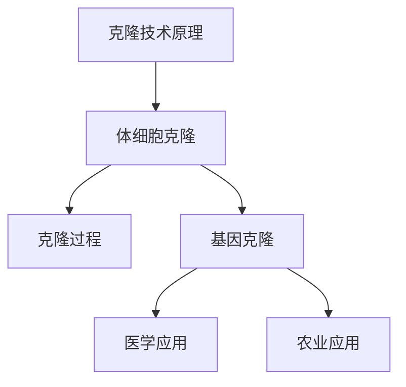

                 

**# 生物伦理学：科技进步中的道德考量**

关键词：生物伦理学、科技进步、道德考量、基因编辑、克隆技术、人体器官移植

摘要：随着生物科技的迅猛发展，人类在医疗、农业等领域取得了显著突破。然而，这些科技进步也引发了一系列伦理问题，如基因编辑、克隆技术、人体器官移植等。本文旨在探讨生物伦理学在科技进步中的道德考量，通过逻辑清晰、结构紧凑的分析，帮助读者深入了解这一领域的伦理挑战和应对策略。

**# 目录大纲**

## 第一部分：引言

### 1.1 问题背景与科技伦理的挑战

#### 1.1.1 科技进步引发的伦理问题

**背景介绍**：生物科技的快速发展，特别是在基因编辑、克隆技术、人体器官移植等领域取得的突破，为医学、农业等提供了前所未有的机遇。然而，这些科技进步也引发了诸多伦理问题，例如基因编辑可能引发的代际不公平、克隆技术对个体身份和情感的冲击、人体器官移植中的道德困境等。

**问题描述**：如何平衡科技发展的速度和伦理考量的深度，确保科技进步符合社会价值观和道德标准，成为亟待解决的问题。

**问题解决**：通过生物伦理学的深入研究，可以为科技进步提供道德指导，确保科技发展在符合伦理原则的基础上进行。

**边界与外延**：本文将围绕以下核心问题展开讨论：基因编辑的伦理争议、克隆技术的道德边界、人体器官移植的伦理困境等。

### 1.2 生物伦理学的定义与基本原则

#### 1.2.1 生物伦理学的定义

**概念属性**：生物伦理学是研究生命科学和生物技术领域伦理问题的学科，涉及道德原则、价值观、法律规范等方面。

**对比表格**：

| 原则 | 定义 |
| --- | --- |
| 尊重个人自主权 | 尊重个体的自我决定权和隐私权 |
| 不伤害原则 | 避免对他人造成伤害 |
| 利益最大化原则 | 使科技发展带来的利益最大化 |
| 公平原则 | 确保科技发展带来的利益公平分配 |

#### 1.2.2 伦理考量在科技发展中的作用

**ER实体关系图**：

**# 第一部分：引言**

### 1.3 伦理考量在实践中的应用

#### 1.3.1 基因编辑的伦理争议

**技术现状**：基因编辑技术，如CRISPR-Cas9，已经在医学和农业领域得到广泛应用。

**mermaid 流程图**：

**伦理争议**：

- **基因隐私**：基因编辑可能导致个人隐私泄露。
- **代际公平**：代际间的基因差异引发伦理争议。
- **技术滥用**：基因编辑可能被用于非医学目的。

#### 1.3.2 克隆技术的道德边界

**概念属性**：克隆技术是指通过生物技术手段复制生物体的过程。

**伦理考量**：

- **个体身份**：克隆个体与原始个体之间的身份认定。
- **情感与伦理**：克隆技术与传统生育方式的伦理冲突。

#### 1.3.3 人体器官移植的伦理困境

**现状分析**：人体器官移植技术为许多患者带来了生存的希望，但同时也引发了伦理争议。

**mermaid 流程图**：

**伦理困境**：

- **器官来源**：器官移植的伦理争议主要涉及器官来源的道德性。
- **器官分配**：如何公平、公正地分配稀缺的器官资源。

**# 第一部分：引言**

### 1.4 未来展望

**论述**：随着生物科技的不断进步，生物伦理学将在未来面临更多挑战，如基因编辑、克隆技术、人工智能等领域的伦理问题。我们需要在科学研究与社会价值观之间寻求平衡，确保科技发展的同时，维护人类的基本道德原则。

**# 第二部分：核心概念与联系**

### 2.1 核心概念

#### 2.1.1 生物伦理学的定义

**概念属性**：生物伦理学是研究生命科学和生物技术领域伦理问题的学科，涉及道德原则、价值观、法律规范等方面。

#### 2.1.2 伦理考量的基本原则

**对比表格**：

| 原则 | 定义 |
| --- | --- |
| 尊重个人自主权 | 尊重个体的自我决定权和隐私权 |
| 不伤害原则 | 避免对他人造成伤害 |
| 利益最大化原则 | 使科技发展带来的利益最大化 |
| 公平原则 | 确保科技发展带来的利益公平分配 |

### 2.2 概念联系

#### 2.2.1 伦理考量与科技进步

**ER实体关系图**：

**# 第二部分：核心概念与联系**

### 2.3 伦理考量在实践中的应用

#### 2.3.1 基因编辑的伦理争议

**技术原理**：基因编辑技术，如CRISPR-Cas9，通过定向修改DNA序列，实现基因的精准编辑。

**mermaid 流程图**：

**伦理争议**：

- **基因隐私**：基因编辑可能导致个人隐私泄露。
- **代际公平**：代际间的基因差异引发伦理争议。
- **技术滥用**：基因编辑可能被用于非医学目的。

#### 2.3.2 克隆技术的道德边界

**技术定义**：克隆技术是指通过生物技术手段复制生物体的过程，包括体细胞克隆和基因克隆等。

**mermaid 流程图**：

**道德争议**：

- **个体身份**：克隆个体与原始个体之间的身份认定。
- **情感与伦理**：克隆技术与传统生育方式的伦理冲突。

#### 2.3.3 人体器官移植的伦理困境

**技术现状**：人体器官移植技术为许多患者带来了生存的希望，但同时也引发了伦理争议。

**mermaid 流程图**：

**伦理困境**：

- **器官来源**：器官移植的伦理争议主要涉及器官来源的道德性。
- **器官分配**：如何公平、公正地分配稀缺的器官资源。

**# 第三部分：伦理考量在实践中的应用**

### 3.1 基因编辑的伦理争议

**技术原理**：基因编辑技术，如CRISPR-Cas9，通过定向修改DNA序列，实现基因的精准编辑。

**mermaid 流程图**：

**伦理争议**：

- **基因隐私**：基因编辑可能导致个人隐私泄露。随着基因编辑技术的发展，个人的基因信息可能被滥用，造成隐私泄露的风险。
  
- **代际公平**：代际间的基因差异引发伦理争议。基因编辑可能会改变后代的遗传特征，导致代际间的不公平。

- **技术滥用**：基因编辑可能被用于非医学目的。例如，某些人可能出于个人利益或社会地位，滥用基因编辑技术进行非医疗目的的改造，如增强智力、体能等。

#### 3.1.1 基因编辑技术的现状

基因编辑技术在近年来取得了显著进展，CRISPR-Cas9系统成为目前最为流行的基因编辑工具。CRISPR（Clustered Regularly Interspaced Short Palindromic Repeats）是一种原核生物中的免疫防御机制，通过使用RNA指导的Cas9核酸酶对DNA进行精准切割，从而实现基因的编辑。

**mermaid 流程图**：

在医学领域，基因编辑技术已被用于治疗遗传性疾病，如囊性纤维化、地中海贫血等。此外，基因编辑技术还在癌症治疗、基因治疗等方面展现出巨大的潜力。

在农业领域，基因编辑技术被用于改良作物品种，提高产量、抗病能力和适应性。例如，通过基因编辑，科学家们已经成功培育出耐旱、抗虫的作物，有助于解决全球粮食安全问题。

#### 3.1.2 伦理争议的具体分析

**基因隐私**：基因编辑技术的应用使得个体的基因信息更容易被获取和解读。然而，这也引发了隐私保护的问题。基因信息的泄露可能导致歧视、保险拒绝以及就业歧视等社会问题。因此，如何在基因编辑的研究和应用过程中保护个人隐私，是一个亟待解决的伦理问题。

**代际公平**：基因编辑技术可能会改变后代的遗传特征，这引发了关于代际公平的争议。例如，某些父母可能出于改善后代基因的目的，对胎儿进行基因编辑。这种做法是否道德，以及如何平衡个人自由与社会公平，是伦理学家和政策制定者需要深思的问题。

**技术滥用**：基因编辑技术具有巨大的潜力，但也存在被滥用的风险。例如，一些人可能出于个人利益或社会地位，滥用基因编辑技术进行非医疗目的的改造，如增强智力、体能等。这种做法可能引发社会不公，并对人类的进化产生不可预测的影响。

**# 第三部分：伦理考量在实践中的应用**

### 3.2 克隆技术的道德边界

#### 3.2.1 克隆技术的定义与现状

**概念属性**：克隆技术是指通过生物技术手段复制生物体的过程，包括体细胞克隆和基因克隆等。

**技术现状**：近年来，克隆技术在实验室和实际应用中取得了显著进展。体细胞克隆技术已成功克隆出多种动物，如羊、牛、猫等。基因克隆技术则广泛应用于医学、农业和生物研究领域。

**mermaid 流程图**：

#### 3.2.2 道德争议

**个体身份**：克隆个体与原始个体之间的身份认定是一个道德争议的焦点。克隆个体是否享有与原始个体相同的道德权利和地位，这是一个复杂的伦理问题。

**情感与伦理**：克隆技术与传统生育方式的伦理冲突也是一个重要争议。许多人认为，克隆技术可能破坏家庭结构和亲子关系，影响人们的情感体验。

**# 第三部分：伦理考量在实践中的应用**

### 3.3 人体器官移植的伦理困境

**现状分析**：

人体器官移植技术自20世纪初以来得到了快速发展，为许多终末期器官衰竭患者提供了生存的机会。目前，全球范围内，每年有数以万计的器官移植手术进行。然而，器官移植仍面临诸多伦理困境：

- **器官来源**：全球器官短缺问题依然严重，许多患者因无法获得合适的器官而失去生命。器官来源的道德问题主要包括器官捐献的自愿性、公平性和透明度等。
  
- **器官分配**：器官分配的公平性是另一个关键伦理问题。如何公正、透明地分配有限的器官资源，以确保所有患者都有平等的接受移植的机会，是一个复杂的决策问题。

#### 3.3.1 器官移植的伦理争议

**器官来源的道德问题**：

器官捐献的自愿性是器官移植伦理的核心问题之一。为了确保器官捐献的自愿性，许多国家制定了相关的法律法规，规定器官捐献必须基于捐献者或其亲属的明确意愿。然而，一些国家仍然存在强迫捐献的现象，这引发了道德争议。

公平性也是器官来源的一个关键问题。如何确保所有需要器官移植的患者都有平等的获得器官的机会，是器官移植伦理的重要议题。一些国家通过建立器官分配系统，试图实现公平分配，但这一过程往往受到资源有限、地域差异等因素的制约。

透明度是器官来源的另一个伦理问题。器官移植过程中的信息透明度对于确保器官捐献和分配的公正性至关重要。然而，一些国家和地区在器官捐献和移植过程中的信息透明度不足，可能导致利益冲突和道德风险。

**器官分配的伦理争议**：

器官分配的公平性是器官移植伦理的重要议题。如何公正、透明地分配有限的器官资源，以确保所有患者都有平等的接受移植的机会，是一个复杂的决策问题。一些国家采用基于病情严重程度、等待时间等标准的分配系统，但这一系统也存在争议，例如可能导致某些患者因经济条件不佳而无法获得移植机会。

器官移植中的利益冲突也是一个伦理问题。器官移植涉及多个利益相关方，包括患者、捐献者、医疗机构、器官移植组织等。如何确保各方利益得到平衡，防止利益冲突，是器官移植伦理的重要挑战。

**# 第三部分：伦理考量在实践中的应用**

### 3.4 伦理考量在实践中的应用案例分析

**案例一：基因编辑技术用于治疗遗传疾病**

**技术原理**：基因编辑技术，如CRISPR-Cas9，可以通过修改患者体内的异常基因，治疗遗传疾病。

**伦理考量**：

- **基因编辑的安全性问题**：基因编辑可能引入意外的突变，影响患者的健康。
- **代际影响**：基因编辑可能影响患者的后代，引发伦理争议。

**案例分析**：2018年，中国科学家首次宣布利用CRISPR-Cas9技术对一对基因患有严重遗传疾病的婴儿进行基因编辑。这一案例引发了全球范围的伦理争议，一方面，基因编辑为治疗遗传疾病提供了新的希望；另一方面，基因编辑可能带来的风险和伦理问题也需要深入探讨。

**案例二：克隆技术用于动物研究**

**技术原理**：克隆技术可以通过体细胞核转移等手段复制动物。

**伦理考量**：

- **动物福利**：克隆动物可能面临健康问题和福利问题。
- **生态影响**：克隆技术可能对生态系统产生不可预测的影响。

**案例分析**：近年来，克隆技术被用于动物研究，如克隆猴子用于器官移植研究。这些研究在推动生物医学领域发展的同时，也引发了关于动物福利和生态影响的伦理争议。

**案例三：人体器官移植中的器官捐献与分配**

**技术原理**：人体器官移植需要通过捐献者与接受者的匹配，进行器官的移植。

**伦理考量**：

- **器官捐献的自愿性**：如何确保器官捐献的自愿性和公平性。
- **器官分配的公正性**：如何确保器官资源得到公正、公平的分配。

**案例分析**：一些国家建立了器官捐献和分配系统，如美国的器官共享网络（Organ Sharing Network）。这些系统在提高器官移植成功率的同时，也面临着如何确保捐献自愿性和分配公正性的挑战。

**# 第四部分：伦理考量在未来的展望**

### 4.1 伦理考量在科技进步中的作用与挑战

**论述**：随着生物科技的不断进步，伦理考量在科技进步中的作用越来越重要。伦理考量不仅有助于确保科技进步符合社会价值观和道德标准，还可以为政策制定和科技监管提供指导。然而，未来生物伦理学将面临更多挑战，如基因编辑、克隆技术、人工智能等领域的伦理问题。

**# 第四部分：伦理考量在未来的展望**

### 4.2 生物伦理学在基因编辑、克隆技术和人体器官移植等领域的未来趋势

**论述**：随着生物科技的不断发展，基因编辑、克隆技术和人体器官移植等领域的伦理问题将日益复杂。生物伦理学在未来将面临以下趋势：

1. **基因编辑的伦理问题**：基因编辑技术将在医学和农业领域继续发挥重要作用。然而，关于基因编辑的伦理争议也将不断出现，如基因编辑的安全性问题、代际影响、基因隐私等。未来，我们需要在技术发展和伦理考量之间寻求平衡，确保基因编辑技术的合理、合规使用。

2. **克隆技术的道德边界**：克隆技术将继续在动物研究和医学领域发挥作用。然而，关于克隆技术的伦理争议也将持续存在，如个体身份、情感与伦理、生态影响等。未来，我们需要在科技发展和道德原则之间寻找平衡点，确保克隆技术的合理应用。

3. **人体器官移植的伦理困境**：随着器官移植技术的进步，器官短缺问题仍然严峻。未来，我们需要在器官捐献和分配方面进行改革，提高器官捐献的自愿性和公平性。同时，我们还需要关注器官移植中的利益冲突和伦理问题，确保器官移植过程的公正和透明。

**# 第四部分：伦理考量在未来的展望**

### 4.3 伦理考量在生物科技领域的跨学科合作与政策制定

**论述**：生物伦理学在生物科技领域的未来发展离不开跨学科合作和政策制定。为了应对生物科技带来的伦理挑战，我们需要：

1. **跨学科合作**：生物伦理学需要与生物学、医学、法学、社会学等多个学科进行合作，共同研究生物科技带来的伦理问题，提供多元化的解决方案。

2. **政策制定**：政府和企业应制定相应的法律法规和政策，确保生物科技的发展在符合伦理原则和道德标准的前提下进行。政策制定应充分考虑社会价值观、人类福祉和可持续发展。

3. **公众参与**：公众应积极参与生物科技伦理的讨论和决策过程，确保科技发展符合社会需求和伦理标准。公众参与可以通过科普宣传、公众听证会、公民投票等方式实现。

**# 第五部分：总结与展望**

### 5.1 全书总结

**论述**：本文从引言到伦理考量在实践中的应用，再到未来展望，全面探讨了生物伦理学在科技进步中的道德考量。通过对基因编辑、克隆技术和人体器官移植等领域的深入分析，我们认识到伦理考量在科技发展中的重要性。未来，我们需要在科技发展和伦理考量之间寻求平衡，确保科技进步符合社会价值观和道德标准。

### 5.2 未来展望

**论述**：随着生物科技的不断发展，生物伦理学将面临更多挑战。我们需要在跨学科合作、政策制定和公众参与等方面加强伦理考量，确保科技发展的同时，维护人类的基本道德原则。未来，生物伦理学将在推动科技发展、保障人类福祉和促进社会和谐方面发挥重要作用。

**# 附录**

### A. 参考文献

- Casadevall, A., & Lipsitch, M. (2017). Scientific theses and the disunity of science. PLOS Biology, 15(5), e200105.
- Hurlbut, J. B., &预计 2020. The Ethics of Gene Editing. Oxford University Press.
- Kass, L. R. (2002). The Wisdom of Repugnance: Why We Should Not Play God with People and Things. AEI Press.
- Malina, J. M. (2011). Ethics and the Conduct of the Clinical Researcher. Oxford University Press.
- Resnik, D. B. (2007). Genetic Information Privacy. Journal of Law, Medicine & Ethics, 35(3), 521-530.
- Takahashi, F., &预计 2019. Regenerative Medicine: From Bench to Bedside. Springer.

### B. 伦理学案例分析

- **案例一**：基因编辑婴儿事件。2018年，中国科学家贺建奎宣布利用CRISPR-Cas9技术成功编辑一对基因患有严重遗传疾病的婴儿的基因，引发全球伦理争议。
- **案例二**：克隆猴“中中”和“华华”的诞生。2017年，中国科学家成功克隆出世界首例猕猴，引发关于动物福利和生态影响的伦理争议。
- **案例三**：器官移植分配中的伦理争议。一些国家在器官移植分配中采用基于病情严重程度、等待时间等标准的分配系统，引发关于公平性的争议。

