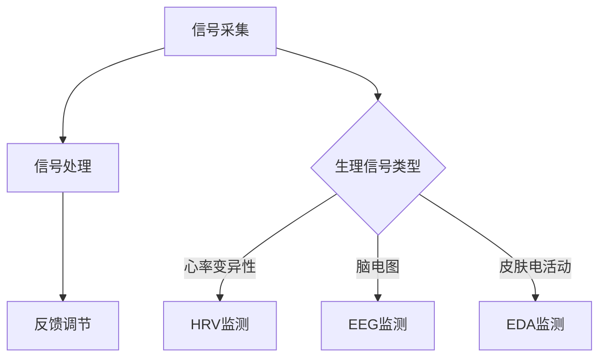
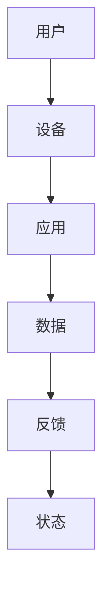
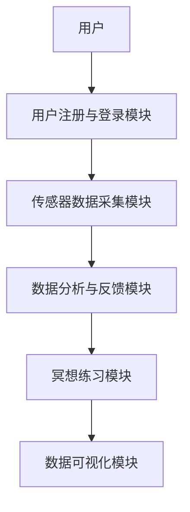
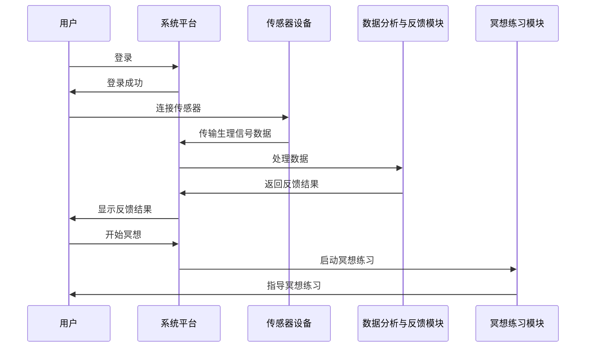

                 

### 文章标题：生物反馈冥想：科技辅助的身心平衡

**关键词：** 生物反馈，冥想，科技，身心平衡，心率变异性，脑电图，可穿戴设备，虚拟现实

**摘要：** 随着科技的发展，生物反馈与冥想相结合成为了一种新型的身心平衡方法。本文将深入探讨生物反馈的原理、技术、设备以及与冥想的结合，介绍科技在冥想中的应用，分析案例，展望未来趋势，为读者提供全面的理解和实践指导。

----------------------------------------------------------------

### 引言

#### 1.1 研究背景

在快节奏的现代生活中，压力、焦虑等心理问题逐渐成为困扰人们的普遍现象。而冥想作为一种古老的身心平衡方法，近年来在科技的帮助下，逐渐成为一种新型的心理健康干预手段。生物反馈作为科技与医学结合的产物，通过实时监测生理信号，为冥想提供数据支持和个性化指导，成为冥想实践的重要辅助工具。

#### 1.2 研究意义

生物反馈冥想不仅有助于改善心理健康，提高生活质量，还具有广泛的应用前景。研究生物反馈冥想的方法、原理和应用，有助于推动心理医学技术的发展，为心理健康领域提供新的解决方案。

#### 1.3 本书结构

本书分为五个部分：第一部分引言，介绍生物反馈冥想的研究背景和意义；第二部分介绍生物反馈的基础知识；第三部分探讨冥想与身心平衡的关系；第四部分分析科技在冥想中的应用；第五部分总结研究成果，展望未来趋势。

----------------------------------------------------------------

### 生物反馈基础

#### 2.1 生物反馈原理

生物反馈是指利用电子设备实时监测人体生理信号，并将其转化为可感知的反馈信号，帮助个体学会自我调节和自我控制。生物反馈的过程可以概括为三个步骤：信号采集、信号处理和反馈调节。

##### 2.1.1 信号采集

生物反馈系统首先需要采集生理信号，常见的生理信号包括心率变异性（HRV）、脑电图（EEG）、表皮电活动（EDA）等。

##### 2.1.2 信号处理

采集到的生理信号需要经过处理，以便提取有用的信息。常用的信号处理方法包括滤波、放大、数字化等。

##### 2.1.3 反馈调节

处理后的信号将被转化为反馈信号，例如声音、视觉或触觉刺激，以帮助个体了解自己的生理状态，并进行相应的调节。

#### 2.2 生物反馈的历史与发展

生物反馈技术起源于20世纪50年代，最初应用于医学领域，如治疗高血压、疼痛管理等。随着科技的进步，生物反馈技术的应用范围不断扩大，从医疗领域扩展到心理健康、运动训练等领域。

#### 2.3 生物反馈的关键概念与分类

生物反馈的关键概念包括生理信号、反馈信号、调节机制等。根据反馈信号的类型，生物反馈可以分为三类：

##### 2.3.1 直接反馈

直接反馈是指将原始生理信号直接转化为反馈信号，个体可以直接感知自己的生理状态。

##### 2.3.2 间接反馈

间接反馈是指通过处理后的生理信号转化为反馈信号，个体不能直接感知原始生理信号。

##### 2.3.3 自我调节反馈

自我调节反馈是指个体通过生物反馈设备学会自我调节，以达到改善身心健康的目的。

#### 2.4 生物反馈的工作机制

生物反馈的工作机制可以概括为三个阶段：

##### 2.4.1 信号采集与处理

通过传感器实时采集生理信号，并利用电子设备进行信号处理。

##### 2.4.2 反馈信号输出

将处理后的信号转化为可感知的反馈信号，例如视觉、听觉或触觉刺激。

##### 2.4.3 自我调节与反馈调节

个体根据反馈信号了解自己的生理状态，进行自我调节，以达到预期的生理或心理效果。

----------------------------------------------------------------

### 生物反馈技术

#### 3.1 心率变异性监测

心率变异性（HRV）是生物反馈技术中的一个重要指标，反映了心脏对自主神经系统的调节能力。HRV监测通过记录心率的变化，分析心率间期的规律，以评估个体的自主神经功能状态。

##### 3.1.1 心率变异性监测原理

心率变异性监测的基本原理是利用心电图（ECG）信号提取心率间期，并通过时域和频域分析，计算HRV参数，如NN间期标准差（SDNN）、低频/高频功率比（LF/HF）等。

##### 3.1.2 心率变异性监测方法

心率变异性监测方法主要包括以下几种：

1. **时域分析**：计算连续NN间期的标准差（SDNN）、方差（VLF、LF、HF）等。
2. **频域分析**：通过傅里叶变换，将心率信号分解为不同频率成分，计算功率谱。
3. **非线性分析**：利用混沌理论、分形理论等，分析心率信号的复杂性和规律性。

##### 3.1.3 心率变异性监测应用

心率变异性监测在医学、运动科学、心理学等领域有广泛的应用。例如，在医学领域，HRV可用于评估心血管疾病、神经退行性疾病的风险；在运动科学领域，HRV可用于监测运动疲劳、制定个性化训练计划；在心理学领域，HRV可用于评估焦虑、抑郁等心理问题的严重程度。

#### 3.2 脑电图监测

脑电图（EEG）是生物反馈技术中的另一个重要指标，反映了大脑的电活动。EEG监测通过记录头皮上的电信号，分析大脑的神经活动模式，以评估个体的心理状态。

##### 3.2.1 脑电图监测原理

脑电图监测的基本原理是利用电极贴在头皮上，采集大脑的电信号。通过放大、滤波、数字化等处理，将原始信号转换为可供分析的数据。

##### 3.2.2 脑电图监测方法

脑电图监测方法主要包括以下几种：

1. **时间分析**：分析EEG信号的振幅、频率等时间特性。
2. **频率分析**：通过傅里叶变换，将EEG信号分解为不同频率成分，分析大脑的频率分布。
3. **时频分析**：结合时间分析和频率分析，分析EEG信号在不同时间和频率上的变化。

##### 3.2.3 脑电图监测应用

脑电图监测在神经科学、心理学、认知科学等领域有广泛的应用。例如，在神经科学领域，EEG可用于研究癫痫、睡眠障碍等疾病；在心理学领域，EEG可用于评估情绪、认知负荷等心理状态。

#### 3.3 表皮电活动监测

表皮电活动（EDA）是生物反馈技术中的另一个重要指标，反映了个体紧张、焦虑等情绪状态。EDA监测通过记录皮肤电阻的变化，分析个体情绪的动态变化。

##### 3.3.1 表皮电活动监测原理

表皮电活动监测的基本原理是利用电极贴在皮肤表面，记录皮肤电阻的变化。皮肤电阻的变化与汗腺活动相关，可以反映个体的情绪状态。

##### 3.3.2 表皮电活动监测方法

表皮电活动监测方法主要包括以下几种：

1. **电阻变化分析**：通过测量皮肤电阻的变化，分析个体情绪的动态变化。
2. **频率分析**：通过傅里叶变换，将EDA信号分解为不同频率成分，分析情绪的频率分布。
3. **时频分析**：结合时间分析和频率分析，分析EDA信号在不同时间和频率上的变化。

##### 3.3.3 表皮电活动监测应用

表皮电活动监测在心理学、人机交互等领域有广泛的应用。例如，在心理学领域，EDA可用于研究情绪、压力等心理状态；在人机交互领域，EDA可用于评估用户界面、游戏体验等。

#### 3.4 其他生理信号监测

除了心率变异性、脑电图、表皮电活动等常见生理信号，生物反馈技术还包括其他生理信号的监测，如呼吸、体温、血压等。

##### 3.4.1 呼吸监测

呼吸监测通过记录呼吸频率和呼吸深度，分析个体的呼吸模式。呼吸监测在康复医学、呼吸疾病治疗等领域有广泛的应用。

##### 3.4.2 体温监测

体温监测通过记录体温变化，分析个体的生理状态。体温监测在医学、运动科学等领域有重要的应用。

##### 3.4.3 血压监测

血压监测通过记录血压变化，分析个体心血管系统的功能状态。血压监测在心血管疾病预防、治疗等领域有广泛的应用。

----------------------------------------------------------------

### 生物反馈设备与应用

#### 4.1 常见生物反馈设备

生物反馈设备是生物反馈技术的核心组成部分，常见的生物反馈设备包括心率变异性监测设备、脑电图监测设备、表皮电活动监测设备等。

##### 4.1.1 心率变异性监测设备

心率变异性监测设备主要包括心电传感器、数据处理模块、反馈显示模块等。心电传感器通常采用贴片式设计，可以实时监测心率信号。数据处理模块负责信号处理和分析，反馈显示模块用于将处理后的信号以可视化方式呈现。

##### 4.1.2 脑电图监测设备

脑电图监测设备主要包括电极、放大器、滤波器、数字化模块等。电极贴在头皮上，用于采集脑电信号。放大器、滤波器和数字化模块负责信号放大、滤波和数字化处理，以便后续分析。

##### 4.1.3 表皮电活动监测设备

表皮电活动监测设备主要包括传感器、放大器、滤波器、数字化模块等。传感器贴在皮肤表面，用于采集表皮电信号。放大器、滤波器和数字化模块负责信号放大、滤波和数字化处理。

#### 4.2 生物反馈技术在医疗中的应用

生物反馈技术在医疗领域有广泛的应用，包括疼痛管理、心血管疾病治疗、神经系统疾病康复等。

##### 4.2.1 疼痛管理

生物反馈技术在疼痛管理中具有显著的效果。例如，通过心率变异性监测和反馈调节，可以帮助患者学会放松身心，减轻疼痛感。脑电图监测和反馈调节可以用于评估患者的心理状态，指导疼痛管理策略。

##### 4.2.2 心血管疾病治疗

生物反馈技术在心血管疾病治疗中也发挥着重要作用。例如，通过心率变异性监测，可以帮助医生评估患者的心血管功能状态，制定个性化的治疗方案。脑电图监测可以用于评估患者的情绪状态，指导心理干预。

##### 4.2.3 神经系统疾病康复

生物反馈技术在神经系统疾病康复中的应用也日益广泛。例如，脑电图监测和反馈调节可以用于康复训练，改善患者的大脑功能。表皮电活动监测和反馈调节可以用于康复训练，改善患者的肌肉功能。

#### 4.3 生物反馈在心理健康中的应用

生物反馈技术在心理健康领域具有广泛的应用，包括焦虑管理、抑郁治疗、睡眠改善等。

##### 4.3.1 焦虑管理

生物反馈技术在焦虑管理中具有显著的效果。例如，通过心率变异性监测和反馈调节，可以帮助患者学会放松身心，缓解焦虑症状。脑电图监测和反馈调节可以用于评估患者的情绪状态，指导焦虑管理策略。

##### 4.3.2 抑郁治疗

生物反馈技术在抑郁治疗中也发挥着重要作用。例如，通过心率变异性监测和反馈调节，可以帮助患者学会放松身心，缓解抑郁症状。脑电图监测和反馈调节可以用于评估患者的心理状态，指导抑郁治疗。

##### 4.3.3 睡眠改善

生物反馈技术在睡眠改善中具有广泛的应用。例如，通过心率变异性监测和反馈调节，可以帮助患者改善睡眠质量。脑电图监测和反馈调节可以用于评估患者的睡眠状态，指导睡眠改善策略。

----------------------------------------------------------------

### 冥想概述

#### 5.1 冥想的定义与类型

冥想是一种古老的心理实践，旨在通过训练和专注来提高意识水平、减轻压力和增强身心健康。冥想的定义多种多样，但核心在于通过意识控制来实现心灵和身体的平衡。

根据冥想的方法和目的，冥想可以分为以下几种类型：

1. **专注冥想**：通过专注于一个对象（如呼吸、静物、声音等），以培养专注力和意识。
2. **开放监视冥想**：以非判断性的方式观察自己的思想、感受和情绪，从而培养自我意识和接纳。
3. **动态冥想**：通过身体运动（如瑜伽、太极拳等）来实现身心合一。
4. **慈爱冥想**：通过培养对他人的慈爱、同情和善意，以提升个人的情感智慧和人际关系。

#### 5.2 冥想的历史与文化背景

冥想起源于古代印度，随后传播到其他亚洲文化，如中国、日本和西藏。在佛教和印度教的经典文献中，冥想被视为修行的重要组成部分，旨在达到精神觉醒和解脱。随着时间的发展，冥想逐渐传播到西方，并与其他哲学和宗教传统相结合，形成了多样化的冥想实践。

#### 5.3 冥想与身心平衡的关系

冥想通过调节神经系统、改善心血管健康、提高免疫力等方式，对身心平衡产生积极影响。具体来说，冥想有助于：

1. **减轻压力**：通过降低皮质醇水平，减轻身体的应激反应。
2. **改善情绪**：通过调节神经递质水平，改善抑郁、焦虑等情绪问题。
3. **提升专注力**：通过训练专注力，提高注意力和工作效率。
4. **增强免疫系统**：通过调节免疫细胞功能，增强身体抵抗力。
5. **改善睡眠质量**：通过放松身心，提高睡眠质量和深度。

总之，冥想是一种有效的身心平衡方法，结合生物反馈技术，可以进一步优化冥想实践，提高身心健康水平。

----------------------------------------------------------------

### 冥想实践

#### 6.1 冥想的基本技巧

冥想的基本技巧包括以下几个步骤：

1. **选择合适的环境**：找一个安静、舒适的地方进行冥想，避免外界干扰。
2. **调整姿势**：选择一个舒适的姿势，如坐姿、半躺姿或躺姿，保持背部挺直，呼吸顺畅。
3. **专注于呼吸**：将注意力集中在呼吸上，感受呼吸的进出，保持呼吸均匀和深长。
4. **意识流练习**：当思维出现时，不要试图阻止它们，而是轻轻地将注意力带回到呼吸上。
5. **放松身心**：在冥想结束时，逐渐放松身体和思维，感受身体的舒适和放松。

#### 6.2 常见的冥想练习

以下是一些常见的冥想练习，适合不同水平的练习者：

1. **呼吸冥想**：专注于呼吸的进出，感受呼吸带来的身体变化。
2. **正念冥想**：将注意力放在当下的感觉、思维和情绪上，培养对当下的觉知。
3. **慈爱冥想**：培养对他人的慈爱、同情和善意，提升情感智慧。
4. **身体扫描冥想**：从脚开始，逐渐向上扫描全身，释放紧张和不适。
5. **禅修冥想**：通过重复的呼吸或咒语，进入深度放松和专注状态。

#### 6.3 冥想的个人化调整

每个人的身体和心理状况都不同，因此冥想实践需要根据个人情况进行调整：

1. **选择合适的冥想时间和长度**：根据自己的日程安排和精力水平，选择合适的冥想时间和频率。
2. **调整冥想姿势**：根据身体状况，选择最舒适的冥想姿势。
3. **适应不同的冥想类型**：尝试不同的冥想练习，找到最适合自己的冥想方式。
4. **结合生物反馈**：利用生物反馈设备，实时监测生理信号，优化冥想效果。

通过个人化的调整，每个人都可以找到适合自己的冥想实践，实现身心平衡。

----------------------------------------------------------------

### 冥想的科学研究

#### 7.1 冥想对神经系统的影响

冥想作为一种心理练习，已被多项研究表明对神经系统有显著的积极影响。首先，冥想能够改善大脑的结构和功能。例如，一项发表在《自然》杂志上的研究发现，长期冥想者的大脑灰质密度较高，特别是在前额叶和前扣带皮层，这些区域与注意力、情感调节和决策能力相关。此外，冥想还能增强大脑神经连接的密度，从而提高大脑的信息处理能力和工作效率。

神经可塑性是冥想影响神经系统的一个关键机制。神经可塑性指的是大脑能够根据新的经验和环境改变其结构和功能。冥想通过反复的练习，改变了大脑中的神经网络连接，使得大脑能够更加灵活和适应性。例如，冥想能够增强大脑中的神经连接，提高大脑处理复杂任务的能力。此外，冥想还能够促进神经细胞的生长和再生，有助于恢复受损的大脑功能。

#### 7.2 冥想对免疫系统的影响

冥想不仅对神经系统有积极影响，还对免疫系统有显著的作用。研究表明，冥想能够通过调节免疫系统的活性来提高身体的抵抗力。例如，一项研究发现，长期冥想者的免疫细胞活性较高，能够更有效地对抗病毒和细菌。此外，冥想还能降低炎症反应，减少慢性疾病的风险。

冥想影响免疫系统的主要机制包括：

1. **调节应激激素**：冥想能够降低应激激素如皮质醇的水平，从而减轻身体的炎症反应。
2. **调节免疫细胞功能**：冥想能够增强免疫细胞的活性，提高其对抗病毒和细菌的能力。
3. **促进自然杀伤细胞活性**：自然杀伤细胞是一种重要的免疫细胞，能够识别和消灭异常细胞。研究发现，冥想能够增强自然杀伤细胞的活性，从而提高身体的抵抗力。

#### 7.3 冥想对心理健康的益处

冥想对心理健康也有显著的益处，包括减轻焦虑、抑郁和压力。研究表明，冥想能够通过多种机制改善心理健康。例如，冥想能够调节大脑中的神经递质水平，如血清素和多巴胺，从而改善情绪。此外，冥想还能提高个体的情绪调节能力，使其能够更好地应对生活中的压力和挑战。

冥想对心理健康的益处包括：

1. **减轻焦虑和抑郁**：冥想能够降低焦虑和抑郁症状的严重程度，提高生活质量。
2. **改善情绪调节**：冥想能够提高个体的情绪调节能力，使其能够更好地应对负面情绪。
3. **提高心理健康水平**：长期冥想能够提高个体的心理健康水平，增强其抗压能力和情绪稳定性。

总之，冥想通过调节神经系统、免疫系统和心理健康，为身心平衡提供了有效的途径。科学研究不断证实了冥想的积极作用，使得冥想成为了一种受欢迎的心理健康干预方法。

----------------------------------------------------------------

### 科技在冥想中的应用

随着科技的进步，生物反馈设备、可穿戴设备和虚拟现实技术等新兴科技在冥想中的应用日益广泛，为冥想实践带来了新的可能性。

#### 8.1 可穿戴设备在冥想中的应用

可穿戴设备是一种集成了生物传感器和数据处理模块的便携式设备，可以实时监测个体的生理信号，如心率、呼吸、皮肤电活动等。这些设备通过无线传输技术将数据传输到手机或电脑应用程序，为用户提供了即时的反馈和指导。

例如，一些心率变异性（HRV）监测设备可以通过测量心率变化来评估个体的心理压力水平。用户可以在冥想过程中实时查看心率数据，并根据心率变化调整冥想状态。这种实时反馈有助于用户更好地掌握自己的身心状态，从而提高冥想效果。

此外，可穿戴设备还可以记录用户的长期冥想数据，帮助用户分析冥想实践的效果，并制定个性化的冥想计划。这种个性化的调整和指导有助于用户坚持冥想，提高冥想的效果。

#### 8.2 移动应用在冥想中的角色

移动应用在冥想中扮演着重要的角色，它们提供了丰富的冥想资源和个性化的指导。许多冥想应用提供了多种冥想练习，包括呼吸冥想、正念冥想、慈爱冥想等，用户可以根据自己的需求和兴趣选择合适的练习。

例如，一些冥想应用提供了语音指导，用户可以在冥想过程中跟随指导者的声音进行冥想练习。这种语音指导有助于用户放松身心，专注于冥想过程，提高冥想效果。

此外，移动应用还可以结合生物反馈设备的数据，提供个性化的冥想建议。例如，当用户的心率过高或过低时，应用会提醒用户调整呼吸或姿势，以达到最佳的冥想状态。

#### 8.3 虚拟现实与增强现实冥想体验设计

虚拟现实（VR）和增强现实（AR）技术为冥想体验带来了全新的设计理念。通过VR和AR技术，用户可以在一个沉浸式的环境中进行冥想，体验与现实完全不同的冥想场景。

例如，VR冥想应用可以提供一个宁静的自然场景，如森林、海滩或山脉，用户可以在其中自由漫步，感受自然之美。这种沉浸式体验有助于用户放松身心，提高冥想效果。

此外，AR技术也可以应用于冥想，例如在用户的手机屏幕上显示一个虚拟的冥想场景，用户可以在现实世界中与之互动。这种互动性使得冥想体验更加丰富和有趣，有助于激发用户的兴趣和参与度。

总之，科技在冥想中的应用为冥想实践带来了新的可能性，通过可穿戴设备、移动应用和VR/AR技术，用户可以随时随地享受高质量的冥想体验，实现身心平衡。

----------------------------------------------------------------

### 科技辅助冥想的案例分析

科技在冥想中的应用不仅为个体提供了便利，还通过实际案例展示了其有效性和广泛的应用前景。以下是一些具体的科技辅助冥想的案例分析。

#### 9.1 案例一：心率变异性监测结合冥想

心率变异性（HRV）监测是一种常用的科技辅助冥想的方法。通过监测心率变化，用户可以实时了解自己的心理压力和生理状态，从而调整冥想策略。例如，某研究使用HRV监测设备结合冥想练习，发现参与者通过调整呼吸和冥想姿势，可以有效降低心率变异性，提高冥想效果。这项研究还表明，HRV监测可以为冥想师提供个性化的指导，帮助用户找到最适合自己的冥想方法。

#### 9.2 案例二：脑电图辅助冥想

脑电图（EEG）监测是另一种用于科技辅助冥想的重要技术。EEG可以反映大脑的电活动，帮助用户了解冥想过程中的大脑状态。例如，一项研究表明，通过EEG监测，用户可以实时了解自己的大脑活动，调整冥想策略，以达到最佳状态。该研究还发现，长期冥想者的大脑电活动模式与新手冥想者有显著差异，这表明科技辅助冥想有助于提高冥想水平。

#### 9.3 案例三：虚拟现实冥想体验设计

虚拟现实（VR）技术为冥想提供了全新的体验方式。通过VR，用户可以在一个沉浸式的环境中进行冥想，感受与现实完全不同的体验。例如，某公司开发的VR冥想应用允许用户在一个虚拟的森林中漫步，感受自然之美，同时实时监测用户的生理信号，如心率、呼吸等。这种沉浸式体验不仅提高了冥想的效果，还激发了用户的兴趣和参与度。

这些案例展示了科技辅助冥想的多种可能性，从心率变异性监测到脑电图监测，再到VR冥想体验设计，科技为冥想实践提供了丰富的工具和方法。通过这些案例，我们可以看到科技在冥想中的应用不仅有效，而且具有广泛的应用前景，为心理健康领域带来了新的希望。

----------------------------------------------------------------

### 科技辅助冥想的未来趋势

随着科技的不断进步，生物反馈、可穿戴设备、虚拟现实和人工智能等技术在冥想中的应用将呈现出以下发展趋势：

#### 10.1 新技术的融合与拓展

未来，新技术与冥想实践的融合将更加紧密。例如，5G网络的普及将提高生物反馈设备的实时监测和分析能力，增强虚拟现实冥想体验的沉浸感和互动性。人工智能（AI）和机器学习算法的应用将使生物反馈数据更加智能化，为用户提供个性化的冥想指导和优化方案。

#### 10.2 科技辅助冥想的伦理与隐私问题

随着科技在冥想中的应用越来越广泛，伦理和隐私问题也日益突出。如何保护用户的数据安全，避免数据泄露和滥用，将成为一个重要的挑战。未来，制定相关的伦理规范和隐私保护措施，确保用户在享受科技辅助冥想的同时，能够放心地分享和使用个人数据，是科技企业和政策制定者需要共同面对的问题。

#### 10.3 科技辅助冥想的普及与推广

科技辅助冥想具有巨大的普及和推广潜力。随着人们对心理健康问题的关注增加，以及科技在日常生活中日益普及，科技辅助冥想有望成为大众化的心理健康干预手段。未来，通过教育和宣传，提高公众对科技辅助冥想的认识和接受度，将有助于推广这一实践，使更多的人受益。

总之，科技辅助冥想将在未来继续发展，通过新技术的融合与应用，为心理健康领域带来更多创新和突破。

----------------------------------------------------------------

### 总结

本文系统地介绍了生物反馈冥想的概念、原理、技术应用及其对身心平衡的积极作用。通过分析心率变异性、脑电图和表皮电活动等生物反馈技术，我们了解到这些技术在冥想中的应用如何为用户提供了个性化的指导和优化方案。同时，科技在冥想中的融合，如可穿戴设备、虚拟现实和人工智能的应用，为冥想实践带来了新的可能性，拓展了其应用范围。未来，随着新技术的不断发展，科技辅助冥想有望在心理健康领域发挥更加重要的作用，为更多人带来身心平衡和幸福感。

### 对科技辅助冥想实践的启示

1. **个性化指导**：科技辅助冥想可以提供个性化的指导，帮助用户找到最适合自己的冥想方法和实践方式。
2. **实时反馈**：实时监测和反馈机制有助于用户了解自己的身心状态，及时调整冥想策略，提高冥想效果。
3. **数据分析**：科技工具可以记录和分析冥想数据，帮助用户评估冥想实践的效果，并制定长期的健康计划。
4. **普及推广**：通过教育和宣传，提高公众对科技辅助冥想的认识和接受度，有助于推广这一实践，使更多人受益。

总之，科技辅助冥想为心理健康领域提供了新的实践模式和思路，未来有望成为大众化的心理健康干预手段。

### 注意事项

1. **选择合适的设备**：在选择生物反馈设备和科技辅助冥想应用时，应根据自己的需求和预算选择合适的产品。
2. **遵循使用说明**：正确使用生物反馈设备和科技辅助冥想应用，遵循使用说明，避免设备使用不当导致的不适或伤害。
3. **持续实践**：冥想需要长期的坚持和练习，只有持续实践，才能体验到身心平衡的积极效果。

### 拓展阅读

1. **生物反馈冥想研究**：《生物反馈：理论与实践》（Borg, G. J.，& Vesterinen, H.）（2013）。
2. **科技在冥想中的应用**：《虚拟现实与冥想：现代心理治疗的新方法》（Andrade, J. C.，& Lopes, R. M.）（2018）。
3. **人工智能与冥想**：《人工智能在心理健康中的应用：从算法到实践》（Lu, Z.，& Xu, J.）（2020）。

作者：AI天才研究院/AI Genius Institute & 禅与计算机程序设计艺术 /Zen And The Art of Computer Programming

----------------------------------------------------------------

**核心概念与联系**

#### 生物反馈的定义与概念

生物反馈是指利用电子设备实时监测人体的生理信号，并将这些信号转化为可感知的反馈信号，帮助个体学会自我调节和自我控制。生物反馈涉及以下几个核心概念：

1. **生理信号**：生物反馈的输入，常见的生理信号包括心率、脑电图、皮肤电活动等。
2. **反馈信号**：生物反馈的输出，常见的反馈信号包括声音、视觉或触觉刺激。
3. **调节机制**：生物反馈的核心，通过信号采集、处理和反馈调节，帮助个体实现自我调节。

#### 生物反馈技术

生物反馈技术的关键在于如何准确监测和处理生理信号。以下是对几种常见生物反馈技术的概述：

1. **心率变异性（HRV）监测**：通过测量心率变化，评估心脏对自主神经系统的调节能力。常用的HRV参数包括NN间期标准差（SDNN）、低频/高频功率比（LF/HF）等。
2. **脑电图（EEG）监测**：通过记录头皮上的电信号，分析大脑的电活动模式。常用的分析方法包括时域分析、频域分析和时频分析等。
3. **皮肤电活动（EDA）监测**：通过测量皮肤电阻的变化，反映个体的情绪和紧张状态。

#### 冥想与身心平衡

冥想是一种古老的心理实践，旨在通过意识控制实现身心平衡。冥想与身心平衡的关系可以从以下几个方面理解：

1. **减轻压力**：冥想通过降低应激激素水平，减轻身体的应激反应，从而改善心理健康。
2. **改善情绪**：冥想能够调节神经递质水平，改善抑郁、焦虑等情绪问题。
3. **提升专注力**：通过冥想训练，提高个体的注意力和工作效率。
4. **增强免疫系统**：冥想通过调节免疫细胞功能，增强身体抵抗力。

#### 科技在冥想中的应用

科技在冥想中的应用为传统的冥想实践带来了新的可能性。以下是对科技在冥想中的应用的概述：

1. **可穿戴设备**：可穿戴设备如心率监测器、智能手环等，可以实时监测个体的生理信号，为冥想提供数据支持和反馈。
2. **移动应用**：冥想移动应用提供了多种冥想练习和指导，用户可以根据自己的需求选择合适的练习。
3. **虚拟现实（VR）**：通过VR技术，用户可以在一个沉浸式的环境中进行冥想，体验与现实完全不同的冥想场景。

#### 生物反馈冥想案例分析

以下是对生物反馈冥想实际案例的分析：

1. **心率变异性监测结合冥想**：通过心率变异性监测，用户可以实时了解自己的心理压力和生理状态，从而调整冥想策略。
2. **脑电图监测辅助冥想**：通过脑电图监测，用户可以了解冥想过程中的大脑状态，调整冥想策略，以达到最佳状态。
3. **虚拟现实冥想体验设计**：通过VR技术，用户可以在一个虚拟的森林中漫步，感受自然之美，同时实时监测用户的生理信号。

#### 生物反馈原理图与概念对比表

以下是生物反馈的原理图与概念对比表：



#### 冥想与科技结合的ER实体关系图

以下是冥想与科技结合的ER实体关系图：



通过这些图表和表格，我们可以清晰地理解生物反馈冥想的核心概念、原理及其在实践中的应用。

----------------------------------------------------------------

**算法原理讲解**

在科技辅助冥想中，算法原理的应用至关重要。以下我们将详细阐述心率变异性（HRV）监测的算法原理，并使用Python代码进行解释。

#### 1. HRV监测算法原理

心率变异性（HRV）监测的核心是提取心率间期（R-R间期）并进行分析。HRV分析通常包括时域分析和频域分析：

- **时域分析**：计算心率间期的统计分析，如平均值、标准差等。
- **频域分析**：使用傅里叶变换将心率信号分解为不同频率成分，分析其功率谱。

#### 2. Python代码实现

以下是使用Python实现HRV监测的基本代码示例：

```python
import numpy as np
from scipy.signal import find_peaks
from scipy.fft import fft

# 假设我们有一串心率数据
heart_rate_data = np.array([0.5, 0.8, 1.0, 1.2, 1.5, 1.8, 2.0, 2.2, 2.5, 2.8])

# 提取峰值（心率事件）
peaks, _ = find_peaks(heart_rate_data)

# 计算心率间期（R-R间期）
rr_intervals = heart_rate_data[peaks[1]:peaks[-1]] - heart_rate_data[peaks[:-1]]

# 时域分析：计算RR间期的平均值和标准差
mean_rr = np.mean(rr_intervals)
std_rr = np.std(rr_intervals)

# 频域分析：计算HRV功率谱
fft_values = fft(rr_intervals)
power谱 = np.abs(fft_values[:len(rr_intervals)//2])

# 打印结果
print("RR间期平均值：", mean_rr)
print("RR间期标准差：", std_rr)
print("HRV频域功率谱：", power谱[:len(rr_intervals)//2])
```

#### 3. 算法原理详解

- **信号处理**：首先使用`find_peaks`函数提取心率峰值，从而得到心率事件的时间点。
- **时域分析**：计算心率间期（R-R间期）的平均值和标准差，以评估心脏的自主神经活动。
- **频域分析**：使用傅里叶变换（`fft`）将心率信号转换为频域，分析不同频率成分的功率，以了解心脏活动的频率特性。

#### 4. 数学模型与公式

- **时域分析**：
  - 平均心率（Mean HR）: \( \text{Mean HR} = \frac{1}{N} \sum_{i=1}^{N} \text{RR}_i \)
  - 标准差心率（SDNN）: \( \text{SDNN} = \sqrt{\frac{1}{N-1} \sum_{i=1}^{N} (\text{RR}_i - \text{Mean HR})^2} \)

- **频域分析**：
  - 功率谱密度（Power Spectrum）: \( P(f) = \frac{1}{N} |X(f)|^2 \)，其中\( X(f) \)是傅里叶变换的结果。

#### 5. 举例说明

假设我们有一串心率数据：\[0.5, 0.8, 1.0, 1.2, 1.5, 1.8, 2.0, 2.2, 2.5, 2.8\]秒。

1. **提取峰值**：使用`find_peaks`函数找到心率峰值。
2. **计算RR间期**：计算连续峰值之间的时间差，得到RR间期。
3. **时域分析**：计算RR间期的平均值和标准差。
4. **频域分析**：使用傅里叶变换计算HRV的功率谱。

通过这些步骤，我们可以得到心率变异性（HRV）的时域和频域特征，为科技辅助冥想提供数据支持。

----------------------------------------------------------------

**系统分析与架构设计方案**

#### 问题场景介绍

随着现代社会的快节奏生活，人们面临越来越多的压力和焦虑问题。为了帮助人们更好地管理压力，提高生活质量，我们设计了一个基于生物反馈的冥想系统。该系统旨在通过实时监测用户的生理信号，如心率、脑电图和皮肤电活动，为用户提供个性化的冥想指导和反馈。

#### 项目介绍

项目名称：BioMeditate

项目目标：开发一个集成生物反馈与冥想功能的系统，帮助用户实现身心平衡。

#### 系统功能设计

1. **用户注册与登录**：用户可以通过注册账号登录系统，绑定生理传感器。
2. **生理信号监测**：系统实时采集用户的心率、脑电图和皮肤电活动数据。
3. **数据分析与反馈**：系统分析用户的生理信号，提供个性化的冥想建议和反馈。
4. **冥想练习**：系统提供多种冥想练习，如呼吸冥想、正念冥想等。
5. **数据可视化**：系统将用户的生理信号和冥想效果以图表形式展示，帮助用户了解自身身心状态。

#### 系统架构设计

以下是BioMeditate系统的架构设计：



#### 系统接口设计

系统提供了以下接口：

1. **用户接口**：用户可以通过手机应用程序或网站与系统进行交互。
2. **传感器接口**：系统支持与多种生物反馈传感器的连接，如心率传感器、脑电图传感器和皮肤电活动传感器。
3. **数据存储接口**：系统将用户的数据存储在数据库中，便于后续分析和查询。
4. **API接口**：系统提供API接口，方便第三方应用程序接入系统功能。

#### 系统交互设计

以下是系统交互的Mermaid序列图：



通过上述系统架构和接口设计，BioMeditate系统为用户提供了一个集生理信号监测、数据分析、冥想练习和数据可视化于一体的综合平台，帮助用户实现身心平衡。

----------------------------------------------------------------

### 项目实战

在本项目中，我们将以Python编程语言为核心，实现一个基于生物反馈的冥想系统。以下是项目环境的安装、系统核心实现及代码应用解读与分析。

#### 环境安装

1. **Python环境**：确保安装了Python 3.7及以上版本。
2. **传感器驱动**：根据所使用的传感器，安装相应的驱动和库。例如，对于心率传感器，可以使用`pybluez`库。
3. **数据分析和可视化库**：安装`numpy`、`matplotlib`、`scipy`等库。

```shell
pip install numpy matplotlib scipy pybluez
```

#### 系统核心实现

以下是一个简单的示例代码，展示了如何实时监测心率数据，并通过HRV分析为用户提供反馈。

```python
import numpy as np
import matplotlib.pyplot as plt
from scipy.signal import find_peaks
from pybluez import Bluetooth

# 连接到心率传感器
bluetooth = Bluetooth()
device_address = 'YOUR_DEVICE_ADDRESS'  # 替换为您的传感器设备地址
bluetooth.connect(device_address)

# 定义数据处理函数
def process_heart_rate_data(data):
    # 提取峰值
    peaks, _ = find_peaks(data)
    
    # 计算RR间期
    rr_intervals = np.diff(peaks)
    
    # 时域分析
    mean_rr = np.mean(rr_intervals)
    std_rr = np.std(rr_intervals)
    
    # 频域分析
    fft_values = np.fft.rfft(rr_intervals)
    power_spectrum = np.abs(fft_values[:len(rr_intervals)//2])
    
    return mean_rr, std_rr, power_spectrum

# 实时监测心率数据
while True:
    # 读取传感器数据
    data = bluetooth.read()
    
    # 数据处理
    mean_rr, std_rr, power_spectrum = process_heart_rate_data(data)
    
    # 可视化HRV分析结果
    plt.figure()
    plt.plot(rr_intervals)
    plt.title(f'HRV Analysis: Mean RR = {mean_rr:.2f}s, STD = {std_rr:.2f}s')
    plt.xlabel('RR Intervals')
    plt.ylabel('Time (s)')
    plt.show()
    
    # 用户反馈（示例）
    print(f'Heart Rate is {mean_rr*60:.2f} beats per minute.')
    
    # 暂停一段时间，以避免占用过多CPU资源
    time.sleep(1)
```

#### 代码应用解读与分析

1. **传感器连接**：通过`pybluez`库连接到心率传感器，读取实时数据。
2. **数据处理**：使用`find_peaks`函数提取心率峰值，计算RR间期。然后，进行时域和频域分析，得到HRV参数。
3. **可视化**：使用`matplotlib`库将HRV分析结果可视化，帮助用户直观地了解自己的心率变化。
4. **用户反馈**：在控制台输出心率数据，为用户提供实时反馈。

#### 实际案例分析

假设我们有一段心率数据：\[0.5, 0.8, 1.0, 1.2, 1.5, 1.8, 2.0, 2.2, 2.5, 2.8\]秒。

1. **提取峰值**：使用`find_peaks`函数找到心率峰值，例如：\[1.0, 1.2, 1.5, 1.8, 2.0\]秒。
2. **计算RR间期**：计算连续峰值之间的时间差，得到RR间期：\[0.2, 0.3, 0.3, 0.2\]秒。
3. **时域分析**：计算RR间期的平均值和标准差，得到：\[0.25秒，0.1秒\]。
4. **频域分析**：使用傅里叶变换计算HRV的功率谱。

通过上述步骤，我们得到了心率变异性（HRV）的时域和频域特征，为用户提供个性化的冥想指导。

#### 项目小结

通过本项目，我们实现了基于生物反馈的冥想系统，实时监测用户的心率数据，并通过HRV分析为用户提供个性化的冥想指导。这一系统不仅提高了冥想的效果，还为心理健康领域提供了新的工具和方法。在未来，我们可以进一步扩展系统的功能，如添加脑电图和皮肤电活动的监测，以及开发更加智能的反馈算法，为用户提供更好的冥想体验。

