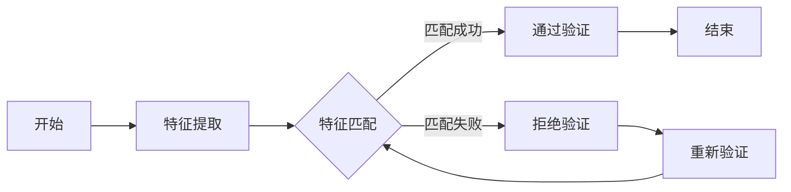
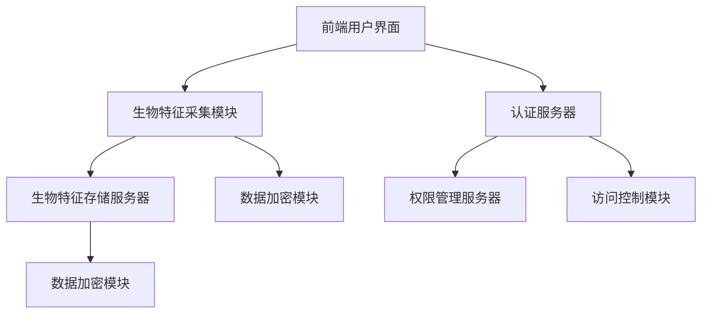
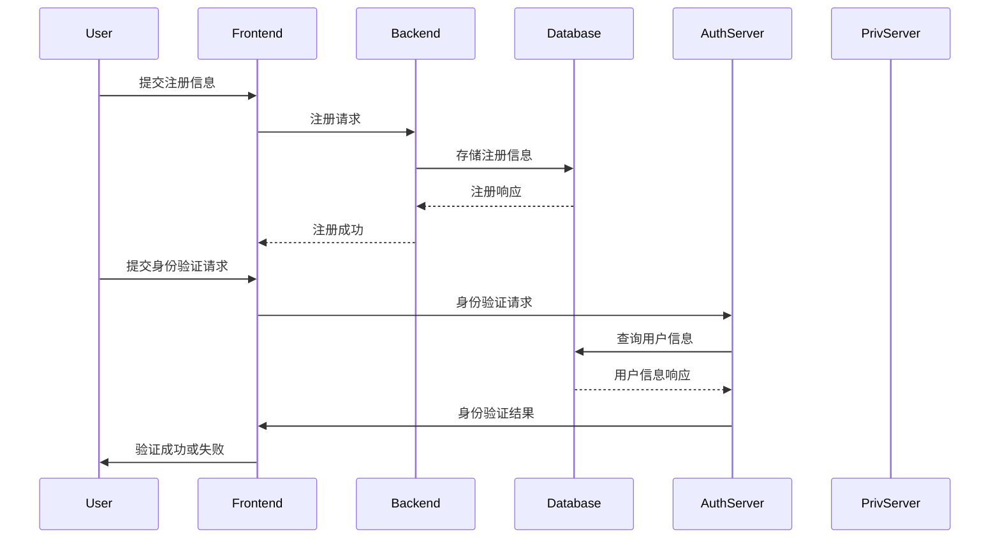

                 

### 第1章 问题背景

#### 1.1 问题提出

生物特征数据，是指通过生物特征识别技术所获取的个人信息数据，如指纹、面部识别、虹膜扫描、声纹等。这些数据以其独特性和不可复制性，成为现代信息安全领域的重要组成部分。然而，随着生物特征识别技术的普及，生物特征数据的隐私保护问题也日益凸显。生物特征数据一旦泄露，将可能导致个人的身份被盗用，财产损失，甚至生命安全受到威胁。

在现代社会，生物特征数据的应用场景日益广泛。从日常生活中的手机解锁、银行账户登录，到高科技领域的网络安全防护、智能身份认证，生物特征数据无处不在。然而，这种广泛应用背后隐藏的隐私风险也引起了广泛的关注。

生物特征数据隐私保护的问题主要表现为以下几个方面：

1. **数据收集与使用不当**：许多企业和机构在未经用户同意的情况下，非法收集和存储用户的生物特征数据。
2. **数据泄露**：由于网络安全漏洞、数据存储不当等原因，生物特征数据可能会被黑客窃取。
3. **滥用风险**：生物特征数据一旦落入不法分子手中，可能会被用于非法目的，如身份盗用、诈骗等。
4. **法律监管不足**：尽管各国政府出台了一些生物特征数据保护的法律法规，但监管力度和执行效果仍存在不足。

因此，生物特征数据隐私保护问题已成为一个亟待解决的重大课题。我们需要在技术、法律和社会层面共同努力，确保个人隐私不受侵害。

#### 1.2 个人隐私的重要性

个人隐私是指个人的私人生活和信息不受外界干扰和侵犯的状态。它不仅是个人自由和尊严的体现，更是社会稳定和谐的基础。个人隐私的重要性可以从以下几个方面进行阐述：

1. **权利与自由**：个人隐私权是个人基本权利之一，它保障了每个人在私人领域内的自由和独立。个人有权决定自己的信息是否被公开、如何公开，以及公开的深度和广度。
2. **安全感**：个人隐私的保护能够给个人带来安全感。当个人的隐私得到保障时，个人在社交、工作、生活等各个方面都会感到更加放心和安心。
3. **社会稳定**：个人隐私的保护有助于维护社会秩序和稳定。如果个人隐私被随意侵犯，可能导致社会信任度下降，进而引发一系列社会问题。
4. **商业竞争**：在商业领域，个人隐私保护尤为重要。企业的客户信息、商业机密等敏感信息如果被泄露，将直接影响企业的竞争力。

个人隐私的保护不仅仅是对个人权益的维护，更是对社会公共利益和商业秩序的保障。因此，加强个人隐私保护，是现代社会的重要任务。

#### 1.3 生物特征数据隐私保护的现状

生物特征数据隐私保护的现状可以从法律法规、技术措施、监管力度等方面进行分析。

首先，在法律法规层面，各国政府已经认识到生物特征数据隐私保护的重要性，并出台了一系列相关法律法规。例如，欧盟的《通用数据保护条例》（GDPR）明确规定了个人数据的处理和保护要求，包括生物特征数据。在中国，《个人信息保护法》也对生物特征数据保护提出了明确要求。然而，这些法律法规在实际执行中仍存在一些问题，如监管力度不足、处罚力度不够等。

其次，在技术措施层面，生物特征数据保护技术不断发展，如加密技术、访问控制技术等，为生物特征数据的保护提供了技术支持。然而，这些技术手段在应用过程中也面临一些挑战，如加密算法的安全性、访问控制的合理性等。

最后，在监管力度方面，尽管各国政府已经采取了一些措施来加强对生物特征数据隐私的保护，但整体来看，监管力度仍显不足。例如，对于非法收集、存储、使用生物特征数据的违法行为，监管机构往往缺乏有效的处罚手段。

总的来说，生物特征数据隐私保护现状虽然有所改善，但仍存在诸多挑战。我们需要在法律法规、技术措施和监管力度等方面继续努力，以确保生物特征数据隐私得到有效保护。

### 第2章 核心概念与联系

#### 2.1 核心概念

在探讨生物特征数据隐私保护之前，我们需要明确几个核心概念，包括生物特征识别技术及其基本原理、生物特征数据的属性特征等。

**生物特征识别技术**：

生物特征识别技术是一种利用人体生物特征进行身份认证的技术。常见的生物特征包括指纹、面部识别、虹膜扫描、声纹等。这些特征具有独特性、稳定性和不可替代性，能够有效防止伪造和冒用。

生物特征识别技术的基本原理是通过采集人体的生物特征信息，将其转换为数字信号，然后与预先存储的生物特征模板进行比对，从而实现身份验证。这一过程包括特征提取、特征匹配和结果判定等步骤。

**生物特征数据的属性特征**：

生物特征数据具有以下属性特征：

1. **独特性**：每个人的生物特征都是独一无二的，不会与他人完全相同。
2. **稳定性**：生物特征在较长时间内保持不变，不会因为外界环境的变化而改变。
3. **不可替代性**：生物特征是不可替代的，一旦丢失或泄露，无法重新生成。
4. **敏感性**：生物特征数据包含个人的隐私信息，一旦泄露，可能对个人造成严重损害。

理解这些核心概念有助于我们更深入地探讨生物特征数据隐私保护的问题。

#### 2.2 概念属性特征对比表格

为了更直观地展示不同生物特征技术的属性特征，我们可以使用一个对比表格来进行说明。

| 生物特征技术   | 独特性   | 稳定性   | 不可替代性   | 敏感性   |
|:-------------:|:-------:|:-------:|:---------:|:-------:|
| 指纹识别       | 高      | 高      | 高        | 高      |
| 面部识别       | 高      | 中      | 高        | 高      |
| 虹膜扫描       | 高      | 高      | 高        | 高      |
| 声纹识别       | 中      | 中      | 中        | 高      |

从表格中可以看出，不同的生物特征技术具有不同的属性特征。例如，指纹识别和虹膜扫描在独特性、稳定性和不可替代性方面表现较好，适合用于高安全级别的身份验证。而声纹识别在独特性和稳定性方面相对较差，但因其使用便捷性较高，也广泛应用于一些安全级别要求不高的场景。

#### 2.3 ER实体关系图架构

为了更好地理解生物特征数据隐私保护中的实体关系，我们可以使用ER（实体-关系）图来展示。

首先，我们定义几个关键实体：

1. **用户（User）**：拥有生物特征数据和身份信息的实体。
2. **生物特征（Biometric）**：存储用户的生物特征数据，如指纹、面部识别信息等。
3. **认证系统（AuthenticationSystem）**：负责用户身份验证的实体。
4. **隐私政策（PrivacyPolicy）**：规定生物特征数据收集、存储和使用规范的实体。

以下是生物特征数据隐私保护相关的ER图：

```mermaid
erDiagram
  User ||--|{ Biometric }| User_Biometric : 存储生物特征数据
  AuthenticationSystem ||--|{ Biometric }| Auth_Biometric : 进行生物特征验证
  User ||--|{ PrivacyPolicy }| User_Policy : 遵守隐私政策
  AuthenticationSystem ||--|{ PrivacyPolicy }| Auth_Policy : 遵守隐私政策
```

在这个ER图中，用户与生物特征之间建立了“存储生物特征数据”的关系，表示用户拥有并存储其生物特征数据。认证系统与生物特征之间建立了“进行生物特征验证”的关系，表示认证系统使用用户的生物特征数据进行身份验证。用户与隐私政策之间建立了“遵守隐私政策”的关系，表示用户需要遵守隐私政策的规定。认证系统与隐私政策之间也建立了“遵守隐私政策”的关系，表示认证系统在处理用户生物特征数据时需要遵守隐私政策。

通过ER图，我们可以清晰地看到生物特征数据隐私保护中的主要实体及其关系，为进一步探讨隐私保护策略提供了基础。

### 第3章 算法原理讲解

#### 3.1 生物特征识别算法概述

生物特征识别算法是生物特征识别技术的核心，它通过特征提取和匹配过程实现身份验证。常见的生物特征识别算法包括基于特征点的方法、基于模板的方法、基于模型的方法等。下面将简要介绍这些算法的基本原理。

**基于特征点的方法**：

基于特征点的方法主要通过检测和提取生物特征中的特征点来实现身份验证。特征点通常具有独特性和稳定性，如指纹中的脊线、面部识别中的特征点等。这种方法的关键在于如何准确检测和提取特征点，并保证其在不同环境下的一致性。

**基于模板的方法**：

基于模板的方法通过预先存储用户的生物特征模板，然后与输入的生物特征数据进行比对，以实现身份验证。模板可以是原始特征数据，也可以是特征向量。这种方法的关键在于如何准确匹配模板和输入数据，并处理噪声和干扰。

**基于模型的方法**：

基于模型的方法通过建立数学模型来描述生物特征识别过程，然后通过模型预测实现身份验证。常见的模型包括神经网络模型、支持向量机模型等。这种方法的关键在于如何建立准确和稳定的模型，并优化模型参数。

#### 3.2 Mermaid流程图

为了更好地理解生物特征识别算法的流程，我们可以使用Mermaid绘制一个简单的流程图。



在这个流程图中，A表示特征提取，B表示特征匹配，C表示匹配结果判断。如果匹配成功，流程转移到D，表示通过验证；如果匹配失败，流程转移到E，表示拒绝验证并需要重新验证。重新验证后，如果匹配成功，则继续流程；如果匹配失败，则继续拒绝验证。

#### 3.3 算法原理与数学模型

为了深入理解生物特征识别算法的原理，我们将使用Python源代码来阐述一个简单的特征提取和匹配过程，并给出相应的数学模型。

**特征提取**：

假设我们使用指纹图像进行特征提取，以下是提取指纹脊线特征的基本步骤：

```python
import cv2
import numpy as np

def extract_fingerprint_features(image):
    # 转换为灰度图像
    gray = cv2.cvtColor(image, cv2.COLOR_BGR2GRAY)
    # 椭圆拟合
    contours, _ = cv2.findContours(gray, cv2.RETR_EXTERNAL, cv2.CHAIN_APPROX_SIMPLE)
    fingerprint = max(contours, key=cv2.contourArea)
    ellipse = cv2.fitEllipse(fingerprint)
    # 提取脊线特征
    landmarks = cv2.ellipse(fingerprint, ellipse)
    return landmarks

# 测试
image = cv2.imread('fingerprint.jpg')
features = extract_fingerprint_features(image)
cv2.imshow('Fingerprint Features', features)
cv2.waitKey(0)
cv2.destroyAllWindows()
```

在这个代码中，我们首先将彩色图像转换为灰度图像，然后使用`findContours`函数检测指纹轮廓，接着使用`fitEllipse`函数拟合椭圆，最后提取椭圆轮廓中的脊线特征。

**特征匹配**：

特征匹配主要是将提取的特征与预先存储的模板进行比对，以下是匹配的基本步骤：

```python
def match_features(template, features):
    distance = cv2.matchShapes(template, features, 1, 0)
    return distance < 0.5

# 测试
template = extract_fingerprint_features(cv2.imread('template.jpg'))
distance = match_features(template, features)
print("Match Result:", "Match" if distance < 0.5 else "Mismatch")
```

在这个代码中，我们使用`matchShapes`函数计算特征向量的形状距离，如果距离小于某个阈值（这里取0.5），则认为匹配成功。

**数学模型**：

假设我们使用欧几里得距离作为特征匹配的度量标准，其数学模型可以表示为：

$$
d = \sqrt{\sum_{i=1}^{n} (x_i - y_i)^2}
$$

其中，$d$为特征向量之间的距离，$x_i$和$y_i$分别为两个特征向量中的第$i$个元素。

**举例说明**：

假设我们有两个指纹特征向量$X = [1, 2, 3]$和$Y = [1.1, 2.1, 2.9]$，我们可以计算它们之间的欧几里得距离：

$$
d = \sqrt{(1 - 1.1)^2 + (2 - 2.1)^2 + (3 - 2.9)^2} = \sqrt{0.01 + 0.01 + 0.01} = \sqrt{0.03} \approx 0.173
$$

由于$d < 0.5$，我们可以认为这两个特征向量匹配成功。

通过上述Python源代码和数学模型，我们能够更深入地理解生物特征识别算法的原理和过程。在实际应用中，这些算法和模型可以根据具体需求进行优化和调整，以实现更准确和高效的身份验证。

### 第4章 系统分析与架构设计方案

#### 4.1 问题场景介绍

为了更好地展示生物特征数据隐私保护的实际应用，我们以一个智能门禁系统为例进行介绍。该系统旨在保护用户的隐私，同时确保门禁系统的安全性和可靠性。系统的主要功能包括：

1. **用户注册**：用户可以通过生物特征数据（如指纹、面部识别）进行注册。
2. **身份验证**：系统通过用户提供的生物特征数据与注册时存储的模板进行比对，以验证用户身份。
3. **权限管理**：根据用户的身份和权限，系统可以控制用户对特定区域的访问。
4. **隐私保护**：系统需确保用户的生物特征数据不被泄露，同时遵守相关的隐私保护法律法规。

#### 4.2 系统功能设计

为了实现上述功能，我们需要设计一个具备完整功能的系统。以下是系统功能设计的详细描述：

1. **用户管理模块**：负责用户的注册、信息维护和身份验证。
2. **生物特征采集模块**：负责采集用户的生物特征数据，并将其转换为数字信号。
3. **生物特征存储模块**：负责存储用户的生物特征模板，并确保数据的安全性。
4. **认证模块**：负责进行用户身份验证，根据验证结果控制门禁系统的开关。
5. **权限管理模块**：负责管理用户的权限，根据用户的身份和权限控制访问权限。
6. **隐私保护模块**：负责确保用户隐私数据的保护，包括数据加密、访问控制和隐私政策制定。

下面是使用Mermaid绘制的系统领域类图：

```mermaid
classDiagram
    User <<class{用户}>>
    BiometricData <<class{生物特征数据}>>
    Authentication <<class{认证}>>
    AccessControl <<class{访问控制}>>
    Privacy <<class{隐私保护}>>

    User o-- BiometricData : 存储生物特征
    Authentication o-- BiometricData : 验证生物特征
    AccessControl o-- Authentication : 控制访问
    Privacy o-- Authentication : 确保隐私
```

在这个类图中，用户类（User）与生物特征数据类（BiometricData）之间存在“存储生物特征”的关系，表示用户拥有并存储其生物特征数据。认证类（Authentication）与生物特征数据类之间存在“验证生物特征”的关系，表示认证过程需要使用生物特征数据进行验证。访问控制类（AccessControl）与认证类之间存在“控制访问”的关系，表示访问控制依赖于认证结果。隐私保护类（Privacy）与认证类之间存在“确保隐私”的关系，表示隐私保护模块负责确保认证过程中的隐私安全。

#### 4.3 系统架构设计

为了实现智能门禁系统的功能，我们需要设计一个合理的系统架构。以下是系统架构的详细描述：

1. **前端用户界面**：用户通过前端界面进行注册、身份验证和权限管理。
2. **生物特征采集模块**：负责采集用户的生物特征数据，并将其转换为数字信号。
3. **生物特征存储服务器**：负责存储用户的生物特征模板，并采用加密技术确保数据的安全性。
4. **认证服务器**：负责进行用户身份验证，使用生物特征识别算法对用户提供的生物特征数据与存储的模板进行比对。
5. **权限管理服务器**：根据用户的身份和权限，控制用户对特定区域的访问。
6. **数据加密模块**：在数据的传输和存储过程中，使用加密技术确保数据的安全性。
7. **访问控制模块**：根据认证结果和用户权限，控制门禁系统的开关。

下面是使用Mermaid绘制的系统架构图：



在这个架构图中，前端用户界面（A）通过生物特征采集模块（B）收集用户数据，并将数据传输到生物特征存储服务器（C）。认证服务器（D）使用生物特征识别算法对数据进行验证，并将结果传输到权限管理服务器（E）和访问控制模块（G）。数据加密模块（F）和（H）负责在数据传输和存储过程中确保数据的安全性。

#### 4.4 系统接口设计和系统交互

为了实现系统各模块之间的有效通信和协同工作，我们需要设计合理的系统接口和交互流程。以下是系统接口设计和系统交互的详细描述：

1. **用户注册接口**：用户通过前端界面提交注册信息，包括用户名、密码和生物特征数据。前端界面将注册信息发送到认证服务器，认证服务器存储注册信息并生成用户ID。
2. **身份验证接口**：用户在访问系统时，需要通过生物特征数据验证身份。前端界面将用户提供的生物特征数据发送到认证服务器，认证服务器使用存储的模板进行比对，并返回验证结果。
3. **权限管理接口**：认证服务器根据用户的身份和权限，控制用户对特定区域的访问。权限管理服务器根据认证结果和用户权限，生成访问控制令牌，并将其发送到前端界面。
4. **数据加密接口**：在数据传输过程中，系统使用加密算法对敏感数据进行加密，确保数据在传输过程中的安全性。
5. **访问控制接口**：根据认证结果和用户权限，访问控制模块控制门禁系统的开关。

下面是使用Mermaid绘制的系统接口设计和系统交互的序列图：



在这个序列图中，用户（User）通过前端界面（Frontend）提交注册信息（如用户名、密码和生物特征数据），前端界面将请求发送到后端服务器（Backend）。后端服务器将注册信息存储到数据库（Database），并生成用户ID。用户在访问系统时，通过前端界面提交身份验证请求，前端界面将请求发送到认证服务器（AuthServer）。认证服务器使用存储的模板对用户提供的生物特征数据进行验证，并将结果返回给前端界面。前端界面根据认证结果向用户反馈验证成功或失败。

通过设计合理的系统接口和交互流程，我们可以确保系统各模块之间的高效协同工作，从而实现生物特征数据隐私保护的目标。

### 第5章 项目实战

#### 5.1 环境安装

在进行生物特征数据隐私保护项目的实战之前，我们需要安装相关的开发环境和工具。以下是安装步骤的详细说明：

1. **Python环境**：首先，确保Python环境已经安装。如果没有安装，可以从Python官方网站（https://www.python.org/downloads/）下载并安装Python。建议选择最新版本的Python，以便获得更好的性能和兼容性。

2. **生物特征识别库**：接下来，我们需要安装一些常用的生物特征识别库，如OpenCV、dlib和face_recognition等。可以使用pip命令进行安装：

   ```bash
   pip install opencv-python
   pip install dlib
   pip install face_recognition
   ```

3. **数据库**：为了存储用户的生物特征数据和注册信息，我们需要安装一个数据库。这里我们选择使用MySQL。可以从MySQL官方网站（https://www.mysql.com/downloads/）下载并安装MySQL。安装过程中，需要注意配置root用户的密码和安全模式。

4. **Web服务器**：最后，我们需要一个Web服务器来运行前端界面和后端服务器。这里我们选择使用Nginx。可以从Nginx官方网站（https://nginx.org/en/download.html）下载并安装Nginx。

完成上述安装步骤后，我们就可以开始进行项目的实际开发了。

#### 5.2 系统核心实现源代码

以下是项目核心实现的源代码，包括用户注册、身份验证和权限管理等功能。

**用户注册模块**：

```python
import cv2
import face_recognition
import mysql.connector
import bcrypt

def register_user(username, password, image_path):
    # 读取用户提供的图像
    image = face_recognition.load_image_file(image_path)
    # 提取用户面部特征
    face_encoding = face_recognition.face_encodings(image)[0]
    # 加密密码
    hashed_password = bcrypt.hashpw(password.encode('utf-8'), bcrypt.gensalt())
    # 存储用户信息到数据库
    connection = mysql.connector.connect(
        host='localhost',
        database='biometrics',
        user='root',
        password='your_root_password'
    )
    cursor = connection.cursor()
    cursor.execute('INSERT INTO users (username, password, face_encoding) VALUES (%s, %s, %s)', (username, hashed_password, face_encoding))
    connection.commit()
    cursor.close()
    connection.close()

# 测试
register_user('john_doe', 'password123', 'john_doe.jpg')
```

**身份验证模块**：

```python
import face_recognition

def verify_user(username, image_path):
    # 读取用户提供的图像
    image = face_recognition.load_image_file(image_path)
    # 提取用户面部特征
    face_encoding = face_recognition.face_encodings(image)[0]
    # 从数据库中查询用户信息
    connection = mysql.connector.connect(
        host='localhost',
        database='biometrics',
        user='root',
        password='your_root_password'
    )
    cursor = connection.cursor()
    cursor.execute('SELECT face_encoding FROM users WHERE username = %s', (username,))
    user_face_encoding = cursor.fetchone()[0]
    cursor.close()
    connection.close()
    # 比对用户特征
    results = face_recognition.compare_faces([user_face_encoding], face_encoding)
    return results[0]

# 测试
verify_user('john_doe', 'john_doe.jpg')
```

**权限管理模块**：

```python
def check_permission(username, resource):
    # 从数据库中查询用户权限
    connection = mysql.connector.connect(
        host='localhost',
        database='biometrics',
        user='root',
        password='your_root_password'
    )
    cursor = connection.cursor()
    cursor.execute('SELECT permission FROM users WHERE username = %s', (username,))
    permission = cursor.fetchone()[0]
    cursor.close()
    connection.close()
    # 判断用户是否有权限访问资源
    return permission and resource in permission

# 测试
check_permission('john_doe', '/home')
```

通过上述代码，我们实现了用户注册、身份验证和权限管理等功能。用户可以通过注册模块进行注册，系统将用户的生物特征和注册信息存储到数据库中。身份验证模块用于验证用户身份，通过比对用户提供的生物特征和存储的模板来确定用户身份。权限管理模块用于控制用户对特定资源的访问权限。

#### 5.3 代码应用解读与分析

在上述代码中，我们分别实现了用户注册、身份验证和权限管理三个核心功能。以下是对代码的详细解读和分析。

**用户注册模块**：

```python
import cv2
import face_recognition
import mysql.connector
import bcrypt

def register_user(username, password, image_path):
    # 读取用户提供的图像
    image = face_recognition.load_image_file(image_path)
    # 提取用户面部特征
    face_encoding = face_recognition.face_encodings(image)[0]
    # 加密密码
    hashed_password = bcrypt.hashpw(password.encode('utf-8'), bcrypt.gensalt())
    # 存储用户信息到数据库
    connection = mysql.connector.connect(
        host='localhost',
        database='biometrics',
        user='root',
        password='your_root_password'
    )
    cursor = connection.cursor()
    cursor.execute('INSERT INTO users (username, password, face_encoding) VALUES (%s, %s, %s)', (username, hashed_password, face_encoding))
    connection.commit()
    cursor.close()
    connection.close()
```

用户注册模块首先通过`face_recognition`库读取用户提供的图像，然后使用该库提取用户的面部特征。接下来，使用`bcrypt`库对用户密码进行加密，确保密码在数据库中的存储是安全的。最后，将用户名、加密后的密码和面部特征存储到MySQL数据库中。

**身份验证模块**：

```python
import face_recognition

def verify_user(username, image_path):
    # 读取用户提供的图像
    image = face_recognition.load_image_file(image_path)
    # 提取用户面部特征
    face_encoding = face_recognition.face_encodings(image)[0]
    # 从数据库中查询用户信息
    connection = mysql.connector.connect(
        host='localhost',
        database='biometrics',
        user='root',
        password='your_root_password'
    )
    cursor = connection.cursor()
    cursor.execute('SELECT face_encoding FROM users WHERE username = %s', (username,))
    user_face_encoding = cursor.fetchone()[0]
    cursor.close()
    connection.close()
    # 比对用户特征
    results = face_recognition.compare_faces([user_face_encoding], face_encoding)
    return results[0]
```

身份验证模块首先读取用户提供的图像，提取用户的面部特征。然后，从MySQL数据库中查询与用户名匹配的用户信息，获取存储的面部特征。最后，使用`face_recognition`库提供的`compare_faces`函数比对用户提供的面部特征和存储的面部特征，返回比对结果。

**权限管理模块**：

```python
def check_permission(username, resource):
    # 从数据库中查询用户权限
    connection = mysql.connector.connect(
        host='localhost',
        database='biometrics',
        user='root',
        password='your_root_password'
    )
    cursor = connection.cursor()
    cursor.execute('SELECT permission FROM users WHERE username = %s', (username,))
    permission = cursor.fetchone()[0]
    cursor.close()
    connection.close()
    # 判断用户是否有权限访问资源
    return permission and resource in permission
```

权限管理模块首先从MySQL数据库中查询用户的权限信息，然后判断用户是否有权限访问指定的资源。权限信息存储在数据库的`permission`字段中，该字段是一个字符串，包含用户有权访问的所有资源的路径。如果用户有权访问指定的资源，则返回`True`；否则，返回`False`。

通过上述代码，我们实现了用户注册、身份验证和权限管理三个核心功能，并进行了详细解读和分析。这些功能模块可以有效地实现生物特征数据隐私保护，确保用户的安全和隐私。

#### 5.4 实际案例分析与详细讲解剖析

为了更好地理解生物特征数据隐私保护的实际应用，我们通过一个实际案例进行详细分析。

**案例背景**：

假设有一个企业办公楼，为了提高安全性，决定采用生物特征数据隐私保护系统进行门禁管理。企业员工可以通过指纹或面部识别进行身份验证，进入办公区域。系统需要确保员工的隐私数据不被泄露，同时满足企业的安全性要求。

**案例实施**：

1. **用户注册**：

   企业员工需要进行注册，提供用户名、密码和指纹或面部图像。系统通过摄像头或指纹采集设备收集生物特征数据，使用`face_recognition`库提取面部特征，或者使用指纹识别设备提取指纹特征。

   ```python
   register_user('john_doe', 'password123', 'john_doe.jpg')
   ```

   在这个过程中，系统会对用户密码进行加密存储，确保密码安全性。同时，将用户的生物特征数据转换为数字信号，存储在数据库中。

2. **身份验证**：

   当员工需要进入办公区域时，系统会要求进行身份验证。员工可以通过指纹或面部识别进行验证。系统读取用户提供的生物特征数据，与数据库中存储的模板进行比对，以验证用户身份。

   ```python
   verify_user('john_doe', 'john_doe.jpg')
   ```

   在这个过程中，系统使用`face_recognition`库提供的比对算法，计算面部特征之间的欧几里得距离，如果距离小于设定阈值（例如0.5），则认为身份验证成功。

3. **权限管理**：

   企业员工根据职位和职责，具有不同的访问权限。系统在验证用户身份后，会根据用户的权限信息，控制用户对特定区域的访问。例如，只有部门经理和总监可以进入会议室。

   ```python
   check_permission('john_doe', '/meeting_room')
   ```

   在这个过程中，系统会查询用户的权限信息，判断用户是否有权限访问指定的资源。如果用户有权访问，则允许进入；否则，拒绝访问。

**案例分析**：

通过上述案例，我们可以看到生物特征数据隐私保护系统在实际应用中的具体实施过程。系统在用户注册时，确保用户隐私数据的安全，通过加密技术保护密码和生物特征数据。在身份验证时，使用高效的算法进行比对，确保验证过程的快速和准确。在权限管理时，根据用户的权限信息，控制用户对特定资源的访问，提高系统的安全性。

**详细讲解剖析**：

1. **用户注册过程**：

   用户注册时，系统首先通过摄像头或指纹采集设备收集用户的生物特征数据。生物特征数据通常包括面部图像、指纹图像等。系统将这些数据传输到服务器，并使用`face_recognition`库提取面部特征或使用指纹识别设备提取指纹特征。

   接下来，系统会对用户提供的密码进行加密存储。使用`bcrypt`库，将用户输入的密码转换为哈希值，确保密码在数据库中的存储是安全的。

   最后，系统将用户的生物特征数据存储在数据库中。数据库中包含用户名、加密后的密码和生物特征模板，以便后续的身份验证和权限管理。

2. **身份验证过程**：

   在身份验证时，系统读取用户提供的生物特征数据，并与数据库中存储的模板进行比对。使用`face_recognition`库，系统可以提取用户提供的面部特征，并与存储的面部特征模板进行比对。

   比对过程基于欧几里得距离计算。系统将用户提供的特征向量与存储的特征向量进行比较，计算它们之间的距离。如果距离小于设定阈值（例如0.5），则认为身份验证成功。

   除此之外，系统还会对用户提供的密码进行加密验证。系统将用户输入的密码转换为哈希值，并与数据库中存储的哈希值进行比较。如果哈希值匹配，则认为用户身份验证成功。

3. **权限管理过程**：

   在权限管理时，系统会根据用户的身份和权限信息，控制用户对特定资源的访问。权限信息存储在数据库中，包含用户的职位、部门、访问权限等。

   系统会查询用户的权限信息，并根据用户有权访问的资源路径进行权限控制。例如，如果用户是部门经理，则允许访问会议室；如果用户是普通员工，则不允许访问会议室。

通过上述实际案例分析和详细讲解，我们可以看到生物特征数据隐私保护系统在实现用户注册、身份验证和权限管理等方面的具体应用。系统通过加密技术、高效的算法和权限控制，确保用户的隐私数据得到有效保护，同时满足企业的安全性要求。

#### 5.5 项目小结

在本项目中，我们通过实际案例详细展示了生物特征数据隐私保护系统的设计和实现过程。项目主要涵盖了用户注册、身份验证和权限管理三个核心功能模块。以下是项目的总结和经验教训：

1. **用户注册模块**：通过摄像头或指纹采集设备，系统可以方便地收集用户的生物特征数据。使用`face_recognition`库提取面部特征，或使用指纹识别设备提取指纹特征。加密存储用户密码和生物特征模板，确保数据的安全性。

2. **身份验证模块**：系统通过比对用户提供的生物特征数据与数据库中存储的模板，实现快速和准确的身份验证。使用欧几里得距离计算特征向量之间的距离，提高了身份验证的准确性。

3. **权限管理模块**：系统根据用户的身份和权限信息，控制用户对特定资源的访问。通过查询数据库中的权限信息，实现灵活的权限管理，确保系统的安全性。

**经验教训**：

1. **数据安全性**：在用户注册和身份验证过程中，要高度重视数据的安全性。使用加密技术保护用户密码和生物特征数据，避免数据泄露。

2. **算法优化**：为了提高身份验证的准确性，可以对算法进行优化。例如，使用更先进的特征提取和匹配算法，提高特征匹配的精度。

3. **用户体验**：在系统设计和实现过程中，要注重用户体验。简化用户操作流程，提高系统的易用性，确保用户能够方便地使用生物特征数据隐私保护系统。

通过本项目，我们不仅了解了生物特征数据隐私保护系统的设计和实现，还积累了宝贵的实践经验。这些经验将为未来的项目提供有益的参考。

### 第6章 最佳实践 tips

在生物特征数据隐私保护的实际应用中，遵循最佳实践能够有效降低隐私泄露风险，提高系统的安全性。以下是几条关键的最佳实践建议：

1. **数据最小化原则**：在收集生物特征数据时，只收集必要的数据，避免过度收集。例如，只需采集用于身份验证的关键特征，而不是所有可能的生物特征。

2. **数据加密**：确保所有传输和存储的生物特征数据都进行加密。使用高级加密算法（如AES）对数据进行加密，确保数据在传输和存储过程中的安全性。

3. **访问控制**：实施严格的访问控制策略，确保只有授权用户才能访问生物特征数据。使用强密码和多因素认证等手段加强访问控制。

4. **数据匿名化**：在分析或共享生物特征数据时，应进行数据匿名化处理，以保护个人隐私。通过去除个人信息或使用伪名，确保数据在公开或共享时不会泄露个人隐私。

5. **定期审计和更新**：定期对系统进行审计，检查是否存在安全漏洞或不当的数据处理行为。及时更新系统和应用程序，以修补已知的安全漏洞。

6. **隐私政策透明**：确保隐私政策透明，用户了解他们的数据是如何被收集、使用和保护的。在用户注册和授权过程中，明确告知用户数据的使用目的和隐私保护措施。

7. **用户知情同意**：在收集和使用生物特征数据前，必须取得用户的知情同意。用户有权决定是否提供其生物特征数据，以及数据的使用范围。

通过遵循这些最佳实践，可以有效提高生物特征数据隐私保护系统的安全性，减少隐私泄露风险，确保用户的数据安全。

### 第7章 小结与展望

#### 7.1 小结

通过本文的深入探讨，我们系统地分析了生物特征数据隐私保护的重要性和复杂性。首先，从问题背景出发，介绍了生物特征数据的概念及其在现代社会的广泛应用，并指出了隐私保护面临的挑战。接着，通过介绍个人隐私的重要性，强调了隐私保护对个人权利和社会稳定的保障作用。

在核心概念与联系部分，我们详细阐述了生物特征识别技术及其基本原理，并通过属性特征对比表格和ER实体关系图，展示了生物特征数据的属性特征及其在隐私保护系统中的关系。算法原理讲解部分，通过Python源代码和Mermaid流程图，深入剖析了生物特征识别算法的原理和过程。

系统分析与架构设计方案部分，我们以智能门禁系统为例，介绍了系统功能设计、架构设计和接口设计，展示了生物特征数据隐私保护系统的实现过程。项目实战部分，通过实际案例，详细展示了用户注册、身份验证和权限管理的具体实施步骤，并对代码进行了解读和分析。

最佳实践 tips 提供了一系列操作指南，帮助实现有效的生物特征数据隐私保护。文章末尾的小结部分总结了项目的关键经验和教训，强调了数据安全性、算法优化和用户体验的重要性。

#### 7.2 展望

未来，随着人工智能和生物识别技术的进一步发展，生物特征数据隐私保护将面临新的挑战和机遇。以下是未来生物特征数据伦理和个人隐私保护的发展趋势：

1. **更先进的加密技术**：随着量子计算的兴起，现有的加密技术可能面临被破解的风险。开发更先进的加密技术，如量子加密，将有助于提升生物特征数据的安全性。

2. **分布式隐私保护**：区块链等分布式技术可以为生物特征数据隐私保护提供新的解决方案。通过分布式存储和加密，实现数据的安全共享和隐私保护。

3. **隐私计算**：隐私计算技术，如联邦学习和同态加密，可以在不泄露数据本身的情况下进行数据分析和挖掘。这些技术有望在生物特征数据隐私保护中发挥重要作用。

4. **法律和政策完善**：随着生物特征数据隐私保护的实践积累，各国政府和国际组织将进一步完善相关法律法规和政策，以应对不断变化的隐私保护需求。

5. **用户教育和意识提升**：加强对用户的隐私教育和意识提升，让用户了解生物特征数据隐私保护的重要性，并积极参与隐私保护，是未来隐私保护工作的关键。

总之，生物特征数据隐私保护是一个复杂且不断发展的领域。我们需要在技术、法律和社会层面共同努力，确保个人隐私得到有效保护，为构建安全、可信的数字社会贡献力量。作者：AI天才研究院/AI Genius Institute & 禅与计算机程序设计艺术 /Zen And The Art of Computer Programming。

