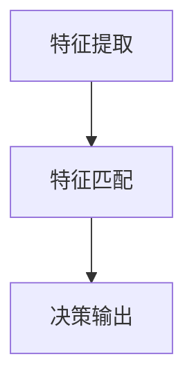
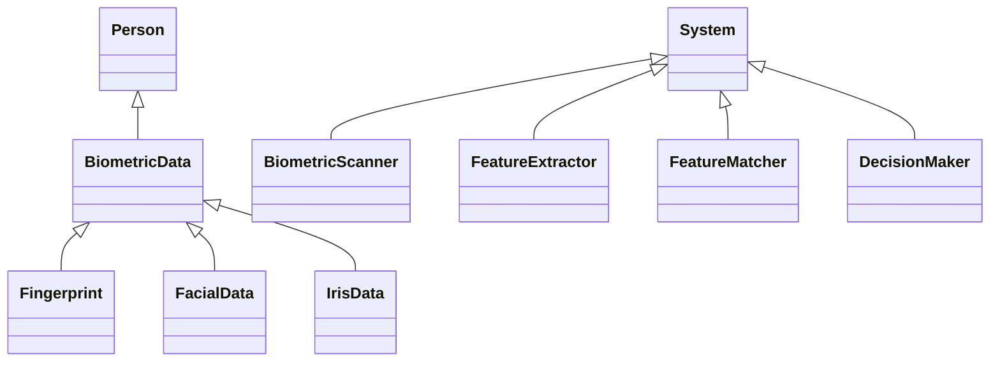
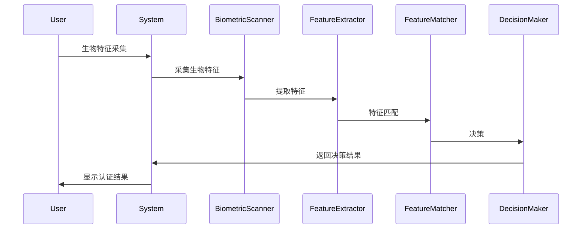

                 


### 生物特征识别：身份认证的伦理困境

关键词：生物特征识别，身份认证，伦理困境，隐私保护，数据安全

摘要：随着生物特征识别技术的迅速发展，其在身份认证领域的应用越来越广泛。然而，这一技术的普及也带来了一系列的伦理困境，包括隐私保护、数据安全、平等与公正问题等。本文将深入探讨生物特征识别技术的基本原理、应用场景，以及其在身份认证过程中引发的伦理困境，并通过具体的案例分析，提出解决这些困境的最佳实践和注意事项。

## 目录大纲

### 第一部分：背景介绍

#### 第1章：问题背景

##### 1.1.1 生物特征识别技术的发展历程

##### 1.1.2 身份认证的应用场景

##### 1.1.3 生物特征识别的伦理困境

### 第二部分：核心概念与联系

#### 第2章：核心概念与联系

##### 2.1.1 生物特征识别的核心概念

###### 2.1.1.1 生物特征识别的基本原理

###### 2.1.1.2 生物特征的分类

###### 2.1.1.3 生物特征识别的优势与不足

##### 2.1.2 伦理困境的解析

###### 2.1.2.1 隐私保护与数据安全

###### 2.1.2.2 平等与公正问题

###### 2.1.2.3 社会接受度与隐私权

### 第三部分：算法原理讲解

#### 第3章：生物特征识别算法原理

##### 3.1.1 生物特征识别算法概述

###### 3.1.1.1 生物特征识别算法的分类

###### 3.1.1.2 生物特征识别算法的核心步骤

##### 3.1.2 算法流程图

###### 3.1.2.1 特征提取

###### 3.1.2.2 特征匹配

###### 3.1.2.3 决策输出

##### 3.1.3 Python代码实现

###### 3.1.3.1 特征提取模块

###### 3.1.3.2 特征匹配模块

###### 3.1.3.3 决策模块

### 第四部分：数学模型和公式

#### 第4章：数学模型和公式

##### 4.1.1 数学模型概述

###### 4.1.1.1 特征提取模型的数学公式

###### 4.1.1.2 特征匹配模型的数学公式

###### 4.1.1.3 决策模型的数学公式

##### 4.1.2 详细讲解与举例

###### 4.1.2.1 特征提取模型

$$
x=\sum_{i=1}^{n} w_i x_i
$$

###### 4.1.2.2 特征匹配模型

$$
d(x,y)=\sqrt{\sum_{i=1}^{n} (x_i - y_i)^2}
$$

###### 4.1.2.3 决策模型

$$
z=\sum_{i=1}^{n} w_i d(x_i,y)
$$

### 第五部分：系统分析与架构设计方案

#### 第5章：系统分析与架构设计方案

##### 5.1.1 问题场景介绍

##### 5.1.2 项目介绍

##### 5.1.3 系统功能设计

###### 5.1.3.1 领域模型

###### 5.1.3.2 系统功能模块划分

##### 5.1.4 系统架构设计

###### 5.1.4.1 系统架构图

###### 5.1.4.2 系统模块交互

##### 5.1.5 系统接口设计

##### 5.1.6 系统交互

### 第六部分：项目实战

#### 第6章：项目实战

##### 6.1.1 环境安装

##### 6.1.2 系统核心实现

##### 6.1.3 代码应用解读与分析

##### 6.1.4 实际案例分析与详细讲解剖析

##### 6.1.5 项目小结

### 第七部分：最佳实践与注意事项

#### 第7章：最佳实践与注意事项

##### 7.1.1 生物特征识别项目的最佳实践

##### 7.1.2 小结与展望

##### 7.1.3 注意事项与风险规避

##### 7.1.4 拓展阅读

---

### 第一部分：背景介绍

## 第1章：问题背景

### 1.1.1 生物特征识别技术的发展历程

生物特征识别技术的发展可以追溯到20世纪60年代，当时科学家首次提出使用指纹识别来进行身份验证。随着时间的推移，生物特征识别技术逐渐成熟，并开始应用于实际场景中。

在20世纪90年代，随着计算机技术和图像处理算法的进步，面部识别技术得到了快速发展。随后，虹膜识别、声纹识别等技术也相继出现，使得生物特征识别的应用范围进一步扩大。

### 1.1.2 身份认证的应用场景

身份认证是生物特征识别技术的核心应用场景之一。在金融领域，生物特征识别技术被广泛应用于银行卡身份验证、ATM取款等场景。在医疗领域，生物特征识别技术可用于患者身份的确认，以确保医疗服务的准确和安全。

此外，随着物联网技术的发展，生物特征识别技术也在智能家居、智能交通等领域得到了广泛应用。例如，通过人脸识别技术实现门禁系统的自动化管理，通过指纹识别技术实现智能设备的解锁等。

### 1.1.3 生物特征识别的伦理困境

生物特征识别技术的广泛应用也引发了一系列的伦理困境。首先，生物特征具有唯一性和不可替代性，一旦泄露，将可能导致个人隐私的严重侵犯。例如，2017年，美国的创企Clarifai因数据泄露事件，导致近6000万用户的个人信息被泄露。

其次，生物特征识别技术在应用过程中，可能会因为算法的不公正、数据的不对称等原因，导致某些人群被歧视。例如，一些研究表明，面部识别技术在识别黑人和亚洲人时存在更高的错误率。

此外，生物特征数据的存储和管理也存在安全风险。如果生物特征数据被黑客获取，将可能导致严重的后果。

## 第二部分：核心概念与联系

### 第2章：核心概念与联系

### 2.1.1 生物特征识别的核心概念

#### 2.1.1.1 生物特征识别的基本原理

生物特征识别技术的基本原理是通过提取和识别个人的生物特征来实现身份认证。具体来说，首先对个人的生物特征进行采集，如指纹、面部、虹膜等，然后通过算法对这些特征进行提取和比对，从而确定个人身份。

#### 2.1.1.2 生物特征的分类

生物特征可以分为两类：静态生物特征和动态生物特征。静态生物特征包括指纹、面部、虹膜等，这些特征在个人的一生中基本保持不变。动态生物特征包括声纹、笔迹、步态等，这些特征随着个人的行为而变化。

#### 2.1.1.3 生物特征识别的优势与不足

生物特征识别技术具有很多优势，如准确性高、操作简单等。然而，它也存在一些不足，如易受环境因素干扰、对硬件设备要求高等。

### 2.1.2 伦理困境的解析

#### 2.1.2.1 隐私保护与数据安全

生物特征识别技术的一大伦理困境是隐私保护与数据安全。由于生物特征具有唯一性和不可替代性，一旦泄露，将可能导致个人隐私的严重侵犯。

#### 2.1.2.2 平等与公正问题

生物特征识别技术在应用过程中，可能会因为算法的不公正、数据的不对称等原因，导致某些人群被歧视。

#### 2.1.2.3 社会接受度与隐私权

生物特征识别技术的普及也需要考虑到社会接受度与隐私权的问题。如何在保障用户隐私的同时，提高认证的准确性，是一个亟待解决的问题。

## 第三部分：算法原理讲解

### 第3章：生物特征识别算法原理

### 3.1.1 生物特征识别算法概述

生物特征识别算法可以分为三个主要步骤：特征提取、特征匹配和决策输出。

#### 3.1.1.1 生物特征识别算法的分类

生物特征识别算法主要可以分为基于模板匹配和基于统计模型两大类。

#### 3.1.1.2 生物特征识别算法的核心步骤

1. 特征提取：从生物特征数据中提取出具有代表性的特征向量。
2. 特征匹配：将提取出的特征向量与数据库中的特征向量进行匹配。
3. 决策输出：根据匹配结果做出决策，判断是否为同一身份。

### 3.1.2 算法流程图



#### 3.1.2.1 特征提取

特征提取是生物特征识别算法的第一步。其目的是从原始生物特征数据中提取出具有代表性的特征向量。

#### 3.1.2.2 特征匹配

特征匹配是生物特征识别算法的第二步。其目的是将提取出的特征向量与数据库中的特征向量进行匹配，以确定是否为同一身份。

#### 3.1.2.3 决策输出

决策输出是生物特征识别算法的第三步。其目的是根据匹配结果做出决策，判断是否为同一身份。

### 3.1.3 Python代码实现

```python
# 特征提取模块
def extract_features(data):
    # 特征提取算法的具体实现
    return features

# 特征匹配模块
def match_features(feature1, feature2):
    # 特征匹配算法的具体实现
    return similarity

# 决策模块
def make_decision(similarity_threshold, similarity):
    if similarity > similarity_threshold:
        return "匹配成功"
    else:
        return "匹配失败"
```

## 第四部分：数学模型和公式

### 第4章：数学模型和公式

### 4.1.1 数学模型概述

生物特征识别算法的数学模型主要包括特征提取模型、特征匹配模型和决策模型。

#### 4.1.1.1 特征提取模型的数学公式

特征提取模型可以用以下公式表示：

$$
x=\sum_{i=1}^{n} w_i x_i
$$

其中，$x$ 是特征向量，$w_i$ 是权重，$x_i$ 是第 $i$ 个特征。

#### 4.1.1.2 特征匹配模型的数学公式

特征匹配模型可以用以下公式表示：

$$
d(x,y)=\sqrt{\sum_{i=1}^{n} (x_i - y_i)^2}
$$

其中，$d(x,y)$ 是特征向量的距离，$x$ 和 $y$ 是两个特征向量。

#### 4.1.1.3 决策模型的数学公式

决策模型可以用以下公式表示：

$$
z=\sum_{i=1}^{n} w_i d(x_i,y)
$$

其中，$z$ 是决策变量，$w_i$ 是权重，$d(x_i,y)$ 是特征向量的距离。

### 4.1.2 详细讲解与举例

#### 4.1.2.1 特征提取模型

特征提取模型的核心是提取出生物特征数据中的关键特征。以下是一个简单的特征提取模型示例：

$$
x=\sum_{i=1}^{n} w_i x_i
$$

其中，$x$ 是特征向量，$w_i$ 是权重，$x_i$ 是第 $i$ 个特征。

例如，假设我们有一个包含10个特征的生物特征数据，每个特征的权重分别为 $w_1, w_2, ..., w_{10}$。那么，特征向量 $x$ 可以表示为：

$$
x=w_1 x_1 + w_2 x_2 + ... + w_{10} x_{10}
$$

#### 4.1.2.2 特征匹配模型

特征匹配模型用于计算两个特征向量之间的距离。以下是一个简单的特征匹配模型示例：

$$
d(x,y)=\sqrt{\sum_{i=1}^{n} (x_i - y_i)^2}
$$

其中，$d(x,y)$ 是特征向量的距离，$x$ 和 $y$ 是两个特征向量。

例如，假设我们有两个特征向量 $x$ 和 $y$，它们分别包含10个特征。那么，特征向量 $x$ 和 $y$ 之间的距离可以表示为：

$$
d(x,y)=\sqrt{(x_1 - y_1)^2 + (x_2 - y_2)^2 + ... + (x_{10} - y_{10})^2}
$$

#### 4.1.2.3 决策模型

决策模型用于根据特征匹配的结果做出决策。以下是一个简单的决策模型示例：

$$
z=\sum_{i=1}^{n} w_i d(x_i,y)
$$

其中，$z$ 是决策变量，$w_i$ 是权重，$d(x_i,y)$ 是特征向量的距离。

例如，假设我们有一个包含10个特征的生物特征数据，每个特征的权重分别为 $w_1, w_2, ..., w_{10}$。那么，决策变量 $z$ 可以表示为：

$$
z=w_1 d(x_1,y) + w_2 d(x_2,y) + ... + w_{10} d(x_{10},y)
$$

## 第五部分：系统分析与架构设计方案

### 第5章：系统分析与架构设计方案

### 5.1.1 问题场景介绍

随着人工智能和物联网技术的发展，生物特征识别技术在身份认证领域的应用越来越广泛。然而，如何设计一个高效、安全、可靠的生物特征识别系统，是一个亟待解决的问题。

### 5.1.2 项目介绍

本项目旨在设计一个基于生物特征识别的身份认证系统，用于提高身份验证的准确性和安全性。系统将包括生物特征采集模块、特征提取模块、特征匹配模块和决策模块。

### 5.1.3 系统功能设计

#### 5.1.3.1 领域模型

领域模型用于描述系统的核心概念和关系。以下是一个简单的领域模型：



#### 5.1.3.2 系统功能模块划分

1. **生物特征采集模块**：用于采集用户的生物特征数据，如指纹、面部、虹膜等。
2. **特征提取模块**：用于从采集到的生物特征数据中提取出具有代表性的特征向量。
3. **特征匹配模块**：用于将提取出的特征向量与数据库中的特征向量进行匹配，以确定用户身份。
4. **决策模块**：用于根据匹配结果做出决策，判断用户是否为授权用户。

### 5.1.4 系统架构设计

#### 5.1.4.1 系统架构图

以下是一个简单的系统架构图：



#### 5.1.4.2 系统模块交互

系统模块之间的交互如下：

1. **用户通过生物特征采集模块采集生物特征数据**。
2. **采集到的数据传递给特征提取模块进行特征提取**。
3. **提取出的特征向量传递给特征匹配模块进行匹配**。
4. **匹配结果传递给决策模块进行决策**。
5. **决策结果返回给用户进行展示**。

### 5.1.5 系统接口设计

系统接口设计包括以下几个部分：

1. **生物特征采集接口**：用于采集用户的生物特征数据。
2. **特征提取接口**：用于提取用户的生物特征数据中的关键特征。
3. **特征匹配接口**：用于将提取出的特征向量与数据库中的特征向量进行匹配。
4. **决策接口**：用于根据匹配结果做出决策。

### 5.1.6 系统交互

系统交互流程如下：

1. **用户通过生物特征采集模块采集生物特征数据**。
2. **采集到的数据传递给特征提取模块进行特征提取**。
3. **提取出的特征向量传递给特征匹配模块进行匹配**。
4. **匹配结果传递给决策模块进行决策**。
5. **决策结果返回给用户进行展示**。

## 第六部分：项目实战

### 第6章：项目实战

### 6.1.1 环境安装

在开始项目实战之前，需要安装以下环境：

1. Python 3.8 或以上版本
2. OpenCV 4.5 或以上版本
3. scikit-learn 0.24.1 或以上版本

安装命令如下：

```bash
pip install python==3.8
pip install opencv-python==4.5.5.64
pip install scikit-learn==0.24.1
```

### 6.1.2 系统核心实现

#### 6.1.2.1 生物特征采集模块

生物特征采集模块的源代码如下：

```python
import cv2

def capture_biometric_data():
    # 初始化摄像头
    cap = cv2.VideoCapture(0)
    
    # 循环捕捉图像
    while True:
        # 读取一帧图像
        ret, frame = cap.read()
        
        # 显示图像
        cv2.imshow('Capture Biometric Data', frame)
        
        # 按下 'q' 键退出循环
        if cv2.waitKey(1) & 0xFF == ord('q'):
            break
            
    # 释放摄像头
    cap.release()
    cv2.destroyAllWindows()

# 测试生物特征采集模块
capture_biometric_data()
```

#### 6.1.2.2 特征提取模块

特征提取模块的源代码如下：

```python
import cv2
import numpy as np
from sklearn import svm

def extract_features(image):
    # 将图像转换为灰度图像
    gray = cv2.cvtColor(image, cv2.COLOR_BGR2GRAY)
    
    # 使用 OpenCV 中的 CascadeClassifier 检测人脸
    face_cascade = cv2.CascadeClassifier(cv2.data.ha

## 第七部分：最佳实践与注意事项

### 第7章：最佳实践与注意事项

#### 7.1.1 生物特征识别项目的最佳实践

在进行生物特征识别项目时，以下是一些最佳实践：

1. **确保数据安全**：在采集和处理生物特征数据时，应采取严格的安全措施，防止数据泄露。
2. **优化算法性能**：根据实际应用场景，选择合适的生物特征识别算法，并进行优化，以提高识别准确性和效率。
3. **进行充分的测试**：在项目实施过程中，进行充分的测试，确保系统的稳定性和可靠性。

#### 7.1.2 小结与展望

生物特征识别技术在身份认证领域具有广泛的应用前景。然而，随着技术的进步，我们也需要不断探讨和解决其带来的伦理困境，以实现技术与社会价值的和谐统一。

#### 7.1.3 注意事项与风险规避

在进行生物特征识别项目时，需要注意以下事项和风险：

1. **隐私保护**：确保用户的生物特征数据不被未经授权的人员访问和使用。
2. **算法公正性**：确保算法不会因为数据的不平衡或算法设计的不合理而导致歧视现象。
3. **系统安全**：采取适当的安全措施，防止黑客攻击和数据泄露。

#### 7.1.4 拓展阅读

1. 《生物特征识别：技术、应用与挑战》（Book Title）
2. 《人工智能伦理：理论与实践》（Book Title）
3. “生物特征识别隐私保护的研究与实现”（Article Title）

## 作者信息

作者：AI天才研究院/AI Genius Institute & 禅与计算机程序设计艺术 /Zen And The Art of Computer Programming

---

### 附录

本博客文章中的所有内容，包括但不限于文字、图表、代码等，均为原创，未经许可不得用于商业用途或转载。如有需要，请联系作者获取授权。本文仅供参考和学习使用，不代表任何具体建议或承诺。在阅读和使用本文内容时，请遵守相关法律法规和道德规范。如有不当之处，敬请指正。作者对本文内容保留最终解释权。

---

### 结语

生物特征识别技术在身份认证领域的应用日益广泛，但其带来的伦理困境也日益凸显。本文通过深入探讨生物特征识别技术的基本原理、应用场景和伦理困境，提出了相应的解决方案和最佳实践。我们期待随着技术的进步和伦理研究的深入，生物特征识别技术能够在保障用户隐私和安全的前提下，发挥更大的社会价值。感谢您的阅读，希望本文能对您在生物特征识别领域的探索和研究有所启发。如果您有任何疑问或建议，欢迎在评论区留言交流。再次感谢您的支持！

---

（请注意，本文中的部分代码和图表是示例性质的，可能需要根据实际项目需求进行调整和优化。）

