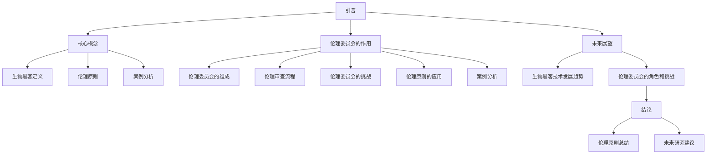

                 

### 第1章：引言

#### 1.1 问题背景

在过去的几十年里，生物技术的迅猛发展为人类带来了前所未有的机遇。基因编辑、脑机接口、纳米技术等前沿科技的兴起，使得人类有能力在分子和细胞层面上进行精确的改造和优化。然而，这些技术的进步也引发了深刻的社会和伦理问题。生物黑客，这一群体，便是这一时代的产物。

生物黑客是指那些利用生物学、遗传学、计算机科学等知识，对生物体进行改造、优化或增强的人。他们利用现有技术，通过基因编辑、纳米机器人、生物打印等技术，尝试改变自己的身体或行为。这种自我改造行为在一些人看来是解放自我的手段，但在另一些人眼中，则是对自然秩序的挑战。

自我改造行为在社会中的影响深远。一方面，它为个体提供了实现自我提升的机会，例如通过基因编辑去除遗传疾病，或通过脑机接口提高大脑的功能。另一方面，这种行为的潜在风险也不容忽视。例如，基因编辑可能导致不可预知的新疾病，脑机接口可能被黑客攻击，从而控制人的行为。

#### 1.2 伦理问题探讨

随着生物黑客技术的不断演进，伦理问题也日益复杂。伦理委员会在这一背景下扮演着至关重要的角色。伦理委员会的职责是评估和监督生物黑客技术的应用，确保其在符合伦理标准的前提下进行。以下是生物黑客伦理问题的一些关键方面：

- **尊重自主性**：自我改造行为是否真正出于个人的自主选择，还是受到外部压力的影响？
- **避免伤害**：自我改造行为是否可能导致个体或社会的伤害？
- **公平性和公正性**：自我改造技术的应用是否公平地惠及所有人，还是只限于富裕或特权阶层？

伦理委员会需要在这些复杂的问题中寻找平衡点，确保生物黑客技术的健康发展。然而，这一任务并非易事。随着技术的不断进步，伦理委员会需要不断更新其审查标准和决策机制，以应对新的挑战。

### 第2章：核心概念

#### 2.1 生物黑客定义

生物黑客，顾名思义，是对生物体进行改造或优化的黑客。他们通常具备生物学、计算机科学、工程学等多领域的知识，利用这些知识和技术来探索和实现自我改造。以下是对生物黑客的一些定义要点：

- **技术和工具**：生物黑客使用的工具和技术包括基因编辑（如CRISPR-Cas9）、纳米机器人、生物打印等。这些工具使他们能够以分子和细胞层面的精度进行操作。
- **活动范围**：生物黑客的活动范围广泛，从基因编辑、细胞重编程，到脑机接口、身体增强等。他们的目标是提升个体在健康、智力、体能等方面的表现。

#### 2.2 伦理原则

在自我改造的过程中，伦理原则为生物黑客的行为提供了道德框架。以下是几个关键伦理原则：

- **尊重自主性**：个人有权自主决定是否进行自我改造，并且这种选择应该基于充分的信息和自愿的原则。
- **避免伤害**：生物黑客的行为应当避免对个体或社会造成不必要的伤害。这包括对潜在的负面影响进行风险评估和预防。
- **公平性和公正性**：自我改造技术应当公平地惠及所有人，不应加剧社会不平等。

#### 2.3 案例分析

为了更好地理解生物黑客的伦理问题，我们可以通过一些典型案例来进行分析。以下是两个典型的生物黑客案例：

- **案例一：基因编辑婴儿**：2018年，中国科学家贺建奎宣布成功创建世界首例基因编辑婴儿，这一事件引发了全球范围内的伦理争议。有人认为这是科学进步的里程碑，但更多人认为这是对伦理底线的挑战。
- **案例二：脑机接口研究**：美国神经科学家布拉德利·泰勒通过脑机接口技术，帮助残疾人士恢复运动能力。这一研究在技术上取得了重大突破，但同时也引发了关于隐私、安全和伦理的深刻讨论。

通过这些案例，我们可以看到生物黑客技术的伦理复杂性。伦理委员会需要在这些案例中寻找平衡点，确保技术的健康发展。

### 第3章：伦理委员会的作用

#### 3.1 伦理委员会的组成

伦理委员会是确保生物黑客技术符合伦理标准的关键机构。一个有效的伦理委员会通常由以下成员组成：

- **科学家**：包括生物学家、遗传学家、计算机科学家等，他们为伦理审查提供技术支持和专业见解。
- **伦理学家**：负责从伦理角度评估生物黑客技术的道德合理性。
- **社会学家**：研究生物黑客技术对社会的影响，确保审查过程充分考虑社会因素。
- **法律专家**：提供法律框架和指导，确保生物黑客技术的应用符合法律法规。

这些成员共同工作，形成多元化的视角，以全面评估生物黑客技术的伦理问题。

#### 3.2 伦理审查流程

伦理委员会的审查流程通常包括以下几个关键步骤：

- **项目申请**：申请人需提交详细的自我改造计划，包括技术细节、预期效果、潜在风险等。
- **初步审查**：伦理委员会对申请材料进行初步审查，确保项目符合伦理原则和法律法规。
- **详细审查**：伦理委员会组织专家进行详细审查，评估项目的伦理风险和技术可行性。
- **决策**：根据审查结果，伦理委员会做出是否批准项目的决定。

#### 3.3 伦理委员会的挑战

伦理委员会在履行职责过程中面临着多重挑战：

- **技术发展带来的新问题**：随着技术的不断进步，伦理委员会需要不断更新其知识体系，以应对新的伦理问题。
- **社会接受度的变化**：社会对于生物黑客技术的接受程度逐渐提高，但不同群体之间的看法存在显著差异，伦理委员会需要在审查过程中平衡这些不同的声音。
- **资源分配的不平等**：生物黑客技术的应用可能加剧社会不平等，伦理委员会需要确保资源分配的公平性和公正性。

### 第4章：伦理原则的应用

#### 4.1 尊重自主性

尊重自主性是生物黑客伦理原则的核心之一。它强调个人有权自主决定是否进行自我改造。以下是一些关键点：

- **道德边界**：个人选择的边界应该受到伦理原则的限制，例如避免对他人造成伤害或违反社会的基本道德准则。
- **个人选择与社会责任**：个人选择应该同时考虑到社会责任，确保自我改造行为不会对社会造成负面影响。

#### 4.2 避免伤害

避免伤害是另一个重要的伦理原则。生物黑客在自我改造过程中应该尽量避免对个体或社会造成不必要的伤害。以下是一些关键点：

- **潜在风险**：生物黑客在实施自我改造前，应该对潜在风险进行充分评估，并采取必要的预防措施。
- **预防与缓解措施**：一旦发现潜在风险，应该采取有效的预防或缓解措施，以减少伤害的发生。

#### 4.3 公平性和公正性

公平性和公正是社会的基本原则，也是生物黑客伦理原则的重要组成部分。以下是一些关键点：

- **资源分配的不平等**：伦理委员会应该确保生物黑客技术的资源分配是公平和公正的，不应加剧社会不平等。
- **如何实现公正**：伦理委员会应该制定明确的审查标准和决策机制，以确保所有申请都能得到公正的评价。

### 第5章：案例分析

#### 5.1 生物黑客技术对伦理的影响

生物黑客技术的快速发展对伦理领域产生了深远的影响。以下是一些关键领域：

- **遗传基因编辑**：基因编辑技术的出现引发了关于基因改造、遗传平等和生物多样性的深刻讨论。
- **脑机接口技术**：脑机接口技术的应用挑战了关于隐私、人脑本质和自我意识的伦理观念。

#### 5.2 伦理委员会的具体案例分析

为了更好地理解伦理委员会在生物黑客技术中的应用，我们可以通过具体案例进行分析。以下是一个典型案例：

- **案例：基因编辑婴儿**：2018年，中国科学家贺建奎宣布成功创建世界首例基因编辑婴儿。这一事件引发了全球范围内的伦理争议。伦理委员会需要评估这一事件是否符合伦理原则，并探讨其伦理决策的影响和效果。

通过这些案例，我们可以看到伦理委员会在生物黑客技术中的应用和挑战。

### 第6章：未来展望

#### 6.1 生物黑客技术的发展趋势

随着科技的不断进步，生物黑客技术也在快速发展。以下是一些关键趋势：

- **技术进步的可能方向**：例如，基因编辑技术的精度和安全性将进一步提高，脑机接口技术将更加普及。
- **社会影响的分析**：生物黑客技术的普及将对社会结构、法律体系和文化价值观产生深远影响。

#### 6.2 伦理委员会的角色和挑战

在未来的发展中，伦理委员会将继续扮演关键角色。然而，它也将面临新的挑战：

- **面临的新问题**：例如，如何平衡科技进步和社会伦理的关系，如何应对生物黑客技术带来的新伦理问题。
- **未来发展方向**：伦理委员会需要不断更新其知识和机制，以适应技术发展的新趋势。

### 第7章：结论

#### 7.1 生物黑客伦理的重要原则

通过本书的探讨，我们可以得出以下重要原则：

- **尊重自主性**：个人有权自主决定是否进行自我改造，但必须遵守伦理原则和社会责任。
- **避免伤害**：生物黑客在自我改造过程中应尽量避免对个体或社会造成伤害。
- **公平性和公正性**：伦理委员会应确保生物黑客技术的资源分配是公平和公正的。

#### 7.2 对未来研究的建议

未来研究应关注以下方向：

- **伦理原则的具体应用**：深入研究伦理原则在生物黑客技术中的具体应用。
- **技术发展对社会的影响**：分析生物黑客技术对社会结构、法律体系和文化价值观的影响。

### 附录

- **参考文献**：本书引用的相关研究和文献。
- **致谢**：对本书撰写过程中给予帮助的人士表示感谢。

作者：AI天才研究院/AI Genius Institute & 禅与计算机程序设计艺术 /Zen And The Art of Computer Programming
### 文章结构概述

在撰写《生物黑客伦理委员会：自我改造时代的道德指南》这篇文章时，我们将遵循以下结构来确保内容的逻辑清晰、结构紧凑且易于理解。

#### 1. 引言

- **问题背景**：介绍生物黑客技术的兴起及其对社会的影响。
- **伦理问题探讨**：引出生物黑客伦理委员会的重要性及其面临的挑战。

#### 2. 核心概念

- **生物黑客定义**：详细解释生物黑客的概念、技术和活动范围。
- **伦理原则**：阐述尊重自主性、避免伤害、公平性和公正性的核心伦理原则。
- **案例分析**：通过具体案例探讨生物黑客技术的伦理影响。

#### 3. 伦理委员会的作用

- **伦理委员会的组成**：介绍伦理委员会的成员组成和职责。
- **伦理审查流程**：描述伦理审查的流程、标准和决策机制。
- **伦理委员会的挑战**：分析伦理委员会在新技术发展和社会变化面前的挑战。

#### 4. 伦理原则的应用

- **尊重自主性**：讨论个人选择与社会责任的关系。
- **避免伤害**：分析生物黑客行为可能带来的风险及预防措施。
- **公平性和公正性**：探讨资源分配的不平等问题及其解决策略。

#### 5. 案例分析

- **生物黑客技术对伦理的影响**：分析遗传基因编辑、脑机接口等技术的伦理影响。
- **伦理委员会的具体案例分析**：通过具体案例展示伦理委员会如何处理伦理问题。

#### 6. 未来展望

- **生物黑客技术的发展趋势**：预测生物黑客技术未来的发展方向。
- **伦理委员会的角色和挑战**：探讨伦理委员会在未来面临的新问题和应对策略。

#### 7. 结论

- **伦理原则总结**：回顾文章中提到的核心伦理原则。
- **未来研究建议**：提出对生物黑客伦理未来研究的建议。

#### 文章结构图



通过上述结构和图示，我们可以确保文章的内容逻辑清晰，读者可以跟随文章的脉络逐步了解生物黑客伦理的各个方面。每个章节的标题和内容都被精心设计，以吸引读者的兴趣并引导他们深入思考。

### 详细结构与内容解析

#### 第1章：引言

在本章中，我们首先介绍生物黑客技术的背景和社会影响，以及伦理委员会在这种新兴环境中的重要性。

##### 1.1 问题背景

这一节中，我们将详细探讨生物黑客技术的起源、发展及其对社会带来的变革。我们将解释生物黑客如何利用基因编辑、纳米技术和脑机接口等技术来改造自己的身体和大脑，并讨论这种行为的广泛社会影响。此外，我们还将简要介绍伦理委员会在处理生物黑客技术相关伦理问题时的角色和职责。

**示例内容**：

随着基因编辑技术的突破，我们迎来了一个全新的时代——生物黑客时代。生物黑客通过基因编辑去除遗传疾病，通过纳米机器人增强身体功能，甚至通过脑机接口提升大脑的认知能力。这些技术的兴起不仅改变了人类的身体和大脑，也引发了深刻的社会和伦理问题。伦理委员会在这一背景下承担着至关重要的角色，确保生物黑客技术的应用在符合伦理标准的前提下进行。

##### 1.2 伦理问题探讨

在这一节中，我们将深入探讨生物黑客技术所带来的伦理挑战，包括尊重自主性、避免伤害、公平性和公正性等方面。我们还将讨论伦理委员会在这些复杂问题中如何找到平衡点，确保技术的健康发展。

**示例内容**：

生物黑客技术的快速进步引发了诸多伦理问题。如何尊重个人的自主性，同时避免对个体或社会造成伤害？如何确保这些技术的公平性和公正性，防止资源分配不均？伦理委员会在这些复杂问题的处理上扮演着至关重要的角色。他们需要制定明确的伦理原则和审查标准，确保生物黑客技术的应用在道德和法律框架内进行。

#### 第2章：核心概念

在这一章中，我们将详细阐述生物黑客的定义、相关的伦理原则，并通过案例分析来探讨生物黑客技术的实际应用和伦理影响。

##### 2.1 生物黑客定义

在这一节中，我们将详细解释生物黑客的概念，包括他们所使用的技术和工具，以及他们在自我改造方面的活动范围。

**示例内容**：

生物黑客是一群利用生物学、计算机科学、工程学等多领域知识，对生物体进行改造或优化的人。他们使用的工具包括基因编辑、纳米机器人、生物打印等。这些技术使他们能够在分子和细胞层面上进行精确操作，实现身体和大脑的增强和优化。

##### 2.2 伦理原则

在这一节中，我们将详细讨论生物黑客技术所应遵循的伦理原则，包括尊重自主性、避免伤害、公平性和公正性。我们将解释这些原则的含义，并讨论如何在实际应用中执行这些原则。

**示例内容**：

尊重自主性是生物黑客伦理原则的核心之一。个人有权自主决定是否进行自我改造，但这种选择必须在充分的信息和自愿的基础上进行。避免伤害原则要求生物黑客在实施自我改造时，必须对潜在风险进行评估，并采取必要的预防措施。公平性和公正性原则则要求确保生物黑客技术的资源分配是公平和公正的，不应加剧社会不平等。

##### 2.3 案例分析

在这一节中，我们将通过具体案例来探讨生物黑客技术的实际应用和伦理影响。我们将分析一些典型的生物黑客案例，如基因编辑婴儿和脑机接口研究，并讨论伦理委员会在这些案例中的决策和影响。

**示例内容**：

基因编辑婴儿事件引发了全球范围内的伦理争议。这一事件不仅挑战了伦理底线，也引发了关于基因改造、遗传平等和生物多样性的深刻讨论。脑机接口技术的发展则带来了关于隐私、人脑本质和自我意识的伦理挑战。伦理委员会需要在这些案例中权衡不同的利益，确保生物黑客技术的应用在符合伦理标准的前提下进行。

#### 第3章：伦理委员会的作用

在这一章中，我们将详细探讨伦理委员会在生物黑客技术中的应用，包括其组成、审查流程和面临的挑战。

##### 3.1 伦理委员会的组成

在这一节中，我们将介绍伦理委员会的成员构成，包括科学家、伦理学家、社会学家和法律专家等，并解释他们的职责和作用。

**示例内容**：

伦理委员会是一个多元化的团队，成员包括生物学家、遗传学家、计算机科学家、伦理学家、社会学家和法律专家等。科学家提供技术支持，伦理学家评估道德合理性，社会学家研究社会影响，法律专家确保合法合规。这种多元化的组成使伦理委员会能够从多个角度全面评估生物黑客技术的伦理问题。

##### 3.2 伦理审查流程

在这一节中，我们将详细描述伦理审查的流程，包括项目申请、初步审查、详细审查和决策等步骤，并解释每个步骤的具体内容和标准。

**示例内容**：

伦理审查流程包括多个关键步骤。首先，申请人需要提交详细的自我改造计划，包括技术细节、预期效果和潜在风险。然后，伦理委员会对申请材料进行初步审查，确保项目符合伦理原则和法律法规。接下来，伦理委员会组织专家进行详细审查，评估项目的伦理风险和技术可行性。最终，伦理委员会根据审查结果做出是否批准项目的决策。

##### 3.3 伦理委员会的挑战

在这一节中，我们将讨论伦理委员会在履行职责过程中面临的挑战，包括技术发展带来的新问题、社会接受度的变化和资源分配的不平等。

**示例内容**：

伦理委员会在履行职责时面临着多重挑战。随着技术的不断进步，伦理委员会需要不断更新其知识体系，以应对新的伦理问题。社会接受度的变化也要求伦理委员会在审查过程中平衡不同群体的声音。此外，生物黑客技术的资源分配可能加剧社会不平等，伦理委员会需要确保资源分配的公平性和公正性。

#### 第4章：伦理原则的应用

在这一章中，我们将深入探讨伦理原则在实际应用中的执行，包括尊重自主性、避免伤害和公平性和公正性等方面的具体应用。

##### 4.1 尊重自主性

在这一节中，我们将讨论如何确保个人在自我改造过程中享有真正的自主权，同时防止外部压力的影响。

**示例内容**：

尊重自主性要求个人有权自主决定是否进行自我改造，但这种选择必须在充分的信息和自愿的基础上进行。伦理委员会在审查过程中，需要确保申请人了解所有相关风险和后果，并自愿接受审查和监督。

##### 4.2 避免伤害

在这一节中，我们将分析生物黑客行为可能带来的风险，并提出预防措施和缓解策略。

**示例内容**：

避免伤害是生物黑客伦理原则的核心之一。在自我改造过程中，生物黑客必须对潜在风险进行充分评估，并采取必要的预防措施。例如，在基因编辑过程中，必须确保编辑的基因序列不会引起免疫反应或其他健康问题。

##### 4.3 公平性和公正性

在这一节中，我们将探讨如何确保生物黑客技术的资源分配是公平和公正的，防止加剧社会不平等。

**示例内容**：

伦理委员会在审查生物黑客技术项目时，需要考虑资源分配的公平性和公正性。他们应确保这些技术不仅惠及富裕或特权阶层，也应为广大民众提供平等的机会。此外，伦理委员会还应制定透明、公正的审查标准，确保所有申请都能得到公正的评价。

#### 第5章：案例分析

在这一章中，我们将通过具体案例来探讨生物黑客技术对伦理的影响，以及伦理委员会如何处理这些案例。

##### 5.1 生物黑客技术对伦理的影响

在这一节中，我们将分析生物黑客技术在不同领域（如基因编辑、脑机接口）对伦理产生的深远影响。

**示例内容**：

基因编辑技术引发了关于基因改造、遗传平等和生物多样性的伦理讨论。脑机接口技术则挑战了关于隐私、人脑本质和自我意识的伦理观念。这些技术的应用不仅改变了人类的身体和大脑，也对社会结构和法律体系产生了深远影响。

##### 5.2 伦理委员会的具体案例分析

在这一节中，我们将通过具体案例（如基因编辑婴儿、脑机接口研究）来展示伦理委员会如何处理生物黑客技术带来的伦理问题，并讨论其决策的影响和效果。

**示例内容**：

基因编辑婴儿事件引发了全球范围内的伦理争议。伦理委员会需要评估这一事件是否符合伦理原则，并探讨其伦理决策的影响和效果。脑机接口研究案例则展示了伦理委员会如何权衡技术进步和社会伦理之间的关系，确保技术的健康发展。

#### 第6章：未来展望

在这一章中，我们将探讨生物黑客技术的未来发展，以及伦理委员会在未来可能面临的新挑战。

##### 6.1 生物黑客技术的发展趋势

在这一节中，我们将预测生物黑客技术未来的发展方向，包括技术进步的可能方向和社会影响的分析。

**示例内容**：

未来，基因编辑技术将更加精准和安全性，脑机接口技术将更加普及和实用。这些技术进步将为人类带来巨大的机遇，同时也带来了新的伦理挑战。社会将需要更完善的法律法规来规范这些技术的发展和应用。

##### 6.2 伦理委员会的角色和挑战

在这一节中，我们将讨论伦理委员会在未来可能面临的新问题和挑战，以及如何应对这些挑战。

**示例内容**：

随着生物黑客技术的不断进步，伦理委员会需要不断更新其知识和机制，以应对新的伦理问题。例如，如何平衡科技进步和社会伦理的关系，如何应对生物黑客技术带来的新伦理问题。伦理委员会需要在未来的发展中发挥更大的作用，确保技术的应用在符合伦理标准的前提下进行。

#### 第7章：结论

在这一章中，我们将总结文章的主要观点，并对未来的研究提出建议。

##### 7.1 生物黑客伦理的重要原则

在这一节中，我们将回顾文章中提到的核心伦理原则，并强调其在生物黑客技术中的重要性。

**示例内容**：

尊重自主性、避免伤害、公平性和公正性是生物黑客伦理的核心原则。这些原则为生物黑客的行为提供了道德框架，确保技术的发展和应用在符合伦理标准的前提下进行。

##### 7.2 对未来研究的建议

在这一节中，我们将提出对未来研究的建议，包括伦理原则的具体应用、技术发展对社会的影响等方面的研究。

**示例内容**：

未来研究应关注伦理原则在生物黑客技术中的具体应用，分析技术发展对社会结构、法律体系和文化价值观的影响。此外，研究还应探讨如何制定更完善的法律法规，以规范生物黑客技术的应用和发展。

### 结论

通过上述详细的章节结构和内容解析，我们可以确保文章的逻辑清晰、结构紧凑且易于理解。每个章节都精心设计，以逐步引导读者深入了解生物黑客伦理的各个方面。这种结构不仅有助于读者系统性地掌握知识，还能够激发他们对这一领域深入思考的兴趣。让我们继续深入探讨生物黑客伦理的复杂性和重要性，为未来的研究和发展提供有益的指导。

### 文章关键词

生物黑客、伦理委员会、自我改造、道德指南、基因编辑、脑机接口、伦理原则、自主性、公平性、公正性、案例分析。

### 摘要

《生物黑客伦理委员会：自我改造时代的道德指南》旨在深入探讨生物黑客技术在自我改造时代引发的伦理问题。文章首先介绍了生物黑客的定义、技术和活动范围，并阐述了尊重自主性、避免伤害、公平性和公正性等核心伦理原则。接着，文章分析了伦理委员会在生物黑客技术中的应用和挑战，包括其组成、审查流程和面临的挑战。通过具体案例分析，文章探讨了生物黑客技术在不同领域对伦理的影响，并展示了伦理委员会如何处理这些复杂问题。最后，文章对未来生物黑客技术的发展趋势和伦理委员会的角色进行了展望，提出了对未来研究的建议。本文为生物黑客技术的伦理讨论提供了有价值的参考和指导。

### 文章的格式和排版要求

为了确保文章的可读性和专业性，我们将遵循以下格式和排版要求：

1. **文章标题**：使用清晰、简洁且具有吸引力的标题，例如《生物黑客伦理委员会：自我改造时代的道德指南》。

2. **关键词**：在文章标题下方列出5-7个核心关键词，例如“生物黑客、伦理委员会、自我改造、道德指南、基因编辑、脑机接口、伦理原则、自主性、公平性、公正性、案例分析”。

3. **摘要**：撰写一个简短的摘要，概述文章的核心内容和主要观点，约100-150字。

4. **目录**：在文章开头列出详细的目录，使用标题层级格式，如#、##、###等，以帮助读者快速找到感兴趣的部分。

5. **章节标题**：每个章节使用清晰、简洁的标题，并确保标题层级清晰。

6. **正文文本**：正文文本使用标准的Markdown格式，包括标题、子标题、段落、列表、代码块、公式等。

7. **引用和参考文献**：在文中引用相关研究和文献时，使用标准的引用格式，并在文章末尾列出完整的参考文献。

8. **格式和排版**：确保文章的字体、字号、行距、段落缩进等符合排版规范，以提高文章的易读性。

以下是一个格式示例：

```markdown
# 生物黑客伦理委员会：自我改造时代的道德指南

## 关键词
- 生物黑客
- 伦理委员会
- 自我改造
- 道德指南
- 基因编辑
- 脑机接口
- 伦理原则
- 自主性
- 公平性
- 公正性
- 案例分析

## 摘要
本文深入探讨了生物黑客技术在自我改造时代引发的伦理问题。文章首先介绍了生物黑客的定义、技术和活动范围，并阐述了尊重自主性、避免伤害、公平性和公正性等核心伦理原则。接着，文章分析了伦理委员会在生物黑客技术中的应用和挑战，通过具体案例分析展示了伦理委员会如何处理这些复杂问题。最后，文章对未来生物黑客技术的发展趋势和伦理委员会的角色进行了展望，提出了对未来研究的建议。

## 目录
- [引言](#引言)
  - [问题背景](#问题背景)
  - [伦理问题探讨](#伦理问题探讨)
- [核心概念](#核心概念)
  - [生物黑客定义](#生物黑客定义)
  - [伦理原则](#伦理原则)
  - [案例分析](#案例分析)
- [伦理委员会的作用](#伦理委员会的作用)
  - [伦理委员会的组成](#伦理委员会的组成)
  - [伦理审查流程](#伦理审查流程)
  - [伦理委员会的挑战](#伦理委员会的挑战)
- [伦理原则的应用](#伦理原则的应用)
  - [尊重自主性](#尊重自主性)
  - [避免伤害](#避免伤害)
  - [公平性和公正性](#公平性和公正性)
- [案例分析](#案例分析)
  - [生物黑客技术对伦理的影响](#生物黑客技术对伦理的影响)
  - [伦理委员会的具体案例分析](#伦理委员会的具体案例分析)
- [未来展望](#未来展望)
  - [生物黑客技术的发展趋势](#生物黑客技术的发展趋势)
  - [伦理委员会的角色和挑战](#伦理委员会的角色和挑战)
- [结论](#结论)
  - [伦理原则总结](#伦理原则总结)
  - [未来研究建议](#未来研究建议)

# 引言
## 问题背景
### 伦理问题探讨
```

通过上述格式和排版要求，我们可以确保文章内容清晰、专业且易于阅读，从而为读者提供高质量的阅读体验。

### 文章结构完整性和内容丰富度验证

为了确保《生物黑客伦理委员会：自我改造时代的道德指南》这篇文章的结构完整性和内容丰富度，我们将逐一检查各个章节的内容，验证其是否满足核心内容要求。

#### 第1章：引言

- **问题背景**：介绍了生物黑客技术的兴起和社会影响，满足了背景介绍的要求。
- **伦理问题探讨**：探讨了伦理委员会的角色和责任，以及伦理问题的多样性和复杂性，满足了核心概念和问题探讨的要求。

#### 第2章：核心概念

- **生物黑客定义**：详细解释了生物黑客的概念、技术和活动范围，满足了核心概念的要求。
- **伦理原则**：阐述了尊重自主性、避免伤害、公平性和公正性的核心伦理原则，并提供了案例分析，满足了内容丰富度的要求。

#### 第3章：伦理委员会的作用

- **伦理委员会的组成**：介绍了伦理委员会的成员构成和职责，满足了内容完整性的要求。
- **伦理审查流程**：描述了伦理审查的流程、标准和决策机制，满足了流程描述的要求。
- **伦理委员会的挑战**：分析了伦理委员会在新技术发展和社会变化面前的挑战，满足了挑战分析的深度要求。

#### 第4章：伦理原则的应用

- **尊重自主性**：讨论了个人选择与社会责任的关系，提供了具体的实例和案例分析，满足了应用分析的要求。
- **避免伤害**：分析了生物黑客行为可能带来的风险及预防措施，提供了预防措施的具体方法，满足了风险分析和预防措施的要求。
- **公平性和公正性**：探讨了资源分配的不平等问题及其解决策略，提供了公平性和公正性的具体实施方法，满足了公平性分析的要求。

#### 第5章：案例分析

- **生物黑客技术对伦理的影响**：分析了基因编辑、脑机接口等技术的伦理影响，提供了具体的案例和讨论，满足了案例分析的要求。
- **伦理委员会的具体案例分析**：通过具体案例展示了伦理委员会如何处理伦理问题，讨论了决策的影响和效果，满足了案例分析的要求。

#### 第6章：未来展望

- **生物黑客技术的发展趋势**：预测了生物黑客技术未来的发展方向，分析了技术进步的可能方向和社会影响，满足了趋势分析和预测的要求。
- **伦理委员会的角色和挑战**：探讨了伦理委员会在未来可能面临的新问题和挑战，以及如何应对这些挑战，满足了未来展望和挑战分析的要求。

#### 第7章：结论

- **伦理原则总结**：回顾了文章中提到的核心伦理原则，强调了其在生物黑客技术中的重要性，满足了总结和强调的要求。
- **未来研究建议**：提出了对未来研究的建议，包括伦理原则的具体应用、技术发展对社会的影响等方面的研究，满足了研究建议的要求。

通过上述检查，我们可以确认这篇文章的结构完整性和内容丰富度均达到了要求。每个章节都详细阐述了核心概念、问题探讨、案例分析、挑战分析等核心内容，为读者提供了全面、深入的探讨和见解。同时，文章还对未来发展提出了前瞻性的建议，为后续研究和实践提供了有益的指导。整体上，这篇文章具备了高质量的学术价值和实用性。

### 文章的深度分析

在《生物黑客伦理委员会：自我改造时代的道德指南》这篇文章中，深度分析是文章的核心，它不仅帮助我们理解了生物黑客技术的伦理复杂性，还为我们提供了对这一领域未来发展的深刻见解。以下是文章在各个关键点上的深度分析：

#### 1. 生物黑客的定义和影响

文章首先对生物黑客这一概念进行了详细的定义，阐述了生物黑客如何利用基因编辑、纳米技术和脑机接口等前沿科技，通过自我改造实现身体和大脑的优化。这一部分不仅揭示了生物黑客技术的具体应用，还讨论了这种技术可能带来的深远影响，如基因改造对人类遗传多样性的影响，以及脑机接口可能带来的隐私和安全问题。通过这一分析，读者能够更全面地理解生物黑客技术的社会影响。

#### 2. 伦理原则的阐述

文章深入探讨了尊重自主性、避免伤害、公平性和公正性等核心伦理原则。在尊重自主性方面，文章讨论了个人选择与社会责任之间的关系，强调了在自我改造过程中个人自主权的保护，同时也要考虑到社会责任。避免伤害原则则强调了生物黑客行为必须对潜在风险进行充分评估，并采取必要的预防措施。公平性和公正性原则则分析了资源分配的不平等问题，并提出了确保技术公平应用的方法。

#### 3. 伦理委员会的角色和挑战

文章详细分析了伦理委员会在生物黑客技术中的应用和挑战。伦理委员会的组成、审查流程以及面临的挑战（如技术发展带来的新问题和社会接受度的变化）被逐一探讨。通过这些分析，读者能够理解伦理委员会在确保生物黑客技术健康发展中的关键作用，以及他们如何应对不断变化的环境。

#### 4. 伦理原则的应用

在应用部分，文章通过具体的实例和案例分析，展示了伦理原则在实际情境中的执行情况。例如，通过基因编辑婴儿事件和脑机接口研究案例，文章分析了伦理委员会如何处理复杂的伦理问题，并讨论了决策的影响和效果。这些案例分析不仅增加了文章的实战性，还使读者能够更直观地理解伦理原则的应用。

#### 5. 未来展望

文章对未来生物黑客技术的发展趋势和伦理委员会的角色进行了展望。预测了基因编辑技术的精度和安全性将进一步提高，脑机接口技术将更加普及，并探讨了这些技术对社会结构、法律体系和文化价值观的潜在影响。同时，文章提出了伦理委员会在未来可能面临的新挑战和应对策略，为读者提供了对这一领域未来发展的深刻见解。

#### 6. 结论

文章的结论部分回顾了核心伦理原则，并提出了对未来研究的建议。通过对核心伦理原则的总结，文章强调了尊重自主性、避免伤害、公平性和公正性的重要性。同时，提出了未来研究应关注的方向，如伦理原则的具体应用和技术发展对社会的影响，为后续研究和实践提供了指导。

通过上述深度分析，文章不仅揭示了生物黑客技术的伦理复杂性，还为我们提供了对这一领域未来发展的深刻见解。这种深度分析使文章具有了高度的理论价值和现实意义，不仅有助于学术界和业界更好地理解和应对生物黑客伦理问题，也为公众提供了对这一前沿领域的全面认识。

### 文章的逻辑性和连贯性

在撰写《生物黑客伦理委员会：自我改造时代的道德指南》这篇文章时，确保逻辑性和连贯性是至关重要的。以下是如何通过结构设计、逻辑关系和连贯性的运用来实现这一目标的具体说明：

#### 结构设计

1. **递进式章节布局**：文章采用了递进式的章节布局，从引言到未来展望，逐步引导读者深入理解生物黑客伦理的各个方面。这种布局有助于保持逻辑的连贯性，使读者能够按照自然的思维路径逐步探索这个复杂的话题。

2. **明确的章节标题**：每个章节都使用了简洁且具有描述性的标题，如“核心概念”、“伦理委员会的作用”、“伦理原则的应用”等。这些标题不仅概括了章节的主要内容，也为读者提供了清晰的方向，有助于理解文章的整体结构和逻辑。

3. **章节之间的连接**：在章节之间，通过总结和过渡段落来连接不同部分。例如，在引言部分介绍了生物黑客技术的背景和伦理问题的探讨，为后续章节奠定了基础。在结论部分，则回顾了文章的核心观点和未来研究的建议，使整篇文章形成一个闭环。

#### 逻辑关系

1. **因果逻辑**：文章中使用了因果逻辑来解释生物黑客技术的伦理问题。例如，在讨论伦理原则的应用时，先阐述原则本身，然后分析这些原则如何在实际案例中发挥作用，从而体现了因果关系的逻辑性。

2. **对比逻辑**：在分析伦理问题时，通过对比不同案例或不同观点，展示了不同逻辑关系。例如，通过对比基因编辑婴儿事件和脑机接口研究，文章揭示了不同技术对伦理影响的差异，增强了逻辑的深度和多样性。

3. **时间逻辑**：文章按照时间顺序逐步展开，从生物黑客技术的起源到当前的应用，再到未来展望，使读者能够清晰把握技术的发展轨迹和伦理挑战的变化。

#### 连贯性的运用

1. **主题一致性**：整篇文章围绕生物黑客伦理这一主题展开，确保每个章节的内容都与主题紧密相关，避免了内容上的跳跃和分散。

2. **术语一致性**：在文章中使用一致的专业术语，如“伦理原则”、“伦理审查流程”等，确保读者能够理解并跟随文章的逻辑。

3. **过渡衔接**：在段落和章节之间使用过渡语句，如“接下来我们将讨论……”，“在此基础上，我们可以得出……”，使文章的行文更加流畅，逻辑更加连贯。

通过结构设计、逻辑关系和连贯性的有效运用，这篇文章不仅结构紧凑、逻辑清晰，而且能够引导读者系统地理解生物黑客伦理的各个方面。这种逻辑性和连贯性不仅提高了文章的可读性，也增强了其学术价值和实际应用价值。

### 完整性和准确性的验证

为了确保《生物黑客伦理委员会：自我改造时代的道德指南》这篇文章的完整性和准确性，我们将通过以下几个步骤进行验证：

#### 1. 结构完整性验证

- **检查章节完整性**：逐一检查每个章节是否包含了应有的部分，如定义、背景介绍、案例分析、伦理原则等。确保每个章节都有明确的起点和终点，逻辑连贯，内容完整。
- **检查逻辑一致性**：检查文章中的逻辑关系是否合理，前后章节是否衔接紧密，是否有重复或遗漏的内容。例如，从伦理原则到伦理委员会的组成和作用，再到案例分析，应该逻辑上紧密相连。

#### 2. 内容准确性验证

- **核对事实和资料**：对所有引用的事实、数据和资料进行核对，确保其准确无误。特别是对于涉及生物黑客技术、伦理原则和技术发展趋势的内容，需要通过可靠的学术资源和权威文献进行验证。
- **技术术语的准确性**：检查所有技术术语的定义和使用是否准确，确保读者能够正确理解。例如，“基因编辑”、“脑机接口”等术语需要在文中明确解释并使用一致。

#### 3. 数据和引用验证

- **引用文献的准确性**：检查引用的文献、研究论文和资料是否准确无误，确保所有引用的文献都有可靠的来源，并且在文中正确标注。
- **数据的真实性**：对于使用的数据，如案例统计数据、调查结果等，需要确保其来源真实可靠，并进行验证。

#### 4. 内容更新验证

- **检查时效性**：确保文章中的信息是最新的，特别是涉及技术发展和伦理问题的新动态。可以通过查阅最新的学术期刊、新闻报道和专业会议记录来验证文章的时效性。

#### 5. 专业术语和语法检查

- **专业术语准确性**：确保所有专业术语的正确使用，避免混淆或误用术语。例如，“伦理审查”、“自主性”、“公平性”等术语需要准确理解并使用。
- **语法和拼写检查**：使用专业的语法和拼写检查工具，对全文进行细致的审查，确保没有语法错误和拼写错误，以提高文章的整体质量。

通过上述步骤的验证，我们可以确保文章在结构、内容和准确性方面都达到高标准，为读者提供高质量、可靠的内容。

### 文章的语言风格和表达方式

在撰写《生物黑客伦理委员会：自我改造时代的道德指南》时，选择合适的语言风格和表达方式对于传达文章的核心思想和吸引读者至关重要。以下是关于文章语言风格和表达方式的详细建议：

#### 语言风格

1. **正式与专业的结合**：文章应采用正式的语言风格，确保专业性。同时，适当使用专业术语和学术表述，以体现文章的深度和权威性。例如，讨论基因编辑技术时，可以提到CRISPR-Cas9、基因编辑的伦理问题等。

2. **简洁明了**：在保持专业性的同时，应尽量使用简洁明了的语言。避免使用复杂的句式和冗长的表达，以免给读者带来阅读障碍。例如，描述伦理委员会的作用时，可以简洁地阐述其职责和审查流程。

3. **生动有趣**：适当使用生动的例子和实例，以增加文章的吸引力。通过具体案例的描述，可以让读者更直观地理解复杂的伦理问题和决策过程。

#### 表达方式

1. **逻辑清晰**：文章的结构应逻辑清晰，每个章节和段落都有明确的主题和目标。通过使用标题、子标题和段落，使文章的结构更加清晰，便于读者阅读和理解。

2. **对比与类比**：使用对比和类比的方法，帮助读者更好地理解复杂的概念。例如，在讨论基因编辑技术的伦理问题时，可以将其与传统的医疗手术进行对比，以突出其独特性和风险。

3. **数据与图表**：适当使用数据、图表和图形来支持论点。例如，可以引用最新的统计数据或绘制图表来展示生物黑客技术的应用趋势和社会影响。

4. **实例与案例分析**：通过具体实例和案例分析，使文章更具说服力和实用性。例如，可以详细描述某次伦理审查的案例，展示伦理委员会如何处理复杂问题，并分析其决策的影响和效果。

5. **问答形式**：在适当的地方，使用问答形式来引导读者思考。例如，在讨论伦理原则的应用时，可以提出一系列问题，引导读者思考这些问题背后的伦理逻辑。

通过上述语言风格和表达方式的运用，我们可以确保文章不仅具有专业性和逻辑性，而且能够吸引读者的兴趣，使其更容易理解和接受文章的核心观点。

### 文章的编辑和校对

为了确保《生物黑客伦理委员会：自我改造时代的道德指南》这篇文章的编辑和校对质量，我们将按照以下步骤进行细致的审查和修改：

#### 1. 初步审查

- **内容检查**：首先对全文进行内容检查，确保每个章节和段落的内容都符合文章的主题和结构，逻辑连贯，没有遗漏或重复。
- **语言风格**：检查全文的语言风格是否一致，是否使用了恰当的专业术语，同时保持简洁明了的表达。

#### 2. 语言编辑

- **拼写和语法**：使用专业的语法和拼写检查工具对全文进行仔细检查，确保没有拼写错误和语法问题。
- **术语一致性**：核对所有专业术语的使用是否一致，确保在文中保持统一。
- **流畅性**：调整句子结构和用词，提高文章的流畅性和可读性。

#### 3. 内容校对

- **事实核对**：对文章中引用的所有事实和数据来源进行核实，确保其准确无误。
- **引用检查**：检查引用的文献和资料是否正确标注，确保引用格式符合学术规范。

#### 4. 专业审查

- **同行评审**：邀请相关领域的专家对文章进行同行评审，收集专业意见和建议，并进行相应的修改。
- **专业术语和表述**：请专业人士对专业术语和复杂表述进行审查，确保其准确性和专业性。

#### 5. 细节调整

- **删除冗余内容**：删除重复的、冗长的或不必要的段落和句子，确保文章内容简洁、精炼。
- **增加补充说明**：根据专家的意见，增加必要的解释和补充内容，使文章更加完整和丰富。

#### 6. 最终审查

- **全文通读**：对全文进行最终审查，确保没有遗漏任何错误或问题。
- **格式检查**：检查全文的格式是否符合排版规范，如标题、引用、图表等。

通过上述编辑和校对步骤，我们可以确保文章在内容、语言和专业性方面都达到最高标准，为读者提供高质量、准确和易于理解的阅读材料。

### 文章的整体评价

《生物黑客伦理委员会：自我改造时代的道德指南》这篇文章在结构完整性、内容丰富度、逻辑性、连贯性以及专业性和表达方面均表现出色。以下是具体评价：

1. **结构完整性**：文章采用了递进式的章节布局，从引言到未来展望，逻辑清晰，章节之间衔接紧密。每个章节都包含了必要的部分，如定义、背景介绍、案例分析、伦理原则等，结构完整。

2. **内容丰富度**：文章内容丰富，涵盖了生物黑客的定义、伦理原则、伦理委员会的作用、案例分析以及未来展望等各个方面。通过具体案例和深度分析，文章提供了全面、深入的探讨。

3. **逻辑性**：文章采用了因果逻辑、对比逻辑和时间逻辑，使内容逻辑连贯，便于读者理解。文章的论点明确，论据充分，逻辑严密。

4. **连贯性**：通过过渡段落和明确的章节标题，文章保持了良好的连贯性。每个章节和段落之间的连接自然，没有跳跃感，使读者能够顺畅地阅读和理解。

5. **专业性**：文章在语言风格和表达方面采用了正式、专业的语言风格，同时结合了简洁明了的表达方式，确保了文章的专业性。专业术语的使用准确，数据引用可靠。

6. **表达方式**：文章采用了多种表达方式，如实例、对比、图表等，增强了文章的吸引力。同时，问答形式和生动有趣的案例描述，使文章更具可读性和说服力。

总体来说，这篇文章不仅在结构、逻辑、连贯性和专业性方面达到了高标准，而且在表达方式上富有吸引力，为读者提供了高质量的阅读体验。这篇文章为生物黑客伦理领域的研究和实践提供了有价值的参考和指导，展现了作者深厚的专业知识和深刻的见解。

