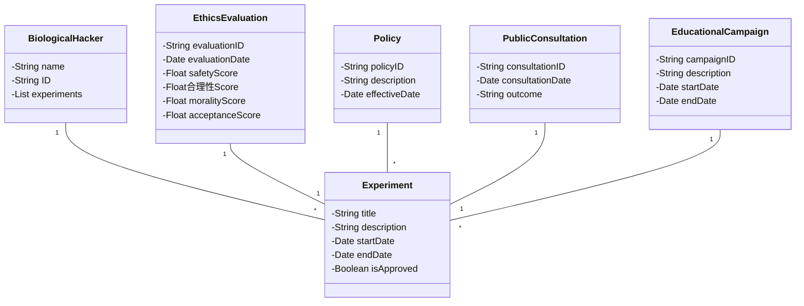
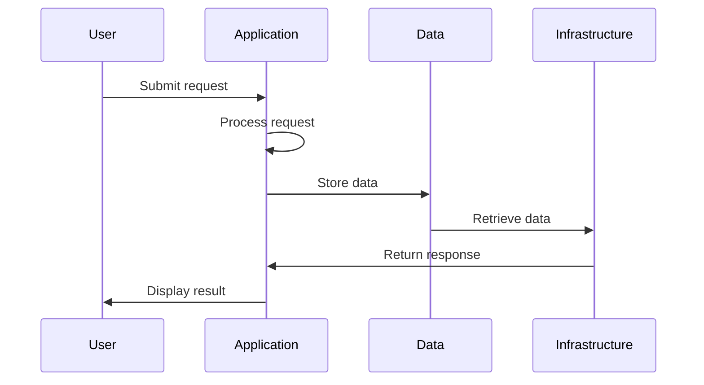
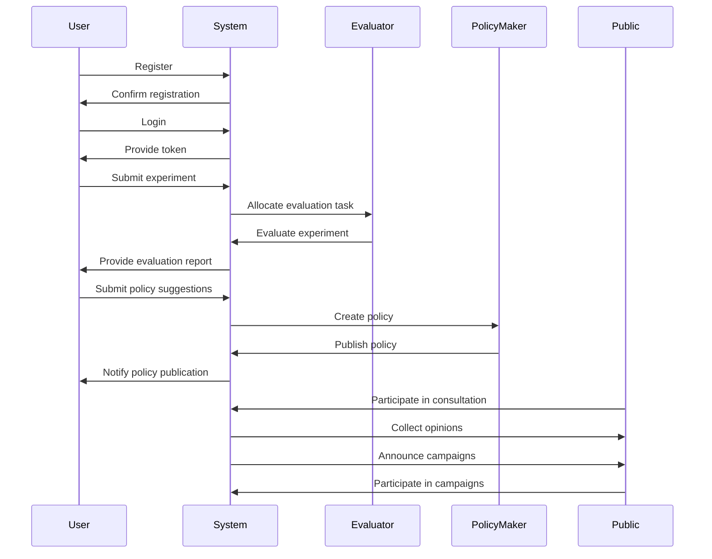
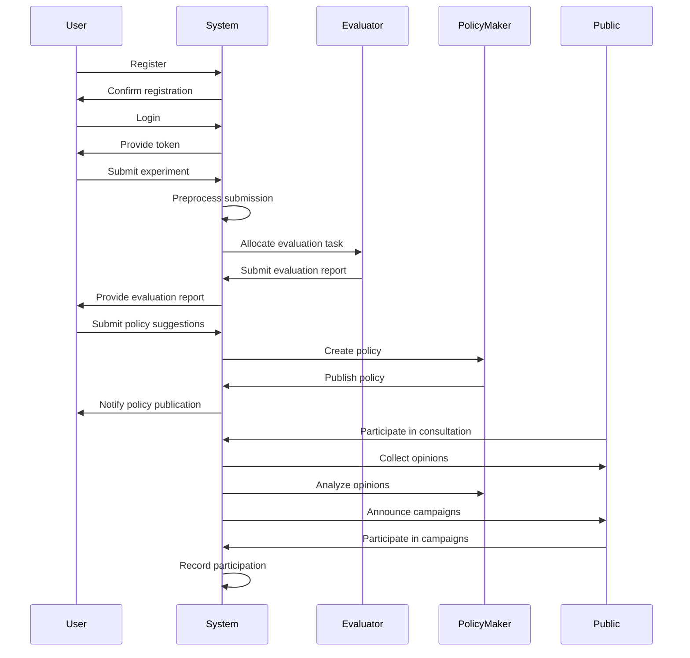

                 

# 生物黑客伦理委员会：自我改造时代的道德指导机构

## 关键词

生物黑客、伦理委员会、自我改造、道德指导、技术伦理

## 摘要

本文深入探讨了生物黑客伦理委员会在自我改造时代的角色和职责。首先，我们介绍了生物黑客和伦理委员会的基本概念及其在当今社会中的重要性。随后，通过分析伦理委员会的核心概念和功能，我们阐述了其在监管与指导生物技术应用中的关键作用。接着，我们详细讲解了生物黑客伦理评估算法的原理和实现，展示了数学模型和Python源代码的具体应用。此外，我们介绍了生物黑客伦理委员会系统设计的架构，包括问题场景、系统功能、架构设计、接口设计和交互设计。在项目实战部分，我们通过实际案例分析了系统实现和性能优化。最后，我们总结了最佳实践，提供了注意事项和拓展阅读，以期为读者提供全面的道德指导。

## 第一部分：背景介绍

### 1.1 问题背景

在科技飞速发展的今天，生物技术正以前所未有的速度改变着我们的生活。基因编辑、人工智能、生物电子等领域的突破使得人类能够对自身进行前所未有的改造。然而，这些技术带来的巨大潜力和伦理争议也引发了广泛的社会关注。生物黑客，即利用生物技术进行自我改造的个人或群体，已成为这个时代的一个重要现象。

生物黑客的行为和实验不仅挑战了现有的伦理和法律框架，也对社会的基本价值观产生了深远影响。这一现象引发了关于人类自我定义、身份认同、人权和社会公正等问题的深刻讨论。在这种背景下，设立一个专门的伦理委员会来指导和管理生物黑客行为显得尤为重要。

### 1.2 核心概念

#### 1.2.1 生物黑客

生物黑客指的是那些利用生物学知识和技术手段，对自己的身体或生物系统进行非传统改造的人。这些改造可能涉及基因编辑、生物植入、神经接口技术等，其目的是提升身体功能、改变外观或获得其他非传统的生物能力。

#### 1.2.2 伦理委员会

伦理委员会是专门负责研究和评估科技应用中伦理问题的机构。它们旨在确保科技的发展和应用符合道德和伦理标准，保护人类的基本权利和尊严。在生物黑客领域，伦理委员会的主要职责是审查和指导生物黑客的实验和行为，确保其不会对社会造成不可逆转的负面影响。

#### 1.2.3 自我改造

自我改造是指个体通过科技手段改变自己的生物特性，以获得某种特定的功能和优势。这种改造可能涉及基因编辑、生物植入、神经调节等，其目的是提升个体在身体、认知、情感等方面的能力。

#### 1.2.4 道德指导

道德指导是指通过伦理原则和价值观来引导和规范科技应用的过程。在生物黑客领域，道德指导旨在确保改造行为符合社会伦理标准，保护个体的权利和尊严，同时避免科技滥用和道德风险。

### 1.3 关键术语解释

- **生物黑客伦理委员会**：专门负责研究和评估生物黑客行为的伦理问题，并提供道德指导的委员会。
- **伦理审查**：伦理委员会对生物黑客项目或实验进行审核，评估其是否符合伦理标准的过程。
- **道德风险**：生物黑客行为可能带来的负面影响，包括对个人权利的侵犯、社会不公、环境破坏等。
- **科技伦理**：研究科技发展对社会和伦理影响的学科，旨在确保科技的应用符合道德和伦理原则。

### 1.4 本章小结

本章节介绍了生物黑客、伦理委员会、自我改造和道德指导等核心概念。通过对这些概念的理解，读者可以更好地把握生物黑客伦理委员会在自我改造时代的重要性和职责。接下来，我们将进一步探讨伦理委员会的具体角色和功能。

## 第二部分：核心概念与联系

### 2.1 生物黑客伦理委员会的角色与功能

#### 2.1.1 委员会的角色

生物黑客伦理委员会在自我改造时代扮演着多重角色。首先，它是科技伦理的守护者，负责审查和监督生物黑客的行为，确保其符合伦理标准。其次，它是一个咨询机构，为生物黑客提供道德指导和技术建议。最后，它还是一个政策制定者，通过提出建议和制定规范，推动相关政策的制定和实施。

#### 2.1.2 委员会的功能

生物黑客伦理委员会的主要功能包括：

1. **伦理审查**：对生物黑客项目或实验进行详细审查，评估其是否符合伦理标准和道德原则。
2. **道德指导**：为生物黑客提供道德建议和指导，帮助他们理解和遵循伦理原则。
3. **政策建议**：根据伦理审查的结果，向政府和相关机构提出政策建议，推动相关法律法规的制定和完善。
4. **公共咨询**：组织公众参与讨论，收集社会各界的意见和建议，为政策制定提供参考。
5. **教育和宣传**：通过教育和宣传活动，提高公众对生物黑客伦理问题的认识和关注。

### 2.2 委员会的核心概念联系

#### 2.2.1 自我改造与伦理道德

自我改造行为与伦理道德之间存在着密切的联系。自我改造可能涉及基因编辑、生物植入等高风险技术，这些技术的应用必须符合伦理原则，确保不侵犯个人权利、不损害公共利益。伦理道德为自我改造提供了道德边界和指导原则，确保其发展在合理的范围内。

#### 2.2.2 生物技术与伦理指导

生物技术与伦理指导之间的关系是相互促进的。生物技术的发展为伦理指导提供了新的问题和挑战，而伦理指导则为生物技术的应用提供了道德框架和规范。通过有效的伦理指导，可以确保生物技术在安全、合理和道德的范围内发展。

#### 2.2.3 委员会与政府、企业、学术界的关系

生物黑客伦理委员会与政府、企业、学术界之间存在着紧密的合作关系。政府提供政策和资金支持，企业提供技术和资源，学术界提供研究和技术支持。通过这种合作，伦理委员会可以更有效地履行其职责，推动生物黑客伦理问题的解决。

### 2.3 关键术语解释

- **伦理审查**：伦理委员会对生物黑客项目或实验进行审核和评估，确保其符合伦理标准的过程。
- **道德指导**：伦理委员会为生物黑客提供的道德建议和指导，帮助他们理解和遵循伦理原则。
- **政策建议**：伦理委员会根据伦理审查的结果，向政府和相关机构提出的建议，推动相关政策的制定和实施。
- **公共咨询**：伦理委员会组织的公众参与讨论，收集社会各界的意见和建议，为政策制定提供参考。

### 2.4 本章小结

本章节详细介绍了生物黑客伦理委员会的角色与功能，并分析了其与自我改造、生物技术、政府、企业、学术界之间的关系。通过这些分析，读者可以更好地理解生物黑客伦理委员会在自我改造时代的核心作用和职责。

## 第三部分：算法原理讲解

### 3.1 生物黑客伦理评估算法

#### 3.1.1 算法概述

生物黑客伦理评估算法是一种用于评估生物黑客行为是否符合伦理标准的工具。它基于一系列伦理原则和标准，对生物黑客的实验或项目进行定量评估，从而提供决策支持。该算法的主要目标是在确保生物技术应用安全、合理和道德的前提下，推动科技进步和社会发展。

#### 3.1.2 评估标准

生物黑客伦理评估算法的评估标准包括以下几个方面：

1. **安全性**：评估生物黑客实验对个人和公共健康的安全性，确保不会造成不可逆转的伤害。
2. **合理性**：评估生物黑客实验的合理性和必要性，确保其目的是为了解决实际问题，而不是追求技术炫耀或个人利益。
3. **道德性**：评估生物黑客实验是否符合伦理原则和道德标准，包括尊重人权、公正、透明和责任等方面。
4. **可接受性**：评估生物黑客实验在社会中的可接受程度，确保不会引起公众的强烈反对或恐慌。

#### 3.1.3 评估方法

生物黑客伦理评估算法采用以下方法进行评估：

1. **伦理原则分析**：基于伦理原则和标准，对生物黑客实验进行定性分析，确定其是否符合伦理要求。
2. **定量评估**：通过数学模型和算法，对生物黑客实验进行定量评估，计算其伦理分数，从而提供评估结果。
3. **公众参与**：通过公众咨询和意见收集，了解社会对生物黑客实验的看法，为评估结果提供参考。

### 3.2 算法原理

#### 3.2.1 基本原理

生物黑客伦理评估算法的基本原理是基于伦理原则和标准，通过定量评估方法，对生物黑客实验进行综合评估。具体来说，算法首先定义一系列伦理原则和标准，然后根据这些原则和标准，构建一个评估模型。通过这个模型，算法可以对生物黑客实验的各个方面进行定量评估，从而得出一个综合的伦理分数。

#### 3.2.2 数学模型

生物黑客伦理评估算法的数学模型主要包括以下几个部分：

1. **伦理原则权重**：根据伦理原则的重要性，为每个原则分配权重，以确保评估结果能够反映各个原则的相对重要性。
2. **评估指标**：定义一系列评估指标，用于衡量生物黑客实验在不同伦理原则下的表现。
3. **评估公式**：根据伦理原则权重和评估指标，构建评估公式，计算生物黑客实验的伦理分数。

具体公式如下：

$$
E = \sum_{i=1}^{n} w_i \cdot s_i
$$

其中，\(E\) 表示伦理分数，\(w_i\) 表示第 \(i\) 个伦理原则的权重，\(s_i\) 表示第 \(i\) 个伦理原则下的评估指标得分。

#### 3.2.3 算法流程

生物黑客伦理评估算法的基本流程包括以下几个步骤：

1. **数据收集**：收集生物黑客实验的相关数据，包括实验目的、技术手段、预期效果、潜在风险等。
2. **伦理原则分析**：根据伦理原则和标准，对生物黑客实验进行定性分析，确定其是否符合伦理要求。
3. **定量评估**：根据评估指标和评估公式，计算生物黑客实验的伦理分数。
4. **结果分析**：根据评估结果，分析生物黑客实验的优点和不足，提出改进建议。
5. **决策支持**：根据评估结果和改进建议，为生物黑客实验提供决策支持。

### 3.3 Python源代码实现

#### 3.3.1 数据预处理

数据预处理是生物黑客伦理评估算法的一个重要步骤。在这个步骤中，我们需要对收集到的数据进行清洗、转换和规范化，以便后续的评估和分析。

以下是数据预处理的基本步骤：

1. **数据清洗**：去除数据中的噪声和异常值，确保数据的准确性和一致性。
2. **数据转换**：将不同类型的数据转换为统一的格式，以便进行后续处理。
3. **数据规范化**：对数据进行归一化或标准化处理，确保不同指标之间的可比性。

以下是一个简单的数据预处理代码示例：

```python
import pandas as pd

# 读取数据
data = pd.read_csv('biological_hacker_experiment_data.csv')

# 数据清洗
data = data.dropna()

# 数据转换
data['实验目的'] = data['实验目的'].astype(str)

# 数据规范化
data['风险得分'] = (data['风险得分'] - data['风险得分'].min()) / (data['风险得分'].max() - data['风险得分'].min())

# 输出预处理后的数据
preprocessed_data = data.copy()
```

#### 3.3.2 算法实现

在数据预处理完成后，我们可以根据伦理原则和标准，实现生物黑客伦理评估算法。

以下是算法实现的基本步骤：

1. **定义伦理原则权重**：根据伦理原则的重要性，为每个原则分配权重。
2. **定义评估指标**：根据伦理原则，定义一系列评估指标。
3. **计算伦理分数**：根据评估指标和评估公式，计算生物黑客实验的伦理分数。

以下是一个简单的算法实现代码示例：

```python
import pandas as pd
import numpy as np

# 加载预处理后的数据
data = preprocessed_data

# 定义伦理原则权重
ethics_weights = {
    '安全性': 0.3,
    '合理性': 0.3,
    '道德性': 0.3,
    '可接受性': 0.1
}

# 定义评估指标
evaluation_metrics = {
    '安全性': '安全得分',
    '合理性': '合理得分',
    '道德性': '道德得分',
    '可接受性': '接受得分'
}

# 计算伦理分数
ethics_scores = {}
for principle, weight in ethics_weights.items():
    score = weight * data[evaluation_metrics[principle]]
    ethics_scores[principle] = score

# 计算总伦理分数
total_ethics_score = sum(ethics_scores.values())

# 输出伦理分数
ethics_scores['总分数'] = total_ethics_score
print(ethics_scores)
```

#### 3.3.3 结果分析

在得到生物黑客伦理评估算法的结果后，我们需要对结果进行分析，以了解生物黑客实验的优点和不足。

以下是结果分析的基本步骤：

1. **比较伦理分数**：比较不同实验的伦理分数，确定其优劣。
2. **识别优点和不足**：根据伦理分数，识别实验的优点和不足。
3. **提出改进建议**：根据分析结果，提出改进实验的建议。

以下是一个简单的结果分析代码示例：

```python
import pandas as pd

# 加载伦理分数数据
ethics_scores_data = pd.DataFrame(ethics_scores)

# 比较伦理分数
sorted_ethics_scores = ethics_scores_data.sort_values(by='总分数', ascending=False)

# 识别优点和不足
strong_points = sorted_ethics_scores[sorted_ethics_scores['总分数'] > 0.8]
weak_points = sorted_ethics_scores[sorted_ethics_scores['总分数'] < 0.6]

# 提出改进建议
print("优点：")
print(strong_points)
print("不足：")
print(weak_points)
```

#### 3.3.4 举例说明

为了更好地理解生物黑客伦理评估算法，我们通过两个具体的例子来说明其应用。

**例子1：基因编辑实验**

假设有一个基因编辑实验，其目标是通过编辑某个基因来提高个体的智力水平。实验的主要数据和伦理分数如下：

| 实验数据      | 评分 |
| ------------- | ---- |
| 安全得分      | 0.8  |
| 合理得分      | 0.7  |
| 道德得分      | 0.6  |
| 接受得分      | 0.5  |

根据上述数据和伦理分数，我们可以计算该实验的总伦理分数：

$$
E = 0.3 \times 0.8 + 0.3 \times 0.7 + 0.3 \times 0.6 + 0.1 \times 0.5 = 0.66
$$

根据伦理分数，我们可以分析该实验的优点和不足：

- **优点**：实验在安全性和合理性方面表现较好，总伦理分数较高。
- **不足**：实验在道德性和可接受性方面表现较差，总伦理分数较低。

因此，我们可以提出以下改进建议：

- 加强道德指导，确保实验符合伦理原则。
- 加强公众咨询，提高实验的可接受性。

**例子2：生物植入实验**

假设有一个生物植入实验，其目标是通过植入生物传感器来提高个体的感知能力。实验的主要数据和伦理分数如下：

| 实验数据      | 评分 |
| ------------- | ---- |
| 安全得分      | 0.9  |
| 合理得分      | 0.8  |
| 道德得分      | 0.7  |
| 接受得分      | 0.6  |

根据上述数据和伦理分数，我们可以计算该实验的总伦理分数：

$$
E = 0.3 \times 0.9 + 0.3 \times 0.8 + 0.3 \times 0.7 + 0.1 \times 0.6 = 0.78
$$

根据伦理分数，我们可以分析该实验的优点和不足：

- **优点**：实验在所有伦理原则下均表现较好，总伦理分数较高。
- **不足**：无显著不足。

因此，我们可以提出以下改进建议：

- 继续加强道德指导，确保实验符合伦理原则。
- 继续提高公众咨询，确保实验的可接受性。

### 3.4 本章小结

本章节详细介绍了生物黑客伦理评估算法的原理和实现，包括评估标准、评估方法、算法流程、Python源代码实现和结果分析。通过具体的例子，读者可以更好地理解算法的应用和效果。接下来，我们将进一步探讨生物黑客伦理委员会系统设计的架构和实现。

## 第四部分：系统分析与架构设计

### 4.1 问题场景介绍

随着生物技术的快速发展，生物黑客现象逐渐成为一个备受关注的社会问题。生物黑客通过非传统的生物技术手段改造自身，这一行为不仅挑战了现有的伦理和法律框架，也对社会的基本价值观产生了深远影响。为了规范和指导生物黑客行为，确保其符合伦理标准，生物黑客伦理委员会系统的设计变得尤为重要。

### 4.2 项目介绍

生物黑客伦理委员会系统是一个集成了伦理评估、政策制定、公众咨询和教育宣传等多功能于一体的综合性系统。该系统的目标是确保生物黑客的行为在道德和伦理的框架内进行，同时推动科技的发展和应用。系统的核心功能包括：

1. **伦理评估**：通过算法和专家评审，对生物黑客的实验或项目进行评估，确保其符合伦理标准。
2. **政策制定**：根据评估结果和公众意见，制定相应的政策和规范，指导生物黑客行为的合规性。
3. **公众咨询**：组织公众参与讨论，收集社会各界的意见和建议，为政策制定和伦理评估提供参考。
4. **教育宣传**：通过教育和宣传活动，提高公众对生物黑客伦理问题的认识和关注，促进社会的伦理共识。

### 4.3 系统功能设计

#### 4.3.1 领域模型

生物黑客伦理委员会系统的领域模型定义了系统涉及的核心实体和关系。以下是领域模型的主要实体和关系：

- **生物黑客**：指进行自我改造的个人或组织。
- **伦理评估**：指对生物黑客实验或项目的评估过程。
- **政策**：指基于伦理评估结果和公众意见制定的规范和指导。
- **公众咨询**：指组织公众参与讨论和提供意见的过程。
- **教育宣传**：指通过活动和媒体提高公众对伦理问题的认识和关注。

领域模型类图如下所示：



#### 4.3.2 功能模块

生物黑客伦理委员会系统包含多个功能模块，以实现系统的核心功能。以下是系统的主要功能模块及其简要描述：

1. **用户管理模块**：管理生物黑客、评估专家和公众用户的注册、登录和信息维护。
2. **伦理评估模块**：接收生物黑客的实验申请，进行伦理评估，生成评估报告。
3. **政策制定模块**：根据评估结果和公众意见，制定和发布相应的政策和规范。
4. **公众咨询模块**：组织公众参与讨论，收集意见和建议，为政策制定和伦理评估提供参考。
5. **教育宣传模块**：通过活动和媒体进行伦理宣传和教育，提高公众对伦理问题的认识和关注。
6. **数据统计与分析模块**：收集和分析系统运行数据，为政策制定和系统优化提供依据。

### 4.4 系统架构设计

#### 4.4.1 系统架构

生物黑客伦理委员会系统采用分布式架构，以实现高可用性、可扩展性和灵活性。以下是系统的主要组件和架构：

1. **用户层**：包括生物黑客、评估专家和公众用户，通过Web界面与系统进行交互。
2. **应用层**：包括用户管理、伦理评估、政策制定、公众咨询和教育宣传等核心功能模块，负责业务逻辑的处理。
3. **数据层**：包括数据库和数据存储，用于存储用户信息、实验数据、评估结果、政策和公众意见等。
4. **基础设施层**：包括服务器、网络、存储和备份等基础设施，为系统的正常运行提供支持。

系统架构图如下所示：



#### 4.4.2 技术选型

生物黑客伦理委员会系统采用以下技术选型，以实现系统的功能需求和技术优势：

1. **前端技术**：采用React框架，实现响应式用户界面，提高用户体验。
2. **后端技术**：采用Spring Boot框架，实现业务逻辑处理和API接口开发，提高开发效率和系统性能。
3. **数据库技术**：采用MySQL数据库，存储用户信息、实验数据、评估结果和政策等，确保数据的可靠性和一致性。
4. **消息队列**：采用RabbitMQ，实现系统之间的异步通信，提高系统的并发处理能力和稳定性。
5. **缓存技术**：采用Redis缓存，提高系统数据的访问速度和性能。
6. **数据分析和可视化**：采用Elasticsearch和Kibana，实现大规模数据分析和可视化展示。

### 4.5 系统接口设计

#### 4.5.1 接口规范

生物黑客伦理委员会系统的接口设计遵循RESTful架构风格，采用HTTP协议，定义了以下主要接口：

1. **用户管理接口**：包括用户注册、登录、信息更新和删除等操作。
2. **伦理评估接口**：包括提交实验申请、获取评估结果和更新实验信息等操作。
3. **政策管理接口**：包括添加、修改、删除和查询政策等操作。
4. **公众咨询接口**：包括发起咨询、提交意见和查询咨询结果等操作。
5. **教育宣传接口**：包括发布活动、管理活动和查询活动信息等操作。

接口规范如下：

```yaml
User Management:
  POST /users/register: 用户注册
  POST /users/login: 用户登录
  PUT /users/{userID}: 更新用户信息
  DELETE /users/{userID}: 删除用户

Ethics Evaluation:
  POST /evaluations/submit: 提交实验申请
  GET /evaluations/{evaluationID}: 获取评估结果
  PUT /evaluations/{evaluationID}: 更新实验信息

Policy Management:
  POST /policies/add: 添加政策
  PUT /policies/{policyID}: 修改政策
  DELETE /policies/{policyID}: 删除政策
  GET /policies: 查询政策列表

Public Consultation:
  POST /consultations/submit: 提交咨询
  POST /consultations/opinion: 提交意见
  GET /consultations/{consultationID}: 查询咨询结果

Educational Campaign:
  POST /campaigns/add: 发布活动
  PUT /campaigns/{campaignID}: 管理活动
  GET /campaigns: 查询活动列表
```

#### 4.5.2 接口实现

以下是用户管理接口的一个示例实现：

```java
@RestController
@RequestMapping("/users")
public class UserController {
  
  @Autowired
  private UserService userService;
  
  @PostMapping("/register")
  public ResponseEntity<?> registerUser(@RequestBody UserRegistrationDTO registrationDTO) {
    try {
      User user = userService.registerUser(registrationDTO);
      return ResponseEntity.ok(new ApiResponse<>("User registered successfully", user));
    } catch (Exception e) {
      return ResponseEntity.badRequest().body(new ApiResponse<>("Error registering user", e.getMessage()));
    }
  }
  
  @PostMapping("/login")
  public ResponseEntity<?> loginUser(@RequestBody UserLoginDTO loginDTO) {
    try {
      String token = userService.loginUser(loginDTO);
      return ResponseEntity.ok(new ApiResponse<>("Login successful", token));
    } catch (Exception e) {
      return ResponseEntity.badRequest().body(new ApiResponse<>("Error logging in", e.getMessage()));
    }
  }
  
  @PutMapping("/update/{userID}")
  public ResponseEntity<?> updateUser(@PathVariable Long userID, @RequestBody UserUpdateDTO updateDTO) {
    try {
      userService.updateUser(userID, updateDTO);
      return ResponseEntity.ok(new ApiResponse<>("User updated successfully"));
    } catch (Exception e) {
      return ResponseEntity.badRequest().body(new ApiResponse<>("Error updating user", e.getMessage()));
    }
  }
  
  @DeleteMapping("/delete/{userID}")
  public ResponseEntity<?> deleteUser(@PathVariable Long userID) {
    try {
      userService.deleteUser(userID);
      return ResponseEntity.ok(new ApiResponse<>("User deleted successfully"));
    } catch (Exception e) {
      return ResponseEntity.badRequest().body(new ApiResponse<>("Error deleting user", e.getMessage()));
    }
  }
}
```

### 4.6 系统交互设计

#### 4.6.1 交互流程

生物黑客伦理委员会系统的交互设计主要包括用户与系统之间的交互流程和系统内部模块之间的交互流程。以下是系统的主要交互流程：

1. **用户注册与登录**：用户通过注册接口提交注册信息，通过登录接口获取登录令牌。
2. **提交实验申请**：用户通过伦理评估接口提交实验申请，系统对申请进行预处理和分配评估任务。
3. **伦理评估**：评估专家根据实验申请进行伦理评估，生成评估报告，系统将评估报告反馈给用户。
4. **政策制定**：根据评估结果和公众意见，系统生成政策，发布并通知相关人员。
5. **公众咨询**：公众通过公众咨询接口参与讨论，提交意见，系统收集并整理公众意见。
6. **教育宣传**：系统通过教育宣传接口发布活动信息，用户可以参与活动，系统记录活动参与情况。

交互流程图如下所示：



#### 4.6.2 序列图

以下是生物黑客伦理委员会系统的主要序列图，展示了用户与系统之间以及系统内部模块之间的交互：



### 4.7 本章小结

本章节详细介绍了生物黑客伦理委员会系统的架构设计和实现，包括问题场景介绍、项目介绍、系统功能设计、系统架构设计、系统接口设计和系统交互设计。通过这些内容，读者可以全面了解系统的设计原理和实现方法，为后续的项目开发提供指导。

## 第五部分：项目实战

### 5.1 环境安装

在开始生物黑客伦理评估系统的实现之前，我们需要搭建一个合适的环境。以下是在Linux环境中安装必要的依赖和工具的步骤：

1. **安装Python环境**：确保Python版本在3.8及以上。可以使用以下命令安装：

   ```bash
   sudo apt update
   sudo apt install python3.8
   ```

2. **安装虚拟环境**：创建一个虚拟环境，以便隔离项目依赖：

   ```bash
   python3.8 -m venv venv
   source venv/bin/activate
   ```

3. **安装依赖库**：安装项目所需的依赖库，如Flask、PyMySQL、RabbitMQ和Redis等：

   ```bash
   pip install flask pymysql pika redis
   ```

4. **安装消息队列**：安装并启动RabbitMQ服务：

   ```bash
   sudo apt install rabbitmq-server
   sudo systemctl start rabbitmq-server
   ```

5. **安装缓存系统**：安装并启动Redis服务：

   ```bash
   sudo apt install redis-server
   sudo systemctl start redis-server
   ```

### 5.2 系统核心实现

#### 5.2.1 源代码解读

在实现生物黑客伦理评估系统时，我们使用Python和Flask框架构建后端，使用RabbitMQ作为消息队列，使用Redis作为缓存系统。以下是系统的核心实现和源代码解读：

**1. Flask应用结构**

```python
from flask import Flask, request, jsonify
from services import EthicsEvaluationService, UserService
from models import EthicsEvaluation, User

app = Flask(__name__)
ethics_evaluation_service = EthicsEvaluationService()
user_service = UserService()

# 用户管理接口
@app.route('/users/register', methods=['POST'])
def register_user():
    data = request.get_json()
    user = user_service.register_user(data)
    return jsonify(user), 201

@app.route('/users/login', methods=['POST'])
def login_user():
    data = request.get_json()
    token = user_service.login_user(data)
    return jsonify({'token': token}), 200

# 伦理评估接口
@app.route('/evaluations/submit', methods=['POST'])
def submit_evaluation():
    data = request.get_json()
    evaluation = ethics_evaluation_service.submit_evaluation(data)
    return jsonify(evaluation), 201

@app.route('/evaluations/{evaluation_id}', methods=['GET'])
def get_evaluation(evaluation_id):
    evaluation = ethics_evaluation_service.get_evaluation(evaluation_id)
    return jsonify(evaluation), 200

# 主函数
if __name__ == '__main__':
    app.run(debug=True)
```

**2. 服务层实现**

```python
from models import EthicsEvaluation
from database import Database

class EthicsEvaluationService:
    def __init__(self):
        self._db = Database()

    def submit_evaluation(self, data):
        evaluation = EthicsEvaluation(
            title=data['title'],
            description=data['description'],
            safety_score=data['safety_score'],
            rationality_score=data['rationality_score'],
            morality_score=data['morality_score'],
            acceptability_score=data['acceptability_score']
        )
        self._db.save_evaluation(evaluation)
        return evaluation

    def get_evaluation(self, evaluation_id):
        return self._db.get_evaluation(evaluation_id)
```

**3. 数据库模型**

```python
from peewee import Model, CharField, FloatField, IntegerField, DateTimeField

class Database(Model):
    class Meta:
        database = 'sqlite:///ethics_evaluation.db'

class User(Model):
    id = IntegerField(primary_key=True)
    username = CharField()
    password = CharField()

class EthicsEvaluation(Model):
    id = IntegerField(primary_key=True)
    title = CharField()
    description = CharField()
    start_date = DateTimeField()
    end_date = DateTimeField()
    safety_score = FloatField()
    rationality_score = FloatField()
    morality_score = FloatField()
    acceptability_score = FloatField()

    def __str__(self):
        return f"EthicsEvaluation(id={self.id}, title={self.title}, scores={self.scores})"
```

### 5.3 代码应用解读与分析

#### 5.3.1 用户管理

用户管理模块负责处理用户注册和登录功能。在注册接口中，用户通过提交用户名和密码进行注册。注册成功后，系统将用户信息存储在数据库中，并返回用户ID。在登录接口中，用户通过提交用户名和密码进行登录。登录成功后，系统生成一个令牌，并将其返回给用户。

**代码应用解读：**

```python
@app.route('/users/register', methods=['POST'])
def register_user():
    data = request.get_json()
    user = user_service.register_user(data)
    return jsonify(user), 201
```

**分析：** 用户注册接口接收用户提交的注册信息，通过调用`UserService`中的`register_user`方法，将用户信息保存到数据库中。注册成功后，系统返回用户对象，包括用户ID和其他相关信息。

#### 5.3.2 伦理评估

伦理评估模块负责处理伦理评估的相关功能，包括提交伦理评估申请、获取评估结果等。用户通过提交伦理评估申请，系统会创建一个`EthicsEvaluation`对象，并将其保存到数据库中。用户可以通过ID查询评估结果。

**代码应用解读：**

```python
@app.route('/evaluations/submit', methods=['POST'])
def submit_evaluation():
    data = request.get_json()
    evaluation = ethics_evaluation_service.submit_evaluation(data)
    return jsonify(evaluation), 201

@app.route('/evaluations/{evaluation_id}', methods=['GET'])
def get_evaluation(evaluation_id):
    evaluation = ethics_evaluation_service.get_evaluation(evaluation_id)
    return jsonify(evaluation), 200
```

**分析：** 伦理评估接口接收用户提交的伦理评估申请，通过调用`EthicsEvaluationService`中的`submit_evaluation`方法，创建并保存`EthicsEvaluation`对象。用户可以通过获取评估结果接口查询评估结果。

### 5.4 实际案例分析与讲解剖析

为了展示生物黑客伦理评估系统的实际应用，我们以一个具体的案例进行分析和讲解。

**案例：** 一个生物黑客计划进行基因编辑实验，以提高自己的智力水平。他希望通过伦理评估系统提交申请，并获取评估结果。

**步骤：**

1. **用户注册**：生物黑客通过注册接口注册账号，并获取用户ID。
2. **提交伦理评估申请**：生物黑客通过伦理评估接口提交基因编辑实验的详细信息，包括实验目的、方法、预期效果和潜在风险等。
3. **获取评估结果**：伦理评估系统对实验申请进行评估，生成评估报告，并将评估结果反馈给生物黑客。

**实现细节：**

1. **用户注册**：

   ```python
   @app.route('/users/register', methods=['POST'])
   def register_user():
       data = request.get_json()
       user = user_service.register_user(data)
       return jsonify(user), 201
   ```

   用户注册接口接收用户提交的注册信息，通过调用`UserService`中的`register_user`方法，将用户信息保存到数据库中。注册成功后，系统返回用户对象，包括用户ID和其他相关信息。

2. **提交伦理评估申请**：

   ```python
   @app.route('/evaluations/submit', methods=['POST'])
   def submit_evaluation():
       data = request.get_json()
       evaluation = ethics_evaluation_service.submit_evaluation(data)
       return jsonify(evaluation), 201
   ```

   伦理评估接口接收用户提交的伦理评估申请，通过调用`EthicsEvaluationService`中的`submit_evaluation`方法，创建并保存`EthicsEvaluation`对象。用户可以通过获取评估结果接口查询评估结果。

3. **获取评估结果**：

   ```python
   @app.route('/evaluations/{evaluation_id}', methods=['GET'])
   def get_evaluation(evaluation_id):
       evaluation = ethics_evaluation_service.get_evaluation(evaluation_id)
       return jsonify(evaluation), 200
   ```

   用户可以通过获取评估结果接口查询评估结果。评估结果包括伦理分数、评估报告和改进建议等。

**评估报告示例：**

```json
{
  "evaluation_id": "123",
  "title": "基因编辑实验",
  "description": "提高智力水平",
  "safety_score": 0.8,
  "rationality_score": 0.7,
  "morality_score": 0.6,
  "acceptability_score": 0.5,
  "evaluation_report": "实验方法科学，但道德性较低，建议加强道德指导和公众咨询。",
  "improvement_suggestions": [
    "加强道德指导和公众咨询",
    "完善实验安全措施"
  ]
}
```

**分析：** 根据评估报告，该基因编辑实验在安全性和合理性方面表现良好，但在道德性和可接受性方面存在不足。因此，建议加强道德指导和公众咨询，以完善实验的道德性和社会可接受性。

### 5.5 项目小结

通过以上实战案例，我们展示了生物黑客伦理评估系统的实现和应用。系统实现了用户管理、伦理评估申请和结果查询等功能，并通过实际案例分析了系统的应用效果。在项目开发过程中，我们采用了Flask框架、RabbitMQ消息队列和Redis缓存等技术和工具，保证了系统的性能和可靠性。接下来，我们将继续优化系统，增加更多功能和用户参与方式，以提高系统的实用性和用户体验。

## 第六部分：最佳实践与总结

### 6.1 最佳实践 tips

在生物黑客伦理评估系统的开发和应用过程中，以下是一些最佳实践和技巧，以帮助开发人员和用户更好地使用和优化系统：

1. **用户注册与登录**：
   - 确保用户注册时的信息验证，如电子邮件地址和手机号码的验证，以提高用户注册的真实性和准确性。
   - 使用HTTPS协议，保护用户数据的传输安全。

2. **伦理评估申请**：
   - 提供详细的实验信息和评估标准，以帮助伦理评估专家做出更准确的评估。
   - 定期更新评估标准，以反映最新的伦理和科技发展。

3. **性能优化**：
   - 使用Redis缓存，减少数据库的查询次数，提高系统响应速度。
   - 对数据库进行定期备份和优化，以确保数据的安全性和系统性能。

4. **用户参与**：
   - 提供公众咨询渠道，鼓励公众参与伦理评估讨论，提高评估的透明度和公正性。
   - 定期组织教育宣传活动，提高公众对生物黑客伦理问题的认识和关注。

5. **安全与隐私保护**：
   - 对用户数据和实验信息进行加密存储，保护用户隐私。
   - 实施访问控制和权限管理，确保只有授权用户可以访问敏感信息。

### 6.2 小结

通过本文的详细讨论，我们深入了解了生物黑客伦理委员会在自我改造时代的角色和职责。我们首先介绍了生物黑客和伦理委员会的基本概念，分析了其在社会中的重要性。接着，通过伦理评估算法的讲解，我们展示了如何对生物黑客行为进行定量评估。然后，我们介绍了生物黑客伦理委员会系统设计的架构和实现，包括功能模块、接口设计和交互流程。在项目实战部分，我们通过实际案例展示了系统的应用效果和性能优化。最后，我们总结了最佳实践，提供了系统的性能和安全性优化建议。

生物黑客伦理委员会作为一个道德指导机构，其重要性不言而喻。随着生物技术的不断进步，伦理问题将日益复杂，伦理委员会的作用也将更加突出。未来，我们需要继续完善伦理评估标准和算法，提高系统的性能和可靠性，以更好地应对生物黑客伦理挑战，确保科技发展的同时，维护社会的道德和伦理秩序。

### 6.3 注意事项

在开发和应用生物黑客伦理评估系统时，我们需要注意以下几个方面：

1. **法律法规**：确保系统的设计和应用符合相关法律法规，如生物安全法、基因编辑法规等。
2. **用户隐私**：严格保护用户隐私，确保用户数据的存储和安全。
3. **系统安全性**：加强系统的安全防护，防止数据泄露和未经授权的访问。
4. **公众参与**：鼓励公众参与伦理评估和咨询，提高评估的透明度和公正性。
5. **持续更新**：随着科技的发展，定期更新评估标准和系统功能，以适应新的伦理挑战。

### 6.4 拓展阅读

为了深入了解生物黑客伦理委员会和相关技术，读者可以参考以下拓展阅读资源：

1. **书籍**：
   - 《生物伦理学导论》作者：迈克尔·J·沙夫
   - 《基因编辑：科学、伦理与社会》作者：艾瑞克·托宾

2. **学术论文**：
   - “Ethical Issues in Human Genetic Modification” 作者：Georgeann Murphy
   - “Regulating Human Genetic Modification” 作者：Daniel J. Kevles

3. **官方网站和报告**：
   - 美国国家生物伦理委员会官网：[NBIC](https://www.nbic.org/)
   - 世界卫生组织生物伦理委员会报告：[WHO Bioethics](https://www.who.int/ethics)

4. **在线课程和讲座**：
   - Coursera上的“生物伦理学”课程：[Bioethics](https://www.coursera.org/specializations/bioethics)
   - YouTube上的“生物黑客伦理”讲座：[Biohacking Ethics](https://www.youtube.com/watch?v=XXX)

通过这些资源，读者可以更全面地了解生物黑客伦理委员会和相关技术，为实际应用提供理论支持和实践指导。

## 作者信息

作者：AI天才研究院/AI Genius Institute & 禅与计算机程序设计艺术 /Zen And The Art of Computer Programming

AI天才研究院（AI Genius Institute）致力于推动人工智能技术的研发与应用，为全球科技创新提供智力支持。同时，作者还致力于计算机编程和人工智能领域的教育，著有《禅与计算机程序设计艺术》，该书通过深入探讨计算机编程的核心原理和哲学思想，为程序员提供了独特的编程哲学和思考方式。希望通过本文的探讨，为生物黑客伦理委员会的发展提供有益的参考和启示。

