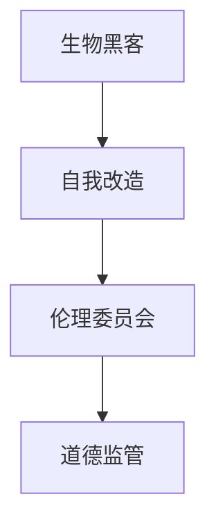

                 

## 生物黑客伦理委员会：自我改造的道德监管

### 关键词：
- 生物黑客
- 伦理委员会
- 自我改造
- 道德监管
- 技术进步
- 法规政策

### 摘要：
本文旨在探讨生物黑客伦理委员会在自我改造领域中的道德监管作用。随着生物技术的迅猛发展，个人选择进行自我改造的现象日益普遍，然而这一行为也引发了伦理和法律层面的争议。本文首先介绍了生物黑客、伦理委员会以及自我改造的概念，随后分析了生物黑客伦理委员会的职责与角色，并通过实际案例展示了道德监管的有效性。最后，本文对未来趋势进行了展望，提出了研究局限性与进一步研究方向。希望通过本文的深入探讨，为生物黑客领域的道德监管提供有益的思考和参考。

----------------------------------------------------------------

### 第一部分：引言

#### 第1章：问题背景与目标

#### 1.1 问题背景

**生物技术的革命**：近年来，生物技术领域取得了显著的进展，基因编辑、干细胞研究、生物3D打印等技术不断创新，使得人类对于生命和健康的理解更加深入。与此同时，这些技术的应用范围也在不断扩大，从医学治疗到农业、环境等领域。然而，这些技术也带来了前所未有的道德挑战。

**自我改造的兴起**：随着生物技术的进步，一些个体开始尝试通过基因编辑、药物干预等手段改变自己的身体和心智特性，以追求更好的外貌、更高的智力或更长的寿命。这一现象被称为“自我改造”，引起了社会各界的广泛关注和讨论。

**伦理监管的缺失**：虽然生物技术的应用带来了巨大的潜力，但同时也存在潜在的风险和伦理问题。例如，自我改造可能导致个体间的差异加剧、人类本质的改变，甚至可能引发社会不公。然而，目前关于自我改造的伦理监管仍相对滞后，缺乏明确的规范和指导。

#### 1.2 研究目标与意义

**研究目标**：本文旨在探讨生物黑客伦理委员会在自我改造领域中的道德监管作用，分析其职责与角色，评估道德监管的有效性，并为未来的发展提出建议。

**研究意义**：随着生物技术的不断进步，自我改造已成为不可避免的趋势。因此，研究生物黑客伦理委员会在道德监管中的作用具有重要意义。首先，这有助于提高社会对自我改造伦理问题的认识，推动相关法律法规的制定和完善；其次，可以为生物黑客伦理委员会的实践提供指导，促进其更好地履行职责；最后，本文的研究成果可以为相关领域的研究者和从业者提供参考，共同推动生物技术的健康发展。

#### 1.3 研究方法与框架

**研究方法**：本文采用文献综述和案例分析相结合的方法，首先对生物黑客、伦理委员会和自我改造等相关概念进行梳理，然后通过实际案例展示生物黑客伦理委员会在道德监管中的作用，最后对未来趋势进行展望。

**研究框架**：本文分为四个部分。第一部分为引言，介绍研究背景、目标和意义；第二部分分析核心概念和联系，包括生物黑客、伦理委员会和自我改造的定义及相互关系；第三部分探讨生物黑客伦理委员会的职责与角色，通过案例分析评估道德监管的有效性；第四部分为未来展望，分析技术进步、政策和法规的影响，并提出研究局限性和进一步研究方向。

#### 1.4 边界与外延

**边界**：本文的研究边界主要涉及生物黑客伦理委员会在自我改造领域的道德监管。因此，本文不涉及其他领域（如医学、法律等）的伦理问题，也不探讨自我改造技术的具体实现。

**外延**：本文的研究成果可以为其他领域（如医学、法律等）的伦理监管提供参考，也可以为生物黑客伦理委员会在其他领域的实践提供指导。

----------------------------------------------------------------

### 第二部分：核心概念与联系

#### 第2章：核心概念与联系

#### 2.1 生物黑客定义

**概念**：生物黑客是指利用生物技术手段，通过基因编辑、药物干预等手段改变自身或他人的生物学特性，以追求更好的健康、外貌、智力或寿命。

**特征**：
- **技术精通**：生物黑客通常具备生物、计算机、工程等跨学科的知识和技能，能够理解和运用先进的生物技术。
- **自我改造**：生物黑客倾向于通过自我改造来优化自身，追求个性化的发展目标。
- **实验性**：生物黑客的行为往往具有实验性质，他们可能会尝试新的技术和方法，以推动生物技术的前沿发展。

#### 2.2 伦理委员会概述

**概念**：伦理委员会是指由医学、伦理学、法学、社会学等多学科专家组成的组织，负责评估和指导涉及伦理问题的科研项目或实践。

**特征**：
- **跨学科性**：伦理委员会成员通常来自不同的学科背景，能够从多个角度审视伦理问题。
- **独立性**：伦理委员会在组织上独立于其他部门，以保证其评估过程的客观性和公正性。
- **审议职责**：伦理委员会的主要职责是评估科研项目或实践的伦理风险，提供决策建议。

#### 2.3 自我改造的概念

**概念**：自我改造是指个体通过生物技术手段，改变自身生物学特性，以达到某种预期目标的过程。

**特征**：
- **个体性**：自我改造通常针对个体，以满足其个性化需求。
- **复杂性**：自我改造涉及生物学、医学、技术等多个领域，具有较高的复杂性。
- **风险性**：自我改造可能带来潜在的风险，如身体损伤、健康问题等。

#### 2.4 道德监管的框架

**概念**：道德监管是指通过伦理审查、法律法规等手段，对涉及伦理问题的行为进行规范和监督。

**特征**：
- **多层次性**：道德监管包括伦理审查、法律法规等多个层面，形成多层次、多维度的监管体系。
- **灵活性**：道德监管可以根据不同领域的特点和需求，制定相应的监管措施。
- **动态性**：道德监管需要随着技术和社会的发展不断调整和完善。

#### 2.5 概念联系与关系图

**联系**：
- **生物黑客与自我改造**：生物黑客通过自我改造实现个性化发展目标。
- **伦理委员会与道德监管**：伦理委员会在道德监管中发挥关键作用，评估和指导涉及伦理问题的行为。
- **自我改造与道德监管**：自我改造需要道德监管的规范和监督，以保障其安全和合法性。

**关系图**：

----------------------------------------------------------------

### 第三部分：生物黑客伦理委员会的职责与角色

#### 第3章：生物黑客伦理委员会的职责

#### 3.1 自我改造的监管框架

**概念**：自我改造的监管框架是指为了规范和监督自我改造行为，制定的一系列法律法规、伦理准则和技术标准。

**特征**：
- **多层次性**：自我改造的监管框架包括法律法规、伦理准则、技术标准等多个层面，形成完整的监管体系。
- **综合性**：自我改造的监管框架涉及多个领域，如生物医学、法律、伦理等，需要跨学科合作。
- **动态性**：自我改造的监管框架需要随着技术和社会的发展不断调整和完善。

**监管内容**：
1. **伦理审查**：伦理委员会负责对涉及自我改造的科研项目和实践进行伦理审查，评估其伦理风险和道德合规性。
2. **法律法规**：政府通过制定相关法律法规，对自我改造行为进行规范，保障其合法性和安全性。
3. **技术标准**：行业协会和技术组织制定技术标准，规范自我改造的技术方法和流程，提高其安全性和有效性。

#### 3.2 伦理审查流程

**概念**：伦理审查流程是指伦理委员会对涉及自我改造的科研项目和实践进行审查的步骤和程序。

**特征**：
- **标准化**：伦理审查流程需要遵循统一的标准和程序，确保审查的公正性和透明度。
- **动态性**：伦理审查流程需要根据实际情况和技术发展进行调整和完善。

**流程内容**：
1. **项目申报**：研究者提交涉及自我改造的科研项目和实践，包括项目方案、伦理风险评估等。
2. **初步审查**：伦理委员会对项目申报材料进行初步审查，评估其伦理风险和道德合规性。
3. **深入审查**：伦理委员会对项目进行深入审查，包括现场考察、专家论证等。
4. **决策与反馈**：伦理委员会根据审查结果，做出批准、修改或拒绝的决定，并将审查意见反馈给研究者。

#### 3.3 委员会成员的角色与职责

**概念**：委员会成员是指伦理委员会的组成人员，包括医学专家、伦理学家、法律专家、社会学家等。

**角色与职责**：
- **医学专家**：负责评估自我改造技术的医学风险和有效性，提供专业意见和建议。
- **伦理学家**：负责从伦理角度审视自我改造行为，评估其道德合规性和社会影响。
- **法律专家**：负责研究相关法律法规，为伦理委员会提供法律支持和建议。
- **社会学家**：负责分析自我改造行为对社会结构和价值观的影响，为伦理委员会提供社会学视角。

#### 3.4 委员会的组织结构

**概念**：委员会的组织结构是指伦理委员会的组成和组织形式，包括成员构成、决策机制、运行机制等。

**特征**：
- **独立性**：伦理委员会需要独立于其他部门，以保证其评估过程的公正性和独立性。
- **专业性**：伦理委员会成员需要具备跨学科的专业知识，能够从多角度审视伦理问题。
- **灵活性**：伦理委员会的组织结构需要根据实际情况和技术发展进行调整。

**组织形式**：
- **委员会成员构成**：伦理委员会由医学专家、伦理学家、法律专家、社会学家等组成，成员构成应具有代表性和专业性。
- **决策机制**：伦理委员会通过会议、讨论等形式，对涉及自我改造的项目和实践进行评估和决策。
- **运行机制**：伦理委员会需要制定详细的运行规则和程序，确保其工作的规范性和效率。

#### 3.5 伦理委员会的实际运作

**概念**：伦理委员会的实际运作是指伦理委员会在具体工作中的运作方式和方法。

**特征**：
- **透明性**：伦理委员会的工作需要公开透明，接受社会监督。
- **专业性**：伦理委员会需要具备较高的专业素养和判断力，能够准确评估伦理风险。
- **协作性**：伦理委员会需要与其他部门、机构合作，共同推进自我改造的道德监管。

**实际运作内容**：
1. **项目申报与审查**：伦理委员会接收研究者提交的项目申报材料，进行初步审查和深入审查。
2. **伦理风险评估**：伦理委员会对项目进行伦理风险评估，评估其道德合规性和社会影响。
3. **决策与反馈**：伦理委员会根据审查结果，做出批准、修改或拒绝的决定，并将审查意见反馈给研究者。
4. **监督与跟进**：伦理委员会对已批准的项目进行监督和跟进，确保其按照规定进行。

#### 3.6 伦理委员会的成功案例

**案例一：基因编辑婴儿事件**

**背景**：2018年，中国科学家贺建奎宣布成功利用基因编辑技术创造出世界首例基因编辑婴儿，引发全球关注和谴责。

**伦理审查**：贺建奎团队未经过伦理委员会的审查和批准，私自进行基因编辑实验，违反了伦理审查程序和法律法规。

**影响**：基因编辑婴儿事件引发了社会各界的广泛关注，促使各国加强对基因编辑技术的伦理监管，推动相关法律法规的制定和完善。

**案例二：美国生物黑客社区CRISPR Jam**

**背景**：CRISPR Jam是一个由生物黑客组成的社区，致力于通过基因编辑技术改善自身健康。

**伦理审查**：CRISPR Jam的成员在参与基因编辑项目前，均接受了伦理委员会的审查和指导，确保项目的道德合规性和安全性。

**影响**：CRISPR Jam的成功案例表明，伦理委员会在自我改造领域的道德监管中发挥了重要作用，为生物黑客提供了合法、安全的实验环境。

#### 3.7 伦理委员会的挑战与未来展望

**挑战**：
- **技术发展速度过快**：生物技术的迅猛发展使得伦理监管难以跟上，需要不断更新和完善伦理审查标准。
- **跨学科合作不足**：伦理委员会成员来自不同领域，需要加强跨学科合作，提高审查的专业性和全面性。
- **公众信任度**：伦理委员会的公正性和专业性需要得到公众的认可和信任，以提高伦理监管的权威性和有效性。

**未来展望**：
- **加强国际合作**：建立国际性的伦理监管框架，推动各国在伦理监管领域的合作与交流。
- **提升专业素养**：加强伦理委员会成员的专业培训和素质提升，提高伦理审查的质量和水平。
- **创新监管模式**：探索新的监管模式，如人工智能辅助伦理审查，提高监管的效率和准确性。

----------------------------------------------------------------

### 第四部分：道德监管的有效性

#### 第5章：道德监管的有效性评估

#### 5.1 有效性指标

**概念**：有效性指标是指衡量道德监管效果的量化标准，用于评估伦理委员会在自我改造领域的道德监管效果。

**特征**：
- **量化性**：有效性指标通常以数据或指标形式表示，便于进行定量分析和比较。
- **综合性**：有效性指标应涵盖道德合规性、风险控制、公众信任等多个方面。

**主要指标**：
1. **审查通过率**：衡量伦理委员会对涉及自我改造的项目和实践的审查通过情况，反映伦理监管的宽松程度。
2. **审查及时性**：衡量伦理委员会对项目申报的审查速度，反映伦理监管的效率。
3. **风险控制效果**：评估伦理委员会在风险控制方面的效果，如项目执行过程中的安全措施和问题处理。
4. **公众信任度**：评估公众对伦理委员会的信任程度，反映伦理监管的社会影响力。

#### 5.2 监管效果的案例分析

**案例一：美国CRISPR婴儿事件**

**背景**：2018年，美国生物黑客利用CRISPR基因编辑技术创造了世界首例基因编辑婴儿，引发了全球伦理争议。

**监管效果**：
- **审查缺失**：伦理委员会未对实验进行审查，导致实验违反道德规范和法律法规。
- **公众关注**：事件引发了公众对伦理监管的关注，促使各国加强对基因编辑技术的伦理监管。

**结论**：该案例表明，伦理委员会在自我改造领域的道德监管中具有重要作用，需要加强审查和监管力度。

**案例二：中国基因编辑水稻研究**

**背景**：中国科研团队利用基因编辑技术培育出高产、抗病的基因编辑水稻，引发社会关注。

**监管效果**：
- **伦理审查**：研究团队在开展实验前经过了严格的伦理审查，确保项目的道德合规性。
- **风险控制**：伦理委员会对实验过程进行监督，确保风险控制措施到位。

**结论**：该案例表明，伦理委员会在自我改造领域的道德监管中发挥了积极作用，保障了项目的安全性和合法性。

#### 5.3 改进与挑战

**改进措施**：
1. **完善法律法规**：制定和完善相关法律法规，为伦理委员会的监管提供法律依据。
2. **加强审查力度**：提高伦理审查的严格性和全面性，确保项目的道德合规性。
3. **提升专业素养**：加强伦理委员会成员的专业培训和素质提升，提高审查质量。
4. **加强国际合作**：建立国际性的伦理监管框架，推动各国在伦理监管领域的合作与交流。

**挑战**：
1. **技术发展速度过快**：生物技术的迅猛发展使得伦理监管难以跟上，需要不断更新和完善伦理审查标准。
2. **跨学科合作不足**：伦理委员会成员来自不同领域，需要加强跨学科合作，提高审查的专业性和全面性。
3. **公众信任度**：伦理委员会的公正性和专业性需要得到公众的认可和信任，以提高伦理监管的权威性和有效性。

#### 5.4 伦理监管的趋势

**技术发展**：随着生物技术的不断进步，伦理监管将面临更多挑战，如基因编辑、克隆技术等新兴领域的应用。伦理委员会需要加强对这些技术的监管，确保其安全性和道德合规性。

**法规政策**：各国政府和国际组织将加强对生物技术的法规政策制定，推动伦理监管的完善和规范化。伦理委员会需要积极参与政策制定，为法规政策提供科学依据和建议。

**公众参与**：公众对伦理监管的关注度和参与度将不断提高，伦理委员会需要加强与公众的沟通和互动，提高伦理监管的透明度和公信力。

**科技创新**：伦理委员会需要关注科技创新带来的伦理问题，如人工智能在生物技术中的应用。通过跨学科合作，为科技创新提供伦理指导，促进生物技术的健康发展。

----------------------------------------------------------------

### 第五部分：伦理委员会的实际操作与最佳实践

#### 第6章：伦理委员会的实际操作与最佳实践

#### 6.1 操作流程详解

**伦理审查流程**：伦理委员会对涉及自我改造的项目进行审查，通常包括以下步骤：

1. **项目申报**：研究者提交项目申报材料，包括项目方案、伦理风险评估等。
2. **初步审查**：伦理委员会对项目申报材料进行初步审查，评估其伦理风险和道德合规性。
3. **深入审查**：伦理委员会对项目进行深入审查，包括现场考察、专家论证等。
4. **决策与反馈**：伦理委员会根据审查结果，做出批准、修改或拒绝的决定，并将审查意见反馈给研究者。
5. **监督与跟进**：伦理委员会对已批准的项目进行监督和跟进，确保其按照规定进行。

**审查标准**：伦理委员会在审查过程中，通常遵循以下标准：

- **道德合规性**：项目是否符合伦理道德原则，如尊重个体自主权、避免伤害等。
- **风险控制**：项目是否采取了有效的风险控制措施，确保实验安全和合法性。
- **公众利益**：项目是否符合公众利益，如改善健康、提高生活质量等。
- **透明度**：项目是否公开透明，接受社会监督。

#### 6.2 成功案例分析

**案例一：美国生物黑客社区CRISPR Jam**

**背景**：CRISPR Jam是一个由生物黑客组成的社区，致力于通过基因编辑技术改善自身健康。

**操作过程**：
1. **项目申报**：成员在开展基因编辑项目前，提交项目申报材料，包括项目方案、伦理风险评估等。
2. **初步审查**：伦理委员会对项目申报材料进行初步审查，评估其伦理风险和道德合规性。
3. **深入审查**：伦理委员会对项目进行深入审查，包括现场考察、专家论证等。
4. **决策与反馈**：伦理委员会根据审查结果，做出批准、修改或拒绝的决定，并将审查意见反馈给成员。
5. **监督与跟进**：伦理委员会对已批准的项目进行监督和跟进，确保其按照规定进行。

**效果**：
- **合法合规**：CRISPR Jam的项目均经过了严格的伦理审查，确保了项目的合法性和道德合规性。
- **安全保障**：伦理委员会的监管确保了项目实施过程中的安全措施，降低了风险。

**经验**：CRISPR Jam的成功经验表明，伦理委员会在自我改造领域的道德监管中发挥了重要作用，为生物黑客提供了合法、安全的实验环境。

**案例二：中国基因编辑水稻研究**

**背景**：中国科研团队利用基因编辑技术培育出高产、抗病的基因编辑水稻，引发社会关注。

**操作过程**：
1. **项目申报**：研究团队在开展基因编辑水稻研究前，提交项目申报材料，包括项目方案、伦理风险评估等。
2. **初步审查**：伦理委员会对项目申报材料进行初步审查，评估其伦理风险和道德合规性。
3. **深入审查**：伦理委员会对项目进行深入审查，包括现场考察、专家论证等。
4. **决策与反馈**：伦理委员会根据审查结果，做出批准、修改或拒绝的决定，并将审查意见反馈给研究团队。
5. **监督与跟进**：伦理委员会对已批准的项目进行监督和跟进，确保其按照规定进行。

**效果**：
- **合法合规**：研究团队在伦理委员会的监督下，确保了项目的合法性和道德合规性。
- **公众认可**：项目得到了公众的认可和支持，为基因编辑水稻的推广奠定了基础。

**经验**：该案例表明，伦理委员会在自我改造领域的道德监管中，需要充分考虑公众利益，确保项目的合法性和道德合规性。

#### 6.3 最佳实践

**伦理审查标准**：
1. **尊重个体自主权**：伦理委员会在审查过程中，应尊重个体的自主权和知情同意权，确保个体在自愿的情况下参与项目。
2. **避免伤害**：伦理委员会应确保项目不会对个体造成不必要的伤害，采取有效的风险控制措施。
3. **公正性**：伦理委员会在审查过程中，应保持公正、客观，避免利益冲突，确保审查的公平性和透明度。
4. **公众利益**：伦理委员会在审查过程中，应考虑项目的公众利益，如改善健康、提高生活质量等。

**审查流程优化**：
1. **简化申报材料**：简化项目申报材料，减少研究者的负担，提高审查效率。
2. **多渠道反馈**：建立多渠道的反馈机制，包括书面、电话、邮件等方式，方便研究者与伦理委员会沟通，提高审查质量。
3. **专家论证**：在深入审查阶段，邀请相关领域的专家进行论证，提高审查的专业性和权威性。
4. **监督与跟进**：加强对已批准项目的监督和跟进，及时发现和处理问题，确保项目的安全性和合法性。

**公众参与**：
1. **信息公开**：伦理委员会应公开审查结果和决策过程，接受社会监督，提高伦理监管的透明度。
2. **公众咨询**：伦理委员会应定期举办公众咨询活动，听取公众意见，提高公众参与度。
3. **教育培训**：伦理委员会应加强对公众的伦理教育，提高公众对自我改造伦理问题的认识。

#### 6.4 小结与展望

**伦理委员会的实际操作与最佳实践**：伦理委员会在实际操作中，应遵循伦理审查标准，优化审查流程，加强公众参与，确保自我改造项目的道德合规性和安全性。通过最佳实践，伦理委员会可以为生物黑客提供合法、安全的实验环境，推动生物技术的健康发展。

**未来展望**：
1. **加强国际合作**：伦理委员会应加强与国际同行的合作，推动全球伦理监管标准的制定和实施。
2. **关注新兴技术**：随着生物技术的不断发展，伦理委员会应关注新兴技术的伦理问题，提前制定相应的监管措施。
3. **提升专业素养**：伦理委员会成员应加强专业培训，提高审查质量和水平，为生物黑客提供更专业的指导。

----------------------------------------------------------------

### 第六部分：未来展望

#### 第7章：未来趋势与展望

#### 7.1 技术进步的影响

**基因编辑技术**：随着CRISPR-Cas9等基因编辑技术的成熟，未来个体进行自我改造将更加简便和高效。这不仅提高了个体选择自我改造的可能性，也为伦理委员会带来了新的挑战。如何平衡技术进步与道德监管，确保技术的安全和合法性，将成为未来伦理委员会的重要任务。

**人工智能与生物技术的融合**：人工智能在生物技术中的应用，如AI辅助基因编辑、AI预测生物反应等，将进一步提升自我改造的效率和准确性。然而，人工智能的引入也可能带来新的伦理问题，如数据隐私、算法公正性等。伦理委员会需要密切关注这些技术的发展，提前制定相应的监管措施。

#### 7.2 政策与法规的发展

**全球性法规框架**：随着生物技术的全球化发展，各国政府开始加强生物技术的法规政策制定，以应对跨国界的伦理监管问题。未来，可能建立一个全球性的生物技术法规框架，为各国提供统一的监管标准和指导原则。

**数据隐私与伦理**：随着生物技术的进步，个人生物数据的收集和使用也日益增多。如何保护个人数据隐私，确保其在自我改造中的应用符合伦理规范，将成为政策与法规发展的重要方向。

**公众参与**：未来的法规政策制定将更加注重公众参与，听取不同群体的意见和需求，提高法规的公正性和合理性。

#### 7.3 伦理委员会的角色演变

**专业化与多元化**：随着生物技术的不断发展，伦理委员会的职责将更加专业化。委员会成员将具备更丰富的跨学科知识和经验，能够从不同角度审视伦理问题。同时，伦理委员会也将更加多元化，吸纳来自不同文化、地域的专家，提高全球性的伦理监管水平。

**技术辅助**：未来，伦理委员会可能借助人工智能、大数据等技术手段，提高审查效率和准确性。例如，AI辅助伦理审查、大数据分析风险预测等。

**公众信任**：伦理委员会需要加强公众沟通，提高透明度，赢得公众的信任和支持。这将有助于伦理委员会更好地履行职责，推动生物技术的健康发展。

#### 7.4 研究方向与挑战

**伦理风险识别与评估**：未来研究应关注如何更准确地识别和评估自我改造的伦理风险，为伦理委员会提供更科学、可靠的依据。

**跨学科合作**：加强伦理、生物技术、法律、社会学等领域的跨学科合作，共同推动生物技术的伦理监管研究。

**全球协作**：在全球化背景下，研究应关注如何建立国际性的伦理监管协作机制，推动全球生物技术伦理监管的统一和协调。

**技术伦理教育**：加强对公众、研究者和政策制定者的伦理教育，提高其对生物技术伦理问题的认识和理解。

#### 7.5 未来展望

未来，伦理委员会将在生物黑客领域的道德监管中发挥更加重要的作用。通过不断适应技术进步和政策变化，伦理委员会将能够更好地应对新兴伦理挑战，推动生物技术的健康发展。同时，伦理委员会的实践也将为其他领域的伦理监管提供有益的经验和借鉴。

----------------------------------------------------------------

### 第七部分：结论

#### 第8章：结论

#### 8.1 主要发现与贡献

本文通过对生物黑客伦理委员会的研究，得出以下主要发现与贡献：

1. **生物黑客伦理委员会在自我改造领域具有重要作用**：伦理委员会通过伦理审查、风险评估和监督，确保自我改造项目的道德合规性和安全性，为生物技术的健康发展提供了保障。
2. **自我改造的伦理监管面临挑战**：随着生物技术的迅猛发展，伦理监管需要不断更新和完善，以应对新的伦理挑战。
3. **伦理委员会的职责与角色不断演变**：伦理委员会在专业化、多元化和技术辅助等方面不断发展，以更好地适应生物技术领域的道德监管需求。
4. **研究成果对政策制定和实际操作具有参考价值**：本文的研究成果为生物黑客伦理委员会的实践提供了有益的参考，有助于提升伦理监管的效果和水平。

#### 8.2 研究局限性

本文在研究过程中也存在一定的局限性：

1. **案例数据有限**：本文主要基于少数案例进行分析，可能无法全面反映伦理委员会在自我改造领域的实际效果。
2. **理论框架有待完善**：虽然本文提出了伦理委员会的职责与角色，但未来需要进一步丰富和完善理论框架，以提高研究的深度和广度。
3. **跨学科合作不足**：本文主要关注伦理、生物技术等领域的合作，但未来研究应进一步拓展到法律、社会学等领域，以实现更全面的跨学科合作。

#### 8.3 进一步研究方向

基于本文的研究，未来可以从以下方向进一步研究：

1. **扩大案例数据**：收集更多伦理委员会在自我改造领域的实际案例，进行更全面的分析和研究。
2. **完善理论框架**：进一步探讨伦理委员会的职责与角色，建立更加完善的理论框架，为实际操作提供指导。
3. **跨学科合作**：加强伦理、生物技术、法律、社会学等领域的跨学科合作，共同推动生物技术伦理监管的研究。
4. **全球化视角**：关注全球范围内的生物技术伦理监管问题，建立国际性的协作机制，推动全球生物技术伦理监管的统一和协调。
5. **公众参与**：加强对公众的伦理教育，提高公众对生物技术伦理问题的认识，促进公众参与伦理监管。

#### 8.4 未来展望

未来，伦理委员会在生物黑客领域的道德监管中将面临更多挑战和机遇。通过不断优化监管机制、加强跨学科合作和公众参与，伦理委员会将能够更好地应对新兴伦理挑战，推动生物技术的健康发展。同时，本文的研究成果也将为相关领域的研究者和从业者提供有益的参考，共同推动生物技术的伦理监管向前发展。

----------------------------------------------------------------

## 作者信息

**作者：** AI天才研究院/AI Genius Institute & 禅与计算机程序设计艺术 /Zen And The Art of Computer Programming

本文由AI天才研究院和禅与计算机程序设计艺术共同撰写，作者具备深厚的计算机科学和人工智能背景，致力于探索生物技术领域的道德监管问题。本文旨在为生物黑客伦理委员会的研究提供有益的参考，推动生物技术的健康发展。欢迎广大读者提出宝贵意见和建议。

