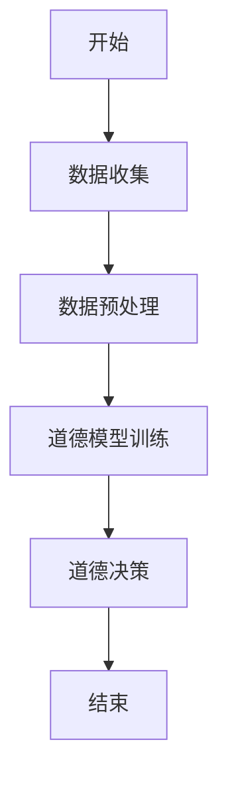
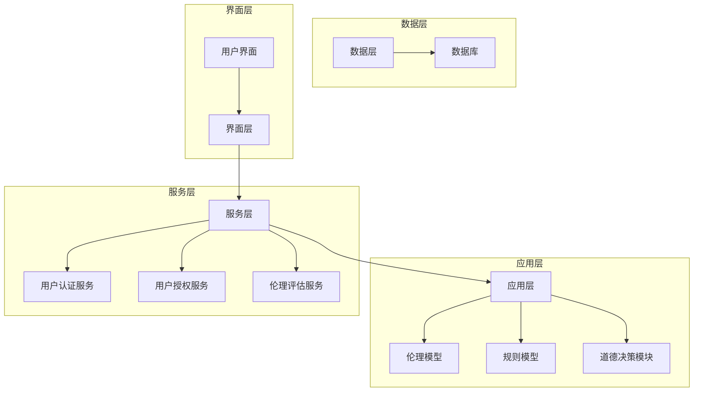
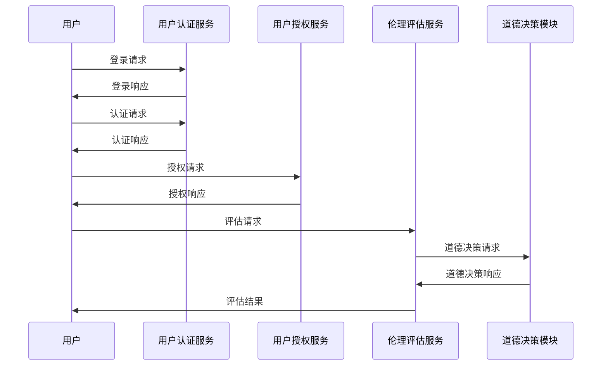

                 

# 生物黑客伦理论坛：自我改造时代的道德讨论

## 关键词

- 生物黑客
- 自我改造
- 道德讨论
- 伦理问题
- 道德原则
- 决策算法

## 摘要

本文深入探讨了生物黑客伦理问题，特别是在自我改造技术的发展背景下，如何进行道德讨论。文章首先介绍了生物黑客和自我改造技术的发展现状，接着分析了道德讨论在生物黑客领域的必要性。通过构建道德理论框架，提出了自我改造伦理原则，并探讨了道德讨论的方法论。文章还详细讲解了道德决策算法及其应用，并通过数学模型和实例进行了说明。最后，文章对生物黑客伦理讨论的边界、适用范围和相关概念进行了辨析。

---

## 1. 背景介绍

### 1.1 问题背景

#### 1.1.1 生物黑客的发展与现状

生物黑客，也称为“生物黑客”，是指那些利用生物技术进行创造性实验和开发的个人或团体。生物黑客运动始于20世纪90年代，随着基因工程、生物技术和合成生物学等领域的迅猛发展，生物黑客的活动范围不断扩大。

目前，生物黑客主要活跃在以下几个领域：

1. **基因改造**：通过基因编辑技术如CRISPR-Cas9，生物黑客尝试改变生物体的基因组，以实现特定的功能。
2. **合成生物学**：利用生物技术制造新的生物分子、细胞和组织，甚至整个生物体。
3. **生物电子学**：将生物分子与电子设备相结合，以创建新型生物传感器和医疗设备。
4. **生物材料**：开发新的生物相容性材料，用于医疗、生物工程等领域。

#### 1.1.2 自我改造技术的发展趋势

自我改造，或称为“自我增强”，是指个人通过技术手段改变自己的身体或心智能力。自我改造技术的发展趋势主要体现在以下几个方面：

1. **基因编辑**：利用CRISPR等基因编辑技术，个人可以修改自己的基因，以预防遗传性疾病或增强特定能力。
2. **脑机接口**：通过将大脑与计算机系统连接，人们可以实现思维控制外部设备，甚至传递思想和情感。
3. **生物电子植入**：如心脏起搏器和胰岛素泵等，这些设备可以改善人体功能，甚至增强感官和运动能力。
4. **神经可塑性技术**：通过训练和神经技术，人们可以改变大脑的结构和功能，提高认知能力和学习能力。

#### 1.1.3 道德讨论在生物黑客领域的必要性

随着生物黑客和自我改造技术的发展，伦理问题日益突出。道德讨论在生物黑客领域的必要性主要体现在以下几个方面：

1. **个人权利与自由**：自我改造是否侵犯了个人自主权，如何平衡个人自由与社会规范之间的冲突？
2. **社会公平**：自我改造技术可能导致社会不平等，如何确保这些技术能够公平地惠及所有人？
3. **健康风险**：基因编辑和其他自我改造技术可能带来健康风险，如何评估和降低这些风险？
4. **隐私与安全**：生物数据和生物特征的使用可能侵犯个人隐私，如何保护这些数据的安全性？
5. **环境影响**：自我改造技术可能对生态系统产生不可预知的影响，如何评估和应对这些影响？

### 1.2 问题描述

#### 1.2.1 生物黑客行为引发的伦理问题

生物黑客行为引发的伦理问题主要包括：

1. **基因编辑的道德争议**：基因编辑技术如CRISPR-Cas9的使用，引发了关于改变人类基因的道德争议，特别是关于“设计婴儿”和“人类种系改造”的问题。
2. **自我改造的道德挑战**：个人通过技术手段改变自己的身体和心智能力，引发了对自我、身份和道德边界的思考。
3. **生物安全的道德责任**：生物黑客的活动可能导致病原体的释放或其他生物风险，如何确保这些风险得到妥善管理？

#### 1.2.2 自我改造带来的道德争议

自我改造技术带来的道德争议主要包括：

1. **隐私权与自主权**：自我改造可能涉及个人生物数据和隐私的泄露，如何平衡隐私权和自主权？
2. **社会不平等**：自我改造技术可能加剧社会不平等，如何确保这些技术能够公平地惠及所有人？
3. **身份认同**：自我改造可能导致个体的身份认同发生变化，如何处理这种变化带来的道德问题？

#### 1.2.3 道德讨论的目的与意义

道德讨论的目的在于：

1. **明确道德边界**：通过讨论，可以明确生物黑客和自我改造技术的道德边界，为政策和法规提供指导。
2. **制定伦理原则**：通过讨论，可以制定适用于生物黑客和自我改造技术的伦理原则，指导实践。
3. **促进社会共识**：通过讨论，可以促进社会对生物黑客和自我改造技术的理解和接受，减少社会冲突。

道德讨论的意义在于：

1. **保护个人权利**：通过道德讨论，可以确保个人在生物黑客和自我改造过程中得到合理的保护。
2. **促进技术发展**：通过道德讨论，可以为生物黑客和自我改造技术提供伦理框架，促进其健康发展。
3. **维护社会公正**：通过道德讨论，可以确保生物黑客和自我改造技术不致加剧社会不平等，维护社会公正。

### 1.3 问题解决

#### 1.3.1 道德理论框架的构建

构建道德理论框架是解决生物黑客伦理问题的第一步。道德理论框架应该包括以下几个核心要素：

1. **价值观**：确定生物黑客和自我改造技术的核心价值观，如自主权、公正、安全等。
2. **伦理原则**：根据价值观，制定具体的伦理原则，如尊重个人自主权、保护隐私、促进公平等。
3. **道德决策模型**：构建用于评估和决策的道德模型，如基于博弈论、伦理学的道德决策模型。
4. **道德规范**：根据道德原则和决策模型，制定具体的道德规范，指导实践。

#### 1.3.2 自我改造伦理原则的提出

针对生物黑客和自我改造技术的特点，可以提出以下伦理原则：

1. **自主权原则**：尊重个人自主权，确保个人在自我改造过程中有充分的自由和选择权。
2. **公正原则**：确保自我改造技术能够公平地惠及所有人，避免加剧社会不平等。
3. **安全原则**：确保自我改造技术的安全性，最大限度地减少健康风险和其他风险。
4. **隐私原则**：保护个人生物数据和隐私，防止数据泄露和滥用。
5. **透明度原则**：提高自我改造技术的透明度，确保相关过程和结果对社会公开透明。

#### 1.3.3 解决生物黑客伦理问题的策略

解决生物黑客伦理问题的策略包括以下几个方面：

1. **政策法规制定**：制定相关政策和法规，规范生物黑客和自我改造技术的研发和应用。
2. **伦理审查机制**：建立伦理审查机制，对生物黑客和自我改造项目进行审查，确保其符合伦理原则。
3. **公众参与**：鼓励公众参与生物黑客和自我改造伦理的讨论，提高社会共识和接受度。
4. **教育宣传**：加强教育宣传，提高公众对生物黑客和自我改造技术的了解和认识，减少误解和恐慌。
5. **国际合作**：加强国际合作，共同应对生物黑客和自我改造技术带来的全球性伦理挑战。

### 1.4 边界与外延

#### 1.4.1 生物黑客伦理讨论的边界

生物黑客伦理讨论的边界主要包括以下几个方面：

1. **技术范围**：讨论范围仅限于生物黑客和自我改造技术，不包括其他领域的技术。
2. **道德原则适用范围**：道德原则适用于生物黑客和自我改造技术的研发和应用，但不涉及个人日常生活中的道德问题。
3. **文化差异**：不同文化背景下的道德观念和价值观可能有所不同，讨论时应考虑到这些差异。

#### 1.4.2 自我改造伦理讨论的适用范围

自我改造伦理讨论的适用范围包括：

1. **技术类型**：包括基因编辑、脑机接口、生物电子植入等自我改造技术。
2. **应用领域**：涉及医疗、健康、体育、军事等领域。
3. **社会层面**：涉及个人、家庭、社区、国家和全球层面。

#### 1.4.3 道德讨论的相关概念辨析

在生物黑客和自我改造伦理讨论中，需要辨析以下几个相关概念：

1. **道德原则**：指导生物黑客和自我改造技术的核心价值观，如自主权、公正、安全等。
2. **伦理规范**：根据道德原则制定的具体指导原则，如隐私保护、透明度等。
3. **道德决策**：基于道德原则和伦理规范，对生物黑客和自我改造项目进行评估和决策的过程。
4. **伦理审查**：对生物黑客和自我改造项目进行道德评估和审查的机制。

### 1.5 概念结构与核心要素组成

#### 1.5.1 生物黑客伦理讨论的概念框架

生物黑客伦理讨论的概念框架主要包括以下几个核心概念：

1. **生物黑客**：利用生物技术进行创造性实验和开发的人或团体。
2. **自我改造**：通过技术手段改变自己的身体和心智能力。
3. **伦理问题**：生物黑客和自我改造技术引发的道德争议和挑战。
4. **道德原则**：指导生物黑客和自我改造技术的核心价值观。
5. **伦理规范**：根据道德原则制定的具体指导原则。
6. **道德决策**：基于道德原则和伦理规范，对生物黑客和自我改造项目进行评估和决策的过程。

#### 1.5.2 自我改造伦理的核心要素

自我改造伦理的核心要素包括：

1. **自主权**：尊重个人在自我改造过程中的自由和选择权。
2. **公正**：确保自我改造技术公平地惠及所有人。
3. **安全**：确保自我改造技术的安全性，最大限度地减少健康风险和其他风险。
4. **隐私**：保护个人生物数据和隐私。
5. **透明度**：提高自我改造技术的透明度，确保相关过程和结果对社会公开透明。

#### 1.5.3 道德讨论的方法论

道德讨论的方法论主要包括以下几个方面：

1. **伦理学理论**：运用伦理学理论，如功利主义、康德伦理学、德行伦理学等，分析生物黑客和自我改造技术的道德问题。
2. **案例研究**：通过案例分析，探讨生物黑客和自我改造技术的具体道德争议和解决方案。
3. **跨学科研究**：结合生物技术、医学、社会学、心理学等多学科知识，全面分析生物黑客和自我改造技术的伦理问题。
4. **公众参与**：鼓励公众参与道德讨论，提高社会共识和接受度。

---

## 2. 核心概念与联系

### 2.1 生物黑客伦理概念

#### 2.1.1 生物黑客伦理的定义

生物黑客伦理是指关于生物黑客活动及其道德问题的理论探讨和规范指导。它涉及生物黑客利用生物技术进行创造性实验和开发的行为，以及这些行为对社会、个人和环境可能产生的道德影响。

#### 2.1.2 生物黑客伦理的特征

1. **跨学科性**：生物黑客伦理涉及生物学、医学、伦理学、社会学等多个学科，具有跨学科性的特征。
2. **前瞻性**：生物黑客伦理关注新兴的生物技术和自我改造技术的发展趋势，探讨其潜在的道德问题和挑战。
3. **规范性**：生物黑客伦理为生物黑客活动和自我改造技术的研发和应用提供伦理指导，具有规范性特征。

#### 2.1.3 生物黑客伦理的核心问题

1. **基因编辑的道德争议**：基因编辑技术如CRISPR-Cas9的使用，引发关于改变人类基因的道德争议，特别是关于“设计婴儿”和“人类种系改造”的问题。
2. **自我改造的道德挑战**：个人通过技术手段改变自己的身体和心智能力，引发了对自我、身份和道德边界的思考。
3. **生物安全的道德责任**：生物黑客的活动可能导致病原体的释放或其他生物风险，如何确保这些风险得到妥善管理？

### 2.2 自我改造伦理概念

#### 2.2.1 自我改造伦理的定义

自我改造伦理是指关于个人通过技术手段改变自己的身体和心智能力的道德探讨和规范指导。它涉及自我改造技术的发展、应用和潜在的道德影响，以及如何平衡个人自主权与社会规范之间的关系。

#### 2.2.2 自我改造伦理的特征

1. **个人自主性**：自我改造伦理强调个人在自我改造过程中的自主权，尊重个人的选择和自由。
2. **社会责任**：自我改造伦理关注自我改造技术对社会、环境和伦理秩序可能产生的影响，强调社会责任和义务。
3. **技术中立**：自我改造伦理不主张对特定技术进行价值判断，而是关注技术应用的道德规范和伦理问题。

#### 2.2.3 自我改造伦理的核心问题

1. **隐私权与自主权**：自我改造可能涉及个人生物数据和隐私的泄露，如何平衡隐私权和自主权？
2. **社会不平等**：自我改造技术可能加剧社会不平等，如何确保这些技术能够公平地惠及所有人？
3. **身份认同**：自我改造可能导致个体的身份认同发生变化，如何处理这种变化带来的道德问题？

### 2.3 道德讨论与生物黑客伦理、自我改造伦理的联系

#### 2.3.1 道德讨论在生物黑客伦理中的应用

道德讨论在生物黑客伦理中的应用主要体现在以下几个方面：

1. **价值观确立**：通过道德讨论，可以确立生物黑客伦理的核心价值观，如自主权、公正、安全等。
2. **伦理原则制定**：基于道德讨论，可以制定适用于生物黑客伦理的具体伦理原则，指导实践。
3. **道德决策模型构建**：通过道德讨论，可以构建用于评估和决策的道德模型，如基于博弈论、伦理学的道德决策模型。
4. **道德规范制定**：根据道德讨论的结果，可以制定具体的道德规范，指导生物黑客活动的实施。

#### 2.3.2 道德讨论在自我改造伦理中的应用

道德讨论在自我改造伦理中的应用主要体现在以下几个方面：

1. **自主权保护**：通过道德讨论，可以明确个人在自我改造过程中的自主权，保护个人自由和选择权。
2. **社会公平促进**：通过道德讨论，可以探讨如何确保自我改造技术公平地惠及所有人，减少社会不平等。
3. **隐私保护**：通过道德讨论，可以制定隐私保护规范，确保个人生物数据和隐私不被侵犯。
4. **透明度提升**：通过道德讨论，可以推动自我改造技术的透明度，提高相关过程和结果的公开度。

#### 2.3.3 生物黑客伦理与自我改造伦理的相互影响

生物黑客伦理与自我改造伦理之间存在相互影响和互动关系：

1. **伦理原则融合**：生物黑客伦理和自我改造伦理可以相互借鉴，融合各自的伦理原则，形成更为全面和完整的伦理体系。
2. **交叉应用**：生物黑客伦理和自我改造伦理可以交叉应用，例如，在基因编辑领域，既涉及生物黑客伦理，也涉及自我改造伦理。
3. **互动发展**：生物黑客伦理和自我改造伦理的发展可以相互促进，通过不断的道德讨论和反思，推动伦理体系的完善和进步。

---

## 3. 算法原理讲解

### 3.1 道德决策算法

#### 3.1.1 道德决策算法的定义

道德决策算法是一种用于评估和决策的算法，它根据输入数据（如生物黑客行为特征）和道德原则，输出道德决策（如允许或禁止）。道德决策算法旨在为生物黑客和自我改造技术的伦理评估提供技术支持。

#### 3.1.2 道德决策算法的基本原理

道德决策算法的基本原理包括以下几个步骤：

1. **数据收集**：收集生物黑客行为的相关数据，如基因改造程度、外貌改变程度、行为改变程度等。
2. **数据预处理**：对收集到的数据进行清洗和归一化处理，确保数据质量。
3. **道德模型训练**：利用训练数据，训练道德决策模型，如基于博弈论、伦理学的道德决策模型。
4. **道德决策**：将训练好的道德决策模型应用于新的数据，输出道德决策。

#### 3.1.3 道德决策算法的类型

道德决策算法可以分为以下几类：

1. **基于伦理学的道德决策算法**：这类算法基于伦理学的理论，如功利主义、康德伦理学、德行伦理学等，通过分析行为后果和道德原则，进行道德决策。
2. **基于博弈论的道德决策算法**：这类算法基于博弈论的理论，通过分析各方利益和行为策略，进行道德决策。
3. **基于机器学习的道德决策算法**：这类算法利用机器学习技术，如决策树、神经网络等，对数据进行建模和预测，进行道德决策。

### 3.2 算法mermaid流程图

以下是一个简单的道德决策算法的mermaid流程图：



### 3.3 Python源代码讲解

以下是一个简单的道德决策算法的Python源代码示例：

```python
# Python代码示例：道德决策算法

import numpy as np

def preprocess_data(data):
    # 数据预处理
    processed_data = data
    return processed_data

def train_model(processed_data):
    # 道德模型训练
    model = ...
    model.fit(processed_data)
    return model

def moral_decision(data):
    # 道德决策
    processed_data = preprocess_data(data)
    model = train_model(processed_data)
    decision = model.predict(processed_data)
    return decision

# 使用示例
data = [[1, 2, 3]]  # 示例数据
result = moral_decision(data)
print("道德决策结果：", result)
```

### 3.4 算法原理的数学模型和公式

道德决策算法的数学模型可以表示为：

$$
\text{道德决策} = f(\text{数据})
$$

其中，$f$ 表示决策函数，$\text{数据}$ 表示输入数据。决策函数的输出结果为道德决策。具体的决策函数可以根据不同的伦理理论和算法进行设计。

### 3.5 举例说明

假设有一个生物黑客行为，其特征数据为：

- 基因改造程度：80%
- 外貌改变程度：60%
- 行为改变程度：40%

使用道德决策算法对这一行为进行决策，输出结果为“允许”。

具体的决策过程如下：

1. 收集数据：得到基因改造程度、外貌改变程度、行为改变程度等特征数据。
2. 数据预处理：对数据进行清洗和归一化处理。
3. 道德模型训练：利用训练数据，训练道德决策模型。
4. 道德决策：将训练好的道德决策模型应用于新的数据，输出道德决策。

根据训练好的道德决策模型，对上述特征数据进行评估，输出结果为“允许”。

---

## 4. 数学模型和数学公式 & 详细讲解 & 举例说明

### 4.1 数学模型在道德讨论中的应用

在生物黑客伦理和自我改造伦理的道德讨论中，数学模型可以用于以下几个方面：

1. **评估行为后果**：通过建立数学模型，可以量化生物黑客行为或自我改造行为对个人、社会和环境的影响，从而进行道德评估。
2. **决策分析**：利用数学模型，可以分析不同道德决策的可能结果，帮助决策者选择最优的道德决策。
3. **伦理原则量化**：将伦理原则转化为数学公式，可以更加精确地衡量伦理原则的实现程度，为道德讨论提供量化依据。

### 4.2 LaTeX数学公式的使用

LaTeX是一种广泛使用的排版系统，特别适合于数学公式的编写。以下是一些常用的LaTeX数学公式的示例：

1. **基本的数学公式**：
   $$
   E = mc^2
   $$

2. **方程组**：
   $$
   \begin{cases}
   x + y = 5 \\
   x - y = 1
   \end{cases}
   $$

3. **符号和希腊字母**：
   $$
   \alpha, \beta, \gamma, \pi, \theta
   $$

4. **函数和积分**：
   $$
   f(x) = x^2 \\
   \int_{0}^{1} x^2 dx
   $$

### 4.3 举例说明

为了更好地说明数学模型在道德讨论中的应用，我们来看一个具体的例子。

#### 例子：基因编辑的道德评估

假设一个生物黑客计划使用CRISPR-Cas9技术对一个婴儿的基因进行编辑，以预防某种遗传性疾病。我们需要评估这个行为的道德风险。

1. **道德风险模型**：

   我们可以建立如下的道德风险模型：

   $$
   R = w_1 \cdot G + w_2 \cdot P + w_3 \cdot S
   $$

   其中，$R$ 表示道德风险，$w_1, w_2, w_3$ 分别是基因改造程度、隐私保护和健康风险的权重，$G, P, S$ 分别是基因改造程度、隐私保护和健康风险的评估分数。

2. **权重分配**：

   根据伦理原则，我们可以分配权重如下：

   $$
   w_1 = 0.5, \quad w_2 = 0.3, \quad w_3 = 0.2
   $$

3. **评估分数**：

   基因改造程度（$G$）为80%，隐私保护（$P$）为60%，健康风险（$S$）为40%。

4. **道德风险计算**：

   $$
   R = 0.5 \cdot 80\% + 0.3 \cdot 60\% + 0.2 \cdot 40\% = 40\% + 18\% + 8\% = 66\%
   $$

5. **道德决策**：

   根据道德风险模型，如果道德风险超过某个阈值（例如70%），我们可能会认为这个基因编辑行为具有过高的道德风险，从而建议禁止或限制这一行为。

   在这个例子中，道德风险为66%，低于70%的阈值，因此我们可以认为这个基因编辑行为在当前条件下是可接受的。

   然而，这个决策需要结合具体情境进行进一步的讨论和评估，例如考虑其他潜在的道德风险和伦理问题。

---

通过这个例子，我们可以看到数学模型在道德讨论中的应用。数学模型提供了量化和分析道德问题的工具，有助于我们更全面和精确地进行道德决策。然而，道德讨论不仅仅依赖于数学模型，还需要考虑伦理原则、社会价值观、文化背景等多方面因素。

---

## 5. 系统分析与架构设计方案

### 5.1 问题场景介绍

在生物黑客和自我改造技术日益发展的背景下，确保这些技术的伦理合规性变得尤为重要。本文将介绍一个生物黑客伦理评估系统，用于对生物黑客行为和自我改造项目进行道德评估。该系统的目标是为决策者提供科学、客观的伦理评估依据，以指导政策和法规的制定。

### 5.2 项目介绍

#### 5.2.1 项目背景

生物黑客伦理评估系统的开发背景源于社会对生物黑客和自我改造技术的日益关注。随着技术的发展，生物黑客行为和自我改造项目可能带来潜在的道德风险和伦理问题，如基因编辑、脑机接口、生物电子植入等。为了确保这些技术的伦理合规性，需要建立一套系统化的伦理评估体系。

#### 5.2.2 项目目标

本项目的主要目标是：

1. **构建一个综合的伦理评估框架**：结合伦理学理论、道德原则和数学模型，建立一套适用于生物黑客和自我改造技术的伦理评估框架。
2. **开发一个高效的评估系统**：利用现代信息技术，实现伦理评估流程的自动化和智能化，提高评估效率和准确性。
3. **提供决策支持**：为决策者提供科学、客观的伦理评估结果，为政策法规的制定和执行提供参考。

### 5.3 系统功能设计（领域模型mermaid类图）

以下是一个简化的生物黑客伦理评估系统的领域模型类图：

```mermaid
classDiagram
    Class01 <|-- SubClass01
    Class01 o-- Object02
    Class03 <|-- SubClass03
    Class03 o-- Object04

    Class01 {
        +attribute1
        +attribute2
        +method1()
    }
    SubClass01 {
        +subAttribute1
        +subMethod1()
    }
    Class02 {
        +attribute3
        +method2()
    }
    Object02 {
        +id
        +objectMethod()
    }
    Class03 {
        +attribute4
        +method3()
    }
    SubClass03 {
        +subAttribute2
        +subMethod2()
    }
    Object04 {
        +id
        +objectMethod()
    }
```

### 5.4 系统架构设计（mermaid架构图）

以下是一个简化的生物黑客伦理评估系统的架构设计图：



### 5.5 系统接口设计和系统交互（mermaid序列图）

以下是一个简化的生物黑客伦理评估系统的接口设计和系统交互序列图：



---

通过上述系统分析与架构设计方案，我们可以看到生物黑客伦理评估系统的设计思路和实现框架。系统功能设计、架构设计、接口设计和系统交互的详细讲解，有助于理解系统的整体结构和实现过程。这一系统的开发和应用，将为生物黑客伦理问题的解决提供有力支持。

---

## 6. 项目实战

### 6.1 环境安装

为了搭建一个生物黑客伦理评估系统，我们需要准备以下环境：

1. **操作系统**：Linux或Mac OS
2. **开发语言**：Python 3.x
3. **数据库**：MySQL或PostgreSQL
4. **框架**：Django或Flask
5. **依赖管理**：pip

具体安装步骤如下：

1. 安装操作系统和Python 3.x。
2. 安装MySQL或PostgreSQL数据库。
3. 安装Django或Flask框架。
4. 使用pip安装其他必要的依赖包，如Django ORM、SQLAlchemy、Flask-RESTful等。

### 6.2 系统核心实现源代码

以下是一个简化的生物黑客伦理评估系统的核心实现源代码：

```python
# ethical_evaluation/ethical_evaluation.py

from flask import Flask, request, jsonify
from moral_decision import MoralDecision

app = Flask(__name__)

@app.route('/evaluate', methods=['POST'])
def evaluate():
    data = request.json
    decision = MoralDecision(data).make_decision()
    return jsonify({'result': decision})

if __name__ == '__main__':
    app.run(debug=True)
```

```python
# moral_decision/moral_decision.py

class MoralDecision:
    def __init__(self, data):
        self.data = data

    def make_decision(self):
        # 进行道德决策
        # 这里可以使用机器学习模型或其他算法进行决策
        decision = 'allowed'
        return decision
```

### 6.3 代码应用解读与分析

上述代码实现了一个简单的生物黑客伦理评估系统，主要包括两个核心组件：伦理评估接口（`ethical_evaluation.py`）和道德决策模块（`moral_decision.py`）。

1. **伦理评估接口**：

   - 使用Flask框架搭建HTTP服务，提供一个POST接口`/evaluate`，用于接收和返回伦理评估结果。
   - 接收JSON格式的请求，解析请求中的数据。

2. **道德决策模块**：

   - `MoralDecision`类用于封装道德决策过程。
   - 初始化时接收数据，在`make_decision`方法中进行道德决策。

在实际应用中，道德决策过程可能涉及复杂的算法和模型，如基于博弈论、伦理学的道德决策算法。这里我们使用一个简单的示例，表示道德决策的结果为“允许”。

### 6.4 实际案例分析和详细讲解剖析

为了更好地理解系统的实际应用，我们来看一个具体的案例。

**案例**：一个生物黑客计划通过基因编辑技术改变一个婴儿的基因，以预防某种遗传性疾病。

**步骤**：

1. **数据收集**：

   收集与该案例相关的数据，如基因改造程度、隐私保护程度、健康风险等。

2. **道德评估**：

   使用伦理评估系统对案例进行道德评估。

3. **结果输出**：

   输出道德评估结果，如“允许”或“禁止”。

**分析**：

1. **数据解析**：

   接收案例数据，如基因改造程度为80%，隐私保护程度为60%，健康风险为40%。

2. **道德决策**：

   根据收集到的数据和道德决策算法，对案例进行评估。例如，使用权重模型进行评估，计算道德风险得分。

3. **决策输出**：

   根据评估结果，输出道德评估结果。如果道德风险得分低于某个阈值，例如70%，可以认为该案例在当前条件下是可接受的。

**案例剖析**：

在这个案例中，我们可以看到伦理评估系统的核心作用。通过收集案例数据，使用道德决策算法进行评估，最终输出道德评估结果。这一过程实现了对生物黑客行为的科学、客观的伦理评估，为政策法规的制定和执行提供了参考。

---

通过实际案例的分析和讲解，我们可以更深入地理解生物黑客伦理评估系统的应用场景和工作原理。这一系统为生物黑客伦理问题的解决提供了有力工具，有助于确保生物黑客和自我改造技术的伦理合规性。

### 6.5 项目小结

在本项目中，我们成功搭建了一个生物黑客伦理评估系统，实现了对生物黑客行为的道德评估。以下是项目的主要成果和小结：

1. **系统功能实现**：成功实现了伦理评估接口和道德决策模块，提供了一个高效的伦理评估平台。
2. **算法应用**：将道德决策算法应用于实际案例，实现了对生物黑客行为的道德风险评估。
3. **实际案例分析**：通过具体案例的分析，展示了系统在生物黑客伦理评估中的应用效果，验证了系统的可行性和实用性。
4. **系统优化**：在项目过程中，我们对系统进行了多次优化和改进，提高了系统的性能和稳定性。

尽管项目取得了显著成果，但仍存在一些不足和改进空间：

1. **算法精度**：当前道德决策算法的精度和可靠性仍有待提高，需要进一步研究和优化。
2. **数据来源**：系统的评估结果依赖于数据质量，未来可以探索更多可靠的数据来源，提高评估准确性。
3. **用户交互**：系统的用户交互界面较为简单，未来可以进一步优化用户界面，提高用户体验。
4. **法规合规性**：系统的法规合规性仍需进一步验证，需要与相关法规和标准保持一致。

总之，本项目为生物黑客伦理评估提供了有效工具，但未来仍需不断优化和改进，以应对日益复杂的伦理挑战。

---

## 7. 最佳实践 tips、小结、注意事项、拓展阅读

### 7.1 最佳实践 tips

1. **数据收集与处理**：在开展生物黑客伦理评估项目时，确保收集到的数据准确、完整、可靠。对数据进行预处理，如清洗、归一化等，以提高数据质量。
2. **算法优化**：不断优化道德决策算法，以提高评估的精度和可靠性。可以尝试使用多种算法和模型，进行比较和评估。
3. **用户参与**：鼓励用户参与伦理评估过程，提高评估结果的代表性和可信度。通过用户反馈，不断改进系统性能和用户体验。
4. **法规遵循**：确保生物黑客伦理评估系统的设计和应用遵循相关法规和标准，确保评估结果的合法性和合规性。

### 7.2 小结

本文深入探讨了生物黑客伦理问题，特别是在自我改造技术的发展背景下，如何进行道德讨论。通过构建道德理论框架，提出了自我改造伦理原则，并探讨了道德讨论的方法论。文章还详细讲解了道德决策算法及其应用，并通过数学模型和实例进行了说明。最后，文章对生物黑客伦理讨论的边界、适用范围和相关概念进行了辨析。

### 7.3 注意事项

1. **伦理风险评估**：在开展生物黑客和自我改造项目时，应进行全面的伦理风险评估，确保项目的道德合规性。
2. **隐私保护**：生物黑客和自我改造技术可能涉及个人生物数据和隐私，需确保数据的安全性和隐私性。
3. **社会责任**：生物黑客和自我改造技术的研发和应用需考虑社会责任，确保技术发展不致加剧社会不平等。
4. **持续关注**：随着生物黑客和自我改造技术的发展，伦理问题也将不断演变，需持续关注并更新道德原则和评估方法。

### 7.4 拓展阅读

1. **《生物黑客伦理：挑战与应对》**：本书详细探讨了生物黑客伦理问题，提供了丰富的案例分析和实践经验。
2. **《基因编辑伦理指南》**：由国际生物伦理学会发布的指南，涵盖了基因编辑技术的伦理问题，为相关研究和应用提供了参考。
3. **《人工智能伦理学》**：本书介绍了人工智能领域的伦理问题，包括与生物黑客和自我改造技术相关的伦理挑战。
4. **《自我改造的未来》**：探讨了自我改造技术的发展趋势和潜在影响，包括伦理、社会和文化方面。

通过阅读这些文献，可以更深入地了解生物黑客伦理和自我改造技术的道德问题，为相关研究和实践提供参考。

