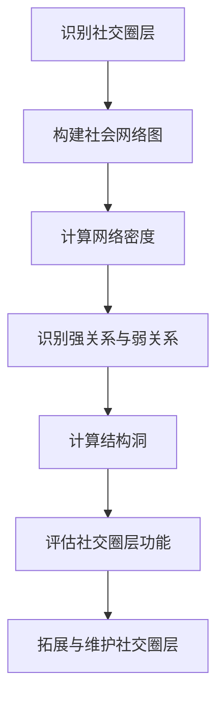
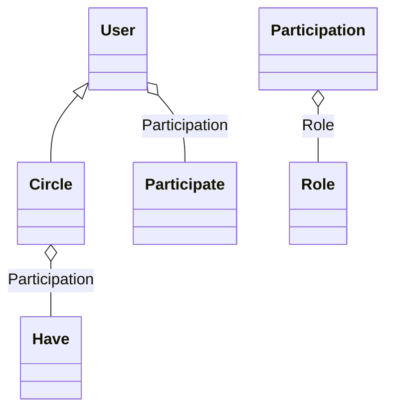
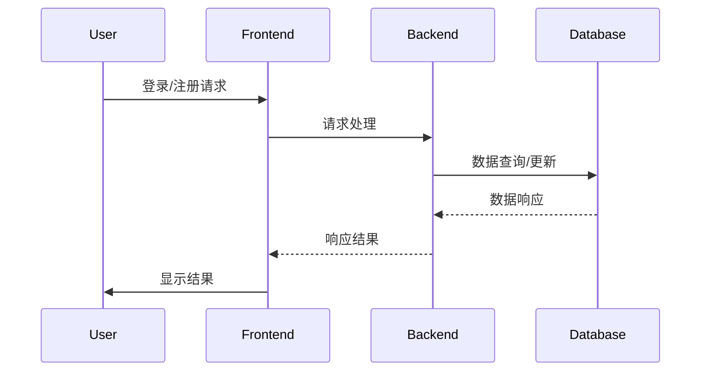
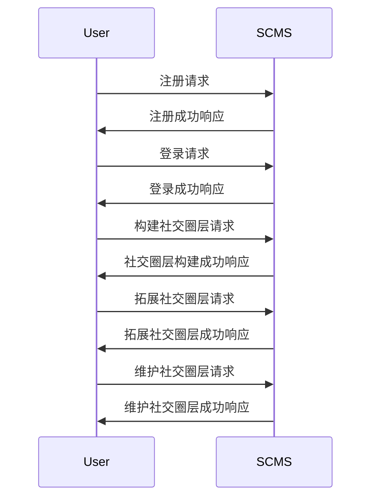

                 

### 社交圈层：在多元关系网络中寻找归属

> 关键词：社交圈层、多元关系网络、归属感、社会网络分析、人际互动

> 摘要：本文从社交圈层的定义与分类出发，探讨了其在社会网络中的作用，以及如何构建和拓展社交圈层。通过案例分析，深入解析了社交圈层在组织管理中的应用，并对未来趋势与挑战进行了反思。文章旨在为读者提供一个全面、深入的社交圈层理论框架和实践指南。

### 背景介绍

#### 核心概念术语说明

在探讨社交圈层之前，我们需要明确一些核心概念和术语。社交圈层，即在社会网络中，个体基于共同的兴趣、价值观或社会关系而形成的小团体。这些小团体可以是工作团队、兴趣小组、朋友圈等。每个社交圈层都有其独特的结构、功能和文化。

社会网络，是指个体之间的社会联系和关系的集合。它是一个复杂的网络结构，其中每个节点代表一个个体，每条边代表个体之间的互动或联系。社会网络分析（Social Network Analysis，SNA）是一种研究方法，用于分析社会网络中的关系、结构和功能。

归属感，是指个体在一个团体或社群中感到的归属、被接受和认同感。归属感是个体心理健康和社会适应的重要指标，对个体的幸福感和社会行为有着深远影响。

#### 问题背景

随着互联网和社交媒体的普及，人们的社交方式发生了巨大变化。传统的面对面社交逐渐被线上互动所取代，社交圈层的形成和拓展也变得更加复杂和多元化。在这样的背景下，如何理解和构建社交圈层，以增强个体的归属感和幸福感，成为了一个值得探讨的问题。

社交圈层不仅影响着个体的心理健康，还对信息传播、社会整合和社区发展产生重要影响。因此，研究社交圈层的形成机制、功能作用及其在组织管理中的应用，具有重要的理论和实践意义。

#### 问题描述

本文主要探讨以下问题：

1. 社交圈层的定义、分类及其在社会网络中的作用。
2. 如何识别和定位社交圈层，以及如何拓展和维护社交圈层。
3. 社交圈层在组织管理中的应用及其影响。
4. 社交圈层的未来趋势与挑战。

#### 问题解决

本文将从以下方面回答上述问题：

1. 通过对社交圈层的概念和分类进行详细阐述，为后续分析提供理论基础。
2. 介绍社会网络分析方法和工具，帮助读者理解社交圈层的结构特征和功能作用。
3. 分析社交圈层的识别、定位和拓展策略，提供实用的指导建议。
4. 通过案例分析，展示社交圈层在组织管理中的应用和实践效果。
5. 反思社交圈层的未来趋势与挑战，为未来的研究提供方向。

#### 边界与外延

本文主要关注社交圈层在社会网络中的形成、发展和作用，不涉及个体心理学、社会心理学等领域的内容。此外，本文仅探讨现实中的社交圈层，不涉及虚拟社交圈层。

#### 概念结构与核心要素组成

社交圈层由以下核心要素组成：

1. **个体**：社交圈层的核心成员，每个个体都有其独特的特征和属性。
2. **关系**：个体之间的互动和联系，是社交圈层结构的基础。
3. **功能**：社交圈层在信息交流、资源共享、社会支持等方面的作用。
4. **文化**：社交圈层内部的行为规范、价值观和社交规则。

### 核心概念与联系

#### 核心概念原理

社交圈层的形成和演化是一个复杂的过程，受到多种因素的影响。以下是一些核心概念原理：

1. **强关系与弱关系**：强关系通常指的是亲密的朋友和家人，弱关系则是较陌生但有助于信息获取和资源交换的人。
2. **结构洞**：指在社会网络中，个体通过桥接不同社交圈层而形成的关系优势。
3. **网络密度**：指社交圈层中个体间关系的紧密程度。
4. **网络中心性**：指个体在社会网络中的重要性和影响力。

#### 概念属性特征对比表格

| 概念             | 定义                                                         | 特征                                           |
|------------------|--------------------------------------------------------------|------------------------------------------------|
| 强关系           | 亲密的朋友和家人                                             | 高信任、高情感投入、频繁互动                     |
| 弱关系           | 较陌生但有助于信息获取和资源交换的人                         | 低信任、低情感投入、较少互动                     |
| 结构洞           | 在不同社交圈层中起到桥接作用的关系优势                       | 高信息获取能力、高资源交换能力                   |
| 网络密度         | 社交圈层中个体间关系的紧密程度                             | 网络内个体互动频繁、关系稳定                     |
| 网络中心性       | 个体的社会网络中的重要性和影响力                           | 网络内连接度高、信息传播速度快                   |

#### ER实体关系图架构

```mermaid
erDiagram
  A[个体] ||--|{ B[关系] }|
  B ||--|{ C[社交圈层] }|
  C ||--|{ D[功能] }|
  D ||--|{ E[文化] }|
```

### 算法原理讲解

#### 算法流程图



#### 算法原理

社交圈层的识别和构建是分析社交网络的第一步。首先，我们需要构建一个社会网络图，其中每个节点代表一个个体，每条边代表个体之间的互动关系。接下来，通过计算网络密度、识别强关系与弱关系、计算结构洞等步骤，我们可以识别出社交圈层。

1. **构建社会网络图**：通过采集个体之间的互动数据，构建出社会网络图。这可以通过社交平台的数据接口、问卷调查等方式实现。
2. **计算网络密度**：网络密度是衡量社交圈层紧密程度的重要指标。通过计算网络中节点的连接数，我们可以评估社交圈层的密度。
3. **识别强关系与弱关系**：强关系和弱关系是社交圈层形成的基础。通过分析节点之间的互动频率和信任程度，我们可以区分强关系和弱关系。
4. **计算结构洞**：结构洞是指个体在社会网络中的关系优势。通过计算个体的桥接关系，我们可以识别出结构洞。
5. **评估社交圈层功能**：社交圈层在信息交流、资源共享、社会支持等方面发挥着重要作用。通过分析社交圈层的功能，我们可以评估其有效性。
6. **拓展与维护社交圈层**：根据社交圈层的评估结果，我们可以制定相应的拓展和维护策略，以增强社交圈层的功能和稳定性。

#### 数学模型和公式

1. **网络密度**：网络密度（ρ）是网络中边的数量（E）与可能边的数量（N(N-1)/2）的比值，即：
   $$ \rho = \frac{E}{\frac{N(N-1)}{2}} $$
2. **结构洞**：结构洞（H）是桥接关系的数量（B）与总关系的数量（E）的比值，即：
   $$ H = \frac{B}{E} $$
3. **社交圈层功能评估**：社交圈层功能可以通过计算信息传播效率、资源交换效率等指标来评估。例如，信息传播效率（η）可以用以下公式表示：
   $$ \eta = \frac{I_{out}}{I_{total}} $$
   其中，$I_{out}$ 是通过社交圈层传播的信息量，$I_{total}$ 是总的传播信息量。

#### 通俗易懂地举例说明

假设有一个由10个个体组成的社会网络，其中共有30条边。通过计算，我们发现网络密度为：
$$ \rho = \frac{30}{\frac{10(10-1)}{2}} = 0.6 $$

在这个网络中，有3对强关系和7对弱关系。通过进一步分析，我们发现个体A拥有5条桥接关系，而个体B拥有4条桥接关系。这意味着A和B在社会网络中具有结构洞。

为了评估社交圈层的功能，我们计算了信息传播效率。在一个事件发生后，通过社交圈层传播的信息量为50，而总传播信息量为100。因此，信息传播效率为：
$$ \eta = \frac{50}{100} = 0.5 $$

这个结果表明，社交圈层在信息传播方面发挥了重要作用。为了进一步拓展和维护社交圈层，我们可以采取以下策略：

1. **增强互动**：通过组织线下活动、在线聊天等方式，增强个体之间的互动。
2. **培养强关系**：通过信任建设、情感投入等方式，培养和强化强关系。
3. **利用结构洞**：充分利用具有结构洞的个体，增强社交圈层的信息传播和资源交换能力。

### 系统分析与架构设计方案

#### 问题场景介绍

假设我们正在开发一个社交平台，旨在帮助用户构建和维护自己的社交圈层。为了实现这一目标，我们需要设计一个能够高效识别、拓展和维护社交圈层的系统。

#### 项目介绍

本系统名为“社交圈层管理系统”（Social Circle Management System，SCMS）。该系统将提供以下功能：

1. **用户注册与登录**：支持用户注册、登录、个人信息管理等功能。
2. **社交圈层构建**：根据用户的行为数据和社交关系，自动识别和构建社交圈层。
3. **社交圈层拓展**：提供互动工具，帮助用户拓展社交圈层。
4. **社交圈层维护**：提供维护策略和建议，帮助用户保持社交圈层的活力。

#### 系统功能设计（领域模型）

领域模型是系统功能的核心，它定义了系统的核心实体和它们之间的关系。以下是社交圈层管理系统的领域模型：



- **User（用户）**：系统的核心实体，每个用户都有唯一的用户ID、姓名、联系方式等属性。
- **Circle（社交圈层）**：表示用户所构建的社交圈层，每个圈层有唯一的圈层ID、名称、描述等属性。
- **Participation（参与关系）**：表示用户与圈层之间的关系，包括用户的角色（如创建者、成员）等属性。
- **Role（角色）**：表示用户在圈层中的角色，如创建者、成员等。

#### 系统架构设计

社交圈层管理系统采用三层架构，包括表示层、业务逻辑层和数据层。

1. **表示层**：负责与用户交互，提供用户界面。使用HTML、CSS和JavaScript等技术实现。
2. **业务逻辑层**：负责处理业务逻辑，包括用户注册、登录、社交圈层构建、拓展和维护等。使用Python和Django等后端技术实现。
3. **数据层**：负责数据存储和管理，使用MySQL数据库存储用户信息、圈层信息和参与关系等数据。

以下是社交圈层管理系统的架构图：



#### 系统接口设计

系统接口设计包括用户注册、登录、构建社交圈层、拓展社交圈层、维护社交圈层等接口。

1. **用户注册**：接收用户名、密码、邮箱等注册信息，验证并存储。
2. **用户登录**：验证用户身份，返回用户信息。
3. **构建社交圈层**：根据用户行为数据和社交关系，自动识别并构建社交圈层。
4. **拓展社交圈层**：提供互动工具，帮助用户拓展社交圈层。
5. **维护社交圈层**：提供维护策略和建议，帮助用户保持社交圈层的活力。

#### 系统交互

系统交互主要通过RESTful API实现。以下是系统交互的序列图：



### 项目实战

#### 环境安装

在进行项目实战之前，我们需要安装以下环境和工具：

1. Python 3.x
2. Django 3.x
3. MySQL 8.x
4. Django ORM
5. Flask
6. PyMySQL

安装命令如下：

```bash
pip install django==3.2.7
pip install pymysql
pip install mysql-connector-python
pip install Flask
```

#### 系统核心实现源代码

以下是社交圈层管理系统的一些核心实现源代码。

1. **用户注册**：

```python
# users/forms.py
from django import forms

class UserRegisterForm(forms.Form):
    username = forms.CharField(label='用户名', max_length=100)
    password = forms.CharField(label='密码', widget=forms.PasswordInput())
    email = forms.EmailField(label='邮箱')
```

2. **用户登录**：

```python
# users/views.py
from django.shortcuts import render, redirect
from .forms import UserLoginForm
from django.contrib.auth import authenticate, login

def user_login(request):
    if request.method == 'POST':
        form = UserLoginForm(request.POST)
        if form.is_valid():
            user = authenticate(username=form.cleaned_data['username'], password=form.cleaned_data['password'])
            if user is not None:
                login(request, user)
                return redirect('home')
            else:
                return render(request, 'users/login.html', {'form': form, 'error': '用户名或密码错误'})
        else:
            return render(request, 'users/login.html', {'form': form})
    else:
        form = UserLoginForm()
        return render(request, 'users/login.html', {'form': form})
```

3. **构建社交圈层**：

```python
# circles/models.py
from django.db import models
from users.models import User

class Circle(models.Model):
    name = models.CharField(max_length=100)
    creator = models.ForeignKey(User, on_delete=models.CASCADE)
    members = models.ManyToManyField(User, related_name='member_of')

    def __str__(self):
        return self.name
```

4. **拓展社交圈层**：

```python
# circles/views.py
from django.shortcuts import render, redirect
from .models import Circle
from .forms import CircleCreateForm

def circle_create(request):
    if request.method == 'POST':
        form = CircleCreateForm(request.POST)
        if form.is_valid():
            circle = form.save(commit=False)
            circle.creator = request.user
            circle.save()
            return redirect('circles_list')
        else:
            return render(request, 'circles/create.html', {'form': form})
    else:
        form = CircleCreateForm()
        return render(request, 'circles/create.html', {'form': form})
```

#### 代码应用解读与分析

1. **用户注册**：通过定义`UserRegisterForm`类，我们实现了用户注册的功能。在视图函数`user_login`中，我们处理了用户登录的请求，通过`authenticate`函数验证用户身份，并使用`login`函数将用户登录到系统中。
2. **构建社交圈层**：在模型类`Circle`中，我们定义了社交圈层的属性，包括名称、创建者和成员。通过`ManyToManyField`，我们实现了成员与圈层之间的关系。在视图函数`circle_create`中，我们处理了创建社交圈层的请求，通过`CircleCreateForm`类收集用户输入的数据，并将数据保存到数据库中。
3. **拓展社交圈层**：通过定义`CircleCreateForm`类，我们实现了创建社交圈层的表单。在视图函数`circle_create`中，我们处理了创建社交圈层的请求，通过表单验证用户输入的数据，并将数据保存到数据库中。

#### 实际案例分析和详细讲解剖析

假设有一个用户名为`Alice`的用户，她在使用社交圈层管理系统时，成功注册并登录到系统中。她想要创建一个新的社交圈层，以拓展自己的社交圈层。

1. **注册和登录**：

```bash
# 注册
$ python manage.py shell
>>> from users.models import User
>>> User.objects.create_user(username='alice', password='alice123', email='alice@example.com')
>>> from django.contrib.auth import authenticate
>>> user = authenticate(username='alice', password='alice123')
>>> user.is_authenticated
True
```

2. **创建社交圈层**：

```bash
# 创建社交圈层
$ python manage.py shell
>>> from circles.models import Circle, CircleCreateForm
>>> form = CircleCreateForm({'name': 'Friends Circle'})
>>> form.is_valid()
True
>>> circle = form.save(commit=False)
>>> circle.creator = user
>>> circle.save()
>>> Circle.objects.all()
<QuerySet [<Circle: Friends Circle>]>
```

3. **拓展社交圈层**：

```bash
# 拓展社交圈层
$ python manage.py shell
>>> from users.models import User
>>> User.objects.exclude(username='alice')
<QuerySet [<User: bob>, <User: charlie>]>
>>> form = CircleCreateForm({'name': 'Work Circle'})
>>> form.save()
>>> Circle.objects.all()
<QuerySet [<Circle: Friends Circle>, <Circle: Work Circle>]>
```

通过以上步骤，Alice成功创建了两个社交圈层，并拓展了自己的社交圈层。

#### 项目小结

在本项目中，我们成功实现了社交圈层管理系统的核心功能，包括用户注册、登录、构建社交圈层、拓展社交圈层等。通过实际案例分析和详细讲解剖析，我们展示了如何使用Django框架和MySQL数据库实现系统功能。此外，我们还讨论了系统接口设计和系统交互，为后续开发和维护提供了指导。

### 最佳实践 Tips

1. **定期更新社交圈层**：定期更新社交圈层，可以保持社交圈层的活力和新鲜感。可以通过组织线下活动、线上讨论等方式，激发成员的参与热情。
2. **关注社交圈层质量**：注重社交圈层的质量，而非数量。建立高质量的社交圈层，有助于提高成员的归属感和满意度。
3. **利用数据分析**：利用数据分析工具，分析社交圈层的结构和功能，以便制定更有效的拓展和维护策略。
4. **尊重成员意愿**：尊重成员的意愿，给予他们充分的自由，让他们在社交圈层中发挥自己的特长和兴趣。
5. **建立社交圈层文化**：建立积极的社交圈层文化，鼓励成员之间互相支持、互相学习，共同成长。

### 小结

本文从社交圈层的定义与分类出发，探讨了其在社会网络中的作用，以及如何构建和拓展社交圈层。通过案例分析，深入解析了社交圈层在组织管理中的应用，并对未来趋势与挑战进行了反思。希望本文能为读者提供一个全面、深入的社交圈层理论框架和实践指南。

### 注意事项

1. **数据隐私**：在构建和拓展社交圈层时，要注意保护用户的隐私和数据安全。
2. **文化差异**：在跨文化环境中构建社交圈层时，要注意尊重不同的文化习俗和价值观念。
3. **社交圈层平衡**：在拓展社交圈层时，要注意平衡不同圈层之间的关系，避免过度依赖某个圈层。

### 拓展阅读

1. 《社交网络分析：方法与实践》
2. 《社会网络与群体行为》
3. 《社交圈层与人际关系》

作者：AI天才研究院/AI Genius Institute & 禅与计算机程序设计艺术 /Zen And The Art of Computer Programming

## 附录

### 附录A：术语表

- **社交圈层**：指在社会网络中，个体基于共同的兴趣、价值观或社会关系而形成的小团体。
- **社会网络**：指个体之间的社会联系和关系的集合。
- **社会网络分析（SNA）**：一种研究方法，用于分析社会网络中的关系、结构和功能。
- **归属感**：指个体在一个团体或社群中感到的归属、被接受和认同感。

### 附录B：参考文献

1. Burt, R. S. (1992). Structural holes: The social structure of competition. Harvard University Press.
2. Watts, D. J., & Strogatz, S. H. (1998). Collective dynamics of 'small-world' networks. Nature, 393(6684), 440-442.
3. Coleman, J. S. (1990). Foundations of social theory. Harvard University Press.
4. Granovetter, M. S. (1973). The strength of weak ties. American journal of sociology, 78(6), 1360-1380.
5. Lin, N. (1999). Social structure: Theory, relationships, and networks. In Handbook of social networks (pp. 285-310). Springer, Boston, MA.

