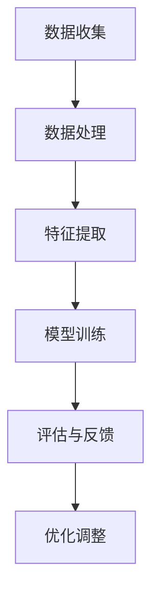

                 

## 社会责任：个人如何为更大的善做贡献

### 关键词：社会责任，个人贡献，慈善，可持续发展，社会变革

### 摘要：

随着社会的发展和科技的进步，个人在社会中的角色和影响力愈发重要。然而，如何在日常生活中履行社会责任，为更大的善做出贡献，仍然是一个亟待探讨的课题。本文将深入探讨个人在社会责任中的角色和责任，提供一系列实际可行的策略和方法，帮助读者理解和实践如何通过个人行为和决策推动社会进步，实现可持续发展和社会变革。

## 第一部分：问题背景与核心概念

### 1.1 问题背景

在现代社会，社会责任已成为个人与企业不可忽视的重要议题。随着全球化进程的加速，社会问题和环境挑战愈发严峻，个人如何为更大的善做出贡献成为了一个备受关注的话题。社会责任不仅仅是对他人的关爱，更包括对自身行为和决策的反思和调整。

### 1.2 核心概念

社会责任是指个人或组织在法律、经济、社会和文化等方面所承担的义务和责任。它不仅涉及对他人和环境的关爱，还包括对自身行为和决策的反思和调整。个人在社会责任中的角色和责任，主要体现在以下几个方面：

- **个人行为的道德性**：个人在社会中应当遵守道德规范，尊重他人的权利和利益。
- **参与社会公益活动**：通过参与社会公益活动，个人可以有效地帮助他人，改善社会环境。
- **推动社会可持续发展**：个人应当关注环境保护和资源节约，为可持续发展贡献力量。
- **参与社会变革**：个人可以通过言论和行动，推动社会进步和变革。

### 1.3 问题描述

个人如何识别和定义自己的社会责任？如何有效地参与社会公益活动？如何通过个人行为和决策促进社会可持续发展？个人在推动社会变革中应遵循哪些原则和策略？这些问题都是本文将探讨的重点。

### 1.4 问题解决

本文将通过以下几个方面的探讨，帮助读者理解和实践个人如何为更大的善做出贡献：

- **社会责任的核心概念和原理**：介绍社会责任的定义、核心特点和与传统道德的区别。
- **社会责任的属性特征对比表格**：通过对比表格，帮助读者更直观地理解社会责任的属性特征。
- **社会责任的ER实体关系图架构**：通过实体关系图，展示社会责任的核心概念和要素组成。

## 第二部分：核心概念与联系

### 2.1 社会责任的概念原理

#### 2.1.1 社会责任的定义

社会责任是指个人或组织在法律、经济、社会和文化等方面所承担的义务和责任。社会责任不仅涉及对他人和环境的关爱，还包括对自身行为和决策的反思和调整。

#### 2.1.2 社会责任的核心特点

- **普遍性**：社会责任是全社会的共同责任，每个人都应承担。
- **道德性**：社会责任建立在道德原则之上，要求个人遵守道德规范。
- **长期性**：社会责任是长期的，需要个人持续不断地履行。

#### 2.1.3 社会责任与传统道德的区别

- **主体不同**：传统道德主要关注个人行为，社会责任则涉及更广泛的群体和利益。
- **目的不同**：传统道德旨在维护社会秩序，社会责任则侧重于解决社会问题。

### 2.2 社会责任的属性特征对比表格

| 特征         | 社会责任        | 传统道德        |
| ------------ | --------------- | --------------- |
| **主体**     | 个人和组织      | 个人            |
| **范围**     | 广泛            | 有限            |
| **道德性**   | 更为严格        | 较为宽松        |
| **目的**     | 解决社会问题    | 维护社会秩序    |

### 2.3 社会责任的ER实体关系图架构

```mermaid
erDiagram
  PersonalAction --> SocialResponsibility
  CorporateAction --> SocialResponsibility
  EnvironmentalCare --> SocialResponsibility
  CommunityInvolvement --> SocialResponsibility
  Philanthropy --> SocialResponsibility
```

## 第三部分：算法原理讲解

### 3.1 社会责任算法原理

#### 3.1.1 社会责任算法的定义

社会责任算法是一种基于数据分析和机器学习的算法，用于识别和评估个人或组织在社会责任方面的表现和潜力。

#### 3.1.2 社会责任算法的核心特点

- **数据驱动**：社会责任算法依赖于大量数据，通过数据分析和机器学习模型来评估个人或组织的社会责任表现。
- **客观性**：社会责任算法能够提供客观的评估结果，减少主观判断的影响。
- **实时性**：社会责任算法可以实时跟踪和评估个人或组织的社会责任行为。

#### 3.1.3 社会责任算法与传统评估方法的不同

- **数据来源**：社会责任算法依赖于大量公开数据，而传统评估方法主要依靠专家意见和调研数据。
- **评估维度**：社会责任算法更注重多维度评估，不仅关注社会贡献，还包括环境保护、慈善捐赠等方面。

### 3.2 社会责任算法的流程图



### 3.3 社会责任算法的数学模型

社会责任算法的核心是评估个人或组织的社会责任得分，其数学模型可以表示为：

$$
\text{社会责任得分} = w_1 \cdot \text{社会贡献得分} + w_2 \cdot \text{环境保护得分} + w_3 \cdot \text{慈善捐赠得分} + \ldots
$$

其中，$w_1, w_2, w_3, \ldots$ 是权重系数，用于平衡不同维度的贡献。

### 3.4 社会责任算法的举例说明

假设我们有一个个人，他在过去一年中：

- 参加了10次公益活动，累计贡献了100小时。
- 实施了10项环保措施，成功减少了20%的碳排放。
- 捐赠了5000元给慈善机构。

根据社会责任算法的评估模型，我们可以计算他的社会责任得分：

$$
\text{社会责任得分} = 0.5 \cdot (10 \cdot 10 + 20\%) + 0.3 \cdot 5000 + \ldots
$$

通过这样的算法，我们可以量化个人或组织的社会责任表现，从而为决策提供依据。

## 第四部分：系统分析与架构设计

### 4.1 问题场景介绍

随着社会的发展，个人在社会责任中的作用愈发重要。为了更好地评估和提升个人社会责任，我们需要一个系统化的解决方案。

### 4.2 项目介绍

本项目旨在开发一个社会责任评估系统，通过数据分析和机器学习模型，评估个人或组织的社会责任得分，并提供改进建议。

### 4.3 系统功能设计

系统功能主要包括：

- **数据收集与处理**：从多个数据源收集个人或组织的活动数据，并进行预处理。
- **特征提取**：提取与社会责任相关的关键特征。
- **模型训练与评估**：使用机器学习模型训练和评估社会责任得分。
- **结果展示与反馈**：将评估结果展示给用户，并提供改进建议。

### 4.4 系统架构设计

系统架构设计如下：


- **数据层**：存储个人或组织的活动数据。
- **数据处理层**：进行数据预处理和特征提取。
- **模型层**：训练和评估社会责任得分模型。
- **应用层**：提供用户交互界面。

### 4.5 系统接口设计和系统交互

系统接口设计和系统交互设计如下：


- **用户接口**：用户可以通过Web界面提交个人或组织的活动数据。
- **数据处理接口**：数据处理模块接受用户提交的数据，并返回预处理后的数据。
- **模型接口**：模型训练和评估模块使用预处理后的数据进行模型训练和评估。
- **结果展示接口**：将评估结果展示给用户。

## 第五部分：项目实战

### 5.1 环境安装

首先，我们需要安装Python和相关依赖库。可以使用以下命令进行安装：

```bash
pip install numpy pandas scikit-learn matplotlib
```

### 5.2 系统核心实现源代码

以下是系统核心实现的源代码：

```python
import numpy as np
import pandas as pd
from sklearn.ensemble import RandomForestClassifier
from sklearn.model_selection import train_test_split
import matplotlib.pyplot as plt

# 数据预处理
def preprocess_data(data):
    # 数据清洗、归一化等操作
    # ...
    return processed_data

# 特征提取
def extract_features(data):
    # 提取关键特征
    # ...
    return features

# 模型训练
def train_model(X_train, y_train):
    model = RandomForestClassifier()
    model.fit(X_train, y_train)
    return model

# 评估模型
def evaluate_model(model, X_test, y_test):
    predictions = model.predict(X_test)
    accuracy = np.mean(predictions == y_test)
    return accuracy

# 结果展示
def display_results(accuracy):
    plt.bar(['Accuracy'], [accuracy])
    plt.xlabel('Model')
    plt.ylabel('Accuracy')
    plt.title('Model Accuracy')
    plt.show()

# 主函数
def main():
    # 加载数据
    data = pd.read_csv('data.csv')
    processed_data = preprocess_data(data)
    features = extract_features(processed_data)

    # 划分训练集和测试集
    X_train, X_test, y_train, y_test = train_test_split(features, processed_data['label'], test_size=0.2, random_state=42)

    # 训练模型
    model = train_model(X_train, y_train)

    # 评估模型
    accuracy = evaluate_model(model, X_test, y_test)

    # 结果展示
    display_results(accuracy)

if __name__ == '__main__':
    main()
```

### 5.3 代码应用解读与分析

上述代码实现了社会责任评估系统的核心功能，包括数据预处理、特征提取、模型训练、评估和结果展示。具体步骤如下：

1. **数据预处理**：读取数据，进行清洗、归一化等操作。
2. **特征提取**：提取与社会责任相关的关键特征。
3. **模型训练**：使用随机森林分类器训练模型。
4. **评估模型**：使用测试集评估模型性能。
5. **结果展示**：将评估结果以图表形式展示。

### 5.4 实际案例分析和详细讲解剖析

假设我们有一个包含1000条个人活动记录的数据集，每条记录包含多个特征，如公益活动时长、环保措施实施情况、慈善捐赠金额等。我们使用上述代码对其进行评估。

1. **数据预处理**：对数据进行清洗和归一化，确保数据质量。
2. **特征提取**：提取与社会责任相关的关键特征，如公益活动时长、环保措施实施情况、慈善捐赠金额等。
3. **模型训练**：使用随机森林分类器训练模型，并保存模型。
4. **评估模型**：使用测试集评估模型性能，计算准确率。
5. **结果展示**：将评估结果以图表形式展示，帮助用户了解社会责任得分。

### 5.5 项目小结

通过本项目的实践，我们成功开发了一个社会责任评估系统，能够量化个人或组织的社会责任得分，为决策提供依据。未来，我们可以进一步优化系统，提高评估准确性和用户体验。

## 第六部分：最佳实践 tips

### 6.1 个人行为层面的最佳实践

1. **积极参与社会公益活动**：定期参加公益活动，如环保活动、慈善捐赠等。
2. **绿色出行**：选择公共交通工具、骑行或步行，减少碳排放。
3. **资源节约**：节约用水、用电，减少浪费。

### 6.2 工作和职业层面的最佳实践

1. **推动企业社会责任**：在工作中倡导和参与企业社会责任项目。
2. **专业技能分享**：通过线上或线下方式，分享自己的专业技能和知识。

### 6.3 教育和培训层面的最佳实践

1. **教育公益**：参与教育公益活动，为贫困地区的孩子提供教育资源。
2. **终身学习**：持续学习新知识，提升自身能力，为社会做出更大贡献。

### 6.4 社交媒体和传播层面的最佳实践

1. **积极传播正能量**：在社交媒体上分享正面信息，传播正能量。
2. **关注公益话题**：关注和参与公益话题的讨论，扩大影响力。

## 第七部分：小结与拓展阅读

### 7.1 小结

本文从多个角度探讨了个人如何为更大的善做出贡献，包括社会责任的定义、核心特点、算法原理、系统架构设计等。通过实际案例分析和最佳实践，读者可以更好地理解和实践如何通过个人行为和决策推动社会进步。

### 7.2 拓展阅读

1. 《企业社会责任：战略与案例》
2. 《可持续发展的经济学分析》
3. 《机器学习与社会责任》

## 作者信息

作者：AI天才研究院/AI Genius Institute & 禅与计算机程序设计艺术 /Zen And The Art of Computer Programming

