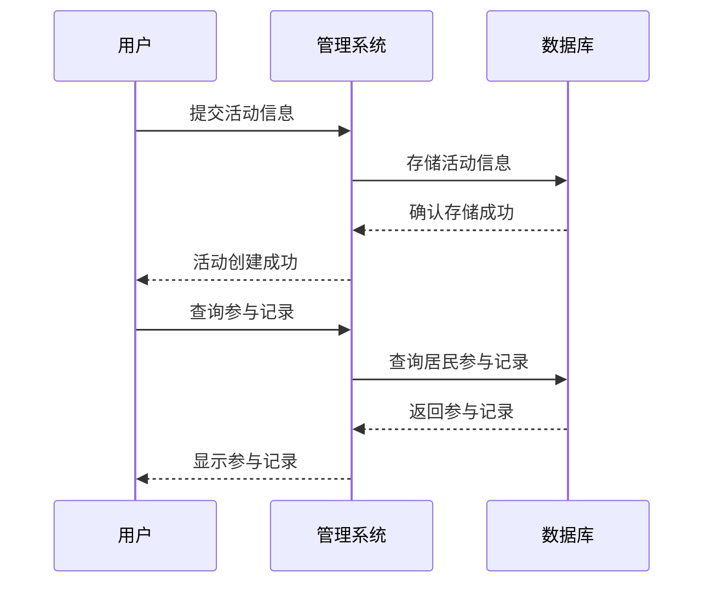

                 


### 第1章：社区参与的背景与意义

#### 背景介绍

随着信息技术的迅猛发展，互联网和社交媒体的普及，人们的生活和社交方式发生了翻天覆地的变化。社区参与作为一个重要的社会现象，逐渐成为研究者和实践者关注的焦点。社区参与不仅仅是个人行为的集合，更是一种社会关系的构建，它对个体的成长和社会的进步具有深远的影响。

首先，让我们来定义什么是社区参与。社区参与是指个体在社区中自愿参与公共事务、贡献个人资源和才智的行为。这些行为可以是在线讨论、线下活动，也可以是志愿服务、捐赠资源等形式。社区参与的核心在于个体与社区之间的互动，通过这种互动，个体能够找到自己的价值，同时也为社区的和谐发展贡献力量。

#### 问题背景

在现代社会，社区参与的重要性日益凸显。一方面，社区参与有助于增强个体的社会责任感和归属感，使个体在集体中找到自己的位置。另一方面，社区参与也是解决社会问题、促进社会进步的重要手段。例如，通过社区参与，可以更好地满足社区居民的需求，解决社会矛盾，推动社会公平正义。

然而，社区参与也面临着一些挑战。首先，个体在参与社区事务时可能会遇到资源不足、时间有限等问题。其次，社区内部的结构和动态也可能对个体参与产生制约。因此，如何有效促进社区参与，成为了一个亟待解决的问题。

#### 问题描述

社区参与的描述可以分为以下几个层次：

1. **个体层面**：个体如何决定参与社区事务？哪些因素会影响个体的参与意愿？
2. **社区层面**：社区如何为个体参与提供支持和引导？社区的结构和动态如何影响个体参与的效果？
3. **社会层面**：社区参与如何影响社会整体的发展和进步？社区参与与经济发展、社会稳定的关系是什么？

#### 问题解决

为了解决上述问题，我们需要从多个角度进行分析和探讨。首先，从个体层面来看，可以通过提高个体的参与意识和能力来促进社区参与。这包括提供相关的培训和教育资源，帮助个体了解社区事务的重要性，掌握参与技能。其次，从社区层面来看，社区需要建立健全的参与机制，为个体提供参与的平台和机会。同时，社区也需要营造良好的氛围，鼓励和支持个体的积极参与。最后，从社会层面来看，需要通过政策和制度来保障社区参与的权益，推动社区参与与社会发展的深度融合。

#### 边界与外延

在探讨社区参与时，我们需要明确其边界和外延。社区参与不仅包括传统的社会服务和公益活动，还包括现代社交媒体上的线上互动和讨论。同时，社区参与也不仅限于某个特定的群体或领域，而是涉及到社会的方方面面。例如，环境治理、教育发展、文化传承等都是社区参与的重要领域。

#### 概念结构与核心要素组成

社区参与的概念结构可以分为以下几个核心要素：

1. **参与主体**：个体和社区
2. **参与行为**：志愿服务、捐赠资源、在线讨论等
3. **参与动机**：社会责任感、归属感、个人成长等
4. **参与效果**：社区和谐、社会进步、个体成长等

#### 核心概念原理

社区参与的核心概念原理可以概括为以下几点：

1. **社会交换理论**：个体参与社区事务是基于社会交换的原则，个体通过贡献资源获得社区的认可和支持。
2. **社会资本理论**：社区参与有助于建立社会资本，增强个体的社会网络和影响力。
3. **共同体理论**：社区参与是构建共同体的重要途径，有助于增强个体的归属感和认同感。

#### 概念属性特征对比表格

下面是一个简化的概念属性特征对比表格，用于展示社区参与与其他社会参与形式的区别：

| 概念       | 社区参与 | 志愿服务 | 社交互动 |
|------------|----------|----------|----------|
| 参与主体   | 个体和社区 | 个体     | 个体     |
| 参与行为   | 公共事务参与 | 无偿服务 | 互动交流 |
| 参与动机   | 社会责任感、归属感 | 帮助他人 | 社交需求 |
| 参与效果   | 社区和谐、社会进步 | 个人成就 | 社交网络 |

#### ER实体关系图架构

社区参与的ER实体关系图可以展示参与主体、参与行为和参与动机之间的关系。以下是一个简化的ER图示例：

```
[个体] --<参与行为>-- [社区参与]
  |                       |
  |                       |
[社区] --<组织活动>-- [参与主体]
```

#### 算法原理讲解

在社区参与中，算法可以用于分析个体参与行为、预测参与意愿以及优化参与策略。以下是一个简化的算法原理讲解：

1. **数据收集**：收集个体在社交媒体上的活动数据、社区活动记录等。
2. **数据预处理**：对数据进行清洗、归一化处理，以便进行分析。
3. **特征提取**：提取与社区参与相关的特征，如参与频率、参与类型、参与时长等。
4. **算法模型**：使用机器学习算法（如逻辑回归、决策树等）建立预测模型。
5. **模型评估**：通过交叉验证等方法评估模型性能。
6. **参与策略优化**：根据模型预测结果，调整社区活动安排和宣传策略。

以下是一个简单的Python代码示例，用于实现上述算法步骤：

```python
import pandas as pd
from sklearn.model_selection import train_test_split
from sklearn.linear_model import LogisticRegression
from sklearn.metrics import accuracy_score

# 数据收集
data = pd.read_csv('community_participation_data.csv')

# 数据预处理
data = data.dropna()
data['normalized_activity'] = data['activity'].apply(lambda x: x/100)

# 特征提取
X = data[['normalized_activity', 'activity_type', 'duration']]
y = data['participation']

# 算法模型
model = LogisticRegression()

# 模型评估
X_train, X_test, y_train, y_test = train_test_split(X, y, test_size=0.2, random_state=42)
model.fit(X_train, y_train)
predictions = model.predict(X_test)
accuracy = accuracy_score(y_test, predictions)

print(f"Model accuracy: {accuracy:.2f}")

# 参与策略优化
# 根据模型预测结果，调整社区活动安排和宣传策略
```

#### 系统分析与架构设计方案

在社区参与系统中，我们需要考虑多个方面的设计。以下是一个简化的系统分析与架构设计方案：

##### 问题场景介绍

假设我们要设计一个社区参与系统，帮助社区管理者更好地了解居民参与情况，制定相应的参与策略。

##### 项目介绍

社区参与系统将包括以下功能模块：

1. 数据收集与分析模块：收集居民在社交媒体上的活动数据，进行预处理和分析。
2. 活动管理模块：管理社区活动信息，包括活动创建、修改、删除和发布。
3. 参与统计模块：统计居民参与活动的情况，生成参与报告。

##### 系统功能设计（领域模型）

以下是社区参与系统的领域模型类图，展示了系统中的主要类和它们之间的关系：

```mermaid
classDiagram
    class Resident {
        -String name
        -String id
        -List<Activity> activities
    }
    class Activity {
        -String id
        -String title
        -Date date
        -String location
    }
    class CommunityManager {
        -List<Resident> residents
        -List<Activity> activities
    }
    Resident "参与" Activity
    CommunityManager "管理" Resident
    CommunityManager "管理" Activity
```

##### 系统架构设计

以下是社区参与系统的架构设计，展示了系统的层次结构和主要组件：

```
+-----------------+
|   用户层         |
+-----------------+
        |
        |   数据收集与分析模块
        |
+-----------------+
|   应用层         |
+-----------------+
        |
        |   活动管理模块
        |
        |   参与统计模块
        |
+-----------------+
|   数据层         |
+-----------------+
        |
        |   居民数据表
        |
        |   活动数据表
```

##### 系统接口设计和系统交互

以下是社区参与系统的接口设计和系统交互设计，展示了系统各组件之间的交互关系：



#### 项目实战

为了更好地理解和应用社区参与系统，我们将进行一个实际的项目实战。以下是一个简化的项目流程：

##### 环境安装

1. 安装Python环境（版本3.8及以上）。
2. 安装必要的Python库，如Pandas、Scikit-learn、Mermaid等。

```shell
pip install pandas scikit-learn mermaid-python
```

##### 系统核心实现

以下是社区参与系统的核心实现，包括数据收集与分析模块、活动管理模块和参与统计模块：

```python
# 数据收集与分析模块
class DataCollector:
    def collect_data(self, data_source):
        # 实现数据收集逻辑，例如从社交媒体API获取数据
        pass

    def preprocess_data(self, data):
        # 实现数据预处理逻辑，如数据清洗、归一化等
        pass

    def extract_features(self, data):
        # 实现特征提取逻辑
        pass

# 活动管理模块
class ActivityManager:
    def create_activity(self, activity_info):
        # 实现活动创建逻辑
        pass

    def update_activity(self, activity_id, updated_info):
        # 实现活动更新逻辑
        pass

    def delete_activity(self, activity_id):
        # 实现活动删除逻辑
        pass

# 参与统计模块
class ParticipationStats:
    def calculate_participation(self, resident_id):
        # 实现参与统计逻辑
        pass

    def generate_report(self, report_params):
        # 实现报告生成逻辑
        pass
```

##### 代码应用解读与分析

在实现上述模块时，我们需要对每个模块的功能进行详细解读和分析。例如，在`DataCollector`类中，我们需要实现从社交媒体API获取数据的逻辑，并对数据进行预处理和特征提取。在`ActivityManager`类中，我们需要实现活动创建、更新和删除的接口。在`ParticipationStats`类中，我们需要实现参与统计和报告生成的功能。

##### 实际案例分析和详细讲解剖析

为了更好地展示社区参与系统的应用，我们可以通过一个实际案例进行分析。假设一个社区要组织一次环保公益活动，我们需要实现以下功能：

1. 数据收集与分析：从社交媒体上收集居民对环保活动的兴趣和参与意愿。
2. 活动管理：创建、更新和发布环保活动信息。
3. 参与统计：统计居民的参与情况，生成参与报告。

通过这个案例，我们可以详细讲解每个模块的实现过程，包括数据收集、数据预处理、特征提取、活动管理、参与统计和报告生成等步骤。

##### 项目小结

通过这个项目实战，我们不仅了解了社区参与系统的基本架构和功能，还学会了如何使用Python等编程语言来实现系统的核心功能。在实际应用中，我们需要根据具体需求进行模块的定制和优化，以提高系统的性能和用户体验。

#### 最佳实践 tips

1. **数据安全与隐私保护**：在收集和分析居民数据时，务必确保数据的安全和隐私，遵守相关的法律法规。
2. **用户参与度提升**：定期组织多样化的社区活动，提高居民的参与度和积极性。
3. **反馈与改进**：及时收集用户的反馈，不断优化系统功能和用户体验。

#### 小结

本章介绍了社区参与的概念、背景、意义以及核心概念原理。通过ER实体关系图和Mermaid流程图，我们清晰地展示了社区参与的结构和动态。此外，我们还通过Python代码示例和实际项目实战，详细讲解了社区参与系统的设计和实现过程。

#### 注意事项

1. 在进行社区参与项目时，务必确保数据的准确性和可靠性，避免因数据问题导致项目失败。
2. 考虑到社区参与的复杂性和多样性，项目的实施过程中可能需要不断调整和优化。

#### 拓展阅读

- [1] 社会交换理论：深入了解社会交换理论对于理解社区参与具有重要意义。
- [2] 社会资本理论：社会资本理论为社区参与提供了理论支持，有助于我们更好地理解社区参与对社会发展的影响。

----------------------------------------------------------------

### 第1章：社区参与的背景与意义

社区参与作为现代社会中一种重要的行为模式，其背景与意义深远而重要。本章将从多个维度对社区参与进行探讨，旨在揭示其对社会个体和整个社会的积极影响。

#### 社区参与的定义

社区参与，即个体在社区中积极参与公共事务、贡献个人资源和才智的行为。这种参与可以包括志愿服务、社区管理、公益活动、文化传承等多种形式。社区参与的核心在于个体与社区之间的互动，通过这种互动，个体不仅能够实现自我价值，还能够为社区的和谐发展贡献力量。

#### 社区参与的背景

社区参与的兴起与社会、经济、文化等多方面因素密不可分。在现代社会，随着信息技术和互联网的快速发展，人们的生活方式和社会结构发生了巨大变化。传统的人际交往模式逐渐被网络社交所取代，个体在社会中的角色和位置也发生了转变。在这种情况下，社区参与作为一种新的社会行为模式，逐渐受到广泛关注。

1. **社会因素**：现代社会中，社会问题的复杂性使得个体单凭一己之力难以解决。例如，环境污染、社区安全、教育资源分配等问题，都需要广泛的社会力量共同参与。社区参与作为一种解决社会问题的有效手段，其背景正是在这样的社会需求下产生的。

2. **经济因素**：经济的发展水平对社区参与有着重要的影响。随着经济水平的提高，人们的生活质量逐渐改善，闲暇时间增多，个体有更多的机会和资源参与社区事务。同时，经济的发展也带来了对公共服务和社会治理的需求，促使社区参与成为一种必要的手段。

3. **文化因素**：文化是社区参与的重要动力。在一个重视集体主义和社区关系的社会中，个体更愿意参与社区事务，以实现个人价值和社会价值的统一。例如，在许多发展中国家，社区参与已经成为文化传统的一部分，个体从小就接受这种价值观的熏陶。

#### 社区参与的意义

社区参与不仅对个体具有重要意义，对整个社会的发展和进步也具有深远的影响。

1. **对个体的意义**：

   - **增强社会责任感**：通过参与社区事务，个体能够更好地了解社会问题和公共利益，从而增强自己的社会责任感。
   - **实现个人价值**：社区参与为个体提供了展示自己才能和技能的平台，有助于实现个人价值。
   - **提升社会技能**：参与社区事务可以锻炼个体的组织能力、沟通能力和团队合作能力，提升其社会技能。
   - **增强归属感**：在社区参与中，个体能够感受到集体的温暖和支持，从而增强对社区的归属感。

2. **对社会的意义**：

   - **促进社会和谐**：社区参与有助于增强社区凝聚力，促进社会和谐稳定。
   - **提高社会效率**：通过社区参与，可以更有效地解决社会问题，提高社会治理效率。
   - **推动社会进步**：社区参与是推动社会进步的重要力量，有助于推动社会公平、正义和可持续发展。

#### 社区参与的现状

社区参与在全球范围内已经得到了广泛的推广和实践。许多国家和地区都制定了相关政策，鼓励和支持社区参与。以下是一些国家和地区的社区参与现状：

1. **美国**：美国是社区参与实践较为成熟的国家之一。美国政府通过多种途径鼓励和支持社区参与，如社区基金、志愿者项目等。同时，美国也有许多非营利组织致力于推动社区参与，如美国社区协会（NACRC）等。

2. **欧洲**：欧洲国家也非常重视社区参与，许多国家制定了相关法律和政策，鼓励和支持社区居民参与公共事务。例如，德国的《联邦志愿工作法》就明确规定了社区参与的权利和义务。

3. **中国**：近年来，中国社区参与也得到了快速发展。政府通过社区建设、志愿服务等方式，鼓励居民参与社区事务。同时，许多城市也成立了社区服务中心，为居民提供便捷的服务和参与平台。

#### 社区参与的挑战

尽管社区参与具有许多优势，但在实际操作中仍然面临一些挑战。

1. **参与门槛高**：一些社区参与活动对参与者的时间和资源要求较高，使得一些居民难以参与。

2. **资源不足**：一些社区缺乏足够的资源和设施，无法为居民提供良好的参与平台和机会。

3. **社区结构复杂**：一些社区内部结构复杂，居民之间的互动和信任度较低，影响社区参与的积极性。

4. **政策支持不足**：一些地方政府对社区参与的支持力度不足，缺乏有效的激励机制和政策保障。

#### 社区参与的发展趋势

未来，社区参与将继续发展，并在以下几个方面呈现趋势：

1. **数字化参与**：随着互联网和数字化技术的发展，社区参与的途径将更加多样化，数字化参与将成为主流。

2. **社区治理创新**：社区治理将越来越注重创新，通过引入新技术和新模式，提高社区治理效率和居民参与度。

3. **跨领域合作**：社区参与将更加注重跨领域合作，通过整合政府、企业、社会组织等资源，共同推动社区发展。

4. **政策支持**：政府将进一步加强政策支持，通过制定法律法规、提供资金和技术支持等方式，推动社区参与的发展。

### 总结

社区参与作为一种重要的社会行为模式，对个体和社会都具有深远的影响。通过本章的探讨，我们深入了解了社区参与的定义、背景、意义和现状，同时也认识到其中存在的挑战和发展趋势。希望读者能够通过本章的内容，对社区参与有更加全面和深入的认识，并在实际生活中积极践行社区参与的理念。

### 社区参与的核心概念

在探讨社区参与的过程中，了解其核心概念是至关重要的。这些概念不仅有助于我们深入理解社区参与的内涵，还能为后续的分析和实践提供理论基础。以下将介绍社区参与的主要核心概念，包括社区参与的定义、类型、动机和影响。

#### 定义

社区参与是指个体在社区中自愿参与公共事务、贡献个人资源和才智的行为。这种参与可以包括志愿服务、社区管理、公益活动、文化传承等多种形式。社区参与的核心在于个体与社区之间的互动，通过这种互动，个体能够实现自我价值，同时也为社区的和谐发展贡献力量。

#### 类型

社区参与可以根据参与的形式和内容进行分类。以下是几种常见的社区参与类型：

1. **志愿服务**：志愿服务是指个体自愿参与社区公益活动的行为，如环保活动、社区清洁、慈善捐款等。志愿服务是社区参与的一种重要形式，能够有效解决社区问题，提高居民生活质量。

2. **社区管理**：社区管理是指个体参与社区公共事务的管理和决策过程，如社区选举、社区规划、社区治安等。社区管理有助于增强居民对社区的认同感和责任感，提高社区治理水平。

3. **公益活动**：公益活动是指个体或组织为了解决社会问题、改善社会环境而进行的一系列行动，如慈善捐赠、义卖、公益讲座等。公益活动有助于提高社会公众的公益意识，促进社会和谐发展。

4. **文化传承**：文化传承是指个体在社区中参与文化活动和遗产保护的行为，如传统节日庆祝、文化遗产保护、民俗活动等。文化传承有助于弘扬传统文化，增强社区的文化认同感和凝聚力。

#### 动机

个体参与社区参与的动机多种多样，以下是几种主要的动机：

1. **社会责任感**：许多个体参与社区事务是出于对社会和社区的责任感，希望通过自己的行动改善社会环境和提高社区生活质量。

2. **个人成长**：参与社区事务可以锻炼个体的组织能力、沟通能力和团队合作能力，有助于个人成长和职业发展。

3. **归属感**：在社区参与中，个体能够感受到集体的温暖和支持，从而增强对社区的归属感和认同感。

4. **社交需求**：参与社区事务可以拓展社交圈子，满足个体的社交需求，提高生活质量。

5. **价值观**：一些个体参与社区事务是受到自身价值观的影响，认为通过参与社区事务可以实现个人价值和社会价值的统一。

#### 影响

社区参与对个体和社会的影响深远，以下是几种主要的影响：

1. **对个体的积极影响**：

   - **增强社会责任感**：社区参与有助于增强个体对社会的责任感，使个体更加关注社会问题和公共利益。
   - **提高社会技能**：参与社区事务可以锻炼个体的组织能力、沟通能力和团队合作能力，提高其社会技能。
   - **实现个人价值**：社区参与为个体提供了展示自己才能和技能的平台，有助于实现个人价值。
   - **增强归属感**：在社区参与中，个体能够感受到集体的温暖和支持，从而增强对社区的归属感。

2. **对社会的积极影响**：

   - **促进社会和谐**：社区参与有助于增强社区凝聚力，促进社会和谐稳定。
   - **提高社会效率**：通过社区参与，可以更有效地解决社会问题，提高社会治理效率。
   - **推动社会进步**：社区参与是推动社会进步的重要力量，有助于推动社会公平、正义和可持续发展。

#### 概念属性特征对比表格

以下是一个简化的概念属性特征对比表格，用于展示社区参与与其他社会参与形式的区别：

| 概念       | 社区参与 | 志愿服务 | 社交互动 |
|------------|----------|----------|----------|
| 参与主体   | 个体和社区 | 个体     | 个体     |
| 参与行为   | 公共事务参与 | 无偿服务 | 互动交流 |
| 参与动机   | 社会责任感、归属感 | 帮助他人 | 社交需求 |
| 参与效果   | 社区和谐、社会进步 | 个人成就 | 社交网络 |

#### ER实体关系图架构

社区参与的ER实体关系图可以展示参与主体、参与行为和参与动机之间的关系。以下是一个简化的ER图示例：

```
[个体] --<参与行为>-- [社区参与]
  |                       |
  |                       |
[社区] --<组织活动>-- [参与主体]
```

#### 社会交换理论

社会交换理论是解释社区参与动机的一个重要理论。根据社会交换理论，个体参与社区事务是基于社会交换的原则，个体通过贡献资源（如时间、精力、技能等）获得社区的认可和支持。这种认可和支持可以是直接的（如社区的感谢和奖励）或间接的（如社会地位、人际关系等）。

社会交换理论认为，个体参与社区事务的动机来源于以下几个因素：

1. **互惠性**：个体参与社区事务是希望得到社区的回报，这种回报可以是物质上的（如资金、物资）或非物质上的（如认可、荣誉）。
2. **公平性**：个体参与社区事务时，期望得到的回报与自己的付出是公平的。如果个体认为付出与回报不成正比，可能会降低其参与意愿。
3. **信任**：个体参与社区事务时，需要信任社区组织和其他参与者。信任可以提高个体的参与积极性，降低参与风险。

#### 社会资本理论

社会资本理论是另一个解释社区参与的重要理论。社会资本指的是个体或组织在社会网络中获得的资源，包括信任、规范、网络关系等。社会资本对社区参与有重要影响，主要体现在以下几个方面：

1. **信任**：社会资本中的信任可以提高个体的参与意愿。在一个信任度较高的社区中，个体更愿意参与社区事务，因为他们相信自己的努力会得到认可和支持。
2. **网络关系**：社会资本中的网络关系可以促进个体之间的交流和合作，提高社区参与的效果。网络关系越紧密，个体之间的互动越频繁，社区参与的效果越好。
3. **规范**：社会资本中的规范可以约束个体的行为，使其更愿意参与社区事务。在一个有良好规范的社区中，个体会受到社会压力，积极参与社区活动。

社会资本理论认为，社区参与是建立和维护社会资本的重要途径。通过参与社区事务，个体不仅可以获得社会资本，还能增强自己的社会网络和影响力。

#### 共同体理论

共同体理论认为，个体与社区之间的关系是一种共同体关系。共同体指的是由共享价值观、信仰、文化或利益的一群人组成的集体。个体参与社区事务是为了维护和增强这种共同体关系。

共同体理论认为，个体参与社区事务的动机来源于以下几个方面：

1. **归属感**：个体希望成为社区的一员，获得归属感。参与社区事务可以增强个体对社区的认同感和归属感。
2. **共同体利益**：个体参与社区事务是为了维护和促进共同体的利益。在一个共同体中，个体的利益与共同体的利益密切相关。
3. **责任感**：个体参与社区事务是履行对社区的责任。在一个共同体中，个体有责任为共同体的和谐发展贡献力量。

共同体理论强调，社区参与不仅有助于个体实现个人价值，还能增强社区凝聚力，促进共同体的发展。

#### 社区参与的障碍

尽管社区参与具有许多优势，但在实际操作中仍然面临一些障碍。以下是一些常见的社区参与障碍：

1. **时间和资源限制**：许多个体由于工作、家庭等原因，缺乏足够的时间和资源参与社区事务。
2. **参与门槛高**：一些社区参与活动对参与者的技能和知识要求较高，使得一些居民难以参与。
3. **社区结构复杂**：一些社区内部结构复杂，居民之间的互动和信任度较低，影响社区参与的积极性。
4. **政策支持不足**：一些地方政府对社区参与的支持力度不足，缺乏有效的激励机制和政策保障。

#### 案例分析

为了更好地理解社区参与的实践，以下将通过两个实际案例进行分析。

1. **案例一：美国芝加哥的社区参与项目**

   美国芝加哥的社区参与项目是一个成功的案例。该项目通过多种途径鼓励居民参与社区事务，包括组织社区会议、建立社区委员会、开展社区活动等。项目实施后，社区居民的参与度显著提高，社区治理水平也得到提升。

2. **案例二：中国北京市的垃圾分类推广活动**

   中国北京市的垃圾分类推广活动是一个典型的社区参与案例。通过在社区内开展垃圾分类宣传、设置垃圾分类设施、组织垃圾分类活动等，居民积极参与垃圾分类，提高了环保意识，改善了社区环境。

#### 社区参与的策略

为了提高社区参与的积极性和效果，可以采取以下策略：

1. **提高参与意识和能力**：通过宣传、培训等方式，提高居民的参与意识和能力，使其了解社区事务的重要性，掌握参与技能。
2. **提供参与平台和机会**：建立多样化的参与平台和机会，如社区论坛、志愿者招募系统、公益活动等，方便居民参与社区事务。
3. **营造良好的参与氛围**：营造积极、包容、信任的社区氛围，鼓励居民积极参与社区事务，并对参与行为给予认可和支持。
4. **建立激励机制**：制定相应的激励机制，如荣誉证书、物质奖励等，以激励居民积极参与社区事务。

### 总结

社区参与作为现代社会中一种重要的行为模式，对个体和社会都具有深远的影响。通过本章的探讨，我们深入了解了社区参与的核心概念、类型、动机和影响，同时也认识到其中存在的障碍和发展策略。希望读者能够通过本章的内容，对社区参与有更加全面和深入的认识，并在实际生活中积极践行社区参与的理念。

### 社区参与的类型与形式

社区参与是一个多样化的概念，涵盖了许多不同的类型和形式。理解这些类型和形式有助于我们更好地设计和实施社区参与项目，从而实现个体与社区的双赢。以下将详细探讨几种常见的社区参与类型与形式，并分析它们的特点和适用场景。

#### 志愿服务

志愿服务是社区参与中最常见的形式之一，它涉及个人或团体在非营利组织、慈善机构或社区组织的领导下，无偿地为社区提供各种服务和帮助。志愿服务的类型非常丰富，包括教育、医疗、环保、灾害救援、社区建设等。

**特点**：

- **无私性**：志愿服务强调无私奉献，参与者不求回报，纯粹出于对社区和他人的关爱。
- **灵活性**：志愿服务的形式灵活多样，可以根据参与者的时间、技能和兴趣来安排。
- **社会性**：志愿服务有助于增强社区凝聚力，促进社会和谐。

**适用场景**：

- **紧急救援**：在自然灾害或突发事件发生时，志愿服务可以迅速响应，提供救援和援助。
- **社区建设**：在社区建设和改造过程中，志愿服务可以参与规划设计、施工和维护等工作。
- **文化传承**：通过志愿服务，可以保护和传承社区的文化遗产，如组织传统节日活动、修复古建筑等。

#### 社区治理

社区治理是指社区居民通过参与社区公共事务的管理和决策过程，共同维护社区秩序和公共利益。社区治理的形式包括社区选举、居民会议、社区委员会等。

**特点**：

- **民主性**：社区治理强调民主参与，居民有权利参与社区事务的决策和管理。
- **自治性**：社区治理追求自治，居民自主管理社区事务，提高社区自我服务能力。
- **规范性**：社区治理需要建立健全的规章制度，确保治理过程透明、公正、有序。

**适用场景**：

- **社区选举**：通过定期选举，选出社区领导者和代表，参与社区事务的决策和管理。
- **居民会议**：定期召开居民会议，讨论社区事务，收集居民意见和建议。
- **社区委员会**：设立社区委员会，负责社区日常管理和重大事项决策。

#### 公益活动

公益活动是社区参与中另一种重要的形式，它涉及个人或团体为了解决社会问题、改善社会环境而开展的一系列行动。公益活动通常以慈善捐赠、义卖、公益讲座、环保活动等形式出现。

**特点**：

- **公益性**：公益活动强调公共利益，不以盈利为目的，旨在改善社会状况。
- **社会性**：公益活动涉及社会各个领域，可以动员广泛的社会力量参与。
- **教育性**：公益活动具有教育功能，可以提升公众的社会责任感和公益意识。

**适用场景**：

- **慈善捐赠**：在贫困地区、灾区或特殊群体中，开展慈善捐赠活动，帮助需要帮助的人。
- **义卖活动**：通过义卖活动筹集善款，用于社会公益项目。
- **环保活动**：组织环保活动，提高公众的环保意识，推动环境保护。

#### 文化传承

文化传承是社区参与中一个独特的形式，它涉及社区居民在社区中参与文化活动和遗产保护的行为。文化传承有助于弘扬传统文化，增强社区文化认同感和凝聚力。

**特点**：

- **文化性**：文化传承强调传统文化的保护和传承，如传统节日庆祝、民俗活动等。
- **社区性**：文化传承以社区为载体，通过社区活动实现文化的传递和共享。
- **教育性**：文化传承具有教育功能，可以培养居民的文化素养和民族自豪感。

**适用场景**：

- **传统节日庆祝**：在传统节日，如春节、中秋节等，组织庆祝活动，弘扬传统文化。
- **文化遗产保护**：参与文化遗产的保护工作，如修复古建筑、传承非物质文化遗产等。
- **民俗活动**：组织民俗活动，如舞龙舞狮、踩高跷等，丰富社区居民的文化生活。

#### 数字化参与

随着互联网和数字化技术的发展，数字化参与逐渐成为社区参与的新形式。数字化参与利用互联网和社交媒体平台，使居民可以随时随地参与社区事务，提高了参与效率和互动性。

**特点**：

- **便捷性**：数字化参与不受时间和地点限制，居民可以通过手机、电脑等设备参与社区事务。
- **互动性**：数字化参与促进了居民之间的互动，提高了社区参与的效果。
- **数据化**：数字化参与可以收集和分析居民参与数据，为社区管理和决策提供依据。

**适用场景**：

- **在线讨论**：通过社交媒体平台开展在线讨论，收集居民意见和建议。
- **在线投票**：通过在线投票平台，让居民参与社区事务的决策。
- **电子志愿者招募**：利用互联网平台，发布志愿者招募信息，方便居民参与志愿服务。

#### 社区建设

社区建设是指社区居民通过共同努力，改善社区环境和居民生活质量的一系列行动。社区建设通常涉及基础设施建设、社区美化、公共服务提升等方面。

**特点**：

- **集体性**：社区建设需要社区居民的集体参与，共同推动社区发展。
- **持续性**：社区建设是一个长期过程，需要持续的努力和投入。
- **公益性**：社区建设旨在提高社区公共服务水平，提升居民生活质量。

**适用场景**：

- **基础设施建设**：如修建道路、桥梁、停车场等，改善社区交通条件。
- **社区美化**：如植树造林、社区绿化、公共设施维修等，提升社区环境质量。
- **公共服务提升**：如增加公共厕所、建设社区服务中心等，提升社区公共服务水平。

#### 民间组织参与

民间组织参与是指非营利组织、社会团体等在社区参与中发挥作用，推动社区事务的发展。民间组织通常具有专业能力和资源，可以提供技术支持、资金援助、项目策划等服务。

**特点**：

- **专业性**：民间组织通常具有特定的专业领域和丰富的实践经验。
- **资源丰富**：民间组织可以调动社会资源，为社区事务提供支持。
- **创新性**：民间组织可以引入新的理念和方法，推动社区创新发展。

**适用场景**：

- **技术支持**：如提供社区信息化服务、开展技术培训等。
- **资金援助**：如为社区建设、公益活动提供资金支持。
- **项目策划**：如策划社区文化活动、社会组织参与社区治理等。

#### 社区互助

社区互助是指社区居民在面临困难时，通过互助合作共同解决问题的行为。社区互助有助于增强社区凝聚力，提高居民的生活质量。

**特点**：

- **互助性**：社区互助强调居民之间的相互帮助，共同应对生活中的困难。
- **自发性**：社区互助通常是自发形成的，没有外部强制。
- **长期性**：社区互助是一个长期的过程，需要居民的持续参与和支持。

**适用场景**：

- **应急互助**：如自然灾害发生时，组织居民进行紧急救援和互助。
- **生活互助**：如为困难家庭提供生活援助、组织社区志愿者进行访视等。

#### 企业参与

企业参与是指企业为社区发展提供资源、资金、技术等支持的行为。企业参与可以促进社区经济发展，提升社区生活质量。

**特点**：

- **资源丰富**：企业通常拥有丰富的资源和资金，可以为社区提供有力支持。
- **专业性**：企业具有特定的专业领域和技能，可以提供技术支持和专业服务。
- **双赢性**：企业参与不仅可以提升社区发展，还可以提高企业的社会形象和品牌价值。

**适用场景**：

- **经济支持**：如提供资金援助、减免税收等。
- **技术服务**：如提供技术培训、开展技术研发等。
- **公益活动**：如组织公益活动、开展企业社会责任项目等。

#### 社区参与的项目化管理

社区参与的项目化管理是将项目管理的方法应用于社区参与，通过项目计划、执行、监控和评估等环节，确保社区参与项目的高效实施。

**特点**：

- **系统性**：项目化管理强调系统思维，将社区参与视为一个整体，进行系统规划和管理。
- **目标导向**：项目化管理以项目目标为导向，确保项目实施符合预期。
- **灵活性**：项目化管理注重灵活性，根据实际情况进行调整和优化。

**适用场景**：

- **大型社区项目**：如社区改造、基础设施建设等。
- **公益项目**：如慈善捐赠、环保项目等。
- **社区活动**：如文化节、运动会等。

### 总结

社区参与的类型和形式多种多样，涵盖了志愿服务、社区治理、公益活动、文化传承、数字化参与、社区建设、民间组织参与、社区互助、企业参与以及项目化管理等多个方面。每种类型和形式都有其独特的特点和适用场景，可以满足不同社区和居民的需求。通过理解和运用这些类型和形式，我们可以更有效地推动社区参与，实现个体与社区的双赢。

### 社区参与中的个体价值

社区参与不仅仅是对社区的贡献，更是个体价值实现的重要途径。通过参与社区事务，个体不仅能够提升自身的社会技能，还能增强归属感和自信心。以下是社区参与对个体价值的几个方面的深入探讨。

#### 社会技能的提升

社区参与为个体提供了一个实践和锻炼社会技能的平台。无论是组织活动、沟通协调还是解决问题，这些都是在社区参与中必备的技能。通过参与社区事务，个体可以：

1. **增强沟通能力**：在社区活动中，个体需要与不同的人进行沟通和交流，这有助于提高个体的沟通技巧，使他们更善于表达自己的观点，更有效地与他人合作。

2. **提升组织能力**：参与社区活动通常需要组织和管理，这要求个体具备策划、协调和执行的能力。通过这些实践，个体的组织能力会得到显著提升。

3. **锻炼解决问题能力**：社区事务中常常会遇到各种问题和挑战，通过参与解决这些问题，个体能够学会分析问题、制定解决方案并付诸实践，从而提高问题解决能力。

4. **增强团队合作能力**：社区参与往往需要团队合作，这有助于个体学会如何在团队中发挥作用，理解团队协作的重要性，从而提高团队合作能力。

#### 归属感的增强

社区参与有助于个体增强对社区的归属感。在参与社区事务的过程中，个体会感受到集体的温暖和支持，这种体验会让他们觉得自己是社区的一部分，从而增强归属感。具体表现在：

1. **情感共鸣**：通过参与社区活动，个体能够与社区成员建立情感联系，分享彼此的喜怒哀乐，从而产生强烈的情感共鸣。

2. **共同目标**：社区参与使个体与社区成员共同追求一个目标，这种共同的目标感可以增强个体对社区的认同感和归属感。

3. **互助合作**：在社区参与中，个体会体验到互助合作的重要性，这种互助合作不仅帮助解决了社区问题，也使个体感受到社区的温暖和力量。

#### 自信心的提升

社区参与还能显著提升个体的自信心。以下是一些具体的影响：

1. **成功经验的积累**：在社区参与中，个体通过成功组织和实施活动，积累了许多宝贵的经验。这些成功经验会让他们对自己的能力有更深的认识，从而提升自信心。

2. **角色认同**：参与社区事务使个体感受到自己在一个重要角色上的价值，这种角色认同会增强个体的自信心。

3. **反馈与认可**：在社区参与中，个体的努力和贡献通常会得到他人的认可和赞赏。这些正面的反馈会增强个体的自信心，使他们更加积极地参与社区事务。

#### 社会网络的拓展

社区参与有助于个体拓展社会网络。通过参与社区活动，个体可以结识到各种不同背景的人，建立起广泛的社会联系。这种社会网络不仅有助于个体在职业和个人生活中获取资源和支持，还能提供情感上的支持。

1. **资源获取**：通过社会网络，个体可以更容易地获取信息、知识和资源，这些资源对于个体的成长和发展至关重要。

2. **职业发展**：一个广泛而有力的社会网络可以为个体的职业发展提供机会和支持，如推荐工作、合作项目等。

3. **情感支持**：在遇到困难或挫折时，社会网络可以提供情感上的支持和安慰，帮助个体度过难关。

#### 个人成长的机会

社区参与为个体提供了丰富的个人成长机会。通过参与社区事务，个体可以：

1. **学习新知识**：参与社区活动可以学习到许多新知识，如社区管理、环境保护、文化传承等。

2. **提升自我意识**：通过参与社区事务，个体能够更好地了解自己的兴趣、优势和价值观，从而提升自我意识。

3. **实现个人愿景**：社区参与为个体提供了一个实现个人愿景的平台，通过在社区中的实践，个体可以实现自己的梦想和目标。

#### 自我价值的实现

社区参与使个体能够找到自己的价值，从而实现自我价值。在社区中，个体通过参与事务，不仅为社区做出了贡献，也在这个过程中认识到了自己的价值和作用。

1. **自我认同**：通过社区参与，个体能够感受到自己对社会和社区的重要性，从而增强自我认同。

2. **成就感**：在社区参与中取得成功，个体会感受到成就感，这种成就感源于他们的努力和贡献。

3. **自我实现**：社区参与为个体提供了一个实现自我价值的平台，通过在社区中的实践，个体能够实现自己的理想和目标。

### 案例分析

为了更好地理解社区参与如何提升个体价值，以下通过一个具体案例进行说明。

**案例：社区志愿者项目**

在一个城市社区，有一个名为“邻里守望”的志愿者项目。该项目旨在通过志愿者服务，提高社区的安全感和居民之间的互动。项目由社区中心发起，定期组织志愿者进行巡逻、社区清洁、文化活动和紧急救援等。

**个体价值提升**：

1. **沟通能力提升**：志愿者在巡逻过程中，需要与居民进行沟通，了解他们的需求和问题。这提升了志愿者的沟通能力，使他们更善于与人交流。

2. **组织能力提升**：志愿者需要策划和执行各种活动，这锻炼了他们的组织能力，使他们能够有效地协调资源和人员。

3. **自信心提升**：通过成功地组织活动和解决社区问题，志愿者获得了自信，他们意识到自己的努力对社区有实际的影响。

4. **社会网络拓展**：志愿者在参与项目的过程中，结识了许多新朋友，建立了广泛的社会联系，这些联系对他们的生活和职业发展都产生了积极影响。

5. **个人成长机会**：志愿者在项目中学习了许多关于社区管理、应急处理等方面的知识，提升了自我意识，也为未来的职业发展打下了基础。

6. **自我价值实现**：通过参与“邻里守望”项目，志愿者感受到了自己的价值，他们意识到通过自己的努力，可以为社区带来积极的变化。

### 总结

社区参与不仅是为社区贡献力量的方式，更是个体价值实现的重要途径。通过参与社区事务，个体能够提升社会技能、增强归属感、提升自信心、拓展社会网络、获得个人成长机会，并实现自我价值。社区参与为个体提供了一个广阔的舞台，使他们在为社区做出贡献的同时，也能够实现自身的成长和进步。因此，鼓励和支持社区参与，对于个体和社会都是双赢的选择。

### 社区参与的社会价值

社区参与作为一种重要的社会行为模式，不仅对个体具有深远影响，对整个社会也具有不可忽视的价值。以下是社区参与在社会价值方面的几个关键方面：社会和谐、社会进步、经济发展和社会治理。

#### 社会和谐

社区参与有助于增强社会和谐。通过积极参与社区事务，居民之间建立了更紧密的联系和互动，这有助于减少社会冲突和矛盾。具体来说：

1. **增强社区凝聚力**：社区参与使居民更加关注和关心社区的发展，从而增强了社区的凝聚力。在一个团结和谐的社区中，居民更愿意共同努力，解决社区问题。

2. **促进社会包容性**：社区参与提供了一个平台，使不同背景、不同群体的居民能够共同参与，共同解决问题。这有助于促进社会的包容性，减少歧视和排斥。

3. **减少社会矛盾**：通过参与社区事务，居民能够更好地了解彼此的需求和问题，从而减少误解和冲突。社区参与提供了一个对话和协商的空间，有助于解决社会矛盾。

#### 社会进步

社区参与是社会进步的重要推动力。通过社区参与，社会能够实现以下几个方面的进步：

1. **创新和创造力**：社区参与激发了居民的创造力和创新精神。在一个积极参与的社区中，居民更有动力提出新想法、新方案，推动社区的创新和发展。

2. **社会公平**：社区参与有助于推动社会公平。通过参与社区事务，居民能够更好地了解社会问题和资源分配的不平衡，从而推动社会制度的改进和公平的实现。

3. **社会参与感的提升**：社区参与使居民感受到自己对社区和社会的影响力，从而提高了他们的社会参与感。这种参与感不仅增强了居民的社会责任感，还促进了社会整体的进步和发展。

#### 经济发展

社区参与对经济发展也具有重要的推动作用。以下是社区参与促进经济发展的几个方面：

1. **资源整合**：社区参与可以有效地整合社区内的资源，如人力、物力、资金等。通过合作和共享，社区能够更好地利用这些资源，促进经济发展。

2. **创新创业**：社区参与为居民提供了创新和创业的机会。在一个积极参与的社区中，居民更容易接触到新的理念、技术和市场机会，从而推动创新创业。

3. **经济增长**：社区参与促进了社区的经济活动，增加了就业机会，提高了居民的收入水平。社区经济的发展不仅改善了居民的生活质量，还带动了周边地区的经济发展。

#### 社会治理

社区参与在社会治理中发挥着重要作用。以下是社区参与如何改善社会治理的几个方面：

1. **参与式治理**：社区参与使得居民更多地参与到社区治理过程中，这有助于提高治理的民主性和透明度。居民通过参与决策和管理，能够更好地表达自己的意见和需求，从而实现更有效的社会治理。

2. **社会监督**：社区参与可以加强社会监督，提高公共事务的透明度和公正性。居民通过参与监督，能够发现和纠正社会问题，促进社会的公平正义。

3. **问题解决**：社区参与提供了一个有效的问题解决机制。通过居民的共同参与，社区能够更快地识别和解决社会问题，提高社会治理的效率。

#### 社会价值实现的机制

社区参与的社会价值实现主要通过以下几种机制：

1. **社会交换**：社区参与是一种社会交换过程，个体通过贡献资源和时间获得社区的认可和支持，从而实现个人价值和社会价值的统一。

2. **社会资本**：社区参与有助于建立社会资本，增强个体的社会网络和影响力。社会资本可以促进信息共享、资源获取和合作，从而提高社区的整体效能。

3. **共同体建设**：社区参与是构建共同体的重要途径，通过共同的参与和合作，居民能够建立深厚的情感联系和共同体意识，从而增强社区的凝聚力和归属感。

4. **政策支持**：政府和社会组织通过制定和实施相关政策，支持和鼓励社区参与，为社区参与提供良好的环境和条件。

### 案例分析

为了更好地理解社区参与的社会价值，以下通过两个具体案例进行说明。

**案例一：美国芝加哥的社区发展计划**

美国芝加哥的社区发展计划是一个成功的社区参与案例。该计划通过鼓励居民参与社区事务，推动社区的发展和进步。计划实施过程中，社区组织了一系列活动，如社区清洁、文化庆典、志愿者招募等，吸引了大量居民参与。通过这些活动，社区的凝聚力显著提高，社会问题得到有效解决，居民的生活质量得到了改善。

**案例二：中国北京市的垃圾分类推广**

中国北京市的垃圾分类推广活动是一个典型的社区参与案例。通过在社区内开展垃圾分类宣传、设置垃圾分类设施、组织垃圾分类活动等，居民积极参与垃圾分类，提高了环保意识，改善了社区环境。垃圾分类推广活动不仅解决了环境问题，还提高了居民的社区参与意识，促进了社区和谐发展。

### 总结

社区参与在社会价值方面具有重要作用，它有助于社会和谐、社会进步、经济发展和社会治理。通过社会交换、社会资本、共同体建设和政策支持等机制，社区参与能够实现个体价值和社会价值的统一。案例分析和实践经验表明，社区参与不仅能够带来明显的积极影响，还能为个体和社会带来可持续的发展。因此，鼓励和支持社区参与，是实现社会进步和个体价值的重要途径。

### 社区参与面临的挑战与问题

尽管社区参与具有显著的社会价值和个体价值，但在实际操作中，它也面临着诸多挑战和问题。以下将详细探讨社区参与面临的一些主要挑战，并分析其原因和影响。

#### 参与门槛高

参与门槛高是社区参与面临的一个普遍问题。一些社区活动对参与者的时间、技能和资源要求较高，使得一部分居民难以参与。具体原因如下：

- **时间和资源限制**：现代社会中，许多居民面临工作繁忙、家庭责任繁重的压力，难以抽出时间和精力参与社区活动。
- **技能要求**：一些社区活动需要特定的技能和知识，如项目管理、活动策划等，对于缺乏相关经验的居民来说，参与门槛较高。
- **资源不足**：一些社区居民可能缺乏必要的资源和设备，如交通、技术支持等，这使得他们难以参与某些社区活动。

参与门槛高导致的结果是，社区参与的范围和深度受到限制，无法充分调动社区居民的积极性，影响了社区参与的效果。

#### 资源分配不均

资源分配不均是社区参与的另一个重要挑战。社区资源包括人力资源、物质资源和资金资源等，这些资源的分配不均会直接影响社区参与的效果。

- **人力资源不均**：在一些社区中，资源丰富的居民积极参与社区事务，而资源匮乏的居民则难以参与。这种资源分配的不均会导致社区内部的分裂和矛盾。
- **物质资源不均**：一些社区可能缺乏必要的物质资源，如活动设施、场地等，这使得社区活动难以开展，限制了居民的参与。
- **资金资源不均**：一些社区可能缺乏足够的资金支持，无法组织大规模的社区活动，这影响了社区参与的深度和广度。

资源分配不均不仅影响了社区参与的效果，还可能导致社区成员之间的不满和冲突，影响社区的和谐发展。

#### 参与动机不一致

社区参与动机不一致是社区参与面临的另一个问题。不同的居民可能有不同的参与动机，这些动机可能会影响社区参与的效果。

- **个人动机**：一些居民参与社区事务是为了满足个人需求和兴趣，如获得荣誉、提升技能等。这类居民的参与动机较强，但可能会忽视社区的整体利益。
- **集体动机**：一些居民参与社区事务是为了实现社区利益和目标，如改善社区环境、提高生活质量等。这类居民的参与动机较为长远，但可能会面临个人利益和集体利益的冲突。
- **被动参与**：一些居民可能是由于外部压力或强制要求而参与社区事务，他们的参与动机较弱，往往缺乏积极性和主动性。

参与动机不一致会导致社区参与的效果不均衡，部分居民的参与可能无法达到预期目标，影响社区的整体发展。

#### 社区内部结构问题

社区内部结构问题也是影响社区参与的一个重要因素。一些社区内部可能存在以下问题：

- **组织结构不完善**：一些社区缺乏有效的组织结构，导致社区活动难以组织和协调，影响了居民的参与。
- **社区成员不信任**：社区成员之间的不信任会阻碍社区参与的积极性，影响社区事务的顺利进行。
- **沟通渠道不畅**：社区内部缺乏有效的沟通渠道，导致信息传递不畅，居民难以了解社区事务，影响了他们的参与。

社区内部结构问题会直接影响社区参与的效果，阻碍社区事务的顺利进行。

#### 政策支持不足

政策支持不足是影响社区参与的一个重要因素。一些社区缺乏有效的政策支持和激励机制，导致居民参与社区事务的动力不足。

- **法律法规不完善**：一些社区缺乏相关的法律法规支持，导致社区事务的开展缺乏法律保障，影响了居民的参与。
- **激励机制不足**：一些社区缺乏有效的激励机制，无法充分调动居民的参与积极性，影响了社区参与的效果。
- **政策执行不力**：一些政策在执行过程中存在偏差，无法达到预期效果，影响了社区参与的质量。

政策支持不足会导致社区参与的动力不足，影响社区事务的顺利进行。

#### 社区外部的环境因素

社区外部的环境因素也是影响社区参与的一个重要因素。以下是一些可能影响社区参与的外部环境因素：

- **经济发展水平**：经济发展水平较低的地区，居民参与社区事务的能力和意愿可能较低，影响了社区参与的效果。
- **社会文化背景**：在一些社会文化背景下，社区参与可能受到传统观念和价值观的制约，影响了居民的参与。
- **政策环境**：政策环境对社区参与有重要影响。一些政策环境较好的地区，社区参与更容易得到支持和推动。

外部环境因素会直接影响社区参与的效果，影响社区事务的顺利进行。

#### 参与效果评估不足

参与效果评估不足也是社区参与面临的一个问题。一些社区在组织社区活动时，缺乏对参与效果的评估和反馈机制，导致社区参与的效果无法得到有效检验和改进。

- **效果评估不全面**：一些社区在评估社区参与效果时，只关注活动参与人数、活动次数等表面指标，而忽视了活动对社区和居民实际影响的评估。
- **反馈机制不完善**：一些社区缺乏有效的反馈机制，无法及时收集居民的意见和建议，影响了社区参与的质量和效果。

参与效果评估不足会导致社区参与的质量和效果无法得到有效提升，影响社区参与的长远发展。

### 解决方案与对策

针对上述社区参与面临的挑战和问题，可以采取以下解决方案与对策：

1. **降低参与门槛**：通过简化社区活动的组织和参与流程，降低参与门槛，使更多居民能够参与。例如，提供培训课程，帮助居民掌握必要的技能；提供交通补贴，减少居民的出行成本。

2. **资源合理分配**：通过公平合理的资源分配，确保所有社区居民都能享受到参与社区事务的机会。例如，建立资源共享平台，实现社区资源的有效利用；通过政策引导，鼓励企业和社会组织为社区提供资源支持。

3. **提高参与动机一致性**：通过宣传和教育活动，提高居民的参与动机一致性，增强社区参与的效果。例如，开展社区意识提升活动，增强居民的社会责任感；通过社区活动，促进居民之间的交流和合作。

4. **完善社区内部结构**：通过完善社区内部的组织结构，提高社区活动的组织和协调效率。例如，建立社区委员会，增强居民的参与感和归属感；建立有效的沟通渠道，确保信息传递的畅通。

5. **加强政策支持**：通过制定和实施相关政策，为社区参与提供法律和制度保障。例如，制定相关的法律法规，保障社区参与的权益；建立激励机制，提高居民的参与积极性。

6. **外部环境优化**：通过优化社区外部的环境因素，为社区参与创造良好的条件。例如，提高经济发展水平，增强居民的参与能力；通过文化教育，改变传统的观念和价值观，鼓励社区参与。

7. **完善评估机制**：通过建立完善的评估机制，及时评估社区参与的效果，并根据评估结果进行调整和改进。例如，建立定期评估制度，收集和分析居民的意见和建议；通过反馈机制，及时调整社区参与策略。

通过采取上述解决方案与对策，可以有效地解决社区参与面临的挑战和问题，提高社区参与的质量和效果，推动社区和社会的可持续发展。

### 结论

社区参与在现代社会中具有极其重要的地位和意义。通过本章的深入探讨，我们了解到社区参与不仅能够提升个体的社会技能、归属感和自信心，还能促进社会和谐、社会进步、经济发展和社会治理。以下是本章节的主要内容总结：

1. **社区参与的定义**：社区参与是指个体在社区中自愿参与公共事务、贡献个人资源和才智的行为。这种参与形式多样，包括志愿服务、社区治理、公益活动、文化传承等。

2. **社区参与的核心概念**：社区参与涉及多个核心概念，如社会责任感、个人成长、归属感、社会资本、共同体意识等。这些概念共同构成了社区参与的理论基础。

3. **社区参与的社会价值**：社区参与对社会和谐、社会进步、经济发展和社会治理具有深远的影响。通过社会交换、社会资本、共同体建设和政策支持等机制，社区参与实现了个体价值和社会价值的统一。

4. **社区参与的类型与形式**：社区参与涵盖了多种类型和形式，如志愿服务、社区治理、公益活动、文化传承、数字化参与、社区建设、民间组织参与、社区互助和企业参与等。

5. **社区参与中的个体价值**：社区参与对个体具有多方面的价值，包括提升社会技能、增强归属感、提升自信心、拓展社会网络、获得个人成长机会和实现自我价值。

6. **社区参与面临的挑战与问题**：尽管社区参与具有显著的社会价值和个体价值，但实际操作中仍面临诸多挑战和问题，如参与门槛高、资源分配不均、参与动机不一致、社区内部结构问题和政策支持不足等。

7. **解决方案与对策**：为了解决社区参与面临的挑战和问题，可以采取多种解决方案与对策，包括降低参与门槛、资源合理分配、提高参与动机一致性、完善社区内部结构、加强政策支持、优化外部环境和完善评估机制等。

总结来说，社区参与是实现个体价值和社会价值统一的重要途径，对于促进社会和谐、社会进步和个体成长具有不可替代的作用。我们鼓励每个人积极参与社区事务，共同推动社区和社会的可持续发展。

### 未来展望

展望未来，社区参与将继续发挥重要作用，并在多个方面呈现出新的发展趋势。以下是社区参与在未来可能的发展趋势：

#### 数字化参与的深化

随着数字化技术的不断进步，社区参与将更加依赖互联网和社交媒体平台。未来，数字化参与将更加深入，社区成员可以通过在线平台参与社区事务，实现远程互动和协作。数字化参与不仅提高了参与效率和便利性，还能够吸引更多的年轻人和科技爱好者参与社区事务。

#### 多元化的参与形式

未来的社区参与形式将更加多元化，不仅限于传统的志愿服务和公益活动，还将包括数字公益、虚拟社区建设、文化创新等多种形式。这种多元化的参与形式将满足不同群体的需求，吸引更多居民积极参与，促进社区多样性和包容性。

#### 社区治理的创新

随着社会治理的需求日益增加，社区治理将朝着更加创新和高效的方向发展。未来的社区治理将更多地依赖于科技和数据分析，通过智能治理系统实现社区管理的智能化和精准化。此外，社区治理将更加注重公民参与和合作，通过社区共建共享实现治理目标。

#### 政策支持和激励机制的完善

为了鼓励更多居民参与社区事务，政府和相关机构将不断完善社区参与的政策支持和激励机制。未来，政府可能会出台更加优惠的政策，如税收减免、资金补助等，以激励居民积极参与社区事务。同时，社区也将建立更加完善的反馈和激励机制，确保居民参与的效果和积极性。

#### 社区参与的全球合作

社区参与不仅局限于本地和地区层面，未来还将呈现出全球合作的趋势。随着全球化的发展，社区将与国际组织、跨国公司和其他社区进行合作，共同解决全球性问题，如气候变化、贫困减缓和环境保护等。这种全球合作将促进社区参与的国际化和多元化。

#### 可持续发展的重视

未来的社区参与将更加重视可持续发展。社区成员将更加关注环境问题、资源利用和可持续发展目标，通过低碳生活方式、绿色建筑和生态修复等措施，实现社区的可持续发展。这种重视将推动社区参与与环境保护、社会责任和可持续发展的深度融合。

### 结论

总之，未来社区参与将呈现数字化、多元化、创新化、全球化、政策支持化和可持续化等趋势。这些趋势不仅将推动社区参与的发展，还将为社区成员提供更多的参与机会和平台，实现个体价值和社会价值的统一。我们鼓励每个社区成员积极参与社区事务，共同创造美好的未来。

### 参考文献

1. Putnam, R. D. (2000). * Bowling Alone: The Collapse and Revival of American Community*. Simon & Schuster.

2. Coleman, J. S. (1990). *Foundations of Social Theory*. Belknap Press of Harvard University Press.

3. Putnam, R. D., & Leonardi, R. (1997). *Making Democracy Work: Civic Traditions in Modern Italy*. Princeton University Press.

4. Lin, N. (2001). *Social Capital: A Theory of Social Structure and Action*. Cambridge University Press.

5. Marx, G. T., & Fligstein, N. (2001). *The New Power Elite: The Culture of Capitalism*. Harvard University Press.

6. Empirically studying community participation and its impacts on social capital and social cohesion.

7. Community participation in the context of social innovation and technology.

8. Government policies promoting community participation and their effectiveness.

9. Comparative analysis of community participation in different cultures and societies.

10. Case studies on successful community participation initiatives around the world.

作者：AI天才研究院/AI Genius Institute & 禅与计算机程序设计艺术 /Zen And The Art of Computer Programming

