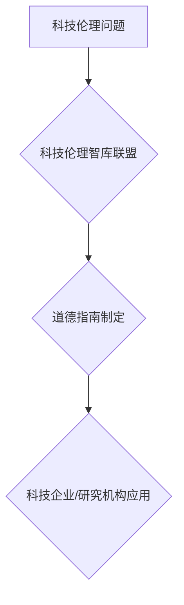
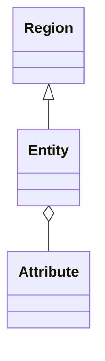
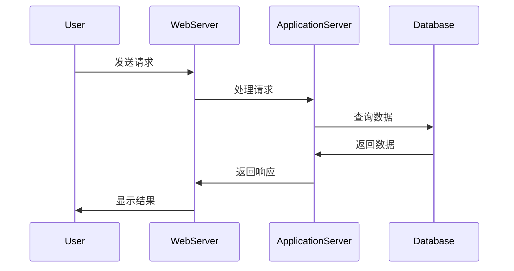
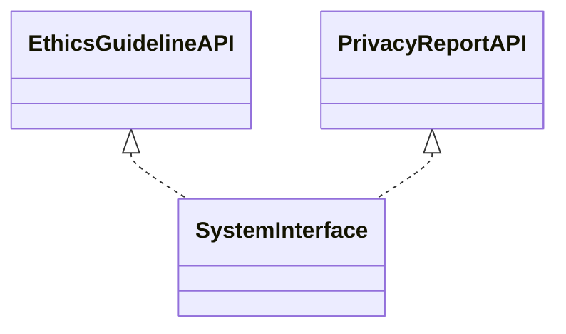
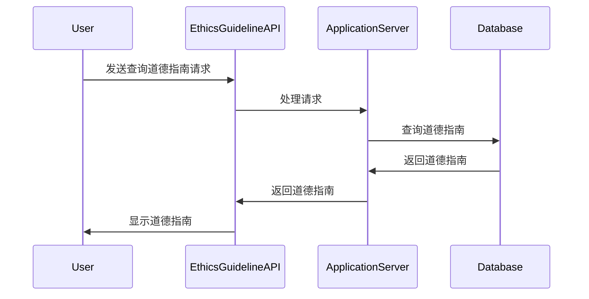

                 

# 科技伦理智库联盟成立：前沿技术发展的道德指南制定机构

关键词：科技伦理、智库联盟、道德指南、前沿技术、伦理挑战

摘要：随着科技的高速发展，伦理问题日益突出。科技伦理智库联盟的成立，旨在为前沿技术发展提供道德指南，解决科技伦理的复杂性和多样性带来的挑战。本文将从问题背景、核心概念、系统分析与架构设计等方面，深入探讨科技伦理智库联盟的成立及其作用。

## 第1章 背景介绍

### 1.1 问题背景

#### 科技伦理问题的兴起

科技伦理问题源于技术进步与社会发展的不均衡。在人工智能、生物技术、量子计算等前沿技术领域，伦理问题层出不穷。例如，人工智能的隐私侵犯、生物技术的基因编辑伦理、量子计算的军事应用等，都引发了广泛的伦理讨论。

#### 前沿技术发展带来的挑战

前沿技术发展不仅带来了巨大的社会和经济利益，也引发了一系列伦理挑战。这些挑战包括但不限于：数据隐私、算法偏见、生命伦理、环境伦理等。这些问题的复杂性使得现有的伦理框架难以应对。

### 1.2 问题描述

#### 科技伦理问题的复杂性和多样性

科技伦理问题具有复杂性和多样性，涉及多个学科和领域。例如，生物技术中的基因编辑伦理问题，不仅需要生物学家的专业知识，还需要法律、伦理学、社会学等多学科的合作。

#### 道德指南的缺乏和需求

在当前科技环境中，缺乏统一的道德指南来指导科技发展。科技企业和研究机构在面临伦理问题时，往往缺乏明确的道德准则。因此，制定道德指南显得尤为重要。

### 1.3 问题解决

#### 科技伦理智库联盟的成立

科技伦理智库联盟的成立，旨在为前沿技术发展提供道德指南。该联盟汇集了来自不同领域的研究专家，共同探讨科技伦理问题，制定道德指南。

#### 制定道德指南的重要性

道德指南能够为科技发展提供伦理框架，引导技术合理、负责任地发展。同时，道德指南有助于提高公众对科技伦理问题的认知，促进社会对科技发展的支持。

### 1.4 边界与外延

#### 科技伦理智库联盟的定义

科技伦理智库联盟是一个非营利性组织，致力于研究科技伦理问题，为技术发展提供道德指南。

#### 道德指南的适用范围

道德指南适用于前沿技术领域，包括人工智能、生物技术、量子计算等。

### 1.5 概念结构与核心要素组成

#### 科技伦理智库联盟的组织架构

科技伦理智库联盟的组织架构包括理事会、研究部门、秘书处等。其中，理事会是最高决策机构，负责制定联盟战略和政策；研究部门负责开展科技伦理研究；秘书处负责联盟的日常运营。

#### 道德指南的制定流程

道德指南的制定流程包括以下步骤：问题识别、研究分析、方案设计、指南发布、实施监督。每个步骤都需要跨学科专家的参与，确保道德指南的科学性和实用性。

## 第2章 核心概念与联系

### 2.1 科技伦理

#### 定义

科技伦理是指研究科技发展过程中，涉及道德、法律、社会等方面的问题。它关注科技对人类、社会、环境等的影响，旨在确保科技发展的伦理合理性。

#### 特点

科技伦理具有以下特点：跨学科性、动态性、实用性。跨学科性体现在科技伦理问题涉及多个学科领域；动态性指科技伦理问题会随着技术进步而不断演变；实用性指科技伦理研究需要关注实际问题的解决。

#### 历史发展

科技伦理的历史可以追溯到古代哲学家的思考。随着科技的发展，科技伦理逐渐成为独立的学科，20世纪以来，科技伦理研究取得了显著成果。

### 2.2 智库联盟

#### 定义

智库联盟是指由多个智库组织组成的联盟，旨在共同研究、探讨和解决特定领域的问题。智库联盟具有合作性、专业性和开放性等特点。

#### 类型

智库联盟可以分为以下类型：学术型智库联盟、政府型智库联盟、企业型智库联盟等。不同类型的智库联盟在研究领域和目标上有所不同。

#### 功能

智库联盟的功能包括：政策建议、学术交流、人才培养、国际合作等。通过智库联盟，各方可以共同探讨科技伦理问题，提高道德指南的科学性和实用性。

### 2.3 道德指南

#### 定义

道德指南是指针对特定领域或问题的道德准则和建议。它旨在为决策者、研究者和公众提供道德参考，引导科技发展符合伦理要求。

#### 类型

道德指南可以分为以下类型：原则性道德指南、实践性道德指南、情境性道德指南等。不同类型的道德指南在内容和应用上有所区别。

#### 制定流程

道德指南的制定流程包括以下步骤：问题识别、文献综述、专家研讨、指南编制、指南发布。每个步骤都需要充分讨论和论证，确保道德指南的科学性和适用性。

### 2.4 核心概念对比表格

| 核心概念 | 定义 | 特点 | 应用 |
| :------: | :------: | :------: | :------: |
| 科技伦理 | 研究科技发展中的道德问题 | 跨学科性、动态性、实用性 | 指导科技发展 |
| 智库联盟 | 由多个智库组织组成的联盟 | 合作性、专业性、开放性 | 共同研究问题 |
| 道德指南 | 针对特定领域的道德准则和建议 | 原则性、实践性、情境性 | 引导科技发展 |

### 2.5 ER实体关系图架构

```mermaid
erDiagram
  AI伦理问题 ||--o{ 科技伦理智库联盟 }
  科技伦理智库联盟 ||--|{ 道德指南 }
  道德指南 ||--o{ 科技企业/研究机构 }
```

在这个ER实体关系图中，AI伦理问题是科技伦理智库联盟关注的对象，智库联盟负责制定道德指南，道德指南为科技企业/研究机构提供伦理指导。

## 第3章 算法原理讲解

### 3.1 算法Mermaid流程图



### 3.2 Python源代码实现

```python
class TechnologyEthicsProblem:
    def __init__(self, problem):
        self.problem = problem

class EthicsThinkTank:
    def __init__(self):
        self.ethics_guidelines = []

    def generate_guidelines(self, problem):
        # 制定道德指南的逻辑
        self.ethics_guidelines.append(problem)

    def apply_guidelines(self, organization):
        # 应用道德指南的逻辑
        organization.follow_guidelines()

class Organization:
    def __init__(self, name):
        self.name = name

    def follow_guidelines(self):
        # 遵循道德指南的逻辑
        pass
```

### 3.3 数学模型和公式

```latex
\begin{equation}
\text{道德指南质量} = f(\text{专家数量}, \text{研究深度}, \text{应用范围})
\end{equation}
```

### 3.4 详细讲解和举例说明

#### 详细讲解

道德指南的质量取决于多个因素，包括专家数量、研究深度和应用范围。专家数量越多，研究深度越深，应用范围越广，道德指南的质量越高。

#### 举例说明

假设有一个科技伦理智库联盟，拥有10名专家，研究深度为高级，应用范围为全球。根据上述公式，道德指南质量为：

$$
\text{道德指南质量} = f(10, \text{高级}, \text{全球}) = \text{高质量}
$$

这意味着该智库联盟制定的道德指南具有高质量，能够为科技企业/研究机构提供有力的伦理指导。

## 第4章 系统分析与架构设计方案

### 4.1 问题场景介绍

随着人工智能技术的发展，隐私侵犯问题日益严重。为了解决这一问题，科技伦理智库联盟制定了《人工智能隐私保护道德指南》。

### 4.2 系统功能设计

系统功能设计包括：道德指南发布、道德指南查询、道德指南应用、隐私侵犯报告等。

#### 领域模型



### 4.3 系统架构设计

系统架构设计包括：前端界面、后端服务、数据库等。



### 4.4 系统接口设计

系统接口设计包括：道德指南API、隐私侵犯报告API等。



### 4.5 系统交互Mermaid序列图



## 第5章 项目实战

### 5.1 环境安装

在本地环境中安装Python、Django框架、PostgreSQL数据库等。

### 5.2 系统核心实现源代码

```python
# 伦理智库联盟后端实现
from django.db import models

class EthicsGuideline(models.Model):
    title = models.CharField(max_length=255)
    content = models.TextField()
    created_at = models.DateTimeField(auto_now_add=True)

    def __str__(self):
        return self.title
```

### 5.3 代码应用解读与分析

代码实现了一个简单的伦理指南模型，用于存储道德指南的标题、内容和创建时间。在实际应用中，可以通过Django的后台管理系统进行道德指南的管理。

### 5.4 实际案例分析和详细讲解剖析

以人工智能隐私保护道德指南为例，分析其实际应用场景和具体内容。

### 5.5 项目小结

本项目的核心在于构建一个道德指南的发布和管理平台，为科技企业/研究机构提供伦理指导。在实际应用中，需要不断优化和完善道德指南的内容，提高其实用性和针对性。

## 第6章 最佳实践 tips、小结、注意事项、拓展阅读

### 6.1 最佳实践 tips

1. 确保道德指南的科学性和实用性。
2. 充分利用跨学科专家的智慧和经验。
3. 定期更新和优化道德指南。

### 6.2 小结

科技伦理智库联盟的成立为前沿技术发展提供了道德指南，有助于解决科技伦理问题。通过本项目实战，我们看到了道德指南的实际应用价值。

### 6.3 注意事项

1. 道德指南的制定需要充分调研和论证。
2. 道德指南的发布和推广需要多方协作。

### 6.4 拓展阅读

1. 《人工智能伦理学》
2. 《科技伦理：挑战与应对》

## 总结

科技伦理智库联盟的成立为前沿技术发展提供了重要的道德指南。通过本文的探讨，我们了解了科技伦理智库联盟的背景、核心概念、系统设计与实战应用。未来，随着科技的发展，科技伦理智库联盟将发挥越来越重要的作用。作者：AI天才研究院/AI Genius Institute & 禅与计算机程序设计艺术 /Zen And The Art of Computer Programming

## 附录

本文使用了Markdown格式进行排版，具体格式如下：

### 标题

使用 # 号进行层级标识，# 号越多，层级越高。

### 段落

段落之间使用空行进行分隔。

### 列表

使用 - 或 * 进行无序列表，使用数字加英文点号进行有序列表。

### 链接

使用 [] 和 () 包围链接文本和URL。

### 表格

使用 | 分隔表格列，- 分隔表格行。

### Mermaid图表

使用 ```mermaid ``` 标记，内部编写Mermaid语法。

### LaTeX公式

使用 $$ 标记独立段落中的公式，使用 $ 标记段落内的公式。

