                 

### 引言与背景

#### 1.1 书籍概述与目标

**1.1.1 书籍引言**

在当前信息化、数字化加速发展的时代，前沿技术的突破与普及已经成为推动社会进步的重要动力。然而，随之而来的科技伦理问题也日益凸显，成为不可忽视的社会议题。科技伦理智库联盟应运而生，旨在为前沿技术的发展提供道德指南，确保科技进步在符合伦理规范的前提下造福人类。

本书《科技伦理智库联盟：前沿技术发展的道德指南制定》致力于探讨科技伦理的基本概念、前沿技术的伦理问题、科技伦理智库联盟的运作模式及道德指南的制定过程。通过系统、深入的分析，本书将为读者提供关于科技伦理的全面理解，并指导实际应用。

**1.1.2 目标读者与预期收益**

本书的目标读者包括科技领域的专业研究人员、政策制定者、企业高管、以及广大对科技伦理感兴趣的读者。通过阅读本书，读者可以：

1. 掌握科技伦理的基本概念和核心原则。
2. 了解前沿技术在发展过程中面临的伦理问题。
3. 熟悉科技伦理智库联盟的工作模式及成果。
4. 学会制定符合道德规范的科技发展指南。

**1.1.3 书籍的重要性与时代背景**

在信息技术、人工智能、生物技术等领域飞速发展的今天，科技伦理问题的重要性愈发突出。不当的技术应用可能导致隐私泄露、社会不公、环境破坏等问题。因此，科技伦理不仅关乎技术本身的合法合规，更关乎社会整体的公平正义和可持续发展。

科技伦理智库联盟的成立，标志着科技伦理研究进入了一个新的阶段。它不仅为科技发展提供了道德指导，也为政策制定和社会治理提供了理论支持。本书的出版，正是为了回应这一时代需求，推动科技与伦理的和谐发展。

#### 1.2 目录结构概述

本书共分为七个主要部分，分别从不同角度探讨科技伦理问题，具体目录结构如下：

1. **引言与背景**：介绍书籍的写作背景、目标读者及重要性。
2. **科技伦理基础**：阐述科技伦理的基本概念、历史演变和核心原则。
3. **前沿技术伦理问题**：分析人工智能、生物技术和网络与信息安全领域的伦理问题。
4. **科技伦理智库联盟**：介绍智库联盟的成立背景、使命和运作模式。
5. **前沿技术发展的道德指南制定**：探讨道德指南的制定方法、原则和过程。
6. **实践案例分析**：通过具体案例讨论科技伦理问题的实践应用。
7. **未来展望与挑战**：分析科技伦理的未来发展趋势及面临的挑战。

通过这样的结构安排，本书力求以逻辑清晰、内容丰富的形式，引导读者全面、深入地理解科技伦理及其在实践中的应用。

---

**关键词：科技伦理、前沿技术、道德指南、智库联盟、人工智能、生物技术、网络与信息安全**

**摘要：本书系统探讨了科技伦理的基础概念、前沿技术的伦理问题以及科技伦理智库联盟的工作模式，旨在为科技发展提供道德指南，推动科技与伦理的和谐发展。**

### 第二部分：科技伦理基础

#### 2.1 科技伦理的基本概念

**2.1.1 科技伦理的定义与范畴**

科技伦理是指研究科技在发展过程中产生的伦理问题，并探讨如何通过道德规范来指导科技行为的一门学科。它涵盖了科技活动中的道德原则、道德规范和道德决策，旨在确保科技发展符合伦理要求，促进社会公平正义和可持续发展。

科技伦理的范畴广泛，涉及多个领域。首先，它包括信息技术伦理，探讨信息技术在隐私保护、数据安全等方面的道德问题。其次，人工智能伦理关注人工智能系统的道德责任、偏见和公平性。此外，生物技术伦理涉及基因编辑、克隆技术等对人类伦理道德的挑战。最后，网络与信息安全伦理则关注网络安全、隐私保护和网络犯罪等问题。

**2.1.2 科技伦理的历史演变**

科技伦理作为一个独立的研究领域，其发展历程与科技进步密不可分。早期的科技伦理关注点主要集中在技术应用的安全性和环境影响上。随着科技的发展，伦理问题逐渐从单一领域扩展到多个领域，形成了较为完整的科技伦理体系。

在20世纪中期，随着计算机技术的发展，信息技术伦理逐渐成为研究热点。隐私保护和数据安全成为重要议题。进入21世纪，人工智能和生物技术的迅猛发展带来了新的伦理挑战，人工智能伦理和生物技术伦理逐渐引起广泛关注。

**2.1.3 科技伦理的核心原则**

科技伦理的核心原则包括：

1. **尊重原则**：尊重个体的权利和尊严，确保科技应用不侵犯个人隐私，不损害人类的基本权益。
2. **公正原则**：追求社会公平，确保科技发展惠及全体社会成员，减少社会不平等。
3. **责任原则**：明确科技从业者的道德责任，确保其在科技应用中遵守伦理规范，承担社会责任。
4. **安全原则**：确保科技应用的安全性，防范技术风险对人类和社会的潜在危害。
5. **可持续原则**：关注科技发展的长期影响，推动科技进步与环境保护、社会发展的和谐统一。

这些原则不仅为科技行为提供了道德准则，也为科技政策的制定提供了理论依据。

#### 2.2 科技伦理的核心原则

**2.2.1 尊重原则**

尊重原则是科技伦理的核心之一，强调科技应用过程中应尊重个体的权利和尊严。具体表现在以下几个方面：

1. **隐私保护**：确保个人信息的安全，防止隐私泄露和数据滥用。
2. **知情同意**：在进行科技应用时，应确保个体知情并同意参与，尊重其自主权。
3. **非歧视**：在科技应用中，应避免基于种族、性别、年龄等因素进行歧视。

**2.2.2 公正原则**

公正原则强调科技发展应追求社会公平，确保科技进步惠及全体社会成员。具体包括：

1. **机会均等**：确保科技资源分配公平，避免因技术差异导致社会不平等。
2. **公平待遇**：在科技应用中，应确保所有个体都能享受到公平的待遇，不受歧视。
3. **结果公正**：科技发展带来的利益应公平分配，减少贫富差距。

**2.2.3 责任原则**

责任原则要求科技从业者在科技应用中承担道德责任，确保其行为符合伦理规范。具体包括：

1. **行为规范**：科技从业者应遵守法律法规，遵循职业道德，确保其行为合法合规。
2. **风险防范**：科技从业者应预见科技应用可能带来的风险，并采取有效措施进行防范。
3. **责任承担**：在科技应用过程中，若发生伦理问题，科技从业者应承担相应的道德责任。

**2.2.4 安全原则**

安全原则强调科技应用的安全性，防范技术风险对人类和社会的潜在危害。具体包括：

1. **系统安全**：确保科技系统的稳定性，防范系统故障和恶意攻击。
2. **数据安全**：保障数据的完整性、保密性和可用性，防止数据泄露和滥用。
3. **人身安全**：确保科技应用过程中不危害人类健康和生命安全。

**2.2.5 可持续原则**

可持续原则关注科技发展的长期影响，推动科技进步与环境保护、社会发展的和谐统一。具体包括：

1. **环境保护**：在科技应用过程中，应减少对环境的破坏，推动绿色发展。
2. **资源利用**：合理利用资源，提高资源利用效率，减少资源浪费。
3. **社会发展**：科技发展应促进社会公平、正义和和谐，推动社会整体进步。

通过这些核心原则，科技伦理为科技发展提供了道德框架，确保科技进步在符合伦理规范的前提下造福人类。

---

**核心概念与联系**

- **科技伦理**：研究科技发展过程中产生的伦理问题，提供道德指导。
- **尊重原则**：尊重个体权利和尊严，保护隐私，防止歧视。
- **公正原则**：追求社会公平，保障机会均等和公平待遇。
- **责任原则**：科技从业者的道德责任，确保行为合法合规，防范风险。
- **安全原则**：确保科技应用的安全性，防范技术风险。
- **可持续原则**：关注科技发展的长期影响，促进环境保护和社会发展。

**ER实体关系图架构**

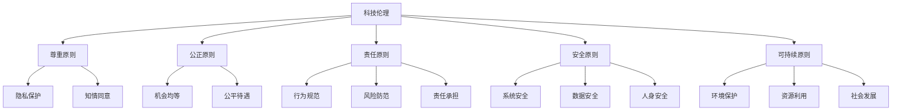

### 第三部分：前沿技术伦理问题

#### 3.1 人工智能伦理问题

**3.1.1 人工智能伦理问题概述**

人工智能（AI）作为当代科技的前沿领域，其快速发展带来了诸多伦理问题，如道德责任、隐私保护、偏见与公平性等。这些问题不仅关系到技术本身的合法合规，更关乎社会整体的公平正义和可持续发展。

首先，人工智能的道德责任问题引发广泛关注。随着AI系统在自动驾驶、医疗诊断等领域的应用日益普及，AI系统的决策错误可能带来严重后果，如何确保AI系统的道德责任成为关键议题。其次，隐私保护问题在AI技术中尤为突出。AI系统常常依赖大量个人数据进行分析和决策，如何在保护用户隐私的同时利用数据资源成为重要挑战。此外，人工智能的偏见与公平性问题也备受关注。AI系统在训练过程中可能受到训练数据偏差的影响，导致系统对某些群体产生不公平待遇，如何消除偏见、实现公平成为亟待解决的难题。

**3.1.2 人工智能的道德责任与隐私问题**

1. **道德责任**

人工智能的道德责任主要体现在以下几个方面：

- **决策责任**：AI系统在做出决策时，应确保其行为符合道德规范，避免造成不可挽回的后果。例如，自动驾驶汽车在遇到紧急情况时，应采取符合伦理的决策。

- **透明性**：AI系统的决策过程应透明，以便用户和监管机构能够理解和评估其行为。透明性有助于提高公众对AI技术的信任度，减少道德风险。

- **责任归属**：当AI系统发生道德违规行为时，应明确责任归属，确保责任主体承担相应的法律责任。这有助于防止技术滥用，保障社会公平正义。

2. **隐私保护**

隐私保护是人工智能伦理问题中的核心议题。以下是几个关键点：

- **数据收集**：在收集用户数据时，应遵循合法、正当、必要的原则，确保数据收集的合法性和透明性。

- **数据安全**：确保收集到的数据在存储、传输和使用过程中得到充分保护，防止数据泄露和滥用。

- **知情同意**：在数据收集和使用过程中，应确保用户知情并同意，尊重其隐私权利。

**3.1.3 人工智能的偏见与公平性**

人工智能的偏见与公平性问题主要表现为以下几方面：

- **数据偏见**：AI系统的训练数据可能存在偏见，导致系统在处理某些问题时产生不公平待遇。例如，人脸识别技术在识别不同种族和性别时可能出现偏差。

- **算法偏见**：AI算法在设计和实现过程中可能引入偏见，导致系统对某些群体产生不公平待遇。例如，招聘算法可能对某些性别或种族的候选人产生歧视。

- **公平性评估**：应建立一套评估AI系统公平性的方法，确保系统在处理不同群体时能够保持公平。这包括定期对AI系统进行偏见检测和调整，确保其行为符合伦理规范。

为解决人工智能伦理问题，各国政府和科技企业纷纷采取措施。例如，美国颁布了《人工智能法案》，提出了人工智能发展的伦理原则；欧盟通过了《通用数据保护条例》（GDPR），强化了个人数据保护。此外，科技企业也在积极推动AI伦理研究，确保其技术产品在符合伦理规范的前提下造福人类。

总之，人工智能伦理问题是一个复杂而紧迫的议题，需要社会各界共同努力，通过法律法规、技术手段和社会责任等多方面措施，确保人工智能技术健康、可持续地发展，造福人类。

---

**核心概念与联系**

- **人工智能伦理问题**：道德责任、隐私保护、偏见与公平性。
- **道德责任**：决策责任、透明性、责任归属。
- **隐私保护**：数据收集、数据安全、知情同意。
- **偏见与公平性**：数据偏见、算法偏见、公平性评估。

**ER实体关系图架构**

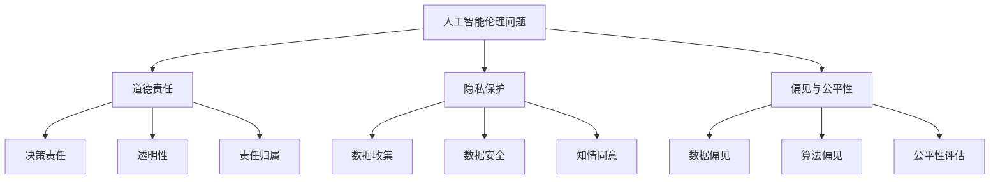

#### 3.2 生物技术伦理问题

**3.2.1 生物技术伦理问题概述**

生物技术作为现代科技的重要分支，在医学、农业和环境保护等领域取得了显著成就。然而，其快速发展也带来了诸多伦理问题，如克隆技术、基因编辑、转基因生物等，这些技术不仅挑战了传统伦理观念，也对人类社会的道德规范提出了新的要求。

首先，克隆技术伦理争议集中在人类克隆的道德可接受性、克隆个体的身份认同和潜在的社会影响等方面。反对者认为，人类克隆可能破坏人类自然的生命发展过程，导致道德混乱。其次，基因编辑技术，如CRISPR-Cas9，在医学和生物研究领域展示了巨大潜力，但其伦理问题也备受关注，包括基因编辑的伦理边界、潜在的风险和伦理责任等。最后，转基因生物（GMO）的伦理问题主要涉及生物多样性的保护、食物安全、生态影响和转基因生物对社会伦理观念的冲击。

**3.2.2 克隆技术的伦理争议**

1. **道德可接受性**

克隆技术引发了关于人类克隆的道德可接受性的争议。一方面，支持者认为克隆技术可以解决不孕不育问题，为家庭带来希望。另一方面，反对者认为，人类克隆可能破坏人类自然的生命发展过程，导致道德混乱。以下是一些关键观点：

- **自然生命发展过程**：支持者认为，自然生命发展过程是一种神圣的过程，不应该被人为干预。克隆技术可能打破这一自然过程，导致道德上的不可接受。

- **人类尊严与独特性**：反对者认为，人类具有独特的尊严和个体性，克隆技术可能导致克隆个体与自然出生个体之间的道德地位不平等，损害人类尊严。

2. **社会影响**

克隆技术可能对社会产生深远影响。一方面，它可能加剧社会不平等，因为只有富裕人群能够负担得起克隆技术。另一方面，它可能导致对传统家庭结构的挑战，甚至引发关于克隆个体身份认同和社会地位的问题。

**3.2.3 基因编辑技术的伦理问题**

基因编辑技术在医学和生物研究领域展示了巨大潜力，但也带来了伦理挑战。以下是几个关键问题：

1. **伦理边界**

基因编辑技术的伦理边界问题主要涉及基因编辑的道德限制和边界。以下是一些关键观点：

- **人类基因编辑**：支持者认为，基因编辑可以治疗遗传性疾病，提高人类健康水平。反对者则认为，人类基因编辑可能打开潘多拉盒子，导致不可预见的伦理后果。

- **动物基因编辑**：在动物基因编辑方面，主要争议集中在实验动物的伦理待遇上。支持者认为，动物基因编辑可以推动医学研究，反对者则认为，这种做法对动物不人道。

2. **潜在风险**

基因编辑技术存在潜在风险，如脱靶效应、基因变异和长期健康影响等。以下是一些关键观点：

- **脱靶效应**：基因编辑过程中，可能会发生脱靶效应，导致目标之外的基因被编辑。这可能导致不可预测的后果，甚至引发新的疾病。

- **基因变异**：基因编辑可能引起基因变异，影响后代的健康和遗传特征。这可能导致伦理上的争议，特别是关于人类基因编辑的问题。

3. **伦理责任**

基因编辑技术的伦理责任问题主要涉及责任归属和伦理责任。以下是一些关键观点：

- **科研人员责任**：科研人员应承担伦理责任，确保基因编辑研究符合伦理规范，避免潜在的伦理风险。

- **企业和政府责任**：企业和政府也应承担伦理责任，确保基因编辑技术的应用受到适当监管，防止滥用和不当应用。

**3.2.4 转基因生物的伦理问题**

转基因生物（GMO）在农业和食品工业中的应用引发了广泛伦理争议。以下是几个关键问题：

1. **生物多样性**

转基因生物可能对生物多样性产生负面影响。以下是一些关键观点：

- **生态影响**：转基因生物可能对生态环境产生不可逆转的影响，破坏生态系统的平衡。

- **生物入侵**：转基因生物可能成为入侵物种，对本地物种造成威胁。

2. **食物安全**

转基因食品的安全性问题引发担忧。以下是一些关键观点：

- **长期影响**：转基因食品的长期健康影响尚未完全明确，需要更多研究来评估其安全性和潜在风险。

- **标识和知情权**：消费者应有权知道所消费的食品是否含有转基因成分，以确保知情权和选择权。

3. **伦理观念**

转基因生物可能挑战传统伦理观念，如食品的纯洁性和自然的本质。以下是一些关键观点：

- **食品纯洁性**：转基因生物可能被视为“不自然”的食品，引起伦理上的争议。

- **自然与科技**：转基因生物的发展可能引发关于自然与科技关系的伦理讨论，挑战人类对自然的观念。

总之，生物技术伦理问题是一个复杂而多层次的议题，涉及道德、社会、环境和健康等多个方面。解决这些问题需要跨学科的研究和全球合作，以确保生物技术的可持续发展，同时保护人类和地球的利益。

---

**核心概念与联系**

- **生物技术伦理问题**：克隆技术、基因编辑、转基因生物。
- **克隆技术伦理争议**：道德可接受性、社会影响。
- **基因编辑技术伦理问题**：伦理边界、潜在风险、伦理责任。
- **转基因生物伦理问题**：生物多样性、食物安全、伦理观念。

**ER实体关系图架构**

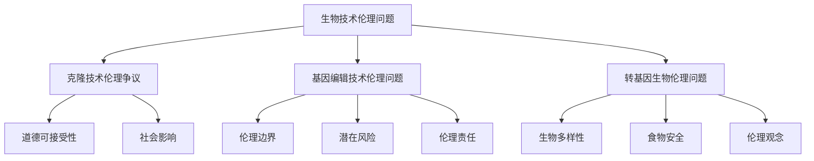

### 第三部分：前沿技术伦理问题

#### 3.3 网络与信息安全伦理问题

**3.3.1 网络伦理问题概述**

随着互联网的普及和信息技术的快速发展，网络与信息安全伦理问题日益突出。网络伦理问题主要涉及隐私保护、网络安全、网络犯罪等方面。这些问题不仅影响个人的生活和工作，也对整个社会的稳定和发展构成威胁。

**隐私保护**

隐私保护是网络伦理的核心议题之一。随着大数据和人工智能技术的应用，个人隐私数据的收集、存储和使用变得日益频繁。然而，隐私保护面临诸多挑战：

1. **数据泄露**：网络攻击、数据泄露事件频繁发生，导致大量个人隐私数据被窃取和滥用。

2. **数据滥用**：企业和机构可能滥用用户数据，用于商业目的或进行市场分析，损害用户隐私权益。

3. **知情同意**：用户在数据收集和使用过程中，可能无法充分了解其数据的具体用途，难以做出知情同意。

**网络安全**

网络安全是指保护网络系统免受未经授权的访问、破坏和干扰。网络安全问题主要包括：

1. **黑客攻击**：黑客利用网络漏洞进行攻击，可能导致系统瘫痪、数据丢失和机密信息泄露。

2. **恶意软件**：恶意软件如病毒、木马、勒索软件等对网络系统构成严重威胁，可能导致数据损坏和系统崩溃。

3. **网络钓鱼**：网络钓鱼攻击通过欺骗用户点击恶意链接或提供虚假信息，窃取用户敏感信息。

**网络犯罪**

网络犯罪是指利用互联网进行违法活动的行为。网络犯罪形式多样，包括：

1. **网络诈骗**：通过虚假信息或假冒身份骗取他人财物，损害他人利益。

2. **网络恐怖主义**：通过网络传播恐怖主义信息，煽动恐怖活动。

3. **网络黑客行为**：黑客组织或个人通过非法手段侵入网络系统，窃取或破坏数据。

**3.3.2 网络隐私保护**

网络隐私保护是确保个人隐私信息不被未经授权访问、使用和泄露的重要措施。以下是几个关键点：

1. **数据加密**：通过数据加密技术，确保数据在传输和存储过程中得到保护，防止被窃取和篡改。

2. **隐私政策**：企业和机构应制定明确的隐私政策，告知用户其数据的具体用途和隐私保护措施，确保用户知情同意。

3. **用户控制**：用户应掌握对自己隐私信息的控制权，可以自主决定是否分享和如何使用自己的数据。

4. **数据最小化**：在数据收集过程中，应遵循数据最小化原则，仅收集必要的信息，减少隐私泄露风险。

**3.3.3 网络犯罪与道德责任**

网络犯罪不仅侵害了受害者的利益，也对整个社会秩序和信任体系造成冲击。网络犯罪与道德责任密切相关，以下是一些关键点：

1. **道德责任**：网络犯罪者应承担道德责任，其行为违反了社会伦理和法律法规，应受到道德谴责和法律制裁。

2. **责任归属**：明确网络犯罪的责任归属，确保犯罪者承担相应的法律责任。这包括对黑客、诈骗犯、恐怖分子等犯罪行为的追究。

3. **预防与治理**：政府和法律机构应加强网络安全监管，制定和完善相关法律法规，提高公众的网络安全意识和自我保护能力。

总之，网络与信息安全伦理问题是一个复杂而重要的议题，需要从多个方面进行综合治理。通过加强隐私保护、网络安全和打击网络犯罪，可以有效地维护网络空间的秩序和安全，保障个人和社会的利益。

---

**核心概念与联系**

- **网络伦理问题**：隐私保护、网络安全、网络犯罪。
- **隐私保护**：数据泄露、数据滥用、知情同意。
- **网络安全**：黑客攻击、恶意软件、网络钓鱼。
- **网络犯罪**：网络诈骗、网络恐怖主义、网络黑客行为。

**ER实体关系图架构**

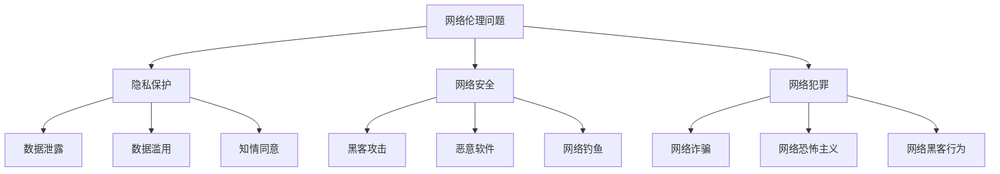

### 第四部分：科技伦理智库联盟

#### 4.1 智库联盟的成立与使命

**4.1.1 智库联盟的成立背景**

随着科技的高速发展和广泛应用，科技伦理问题日益凸显，成为影响社会公平、安全和可持续发展的关键因素。面对这些挑战，单靠单个机构或个人的力量难以应对。因此，成立一个专门从事科技伦理研究的智库联盟，成为迫切需求。

科技伦理智库联盟应运而生，旨在通过跨学科、跨领域的合作，集中全球智慧，共同应对科技伦理问题。智库联盟的成立背景主要包括：

1. **科技发展的迫切需求**：随着人工智能、生物技术、网络技术等前沿科技的快速发展，伦理问题层出不穷，需要专业机构提供指导。
2. **全球合作的必要性**：科技伦理问题具有全球性，需要各国智库共同合作，分享经验和研究成果，推动全球科技伦理发展。
3. **政策制定的参考**：科技政策制定需要科学、合理的伦理指导，智库联盟可以为政策制定者提供专业建议，确保科技发展符合伦理规范。

**4.1.2 智库联盟的使命与目标**

科技伦理智库联盟的使命是推动科技与伦理的和谐发展，确保科技进步在符合伦理规范的前提下造福人类。具体目标包括：

1. **研究科技伦理问题**：智库联盟致力于研究科技伦理的基本概念、前沿问题和解决策略，为科技伦理研究提供理论支持。
2. **制定伦理指南**：基于研究成果，智库联盟制定符合伦理规范的科技发展指南，为科技企业和政策制定者提供实践指导。
3. **提供政策建议**：智库联盟积极参与政策制定，为政府、企业和国际组织提供科技伦理方面的政策建议，推动全球科技伦理体系建设。
4. **促进国际合作**：智库联盟通过举办国际研讨会、工作坊和合作项目，促进各国智库和科技伦理专家的合作，共同应对全球科技伦理挑战。
5. **提升公众意识**：智库联盟通过公众宣传和教育，提高社会公众对科技伦理问题的认识和理解，推动形成良好的科技伦理文化。

**4.1.3 智库联盟的运作模式**

科技伦理智库联盟的运作模式主要包括以下几个方面：

1. **跨学科合作**：智库联盟汇聚了来自哲学、伦理学、法学、计算机科学、生物学等多个领域的专家学者，通过跨学科合作，共同探讨科技伦理问题。
2. **国际合作**：智库联盟与全球多个国家和地区的研究机构建立合作关系，共享研究成果和资源，共同推动科技伦理研究。
3. **研究报告发布**：智库联盟定期发布研究报告，总结研究成果和发现，为政策制定者和公众提供参考。
4. **政策咨询**：智库联盟为政府、企业和国际组织提供科技伦理方面的政策咨询，参与政策制定和评估。
5. **教育培训**：智库联盟举办各类培训和研讨会，提高科技从业者和公众的科技伦理素养。

通过这样的运作模式，科技伦理智库联盟能够充分发挥其专业优势，为科技伦理问题提供科学、合理的解决方案，推动科技与伦理的和谐发展。

---

**核心概念与联系**

- **科技伦理智库联盟**：成立背景、使命与目标、运作模式。
- **成立背景**：科技发展迫切需求、全球合作必要性、政策制定参考。
- **使命与目标**：研究科技伦理问题、制定伦理指南、提供政策建议、促进国际合作、提升公众意识。
- **运作模式**：跨学科合作、国际合作、研究报告发布、政策咨询、教育培训。

**ER实体关系图架构**

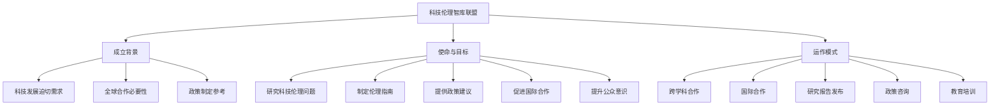

#### 4.2 智库联盟的工作模式与成果

**4.2.1 智库联盟的工作模式**

科技伦理智库联盟通过一系列科学、系统的工作模式，确保其研究工作的有效性和专业性。以下是其主要工作模式：

1. **项目立项**：智库联盟根据科技发展的热点和前沿问题，每年确定一批研究项目，分配给各专业小组进行深入研究。

2. **跨学科合作**：智库联盟汇聚了来自哲学、伦理学、法学、计算机科学、生物学等多个领域的专家，通过跨学科合作，共同探讨科技伦理问题。

3. **数据收集与分析**：智库联盟通过文献调研、问卷调查、案例分析等多种手段，收集相关数据，并运用数据分析方法，对科技伦理问题进行深入分析。

4. **研究报告撰写**：各专业小组根据研究结果，撰写详细的研究报告，报告内容通常包括研究背景、问题分析、解决方案、政策建议等。

5. **成果发布**：智库联盟定期发布研究报告，通过官方网站、学术会议、媒体等多种渠道，向社会公众和决策者传递研究成果。

6. **政策咨询**：智库联盟为政府、企业和国际组织提供科技伦理方面的政策咨询，参与政策制定和评估。

7. **教育培训**：智库联盟举办各类培训和研讨会，提高科技从业者和公众的科技伦理素养。

**4.2.2 智库联盟的研究成果与报告**

科技伦理智库联盟成立以来，已取得了丰富的研究成果，发布了大量具有影响力的研究报告。以下是部分代表性成果：

1. **《人工智能伦理指南》**：该报告详细分析了人工智能伦理问题，提出了道德责任、隐私保护、偏见与公平性等方面的伦理原则和具体措施。

2. **《生物技术伦理报告》**：报告探讨了克隆技术、基因编辑、转基因生物等生物技术领域的伦理问题，为相关技术研发和应用提供了伦理指导。

3. **《网络与信息安全伦理报告》**：该报告分析了网络隐私保护、网络安全和网络犯罪等问题，提出了隐私保护、网络安全防范和打击网络犯罪的策略。

4. **《科技伦理政策建议》**：智库联盟为政府提供了科技伦理政策建议，包括加强科技伦理研究、完善法律法规、推动科技伦理教育等。

5. **《全球科技伦理发展报告》**：该报告总结了全球各国在科技伦理方面的政策实践，提出了国际科技伦理合作的建议。

这些研究成果和报告不仅为政策制定者提供了科学依据，也为科技企业和公众提供了实践指导，推动了科技与伦理的和谐发展。

通过上述工作模式和研究成果，科技伦理智库联盟在推动科技伦理研究、制定伦理指南、提供政策咨询和教育培训等方面发挥了重要作用，为科技与伦理的协调发展提供了有力支持。

---

**核心概念与联系**

- **智库联盟的工作模式**：项目立项、跨学科合作、数据收集与分析、研究报告撰写、成果发布、政策咨询、教育培训。
- **研究成果与报告**：人工智能伦理指南、生物技术伦理报告、网络与信息安全伦理报告、科技伦理政策建议、全球科技伦理发展报告。

**ER实体关系图架构**

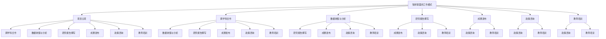

### 第五部分：前沿技术发展的道德指南制定

#### 5.1 道德指南制定的方法论

**5.1.1 道德指南制定的原则**

道德指南的制定是一个复杂而系统的工作，需要遵循一系列原则，确保指南的科学性、实用性和伦理性。以下是道德指南制定的主要原则：

1. **尊重原则**：尊重个体权利和尊严，确保指南在保护隐私、维护公正和保障安全的前提下，不侵犯个人权益。

2. **公正原则**：追求社会公平，确保道德指南在制定和实施过程中，对所有利益相关者给予公平对待，避免偏见和不公平现象。

3. **责任原则**：明确各方的责任，包括技术开发者、应用机构、监管机构等，确保在道德指南的实施过程中，各方能够承担相应的责任。

4. **安全原则**：确保道德指南在指导技术应用时，能够有效防范技术风险，保障人类健康和安全。

5. **可持续原则**：关注技术应用的长期影响，推动科技进步与环境保护、社会发展的和谐统一。

**5.1.2 道德指南制定的过程**

道德指南的制定过程可以分为以下几个阶段：

1. **问题识别**：通过调研、分析等手段，识别前沿技术在发展过程中面临的伦理问题，明确道德指南需要解决的核心问题。

2. **原则确立**：在充分研究科技伦理理论和实践经验的基础上，确立道德指南制定的原则，为后续工作提供理论依据。

3. **多方参与**：邀请科技领域专家、伦理学家、法律学者、政策制定者等，组成工作组，共同参与道德指南的制定。

4. **数据收集与分析**：通过文献调研、案例研究、问卷调查等方法，收集相关数据，对前沿技术伦理问题进行深入分析。

5. **指南撰写**：根据问题识别和分析结果，撰写道德指南草案，内容通常包括伦理原则、具体措施、实施建议等。

6. **评审与修改**：将道德指南草案提交给工作组进行评审，根据反馈意见进行修改和完善。

7. **发布与推广**：正式发布道德指南，通过官方网站、学术会议、媒体等渠道，向社会公众和决策者进行推广。

**5.1.3 道德指南的具体内容**

道德指南的具体内容通常包括以下几个方面：

1. **伦理原则**：明确道德指南所遵循的核心伦理原则，如尊重、公正、责任、安全、可持续等。

2. **应用场景**：针对不同前沿技术，描述具体的伦理问题和应用场景，确保指南的实用性和针对性。

3. **具体措施**：提出具体的技术应用规范和伦理要求，如隐私保护、安全防范、责任归属等。

4. **实施建议**：为技术开发者、应用机构、监管机构等提供具体的实施建议，确保道德指南的有效实施。

5. **案例分析**：通过具体案例分析，展示道德指南在实际应用中的效果和经验。

通过上述方法论和过程，道德指南能够为前沿技术的发展提供明确的道德指导，确保科技进步在符合伦理规范的前提下造福人类。

---

**核心概念与联系**

- **道德指南制定原则**：尊重、公正、责任、安全、可持续。
- **道德指南制定过程**：问题识别、原则确立、多方参与、数据收集与分析、指南撰写、评审与修改、发布与推广。
- **道德指南具体内容**：伦理原则、应用场景、具体措施、实施建议、案例分析。

**ER实体关系图架构**

```mermaid
graph TD
    A[道德指南制定原则] --> B[尊重]
    A --> C[公正]
    A --> D[责任]
    A --> E[安全]
    A --> F[可持续]
    G[道德指南制定过程] --> H[问题识别]
    G --> I[原则确立]
    G --> J[多方参与]
    G --> K[数据收集与分析]
    G --> L[指南撰写]
    G --> M[评审与修改]
    G --> N[发布与推广]
    G --> O[具体内容]
    H --> P[原则确立]
    H --> Q[多方参与]
    H --> R[数据收集与分析]
    H --> S[指南撰写]
    H --> T[评审与修改]
    H --> U[发布与推广]
    H --> V[具体内容]
    I --> W[多方参与]
    I --> X[数据收集与分析]
    I --> Y[指南撰写]
    I --> Z[评审与修改]
    I --> AA[发布与推广]
    I --> BB[具体内容]
    J --> CC[数据收集与分析]
    J --> DD[指南撰写]
    J --> EE[评审与修改]
    J --> FF[发布与推广]
    J --> GG[具体内容]
    K --> HH[指南撰写]
    K --> II[评审与修改]
    K --> JJ[发布与推广]
    K --> KK[具体内容]
    L --> LL[评审与修改]
    L --> MM[发布与推广]
    L --> NN[具体内容]
    M --> OO[发布与推广]
    M --> PP[具体内容]
    N --> QQ[具体内容]
    O --> RR[伦理原则]
    O --> SS[应用场景]
    O --> TT[具体措施]
    O --> UU[实施建议]
    O --> VW[案例分析]
```

#### 5.2 道德指南的具体内容

**5.2.1 人工智能道德指南**

随着人工智能（AI）技术的迅猛发展，其在医疗、交通、金融等领域的应用日益广泛。然而，人工智能的伦理问题也日益凸显，如隐私保护、算法偏见、道德责任等。因此，制定一套全面的人工智能道德指南至关重要。

1. **隐私保护**

   - **数据收集与使用**：在收集和使用个人数据时，必须遵守隐私保护原则，确保数据的合法、正当、必要。
   - **知情同意**：用户在进行数据分享时，必须知情并同意，确保其隐私权利得到尊重。
   - **数据加密与安全**：在数据传输和存储过程中，应采用先进的数据加密技术，确保数据安全。

2. **算法偏见与公平性**

   - **数据多样性**：确保训练数据具有多样性，避免因数据偏差导致算法偏见。
   - **公平性评估**：定期对AI算法进行公平性评估，确保其在处理不同群体时保持公平。
   - **算法透明性**：提高算法透明性，使用户和监管机构能够理解和评估算法行为。

3. **道德责任**

   - **决策责任**：AI系统应具备决策责任，确保其行为符合道德规范，避免造成不可挽回的后果。
   - **责任归属**：在AI系统发生道德违规时，应明确责任归属，确保责任主体承担相应的法律责任。

**5.2.2 生物技术道德指南**

生物技术，如基因编辑、克隆技术等，在医学和生物学领域展示了巨大潜力。然而，其伦理问题也引发广泛关注，如人类克隆的道德可接受性、基因编辑的伦理边界等。以下为生物技术道德指南的具体内容：

1. **人类克隆**

   - **道德可接受性**：禁止进行人类克隆，以确保人类生命的自然发展过程不被破坏。
   - **社会影响**：评估人类克隆可能带来的社会影响，确保其不会破坏家庭结构和社会伦理。

2. **基因编辑**

   - **伦理边界**：明确基因编辑的伦理边界，确保基因编辑技术在应用时不会导致不可预见的伦理后果。
   - **风险评估**：对基因编辑技术进行风险评估，防范潜在的风险和伦理问题。

3. **伦理责任**

   - **科研人员责任**：科研人员在进行基因编辑研究时，必须承担伦理责任，确保其行为符合伦理规范。
   - **企业和政府责任**：企业和政府应共同承担伦理责任，确保基因编辑技术的应用受到适当监管。

**5.2.3 网络与信息安全道德指南**

随着互联网和信息技术的发展，网络与信息安全问题日益突出，如网络隐私保护、网络安全防范、网络犯罪等。以下为网络与信息安全道德指南的具体内容：

1. **隐私保护**

   - **数据收集与使用**：在收集和使用用户数据时，必须遵守隐私保护原则，确保数据的合法、正当、必要。
   - **知情同意**：用户在进行数据分享时，必须知情并同意，确保其隐私权利得到尊重。
   - **数据加密与安全**：在数据传输和存储过程中，应采用先进的数据加密技术，确保数据安全。

2. **网络安全**

   - **系统安全**：确保网络系统的安全性，防范黑客攻击、恶意软件等安全威胁。
   - **网络安全防范**：制定网络安全防范策略，提高系统对网络攻击的抵御能力。
   - **责任归属**：明确网络安全事件的责任归属，确保责任主体承担相应的法律责任。

3. **网络犯罪**

   - **网络犯罪防范**：制定网络犯罪防范措施，防止网络诈骗、网络恐怖主义等犯罪行为。
   - **国际合作**：加强国际合作，共同打击跨国网络犯罪。
   - **法律制裁**：对网络犯罪行为进行严厉的法律制裁，维护网络安全和社会秩序。

通过上述人工智能、生物技术和网络与信息安全的道德指南，可以为相关领域的发展提供明确的伦理指导，确保科技进步在符合伦理规范的前提下造福人类。

---

**核心概念与联系**

- **人工智能道德指南**：隐私保护、算法偏见与公平性、道德责任。
- **生物技术道德指南**：人类克隆、基因编辑、伦理责任。
- **网络与信息安全道德指南**：隐私保护、网络安全、网络犯罪。

**ER实体关系图架构**

```mermaid
graph TD
    A[人工智能道德指南] --> B[隐私保护]
    A --> C[算法偏见与公平性]
    A --> D[道德责任]
    B --> E[数据收集与使用]
    B --> F[知情同意]
    B --> G[数据加密与安全]
    C --> H[数据多样性]
    C --> I[公平性评估]
    C --> J[算法透明性]
    D --> K[决策责任]
    D --> L[责任归属]
    M[生物技术道德指南] --> N[人类克隆]
    M --> O[基因编辑]
    M --> P[伦理责任]
    N --> Q[道德可接受性]
    N --> R[社会影响]
    O --> S[伦理边界]
    O --> T[风险评估]
    P --> U[科研人员责任]
    P --> V[企业和政府责任]
    W[网络与信息安全道德指南] --> X[隐私保护]
    W --> Y[网络安全]
    W --> Z[网络犯罪]
    X --> AA[数据收集与使用]
    X --> BB[知情同意]
    X --> CC[数据加密与安全]
    Y --> DD[系统安全]
    Y --> EE[网络安全防范]
    Y --> FF[责任归属]
    Z --> GG[网络犯罪防范]
    Z --> HH[国际合作]
    Z --> II[法律制裁]
```

### 第六部分：实践案例分析

#### 6.1 案例一：人工智能伦理案例分析

**6.1.1 案例背景**

随着人工智能（AI）技术在各领域的广泛应用，其伦理问题也逐渐成为公众和学术界关注的焦点。本案例以一起实际发生的AI伦理争议事件为例，分析其在隐私保护、算法偏见和道德责任等方面的伦理问题。

**6.1.2 案例分析**

1. **隐私保护问题**

   - **背景描述**：某知名科技公司开发了一款用于招聘的AI系统，旨在通过分析求职者的简历数据，筛选出最合适的候选人。
   - **隐私侵犯**：然而，这款AI系统在训练过程中，大量使用了求职者的私人信息，包括性别、种族、年龄等敏感数据。在投入使用后，有报道称该系统对某些性别和种族的求职者存在歧视现象。
   - **伦理分析**：该案例揭示了AI技术在隐私保护方面存在的严重问题。首先，AI系统在数据收集和使用过程中，未能充分尊重求职者的隐私权利。其次，AI系统在训练数据的选择上存在偏见，导致其在实际应用中对某些群体产生不公平待遇。

2. **算法偏见问题**

   - **背景描述**：进一步调查发现，该AI系统在决策过程中，对女性和少数族裔求职者的评分普遍较低。
   - **偏见分析**：这种偏见源于训练数据的偏差。训练数据中，女性和少数族裔的代表性不足，导致AI系统在决策时对这部分群体存在偏见。这种现象被称为“算法偏见”或“模型偏见”。
   - **伦理影响**：算法偏见可能导致招聘过程中的不公平现象，损害求职者的权益，加剧社会不平等。

3. **道德责任问题**

   - **背景描述**：在争议曝光后，该科技公司面临舆论压力，被迫对AI系统进行整改。
   - **责任归属**：该案例中的道德责任主要涉及技术开发者、应用机构和监管机构。首先，技术开发者应在设计AI系统时，充分考虑隐私保护和算法公平性问题。其次，应用机构在部署AI系统时，应对其进行严格的伦理审查。最后，监管机构应加强对AI技术的监管，确保其在符合伦理规范的前提下应用。

**6.1.3 案例启示**

通过本案例，我们可以得到以下启示：

1. **加强隐私保护**：在开发和应用AI技术时，必须严格遵守隐私保护原则，确保用户隐私不受侵犯。

2. **消除算法偏见**：应通过多样化和平衡的训练数据，消除算法偏见，确保AI系统在处理不同群体时保持公平。

3. **明确责任归属**：技术开发者、应用机构和监管机构在AI技术的应用过程中，应承担相应的道德责任，确保AI技术符合伦理规范。

4. **完善法律法规**：政府应制定和完善相关法律法规，加强对AI技术的监管，保障社会公平正义。

总之，本案例揭示了人工智能在发展过程中面临的伦理问题，为科技伦理研究和实践提供了重要参考。

---

**核心概念与联系**

- **隐私保护**：数据收集、数据使用、隐私侵犯。
- **算法偏见**：训练数据偏差、模型偏见、不公平待遇。
- **道德责任**：技术开发者、应用机构、监管机构的伦理责任。

**ER实体关系图架构**

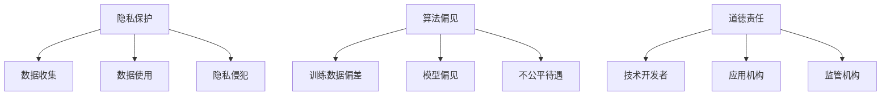

### 第六部分：实践案例分析

#### 6.2 案例二：生物技术伦理案例分析

**6.2.1 案例背景**

生物技术，特别是基因编辑技术，在医学和生物学领域取得了重大突破。然而，其应用也引发了一系列伦理争议。本案例以一起基因编辑婴儿事件为例，探讨生物技术伦理问题，包括人类克隆的道德可接受性、基因编辑的风险评估和伦理责任。

**6.2.2 案例分析**

1. **人类克隆的道德可接受性**

   - **背景描述**：2018年，中国科学家贺建奎宣称通过基因编辑技术成功创造了世界首例基因编辑婴儿。这一事件引起了全球关注和强烈反响。
   - **道德争议**：基因编辑婴儿事件引发了关于人类克隆的道德可接受性的广泛讨论。一方面，支持者认为，基因编辑技术可以用于预防遗传疾病，提高人类健康水平。另一方面，反对者认为，人类克隆可能破坏人类自然的生命发展过程，违背伦理道德。
   - **伦理分析**：基因编辑技术应用于人类克隆，涉及一系列伦理问题。首先，人类克隆可能引发关于生命起源和自然过程的道德争议。其次，人类克隆可能导致身份认同和社会地位问题，影响人类社会的伦理结构。

2. **基因编辑的风险评估**

   - **背景描述**：基因编辑技术，如CRISPR-Cas9，虽然具有巨大潜力，但也存在潜在风险，如脱靶效应、基因变异等。
   - **风险评估**：基因编辑婴儿事件揭示了基因编辑技术在实际应用中可能面临的风险。脱靶效应可能导致目标之外的基因被编辑，引发新的健康问题。基因变异可能影响后代的健康和遗传特征。
   - **伦理影响**：基因编辑技术的潜在风险对其伦理可接受性产生了重大影响。在缺乏充分科学证据的情况下，进行人类基因编辑可能带来不可预测的后果，损害人类健康和社会伦理。

3. **伦理责任**

   - **背景描述**：基因编辑婴儿事件引发了对科研人员、医疗机构和监管机构伦理责任的讨论。
   - **责任归属**：首先，科研人员在基因编辑研究过程中，应承担伦理责任，确保其行为符合伦理规范。其次，医疗机构在基因编辑技术应用中，应进行严格的伦理审查，确保患者权益。最后，监管机构应加强对基因编辑技术的监管，防范伦理风险。
   - **伦理分析**：基因编辑婴儿事件揭示了伦理责任在基因编辑技术应用中的重要性。各方利益相关者应在基因编辑技术的应用过程中，承担相应的伦理责任，确保其符合伦理规范。

**6.2.3 案例启示**

通过本案例，我们可以得到以下启示：

1. **加强人类克隆的道德审查**：在人类克隆技术应用中，应加强道德审查，确保其符合伦理规范，避免道德争议。

2. **进行基因编辑技术的风险评估**：在应用基因编辑技术时，应进行全面的风险评估，确保其安全性，防范潜在的健康风险。

3. **明确伦理责任**：各方利益相关者在基因编辑技术的应用过程中，应明确各自的伦理责任，确保其行为符合伦理规范。

4. **完善法律法规**：政府应制定和完善相关法律法规，加强对基因编辑技术的监管，保障其合法、合规应用。

总之，本案例揭示了生物技术在应用过程中面临的伦理问题，为科技伦理研究和实践提供了重要参考。

---

**核心概念与联系**

- **人类克隆的道德可接受性**：生命起源、自然过程、身份认同、社会伦理。
- **基因编辑的风险评估**：脱靶效应、基因变异、健康风险。
- **伦理责任**：科研人员、医疗机构、监管机构的伦理责任。

**ER实体关系图架构**

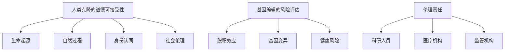

### 第六部分：实践案例分析

#### 6.3 案例三：网络与信息安全伦理案例分析

**6.3.1 案例背景**

网络与信息安全在现代社会中至关重要，然而，随着网络技术的不断发展，网络隐私保护、网络安全防范和网络犯罪等问题也日益突出。本案例以一起网络隐私泄露事件为例，探讨网络与信息安全伦理问题。

**6.3.2 案例分析**

1. **网络隐私泄露**

   - **背景描述**：某知名社交媒体公司因网络漏洞导致大量用户隐私数据泄露，包括用户姓名、出生日期、电话号码、电子邮件地址等敏感信息。
   - **隐私侵犯**：该事件揭示了网络隐私保护面临的严峻挑战。网络漏洞和不当的数据处理方式使得用户隐私信息极易被窃取和滥用。
   - **伦理影响**：网络隐私泄露不仅损害了用户的隐私权益，还可能引发一系列社会问题，如身份盗窃、欺诈等。

2. **网络安全防范**

   - **背景描述**：网络隐私泄露事件发生后，该公司迅速采取技术措施，修补漏洞，加强网络安全防护。
   - **防范措施**：公司通过加密技术、防火墙、入侵检测系统等手段，提高网络系统的安全性，防止类似事件再次发生。
   - **伦理分析**：网络安全防范是保护用户隐私和信息安全的重要手段。企业应采取有效措施，确保用户数据的安全，防止网络攻击和数据泄露。

3. **网络犯罪**

   - **背景描述**：网络隐私泄露事件还涉及网络犯罪问题，包括黑客攻击、网络钓鱼等。
   - **犯罪行为**：黑客通过网络漏洞入侵系统，窃取用户数据；网络钓鱼攻击通过虚假信息诱骗用户点击恶意链接，窃取其敏感信息。
   - **伦理影响**：网络犯罪不仅侵害了受害者的利益，还对整个社会秩序和信任体系造成冲击。打击网络犯罪是维护网络空间安全和伦理的重要措施。

**6.3.3 案例启示**

通过本案例，我们可以得到以下启示：

1. **加强网络隐私保护**：企业和机构应采取有效措施，确保用户隐私信息的安全，防止隐私泄露。

2. **提高网络安全防范能力**：企业应加强网络安全建设，采取先进的技术手段，防范网络攻击和数据泄露。

3. **严厉打击网络犯罪**：政府应加大对网络犯罪的打击力度，制定和完善相关法律法规，提高公众的网络安全意识和自我保护能力。

4. **完善监管体系**：加强对网络与信息安全的监管，建立健全的监管机制，确保网络空间的秩序和安全。

总之，本案例揭示了网络与信息安全伦理问题的重要性，为企业和政府提供了解决网络隐私保护、网络安全防范和网络犯罪问题的参考。

---

**核心概念与联系**

- **网络隐私泄露**：网络漏洞、数据处理、隐私侵犯。
- **网络安全防范**：加密技术、防火墙、入侵检测。
- **网络犯罪**：黑客攻击、网络钓鱼、犯罪行为。

**ER实体关系图架构**

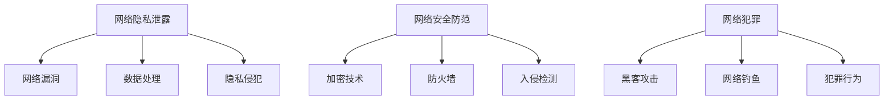

### 第七部分：未来展望与挑战

#### 7.1 未来科技伦理发展趋势

随着科技的迅猛发展，未来科技伦理将面临一系列新的挑战和发展趋势。以下是一些关键点：

**1. 科技伦理研究的深入**

未来科技伦理研究将更加深入和细化。随着人工智能、生物技术、网络技术等前沿领域的不断突破，科技伦理问题将更加复杂和多样。研究人员将需要更加专业和跨学科的知识，以应对这些新的伦理挑战。

**2. 国际合作与协调**

全球科技伦理问题需要国际合作和协调。未来，各国将加强科技伦理领域的交流与合作，共同制定全球科技伦理规范和标准，确保科技进步在全球范围内符合伦理要求。

**3. 科技伦理法规的完善**

随着科技伦理问题日益突出，各国政府将加快制定和完善科技伦理法规。这些法规将规范科技研发和应用，确保科技进步在符合伦理规范的前提下造福人类。

**4. 公众参与与教育**

公众参与和教育将成为未来科技伦理发展的重要方向。提高公众对科技伦理问题的认识和理解，将有助于形成良好的科技伦理文化，推动科技与伦理的和谐发展。

**5. 科技与伦理的深度融合**

未来，科技与伦理将更加深度融合。在科技研发和应用过程中，伦理考量将成为重要的一环。科技企业、科研机构和政策制定者将更加注重科技伦理，确保科技进步符合社会价值观和道德规范。

#### 7.2 未来科技伦理的挑战

尽管未来科技伦理发展趋势积极向上，但仍面临一系列严峻的挑战：

**1. 技术滥用与伦理风险**

随着科技的发展，技术滥用和伦理风险将不断增多。例如，人工智能的滥用可能导致社会不公和隐私侵犯。生物技术的滥用可能对人类伦理观念造成冲击。如何防范和应对这些伦理风险，将是未来科技伦理面临的重要挑战。

**2. 科技监管的挑战**

科技监管面临复杂性和多样性的挑战。如何制定有效的科技伦理法规，确保科技研发和应用在符合伦理规范的前提下进行，将是未来监管机构面临的重要课题。

**3. 全球合作与协调**

在全球科技伦理问题上，各国利益差异和价值观冲突可能导致国际合作与协调困难。如何在尊重各国主权和价值观的基础上，实现全球科技伦理的协调，将是一个巨大的挑战。

**4. 科技与伦理的平衡**

在科技发展过程中，如何平衡科技进步与伦理规范之间的关系，确保科技在符合伦理规范的前提下造福人类，是未来科技伦理发展的关键挑战。

总之，未来科技伦理发展充满机遇与挑战。通过深入研究、国际合作、法规完善和公众参与，我们有望实现科技与伦理的和谐发展，推动人类社会的可持续发展。

---

**核心概念与联系**

- **科技伦理研究深入**：专业性和跨学科知识。
- **国际合作与协调**：全球科技伦理规范和标准。
- **科技伦理法规完善**：法规制定和监管。
- **公众参与与教育**：提高公众科技伦理素养。
- **科技与伦理深度融合**：科技研发和应用过程中的伦理考量。
- **技术滥用与伦理风险**：防范和应对。
- **科技监管挑战**：有效法规制定。
- **全球合作与协调**：利益差异和价值观冲突。
- **科技与伦理平衡**：平衡科技进步与伦理规范。

**ER实体关系图架构**

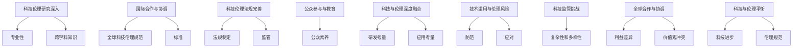

### 总结

本书《科技伦理智库联盟：前沿技术发展的道德指南制定》系统探讨了科技伦理的基础概念、前沿技术的伦理问题、科技伦理智库联盟的运作模式及道德指南的制定过程。通过深入分析人工智能、生物技术和网络与信息安全等领域的伦理问题，本书为科技发展提供了科学的道德指导，以促进科技与伦理的和谐发展。

主要发现如下：

1. **科技伦理的重要性**：科技伦理不仅是技术合法合规的保障，更是社会公平正义和可持续发展的关键因素。

2. **前沿技术的伦理挑战**：人工智能、生物技术和网络与信息安全等领域在带来巨大技术进步的同时，也引发了诸多伦理问题，如道德责任、隐私保护、偏见与公平性等。

3. **智库联盟的作用**：科技伦理智库联盟通过跨学科合作、国际合作和成果发布等模式，为科技伦理问题的研究、指南制定和教育培训提供了有力支持。

4. **道德指南的制定**：道德指南的制定需要遵循一系列原则，如尊重、公正、责任、安全、可持续，并经过多方参与、数据收集、分析、评审与修改等过程。

5. **实践案例分析**：通过具体案例的分析，本书揭示了前沿技术伦理问题的复杂性和严峻性，为实际应用提供了宝贵经验。

本书的研究成果对于政策制定者、科技企业、科研机构和广大读者具有重要的参考价值。未来，随着科技的发展，科技伦理研究将面临更多挑战和机遇。我们期待通过持续的研究和实践，推动科技与伦理的和谐发展，共同构建一个更加公平、正义、可持续的未来。

---

**作者：AI天才研究院/AI Genius Institute & 禅与计算机程序设计艺术 /Zen And The Art of Computer Programming**

