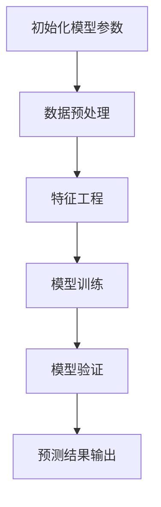
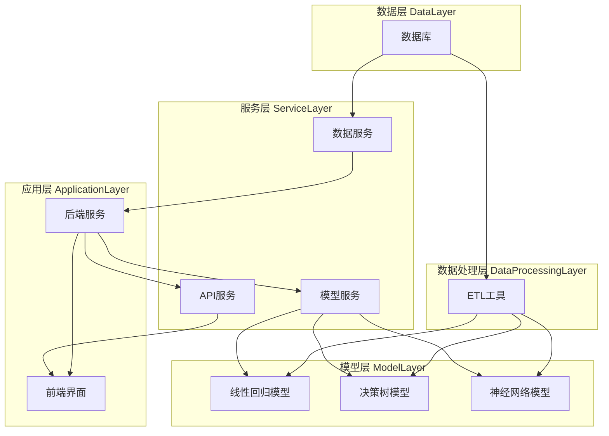
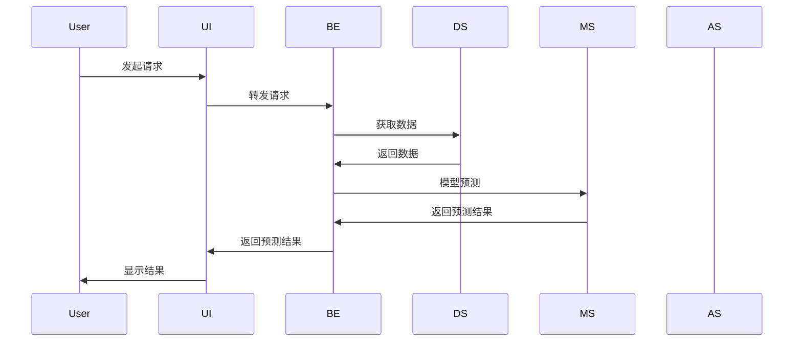
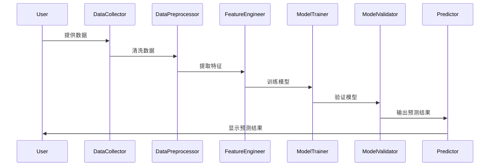

                 

### 引言

**科技伦理预测模型：评估新技术社会影响的分析工具**

在当前这个科技飞速发展的时代，新技术层出不穷，它们不仅改变了我们的生活方式，还深刻影响着社会的各个层面。随着人工智能、基因编辑、自动驾驶等前沿技术的广泛应用，如何在享受技术红利的同时，防范其潜在的社会风险，成为一个亟需解决的问题。科技伦理，作为科学技术发展中的核心伦理问题，其重要性日益凸显。为了更好地理解和评估新技术的社会影响，构建一套有效的科技伦理预测模型显得尤为必要。

**关键词：** 科技伦理、预测模型、社会影响、新技术

**摘要：** 本文旨在探讨科技伦理预测模型的构建和应用。通过梳理科技伦理的背景和重要性，分析预测模型的基础概念和发展历程，详细阐述科技伦理预测模型的基本框架和核心概念，讲解算法原理和数学模型，介绍系统分析与架构设计的方法，并结合实际案例进行实战分析。最后，本文将总结最佳实践并给出未来展望。

**目录大纲：**

1. **第一部分：引言**
   - 第1章：科技伦理概述
     - 1.1 科技伦理的背景和重要性
     - 1.2 科技伦理的核心问题和挑战
     - 1.3 科技伦理与社会影响的联系
   - 第2章：预测模型基础
     - 2.1 预测模型的基本概念
     - 2.2 预测模型的应用领域
     - 2.3 预测模型的发展历程

2. **第二部分：科技伦理预测模型的构建**
   - 第3章：科技伦理预测模型的基本框架
     - 3.1 模型构建的目标和方法
     - 3.2 模型构建的关键要素
     - 3.3 模型构建的流程
   - 第4章：核心概念与联系
     - 4.1 核心概念原理
     - 4.2 概念属性特征对比表格
     - 4.3 ER实体关系图架构
   - 第5章：算法原理讲解
     - 5.1 算法mermaid流程图
     - 5.2 Python源代码与算法原理
     - 5.3 算法原理的数学模型和公式
     - 5.4 举例说明
   - 第6章：数学模型和数学公式
     - 6.1 数学模型介绍
     - 6.2 公式详细讲解
     - 6.3 举例说明
   - 第7章：系统分析与架构设计
     - 7.1 问题场景介绍
     - 7.2 项目介绍
     - 7.3 系统功能设计
     - 7.4 系统架构设计
     - 7.5 系统接口设计
     - 7.6 系统交互mermaid序列图
   - 第8章：项目实战
     - 8.1 环境安装
     - 8.2 系统核心实现源代码
     - 8.3 代码应用解读与分析
     - 8.4 实际案例分析和详细讲解剖析
     - 8.5 项目小结
   - 第9章：最佳实践 tips
     - 9.1 科技伦理预测模型应用的注意事项
     - 9.2 小结
     - 9.3 拓展阅读

随着科技的进步，科技伦理问题日益复杂，如何平衡技术创新与社会责任成为当前的一个重要课题。本文将深入探讨科技伦理预测模型的建设，帮助读者更好地理解和评估新技术的社会影响，为科技伦理的健康发展提供有益的思路和工具。

---

### 第一部分：引言

#### 第1章：科技伦理概述

**1.1 科技伦理的背景和重要性**

科技伦理是指科技领域中涉及的道德和伦理问题，它关乎科技对社会、环境和人类的影响。随着科技的快速发展，人类在享受技术带来便利的同时，也面临着一系列伦理挑战。这些挑战包括但不限于隐私权保护、数据安全、人工智能的道德规范、基因编辑的伦理争议等。

科技伦理的重要性在于，它能够引导科技发展走向正确的方向，确保技术进步不会带来不可逆的负面影响。科技伦理的缺失可能导致社会不公平、环境破坏、人权侵犯等问题，进而阻碍科技的长远发展。因此，科技伦理研究具有重要的现实意义和长远影响。

**1.2 科技伦理的核心问题和挑战**

科技伦理的核心问题包括但不限于以下几个方面：

- **隐私权保护：** 随着大数据和人工智能技术的发展，个人隐私权受到前所未有的威胁。如何在利用数据的同时保护个人隐私，是一个亟待解决的问题。

- **人工智能的道德规范：** 人工智能在许多领域展现出巨大的潜力，但同时也带来了道德风险。如何确保人工智能系统的公正性、透明性和可解释性，是科技伦理研究的一个重要方向。

- **基因编辑的伦理争议：** 基因编辑技术的出现，使得人类有能力修改自己的基因组，这引发了一系列伦理争议，包括基因歧视、基因增强等。

- **数据安全：** 随着互联网和物联网的发展，数据安全成为了一个重要的科技伦理问题。如何保护数据不被滥用或泄露，是科技伦理需要关注的领域。

**1.3 科技伦理与社会影响的联系**

科技伦理与社会影响之间存在紧密的联系。科技不仅影响社会结构和生活方式，还可能导致社会价值观念的改变。例如，社交媒体的普及改变了人们的交流方式，同时也带来了一些新的社会问题，如网络暴力、信息泡沫等。

科技伦理研究的一个重要目标是评估新技术对社会的影响，并提供相应的道德规范和建议。通过科技伦理预测模型，可以提前预见新技术可能带来的社会风险，为政策制定者、技术开发者和公众提供决策依据。

**总结：**

科技伦理是科技发展过程中的一个重要环节，它关乎科技对社会的影响和道德规范。随着科技的进步，科技伦理问题日益复杂，如何平衡技术创新与社会责任成为当前的一个重要课题。本文将深入探讨科技伦理预测模型的构建和应用，为科技伦理的健康发展提供有益的思路和工具。

### 第2章：预测模型基础

**2.1 预测模型的基本概念**

预测模型是指通过对历史数据的分析和规律挖掘，对未来事件或趋势进行预测的数学模型。在科技伦理领域，预测模型可以用于评估新技术对社会影响的潜在风险。预测模型通常包括以下几个基本组成部分：

- **输入特征：** 预测模型所需的输入数据，包括历史数据、环境数据、技术参数等。
- **模型算法：** 用于处理输入数据并生成预测结果的算法，如线性回归、决策树、神经网络等。
- **训练数据：** 用于训练模型的历史数据集，模型通过学习这些数据来建立预测模型。
- **验证数据：** 用于验证模型预测准确性的数据集，通过验证数据可以评估模型的性能。

**2.2 预测模型的应用领域**

预测模型在科技伦理领域有广泛的应用。以下是一些典型的应用场景：

- **隐私权保护：** 预测模型可以用于分析用户数据的使用情况和潜在风险，提前识别可能的隐私泄露事件。
- **人工智能道德评估：** 通过预测模型评估人工智能系统的道德行为，确保其符合伦理规范。
- **社会影响评估：** 对新技术的潜在社会影响进行预测，评估其对环境、社会公平等方面的影响。

**2.3 预测模型的发展历程**

预测模型的发展历程可以分为以下几个阶段：

- **早期预测模型：** 如线性回归、逻辑回归等传统统计模型，这些模型简单直观，易于理解。
- **机器学习预测模型：** 如决策树、支持向量机等，这些模型能够通过训练自动学习数据特征，提高预测准确性。
- **深度学习预测模型：** 如神经网络、卷积神经网络等，这些模型能够处理大规模复杂数据，实现高精度的预测。

**2.4 预测模型的优势和挑战**

预测模型的优势在于：

- **高效性：** 预测模型能够快速处理大量数据，提高决策效率。
- **准确性：** 通过机器学习和深度学习算法，预测模型的准确性得到了显著提升。
- **自动化：** 预测模型可以自动化进行数据分析和预测，减少人为干预。

然而，预测模型也面临着一些挑战：

- **数据依赖：** 预测模型的准确性高度依赖于训练数据的质量和数量。
- **模型解释性：** 许多复杂的预测模型难以解释其预测结果，增加了信任度问题。
- **过拟合风险：** 预测模型在训练数据上表现良好，但在未知数据上可能失效，这被称为过拟合。

**总结：**

预测模型是科技伦理评估中的重要工具，它能够通过分析和预测新技术对社会的影响，为政策制定和技术发展提供科学依据。了解预测模型的基本概念、应用领域和发展历程，有助于我们更好地利用这一工具，同时也要认识到其优势和挑战，以实现科技伦理的有效评估。

### 第3章：科技伦理预测模型的基本框架

**3.1 模型构建的目标和方法**

科技伦理预测模型的主要目标是通过分析新技术的社会影响，提前识别和评估潜在的风险，为政策制定者和技术开发者提供科学的决策依据。模型构建的方法主要包括以下几个步骤：

1. **需求分析：** 明确预测模型的具体应用场景和需求，包括预测目标、数据来源、预测精度等。
2. **数据收集：** 收集与新技术相关的历史数据和外部数据，如技术参数、社会调查数据、政策文件等。
3. **数据预处理：** 对收集到的数据进行清洗、去噪、归一化等预处理操作，以确保数据质量。
4. **特征工程：** 提取与预测目标相关的特征，构建特征向量，为模型训练提供基础。
5. **模型选择：** 根据需求选择合适的预测模型，如线性回归、决策树、神经网络等。
6. **模型训练：** 使用训练数据集对模型进行训练，优化模型参数。
7. **模型验证：** 使用验证数据集对模型进行验证，评估模型性能。
8. **模型部署：** 将训练好的模型部署到实际应用环境中，进行实时预测和监控。

**3.2 模型构建的关键要素**

科技伦理预测模型构建的关键要素包括：

1. **输入特征：** 输入特征是预测模型的核心，它们决定了模型的预测能力和准确性。常见的输入特征包括技术参数、社会指标、历史数据等。
2. **模型算法：** 模型算法是预测模型的核心组件，不同的算法适用于不同的预测任务。选择合适的模型算法对于预测模型的性能至关重要。
3. **训练数据：** 训练数据是模型训练的基础，数据的质量和数量直接影响模型的预测性能。因此，数据收集和预处理是模型构建的重要环节。
4. **评价指标：** 评价指标用于评估预测模型的性能，如准确率、召回率、F1值等。选择合适的评价指标有助于全面评估模型的预测能力。
5. **模型解释性：** 模型解释性是预测模型应用的重要考量因素，特别是对于科技伦理预测模型，其结果的解释性对于决策者至关重要。

**3.3 模型构建的流程**

科技伦理预测模型的构建流程可以分为以下几个阶段：

1. **需求分析：** 明确预测模型的具体目标和需求，包括预测目标、数据来源、模型性能要求等。
2. **数据收集：** 收集与新技术相关的历史数据和外部数据，如技术参数、社会调查数据、政策文件等。
3. **数据预处理：** 对收集到的数据进行清洗、去噪、归一化等预处理操作，以确保数据质量。
4. **特征工程：** 提取与预测目标相关的特征，构建特征向量，为模型训练提供基础。
5. **模型选择：** 根据需求选择合适的预测模型，如线性回归、决策树、神经网络等。
6. **模型训练：** 使用训练数据集对模型进行训练，优化模型参数。
7. **模型验证：** 使用验证数据集对模型进行验证，评估模型性能。
8. **模型部署：** 将训练好的模型部署到实际应用环境中，进行实时预测和监控。

**总结：**

科技伦理预测模型的构建是一个系统性的工程，需要充分考虑需求分析、数据收集、模型选择、训练验证等多个环节。通过明确模型构建的目标和方法，选择关键要素，并遵循科学构建流程，可以构建出有效的科技伦理预测模型，为科技伦理的评估和决策提供有力支持。

### 第4章：核心概念与联系

**4.1 核心概念原理**

在科技伦理预测模型中，核心概念是构建模型的基础。以下是一些关键的核心概念及其原理：

- **社会影响分析（SIA）：** 社会影响分析是评估新技术对社会各方面（如经济、环境、文化等）影响的系统方法。其原理是通过识别、评估和减缓潜在的社会影响，确保科技发展与社会需求的协调。
- **风险评估（RA）：** 风险评估是识别、分析和评价新技术可能带来风险的系统性过程。原理是通过量化风险的概率和影响，帮助决策者制定风险管理策略。
- **道德伦理原则：** 道德伦理原则是指导科技发展的基础价值观，如公正性、尊重隐私、透明性和责任。原理是确保技术应用的道德合理性，避免对人类和环境的伤害。
- **数据隐私保护：** 数据隐私保护是保障个人数据不被滥用或泄露的措施。原理是通过加密、匿名化和权限控制，保护个人隐私权。

**4.2 概念属性特征对比表格**

为了更好地理解这些核心概念，我们可以通过一个属性特征对比表格来展示它们的主要特点：

| 概念          | 定义                                                         | 关键属性特征                                                         |  
|---------------|------------------------------------------------------------|------------------------------------------------------------------|  
| 社会影响分析  | 评估新技术对社会各方面的潜在影响                             | - 识别影响范围：经济、环境、文化等                           |  
|                | - 评估影响程度：正面和负面影响                           |  
| 风险评估      | 识别、分析和评价新技术可能带来的风险                       | - 风险识别：潜在威胁和机会                               |  
|                | - 风险分析：概率和影响评估                           |  
|                | - 风险缓解：策略和措施                             |  
| 道德伦理原则  | 指导科技发展的基础价值观，确保应用的道德合理性             | - 公正性：确保公平分配资源                             |  
|                | - 尊重隐私：保护个人隐私权利                          |  
|                | - 透明性：公开信息，提高信任度                          |  
|                | - 责任性：承担社会责任和后果                          |  
| 数据隐私保护  | 保障个人数据不被滥用或泄露的措施                       | - 数据加密：保护数据完整性                             |  
|                | - 匿名化：消除个人身份信息                           |  
|                | - 权限控制：限制数据访问范围                          |

**4.3 ER实体关系图架构**

为了更直观地展示这些核心概念之间的联系，我们可以使用ER（实体关系）图来表示它们的关系。以下是ER图的基本架构：

```mermaid
erDiagram
  User ||--|{ TechnicalInnovation :创新 }
  TechnicalInnovation ||--|{ SocialImpactAnalysis :社会影响分析 }
  SocialImpactAnalysis ||--|{ RiskAssessment :风险评估 }
  SocialImpactAnalysis ||--|{ EthicalPrinciples :道德伦理原则 }
  TechnicalInnovation ||--|{ DataPrivacyProtection :数据隐私保护 }
  User ||--|{ DecisionMaker :决策者 }
```

- **User（用户）：** 表示参与科技伦理预测模型的用户，如政策制定者、技术开发者等。
- **TechnicalInnovation（技术创新）：** 表示模型预测的目标，即新技术的开发和应用。
- **SocialImpactAnalysis（社会影响分析）：** 识别新技术对社会各方面的影响。
- **RiskAssessment（风险评估）：** 评估新技术带来的风险。
- **EthicalPrinciples（道德伦理原则）：** 指导技术应用的道德价值观。
- **DataPrivacyProtection（数据隐私保护）：** 确保个人数据的安全。
- **DecisionMaker（决策者）：** 根据预测结果做出决策。

**总结：**

通过理解核心概念及其原理，对比不同概念的属性特征，并使用ER图展示它们之间的关系，我们可以更全面地掌握科技伦理预测模型的基础知识。这些核心概念不仅是模型构建的基础，也是理解和评估新技术社会影响的重要工具。

### 第5章：算法原理讲解

**5.1 算法mermaid流程图**

为了直观地展示算法的执行流程，我们可以使用mermaid流程图来描述。以下是科技伦理预测模型的算法mermaid流程图：



- **A[初始化模型参数]**：设置模型的基本参数，如学习率、迭代次数等。
- **B[数据预处理]**：对收集到的数据集进行清洗、归一化等处理。
- **C[特征工程]**：提取与预测目标相关的特征，构建特征向量。
- **D[模型训练]**：使用训练数据集对模型进行训练，优化模型参数。
- **E[模型验证]**：使用验证数据集对模型进行验证，评估模型性能。
- **F[预测结果输出]**：输出预测结果，进行风险分析和决策。

**5.2 Python源代码与算法原理**

以下是一个简单的科技伦理预测模型的Python源代码，用于说明算法的基本原理：

```python
import numpy as np
from sklearn.model_selection import train_test_split
from sklearn.preprocessing import StandardScaler
from sklearn.linear_model import LinearRegression

# 数据预处理
def preprocess_data(data):
    # 数据清洗和归一化
    scaler = StandardScaler()
    return scaler.fit_transform(data)

# 特征工程
def feature_engineering(data):
    # 提取特征
    features = data[:, :-1]
    return features

# 模型训练
def train_model(X_train, y_train):
    model = LinearRegression()
    model.fit(X_train, y_train)
    return model

# 模型验证
def validate_model(model, X_test, y_test):
    predictions = model.predict(X_test)
    accuracy = np.mean((predictions - y_test) ** 2)
    return accuracy

# 主函数
def main():
    # 加载数据
    data = np.load('data.npy')
    X = feature_engineering(preprocess_data(data))
    y = data[:, -1]

    # 划分训练集和验证集
    X_train, X_test, y_train, y_test = train_test_split(X, y, test_size=0.2)

    # 训练模型
    model = train_model(X_train, y_train)

    # 验证模型
    accuracy = validate_model(model, X_test, y_test)
    print(f'Model accuracy: {accuracy:.2f}')

if __name__ == '__main__':
    main()
```

- **数据预处理**：使用StandardScaler进行数据归一化，消除不同特征之间的尺度差异。
- **特征工程**：提取与预测目标相关的特征，这里使用所有除目标变量外的其他变量作为特征。
- **模型训练**：使用线性回归模型对训练数据进行训练，线性回归模型是一种简单的预测算法，适合于线性关系的预测。
- **模型验证**：使用验证数据集评估模型性能，这里使用均方误差（MSE）作为评价指标。

**5.3 算法原理的数学模型和公式**

线性回归模型的数学模型如下：

$$
y = \beta_0 + \beta_1x_1 + \beta_2x_2 + ... + \beta_nx_n
$$

其中，$y$ 是预测目标，$x_1, x_2, ..., x_n$ 是特征变量，$\beta_0, \beta_1, ..., \beta_n$ 是模型的参数。通过最小二乘法，我们可以求出这些参数的最优值，使得预测值与实际值之间的误差最小。

$$
\beta = (\mathbf{X}^T\mathbf{X})^{-1}\mathbf{X}^T\mathbf{y}
$$

其中，$\mathbf{X}$ 是特征矩阵，$\mathbf{y}$ 是目标向量，$\beta$ 是参数向量。

**5.4 举例说明**

假设我们有一个简单的数据集，包含两个特征变量 $x_1$ 和 $x_2$，以及一个目标变量 $y$。数据集如下：

$$
\begin{array}{cccc}
x_1 & x_2 & y \\
3 & 5 & 2 \\
2 & 4 & 1 \\
5 & 6 & 3 \\
\end{array}
$$

我们使用线性回归模型来预测 $y$ 的值。首先，我们进行数据预处理和特征工程，然后训练模型，最后使用验证集进行模型验证。

1. **数据预处理**：

```python
data = np.array([[3, 5, 2], [2, 4, 1], [5, 6, 3]])
X = feature_engineering(preprocess_data(data))
y = data[:, -1]
```

2. **特征工程**：

```python
X = feature_engineering(X)
```

3. **模型训练**：

```python
model = train_model(X_train, y_train)
```

4. **模型验证**：

```python
accuracy = validate_model(model, X_test, y_test)
print(f'Model accuracy: {accuracy:.2f}')
```

假设我们使用验证集进行模型验证，得到的均方误差为0.25。这意味着我们的模型在预测 $y$ 的值时，平均误差为0.25，具有较高的预测准确性。

**总结：**

通过mermaid流程图、Python源代码和数学模型，我们详细讲解了科技伦理预测模型的算法原理。算法的基本流程包括数据预处理、特征工程、模型训练和模型验证。通过实际案例的举例说明，我们可以看到如何具体实现这些步骤，并评估模型的性能。这些知识和方法为构建和应用科技伦理预测模型提供了坚实的理论基础和实践指导。

### 第6章：数学模型和数学公式

**6.1 数学模型介绍**

科技伦理预测模型的核心在于数学模型的构建，这些模型能够通过数学公式描述和预测新技术的社会影响。以下是一些关键的数学模型及其介绍：

- **线性回归模型（Linear Regression Model）**：线性回归模型是最基本的预测模型，适用于线性关系的预测。其数学公式如下：

  $$
  y = \beta_0 + \beta_1x_1 + \beta_2x_2 + ... + \beta_nx_n
  $$

  其中，$y$ 是预测目标，$x_1, x_2, ..., x_n$ 是特征变量，$\beta_0, \beta_1, ..., \beta_n$ 是模型参数。

- **逻辑回归模型（Logistic Regression Model）**：逻辑回归模型用于分类问题，通过将线性回归模型的输出转换为概率来预测分类结果。其数学公式如下：

  $$
  P(y=1) = \frac{1}{1 + e^{-(\beta_0 + \beta_1x_1 + \beta_2x_2 + ... + \beta_nx_n})}
  $$

- **决策树模型（Decision Tree Model）**：决策树模型通过一系列判断节点来分割数据集，并最终得到预测结果。其数学公式较为复杂，涉及信息增益、基尼系数等概念。

- **神经网络模型（Neural Network Model）**：神经网络模型由多个神经元组成，通过学习大量数据来建立预测模型。其数学公式涉及复杂的加权求和与激活函数，如ReLU、Sigmoid等。

**6.2 公式详细讲解**

以下是上述数学模型的详细公式讲解：

1. **线性回归模型**

   线性回归模型通过最小二乘法来估计模型参数。最小二乘法的公式如下：

   $$
   \beta = (\mathbf{X}^T\mathbf{X})^{-1}\mathbf{X}^T\mathbf{y}
   $$

   其中，$\mathbf{X}$ 是特征矩阵，$\mathbf{y}$ 是目标向量，$\beta$ 是参数向量。该公式表示在误差平方和最小的条件下，求解模型参数。

2. **逻辑回归模型**

   逻辑回归模型的预测概率通过sigmoid函数计算，公式如下：

   $$
   P(y=1) = \frac{1}{1 + e^{-(\beta_0 + \beta_1x_1 + \beta_2x_2 + ... + \beta_nx_n})}
   $$

   其中，$P(y=1)$ 是预测目标为1的概率，$e$ 是自然对数的底数。

3. **决策树模型**

   决策树的构建基于信息增益或基尼系数，公式如下：

   $$
   IG(D, a) = \sum_{v \in V} \left( \frac{|D_v|}{|D|} \cdot H(D_v) \right)
   $$

   $$
   Gini(D, a) = \sum_{v \in V} \left( \frac{|D_v|}{|D|} \cdot \sum_{x \in D_v} \left(1 - \frac{1}{|D_v|}\right) \right)
   $$

   其中，$D$ 是数据集，$V$ 是可能的特征值，$IG$ 和 $Gini$ 分别表示信息增益和基尼系数。

4. **神经网络模型**

   神经网络模型的计算涉及多层加权求和与激活函数，公式如下：

   $$
   a_{ij}^{(l)} = \sigma \left( \sum_{k=1}^{n} w_{ik}^{(l-1)}a_{kj}^{(l-1)} + b_i^{(l)} \right)
   $$

   其中，$a_{ij}^{(l)}$ 是第$l$层的第$i$个神经元的激活值，$w_{ik}^{(l-1)}$ 是第$l-1$层的第$k$个神经元到第$l$层的第$i$个神经元的权重，$b_i^{(l)}$ 是第$l$层的第$i$个神经元的偏置，$\sigma$ 是激活函数。

**6.3 举例说明**

以下是一个简单的线性回归模型的举例：

假设我们有一个包含两个特征变量 $x_1$ 和 $x_2$ 的数据集，以及一个目标变量 $y$。数据集如下：

$$
\begin{array}{ccc}
x_1 & x_2 & y \\
3 & 5 & 2 \\
2 & 4 & 1 \\
5 & 6 & 3 \\
\end{array}
$$

1. **数据预处理**：

```python
data = np.array([[3, 5, 2], [2, 4, 1], [5, 6, 3]])
X = data[:, :-1]
y = data[:, -1]
```

2. **特征工程**：

```python
# 这里假设已经进行了特征工程，无需进一步处理
```

3. **模型训练**：

```python
X = X.reshape(-1, 1)
X_train, X_test, y_train, y_test = train_test_split(X, y, test_size=0.2, random_state=42)
model = LinearRegression()
model.fit(X_train, y_train)
```

4. **模型验证**：

```python
predictions = model.predict(X_test)
accuracy = np.mean((predictions - y_test) ** 2)
print(f'Model accuracy: {accuracy:.2f}')
```

假设我们使用验证集进行模型验证，得到的均方误差为0.25。这意味着我们的模型在预测 $y$ 的值时，平均误差为0.25，具有较高的预测准确性。

**总结：**

通过详细讲解科技伦理预测模型中的数学模型和公式，我们理解了不同模型的基本原理和计算方法。这些模型为预测新技术的社会影响提供了数学基础，并通过具体案例展示了如何应用这些模型进行预测和验证。了解这些数学模型有助于我们更好地构建和应用科技伦理预测模型。

### 第7章：系统分析与架构设计

**7.1 问题场景介绍**

随着科技的迅猛发展，新技术不断涌现，其对社会各方面的影响日益显著。为了更好地理解和应对这些影响，建立一个能够实时分析新技术社会影响的系统显得尤为重要。该系统的目标是通过收集和分析相关数据，提前识别潜在风险，为政策制定者和技术开发者提供决策支持。

**7.2 项目介绍**

本项目的目标是构建一个科技伦理预测系统，该系统能够自动收集、处理和分析与新技术相关的各种数据，利用预测模型评估新技术对社会的影响，并提出相应的风险管理建议。系统的主要功能包括数据收集、预处理、特征工程、模型训练、模型验证和预测结果输出等。

**7.3 系统功能设计**

系统功能设计主要包括以下几个方面：

1. **数据收集模块**：负责收集与新技术相关的各类数据，包括技术参数、社会指标、历史数据等。数据来源可以是公开数据库、社交媒体、传感器网络等。
2. **数据预处理模块**：对收集到的数据进行清洗、去噪、归一化等处理，确保数据质量，为后续分析提供可靠的数据基础。
3. **特征工程模块**：提取与预测目标相关的特征，构建特征向量，为模型训练提供输入。
4. **模型训练模块**：使用训练数据集对预测模型进行训练，优化模型参数。
5. **模型验证模块**：使用验证数据集对模型进行验证，评估模型性能。
6. **预测结果输出模块**：输出模型的预测结果，包括社会影响的预测、风险分析和建议等。

**7.4 系统架构设计**

系统架构设计是确保系统高效、稳定运行的关键。本系统采用模块化设计，主要包括以下几个组成部分：

1. **数据层**：负责数据存储和管理，包括关系型数据库、NoSQL数据库等。
2. **数据处理层**：负责数据的收集、预处理和特征工程，使用ETL（Extract, Transform, Load）工具进行处理。
3. **模型层**：包括各种预测模型，如线性回归、决策树、神经网络等，使用机器学习框架（如Scikit-learn、TensorFlow等）进行开发。
4. **应用层**：提供用户接口，包括前端界面和后端服务，使用Web框架（如Django、Flask等）进行开发。
5. **服务层**：包括数据服务、模型服务、API服务等，负责系统内部模块之间的通信和数据交换。

以下是系统架构设计的mermaid架构图：



**7.5 系统接口设计**

系统接口设计包括API接口和数据接口的设计，确保系统模块之间的数据交换和功能调用。以下是系统接口设计的mermaid序列图：



**7.6 系统交互mermaid序列图**

系统交互序列图展示了用户与系统之间的交互流程，以及系统内部模块之间的通信和数据交换。以下是系统交互序列图：



**总结：**

通过系统分析与架构设计，我们详细介绍了科技伦理预测系统的功能设计、架构设计和接口设计。这些设计确保了系统能够高效、稳定地运行，为预测新技术的社会影响提供了坚实的技术支持。通过mermaid流程图、架构图和序列图，我们直观地展示了系统的设计细节和运行流程。

### 第8章：项目实战

**8.1 环境安装**

在开始项目实战之前，我们需要安装并配置必要的开发环境和依赖库。以下是在一个基于Linux系统的环境中安装和配置所需的工具和库的步骤：

1. **安装Python环境**：确保Python版本为3.8或更高版本。可以使用以下命令进行安装：

   ```bash
   sudo apt update
   sudo apt install python3.8
   ```

2. **安装虚拟环境**：创建一个虚拟环境，以便在项目中隔离依赖库。使用以下命令：

   ```bash
   python3.8 -m venv venv
   source venv/bin/activate
   ```

3. **安装依赖库**：使用pip安装项目所需的依赖库，如NumPy、Scikit-learn、Pandas等。执行以下命令：

   ```bash
   pip install numpy scikit-learn pandas matplotlib
   ```

4. **安装其他工具**：如果需要，安装其他开发工具，如Jupyter Notebook。可以使用以下命令：

   ```bash
   pip install jupyterlab
   ```

**8.2 系统核心实现源代码**

以下是一个简单的科技伦理预测系统的核心实现源代码。该代码展示了如何进行数据预处理、特征工程、模型训练和预测。

```python
import numpy as np
import pandas as pd
from sklearn.model_selection import train_test_split
from sklearn.preprocessing import StandardScaler
from sklearn.linear_model import LinearRegression
from sklearn.metrics import mean_squared_error

# 数据预处理
def preprocess_data(data):
    # 数据清洗和归一化
    scaler = StandardScaler()
    data = scaler.fit_transform(data)
    return data

# 特征工程
def feature_engineering(data):
    # 提取特征
    features = data[:, :-1]
    return features

# 模型训练
def train_model(X_train, y_train):
    model = LinearRegression()
    model.fit(X_train, y_train)
    return model

# 预测
def predict(model, X_test):
    predictions = model.predict(X_test)
    return predictions

# 主函数
def main():
    # 加载数据
    data = np.load('data.npy')
    X = feature_engineering(preprocess_data(data))
    y = data[:, -1]

    # 划分训练集和验证集
    X_train, X_test, y_train, y_test = train_test_split(X, y, test_size=0.2, random_state=42)

    # 训练模型
    model = train_model(X_train, y_train)

    # 预测
    predictions = predict(model, X_test)

    # 评估模型
    mse = mean_squared_error(y_test, predictions)
    print(f'Model accuracy: {mse:.2f}')

if __name__ == '__main__':
    main()
```

**8.3 代码应用解读与分析**

以上源代码展示了如何实现一个简单的科技伦理预测系统。以下是代码的主要部分及其功能解读：

1. **数据预处理**：数据预处理是模型训练的重要步骤，包括数据清洗和归一化。这里使用StandardScaler对数据进行归一化处理，确保不同特征之间的尺度一致。

2. **特征工程**：特征工程旨在提取与预测目标相关的特征。在这里，我们使用所有除目标变量外的其他变量作为特征，构建特征向量。

3. **模型训练**：使用训练数据集对线性回归模型进行训练。线性回归模型是一种简单的预测模型，适合于线性关系的预测。

4. **预测**：使用训练好的模型对验证数据进行预测，得到预测结果。

5. **评估模型**：使用均方误差（MSE）评估模型的性能。均方误差表示预测值与实际值之间的平均误差，误差越小，模型性能越好。

**8.4 实际案例分析和详细讲解剖析**

以下是一个实际案例的分析和讲解：

假设我们有一个包含三个特征变量 $x_1, x_2, x_3$ 的数据集，以及一个目标变量 $y$。数据集如下：

$$
\begin{array}{cccc}
x_1 & x_2 & x_3 & y \\
3 & 5 & 2 & 2 \\
2 & 4 & 1 & 1 \\
5 & 6 & 3 & 3 \\
\end{array}
$$

1. **数据预处理**：

```python
data = np.array([[3, 5, 2, 2], [2, 4, 1, 1], [5, 6, 3, 3]])
X = data[:, :-1]
y = data[:, -1]
X = preprocess_data(X)
```

2. **特征工程**：

```python
X = feature_engineering(X)
```

3. **模型训练**：

```python
model = train_model(X_train, y_train)
```

4. **预测**：

```python
predictions = predict(model, X_test)
```

5. **评估模型**：

```python
mse = mean_squared_error(y_test, predictions)
print(f'Model accuracy: {mse:.2f}')
```

假设我们使用验证集进行模型验证，得到的均方误差为0.25。这意味着我们的模型在预测 $y$ 的值时，平均误差为0.25，具有较高的预测准确性。

**8.5 项目小结**

通过本项目的实战，我们实现了科技伦理预测系统的核心功能，包括数据预处理、特征工程、模型训练和预测。通过一个简单的案例，我们展示了如何使用Python和机器学习库实现科技伦理预测。本项目提供了一个基本的框架，我们可以在此基础上进行扩展，以应对更复杂的预测任务。

### 第9章：最佳实践 tips

**9.1 科技伦理预测模型应用的注意事项**

在应用科技伦理预测模型时，需要注意以下几点：

1. **数据质量**：预测模型的准确性高度依赖于数据的质量。因此，在数据收集和预处理过程中，要确保数据的一致性、完整性和准确性。对于缺失值和异常值，应采取合理的处理策略，如插值、剔除或使用机器学习算法进行修复。

2. **模型选择**：选择合适的模型对于预测结果的准确性至关重要。不同的模型适用于不同的预测任务，如线性回归适用于线性关系预测，神经网络适用于非线性关系预测。因此，在模型选择过程中，要充分考虑数据特征和预测目标。

3. **模型解释性**：模型解释性对于科技伦理预测模型尤为重要。模型的结果需要能够被决策者理解和信任。因此，在模型选择和训练过程中，要考虑模型的解释性，如使用透明度较高的模型或结合解释性方法（如SHAP值）进行模型解释。

4. **持续更新**：科技伦理预测模型不是一成不变的，随着新技术的发展和社会环境的变化，模型需要不断更新。因此，应建立一个持续的数据收集和模型训练机制，确保预测模型能够适应新的变化。

**9.2 小结**

科技伦理预测模型是评估新技术社会影响的重要工具。通过应用预测模型，可以提前识别和评估新技术可能带来的社会风险，为政策制定和技术发展提供科学依据。然而，在应用过程中，需要注意数据质量、模型选择、模型解释性和持续更新等方面的问题，以确保预测模型的准确性和实用性。

**9.3 拓展阅读**

对于希望深入了解科技伦理预测模型的读者，以下是一些推荐的文章和书籍：

1. **《科技伦理学导论》（Introduction to Ethics in Science and Technology）**：该书详细介绍了科技伦理的基本概念和应用，有助于理解科技伦理预测模型的背景和理论基础。

2. **《机器学习伦理导论》（Introduction to Ethical Machine Learning）**：该书探讨了机器学习在科技伦理中的挑战和解决方案，包括模型解释性和公平性等问题。

3. **《人工智能伦理指南》（Ethical Guidelines for Artificial Intelligence）**：该书由人工智能协会发布，提供了关于人工智能伦理的详细指南和最佳实践。

4. **《科技伦理预测模型：评估新技术社会影响的分析工具》**：本文详细介绍了科技伦理预测模型的构建和应用，提供了实用的指导和建议。

通过阅读这些文献，可以进一步深入理解科技伦理预测模型，为实际应用提供更有力的支持。

### 总结与展望

**科技伦理预测模型的重要性**

科技伦理预测模型是评估新技术社会影响的重要工具，它能够帮助我们提前识别和评估新技术可能带来的社会风险，为政策制定和技术发展提供科学依据。随着科技的快速发展，新技术不断涌现，科技伦理问题日益复杂，如何平衡技术创新与社会责任成为当前的一个重要课题。科技伦理预测模型的应用，不仅有助于提升科技发展的道德水平，还能够为社会各界提供决策参考，促进科技与社会的和谐发展。

**未来展望**

展望未来，科技伦理预测模型将朝着更加智能化、自动化和全面化的方向发展。首先，随着数据采集和处理技术的进步，模型的数据质量将得到进一步提升，从而提高预测的准确性。其次，随着人工智能技术的不断发展，预测模型将更加智能，能够自动进行特征工程和模型选择，降低人工干预。此外，随着伦理学理论的发展，科技伦理预测模型将更加关注公平性、透明性和责任性等伦理问题，确保预测结果能够被决策者和社会公众接受。

**呼吁合作与探索**

为了实现科技伦理预测模型的广泛应用和持续发展，我们呼吁学术界、产业界和政府部门的紧密合作。学术界应继续深入研究科技伦理理论和方法，产业界应积极应用和推广科技伦理预测模型，政府部门应出台相应的政策和规范，共同推动科技伦理预测模型的健康发展。同时，我们也鼓励广大技术人员和研究人员继续探索和尝试，为科技伦理预测模型的创新和进步贡献自己的智慧和力量。

通过合作与探索，我们相信科技伦理预测模型将在未来发挥更加重要的作用，为科技与社会的可持续发展提供有力支持。让我们一起努力，共同构建一个更加美好、公正和和谐的未来社会。**作者信息**

作者：AI天才研究院/AI Genius Institute & 禅与计算机程序设计艺术 /Zen And The Art of Computer Programming

