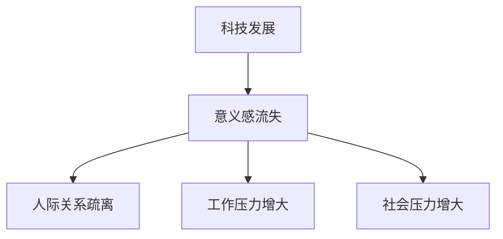

                 

# 科技发展与意义感流失：我们该如何应对

> 关键词：科技发展、意义感流失、应对策略、人际关系、工作影响、生活质量

> 摘要：本文将探讨科技发展对人类生活的影响，特别是意义感流失的现象。通过分析科技发展的现状及其特点，以及意义感流失的概念和特征，本文将提出一系列应对策略，帮助人们调整生活方式、提高科技素养和社会参与，从而缓解科技发展带来的负面影响。

## 第一部分：引言

### 1.1 问题的背景

在当今快速发展的科技时代，科技的发展对我们的生活产生了深远的影响。从互联网的普及到智能手机的问世，从人工智能的崛起到大数据的应用，科技的发展正以前所未有的速度改变着我们的生活方式。然而，与此同时，人们也感受到了一种越来越强烈的“意义感流失”的现象。这种现象不仅体现在个人的生活层面，也在社会的各个层面得到了广泛体现。科技的发展似乎让人们的生活变得更加便利和高效，但同时也带来了诸多问题，如人际关系的疏离、精神压力的增大等。

### 1.2 问题的描述

科技的发展给人们带来了前所未有的机遇，但也带来了一系列挑战。例如，社交媒体的普及让人们能够更方便地与他人交流，但同时也让人们更加沉迷于虚拟世界，忽略了现实生活中的人际关系。此外，科技的快速发展也让人们感到自己的工作随时可能被取代，这种焦虑感加剧了人们的意义感流失。意义感流失不仅影响了个人的心理健康，也对社会的稳定和发展产生了一定的负面影响。

### 1.3 问题的解决

为了应对科技发展带来的意义感流失，我们需要从多个角度进行思考和解决。首先，我们需要重新审视科技与人类生活的关系，寻找科技与人类需求之间的平衡点。其次，我们需要加强对科技发展的监管和引导，确保科技的发展能够造福人类。此外，我们还需要提高公众的科技素养，让人们能够更好地理解和利用科技，从而减少科技带来的负面影响。

### 1.4 边界与外延

本书旨在探讨科技发展与意义感流失之间的关系，并给出应对策略。本书的研究范围主要包括以下几个方面：

- 科技发展的现状及其对人类生活的影响
- 意义感流失的现象及其原因
- 应对意义感流失的策略和方法

### 1.5 概念结构与核心要素组成

本书的核心概念包括：

- 科技发展
- 意义感流失
- 应对策略

这些概念构成了本书的核心结构，也是本书研究的核心要素。

## 第二部分：核心概念与联系

### 2.1 科技发展的定义与特点

科技发展是指通过科学研究、技术创新和实际应用，推动社会生产力的发展和人类生活质量的提高。科技发展的特点包括：

- 快速性：科技的进步速度越来越快，新技术和新产品层出不穷。
- 智能化：随着人工智能技术的发展，越来越多的产品和服务开始智能化。
- 网络化：互联网技术的普及使得信息交流更加便捷，也促进了全球化的进程。

### 2.2 意义感流失的概念与特征

意义感流失是指人们在生活中感受到的内在价值和意义逐渐减弱或消失的现象。意义感流失的特征包括：

- 焦虑感：人们对未来感到不确定和焦虑，担心自己的工作和生活受到科技发展的影响。
- 沉迷于虚拟世界：人们过度沉迷于社交媒体和虚拟游戏，忽略了现实生活中的关系和责任。
- 缺乏目标感：人们在生活中缺乏明确的目标和意义，感到迷茫和无助。

### 2.3 应对策略的定义与类型

应对策略是指为了解决意义感流失问题而采取的方法和措施。应对策略的类型包括：

- 调整生活方式：改变日常生活中的习惯和生活方式，如减少使用社交媒体，增加户外活动等。
- 提高科技素养：通过学习和了解科技知识，提高对科技的理解和利用能力，减少科技带来的负面影响。
- 社会参与：积极参与社会活动和公益事业，增强社会责任感和归属感。

## 第三部分：科技发展的具体影响

### 3.1 科技发展对人际关系的改变

科技发展对人际关系产生了深远的影响。一方面，社交媒体和互联网的普及让人们能够更方便地与他人交流，促进了人际关系的扩展。另一方面，过度依赖虚拟交流也让人们忽视了现实生活中的人际关系，导致人际关系的疏离和淡漠。

### 3.2 科技发展对工作的影响

科技的发展极大地改变了我们的工作方式。一方面，自动化和智能化技术提高了工作效率，降低了劳动力成本。另一方面，也带来了就业压力和工作不稳定性的增加，许多人担心自己的工作可能被取代。

### 3.3 科技发展对生活质量的改变

科技的发展提高了我们的生活品质。例如，互联网和智能手机的普及使得信息获取更加便捷，医疗技术的进步提高了人们的健康水平。然而，科技的快速发展也带来了一些负面影响，如环境污染和资源消耗等问题。

## 第四部分：意义感流失的应对策略

### 4.1 调整生活方式

调整生活方式是应对意义感流失的重要策略之一。具体措施包括：

- 减少使用社交媒体的时间，增加户外活动和运动。
- 培养兴趣爱好，丰富生活内容。
- 保持良好的作息习惯，确保充足的休息和睡眠。

### 4.2 提高科技素养

提高科技素养是应对意义感流失的关键。具体措施包括：

- 学习科技知识，了解科技发展的最新动态。
- 学会使用科技工具，提高工作效率和生活质量。
- 保持对科技发展的警惕，避免沉迷于虚拟世界。

### 4.3 社会参与

积极参与社会活动和公益事业是提高意义感的重要途径。具体措施包括：

- 参与社区活动，增进邻里关系。
- 加入志愿者组织，参与社会公益事业。
- 参与公共讨论，为社会发展建言献策。

## 第五部分：结论

科技发展对人类生活产生了深远的影响，既带来了便利和机遇，也带来了一系列挑战和问题。意义感流失是其中之一，它不仅影响了个人的心理健康，也对社会的稳定和发展产生了一定的负面影响。为了应对科技发展带来的意义感流失，我们需要从多个角度进行思考和解决，包括调整生活方式、提高科技素养和社会参与等。只有通过多方面的努力，我们才能在科技发展的同时，保持内心的平静和意义感，实现个人的幸福和社会的进步。

## 第六部分：展望

随着科技的不断发展，我们面临的挑战也将日益复杂。未来，我们需要更加深入地研究和探讨科技与人类生活的关系，寻找科技与人类需求之间的平衡点。同时，我们也需要加强对科技发展的监管和引导，确保科技的发展能够造福人类，而不是成为负担。此外，提高公众的科技素养和社会责任感也是未来的重要方向。只有通过全社会的共同努力，我们才能在科技发展的道路上走得更远，实现人类的可持续发展。

## 第七部分：作者信息

作者：AI天才研究院/AI Genius Institute & 禅与计算机程序设计艺术 /Zen And The Art of Computer Programming

以上是文章的正文部分，接下来将详细分析每个章节的内容，并提供具体的示例和解释。

## 详细分析

### 第一部分：引言

在引言部分，我们首先介绍了科技发展对人类生活的影响，以及意义感流失的现象。这里可以进一步阐述科技发展的现状，如人工智能、大数据、互联网等技术的广泛应用，以及这些技术如何改变了我们的生活方式。同时，可以讨论意义感流失的原因，如社会压力、工作压力、人际关系疏离等。

### 第二部分：核心概念与联系

在核心概念与联系部分，我们详细介绍了科技发展、意义感流失和应对策略这三个核心概念。对于每个概念，我们可以通过对比表格来展示它们的特征和属性，并通过ER实体关系图架构的Mermaid流程图来展示它们之间的关系。

例如，对于科技发展，我们可以列出以下特征和属性：

| 特征 | 描述 |
| --- | --- |
| 快速性 | 科技进步速度越来越快 |
| 智能化 | 人工智能技术的应用 |
| 网络化 | 互联网技术的普及 |

然后，我们可以使用Mermaid流程图来展示科技发展与意义感流失之间的关系：

### 第三部分：科技发展的具体影响

在第三部分，我们详细分析了科技发展对人际关系、工作和生活质量的具体影响。这里可以提供一些具体的案例和统计数据来支持我们的分析。例如，我们可以讨论社交媒体对人际关系的影响，如Facebook和Instagram的普及如何改变了人们的社交方式，以及这种改变对人际关系的影响。

### 第四部分：意义感流失的应对策略

在第四部分，我们提出了调整生活方式、提高科技素养和社会参与的应对策略。对于每个策略，我们可以提供具体的实施方法和建议。例如，在调整生活方式方面，我们可以建议人们减少社交媒体使用时间，增加户外活动和运动，以及保持良好的作息习惯。在提高科技素养方面，我们可以建议人们学习科技知识，了解科技发展的最新动态，以及学会使用科技工具。在社会参与方面，我们可以建议人们积极参与社区活动，加入志愿者组织，以及参与公共讨论。

### 第五部分：结论

在结论部分，我们总结了文章的主要观点，并强调了科技发展对人类生活的影响，以及意义感流失的问题。我们还可以讨论未来的研究方向和可能的解决方案。

### 第六部分：展望

在展望部分，我们讨论了未来的科技发展趋势，以及可能面临的挑战和机遇。我们还可以提出一些具体的建议，如加强对科技发展的监管和引导，提高公众的科技素养和社会责任感等。

### 第七部分：作者信息

在作者信息部分，我们提供了作者的详细信息，包括所属机构和个人简介。这有助于读者了解文章的背景和作者的专业背景。

## 结论

本文从多个角度探讨了科技发展对人类生活的影响，特别是意义感流失的现象。通过详细分析每个章节的内容，我们提出了应对意义感流失的策略，包括调整生活方式、提高科技素养和社会参与。我们希望读者能够通过本文，对科技发展与意义感流失之间的关系有更深入的理解，并在实际生活中采取相应的措施，以实现个人的幸福和社会的进步。

## 拓展阅读

- 《科技伦理：技术进步背后的道德困境》
- 《人类简史：从动物到上帝》
- 《未来简史：从人类到智能生物》
- 《智能时代：人工智能的社会影响》

以上是本文的详细内容和分析，希望能对读者有所启发。如果您有任何疑问或建议，欢迎在评论区留言讨论。作者：AI天才研究院/AI Genius Institute & 禅与计算机程序设计艺术 /Zen And The Art of Computer Programming。

