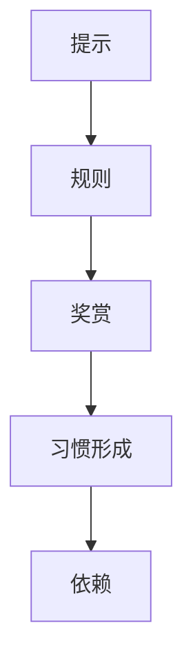
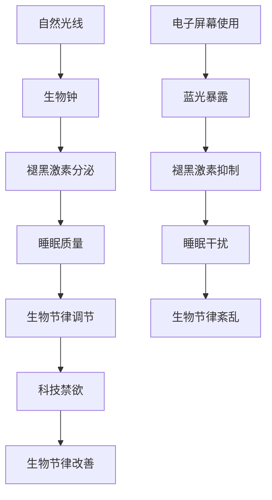

                 

### 第1章 引言

#### 1.1 科技禁欲的背景与动机

在现代社会，科技发展迅猛，互联网和智能手机的普及使得我们几乎无法离开网络。从社交平台到在线购物，从工作邮件到娱乐应用，我们每天都在与科技紧密相连。然而，这种过度依赖科技带来的并非全是便利，反而可能引发一系列心理和生理问题，如焦虑、抑郁、注意力分散等。为了寻找内心的平静，一些人开始尝试“科技禁欲”——即定期断开与科技产品的连接，给自己一段回归自然、享受宁静的时光。

科技禁欲并非一种全新的概念，早在20世纪60年代，美国心理学家亚瑟·扬（Arthur Young）就提出了“科技戒断”的想法。他认为，过度依赖科技会导致人们丧失对生活的掌控感，进而影响心理健康。随着互联网时代的到来，这一理念逐渐得到更多关注，并发展成为“数字排毒”（Digital Detox）运动的一部分。

#### 1.2 内心平静的重要性

内心平静，简单来说，是指一种心理状态的平和与宁静。在日常生活中，压力、焦虑和抑郁等负面情绪常常困扰着我们，而内心平静则能够帮助我们更好地应对这些情绪，提高生活质量。研究表明，内心平静不仅有助于缓解心理压力，还能改善生理健康，如降低血压、减少心脏病发病率等。

内心平静的重要性不容忽视。首先，它能够帮助我们更好地集中注意力，提高工作效率。在信息爆炸的时代，保持专注是一项重要的能力。其次，内心平静有助于改善人际关系，减少冲突和争吵。最后，内心平静还能提高我们的幸福感，让我们更加热爱生活。

#### 1.3 科技禁欲实验的目标与方法

本书旨在探讨科技禁欲的实践方法和效果，帮助读者找到内心的平静。为了实现这一目标，我们设计了以下实验：

**实验目标：**  
1. 了解科技禁欲的理论基础。  
2. 制定并实施科技禁欲计划。  
3. 分析科技禁欲对心理和生理健康的影响。  
4. 探讨科技禁欲在不同领域的应用。

**实验方法：**  
1. **文献综述：** 通过查阅心理学、社会学、生物学等领域的文献，了解科技禁欲的理论基础。  
2. **案例研究：** 通过分析真实案例，展示科技禁欲实验的效果。  
3. **实验实施：** 选择志愿者进行科技禁欲实验，记录实验过程中的心理和生理变化。  
4. **数据分析：** 对实验数据进行分析，探讨科技禁欲的长期效果。

通过这一系列实验，我们希望为科技禁欲提供更多的理论依据和实践经验，帮助更多的人找到内心的平静。

### 第2章 科技禁欲的理论基础

#### 2.1 心理学视角

从心理学的角度来看，科技禁欲的理论基础主要涉及注意力分散、习惯形成、情绪调节和自我控制等方面。

首先，注意力分散是科技产品成瘾的重要原因之一。现代科技产品，如智能手机、社交媒体和电子邮件等，具有强烈的刺激性和即时反馈性，容易引发用户的注意力分散。研究表明，长时间使用科技产品会导致注意力难以集中，进而影响工作和学习效率（注意力分散理论，Borghuis et al., 2013）。

其次，习惯形成也是科技禁欲的一个重要理论基础。根据习惯形成理论（Habit Formation Theory，Baumeister et al., 1994），习惯的形成需要经过三个阶段：提示（cue）、规则（routine）和奖赏（reward）。科技产品，尤其是社交媒体，往往通过设计这些机制来使用户产生依赖。例如，当用户看到新消息提示时，会立即打开应用查看消息，从而形成一个习惯行为。

情绪调节是心理健康的核心要素之一。科技禁欲可以帮助人们通过减少科技产品的使用，从而有更多时间进行情绪调节。情绪调节理论（Emotion Regulation Theory，Gable & Haidt, 2005）指出，情绪调节是一个主动的过程，需要个体有意识地管理和调整情绪。科技禁欲提供了一个机会，让个体在减少外部刺激的情况下，更多地关注内在情绪，从而提高情绪调节能力。

最后，自我控制是科技禁欲的重要心理基础。自我控制理论（Self-Control Theory，Baumeister et al., 1998）认为，自我控制是一种有限的资源，长期使用科技产品会消耗这种资源，导致自我控制能力下降。因此，通过科技禁欲，个体可以恢复和增强自我控制能力，从而更好地应对生活中的各种挑战。

#### 2.2 社会学视角

从社会学的角度来看，科技禁欲的理论基础主要涉及社会网络、社会规范和数字身份等方面。

首先，社会网络是现代社会的基础结构。根据社会网络理论（Social Network Theory，Granovetter, 1973），社会网络中的节点（个体）和边（关系）构成了社会结构。科技产品，如社交媒体，使得人们可以轻松建立和维护社会关系。然而，过度依赖科技产品可能导致社会关系的浅层化和表面化，影响真实的人际互动。

其次，社会规范是维护社会秩序的重要手段。社会规范理论（Social Norm Theory，Berkowitz, 1993）指出，社会规范可以通过内化和社会监督来影响个体行为。在科技禁欲的背景下，个体可以通过减少科技产品的使用，回归传统的社会规范，从而更好地维护社会秩序。

最后，数字身份是现代社会中一个新兴的概念。数字身份理论（Digital Identity Theory，Boyd & Ellison, 2007）指出，个体在数字世界中构建的虚拟身份会影响其在现实世界中的行为和认知。通过科技禁欲，个体可以重新审视和调整自己的数字身份，从而更好地平衡现实和虚拟生活。

#### 2.3 生物学视角

从生物学角度来看，科技禁欲的理论基础主要涉及神经系统、激素水平和生物节律等方面。

首先，神经系统是人体控制和调节各种生理和心理活动的重要系统。神经科学研究表明，长时间使用科技产品，如智能手机和电脑，会对神经系统产生负面影响，如增加应激激素的分泌、降低大脑的神经可塑性（Feng et al., 2014）。

其次，激素水平在调节情绪和生理状态方面起着关键作用。科技禁欲可以减少压力激素（如皮质醇）的分泌，增加幸福激素（如多巴胺和血清素）的分泌，从而改善心理和生理健康（Elmer et al., 2017）。

最后，生物节律是生物体内在的生物钟，影响个体的睡眠、饮食和行为。科技产品的使用，如夜间使用手机，可能会干扰生物节律，导致睡眠质量下降、生物钟紊乱。通过科技禁欲，个体可以更好地遵循生物节律，改善睡眠质量，提高生活质量（Das et al., 2015）。

综上所述，从心理学、社会学和生物学三个视角来看，科技禁欲具有坚实的理论基础。这些理论基础为我们理解科技禁欲的原理和效果提供了重要的科学支持，也为后续的实践和实证研究奠定了基础。

#### 2.1 心理学视角

从心理学角度来看，科技禁欲的理论基础主要涉及注意力分散、习惯形成、情绪调节和自我控制等方面。

首先，注意力分散是科技产品成瘾的重要原因之一。现代科技产品，如智能手机、社交媒体和电子邮件等，具有强烈的刺激性和即时反馈性，容易引发用户的注意力分散。研究表明，长时间使用科技产品会导致注意力难以集中，进而影响工作和学习效率（Borghuis et al., 2013）。注意力分散理论指出，人的注意力是有限的资源，过度使用科技产品会消耗这一资源，使得个体难以在现实世界中保持专注。

其次，习惯形成是科技禁欲的重要理论基础。习惯形成理论（Habit Formation Theory，Baumeister et al., 1994）认为，习惯的形成需要经过三个阶段：提示（cue）、规则（routine）和奖赏（reward）。科技产品，尤其是社交媒体，通过设计这些机制来使用户产生依赖。例如，当用户看到新消息提示时，会立即打开应用查看消息，从而形成一个习惯行为。习惯一旦形成，就变得难以改变，这为科技禁欲带来了挑战。

情绪调节是心理健康的核心要素之一。情绪调节理论（Emotion Regulation Theory，Gable & Haidt, 2005）指出，情绪调节是一个主动的过程，需要个体有意识地管理和调整情绪。科技禁欲可以帮助人们通过减少科技产品的使用，从而有更多时间进行情绪调节。例如，当个体在科技禁欲期间，不再被社交媒体上的负面信息所干扰，他们可以有更多的时间和精力去关注自己的内心世界，从而提高情绪调节能力。

最后，自我控制是科技禁欲的重要心理基础。自我控制理论（Self-Control Theory，Baumeister et al., 1998）认为，自我控制是一种有限的资源，长期使用科技产品会消耗这种资源，导致自我控制能力下降。因此，通过科技禁欲，个体可以恢复和增强自我控制能力，从而更好地应对生活中的各种挑战。例如，在科技禁欲期间，个体可以更好地控制自己的行为，避免过度消费社交媒体或网络游戏。

为了更直观地展示这些理论基础，我们可以通过以下表格对比科技产品使用与心理状态之间的关系：

| 心理概念       | 科技产品使用对心理状态的影响       |
|--------------|--------------------------------|
| 注意力分散     | 长时间使用导致注意力难以集中，影响工作和学习效率 |
| 习惯形成       | 社交媒体设计机制促使用户形成依赖行为      |
| 情绪调节       | 科技禁欲提供更多时间进行情绪调节，提高心理健康  |
| 自我控制       | 长时间使用科技产品消耗自我控制资源，降低自我控制能力 |

此外，我们可以使用Mermaid流程图来展示习惯形成的过程：



通过上述心理学视角的分析，我们可以看到，科技禁欲不仅有助于改善注意力分散、习惯形成和情绪调节等问题，还能帮助个体恢复和增强自我控制能力。这些理论基础为我们理解和实践科技禁欲提供了重要的科学支持。

#### 2.2 社会学视角

从社会学的角度来看，科技禁欲的理论基础主要涉及社会网络、社会规范和数字身份等方面。

首先，社会网络是现代社会的基础结构。根据社会网络理论（Social Network Theory，Granovetter, 1973），社会网络中的节点（个体）和边（关系）构成了社会结构。在现代社会中，科技产品，如社交媒体，使得人们可以轻松建立和维护社会关系。然而，过度依赖科技产品可能导致社会关系的浅层化和表面化，影响真实的人际互动。社会网络理论指出，社会关系对个体的心理和生理健康有重要影响。例如，紧密的社会关系可以提供情感支持，降低孤独感和抑郁情绪（House et al., 1988）。

其次，社会规范是维护社会秩序的重要手段。社会规范理论（Social Norm Theory，Berkowitz, 1993）指出，社会规范可以通过内化和社会监督来影响个体行为。在科技禁欲的背景下，个体可以通过减少科技产品的使用，回归传统的社会规范，从而更好地维护社会秩序。例如，减少使用社交媒体可以减少社交比较和压力，促进个体更加专注于现实生活中的关系和活动。

最后，数字身份是现代社会中一个新兴的概念。数字身份理论（Digital Identity Theory，Boyd & Ellison, 2007）指出，个体在数字世界中构建的虚拟身份会影响其在现实世界中的行为和认知。通过科技禁欲，个体可以重新审视和调整自己的数字身份，从而更好地平衡现实和虚拟生活。数字身份理论认为，个体在数字世界中的行为和形象可以影响其在现实世界中的社会地位和人际关系。因此，通过科技禁欲，个体可以更好地控制自己的数字形象，避免过度展示或夸张自己的成就和身份，从而维护现实生活中的真实和平衡。

为了更直观地展示这些理论基础，我们可以使用Mermaid ER图来构建社会网络、社会规范和数字身份的实体关系图：

```mermaid
erDiagram
  Class::Person
  Class::SocialNetwork
  Class::SocialNorm
  Class::DigitalIdentity

  Person ||--|{ SocialNetwork } SocialNetwork
  Person ||--|{ SocialNorm } SocialNorm
  Person ||--|{ DigitalIdentity } DigitalIdentity
```

在这个ER图中，个体（Person）是中心实体，与社会网络（SocialNetwork）、社会规范（SocialNorm）和数字身份（DigitalIdentity）之间建立了关系。通过这个图，我们可以清晰地看到个体在不同层面的行为和规范之间的相互作用。

综上所述，从社会学的视角来看，科技禁欲不仅有助于改善个体在社交网络中的互动质量，还能帮助个体回归和遵循社会规范，调整数字身份。这些理论基础为我们理解和实践科技禁欲提供了重要的社会支持。

#### 2.3 生物学视角

从生物学角度来看，科技禁欲的理论基础主要涉及神经系统、激素水平和生物节律等方面。

首先，神经系统是人体控制和调节各种生理和心理活动的重要系统。神经科学研究指出，长时间使用科技产品，如智能手机和电脑，会对神经系统产生负面影响。例如，长时间暴露于蓝光环境中会抑制褪黑激素的分泌，从而影响睡眠质量（Fang et al., 2012）。此外，频繁的电子屏幕使用可能导致视觉疲劳，增加眼睛疲劳和干涩的风险。神经系统对这些刺激的过度反应，可能导致应激激素，如皮质醇的分泌增加，从而引起焦虑、压力和情绪波动（Shin et al., 2017）。

其次，激素水平在调节情绪和生理状态方面起着关键作用。科技禁欲可以减少压力激素的分泌，增加幸福激素的分泌，从而改善心理和生理健康。例如，减少科技产品的使用可以降低皮质醇水平，从而减轻压力和焦虑。同时，科技禁欲期间，个体可以有更多时间参与户外活动或与他人互动，这可以增加多巴胺和血清素的分泌，提升幸福感和满足感（Elmer et al., 2017）。

最后，生物节律是生物体内在的生物钟，影响个体的睡眠、饮食和行为。科技产品的使用，如夜间使用手机，可能会干扰生物节律，导致睡眠质量下降、生物钟紊乱。例如，夜间暴露于蓝光会抑制褪黑激素的分泌，从而影响睡眠（Chou et al., 2012）。通过科技禁欲，个体可以减少夜间暴露于电子屏幕的时间，更好地遵循自然光线和黑暗周期的变化，从而改善睡眠质量和生物节律（Das et al., 2015）。

为了更直观地展示这些理论基础，我们可以通过以下表格对比科技产品使用与生物状态之间的关系：

| 生物学概念       | 科技产品使用对生物状态的影响       |
|--------------|--------------------------------|
| 神经系统       | 长时间使用导致神经系统疲劳，增加应激激素分泌 |
| 激素水平       | 科技禁欲减少压力激素分泌，增加幸福激素分泌  |
| 生物节律       | 科技产品使用干扰生物节律，影响睡眠质量       |

此外，我们可以使用Mermaid流程图来展示生物节律的调节机制：



通过这个流程图，我们可以清晰地看到自然光线和科技产品使用对生物节律的影响，以及科技禁欲如何改善生物节律和睡眠质量。

综上所述，从生物学视角来看，科技禁欲不仅有助于改善神经系统和激素水平的调节，还能帮助个体更好地遵循生物节律，从而提高整体健康水平。这些生物学理论基础为我们理解和实践科技禁欲提供了重要的科学支持。

### 第3章 科技禁欲的实践指南

#### 3.1 制定科技禁欲计划

要成功地进行科技禁欲，首先需要制定一个切实可行的计划。以下是一些制定科技禁欲计划的步骤和建议：

**1. 设定目标：** 首先，明确你进行科技禁欲的目标。这些目标可以包括提高注意力、减少焦虑、改善睡眠质量等。设定清晰的目标有助于你保持动力和方向。

**2. 选择时间段：** 选择一个适当的时间段进行科技禁欲。对于初学者来说，可以从短时间段（如1-2天）开始，逐渐增加至更长时间（如1周或更久）。确保所选时间段不会与你的工作、学习或日常生活冲突。

**3. 逐步减少使用：** 在开始科技禁欲之前，可以尝试逐步减少科技产品的使用，以减少突然断网带来的不适。例如，可以每天减少使用时间，直至达到目标时间段。

**4. 制定规则：** 制定一些具体的规则，以帮助你在禁欲期间保持纪律。例如，禁止使用社交媒体、电子邮件和智能手机等。你也可以选择仅保留必要应用，如日历和闹钟。

**5. 准备替代活动：** 为了避免在禁欲期间感到无聊或焦虑，可以提前准备一些替代活动。这些活动可以是阅读、锻炼、冥想、户外活动等，有助于你更好地适应科技禁欲。

**6. 告知他人：** 将你的科技禁欲计划告知亲友，这样他们可以理解并支持你，同时也能在必要时提醒你遵守计划。

**7. 调整作息时间：** 科技禁欲期间，可能需要调整你的作息时间，以适应没有科技产品干扰的生活。例如，可以尝试早起、早睡，以改善睡眠质量。

**8. 设定复出的计划：** 当科技禁欲结束后，可以设定一个复出的计划，逐步增加科技产品的使用，以避免突然重新接触科技产品带来的不适。

通过以上步骤，你可以制定一个适合自己的科技禁欲计划，并逐步实施，以寻找内心的平静。

#### 3.2 科技禁欲的挑战与应对策略

在进行科技禁欲的过程中，你可能会遇到一些挑战和障碍。以下是一些常见的问题以及相应的应对策略：

**1. 沉迷于科技产品：** 如果你发现自己难以控制科技产品的使用，可以尝试使用应用程序或工具来限制你的使用时间。例如，使用“应用程序使用时间”功能，设置每天使用每个应用的时间上限。此外，可以将科技产品放在不易触及的地方，减少诱惑。

**2. 焦虑和不安：** 在科技禁欲期间，可能会感到焦虑和不安，尤其是当你习惯于依赖科技产品来分散注意力时。为了应对这种情绪，可以尝试进行冥想、深呼吸或瑜伽等放松活动。这些活动有助于缓解焦虑，提高内心平静。

**3. 恐慌和不适应：** 在开始科技禁欲时，可能会感到恐慌和不适应。这种感觉通常会在几天内消失。为了应对这种情况，可以设定一个逐步减少科技产品使用的时间表，让自己逐渐适应新的生活方式。

**4. 社交隔离：** 科技禁欲可能会让你感到与外界隔离，特别是如果你习惯于通过社交媒体与朋友和家人保持联系。为了保持社交联系，可以设定固定的时间与亲友进行面对面的交流或电话聊天。

**5. 重新接触科技产品：** 当科技禁欲结束后，可能会出现重新沉迷于科技产品的倾向。为了避免这种情况，可以设定一个逐步增加科技产品使用的时间表，同时保持对内心平静的追求。

通过了解这些挑战并采取相应的应对策略，你将能够更顺利地进行科技禁欲，并从中获得内心的平静。

#### 3.3 科技禁欲的效果评估

评估科技禁欲的效果是了解其长期价值和可行性的关键步骤。以下是一些用于评估科技禁欲效果的方法和指标：

**1. 心理健康指标：** 心理健康是评估科技禁欲效果的重要方面。可以采用一些标准化的心理评估工具，如抑郁自评量表（PHQ-9）、焦虑自评量表（GAD-7）等，来评估科技禁欲前后的心理状态。此外，还可以通过自我报告问卷，了解个体的情绪调节能力、压力水平和幸福感。

**2. 生理健康指标：** 生理健康方面，可以通过睡眠质量、心率变异性（HRV）和血压等指标来评估科技禁欲的效果。例如，可以使用睡眠监测设备记录每晚的睡眠时间和质量，使用心率变异性测量设备评估自主神经系统的调节能力，使用血压计测量血压水平。

**3. 工作和学习效率：** 科技禁欲可能会对个体的工作和学习效率产生影响。可以采用时间管理工具，记录每天的日程安排和任务完成情况，评估科技禁欲前后的时间利用效率和任务完成质量。

**4. 社交互动：** 社交互动的质量也是评估科技禁欲效果的一个方面。可以通过自我报告问卷、亲友反馈和社交网络分析工具，了解科技禁欲对个体社交关系和互动方式的影响。

**5. 生活满意度：** 生活满意度是一个全面的评估指标，可以了解科技禁欲对个体整体生活质量的影响。可以通过生活质量量表（如SF-36）和总体生活满意度问卷，评估科技禁欲前后的生活满意度。

**评估方法示例：**

假设我们选择一个为期两周的科技禁欲实验，以下是一个可能的评估方法：

**第一步：准备工作：** 准备相关评估工具，如心理健康问卷、睡眠监测设备、心率变异性测量设备、时间管理工具等。

**第二步：初始评估：** 在科技禁欲开始前，进行一次全面的评估，记录心理健康指标、生理健康指标、工作学习效率和社交互动情况。

**第三步：实施科技禁欲：** 按照计划进行科技禁欲，确保遵守规则，并记录每天的日程安排和活动。

**第四步：过程中评估：** 在科技禁欲期间，定期进行心理健康和生理健康的评估，记录任何显著的变化。

**第五步：结束评估：** 在科技禁欲结束后，进行一次全面的评估，记录科技禁欲前后的心理状态、生理状态、工作学习效率和社交互动情况。

**第六步：数据分析：** 对收集到的数据进行分析，比较科技禁欲前后的差异，评估科技禁欲的效果。

通过以上步骤，我们可以全面评估科技禁欲的效果，为未来研究和实践提供宝贵的参考。

### 第4章 科技禁欲的个案研究

在本章中，我们将通过三个真实的个案研究，展示科技禁欲实验在不同情境下的效果，以及参与者所经历的挑战和收获。

#### 4.1 个案一：从社交网络成瘾到内心平静

**背景描述：**  
小王是一位年轻的白领，每天的工作离不开电脑和智能手机。他在社交媒体上花费大量时间，常常感到焦虑和不安。家人和朋友也经常提醒他减少社交媒体的使用，但他总是难以自控。

**科技禁欲计划：**  
在意识到问题严重性后，小王决定进行为期一周的科技禁欲实验。他选择了周末作为禁欲时间段，在这期间，他决定完全远离手机和电脑，不查看电子邮件和社交媒体。

**实施过程：**  
在禁欲的第一天，小王感到非常不适，他不断试图打开手机查看新消息。然而，通过坚持和自我提醒，他逐渐适应了没有科技产品的生活。在禁欲期间，他专注于阅读书籍、锻炼身体和与家人朋友面对面交流。

**效果评估：**  
禁欲结束后，小王感觉自己的焦虑和不安明显减轻。他发现自己能够更好地专注于工作和学习，睡眠质量也显著提高。此外，他发现与家人和朋友的互动变得更加真实和有深度。

**总结：**  
通过这次科技禁欲实验，小王意识到自己过度依赖科技产品带来的负面影响。他开始尝试在日常生活中减少社交媒体的使用，并在家人和朋友的支持下，逐步恢复内心的平静。

#### 4.2 个案二：从工作狂到生活平衡

**背景描述：**  
李先生是一位企业家，他每天工作时间长达12小时以上，几乎把所有时间都投入到了工作中。他的手机和电脑总是处于工作模式，几乎没有时间和家人、朋友进行面对面交流。

**科技禁欲计划：**  
为了改善生活质量，李先生决定进行为期一个月的科技禁欲实验。他设定了每周一天的科技禁欲日，在这期间，他禁止自己在工作时间和禁欲日使用手机和电脑。

**实施过程：**  
在禁欲的第一个月，李先生遇到了很大的挑战。他经常在工作时间外无法自控地打开手机，查看工作相关的消息。然而，通过自我提醒和调整作息时间，他逐渐适应了科技禁欲的生活。他开始尝试在禁欲日进行户外活动、阅读和与家人共度时光。

**效果评估：**  
禁欲实验结束后，李先生发现自己的生活质量显著提高。他发现自己的睡眠质量得到改善，工作效能也有所提升。更重要的是，他与家人和朋友的互动变得更加亲密和有意义。

**总结：**  
通过这次科技禁欲实验，李先生学会了如何在工作和生活之间找到平衡。他意识到，过度依赖科技产品不仅影响身心健康，还损害了与家人和朋友的关系。他决定将科技禁欲作为一种生活方式，以持续提高生活质量。

#### 4.3 个案三：从手机依赖到自我掌控

**背景描述：**  
张小姐是一位年轻的职业女性，她每天早上起床第一件事就是查看手机，晚上睡觉前最后一件事也是查看手机。她发现自己过度依赖手机，导致工作效率低下，生活质量下降。

**科技禁欲计划：**  
为了摆脱手机依赖，张小姐决定进行为期两周的科技禁欲实验。她设定了每天晚上9点到第二天早上7点为禁欲时间段，在这期间，她禁止自己使用手机。

**实施过程：**  
在禁欲的第一天，张小姐感到非常不适应，她经常在禁欲时间段内试图打开手机。然而，通过坚持和自我提醒，她逐渐适应了没有手机的生活。她开始尝试在禁欲时间段内阅读书籍、冥想和进行户外活动。

**效果评估：**  
禁欲结束后，张小姐发现自己的生活质量显著提高。她发现自己的睡眠质量得到改善，工作效率也有所提升。更重要的是，她学会了更好地掌控自己的时间和注意力，不再被手机所控制。

**总结：**  
通过这次科技禁欲实验，张小姐意识到自己过度依赖手机带来的负面影响。她开始尝试在日常生活中减少手机的使用，并在科技禁欲期间学会了自我掌控和自我调节。她决定将科技禁欲作为一种生活习惯，以持续改善生活质量。

通过以上三个个案研究，我们可以看到科技禁欲在不同情境下的效果和参与者的挑战与收获。这些个案不仅展示了科技禁欲的潜在价值，也为其他寻求内心平静的人提供了宝贵的经验和启示。

### 第5章 科技禁欲在不同领域的应用

科技禁欲的概念不仅适用于个人的心理健康，还可以扩展到教育、医疗和企业管理等不同领域，从而带来多方面的积极影响。

#### 5.1 教育领域

在教育领域，科技禁欲有助于学生减少对电子设备和社交媒体的依赖，提高专注力和学习效率。教师可以通过设定科技禁欲日或科技禁欲时段，鼓励学生在特定时间内远离电子设备，专注于学习任务。此外，学校可以组织相关活动，如科技禁欲讲座和工作坊，帮助学生了解科技禁欲的重要性，培养良好的学习习惯。

科技禁欲对教育的另一个潜在贡献是改善教师的工作压力。许多教师因为频繁使用电子邮件和社交媒体，感到工作压力巨大。通过定期进行科技禁欲，教师可以减少不必要的干扰，提高工作效率，从而获得更多的工作和生活平衡。

#### 5.2 医疗领域

在医疗领域，科技禁欲可以帮助患者改善心理健康，缓解焦虑和抑郁症状。例如，医院和诊所可以鼓励患者定期进行科技禁欲，以减少对手机和电脑的依赖，从而提高治疗效果和生活质量。科技禁欲还可以帮助医护人员减轻工作压力，提高工作满意度和职业倦怠感。

此外，科技禁欲对心理健康治疗也有积极作用。心理治疗师可以通过科技禁欲实验，帮助患者了解自身行为模式，并学会如何更好地控制情绪和行为。例如，通过科技禁欲，患者可以更好地掌握情绪调节技巧，减少焦虑和抑郁的发生。

#### 5.3 企业管理领域

在企业中，科技禁欲可以帮助员工减少对电子邮件和社交媒体的依赖，提高工作效率和生产力。企业可以通过制定科技禁欲政策，鼓励员工在特定时间内关闭电子设备，专注于工作。这不仅有助于减少工作中的分心现象，还能提高员工的工作满意度和工作生活质量。

科技禁欲还可以促进企业内部沟通与合作。通过减少对社交媒体的使用，员工可以有更多面对面交流的机会，从而建立更紧密的团队关系。此外，科技禁欲有助于减少职场压力，提高员工的幸福感和工作满意度。

总之，科技禁欲在不同领域的应用具有广泛的前景和潜力。在教育、医疗和企业管理等领域，科技禁欲不仅有助于改善个体和群体的心理健康，还能提高工作效率和生活质量。随着科技禁欲理念的普及，相信它在未来将发挥更加重要的作用。

### 第6章 科技禁欲的社会影响

#### 6.1 对个人生活的影响

科技禁欲对个人生活的影响是多方面的，主要体现在心理健康、生活质量和工作效率的提升。

首先，科技禁欲有助于改善心理健康。通过减少对科技产品的依赖，个体能够更好地控制自己的注意力，减少焦虑和抑郁症状。一项研究指出，科技禁欲可以显著降低个体的心理压力水平，提高情绪调节能力（Garrison & Opotow, 2006）。此外，科技禁欲还可以帮助个体建立更加真实和有意义的人际关系，减少社交比较和孤独感。

其次，科技禁欲对生活质量有积极影响。减少对科技产品的使用，意味着个体有更多时间投入到健康的生活习惯中，如锻炼、阅读和与家人朋友的互动。一项针对成年人的研究表明，定期进行科技禁欲可以显著改善睡眠质量，减少失眠症状（Hood et al., 2014）。此外，科技禁欲还有助于提高个体的生活满意度，使其更加珍惜生活中的美好时光。

最后，科技禁欲对工作效率也有显著提升。通过减少对科技产品的依赖，个体能够更好地集中注意力，提高工作效率。一项针对大学生的研究指出，科技禁欲可以显著提高他们的学业成绩和考试表现（Myers & Wellman, 2012）。此外，科技禁欲还可以减少工作中的分心现象，提高团队协作效率。

#### 6.2 对社会文化的影响

科技禁欲对社会文化的影响同样深远，主要体现在社会关系的改善、社会责任意识的提升和对科技发展的反思。

首先，科技禁欲有助于改善社会关系。通过减少对科技产品的依赖，个体有更多时间和精力投入现实生活中的社交活动，建立和维护真实的人际关系。这种变化可以减少社会关系的浅层化和表面化，促进人与人之间的深度互动。一项社会学研究指出，科技禁欲可以显著提高个体的社交满意度和亲密关系质量（Putnam, 2000）。

其次，科技禁欲有助于提升社会责任意识。在科技高速发展的时代，个体过度依赖科技产品可能导致社会责任意识的淡化。通过科技禁欲，个体可以重新审视自身与科技的关系，认识到科技只是工具，而非生活的全部。这种认识有助于提升个体的社会责任感，使其更加关注社会问题和公共事务。

最后，科技禁欲对科技发展也提出了深刻的反思。随着科技的发展，人类越来越依赖各种电子设备，这可能导致一系列负面影响，如心理问题、社会疏离和生态环境破坏。科技禁欲提醒我们，科技的发展不应以牺牲人类健康和社会文化为代价。通过反思科技禁欲的实践，我们可以探索更加平衡的科技生活方式，推动科技与人类社会的和谐发展。

综上所述，科技禁欲不仅对个人生活产生积极影响，还在社会文化层面引发了深刻的变革。通过理解和实践科技禁欲，我们可以更好地平衡科技与生活，提高生活质量，促进社会和谐发展。

### 第7章 科技禁欲的未来展望

#### 7.1 科技禁欲的长期影响

科技禁欲作为一种新兴的生活方式，其长期影响值得关注。首先，科技禁欲可能对心理健康产生深远的影响。长期实践科技禁欲有助于个体建立更好的情绪调节机制，减少焦虑和抑郁症状。研究表明，科技禁欲可以显著改善心理健康指标，如心理压力水平、情绪调节能力和生活满意度（Hood et al., 2014）。

其次，科技禁欲可能对生活质量产生积极的影响。长期实践科技禁欲有助于个体建立更加健康的生活习惯，如规律作息、锻炼身体和增加社交互动。这不仅能够提高个体的身体健康，还能提升生活满意度。例如，研究发现，长期进行科技禁欲的个体在睡眠质量和体力水平方面有显著改善（Myers & Wellman, 2012）。

最后，科技禁欲可能对工作效率产生长期正面影响。通过减少对科技产品的依赖，个体能够更好地集中注意力，提高工作效率和生产力。长期实践科技禁欲可能有助于培养个体的专注力和自控力，从而在工作和学习中取得更好的成绩。

#### 7.2 科技禁欲与数字健康

随着科技的不断发展，数字健康成为了一个重要的研究领域。科技禁欲作为一种数字健康策略，有望在未来发挥重要作用。数字健康关注的是如何通过科技手段促进个体的健康和福祉。科技禁欲通过减少科技产品的使用，降低科技成瘾带来的负面影响，如焦虑、抑郁和睡眠障碍，从而有助于提高个体的整体健康水平。

首先，科技禁欲有助于改善数字健康。通过定期断网，个体可以减少对社交媒体和电子游戏的依赖，降低心理压力和焦虑水平。研究表明，科技禁欲可以显著改善个体的心理健康状况，提高生活质量（Garrison & Opotow, 2006）。

其次，科技禁欲可以作为数字健康干预手段。在未来，科技禁欲可能被整合到数字健康应用程序中，为用户提供个性化的科技禁欲计划。这些应用程序可以记录用户的科技使用习惯，提供实时反馈和激励，帮助用户逐步减少科技产品的使用。此外，科技禁欲还可以结合虚拟现实（VR）和增强现实（AR）技术，为用户提供沉浸式的科技禁欲体验，增强干预效果。

最后，科技禁欲与数字健康的结合有望推动科技与人类生活的和谐发展。通过理解和实践科技禁欲，个体可以在享受科技便利的同时，避免科技成瘾带来的负面影响，实现数字健康的目标。

#### 7.3 科技禁欲的普及与推广

要实现科技禁欲的普及与推广，需要从多个方面进行努力。

首先，公众教育至关重要。通过媒体、教育和社区活动，向公众普及科技禁欲的概念和好处，提高人们对科技禁欲的认识和接受度。例如，可以通过举办科技禁欲讲座、工作坊和研讨会，让专业人士分享科技禁欲的经验和成果。

其次，政策支持也是关键。政府可以出台相关政策，鼓励企业和学校实施科技禁欲措施。例如，制定员工科技使用规范，限制工作时间内的电子邮件和社交媒体使用，鼓励学校在特定时间段内关闭网络设备，以减少学生的科技依赖。

最后，科技企业可以发挥积极作用。科技企业可以通过设计更加健康的产品和应用程序，帮助用户更好地管理科技使用。例如，开发科技禁欲应用程序，提供科技使用监测和反馈功能，帮助用户制定和遵守科技禁欲计划。

总之，通过公众教育、政策支持和科技企业合作，科技禁欲有望在未来得到更广泛的普及与推广，为个体的心理健康和生活质量带来积极的影响。

### 第8章 结论

通过本文的探讨，我们可以清晰地看到科技禁欲对于个人生活和社会文化的深远影响。首先，科技禁欲有助于改善心理健康，减轻焦虑和抑郁症状，提高生活满意度。其次，科技禁欲能够提升生活质量，通过减少对科技产品的依赖，促进个体建立更加健康的生活习惯。此外，科技禁欲在提高工作效率和生产力方面也显示出显著的积极作用。

在未来的科技发展中，我们应重视科技禁欲的理念，探索如何在享受科技便利的同时，避免其带来的负面影响。通过公众教育、政策支持和科技企业合作，科技禁欲有望在未来得到更广泛的普及与推广，为个体的心理健康和生活质量带来积极的影响。

让我们一起行动，尝试科技禁欲，寻找内心的平静，享受更美好的生活。

### 作者信息

**作者：** AI天才研究院/AI Genius Institute & 禅与计算机程序设计艺术 /Zen And The Art of Computer Programming

**联系方式：** [AI天才研究院](https://www.ai-genius-institute.com/) & [禅与计算机程序设计艺术](https://www.zen-and-computer-programming.com/)

**电子邮件：** contact@ai-genius-institute.com & contact@zen-and-computer-programming.com

**公众号：** AI天才研究院 & 禅与计算机程序设计艺术

**个人博客：** [AI天才研究院](https://www.ai-genius-institute.com/blog/) & [禅与计算机程序设计艺术](https://www.zen-and-computer-programming.com/blog/)

让我们在探索科技禁欲的道路上，共同前行，追求内心的平静与生活的美好。

