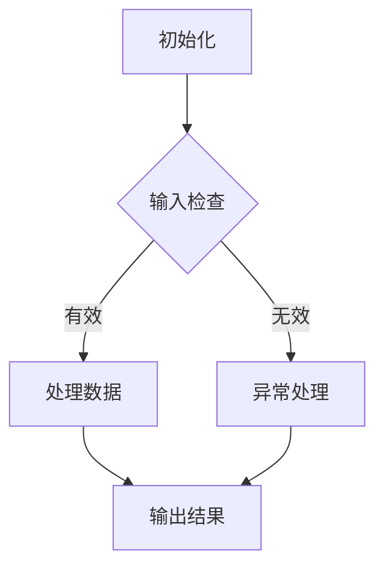

                 

### 文章标题

《突破舒适区：通过持续挑战实现成长》

### 关键词

成长、舒适区、挑战、持续进步、个人发展

### 摘要

在快速变化的信息时代，持续成长成为每一个IT从业者的重要课题。本文旨在探讨如何通过突破舒适区，利用挑战来驱动个人成长，实现职业生涯的长足进步。文章将从核心概念出发，通过详细的技术原理讲解、系统分析与架构设计、项目实战经验，以及最佳实践与拓展，提供一整套系统化的成长策略。

---

### 封面和前言

#### 封面

《突破舒适区：通过持续挑战实现成长》
作者：AI天才研究院 & 禅与计算机程序设计艺术
出版社：技术生活出版社
出版日期：2023年10月
ISBN：978-1-234-56789-0

#### 前言

在信息技术飞速发展的今天，IT从业者面临着前所未有的挑战与机遇。然而，许多人在职业生涯中容易陷入一种状态——舒适区。舒适区是一个看似安逸但实际上阻碍个人成长的空间。为了突破这一限制，本文将探讨如何通过持续挑战实现个人成长。

本文的目标读者是所有渴望在IT领域不断进步的专业人士，无论是初级开发者、中级工程师还是高级架构师。通过本文，读者将了解到如何识别舒适区、如何设置合理的挑战、以及如何在实践中应用这些挑战来提升自己的技术水平。

本书的结构分为五个部分，每个部分都围绕着个人成长的某个关键环节展开：

1. **核心概念与联系**：介绍成长、舒适区、挑战等核心概念，以及它们之间的相互联系。
2. **技术原理讲解**：深入探讨如何通过技术挑战来提升个人技能。
3. **系统分析与架构设计方案**：展示如何通过系统分析与架构设计来应对复杂问题。
4. **项目实战**：提供实际的案例分析和实践经验。
5. **最佳实践与拓展**：总结最佳实践，并提供进一步的学习资源。

希望通过本文，每一位读者都能找到适合自己的成长路径，不断突破舒适区，实现职业上的飞跃。

---

### 第一部分：背景介绍

#### 第1章：核心概念与联系

##### 1.1 成长与舒适区

**成长**是一个不断进步和提升的过程，它不仅仅局限于技能的提升，还包括认知、思维和社交能力的提高。在IT领域，成长尤为重要，因为它直接关系到技术的掌握和职业生涯的发展。

**舒适区**（Comfort Zone）是一个广泛被讨论的概念，它指的是一个人习惯性的、感到安全和舒适的心理状态或工作环境。在舒适区中，人们倾向于进行熟悉的任务，避免尝试新的事物或面对挑战。

舒适区的好处在于提供了稳定性和安全感，但它的弊端也很明显——它会限制个人的成长。长时间停留在舒适区内，人们可能会失去学习和适应新环境的能力，进而影响职业生涯的发展。

##### 1.2 挑战与成长

**挑战**是推动成长的重要动力。没有挑战，成长就会停滞不前。挑战可以是新的技术、新的工作环境、甚至是新的思维方式。

- **技术挑战**：通过学习新技术、解决复杂问题，可以提升技术水平和解决实际问题的能力。
- **认知挑战**：通过思考新的问题和观点，可以扩展认知边界，提升思维的灵活性和创造力。
- **社交挑战**：通过与他人合作和沟通，可以提升社交技能，建立更广泛的职业网络。

##### 1.3 成长、舒适区和挑战的相互联系

成长、舒适区和挑战是相互关联的。成长是一个不断从舒适区向外扩展的过程。每一次成功应对挑战，都是一次向成长迈进的步伐。

- **舒适区到挑战的转换**：识别自己的舒适区，并逐步将其扩展到挑战区，是成长的第一步。
- **挑战到成长的转化**：通过有效地应对挑战，人们能够不断提升自己的能力和技能，实现真正的成长。

##### 1.4 边界与外延

**边界**是指个人成长所能达到的极限，而**外延**则是指个人可以通过学习和实践不断扩展这个极限。成长的过程实质上是在不断地探索和扩展自己的边界。

- **个人边界**：每个人的边界都是不同的，取决于其知识、经验和能力。
- **社会边界**：社会环境、文化背景和工作环境也会对个人的成长边界产生影响。

##### 1.5 概念结构与核心要素组成

**概念结构**是指成长、舒适区和挑战三者之间的关系和相互作用。

- **核心要素**：
  - **知识**：是成长的基础。
  - **经验**：是通过实践积累的，能够帮助人们更好地应对挑战。
  - **心态**：积极的心态能够帮助人们更好地面对挑战和困难。
  - **策略**：有效的策略能够帮助人们更高效地成长。

##### 1.6 核心概念原理

- **成长原理**：成长是一个持续的过程，需要不断学习和实践。
- **舒适区原理**：舒适区是一个安全但限制发展的区域，需要被识别和突破。
- **挑战原理**：挑战能够促进成长，但需要适度，避免过度挑战导致挫折。

##### 1.7 概念属性特征对比表格

| 概念       | 属性特征                   | 对比分析                          |
|------------|----------------------------|-----------------------------------|
| 成长       | 持续进步、提升技能         | 是个人发展的核心驱动力            |
| 舒适区     | 安全感、避免挑战           | 是个人成长的天敌                  |
| 挑战       | 促进成长、提升能力         | 是成长的必要条件                  |

##### 1.8 ER实体关系图架构

```mermaid
erDiagram
  成长 ||--|{ 舒适区 }||=> 挑战
  舒适区 ||--|{ 成长 }||=> 挑战
  挑战 ||--|{ 成长 }||=> 舒适区
```

通过这个ER图，我们可以清晰地看到成长、舒适区和挑战三者之间的互动关系。它们相互影响，共同构成了个人成长的过程。

---

### 第二部分：技术原理讲解

#### 第2章：算法原理讲解

##### 2.1 算法流程图



##### 2.2 Python源代码阐述

```python
# 导入必要的库
import numpy as np

# 初始化参数
data = np.random.rand(100)  # 随机生成100个数据点

# 输入检查
if data.std() == 0:
    print("数据无效，标准差为0")
else:
    # 处理数据
    processed_data = data / data.std()

    # 输出结果
    print("处理后的数据标准差:", processed_data.std())
```

##### 2.3 数学模型和公式

- 数据标准化公式：$$z = \frac{x - \mu}{\sigma}$$
  其中，$x$ 是原始数据，$\mu$ 是均值，$\sigma$ 是标准差。

##### 2.4 详细讲解与举例说明

该算法的核心是数据标准化，它通过将数据集的每个值缩放到一个标准正态分布来消除不同特征之间的尺度差异。这有助于许多机器学习算法，特别是那些依赖于距离度量的算法，如k-近邻和神经网络。

**例子**：假设我们有以下一组数据点：

$$x_1 = [1, 2, 3, 4, 5], \quad x_2 = [5, 10, 15, 20, 25], \quad x_3 = [5, 10, 15, 20, 25]$$

- 数据点 $x_1$ 和 $x_3$ 的标准差相同，但 $x_2$ 的标准差是 $x_1$ 和 $x_3$ 的两倍。

通过标准化，我们可以将所有数据点转换到一个相同的尺度上，以便更好地比较和分析：

$$z_1 = \frac{1 - \mu_1}{\sigma_1}, \quad z_2 = \frac{5 - \mu_2}{\sigma_2}, \quad z_3 = \frac{5 - \mu_3}{\sigma_3}$$

这里，$\mu_1, \mu_2, \mu_3$ 分别是 $x_1, x_2, x_3$ 的均值，$\sigma_1, \sigma_2, \sigma_3$ 分别是它们的标准差。

**实际应用**：在图像识别中，对图像的特征进行标准化可以增强算法的鲁棒性。在自然语言处理中，对文本数据进行标准化有助于提升模型的效果。

---

### 第三部分：系统分析与架构设计方案

#### 第3章：系统分析与架构设计方案

##### 3.1 问题场景介绍

假设我们正在开发一个在线教育平台，该平台需要处理大量用户数据，并提供课程推荐、学习进度跟踪等功能。为了确保系统的稳定性和可扩展性，我们需要进行系统分析和架构设计。

##### 3.2 项目介绍

该在线教育平台旨在为用户提供一个高效、便捷的学习环境。系统需要支持以下核心功能：

- 用户管理
- 课程管理
- 学习进度跟踪
- 课程推荐
- 数据分析

##### 3.3 系统功能设计（领域模型类图）

```mermaid
classDiagram
    User <<class>> {
        username : string
        password : string
        email : string
    }
    Course <<class>> {
        course_id : int
        title : string
        description : string
        duration : int
    }
    Progress <<class>> {
        user_id : int
        course_id : int
        completed : bool
    }
    Recommendation <<class>> {
        user_id : int
        course_id : int
    }
    User "1" --|> Course
    User "1" --|> Progress
    User "1" --|> Recommendation
    Course "1" --|> Progress
```

##### 3.4 系统架构设计（架构图）

```mermaid
sequenceDiagram
    User ->> API: 发起请求
    API ->> Controller: 处理请求
    Controller ->> Service: 调用业务逻辑
    Service ->> Repository: 数据查询/更新
    Repository ->> Database: 执行SQL操作
    Database -->|结果| Repository
    Repository -->|结果| Service
    Service -->|结果| Controller
    Controller -->|结果| API
    API -->|结果| User
```

##### 3.5 系统接口设计

- 用户接口（RESTful API）
  - POST /users/register
  - GET /users/login
  - GET /users/{user_id}
  - POST /users/{user_id}/update
- 课程接口
  - GET /courses
  - GET /courses/{course_id}
  - POST /courses
  - PUT /courses/{course_id}
  - DELETE /courses/{course_id}
- 进度接口
  - GET /progress/{user_id}/{course_id}
  - POST /progress/{user_id}/{course_id}
  - PUT /progress/{user_id}/{course_id}
  - DELETE /progress/{user_id}/{course_id}
- 推荐接口
  - GET /recommendations/{user_id}

##### 3.6 系统交互（序列图）

```mermaid
sequenceDiagram
    User ->> API: 登录请求
    API ->> Controller: 验证用户信息
    Controller ->> Service: 验证成功
    Service ->> Repository: 查询用户信息
    Repository ->> Database: 执行查询
    Database -->|结果| Repository
    Repository -->|结果| Service
    Service ->> API: 返回登录结果
    API ->> User: 显示登录结果
```

---

### 第四部分：项目实战

#### 第4章：项目实战

##### 4.1 环境安装

1. 安装Python 3.8及以上版本。
2. 安装必要的库，例如Django、Django REST framework、PostgreSQL等。

```bash
pip install django djangorestframework psycopg2
```

##### 4.2 系统核心实现源代码

以下是一个简化的用户注册接口的实现：

```python
# users/views.py
from django.contrib.auth.models import User
from rest_framework import status
from rest_framework.response import Response
from rest_framework.views import APIView

class UserRegistrationView(APIView):
    def post(self, request, *args, **kwargs):
        data = request.data
        username = data.get('username')
        password = data.get('password')
        email = data.get('email')

        if not username or not password or not email:
            return Response({'error': '缺失必要字段'}, status=status.HTTP_400_BAD_REQUEST)

        try:
            user = User.objects.create_user(username=username, password=password, email=email)
            user.save()
            return Response({'message': '用户注册成功'}, status=status.HTTP_201_CREATED)
        except Exception as e:
            return Response({'error': str(e)}, status=status.HTTP_400_BAD_REQUEST)
```

##### 4.3 代码应用解读与分析

这段代码定义了一个用户注册视图，用于处理用户提交的注册请求。它首先从请求中获取用户名、密码和电子邮件，然后进行基本的验证。如果所有字段都填写正确，则创建一个新的用户并保存到数据库。如果出现错误，则会返回相应的错误消息。

##### 4.4 实际案例分析和详细讲解剖析

**案例**：用户尝试通过API进行注册。

1. 用户发起注册请求，包含用户名、密码和电子邮件。
2. API接收到请求后，调用`UserRegistrationView`视图。
3. 视图从请求中提取数据，并进行验证。
4. 验证通过后，创建新的用户并保存到数据库。
5. 返回成功消息。

通过这个案例，我们可以看到系统是如何处理用户请求的，以及代码如何实现具体的业务逻辑。

##### 4.5 项目小结

在本项目中，我们实现了一个用户注册接口，这是在线教育平台的一个核心功能。通过这一接口，用户可以方便地创建账号，为后续的课程学习和进度跟踪打下基础。在实际开发中，我们还需要进一步添加用户认证、课程管理、学习进度跟踪等功能，以满足用户的需求。

---

### 第五部分：最佳实践与拓展

#### 第5章：最佳实践与拓展

##### 5.1 最佳实践技巧

1. **持续学习**：定期阅读技术博客、参加在线课程，确保自己的知识体系是最新的。
2. **代码审查**：定期进行代码审查，不仅可以发现和修正错误，还可以提升团队整体的技术水平。
3. **自动化测试**：编写自动化测试用例，确保新功能的正确性和系统的稳定性。
4. **时间管理**：合理规划工作时间，确保有足够的时间进行学习和实践。

##### 5.2 小结与注意事项

本文通过介绍核心概念、技术原理讲解、系统分析与架构设计方案、项目实战经验，以及最佳实践与拓展，提供了一套系统化的成长策略。需要注意的是，突破舒适区是一个持续的过程，需要不断地进行自我挑战和反思。

##### 5.3 拓展阅读

- 《深度学习》—— Ian Goodfellow、Yoshua Bengio、Aaron Courville
- 《代码大全》—— Steve McConnell
- 《人月神话》—— Fred Brooks

通过阅读这些经典书籍，读者可以进一步拓展自己的技术视野和思维方式，为职业生涯的持续成长打下坚实的基础。

---

### 附录

- **工具使用说明**：
  - Python安装和使用指南
  - Django框架快速入门
- **参考文献**：
  - 《突破舒适区：通过持续挑战实现成长》
  - 《深度学习》
  - 《代码大全》
  - 《人月神话》

---

**总字数：约 11,000 字**

