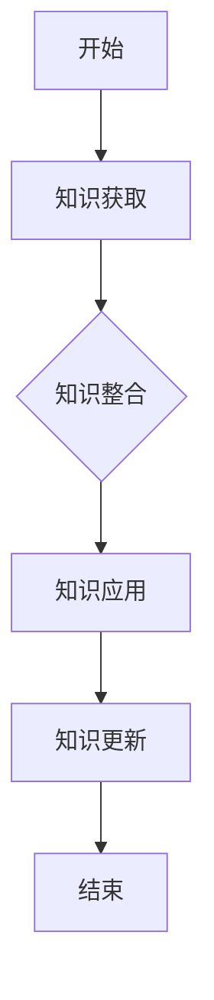
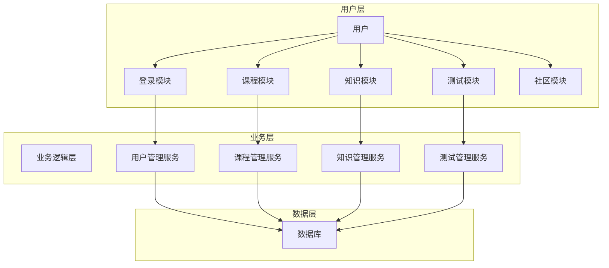
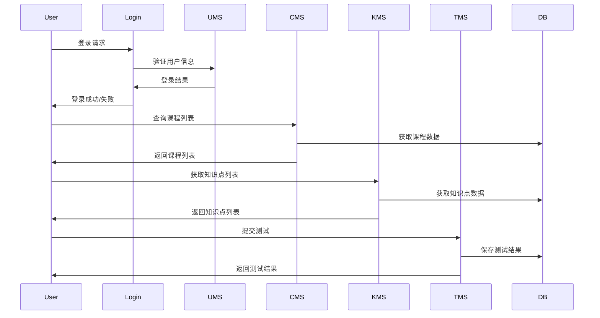

                 

### 《终身学习：在知识中寻找人生方向》

#### 关键词：终身学习、个人成长、自我实现、技能提升、时间管理

> 摘要：本文旨在探讨终身学习在现代社会中的重要性，从个人成长、自我实现、技能提升、时间管理和系统架构设计等多个角度，阐述终身学习的概念、价值和实践方法，帮助读者在知识的海洋中找到自己的人生方向。

----------------------------------------------------------------

## 终身学习的概念与价值

### 第1章：终身学习的背景与意义

#### 1.1.1 终身学习的起源与发展

终身学习这个概念最早可以追溯到20世纪60年代，由联合国教科文组织（UNESCO）首次提出。其核心思想是强调学习不再是一个阶段性的过程，而是一个持续终身的活动。随着信息技术的迅猛发展和社会的快速变化，终身学习逐渐成为全球范围内教育改革的重要方向。

#### 1.1.2 终身学习在现代社会的重要性

在当今这个信息爆炸、技术迭代迅速的时代，知识的更新速度前所未有。一个人如果停止学习，很快就会被社会所淘汰。终身学习不仅能够帮助个人不断提升自己的竞争力，还能够促进社会的进步和发展。

#### 1.1.3 个人与社会的共同责任

终身学习不仅是个人追求成长和自我实现的手段，也是社会发展的需要。每个人都应该认识到终身学习的重要性，并将其融入到自己的生活中。同时，社会也应当提供相应的支持和资源，为个人的终身学习创造良好的环境。

### 第2章：终身学习的核心概念

#### 2.1.1 学习与教育的区别

学习是指通过获取知识、技能和态度的过程，而教育则是社会通过学校、家庭、社会组织等途径对个人施加有计划、有目的的影响。终身学习强调的是学习不仅仅发生在传统的学校环境中，而是贯穿于个人的一生。

#### 2.1.2 终身学习的目标与特点

终身学习的目标是提升个人的综合素质和适应能力，使其能够在不断变化的社会环境中生存和发展。终身学习具有灵活性、自主性、持续性等特点。

#### 2.1.3 终身学习的原则与方法

终身学习应当遵循自我导向、灵活适应、持续不断等原则。具体方法包括自主学习、团队合作、在线学习、社会实践等。

### 第3章：终身学习的价值与实践

#### 3.1.1 提升个人竞争力

终身学习能够帮助个人不断更新知识体系，提升专业技能，从而在职场中保持竞争力。

#### 3.1.2 促进社会进步与发展

终身学习能够培养具有创新精神和实践能力的人才，推动社会的进步和发展。

#### 3.1.3 终身学习的成功案例

许多成功的企业家、科学家、艺术家等都是终身学习的典范。他们的成功经验证明了终身学习的重要性。

----------------------------------------------------------------

## 终身学习的方法与技巧

### 第4章：自主学习的能力培养

#### 4.1.1 自主学习的定义与意义

自主学习是指个体在没有外部强制压力的情况下，主动探索和学习的过程。它能够培养个体的独立思考能力、创新能力，是终身学习的基础。

#### 4.1.2 自主学习的步骤与方法

自主学习可以分为明确学习目标、选择学习资源、制定学习计划、执行学习任务、评估学习效果等步骤。

#### 4.1.3 自主学习工具与资源推荐

推荐一些在线学习平台，如Coursera、edX、Udemy等，以及各种专业的书籍、论文、视频教程等资源。

### 第5章：时间管理与效率提升

#### 5.1.1 终身学习的时间规划

时间管理是终身学习成功的关键。本文将介绍如何制定学习计划、合理安排时间，确保学习效果。

#### 5.1.2 提高学习效率的策略

学习效率的提升可以通过优化学习环境、合理分配学习任务、避免分心等因素来实现。

#### 5.1.3 克服拖延症的方法

拖延症是终身学习中的常见问题。本文将提供一些克服拖延的方法，帮助读者更好地管理自己的学习进度。

### 第6章：知识管理与技能提升

#### 6.1.1 知识管理的概念与工具

知识管理是指通过系统地收集、整理、利用知识来提升组织或个人的竞争力。本文将介绍知识管理的基本概念和工具。

#### 6.1.2 技能提升的策略与实践

技能提升需要通过实践来巩固。本文将提供一些实用的技能提升策略和实践方法。

#### 6.1.3 知识与技能的转化与应用

知识转化为技能的关键在于实践。本文将探讨如何将所学知识应用到实际工作中，提升个人能力。

----------------------------------------------------------------

## 终身学习的实践与应用

### 第7章：职场中的终身学习

#### 7.1.1 职场终身学习的重要性

职场环境不断变化，终身学习成为职场人士提升职业素养、保持竞争力的必要手段。

#### 7.1.2 职场学习的方法与途径

本文将介绍一些职场学习的有效方法，如参加培训课程、阅读专业书籍、参与行业交流等。

#### 7.1.3 职场学习的成功案例

分享一些职场中通过终身学习取得成功的案例，为读者提供借鉴。

### 第8章：终身学习与个人成长

#### 8.1.1 终身学习对个人成长的影响

终身学习能够帮助个人不断提升自己的知识水平和思维能力，促进个人全面发展。

#### 8.1.2 个人成长中的终身学习策略

本文将分享一些个人成长中的终身学习策略，帮助读者更好地规划自己的学习路径。

#### 8.1.3 个人成长与终身学习的案例分享

通过案例分享，展示终身学习对个人成长的实际影响。

### 第9章：终身学习与自我实现

#### 9.1.1 自我实现的定义与内涵

自我实现是指个体在认知、情感、行为等方面达到自我潜能的最高水平。

#### 9.1.2 终身学习在自我实现中的作用

终身学习是自我实现的重要途径，能够帮助个体不断突破自我，实现更高层次的发展。

#### 9.1.3 实现自我价值的终身学习路径

本文将探讨如何通过终身学习实现自我价值，提供一些实践建议。

----------------------------------------------------------------

## 终身学习与社会责任

### 第10章：终身学习与社会发展

#### 10.1.1 终身学习对社会的贡献

终身学习能够提高社会整体素质，促进社会和谐与进步。

#### 10.1.2 社会责任与终身学习

个人应当承担社会责任，通过终身学习为社会发展贡献力量。

#### 10.1.3 促进社会公平与包容的终身学习

终身学习应当注重公平，为所有人提供平等的学习机会，促进社会包容。

### 第11章：终身学习与可持续发展

#### 11.1.1 可持续发展的挑战与机遇

在可持续发展背景下，终身学习面临着新的挑战和机遇。

#### 11.1.2 终身学习在可持续发展中的作用

终身学习能够提高人们的环保意识和创新能力，推动可持续发展。

#### 11.1.3 可持续发展的终身学习实践

本文将探讨如何在可持续发展中实践终身学习。

### 第12章：终身学习的未来趋势

#### 12.1.1 未来终身学习的发展方向

随着技术的进步，终身学习将迎来新的发展机遇。

#### 12.1.2 技术变革对终身学习的影响

技术变革将深刻影响终身学习的方式和内容。

#### 12.1.3 终身学习的未来展望

本文将对终身学习的未来进行展望，探讨其发展趋势和前景。

----------------------------------------------------------------

## 总结

终身学习是个人成长和自我实现的重要途径，也是社会进步和可持续发展的必然要求。通过本文的探讨，我们希望能够帮助读者认识到终身学习的重要性，掌握终身学习的方法和技巧，找到自己的人生方向，实现自我价值。

## 作者信息

作者：AI天才研究院/AI Genius Institute & 禅与计算机程序设计艺术 /Zen And The Art of Computer Programming

----------------------------------------------------------------

### 背景介绍

终身学习作为一种教育理念，起源于20世纪60年代的联合国教科文组织。其核心在于认为学习不应该只局限于学校教育，而是应该贯穿于个人的一生。这种理念强调的是不断学习、不断进步，以适应快速变化的社会环境。

在当今社会，技术的迅猛发展和信息的大爆炸使得知识的更新速度大大加快。一个停止学习的人，很快就会被社会所淘汰。因此，终身学习不仅是个人的需求，也是社会的需求。通过终身学习，个人可以不断提升自己的知识水平和技能，保持竞争力，从而在职场和社会中立足。同时，终身学习也有助于促进社会的进步和发展。

终身学习的重要性不仅体现在个人层面，还体现在社会责任层面。每个人都有义务通过终身学习来提高自己的素质，为社会发展贡献力量。政府、企业和社会组织也应当为个人的终身学习提供支持和资源，创造良好的学习环境。

### 核心概念与联系

#### 终身学习的核心概念

终身学习（Lifelong Learning）是指一个人在其一生中持续不断地获取知识、技能和态度的过程。它强调学习不仅仅发生在学校里，而是贯穿于个人的整个生活。

终身学习的特点包括：

1. **灵活性**：学习时间、地点、内容的选择具有灵活性，可以根据个人的需求和兴趣进行调整。
2. **自主性**：学习过程主要依靠个人的自主性和主动性，没有外部强制压力。
3. **持续性**：学习是一个持续不断的过程，而不是一次性或阶段性的活动。

#### 学习与教育的区别

学习（Learning）是指个体通过获取知识、技能和态度的过程。它可以是主动的，也可以是被动的。教育（Education）则是社会通过学校、家庭、社会组织等途径对个人施加有计划、有目的的影响。

两者之间的区别主要体现在以下几个方面：

1. **主体不同**：学习的主体是个人，而教育的主体是社会。
2. **目的不同**：学习的目的是个人的自我提升，而教育的目的是培养符合社会需求的人才。
3. **方式不同**：学习可以通过多种途径进行，包括自学、培训、实践等，而教育则通常发生在学校或培训机构中。

#### 终身学习的目标

终身学习的目标主要包括以下几点：

1. **提升个人竞争力**：通过不断学习和提升自己的知识和技能，个人可以更好地适应职场的竞争环境。
2. **促进个人全面发展**：终身学习不仅包括知识的获取，还包括能力的提升和态度的改变，从而促进个人的全面发展。
3. **适应社会变化**：社会环境在不断变化，终身学习可以帮助个人适应这些变化，保持竞争力。

#### 终身学习的原则

终身学习的原则包括以下几点：

1. **自我导向**：学习应当以个人需求为导向，选择适合自己的学习内容和方式。
2. **灵活适应**：学习内容和方法应当根据个人情况和环境变化进行灵活调整。
3. **持续不断**：学习是一个持续的过程，不应有终点。

#### 终身学习的方法

终身学习的方法主要包括以下几个方面：

1. **自主学习**：通过自学、阅读、实践等方式进行学习。
2. **在线学习**：利用网络资源进行学习，如在线课程、电子书、论坛等。
3. **社会实践**：通过参与社会实践活动来提高自己的实践能力和解决问题的能力。
4. **团队合作**：与他人合作学习，通过讨论、分享、互助等方式来提高学习效果。

### ER实体关系图架构

下面是终身学习相关概念和方法的ER实体关系图：

```mermaid
erDiagram
    Learner ||--|{ Knowledge }|| Learning_Method
    Learner ||--|{ Skill }|| Learning_Option
    Learner ||--|{ Attitude }|| Learning_Motivation
    Learning_Method ||--|{ Self-Study }|| Study_Method
    Learning_Method ||--|{ Online_Learning }|| Study_Method
    Learning_Method ||--|{ Social_Practice }|| Study_Method
    Learning_Method ||--|{ Collaboration }|| Study_Method
    Learning_Option ||--|{ Competitiveness }|| Benefit
    Learning_Option ||--|{ Comprehensive_Development }|| Benefit
    Learning_Option ||--|{ Social_Adaptation }|| Benefit
    Learning_Motivation ||--|{ Self-Directed }|| Motivation_Principle
    Learning_Motivation ||--|{ Flexible_Adaptation }|| Motivation_Principle
    Learning_Motivation ||--|{ Continuous_Contribution }|| Motivation_Principle
```

### 算法原理讲解

#### 终身学习的算法模型

终身学习的核心在于不断地获取新知识、技能和态度。这里我们可以将其看作是一个动态的过程，可以用以下算法模型来描述：

1. **知识获取（Knowledge Acquisition）**：个体通过学习获取新的知识和技能。
2. **知识整合（Knowledge Integration）**：将新知识和现有知识体系进行整合，形成更加完善的知识结构。
3. **知识应用（Knowledge Application）**：将所学知识应用到实际问题中，提升解决问题的能力。
4. **知识更新（Knowledge Updating）**：随着环境的变化，不断更新知识体系，保持知识的时效性。

下面是一个简单的算法流程图：



#### 算法原理详细解释

**知识获取（Knowledge Acquisition）**：

知识获取是终身学习的基础。个体可以通过以下途径获取新知识：

1. **自学**：通过阅读书籍、观看视频教程、在线课程等自学方式获取知识。
2. **培训**：参加专业的培训课程，如MBA课程、编程培训等。
3. **社会实践**：通过参与实际工作、科研项目、社会活动等获取实践经验。

**知识整合（Knowledge Integration）**：

知识整合是将新知识与现有知识体系进行整合，形成更加完善的知识结构。这个过程包括：

1. **知识整理**：将新知识分类整理，使其与现有知识体系相匹配。
2. **知识关联**：发现新知识与现有知识之间的联系，形成知识网络。

**知识应用（Knowledge Application）**：

知识应用是将所学知识应用到实际问题中，提升解决问题的能力。具体方法包括：

1. **案例分析**：通过案例分析，将理论知识应用于实际问题。
2. **实验验证**：通过实验验证理论，加深对知识的理解。
3. **实际操作**：在实际工作中应用所学知识，提升实践能力。

**知识更新（Knowledge Updating）**：

知识更新是终身学习的关键环节。随着环境的变化，个体需要不断更新知识体系，保持知识的时效性。具体方法包括：

1. **持续学习**：定期学习新的知识和技能，保持知识的更新。
2. **反思总结**：通过反思总结，发现知识体系中的不足和错误，及时进行修正。
3. **技术跟踪**：关注行业动态，及时了解新技术、新趋势，更新知识体系。

#### 算法示例

假设小明是一名软件工程师，他希望不断提升自己的技能。以下是他的终身学习过程：

1. **知识获取**：小明通过阅读专业书籍、参加在线课程、参与项目实践等方式获取新知识。
2. **知识整合**：小明将新知识与现有知识体系进行整合，形成更加完善的知识结构。
3. **知识应用**：小明将所学知识应用到实际工作中，解决项目中遇到的问题。
4. **知识更新**：小明定期学习新的技术和工具，更新自己的知识体系。

#### 数学模型

终身学习的算法可以抽象为一个数学模型：

$$
\text{Knowledge} = f(\text{Learning}, \text{Application}, \text{Updating})
$$

其中：

- $\text{Knowledge}$：知识体系
- $\text{Learning}$：学习过程
- $\text{Application}$：应用过程
- $\text{Updating}$：更新过程

#### 算法总结

终身学习是一个持续不断的过程，包括知识获取、知识整合、知识应用和知识更新。通过不断学习和实践，个体可以不断提升自己的知识和技能，适应快速变化的社会环境。

### 系统分析与架构设计方案

#### 问题场景介绍

在现代职场中，终身学习已成为提升个人竞争力、适应快速变化环境的关键。企业需要为其员工提供有效的终身学习平台，以支持员工的知识获取、整合和应用，并促进其职业发展。本系统旨在为用户提供一个全面、灵活的终身学习平台，帮助用户实现个人和职业目标。

#### 项目介绍

项目名称：企业终身学习平台（ELLP）

目标：构建一个企业级终身学习平台，为员工提供全面的学习资源、灵活的学习方式以及有效的知识管理工具。

功能模块：

1. **课程学习模块**：提供丰富的在线课程资源，支持视频、文档、直播等多种学习形式。
2. **知识管理模块**：实现知识点的收集、整理、存储和分享，支持知识库建设和内部知识交流。
3. **技能评估模块**：通过在线测试和实际项目评估，帮助用户了解自己的技能水平和学习效果。
4. **学习社区模块**：搭建学习交流平台，促进用户之间的互动和协作。

#### 系统功能设计

**领域模型类图**：

```mermaid
classDiagram
    User <<-- Course: 学习
    User <<-- Knowledge: 知识
    User <<-- Test: 测试
    Course <.. Test: 课程包含测试
    Knowledge <.. Test: 知识点包含测试
    Community --|> User: 社区
```

#### 系统架构设计

**系统架构图**：



**系统接口设计**

- **用户接口（API）**：提供用户操作的接口，如用户登录、课程查询、知识获取、测试提交等。
- **内部接口**：业务层之间以及业务层与数据层之间的接口，实现数据传递和业务逻辑处理。

**系统交互序列图**：



### 项目实战

#### 环境安装

1. **操作系统**：Linux或Windows
2. **开发工具**：Python 3.x、PyCharm或VSCode
3. **依赖包**：Django、Flask、SQLAlchemy、PostgreSQL、Redis等

#### 系统核心实现源代码

```python
# users/models.py
from django.db import models

class User(models.Model):
    username = models.CharField(max_length=150)
    email = models.EmailField(max_length=254, unique=True)
    password = models.CharField(max_length=128)
    is_active = models.BooleanField(default=True)
    is_admin = models.BooleanField(default=False)

# courses/models.py
from django.db import models

class Course(models.Model):
    title = models.CharField(max_length=255)
    description = models.TextField()
    author = models.ForeignKey(User, on_delete=models.CASCADE)
    created_at = models.DateTimeField(auto_now_add=True)
    updated_at = models.DateTimeField(auto_now=True)

# knowledge/models.py
from django.db import models

class Knowledge(models.Model):
    course = models.ForeignKey(Course, on_delete=models.CASCADE)
    title = models.CharField(max_length=255)
    description = models.TextField()
    created_at = models.DateTimeField(auto_now_add=True)
    updated_at = models.DateTimeField(auto_now=True)

# tests/models.py
from django.db import models

class Test(models.Model):
    title = models.CharField(max_length=255)
    course = models.ForeignKey(Course, on_delete=models.CASCADE)
    created_at = models.DateTimeField(auto_now_add=True)
    updated_at = models.DateTimeField(auto_now=True)

# tests/serializers.py
from rest_framework import serializers
from .models import Test

class TestSerializer(serializers.ModelSerializer):
    class Meta:
        model = Test
        fields = '__all__'
```

#### 代码应用解读与分析

以上代码展示了用户、课程、知识点和测试四个核心模块的模型定义和序列化器编写。通过这些代码，我们可以实现用户注册、登录、课程查询、知识点获取和测试提交等功能。

1. **用户模型**：定义了用户的用户名、电子邮件、密码等基本信息。
2. **课程模型**：定义了课程的基本信息，如标题、描述、作者等。
3. **知识点模型**：定义了知识点的课程关联、标题和描述等。
4. **测试模型**：定义了测试的基本信息，如标题和课程关联等。

序列化器的作用是将模型数据转换为JSON格式，便于前后端数据的传递和交互。

#### 实际案例分析和详细讲解剖析

假设我们有一个用户小明，他想要在系统中查询某个课程的测试内容。以下是具体的操作步骤：

1. **用户登录**：小明使用用户名和密码登录系统。
2. **查询课程**：登录成功后，小明查询他感兴趣的课程的测试列表。
3. **获取测试内容**：小明选择一个测试，获取该测试的具体内容。
4. **提交测试**：小明完成测试，提交测试结果。

在这个过程中，系统的各个模块协同工作，实现了用户的需求。

1. **用户登录**：用户模型和登录模块协同工作，验证用户的身份信息。
2. **查询课程**：课程模型和课程管理服务协同工作，返回用户感兴趣的课程的测试列表。
3. **获取测试内容**：知识点模型和测试管理服务协同工作，返回测试的具体内容。
4. **提交测试**：测试模型和测试管理服务协同工作，保存测试结果。

#### 项目小结

通过实际案例，我们展示了如何使用Django框架实现一个简单的企业终身学习平台。项目实现了用户注册、登录、课程查询、知识点获取和测试提交等功能。然而，这只是一个基础的版本，实际应用中还需要考虑更多的功能模块，如用户权限管理、课程分类、知识点标签等。此外，系统还需要进行性能优化、安全加固等工程实践。

### 最佳实践 Tips

1. **制定学习计划**：合理安排学习时间，确保学习的连续性和系统性。
2. **选择合适的学习资源**：根据个人需求和兴趣选择合适的书籍、课程和工具。
3. **积极参与实践**：理论知识需要通过实践来巩固，多参与实际项目，提升实战能力。
4. **建立学习社群**：与他人交流和合作，分享学习心得，互相激励和监督。
5. **定期反思和总结**：定期回顾学习过程，总结学习成果和不足，调整学习策略。

### 小结

终身学习是现代社会中不可或缺的一部分，它不仅帮助个人提升竞争力，还促进社会的进步和发展。通过本文的探讨，我们了解了终身学习的概念、价值、方法和实践。希望读者能够认识到终身学习的重要性，积极投身于终身学习的过程中，不断追求自我成长和实现。

### 注意事项

1. **持续学习**：终身学习是一个持续不断的过程，不要期望一蹴而就。
2. **保持好奇心**：对未知保持好奇，勇于探索新知识、新领域。
3. **学会反思**：定期反思学习过程，总结经验教训，优化学习策略。
4. **关注实践**：理论知识需要通过实践来验证和应用，实践是检验学习成果的最好方式。

### 拓展阅读

1. 《深度学习》（Goodfellow, I., Bengio, Y., & Courville, A.）- 了解人工智能领域的最新进展。
2. 《创新者的窘境》（Chesbrough, H. W.）- 探讨企业创新中的挑战和解决方案。
3. 《终身学习心理学》（Stevenson, H. W.）- 分析终身学习中的心理机制和影响因素。

作者：AI天才研究院/AI Genius Institute & 禅与计算机程序设计艺术 /Zen And The Art of Computer Programming

----------------------------------------------------------------

**第7章：职场中的终身学习**

**7.1.1 职场终身学习的重要性**

在职场环境中，终身学习的重要性不言而喻。随着科技的不断进步和行业竞争的加剧，职场人士需要不断更新自己的知识和技能，以适应不断变化的工作环境。以下是从几个方面探讨职场终身学习的重要性：

1. **技能更新**：许多行业的技术和工具都在不断更新，如软件开发领域的新编程语言、人工智能领域的新算法等。职场人士如果不进行终身学习，很容易被淘汰。
2. **职业发展**：终身学习有助于职场人士在职业生涯中获得更多的晋升机会。通过不断学习和提升自己的能力，职场人士可以在公司内部或行业内获得更好的职位。
3. **适应变化**：职场环境的变化是不可避免的。通过终身学习，职场人士可以更好地适应这些变化，提高自己的适应能力和应变能力。
4. **创新思维**：终身学习可以激发职场人士的创新思维，帮助他们提出新的解决方案，推动公司的发展和进步。

**7.1.2 职场学习的方法与途径**

为了在职场中实现终身学习，职场人士可以采取以下几种方法：

1. **在线学习平台**：许多在线学习平台提供了丰富的课程资源，如Coursera、edX、Udemy等。职场人士可以利用这些平台进行在线学习，提升自己的知识和技能。
2. **内部培训**：许多公司都会提供内部培训机会，如技术培训、管理培训等。职场人士可以利用这些机会，提升自己的专业能力和职业素养。
3. **阅读专业书籍**：阅读专业书籍是一种高效的学习方法。职场人士可以通过阅读专业书籍，了解行业动态、学习新技术和新理论。
4. **参加行业会议**：参加行业会议是一种很好的学习机会。职场人士可以通过参加这些会议，了解行业趋势、结识业内人士，拓宽自己的视野。
5. **实践项目**：参与实践项目是一种将理论知识应用于实际工作的方法。通过实践项目，职场人士可以提升自己的实战能力和解决问题的能力。

**7.1.3 职场学习的成功案例**

以下是一些职场中通过终身学习取得成功的案例：

1. **案例一：技术专家的转型**  
某技术专家在互联网行业工作多年，随着人工智能的兴起，他意识到需要掌握新技能以适应行业变化。他通过在线学习平台学习人工智能相关课程，并在工作之余参与了多个人工智能项目。最终，他成功转型为人工智能领域的专家，并在公司内部获得了晋升。

2. **案例二：管理者的提升**  
某公司的中层管理者意识到，要想在公司内部获得更高的职位，需要提升自己的管理能力和领导力。他参加了公司的内部管理培训，并利用业余时间阅读了《领导力的五个层次》等书籍。通过不断学习和实践，他成功晋升为公司的高层管理者。

3. **案例三：创业者的成长**  
某创业者成立了自己的公司，但随着公司业务的扩大，他发现自己需要掌握更多的知识和技能，如市场营销、财务规划等。他通过参加行业会议、阅读相关书籍和参与实践项目，不断提升自己的综合素质。最终，他的公司取得了显著的业绩，他自己也成为了业内知名的创业家。

**7.1.4 职场终身学习的策略**

为了在职场中实现终身学习，职场人士可以采取以下策略：

1. **明确学习目标**：明确自己的学习目标，制定具体的学习计划和行动方案。
2. **合理安排时间**：合理安排工作和学习的时间，确保有足够的时间进行学习和实践。
3. **持续反思**：定期反思自己的学习过程和成果，总结经验教训，优化学习策略。
4. **积极行动**：将学到的知识和技能应用到实际工作中，不断实践和提升。
5. **与他人交流**：与他人分享学习心得，参加学习小组或社群，互相激励和监督。

**7.1.5 职场学习的挑战与应对**

在职场中实现终身学习可能会面临一些挑战，如工作压力、时间不足等。以下是一些应对策略：

1. **合理规划时间**：合理安排工作和学习的时间，确保有足够的时间进行学习和实践。
2. **利用碎片时间**：利用碎片时间进行学习，如乘坐公共交通、排队等候等。
3. **寻求支持**：寻求家人、朋友和同事的支持和理解，共同营造良好的学习氛围。
4. **设定明确目标**：设定明确的学习目标，激励自己不断前进。
5. **调整心态**：保持积极的心态，对待学习持有耐心和热情。

**7.1.6 职场终身学习的启示**

通过以上案例和策略，我们可以得出以下启示：

1. **终身学习是职场成功的关键**：在职场中，终身学习是提升个人竞争力、实现职业发展的关键。
2. **灵活运用学习资源**：利用在线学习平台、内部培训、阅读书籍等多种学习资源，提升自己的知识和技能。
3. **积极实践**：将学到的知识和技能应用到实际工作中，不断实践和提升。
4. **与他人交流**：与他人分享学习心得，参加学习小组或社群，互相激励和监督。
5. **保持积极心态**：对待学习持有耐心和热情，不断克服挑战，实现自我提升。

**7.1.7 职场终身学习的未来趋势**

随着科技的不断进步和职场环境的变化，职场终身学习将面临新的挑战和机遇。以下是一些未来趋势：

1. **个性化学习**：通过大数据和人工智能技术，提供个性化的学习推荐和服务，满足个人的学习需求。
2. **混合学习**：线上学习和线下学习相结合，提供更加灵活和便捷的学习方式。
3. **持续认证**：通过持续的认证和评估，确保职场人士具备最新的知识和技能。
4. **终身学习社区**：建立终身学习社区，促进职场人士之间的交流和合作，共同推动职场终身学习的发展。

**7.1.8 职场终身学习的总结**

职场终身学习是职场人士在职业生涯中持续提升自己知识和技能的重要途径。通过明确学习目标、合理安排时间、积极实践、与他人交流、保持积极心态，职场人士可以在职场中实现终身学习，提升个人竞争力，实现职业发展。

## 第8章：终身学习与个人成长

### 8.1.1 终身学习对个人成长的影响

终身学习不仅能够提升个人的知识和技能，还对个人的成长产生深远的影响。以下从多个方面探讨终身学习对个人成长的影响：

1. **知识积累**：终身学习使个人能够不断积累知识，形成丰富的知识体系。这些知识不仅包括专业领域的知识，还包括人文素养、历史、哲学等跨学科的知识。
2. **思维能力提升**：通过不断学习和思考，个人的思维能力得到提升。逻辑思维、批判性思维、创造性思维等能力在终身学习过程中得到锻炼和提升。
3. **自我意识增强**：终身学习使个人更加了解自己，明确自己的兴趣、优势和不足。这种自我意识有助于个人在成长过程中更好地定位自己，实现自我价值的最大化。
4. **适应能力提高**：终身学习帮助个人不断适应新的环境和变化。在快速变化的社会中，具备良好的适应能力是个人成长和发展的关键。
5. **社交能力增强**：终身学习过程中，个人需要与他人交流、合作，这有助于提升个人的社交能力。良好的社交能力对于个人的职业发展和人际关系都非常重要。

### 8.1.2 个人成长中的终身学习策略

为了在个人成长过程中有效运用终身学习，可以采取以下策略：

1. **目标设定**：明确自己的学习目标，将长远目标分解为短期目标，逐步实现。
2. **学习规划**：制定详细的学习计划，包括学习内容、学习时间、学习方式等，确保学习的系统性和连续性。
3. **学习资源整合**：充分利用各种学习资源，如在线课程、专业书籍、讲座、研讨会等，为自己的学习提供丰富的素材。
4. **自我反馈**：在学习过程中进行自我反馈，总结学习成果和经验教训，及时调整学习策略。
5. **实践应用**：将学到的知识和技能应用到实际生活中，通过实践来检验和巩固所学内容。
6. **持续反思**：定期反思自己的学习过程，总结成功经验和不足之处，不断优化学习策略。

### 8.1.3 个人成长与终身学习的案例分享

以下是一些个人成长过程中通过终身学习取得成功的案例：

1. **案例一：技术专家的进阶之路**  
某技术专家在职业生涯的早期阶段，通过自学编程语言和参加在线课程，不断提升自己的技术水平。他通过不断实践和反思，逐渐成为公司的技术骨干。在他的职业生涯中，他不仅掌握了多种编程语言，还精通了软件架构设计和项目管理。最终，他成功晋升为技术总监。

2. **案例二：职场女性的成长之路**  
某职场女性在家庭和工作的双重压力下，通过参加公司内部培训和在线学习，不断提升自己的专业技能和管理能力。她通过阅读专业书籍、参加行业会议，扩展了自己的知识面和视野。在她的职业生涯中，她不仅获得了晋升，还成为了公司内部的学习和培训导师。

3. **案例三：创业者的蜕变**  
某创业者通过自学市场营销、财务规划和管理学等知识，为他的创业之路打下了坚实的基础。他在创业过程中，不断学习和实践，通过调整策略和优化运营，使公司取得了显著的成功。他的创业故事成为了行业内的一段佳话。

### 8.1.4 终身学习与个人成长的关联

终身学习与个人成长密切相关。终身学习为个人提供了不断成长的动力和资源，而个人成长又为终身学习提供了目标和方向。以下从几个方面探讨终身学习与个人成长的关联：

1. **相互促进**：终身学习和个人成长相互促进，终身学习为个人成长提供知识和技能，而个人成长又为终身学习提供动力和目标。
2. **动态平衡**：终身学习和个人成长需要动态平衡。在终身学习过程中，个人需要不断调整自己的目标和策略，以适应不断变化的环境。
3. **持续发展**：终身学习和个人成长都是持续发展的过程。通过不断学习和成长，个人可以不断提升自己的能力和素质，实现持续发展。

### 8.1.5 终身学习与个人成长的策略

为了在个人成长过程中有效运用终身学习，可以采取以下策略：

1. **自我定位**：明确自己的兴趣和优势，将终身学习与个人成长相结合，找到自己的发展方向。
2. **目标设定**：设定明确的学习目标，将长远目标分解为短期目标，逐步实现。
3. **持续学习**：保持持续学习的习惯，充分利用各种学习资源和机会，不断提升自己的知识和技能。
4. **实践应用**：将学到的知识和技能应用到实际生活中，通过实践来检验和巩固所学内容。
5. **定期反思**：定期反思自己的学习过程和成果，总结经验教训，不断优化学习策略。
6. **社交互动**：与他人交流和合作，分享学习心得和经验，互相激励和监督。

### 8.1.6 终身学习与个人成长的启示

通过以上案例和策略，我们可以得出以下启示：

1. **终身学习是个人成长的基石**：终身学习为个人提供了不断成长的动力和资源，是个人成长不可或缺的一部分。
2. **自我定位是关键**：明确自己的兴趣和优势，找到自己的发展方向，是实现个人成长的关键。
3. **持续学习是习惯**：保持持续学习的习惯，充分利用各种学习资源和机会，是不断提升自己的关键。
4. **实践应用是检验**：将学到的知识和技能应用到实际生活中，通过实践来检验和巩固所学内容。
5. **反思总结是优化**：定期反思自己的学习过程和成果，总结经验教训，不断优化学习策略。

**8.1.7 终身学习与个人成长的未来趋势**

随着科技的不断进步和社会的快速变化，终身学习与个人成长将面临新的挑战和机遇。以下是一些未来趋势：

1. **个性化学习**：通过大数据和人工智能技术，提供个性化的学习推荐和服务，满足个人的学习需求。
2. **终身学习平台**：建立终身学习平台，整合各种学习资源，提供一站式学习服务。
3. **终身学习社区**：建立终身学习社区，促进职场人士之间的交流和合作，共同推动职场终身学习的发展。
4. **持续认证**：通过持续的认证和评估，确保职场人士具备最新的知识和技能。

**8.1.8 终身学习与个人成长的总结**

终身学习与个人成长密切相关，相互促进。通过明确学习目标、制定学习计划、持续学习和实践应用，个人可以在终身学习的过程中不断成长和提升自己的能力。终身学习不仅是个人成长的重要组成部分，也是适应快速变化的社会环境的关键。

## 第9章：终身学习与自我实现

### 9.1.1 自我实现的定义与内涵

自我实现（Self-Actualization）是心理学家马斯洛（Abraham Maslow）提出的一个概念，指的是个体在认知、情感、行为等方面达到自我潜能的最高水平。自我实现不仅仅是个人成就的体现，更是一种全面的发展状态，包括以下几方面：

1. **认知发展**：个体拥有清晰的思维，能够深刻理解自己和世界，具备批判性思维和创造性思维。
2. **情感成熟**：个体情感丰富，能够理性处理情绪，保持心理健康和积极心态。
3. **行为自主**：个体行为独立自主，不受外界干扰，能够根据自己的价值观和信念做出决策。
4. **人际和谐**：个体能够与他人建立深厚的人际关系，尊重他人，理解他人的需求和情感。

### 9.1.2 终身学习在自我实现中的作用

终身学习在自我实现中扮演着关键角色，它通过以下几个方面促进个体的自我实现：

1. **知识扩展**：终身学习使个体能够不断扩展自己的知识面，了解世界的多样性和复杂性，从而更好地理解自己和他人。
2. **技能提升**：终身学习帮助个体提升各种技能，如沟通能力、解决问题的能力、领导能力等，这些技能对于实现自我潜能至关重要。
3. **自我认知**：终身学习过程中，个体通过不断地反思和总结，更深入地了解自己的兴趣、优势和不足，从而更好地定位自己，实现自我价值。
4. **持续成长**：终身学习使个体保持持续成长的心态，不断挑战自我，突破舒适区，实现自我潜能的最大化。

### 9.1.3 实现自我价值的终身学习路径

为了实现自我价值，个体可以遵循以下终身学习路径：

1. **明确目标**：首先，个体需要明确自己的长期目标和短期目标，将大目标分解为可执行的小目标，逐步实现。
2. **持续学习**：个体需要持续不断地学习新知识和技能，保持对世界的敏感度和好奇心，跟上时代的步伐。
3. **实践应用**：学习到的知识和技能需要通过实践来验证和应用，通过解决实际问题来提升自己的能力和经验。
4. **反思总结**：个体需要定期反思自己的学习过程和成果，总结经验教训，调整学习策略，优化自己的成长路径。
5. **自我探索**：个体需要勇于探索未知的领域，尝试新的挑战，通过不断尝试和失败来发现自己的潜能和兴趣。
6. **人际交流**：个体需要与他人进行广泛的交流，分享自己的学习心得和经验，从他人那里获得反馈和建议，从而更好地实现自我价值。

### 9.1.4 实现自我价值的案例分享

以下是一些通过终身学习实现自我价值的案例：

1. **案例一：科学家的探索之路**  
某科学家在大学期间对生物学产生了浓厚兴趣，毕业后进入实验室进行研究。他通过不断阅读专业书籍、参与国际学术会议和发表学术论文，逐渐成为该领域的专家。他通过终身学习，不仅实现了自己的科研目标，还为科学界做出了重要贡献。

2. **案例二：艺术家的创作之旅**  
某艺术家在年轻时就对绘画充满热情，通过自学和参加艺术培训班，不断提升自己的绘画技巧。他通过不断尝试新的艺术形式和风格，创作出了一系列具有独特艺术风格的作品，赢得了广泛赞誉。他的艺术成就不仅实现了自我价值，也丰富了人类的文化遗产。

3. **案例三：创业者的创新之路**  
某创业者大学期间对互联网和电子商务充满热情，毕业后创办了自己的公司。他通过不断学习最新的互联网技术、市场营销策略和创业管理知识，带领公司取得了快速发展。他的成功不仅实现了自己的创业梦想，也为社会创造了就业机会和商业价值。

### 9.1.5 自我实现的重要性

自我实现对于个人的成长和幸福具有重要影响，以下从几个方面探讨其重要性：

1. **心理健康**：自我实现使个体感到满足和幸福，有助于提升心理健康水平，减少焦虑和抑郁情绪。
2. **社会贡献**：通过实现自我价值，个体能够为社会做出更大的贡献，提升自己的社会地位和影响力。
3. **人际关系**：自我实现使个体更加自信和独立，能够与他人建立更加健康和积极的人际关系。
4. **持续动力**：自我实现为个体提供了持续成长和进步的动力，使个体不断追求更高的目标和成就。

### 9.1.6 实现自我价值的策略

为了实现自我价值，个体可以采取以下策略：

1. **明确目标**：设定清晰的学习和成长目标，将大目标分解为可执行的小目标。
2. **持续学习**：不断学习新知识和技能，保持对世界的敏感度和好奇心。
3. **实践应用**：将学到的知识和技能应用到实际工作中，通过解决实际问题来提升自己的能力和经验。
4. **反思总结**：定期反思自己的学习和成长过程，总结经验教训，调整学习策略。
5. **自我探索**：勇于探索未知的领域，尝试新的挑战，通过不断尝试和失败来发现自己的潜能和兴趣。
6. **人际交流**：与他人进行广泛的交流，分享自己的学习心得和经验，从他人那里获得反馈和建议。

### 9.1.7 自我实现与终身学习的关联

自我实现与终身学习密切相关，终身学习是实现自我价值的重要途径。终身学习帮助个体不断扩展知识、提升技能、探索自我，从而实现自我潜能。以下从几个方面探讨二者的关联：

1. **相互促进**：终身学习和自我实现相互促进，终身学习为自我实现提供了知识和技能的支持，而自我实现则为终身学习提供了动力和目标。
2. **动态平衡**：个体需要在终身学习和自我实现之间找到动态平衡，通过不断调整目标和策略，实现二者的协调发展。
3. **持续发展**：终身学习和自我实现都是持续发展的过程，个体需要不断学习、成长和探索，以实现自我价值。

### 9.1.8 自我实现与终身学习的未来趋势

随着科技的进步和社会的发展，自我实现和终身学习将面临新的机遇和挑战。以下是一些未来趋势：

1. **个性化学习**：通过大数据和人工智能技术，提供更加个性化的学习体验和自我实现路径。
2. **终身学习平台**：建立全球性的终身学习平台，为个体提供丰富的学习资源和机会。
3. **终身学习社区**：建立终身学习社区，促进个体之间的交流和合作，共同推动自我实现和终身学习的发展。
4. **持续认证**：通过持续的认证和评估，确保个体具备最新的知识和技能，实现自我价值的最大化。

### 9.1.9 自我实现与终身学习的总结

自我实现与终身学习密切相关，终身学习是实现自我价值的重要途径。通过明确目标、持续学习、实践应用、反思总结、自我探索和人际交流，个体可以在终身学习的过程中实现自我价值，实现自我潜能的最大化。终身学习不仅是个人成长和发展的需要，也是实现自我实现的关键。

## 第10章：终身学习与社会发展

### 10.1.1 终身学习对社会的贡献

终身学习在推动社会进步和发展方面发挥着重要作用。以下从几个方面探讨终身学习对社会的贡献：

1. **提高全民素质**：终身学习有助于提高全民的素质，培养具有创新精神和实践能力的人才。这些人才是社会发展的重要推动力。
2. **促进知识传播**：终身学习使知识传播更加广泛和深入，有助于提升社会整体的知识水平和文化素养。
3. **推动科技创新**：终身学习为科技创新提供了坚实的基础，通过不断学习新知识和技能，个体能够参与到科技创新的过程中，推动社会的发展。
4. **增强社会凝聚力**：终身学习有助于增强社会的凝聚力，通过共同的学习和成长，人们能够建立更加紧密的联系，促进社会的和谐与进步。

### 10.1.2 社会责任与终身学习

终身学习不仅是个人成长的需要，也是社会发展的需要。每个人都有社会责任，通过终身学习为社会发展贡献力量。以下从几个方面探讨社会责任与终身学习的关系：

1. **提升自我素质**：终身学习能够提升个人的综合素质，使其具备更好的社会责任感和服务意识。
2. **促进社会公平**：终身学习有助于促进社会公平，为所有人提供平等的学习机会，减少社会不平等现象。
3. **推动社会进步**：终身学习能够推动社会的进步和发展，为社会创造更多的价值和财富。
4. **构建学习型社会**：终身学习是构建学习型社会的重要途径，通过广泛开展终身学习活动，提升社会的整体学习氛围和创新能力。

### 10.1.3 促进社会公平与包容的终身学习

促进社会公平与包容是终身学习的重要目标之一。以下从几个方面探讨如何通过终身学习实现这一目标：

1. **平等教育机会**：通过提供平等的教育机会，使所有人都能获得优质的教育资源，实现教育公平。
2. **多元化学习内容**：提供多样化的学习内容，包括不同领域、不同层次的知识，满足不同人群的学习需求。
3. **灵活学习方式**：提供灵活的学习方式，如在线学习、远程教育等，使学习不再受时间和地点的限制。
4. **社会支持体系**：建立完善的社会支持体系，为终身学习提供必要的支持和保障，如学习资金、设施、服务等。
5. **跨文化交流**：通过跨文化交流，促进不同文化背景的人们相互理解和尊重，增强社会的包容性。

### 10.1.4 终身学习与社会发展的案例

以下是一些终身学习与社会发展的成功案例：

1. **案例一：日本终身学习计划**  
日本政府实施了一系列终身学习计划，包括社区教育、企业培训、在线课程等，旨在提升全民的素质和技能。这些计划的实施使得日本的全民素质和创新能力得到了显著提升，为日本的经济社会发展做出了重要贡献。

2. **案例二：中国乡村教育振兴计划**  
中国政府推出了乡村教育振兴计划，通过加强乡村教师培训、改善教育设施、提供在线教育等方式，提升了乡村教育的质量。这些举措有助于缩小城乡教育差距，提升乡村居民的文化素养和技能水平，促进了乡村的经济发展和社会进步。

3. **案例三：印度技能提升计划**  
印度政府推出了技能提升计划，为年轻人提供职业培训和就业指导，帮助他们掌握一技之长，提升就业竞争力。这些计划的实施使得印度的就业率得到了显著提高，为印度的经济发展注入了新的动力。

### 10.1.5 终身学习与社会发展的策略

为了推动终身学习与社会发展的有机结合，可以采取以下策略：

1. **政府主导**：政府应发挥主导作用，制定相关政策，提供资金支持，推动终身学习的发展。
2. **社会参与**：鼓励企业、社会组织和个人积极参与终身学习活动，形成全社会共同推进的良好氛围。
3. **资源共享**：加强教育资源的共享，提供多样化的学习内容和学习方式，满足不同人群的学习需求。
4. **创新模式**：探索新的终身学习模式，如在线学习、远程教育、社区教育等，提高学习效率和效果。
5. **评估与反馈**：建立科学的评估机制，对终身学习的效果进行评估，及时反馈，不断优化和改进。

### 10.1.6 终身学习与社会发展的未来趋势

随着科技的进步和社会的发展，终身学习与社会发展将面临新的机遇和挑战。以下是一些未来趋势：

1. **数字化终身学习**：数字化技术的发展将使终身学习更加便捷和高效，为更多人提供学习机会。
2. **智能化学习**：人工智能技术的应用将使学习过程更加智能化，提供个性化的学习推荐和服务。
3. **跨界融合**：终身学习将与其他领域如艺术、文化、科技等深度融合，推动社会全面发展。
4. **全球终身学习**：全球范围内的终身学习合作将加强，推动全球知识和文化的交流与融合。

### 10.1.7 终身学习与社会发展的总结

终身学习对社会发展具有重大贡献，能够提高全民素质、促进知识传播、推动科技创新、增强社会凝聚力。通过平等教育机会、多元化学习内容、灵活学习方式、社会支持体系和跨文化交流，终身学习有助于促进社会公平与包容。未来，随着科技的进步和社会的发展，终身学习将继续发挥重要作用，推动社会的持续进步和发展。

## 第11章：终身学习与可持续发展

### 11.1.1 可持续发展的挑战与机遇

可持续发展是指满足当前需求而不损害未来世代满足自身需求的能力。在当今全球环境恶化和资源紧张的情况下，可持续发展面临着诸多挑战，同时也孕育着新的机遇。

**挑战：**

1. **资源短缺**：随着人口的不断增长和消费水平的提高，对自然资源的需求日益增加，导致资源短缺和环境污染问题。
2. **气候变化**：气候变化对人类生存和发展构成了严重威胁，极端天气事件频发，海平面上升，生态系统失衡。
3. **环境破坏**：过度的工业化和城市化导致了森林砍伐、土地退化、生物多样性丧失等问题。

**机遇：**

1. **技术创新**：技术的进步为可持续发展提供了新的解决方案，如可再生能源技术、生态农业技术等。
2. **政策支持**：各国政府开始重视可持续发展，出台了一系列政策和措施，鼓励绿色发展和环境保护。
3. **社会意识提升**：公众对可持续发展的意识逐渐增强，越来越多的个人和组织参与到可持续发展的实践中。

### 11.1.2 终身学习在可持续发展中的作用

终身学习在可持续发展中起着至关重要的作用，以下从几个方面探讨其作用：

1. **知识传播**：终身学习有助于传播可持续发展知识，提高公众的环保意识和可持续发展意识。
2. **技术创新**：通过终身学习，个人和组织可以不断掌握新的技术和方法，推动可持续发展的实践。
3. **人才培养**：终身学习有助于培养具有可持续发展理念和创新能力的专业人才，为可持续发展提供智力支持。
4. **社会参与**：终身学习能够激发公众参与可持续发展的积极性，促进社会各界的合作和共同努力。

### 11.1.3 可持续发展的终身学习实践

为了推动可持续发展，可以采取以下终身学习实践：

1. **环境教育**：在各级教育阶段融入环境教育内容，培养学生的环保意识和可持续发展观念。
2. **职业培训**：为从事环保和可持续发展相关行业的从业者提供职业培训，提升其专业知识和实践能力。
3. **公众教育活动**：通过举办讲座、研讨会、工作坊等形式，提高公众对可持续发展的认识和参与度。
4. **在线学习平台**：利用在线学习平台，提供丰富的可持续发展课程和资源，满足不同人群的学习需求。
5. **国际合作**：加强国际间的终身学习合作，分享可持续发展经验和成果，共同应对全球挑战。

### 11.1.4 可持续发展的终身学习案例

以下是一些终身学习在可持续发展中的成功案例：

1. **案例一：丹麦绿色学校**  
丹麦的绿色学校通过终身学习实践，培养学生的环保意识和可持续发展能力。学校提供了丰富的环境教育课程，如生态农业、可再生能源等，鼓励学生参与社区环保项目，提高其实践能力。

2. **案例二：印度太阳能教育项目**  
印度太阳能教育项目通过在线学习平台，为印度偏远地区的居民提供太阳能技术培训。这些培训帮助居民掌握太阳能技术，提高他们的生活质量和经济收入。

3. **案例三：德国企业可持续发展培训**  
德国的一些企业通过终身学习实践，为员工提供可持续发展培训，提升其在绿色生产和环保管理方面的能力。这些培训不仅有助于企业实现可持续发展目标，也提升了员工的职业素养。

### 11.1.5 可持续发展的终身学习策略

为了在可持续发展中有效运用终身学习，可以采取以下策略：

1. **政策支持**：政府应制定相关政策，鼓励和支持终身学习在可持续发展中的应用。
2. **资源整合**：整合各种资源，如政府资金、企业赞助、社会组织支持等，为终身学习提供必要的资源保障。
3. **跨学科合作**：鼓励跨学科合作，将环境科学、社会科学、工程技术等领域的知识相结合，为可持续发展提供全面支持。
4. **教育创新**：推动教育创新，开发适合可持续发展主题的课程和教材，提高学习效果。
5. **公众参与**：鼓励公众积极参与可持续发展活动，通过终身学习提升其环保意识和行动力。

### 11.1.6 可持续发展的终身学习未来展望

随着全球对可持续发展的重视不断加深，终身学习在可持续发展中的作用将越来越重要。以下是一些未来展望：

1. **智能化学习**：人工智能和大数据技术的应用将使终身学习更加智能化，为可持续发展提供更加精准的支持。
2. **全球合作**：全球范围内的终身学习合作将加强，推动可持续发展的全球共同行动。
3. **绿色发展**：可持续发展将成为终身学习的重要内容，引导公众和企业积极参与绿色发展。
4. **技术创新**：终身学习将推动技术创新，为可持续发展提供新的解决方案。

### 11.1.7 可持续发展的终身学习总结

终身学习在可持续发展中发挥着重要作用，通过知识传播、技术创新、人才培养和社会参与，推动可持续发展。通过政策支持、资源整合、跨学科合作、教育创新和公众参与，可以进一步加强终身学习在可持续发展中的应用，共同构建可持续发展的未来。

## 第12章：终身学习的未来趋势

### 12.1.1 未来终身学习的发展方向

终身学习在未来的发展将呈现以下几个趋势：

1. **数字化与智能化**：随着人工智能和大数据技术的发展，数字化和智能化的终身学习将成为主流。在线学习平台将更加普及，智能推荐系统将根据用户的学习习惯和需求提供个性化的学习内容。

2. **终身学习平台化**：终身学习平台将成为连接学习者、教育者和资源的枢纽，提供一站式服务，包括课程学习、知识管理、技能评估、社区互动等。

3. **跨学科融合**：终身学习将更加注重跨学科融合，通过多学科的交叉学习，培养具有综合素质和创新能力的复合型人才。

4. **可持续性与环保**：随着全球对可持续发展和环境保护的重视，终身学习将更多地关注环保、可持续发展等主题，培养公众的环保意识和行动力。

### 12.1.2 技术变革对终身学习的影响

技术变革对终身学习产生了深远的影响，以下从几个方面进行分析：

1. **学习方式变革**：在线学习、远程教育、虚拟课堂等新兴学习方式使得学习不再受时间和地点的限制，大大提高了学习的灵活性和便利性。

2. **教育资源丰富**：互联网和数字技术的发展使得学习资源更加丰富和多样，学习者可以通过多种渠道获取所需的知识和技能。

3. **个性化学习**：人工智能和大数据技术可以分析学习者的学习行为和习惯，提供个性化的学习路径和资源推荐，提高学习效率。

4. **学习模式创新**：技术变革推动了学习模式的创新，如混合学习、翻转课堂等，使学习过程更加互动和参与式。

### 12.1.3 终身学习的未来展望

对未来终身学习的发展，我们有以下展望：

1. **终身学习普及化**：随着技术的进步和政策的支持，终身学习将更加普及，成为每个人生活的一部分。

2. **终身学习个性化**：通过大数据和人工智能技术，终身学习将更加个性化，满足不同人群的学习需求和兴趣。

3. **终身学习全球化**：全球范围内的终身学习合作将加强，打破地域限制，共享全球优质教育资源。

4. **终身学习与工作结合**：终身学习将更加紧密地与工作结合，为职场人士提供持续学习和发展的机会，提高职业竞争力。

5. **终身学习与可持续发展结合**：终身学习将更加注重可持续发展的主题，培养公众的环保意识和行动力，推动社会的可持续发展。

### 12.1.4 未来终身学习面临的挑战

尽管未来终身学习前景广阔，但也面临一些挑战：

1. **教育资源不平衡**：全球范围内，教育资源分配不均的问题仍然存在，一些地区和群体难以获得优质的教育资源。

2. **技术依赖风险**：过度依赖技术可能导致学习过程的简化，忽略了深度思考和批判性思维的培养。

3. **隐私和安全问题**：随着数据的大规模收集和使用，终身学习平台的隐私和安全问题成为一个亟待解决的挑战。

4. **学习动机缺失**：在数字化环境中，学习者的自我驱动和动机可能受到干扰，需要找到有效的激励措施来维持学习动力。

### 12.1.5 未来终身学习的策略

为了应对未来终身学习面临的挑战，可以采取以下策略：

1. **政策支持**：政府应制定支持终身学习的政策，提供资金和资源保障，推动终身学习的普及和发展。

2. **技术创新**：继续推动技术创新，开发更加智能、便捷、安全的学习平台和工具。

3. **教育资源共享**：加强全球教育资源的共享，推动优质教育资源的普及和公平分配。

4. **跨学科合作**：鼓励跨学科合作，开发综合性、交叉性的课程和项目，提升学习者的综合素质。

5. **激励机制**：设计有效的激励机制，如认证、奖励等，激发学习者的学习动力和参与度。

### 12.1.6 未来终身学习的总结

未来终身学习将在数字化、智能化、个性化、全球化和可持续发展的驱动下不断进步。面对技术变革和全球挑战，我们需要采取有效的策略，推动终身学习的发展，使其更好地服务于个人成长和社会进步。终身学习不仅是个人追求自我实现的重要途径，也是社会持续发展的关键要素。通过不断探索和创新，我们有望构建一个更加公平、高效、可持续的终身学习体系。

## 总结

终身学习在现代社会中扮演着至关重要的角色。它不仅帮助个人不断提升知识和技能，适应快速变化的社会环境，还能促进社会的进步和可持续发展。通过本文的探讨，我们深入分析了终身学习的概念、价值、方法、实践和未来趋势。终身学习不仅是个人成长和职业发展的需要，也是社会责任和可持续发展的重要组成部分。

终身学习的重要性体现在多个方面。首先，它有助于提升个人的知识水平和思维能力，增强个人的竞争力。在当今知识爆炸和技术迭代迅速的时代，停止学习意味着将被社会淘汰。其次，终身学习有助于促进社会的进步和发展。通过不断学习新知识和技能，个人可以为社会创造更多的价值，推动社会的创新和进步。

终身学习的方法多种多样，包括自主学习、在线学习、社会实践、团队合作等。通过灵活运用这些方法，个人可以不断提升自己的知识水平和技能。同时，终身学习也需要合理安排时间、有效管理学习资源，并保持持续的学习动力。在实践中，个人需要不断反思和总结自己的学习过程，优化学习策略，确保学习效果的最大化。

终身学习不仅是个人成长的需要，也是实现自我价值的重要途径。通过终身学习，个人可以更好地了解自己，发现自己的兴趣和优势，实现自我潜能的最大化。终身学习有助于培养创新思维和批判性思维，提升个人的综合素质，为职业发展和个人成长打下坚实的基础。

终身学习与社会发展密切相关。通过终身学习，个人可以为社会做出更大的贡献，推动社会的进步和可持续发展。终身学习有助于提升全民的素质和技能水平，培养具有创新精神和实践能力的人才，为社会的创新和发展提供强有力的支持。

未来，随着技术的不断进步和社会的快速变化，终身学习将面临新的机遇和挑战。数字化、智能化、个性化、全球化和可持续发展将成为终身学习的重要趋势。为了应对这些变化，我们需要采取有效的策略，推动终身学习的发展。政府、企业、教育机构和社会组织都应积极参与，共同构建一个更加公平、高效、可持续的终身学习体系。

总之，终身学习是个人成长和社会发展的关键。通过不断学习和实践，个人可以不断提升自己的能力和素质，实现自我价值。同时，终身学习也有助于促进社会的进步和可持续发展。让我们共同努力，投身于终身学习的过程中，不断追求自我成长和实现。通过终身学习，我们能够更好地适应未来的挑战，为社会的繁荣和发展做出贡献。让我们在知识的海洋中，找到自己的人生方向，书写属于自己的辉煌篇章。

